# Industry Map — Supply & Value Chain

## ⚠️ Data Verification — Do This Before Any Analysis

Before running any analysis, always retrieve the latest market data for the ticker:

1. **Fetch current price** — use web search or ask the user for the live price, 52-week range, and market cap. Never assume a price from training data.
2. **Confirm key figures** — recent earnings, revenue, key ratios (P/E, P/S, etc.) as applicable to this skill.
3. **State your data source** — note where the numbers came from (e.g., "Google Finance, June 19 2026") at the top of the output.
4. **Flag stale data explicitly** — if live data is unavailable, display this warning before proceeding:

> ⚠️ **Live data unavailable.** The following analysis uses training-data estimates which may be significantly out of date. Verify all prices and metrics before making any decisions.

Never silently substitute training-data estimates for current prices. When in doubt, ask the user to paste the latest quote.

---

Draw an industry's supply and value chain as a directed graph — from raw inputs upstream all the way down to the end user — so you can take a **bird's-eye view of a business**, see where a company sits in the flow, understand where value and pricing power concentrate today, and reason about where they will migrate next.

## Overview

Most analysis looks at one company in isolation. This skill zooms out and answers a different question: **"How does this whole industry actually work, layer by layer, and who captures the profit at each stage?"**

A value chain is a **directed graph**: nodes are the layers of production (raw materials → components → integrators → platforms → distribution → end users), and edges point in the direction goods and services flow — from supplier to customer. Once the chain is drawn, three things become visible that a single-company view hides:

1. **Position** — is the target company upstream (inputs), midstream (integration/manufacturing), or downstream (distribution / end demand)? Position determines cyclicality, margin profile, and who has pricing power over whom.
2. **Chokepoints** — the layer(s) with the fewest credible suppliers capture disproportionate value. Following the chain reveals bottleneck monopolies (e.g. EUV lithography, leading-edge foundry) that are the real toll-collectors of a theme.
3. **Value migration** — the profit pool is not fixed. It shifts down (or up) the chain over time as scarcity moves. Mapping the chain lets you form a thesis about *where the money goes next* — the "picks-and-shovels" and second-order plays.

This complements — and does not duplicate — the existing skills. `competitor-analysis` studies one company's moat *horizontally* against its direct peers; `sector-analysis` ranks the 11 GICS sectors for rotation. This skill maps a theme or product *vertically*, cutting **across** sectors, to show the whole flow. Output feeds naturally into `competitor-analysis` (pick a node, study its moat), `stock-screener` (rank the tickers at one layer), and `chart-master` / `report-generator` (render the graph).

---

## 1. The Value Chain Model

Every physical or digital product can be decomposed into ordered layers. Use this generic template and adapt the layer names to the specific industry:

```
UPSTREAM ───────────────► MIDSTREAM ───────────────► DOWNSTREAM
(scarce inputs,           (integration, manufacture,   (distribution, demand,
 tools, IP)                assembly, platforms)          the end customer)

Raw materials / inputs
   → Enabling tools & equipment
      → Components / sub-systems
         → Integrators / OEMs
            → Platforms / aggregators
               → Channel / distribution
                  → End users / demand
```

**Node attributes** — for each layer, capture:
- **Layer name** and what it does in one line
- **Representative public tickers** (2–5) and any dominant private players
- **Position tag**: `Upstream` / `Midstream` / `Downstream`
- **Concentration**: how many credible suppliers exist (monopoly / oligopoly / fragmented)
- **Value capture today**: does this layer earn high or thin margins right now?

**Edge attributes** — for each arrow (supplier → customer):
- Direction of flow (always supplier → the layer that buys from it)
- Dependency strength (sole-source / multi-source / commodity)
- Whether the buyer can integrate backward, or the supplier forward

---

## 2. Step 1 — Define the Scope

Clarify what is being mapped. The input is usually one of three things:

| Input type | Example | What to map |
|---|---|---|
| **A theme / product** | "AI compute", "electric vehicles", "GLP-1 drugs" | The full chain end-to-end |
| **A single ticker** | `NVDA` | The chain around it, then locate it |
| **A layer** | "memory", "foundry" | That layer + its immediate up/downstream neighbors |

Confirm the boundaries: where does the chain start (how far upstream — mined ore? refined wafer?) and where does it end (the paying end user)? State the scope explicitly at the top of the output so the graph is bounded and legible.

---

## 3. Step 2 — Build the Chain Map (the graph)

Produce the directed graph. **Default to a Mermaid `flowchart`** (renders in Claude, Cursor, Gemini, GitHub, and the site); fall back to ASCII when Mermaid is unavailable. Hand off to `chart-master` for a richer HTML render or for a `report-generator` export.

**Mermaid flowchart (primary output):**

```mermaid
flowchart LR
    MAT["Materials & Substrates<br/>(silicon, rare earths)"] --> EQ["Fab Equipment<br/>ASML · LRCX · AMAT"]
    EQ --> FAB["Foundry / Fab<br/>TSMC · INTC · Samsung"]
    FAB --> MEM["Memory<br/>MU · Hynix · Samsung"]
    FAB --> GPU["GPU / Accelerators<br/>NVDA · AMD"]
    MEM --> GPU
    GPU --> NET["Networking / Interconnect<br/>AVGO · ANET"]
    NET --> CSP["Cloud / CSP<br/>AMZN · MSFT · GOOGL"]
    CSP --> LAB["Model Labs<br/>OpenAI · Anthropic"]
    LAB --> APP["AI Software / Apps"]
    APP --> USER["End Users<br/>enterprise · consumer"]
```



**ASCII fallback:**

```
Materials ─► Fab Equipment ─► Foundry ─┬─► Memory ──┐
             (ASML,LRCX,AMAT) (TSMC,INTC)   │            ▼
                                       └─► GPU/Accel (NVDA,AMD) ─► Networking (AVGO,ANET)
                                                                        │
   End Users ◄─ AI Software ◄─ Model Labs ◄─ Cloud/CSP (AMZN,MSFT) ◄────┘
   (enterprise,             (OpenAI,        (GOOGL)
    consumer)                Anthropic)
```

**Chain map table** — accompany the graph with a table so the data is machine-readable and feeds the later steps:

```
Layer                 Position    Key Tickers          Concentration     Value Capture (now)
──────────────────────────────────────────────────────────────────────────────────────────
Materials/Substrates  Upstream    SHECY, SUMCF         Fragmented        Low
Fab Equipment         Upstream    ASML, LRCX, AMAT     Oligopoly/Monopoly High  ◄ chokepoint
Foundry               Midstream   TSMC, INTC           Oligopoly         High
Memory                Midstream   MU, Hynix, Samsung   Oligopoly         Cyclical
GPU / Accelerators    Midstream   NVDA, AMD            Near-monopoly     Very High ◄ chokepoint
Networking            Midstream   AVGO, ANET           Oligopoly         High
Cloud / CSP           Downstream  AMZN, MSFT, GOOGL    Oligopoly         Medium (capex heavy)
Model Labs            Downstream  OpenAI, Anthropic    Fragmenting       Negative→? 
AI Software / Apps    Downstream  many                 Fragmented        Emerging
End Users             Demand      —                    —                 —
```

---

## 4. Step 3 — Position Locator

If the user supplied a ticker, pin it precisely:

- **Which node** does it occupy? (a company may span several — e.g. Amazon is both CSP and end-market retailer)
- **Its upstream dependencies**: who must it buy from, and how substitutable are they? (single-source dependency = risk)
- **Its downstream customers**: who buys from it, how concentrated are they, and can they build it in-house or switch?
- **Direction of pricing power**: does value flow *toward* this node (it can raise prices) or *away* (it is squeezed between a strong supplier and a strong buyer)?

State the one-line takeaway: *"[Ticker] sits [upstream/mid/down] at the [layer] node; it depends on [supplier layer] and sells into [customer layer]; pricing power currently favors [node]."*

---

## 5. Step 4 — Chokepoint & Bottleneck Analysis

This is where the alpha usually is. Walk the chain and score each layer for **bottleneck power** — the ability to hold up the entire chain:

```
Bottleneck Score (per layer, 0–10) = average of these four factors, each scored 0–10:
- Supplier scarcity      (fewer credible suppliers = higher)
- Substitutability       (no viable alternative = higher)
- Switching cost / lead  (longer to qualify a new supplier = higher)
- Demand inelasticity    (chain cannot proceed without it = higher)
```

Layers scoring high are **toll collectors**: they capture value regardless of who wins downstream. Classic examples to reason by analogy from: ASML (sole EUV supplier), TSMC (leading-edge foundry), NVDA + CUDA (accelerator + software lock-in). Explicitly flag:
- **Where the bottleneck is today**
- **Whether it is durable** or being competed / engineered away (second sources, in-housing, new architectures)
- **The "arms dealer" thesis**: a bottleneck layer often wins no matter which downstream competitor prevails

---

## 6. Step 5 — Value-Pool & Margin Migration

The profit pool is dynamic. Map where margin sits **now** and build a thesis for where it goes **next**:

- **Current margin map**: which layer earns the fat gross/operating margins, and which is a thin-margin commodity pass-through?
- **Scarcity shift**: today's bottleneck gets competed away or over-built; a new one forms elsewhere. (e.g. compute scarcity today → energy/power and data scarcity next; hardware margins → software/services over time.)
- **Value migration direction**: is value moving **downstream** (toward platforms and apps as hardware commoditizes) or **upstream** (toward whoever controls the newly scarce input)?
- **What to expect in the future**: name the layer likely to capture incremental value over the next 1–3 years and the *trigger* that would confirm it (capacity coming online, a standard emerging, an input going scarce).

This is the section that turns a static picture into a forward-looking investment view.

---

## 7. Step 6 — Concentration & Supply-Chain Risk

A chain view exposes fragility that a single-stock view misses:

- **Single-source / single-region chokepoints** (e.g. Taiwan foundry concentration, rare-earth processing in one country)
- **Geopolitical exposure**: export controls, tariffs, sanctions that could sever an edge in the graph
- **Cascade risk**: if one upstream node fails, how far downstream does the disruption propagate?
- **Inventory / bullwhip dynamics**: demand signals amplifying up the chain (over-ordering, then a glut) — especially in memory and components
- **Customer concentration at each node**: a layer selling >30% to one downstream buyer inherits that buyer's fate

---

## 8. Step 7 — Investment Idea Generation

Turn the map into a ranked idea list, organized by layer:

```
Layer            Best-positioned names   Rationale                         Idea type
────────────────────────────────────────────────────────────────────────────────────────
Bottleneck       [tickers]               Durable toll on the whole theme   Core / "arms dealer"
Direct winner    [tickers]               Obvious primary beneficiary        Consensus long
2nd-order        [tickers]               Sells picks-and-shovels to winners Under-covered
Squeezed         [tickers]               Caught between strong up/down      Avoid / short candidate
Optionality      [tickers]               Cheap exposure if value migrates   Speculative
```

Flag the **non-obvious** node — the second-order supplier the market under-covers because it isn't a pure-play on the theme. Hand the shortlist to `stock-screener` to rank, or `competitor-analysis` to check each name's moat, or `bear-case` to stress-test the consensus winner.

---

## 9. Worked Example — AI Compute Stack

Reading the map above:
- **Chokepoints**: Fab Equipment (ASML EUV monopoly) and GPU/Accelerators (NVDA + CUDA). These are the durable toll collectors today.
- **Value pool now**: concentrated at the GPU and foundry layers; CSPs are absorbing heavy capex; model labs are largely unprofitable.
- **Migration thesis**: as accelerator supply catches up, incremental scarcity shifts toward **power/energy and networking**, and value accrues to **software/inference** that monetizes the installed base. Watch for the trigger: accelerator lead times normalizing.
- **Idea shape**: core = the bottleneck arms dealers; 2nd-order = power, cooling, interconnect, and HBM memory suppliers the market under-weights; avoid = undifferentiated app-layer names with no data moat.

---

## 10. Input Formats

```
# Map a full theme end-to-end
/industry-map "AI compute"

# Map the chain around a ticker, then locate it
/industry-map NVDA

# Focus on one layer + its neighbors
/industry-map semiconductors --layer memory

# Emphasize where value migrates next
/industry-map "electric vehicles" --focus value-migration

# Emit chart-ready graph spec for a report
/industry-map "GLP-1 drugs" --visual
```

---

## 11. Visualization Support

When `--visual` is used, provide graph specs ready for `chart-master` / `report-generator`:

### Chain Graph
**Chart type**: Directed graph (Mermaid `flowchart LR` primary, ASCII fallback, graphviz/HTML for rich export). Nodes = layers with representative tickers; edges = supplier→customer flow.

### Value-Capture-by-Layer Bar
**Chart type**: Horizontal bar — estimated gross/operating margin (or a 0–10 value-capture score) per layer, to show where the profit pool sits.

```
Layer               Value-capture score (0–10)
Fab Equipment       [value]
Foundry             [value]
GPU / Accelerators  [value]
Cloud / CSP         [value]
Model Labs          [value]
```

### Bottleneck Heat Row
**Chart type**: Scorecard / heat row — bottleneck score per layer, highlighting the chokepoints.

---

## Output

Provide an industry-map report with:
- Executive Summary (scope, where value sits today, migration thesis — 3 sentences)
- The Chain Map (directed graph + chain-map table)
- Position Locator (if a ticker was given)
- Chokepoint & Bottleneck Analysis (scored, with the durable toll-collectors named)
- Value-Pool & Margin Migration (now → next, with the confirming trigger)
- Concentration & Supply-Chain Risk
- Investment Ideas by layer (core / 2nd-order / avoid)
- Investment Implications and how this feeds `competitor-analysis` / `stock-screener` / `bear-case`

## Standard Signal Output

All analysis concludes with this standardized block:

```
## Thesis Invalidation

After delivering the analysis signal, specify what would reverse it:

**If signal is BULLISH — thesis breaks if:**
- Price closes below the MA200 / key support level identified in this analysis on above-average volume
- the mapped chokepoint is broken (credible second source qualifies, or a customer in-sources) OR value migrates away from the node you favored
- Macro regime shift: Fed pivots hawkish unexpectedly, recession probability >60%

**If signal is BEARISH — thesis breaks if:**
- Price closes above key resistance / MA200 level with volume confirmation
- the node re-establishes a durable bottleneck OR a new scarce input forms in its favor
- Fundamental improvement: surprise earnings beat >20% with guidance raise

**Re-run this analysis when:**
- [ ] Next earnings release
- [ ] Price moves ±15% from current level
- [ ] 60 days have elapsed
- [ ] Material news event (acquisition, leadership change, regulatory decision)

╔══════════════════════════════════════════════╗
║              INVESTMENT SIGNAL               ║
╠══════════════════════════════════════════════╣
║ Signal:      BULLISH / NEUTRAL / BEARISH     ║
║ Confidence:  HIGH / MEDIUM / LOW             ║
║ Horizon:     SHORT / MEDIUM / LONG-TERM      ║
║ Score:       X.X / 10                        ║
╠══════════════════════════════════════════════╣
║ Action:      BUY / HOLD / SELL               ║
║ Conviction:  STRONG / MODERATE / WEAK        ║
╚══════════════════════════════════════════════╝
```

Score Guide: 8.0–10.0 Strongly Bullish | 6.0–7.9 Moderately Bullish | 4.0–5.9 Neutral | 2.0–3.9 Moderately Bearish | 0.0–1.9 Strongly Bearish
Confidence: HIGH (strong data, clear signals) | MEDIUM (mixed signals) | LOW (limited data, conflicting signals)
Horizon: SHORT-TERM (1 week–3 months) | MEDIUM-TERM (3 months–1 year) | LONG-TERM (1+ years)

**Disclaimer:** Educational analysis only. Not financial advice.
