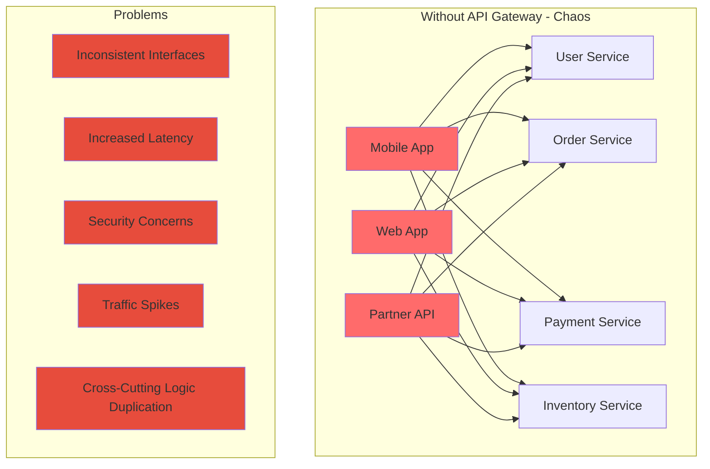
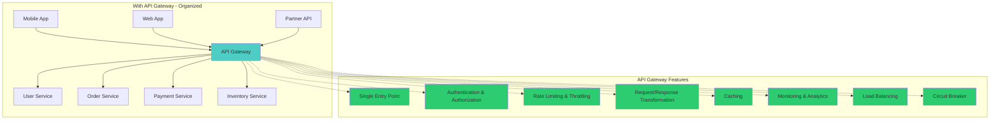
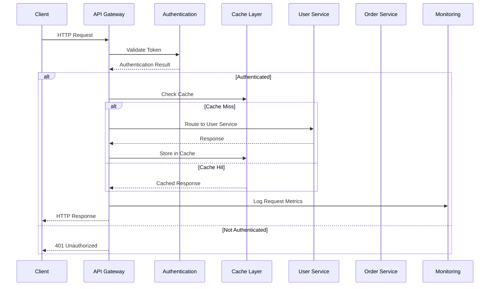
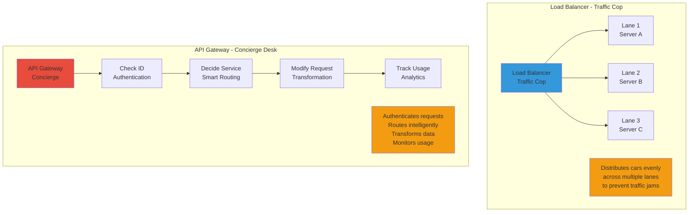

## 🎯 Introduction

In modern distributed systems with dozens or hundreds of microservices, managing API traffic becomes increasingly complex. AWS API Gateway emerges as a critical component that acts as a single entry point for all client requests, solving major challenges in microservices architecture. This comprehensive guide explores API Gateway fundamentals, compares it with load balancers, and provides production-ready Java implementations.

API Gateway transforms chaotic microservices communication into organized, secure, and scalable architecture patterns that are essential for enterprise-grade applications.

## 🤔 Why API Gateway?

### 📊 Microservices Challenges Without API Gateway



When you have dozens or hundreds of microservices, exposing each one directly to clients leads to several critical problems:

#### 🔴 **Core Problems:**

1. **Inconsistent Interfaces**: Each service may have different authentication methods, response formats, and error handling
2. **Increased Latency**: Multiple round trips between client and services
3. **Security Concerns**: Each service needs its own security implementation
4. **Traffic Spikes**: Individual services can be overwhelmed without proper traffic management
5. **Cross-Cutting Logic Duplication**: Authentication, logging, rate limiting implemented multiple times

### ✅ API Gateway Solution



An API Gateway acts as a **traffic cop** that directs and controls the flow of requests, solving microservices challenges by:

- **Single Entry Point**: Unified interface for all client interactions
- **Centralized Cross-Cutting Concerns**: Authentication, rate limiting, monitoring in one place
- **Smart Routing**: Path-based and method-based request routing
- **Performance Optimization**: Caching, response aggregation, connection pooling

## 🏗️ AWS API Gateway Architecture

### 🔧 How API Gateway Works



### 📋 Core API Gateway Functions

1. **Request Handling**: Clients send all API requests to the gateway
2. **Routing**: Gateway inspects requests and routes to appropriate backend services
3. **Cross-Cutting Features**: Handles authentication, rate limiting, caching, logging
4. **Response Aggregation**: Combines data from multiple services into single responses

## ⚖️ API Gateway vs Load Balancer: Detailed Comparison

### 📊 Comprehensive Comparison Table

| Feature | Load Balancer | API Gateway |
|---------|---------------|-------------|
| **Primary Role** | Distribute traffic across multiple backend servers | Manage and route API requests from clients to services |
| **OSI Layer** | Network/Transport Layer (L4) or Application Layer (L7) | Application Layer (L7 only) |
| **Core Function** | Balances traffic for availability and fault tolerance | Routes, authenticates, throttles, transforms API requests |
| **HTTP API Understanding** | Only L7 load balancers understand HTTP | Built specifically for HTTP APIs |
| **Smart Routing** | Basic (round-robin, IP hash, least connections) | Advanced (path-based `/users`, method-based `POST /auth`) |
| **Security Features** | SSL termination, basic IP filtering | Built-in auth, rate limiting, request validation, CORS |
| **Aggregation/Orchestration** | ❌ No | ✅ Can aggregate multiple services into one response |
| **Request Transformation** | ❌ Limited | ✅ Request/response transformation |
| **Caching** | ❌ Basic (some L7 balancers) | ✅ Built-in response caching |
| **API Management** | ❌ No | ✅ Versioning, documentation, SDK generation |
| **Monitoring & Analytics** | Basic health checks | Detailed API metrics, usage analytics |
| **Example Tools** | AWS ELB, NGINX, HAProxy, Envoy | AWS API Gateway, Kong, Apigee, Zuul |

### 🚗 Analogy Comparison



### 🎯 When to Use What

#### ✅ **Use Load Balancer When:**
- Simple traffic distribution across identical servers
- High-performance, low-latency requirements
- Handling non-HTTP protocols (TCP, UDP)
- Basic high availability and fault tolerance
- Cost-sensitive scenarios (simpler = cheaper)

#### ✅ **Use API Gateway When:**
- Managing multiple microservices
- Need centralized authentication/authorization
- Require request/response transformation
- API versioning and documentation needed
- Rate limiting and throttling required
- Response aggregation from multiple services
- Detailed API analytics and monitoring needed

#### ✅ **Use Both Together:**
Most enterprise architectures use **both** - API Gateway for API management and Load Balancer for traffic distribution behind the gateway.

## 🛠️ AWS API Gateway Implementation

### 1. Java SDK Integration

**Maven Dependencies:**

```xml
<dependencies>
    <!-- AWS SDK for API Gateway -->
    <dependency>
        <groupId>software.amazon.awssdk</groupId>
        <artifactId>apigateway</artifactId>
        <version>2.21.29</version>
    </dependency>

    <!-- AWS SDK for Lambda (for backend integration) -->
    <dependency>
        <groupId>software.amazon.awssdk</groupId>
        <artifactId>lambda</artifactId>
        <version>2.21.29</version>
    </dependency>

    <!-- Spring Boot for API development -->
    <dependency>
        <groupId>org.springframework.boot</groupId>
        <artifactId>spring-boot-starter-web</artifactId>
    </dependency>

    <!-- Spring Cloud AWS -->
    <dependency>
        <groupId>io.awspring.cloud</groupId>
        <artifactId>spring-cloud-starter-aws</artifactId>
        <version>2.4.4</version>
    </dependency>

    <!-- For API Gateway custom authorizers -->
    <dependency>
        <groupId>com.amazonaws</groupId>
        <artifactId>aws-lambda-java-events</artifactId>
        <version>3.11.0</version>
    </dependency>

    <!-- JSON processing -->
    <dependency>
        <groupId>com.fasterxml.jackson.core</groupId>
        <artifactId>jackson-databind</artifactId>
    </dependency>

    <!-- Validation -->
    <dependency>
        <groupId>org.springframework.boot</groupId>
        <artifactId>spring-boot-starter-validation</artifactId>
    </dependency>
</dependencies>
```

### 2. API Gateway Configuration Service

```java
@Service
@Slf4j
public class ApiGatewayService {

    private final ApiGatewayClient apiGatewayClient;
    private final String region;
    private final String accountId;

    public ApiGatewayService(@Value("${aws.region}") String region,
                           @Value("${aws.account-id}") String accountId) {
        this.region = region;
        this.accountId = accountId;
        this.apiGatewayClient = ApiGatewayClient.builder()
            .region(Region.of(region))
            .build();
    }

    public String createRestApi(String apiName, String description) {
        try {
            CreateRestApiRequest request = CreateRestApiRequest.builder()
                .name(apiName)
                .description(description)
                .endpointConfiguration(EndpointConfiguration.builder()
                    .types(EndpointType.REGIONAL)
                    .build())
                .policy(createApiPolicy())
                .build();

            CreateRestApiResponse response = apiGatewayClient.createRestApi(request);
            String restApiId = response.id();

            log.info("Created REST API: {} with ID: {}", apiName, restApiId);
            return restApiId;

        } catch (Exception e) {
            log.error("Failed to create REST API: {}", apiName, e);
            throw new RuntimeException("API creation failed", e);
        }
    }

    public String createResource(String restApiId, String parentId, String pathPart) {
        try {
            CreateResourceRequest request = CreateResourceRequest.builder()
                .restApiId(restApiId)
                .parentId(parentId)
                .pathPart(pathPart)
                .build();

            CreateResourceResponse response = apiGatewayClient.createResource(request);
            String resourceId = response.id();

            log.info("Created resource: {} under parent: {}", pathPart, parentId);
            return resourceId;

        } catch (Exception e) {
            log.error("Failed to create resource: {}", pathPart, e);
            throw new RuntimeException("Resource creation failed", e);
        }
    }

    public void createMethod(String restApiId, String resourceId, String httpMethod,
                           boolean requireAuth, String integrationUri) {
        try {
            // Create method
            PutMethodRequest methodRequest = PutMethodRequest.builder()
                .restApiId(restApiId)
                .resourceId(resourceId)
                .httpMethod(httpMethod)
                .authorizationType(requireAuth ? AuthorizationType.AWS_IAM : AuthorizationType.NONE)
                .requestParameters(Map.of(
                    "method.request.header.Content-Type", false,
                    "method.request.header.Authorization", requireAuth
                ))
                .build();

            apiGatewayClient.putMethod(methodRequest);

            // Create integration
            PutIntegrationRequest integrationRequest = PutIntegrationRequest.builder()
                .restApiId(restApiId)
                .resourceId(resourceId)
                .httpMethod(httpMethod)
                .type(IntegrationType.HTTP_PROXY)
                .integrationHttpMethod("POST")
                .uri(integrationUri)
                .requestParameters(Map.of(
                    "integration.request.header.Content-Type", "'application/json'"
                ))
                .build();

            apiGatewayClient.putIntegration(integrationRequest);

            // Create method response
            PutMethodResponseRequest methodResponseRequest = PutMethodResponseRequest.builder()
                .restApiId(restApiId)
                .resourceId(resourceId)
                .httpMethod(httpMethod)
                .statusCode("200")
                .responseModels(Map.of("application/json", "Empty"))
                .responseParameters(Map.of(
                    "method.response.header.Access-Control-Allow-Origin", false
                ))
                .build();

            apiGatewayClient.putMethodResponse(methodResponseRequest);

            // Create integration response
            PutIntegrationResponseRequest integrationResponseRequest = PutIntegrationResponseRequest.builder()
                .restApiId(restApiId)
                .resourceId(resourceId)
                .httpMethod(httpMethod)
                .statusCode("200")
                .responseParameters(Map.of(
                    "method.response.header.Access-Control-Allow-Origin", "'*'"
                ))
                .build();

            apiGatewayClient.putIntegrationResponse(integrationResponseRequest);

            log.info("Created method {} for resource {}", httpMethod, resourceId);

        } catch (Exception e) {
            log.error("Failed to create method: {} for resource: {}", httpMethod, resourceId, e);
            throw new RuntimeException("Method creation failed", e);
        }
    }

    public void deployApi(String restApiId, String stageName, String description) {
        try {
            CreateDeploymentRequest request = CreateDeploymentRequest.builder()
                .restApiId(restApiId)
                .stageName(stageName)
                .description(description)
                .build();

            CreateDeploymentResponse response = apiGatewayClient.createDeployment(request);

            String invokeUrl = String.format("https://%s.execute-api.%s.amazonaws.com/%s",
                restApiId, region, stageName);

            log.info("Deployed API to stage: {} with URL: {}", stageName, invokeUrl);

        } catch (Exception e) {
            log.error("Failed to deploy API: {}", restApiId, e);
            throw new RuntimeException("API deployment failed", e);
        }
    }

    public void createUsagePlan(String restApiId, String planName, String stageName,
                              int throttleRate, int throttleBurst, int quotaLimit) {
        try {
            CreateUsagePlanRequest request = CreateUsagePlanRequest.builder()
                .name(planName)
                .description("Usage plan for " + planName)
                .apiStages(ApiStage.builder()
                    .apiId(restApiId)
                    .stage(stageName)
                    .build())
                .throttle(ThrottleSettings.builder()
                    .rateLimit(throttleRate)
                    .burstLimit(throttleBurst)
                    .build())
                .quota(QuotaSettings.builder()
                    .limit(quotaLimit)
                    .period(QuotaPeriodType.DAY)
                    .build())
                .build();

            CreateUsagePlanResponse response = apiGatewayClient.createUsagePlan(request);

            log.info("Created usage plan: {} with ID: {}", planName, response.id());

        } catch (Exception e) {
            log.error("Failed to create usage plan: {}", planName, e);
            throw new RuntimeException("Usage plan creation failed", e);
        }
    }

    private String createApiPolicy() {
        return "{\n" +
               "  \"Version\": \"2012-10-17\",\n" +
               "  \"Statement\": [\n" +
               "    {\n" +
               "      \"Effect\": \"Allow\",\n" +
               "      \"Principal\": \"*\",\n" +
               "      \"Action\": \"execute-api:Invoke\",\n" +
               "      \"Resource\": \"*\"\n" +
               "    }\n" +
               "  ]\n" +
               "}";
    }

    public void cleanup(String restApiId) {
        try {
            DeleteRestApiRequest request = DeleteRestApiRequest.builder()
                .restApiId(restApiId)
                .build();

            apiGatewayClient.deleteRestApi(request);
            log.info("Deleted REST API: {}", restApiId);

        } catch (Exception e) {
            log.error("Failed to delete REST API: {}", restApiId, e);
        }
    }
}
```

### 3. Complete Microservices Setup with API Gateway

```java
@RestController
@RequestMapping("/api/gateway-demo")
@Slf4j
public class ApiGatewayDemoController {

    private final ApiGatewayService apiGatewayService;
    private final MicroserviceOrchestrator orchestrator;

    public ApiGatewayDemoController(ApiGatewayService apiGatewayService,
                                  MicroserviceOrchestrator orchestrator) {
        this.apiGatewayService = apiGatewayService;
        this.orchestrator = orchestrator;
    }

    @PostMapping("/setup-complete-api")
    public ResponseEntity<ApiSetupResponse> setupCompleteApi() {
        try {
            // 1. Create REST API
            String restApiId = apiGatewayService.createRestApi(
                "E-commerce-API",
                "Complete e-commerce microservices API"
            );

            // 2. Get root resource
            String rootResourceId = getRootResourceId(restApiId);

            // 3. Setup API resources and methods
            setupEcommerceApi(restApiId, rootResourceId);

            // 4. Deploy to stage
            apiGatewayService.deployApi(restApiId, "prod", "Production deployment");

            // 5. Create usage plans
            setupUsagePlans(restApiId);

            ApiSetupResponse response = new ApiSetupResponse(
                restApiId,
                String.format("https://%s.execute-api.%s.amazonaws.com/prod",
                    restApiId, "us-east-1"),
                "API Gateway setup completed successfully"
            );

            return ResponseEntity.ok(response);

        } catch (Exception e) {
            log.error("Failed to setup API Gateway", e);
            return ResponseEntity.status(HttpStatus.INTERNAL_SERVER_ERROR)
                .body(new ApiSetupResponse(null, null, "Setup failed: " + e.getMessage()));
        }
    }

    private void setupEcommerceApi(String restApiId, String rootResourceId) {
        // Users resource
        String usersResourceId = apiGatewayService.createResource(restApiId, rootResourceId, "users");
        apiGatewayService.createMethod(restApiId, usersResourceId, "GET", true,
            "http://user-service.internal:8080/users");
        apiGatewayService.createMethod(restApiId, usersResourceId, "POST", true,
            "http://user-service.internal:8080/users");

        // User by ID resource
        String userByIdResourceId = apiGatewayService.createResource(restApiId, usersResourceId, "{id}");
        apiGatewayService.createMethod(restApiId, userByIdResourceId, "GET", true,
            "http://user-service.internal:8080/users/{id}");
        apiGatewayService.createMethod(restApiId, userByIdResourceId, "PUT", true,
            "http://user-service.internal:8080/users/{id}");
        apiGatewayService.createMethod(restApiId, userByIdResourceId, "DELETE", true,
            "http://user-service.internal:8080/users/{id}");

        // Orders resource
        String ordersResourceId = apiGatewayService.createResource(restApiId, rootResourceId, "orders");
        apiGatewayService.createMethod(restApiId, ordersResourceId, "GET", true,
            "http://order-service.internal:8080/orders");
        apiGatewayService.createMethod(restApiId, ordersResourceId, "POST", true,
            "http://order-service.internal:8080/orders");

        // Products resource
        String productsResourceId = apiGatewayService.createResource(restApiId, rootResourceId, "products");
        apiGatewayService.createMethod(restApiId, productsResourceId, "GET", false,
            "http://product-service.internal:8080/products");

        // Payments resource
        String paymentsResourceId = apiGatewayService.createResource(restApiId, rootResourceId, "payments");
        apiGatewayService.createMethod(restApiId, paymentsResourceId, "POST", true,
            "http://payment-service.internal:8080/payments");

        log.info("E-commerce API resources setup completed");
    }

    private void setupUsagePlans(String restApiId) {
        // Basic plan
        apiGatewayService.createUsagePlan(restApiId, "BasicPlan", "prod",
            100, 200, 10000); // 100 req/sec, burst 200, 10k daily quota

        // Premium plan
        apiGatewayService.createUsagePlan(restApiId, "PremiumPlan", "prod",
            1000, 2000, 100000); // 1000 req/sec, burst 2000, 100k daily quota

        log.info("Usage plans setup completed");
    }

    private String getRootResourceId(String restApiId) {
        try {
            GetResourcesRequest request = GetResourcesRequest.builder()
                .restApiId(restApiId)
                .build();

            GetResourcesResponse response = apiGatewayService.apiGatewayClient.getResources(request);

            return response.items().stream()
                .filter(resource -> "/".equals(resource.path()))
                .findFirst()
                .map(Resource::id)
                .orElseThrow(() -> new RuntimeException("Root resource not found"));

        } catch (Exception e) {
            throw new RuntimeException("Failed to get root resource", e);
        }
    }

    // Supporting classes
    public static class ApiSetupResponse {
        private final String restApiId;
        private final String invokeUrl;
        private final String message;

        public ApiSetupResponse(String restApiId, String invokeUrl, String message) {
            this.restApiId = restApiId;
            this.invokeUrl = invokeUrl;
            this.message = message;
        }

        // Getters
        public String getRestApiId() { return restApiId; }
        public String getInvokeUrl() { return invokeUrl; }
        public String getMessage() { return message; }
    }
}
```

### 4. Custom Authorizer Implementation

```java
@Component
public class ApiGatewayCustomAuthorizer implements RequestHandler<APIGatewayProxyRequestEvent, APIGatewayCustomAuthorizerResponse> {

    private final JWTVerifier jwtVerifier;
    private final UserService userService;

    public ApiGatewayCustomAuthorizer() {
        // Initialize JWT verifier
        Algorithm algorithm = Algorithm.HMAC256(System.getenv("JWT_SECRET"));
        this.jwtVerifier = JWT.require(algorithm)
            .withIssuer("your-app")
            .build();
        this.userService = new UserService();
    }

    @Override
    public APIGatewayCustomAuthorizerResponse handleRequest(APIGatewayProxyRequestEvent input, Context context) {
        try {
            String token = extractToken(input);

            if (token == null) {
                return createResponse("Deny", null, input.getRequestContext().getRequestId());
            }

            // Verify JWT token
            DecodedJWT decodedJWT = jwtVerifier.verify(token);
            String userId = decodedJWT.getSubject();

            // Additional user validation
            if (!userService.isUserActive(userId)) {
                return createResponse("Deny", userId, input.getRequestContext().getRequestId());
            }

            // Create policy with user context
            return createResponse("Allow", userId, input.getRequestContext().getRequestId());

        } catch (JWTVerificationException e) {
            context.getLogger().log("JWT verification failed: " + e.getMessage());
            return createResponse("Deny", null, input.getRequestContext().getRequestId());
        } catch (Exception e) {
            context.getLogger().log("Authorization error: " + e.getMessage());
            return createResponse("Deny", null, input.getRequestContext().getRequestId());
        }
    }

    private String extractToken(APIGatewayProxyRequestEvent input) {
        String authHeader = input.getHeaders().get("Authorization");
        if (authHeader != null && authHeader.startsWith("Bearer ")) {
            return authHeader.substring(7);
        }

        // Try query parameter
        if (input.getQueryStringParameters() != null) {
            return input.getQueryStringParameters().get("token");
        }

        return null;
    }

    private APIGatewayCustomAuthorizerResponse createResponse(String effect, String userId, String requestId) {
        APIGatewayCustomAuthorizerResponse response = new APIGatewayCustomAuthorizerResponse();

        // Set principal ID
        response.setPrincipalId(userId != null ? userId : "anonymous");

        // Create policy document
        PolicyDocument policyDocument = new PolicyDocument();
        policyDocument.setVersion("2012-10-17");

        Statement statement = new Statement();
        statement.setEffect(effect);
        statement.setAction("execute-api:Invoke");
        statement.setResource("*"); // In production, be more specific

        policyDocument.setStatement(Arrays.asList(statement));
        response.setPolicyDocument(policyDocument);

        // Add context information
        Map<String, Object> context = new HashMap<>();
        context.put("userId", userId);
        context.put("requestId", requestId);
        context.put("authorizedAt", System.currentTimeMillis());
        response.setContext(context);

        return response;
    }

    // Supporting classes for policy document
    public static class PolicyDocument {
        private String version;
        private List<Statement> statement;

        // Getters and setters
        public String getVersion() { return version; }
        public void setVersion(String version) { this.version = version; }
        public List<Statement> getStatement() { return statement; }
        public void setStatement(List<Statement> statement) { this.statement = statement; }
    }

    public static class Statement {
        private String effect;
        private String action;
        private String resource;

        // Getters and setters
        public String getEffect() { return effect; }
        public void setEffect(String effect) { this.effect = effect; }
        public String getAction() { return action; }
        public void setAction(String action) { this.action = action; }
        public String getResource() { return resource; }
        public void setResource(String resource) { this.resource = resource; }
    }

    // Mock user service
    private static class UserService {
        public boolean isUserActive(String userId) {
            // In real implementation, check database
            return userId != null && !userId.isEmpty();
        }
    }
}
```

### 5. Response Aggregation Service

```java
@Service
@Slf4j
public class ResponseAggregationService {

    private final RestTemplate restTemplate;
    private final RedisTemplate<String, Object> redisTemplate;
    private final MeterRegistry meterRegistry;

    public ResponseAggregationService(RestTemplate restTemplate,
                                    RedisTemplate<String, Object> redisTemplate,
                                    MeterRegistry meterRegistry) {
        this.restTemplate = restTemplate;
        this.redisTemplate = redisTemplate;
        this.meterRegistry = meterRegistry;
    }

    // Aggregate user profile with orders and preferences
    @Async
    public CompletableFuture<UserProfileAggregate> getUserProfileAggregate(String userId) {
        Timer.Sample sample = Timer.start(meterRegistry);

        try {
            // Check cache first
            String cacheKey = "user_profile_aggregate:" + userId;
            UserProfileAggregate cached = (UserProfileAggregate) redisTemplate.opsForValue().get(cacheKey);

            if (cached != null) {
                meterRegistry.counter("api_gateway.aggregation.cache_hit").increment();
                return CompletableFuture.completedFuture(cached);
            }

            // Parallel calls to multiple services
            CompletableFuture<UserProfile> userProfileFuture = CompletableFuture.supplyAsync(() ->
                fetchUserProfile(userId));

            CompletableFuture<List<Order>> ordersFuture = CompletableFuture.supplyAsync(() ->
                fetchUserOrders(userId));

            CompletableFuture<UserPreferences> preferencesFuture = CompletableFuture.supplyAsync(() ->
                fetchUserPreferences(userId));

            CompletableFuture<List<Recommendation>> recommendationsFuture = CompletableFuture.supplyAsync(() ->
                fetchRecommendations(userId));

            // Wait for all calls to complete
            CompletableFuture<Void> allOf = CompletableFuture.allOf(
                userProfileFuture, ordersFuture, preferencesFuture, recommendationsFuture);

            return allOf.thenApply(v -> {
                UserProfileAggregate aggregate = new UserProfileAggregate();
                aggregate.setUserProfile(userProfileFuture.join());
                aggregate.setRecentOrders(ordersFuture.join());
                aggregate.setPreferences(preferencesFuture.join());
                aggregate.setRecommendations(recommendationsFuture.join());
                aggregate.setAggregatedAt(Instant.now());

                // Cache for 5 minutes
                redisTemplate.opsForValue().set(cacheKey, aggregate, Duration.ofMinutes(5));
                meterRegistry.counter("api_gateway.aggregation.cache_miss").increment();

                return aggregate;
            });

        } finally {
            sample.stop(Timer.builder("api_gateway.aggregation.duration")
                .tag("operation", "user_profile")
                .register(meterRegistry));
        }
    }

    // Aggregate product details with reviews and inventory
    @Async
    public CompletableFuture<ProductAggregate> getProductAggregate(String productId) {
        Timer.Sample sample = Timer.start(meterRegistry);

        try {
            String cacheKey = "product_aggregate:" + productId;
            ProductAggregate cached = (ProductAggregate) redisTemplate.opsForValue().get(cacheKey);

            if (cached != null) {
                return CompletableFuture.completedFuture(cached);
            }

            // Parallel calls
            CompletableFuture<Product> productFuture = CompletableFuture.supplyAsync(() ->
                fetchProduct(productId));

            CompletableFuture<List<Review>> reviewsFuture = CompletableFuture.supplyAsync(() ->
                fetchProductReviews(productId));

            CompletableFuture<InventoryStatus> inventoryFuture = CompletableFuture.supplyAsync(() ->
                fetchInventoryStatus(productId));

            CompletableFuture<PriceInfo> priceFuture = CompletableFuture.supplyAsync(() ->
                fetchPriceInfo(productId));

            return CompletableFuture.allOf(productFuture, reviewsFuture, inventoryFuture, priceFuture)
                .thenApply(v -> {
                    ProductAggregate aggregate = new ProductAggregate();
                    aggregate.setProduct(productFuture.join());
                    aggregate.setReviews(reviewsFuture.join());
                    aggregate.setInventoryStatus(inventoryFuture.join());
                    aggregate.setPriceInfo(priceFuture.join());
                    aggregate.setAggregatedAt(Instant.now());

                    // Cache for 10 minutes
                    redisTemplate.opsForValue().set(cacheKey, aggregate, Duration.ofMinutes(10));

                    return aggregate;
                });

        } finally {
            sample.stop(Timer.builder("api_gateway.aggregation.duration")
                .tag("operation", "product")
                .register(meterRegistry));
        }
    }

    // Service calls with circuit breaker pattern
    @CircuitBreaker(name = "user-service", fallbackMethod = "fallbackUserProfile")
    @TimeLimiter(name = "user-service")
    @Retry(name = "user-service")
    private UserProfile fetchUserProfile(String userId) {
        try {
            ResponseEntity<UserProfile> response = restTemplate.getForEntity(
                "http://user-service/users/" + userId, UserProfile.class);

            meterRegistry.counter("api_gateway.service_calls", "service", "user", "status", "success").increment();
            return response.getBody();

        } catch (Exception e) {
            meterRegistry.counter("api_gateway.service_calls", "service", "user", "status", "error").increment();
            throw e;
        }
    }

    @CircuitBreaker(name = "order-service", fallbackMethod = "fallbackUserOrders")
    private List<Order> fetchUserOrders(String userId) {
        try {
            ResponseEntity<Order[]> response = restTemplate.getForEntity(
                "http://order-service/orders?userId=" + userId, Order[].class);

            meterRegistry.counter("api_gateway.service_calls", "service", "order", "status", "success").increment();
            return Arrays.asList(response.getBody());

        } catch (Exception e) {
            meterRegistry.counter("api_gateway.service_calls", "service", "order", "status", "error").increment();
            throw e;
        }
    }

    @CircuitBreaker(name = "preference-service", fallbackMethod = "fallbackUserPreferences")
    private UserPreferences fetchUserPreferences(String userId) {
        try {
            ResponseEntity<UserPreferences> response = restTemplate.getForEntity(
                "http://preference-service/preferences/" + userId, UserPreferences.class);

            meterRegistry.counter("api_gateway.service_calls", "service", "preference", "status", "success").increment();
            return response.getBody();

        } catch (Exception e) {
            meterRegistry.counter("api_gateway.service_calls", "service", "preference", "status", "error").increment();
            throw e;
        }
    }

    @CircuitBreaker(name = "recommendation-service", fallbackMethod = "fallbackRecommendations")
    private List<Recommendation> fetchRecommendations(String userId) {
        try {
            ResponseEntity<Recommendation[]> response = restTemplate.getForEntity(
                "http://recommendation-service/recommendations/" + userId, Recommendation[].class);

            meterRegistry.counter("api_gateway.service_calls", "service", "recommendation", "status", "success").increment();
            return Arrays.asList(response.getBody());

        } catch (Exception e) {
            meterRegistry.counter("api_gateway.service_calls", "service", "recommendation", "status", "error").increment();
            throw e;
        }
    }

    @CircuitBreaker(name = "product-service", fallbackMethod = "fallbackProduct")
    private Product fetchProduct(String productId) {
        try {
            ResponseEntity<Product> response = restTemplate.getForEntity(
                "http://product-service/products/" + productId, Product.class);
            return response.getBody();
        } catch (Exception e) {
            throw e;
        }
    }

    private List<Review> fetchProductReviews(String productId) {
        try {
            ResponseEntity<Review[]> response = restTemplate.getForEntity(
                "http://review-service/reviews?productId=" + productId, Review[].class);
            return Arrays.asList(response.getBody());
        } catch (Exception e) {
            return Collections.emptyList(); // Fail gracefully for reviews
        }
    }

    private InventoryStatus fetchInventoryStatus(String productId) {
        try {
            ResponseEntity<InventoryStatus> response = restTemplate.getForEntity(
                "http://inventory-service/inventory/" + productId, InventoryStatus.class);
            return response.getBody();
        } catch (Exception e) {
            return new InventoryStatus(productId, 0, false); // Default fallback
        }
    }

    private PriceInfo fetchPriceInfo(String productId) {
        try {
            ResponseEntity<PriceInfo> response = restTemplate.getForEntity(
                "http://pricing-service/prices/" + productId, PriceInfo.class);
            return response.getBody();
        } catch (Exception e) {
            return new PriceInfo(productId, BigDecimal.ZERO, null); // Default fallback
        }
    }

    // Fallback methods
    private UserProfile fallbackUserProfile(String userId, Exception e) {
        log.warn("Fallback for user profile: {}", userId, e);
        return new UserProfile(userId, "Unknown User", "user@example.com", false);
    }

    private List<Order> fallbackUserOrders(String userId, Exception e) {
        log.warn("Fallback for user orders: {}", userId, e);
        return Collections.emptyList();
    }

    private UserPreferences fallbackUserPreferences(String userId, Exception e) {
        log.warn("Fallback for user preferences: {}", userId, e);
        return new UserPreferences(userId, Collections.emptyMap());
    }

    private List<Recommendation> fallbackRecommendations(String userId, Exception e) {
        log.warn("Fallback for recommendations: {}", userId, e);
        return Collections.emptyList();
    }

    private Product fallbackProduct(String productId, Exception e) {
        log.warn("Fallback for product: {}", productId, e);
        return new Product(productId, "Product Unavailable", "Product temporarily unavailable",
            BigDecimal.ZERO, false);
    }

    // Aggregate response classes
    public static class UserProfileAggregate {
        private UserProfile userProfile;
        private List<Order> recentOrders;
        private UserPreferences preferences;
        private List<Recommendation> recommendations;
        private Instant aggregatedAt;

        // Constructors, getters, setters
        public UserProfileAggregate() {}

        public UserProfile getUserProfile() { return userProfile; }
        public void setUserProfile(UserProfile userProfile) { this.userProfile = userProfile; }
        public List<Order> getRecentOrders() { return recentOrders; }
        public void setRecentOrders(List<Order> recentOrders) { this.recentOrders = recentOrders; }
        public UserPreferences getPreferences() { return preferences; }
        public void setPreferences(UserPreferences preferences) { this.preferences = preferences; }
        public List<Recommendation> getRecommendations() { return recommendations; }
        public void setRecommendations(List<Recommendation> recommendations) { this.recommendations = recommendations; }
        public Instant getAggregatedAt() { return aggregatedAt; }
        public void setAggregatedAt(Instant aggregatedAt) { this.aggregatedAt = aggregatedAt; }
    }

    public static class ProductAggregate {
        private Product product;
        private List<Review> reviews;
        private InventoryStatus inventoryStatus;
        private PriceInfo priceInfo;
        private Instant aggregatedAt;

        // Constructors, getters, setters
        public ProductAggregate() {}

        public Product getProduct() { return product; }
        public void setProduct(Product product) { this.product = product; }
        public List<Review> getReviews() { return reviews; }
        public void setReviews(List<Review> reviews) { this.reviews = reviews; }
        public InventoryStatus getInventoryStatus() { return inventoryStatus; }
        public void setInventoryStatus(InventoryStatus inventoryStatus) { this.inventoryStatus = inventoryStatus; }
        public PriceInfo getPriceInfo() { return priceInfo; }
        public void setPriceInfo(PriceInfo priceInfo) { this.priceInfo = priceInfo; }
        public Instant getAggregatedAt() { return aggregatedAt; }
        public void setAggregatedAt(Instant aggregatedAt) { this.aggregatedAt = aggregatedAt; }
    }

    // Supporting data classes
    public static class UserProfile {
        private String userId;
        private String name;
        private String email;
        private boolean isPremium;

        public UserProfile() {}
        public UserProfile(String userId, String name, String email, boolean isPremium) {
            this.userId = userId;
            this.name = name;
            this.email = email;
            this.isPremium = isPremium;
        }

        // Getters and setters
        public String getUserId() { return userId; }
        public void setUserId(String userId) { this.userId = userId; }
        public String getName() { return name; }
        public void setName(String name) { this.name = name; }
        public String getEmail() { return email; }
        public void setEmail(String email) { this.email = email; }
        public boolean isPremium() { return isPremium; }
        public void setPremium(boolean premium) { isPremium = premium; }
    }

    public static class Order {
        private String orderId;
        private String status;
        private BigDecimal total;
        private Instant createdAt;

        // Constructors, getters, setters
        public Order() {}
        public String getOrderId() { return orderId; }
        public void setOrderId(String orderId) { this.orderId = orderId; }
        public String getStatus() { return status; }
        public void setStatus(String status) { this.status = status; }
        public BigDecimal getTotal() { return total; }
        public void setTotal(BigDecimal total) { this.total = total; }
        public Instant getCreatedAt() { return createdAt; }
        public void setCreatedAt(Instant createdAt) { this.createdAt = createdAt; }
    }

    public static class UserPreferences {
        private String userId;
        private Map<String, Object> preferences;

        public UserPreferences() { this.preferences = new HashMap<>(); }
        public UserPreferences(String userId, Map<String, Object> preferences) {
            this.userId = userId;
            this.preferences = preferences;
        }

        // Getters and setters
        public String getUserId() { return userId; }
        public void setUserId(String userId) { this.userId = userId; }
        public Map<String, Object> getPreferences() { return preferences; }
        public void setPreferences(Map<String, Object> preferences) { this.preferences = preferences; }
    }

    public static class Recommendation {
        private String productId;
        private String title;
        private double score;

        // Constructors, getters, setters
        public Recommendation() {}
        public String getProductId() { return productId; }
        public void setProductId(String productId) { this.productId = productId; }
        public String getTitle() { return title; }
        public void setTitle(String title) { this.title = title; }
        public double getScore() { return score; }
        public void setScore(double score) { this.score = score; }
    }

    public static class Product {
        private String productId;
        private String name;
        private String description;
        private BigDecimal price;
        private boolean available;

        public Product() {}
        public Product(String productId, String name, String description, BigDecimal price, boolean available) {
            this.productId = productId;
            this.name = name;
            this.description = description;
            this.price = price;
            this.available = available;
        }

        // Getters and setters
        public String getProductId() { return productId; }
        public void setProductId(String productId) { this.productId = productId; }
        public String getName() { return name; }
        public void setName(String name) { this.name = name; }
        public String getDescription() { return description; }
        public void setDescription(String description) { this.description = description; }
        public BigDecimal getPrice() { return price; }
        public void setPrice(BigDecimal price) { this.price = price; }
        public boolean isAvailable() { return available; }
        public void setAvailable(boolean available) { this.available = available; }
    }

    public static class Review {
        private String reviewId;
        private String productId;
        private int rating;
        private String comment;

        // Constructors, getters, setters
        public Review() {}
        public String getReviewId() { return reviewId; }
        public void setReviewId(String reviewId) { this.reviewId = reviewId; }
        public String getProductId() { return productId; }
        public void setProductId(String productId) { this.productId = productId; }
        public int getRating() { return rating; }
        public void setRating(int rating) { this.rating = rating; }
        public String getComment() { return comment; }
        public void setComment(String comment) { this.comment = comment; }
    }

    public static class InventoryStatus {
        private String productId;
        private int quantity;
        private boolean inStock;

        public InventoryStatus() {}
        public InventoryStatus(String productId, int quantity, boolean inStock) {
            this.productId = productId;
            this.quantity = quantity;
            this.inStock = inStock;
        }

        // Getters and setters
        public String getProductId() { return productId; }
        public void setProductId(String productId) { this.productId = productId; }
        public int getQuantity() { return quantity; }
        public void setQuantity(int quantity) { this.quantity = quantity; }
        public boolean isInStock() { return inStock; }
        public void setInStock(boolean inStock) { this.inStock = inStock; }
    }

    public static class PriceInfo {
        private String productId;
        private BigDecimal currentPrice;
        private BigDecimal discountPrice;

        public PriceInfo() {}
        public PriceInfo(String productId, BigDecimal currentPrice, BigDecimal discountPrice) {
            this.productId = productId;
            this.currentPrice = currentPrice;
            this.discountPrice = discountPrice;
        }

        // Getters and setters
        public String getProductId() { return productId; }
        public void setProductId(String productId) { this.productId = productId; }
        public BigDecimal getCurrentPrice() { return currentPrice; }
        public void setCurrentPrice(BigDecimal currentPrice) { this.currentPrice = currentPrice; }
        public BigDecimal getDiscountPrice() { return discountPrice; }
        public void setDiscountPrice(BigDecimal discountPrice) { this.discountPrice = discountPrice; }
    }
}
```

## 📊 Monitoring and Analytics

### 1. API Gateway Metrics Service

```java
@Service
@Slf4j
public class ApiGatewayMetricsService {

    private final CloudWatchClient cloudWatchClient;
    private final MeterRegistry meterRegistry;

    public ApiGatewayMetricsService(MeterRegistry meterRegistry) {
        this.meterRegistry = meterRegistry;
        this.cloudWatchClient = CloudWatchClient.builder().build();
    }

    @Scheduled(fixedRate = 60000) // Every minute
    public void collectApiGatewayMetrics() {
        try {
            // Get API Gateway metrics from CloudWatch
            collectLatencyMetrics();
            collectErrorMetrics();
            collectThrottleMetrics();
            collectCacheMetrics();

        } catch (Exception e) {
            log.error("Failed to collect API Gateway metrics", e);
        }
    }

    private void collectLatencyMetrics() {
        GetMetricStatisticsRequest request = GetMetricStatisticsRequest.builder()
            .namespace("AWS/ApiGateway")
            .metricName("Latency")
            .startTime(Instant.now().minus(Duration.ofMinutes(5)))
            .endTime(Instant.now())
            .period(300) // 5 minutes
            .statistics(Statistic.AVERAGE, Statistic.MAXIMUM)
            .build();

        GetMetricStatisticsResponse response = cloudWatchClient.getMetricStatistics(request);

        response.datapoints().forEach(datapoint -> {
            if (datapoint.average() != null) {
                Gauge.builder("api_gateway.latency.average")
                    .description("API Gateway average latency")
                    .register(meterRegistry, () -> datapoint.average());
            }

            if (datapoint.maximum() != null) {
                Gauge.builder("api_gateway.latency.max")
                    .description("API Gateway maximum latency")
                    .register(meterRegistry, () -> datapoint.maximum());
            }
        });
    }

    private void collectErrorMetrics() {
        // 4XX Errors
        GetMetricStatisticsRequest request4xx = GetMetricStatisticsRequest.builder()
            .namespace("AWS/ApiGateway")
            .metricName("4XXError")
            .startTime(Instant.now().minus(Duration.ofMinutes(5)))
            .endTime(Instant.now())
            .period(300)
            .statistics(Statistic.SUM)
            .build();

        GetMetricStatisticsResponse response4xx = cloudWatchClient.getMetricStatistics(request4xx);
        response4xx.datapoints().forEach(datapoint -> {
            if (datapoint.sum() != null) {
                meterRegistry.counter("api_gateway.errors.4xx").increment(datapoint.sum());
            }
        });

        // 5XX Errors
        GetMetricStatisticsRequest request5xx = GetMetricStatisticsRequest.builder()
            .namespace("AWS/ApiGateway")
            .metricName("5XXError")
            .startTime(Instant.now().minus(Duration.ofMinutes(5)))
            .endTime(Instant.now())
            .period(300)
            .statistics(Statistic.SUM)
            .build();

        GetMetricStatisticsResponse response5xx = cloudWatchClient.getMetricStatistics(request5xx);
        response5xx.datapoints().forEach(datapoint -> {
            if (datapoint.sum() != null) {
                meterRegistry.counter("api_gateway.errors.5xx").increment(datapoint.sum());
            }
        });
    }

    private void collectThrottleMetrics() {
        GetMetricStatisticsRequest request = GetMetricStatisticsRequest.builder()
            .namespace("AWS/ApiGateway")
            .metricName("Throttles")
            .startTime(Instant.now().minus(Duration.ofMinutes(5)))
            .endTime(Instant.now())
            .period(300)
            .statistics(Statistic.SUM)
            .build();

        GetMetricStatisticsResponse response = cloudWatchClient.getMetricStatistics(request);
        response.datapoints().forEach(datapoint -> {
            if (datapoint.sum() != null) {
                meterRegistry.counter("api_gateway.throttles").increment(datapoint.sum());
            }
        });
    }

    private void collectCacheMetrics() {
        // Cache Hit Count
        GetMetricStatisticsRequest hitRequest = GetMetricStatisticsRequest.builder()
            .namespace("AWS/ApiGateway")
            .metricName("CacheHitCount")
            .startTime(Instant.now().minus(Duration.ofMinutes(5)))
            .endTime(Instant.now())
            .period(300)
            .statistics(Statistic.SUM)
            .build();

        GetMetricStatisticsResponse hitResponse = cloudWatchClient.getMetricStatistics(hitRequest);
        hitResponse.datapoints().forEach(datapoint -> {
            if (datapoint.sum() != null) {
                meterRegistry.counter("api_gateway.cache.hits").increment(datapoint.sum());
            }
        });

        // Cache Miss Count
        GetMetricStatisticsRequest missRequest = GetMetricStatisticsRequest.builder()
            .namespace("AWS/ApiGateway")
            .metricName("CacheMissCount")
            .startTime(Instant.now().minus(Duration.ofMinutes(5)))
            .endTime(Instant.now())
            .period(300)
            .statistics(Statistic.SUM)
            .build();

        GetMetricStatisticsResponse missResponse = cloudWatchClient.getMetricStatistics(missRequest);
        missResponse.datapoints().forEach(datapoint -> {
            if (datapoint.sum() != null) {
                meterRegistry.counter("api_gateway.cache.misses").increment(datapoint.sum());
            }
        });
    }

    public ApiGatewayHealthSummary getHealthSummary() {
        try {
            double avgLatency = getAverageLatency();
            long errorRate4xx = getErrorRate4xx();
            long errorRate5xx = getErrorRate5xx();
            double cacheHitRatio = getCacheHitRatio();
            long throttleCount = getThrottleCount();

            return new ApiGatewayHealthSummary(
                avgLatency < 1000, // Healthy if under 1 second
                avgLatency,
                errorRate4xx,
                errorRate5xx,
                cacheHitRatio,
                throttleCount,
                Instant.now()
            );

        } catch (Exception e) {
            log.error("Failed to get health summary", e);
            return new ApiGatewayHealthSummary(false, 0, 0, 0, 0, 0, Instant.now());
        }
    }

    private double getAverageLatency() {
        return meterRegistry.find("api_gateway.latency.average")
            .gauge()
            .map(Gauge::value)
            .orElse(0.0);
    }

    private long getErrorRate4xx() {
        return (long) meterRegistry.find("api_gateway.errors.4xx")
            .counter()
            .map(Counter::count)
            .orElse(0.0);
    }

    private long getErrorRate5xx() {
        return (long) meterRegistry.find("api_gateway.errors.5xx")
            .counter()
            .map(Counter::count)
            .orElse(0.0);
    }

    private double getCacheHitRatio() {
        double hits = meterRegistry.find("api_gateway.cache.hits")
            .counter()
            .map(Counter::count)
            .orElse(0.0);

        double misses = meterRegistry.find("api_gateway.cache.misses")
            .counter()
            .map(Counter::count)
            .orElse(0.0);

        return hits + misses > 0 ? hits / (hits + misses) : 0.0;
    }

    private long getThrottleCount() {
        return (long) meterRegistry.find("api_gateway.throttles")
            .counter()
            .map(Counter::count)
            .orElse(0.0);
    }

    public static class ApiGatewayHealthSummary {
        private final boolean healthy;
        private final double averageLatency;
        private final long error4xxCount;
        private final long error5xxCount;
        private final double cacheHitRatio;
        private final long throttleCount;
        private final Instant timestamp;

        public ApiGatewayHealthSummary(boolean healthy, double averageLatency, long error4xxCount,
                                     long error5xxCount, double cacheHitRatio, long throttleCount,
                                     Instant timestamp) {
            this.healthy = healthy;
            this.averageLatency = averageLatency;
            this.error4xxCount = error4xxCount;
            this.error5xxCount = error5xxCount;
            this.cacheHitRatio = cacheHitRatio;
            this.throttleCount = throttleCount;
            this.timestamp = timestamp;
        }

        // Getters
        public boolean isHealthy() { return healthy; }
        public double getAverageLatency() { return averageLatency; }
        public long getError4xxCount() { return error4xxCount; }
        public long getError5xxCount() { return error5xxCount; }
        public double getCacheHitRatio() { return cacheHitRatio; }
        public long getThrottleCount() { return throttleCount; }
        public Instant getTimestamp() { return timestamp; }

        @Override
        public String toString() {
            return String.format(
                "ApiGatewayHealth{healthy=%s, latency=%.2fms, 4xx=%d, 5xx=%d, cache=%.2f%%, throttles=%d}",
                healthy, averageLatency, error4xxCount, error5xxCount, cacheHitRatio * 100, throttleCount
            );
        }
    }
}
```

## 🔐 Security Best Practices

### 1. API Security Configuration

```yaml
# application.yml - API Gateway Security Configuration
aws:
  apigateway:
    security:
      # API Keys
      api-keys:
        enabled: true
        required-for-anonymous: true

      # Request validation
      request-validation:
        enabled: true
        validate-request-body: true
        validate-request-parameters: true

      # Rate limiting
      rate-limiting:
        requests-per-second: 100
        burst-capacity: 200

      # CORS
      cors:
        enabled: true
        allowed-origins:
          - "https://yourdomain.com"
          - "https://app.yourdomain.com"
        allowed-methods:
          - GET
          - POST
          - PUT
          - DELETE
        allowed-headers:
          - "Content-Type"
          - "Authorization"
          - "X-API-Key"
        max-age: 3600

      # SSL/TLS
      ssl:
        certificate-arn: "arn:aws:acm:region:account:certificate/certificate-id"
        minimum-tls-version: "TLS_1_2"

      # WAF Integration
      waf:
        enabled: true
        web-acl-arn: "arn:aws:wafv2:region:account:regional/webacl/name/id"

# Monitoring
management:
  endpoints:
    web:
      exposure:
        include: health,metrics,info,apigateway
  endpoint:
    health:
      show-details: always
```

### 2. Security Interceptor

```java
@Component
@Order(1)
public class ApiGatewaySecurityInterceptor implements HandlerInterceptor {

    private final ApiKeyValidator apiKeyValidator;
    private final RateLimitService rateLimitService;
    private final MeterRegistry meterRegistry;

    public ApiGatewaySecurityInterceptor(ApiKeyValidator apiKeyValidator,
                                       RateLimitService rateLimitService,
                                       MeterRegistry meterRegistry) {
        this.apiKeyValidator = apiKeyValidator;
        this.rateLimitService = rateLimitService;
        this.meterRegistry = meterRegistry;
    }

    @Override
    public boolean preHandle(HttpServletRequest request, HttpServletResponse response, Object handler) throws Exception {
        String requestId = generateRequestId();
        request.setAttribute("requestId", requestId);

        try {
            // 1. API Key validation
            if (!validateApiKey(request)) {
                meterRegistry.counter("api_gateway.security.api_key_invalid").increment();
                sendSecurityError(response, HttpStatus.UNAUTHORIZED, "Invalid API Key", requestId);
                return false;
            }

            // 2. Rate limiting
            if (!checkRateLimit(request)) {
                meterRegistry.counter("api_gateway.security.rate_limited").increment();
                sendSecurityError(response, HttpStatus.TOO_MANY_REQUESTS, "Rate limit exceeded", requestId);
                return false;
            }

            // 3. Request size validation
            if (!validateRequestSize(request)) {
                meterRegistry.counter("api_gateway.security.request_too_large").increment();
                sendSecurityError(response, HttpStatus.PAYLOAD_TOO_LARGE, "Request too large", requestId);
                return false;
            }

            // 4. Content type validation
            if (!validateContentType(request)) {
                meterRegistry.counter("api_gateway.security.invalid_content_type").increment();
                sendSecurityError(response, HttpStatus.UNSUPPORTED_MEDIA_TYPE, "Invalid content type", requestId);
                return false;
            }

            meterRegistry.counter("api_gateway.security.passed").increment();
            return true;

        } catch (Exception e) {
            log.error("Security validation error for request: {}", requestId, e);
            meterRegistry.counter("api_gateway.security.error").increment();
            sendSecurityError(response, HttpStatus.INTERNAL_SERVER_ERROR, "Security validation failed", requestId);
            return false;
        }
    }

    private boolean validateApiKey(HttpServletRequest request) {
        String apiKey = request.getHeader("X-API-Key");
        if (apiKey == null) {
            apiKey = request.getParameter("api_key");
        }

        return apiKeyValidator.isValidApiKey(apiKey);
    }

    private boolean checkRateLimit(HttpServletRequest request) {
        String clientId = extractClientId(request);
        String endpoint = request.getRequestURI();

        return rateLimitService.isAllowed(clientId, endpoint);
    }

    private boolean validateRequestSize(HttpServletRequest request) {
        long maxSize = 10 * 1024 * 1024; // 10MB
        return request.getContentLength() <= maxSize;
    }

    private boolean validateContentType(HttpServletRequest request) {
        if ("POST".equals(request.getMethod()) || "PUT".equals(request.getMethod())) {
            String contentType = request.getContentType();
            return contentType != null &&
                   (contentType.startsWith("application/json") ||
                    contentType.startsWith("application/x-www-form-urlencoded"));
        }
        return true;
    }

    private String extractClientId(HttpServletRequest request) {
        // Try API key first
        String apiKey = request.getHeader("X-API-Key");
        if (apiKey != null) {
            return apiKeyValidator.getClientIdForApiKey(apiKey);
        }

        // Fall back to IP address
        return getClientIpAddress(request);
    }

    private String getClientIpAddress(HttpServletRequest request) {
        String[] headerNames = {"X-Forwarded-For", "X-Real-IP", "Proxy-Client-IP", "WL-Proxy-Client-IP"};

        for (String headerName : headerNames) {
            String ip = request.getHeader(headerName);
            if (ip != null && !ip.isEmpty() && !"unknown".equalsIgnoreCase(ip)) {
                return ip.split(",")[0].trim();
            }
        }

        return request.getRemoteAddr();
    }

    private void sendSecurityError(HttpServletResponse response, HttpStatus status,
                                 String message, String requestId) throws IOException {
        response.setStatus(status.value());
        response.setContentType("application/json");

        ObjectMapper mapper = new ObjectMapper();
        Map<String, Object> error = Map.of(
            "error", status.getReasonPhrase(),
            "message", message,
            "requestId", requestId,
            "timestamp", Instant.now().toString()
        );

        response.getWriter().write(mapper.writeValueAsString(error));
    }

    private String generateRequestId() {
        return "req_" + System.currentTimeMillis() + "_" + UUID.randomUUID().toString().substring(0, 8);
    }
}

@Service
public class ApiKeyValidator {

    private final Map<String, ApiKeyInfo> validApiKeys = new ConcurrentHashMap<>();

    @PostConstruct
    public void initializeApiKeys() {
        // In production, load from database
        validApiKeys.put("ak_12345", new ApiKeyInfo("ak_12345", "client_1", "Basic Plan", true));
        validApiKeys.put("ak_67890", new ApiKeyInfo("ak_67890", "client_2", "Premium Plan", true));
    }

    public boolean isValidApiKey(String apiKey) {
        if (apiKey == null) return false;

        ApiKeyInfo keyInfo = validApiKeys.get(apiKey);
        return keyInfo != null && keyInfo.isActive();
    }

    public String getClientIdForApiKey(String apiKey) {
        ApiKeyInfo keyInfo = validApiKeys.get(apiKey);
        return keyInfo != null ? keyInfo.getClientId() : "unknown";
    }

    private static class ApiKeyInfo {
        private final String apiKey;
        private final String clientId;
        private final String plan;
        private final boolean active;

        public ApiKeyInfo(String apiKey, String clientId, String plan, boolean active) {
            this.apiKey = apiKey;
            this.clientId = clientId;
            this.plan = plan;
            this.active = active;
        }

        public String getApiKey() { return apiKey; }
        public String getClientId() { return clientId; }
        public String getPlan() { return plan; }
        public boolean isActive() { return active; }
    }
}

@Service
public class RateLimitService {

    private final RedisTemplate<String, String> redisTemplate;
    private final Map<String, RateLimitConfig> rateLimits;

    public RateLimitService(RedisTemplate<String, String> redisTemplate) {
        this.redisTemplate = redisTemplate;
        this.rateLimits = initializeRateLimits();
    }

    private Map<String, RateLimitConfig> initializeRateLimits() {
        Map<String, RateLimitConfig> limits = new HashMap<>();
        limits.put("default", new RateLimitConfig(100, Duration.ofMinutes(1)));
        limits.put("premium", new RateLimitConfig(1000, Duration.ofMinutes(1)));
        return limits;
    }

    public boolean isAllowed(String clientId, String endpoint) {
        RateLimitConfig config = rateLimits.getOrDefault("default", rateLimits.get("default"));
        String key = "rate_limit:" + clientId + ":" + endpoint;

        try {
            String currentCount = redisTemplate.opsForValue().get(key);
            int count = currentCount != null ? Integer.parseInt(currentCount) : 0;

            if (count >= config.getLimit()) {
                return false;
            }

            // Increment counter
            redisTemplate.opsForValue().increment(key);
            redisTemplate.expire(key, config.getWindow());

            return true;

        } catch (Exception e) {
            // If Redis fails, allow the request (fail open)
            log.warn("Rate limiting failed for {}: {}", clientId, e.getMessage());
            return true;
        }
    }

    private static class RateLimitConfig {
        private final int limit;
        private final Duration window;

        public RateLimitConfig(int limit, Duration window) {
            this.limit = limit;
            this.window = window;
        }

        public int getLimit() { return limit; }
        public Duration getWindow() { return window; }
    }
}
```

## 🎯 Conclusion

AWS API Gateway is a powerful solution for managing microservices architectures, providing essential capabilities that go far beyond simple load balancing. Understanding when to use API Gateway versus Load Balancer is crucial for building scalable, secure, and maintainable systems.

### 🔑 Key Takeaways:

1. **API Gateway**: Choose for API management, authentication, transformation, and aggregation
2. **Load Balancer**: Choose for simple traffic distribution and high-performance scenarios
3. **Combined Approach**: Use both together for enterprise architectures
4. **Security First**: Implement comprehensive security with API keys, rate limiting, and validation
5. **Monitor Everything**: Track latency, errors, cache performance, and business metrics

### 📋 Best Practices Summary:

1. **Design for Scale**: Plan your API structure with growth in mind
2. **Implement Security**: Use multiple layers of security validation
3. **Cache Strategically**: Cache responses to reduce backend load
4. **Monitor Actively**: Set up comprehensive monitoring and alerting
5. **Test Thoroughly**: Include load testing and security testing in your pipeline

API Gateway transforms complex microservices communication into organized, secure, and scalable architecture patterns essential for modern distributed systems.