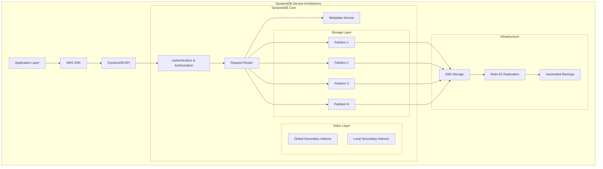

## Introduction

Amazon DynamoDB is a fully managed NoSQL database service that provides fast and predictable performance with seamless scalability. This comprehensive guide explores DynamoDB's architecture, data structures, indexing strategies, and advanced optimization techniques to achieve maximum performance for your applications.

## DynamoDB Architecture Overview

### Core Architecture Components



### DynamoDB vs Traditional Databases

| Feature | DynamoDB | Traditional RDBMS | MongoDB |
|---------|----------|-------------------|---------|
| **Data Model** | Key-Value & Document | Relational Tables | Document |
| **Schema** | Schema-less | Fixed Schema | Flexible Schema |
| **Scaling** | Horizontal (Auto) | Vertical (Manual) | Horizontal (Manual) |
| **Consistency** | Eventually Consistent | ACID Transactions | Configurable |
| **Query Language** | PartiQL & APIs | SQL | MongoDB Query Language |
| **Performance** | Single-digit millisecond | Variable | Variable |
| **Management** | Fully Managed | Self-Managed | Self/Managed Options |

## DynamoDB Data Structures

### Primary Key Structures

DynamoDB supports two types of primary keys:

1. **Partition Key (Simple Primary Key)**
2. **Composite Primary Key (Partition Key + Sort Key)**

```java
@Service
public class DynamoDBDataStructureDemo {

    private final DynamoDbClient dynamoDbClient;
    private final DynamoDbEnhancedClient enhancedClient;

    public DynamoDBDataStructureDemo() {
        this.dynamoDbClient = DynamoDbClient.builder()
            .region(Region.US_EAST_1)
            .credentialsProvider(DefaultCredentialsProvider.create())
            .build();

        this.enhancedClient = DynamoDbEnhancedClient.builder()
            .dynamoDbClient(dynamoDbClient)
            .build();
    }

    // Example 1: Simple Primary Key (Partition Key Only)
    @DynamoDbBean
    public static class UserProfile {
        private String userId;        // Partition Key
        private String username;
        private String email;
        private Instant createdAt;
        private Map<String, String> metadata;

        @DynamoDbPartitionKey
        public String getUserId() { return userId; }
        public void setUserId(String userId) { this.userId = userId; }

        public String getUsername() { return username; }
        public void setUsername(String username) { this.username = username; }

        public String getEmail() { return email; }
        public void setEmail(String email) { this.email = email; }

        @DynamoDbAttribute("created_at")
        public Instant getCreatedAt() { return createdAt; }
        public void setCreatedAt(Instant createdAt) { this.createdAt = createdAt; }

        public Map<String, String> getMetadata() { return metadata; }
        public void setMetadata(Map<String, String> metadata) { this.metadata = metadata; }
    }

    // Example 2: Composite Primary Key (Partition Key + Sort Key)
    @DynamoDbBean
    public static class OrderItem {
        private String orderId;       // Partition Key
        private String itemId;        // Sort Key
        private String productName;
        private Integer quantity;
        private BigDecimal price;
        private Instant timestamp;

        @DynamoDbPartitionKey
        public String getOrderId() { return orderId; }
        public void setOrderId(String orderId) { this.orderId = orderId; }

        @DynamoDbSortKey
        public String getItemId() { return itemId; }
        public void setItemId(String itemId) { this.itemId = itemId; }

        public String getProductName() { return productName; }
        public void setProductName(String productName) { this.productName = productName; }

        public Integer getQuantity() { return quantity; }
        public void setQuantity(Integer quantity) { this.quantity = quantity; }

        public BigDecimal getPrice() { return price; }
        public void setPrice(BigDecimal price) { this.price = price; }

        public Instant getTimestamp() { return timestamp; }
        public void setTimestamp(Instant timestamp) { this.timestamp = timestamp; }
    }

    public void demonstrateDataStructures() {
        // Working with Simple Primary Key
        DynamoDbTable<UserProfile> userTable = enhancedClient.table("UserProfiles",
                                                    TableSchema.fromBean(UserProfile.class));

        UserProfile user = new UserProfile();
        user.setUserId("user-12345");
        user.setUsername("johndoe");
        user.setEmail("john@example.com");
        user.setCreatedAt(Instant.now());
        user.setMetadata(Map.of("department", "engineering", "level", "senior"));

        userTable.putItem(user);

        // Working with Composite Primary Key
        DynamoDbTable<OrderItem> orderTable = enhancedClient.table("OrderItems",
                                                 TableSchema.fromBean(OrderItem.class));

        OrderItem orderItem = new OrderItem();
        orderItem.setOrderId("order-67890");
        orderItem.setItemId("item-001");
        orderItem.setProductName("Laptop");
        orderItem.setQuantity(1);
        orderItem.setPrice(new BigDecimal("999.99"));
        orderItem.setTimestamp(Instant.now());

        orderTable.putItem(orderItem);
    }
}
```

### DynamoDB Data Types

```java
@Component
public class DynamoDBDataTypesDemo {

    // Scalar Types
    @DynamoDbBean
    public static class ScalarTypeExample {
        private String stringValue;      // String (S)
        private Integer numberValue;     // Number (N)
        private byte[] binaryValue;      // Binary (B)
        private Boolean booleanValue;    // Boolean (BOOL)
        private String nullValue;        // Null (NULL)

        // Getters and Setters...
    }

    // Document Types
    @DynamoDbBean
    public static class DocumentTypeExample {
        private List<String> stringList;           // List (L)
        private Map<String, String> stringMap;     // Map (M)
        private Set<String> stringSet;             // String Set (SS)
        private Set<Integer> numberSet;            // Number Set (NS)
        private Set<byte[]> binarySet;             // Binary Set (BS)

        // Getters and Setters...
    }

    // Complex Nested Structure
    @DynamoDbBean
    public static class ProductCatalog {
        private String productId;
        private String title;
        private String description;
        private BigDecimal price;
        private List<String> categories;
        private Map<String, Object> attributes;
        private ProductDetails details;
        private List<Review> reviews;

        @DynamoDbPartitionKey
        public String getProductId() { return productId; }
        public void setProductId(String productId) { this.productId = productId; }

        // Nested object as Map
        public static class ProductDetails {
            private String brand;
            private String model;
            private Map<String, String> specifications;
            private List<String> images;

            // Getters and Setters...
        }

        public static class Review {
            private String reviewId;
            private String userId;
            private Integer rating;
            private String comment;
            private Instant reviewDate;

            // Getters and Setters...
        }

        // Getters and Setters for all fields...
    }
}
```

## Indexing Strategies

### Global Secondary Indexes (GSI)

```java
@Service
public class GlobalSecondaryIndexService {

    private final DynamoDbClient dynamoDbClient;

    public void createTableWithGSI() {
        // Create table with GSI
        CreateTableRequest createTableRequest = CreateTableRequest.builder()
            .tableName("GameScores")
            .keySchema(
                KeySchemaElement.builder()
                    .attributeName("UserId")
                    .keyType(KeyType.HASH)
                    .build(),
                KeySchemaElement.builder()
                    .attributeName("GameTitle")
                    .keyType(KeyType.RANGE)
                    .build()
            )
            .attributeDefinitions(
                AttributeDefinition.builder()
                    .attributeName("UserId")
                    .attributeType(ScalarAttributeType.S)
                    .build(),
                AttributeDefinition.builder()
                    .attributeName("GameTitle")
                    .attributeType(ScalarAttributeType.S)
                    .build(),
                AttributeDefinition.builder()
                    .attributeName("TopScore")
                    .attributeType(ScalarAttributeType.N)
                    .build(),
                AttributeDefinition.builder()
                    .attributeName("TopScoreDateTime")
                    .attributeType(ScalarAttributeType.S)
                    .build()
            )
            .globalSecondaryIndexes(
                // GSI 1: Query by GameTitle and TopScore
                GlobalSecondaryIndex.builder()
                    .indexName("GameTitleIndex")
                    .keySchema(
                        KeySchemaElement.builder()
                            .attributeName("GameTitle")
                            .keyType(KeyType.HASH)
                            .build(),
                        KeySchemaElement.builder()
                            .attributeName("TopScore")
                            .keyType(KeyType.RANGE)
                            .build()
                    )
                    .projection(Projection.builder()
                        .projectionType(ProjectionType.ALL)
                        .build())
                    .provisionedThroughput(ProvisionedThroughput.builder()
                        .readCapacityUnits(5L)
                        .writeCapacityUnits(5L)
                        .build())
                    .build(),

                // GSI 2: Sparse index for top players
                GlobalSecondaryIndex.builder()
                    .indexName("TopPlayerIndex")
                    .keySchema(
                        KeySchemaElement.builder()
                            .attributeName("TopScore")
                            .keyType(KeyType.HASH)
                            .build(),
                        KeySchemaElement.builder()
                            .attributeName("TopScoreDateTime")
                            .keyType(KeyType.RANGE)
                            .build()
                    )
                    .projection(Projection.builder()
                        .projectionType(ProjectionType.INCLUDE)
                        .nonKeyAttributes("UserId", "GameTitle")
                        .build())
                    .provisionedThroughput(ProvisionedThroughput.builder()
                        .readCapacityUnits(5L)
                        .writeCapacityUnits(5L)
                        .build())
                    .build()
            )
            .billingMode(BillingMode.PROVISIONED)
            .provisionedThroughput(ProvisionedThroughput.builder()
                .readCapacityUnits(5L)
                .writeCapacityUnits(5L)
                .build())
            .build();

        dynamoDbClient.createTable(createTableRequest);
    }

    // Query using GSI
    public List<Map<String, AttributeValue>> queryByGameTitle(String gameTitle) {
        QueryRequest queryRequest = QueryRequest.builder()
            .tableName("GameScores")
            .indexName("GameTitleIndex")
            .keyConditionExpression("GameTitle = :gameTitle")
            .expressionAttributeValues(Map.of(
                ":gameTitle", AttributeValue.builder().s(gameTitle).build()
            ))
            .scanIndexForward(false) // Descending order by TopScore
            .limit(10)
            .build();

        QueryResponse response = dynamoDbClient.query(queryRequest);
        return response.items();
    }

    // Query top scores across all games
    public List<Map<String, AttributeValue>> queryTopScores(int minScore) {
        QueryRequest queryRequest = QueryRequest.builder()
            .tableName("GameScores")
            .indexName("TopPlayerIndex")
            .keyConditionExpression("TopScore >= :minScore")
            .expressionAttributeValues(Map.of(
                ":minScore", AttributeValue.builder().n(String.valueOf(minScore)).build()
            ))
            .scanIndexForward(false)
            .limit(20)
            .build();

        QueryResponse response = dynamoDbClient.query(queryRequest);
        return response.items();
    }
}
```

### Local Secondary Indexes (LSI)

```java
@Service
public class LocalSecondaryIndexService {

    public void createTableWithLSI() {
        CreateTableRequest createTableRequest = CreateTableRequest.builder()
            .tableName("Music")
            .keySchema(
                KeySchemaElement.builder()
                    .attributeName("Artist")
                    .keyType(KeyType.HASH)
                    .build(),
                KeySchemaElement.builder()
                    .attributeName("SongTitle")
                    .keyType(KeyType.RANGE)
                    .build()
            )
            .attributeDefinitions(
                AttributeDefinition.builder()
                    .attributeName("Artist")
                    .attributeType(ScalarAttributeType.S)
                    .build(),
                AttributeDefinition.builder()
                    .attributeName("SongTitle")
                    .attributeType(ScalarAttributeType.S)
                    .build(),
                AttributeDefinition.builder()
                    .attributeName("AlbumTitle")
                    .attributeType(ScalarAttributeType.S)
                    .build(),
                AttributeDefinition.builder()
                    .attributeName("Genre")
                    .attributeType(ScalarAttributeType.S)
                    .build()
            )
            .localSecondaryIndexes(
                // LSI 1: Query songs by Artist and AlbumTitle
                LocalSecondaryIndex.builder()
                    .indexName("AlbumTitleIndex")
                    .keySchema(
                        KeySchemaElement.builder()
                            .attributeName("Artist")
                            .keyType(KeyType.HASH)
                            .build(),
                        KeySchemaElement.builder()
                            .attributeName("AlbumTitle")
                            .keyType(KeyType.RANGE)
                            .build()
                    )
                    .projection(Projection.builder()
                        .projectionType(ProjectionType.ALL)
                        .build())
                    .build(),

                // LSI 2: Query songs by Artist and Genre
                LocalSecondaryIndex.builder()
                    .indexName("GenreIndex")
                    .keySchema(
                        KeySchemaElement.builder()
                            .attributeName("Artist")
                            .keyType(KeyType.HASH)
                            .build(),
                        KeySchemaElement.builder()
                            .attributeName("Genre")
                            .keyType(KeyType.RANGE)
                            .build()
                    )
                    .projection(Projection.builder()
                        .projectionType(ProjectionType.KEYS_ONLY)
                        .build())
                    .build()
            )
            .billingMode(BillingMode.PAY_PER_REQUEST)
            .build();

        dynamoDbClient.createTable(createTableRequest);
    }

    // Query using LSI
    public List<Map<String, AttributeValue>> querySongsByAlbum(String artist, String albumTitle) {
        QueryRequest queryRequest = QueryRequest.builder()
            .tableName("Music")
            .indexName("AlbumTitleIndex")
            .keyConditionExpression("Artist = :artist AND AlbumTitle = :album")
            .expressionAttributeValues(Map.of(
                ":artist", AttributeValue.builder().s(artist).build(),
                ":album", AttributeValue.builder().s(albumTitle).build()
            ))
            .build();

        QueryResponse response = dynamoDbClient.query(queryRequest);
        return response.items();
    }
}
```

### Index Design Patterns

```java
@Component
public class IndexDesignPatterns {

    // Pattern 1: Inverted Index for Many-to-Many Relationships
    @DynamoDbBean
    public static class InvertedIndex {
        private String entityType;    // PK: "USER" or "SKILL"
        private String entityId;      // SK: actual ID
        private String relatedType;   // GSI PK: "SKILL" or "USER"
        private String relatedId;     // GSI SK: related ID
        private Map<String, String> metadata;

        @DynamoDbPartitionKey
        public String getEntityType() { return entityType; }
        public void setEntityType(String entityType) { this.entityType = entityType; }

        @DynamoDbSortKey
        public String getEntityId() { return entityId; }
        public void setEntityId(String entityId) { this.entityId = entityId; }

        @DynamoDbSecondaryPartitionKey(indexNames = "InvertedIndex")
        public String getRelatedType() { return relatedType; }
        public void setRelatedType(String relatedType) { this.relatedType = relatedType; }

        @DynamoDbSecondarySortKey(indexNames = "InvertedIndex")
        public String getRelatedId() { return relatedId; }
        public void setRelatedId(String relatedId) { this.relatedId = relatedId; }

        public Map<String, String> getMetadata() { return metadata; }
        public void setMetadata(Map<String, String> metadata) { this.metadata = metadata; }
    }

    // Pattern 2: Hierarchical Data with GSI
    @DynamoDbBean
    public static class HierarchicalData {
        private String pk;            // Partition Key
        private String sk;            // Sort Key
        private String gsi1pk;        // GSI1 Partition Key
        private String gsi1sk;        // GSI1 Sort Key
        private String dataType;      // Entity type
        private Map<String, Object> attributes;

        @DynamoDbPartitionKey
        public String getPk() { return pk; }
        public void setPk(String pk) { this.pk = pk; }

        @DynamoDbSortKey
        public String getSk() { return sk; }
        public void setSk(String sk) { this.sk = sk; }

        @DynamoDbSecondaryPartitionKey(indexNames = "GSI1")
        public String getGsi1pk() { return gsi1pk; }
        public void setGsi1pk(String gsi1pk) { this.gsi1pk = gsi1pk; }

        @DynamoDbSecondarySortKey(indexNames = "GSI1")
        public String getGsi1sk() { return gsi1sk; }
        public void setGsi1sk(String gsi1sk) { this.gsi1sk = gsi1sk; }

        public String getDataType() { return dataType; }
        public void setDataType(String dataType) { this.dataType = dataType; }

        public Map<String, Object> getAttributes() { return attributes; }
        public void setAttributes(Map<String, Object> attributes) { this.attributes = attributes; }
    }

    // Pattern 3: Time Series Data with Sort Key
    @DynamoDbBean
    public static class TimeSeriesData {
        private String deviceId;      // Partition Key
        private String timestamp;     // Sort Key (ISO 8601 format)
        private String metricType;    // GSI Partition Key
        private String timeGSI;       // GSI Sort Key (reversed timestamp)
        private Double value;
        private Map<String, String> tags;

        @DynamoDbPartitionKey
        public String getDeviceId() { return deviceId; }
        public void setDeviceId(String deviceId) { this.deviceId = deviceId; }

        @DynamoDbSortKey
        public String getTimestamp() { return timestamp; }
        public void setTimestamp(String timestamp) { this.timestamp = timestamp; }

        @DynamoDbSecondaryPartitionKey(indexNames = "MetricTypeIndex")
        public String getMetricType() { return metricType; }
        public void setMetricType(String metricType) { this.metricType = metricType; }

        @DynamoDbSecondarySortKey(indexNames = "MetricTypeIndex")
        public String getTimeGSI() { return timeGSI; }
        public void setTimeGSI(String timeGSI) { this.timeGSI = timeGSI; }

        public Double getValue() { return value; }
        public void setValue(Double value) { this.value = value; }

        public Map<String, String> getTags() { return tags; }
        public void setTags(Map<String, String> tags) { this.tags = tags; }
    }
}
```

## When to Use DynamoDB

### Use Cases and Decision Matrix

| Scenario | DynamoDB | RDBMS | Document DB |
|----------|----------|-------|-------------|
| **High-scale web applications** | ✅ Excellent | ❌ Limited scaling | ⚠️ Good with effort |
| **Gaming leaderboards** | ✅ Perfect for real-time | ❌ Slow updates | ⚠️ Moderate |
| **IoT data ingestion** | ✅ Handles massive writes | ❌ Bottlenecks | ⚠️ Good |
| **Session management** | ✅ Fast key-value access | ❌ Overkill | ✅ Also good |
| **Complex reporting** | ❌ Limited analytics | ✅ Excellent SQL | ⚠️ Aggregation framework |
| **ACID transactions** | ⚠️ Limited support | ✅ Full ACID | ⚠️ Limited |
| **Ad-hoc queries** | ❌ Requires known access patterns | ✅ Flexible SQL | ✅ Flexible |

```java
@Service
public class DynamoDBUseCaseExamples {

    // Use Case 1: Gaming Leaderboard
    public void updatePlayerScore(String gameId, String playerId, int newScore) {
        UpdateItemRequest request = UpdateItemRequest.builder()
            .tableName("GameLeaderboard")
            .key(Map.of(
                "GameId", AttributeValue.builder().s(gameId).build(),
                "PlayerId", AttributeValue.builder().s(playerId).build()
            ))
            .updateExpression("SET #score = if_not_exists(#score, :zero) + :increment, " +
                             "#lastUpdated = :timestamp")
            .conditionExpression("#score < :newScore OR attribute_not_exists(#score)")
            .expressionAttributeNames(Map.of(
                "#score", "HighScore",
                "#lastUpdated", "LastUpdated"
            ))
            .expressionAttributeValues(Map.of(
                ":zero", AttributeValue.builder().n("0").build(),
                ":increment", AttributeValue.builder().n(String.valueOf(newScore)).build(),
                ":newScore", AttributeValue.builder().n(String.valueOf(newScore)).build(),
                ":timestamp", AttributeValue.builder().s(Instant.now().toString()).build()
            ))
            .returnValues(ReturnValue.ALL_NEW)
            .build();

        dynamoDbClient.updateItem(request);
    }

    // Use Case 2: IoT Sensor Data
    public void batchWriteIoTData(List<SensorReading> readings) {
        List<WriteRequest> writeRequests = readings.stream()
            .map(reading -> WriteRequest.builder()
                .putRequest(PutRequest.builder()
                    .item(Map.of(
                        "DeviceId", AttributeValue.builder().s(reading.getDeviceId()).build(),
                        "Timestamp", AttributeValue.builder().s(reading.getTimestamp().toString()).build(),
                        "Temperature", AttributeValue.builder().n(reading.getTemperature().toString()).build(),
                        "Humidity", AttributeValue.builder().n(reading.getHumidity().toString()).build(),
                        "Location", AttributeValue.builder().s(reading.getLocation()).build()
                    ))
                    .build())
                .build())
            .collect(Collectors.toList());

        // Process in batches of 25 (DynamoDB limit)
        Lists.partition(writeRequests, 25).forEach(batch -> {
            BatchWriteItemRequest batchRequest = BatchWriteItemRequest.builder()
                .requestItems(Map.of("IoTSensorData", batch))
                .build();

            dynamoDbClient.batchWriteItem(batchRequest);
        });
    }

    // Use Case 3: Session Management
    public void createUserSession(String sessionId, String userId, Duration ttl) {
        long expirationTime = Instant.now().plus(ttl).getEpochSecond();

        PutItemRequest request = PutItemRequest.builder()
            .tableName("UserSessions")
            .item(Map.of(
                "SessionId", AttributeValue.builder().s(sessionId).build(),
                "UserId", AttributeValue.builder().s(userId).build(),
                "CreatedAt", AttributeValue.builder().s(Instant.now().toString()).build(),
                "ExpiresAt", AttributeValue.builder().n(String.valueOf(expirationTime)).build(),
                "TTL", AttributeValue.builder().n(String.valueOf(expirationTime)).build()
            ))
            .build();

        dynamoDbClient.putItem(request);
    }

    public static class SensorReading {
        private String deviceId;
        private Instant timestamp;
        private Double temperature;
        private Double humidity;
        private String location;

        // Constructors, getters, and setters...
    }
}
```

## Performance Optimization Strategies

### Hot Partition Prevention

```java
@Service
public class HotPartitionOptimizer {

    // Strategy 1: Add Random Suffix to Distribute Load
    public String generateDistributedPartitionKey(String baseKey) {
        int suffix = ThreadLocalRandom.current().nextInt(0, 10);
        return baseKey + "#" + suffix;
    }

    // Strategy 2: Use Write Sharding for High-Volume Writes
    public void writeWithSharding(String baseKey, Map<String, AttributeValue> item) {
        String shardedKey = generateDistributedPartitionKey(baseKey);
        item.put("PK", AttributeValue.builder().s(shardedKey).build());

        PutItemRequest request = PutItemRequest.builder()
            .tableName("HighVolumeTable")
            .item(item)
            .build();

        dynamoDbClient.putItem(request);
    }

    // Strategy 3: Read from All Shards for Aggregated Data
    public List<Map<String, AttributeValue>> readFromAllShards(String baseKey) {
        List<CompletableFuture<QueryResponse>> futures = IntStream.range(0, 10)
            .mapToObj(i -> {
                String shardedKey = baseKey + "#" + i;
                QueryRequest request = QueryRequest.builder()
                    .tableName("HighVolumeTable")
                    .keyConditionExpression("PK = :pk")
                    .expressionAttributeValues(Map.of(
                        ":pk", AttributeValue.builder().s(shardedKey).build()
                    ))
                    .build();

                return CompletableFuture.supplyAsync(() -> dynamoDbClient.query(request));
            })
            .collect(Collectors.toList());

        return futures.stream()
            .map(CompletableFuture::join)
            .flatMap(response -> response.items().stream())
            .collect(Collectors.toList());
    }

    // Strategy 4: Adaptive Capacity Management
    @Scheduled(fixedRate = 300000) // Every 5 minutes
    public void monitorAndAdjustCapacity() {
        DescribeTableRequest describeRequest = DescribeTableRequest.builder()
            .tableName("HighVolumeTable")
            .build();

        DescribeTableResponse response = dynamoDbClient.describeTable(describeRequest);
        TableDescription table = response.table();

        // Check consumed capacity vs provisioned capacity
        long readCapacity = table.provisionedThroughput().readCapacityUnits();
        long writeCapacity = table.provisionedThroughput().writeCapacityUnits();

        // Get metrics from CloudWatch (simplified example)
        double readUtilization = getReadCapacityUtilization("HighVolumeTable");
        double writeUtilization = getWriteCapacityUtilization("HighVolumeTable");

        // Adjust capacity if utilization is high
        if (readUtilization > 0.8 || writeUtilization > 0.8) {
            updateTableCapacity(
                "HighVolumeTable",
                Math.round(readCapacity * 1.5f),
                Math.round(writeCapacity * 1.5f)
            );
        }
    }

    private double getReadCapacityUtilization(String tableName) {
        // Implementation would query CloudWatch metrics
        return 0.0; // Placeholder
    }

    private double getWriteCapacityUtilization(String tableName) {
        // Implementation would query CloudWatch metrics
        return 0.0; // Placeholder
    }

    private void updateTableCapacity(String tableName, long readCapacity, long writeCapacity) {
        ModifyTableRequest request = ModifyTableRequest.builder()
            .tableName(tableName)
            .provisionedThroughput(ProvisionedThroughput.builder()
                .readCapacityUnits(readCapacity)
                .writeCapacityUnits(writeCapacity)
                .build())
            .build();

        dynamoDbClient.modifyTable(request);
    }
}
```

### Fast I/O Optimization Techniques

```java
@Service
public class FastIOOptimizer {

    private final DynamoDbAsyncClient asyncClient;
    private final DynamoDbEnhancedAsyncClient enhancedAsyncClient;

    public FastIOOptimizer() {
        this.asyncClient = DynamoDbAsyncClient.builder()
            .region(Region.US_EAST_1)
            .credentialsProvider(DefaultCredentialsProvider.create())
            // Configure HTTP client for better performance
            .httpClientBuilder(NettyNioAsyncHttpClient.builder()
                .maxConcurrency(100)
                .maxPendingConnectionAcquires(1000)
                .connectionTimeout(Duration.ofSeconds(2))
                .readTimeout(Duration.ofSeconds(30))
                .writeTimeout(Duration.ofSeconds(30))
            )
            .overrideConfiguration(ClientOverrideConfiguration.builder()
                .apiCallTimeout(Duration.ofSeconds(30))
                .apiCallAttemptTimeout(Duration.ofSeconds(10))
                .retryPolicy(RetryPolicy.builder()
                    .numRetries(3)
                    .build())
                .build())
            .build();

        this.enhancedAsyncClient = DynamoDbEnhancedAsyncClient.builder()
            .dynamoDbClient(asyncClient)
            .build();
    }

    // Technique 1: Batch Operations for Better Throughput
    public CompletableFuture<Void> batchWriteOptimized(List<Map<String, AttributeValue>> items) {
        // Split items into optimal batch size (25 items per batch)
        List<List<Map<String, AttributeValue>>> batches = Lists.partition(items, 25);

        List<CompletableFuture<BatchWriteItemResponse>> batchFutures = batches.stream()
            .map(batch -> {
                List<WriteRequest> writeRequests = batch.stream()
                    .map(item -> WriteRequest.builder()
                        .putRequest(PutRequest.builder().item(item).build())
                        .build())
                    .collect(Collectors.toList());

                BatchWriteItemRequest request = BatchWriteItemRequest.builder()
                    .requestItems(Map.of("FastTable", writeRequests))
                    .build();

                return asyncClient.batchWriteItem(request);
            })
            .collect(Collectors.toList());

        return CompletableFuture.allOf(batchFutures.toArray(new CompletableFuture[0]));
    }

    // Technique 2: Parallel Query with Async
    public CompletableFuture<List<Map<String, AttributeValue>>> parallelQuery(
            List<String> partitionKeys) {

        List<CompletableFuture<QueryResponse>> queryFutures = partitionKeys.stream()
            .map(pk -> {
                QueryRequest request = QueryRequest.builder()
                    .tableName("FastTable")
                    .keyConditionExpression("PK = :pk")
                    .expressionAttributeValues(Map.of(
                        ":pk", AttributeValue.builder().s(pk).build()
                    ))
                    .consistentRead(false) // Eventually consistent for better performance
                    .build();

                return asyncClient.query(request);
            })
            .collect(Collectors.toList());

        return CompletableFuture.allOf(queryFutures.toArray(new CompletableFuture[0]))
            .thenApply(v -> queryFutures.stream()
                .map(CompletableFuture::join)
                .flatMap(response -> response.items().stream())
                .collect(Collectors.toList()));
    }

    // Technique 3: Connection Pooling and Reuse
    @Bean
    public DynamoDbClient optimizedDynamoDbClient() {
        return DynamoDbClient.builder()
            .region(Region.US_EAST_1)
            .httpClientBuilder(ApacheHttpClient.builder()
                .maxConnections(200)
                .connectionTimeout(Duration.ofSeconds(2))
                .socketTimeout(Duration.ofSeconds(30))
                .connectionTimeToLive(Duration.ofMinutes(5))
                .useIdleConnectionReaper(true)
            )
            .build();
    }

    // Technique 4: Projection to Minimize Data Transfer
    public CompletableFuture<List<Map<String, AttributeValue>>> queryWithProjection(
            String partitionKey) {

        QueryRequest request = QueryRequest.builder()
            .tableName("FastTable")
            .keyConditionExpression("PK = :pk")
            .projectionExpression("PK, SK, #name, #status, #timestamp")
            .expressionAttributeNames(Map.of(
                "#name", "Name",
                "#status", "Status",
                "#timestamp", "Timestamp"
            ))
            .expressionAttributeValues(Map.of(
                ":pk", AttributeValue.builder().s(partitionKey).build()
            ))
            .build();

        return asyncClient.query(request)
            .thenApply(QueryResponse::items);
    }

    // Technique 5: Conditional Writes for Concurrency Control
    public CompletableFuture<PutItemResponse> conditionalUpdateWithRetry(
            String pk, String sk, Map<String, AttributeValue> updates, int maxRetries) {

        return conditionalUpdateWithRetryHelper(pk, sk, updates, maxRetries, 0);
    }

    private CompletableFuture<PutItemResponse> conditionalUpdateWithRetryHelper(
            String pk, String sk, Map<String, AttributeValue> updates, int maxRetries, int attempt) {

        Map<String, AttributeValue> key = Map.of(
            "PK", AttributeValue.builder().s(pk).build(),
            "SK", AttributeValue.builder().s(sk).build()
        );

        // Add version for optimistic locking
        updates.put("Version", AttributeValue.builder()
            .n(String.valueOf(System.currentTimeMillis())).build());

        PutItemRequest request = PutItemRequest.builder()
            .tableName("FastTable")
            .item(Stream.concat(key.entrySet().stream(), updates.entrySet().stream())
                .collect(Collectors.toMap(
                    Map.Entry::getKey,
                    Map.Entry::getValue
                )))
            .conditionExpression("attribute_not_exists(PK) OR Version < :newVersion")
            .expressionAttributeValues(Map.of(
                ":newVersion", updates.get("Version")
            ))
            .build();

        return asyncClient.putItem(request)
            .exceptionallyCompose(throwable -> {
                if (throwable.getCause() instanceof ConditionalCheckFailedException &&
                    attempt < maxRetries) {

                    // Exponential backoff
                    return CompletableFuture.delayedExecutor(
                            Duration.ofMillis(100 * (1L << attempt)),
                            ForkJoinPool.commonPool())
                        .thenCompose(v -> conditionalUpdateWithRetryHelper(
                            pk, sk, updates, maxRetries, attempt + 1));
                }
                return CompletableFuture.failedFuture(throwable);
            });
    }
}
```

### DynamoDB Streams for Real-time Processing

```java
@Service
public class DynamoDBStreamProcessor {

    @EventListener
    public void handleDynamoDBStreamRecord(DynamodbEvent event) {
        List<CompletableFuture<Void>> processingFutures = event.getRecords().stream()
            .map(this::processRecord)
            .collect(Collectors.toList());

        CompletableFuture.allOf(processingFutures.toArray(new CompletableFuture[0]))
            .join();
    }

    private CompletableFuture<Void> processRecord(DynamodbEvent.DynamodbStreamRecord record) {
        return CompletableFuture.runAsync(() -> {
            String eventName = record.getEventName();

            switch (eventName) {
                case "INSERT":
                    handleInsertEvent(record);
                    break;
                case "MODIFY":
                    handleModifyEvent(record);
                    break;
                case "REMOVE":
                    handleRemoveEvent(record);
                    break;
                default:
                    log.warn("Unknown event type: {}", eventName);
            }
        });
    }

    private void handleInsertEvent(DynamodbEvent.DynamodbStreamRecord record) {
        Map<String, AttributeValue> newImage = record.getDynamodb().getNewImage();

        // Example: Update search index
        updateSearchIndex(newImage, "ADD");

        // Example: Send notification
        sendNotification("NEW_ITEM", newImage);

        // Example: Update analytics
        updateAnalytics(newImage, "INSERT");
    }

    private void handleModifyEvent(DynamodbEvent.DynamodbStreamRecord record) {
        Map<String, AttributeValue> oldImage = record.getDynamodb().getOldImage();
        Map<String, AttributeValue> newImage = record.getDynamodb().getNewImage();

        // Compare and process changes
        Set<String> changedAttributes = findChangedAttributes(oldImage, newImage);

        if (changedAttributes.contains("status")) {
            handleStatusChange(oldImage, newImage);
        }

        if (changedAttributes.contains("priority")) {
            handlePriorityChange(oldImage, newImage);
        }
    }

    private void handleRemoveEvent(DynamodbEvent.DynamodbStreamRecord record) {
        Map<String, AttributeValue> oldImage = record.getDynamodb().getOldImage();

        // Clean up related resources
        cleanupRelatedData(oldImage);

        // Update search index
        updateSearchIndex(oldImage, "DELETE");

        // Update analytics
        updateAnalytics(oldImage, "DELETE");
    }

    private Set<String> findChangedAttributes(Map<String, AttributeValue> oldImage,
                                            Map<String, AttributeValue> newImage) {
        Set<String> changedAttributes = new HashSet<>();

        // Check all attributes in new image
        for (Map.Entry<String, AttributeValue> entry : newImage.entrySet()) {
            String attributeName = entry.getKey();
            AttributeValue newValue = entry.getValue();
            AttributeValue oldValue = oldImage.get(attributeName);

            if (oldValue == null || !oldValue.equals(newValue)) {
                changedAttributes.add(attributeName);
            }
        }

        // Check for removed attributes
        for (String attributeName : oldImage.keySet()) {
            if (!newImage.containsKey(attributeName)) {
                changedAttributes.add(attributeName);
            }
        }

        return changedAttributes;
    }

    // Placeholder methods for business logic
    private void updateSearchIndex(Map<String, AttributeValue> item, String operation) {
        log.info("Updating search index: {} - {}", operation, item.get("PK"));
    }

    private void sendNotification(String type, Map<String, AttributeValue> item) {
        log.info("Sending notification: {} - {}", type, item.get("PK"));
    }

    private void updateAnalytics(Map<String, AttributeValue> item, String operation) {
        log.info("Updating analytics: {} - {}", operation, item.get("PK"));
    }

    private void handleStatusChange(Map<String, AttributeValue> oldImage,
                                   Map<String, AttributeValue> newImage) {
        log.info("Status changed from {} to {}",
                oldImage.get("status"), newImage.get("status"));
    }

    private void handlePriorityChange(Map<String, AttributeValue> oldImage,
                                     Map<String, AttributeValue> newImage) {
        log.info("Priority changed from {} to {}",
                oldImage.get("priority"), newImage.get("priority"));
    }

    private void cleanupRelatedData(Map<String, AttributeValue> oldImage) {
        log.info("Cleaning up related data for: {}", oldImage.get("PK"));
    }
}
```

## Advanced Features

### DynamoDB Transactions

```java
@Service
public class DynamoDBTransactionService {

    private final DynamoDbClient dynamoDbClient;

    // ACID Transaction Example: Bank Transfer
    public void transferFunds(String fromAccountId, String toAccountId, BigDecimal amount) {
        List<TransactWriteItem> transactItems = Arrays.asList(
            // Debit from source account
            TransactWriteItem.builder()
                .update(Update.builder()
                    .tableName("BankAccounts")
                    .key(Map.of(
                        "AccountId", AttributeValue.builder().s(fromAccountId).build()
                    ))
                    .updateExpression("SET Balance = Balance - :amount, " +
                                    "LastUpdated = :timestamp, " +
                                    "#version = #version + :one")
                    .conditionExpression("Balance >= :amount AND " +
                                       "AccountStatus = :active")
                    .expressionAttributeNames(Map.of("#version", "Version"))
                    .expressionAttributeValues(Map.of(
                        ":amount", AttributeValue.builder().n(amount.toString()).build(),
                        ":timestamp", AttributeValue.builder().s(Instant.now().toString()).build(),
                        ":one", AttributeValue.builder().n("1").build(),
                        ":active", AttributeValue.builder().s("ACTIVE").build()
                    ))
                    .build())
                .build(),

            // Credit to destination account
            TransactWriteItem.builder()
                .update(Update.builder()
                    .tableName("BankAccounts")
                    .key(Map.of(
                        "AccountId", AttributeValue.builder().s(toAccountId).build()
                    ))
                    .updateExpression("SET Balance = Balance + :amount, " +
                                    "LastUpdated = :timestamp, " +
                                    "#version = #version + :one")
                    .conditionExpression("AccountStatus = :active")
                    .expressionAttributeNames(Map.of("#version", "Version"))
                    .expressionAttributeValues(Map.of(
                        ":amount", AttributeValue.builder().n(amount.toString()).build(),
                        ":timestamp", AttributeValue.builder().s(Instant.now().toString()).build(),
                        ":one", AttributeValue.builder().n("1").build(),
                        ":active", AttributeValue.builder().s("ACTIVE").build()
                    ))
                    .build())
                .build(),

            // Create transaction log
            TransactWriteItem.builder()
                .put(Put.builder()
                    .tableName("TransactionLog")
                    .item(Map.of(
                        "TransactionId", AttributeValue.builder()
                            .s(UUID.randomUUID().toString()).build(),
                        "FromAccount", AttributeValue.builder().s(fromAccountId).build(),
                        "ToAccount", AttributeValue.builder().s(toAccountId).build(),
                        "Amount", AttributeValue.builder().n(amount.toString()).build(),
                        "Timestamp", AttributeValue.builder()
                            .s(Instant.now().toString()).build(),
                        "Status", AttributeValue.builder().s("COMPLETED").build()
                    ))
                    .conditionExpression("attribute_not_exists(TransactionId)")
                    .build())
                .build()
        );

        TransactWriteItemsRequest request = TransactWriteItemsRequest.builder()
            .transactItems(transactItems)
            .build();

        try {
            dynamoDbClient.transactWriteItems(request);
            log.info("Transfer completed: {} -> {}, Amount: {}",
                    fromAccountId, toAccountId, amount);
        } catch (TransactionCanceledException e) {
            log.error("Transaction failed: {}", e.getMessage());
            handleTransactionFailure(e, fromAccountId, toAccountId, amount);
        }
    }

    // Transaction Read Example
    public Map<String, Object> getAccountSummary(String accountId) {
        List<TransactGetItem> transactItems = Arrays.asList(
            TransactGetItem.builder()
                .get(Get.builder()
                    .tableName("BankAccounts")
                    .key(Map.of(
                        "AccountId", AttributeValue.builder().s(accountId).build()
                    ))
                    .build())
                .build(),

            TransactGetItem.builder()
                .get(Get.builder()
                    .tableName("AccountPreferences")
                    .key(Map.of(
                        "AccountId", AttributeValue.builder().s(accountId).build()
                    ))
                    .build())
                .build()
        );

        TransactGetItemsRequest request = TransactGetItemsRequest.builder()
            .transactItems(transactItems)
            .build();

        TransactGetItemsResponse response = dynamoDbClient.transactGetItems(request);

        Map<String, Object> summary = new HashMap<>();
        summary.put("account", response.responses().get(0).item());
        summary.put("preferences", response.responses().get(1).item());

        return summary;
    }

    private void handleTransactionFailure(TransactionCanceledException e,
                                        String fromAccountId, String toAccountId,
                                        BigDecimal amount) {
        // Log failure details
        List<CancellationReason> reasons = e.cancellationReasons();
        for (int i = 0; i < reasons.size(); i++) {
            CancellationReason reason = reasons.get(i);
            log.error("Transaction item {} failed: Code={}, Message={}",
                     i, reason.code(), reason.message());
        }

        // Implement compensation logic if needed
        createFailedTransactionRecord(fromAccountId, toAccountId, amount, e.getMessage());
    }

    private void createFailedTransactionRecord(String fromAccountId, String toAccountId,
                                             BigDecimal amount, String failureReason) {
        PutItemRequest request = PutItemRequest.builder()
            .tableName("FailedTransactions")
            .item(Map.of(
                "TransactionId", AttributeValue.builder()
                    .s(UUID.randomUUID().toString()).build(),
                "FromAccount", AttributeValue.builder().s(fromAccountId).build(),
                "ToAccount", AttributeValue.builder().s(toAccountId).build(),
                "Amount", AttributeValue.builder().n(amount.toString()).build(),
                "FailureReason", AttributeValue.builder().s(failureReason).build(),
                "Timestamp", AttributeValue.builder().s(Instant.now().toString()).build()
            ))
            .build();

        dynamoDbClient.putItem(request);
    }
}
```

## Performance Monitoring and Optimization

### CloudWatch Metrics and Alarms

```java
@Component
public class DynamoDBMonitoring {

    private final CloudWatchClient cloudWatchClient;
    private final DynamoDbClient dynamoDbClient;

    public DynamoDBMonitoring(CloudWatchClient cloudWatchClient,
                             DynamoDbClient dynamoDbClient) {
        this.cloudWatchClient = cloudWatchClient;
        this.dynamoDbClient = dynamoDbClient;
    }

    public void createPerformanceAlarms(String tableName) {
        // High read throttling alarm
        createAlarm(
            tableName + "-HighReadThrottles",
            "High read throttling detected",
            "AWS/DynamoDB",
            "UserErrors",
            Dimension.builder().name("TableName").value(tableName).build(),
            Statistic.SUM,
            300, // 5 minutes
            2,   // 2 evaluation periods
            10.0, // threshold
            ComparisonOperator.GREATER_THAN_THRESHOLD
        );

        // High write throttling alarm
        createAlarm(
            tableName + "-HighWriteThrottles",
            "High write throttling detected",
            "AWS/DynamoDB",
            "SystemErrors",
            Dimension.builder().name("TableName").value(tableName).build(),
            Statistic.SUM,
            300,
            2,
            5.0,
            ComparisonOperator.GREATER_THAN_THRESHOLD
        );

        // High consumed read capacity alarm
        createAlarm(
            tableName + "-HighReadCapacity",
            "High consumed read capacity",
            "AWS/DynamoDB",
            "ConsumedReadCapacityUnits",
            Dimension.builder().name("TableName").value(tableName).build(),
            Statistic.SUM,
            300,
            3,
            1000.0,
            ComparisonOperator.GREATER_THAN_THRESHOLD
        );
    }

    private void createAlarm(String alarmName, String description, String namespace,
                           String metricName, Dimension dimension, Statistic statistic,
                           int period, int evaluationPeriods, double threshold,
                           ComparisonOperator comparisonOperator) {

        PutMetricAlarmRequest request = PutMetricAlarmRequest.builder()
            .alarmName(alarmName)
            .alarmDescription(description)
            .comparisonOperator(comparisonOperator)
            .evaluationPeriods(evaluationPeriods)
            .metricName(metricName)
            .namespace(namespace)
            .period(period)
            .statistic(statistic)
            .threshold(threshold)
            .dimensions(dimension)
            .treatMissingData("notBreaching")
            .build();

        cloudWatchClient.putMetricAlarm(request);
    }

    @Scheduled(fixedRate = 300000) // Every 5 minutes
    public void collectCustomMetrics() {
        List<String> tableNames = getTableNames();

        for (String tableName : tableNames) {
            try {
                collectTableMetrics(tableName);
            } catch (Exception e) {
                log.error("Failed to collect metrics for table: {}", tableName, e);
            }
        }
    }

    private void collectTableMetrics(String tableName) {
        // Get table description for capacity information
        DescribeTableRequest request = DescribeTableRequest.builder()
            .tableName(tableName)
            .build();

        DescribeTableResponse response = dynamoDbClient.describeTable(request);
        TableDescription table = response.table();

        // Calculate capacity utilization
        if (table.billingModeSummary() == null ||
            table.billingModeSummary().billingMode() == BillingMode.PROVISIONED) {

            calculateAndPublishCapacityUtilization(tableName, table);
        }

        // Publish custom business metrics
        publishCustomMetrics(tableName);
    }

    private void calculateAndPublishCapacityUtilization(String tableName,
                                                       TableDescription table) {
        // This would typically involve querying CloudWatch for consumed capacity
        // and calculating utilization percentages

        double readUtilization = calculateReadUtilization(tableName);
        double writeUtilization = calculateWriteUtilization(tableName);

        // Publish custom metrics
        PutMetricDataRequest request = PutMetricDataRequest.builder()
            .namespace("Custom/DynamoDB")
            .metricData(
                MetricDatum.builder()
                    .metricName("ReadCapacityUtilization")
                    .value(readUtilization)
                    .unit(StandardUnit.PERCENT)
                    .dimensions(Dimension.builder()
                        .name("TableName")
                        .value(tableName)
                        .build())
                    .timestamp(Instant.now())
                    .build(),

                MetricDatum.builder()
                    .metricName("WriteCapacityUtilization")
                    .value(writeUtilization)
                    .unit(StandardUnit.PERCENT)
                    .dimensions(Dimension.builder()
                        .name("TableName")
                        .value(tableName)
                        .build())
                    .timestamp(Instant.now())
                    .build()
            )
            .build();

        cloudWatchClient.putMetricData(request);
    }

    private double calculateReadUtilization(String tableName) {
        // Implementation would query CloudWatch for consumed vs provisioned capacity
        return 0.0; // Placeholder
    }

    private double calculateWriteUtilization(String tableName) {
        // Implementation would query CloudWatch for consumed vs provisioned capacity
        return 0.0; // Placeholder
    }

    private void publishCustomMetrics(String tableName) {
        // Example: Track record count, average item size, etc.
        // This is application-specific logic
    }

    private List<String> getTableNames() {
        ListTablesRequest request = ListTablesRequest.builder().build();
        ListTablesResponse response = dynamoDbClient.listTables(request);
        return response.tableNames();
    }
}
```

## Conclusion

Amazon DynamoDB is a powerful NoSQL database service that excels in high-scale, low-latency applications. Key takeaways:

### Architecture Benefits
- **Fully managed**: No infrastructure management required
- **Auto-scaling**: Handles traffic spikes automatically
- **High availability**: Multi-AZ replication built-in
- **Consistent performance**: Single-digit millisecond latency

### Design Best Practices
- **Plan access patterns**: Design tables around query requirements
- **Avoid hot partitions**: Use techniques like write sharding
- **Optimize indexes**: Use GSI and LSI strategically
- **Leverage batch operations**: Maximize throughput efficiency

### Performance Optimization
- **Use async clients**: Better concurrency and resource utilization
- **Implement connection pooling**: Reduce connection overhead
- **Monitor key metrics**: Proactive capacity management
- **Consider DynamoDB Streams**: Real-time data processing

### When to Choose DynamoDB
- **High-scale web applications** requiring fast, predictable performance
- **Gaming applications** with real-time leaderboards and session management
- **IoT workloads** with massive write throughput requirements
- **Mobile applications** needing offline sync capabilities

Understanding these concepts and implementing the optimization techniques discussed will help you build high-performance applications that can scale to millions of users while maintaining consistent, fast response times.