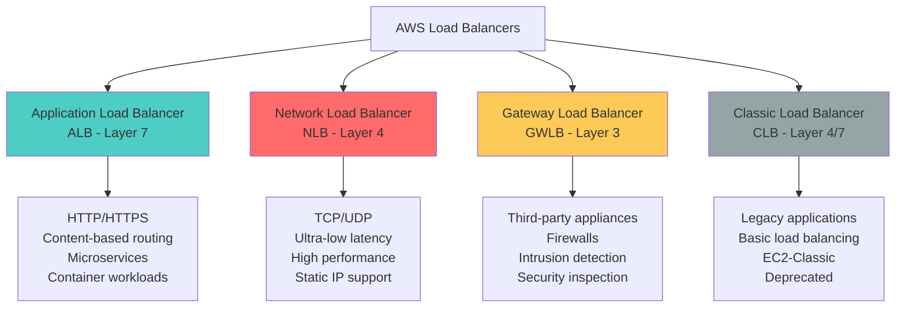
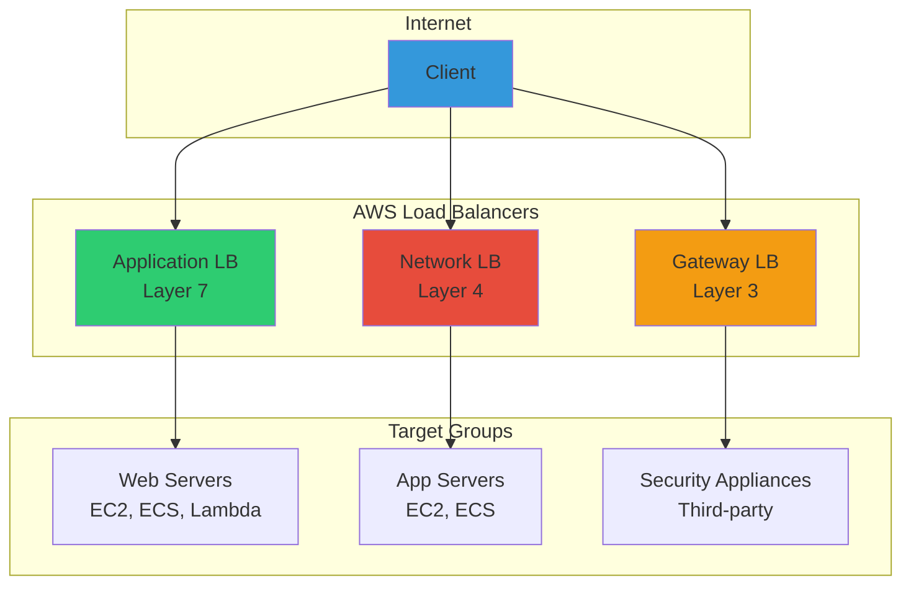
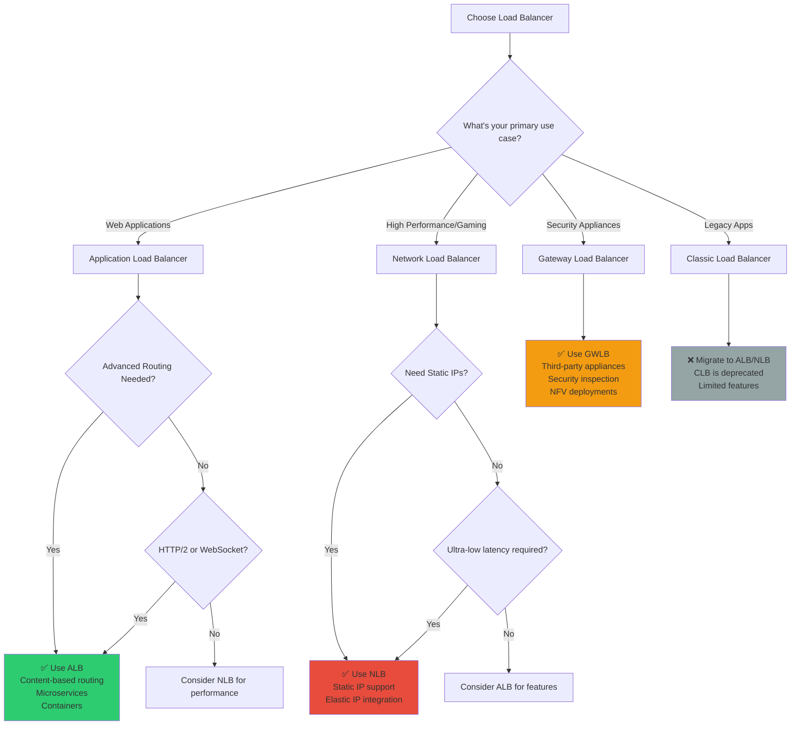

## 🎯 Introduction

AWS Load Balancers are critical components for building highly available, fault-tolerant, and scalable applications in the cloud. They distribute incoming traffic across multiple targets, ensuring optimal resource utilization and system reliability. This comprehensive guide explores all AWS Load Balancer types, their unique features, and when to use each one for maximum effectiveness.

Understanding the nuances between Application Load Balancer (ALB), Network Load Balancer (NLB), Gateway Load Balancer (GWLB), and Classic Load Balancer (CLB) is essential for architecting robust cloud solutions that can handle varying traffic patterns and requirements.

## 🔍 AWS Load Balancer Overview

### 📊 Load Balancer Types Comparison



### 🏗️ High-Level Architecture



## 🌐 Application Load Balancer (ALB)

### 📋 Overview and Features

Application Load Balancer operates at Layer 7 (Application Layer) and is ideal for HTTP/HTTPS traffic routing with advanced features for modern applications.

#### ✅ **Key Features:**
- **Content-based routing** using URL paths, hostnames, headers, and query strings
- **HTTP/2 and WebSocket support**
- **Native IPv6 support**
- **Integration with AWS services** (ECS, EKS, Lambda, etc.)
- **Advanced health checks**
- **SSL/TLS termination and offloading**
- **User authentication** (OIDC, SAML)
- **Request tracing and detailed metrics**

### 🛠️ ALB Implementation with Java

**Maven Dependencies for ALB Management:**

```xml
<dependencies>
    <!-- AWS SDK for ELB v2 -->
    <dependency>
        <groupId>software.amazon.awssdk</groupId>
        <artifactId>elasticloadbalancingv2</artifactId>
        <version>2.21.29</version>
    </dependency>

    <!-- AWS SDK for EC2 (for target management) -->
    <dependency>
        <groupId>software.amazon.awssdk</groupId>
        <artifactId>ec2</artifactId>
        <version>2.21.29</version>
    </dependency>

    <!-- Spring Boot for application -->
    <dependency>
        <groupId>org.springframework.boot</groupId>
        <artifactId>spring-boot-starter-web</artifactId>
    </dependency>

    <!-- Metrics and monitoring -->
    <dependency>
        <groupId>io.micrometer</groupId>
        <artifactId>micrometer-registry-cloudwatch</artifactId>
    </dependency>
</dependencies>
```

#### 🔧 ALB Configuration Service

```java
@Service
@Slf4j
public class ApplicationLoadBalancerService {

    private final ElasticLoadBalancingV2Client elbClient;
    private final Ec2Client ec2Client;
    private final String region;
    private final String accountId;

    public ApplicationLoadBalancerService(@Value("${aws.region}") String region,
                                        @Value("${aws.account-id}") String accountId) {
        this.region = region;
        this.accountId = accountId;
        this.elbClient = ElasticLoadBalancingV2Client.builder()
            .region(Region.of(region))
            .build();
        this.ec2Client = Ec2Client.builder()
            .region(Region.of(region))
            .build();
    }

    public String createApplicationLoadBalancer(ALBConfiguration config) {
        try {
            // 1. Create the load balancer
            CreateLoadBalancerRequest request = CreateLoadBalancerRequest.builder()
                .name(config.getName())
                .scheme(config.isInternetFacing() ? Scheme.INTERNET_FACING : Scheme.INTERNAL)
                .type(LoadBalancerTypeEnum.APPLICATION)
                .ipAddressType(config.getIpAddressType())
                .subnets(config.getSubnetIds())
                .securityGroups(config.getSecurityGroupIds())
                .tags(Tag.builder()
                    .key("Environment")
                    .value(config.getEnvironment())
                    .build(),
                    Tag.builder()
                    .key("Application")
                    .value(config.getApplicationName())
                    .build())
                .build();

            CreateLoadBalancerResponse response = elbClient.createLoadBalancer(request);
            String loadBalancerArn = response.loadBalancers().get(0).loadBalancerArn();

            log.info("Created Application Load Balancer: {} with ARN: {}", config.getName(), loadBalancerArn);

            // 2. Create target group
            String targetGroupArn = createTargetGroup(config, loadBalancerArn);

            // 3. Create listener
            createListener(loadBalancerArn, targetGroupArn, config);

            // 4. Configure health checks
            configureHealthCheck(targetGroupArn, config.getHealthCheckConfig());

            return loadBalancerArn;

        } catch (Exception e) {
            log.error("Failed to create Application Load Balancer: {}", config.getName(), e);
            throw new RuntimeException("ALB creation failed", e);
        }
    }

    private String createTargetGroup(ALBConfiguration config, String loadBalancerArn) {
        try {
            CreateTargetGroupRequest request = CreateTargetGroupRequest.builder()
                .name(config.getName() + "-tg")
                .protocol(ProtocolEnum.HTTP)
                .port(config.getTargetPort())
                .vpcId(config.getVpcId())
                .targetType(config.getTargetType())
                .healthCheckEnabled(true)
                .healthCheckPath(config.getHealthCheckConfig().getPath())
                .healthCheckProtocol(ProtocolEnum.HTTP)
                .healthCheckPort("traffic-port")
                .healthCheckIntervalSeconds(config.getHealthCheckConfig().getInterval())
                .healthyThresholdCount(config.getHealthCheckConfig().getHealthyThreshold())
                .unhealthyThresholdCount(config.getHealthCheckConfig().getUnhealthyThreshold())
                .healthCheckTimeoutSeconds(config.getHealthCheckConfig().getTimeout())
                .matcher(Matcher.builder()
                    .httpCode(config.getHealthCheckConfig().getSuccessCodes())
                    .build())
                .tags(Tag.builder()
                    .key("LoadBalancer")
                    .value(loadBalancerArn)
                    .build())
                .build();

            CreateTargetGroupResponse response = elbClient.createTargetGroup(request);
            String targetGroupArn = response.targetGroups().get(0).targetGroupArn();

            log.info("Created target group: {} with ARN: {}", config.getName() + "-tg", targetGroupArn);
            return targetGroupArn;

        } catch (Exception e) {
            log.error("Failed to create target group for ALB: {}", config.getName(), e);
            throw new RuntimeException("Target group creation failed", e);
        }
    }

    private void createListener(String loadBalancerArn, String targetGroupArn, ALBConfiguration config) {
        try {
            CreateListenerRequest.Builder requestBuilder = CreateListenerRequest.builder()
                .loadBalancerArn(loadBalancerArn)
                .protocol(ProtocolEnum.HTTP)
                .port(80)
                .defaultActions(Action.builder()
                    .type(ActionTypeEnum.FORWARD)
                    .targetGroupArn(targetGroupArn)
                    .build());

            // Add HTTPS listener if SSL certificate is provided
            if (config.getSslCertificateArn() != null) {
                // Create HTTPS listener
                CreateListenerRequest httpsRequest = CreateListenerRequest.builder()
                    .loadBalancerArn(loadBalancerArn)
                    .protocol(ProtocolEnum.HTTPS)
                    .port(443)
                    .certificates(Certificate.builder()
                        .certificateArn(config.getSslCertificateArn())
                        .build())
                    .sslPolicy(config.getSslPolicy())
                    .defaultActions(Action.builder()
                        .type(ActionTypeEnum.FORWARD)
                        .targetGroupArn(targetGroupArn)
                        .build())
                    .build();

                elbClient.createListener(httpsRequest);

                // Redirect HTTP to HTTPS
                requestBuilder.defaultActions(Action.builder()
                    .type(ActionTypeEnum.REDIRECT)
                    .redirectConfig(RedirectActionConfig.builder()
                        .protocol("HTTPS")
                        .port("443")
                        .statusCode(HttpRedirectActionStatusCodeEnum.HTTP_301)
                        .build())
                    .build());
            }

            elbClient.createListener(requestBuilder.build());
            log.info("Created listeners for ALB: {}", loadBalancerArn);

        } catch (Exception e) {
            log.error("Failed to create listeners for ALB: {}", loadBalancerArn, e);
            throw new RuntimeException("Listener creation failed", e);
        }
    }

    public void registerTargets(String targetGroupArn, List<String> targetIds) {
        try {
            List<TargetDescription> targets = targetIds.stream()
                .map(id -> TargetDescription.builder()
                    .id(id)
                    .build())
                .collect(Collectors.toList());

            RegisterTargetsRequest request = RegisterTargetsRequest.builder()
                .targetGroupArn(targetGroupArn)
                .targets(targets)
                .build();

            elbClient.registerTargets(request);
            log.info("Registered {} targets to target group: {}", targetIds.size(), targetGroupArn);

        } catch (Exception e) {
            log.error("Failed to register targets to target group: {}", targetGroupArn, e);
            throw new RuntimeException("Target registration failed", e);
        }
    }

    public void createAdvancedRoutingRules(String listenerArn, List<RoutingRule> rules) {
        try {
            List<Rule> listenerRules = new ArrayList<>();
            int priority = 100;

            for (RoutingRule rule : rules) {
                Rule listenerRule = Rule.builder()
                    .priority(String.valueOf(priority++))
                    .conditions(createRuleConditions(rule))
                    .actions(createRuleActions(rule))
                    .build();

                listenerRules.add(listenerRule);
            }

            CreateRuleRequest request = CreateRuleRequest.builder()
                .listenerArn(listenerArn)
                .priority(String.valueOf(priority))
                .conditions(listenerRules.get(0).conditions())
                .actions(listenerRules.get(0).actions())
                .build();

            for (Rule rule : listenerRules) {
                CreateRuleRequest ruleRequest = CreateRuleRequest.builder()
                    .listenerArn(listenerArn)
                    .priority(rule.priority())
                    .conditions(rule.conditions())
                    .actions(rule.actions())
                    .build();

                elbClient.createRule(ruleRequest);
            }

            log.info("Created {} advanced routing rules for listener: {}", rules.size(), listenerArn);

        } catch (Exception e) {
            log.error("Failed to create routing rules for listener: {}", listenerArn, e);
            throw new RuntimeException("Rule creation failed", e);
        }
    }

    private List<RuleCondition> createRuleConditions(RoutingRule rule) {
        List<RuleCondition> conditions = new ArrayList<>();

        if (rule.getPathPattern() != null) {
            conditions.add(RuleCondition.builder()
                .field("path-pattern")
                .values(rule.getPathPattern())
                .build());
        }

        if (rule.getHostHeader() != null) {
            conditions.add(RuleCondition.builder()
                .field("host-header")
                .values(rule.getHostHeader())
                .build());
        }

        if (rule.getHttpHeader() != null) {
            conditions.add(RuleCondition.builder()
                .field("http-header")
                .httpHeaderConfig(HttpHeaderConditionConfig.builder()
                    .httpHeaderName(rule.getHttpHeader().getKey())
                    .values(rule.getHttpHeader().getValue())
                    .build())
                .build());
        }

        if (rule.getQueryString() != null) {
            conditions.add(RuleCondition.builder()
                .field("query-string")
                .queryStringConfig(QueryStringConditionConfig.builder()
                    .values(QueryStringKeyValuePair.builder()
                        .key(rule.getQueryString().getKey())
                        .value(rule.getQueryString().getValue())
                        .build())
                    .build())
                .build());
        }

        return conditions;
    }

    private List<Action> createRuleActions(RoutingRule rule) {
        List<Action> actions = new ArrayList<>();

        switch (rule.getActionType()) {
            case FORWARD:
                actions.add(Action.builder()
                    .type(ActionTypeEnum.FORWARD)
                    .targetGroupArn(rule.getTargetGroupArn())
                    .build());
                break;

            case REDIRECT:
                actions.add(Action.builder()
                    .type(ActionTypeEnum.REDIRECT)
                    .redirectConfig(RedirectActionConfig.builder()
                        .protocol(rule.getRedirectConfig().getProtocol())
                        .host(rule.getRedirectConfig().getHost())
                        .port(rule.getRedirectConfig().getPort())
                        .path(rule.getRedirectConfig().getPath())
                        .statusCode(HttpRedirectActionStatusCodeEnum.fromValue(rule.getRedirectConfig().getStatusCode()))
                        .build())
                    .build());
                break;

            case FIXED_RESPONSE:
                actions.add(Action.builder()
                    .type(ActionTypeEnum.FIXED_RESPONSE)
                    .fixedResponseConfig(FixedResponseActionConfig.builder()
                        .statusCode(rule.getFixedResponse().getStatusCode())
                        .contentType(rule.getFixedResponse().getContentType())
                        .messageBody(rule.getFixedResponse().getMessageBody())
                        .build())
                    .build());
                break;

            case WEIGHTED_FORWARD:
                actions.add(Action.builder()
                    .type(ActionTypeEnum.FORWARD)
                    .forwardConfig(ForwardActionConfig.builder()
                        .targetGroups(rule.getWeightedTargets().stream()
                            .map(wt -> TargetGroupTuple.builder()
                                .targetGroupArn(wt.getTargetGroupArn())
                                .weight(wt.getWeight())
                                .build())
                            .collect(Collectors.toList()))
                        .build())
                    .build());
                break;
        }

        return actions;
    }

    private void configureHealthCheck(String targetGroupArn, HealthCheckConfig healthConfig) {
        try {
            ModifyTargetGroupRequest request = ModifyTargetGroupRequest.builder()
                .targetGroupArn(targetGroupArn)
                .healthCheckEnabled(true)
                .healthCheckPath(healthConfig.getPath())
                .healthCheckIntervalSeconds(healthConfig.getInterval())
                .healthCheckTimeoutSeconds(healthConfig.getTimeout())
                .healthyThresholdCount(healthConfig.getHealthyThreshold())
                .unhealthyThresholdCount(healthConfig.getUnhealthyThreshold())
                .matcher(Matcher.builder()
                    .httpCode(healthConfig.getSuccessCodes())
                    .build())
                .build();

            elbClient.modifyTargetGroup(request);
            log.info("Configured health check for target group: {}", targetGroupArn);

        } catch (Exception e) {
            log.error("Failed to configure health check for target group: {}", targetGroupArn, e);
            throw new RuntimeException("Health check configuration failed", e);
        }
    }

    // Supporting configuration classes
    public static class ALBConfiguration {
        private String name;
        private boolean internetFacing;
        private IpAddressType ipAddressType = IpAddressType.IPV4;
        private List<String> subnetIds;
        private List<String> securityGroupIds;
        private String vpcId;
        private String environment;
        private String applicationName;
        private int targetPort = 80;
        private TargetTypeEnum targetType = TargetTypeEnum.INSTANCE;
        private String sslCertificateArn;
        private String sslPolicy = "ELBSecurityPolicy-TLS-1-2-2017-01";
        private HealthCheckConfig healthCheckConfig = new HealthCheckConfig();

        // Constructors, getters, setters
        public ALBConfiguration() {}

        public ALBConfiguration(String name, List<String> subnetIds, List<String> securityGroupIds, String vpcId) {
            this.name = name;
            this.subnetIds = subnetIds;
            this.securityGroupIds = securityGroupIds;
            this.vpcId = vpcId;
            this.internetFacing = true;
            this.environment = "production";
        }

        // Getters and setters
        public String getName() { return name; }
        public void setName(String name) { this.name = name; }
        public boolean isInternetFacing() { return internetFacing; }
        public void setInternetFacing(boolean internetFacing) { this.internetFacing = internetFacing; }
        public IpAddressType getIpAddressType() { return ipAddressType; }
        public void setIpAddressType(IpAddressType ipAddressType) { this.ipAddressType = ipAddressType; }
        public List<String> getSubnetIds() { return subnetIds; }
        public void setSubnetIds(List<String> subnetIds) { this.subnetIds = subnetIds; }
        public List<String> getSecurityGroupIds() { return securityGroupIds; }
        public void setSecurityGroupIds(List<String> securityGroupIds) { this.securityGroupIds = securityGroupIds; }
        public String getVpcId() { return vpcId; }
        public void setVpcId(String vpcId) { this.vpcId = vpcId; }
        public String getEnvironment() { return environment; }
        public void setEnvironment(String environment) { this.environment = environment; }
        public String getApplicationName() { return applicationName; }
        public void setApplicationName(String applicationName) { this.applicationName = applicationName; }
        public int getTargetPort() { return targetPort; }
        public void setTargetPort(int targetPort) { this.targetPort = targetPort; }
        public TargetTypeEnum getTargetType() { return targetType; }
        public void setTargetType(TargetTypeEnum targetType) { this.targetType = targetType; }
        public String getSslCertificateArn() { return sslCertificateArn; }
        public void setSslCertificateArn(String sslCertificateArn) { this.sslCertificateArn = sslCertificateArn; }
        public String getSslPolicy() { return sslPolicy; }
        public void setSslPolicy(String sslPolicy) { this.sslPolicy = sslPolicy; }
        public HealthCheckConfig getHealthCheckConfig() { return healthCheckConfig; }
        public void setHealthCheckConfig(HealthCheckConfig healthCheckConfig) { this.healthCheckConfig = healthCheckConfig; }
    }

    public static class HealthCheckConfig {
        private String path = "/health";
        private int interval = 30;
        private int timeout = 5;
        private int healthyThreshold = 5;
        private int unhealthyThreshold = 2;
        private String successCodes = "200";

        // Constructors, getters, setters
        public HealthCheckConfig() {}

        public String getPath() { return path; }
        public void setPath(String path) { this.path = path; }
        public int getInterval() { return interval; }
        public void setInterval(int interval) { this.interval = interval; }
        public int getTimeout() { return timeout; }
        public void setTimeout(int timeout) { this.timeout = timeout; }
        public int getHealthyThreshold() { return healthyThreshold; }
        public void setHealthyThreshold(int healthyThreshold) { this.healthyThreshold = healthyThreshold; }
        public int getUnhealthyThreshold() { return unhealthyThreshold; }
        public void setUnhealthyThreshold(int unhealthyThreshold) { this.unhealthyThreshold = unhealthyThreshold; }
        public String getSuccessCodes() { return successCodes; }
        public void setSuccessCodes(String successCodes) { this.successCodes = successCodes; }
    }

    public static class RoutingRule {
        private String pathPattern;
        private String hostHeader;
        private KeyValue httpHeader;
        private KeyValue queryString;
        private ActionType actionType;
        private String targetGroupArn;
        private RedirectConfig redirectConfig;
        private FixedResponseConfig fixedResponse;
        private List<WeightedTarget> weightedTargets;

        public enum ActionType {
            FORWARD, REDIRECT, FIXED_RESPONSE, WEIGHTED_FORWARD
        }

        // Constructors, getters, setters
        public RoutingRule() {}

        public String getPathPattern() { return pathPattern; }
        public void setPathPattern(String pathPattern) { this.pathPattern = pathPattern; }
        public String getHostHeader() { return hostHeader; }
        public void setHostHeader(String hostHeader) { this.hostHeader = hostHeader; }
        public KeyValue getHttpHeader() { return httpHeader; }
        public void setHttpHeader(KeyValue httpHeader) { this.httpHeader = httpHeader; }
        public KeyValue getQueryString() { return queryString; }
        public void setQueryString(KeyValue queryString) { this.queryString = queryString; }
        public ActionType getActionType() { return actionType; }
        public void setActionType(ActionType actionType) { this.actionType = actionType; }
        public String getTargetGroupArn() { return targetGroupArn; }
        public void setTargetGroupArn(String targetGroupArn) { this.targetGroupArn = targetGroupArn; }
        public RedirectConfig getRedirectConfig() { return redirectConfig; }
        public void setRedirectConfig(RedirectConfig redirectConfig) { this.redirectConfig = redirectConfig; }
        public FixedResponseConfig getFixedResponse() { return fixedResponse; }
        public void setFixedResponse(FixedResponseConfig fixedResponse) { this.fixedResponse = fixedResponse; }
        public List<WeightedTarget> getWeightedTargets() { return weightedTargets; }
        public void setWeightedTargets(List<WeightedTarget> weightedTargets) { this.weightedTargets = weightedTargets; }
    }

    // Additional supporting classes...
    public static class KeyValue {
        private String key;
        private String value;

        public KeyValue() {}
        public KeyValue(String key, String value) { this.key = key; this.value = value; }

        public String getKey() { return key; }
        public void setKey(String key) { this.key = key; }
        public String getValue() { return value; }
        public void setValue(String value) { this.value = value; }
    }

    public static class RedirectConfig {
        private String protocol = "HTTPS";
        private String host = "#{host}";
        private String port = "443";
        private String path = "/#{path}";
        private String statusCode = "301";

        // Constructors, getters, setters
        public RedirectConfig() {}

        public String getProtocol() { return protocol; }
        public void setProtocol(String protocol) { this.protocol = protocol; }
        public String getHost() { return host; }
        public void setHost(String host) { this.host = host; }
        public String getPort() { return port; }
        public void setPort(String port) { this.port = port; }
        public String getPath() { return path; }
        public void setPath(String path) { this.path = path; }
        public String getStatusCode() { return statusCode; }
        public void setStatusCode(String statusCode) { this.statusCode = statusCode; }
    }

    public static class FixedResponseConfig {
        private String statusCode = "200";
        private String contentType = "text/plain";
        private String messageBody = "OK";

        // Constructors, getters, setters
        public FixedResponseConfig() {}

        public String getStatusCode() { return statusCode; }
        public void setStatusCode(String statusCode) { this.statusCode = statusCode; }
        public String getContentType() { return contentType; }
        public void setContentType(String contentType) { this.contentType = contentType; }
        public String getMessageBody() { return messageBody; }
        public void setMessageBody(String messageBody) { this.messageBody = messageBody; }
    }

    public static class WeightedTarget {
        private String targetGroupArn;
        private Integer weight;

        public WeightedTarget() {}
        public WeightedTarget(String targetGroupArn, Integer weight) {
            this.targetGroupArn = targetGroupArn;
            this.weight = weight;
        }

        public String getTargetGroupArn() { return targetGroupArn; }
        public void setTargetGroupArn(String targetGroupArn) { this.targetGroupArn = targetGroupArn; }
        public Integer getWeight() { return weight; }
        public void setWeight(Integer weight) { this.weight = weight; }
    }
}
```

### 🎯 ALB Use Cases

#### ✅ **When to Use ALB:**
- **Microservices architecture** with path-based routing
- **Modern web applications** requiring HTTP/2 support
- **Container workloads** (ECS, EKS) with dynamic port mapping
- **Lambda functions** as targets
- **Content-based routing** based on headers, paths, or query strings
- **User authentication** integration needed
- **WebSocket applications**

#### ❌ **When NOT to Use ALB:**
- **Ultra-low latency** requirements (use NLB instead)
- **Non-HTTP protocols** (TCP, UDP)
- **Static IP address** requirements
- **Simple load balancing** with no advanced features needed

## 🚀 Network Load Balancer (NLB)

### 📋 Overview and Features

Network Load Balancer operates at Layer 4 (Transport Layer) and is designed for ultra-high performance and low latency applications.

#### ✅ **Key Features:**
- **Ultra-low latency** (microsecond-level)
- **Handles millions of requests per second**
- **Static IP addresses** and Elastic IP support
- **Preserves source IP addresses**
- **TCP, UDP, and TLS protocol support**
- **Cross-zone load balancing** available
- **Flow hash algorithm** for connection affinity
- **Integration with PrivateLink**

### 🛠️ NLB Implementation

```java
@Service
@Slf4j
public class NetworkLoadBalancerService {

    private final ElasticLoadBalancingV2Client elbClient;
    private final Ec2Client ec2Client;

    public NetworkLoadBalancerService() {
        this.elbClient = ElasticLoadBalancingV2Client.builder().build();
        this.ec2Client = Ec2Client.builder().build();
    }

    public String createNetworkLoadBalancer(NLBConfiguration config) {
        try {
            // 1. Allocate Elastic IPs if needed
            List<String> allocationIds = new ArrayList<>();
            if (config.isUseStaticIps()) {
                allocationIds = allocateElasticIPs(config.getSubnetIds().size());
            }

            // 2. Create load balancer
            CreateLoadBalancerRequest.Builder requestBuilder = CreateLoadBalancerRequest.builder()
                .name(config.getName())
                .scheme(config.isInternetFacing() ? Scheme.INTERNET_FACING : Scheme.INTERNAL)
                .type(LoadBalancerTypeEnum.NETWORK)
                .ipAddressType(config.getIpAddressType());

            // Configure subnets with static IPs if specified
            if (config.isUseStaticIps() && !allocationIds.isEmpty()) {
                List<SubnetMapping> subnetMappings = new ArrayList<>();
                for (int i = 0; i < config.getSubnetIds().size(); i++) {
                    subnetMappings.add(SubnetMapping.builder()
                        .subnetId(config.getSubnetIds().get(i))
                        .allocationId(i < allocationIds.size() ? allocationIds.get(i) : null)
                        .build());
                }
                requestBuilder.subnetMappings(subnetMappings);
            } else {
                requestBuilder.subnets(config.getSubnetIds());
            }

            requestBuilder.tags(
                Tag.builder().key("Environment").value(config.getEnvironment()).build(),
                Tag.builder().key("Application").value(config.getApplicationName()).build(),
                Tag.builder().key("Type").value("NetworkLoadBalancer").build()
            );

            CreateLoadBalancerResponse response = elbClient.createLoadBalancer(requestBuilder.build());
            String loadBalancerArn = response.loadBalancers().get(0).loadBalancerArn();

            log.info("Created Network Load Balancer: {} with ARN: {}", config.getName(), loadBalancerArn);

            // 3. Create target group
            String targetGroupArn = createNLBTargetGroup(config);

            // 4. Create listener
            createNLBListener(loadBalancerArn, targetGroupArn, config);

            return loadBalancerArn;

        } catch (Exception e) {
            log.error("Failed to create Network Load Balancer: {}", config.getName(), e);
            throw new RuntimeException("NLB creation failed", e);
        }
    }

    private List<String> allocateElasticIPs(int count) {
        List<String> allocationIds = new ArrayList<>();

        for (int i = 0; i < count; i++) {
            try {
                AllocateAddressRequest request = AllocateAddressRequest.builder()
                    .domain(DomainType.VPC)
                    .build();

                AllocateAddressResponse response = ec2Client.allocateAddress(request);
                allocationIds.add(response.allocationId());

                log.info("Allocated Elastic IP: {} ({})", response.publicIp(), response.allocationId());

            } catch (Exception e) {
                log.error("Failed to allocate Elastic IP", e);
                throw new RuntimeException("Elastic IP allocation failed", e);
            }
        }

        return allocationIds;
    }

    private String createNLBTargetGroup(NLBConfiguration config) {
        try {
            CreateTargetGroupRequest.Builder requestBuilder = CreateTargetGroupRequest.builder()
                .name(config.getName() + "-nlb-tg")
                .protocol(ProtocolEnum.fromValue(config.getProtocol().toUpperCase()))
                .port(config.getTargetPort())
                .vpcId(config.getVpcId())
                .targetType(config.getTargetType())
                .healthCheckEnabled(true)
                .healthCheckProtocol(ProtocolEnum.fromValue(config.getHealthCheckProtocol().toUpperCase()))
                .healthCheckPort("traffic-port")
                .healthCheckIntervalSeconds(config.getHealthCheckInterval())
                .healthyThresholdCount(config.getHealthyThreshold())
                .unhealthyThresholdCount(config.getUnhealthyThreshold());

            // Configure health check path for HTTP/HTTPS
            if (config.getHealthCheckProtocol().equalsIgnoreCase("HTTP") ||
                config.getHealthCheckProtocol().equalsIgnoreCase("HTTPS")) {
                requestBuilder.healthCheckPath(config.getHealthCheckPath());
            }

            // Configure deregistration delay
            requestBuilder.targetGroupAttributes(
                TargetGroupAttribute.builder()
                    .key("deregistration_delay.timeout_seconds")
                    .value(String.valueOf(config.getDeregistrationDelay()))
                    .build(),
                TargetGroupAttribute.builder()
                    .key("preserve_client_ip.enabled")
                    .value(String.valueOf(config.isPreserveClientIp()))
                    .build(),
                TargetGroupAttribute.builder()
                    .key("proxy_protocol_v2.enabled")
                    .value(String.valueOf(config.isProxyProtocolV2()))
                    .build()
            );

            CreateTargetGroupResponse response = elbClient.createTargetGroup(requestBuilder.build());
            String targetGroupArn = response.targetGroups().get(0).targetGroupArn();

            log.info("Created NLB target group: {} with ARN: {}", config.getName() + "-nlb-tg", targetGroupArn);
            return targetGroupArn;

        } catch (Exception e) {
            log.error("Failed to create NLB target group for: {}", config.getName(), e);
            throw new RuntimeException("NLB target group creation failed", e);
        }
    }

    private void createNLBListener(String loadBalancerArn, String targetGroupArn, NLBConfiguration config) {
        try {
            CreateListenerRequest.Builder requestBuilder = CreateListenerRequest.builder()
                .loadBalancerArn(loadBalancerArn)
                .protocol(ProtocolEnum.fromValue(config.getProtocol().toUpperCase()))
                .port(config.getListenerPort())
                .defaultActions(Action.builder()
                    .type(ActionTypeEnum.FORWARD)
                    .targetGroupArn(targetGroupArn)
                    .build());

            // Add TLS configuration if needed
            if (config.getProtocol().equalsIgnoreCase("TLS") && config.getSslCertificateArn() != null) {
                requestBuilder.certificates(Certificate.builder()
                    .certificateArn(config.getSslCertificateArn())
                    .build());
                requestBuilder.sslPolicy(config.getSslPolicy());
            }

            elbClient.createListener(requestBuilder.build());
            log.info("Created NLB listener for port {} with protocol {}", config.getListenerPort(), config.getProtocol());

        } catch (Exception e) {
            log.error("Failed to create NLB listener for: {}", loadBalancerArn, e);
            throw new RuntimeException("NLB listener creation failed", e);
        }
    }

    public void enableCrossZoneLoadBalancing(String loadBalancerArn, boolean enabled) {
        try {
            ModifyLoadBalancerAttributesRequest request = ModifyLoadBalancerAttributesRequest.builder()
                .loadBalancerArn(loadBalancerArn)
                .attributes(LoadBalancerAttribute.builder()
                    .key("load_balancing.cross_zone.enabled")
                    .value(String.valueOf(enabled))
                    .build())
                .build();

            elbClient.modifyLoadBalancerAttributes(request);
            log.info("Cross-zone load balancing {} for NLB: {}",
                enabled ? "enabled" : "disabled", loadBalancerArn);

        } catch (Exception e) {
            log.error("Failed to modify cross-zone load balancing for NLB: {}", loadBalancerArn, e);
            throw new RuntimeException("Cross-zone configuration failed", e);
        }
    }

    public void configureConnectionIdle(String loadBalancerArn, int idleTimeoutSeconds) {
        try {
            ModifyLoadBalancerAttributesRequest request = ModifyLoadBalancerAttributesRequest.builder()
                .loadBalancerArn(loadBalancerArn)
                .attributes(LoadBalancerAttribute.builder()
                    .key("idle_timeout.timeout_seconds")
                    .value(String.valueOf(idleTimeoutSeconds))
                    .build())
                .build();

            elbClient.modifyLoadBalancerAttributes(request);
            log.info("Configured idle timeout to {} seconds for NLB: {}", idleTimeoutSeconds, loadBalancerArn);

        } catch (Exception e) {
            log.error("Failed to configure idle timeout for NLB: {}", loadBalancerArn, e);
            throw new RuntimeException("Idle timeout configuration failed", e);
        }
    }

    // NLB Configuration class
    public static class NLBConfiguration {
        private String name;
        private boolean internetFacing = true;
        private IpAddressType ipAddressType = IpAddressType.IPV4;
        private List<String> subnetIds;
        private String vpcId;
        private String environment = "production";
        private String applicationName;
        private String protocol = "TCP";
        private int listenerPort = 80;
        private int targetPort = 8080;
        private TargetTypeEnum targetType = TargetTypeEnum.INSTANCE;
        private boolean useStaticIps = false;
        private String healthCheckProtocol = "TCP";
        private String healthCheckPath = "/";
        private int healthCheckInterval = 30;
        private int healthyThreshold = 3;
        private int unhealthyThreshold = 3;
        private int deregistrationDelay = 300;
        private boolean preserveClientIp = false;
        private boolean proxyProtocolV2 = false;
        private String sslCertificateArn;
        private String sslPolicy = "ELBSecurityPolicy-TLS-1-2-2017-01";

        // Constructors, getters, setters
        public NLBConfiguration() {}

        public NLBConfiguration(String name, List<String> subnetIds, String vpcId) {
            this.name = name;
            this.subnetIds = subnetIds;
            this.vpcId = vpcId;
        }

        // All getters and setters
        public String getName() { return name; }
        public void setName(String name) { this.name = name; }
        public boolean isInternetFacing() { return internetFacing; }
        public void setInternetFacing(boolean internetFacing) { this.internetFacing = internetFacing; }
        public IpAddressType getIpAddressType() { return ipAddressType; }
        public void setIpAddressType(IpAddressType ipAddressType) { this.ipAddressType = ipAddressType; }
        public List<String> getSubnetIds() { return subnetIds; }
        public void setSubnetIds(List<String> subnetIds) { this.subnetIds = subnetIds; }
        public String getVpcId() { return vpcId; }
        public void setVpcId(String vpcId) { this.vpcId = vpcId; }
        public String getEnvironment() { return environment; }
        public void setEnvironment(String environment) { this.environment = environment; }
        public String getApplicationName() { return applicationName; }
        public void setApplicationName(String applicationName) { this.applicationName = applicationName; }
        public String getProtocol() { return protocol; }
        public void setProtocol(String protocol) { this.protocol = protocol; }
        public int getListenerPort() { return listenerPort; }
        public void setListenerPort(int listenerPort) { this.listenerPort = listenerPort; }
        public int getTargetPort() { return targetPort; }
        public void setTargetPort(int targetPort) { this.targetPort = targetPort; }
        public TargetTypeEnum getTargetType() { return targetType; }
        public void setTargetType(TargetTypeEnum targetType) { this.targetType = targetType; }
        public boolean isUseStaticIps() { return useStaticIps; }
        public void setUseStaticIps(boolean useStaticIps) { this.useStaticIps = useStaticIps; }
        public String getHealthCheckProtocol() { return healthCheckProtocol; }
        public void setHealthCheckProtocol(String healthCheckProtocol) { this.healthCheckProtocol = healthCheckProtocol; }
        public String getHealthCheckPath() { return healthCheckPath; }
        public void setHealthCheckPath(String healthCheckPath) { this.healthCheckPath = healthCheckPath; }
        public int getHealthCheckInterval() { return healthCheckInterval; }
        public void setHealthCheckInterval(int healthCheckInterval) { this.healthCheckInterval = healthCheckInterval; }
        public int getHealthyThreshold() { return healthyThreshold; }
        public void setHealthyThreshold(int healthyThreshold) { this.healthyThreshold = healthyThreshold; }
        public int getUnhealthyThreshold() { return unhealthyThreshold; }
        public void setUnhealthyThreshold(int unhealthyThreshold) { this.unhealthyThreshold = unhealthyThreshold; }
        public int getDeregistrationDelay() { return deregistrationDelay; }
        public void setDeregistrationDelay(int deregistrationDelay) { this.deregistrationDelay = deregistrationDelay; }
        public boolean isPreserveClientIp() { return preserveClientIp; }
        public void setPreserveClientIp(boolean preserveClientIp) { this.preserveClientIp = preserveClientIp; }
        public boolean isProxyProtocolV2() { return proxyProtocolV2; }
        public void setProxyProtocolV2(boolean proxyProtocolV2) { this.proxyProtocolV2 = proxyProtocolV2; }
        public String getSslCertificateArn() { return sslCertificateArn; }
        public void setSslCertificateArn(String sslCertificateArn) { this.sslCertificateArn = sslCertificateArn; }
        public String getSslPolicy() { return sslPolicy; }
        public void setSslPolicy(String sslPolicy) { this.sslPolicy = sslPolicy; }
    }
}
```

### 🎯 NLB Use Cases

#### ✅ **When to Use NLB:**
- **Ultra-low latency** applications
- **High-performance** workloads (gaming, financial trading)
- **TCP/UDP protocols** (databases, custom protocols)
- **Static IP addresses** required
- **Source IP preservation** needed
- **Extreme high throughput** (millions of requests/second)
- **Long-running connections**
- **PrivateLink integration**

#### ❌ **When NOT to Use NLB:**
- **Content-based routing** needed
- **HTTP/HTTPS-specific features** required
- **WebSocket applications** with advanced routing
- **Lambda function targets**
- **User authentication** integration needed

## 🛡️ Gateway Load Balancer (GWLB)

### 📋 Overview and Features

Gateway Load Balancer operates at Layer 3 (Network Layer) and is designed for deploying, scaling, and managing third-party network virtual appliances.

#### ✅ **Key Features:**
- **Third-party appliance integration** (firewalls, intrusion detection)
- **Transparent network gateway**
- **GENEVE protocol** for traffic encapsulation
- **Scalable virtual appliance deployment**
- **Source and destination IP preservation**
- **Symmetric flow routing**
- **Health checking for appliances**

### 🛠️ GWLB Implementation

```java
@Service
@Slf4j
public class GatewayLoadBalancerService {

    private final ElasticLoadBalancingV2Client elbClient;
    private final Ec2Client ec2Client;

    public GatewayLoadBalancerService() {
        this.elbClient = ElasticLoadBalancingV2Client.builder().build();
        this.ec2Client = Ec2Client.builder().build();
    }

    public String createGatewayLoadBalancer(GWLBConfiguration config) {
        try {
            // 1. Create Gateway Load Balancer
            CreateLoadBalancerRequest request = CreateLoadBalancerRequest.builder()
                .name(config.getName())
                .type(LoadBalancerTypeEnum.GATEWAY)
                .subnets(config.getSubnetIds())
                .tags(
                    Tag.builder().key("Environment").value(config.getEnvironment()).build(),
                    Tag.builder().key("Application").value(config.getApplicationName()).build(),
                    Tag.builder().key("Type").value("GatewayLoadBalancer").build()
                )
                .build();

            CreateLoadBalancerResponse response = elbClient.createLoadBalancer(request);
            String loadBalancerArn = response.loadBalancers().get(0).loadBalancerArn();

            log.info("Created Gateway Load Balancer: {} with ARN: {}", config.getName(), loadBalancerArn);

            // 2. Create target group for virtual appliances
            String targetGroupArn = createGWLBTargetGroup(config);

            // 3. Create listener
            createGWLBListener(loadBalancerArn, targetGroupArn, config);

            return loadBalancerArn;

        } catch (Exception e) {
            log.error("Failed to create Gateway Load Balancer: {}", config.getName(), e);
            throw new RuntimeException("GWLB creation failed", e);
        }
    }

    private String createGWLBTargetGroup(GWLBConfiguration config) {
        try {
            CreateTargetGroupRequest request = CreateTargetGroupRequest.builder()
                .name(config.getName() + "-gwlb-tg")
                .protocol(ProtocolEnum.GENEVE)
                .port(6081) // GENEVE default port
                .vpcId(config.getVpcId())
                .targetType(config.getTargetType())
                .healthCheckEnabled(true)
                .healthCheckProtocol(ProtocolEnum.fromValue(config.getHealthCheckProtocol().toUpperCase()))
                .healthCheckPort(String.valueOf(config.getHealthCheckPort()))
                .healthCheckIntervalSeconds(config.getHealthCheckInterval())
                .healthyThresholdCount(config.getHealthyThreshold())
                .unhealthyThresholdCount(config.getUnhealthyThreshold())
                .targetGroupAttributes(
                    TargetGroupAttribute.builder()
                        .key("deregistration_delay.timeout_seconds")
                        .value(String.valueOf(config.getDeregistrationDelay()))
                        .build()
                )
                .build();

            CreateTargetGroupResponse response = elbClient.createTargetGroup(request);
            String targetGroupArn = response.targetGroups().get(0).targetGroupArn();

            log.info("Created GWLB target group: {} with ARN: {}", config.getName() + "-gwlb-tg", targetGroupArn);
            return targetGroupArn;

        } catch (Exception e) {
            log.error("Failed to create GWLB target group for: {}", config.getName(), e);
            throw new RuntimeException("GWLB target group creation failed", e);
        }
    }

    private void createGWLBListener(String loadBalancerArn, String targetGroupArn, GWLBConfiguration config) {
        try {
            CreateListenerRequest request = CreateListenerRequest.builder()
                .loadBalancerArn(loadBalancerArn)
                .defaultActions(Action.builder()
                    .type(ActionTypeEnum.FORWARD)
                    .targetGroupArn(targetGroupArn)
                    .build())
                .build();

            elbClient.createListener(request);
            log.info("Created GWLB listener for: {}", loadBalancerArn);

        } catch (Exception e) {
            log.error("Failed to create GWLB listener for: {}", loadBalancerArn, e);
            throw new RuntimeException("GWLB listener creation failed", e);
        }
    }

    public void registerVirtualAppliances(String targetGroupArn, List<String> instanceIds) {
        try {
            List<TargetDescription> targets = instanceIds.stream()
                .map(id -> TargetDescription.builder()
                    .id(id)
                    .build())
                .collect(Collectors.toList());

            RegisterTargetsRequest request = RegisterTargetsRequest.builder()
                .targetGroupArn(targetGroupArn)
                .targets(targets)
                .build();

            elbClient.registerTargets(request);
            log.info("Registered {} virtual appliances to GWLB target group: {}", instanceIds.size(), targetGroupArn);

        } catch (Exception e) {
            log.error("Failed to register virtual appliances to target group: {}", targetGroupArn, e);
            throw new RuntimeException("Virtual appliance registration failed", e);
        }
    }

    // Create VPC Endpoint for GWLB service
    public String createGWLBEndpoint(String gwlbArn, String vpcId, String subnetId, String routeTableId) {
        try {
            CreateVpcEndpointRequest request = CreateVpcEndpointRequest.builder()
                .vpcId(vpcId)
                .vpcEndpointType(VpcEndpointType.GATEWAY_LOAD_BALANCER)
                .serviceName(extractServiceName(gwlbArn))
                .subnetIds(subnetId)
                .build();

            CreateVpcEndpointResponse response = ec2Client.createVpcEndpoint(request);
            String vpcEndpointId = response.vpcEndpoint().vpcEndpointId();

            log.info("Created GWLB VPC Endpoint: {}", vpcEndpointId);

            // Update route table to route traffic through GWLB endpoint
            updateRouteTable(routeTableId, vpcEndpointId);

            return vpcEndpointId;

        } catch (Exception e) {
            log.error("Failed to create GWLB VPC endpoint", e);
            throw new RuntimeException("GWLB endpoint creation failed", e);
        }
    }

    private String extractServiceName(String gwlbArn) {
        // Extract service name from GWLB ARN for VPC endpoint
        // Format: com.amazonaws.vpce.<region>.vpce-svc-<service-id>
        String region = gwlbArn.split(":")[3];
        String serviceId = gwlbArn.substring(gwlbArn.lastIndexOf("/") + 1);
        return String.format("com.amazonaws.vpce.%s.vpce-svc-%s", region, serviceId);
    }

    private void updateRouteTable(String routeTableId, String vpcEndpointId) {
        try {
            CreateRouteRequest request = CreateRouteRequest.builder()
                .routeTableId(routeTableId)
                .destinationCidrBlock("0.0.0.0/0")
                .vpcEndpointId(vpcEndpointId)
                .build();

            ec2Client.createRoute(request);
            log.info("Updated route table {} to use GWLB endpoint: {}", routeTableId, vpcEndpointId);

        } catch (Exception e) {
            log.error("Failed to update route table: {}", routeTableId, e);
            throw new RuntimeException("Route table update failed", e);
        }
    }

    // GWLB Configuration class
    public static class GWLBConfiguration {
        private String name;
        private List<String> subnetIds;
        private String vpcId;
        private String environment = "production";
        private String applicationName;
        private TargetTypeEnum targetType = TargetTypeEnum.INSTANCE;
        private String healthCheckProtocol = "TCP";
        private int healthCheckPort = 80;
        private int healthCheckInterval = 30;
        private int healthyThreshold = 3;
        private int unhealthyThreshold = 3;
        private int deregistrationDelay = 300;

        // Constructors, getters, setters
        public GWLBConfiguration() {}

        public GWLBConfiguration(String name, List<String> subnetIds, String vpcId) {
            this.name = name;
            this.subnetIds = subnetIds;
            this.vpcId = vpcId;
        }

        // All getters and setters
        public String getName() { return name; }
        public void setName(String name) { this.name = name; }
        public List<String> getSubnetIds() { return subnetIds; }
        public void setSubnetIds(List<String> subnetIds) { this.subnetIds = subnetIds; }
        public String getVpcId() { return vpcId; }
        public void setVpcId(String vpcId) { this.vpcId = vpcId; }
        public String getEnvironment() { return environment; }
        public void setEnvironment(String environment) { this.environment = environment; }
        public String getApplicationName() { return applicationName; }
        public void setApplicationName(String applicationName) { this.applicationName = applicationName; }
        public TargetTypeEnum getTargetType() { return targetType; }
        public void setTargetType(TargetTypeEnum targetType) { this.targetType = targetType; }
        public String getHealthCheckProtocol() { return healthCheckProtocol; }
        public void setHealthCheckProtocol(String healthCheckProtocol) { this.healthCheckProtocol = healthCheckProtocol; }
        public int getHealthCheckPort() { return healthCheckPort; }
        public void setHealthCheckPort(int healthCheckPort) { this.healthCheckPort = healthCheckPort; }
        public int getHealthCheckInterval() { return healthCheckInterval; }
        public void setHealthCheckInterval(int healthCheckInterval) { this.healthCheckInterval = healthCheckInterval; }
        public int getHealthyThreshold() { return healthyThreshold; }
        public void setHealthyThreshold(int healthyThreshold) { this.healthyThreshold = healthyThreshold; }
        public int getUnhealthyThreshold() { return unhealthyThreshold; }
        public void setUnhealthyThreshold(int unhealthyThreshold) { this.unhealthyThreshold = unhealthyThreshold; }
        public int getDeregistrationDelay() { return deregistrationDelay; }
        public void setDeregistrationDelay(int deregistrationDelay) { this.deregistrationDelay = deregistrationDelay; }
    }
}
```

### 🎯 GWLB Use Cases

#### ✅ **When to Use GWLB:**
- **Third-party security appliances** (firewalls, IDS/IPS)
- **Network function virtualization** (NFV)
- **Deep packet inspection** requirements
- **Transparent inline processing**
- **Centralized security inspection**
- **Compliance requirements** for traffic inspection

#### ❌ **When NOT to Use GWLB:**
- **Basic load balancing** needs
- **Application-layer routing**
- **Direct application traffic** distribution
- **Simple high availability** setups

## 📊 Complete Load Balancer Comparison

### 🔍 Detailed Feature Matrix

| Feature | ALB | NLB | GWLB | CLB |
|---------|-----|-----|------|-----|
| **OSI Layer** | Layer 7 (Application) | Layer 4 (Transport) | Layer 3 (Network) | Layer 4/7 |
| **Protocols** | HTTP, HTTPS, WebSocket | TCP, UDP, TLS | GENEVE | HTTP, HTTPS, TCP, SSL |
| **Target Types** | Instance, IP, Lambda | Instance, IP, ALB | Instance, IP | Instance |
| **Static IP** | ❌ No | ✅ Yes | ❌ No | ❌ No |
| **Content Routing** | ✅ Yes | ❌ No | ❌ No | ❌ Limited |
| **WebSocket Support** | ✅ Yes | ✅ Yes | ❌ No | ❌ No |
| **HTTP/2 Support** | ✅ Yes | ❌ No | ❌ No | ❌ No |
| **Connection Draining** | ✅ Yes | ✅ Yes | ✅ Yes | ✅ Yes |
| **Cross-Zone LB** | ✅ Always On | ⚠️ Optional | ❌ No | ⚠️ Optional |
| **Health Check Types** | HTTP, HTTPS | TCP, HTTP, HTTPS | TCP, HTTP, HTTPS | TCP, HTTP, HTTPS |
| **SSL Termination** | ✅ Yes | ✅ Yes (TLS) | ❌ No | ✅ Yes |
| **Source IP Preservation** | ✅ Yes (headers) | ✅ Yes (native) | ✅ Yes | ❌ No |
| **Integration with WAF** | ✅ Yes | ❌ No | ❌ No | ❌ No |
| **User Authentication** | ✅ Yes | ❌ No | ❌ No | ❌ No |
| **Request Tracing** | ✅ Yes | ❌ Limited | ❌ No | ❌ Limited |
| **Lambda Targets** | ✅ Yes | ❌ No | ❌ No | ❌ No |
| **Container Support** | ✅ Excellent | ✅ Good | ✅ Good | ⚠️ Limited |
| **Pricing Model** | Per hour + LCU | Per hour + NLCU | Per hour + GLCU | Per hour + data |
| **Performance** | High | Ultra-High | High | Medium |
| **Latency** | ~100ms | ~1ms | ~10ms | ~100ms |

### 🎯 Use Case Decision Matrix



## 📈 Monitoring and Health Checks

### 🔍 Load Balancer Monitoring Service

```java
@Service
@Slf4j
public class LoadBalancerMonitoringService {

    private final ElasticLoadBalancingV2Client elbClient;
    private final CloudWatchClient cloudWatchClient;
    private final MeterRegistry meterRegistry;

    public LoadBalancerMonitoringService(MeterRegistry meterRegistry) {
        this.elbClient = ElasticLoadBalancingV2Client.builder().build();
        this.cloudWatchClient = CloudWatchClient.builder().build();
        this.meterRegistry = meterRegistry;
    }

    @Scheduled(fixedRate = 60000) // Every minute
    public void collectLoadBalancerMetrics() {
        try {
            // Get all load balancers
            DescribeLoadBalancersResponse response = elbClient.describeLoadBalancers();

            for (LoadBalancer lb : response.loadBalancers()) {
                collectMetricsForLoadBalancer(lb);
                collectTargetHealthMetrics(lb.loadBalancerArn());
            }

        } catch (Exception e) {
            log.error("Failed to collect load balancer metrics", e);
        }
    }

    private void collectMetricsForLoadBalancer(LoadBalancer lb) {
        String lbName = lb.loadBalancerName();
        LoadBalancerTypeEnum lbType = lb.type();

        try {
            // Request Count
            collectCloudWatchMetric("RequestCount", lbName, lbType);

            // Target Response Time
            collectCloudWatchMetric("TargetResponseTime", lbName, lbType);

            // HTTP Error Codes
            if (lbType == LoadBalancerTypeEnum.APPLICATION) {
                collectCloudWatchMetric("HTTPCode_Target_2XX_Count", lbName, lbType);
                collectCloudWatchMetric("HTTPCode_Target_4XX_Count", lbName, lbType);
                collectCloudWatchMetric("HTTPCode_Target_5XX_Count", lbName, lbType);
                collectCloudWatchMetric("HTTPCode_ELB_4XX_Count", lbName, lbType);
                collectCloudWatchMetric("HTTPCode_ELB_5XX_Count", lbName, lbType);
            }

            // Active Connection Count (for NLB)
            if (lbType == LoadBalancerTypeEnum.NETWORK) {
                collectCloudWatchMetric("ActiveFlowCount", lbName, lbType);
                collectCloudWatchMetric("NewFlowCount", lbName, lbType);
                collectCloudWatchMetric("ProcessedBytes", lbName, lbType);
            }

        } catch (Exception e) {
            log.error("Failed to collect metrics for load balancer: {}", lbName, e);
        }
    }

    private void collectCloudWatchMetric(String metricName, String lbName, LoadBalancerTypeEnum lbType) {
        try {
            String namespace = getNamespaceForLBType(lbType);

            GetMetricStatisticsRequest request = GetMetricStatisticsRequest.builder()
                .namespace(namespace)
                .metricName(metricName)
                .dimensions(Dimension.builder()
                    .name("LoadBalancer")
                    .value(lbName)
                    .build())
                .startTime(Instant.now().minus(Duration.ofMinutes(5)))
                .endTime(Instant.now())
                .period(300) // 5 minutes
                .statistics(Statistic.AVERAGE, Statistic.SUM, Statistic.MAXIMUM)
                .build();

            GetMetricStatisticsResponse response = cloudWatchClient.getMetricStatistics(request);

            response.datapoints().forEach(datapoint -> {
                if (datapoint.average() != null) {
                    Gauge.builder("aws.loadbalancer." + metricName.toLowerCase() + ".average")
                        .tag("load_balancer", lbName)
                        .tag("type", lbType.toString())
                        .register(meterRegistry, () -> datapoint.average());
                }

                if (datapoint.sum() != null) {
                    meterRegistry.counter("aws.loadbalancer." + metricName.toLowerCase() + ".total",
                        "load_balancer", lbName, "type", lbType.toString())
                        .increment(datapoint.sum());
                }
            });

        } catch (Exception e) {
            log.error("Failed to collect CloudWatch metric {} for LB: {}", metricName, lbName, e);
        }
    }

    private void collectTargetHealthMetrics(String loadBalancerArn) {
        try {
            // Get target groups for this load balancer
            DescribeTargetGroupsRequest request = DescribeTargetGroupsRequest.builder()
                .loadBalancerArn(loadBalancerArn)
                .build();

            DescribeTargetGroupsResponse response = elbClient.describeTargetGroups(request);

            for (TargetGroup tg : response.targetGroups()) {
                collectTargetGroupHealthMetrics(tg);
            }

        } catch (Exception e) {
            log.error("Failed to collect target health metrics for LB: {}", loadBalancerArn, e);
        }
    }

    private void collectTargetGroupHealthMetrics(TargetGroup targetGroup) {
        try {
            DescribeTargetHealthRequest request = DescribeTargetHealthRequest.builder()
                .targetGroupArn(targetGroup.targetGroupArn())
                .build();

            DescribeTargetHealthResponse response = elbClient.describeTargetHealth(request);

            Map<String, Long> healthCounts = response.targetHealthDescriptions().stream()
                .collect(Collectors.groupingBy(
                    thd -> thd.targetHealth().state().toString(),
                    Collectors.counting()
                ));

            String tgName = targetGroup.targetGroupName();

            // Record target health metrics
            healthCounts.forEach((state, count) ->
                Gauge.builder("aws.loadbalancer.target.health")
                    .tag("target_group", tgName)
                    .tag("state", state)
                    .register(meterRegistry, () -> count.doubleValue())
            );

            // Calculate health percentage
            long totalTargets = response.targetHealthDescriptions().size();
            long healthyTargets = healthCounts.getOrDefault("healthy", 0L);
            double healthPercentage = totalTargets > 0 ? (double) healthyTargets / totalTargets * 100 : 0;

            Gauge.builder("aws.loadbalancer.target.health_percentage")
                .tag("target_group", tgName)
                .register(meterRegistry, () -> healthPercentage);

        } catch (Exception e) {
            log.error("Failed to collect target group health metrics for: {}", targetGroup.targetGroupName(), e);
        }
    }

    private String getNamespaceForLBType(LoadBalancerTypeEnum lbType) {
        switch (lbType) {
            case APPLICATION:
                return "AWS/ApplicationELB";
            case NETWORK:
                return "AWS/NetworkELB";
            case GATEWAY:
                return "AWS/GatewayELB";
            default:
                return "AWS/ELB";
        }
    }

    public LoadBalancerHealthSummary getHealthSummary(String loadBalancerArn) {
        try {
            // Get load balancer details
            DescribeLoadBalancersRequest lbRequest = DescribeLoadBalancersRequest.builder()
                .loadBalancerArns(loadBalancerArn)
                .build();

            DescribeLoadBalancersResponse lbResponse = elbClient.describeLoadBalancers(lbRequest);
            LoadBalancer lb = lbResponse.loadBalancers().get(0);

            // Get target groups
            DescribeTargetGroupsRequest tgRequest = DescribeTargetGroupsRequest.builder()
                .loadBalancerArn(loadBalancerArn)
                .build();

            DescribeTargetGroupsResponse tgResponse = elbClient.describeTargetGroups(tgRequest);

            List<TargetGroupHealth> targetGroupHealths = new ArrayList<>();

            for (TargetGroup tg : tgResponse.targetGroups()) {
                DescribeTargetHealthRequest thRequest = DescribeTargetHealthRequest.builder()
                    .targetGroupArn(tg.targetGroupArn())
                    .build();

                DescribeTargetHealthResponse thResponse = elbClient.describeTargetHealth(thRequest);

                long totalTargets = thResponse.targetHealthDescriptions().size();
                long healthyTargets = thResponse.targetHealthDescriptions().stream()
                    .mapToLong(thd -> "healthy".equals(thd.targetHealth().state().toString()) ? 1 : 0)
                    .sum();

                targetGroupHealths.add(new TargetGroupHealth(
                    tg.targetGroupName(),
                    totalTargets,
                    healthyTargets,
                    totalTargets > 0 ? (double) healthyTargets / totalTargets * 100 : 0
                ));
            }

            return new LoadBalancerHealthSummary(
                lb.loadBalancerName(),
                lb.type().toString(),
                lb.state().code().toString(),
                targetGroupHealths,
                Instant.now()
            );

        } catch (Exception e) {
            log.error("Failed to get health summary for LB: {}", loadBalancerArn, e);
            return null;
        }
    }

    // Supporting classes for health monitoring
    public static class LoadBalancerHealthSummary {
        private final String loadBalancerName;
        private final String type;
        private final String state;
        private final List<TargetGroupHealth> targetGroups;
        private final Instant timestamp;

        public LoadBalancerHealthSummary(String loadBalancerName, String type, String state,
                                       List<TargetGroupHealth> targetGroups, Instant timestamp) {
            this.loadBalancerName = loadBalancerName;
            this.type = type;
            this.state = state;
            this.targetGroups = targetGroups;
            this.timestamp = timestamp;
        }

        // Getters
        public String getLoadBalancerName() { return loadBalancerName; }
        public String getType() { return type; }
        public String getState() { return state; }
        public List<TargetGroupHealth> getTargetGroups() { return targetGroups; }
        public Instant getTimestamp() { return timestamp; }

        public boolean isHealthy() {
            return "active".equals(state) &&
                   targetGroups.stream().allMatch(tg -> tg.getHealthPercentage() > 50);
        }

        @Override
        public String toString() {
            return String.format("LoadBalancerHealth{name='%s', type='%s', state='%s', healthy=%s, targetGroups=%d}",
                loadBalancerName, type, state, isHealthy(), targetGroups.size());
        }
    }

    public static class TargetGroupHealth {
        private final String targetGroupName;
        private final long totalTargets;
        private final long healthyTargets;
        private final double healthPercentage;

        public TargetGroupHealth(String targetGroupName, long totalTargets, long healthyTargets, double healthPercentage) {
            this.targetGroupName = targetGroupName;
            this.totalTargets = totalTargets;
            this.healthyTargets = healthyTargets;
            this.healthPercentage = healthPercentage;
        }

        // Getters
        public String getTargetGroupName() { return targetGroupName; }
        public long getTotalTargets() { return totalTargets; }
        public long getHealthyTargets() { return healthyTargets; }
        public double getHealthPercentage() { return healthPercentage; }

        @Override
        public String toString() {
            return String.format("TargetGroupHealth{name='%s', healthy=%d/%d (%.1f%%)}",
                targetGroupName, healthyTargets, totalTargets, healthPercentage);
        }
    }
}
```

## 🎯 Conclusion

AWS Load Balancers are essential components for building resilient, scalable, and high-performance applications in the cloud. Each type serves specific use cases and offers unique advantages:

### 🔑 Key Takeaways:

1. **Application Load Balancer (ALB)**: Best for modern web applications requiring advanced HTTP routing and features
2. **Network Load Balancer (NLB)**: Ideal for ultra-high performance, low latency, and TCP/UDP applications
3. **Gateway Load Balancer (GWLB)**: Perfect for third-party security appliances and network function virtualization
4. **Classic Load Balancer (CLB)**: Deprecated, migrate to ALB or NLB for better features and performance

### 📋 Selection Guidelines:

1. **For Web Applications**: Start with ALB for HTTP/HTTPS traffic and advanced routing
2. **For High Performance**: Choose NLB when latency and throughput are critical
3. **For Security Appliances**: Use GWLB for transparent traffic inspection
4. **For Static IPs**: NLB is the only option that supports static IP addresses
5. **For Containers/Lambda**: ALB provides the best integration with modern compute services

### 🚀 Best Practices:

1. **Health Checks**: Configure appropriate health checks for reliable traffic routing
2. **Monitoring**: Implement comprehensive monitoring with CloudWatch and custom metrics
3. **Security**: Use security groups, WAF integration, and SSL/TLS termination
4. **Cost Optimization**: Choose the right load balancer type to avoid unnecessary costs
5. **High Availability**: Deploy across multiple Availability Zones for fault tolerance

Understanding these differences enables you to architect robust, scalable, and cost-effective solutions that meet your specific application requirements and performance goals.