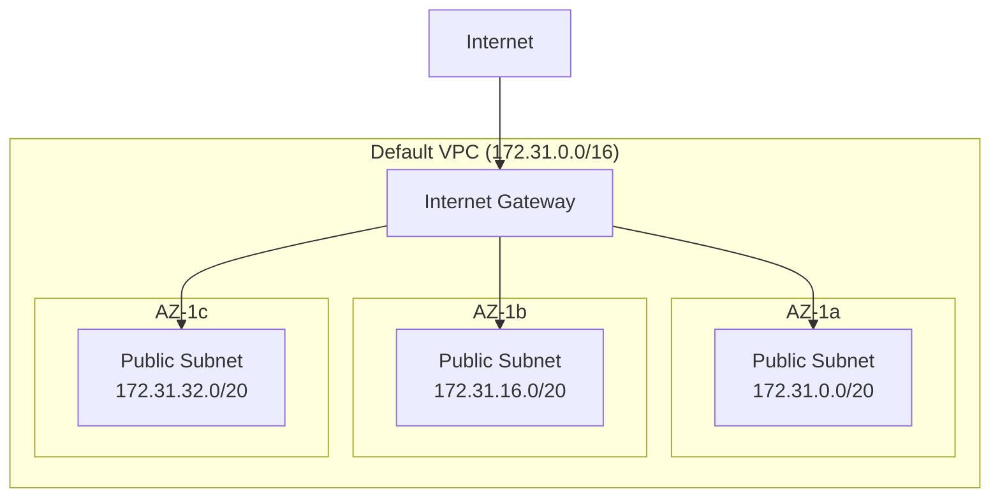
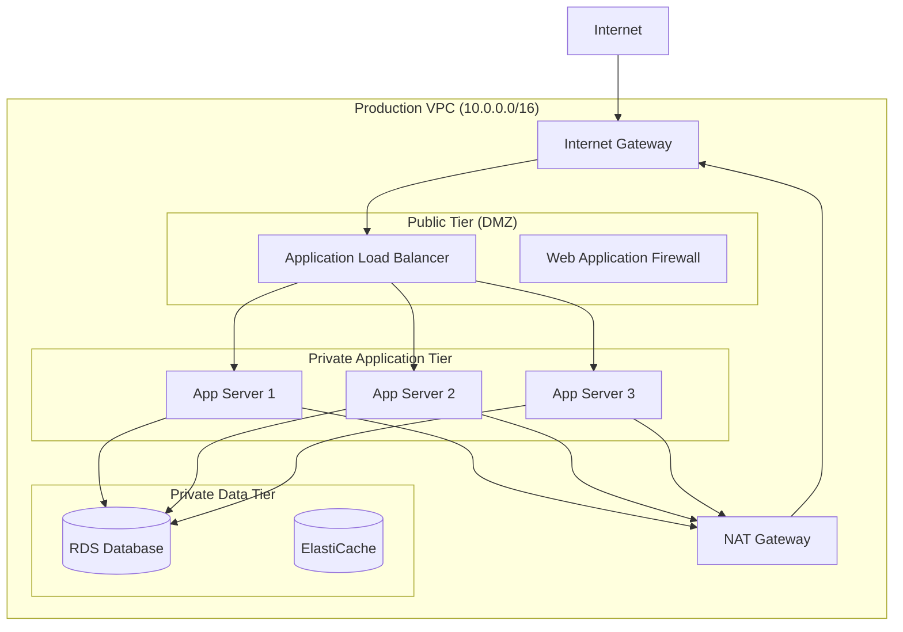
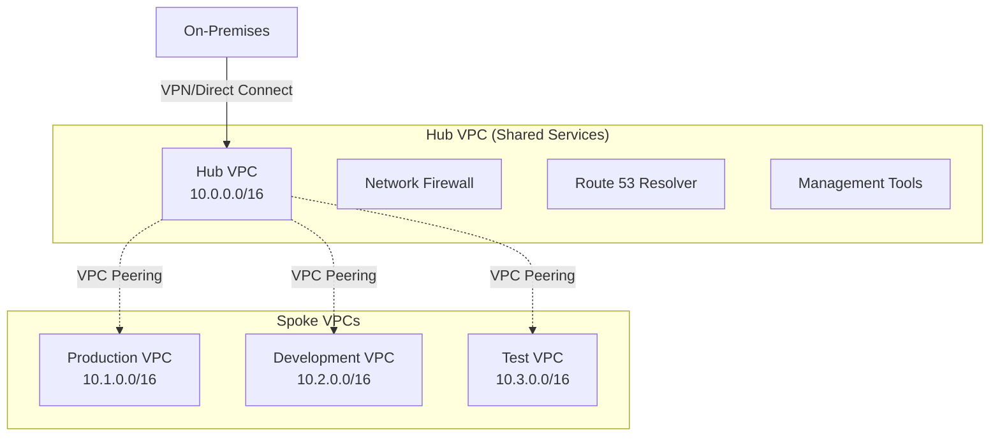
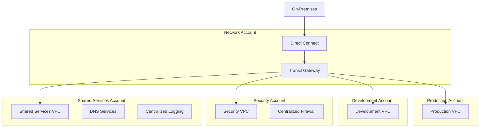

## Introduction

Amazon Virtual Private Cloud (VPC) is the foundation of AWS networking, providing isolated virtual networks within the AWS cloud. This guide explores VPC types, enterprise network design patterns, VPC peering strategies, and practical Java implementations for production environments.

## AWS VPC Fundamentals

### What is AWS VPC?

AWS VPC lets you provision a logically isolated section of the AWS Cloud where you can launch AWS resources in a virtual network that you define. You have complete control over your virtual networking environment, including selection of your own IP address range, creation of subnets, and configuration of route tables and network gateways.

## Types of AWS VPC

### 1. Default VPC

Every AWS account comes with a default VPC in each AWS Region:

- **CIDR Block**: `172.31.0.0/16`
- **Pre-configured**: Internet Gateway, Route Table, Security Group
- **Public Subnets**: One in each Availability Zone
- **Use Cases**: Quick testing, simple applications



### 2. Custom VPC

User-defined VPC with custom configuration:

- **Custom CIDR**: Any RFC 1918 address range
- **Flexible Design**: Public/Private subnet combinations
- **Enhanced Security**: Custom security groups and NACLs
- **Use Cases**: Production applications, complex architectures

### 3. VPC Types by Connectivity

| VPC Type | Internet Access | Use Cases | Security Level |
|----------|----------------|-----------|----------------|
| **Public VPC** | Direct via IGW | Web applications, API endpoints | Medium |
| **Private VPC** | Via NAT Gateway/Instance | Databases, internal services | High |
| **Hybrid VPC** | Mixed public/private | Multi-tier applications | Variable |
| **Isolated VPC** | No internet access | Highly sensitive workloads | Maximum |

## Enterprise Network Design Patterns

### 1. Three-Tier Architecture

Classic enterprise pattern with presentation, application, and data tiers:



### 2. Hub and Spoke Architecture

Centralized connectivity model for multiple VPCs:



### 3. Multi-Account Network Architecture

Enterprise-scale architecture across multiple AWS accounts:



## Common Enterprise Network Components

### 1. Internal Network Segments

```java
@Component
public class NetworkSegmentManager {

    @Value("${aws.vpc.production.cidr}")
    private String productionCidr;

    @Value("${aws.vpc.development.cidr}")
    private String developmentCidr;

    public enum NetworkTier {
        PUBLIC("Public", "0.0.0.0/0"),
        PRIVATE_APP("Private-App", "10.0.0.0/8"),
        PRIVATE_DATA("Private-Data", "172.16.0.0/12"),
        MANAGEMENT("Management", "192.168.0.0/16");

        private final String name;
        private final String defaultCidr;

        NetworkTier(String name, String defaultCidr) {
            this.name = name;
            this.defaultCidr = defaultCidr;
        }

        public String getName() { return name; }
        public String getDefaultCidr() { return defaultCidr; }
    }

    public Subnet createSubnet(NetworkTier tier, String availabilityZone) {
        return Subnet.builder()
            .vpcId(getVpcId())
            .cidrBlock(calculateSubnetCidr(tier))
            .availabilityZone(availabilityZone)
            .mapPublicIpOnLaunch(tier == NetworkTier.PUBLIC)
            .tags(Map.of(
                "Name", tier.getName() + "-" + availabilityZone,
                "Tier", tier.getName(),
                "Environment", getCurrentEnvironment()
            ))
            .build();
    }
}
```

### 2. Firewall Integration

```java
@Service
public class NetworkFirewallService {

    private final Ec2Client ec2Client;
    private final NetworkFirewallClient firewallClient;

    public NetworkFirewallService(Ec2Client ec2Client,
                                 NetworkFirewallClient firewallClient) {
        this.ec2Client = ec2Client;
        this.firewallClient = firewallClient;
    }

    public FirewallPolicy createEnterpriseFirewallPolicy() {

        List<StatelessRule> statelessRules = Arrays.asList(
            createDenyRule("DENY_ALL_FROM_INTERNET", 1, "0.0.0.0/0"),
            createAllowRule("ALLOW_HTTPS", 2, "443"),
            createAllowRule("ALLOW_HTTP", 3, "80")
        );

        List<StatefulRuleGroup> statefulRules = Arrays.asList(
            createThreatIntelligenceRules(),
            createDomainBlockingRules(),
            createApplicationRules()
        );

        return FirewallPolicy.builder()
            .statelessDefaultActions("aws:forward_to_sfe")
            .statelessFragmentDefaultActions("aws:forward_to_sfe")
            .statelessRuleGroupReferences(
                statelessRules.stream()
                    .map(this::createRuleGroupReference)
                    .collect(Collectors.toList())
            )
            .statefulRuleGroupReferences(
                statefulRules.stream()
                    .map(this::createStatefulRuleGroupReference)
                    .collect(Collectors.toList())
            )
            .build();
    }

    public void deployFirewallToVPC(String vpcId, String firewallPolicyArn) {
        try {
            List<SubnetMapping> firewallSubnets = getFirewallSubnets(vpcId);

            CreateFirewallRequest request = CreateFirewallRequest.builder()
                .firewallName("enterprise-firewall-" + vpcId)
                .firewallPolicyArn(firewallPolicyArn)
                .vpcId(vpcId)
                .subnetMappings(firewallSubnets)
                .tags(Map.of(
                    "Environment", "production",
                    "Purpose", "enterprise-security",
                    "ManagedBy", "infrastructure-team"
                ))
                .build();

            CreateFirewallResponse response = firewallClient.createFirewall(request);

            log.info("Firewall deployed successfully: {}", response.firewall().firewallArn());

            updateRouteTablesForFirewall(vpcId, response.firewall().firewallArn());

        } catch (Exception e) {
            log.error("Failed to deploy firewall to VPC {}: {}", vpcId, e.getMessage());
            throw new NetworkFirewallDeploymentException("Firewall deployment failed", e);
        }
    }
}
```

## VPC Peering

### What is VPC Peering?

VPC peering connection is a networking connection between two VPCs that enables you to route traffic between them using private IPv4 addresses or IPv6 addresses.

### VPC Peering Use Cases

| Use Case | Description | Benefits |
|----------|-------------|----------|
| **Cross-Region Connectivity** | Connect VPCs in different regions | Global application architecture |
| **Multi-Account Architecture** | Connect VPCs across AWS accounts | Organizational isolation |
| **Hybrid Cloud Integration** | Connect cloud and on-premises | Gradual cloud migration |
| **Microservices Communication** | Service-to-service communication | Secure inter-service networking |
| **Data Sharing** | Share databases or data lakes | Controlled data access |

### VPC Peering Configuration

```java
@Service
public class VPCPeeringService {

    private final Ec2Client ec2Client;
    private final CloudWatchClient cloudWatchClient;

    public VPCPeeringService(Ec2Client ec2Client, CloudWatchClient cloudWatchClient) {
        this.ec2Client = ec2Client;
        this.cloudWatchClient = cloudWatchClient;
    }

    public VPCPeeringConnection createVPCPeering(VPCPeeringRequest peeringRequest) {

        validatePeeringRequest(peeringRequest);

        CreateVpcPeeringConnectionRequest request = CreateVpcPeeringConnectionRequest.builder()
            .vpcId(peeringRequest.getSourceVpcId())
            .peerVpcId(peeringRequest.getTargetVpcId())
            .peerRegion(peeringRequest.getTargetRegion())
            .peerOwnerId(peeringRequest.getTargetAccountId())
            .tagSpecifications(
                TagSpecification.builder()
                    .resourceType(ResourceType.VPC_PEERING_CONNECTION)
                    .tags(
                        Tag.builder().key("Name")
                           .value(peeringRequest.getConnectionName()).build(),
                        Tag.builder().key("Purpose")
                           .value(peeringRequest.getPurpose()).build(),
                        Tag.builder().key("Environment")
                           .value(peeringRequest.getEnvironment()).build()
                    )
                    .build()
            )
            .build();

        try {
            CreateVpcPeeringConnectionResponse response =
                ec2Client.createVpcPeeringConnection(request);

            VPCPeeringConnection connection = VPCPeeringConnection.builder()
                .peeringConnectionId(response.vpcPeeringConnection().vpcPeeringConnectionId())
                .sourceVpcId(peeringRequest.getSourceVpcId())
                .targetVpcId(peeringRequest.getTargetVpcId())
                .status(response.vpcPeeringConnection().status().code().toString())
                .build();

            if (peeringRequest.isAutoAccept()) {
                acceptVPCPeering(connection.getPeeringConnectionId());
            }

            setupPeeringMonitoring(connection);

            log.info("VPC Peering connection created: {}",
                    connection.getPeeringConnectionId());

            return connection;

        } catch (Exception e) {
            log.error("Failed to create VPC peering connection: {}", e.getMessage());
            throw new VPCPeeringException("VPC Peering creation failed", e);
        }
    }

    public void acceptVPCPeering(String peeringConnectionId) {
        try {
            AcceptVpcPeeringConnectionRequest request =
                AcceptVpcPeeringConnectionRequest.builder()
                    .vpcPeeringConnectionId(peeringConnectionId)
                    .build();

            AcceptVpcPeeringConnectionResponse response =
                ec2Client.acceptVpcPeeringConnection(request);

            log.info("VPC Peering connection accepted: {}", peeringConnectionId);

            waitForPeeringActive(peeringConnectionId);

        } catch (Exception e) {
            log.error("Failed to accept VPC peering connection {}: {}",
                     peeringConnectionId, e.getMessage());
            throw new VPCPeeringException("VPC Peering acceptance failed", e);
        }
    }

    public void configureRoutesForPeering(VPCPeeringConfiguration config) {
        try {
            // Configure routes in source VPC
            for (String routeTableId : config.getSourceRouteTableIds()) {
                CreateRouteRequest sourceRoute = CreateRouteRequest.builder()
                    .routeTableId(routeTableId)
                    .destinationCidrBlock(config.getTargetVpcCidr())
                    .vpcPeeringConnectionId(config.getPeeringConnectionId())
                    .build();

                ec2Client.createRoute(sourceRoute);
            }

            // Configure routes in target VPC
            for (String routeTableId : config.getTargetRouteTableIds()) {
                CreateRouteRequest targetRoute = CreateRouteRequest.builder()
                    .routeTableId(routeTableId)
                    .destinationCidrBlock(config.getSourceVpcCidr())
                    .vpcPeeringConnectionId(config.getPeeringConnectionId())
                    .build();

                ec2Client.createRoute(targetRoute);
            }

            log.info("Routes configured for VPC peering connection: {}",
                    config.getPeeringConnectionId());

        } catch (Exception e) {
            log.error("Failed to configure routes for peering connection {}: {}",
                     config.getPeeringConnectionId(), e.getMessage());
            throw new VPCPeeringException("Route configuration failed", e);
        }
    }

    private void setupPeeringMonitoring(VPCPeeringConnection connection) {
        try {
            // Create CloudWatch alarms for peering connection health
            PutMetricAlarmRequest alarmRequest = PutMetricAlarmRequest.builder()
                .alarmName("vpc-peering-" + connection.getPeeringConnectionId() + "-state")
                .alarmDescription("Monitor VPC Peering Connection State")
                .metricName("VPCPeeringConnectionState")
                .namespace("AWS/VPC")
                .statistic(Statistic.MAXIMUM)
                .dimensions(
                    Dimension.builder()
                        .name("VPCPeeringConnectionId")
                        .value(connection.getPeeringConnectionId())
                        .build()
                )
                .period(300)
                .evaluationPeriods(2)
                .threshold(1.0)
                .comparisonOperator(ComparisonOperator.LESS_THAN_THRESHOLD)
                .treatMissingData("breaching")
                .build();

            cloudWatchClient.putMetricAlarm(alarmRequest);

        } catch (Exception e) {
            log.warn("Failed to setup monitoring for peering connection {}: {}",
                    connection.getPeeringConnectionId(), e.getMessage());
        }
    }
}
```

### VPC Peering Limitations and Considerations

| Limitation | Description | Workaround |
|------------|-------------|------------|
| **Transitive Routing** | No transitive routing between peered VPCs | Use Transit Gateway |
| **Overlapping CIDRs** | Cannot peer VPCs with overlapping IP ranges | Plan CIDR blocks carefully |
| **Single Point of Failure** | One-to-one relationship | Multiple peering connections |
| **Regional Limitations** | Cross-region peering has bandwidth limits | Consider data transfer costs |

## Enterprise VPC Management

### 1. VPC Lifecycle Management

```java
@Service
public class VPCLifecycleManager {

    private final Ec2Client ec2Client;
    private final CloudFormationClient cfnClient;

    public VPCCreationResult createEnterpriseVPC(EnterpriseVPCRequest request) {

        VPCConfiguration config = VPCConfiguration.builder()
            .vpcCidr(request.getCidrBlock())
            .environment(request.getEnvironment())
            .availabilityZones(request.getAvailabilityZones())
            .enableDnsSupport(true)
            .enableDnsHostnames(true)
            .instanceTenancy("default")
            .build();

        try {
            // Create VPC
            String vpcId = createVPC(config);

            // Create subnets
            List<String> publicSubnetIds = createPublicSubnets(vpcId, config);
            List<String> privateSubnetIds = createPrivateSubnets(vpcId, config);

            // Create Internet Gateway
            String igwId = createInternetGateway(vpcId);

            // Create NAT Gateway
            String natGatewayId = createNATGateway(publicSubnetIds.get(0));

            // Configure route tables
            configureRouteTables(vpcId, igwId, natGatewayId,
                               publicSubnetIds, privateSubnetIds);

            // Setup security groups
            List<String> securityGroupIds = createDefaultSecurityGroups(vpcId);

            // Enable flow logs
            enableVPCFlowLogs(vpcId);

            return VPCCreationResult.builder()
                .vpcId(vpcId)
                .publicSubnetIds(publicSubnetIds)
                .privateSubnetIds(privateSubnetIds)
                .internetGatewayId(igwId)
                .natGatewayId(natGatewayId)
                .securityGroupIds(securityGroupIds)
                .status("CREATED")
                .build();

        } catch (Exception e) {
            log.error("Failed to create enterprise VPC: {}", e.getMessage());
            throw new VPCCreationException("VPC creation failed", e);
        }
    }

    public void enableVPCFlowLogs(String vpcId) {
        try {
            CreateFlowLogsRequest request = CreateFlowLogsRequest.builder()
                .resourceType(FlowLogsResourceType.VPC)
                .resourceIds(vpcId)
                .trafficType(TrafficType.ALL)
                .logDestination("arn:aws:logs:" + getCurrentRegion() + ":" +
                               getCurrentAccountId() + ":log-group:/aws/vpc/flowlogs")
                .logDestinationType(LogDestinationType.CLOUD_WATCH_LOGS)
                .logFormat("${version} ${account-id} ${interface-id} ${srcaddr} ${dstaddr} " +
                          "${srcport} ${dstport} ${protocol} ${packets} ${bytes} " +
                          "${windowstart} ${windowend} ${action} ${flowlogstatus}")
                .tags(Map.of(
                    "Name", "vpc-flowlogs-" + vpcId,
                    "Purpose", "security-monitoring"
                ))
                .build();

            CreateFlowLogsResponse response = ec2Client.createFlowLogs(request);

            log.info("VPC Flow Logs enabled for VPC {}: {}",
                    vpcId, response.flowLogIds());

        } catch (Exception e) {
            log.error("Failed to enable VPC Flow Logs for VPC {}: {}",
                     vpcId, e.getMessage());
            throw new VPCConfigurationException("Flow logs configuration failed", e);
        }
    }
}
```

### 2. Network Security Best Practices

```java
@Component
public class NetworkSecurityManager {

    public SecurityGroup createTieredSecurityGroups(String vpcId, NetworkTier tier) {

        Map<NetworkTier, List<SecurityGroupRule>> tierRules = Map.of(
            NetworkTier.PUBLIC, Arrays.asList(
                SecurityGroupRule.inbound("443", "0.0.0.0/0", "HTTPS Traffic"),
                SecurityGroupRule.inbound("80", "0.0.0.0/0", "HTTP Traffic")
            ),
            NetworkTier.PRIVATE_APP, Arrays.asList(
                SecurityGroupRule.inbound("8080", "10.0.0.0/16", "App Traffic"),
                SecurityGroupRule.inbound("443", "10.0.0.0/16", "Internal HTTPS")
            ),
            NetworkTier.PRIVATE_DATA, Arrays.asList(
                SecurityGroupRule.inbound("3306", "10.0.1.0/24", "MySQL Traffic"),
                SecurityGroupRule.inbound("6379", "10.0.1.0/24", "Redis Traffic")
            )
        );

        CreateSecurityGroupRequest request = CreateSecurityGroupRequest.builder()
            .groupName(tier.getName() + "-sg")
            .description("Security Group for " + tier.getName() + " tier")
            .vpcId(vpcId)
            .tags(
                Tag.builder().key("Name").value(tier.getName() + "-sg").build(),
                Tag.builder().key("Tier").value(tier.getName()).build()
            )
            .build();

        CreateSecurityGroupResponse response = ec2Client.createSecurityGroup(request);
        String securityGroupId = response.groupId();

        // Add rules for the tier
        for (SecurityGroupRule rule : tierRules.get(tier)) {
            addSecurityGroupRule(securityGroupId, rule);
        }

        return SecurityGroup.builder()
            .groupId(securityGroupId)
            .groupName(tier.getName() + "-sg")
            .tier(tier)
            .rules(tierRules.get(tier))
            .build();
    }
}
```

## Monitoring and Troubleshooting

### VPC Monitoring Dashboard

```java
@Service
public class VPCMonitoringService {

    public void createVPCDashboard(String vpcId) {

        String dashboardBody = createDashboardDefinition(vpcId);

        PutDashboardRequest request = PutDashboardRequest.builder()
            .dashboardName("VPC-Dashboard-" + vpcId)
            .dashboardBody(dashboardBody)
            .build();

        cloudWatchClient.putDashboard(request);
    }

    private String createDashboardDefinition(String vpcId) {
        return """
        {
            "widgets": [
                {
                    "type": "metric",
                    "properties": {
                        "metrics": [
                            ["AWS/VPC", "NetworkPacketsIn", "VpcId", "%s"],
                            [".", "NetworkPacketsOut", ".", "."],
                            [".", "NetworkBytesIn", ".", "."],
                            [".", "NetworkBytesOut", ".", "."]
                        ],
                        "period": 300,
                        "stat": "Sum",
                        "region": "%s",
                        "title": "VPC Network Traffic"
                    }
                }
            ]
        }
        """.formatted(vpcId, getCurrentRegion());
    }
}
```

## Conclusion

AWS VPC provides the foundation for secure, scalable cloud networking. Key takeaways:

### Best Practices
- **Plan CIDR blocks** carefully to avoid overlapping ranges
- **Implement defense in depth** with multiple security layers
- **Use VPC Flow Logs** for security monitoring and troubleshooting
- **Design for high availability** across multiple Availability Zones
- **Implement proper tagging** for resource management

### When to Use VPC Peering
- Cross-region connectivity requirements
- Multi-account architectures
- Secure service-to-service communication
- Hybrid cloud integration scenarios

### Enterprise Considerations
- Use Transit Gateway for complex multi-VPC architectures
- Implement centralized DNS and logging
- Apply consistent security policies across VPCs
- Monitor network performance and costs

This comprehensive approach to VPC design and management ensures robust, secure, and scalable cloud networking infrastructure for enterprise applications.