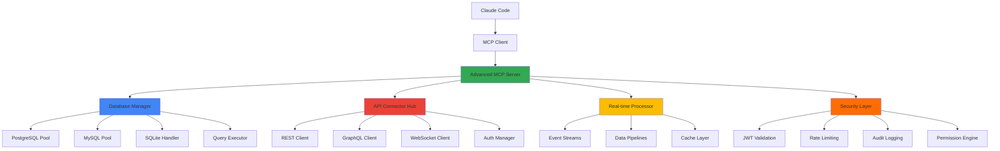

## 🎯 Advanced MCP Server Development

### 📋 Building on Part 1 Foundation

In [Part 1](/posts/building-mcp-servers-claude-code-development-part1/), we built a basic MCP server with utility tools. Now we'll create production-ready servers with:

- **Database Integration**: PostgreSQL, MySQL, SQLite connections with query tools
- **API Connectors**: REST API integration and testing capabilities
- **Real-time Processing**: WebSocket connections and live data streams
- **Production Deployment**: Docker containers, monitoring, and scaling
- **Security**: Authentication, authorization, and audit logging

### 🏗️ Advanced MCP Architecture



## 🗄️ Database Integration & Query Tools

### 📊 Multi-Database Connection Manager

Let's create a robust database integration system that supports multiple database types:

**database_manager.py:**
```python
#!/usr/bin/env python3
"""
Advanced Database Manager for MCP Server
Supports PostgreSQL, MySQL, SQLite with connection pooling
"""

import asyncio
import asyncpg
import aiomysql
import aiosqlite
import logging
from typing import Dict, List, Any, Optional, Union
from dataclasses import dataclass
from contextlib import asynccontextmanager
import json
from datetime import datetime
import hashlib

logger = logging.getLogger(__name__)

@dataclass
class DatabaseConfig:
    """Database connection configuration"""
    db_type: str  # 'postgresql', 'mysql', 'sqlite'
    host: Optional[str] = None
    port: Optional[int] = None
    database: str = None
    username: Optional[str] = None
    password: Optional[str] = None
    file_path: Optional[str] = None  # For SQLite
    pool_size: int = 10
    max_overflow: int = 20
    timeout: int = 30

class DatabaseManager:
    """Advanced database connection manager with pooling"""

    def __init__(self, configs: Dict[str, DatabaseConfig]):
        self.configs = configs
        self.pools = {}
        self.query_cache = {}
        self.query_stats = {}

    async def initialize(self):
        """Initialize database connections and pools"""
        for name, config in self.configs.items():
            try:
                if config.db_type == 'postgresql':
                    self.pools[name] = await asyncpg.create_pool(
                        host=config.host,
                        port=config.port or 5432,
                        database=config.database,
                        user=config.username,
                        password=config.password,
                        min_size=1,
                        max_size=config.pool_size,
                        command_timeout=config.timeout
                    )

                elif config.db_type == 'mysql':
                    self.pools[name] = await aiomysql.create_pool(
                        host=config.host,
                        port=config.port or 3306,
                        db=config.database,
                        user=config.username,
                        password=config.password,
                        minsize=1,
                        maxsize=config.pool_size,
                        autocommit=False
                    )

                elif config.db_type == 'sqlite':
                    # SQLite doesn't use connection pools in the same way
                    self.pools[name] = config.file_path

                logger.info(f"Initialized {config.db_type} connection pool: {name}")

            except Exception as e:
                logger.error(f"Failed to initialize database {name}: {e}")
                raise

    async def close(self):
        """Close all database connections"""
        for name, pool in self.pools.items():
            try:
                if hasattr(pool, 'close'):
                    pool.close()
                    if hasattr(pool, 'wait_closed'):
                        await pool.wait_closed()
                logger.info(f"Closed database connection: {name}")
            except Exception as e:
                logger.error(f"Error closing database {name}: {e}")

    @asynccontextmanager
    async def get_connection(self, db_name: str):
        """Get database connection from pool"""
        if db_name not in self.pools:
            raise ValueError(f"Database {db_name} not configured")

        config = self.configs[db_name]

        if config.db_type == 'postgresql':
            async with self.pools[db_name].acquire() as conn:
                yield conn

        elif config.db_type == 'mysql':
            async with self.pools[db_name].acquire() as conn:
                yield conn

        elif config.db_type == 'sqlite':
            async with aiosqlite.connect(self.pools[db_name]) as conn:
                yield conn

    async def execute_query(
        self,
        db_name: str,
        query: str,
        params: Optional[List] = None,
        fetch_type: str = 'all'  # 'all', 'one', 'none'
    ) -> Dict[str, Any]:
        """Execute database query with safety checks and logging"""

        # Security check
        if not self._is_safe_query(query):
            raise ValueError("Query contains potentially unsafe operations")

        query_hash = hashlib.md5(f"{db_name}:{query}".encode()).hexdigest()
        start_time = datetime.now()

        try:
            async with self.get_connection(db_name) as conn:
                config = self.configs[db_name]

                if config.db_type == 'postgresql':
                    if fetch_type == 'all':
                        rows = await conn.fetch(query, *(params or []))
                        result = [dict(row) for row in rows]
                    elif fetch_type == 'one':
                        row = await conn.fetchrow(query, *(params or []))
                        result = dict(row) if row else None
                    else:  # fetch_type == 'none'
                        await conn.execute(query, *(params or []))
                        result = {"status": "executed"}

                elif config.db_type == 'mysql':
                    async with conn.cursor() as cursor:
                        await cursor.execute(query, params or [])

                        if fetch_type == 'all':
                            rows = await cursor.fetchall()
                            # Get column names
                            columns = [desc[0] for desc in cursor.description] if cursor.description else []
                            result = [dict(zip(columns, row)) for row in rows] if rows else []
                        elif fetch_type == 'one':
                            row = await cursor.fetchone()
                            if row and cursor.description:
                                columns = [desc[0] for desc in cursor.description]
                                result = dict(zip(columns, row))
                            else:
                                result = None
                        else:  # fetch_type == 'none'
                            result = {"status": "executed", "rowcount": cursor.rowcount}

                        if fetch_type == 'none':
                            await conn.commit()

                elif config.db_type == 'sqlite':
                    if fetch_type == 'all':
                        async with conn.execute(query, params or []) as cursor:
                            rows = await cursor.fetchall()
                            columns = [desc[0] for desc in cursor.description] if cursor.description else []
                            result = [dict(zip(columns, row)) for row in rows] if rows else []
                    elif fetch_type == 'one':
                        async with conn.execute(query, params or []) as cursor:
                            row = await cursor.fetchone()
                            if row and cursor.description:
                                columns = [desc[0] for desc in cursor.description]
                                result = dict(zip(columns, row))
                            else:
                                result = None
                    else:  # fetch_type == 'none'
                        await conn.execute(query, params or [])
                        await conn.commit()
                        result = {"status": "executed"}

            # Log query statistics
            execution_time = (datetime.now() - start_time).total_seconds()
            self._record_query_stats(query_hash, query, execution_time, True)

            return {
                "success": True,
                "data": result,
                "execution_time_ms": execution_time * 1000,
                "query_hash": query_hash
            }

        except Exception as e:
            execution_time = (datetime.now() - start_time).total_seconds()
            self._record_query_stats(query_hash, query, execution_time, False, str(e))

            return {
                "success": False,
                "error": str(e),
                "execution_time_ms": execution_time * 1000,
                "query_hash": query_hash
            }

    def _is_safe_query(self, query: str) -> bool:
        """Basic query safety validation"""
        query_lower = query.lower().strip()

        # Block potentially dangerous operations
        dangerous_operations = [
            'drop table', 'drop database', 'truncate',
            'delete from', 'update ', 'insert into',
            'create user', 'grant ', 'revoke ',
            'alter table', 'create database'
        ]

        # Allow only SELECT queries by default
        # In production, you might want more sophisticated validation
        if not query_lower.startswith('select'):
            return False

        for dangerous in dangerous_operations:
            if dangerous in query_lower:
                return False

        return True

    def _record_query_stats(self, query_hash: str, query: str, execution_time: float, success: bool, error: str = None):
        """Record query execution statistics"""
        if query_hash not in self.query_stats:
            self.query_stats[query_hash] = {
                'query': query[:200] + '...' if len(query) > 200 else query,
                'execution_count': 0,
                'total_time': 0,
                'avg_time': 0,
                'success_count': 0,
                'error_count': 0,
                'last_executed': None,
                'last_error': None
            }

        stats = self.query_stats[query_hash]
        stats['execution_count'] += 1
        stats['total_time'] += execution_time
        stats['avg_time'] = stats['total_time'] / stats['execution_count']
        stats['last_executed'] = datetime.now().isoformat()

        if success:
            stats['success_count'] += 1
        else:
            stats['error_count'] += 1
            stats['last_error'] = error

    async def get_schema_info(self, db_name: str, table_name: Optional[str] = None) -> Dict[str, Any]:
        """Get database schema information"""
        config = self.configs[db_name]

        try:
            if config.db_type == 'postgresql':
                if table_name:
                    query = """
                    SELECT column_name, data_type, is_nullable, column_default
                    FROM information_schema.columns
                    WHERE table_name = $1 AND table_schema = 'public'
                    ORDER BY ordinal_position
                    """
                    result = await self.execute_query(db_name, query, [table_name])
                else:
                    query = """
                    SELECT table_name, table_type
                    FROM information_schema.tables
                    WHERE table_schema = 'public'
                    ORDER BY table_name
                    """
                    result = await self.execute_query(db_name, query)

            elif config.db_type == 'mysql':
                if table_name:
                    query = """
                    SELECT COLUMN_NAME as column_name, DATA_TYPE as data_type,
                           IS_NULLABLE as is_nullable, COLUMN_DEFAULT as column_default
                    FROM INFORMATION_SCHEMA.COLUMNS
                    WHERE TABLE_NAME = %s AND TABLE_SCHEMA = DATABASE()
                    ORDER BY ORDINAL_POSITION
                    """
                    result = await self.execute_query(db_name, query, [table_name])
                else:
                    query = """
                    SELECT TABLE_NAME as table_name, TABLE_TYPE as table_type
                    FROM INFORMATION_SCHEMA.TABLES
                    WHERE TABLE_SCHEMA = DATABASE()
                    ORDER BY TABLE_NAME
                    """
                    result = await self.execute_query(db_name, query)

            elif config.db_type == 'sqlite':
                if table_name:
                    query = f"PRAGMA table_info({table_name})"
                    result = await self.execute_query(db_name, query)
                else:
                    query = "SELECT name FROM sqlite_master WHERE type='table' ORDER BY name"
                    result = await self.execute_query(db_name, query)

            return result

        except Exception as e:
            return {
                "success": False,
                "error": f"Failed to get schema info: {str(e)}"
            }

    def get_query_statistics(self) -> Dict[str, Any]:
        """Get query execution statistics"""
        return {
            "total_queries": len(self.query_stats),
            "statistics": self.query_stats
        }
```

### 🛠️ Advanced Database Tools for MCP Server

Now let's integrate the database manager into our MCP server:

**advanced_server.py:**
```python
#!/usr/bin/env python3
"""
Advanced MCP Server with Database Integration
"""

import asyncio
import json
import logging
from typing import Dict, List, Any, Optional
from pathlib import Path

from mcp.server.models import InitializeResult
from mcp.server import Server, NotificationOptions
from mcp.server.stdio import stdio_server
from mcp.types import Tool, TextContent

from database_manager import DatabaseManager, DatabaseConfig

logger = logging.getLogger("advanced-mcp-server")

class AdvancedMCPServer:
    def __init__(self, config_path: str = "advanced_config.json"):
        self.server = Server("advanced-mcp-server")
        self.config_path = config_path
        self.db_manager = None
        self.config = None

        self._setup_tools()

    async def initialize(self):
        """Initialize server and database connections"""
        await self._load_config()
        await self._setup_database_manager()

    async def _load_config(self):
        """Load server configuration"""
        try:
            with open(self.config_path) as f:
                self.config = json.load(f)
        except Exception as e:
            logger.error(f"Failed to load config: {e}")
            raise

    async def _setup_database_manager(self):
        """Setup database manager with configured connections"""
        if 'databases' not in self.config:
            logger.warning("No database configurations found")
            return

        db_configs = {}
        for name, db_config in self.config['databases'].items():
            db_configs[name] = DatabaseConfig(**db_config)

        self.db_manager = DatabaseManager(db_configs)
        await self.db_manager.initialize()

    def _setup_tools(self):
        """Setup MCP tools"""

        @self.server.list_tools()
        async def handle_list_tools() -> List[Tool]:
            return [
                Tool(
                    name="execute_sql_query",
                    description="Execute SQL query on specified database",
                    inputSchema={
                        "type": "object",
                        "properties": {
                            "database": {
                                "type": "string",
                                "description": "Database connection name"
                            },
                            "query": {
                                "type": "string",
                                "description": "SQL query to execute (SELECT only for security)"
                            },
                            "params": {
                                "type": "array",
                                "description": "Query parameters",
                                "items": {"type": "string"},
                                "default": []
                            },
                            "limit": {
                                "type": "integer",
                                "description": "Maximum number of rows to return",
                                "default": 100,
                                "maximum": 1000
                            }
                        },
                        "required": ["database", "query"]
                    }
                ),
                Tool(
                    name="get_database_schema",
                    description="Get database schema information",
                    inputSchema={
                        "type": "object",
                        "properties": {
                            "database": {
                                "type": "string",
                                "description": "Database connection name"
                            },
                            "table": {
                                "type": "string",
                                "description": "Specific table name (optional)"
                            }
                        },
                        "required": ["database"]
                    }
                ),
                Tool(
                    name="database_health_check",
                    description="Check database connection health and statistics",
                    inputSchema={
                        "type": "object",
                        "properties": {
                            "database": {
                                "type": "string",
                                "description": "Database connection name (optional - checks all if not specified)"
                            }
                        }
                    }
                ),
                Tool(
                    name="query_builder_assistant",
                    description="Help build SQL queries based on natural language description",
                    inputSchema={
                        "type": "object",
                        "properties": {
                            "database": {
                                "type": "string",
                                "description": "Database connection name"
                            },
                            "description": {
                                "type": "string",
                                "description": "Natural language description of what you want to query"
                            },
                            "tables": {
                                "type": "array",
                                "description": "Tables to include in the query",
                                "items": {"type": "string"},
                                "default": []
                            }
                        },
                        "required": ["database", "description"]
                    }
                ),
                Tool(
                    name="explain_query_plan",
                    description="Explain SQL query execution plan",
                    inputSchema={
                        "type": "object",
                        "properties": {
                            "database": {
                                "type": "string",
                                "description": "Database connection name"
                            },
                            "query": {
                                "type": "string",
                                "description": "SQL query to explain"
                            }
                        },
                        "required": ["database", "query"]
                    }
                )
            ]

        @self.server.call_tool()
        async def handle_call_tool(name: str, arguments: Dict[str, Any]) -> List[TextContent]:
            if not self.db_manager:
                return [TextContent(
                    type="text",
                    text="Database manager not initialized"
                )]

            try:
                if name == "execute_sql_query":
                    return await self._handle_sql_query(arguments)
                elif name == "get_database_schema":
                    return await self._handle_schema_info(arguments)
                elif name == "database_health_check":
                    return await self._handle_health_check(arguments)
                elif name == "query_builder_assistant":
                    return await self._handle_query_builder(arguments)
                elif name == "explain_query_plan":
                    return await self._handle_explain_plan(arguments)
                else:
                    return [TextContent(
                        type="text",
                        text=f"Unknown tool: {name}"
                    )]

            except Exception as e:
                logger.error(f"Tool execution error for {name}: {e}")
                return [TextContent(
                    type="text",
                    text=f"Error executing {name}: {str(e)}"
                )]

    async def _handle_sql_query(self, arguments: Dict[str, Any]) -> List[TextContent]:
        """Handle SQL query execution"""
        database = arguments.get("database")
        query = arguments.get("query")
        params = arguments.get("params", [])
        limit = arguments.get("limit", 100)

        # Add LIMIT clause if not present in SELECT queries
        if query.strip().lower().startswith("select") and "limit" not in query.lower():
            query = f"{query.rstrip(';')} LIMIT {limit}"

        result = await self.db_manager.execute_query(
            database, query, params, fetch_type='all'
        )

        if result["success"]:
            data = result["data"]
            execution_time = result["execution_time_ms"]

            response = {
                "query": query,
                "database": database,
                "execution_time_ms": execution_time,
                "row_count": len(data) if isinstance(data, list) else 0,
                "results": data[:limit] if isinstance(data, list) else data
            }

            return [TextContent(
                type="text",
                text=f"SQL Query Results:\n{json.dumps(response, indent=2, default=str)}"
            )]
        else:
            return [TextContent(
                type="text",
                text=f"Query failed: {result['error']}"
            )]

    async def _handle_schema_info(self, arguments: Dict[str, Any]) -> List[TextContent]:
        """Handle database schema information request"""
        database = arguments.get("database")
        table = arguments.get("table")

        result = await self.db_manager.get_schema_info(database, table)

        if result["success"]:
            return [TextContent(
                type="text",
                text=f"Database Schema Information:\n{json.dumps(result['data'], indent=2, default=str)}"
            )]
        else:
            return [TextContent(
                type="text",
                text=f"Schema query failed: {result['error']}"
            )]

    async def _handle_health_check(self, arguments: Dict[str, Any]) -> List[TextContent]:
        """Handle database health check"""
        specific_db = arguments.get("database")

        health_info = {
            "timestamp": datetime.now().isoformat(),
            "databases": {}
        }

        databases_to_check = [specific_db] if specific_db else list(self.db_manager.configs.keys())

        for db_name in databases_to_check:
            try:
                # Test basic connectivity with simple query
                result = await self.db_manager.execute_query(
                    db_name, "SELECT 1 as health_check", fetch_type='one'
                )

                health_info["databases"][db_name] = {
                    "status": "healthy" if result["success"] else "unhealthy",
                    "response_time_ms": result["execution_time_ms"],
                    "error": result.get("error")
                }

            except Exception as e:
                health_info["databases"][db_name] = {
                    "status": "unhealthy",
                    "error": str(e)
                }

        # Add query statistics
        health_info["query_statistics"] = self.db_manager.get_query_statistics()

        return [TextContent(
            type="text",
            text=f"Database Health Check:\n{json.dumps(health_info, indent=2, default=str)}"
        )]

    async def _handle_query_builder(self, arguments: Dict[str, Any]) -> List[TextContent]:
        """Handle query builder assistance"""
        database = arguments.get("database")
        description = arguments.get("description")
        tables = arguments.get("tables", [])

        # Get schema information to help build query
        schema_result = await self.db_manager.get_schema_info(database)

        if not schema_result["success"]:
            return [TextContent(
                type="text",
                text=f"Could not retrieve schema: {schema_result['error']}"
            )]

        available_tables = schema_result["data"]

        # Simple query building logic based on description
        # In a production system, you might use NLP or ML for better query generation
        query_suggestions = self._generate_query_suggestions(description, available_tables, tables)

        response = {
            "description": description,
            "database": database,
            "available_tables": [table.get("table_name", table.get("name")) for table in available_tables],
            "suggested_queries": query_suggestions,
            "note": "Review these suggestions and modify as needed. Always test queries in a safe environment."
        }

        return [TextContent(
            type="text",
            text=f"Query Builder Assistant:\n{json.dumps(response, indent=2)}"
        )]

    async def _handle_explain_plan(self, arguments: Dict[str, Any]) -> List[TextContent]:
        """Handle query execution plan explanation"""
        database = arguments.get("database")
        query = arguments.get("query")

        config = self.db_manager.configs[database]

        # Build EXPLAIN query based on database type
        if config.db_type == 'postgresql':
            explain_query = f"EXPLAIN (ANALYZE, BUFFERS, FORMAT JSON) {query}"
        elif config.db_type == 'mysql':
            explain_query = f"EXPLAIN FORMAT=JSON {query}"
        elif config.db_type == 'sqlite':
            explain_query = f"EXPLAIN QUERY PLAN {query}"
        else:
            return [TextContent(
                type="text",
                text=f"EXPLAIN not supported for database type: {config.db_type}"
            )]

        result = await self.db_manager.execute_query(
            database, explain_query, fetch_type='all'
        )

        if result["success"]:
            return [TextContent(
                type="text",
                text=f"Query Execution Plan:\n{json.dumps(result['data'], indent=2, default=str)}"
            )]
        else:
            return [TextContent(
                type="text",
                text=f"EXPLAIN failed: {result['error']}"
            )]

    def _generate_query_suggestions(self, description: str, available_tables: List[Dict], target_tables: List[str]) -> List[str]:
        """Generate SQL query suggestions based on description"""
        suggestions = []

        # Simple keyword-based query generation
        # In production, you'd use more sophisticated NLP
        description_lower = description.lower()

        if target_tables:
            tables_str = ", ".join(target_tables)
        else:
            # Use first table as default
            tables_str = available_tables[0].get("table_name", available_tables[0].get("name", "table_name"))

        if "count" in description_lower:
            suggestions.append(f"SELECT COUNT(*) FROM {tables_str}")

        if "all" in description_lower or "everything" in description_lower:
            suggestions.append(f"SELECT * FROM {tables_str} LIMIT 10")

        if "recent" in description_lower or "latest" in description_lower:
            suggestions.append(f"SELECT * FROM {tables_str} ORDER BY created_at DESC LIMIT 10")

        if "top" in description_lower:
            suggestions.append(f"SELECT * FROM {tables_str} ORDER BY id DESC LIMIT 10")

        # Default suggestion
        if not suggestions:
            suggestions.append(f"SELECT * FROM {tables_str} LIMIT 10")

        return suggestions

    async def run(self):
        """Run the advanced MCP server"""
        await self.initialize()

        async with stdio_server() as (read_stream, write_stream):
            await self.server.run(
                read_stream,
                write_stream,
                InitializeResult(
                    protocolVersion="2024-11-05",
                    capabilities=self.server.get_capabilities(
                        notification_options=NotificationOptions(),
                        experimental_capabilities={}
                    )
                )
            )

    async def cleanup(self):
        """Cleanup resources"""
        if self.db_manager:
            await self.db_manager.close()
```

## 🌐 REST API Integration & Testing Tools

### 🔌 Advanced API Connector System

**api_connector.py:**
```python
#!/usr/bin/env python3
"""
Advanced API Connector for MCP Server
Supports REST API integration, testing, and monitoring
"""

import aiohttp
import asyncio
import json
import time
import hashlib
from typing import Dict, List, Any, Optional, Union
from dataclasses import dataclass, asdict
from datetime import datetime, timedelta
import logging
from urllib.parse import urljoin, urlparse

logger = logging.getLogger(__name__)

@dataclass
class APIEndpoint:
    """API endpoint configuration"""
    name: str
    base_url: str
    endpoints: Dict[str, str]
    auth_type: Optional[str] = None  # 'bearer', 'basic', 'api_key', 'oauth2'
    auth_config: Optional[Dict[str, Any]] = None
    headers: Optional[Dict[str, str]] = None
    timeout: int = 30
    retry_count: int = 3
    rate_limit: Optional[int] = None  # requests per minute

@dataclass
class APIRequest:
    """API request configuration"""
    method: str  # GET, POST, PUT, DELETE, PATCH
    url: str
    headers: Optional[Dict[str, str]] = None
    params: Optional[Dict[str, Any]] = None
    json_data: Optional[Dict[str, Any]] = None
    form_data: Optional[Dict[str, Any]] = None

@dataclass
class APIResponse:
    """API response data"""
    status_code: int
    headers: Dict[str, str]
    content: Union[Dict, List, str]
    response_time: float
    request_url: str
    success: bool
    error: Optional[str] = None

class APIConnector:
    """Advanced API connector with testing and monitoring capabilities"""

    def __init__(self, endpoints: Dict[str, APIEndpoint]):
        self.endpoints = endpoints
        self.request_history = []
        self.performance_stats = {}
        self.rate_limiters = {}
        self.session = None

    async def initialize(self):
        """Initialize HTTP session and rate limiters"""
        timeout = aiohttp.ClientTimeout(total=60)
        self.session = aiohttp.ClientSession(timeout=timeout)

        # Initialize rate limiters
        for endpoint_name, endpoint in self.endpoints.items():
            if endpoint.rate_limit:
                self.rate_limiters[endpoint_name] = {
                    'requests': [],
                    'limit': endpoint.rate_limit
                }

    async def close(self):
        """Close HTTP session"""
        if self.session:
            await self.session.close()

    async def make_request(
        self,
        endpoint_name: str,
        request: APIRequest,
        cache_response: bool = False
    ) -> APIResponse:
        """Make API request with authentication, retries, and monitoring"""

        if endpoint_name not in self.endpoints:
            raise ValueError(f"Endpoint {endpoint_name} not configured")

        endpoint = self.endpoints[endpoint_name]

        # Check rate limiting
        if not await self._check_rate_limit(endpoint_name):
            return APIResponse(
                status_code=429,
                headers={},
                content={"error": "Rate limit exceeded"},
                response_time=0,
                request_url=request.url,
                success=False,
                error="Rate limit exceeded"
            )

        # Prepare request
        full_url = urljoin(endpoint.base_url, request.url)
        headers = self._prepare_headers(endpoint, request.headers)

        start_time = time.time()
        last_error = None

        # Retry logic
        for attempt in range(endpoint.retry_count):
            try:
                async with self.session.request(
                    method=request.method,
                    url=full_url,
                    headers=headers,
                    params=request.params,
                    json=request.json_data,
                    data=request.form_data,
                    timeout=aiohttp.ClientTimeout(total=endpoint.timeout)
                ) as response:

                    response_time = time.time() - start_time

                    # Parse response content
                    try:
                        if response.content_type == 'application/json':
                            content = await response.json()
                        else:
                            content = await response.text()
                    except Exception:
                        content = await response.text()

                    api_response = APIResponse(
                        status_code=response.status,
                        headers=dict(response.headers),
                        content=content,
                        response_time=response_time,
                        request_url=full_url,
                        success=200 <= response.status < 300
                    )

                    # Record request for history and stats
                    self._record_request(endpoint_name, request, api_response)

                    return api_response

            except asyncio.TimeoutError:
                last_error = f"Timeout after {endpoint.timeout}s"
                if attempt < endpoint.retry_count - 1:
                    await asyncio.sleep(2 ** attempt)  # Exponential backoff

            except aiohttp.ClientError as e:
                last_error = f"Client error: {str(e)}"
                if attempt < endpoint.retry_count - 1:
                    await asyncio.sleep(2 ** attempt)

            except Exception as e:
                last_error = f"Unexpected error: {str(e)}"
                break

        # All retries failed
        response_time = time.time() - start_time
        error_response = APIResponse(
            status_code=0,
            headers={},
            content={"error": last_error},
            response_time=response_time,
            request_url=full_url,
            success=False,
            error=last_error
        )

        self._record_request(endpoint_name, request, error_response)
        return error_response

    async def _check_rate_limit(self, endpoint_name: str) -> bool:
        """Check if request is within rate limits"""
        if endpoint_name not in self.rate_limiters:
            return True

        limiter = self.rate_limiters[endpoint_name]
        now = time.time()
        minute_ago = now - 60

        # Clean old requests
        limiter['requests'] = [req_time for req_time in limiter['requests'] if req_time > minute_ago]

        # Check limit
        if len(limiter['requests']) >= limiter['limit']:
            return False

        # Record this request
        limiter['requests'].append(now)
        return True

    def _prepare_headers(self, endpoint: APIEndpoint, request_headers: Optional[Dict[str, str]]) -> Dict[str, str]:
        """Prepare headers with authentication"""
        headers = {}

        # Add endpoint default headers
        if endpoint.headers:
            headers.update(endpoint.headers)

        # Add request specific headers
        if request_headers:
            headers.update(request_headers)

        # Add authentication
        if endpoint.auth_type and endpoint.auth_config:
            auth_headers = self._get_auth_headers(endpoint.auth_type, endpoint.auth_config)
            headers.update(auth_headers)

        return headers

    def _get_auth_headers(self, auth_type: str, auth_config: Dict[str, Any]) -> Dict[str, str]:
        """Generate authentication headers"""
        if auth_type == 'bearer':
            return {'Authorization': f"Bearer {auth_config['token']}"}

        elif auth_type == 'api_key':
            key_name = auth_config.get('key_name', 'X-API-Key')
            return {key_name: auth_config['key']}

        elif auth_type == 'basic':
            import base64
            credentials = f"{auth_config['username']}:{auth_config['password']}"
            encoded = base64.b64encode(credentials.encode()).decode()
            return {'Authorization': f"Basic {encoded}"}

        return {}

    def _record_request(self, endpoint_name: str, request: APIRequest, response: APIResponse):
        """Record request for history and performance tracking"""
        record = {
            'timestamp': datetime.now().isoformat(),
            'endpoint_name': endpoint_name,
            'method': request.method,
            'url': response.request_url,
            'status_code': response.status_code,
            'response_time': response.response_time,
            'success': response.success,
            'error': response.error
        }

        self.request_history.append(record)

        # Keep only last 1000 requests
        if len(self.request_history) > 1000:
            self.request_history = self.request_history[-1000:]

        # Update performance stats
        if endpoint_name not in self.performance_stats:
            self.performance_stats[endpoint_name] = {
                'total_requests': 0,
                'successful_requests': 0,
                'failed_requests': 0,
                'avg_response_time': 0,
                'total_response_time': 0
            }

        stats = self.performance_stats[endpoint_name]
        stats['total_requests'] += 1
        stats['total_response_time'] += response.response_time
        stats['avg_response_time'] = stats['total_response_time'] / stats['total_requests']

        if response.success:
            stats['successful_requests'] += 1
        else:
            stats['failed_requests'] += 1

    async def test_endpoint_health(self, endpoint_name: str) -> Dict[str, Any]:
        """Test endpoint health and performance"""
        if endpoint_name not in self.endpoints:
            return {"error": f"Endpoint {endpoint_name} not configured"}

        endpoint = self.endpoints[endpoint_name]
        health_results = []

        # Test basic connectivity
        test_request = APIRequest(method="GET", url="/")

        for i in range(3):  # Run 3 test requests
            start_time = time.time()
            response = await self.make_request(endpoint_name, test_request)

            health_results.append({
                'attempt': i + 1,
                'success': response.success,
                'status_code': response.status_code,
                'response_time': response.response_time,
                'error': response.error
            })

        # Calculate health metrics
        successful_attempts = sum(1 for result in health_results if result['success'])
        avg_response_time = sum(result['response_time'] for result in health_results) / len(health_results)

        return {
            'endpoint_name': endpoint_name,
            'base_url': endpoint.base_url,
            'health_status': 'healthy' if successful_attempts >= 2 else 'unhealthy',
            'success_rate': successful_attempts / len(health_results),
            'avg_response_time': avg_response_time,
            'test_results': health_results,
            'timestamp': datetime.now().isoformat()
        }

    def get_performance_stats(self) -> Dict[str, Any]:
        """Get performance statistics for all endpoints"""
        return {
            'endpoints': self.performance_stats,
            'total_requests': len(self.request_history),
            'recent_requests': self.request_history[-10:] if self.request_history else []
        }

    async def run_api_test_suite(self, test_config: Dict[str, Any]) -> Dict[str, Any]:
        """Run comprehensive API test suite"""
        results = {
            'test_suite': test_config.get('name', 'API Test Suite'),
            'start_time': datetime.now().isoformat(),
            'tests': [],
            'summary': {
                'total_tests': 0,
                'passed': 0,
                'failed': 0,
                'success_rate': 0
            }
        }

        for test_case in test_config.get('test_cases', []):
            test_result = await self._run_single_test(test_case)
            results['tests'].append(test_result)

            results['summary']['total_tests'] += 1
            if test_result['passed']:
                results['summary']['passed'] += 1
            else:
                results['summary']['failed'] += 1

        if results['summary']['total_tests'] > 0:
            results['summary']['success_rate'] = results['summary']['passed'] / results['summary']['total_tests']

        results['end_time'] = datetime.now().isoformat()
        return results

    async def _run_single_test(self, test_case: Dict[str, Any]) -> Dict[str, Any]:
        """Run a single API test case"""
        test_name = test_case.get('name', 'Unnamed Test')
        endpoint_name = test_case['endpoint']

        request = APIRequest(
            method=test_case.get('method', 'GET'),
            url=test_case.get('path', '/'),
            headers=test_case.get('headers'),
            params=test_case.get('params'),
            json_data=test_case.get('json_data'),
            form_data=test_case.get('form_data')
        )

        try:
            response = await self.make_request(endpoint_name, request)

            # Check assertions
            assertions = test_case.get('assertions', {})
            assertion_results = []

            if 'status_code' in assertions:
                expected_status = assertions['status_code']
                assertion_results.append({
                    'assertion': f'status_code == {expected_status}',
                    'passed': response.status_code == expected_status,
                    'actual': response.status_code,
                    'expected': expected_status
                })

            if 'response_time_max' in assertions:
                max_time = assertions['response_time_max']
                assertion_results.append({
                    'assertion': f'response_time <= {max_time}',
                    'passed': response.response_time <= max_time,
                    'actual': response.response_time,
                    'expected': f'<= {max_time}'
                })

            if 'contains' in assertions:
                contains_text = assertions['contains']
                content_str = json.dumps(response.content) if isinstance(response.content, (dict, list)) else str(response.content)
                assertion_results.append({
                    'assertion': f'response contains "{contains_text}"',
                    'passed': contains_text in content_str,
                    'actual': content_str[:200] + '...' if len(content_str) > 200 else content_str
                })

            all_passed = all(result['passed'] for result in assertion_results)

            return {
                'test_name': test_name,
                'endpoint': endpoint_name,
                'method': request.method,
                'url': request.url,
                'passed': all_passed and response.success,
                'response_time': response.response_time,
                'status_code': response.status_code,
                'assertions': assertion_results,
                'error': response.error
            }

        except Exception as e:
            return {
                'test_name': test_name,
                'endpoint': endpoint_name,
                'passed': False,
                'error': str(e)
            }
```

### 🧪 API Testing Tools Integration

Add API testing tools to the MCP server:

**Extended server tools for API testing:**
```python
# Add these tools to your AdvancedMCPServer class

Tool(
    name="make_api_request",
    description="Make HTTP request to configured API endpoint",
    inputSchema={
        "type": "object",
        "properties": {
            "endpoint": {
                "type": "string",
                "description": "API endpoint name from configuration"
            },
            "method": {
                "type": "string",
                "description": "HTTP method",
                "enum": ["GET", "POST", "PUT", "DELETE", "PATCH"],
                "default": "GET"
            },
            "path": {
                "type": "string",
                "description": "API path (relative to base URL)"
            },
            "params": {
                "type": "object",
                "description": "Query parameters"
            },
            "json_data": {
                "type": "object",
                "description": "JSON request body"
            },
            "headers": {
                "type": "object",
                "description": "Additional headers"
            }
        },
        "required": ["endpoint", "path"]
    }
),
Tool(
    name="test_api_endpoint",
    description="Run health check on API endpoint",
    inputSchema={
        "type": "object",
        "properties": {
            "endpoint": {
                "type": "string",
                "description": "API endpoint name to test"
            }
        },
        "required": ["endpoint"]
    }
),
Tool(
    name="run_api_test_suite",
    description="Execute comprehensive API test suite",
    inputSchema={
        "type": "object",
        "properties": {
            "test_suite_name": {
                "type": "string",
                "description": "Name of test suite to run"
            },
            "endpoints": {
                "type": "array",
                "description": "Specific endpoints to test",
                "items": {"type": "string"}
            }
        },
        "required": ["test_suite_name"]
    }
),
Tool(
    name="api_performance_stats",
    description="Get API performance statistics and monitoring data",
    inputSchema={
        "type": "object",
        "properties": {
            "endpoint": {
                "type": "string",
                "description": "Specific endpoint name (optional)"
            },
            "time_range": {
                "type": "string",
                "description": "Time range for stats",
                "enum": ["1h", "6h", "24h", "7d"],
                "default": "1h"
            }
        }
    }
)
```

## 🐳 Production Deployment with Docker

### 🏭 Docker Configuration

**Dockerfile:**
```dockerfile
# Multi-stage build for production MCP server
FROM python:3.11-slim as builder

# Set environment variables
ENV PYTHONDONTWRITEBYTECODE=1
ENV PYTHONUNBUFFERED=1
ENV PIP_DISABLE_PIP_VERSION_CHECK=1

# Install build dependencies
RUN apt-get update && apt-get install -y \
    gcc \
    g++ \
    libpq-dev \
    && rm -rf /var/lib/apt/lists/*

# Create virtual environment
RUN python -m venv /opt/venv
ENV PATH="/opt/venv/bin:$PATH"

# Install Python dependencies
COPY requirements.txt .
RUN pip install --no-cache-dir -r requirements.txt

# Production stage
FROM python:3.11-slim

# Install runtime dependencies
RUN apt-get update && apt-get install -y \
    libpq5 \
    curl \
    && rm -rf /var/lib/apt/lists/*

# Copy virtual environment from builder
COPY --from=builder /opt/venv /opt/venv
ENV PATH="/opt/venv/bin:$PATH"

# Create non-root user
RUN groupadd -r mcpuser && useradd -r -g mcpuser mcpuser

# Create application directory
WORKDIR /app

# Copy application code
COPY --chown=mcpuser:mcpuser . .

# Create logs directory
RUN mkdir -p /app/logs && chown mcpuser:mcpuser /app/logs

# Switch to non-root user
USER mcpuser

# Health check
HEALTHCHECK --interval=30s --timeout=10s --start-period=5s --retries=3 \
    CMD python -c "import asyncio; import sys; sys.exit(0)"

# Expose port (if needed for monitoring)
EXPOSE 8080

# Run the MCP server
CMD ["python", "advanced_server.py"]
```

**docker-compose.yml:**
```yaml
version: '3.8'

services:
  # PostgreSQL Database
  postgres:
    image: postgres:15-alpine
    container_name: mcp-postgres
    environment:
      POSTGRES_DB: ${POSTGRES_DB:-mcp_database}
      POSTGRES_USER: ${POSTGRES_USER:-mcp_user}
      POSTGRES_PASSWORD: ${POSTGRES_PASSWORD:-mcp_password}
    volumes:
      - postgres_data:/var/lib/postgresql/data
      - ./init-scripts:/docker-entrypoint-initdb.d
    ports:
      - "${POSTGRES_PORT:-5432}:5432"
    networks:
      - mcp-network
    restart: unless-stopped
    healthcheck:
      test: ["CMD-SHELL", "pg_isready -U ${POSTGRES_USER:-mcp_user}"]
      interval: 30s
      timeout: 10s
      retries: 3

  # Redis Cache
  redis:
    image: redis:7-alpine
    container_name: mcp-redis
    command: redis-server --appendonly yes --requirepass ${REDIS_PASSWORD:-redis_password}
    volumes:
      - redis_data:/data
    ports:
      - "${REDIS_PORT:-6379}:6379"
    networks:
      - mcp-network
    restart: unless-stopped
    healthcheck:
      test: ["CMD", "redis-cli", "--raw", "incr", "ping"]
      interval: 30s
      timeout: 10s
      retries: 3

  # MCP Server
  mcp-server:
    build: .
    container_name: mcp-advanced-server
    environment:
      - POSTGRES_HOST=postgres
      - POSTGRES_PORT=5432
      - POSTGRES_DB=${POSTGRES_DB:-mcp_database}
      - POSTGRES_USER=${POSTGRES_USER:-mcp_user}
      - POSTGRES_PASSWORD=${POSTGRES_PASSWORD:-mcp_password}
      - REDIS_HOST=redis
      - REDIS_PORT=6379
      - REDIS_PASSWORD=${REDIS_PASSWORD:-redis_password}
      - LOG_LEVEL=${LOG_LEVEL:-INFO}
      - MCP_SERVER_ENV=production
    volumes:
      - ./config:/app/config:ro
      - ./logs:/app/logs
      - mcp_data:/app/data
    depends_on:
      postgres:
        condition: service_healthy
      redis:
        condition: service_healthy
    networks:
      - mcp-network
    restart: unless-stopped
    healthcheck:
      test: ["CMD", "python", "health_check.py"]
      interval: 30s
      timeout: 10s
      retries: 3

  # Monitoring with Prometheus
  prometheus:
    image: prom/prometheus:latest
    container_name: mcp-prometheus
    ports:
      - "9090:9090"
    volumes:
      - ./monitoring/prometheus.yml:/etc/prometheus/prometheus.yml:ro
      - prometheus_data:/prometheus
    command:
      - '--config.file=/etc/prometheus/prometheus.yml'
      - '--storage.tsdb.path=/prometheus'
      - '--web.console.libraries=/etc/prometheus/console_libraries'
      - '--web.console.templates=/etc/prometheus/consoles'
    networks:
      - mcp-network
    restart: unless-stopped

  # Grafana Dashboard
  grafana:
    image: grafana/grafana:latest
    container_name: mcp-grafana
    ports:
      - "3000:3000"
    environment:
      - GF_SECURITY_ADMIN_PASSWORD=${GRAFANA_PASSWORD:-admin123}
    volumes:
      - grafana_data:/var/lib/grafana
      - ./monitoring/grafana/provisioning:/etc/grafana/provisioning:ro
    networks:
      - mcp-network
    restart: unless-stopped

volumes:
  postgres_data:
  redis_data:
  mcp_data:
  prometheus_data:
  grafana_data:

networks:
  mcp-network:
    driver: bridge
```

### 📊 Monitoring & Observability

**monitoring/prometheus.yml:**
```yaml
global:
  scrape_interval: 15s
  evaluation_interval: 15s

rule_files:
  - "rules/*.yml"

scrape_configs:
  - job_name: 'mcp-server'
    static_configs:
      - targets: ['mcp-server:8080']
    metrics_path: /metrics
    scrape_interval: 10s

  - job_name: 'postgresql'
    static_configs:
      - targets: ['postgres:5432']

  - job_name: 'redis'
    static_configs:
      - targets: ['redis:6379']

alerting:
  alertmanagers:
    - static_configs:
        - targets:
          - alertmanager:9093
```

**health_check.py:**
```python
#!/usr/bin/env python3
"""
Health check script for MCP server container
"""

import asyncio
import sys
import json
from pathlib import Path

async def check_health():
    """Perform health checks"""
    try:
        # Check if server configuration exists
        config_path = Path("advanced_config.json")
        if not config_path.exists():
            print("❌ Configuration file missing")
            return False

        # Try to load configuration
        with open(config_path) as f:
            config = json.load(f)

        print("✅ Configuration loaded successfully")

        # Check database connectivity
        # Note: In a real implementation, you'd test actual DB connections
        if 'databases' in config:
            print(f"✅ {len(config['databases'])} database(s) configured")

        # Check API endpoints
        if 'api_endpoints' in config:
            print(f"✅ {len(config['api_endpoints'])} API endpoint(s) configured")

        print("✅ Health check passed")
        return True

    except Exception as e:
        print(f"❌ Health check failed: {e}")
        return False

if __name__ == "__main__":
    result = asyncio.run(check_health())
    sys.exit(0 if result else 1)
```

## 🔐 Security & Authentication

### 🛡️ Security Configuration

**security_manager.py:**
```python
#!/usr/bin/env python3
"""
Security manager for MCP server
Handles authentication, authorization, and audit logging
"""

import jwt
import hashlib
import hmac
import time
import logging
from typing import Dict, List, Any, Optional
from datetime import datetime, timedelta
from dataclasses import dataclass
import json

logger = logging.getLogger(__name__)

@dataclass
class User:
    """User information"""
    username: str
    roles: List[str]
    permissions: List[str]
    api_key: Optional[str] = None
    expires_at: Optional[datetime] = None

@dataclass
class AuditEvent:
    """Audit event information"""
    timestamp: datetime
    user: str
    action: str
    resource: str
    details: Dict[str, Any]
    success: bool
    ip_address: Optional[str] = None

class SecurityManager:
    """Advanced security manager for MCP server"""

    def __init__(self, config: Dict[str, Any]):
        self.config = config
        self.jwt_secret = config.get('jwt_secret', 'default-secret-change-me')
        self.jwt_algorithm = config.get('jwt_algorithm', 'HS256')
        self.jwt_expiration = config.get('jwt_expiration', 3600)  # 1 hour

        self.users = {}  # In production, use database
        self.audit_events = []
        self.rate_limits = {}

        self._load_users()

    def _load_users(self):
        """Load users from configuration"""
        for user_config in self.config.get('users', []):
            user = User(
                username=user_config['username'],
                roles=user_config.get('roles', []),
                permissions=user_config.get('permissions', []),
                api_key=user_config.get('api_key')
            )
            self.users[user.username] = user

    def create_jwt_token(self, username: str) -> str:
        """Create JWT token for user"""
        if username not in self.users:
            raise ValueError(f"User {username} not found")

        user = self.users[username]

        payload = {
            'username': username,
            'roles': user.roles,
            'permissions': user.permissions,
            'iat': time.time(),
            'exp': time.time() + self.jwt_expiration
        }

        return jwt.encode(payload, self.jwt_secret, algorithm=self.jwt_algorithm)

    def verify_jwt_token(self, token: str) -> Optional[Dict[str, Any]]:
        """Verify JWT token and return payload"""
        try:
            payload = jwt.decode(token, self.jwt_secret, algorithms=[self.jwt_algorithm])
            return payload
        except jwt.ExpiredSignatureError:
            logger.warning("JWT token expired")
            return None
        except jwt.InvalidTokenError:
            logger.warning("Invalid JWT token")
            return None

    def verify_api_key(self, api_key: str) -> Optional[User]:
        """Verify API key and return user"""
        for user in self.users.values():
            if user.api_key and hmac.compare_digest(user.api_key, api_key):
                return user
        return None

    def check_permission(self, user: User, action: str, resource: str) -> bool:
        """Check if user has permission for action on resource"""
        # Admin role has all permissions
        if 'admin' in user.roles:
            return True

        # Check specific permissions
        required_permission = f"{action}:{resource}"
        if required_permission in user.permissions:
            return True

        # Check wildcard permissions
        wildcard_permission = f"{action}:*"
        if wildcard_permission in user.permissions:
            return True

        return False

    def check_rate_limit(self, user: User, action: str, limit: int, window: int = 60) -> bool:
        """Check rate limit for user action"""
        key = f"{user.username}:{action}"
        now = time.time()

        if key not in self.rate_limits:
            self.rate_limits[key] = []

        # Clean old entries
        self.rate_limits[key] = [
            timestamp for timestamp in self.rate_limits[key]
            if timestamp > now - window
        ]

        # Check limit
        if len(self.rate_limits[key]) >= limit:
            return False

        # Record this request
        self.rate_limits[key].append(now)
        return True

    def log_audit_event(
        self,
        user: str,
        action: str,
        resource: str,
        details: Dict[str, Any],
        success: bool,
        ip_address: Optional[str] = None
    ):
        """Log audit event"""
        event = AuditEvent(
            timestamp=datetime.now(),
            user=user,
            action=action,
            resource=resource,
            details=details,
            success=success,
            ip_address=ip_address
        )

        self.audit_events.append(event)

        # Keep only last 10000 events in memory
        if len(self.audit_events) > 10000:
            self.audit_events = self.audit_events[-10000:]

        # Log to file/database
        logger.info(f"AUDIT: {user} {action} {resource} {'SUCCESS' if success else 'FAILED'}")

    def get_audit_events(
        self,
        user: Optional[str] = None,
        action: Optional[str] = None,
        start_time: Optional[datetime] = None,
        end_time: Optional[datetime] = None,
        limit: int = 100
    ) -> List[Dict[str, Any]]:
        """Get audit events with filters"""
        filtered_events = []

        for event in self.audit_events:
            # Apply filters
            if user and event.user != user:
                continue
            if action and event.action != action:
                continue
            if start_time and event.timestamp < start_time:
                continue
            if end_time and event.timestamp > end_time:
                continue

            filtered_events.append({
                'timestamp': event.timestamp.isoformat(),
                'user': event.user,
                'action': event.action,
                'resource': event.resource,
                'details': event.details,
                'success': event.success,
                'ip_address': event.ip_address
            })

        # Sort by timestamp descending and limit
        filtered_events.sort(key=lambda x: x['timestamp'], reverse=True)
        return filtered_events[:limit]

    def get_security_stats(self) -> Dict[str, Any]:
        """Get security statistics"""
        total_events = len(self.audit_events)
        successful_events = sum(1 for event in self.audit_events if event.success)
        failed_events = total_events - successful_events

        # Count events by action
        action_counts = {}
        for event in self.audit_events:
            action_counts[event.action] = action_counts.get(event.action, 0) + 1

        # Count events by user
        user_counts = {}
        for event in self.audit_events:
            user_counts[event.user] = user_counts.get(event.user, 0) + 1

        return {
            'total_events': total_events,
            'successful_events': successful_events,
            'failed_events': failed_events,
            'success_rate': successful_events / total_events if total_events > 0 else 0,
            'events_by_action': action_counts,
            'events_by_user': user_counts,
            'active_users': len(self.users),
            'rate_limit_keys': len(self.rate_limits)
        }
```

## 🎯 Complete Advanced Configuration

**advanced_config.json:**
```json
{
  "server": {
    "name": "advanced-mcp-server",
    "version": "2.0.0",
    "description": "Advanced MCP server with database and API integration",
    "environment": "production"
  },
  "databases": {
    "primary_db": {
      "db_type": "postgresql",
      "host": "localhost",
      "port": 5432,
      "database": "mcp_database",
      "username": "mcp_user",
      "password": "mcp_password",
      "pool_size": 20,
      "timeout": 30
    },
    "analytics_db": {
      "db_type": "mysql",
      "host": "localhost",
      "port": 3306,
      "database": "analytics",
      "username": "analytics_user",
      "password": "analytics_password",
      "pool_size": 10
    },
    "cache_db": {
      "db_type": "sqlite",
      "file_path": "./data/cache.db"
    }
  },
  "api_endpoints": {
    "github_api": {
      "name": "GitHub API",
      "base_url": "https://api.github.com",
      "endpoints": {
        "repos": "/repos/{owner}/{repo}",
        "issues": "/repos/{owner}/{repo}/issues",
        "users": "/users/{username}"
      },
      "auth_type": "bearer",
      "auth_config": {
        "token": "${GITHUB_TOKEN}"
      },
      "headers": {
        "Accept": "application/vnd.github.v3+json",
        "User-Agent": "MCP-Server/2.0"
      },
      "rate_limit": 5000,
      "timeout": 30
    },
    "internal_api": {
      "name": "Internal API",
      "base_url": "https://internal.company.com/api",
      "endpoints": {
        "users": "/users",
        "projects": "/projects",
        "metrics": "/metrics"
      },
      "auth_type": "api_key",
      "auth_config": {
        "key_name": "X-API-Key",
        "key": "${INTERNAL_API_KEY}"
      },
      "rate_limit": 1000
    }
  },
  "security": {
    "jwt_secret": "${JWT_SECRET}",
    "jwt_algorithm": "HS256",
    "jwt_expiration": 3600,
    "users": [
      {
        "username": "admin",
        "roles": ["admin"],
        "permissions": ["*:*"],
        "api_key": "${ADMIN_API_KEY}"
      },
      {
        "username": "developer",
        "roles": ["developer"],
        "permissions": [
          "query:database",
          "read:schema",
          "request:api",
          "test:endpoints"
        ],
        "api_key": "${DEVELOPER_API_KEY}"
      }
    ],
    "rate_limits": {
      "default": 100,
      "database_query": 50,
      "api_request": 200
    }
  },
  "logging": {
    "level": "INFO",
    "format": "%(asctime)s - %(name)s - %(levelname)s - %(message)s",
    "file": "logs/advanced-mcp-server.log",
    "max_size": "10MB",
    "backup_count": 5
  },
  "monitoring": {
    "metrics_enabled": true,
    "metrics_port": 8080,
    "health_check_enabled": true,
    "performance_tracking": true
  }
}
```

## 🎉 Conclusion & Next Steps

### ✅ What We've Accomplished

In Part 2, we've built a production-ready MCP server with:

**🗄️ Database Integration**:
- Multi-database support (PostgreSQL, MySQL, SQLite)
- Connection pooling and performance monitoring
- Safe query execution with security validation
- Schema introspection and query building assistance

**🌐 API Integration**:
- REST API connector with authentication
- Rate limiting and retry mechanisms
- Comprehensive API testing suite
- Performance monitoring and health checks

**🐳 Production Deployment**:
- Docker containerization with multi-stage builds
- Docker Compose for full stack deployment
- Health checks and monitoring integration
- Prometheus and Grafana observability

**🔐 Security Features**:
- JWT token authentication
- API key management
- Role-based access control
- Audit logging and security monitoring

### 🚀 Claude Code Integration

Your Claude Code can now:

**Database Operations**:
```
"Query the user table in our production database and show the top 10 most active users"
"Get the schema information for the orders table"
"Explain the execution plan for this complex query"
```

**API Testing**:
```
"Test the health of our GitHub API integration"
"Run a comprehensive test suite on our internal API endpoints"
"Make a request to create a new repository via the GitHub API"
```

**Monitoring & Analytics**:
```
"Show me the performance statistics for all our API endpoints"
"Get the audit log for database operations in the last hour"
"Check the health status of all connected systems"
```

### 🔮 Part 3 Preview

In the upcoming **Part 3**, we'll cover:

**Advanced Topics**:
- **Real-time WebSocket connections** for live data streams
- **Message queue integration** (Redis, RabbitMQ, Apache Kafka)
- **Machine learning model integration** for AI-powered tools
- **Custom plugin architecture** for extensible functionality

**Enterprise Features**:
- **Multi-tenant architecture** for SaaS deployments
- **Advanced caching strategies** with Redis clustering
- **Distributed tracing** with OpenTelemetry
- **High availability** and disaster recovery patterns

**Advanced Security**:
- **OAuth2 and SAML integration** for enterprise SSO
- **Certificate-based authentication** for service-to-service communication
- **Data encryption** at rest and in transit
- **Compliance frameworks** (SOC2, GDPR, HIPAA)

Stay tuned for the final part of this comprehensive MCP server development series!

---

## 🔗 Resources & References

| Resource | Link |
|----------|------|
| 📂 **Part 1** | [Basic MCP Server Setup](/posts/building-mcp-servers-claude-code-development-part1/) |
| 🐳 **Docker Hub** | [Official PostgreSQL Image](https://hub.docker.com/_/postgres) |
| 📖 **API Documentation** | [MCP Protocol Specification](https://spec.modelcontextprotocol.io/) |
| 🛠️ **Example Repository** | [Advanced MCP Server Examples](https://github.com/modelcontextprotocol/servers) |