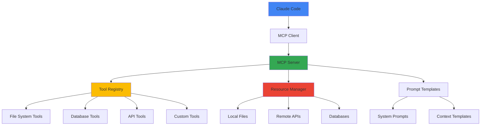

## 🎯 Introduction to MCP & Claude Code Integration

### 📋 What is MCP and Why It Matters

**Model Control Protocol (MCP)** is a revolutionary framework that allows Large Language Models like Claude to interact with external systems, tools, and data sources in a secure, standardized way. Think of it as a bridge that connects Claude's intelligence with your development environment, databases, APIs, and custom tools.

For **Claude Code** users, MCP servers unlock powerful capabilities:
- **Custom Tool Integration**: Connect Claude to your proprietary tools and systems
- **Real-Time Data Access**: Query live databases, APIs, and services
- **Workflow Automation**: Automate complex development tasks across multiple systems
- **Enhanced Context**: Provide Claude with rich, contextual information from your environment

### 🎯 What We'll Build in This Series

This multi-part series will take you from MCP basics to advanced implementations:

**Part 1 (This Post)**: Basic MCP server setup and simple custom tools
**Part 2**: Advanced MCP patterns, database integration, and API connectors
**Part 3**: Production deployment, security, and scaling considerations

> 💡 **Learning Goal**: By the end of this post, you'll have a working MCP server with custom tools that Claude Code can use to enhance your development workflow

### 🏗️ MCP Architecture Overview



## 🚀 Part 1: Basic MCP Server Setup

### 🔧 Prerequisites & Environment Setup

Before we begin, ensure you have the following installed:

**Required Software:**
- **Python 3.8+** or **Node.js 18+** (we'll cover both implementations)
- **Claude Code** (latest version)
- **Git** for version control
- **Code editor** (VS Code recommended)

**System Requirements:**
- macOS, Linux, or Windows with WSL2
- At least 4GB RAM (8GB recommended)
- Internet connection for package installations

### 📦 Installing MCP SDK

**For Python Implementation:**
```bash
# Create a new project directory
mkdir my-mcp-server
cd my-mcp-server

# Create virtual environment
python -m venv mcp-env
source mcp-env/bin/activate  # On Windows: mcp-env\Scripts\activate

# Install MCP SDK
pip install mcp

# Install additional dependencies
pip install asyncio aiofiles requests
```

**For TypeScript Implementation:**
```bash
# Create a new project directory
mkdir my-mcp-server-ts
cd my-mcp-server-ts

# Initialize npm project
npm init -y

# Install MCP SDK
npm install @modelcontextprotocol/sdk

# Install development dependencies
npm install -D typescript @types/node ts-node
npm install axios fs-extra
```

### 🏗️ Creating Your First MCP Server

Let's start with a basic MCP server that provides simple utility tools:

**Python Implementation (server.py):**
```python
#!/usr/bin/env python3
"""
Basic MCP Server - Part 1
Provides simple utility tools for Claude Code
"""

import asyncio
import json
import logging
from datetime import datetime
from pathlib import Path
from typing import Dict, List, Any

from mcp.server.models import InitializeResult
from mcp.server import Server, NotificationOptions
from mcp.server.stdio import stdio_server
from mcp.types import (
    Resource,
    Tool,
    TextContent,
    ImageContent,
    EmbeddedResource,
)

# Configure logging
logging.basicConfig(level=logging.INFO)
logger = logging.getLogger("basic-mcp-server")

# Create MCP server instance
server = Server("basic-mcp-server")

@server.list_tools()
async def handle_list_tools() -> List[Tool]:
    """
    Define available tools that Claude Code can use
    """
    return [
        Tool(
            name="get_current_time",
            description="Get the current date and time in various formats",
            inputSchema={
                "type": "object",
                "properties": {
                    "format": {
                        "type": "string",
                        "description": "Time format: 'iso', 'human', or 'unix'",
                        "enum": ["iso", "human", "unix"]
                    },
                    "timezone": {
                        "type": "string",
                        "description": "Timezone (default: UTC)",
                        "default": "UTC"
                    }
                },
                "required": ["format"]
            }
        ),
        Tool(
            name="file_stats",
            description="Get detailed statistics about files and directories",
            inputSchema={
                "type": "object",
                "properties": {
                    "path": {
                        "type": "string",
                        "description": "Path to file or directory to analyze"
                    },
                    "recursive": {
                        "type": "boolean",
                        "description": "Include subdirectories in analysis",
                        "default": False
                    }
                },
                "required": ["path"]
            }
        ),
        Tool(
            name="generate_uuid",
            description="Generate UUIDs in various formats",
            inputSchema={
                "type": "object",
                "properties": {
                    "count": {
                        "type": "integer",
                        "description": "Number of UUIDs to generate",
                        "default": 1,
                        "minimum": 1,
                        "maximum": 100
                    },
                    "format": {
                        "type": "string",
                        "description": "UUID format: 'standard', 'compact', or 'upper'",
                        "enum": ["standard", "compact", "upper"],
                        "default": "standard"
                    }
                }
            }
        ),
        Tool(
            name="system_info",
            description="Get system information including OS, Python version, and environment",
            inputSchema={
                "type": "object",
                "properties": {}
            }
        )
    ]

@server.call_tool()
async def handle_call_tool(name: str, arguments: Dict[str, Any]) -> List[TextContent]:
    """
    Handle tool execution requests from Claude Code
    """

    if name == "get_current_time":
        format_type = arguments.get("format", "iso")
        timezone = arguments.get("timezone", "UTC")

        now = datetime.now()

        if format_type == "iso":
            result = now.isoformat()
        elif format_type == "human":
            result = now.strftime("%A, %B %d, %Y at %I:%M:%S %p")
        elif format_type == "unix":
            result = str(int(now.timestamp()))
        else:
            result = now.isoformat()

        return [TextContent(
            type="text",
            text=f"Current time ({format_type} format): {result}"
        )]

    elif name == "file_stats":
        import os
        import stat
        from pathlib import Path

        path_str = arguments.get("path")
        recursive = arguments.get("recursive", False)

        try:
            path = Path(path_str)

            if not path.exists():
                return [TextContent(
                    type="text",
                    text=f"Error: Path '{path_str}' does not exist"
                )]

            stats = {
                "path": str(path.absolute()),
                "exists": path.exists(),
                "is_file": path.is_file(),
                "is_directory": path.is_dir(),
                "is_symlink": path.is_symlink()
            }

            if path.exists():
                stat_info = path.stat()
                stats.update({
                    "size_bytes": stat_info.st_size,
                    "size_human": _human_readable_size(stat_info.st_size),
                    "modified": datetime.fromtimestamp(stat_info.st_mtime).isoformat(),
                    "created": datetime.fromtimestamp(stat_info.st_ctime).isoformat(),
                    "permissions": oct(stat.S_IMODE(stat_info.st_mode))
                })

            if path.is_dir() and recursive:
                file_count = 0
                dir_count = 0
                total_size = 0

                for item in path.rglob("*"):
                    if item.is_file():
                        file_count += 1
                        try:
                            total_size += item.stat().st_size
                        except (OSError, IOError):
                            pass
                    elif item.is_dir():
                        dir_count += 1

                stats["recursive_stats"] = {
                    "total_files": file_count,
                    "total_directories": dir_count,
                    "total_size_bytes": total_size,
                    "total_size_human": _human_readable_size(total_size)
                }

            return [TextContent(
                type="text",
                text=f"File statistics:\n{json.dumps(stats, indent=2)}"
            )]

        except Exception as e:
            return [TextContent(
                type="text",
                text=f"Error analyzing path '{path_str}': {str(e)}"
            )]

    elif name == "generate_uuid":
        import uuid

        count = arguments.get("count", 1)
        format_type = arguments.get("format", "standard")

        uuids = []
        for _ in range(count):
            new_uuid = uuid.uuid4()

            if format_type == "standard":
                uuids.append(str(new_uuid))
            elif format_type == "compact":
                uuids.append(str(new_uuid).replace("-", ""))
            elif format_type == "upper":
                uuids.append(str(new_uuid).upper())

        result = "\n".join(uuids) if count > 1 else uuids[0]

        return [TextContent(
            type="text",
            text=f"Generated {count} UUID(s) in {format_type} format:\n{result}"
        )]

    elif name == "system_info":
        import platform
        import sys
        import os

        info = {
            "system": platform.system(),
            "platform": platform.platform(),
            "architecture": platform.architecture(),
            "processor": platform.processor(),
            "python_version": sys.version,
            "python_executable": sys.executable,
            "current_directory": os.getcwd(),
            "environment_variables": {
                key: value for key, value in os.environ.items()
                if key.startswith(('PATH', 'HOME', 'USER', 'SHELL', 'PYTHON'))
            }
        }

        return [TextContent(
            type="text",
            text=f"System Information:\n{json.dumps(info, indent=2)}"
        )]

    else:
        return [TextContent(
            type="text",
            text=f"Error: Unknown tool '{name}'"
        )]

def _human_readable_size(size_bytes: int) -> str:
    """Convert bytes to human readable format"""
    if size_bytes == 0:
        return "0 B"

    size_names = ["B", "KB", "MB", "GB", "TB"]
    i = 0
    size = float(size_bytes)

    while size >= 1024.0 and i < len(size_names) - 1:
        size /= 1024.0
        i += 1

    return f"{size:.1f} {size_names[i]}"

async def main():
    """
    Main server entry point
    """
    logger.info("Starting Basic MCP Server...")

    # Run the server using stdin/stdout for communication with Claude Code
    async with stdio_server() as (read_stream, write_stream):
        await server.run(
            read_stream,
            write_stream,
            InitializeResult(
                protocolVersion="2024-11-05",
                capabilities=server.get_capabilities(
                    notification_options=NotificationOptions(),
                    experimental_capabilities={}
                )
            )
        )

if __name__ == "__main__":
    asyncio.run(main())
```

**Helper Utility File (utils.py):**
```python
"""
Utility functions for MCP server
"""

import json
import logging
from pathlib import Path
from typing import Dict, Any, List
from datetime import datetime

logger = logging.getLogger(__name__)

class MCPServerUtils:
    """Utility class for common MCP server operations"""

    @staticmethod
    def validate_path(path_str: str) -> Path:
        """Validate and return Path object"""
        try:
            path = Path(path_str).resolve()
            return path
        except Exception as e:
            raise ValueError(f"Invalid path '{path_str}': {e}")

    @staticmethod
    def safe_json_dumps(data: Any, indent: int = 2) -> str:
        """Safely serialize data to JSON"""
        try:
            return json.dumps(data, indent=indent, default=str)
        except Exception as e:
            logger.error(f"JSON serialization error: {e}")
            return f"Error serializing data: {e}"

    @staticmethod
    def log_tool_call(tool_name: str, arguments: Dict[str, Any]):
        """Log tool execution for debugging"""
        logger.info(f"Tool called: {tool_name}")
        logger.debug(f"Arguments: {arguments}")

    @staticmethod
    def create_error_response(error_message: str) -> str:
        """Create standardized error response"""
        return f"Error: {error_message}"

    @staticmethod
    def format_file_listing(path: Path, max_items: int = 50) -> Dict[str, Any]:
        """Format directory listing with metadata"""
        if not path.is_dir():
            raise ValueError(f"Path '{path}' is not a directory")

        items = []
        count = 0

        try:
            for item in sorted(path.iterdir()):
                if count >= max_items:
                    break

                try:
                    stat = item.stat()
                    items.append({
                        "name": item.name,
                        "type": "directory" if item.is_dir() else "file",
                        "size": stat.st_size if item.is_file() else None,
                        "modified": datetime.fromtimestamp(stat.st_mtime).isoformat(),
                        "permissions": oct(stat.S_IMODE(stat.st_mode))
                    })
                    count += 1
                except (OSError, IOError) as e:
                    logger.warning(f"Could not access {item}: {e}")
                    continue

        except PermissionError:
            raise ValueError(f"Permission denied accessing directory '{path}'")

        return {
            "directory": str(path),
            "total_items_shown": len(items),
            "items": items,
            "truncated": count >= max_items
        }
```

### 🔧 Configuration File Setup

Create a configuration file to manage server settings:

**config.json:**
```json
{
  "server": {
    "name": "basic-mcp-server",
    "version": "1.0.0",
    "description": "Basic MCP server for Claude Code development",
    "author": "Your Name"
  },
  "logging": {
    "level": "INFO",
    "format": "%(asctime)s - %(name)s - %(levelname)s - %(message)s",
    "file": "mcp-server.log"
  },
  "tools": {
    "enabled": [
      "get_current_time",
      "file_stats",
      "generate_uuid",
      "system_info"
    ],
    "rate_limits": {
      "default": 100,
      "file_stats": 50
    }
  },
  "security": {
    "allowed_paths": [
      ".",
      "~/",
      "/tmp"
    ],
    "blocked_paths": [
      "/etc/passwd",
      "/etc/shadow",
      "~/.ssh"
    ]
  }
}
```

### 📋 Claude Code Configuration

Now configure Claude Code to use your MCP server:

**Claude Code Settings (settings.json):**
```json
{
  "mcpServers": {
    "basic-tools": {
      "command": "python",
      "args": ["/path/to/your/server.py"],
      "env": {
        "PYTHONPATH": "/path/to/your/project"
      },
      "description": "Basic utility tools for development",
      "enabled": true,
      "timeout": 30000
    }
  }
}
```

**Alternative: Using npm script for TypeScript:**
```json
{
  "mcpServers": {
    "basic-tools-ts": {
      "command": "npm",
      "args": ["run", "start:mcp"],
      "cwd": "/path/to/your/typescript/project",
      "description": "TypeScript MCP server with basic tools",
      "enabled": true
    }
  }
}
```

## 🧪 Testing Your MCP Server

### 🔍 Manual Testing with Claude Code

1. **Start Claude Code** with your MCP server configuration
2. **Verify Connection** - You should see your MCP server listed in the status bar
3. **Test Basic Tools** - Try these example prompts:

**Test Prompt Examples:**
```
# Test time tool
"What's the current time in human-readable format?"

# Test file statistics
"Can you analyze the stats of my project directory?"

# Test UUID generation
"Generate 5 UUIDs in compact format"

# Test system info
"Show me information about the current system"
```

### 📊 Expected Results

**Successful Time Tool Response:**
```
I'll get the current time for you in human-readable format.

Current time (human format): Friday, September 27, 2025 at 10:30:45 AM
```

**File Statistics Response Example:**
```
File statistics:
{
  "path": "/Users/username/project",
  "exists": true,
  "is_file": false,
  "is_directory": true,
  "is_symlink": false,
  "size_bytes": 4096,
  "size_human": "4.0 KB",
  "modified": "2025-09-27T10:30:00",
  "created": "2025-09-27T09:15:00",
  "permissions": "0o755"
}
```

### 🐛 Troubleshooting Common Issues

**Problem: MCP Server Not Starting**
```bash
# Check Python path and dependencies
python -c "import mcp; print('MCP installed successfully')"

# Verify server script syntax
python -m py_compile server.py

# Check logs
tail -f mcp-server.log
```

**Problem: Claude Code Can't Connect**
- Verify the `command` path in settings.json
- Ensure Python/Node.js is in PATH
- Check file permissions on server script
- Validate JSON syntax in configuration files

**Problem: Tools Not Working**
- Check server logs for error messages
- Verify tool schema matches expected inputs
- Test individual functions in isolation
- Ensure all required dependencies are installed

## 🚀 Extending Your Basic Server

### 🔧 Adding More Sophisticated Tools

Let's add a few more useful tools to demonstrate extensibility:

**Enhanced Server Features (server_extended.py):**
```python
# Add these additional tools to your server

@server.call_tool()
async def handle_call_tool(name: str, arguments: Dict[str, Any]) -> List[TextContent]:
    """Extended tool handler with more capabilities"""

    # ... (previous tools) ...

    elif name == "search_files":
        pattern = arguments.get("pattern", "*")
        directory = arguments.get("directory", ".")
        case_sensitive = arguments.get("case_sensitive", False)

        try:
            path = Path(directory)
            if not path.exists() or not path.is_dir():
                return [TextContent(type="text", text=f"Directory '{directory}' not found")]

            import fnmatch
            matches = []

            for file_path in path.rglob("*"):
                if file_path.is_file():
                    filename = file_path.name
                    if not case_sensitive:
                        if fnmatch.fnmatch(filename.lower(), pattern.lower()):
                            matches.append(str(file_path.relative_to(path)))
                    else:
                        if fnmatch.fnmatch(filename, pattern):
                            matches.append(str(file_path.relative_to(path)))

            result = {
                "search_pattern": pattern,
                "directory": str(path.absolute()),
                "matches_found": len(matches),
                "files": matches[:50]  # Limit results
            }

            if len(matches) > 50:
                result["note"] = "Results limited to first 50 matches"

            return [TextContent(
                type="text",
                text=f"File search results:\n{json.dumps(result, indent=2)}"
            )]

        except Exception as e:
            return [TextContent(type="text", text=f"Search error: {str(e)}")]

    elif name == "calculate_expression":
        expression = arguments.get("expression", "")

        try:
            # Safe evaluation of mathematical expressions
            import ast
            import operator

            # Allowed operations for safety
            operators = {
                ast.Add: operator.add,
                ast.Sub: operator.sub,
                ast.Mult: operator.mul,
                ast.Div: operator.truediv,
                ast.Pow: operator.pow,
                ast.USub: operator.neg,
                ast.UAdd: operator.pos,
            }

            def eval_expr(node):
                if isinstance(node, ast.Num):
                    return node.n
                elif isinstance(node, ast.BinOp):
                    return operators[type(node.op)](eval_expr(node.left), eval_expr(node.right))
                elif isinstance(node, ast.UnaryOp):
                    return operators[type(node.op)](eval_expr(node.operand))
                else:
                    raise TypeError(f"Unsupported operation: {node}")

            tree = ast.parse(expression, mode='eval')
            result = eval_expr(tree.body)

            return [TextContent(
                type="text",
                text=f"Expression: {expression}\nResult: {result}"
            )]

        except Exception as e:
            return [TextContent(
                type="text",
                text=f"Calculation error for '{expression}': {str(e)}"
            )]
```

### 📈 Performance Monitoring

Add basic performance monitoring to your server:

**performance_monitor.py:**
```python
import time
import psutil
from functools import wraps
from typing import Dict, Any

class PerformanceMonitor:
    def __init__(self):
        self.tool_stats = {}
        self.server_start_time = time.time()

    def monitor_tool(self, func):
        """Decorator to monitor tool performance"""
        @wraps(func)
        async def wrapper(name: str, arguments: Dict[str, Any], *args, **kwargs):
            start_time = time.time()
            memory_before = psutil.Process().memory_info().rss

            try:
                result = await func(name, arguments, *args, **kwargs)

                end_time = time.time()
                memory_after = psutil.Process().memory_info().rss

                # Record statistics
                self.record_tool_stats(name, {
                    'execution_time': end_time - start_time,
                    'memory_delta': memory_after - memory_before,
                    'success': True
                })

                return result

            except Exception as e:
                end_time = time.time()
                self.record_tool_stats(name, {
                    'execution_time': end_time - start_time,
                    'memory_delta': 0,
                    'success': False,
                    'error': str(e)
                })
                raise

        return wrapper

    def record_tool_stats(self, tool_name: str, stats: Dict[str, Any]):
        """Record performance statistics for a tool"""
        if tool_name not in self.tool_stats:
            self.tool_stats[tool_name] = {
                'call_count': 0,
                'total_time': 0,
                'avg_time': 0,
                'success_count': 0,
                'error_count': 0
            }

        tool_stats = self.tool_stats[tool_name]
        tool_stats['call_count'] += 1
        tool_stats['total_time'] += stats['execution_time']
        tool_stats['avg_time'] = tool_stats['total_time'] / tool_stats['call_count']

        if stats['success']:
            tool_stats['success_count'] += 1
        else:
            tool_stats['error_count'] += 1

    def get_stats_summary(self) -> Dict[str, Any]:
        """Get performance summary"""
        return {
            'server_uptime': time.time() - self.server_start_time,
            'tool_statistics': self.tool_stats,
            'system_info': {
                'cpu_percent': psutil.cpu_percent(),
                'memory_percent': psutil.virtual_memory().percent,
                'disk_usage': psutil.disk_usage('/').percent
            }
        }
```

## 🎯 Best Practices & Security Considerations

### 🔒 Security Guidelines

**1. Input Validation:**
```python
def validate_file_path(path_str: str, allowed_paths: List[str]) -> bool:
    """Validate file paths against allowed directories"""
    try:
        path = Path(path_str).resolve()

        for allowed in allowed_paths:
            allowed_path = Path(allowed).resolve()
            if path.is_relative_to(allowed_path):
                return True

        return False
    except Exception:
        return False
```

**2. Rate Limiting:**
```python
from collections import defaultdict
import time

class RateLimiter:
    def __init__(self):
        self.calls = defaultdict(list)
        self.limits = {
            'default': 100,  # 100 calls per minute
            'file_operations': 50,
            'system_operations': 20
        }

    def is_allowed(self, tool_name: str) -> bool:
        now = time.time()
        minute_ago = now - 60

        # Clean old entries
        self.calls[tool_name] = [
            call_time for call_time in self.calls[tool_name]
            if call_time > minute_ago
        ]

        # Check limit
        limit = self.limits.get(tool_name, self.limits['default'])
        return len(self.calls[tool_name]) < limit
```

**3. Error Handling:**
```python
def safe_tool_execution(func):
    """Decorator for safe tool execution with error handling"""
    @wraps(func)
    async def wrapper(*args, **kwargs):
        try:
            return await func(*args, **kwargs)
        except FileNotFoundError as e:
            return [TextContent(type="text", text=f"File not found: {e}")]
        except PermissionError as e:
            return [TextContent(type="text", text=f"Permission denied: {e}")]
        except Exception as e:
            logger.error(f"Tool execution error: {e}")
            return [TextContent(type="text", text=f"Unexpected error: {e}")]

    return wrapper
```

### 📋 Testing Your Setup

Create a test script to verify everything works:

**test_mcp_server.py:**
```python
#!/usr/bin/env python3
"""
Test script for MCP server functionality
"""

import asyncio
import json
import subprocess
import sys
from pathlib import Path

async def test_server_startup():
    """Test if the server starts correctly"""
    try:
        process = subprocess.Popen([
            sys.executable, 'server.py'
        ], stdin=subprocess.PIPE, stdout=subprocess.PIPE, stderr=subprocess.PIPE)

        # Send initialize message
        init_message = {
            "jsonrpc": "2.0",
            "id": 1,
            "method": "initialize",
            "params": {
                "protocolVersion": "2024-11-05",
                "capabilities": {}
            }
        }

        process.stdin.write((json.dumps(init_message) + '\n').encode())
        process.stdin.flush()

        # Wait for response
        response = process.stdout.readline()
        process.terminate()

        if response:
            print("✅ Server startup test passed")
            return True
        else:
            print("❌ Server startup test failed")
            return False

    except Exception as e:
        print(f"❌ Server startup test error: {e}")
        return False

def test_configuration():
    """Test configuration file validity"""
    config_file = Path("config.json")

    if not config_file.exists():
        print("❌ Configuration file not found")
        return False

    try:
        with open(config_file) as f:
            config = json.load(f)

        required_keys = ['server', 'logging', 'tools']
        for key in required_keys:
            if key not in config:
                print(f"❌ Missing configuration key: {key}")
                return False

        print("✅ Configuration test passed")
        return True

    except json.JSONDecodeError as e:
        print(f"❌ Configuration JSON error: {e}")
        return False
    except Exception as e:
        print(f"❌ Configuration test error: {e}")
        return False

def test_dependencies():
    """Test if all required dependencies are available"""
    required_modules = ['mcp', 'asyncio', 'pathlib', 'json']

    for module in required_modules:
        try:
            __import__(module)
            print(f"✅ {module} available")
        except ImportError:
            print(f"❌ {module} not available")
            return False

    return True

async def main():
    """Run all tests"""
    print("🧪 Testing MCP Server Setup...\n")

    tests = [
        ("Dependencies", test_dependencies),
        ("Configuration", test_configuration),
        ("Server Startup", test_server_startup),
    ]

    results = []
    for test_name, test_func in tests:
        print(f"Running {test_name} test...")
        if asyncio.iscoroutinefunction(test_func):
            result = await test_func()
        else:
            result = test_func()
        results.append(result)
        print()

    # Summary
    passed = sum(results)
    total = len(results)

    print(f"📊 Test Results: {passed}/{total} tests passed")

    if passed == total:
        print("🎉 All tests passed! Your MCP server is ready for Claude Code.")
    else:
        print("⚠️  Some tests failed. Please check the issues above.")

if __name__ == "__main__":
    asyncio.run(main())
```

## 🎯 What's Next: Part 2 Preview

In **Part 2** of this series, we'll explore:

### 🚀 Advanced MCP Features
- **Database Integration**: Connect to PostgreSQL, MySQL, and SQLite
- **API Connectors**: Build tools for REST API integration
- **Real-time Data**: WebSocket connections and live data streaming
- **File Processing**: Advanced file manipulation and parsing tools

### 📊 Example Advanced Tools
- **SQL Query Tool**: Execute database queries with safety constraints
- **API Testing Tool**: Test and validate REST endpoints
- **Log Analyzer**: Parse and analyze log files
- **Git Integration**: Git operations and repository analysis

### 🏗️ Production Considerations
- **Docker Deployment**: Containerize your MCP servers
- **Load Balancing**: Handle multiple Claude Code instances
- **Monitoring**: Advanced metrics and health checks
- **Security**: Authentication, authorization, and audit logging

## 🎉 Conclusion

Congratulations! You've successfully built and configured your first MCP server for Claude Code. This basic setup provides:

✅ **Four utility tools** that Claude can use to help with development tasks
✅ **Proper error handling** and security considerations
✅ **Extensible architecture** ready for advanced features
✅ **Testing framework** to validate your setup
✅ **Performance monitoring** for optimization

Your Claude Code instance can now:
- Get system information and current time
- Analyze file and directory statistics
- Generate UUIDs in various formats
- Execute safe mathematical calculations
- Search for files using patterns

### 🔗 Helpful Resources

- **MCP Documentation**: [Official MCP Protocol Docs](https://spec.modelcontextprotocol.io/)
- **Claude Code Settings**: Configuration guide in Claude Code documentation
- **GitHub Examples**: [MCP Server Examples Repository](https://github.com/modelcontextprotocol/servers)
- **Community**: Join the MCP developer community for support and examples

### 📝 Quick Reference Commands

```bash
# Start your MCP server (for testing)
python server.py

# Test configuration
python test_mcp_server.py

# Check logs
tail -f mcp-server.log

# Validate JSON configuration
python -m json.tool config.json
```

**Next**: Stay tuned for **Part 2** where we'll build production-ready MCP servers with database integration, API connectors, and advanced tooling capabilities!

---

## 🏷️ Tags & Categories

**Tags**: AI, mcp, claude-code, development-tools, automation, python, typescript, tooling
**Categories**: AI, development-tools, automation
**Difficulty**: Beginner to Intermediate
**Time to Complete**: 2-3 hours