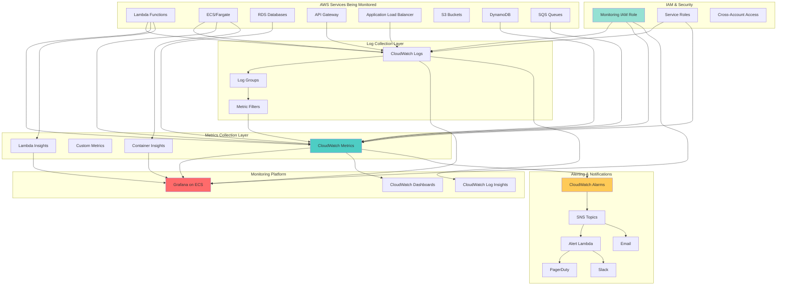
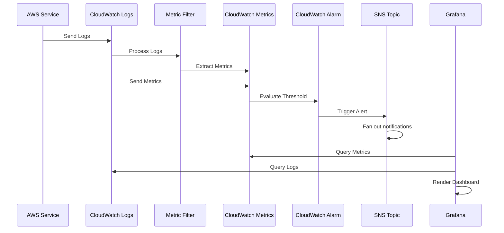

## 🎯 Introduction

In distributed systems running on AWS, observability is critical for maintaining reliability, debugging issues, and ensuring optimal performance. A centralized monitoring system provides:

- **Unified Visibility**: Single pane of glass for all services, applications, and infrastructure
- **Proactive Alerting**: Detect and respond to issues before they impact users
- **Performance Optimization**: Identify bottlenecks and optimization opportunities
- **Cost Management**: Track resource utilization and spending patterns
- **Compliance**: Meet audit and regulatory requirements for logging
- **Troubleshooting**: Quickly diagnose and resolve production issues

This comprehensive guide demonstrates how to build a production-ready centralized monitoring system using AWS CloudWatch and Grafana, deployed with CDK (TypeScript). We'll focus on cross-service log aggregation, metric collection, proper IAM permissions, and creating actionable dashboards.

> 💡 **Core Philosophy**: "You can't improve what you don't measure. Good monitoring isn't about collecting data—it's about extracting insights that drive action"

### 🎬 What We'll Build

A complete centralized monitoring and observability platform featuring:

- **CloudWatch Logs Aggregation** from Lambda, ECS, API Gateway, and more
- **CloudWatch Metrics** collection and custom metrics
- **Grafana on ECS Fargate** for advanced visualization
- **CloudWatch as Data Source** for Grafana dashboards
- **Cross-Account Monitoring** capabilities
- **IAM Roles and Policies** for secure cross-service access
- **Automated Alerting** via SNS and PagerDuty
- **Custom Dashboards** for different teams and services
- **Log Insights Queries** for log analysis
- **Metric Filters** for extracting metrics from logs
- **Container Insights** for ECS/EKS monitoring
- **Lambda Insights** for serverless monitoring

## 🏗️ Architecture Overview

### 📊 High-Level Architecture



### 🔄 Data Flow



## 🎨 Monitoring Strategy: CloudWatch vs Grafana

### 📋 Feature Comparison

| Feature | CloudWatch | Grafana |
|---------|------------|---------|
| **Native AWS Integration** | ✅ Excellent | ⚠️ Requires setup |
| **Custom Dashboards** | ✅ Good | ✅ Excellent |
| **Visualization Options** | ⚠️ Limited | ✅ Extensive |
| **Multi-Cloud Support** | ❌ AWS only | ✅ Yes |
| **Cost** | Pay per metric/log | Infrastructure cost |
| **Setup Complexity** | ✅ Minimal | ⚠️ Moderate |
| **Alerting** | ✅ Native | ✅ Advanced |
| **Log Analysis** | ✅ Log Insights | ⚠️ Via plugins |
| **Query Language** | Log Insights | PromQL, LogQL |
| **User Management** | AWS IAM | Built-in |
| **Customization** | ⚠️ Limited | ✅ Extensive |

### ✅ Recommended: Hybrid Approach

Use **both CloudWatch and Grafana** for maximum flexibility:

- **CloudWatch**: Primary data store and native AWS service monitoring
- **Grafana**: Advanced visualization and unified dashboard for all data sources

```typescript
// Hybrid monitoring strategy
CloudWatch (Data Layer)
├── Collect all logs and metrics
├── Native AWS service integration
├── CloudWatch Alarms for critical alerts
└── Log Insights for ad-hoc queries

Grafana (Visualization Layer)
├── Use CloudWatch as data source
├── Advanced dashboards
├── Custom visualizations
└── Unified view across services
```

## 📦 CDK Project Structure

```
monitoring-system-cdk/
├── bin/
│   └── monitoring-system.ts        # CDK app entry point
├── lib/
│   ├── stacks/
│   │   ├── cloudwatch-stack.ts     # CloudWatch setup
│   │   ├── grafana-stack.ts        # Grafana on ECS
│   │   ├── alerting-stack.ts       # Alarms and SNS
│   │   ├── iam-stack.ts            # IAM roles and policies
│   │   └── dashboards-stack.ts     # Dashboard definitions
│   ├── constructs/
│   │   ├── log-aggregation.ts      # Log collection construct
│   │   ├── metric-collection.ts    # Metrics construct
│   │   ├── grafana-cluster.ts      # Grafana ECS construct
│   │   └── alert-manager.ts        # Alerting construct
│   ├── config/
│   │   ├── monitoring-config.ts    # Monitoring configuration
│   │   ├── services-config.ts      # Services to monitor
│   │   └── dashboard-config.ts     # Dashboard definitions
│   └── utils/
│       ├── metric-utils.ts         # Metric helpers
│       └── log-utils.ts            # Log helpers
├── lambda/
│   ├── alert-processor/
│   │   ├── index.ts                # Alert processing
│   │   └── formatters.ts           # Alert formatters
│   └── metric-collector/
│       └── index.ts                # Custom metrics collector
├── dashboards/
│   ├── cloudwatch/
│   │   └── main-dashboard.json
│   └── grafana/
│       ├── service-dashboard.json
│       └── infrastructure-dashboard.json
├── test/
├── cdk.json
├── tsconfig.json
└── package.json
```

## ⚙️ Configuration Design

### 🎯 Monitoring Configuration

```typescript
// lib/config/monitoring-config.ts
export interface MonitoringConfig {
  logRetention: number;
  metricNamespace: string;
  enableDetailedMonitoring: boolean;
  enableContainerInsights: boolean;
  enableLambdaInsights: boolean;
  alerting: AlertingConfig;
  grafana?: GrafanaConfig;
}

export interface AlertingConfig {
  enabled: boolean;
  emailEndpoints: string[];
  slackWebhookUrl?: string;
  pagerDutyIntegrationKey?: string;
  criticalAlarmActions: string[];
  warningAlarmActions: string[];
}

export interface GrafanaConfig {
  enabled: boolean;
  instanceType: string;
  desiredCount: number;
  domain?: string;
  adminPassword: string;
  oauth?: {
    enabled: boolean;
    provider: 'google' | 'github' | 'cognito';
    clientId: string;
    clientSecret: string;
  };
}

export const monitoringConfigs = {
  development: {
    logRetention: 7, // days
    metricNamespace: 'Development',
    enableDetailedMonitoring: false,
    enableContainerInsights: false,
    enableLambdaInsights: false,
    alerting: {
      enabled: true,
      emailEndpoints: ['dev-team@company.com'],
      criticalAlarmActions: [],
      warningAlarmActions: [],
    },
    grafana: {
      enabled: true,
      instanceType: 't3.small',
      desiredCount: 1,
      adminPassword: 'change-me-dev',
    },
  },
  production: {
    logRetention: 90, // days
    metricNamespace: 'Production',
    enableDetailedMonitoring: true,
    enableContainerInsights: true,
    enableLambdaInsights: true,
    alerting: {
      enabled: true,
      emailEndpoints: ['oncall@company.com', 'platform-team@company.com'],
      slackWebhookUrl: process.env.SLACK_WEBHOOK_URL,
      pagerDutyIntegrationKey: process.env.PAGERDUTY_KEY,
      criticalAlarmActions: ['arn:aws:sns:us-east-1:xxx:critical-alerts'],
      warningAlarmActions: ['arn:aws:sns:us-east-1:xxx:warning-alerts'],
    },
    grafana: {
      enabled: true,
      instanceType: 't3.medium',
      desiredCount: 2,
      domain: 'monitoring.yourdomain.com',
      adminPassword: process.env.GRAFANA_ADMIN_PASSWORD || '',
      oauth: {
        enabled: true,
        provider: 'cognito',
        clientId: process.env.COGNITO_CLIENT_ID || '',
        clientSecret: process.env.COGNITO_CLIENT_SECRET || '',
      },
    },
  },
} as const;
```

### 📊 Services to Monitor Configuration

```typescript
// lib/config/services-config.ts
export interface ServiceMonitoringConfig {
  serviceName: string;
  type: 'lambda' | 'ecs' | 'rds' | 'dynamodb' | 'api-gateway' | 'alb' | 'sqs';
  logGroups: string[];
  metrics: MetricConfig[];
  alarms: AlarmConfig[];
}

export interface MetricConfig {
  name: string;
  namespace: string;
  dimensions?: Record<string, string>;
  statistic: 'Average' | 'Sum' | 'Minimum' | 'Maximum' | 'SampleCount';
  period: number;
  unit?: string;
}

export interface AlarmConfig {
  name: string;
  description: string;
  metric: MetricConfig;
  threshold: number;
  comparisonOperator: 'GreaterThanThreshold' | 'LessThanThreshold' | 'GreaterThanOrEqualToThreshold' | 'LessThanOrEqualToThreshold';
  evaluationPeriods: number;
  datapointsToAlarm?: number;
  treatMissingData?: 'notBreaching' | 'breaching' | 'ignore' | 'missing';
  severity: 'critical' | 'warning' | 'info';
}

export const servicesConfig: ServiceMonitoringConfig[] = [
  {
    serviceName: 'api-service',
    type: 'lambda',
    logGroups: ['/aws/lambda/api-handler', '/aws/lambda/api-authorizer'],
    metrics: [
      {
        name: 'Invocations',
        namespace: 'AWS/Lambda',
        statistic: 'Sum',
        period: 300,
      },
      {
        name: 'Duration',
        namespace: 'AWS/Lambda',
        statistic: 'Average',
        period: 300,
        unit: 'Milliseconds',
      },
      {
        name: 'Errors',
        namespace: 'AWS/Lambda',
        statistic: 'Sum',
        period: 300,
      },
      {
        name: 'Throttles',
        namespace: 'AWS/Lambda',
        statistic: 'Sum',
        period: 300,
      },
    ],
    alarms: [
      {
        name: 'api-service-high-error-rate',
        description: 'API service error rate is too high',
        metric: {
          name: 'Errors',
          namespace: 'AWS/Lambda',
          statistic: 'Sum',
          period: 300,
        },
        threshold: 10,
        comparisonOperator: 'GreaterThanThreshold',
        evaluationPeriods: 2,
        datapointsToAlarm: 2,
        treatMissingData: 'notBreaching',
        severity: 'critical',
      },
      {
        name: 'api-service-high-duration',
        description: 'API service response time is too slow',
        metric: {
          name: 'Duration',
          namespace: 'AWS/Lambda',
          statistic: 'Average',
          period: 300,
        },
        threshold: 3000, // 3 seconds
        comparisonOperator: 'GreaterThanThreshold',
        evaluationPeriods: 3,
        severity: 'warning',
      },
    ],
  },
  {
    serviceName: 'web-application',
    type: 'ecs',
    logGroups: ['/ecs/web-app'],
    metrics: [
      {
        name: 'CPUUtilization',
        namespace: 'AWS/ECS',
        statistic: 'Average',
        period: 300,
      },
      {
        name: 'MemoryUtilization',
        namespace: 'AWS/ECS',
        statistic: 'Average',
        period: 300,
      },
    ],
    alarms: [
      {
        name: 'ecs-high-cpu',
        description: 'ECS service CPU usage is too high',
        metric: {
          name: 'CPUUtilization',
          namespace: 'AWS/ECS',
          statistic: 'Average',
          period: 300,
        },
        threshold: 80,
        comparisonOperator: 'GreaterThanThreshold',
        evaluationPeriods: 2,
        severity: 'warning',
      },
    ],
  },
  {
    serviceName: 'api-gateway',
    type: 'api-gateway',
    logGroups: ['/aws/apigateway/api-logs'],
    metrics: [
      {
        name: 'Count',
        namespace: 'AWS/ApiGateway',
        statistic: 'Sum',
        period: 300,
      },
      {
        name: '4XXError',
        namespace: 'AWS/ApiGateway',
        statistic: 'Sum',
        period: 300,
      },
      {
        name: '5XXError',
        namespace: 'AWS/ApiGateway',
        statistic: 'Sum',
        period: 300,
      },
      {
        name: 'Latency',
        namespace: 'AWS/ApiGateway',
        statistic: 'Average',
        period: 300,
        unit: 'Milliseconds',
      },
    ],
    alarms: [
      {
        name: 'api-gateway-5xx-errors',
        description: 'API Gateway is returning too many 5XX errors',
        metric: {
          name: '5XXError',
          namespace: 'AWS/ApiGateway',
          statistic: 'Sum',
          period: 300,
        },
        threshold: 5,
        comparisonOperator: 'GreaterThanThreshold',
        evaluationPeriods: 1,
        severity: 'critical',
      },
    ],
  },
  {
    serviceName: 'database',
    type: 'rds',
    logGroups: ['/aws/rds/instance/postgres/postgresql'],
    metrics: [
      {
        name: 'CPUUtilization',
        namespace: 'AWS/RDS',
        statistic: 'Average',
        period: 300,
      },
      {
        name: 'DatabaseConnections',
        namespace: 'AWS/RDS',
        statistic: 'Average',
        period: 300,
      },
      {
        name: 'FreeableMemory',
        namespace: 'AWS/RDS',
        statistic: 'Average',
        period: 300,
      },
      {
        name: 'ReadLatency',
        namespace: 'AWS/RDS',
        statistic: 'Average',
        period: 300,
      },
      {
        name: 'WriteLatency',
        namespace: 'AWS/RDS',
        statistic: 'Average',
        period: 300,
      },
    ],
    alarms: [
      {
        name: 'rds-high-cpu',
        description: 'RDS CPU utilization is too high',
        metric: {
          name: 'CPUUtilization',
          namespace: 'AWS/RDS',
          statistic: 'Average',
          period: 300,
        },
        threshold: 80,
        comparisonOperator: 'GreaterThanThreshold',
        evaluationPeriods: 3,
        severity: 'critical',
      },
      {
        name: 'rds-low-memory',
        description: 'RDS freeable memory is too low',
        metric: {
          name: 'FreeableMemory',
          namespace: 'AWS/RDS',
          statistic: 'Average',
          period: 300,
        },
        threshold: 1000000000, // 1 GB
        comparisonOperator: 'LessThanThreshold',
        evaluationPeriods: 2,
        severity: 'warning',
      },
    ],
  },
];
```

## 🏗️ CDK Stack Implementation

### 📊 IAM Stack - Cross-Service Permissions

```typescript
// lib/stacks/iam-stack.ts
import * as cdk from 'aws-cdk-lib';
import * as iam from 'aws-cdk-lib/aws-iam';
import { Construct } from 'constructs';

export class IAMStack extends cdk.Stack {
  public readonly monitoringRole: iam.Role;
  public readonly grafanaRole: iam.Role;
  public readonly alertProcessorRole: iam.Role;

  constructor(scope: Construct, id: string, props?: cdk.StackProps) {
    super(scope, id, props);

    // Monitoring Role - for reading logs and metrics from all services
    this.monitoringRole = new iam.Role(this, 'MonitoringRole', {
      roleName: 'centralized-monitoring-role',
      assumedBy: new iam.ServicePrincipal('lambda.amazonaws.com'),
      description: 'Role for centralized monitoring to access logs and metrics',
    });

    // Grant CloudWatch Logs read permissions
    this.monitoringRole.addToPolicy(
      new iam.PolicyStatement({
        effect: iam.Effect.ALLOW,
        actions: [
          'logs:DescribeLogGroups',
          'logs:DescribeLogStreams',
          'logs:GetLogEvents',
          'logs:FilterLogEvents',
          'logs:StartQuery',
          'logs:StopQuery',
          'logs:GetQueryResults',
          'logs:GetLogRecord',
        ],
        resources: ['*'],
      })
    );

    // Grant CloudWatch Metrics read permissions
    this.monitoringRole.addToPolicy(
      new iam.PolicyStatement({
        effect: iam.Effect.ALLOW,
        actions: [
          'cloudwatch:DescribeAlarms',
          'cloudwatch:GetMetricData',
          'cloudwatch:GetMetricStatistics',
          'cloudwatch:ListMetrics',
          'cloudwatch:DescribeAlarmsForMetric',
        ],
        resources: ['*'],
      })
    );

    // Grant permissions to read from specific AWS services
    this.monitoringRole.addToPolicy(
      new iam.PolicyStatement({
        effect: iam.Effect.ALLOW,
        actions: [
          // Lambda
          'lambda:GetFunction',
          'lambda:ListFunctions',
          // ECS
          'ecs:DescribeClusters',
          'ecs:DescribeServices',
          'ecs:DescribeTasks',
          'ecs:ListClusters',
          'ecs:ListServices',
          'ecs:ListTasks',
          // RDS
          'rds:DescribeDBInstances',
          'rds:DescribeDBClusters',
          // DynamoDB
          'dynamodb:DescribeTable',
          'dynamodb:ListTables',
          // API Gateway
          'apigateway:GET',
          // ALB
          'elasticloadbalancing:DescribeLoadBalancers',
          'elasticloadbalancing:DescribeTargetGroups',
          'elasticloadbalancing:DescribeTargetHealth',
          // SQS
          'sqs:GetQueueAttributes',
          'sqs:ListQueues',
          // S3
          's3:GetBucketLocation',
          's3:ListBucket',
          's3:GetBucketMetricsConfiguration',
        ],
        resources: ['*'],
      })
    );

    // Grafana Role - for ECS task
    this.grafanaRole = new iam.Role(this, 'GrafanaRole', {
      roleName: 'grafana-ecs-task-role',
      assumedBy: new iam.ServicePrincipal('ecs-tasks.amazonaws.com'),
      description: 'Role for Grafana to access CloudWatch',
    });

    // Grant Grafana permissions to read CloudWatch data
    this.grafanaRole.addToPolicy(
      new iam.PolicyStatement({
        effect: iam.Effect.ALLOW,
        actions: [
          'cloudwatch:DescribeAlarmsForMetric',
          'cloudwatch:DescribeAlarmHistory',
          'cloudwatch:DescribeAlarms',
          'cloudwatch:ListMetrics',
          'cloudwatch:GetMetricData',
          'cloudwatch:GetMetricStatistics',
        ],
        resources: ['*'],
      })
    );

    this.grafanaRole.addToPolicy(
      new iam.PolicyStatement({
        effect: iam.Effect.ALLOW,
        actions: [
          'logs:DescribeLogGroups',
          'logs:GetLogGroupFields',
          'logs:StartQuery',
          'logs:StopQuery',
          'logs:GetQueryResults',
          'logs:GetLogEvents',
        ],
        resources: ['*'],
      })
    );

    this.grafanaRole.addToPolicy(
      new iam.PolicyStatement({
        effect: iam.Effect.ALLOW,
        actions: [
          'ec2:DescribeRegions',
          'ec2:DescribeInstances',
          'tag:GetResources',
        ],
        resources: ['*'],
      })
    );

    // Alert Processor Role
    this.alertProcessorRole = new iam.Role(this, 'AlertProcessorRole', {
      roleName: 'alert-processor-role',
      assumedBy: new iam.ServicePrincipal('lambda.amazonaws.com'),
      managedPolicies: [
        iam.ManagedPolicy.fromAwsManagedPolicyName(
          'service-role/AWSLambdaBasicExecutionRole'
        ),
      ],
    });

    // Grant SNS publish permissions
    this.alertProcessorRole.addToPolicy(
      new iam.PolicyStatement({
        effect: iam.Effect.ALLOW,
        actions: ['sns:Publish'],
        resources: ['*'],
      })
    );

    // Outputs
    new cdk.CfnOutput(this, 'MonitoringRoleArn', {
      value: this.monitoringRole.roleArn,
      exportName: 'MonitoringRoleArn',
    });

    new cdk.CfnOutput(this, 'GrafanaRoleArn', {
      value: this.grafanaRole.roleArn,
      exportName: 'GrafanaRoleArn',
    });
  }
}
```

### 📈 CloudWatch Stack - Log Aggregation and Metrics

```typescript
// lib/stacks/cloudwatch-stack.ts
import * as cdk from 'aws-cdk-lib';
import * as logs from 'aws-cdk-lib/aws-logs';
import * as cloudwatch from 'aws-cdk-lib/aws-cloudwatch';
import { Construct } from 'constructs';
import { servicesConfig, ServiceMonitoringConfig } from '../config/services-config';
import { monitoringConfigs } from '../config/monitoring-config';

export interface CloudWatchStackProps extends cdk.StackProps {
  environment: 'development' | 'production';
}

export class CloudWatchStack extends cdk.Stack {
  public readonly logGroups: Map<string, logs.LogGroup>;
  public readonly metricFilters: Map<string, logs.MetricFilter>;
  public readonly dashboard: cloudwatch.Dashboard;

  constructor(scope: Construct, id: string, props: CloudWatchStackProps) {
    super(scope, id, props);

    const config = monitoringConfigs[props.environment];

    this.logGroups = new Map();
    this.metricFilters = new Map();

    // Create centralized log groups and metric filters
    servicesConfig.forEach((serviceConfig) => {
      this.setupServiceMonitoring(serviceConfig, config.logRetention);
    });

    // Create CloudWatch Dashboard
    this.dashboard = this.createDashboard(config.metricNamespace);

    // Create custom metrics namespace
    this.createCustomMetricsNamespace(config.metricNamespace);
  }

  private setupServiceMonitoring(
    serviceConfig: ServiceMonitoringConfig,
    retentionDays: number
  ): void {
    // Create or reference log groups
    serviceConfig.logGroups.forEach((logGroupName) => {
      const logGroup = new logs.LogGroup(
        this,
        `LogGroup-${serviceConfig.serviceName}-${logGroupName.replace(/\//g, '-')}`,
        {
          logGroupName,
          retention: this.getRetention(retentionDays),
          removalPolicy: cdk.RemovalPolicy.DESTROY,
        }
      );

      this.logGroups.set(logGroupName, logGroup);

      // Create metric filters for common patterns
      this.createMetricFiltersForLogGroup(
        logGroup,
        serviceConfig.serviceName,
        serviceConfig.type
      );
    });
  }

  private createMetricFiltersForLogGroup(
    logGroup: logs.LogGroup,
    serviceName: string,
    serviceType: string
  ): void {
    // Error count metric filter
    const errorFilter = new logs.MetricFilter(
      this,
      `ErrorFilter-${serviceName}`,
      {
        logGroup,
        filterPattern: logs.FilterPattern.anyTerm('ERROR', 'Error', 'error', 'Exception'),
        metricNamespace: 'CustomMetrics',
        metricName: `${serviceName}-Errors`,
        metricValue: '1',
        defaultValue: 0,
      }
    );

    this.metricFilters.set(`${serviceName}-errors`, errorFilter);

    // Warning count metric filter
    const warningFilter = new logs.MetricFilter(
      this,
      `WarningFilter-${serviceName}`,
      {
        logGroup,
        filterPattern: logs.FilterPattern.anyTerm('WARNING', 'Warning', 'warn'),
        metricNamespace: 'CustomMetrics',
        metricName: `${serviceName}-Warnings`,
        metricValue: '1',
        defaultValue: 0,
      }
    );

    this.metricFilters.set(`${serviceName}-warnings`, warningFilter);

    // Response time metric filter (for APIs)
    if (serviceType === 'lambda' || serviceType === 'api-gateway') {
      const responseTimeFilter = new logs.MetricFilter(
        this,
        `ResponseTimeFilter-${serviceName}`,
        {
          logGroup,
          filterPattern: logs.FilterPattern.exists('$.duration'),
          metricNamespace: 'CustomMetrics',
          metricName: `${serviceName}-ResponseTime`,
          metricValue: '$.duration',
        }
      );

      this.metricFilters.set(`${serviceName}-response-time`, responseTimeFilter);
    }

    // Business metrics (e.g., successful transactions)
    const successFilter = new logs.MetricFilter(
      this,
      `SuccessFilter-${serviceName}`,
      {
        logGroup,
        filterPattern: logs.FilterPattern.anyTerm('SUCCESS', 'Success', 'success'),
        metricNamespace: 'CustomMetrics',
        metricName: `${serviceName}-Success`,
        metricValue: '1',
        defaultValue: 0,
      }
    );

    this.metricFilters.set(`${serviceName}-success`, successFilter);
  }

  private createDashboard(namespace: string): cloudwatch.Dashboard {
    const dashboard = new cloudwatch.Dashboard(this, 'CentralMonitoringDashboard', {
      dashboardName: `${namespace}-Central-Monitoring`,
    });

    // Add widgets for each service
    servicesConfig.forEach((serviceConfig) => {
      const widgets = this.createWidgetsForService(serviceConfig);
      widgets.forEach((widget) => dashboard.addWidgets(widget));
    });

    return dashboard;
  }

  private createWidgetsForService(
    serviceConfig: ServiceMonitoringConfig
  ): cloudwatch.IWidget[] {
    const widgets: cloudwatch.IWidget[] = [];

    // Create a graph widget for each metric
    serviceConfig.metrics.forEach((metricConfig) => {
      const widget = new cloudwatch.GraphWidget({
        title: `${serviceConfig.serviceName} - ${metricConfig.name}`,
        width: 12,
        left: [
          new cloudwatch.Metric({
            namespace: metricConfig.namespace,
            metricName: metricConfig.name,
            dimensionsMap: metricConfig.dimensions,
            statistic: metricConfig.statistic,
            period: cdk.Duration.seconds(metricConfig.period),
            unit: metricConfig.unit as cloudwatch.Unit | undefined,
          }),
        ],
      });

      widgets.push(widget);
    });

    // Add custom metrics from log filters
    const errorMetric = new cloudwatch.Metric({
      namespace: 'CustomMetrics',
      metricName: `${serviceConfig.serviceName}-Errors`,
      statistic: 'Sum',
      period: cdk.Duration.minutes(5),
    });

    const warningMetric = new cloudwatch.Metric({
      namespace: 'CustomMetrics',
      metricName: `${serviceConfig.serviceName}-Warnings`,
      statistic: 'Sum',
      period: cdk.Duration.minutes(5),
    });

    widgets.push(
      new cloudwatch.GraphWidget({
        title: `${serviceConfig.serviceName} - Errors & Warnings`,
        width: 12,
        left: [errorMetric],
        right: [warningMetric],
      })
    );

    return widgets;
  }

  private createCustomMetricsNamespace(namespace: string): void {
    // Create a Lambda function to publish custom metrics
    // This is a placeholder - implement as needed
  }

  private getRetention(days: number): logs.RetentionDays {
    const retentionMap: Record<number, logs.RetentionDays> = {
      1: logs.RetentionDays.ONE_DAY,
      3: logs.RetentionDays.THREE_DAYS,
      5: logs.RetentionDays.FIVE_DAYS,
      7: logs.RetentionDays.ONE_WEEK,
      14: logs.RetentionDays.TWO_WEEKS,
      30: logs.RetentionDays.ONE_MONTH,
      60: logs.RetentionDays.TWO_MONTHS,
      90: logs.RetentionDays.THREE_MONTHS,
      120: logs.RetentionDays.FOUR_MONTHS,
      180: logs.RetentionDays.SIX_MONTHS,
      365: logs.RetentionDays.ONE_YEAR,
    };

    return retentionMap[days] || logs.RetentionDays.ONE_WEEK;
  }
}
```

### 🔔 Alerting Stack - CloudWatch Alarms and SNS

```typescript
// lib/stacks/alerting-stack.ts
import * as cdk from 'aws-cdk-lib';
import * as cloudwatch from 'aws-cdk-lib/aws-cloudwatch';
import * as cloudwatch_actions from 'aws-cdk-lib/aws-cloudwatch-actions';
import * as sns from 'aws-cdk-lib/aws-sns';
import * as sns_subscriptions from 'aws-cdk-lib/aws-sns-subscriptions';
import * as lambda from 'aws-cdk-lib/aws-lambda';
import { NodejsFunction } from 'aws-cdk-lib/aws-lambda-nodejs';
import { Construct } from 'constructs';
import * as path from 'path';
import { servicesConfig } from '../config/services-config';
import { monitoringConfigs } from '../config/monitoring-config';

export interface AlertingStackProps extends cdk.StackProps {
  environment: 'development' | 'production';
  alertProcessorRole: cdk.aws_iam.Role;
}

export class AlertingStack extends cdk.Stack {
  public readonly criticalTopic: sns.Topic;
  public readonly warningTopic: sns.Topic;
  public readonly alarms: Map<string, cloudwatch.Alarm>;

  constructor(scope: Construct, id: string, props: AlertingStackProps) {
    super(scope, id, props);

    const config = monitoringConfigs[props.environment];
    this.alarms = new Map();

    // Create SNS topics for different severity levels
    this.criticalTopic = new sns.Topic(this, 'CriticalAlertsTopic', {
      topicName: 'monitoring-critical-alerts',
      displayName: 'Critical Alerts',
    });

    this.warningTopic = new sns.Topic(this, 'WarningAlertsTopic', {
      topicName: 'monitoring-warning-alerts',
      displayName: 'Warning Alerts',
    });

    // Subscribe emails to topics
    if (config.alerting.enabled) {
      config.alerting.emailEndpoints.forEach((email) => {
        this.criticalTopic.addSubscription(
          new sns_subscriptions.EmailSubscription(email)
        );
        this.warningTopic.addSubscription(
          new sns_subscriptions.EmailSubscription(email)
        );
      });
    }

    // Create alert processor Lambda
    const alertProcessor = this.createAlertProcessor(props.alertProcessorRole, config);

    // Subscribe Lambda to SNS topics
    this.criticalTopic.addSubscription(
      new sns_subscriptions.LambdaSubscription(alertProcessor)
    );
    this.warningTopic.addSubscription(
      new sns_subscriptions.LambdaSubscription(alertProcessor)
    );

    // Create alarms for all services
    servicesConfig.forEach((serviceConfig) => {
      this.createAlarmsForService(serviceConfig);
    });

    // Create composite alarms
    this.createCompositeAlarms();
  }

  private createAlertProcessor(
    role: cdk.aws_iam.Role,
    config: any
  ): lambda.Function {
    const alertProcessor = new NodejsFunction(this, 'AlertProcessor', {
      runtime: lambda.Runtime.NODEJS_20_X,
      handler: 'handler',
      entry: path.join(__dirname, '../../lambda/alert-processor/index.ts'),
      timeout: cdk.Duration.seconds(30),
      memorySize: 256,
      role,
      environment: {
        SLACK_WEBHOOK_URL: config.alerting.slackWebhookUrl || '',
        PAGERDUTY_KEY: config.alerting.pagerDutyIntegrationKey || '',
      },
    });

    return alertProcessor;
  }

  private createAlarmsForService(
    serviceConfig: any
  ): void {
    serviceConfig.alarms.forEach((alarmConfig: any) => {
      const metric = new cloudwatch.Metric({
        namespace: alarmConfig.metric.namespace,
        metricName: alarmConfig.metric.name,
        dimensionsMap: alarmConfig.metric.dimensions,
        statistic: alarmConfig.metric.statistic,
        period: cdk.Duration.seconds(alarmConfig.metric.period),
      });

      const alarm = new cloudwatch.Alarm(
        this,
        `Alarm-${serviceConfig.serviceName}-${alarmConfig.name}`,
        {
          alarmName: alarmConfig.name,
          alarmDescription: alarmConfig.description,
          metric,
          threshold: alarmConfig.threshold,
          comparisonOperator: this.getComparisonOperator(
            alarmConfig.comparisonOperator
          ),
          evaluationPeriods: alarmConfig.evaluationPeriods,
          datapointsToAlarm: alarmConfig.datapointsToAlarm,
          treatMissingData: this.getTreatMissingData(alarmConfig.treatMissingData),
        }
      );

      // Add alarm actions based on severity
      if (alarmConfig.severity === 'critical') {
        alarm.addAlarmAction(new cloudwatch_actions.SnsAction(this.criticalTopic));
      } else if (alarmConfig.severity === 'warning') {
        alarm.addAlarmAction(new cloudwatch_actions.SnsAction(this.warningTopic));
      }

      this.alarms.set(`${serviceConfig.serviceName}-${alarmConfig.name}`, alarm);
    });
  }

  private createCompositeAlarms(): void {
    // Create a composite alarm that triggers if multiple services are down
    const serviceDownAlarms = Array.from(this.alarms.values()).filter((alarm) =>
      alarm.alarmName.includes('high-error-rate')
    );

    if (serviceDownAlarms.length > 0) {
      new cloudwatch.CompositeAlarm(this, 'MultipleServicesDown', {
        compositeAlarmName: 'multiple-services-down',
        alarmDescription: 'Multiple services are experiencing high error rates',
        alarmRule: cloudwatch.AlarmRule.anyOf(
          ...serviceDownAlarms.map((alarm) => cloudwatch.AlarmRule.fromAlarm(alarm, cloudwatch.AlarmState.ALARM))
        ),
      });
    }
  }

  private getComparisonOperator(
    operator: string
  ): cloudwatch.ComparisonOperator {
    const operatorMap: Record<string, cloudwatch.ComparisonOperator> = {
      GreaterThanThreshold: cloudwatch.ComparisonOperator.GREATER_THAN_THRESHOLD,
      LessThanThreshold: cloudwatch.ComparisonOperator.LESS_THAN_THRESHOLD,
      GreaterThanOrEqualToThreshold:
        cloudwatch.ComparisonOperator.GREATER_THAN_OR_EQUAL_TO_THRESHOLD,
      LessThanOrEqualToThreshold:
        cloudwatch.ComparisonOperator.LESS_THAN_OR_EQUAL_TO_THRESHOLD,
    };

    return operatorMap[operator];
  }

  private getTreatMissingData(
    treatment: string | undefined
  ): cloudwatch.TreatMissingData {
    if (!treatment) return cloudwatch.TreatMissingData.NOT_BREACHING;

    const treatmentMap: Record<string, cloudwatch.TreatMissingData> = {
      notBreaching: cloudwatch.TreatMissingData.NOT_BREACHING,
      breaching: cloudwatch.TreatMissingData.BREACHING,
      ignore: cloudwatch.TreatMissingData.IGNORE,
      missing: cloudwatch.TreatMissingData.MISSING,
    };

    return treatmentMap[treatment];
  }
}
```

### 📊 Grafana Stack - ECS Deployment

```typescript
// lib/stacks/grafana-stack.ts
import * as cdk from 'aws-cdk-lib';
import * as ec2 from 'aws-cdk-lib/aws-ec2';
import * as ecs from 'aws-cdk-lib/aws-ecs';
import * as ecs_patterns from 'aws-cdk-lib/aws-ecs-patterns';
import * as efs from 'aws-cdk-lib/aws-efs';
import * as secretsmanager from 'aws-cdk-lib/aws-secretsmanager';
import * as iam from 'aws-cdk-lib/aws-iam';
import { Construct } from 'constructs';
import { monitoringConfigs } from '../config/monitoring-config';

export interface GrafanaStackProps extends cdk.StackProps {
  environment: 'development' | 'production';
  vpc: ec2.Vpc;
  grafanaRole: iam.Role;
}

export class GrafanaStack extends cdk.Stack {
  public readonly service: ecs_patterns.ApplicationLoadBalancedFargateService;
  public readonly url: string;

  constructor(scope: Construct, id: string, props: GrafanaStackProps) {
    super(scope, id, props);

    const config = monitoringConfigs[props.environment];

    if (!config.grafana?.enabled) {
      console.log('Grafana is disabled for this environment');
      return;
    }

    const { vpc, grafanaRole } = props;

    // Create ECS Cluster
    const cluster = new ecs.Cluster(this, 'GrafanaCluster', {
      vpc,
      clusterName: 'monitoring-grafana-cluster',
      containerInsights: config.enableContainerInsights,
    });

    // Create EFS for Grafana data persistence
    const fileSystem = new efs.FileSystem(this, 'GrafanaEFS', {
      vpc,
      encrypted: true,
      lifecyclePolicy: efs.LifecyclePolicy.AFTER_14_DAYS,
      performanceMode: efs.PerformanceMode.GENERAL_PURPOSE,
      throughputMode: efs.ThroughputMode.BURSTING,
      removalPolicy: cdk.RemovalPolicy.RETAIN,
    });

    // Create Secrets Manager secret for Grafana admin password
    const grafanaSecret = new secretsmanager.Secret(this, 'GrafanaAdminPassword', {
      secretName: 'grafana-admin-password',
      generateSecretString: {
        secretStringTemplate: JSON.stringify({ username: 'admin' }),
        generateStringKey: 'password',
        excludePunctuation: true,
        passwordLength: 16,
      },
    });

    // Create Fargate service with ALB
    this.service = new ecs_patterns.ApplicationLoadBalancedFargateService(
      this,
      'GrafanaService',
      {
        cluster,
        serviceName: 'grafana',
        desiredCount: config.grafana.desiredCount,
        cpu: this.getCpuFromInstanceType(config.grafana.instanceType),
        memoryLimitMiB: this.getMemoryFromInstanceType(config.grafana.instanceType),
        taskImageOptions: {
          image: ecs.ContainerImage.fromRegistry('grafana/grafana:latest'),
          containerPort: 3000,
          taskRole: grafanaRole,
          environment: {
            GF_SERVER_ROOT_URL: config.grafana.domain
              ? `https://${config.grafana.domain}`
              : '',
            GF_AUTH_ANONYMOUS_ENABLED: 'false',
            GF_SECURITY_ADMIN_USER: 'admin',
            GF_INSTALL_PLUGINS: 'grafana-clock-panel,grafana-simple-json-datasource,grafana-piechart-panel',
            // CloudWatch data source configuration
            GF_AWS_DEFAULT_REGION: cdk.Aws.REGION,
            GF_AWS_cloudwatch_ASSUME_ROLE_ENABLED: 'true',
          },
          secrets: {
            GF_SECURITY_ADMIN_PASSWORD: ecs.Secret.fromSecretsManager(
              grafanaSecret,
              'password'
            ),
          },
        },
        publicLoadBalancer: true,
      }
    );

    // Configure volume mount for EFS
    const volumeName = 'grafana-storage';

    this.service.taskDefinition.addVolume({
      name: volumeName,
      efsVolumeConfiguration: {
        fileSystemId: fileSystem.fileSystemId,
        transitEncryption: 'ENABLED',
      },
    });

    this.service.taskDefinition.defaultContainer?.addMountPoints({
      sourceVolume: volumeName,
      containerPath: '/var/lib/grafana',
      readOnly: false,
    });

    // Allow connections from ALB to EFS
    fileSystem.connections.allowDefaultPortFrom(this.service.service.connections);

    // Configure health check
    this.service.targetGroup.configureHealthCheck({
      path: '/api/health',
      interval: cdk.Duration.seconds(30),
      timeout: cdk.Duration.seconds(5),
      healthyThresholdCount: 2,
      unhealthyThresholdCount: 3,
    });

    // Auto scaling
    const scaling = this.service.service.autoScaleTaskCount({
      minCapacity: 1,
      maxCapacity: config.grafana.desiredCount * 2,
    });

    scaling.scaleOnCpuUtilization('CpuScaling', {
      targetUtilizationPercent: 70,
      scaleInCooldown: cdk.Duration.seconds(300),
      scaleOutCooldown: cdk.Duration.seconds(60),
    });

    scaling.scaleOnMemoryUtilization('MemoryScaling', {
      targetUtilizationPercent: 80,
      scaleInCooldown: cdk.Duration.seconds(300),
      scaleOutCooldown: cdk.Duration.seconds(60),
    });

    this.url = this.service.loadBalancer.loadBalancerDnsName;

    // Outputs
    new cdk.CfnOutput(this, 'GrafanaURL', {
      value: `http://${this.url}`,
      description: 'Grafana Dashboard URL',
    });

    new cdk.CfnOutput(this, 'GrafanaAdminSecretArn', {
      value: grafanaSecret.secretArn,
      description: 'Grafana Admin Password Secret ARN',
    });
  }

  private getCpuFromInstanceType(instanceType: string): number {
    const cpuMap: Record<string, number> = {
      't3.small': 512,
      't3.medium': 1024,
      't3.large': 2048,
    };

    return cpuMap[instanceType] || 512;
  }

  private getMemoryFromInstanceType(instanceType: string): number {
    const memoryMap: Record<string, number> = {
      't3.small': 2048,
      't3.medium': 4096,
      't3.large': 8192,
    };

    return memoryMap[instanceType] || 2048;
  }
}
```

## ⚡ Lambda Functions Implementation

### 🔔 Alert Processor Lambda

```typescript
// lambda/alert-processor/index.ts
import { SNSEvent, SNSHandler } from 'aws-lambda';
import axios from 'axios';

interface CloudWatchAlarm {
  AlarmName: string;
  AlarmDescription: string;
  AWSAccountId: string;
  NewStateValue: string;
  NewStateReason: string;
  StateChangeTime: string;
  Region: string;
  OldStateValue: string;
  Trigger: {
    MetricName: string;
    Namespace: string;
    StatisticType: string;
    Statistic: string;
    Unit: string | null;
    Dimensions: Array<{ name: string; value: string }>;
    Period: number;
    EvaluationPeriods: number;
    ComparisonOperator: string;
    Threshold: number;
  };
}

export const handler: SNSHandler = async (event: SNSEvent) => {
  console.log('Alert Processor received event:', JSON.stringify(event, null, 2));

  for (const record of event.Records) {
    try {
      const message = JSON.parse(record.Sns.Message) as CloudWatchAlarm;

      // Process alarm
      await processAlarm(message);

      // Send to Slack
      if (process.env.SLACK_WEBHOOK_URL) {
        await sendSlackNotification(message);
      }

      // Send to PagerDuty
      if (process.env.PAGERDUTY_KEY && message.NewStateValue === 'ALARM') {
        await sendPagerDutyAlert(message);
      }
    } catch (error) {
      console.error('Error processing alarm:', error);
    }
  }
};

async function processAlarm(alarm: CloudWatchAlarm): Promise<void> {
  console.log('Processing alarm:', alarm.AlarmName);
  console.log('State:', alarm.OldStateValue, '->', alarm.NewStateValue);
  console.log('Reason:', alarm.NewStateReason);

  // Add custom processing logic here
  // e.g., Update dashboard, create ticket, trigger auto-remediation
}

async function sendSlackNotification(alarm: CloudWatchAlarm): Promise<void> {
  const webhookUrl = process.env.SLACK_WEBHOOK_URL;
  if (!webhookUrl) return;

  const color = alarm.NewStateValue === 'ALARM' ? '#ff0000' : '#36a64f';
  const emoji = alarm.NewStateValue === 'ALARM' ? ':rotating_light:' : ':white_check_mark:';

  const message = {
    text: `${emoji} CloudWatch Alarm ${alarm.NewStateValue}`,
    attachments: [
      {
        color,
        title: alarm.AlarmName,
        text: alarm.AlarmDescription,
        fields: [
          {
            title: 'State',
            value: `${alarm.OldStateValue} → ${alarm.NewStateValue}`,
            short: true,
          },
          {
            title: 'Region',
            value: alarm.Region,
            short: true,
          },
          {
            title: 'Metric',
            value: `${alarm.Trigger.Namespace}/${alarm.Trigger.MetricName}`,
            short: true,
          },
          {
            title: 'Threshold',
            value: `${alarm.Trigger.ComparisonOperator} ${alarm.Trigger.Threshold}`,
            short: true,
          },
          {
            title: 'Reason',
            value: alarm.NewStateReason,
            short: false,
          },
        ],
        footer: 'AWS CloudWatch',
        ts: Math.floor(new Date(alarm.StateChangeTime).getTime() / 1000),
      },
    ],
  };

  try {
    await axios.post(webhookUrl, message);
    console.log('Slack notification sent successfully');
  } catch (error) {
    console.error('Error sending Slack notification:', error);
  }
}

async function sendPagerDutyAlert(alarm: CloudWatchAlarm): Promise<void> {
  const integrationKey = process.env.PAGERDUTY_KEY;
  if (!integrationKey) return;

  const event = {
    routing_key: integrationKey,
    event_action: 'trigger',
    dedup_key: alarm.AlarmName,
    payload: {
      summary: `${alarm.AlarmName}: ${alarm.NewStateReason}`,
      severity: 'critical',
      source: alarm.Region,
      custom_details: {
        alarm_name: alarm.AlarmName,
        alarm_description: alarm.AlarmDescription,
        metric: `${alarm.Trigger.Namespace}/${alarm.Trigger.MetricName}`,
        threshold: alarm.Trigger.Threshold,
        current_state: alarm.NewStateValue,
        previous_state: alarm.OldStateValue,
      },
    },
  };

  try {
    await axios.post('https://events.pagerduty.com/v2/enqueue', event);
    console.log('PagerDuty alert sent successfully');
  } catch (error) {
    console.error('Error sending PagerDuty alert:', error);
  }
}
```

## 📊 Grafana Configuration

### 🔧 CloudWatch Data Source Configuration

```typescript
// dashboards/grafana/datasource-config.json
{
  "name": "CloudWatch",
  "type": "cloudwatch",
  "access": "proxy",
  "jsonData": {
    "authType": "default",
    "defaultRegion": "us-east-1"
  }
}
```

### 📈 Sample Grafana Dashboard

```json
// dashboards/grafana/service-dashboard.json
{
  "dashboard": {
    "title": "Service Monitoring Dashboard",
    "tags": ["monitoring", "services"],
    "timezone": "browser",
    "panels": [
      {
        "id": 1,
        "title": "Lambda Invocations",
        "type": "graph",
        "datasource": "CloudWatch",
        "targets": [
          {
            "namespace": "AWS/Lambda",
            "metricName": "Invocations",
            "dimensions": {
              "FunctionName": "*"
            },
            "statistics": ["Sum"],
            "period": "300"
          }
        ],
        "gridPos": { "x": 0, "y": 0, "w": 12, "h": 8 }
      },
      {
        "id": 2,
        "title": "Lambda Errors",
        "type": "graph",
        "datasource": "CloudWatch",
        "targets": [
          {
            "namespace": "AWS/Lambda",
            "metricName": "Errors",
            "dimensions": {
              "FunctionName": "*"
            },
            "statistics": ["Sum"],
            "period": "300"
          }
        ],
        "gridPos": { "x": 12, "y": 0, "w": 12, "h": 8 }
      },
      {
        "id": 3,
        "title": "API Gateway Requests",
        "type": "graph",
        "datasource": "CloudWatch",
        "targets": [
          {
            "namespace": "AWS/ApiGateway",
            "metricName": "Count",
            "statistics": ["Sum"],
            "period": "300"
          }
        ],
        "gridPos": { "x": 0, "y": 8, "w": 12, "h": 8 }
      },
      {
        "id": 4,
        "title": "RDS CPU Utilization",
        "type": "graph",
        "datasource": "CloudWatch",
        "targets": [
          {
            "namespace": "AWS/RDS",
            "metricName": "CPUUtilization",
            "statistics": ["Average"],
            "period": "300"
          }
        ],
        "gridPos": { "x": 12, "y": 8, "w": 12, "h": 8 }
      }
    ]
  }
}
```

## 🚀 Main CDK App

```typescript
// bin/monitoring-system.ts
#!/usr/bin/env node
import 'source-map-support/register';
import * as cdk from 'aws-cdk-lib';
import * as ec2 from 'aws-cdk-lib/aws-ec2';
import { IAMStack } from '../lib/stacks/iam-stack';
import { CloudWatchStack } from '../lib/stacks/cloudwatch-stack';
import { AlertingStack } from '../lib/stacks/alerting-stack';
import { GrafanaStack } from '../lib/stacks/grafana-stack';

const app = new cdk.App();
const environment = app.node.tryGetContext('environment') || 'development';

const env = {
  account: process.env.CDK_DEFAULT_ACCOUNT,
  region: process.env.CDK_DEFAULT_REGION || 'us-east-1',
};

// IAM Stack - Create roles first
const iamStack = new IAMStack(app, 'MonitoringIAMStack', { env });

// CloudWatch Stack - Log aggregation and metrics
const cloudWatchStack = new CloudWatchStack(app, 'MonitoringCloudWatchStack', {
  environment,
  env,
});

// Alerting Stack - Alarms and notifications
const alertingStack = new AlertingStack(app, 'MonitoringAlertingStack', {
  environment,
  alertProcessorRole: iamStack.alertProcessorRole,
  env,
});

alertingStack.addDependency(cloudWatchStack);

// VPC for Grafana (optional - can use default VPC)
const vpc = new ec2.Vpc(app, 'MonitoringVPC', {
  maxAzs: 2,
  natGateways: 1,
});

// Grafana Stack - Advanced visualization
const grafanaStack = new GrafanaStack(app, 'MonitoringGrafanaStack', {
  environment,
  vpc,
  grafanaRole: iamStack.grafanaRole,
  env,
});

grafanaStack.addDependency(iamStack);

// Tags
cdk.Tags.of(app).add('Project', 'CentralizedMonitoring');
cdk.Tags.of(app).add('Environment', environment);
cdk.Tags.of(app).add('ManagedBy', 'CDK');

app.synth();
```

## 🔍 Log Insights Queries

### 📊 Useful Query Examples

```typescript
// Common CloudWatch Log Insights queries

// 1. Error analysis
const errorQuery = `
fields @timestamp, @message
| filter @message like /ERROR/
| stats count() by bin(5m)
`;

// 2. Slow queries
const slowQueryLog = `
fields @timestamp, @message, @duration
| filter @duration > 1000
| sort @duration desc
| limit 100
`;

// 3. API request analysis
const apiAnalysisQuery = `
fields @timestamp, method, path, statusCode, duration
| filter statusCode >= 400
| stats count() by statusCode, bin(5m)
`;

// 4. Lambda cold starts
const coldStartQuery = `
fields @timestamp, @message, @initDuration
| filter @type = "REPORT"
| filter @initDuration > 0
| stats count(), avg(@initDuration), max(@initDuration) by bin(1h)
`;

// 5. Top error messages
const topErrorsQuery = `
fields @message
| filter @message like /ERROR/
| stats count() as error_count by @message
| sort error_count desc
| limit 10
`;
```

## 💰 Cost Optimization

### 💡 Cost Breakdown and Strategies

| Component | Cost Factor | Optimization Strategy |
|-----------|-------------|----------------------|
| **CloudWatch Logs** | Ingestion + Storage | Adjust retention, use metric filters |
| **CloudWatch Metrics** | Number of metrics | Use custom metrics wisely, aggregation |
| **CloudWatch Alarms** | Number of alarms | Composite alarms, reduce evaluation frequency |
| **Grafana (ECS)** | EC2/Fargate hours | Right-size instances, use Spot for dev |
| **Data Transfer** | Cross-region/AZ | Keep monitoring in same region |
| **API Calls** | CloudWatch API calls | Cache dashboard data, batch queries |

### 🎯 Cost Optimization Strategies

```typescript
// 1. Log retention policies
const logGroup = new logs.LogGroup(this, 'LogGroup', {
  retention: logs.RetentionDays.ONE_WEEK, // Shorter for dev
});

// 2. Metric filters instead of custom metrics
// Extract metrics from logs instead of publishing custom metrics
const metricFilter = new logs.MetricFilter(this, 'ErrorMetric', {
  logGroup,
  filterPattern: logs.FilterPattern.literal('[ERROR]'),
  metricNamespace: 'CustomMetrics',
  metricName: 'Errors',
  metricValue: '1',
});

// 3. Use sampling for high-volume logs
// Implement sampling in application code

// 4. Composite alarms
// Reduce alarm count by combining multiple conditions
const compositeAlarm = new cloudwatch.CompositeAlarm(this, 'CompositeAlarm', {
  alarmRule: cloudwatch.AlarmRule.anyOf(alarm1, alarm2, alarm3),
});

// 5. Use Fargate Spot for non-production Grafana
// Add capacity provider with Spot instances
```

## 📚 Integration Examples

### 🔗 Enabling CloudWatch Logs for Services

```typescript
// Lambda with CloudWatch Logs
const lambdaFunction = new lambda.Function(this, 'Function', {
  runtime: lambda.Runtime.NODEJS_20_X,
  handler: 'index.handler',
  code: lambda.Code.fromAsset('lambda'),
  logRetention: logs.RetentionDays.ONE_WEEK,
});

// ECS with CloudWatch Logs
const taskDefinition = new ecs.FargateTaskDefinition(this, 'TaskDef');
taskDefinition.addContainer('app', {
  image: ecs.ContainerImage.fromRegistry('my-app'),
  logging: ecs.LogDrivers.awsLogs({
    streamPrefix: 'ecs',
    logRetention: logs.RetentionDays.ONE_WEEK,
  }),
});

// API Gateway with CloudWatch Logs
const api = new apigateway.RestApi(this, 'API', {
  deployOptions: {
    loggingLevel: apigateway.MethodLoggingLevel.INFO,
    dataTraceEnabled: true,
    accessLogDestination: new apigateway.LogGroupLogDestination(logGroup),
  },
});

// RDS with CloudWatch Logs
const database = new rds.DatabaseInstance(this, 'Database', {
  engine: rds.DatabaseInstanceEngine.postgres({
    version: rds.PostgresEngineVersion.VER_14,
  }),
  cloudwatchLogsExports: ['postgresql'],
});

// Enable Container Insights for ECS
const cluster = new ecs.Cluster(this, 'Cluster', {
  containerInsights: true,
});

// Enable Lambda Insights
const lambdaWithInsights = new lambda.Function(this, 'FunctionWithInsights', {
  runtime: lambda.Runtime.NODEJS_20_X,
  handler: 'index.handler',
  code: lambda.Code.fromAsset('lambda'),
  insightsVersion: lambda.LambdaInsightsVersion.VERSION_1_0_229_0,
});
```

## 🚀 Deployment

```bash
# Install dependencies
npm install

# Bootstrap CDK (first time only)
cdk bootstrap

# Synthesize CloudFormation templates
cdk synth

# Deploy IAM stack first
cdk deploy MonitoringIAMStack --context environment=development

# Deploy CloudWatch stack
cdk deploy MonitoringCloudWatchStack --context environment=development

# Deploy Alerting stack
cdk deploy MonitoringAlertingStack --context environment=development

# Deploy Grafana stack
cdk deploy MonitoringGrafanaStack --context environment=development

# Deploy all stacks
cdk deploy --all --context environment=production --require-approval never

# View Grafana URL
aws cloudformation describe-stacks \
  --stack-name MonitoringGrafanaStack \
  --query 'Stacks[0].Outputs[?OutputKey==`GrafanaURL`].OutputValue' \
  --output text
```

## 📋 Summary and Best Practices

### 🎯 Key Takeaways

1. **Hybrid Approach**: Use CloudWatch for data collection, Grafana for visualization
2. **IAM Permissions**: Properly configure cross-service access with least privilege
3. **Log Aggregation**: Centralize logs from all services in CloudWatch
4. **Metric Filters**: Extract metrics from logs to reduce custom metric costs
5. **Alerting**: Multi-tier alerting with SNS topics and Lambda processors
6. **Retention**: Configure appropriate log retention based on environment
7. **Cost Management**: Monitor costs, use sampling, optimize retention
8. **Dashboard Design**: Create role-specific dashboards for different teams

### ✅ Monitoring Checklist

- [ ] Define monitoring requirements for all services
- [ ] Set up IAM roles with cross-service permissions
- [ ] Enable CloudWatch Logs for all services
- [ ] Create metric filters for log-based metrics
- [ ] Configure CloudWatch Alarms with appropriate thresholds
- [ ] Set up SNS topics for different alert severities
- [ ] Deploy Grafana on ECS with proper security
- [ ] Create dashboards for different teams/services
- [ ] Enable Container Insights (ECS/EKS)
- [ ] Enable Lambda Insights for Lambda functions
- [ ] Configure log retention policies
- [ ] Set up alert notifications (Slack, PagerDuty, email)
- [ ] Test alerting workflows
- [ ] Document dashboard usage and queries
- [ ] Implement cost monitoring for the monitoring stack itself

### 🎨 Dashboard Organization

```
Dashboards by Role:
├── Executive Dashboard
│   ├── High-level KPIs
│   ├── Cost metrics
│   └── Availability metrics
├── Operations Dashboard
│   ├── Infrastructure health
│   ├── Service availability
│   └── Active incidents
├── Development Dashboard
│   ├── Application metrics
│   ├── Error rates
│   └── Performance metrics
└── SRE Dashboard
    ├── SLIs/SLOs
    ├── Detailed service metrics
    └── Capacity planning
```

## 🎓 Further Learning

- **CloudWatch**: [Amazon CloudWatch Documentation](https://docs.aws.amazon.com/cloudwatch/)
- **Grafana**: [Grafana Documentation](https://grafana.com/docs/)
- **Observability**: [AWS Observability Best Practices](https://aws-observability.github.io/observability-best-practices/)
- **Log Insights**: [CloudWatch Logs Insights Query Syntax](https://docs.aws.amazon.com/AmazonCloudWatch/latest/logs/CWL_QuerySyntax.html)

## 🎯 Conclusion

Building a centralized monitoring system is essential for maintaining visibility, reliability, and performance in distributed AWS environments. By combining CloudWatch's native AWS integration with Grafana's powerful visualization capabilities, you create a robust observability platform.

The key to successful monitoring is:
- **Comprehensive Coverage**: Monitor all services and infrastructure
- **Proper Permissions**: Use IAM to enable cross-service monitoring
- **Actionable Alerts**: Alert on symptoms, not just metrics
- **Cost Awareness**: Balance observability needs with cost
- **Team-Specific Dashboards**: Provide relevant views for different roles

**Key Benefits:**
- Single pane of glass for all AWS services
- Proactive issue detection and alerting
- Reduced MTTR (Mean Time To Resolution)
- Better understanding of system behavior
- Data-driven optimization decisions
- Compliance and audit readiness

---

**Related Posts:**
- [Centralized User Access Control with AWS Cognito and CDK](/centralized-user-access-control-aws-cognito-cdk)
- [Deploying Hugging Face Models to AWS with CDK and SageMaker](/deploying-huggingface-models-aws-cdk-sagemaker)
- [Building Production Kubernetes Platform with AWS EKS and CDK](/building-production-kubernetes-platform-aws-eks-cdk)
- [Express.js Best Practices: Building Production-Ready Node.js Backend Applications](/express-nodejs-backend-framework-best-practices)

**Tags:** #AWS #CloudWatch #Grafana #Monitoring #Observability #CDK #TypeScript #Logging #Metrics #Alerting #DevOps #SRE #Infrastructure
