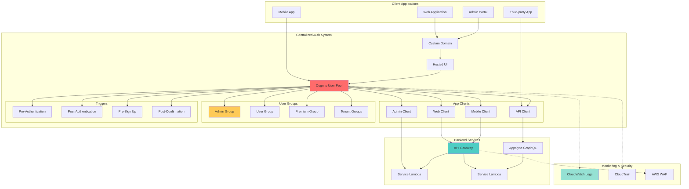
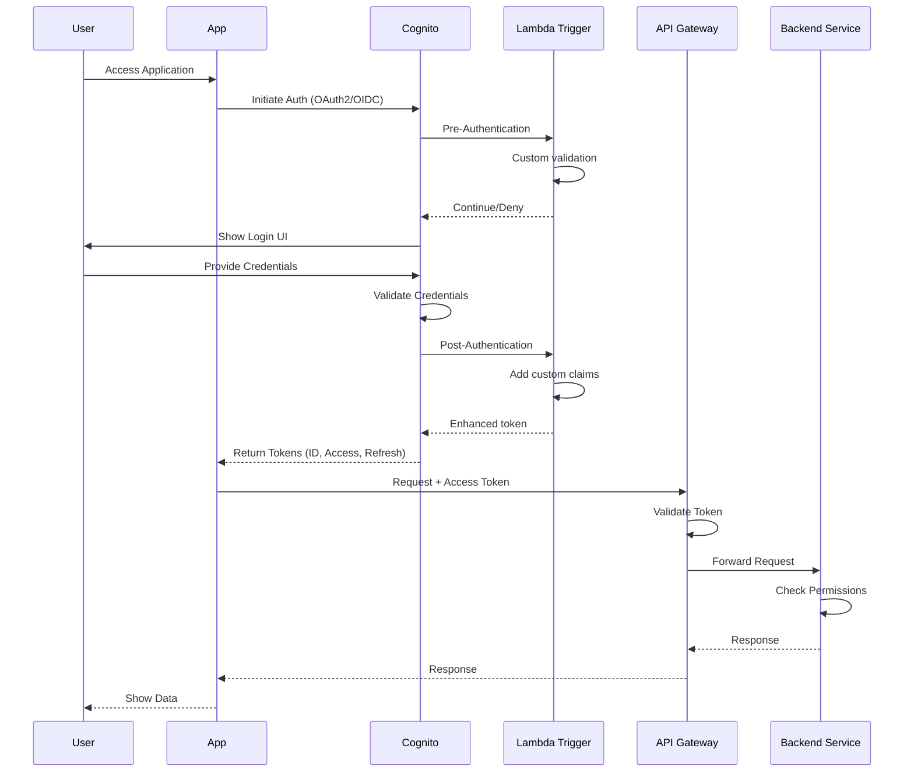
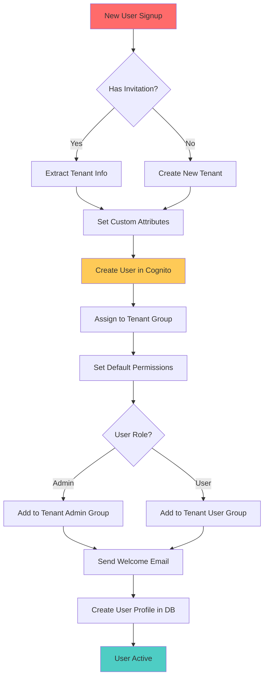

## 🎯 Introduction

Building a centralized user access control system is one of the most critical architectural decisions for modern applications. Whether you're managing a single application or a microservices ecosystem, having a robust, scalable authentication and authorization system is essential for:

- **Single Source of Truth**: One system managing all user identities and permissions
- **Consistency**: Uniform authentication experience across all services
- **Security**: Centralized security policies and compliance controls
- **Scalability**: Support for millions of users across multiple applications
- **Developer Experience**: Simple integration for new services
- **Cost Efficiency**: Managed service without operational overhead

This comprehensive guide demonstrates how to design and implement a production-ready centralized access control system using AWS Cognito and CDK (TypeScript), with strategies for multi-tenancy, role-based access control (RBAC), and integration patterns for various services.

> 💡 **Core Philosophy**: "A well-designed identity system should be invisible to users, straightforward for developers, and bulletproof for security teams"

### 🎬 What We'll Build

A complete centralized authentication and authorization system featuring:

- **AWS Cognito User Pools** for user authentication and management
- **Custom Domain** with hosted UI for seamless user experience
- **Multiple App Clients** for different applications and services
- **Group-based RBAC** with custom scopes and permissions
- **Custom Attributes** for flexible user metadata
- **Pre/Post Authentication Triggers** for custom business logic
- **API Integration** patterns for microservices
- **Multi-tenant Support** with different isolation strategies
- **Admin Portal** for user management
- **Audit Logging** for compliance

## 🏗️ Architecture Overview

### 📊 High-Level Architecture



### 🔄 Authentication Flow



## 🎨 Design Patterns: Single vs Multiple User Pools

### 📋 Pattern Comparison

| Aspect | Single User Pool | Multiple User Pools |
|--------|-----------------|---------------------|
| **Use Case** | Single tenant, unified user base | Multi-tenant, isolated environments |
| **Complexity** | Low | High |
| **Cost** | Lower (one pool) | Higher (multiple pools) |
| **Isolation** | Group-based | Pool-based (stronger) |
| **Management** | Centralized | Distributed |
| **Scalability** | Very high (millions of users) | High per pool |
| **Customization** | Shared settings | Per-tenant settings |
| **Migration** | Easier | More complex |

### ✅ Recommended: Single User Pool with Groups

For most use cases, a **single user pool with group-based access control** provides the best balance of simplicity, cost, and functionality.

```typescript
// Single User Pool Strategy
// ✅ GOOD: One pool, multiple groups
UserPool
├── Groups
│   ├── tenant-acme-admin
│   ├── tenant-acme-user
│   ├── tenant-widget-admin
│   ├── tenant-widget-user
│   ├── global-admin
│   └── support
├── Custom Attributes
│   ├── tenantId
│   ├── role
│   └── permissions
└── App Clients
    ├── web-app-client
    ├── mobile-app-client
    ├── admin-portal-client
    └── api-client
```

### 🔄 When to Use Multiple User Pools

Use multiple user pools when you need:

1. **Regulatory Compliance**: Data residency requirements (different regions)
2. **Strong Tenant Isolation**: Complete separation of user data
3. **Different Security Policies**: Varying password policies per tenant
4. **Custom Branding**: Unique hosted UI per tenant
5. **B2B SaaS**: Enterprise customers requiring dedicated pools

```typescript
// Multiple User Pools Strategy
// Use for strong isolation
├── UserPool-TenantA (Region: us-east-1)
├── UserPool-TenantB (Region: eu-west-1)
└── UserPool-TenantC (Region: ap-southeast-1)
```

## 📦 CDK Project Structure

```
auth-system-cdk/
├── bin/
│   └── auth-system.ts              # CDK app entry point
├── lib/
│   ├── stacks/
│   │   ├── cognito-stack.ts        # Main Cognito configuration
│   │   ├── triggers-stack.ts       # Lambda triggers
│   │   ├── api-integration-stack.ts # API Gateway authorizers
│   │   └── monitoring-stack.ts     # CloudWatch dashboards
│   ├── constructs/
│   │   ├── user-pool.ts            # Reusable User Pool construct
│   │   ├── app-client.ts           # App Client construct
│   │   └── user-groups.ts          # Groups construct
│   ├── config/
│   │   ├── auth-config.ts          # Authentication configuration
│   │   ├── groups-config.ts        # Groups and permissions
│   │   └── app-clients-config.ts   # App client settings
│   └── utils/
│       ├── custom-attributes.ts    # Custom attribute helpers
│       └── permissions.ts          # Permission definitions
├── lambda/
│   ├── triggers/
│   │   ├── pre-authentication.ts
│   │   ├── post-authentication.ts
│   │   ├── pre-sign-up.ts
│   │   └── post-confirmation.ts
│   ├── admin/
│   │   ├── create-user.ts
│   │   ├── manage-groups.ts
│   │   └── custom-attributes.ts
│   └── authorizers/
│       └── cognito-authorizer.ts
├── test/
│   ├── unit/
│   └── integration/
├── docs/
│   ├── integration-guide.md
│   └── api-reference.md
├── cdk.json
├── tsconfig.json
└── package.json
```

## ⚙️ Configuration Design

### 🎯 Authentication Configuration

```typescript
// lib/config/auth-config.ts
export interface AuthConfig {
  userPoolName: string;
  passwordPolicy: PasswordPolicyConfig;
  mfaConfig: MfaConfig;
  emailConfig: EmailConfig;
  customDomain?: string;
  supportedIdentityProviders: IdentityProvider[];
  customAttributes: CustomAttribute[];
}

export interface PasswordPolicyConfig {
  minLength: number;
  requireLowercase: boolean;
  requireUppercase: boolean;
  requireDigits: boolean;
  requireSymbols: boolean;
  tempPasswordValidity: number;
}

export interface MfaConfig {
  enabled: boolean;
  optional: boolean;
  methods: ('SMS' | 'TOTP' | 'SOFTWARE_TOKEN')[];
}

export interface CustomAttribute {
  name: string;
  type: 'String' | 'Number' | 'DateTime' | 'Boolean';
  mutable: boolean;
  required?: boolean;
  min?: number;
  max?: number;
}

export const authConfigs = {
  development: {
    userPoolName: 'dev-central-auth-pool',
    passwordPolicy: {
      minLength: 8,
      requireLowercase: true,
      requireUppercase: true,
      requireDigits: true,
      requireSymbols: false,
      tempPasswordValidity: 7,
    },
    mfaConfig: {
      enabled: false,
      optional: true,
      methods: ['SOFTWARE_TOKEN'],
    },
    emailConfig: {
      emailSendingAccount: 'COGNITO_DEFAULT',
    },
    supportedIdentityProviders: ['COGNITO'],
    customAttributes: [
      {
        name: 'tenantId',
        type: 'String',
        mutable: false,
        required: true,
        min: 1,
        max: 256,
      },
      {
        name: 'role',
        type: 'String',
        mutable: true,
        required: true,
      },
      {
        name: 'permissions',
        type: 'String',
        mutable: true,
      },
      {
        name: 'organizationId',
        type: 'String',
        mutable: false,
      },
    ],
  },
  production: {
    userPoolName: 'prod-central-auth-pool',
    passwordPolicy: {
      minLength: 12,
      requireLowercase: true,
      requireUppercase: true,
      requireDigits: true,
      requireSymbols: true,
      tempPasswordValidity: 3,
    },
    mfaConfig: {
      enabled: true,
      optional: false,
      methods: ['SOFTWARE_TOKEN', 'SMS'],
    },
    emailConfig: {
      emailSendingAccount: 'DEVELOPER',
      from: 'auth@yourdomain.com',
      replyTo: 'support@yourdomain.com',
    },
    customDomain: 'auth.yourdomain.com',
    supportedIdentityProviders: ['COGNITO', 'Google', 'SAML'],
    customAttributes: [
      {
        name: 'tenantId',
        type: 'String',
        mutable: false,
        required: true,
      },
      {
        name: 'role',
        type: 'String',
        mutable: true,
        required: true,
      },
      {
        name: 'permissions',
        type: 'String',
        mutable: true,
      },
      {
        name: 'organizationId',
        type: 'String',
        mutable: false,
      },
      {
        name: 'department',
        type: 'String',
        mutable: true,
      },
    ],
  },
} as const;
```

### 👥 Groups and Permissions Configuration

```typescript
// lib/config/groups-config.ts
export interface GroupConfig {
  name: string;
  description: string;
  precedence: number;
  permissions: Permission[];
}

export interface Permission {
  resource: string;
  actions: string[];
  effect: 'Allow' | 'Deny';
  conditions?: Record<string, any>;
}

export const groupConfigs: GroupConfig[] = [
  {
    name: 'global-admin',
    description: 'Global administrators with full access',
    precedence: 1,
    permissions: [
      {
        resource: '*',
        actions: ['*'],
        effect: 'Allow',
      },
    ],
  },
  {
    name: 'tenant-admin',
    description: 'Tenant administrators',
    precedence: 10,
    permissions: [
      {
        resource: 'tenant:${tenantId}:*',
        actions: ['read', 'write', 'delete'],
        effect: 'Allow',
      },
      {
        resource: 'user:${tenantId}:*',
        actions: ['read', 'write', 'invite'],
        effect: 'Allow',
      },
    ],
  },
  {
    name: 'tenant-user',
    description: 'Standard tenant users',
    precedence: 20,
    permissions: [
      {
        resource: 'tenant:${tenantId}:*',
        actions: ['read'],
        effect: 'Allow',
      },
      {
        resource: 'user:${tenantId}:${userId}',
        actions: ['read', 'write'],
        effect: 'Allow',
      },
    ],
  },
  {
    name: 'support',
    description: 'Customer support team',
    precedence: 30,
    permissions: [
      {
        resource: 'user:*',
        actions: ['read'],
        effect: 'Allow',
      },
      {
        resource: 'ticket:*',
        actions: ['read', 'write'],
        effect: 'Allow',
      },
    ],
  },
];

// Dynamic group creation for tenants
export function createTenantGroups(tenantId: string): GroupConfig[] {
  return [
    {
      name: `tenant-${tenantId}-admin`,
      description: `Admin group for tenant ${tenantId}`,
      precedence: 100,
      permissions: [
        {
          resource: `tenant:${tenantId}:*`,
          actions: ['*'],
          effect: 'Allow',
        },
      ],
    },
    {
      name: `tenant-${tenantId}-user`,
      description: `User group for tenant ${tenantId}`,
      precedence: 200,
      permissions: [
        {
          resource: `tenant:${tenantId}:*`,
          actions: ['read'],
          effect: 'Allow',
        },
      ],
    },
  ];
}
```

### 📱 App Clients Configuration

```typescript
// lib/config/app-clients-config.ts
export interface AppClientConfig {
  name: string;
  description: string;
  authFlows: AuthFlow[];
  oAuth: OAuthConfig;
  tokenValidity: TokenValidityConfig;
  scopes: string[];
  callbackUrls?: string[];
  logoutUrls?: string[];
}

export type AuthFlow =
  | 'ALLOW_USER_PASSWORD_AUTH'
  | 'ALLOW_USER_SRP_AUTH'
  | 'ALLOW_REFRESH_TOKEN_AUTH'
  | 'ALLOW_CUSTOM_AUTH';

export interface OAuthConfig {
  enabled: boolean;
  flows: ('code' | 'implicit' | 'client_credentials')[];
  scopes: string[];
}

export interface TokenValidityConfig {
  accessToken: number; // minutes
  idToken: number; // minutes
  refreshToken: number; // days
}

export const appClientConfigs: Record<string, AppClientConfig> = {
  webApp: {
    name: 'web-app-client',
    description: 'Client for web application',
    authFlows: ['ALLOW_USER_SRP_AUTH', 'ALLOW_REFRESH_TOKEN_AUTH'],
    oAuth: {
      enabled: true,
      flows: ['code'],
      scopes: ['openid', 'email', 'profile', 'aws.cognito.signin.user.admin'],
    },
    tokenValidity: {
      accessToken: 60, // 1 hour
      idToken: 60,
      refreshToken: 30, // 30 days
    },
    scopes: ['read', 'write'],
    callbackUrls: ['http://localhost:3000/callback', 'https://app.yourdomain.com/callback'],
    logoutUrls: ['http://localhost:3000', 'https://app.yourdomain.com'],
  },
  mobileApp: {
    name: 'mobile-app-client',
    description: 'Client for mobile applications',
    authFlows: ['ALLOW_USER_SRP_AUTH', 'ALLOW_REFRESH_TOKEN_AUTH'],
    oAuth: {
      enabled: true,
      flows: ['code'],
      scopes: ['openid', 'email', 'profile'],
    },
    tokenValidity: {
      accessToken: 60,
      idToken: 60,
      refreshToken: 90, // 90 days for mobile
    },
    scopes: ['read', 'write'],
    callbackUrls: ['myapp://callback'],
    logoutUrls: ['myapp://logout'],
  },
  adminPortal: {
    name: 'admin-portal-client',
    description: 'Client for admin portal',
    authFlows: ['ALLOW_USER_SRP_AUTH', 'ALLOW_REFRESH_TOKEN_AUTH'],
    oAuth: {
      enabled: true,
      flows: ['code'],
      scopes: ['openid', 'email', 'profile', 'aws.cognito.signin.user.admin'],
    },
    tokenValidity: {
      accessToken: 30, // 30 minutes for admin
      idToken: 30,
      refreshToken: 1, // 1 day
    },
    scopes: ['admin', 'read', 'write', 'delete'],
    callbackUrls: ['http://localhost:3001/callback', 'https://admin.yourdomain.com/callback'],
    logoutUrls: ['http://localhost:3001', 'https://admin.yourdomain.com'],
  },
  apiClient: {
    name: 'api-client',
    description: 'Client for server-to-server API calls',
    authFlows: ['ALLOW_CUSTOM_AUTH', 'ALLOW_REFRESH_TOKEN_AUTH'],
    oAuth: {
      enabled: true,
      flows: ['client_credentials'],
      scopes: ['api/read', 'api/write'],
    },
    tokenValidity: {
      accessToken: 60,
      idToken: 60,
      refreshToken: 30,
    },
    scopes: ['api.read', 'api.write'],
  },
};
```

## 🏗️ CDK Stack Implementation

### 🎯 Main Cognito Stack

```typescript
// lib/stacks/cognito-stack.ts
import * as cdk from 'aws-cdk-lib';
import * as cognito from 'aws-cdk-lib/aws-cognito';
import * as lambda from 'aws-cdk-lib/aws-lambda';
import * as iam from 'aws-cdk-lib/aws-iam';
import { Construct } from 'constructs';
import { authConfigs, AuthConfig } from '../config/auth-config';
import { groupConfigs } from '../config/groups-config';
import { appClientConfigs } from '../config/app-clients-config';

export interface CognitoStackProps extends cdk.StackProps {
  environment: 'development' | 'production';
}

export class CognitoStack extends cdk.Stack {
  public readonly userPool: cognito.UserPool;
  public readonly userPoolId: string;
  public readonly userPoolArn: string;
  public readonly appClients: Map<string, cognito.UserPoolClient>;
  public readonly groups: Map<string, cognito.CfnUserPoolGroup>;

  constructor(scope: Construct, id: string, props: CognitoStackProps) {
    super(scope, id, props);

    const config = authConfigs[props.environment];

    // Create User Pool
    this.userPool = this.createUserPool(config);
    this.userPoolId = this.userPool.userPoolId;
    this.userPoolArn = this.userPool.userPoolArn;

    // Add custom domain
    if (config.customDomain) {
      this.addCustomDomain(config.customDomain);
    }

    // Create groups
    this.groups = this.createGroups();

    // Create app clients
    this.appClients = this.createAppClients();

    // Add identity providers (optional)
    this.addIdentityProviders(config);

    // Output important values
    this.createOutputs();
  }

  private createUserPool(config: AuthConfig): cognito.UserPool {
    // Create custom attributes
    const customAttributes: Record<string, cognito.ICustomAttribute> = {};

    config.customAttributes.forEach((attr) => {
      if (attr.type === 'String') {
        customAttributes[attr.name] = new cognito.StringAttribute({
          mutable: attr.mutable,
          minLen: attr.min,
          maxLen: attr.max,
        });
      } else if (attr.type === 'Number') {
        customAttributes[attr.name] = new cognito.NumberAttribute({
          mutable: attr.mutable,
          min: attr.min,
          max: attr.max,
        });
      }
    });

    const userPool = new cognito.UserPool(this, 'UserPool', {
      userPoolName: config.userPoolName,

      // Sign-in configuration
      signInAliases: {
        email: true,
        username: true,
        phone: false,
      },

      // Auto-verify
      autoVerify: {
        email: true,
      },

      // Self sign-up
      selfSignUpEnabled: true,

      // User attributes
      standardAttributes: {
        email: {
          required: true,
          mutable: true,
        },
        givenName: {
          required: true,
          mutable: true,
        },
        familyName: {
          required: true,
          mutable: true,
        },
      },

      customAttributes,

      // Password policy
      passwordPolicy: {
        minLength: config.passwordPolicy.minLength,
        requireLowercase: config.passwordPolicy.requireLowercase,
        requireUppercase: config.passwordPolicy.requireUppercase,
        requireDigits: config.passwordPolicy.requireDigits,
        requireSymbols: config.passwordPolicy.requireSymbols,
        tempPasswordValidity: cdk.Duration.days(
          config.passwordPolicy.tempPasswordValidity
        ),
      },

      // MFA
      mfa: config.mfaConfig.enabled
        ? config.mfaConfig.optional
          ? cognito.Mfa.OPTIONAL
          : cognito.Mfa.REQUIRED
        : cognito.Mfa.OFF,

      mfaSecondFactor: {
        sms: config.mfaConfig.methods.includes('SMS'),
        otp: config.mfaConfig.methods.includes('SOFTWARE_TOKEN'),
      },

      // Account recovery
      accountRecovery: cognito.AccountRecovery.EMAIL_ONLY,

      // Email configuration
      email: config.emailConfig.emailSendingAccount === 'DEVELOPER'
        ? cognito.UserPoolEmail.withSES({
            fromEmail: config.emailConfig.from!,
            fromName: 'Your App',
            replyTo: config.emailConfig.replyTo,
          })
        : cognito.UserPoolEmail.withCognito(),

      // Advanced security
      advancedSecurityMode: cognito.AdvancedSecurityMode.ENFORCED,

      // Deletion protection
      deletionProtection: props.environment === 'production',

      // Device tracking
      deviceTracking: {
        challengeRequiredOnNewDevice: true,
        deviceOnlyRememberedOnUserPrompt: true,
      },

      // Lambda triggers (will be added later)
      lambdaTriggers: {},

      // Removal policy
      removalPolicy:
        props.environment === 'production'
          ? cdk.RemovalPolicy.RETAIN
          : cdk.RemovalPolicy.DESTROY,
    });

    // Enable user pool analytics
    new cognito.CfnUserPoolUserToGroupAttachment(this, 'UserPoolAnalytics', {
      userPoolId: userPool.userPoolId,
      groupName: 'Analytics',
      username: 'analytics-user',
    });

    return userPool;
  }

  private addCustomDomain(domainName: string): void {
    const domain = this.userPool.addDomain('CustomDomain', {
      customDomain: {
        domainName,
        certificate: undefined, // Add ACM certificate here
      },
    });

    new cdk.CfnOutput(this, 'UserPoolDomain', {
      value: domain.domainName,
      description: 'Cognito User Pool Domain',
    });
  }

  private createGroups(): Map<string, cognito.CfnUserPoolGroup> {
    const groups = new Map<string, cognito.CfnUserPoolGroup>();

    groupConfigs.forEach((groupConfig) => {
      const group = new cognito.CfnUserPoolGroup(this, `Group-${groupConfig.name}`, {
        userPoolId: this.userPool.userPoolId,
        groupName: groupConfig.name,
        description: groupConfig.description,
        precedence: groupConfig.precedence,
      });

      groups.set(groupConfig.name, group);
    });

    return groups;
  }

  private createAppClients(): Map<string, cognito.UserPoolClient> {
    const clients = new Map<string, cognito.UserPoolClient>();

    Object.entries(appClientConfigs).forEach(([key, config]) => {
      const client = this.userPool.addClient(`AppClient-${key}`, {
        userPoolClientName: config.name,
        generateSecret: key === 'apiClient', // Only API client needs secret

        // Auth flows
        authFlows: {
          userPassword: config.authFlows.includes('ALLOW_USER_PASSWORD_AUTH'),
          userSrp: config.authFlows.includes('ALLOW_USER_SRP_AUTH'),
          custom: config.authFlows.includes('ALLOW_CUSTOM_AUTH'),
          adminUserPassword: false,
        },

        // OAuth configuration
        oAuth: config.oAuth.enabled
          ? {
              flows: {
                authorizationCodeGrant: config.oAuth.flows.includes('code'),
                implicitCodeGrant: config.oAuth.flows.includes('implicit'),
                clientCredentials: config.oAuth.flows.includes('client_credentials'),
              },
              scopes: config.oAuth.scopes.map((scope) =>
                scope === 'openid'
                  ? cognito.OAuthScope.OPENID
                  : scope === 'email'
                  ? cognito.OAuthScope.EMAIL
                  : scope === 'profile'
                  ? cognito.OAuthScope.PROFILE
                  : cognito.OAuthScope.custom(scope)
              ),
              callbackUrls: config.callbackUrls,
              logoutUrls: config.logoutUrls,
            }
          : undefined,

        // Token validity
        accessTokenValidity: cdk.Duration.minutes(config.tokenValidity.accessToken),
        idTokenValidity: cdk.Duration.minutes(config.tokenValidity.idToken),
        refreshTokenValidity: cdk.Duration.days(config.tokenValidity.refreshToken),

        // Prevent user existence errors
        preventUserExistenceErrors: true,

        // Read/write attributes
        readAttributes: new cognito.ClientAttributes()
          .withStandardAttributes({
            email: true,
            givenName: true,
            familyName: true,
            emailVerified: true,
          })
          .withCustomAttributes(...config.customAttributes || []),

        writeAttributes: new cognito.ClientAttributes()
          .withStandardAttributes({
            givenName: true,
            familyName: true,
          }),
      });

      clients.set(key, client);

      // Output client ID
      new cdk.CfnOutput(this, `AppClientId-${key}`, {
        value: client.userPoolClientId,
        description: `${config.name} Client ID`,
      });
    });

    return clients;
  }

  private addIdentityProviders(config: AuthConfig): void {
    // Add Google Identity Provider
    if (config.supportedIdentityProviders.includes('Google')) {
      new cognito.UserPoolIdentityProviderGoogle(this, 'GoogleProvider', {
        userPool: this.userPool,
        clientId: process.env.GOOGLE_CLIENT_ID || '',
        clientSecret: process.env.GOOGLE_CLIENT_SECRET || '',
        scopes: ['openid', 'email', 'profile'],
        attributeMapping: {
          email: cognito.ProviderAttribute.GOOGLE_EMAIL,
          givenName: cognito.ProviderAttribute.GOOGLE_GIVEN_NAME,
          familyName: cognito.ProviderAttribute.GOOGLE_FAMILY_NAME,
        },
      });
    }

    // Add SAML Identity Provider
    if (config.supportedIdentityProviders.includes('SAML')) {
      new cognito.UserPoolIdentityProviderSaml(this, 'SamlProvider', {
        userPool: this.userPool,
        name: 'SAML',
        metadata: cognito.UserPoolIdentityProviderSamlMetadata.url(
          'https://your-idp.com/metadata.xml'
        ),
        attributeMapping: {
          email: cognito.ProviderAttribute.other('email'),
          givenName: cognito.ProviderAttribute.other('firstName'),
          familyName: cognito.ProviderAttribute.other('lastName'),
        },
      });
    }
  }

  private createOutputs(): void {
    new cdk.CfnOutput(this, 'UserPoolId', {
      value: this.userPoolId,
      description: 'Cognito User Pool ID',
      exportName: 'CentralAuthUserPoolId',
    });

    new cdk.CfnOutput(this, 'UserPoolArn', {
      value: this.userPoolArn,
      description: 'Cognito User Pool ARN',
      exportName: 'CentralAuthUserPoolArn',
    });
  }
}
```

### ⚡ Lambda Triggers Stack

```typescript
// lib/stacks/triggers-stack.ts
import * as cdk from 'aws-cdk-lib';
import * as cognito from 'aws-cdk-lib/aws-cognito';
import * as lambda from 'aws-cdk-lib/aws-lambda';
import * as logs from 'aws-cdk-lib/aws-logs';
import { NodejsFunction } from 'aws-cdk-lib/aws-lambda-nodejs';
import { Construct } from 'constructs';
import * as path from 'path';

export interface TriggersStackProps extends cdk.StackProps {
  userPool: cognito.UserPool;
}

export class TriggersStack extends cdk.Stack {
  constructor(scope: Construct, id: string, props: TriggersStackProps) {
    super(scope, id, props);

    const { userPool } = props;

    // Pre-Authentication Trigger
    const preAuthFunction = new NodejsFunction(this, 'PreAuthFunction', {
      runtime: lambda.Runtime.NODEJS_20_X,
      handler: 'handler',
      entry: path.join(__dirname, '../../lambda/triggers/pre-authentication.ts'),
      timeout: cdk.Duration.seconds(5),
      memorySize: 256,
      logRetention: logs.RetentionDays.ONE_WEEK,
      environment: {
        USER_POOL_ID: userPool.userPoolId,
      },
    });

    // Post-Authentication Trigger
    const postAuthFunction = new NodejsFunction(this, 'PostAuthFunction', {
      runtime: lambda.Runtime.NODEJS_20_X,
      handler: 'handler',
      entry: path.join(__dirname, '../../lambda/triggers/post-authentication.ts'),
      timeout: cdk.Duration.seconds(5),
      memorySize: 256,
      logRetention: logs.RetentionDays.ONE_WEEK,
    });

    // Pre-Sign-Up Trigger
    const preSignUpFunction = new NodejsFunction(this, 'PreSignUpFunction', {
      runtime: lambda.Runtime.NODEJS_20_X,
      handler: 'handler',
      entry: path.join(__dirname, '../../lambda/triggers/pre-sign-up.ts'),
      timeout: cdk.Duration.seconds(5),
      memorySize: 256,
      logRetention: logs.RetentionDays.ONE_WEEK,
    });

    // Post-Confirmation Trigger
    const postConfirmFunction = new NodejsFunction(this, 'PostConfirmFunction', {
      runtime: lambda.Runtime.NODEJS_20_X,
      handler: 'handler',
      entry: path.join(__dirname, '../../lambda/triggers/post-confirmation.ts'),
      timeout: cdk.Duration.seconds(5),
      memorySize: 256,
      logRetention: logs.RetentionDays.ONE_WEEK,
    });

    // Grant Cognito permission to invoke Lambda functions
    preAuthFunction.grantInvoke(
      new cdk.aws_iam.ServicePrincipal('cognito-idp.amazonaws.com')
    );
    postAuthFunction.grantInvoke(
      new cdk.aws_iam.ServicePrincipal('cognito-idp.amazonaws.com')
    );
    preSignUpFunction.grantInvoke(
      new cdk.aws_iam.ServicePrincipal('cognito-idp.amazonaws.com')
    );
    postConfirmFunction.grantInvoke(
      new cdk.aws_iam.ServicePrincipal('cognito-idp.amazonaws.com')
    );

    // Add triggers to User Pool
    const cfnUserPool = userPool.node.defaultChild as cognito.CfnUserPool;
    cfnUserPool.lambdaConfig = {
      preAuthentication: preAuthFunction.functionArn,
      postAuthentication: postAuthFunction.functionArn,
      preSignUp: preSignUpFunction.functionArn,
      postConfirmation: postConfirmFunction.functionArn,
    };
  }
}
```

### 🔐 Lambda Trigger Implementations

```typescript
// lambda/triggers/pre-authentication.ts
import {
  PreAuthenticationTriggerEvent,
  PreAuthenticationTriggerHandler,
} from 'aws-lambda';

export const handler: PreAuthenticationTriggerHandler = async (event) => {
  console.log('Pre-Authentication Trigger:', JSON.stringify(event, null, 2));

  // Example: Block users from specific domains
  const email = event.request.userAttributes.email;
  const blockedDomains = ['blocked-domain.com', 'spam.com'];

  if (blockedDomains.some((domain) => email.endsWith(`@${domain}`))) {
    throw new Error('Email domain is not allowed');
  }

  // Example: Check if user is active in external system
  const isActive = await checkUserActiveStatus(event.request.userAttributes.sub);

  if (!isActive) {
    throw new Error('User account is not active');
  }

  // Example: Add custom validation based on user attributes
  const tenantId = event.request.userAttributes['custom:tenantId'];
  if (tenantId) {
    const isTenantActive = await checkTenantStatus(tenantId);
    if (!isTenantActive) {
      throw new Error('Tenant account is suspended');
    }
  }

  return event;
};

async function checkUserActiveStatus(userId: string): Promise<boolean> {
  // Implement your logic to check user status
  // Example: Query DynamoDB, call external API, etc.
  return true;
}

async function checkTenantStatus(tenantId: string): Promise<boolean> {
  // Implement your logic to check tenant status
  return true;
}
```

```typescript
// lambda/triggers/post-authentication.ts
import {
  PostAuthenticationTriggerEvent,
  PostAuthenticationTriggerHandler,
} from 'aws-lambda';

export const handler: PostAuthenticationTriggerHandler = async (event) => {
  console.log('Post-Authentication Trigger:', JSON.stringify(event, null, 2));

  // Example: Log successful authentication
  await logAuthentication({
    userId: event.request.userAttributes.sub,
    email: event.request.userAttributes.email,
    timestamp: new Date().toISOString(),
    ipAddress: event.request.userContextData?.sourceIp[0],
  });

  // Example: Add custom claims to the token
  event.response.claimsOverrideDetails = {
    claimsToAddOrOverride: {
      tenantId: event.request.userAttributes['custom:tenantId'] || '',
      role: event.request.userAttributes['custom:role'] || 'user',
      permissions: event.request.userAttributes['custom:permissions'] || '',
    },
  };

  // Example: Update last login timestamp
  await updateLastLogin(event.request.userAttributes.sub);

  return event;
};

async function logAuthentication(data: any): Promise<void> {
  // Log to CloudWatch, DynamoDB, or external system
  console.log('Authentication logged:', data);
}

async function updateLastLogin(userId: string): Promise<void> {
  // Update user's last login timestamp in database
  console.log('Last login updated for user:', userId);
}
```

```typescript
// lambda/triggers/pre-sign-up.ts
import {
  PreSignUpTriggerEvent,
  PreSignUpTriggerHandler,
} from 'aws-lambda';

export const handler: PreSignUpTriggerHandler = async (event) => {
  console.log('Pre-Sign-Up Trigger:', JSON.stringify(event, null, 2));

  // Auto-confirm and auto-verify user
  event.response.autoConfirmUser = true;
  event.response.autoVerifyEmail = true;

  // Example: Validate invitation code
  const invitationCode = event.request.userAttributes['custom:invitationCode'];
  if (invitationCode) {
    const isValidInvitation = await validateInvitation(invitationCode);
    if (!isValidInvitation) {
      throw new Error('Invalid invitation code');
    }
  }

  // Example: Assign default tenant based on email domain
  const email = event.request.userAttributes.email;
  const domain = email.split('@')[1];
  const tenantId = await getTenantIdByDomain(domain);

  if (tenantId) {
    event.response.claimsOverrideDetails = {
      claimsToAddOrOverride: {
        'custom:tenantId': tenantId,
      },
    };
  }

  return event;
};

async function validateInvitation(code: string): Promise<boolean> {
  // Validate invitation code against database
  return true;
}

async function getTenantIdByDomain(domain: string): Promise<string | null> {
  // Map email domain to tenant ID
  const domainToTenant: Record<string, string> = {
    'company.com': 'tenant-company',
    'startup.io': 'tenant-startup',
  };

  return domainToTenant[domain] || null;
}
```

```typescript
// lambda/triggers/post-confirmation.ts
import {
  PostConfirmationTriggerEvent,
  PostConfirmationTriggerHandler,
} from 'aws-lambda';
import {
  CognitoIdentityProviderClient,
  AdminAddUserToGroupCommand,
} from '@aws-sdk/client-cognito-identity-provider';

const cognitoClient = new CognitoIdentityProviderClient({});

export const handler: PostConfirmationTriggerHandler = async (event) => {
  console.log('Post-Confirmation Trigger:', JSON.stringify(event, null, 2));

  const userId = event.request.userAttributes.sub;
  const tenantId = event.request.userAttributes['custom:tenantId'];

  // Example: Add user to default group
  await addUserToGroup(event.userPoolId, event.userName, 'tenant-user');

  // Example: Add user to tenant-specific group
  if (tenantId) {
    await addUserToGroup(event.userPoolId, event.userName, `tenant-${tenantId}-user`);
  }

  // Example: Send welcome email
  await sendWelcomeEmail(event.request.userAttributes.email);

  // Example: Create user profile in database
  await createUserProfile({
    userId,
    email: event.request.userAttributes.email,
    name: `${event.request.userAttributes.given_name} ${event.request.userAttributes.family_name}`,
    tenantId,
  });

  return event;
};

async function addUserToGroup(
  userPoolId: string,
  username: string,
  groupName: string
): Promise<void> {
  try {
    await cognitoClient.send(
      new AdminAddUserToGroupCommand({
        UserPoolId: userPoolId,
        Username: username,
        GroupName: groupName,
      })
    );
    console.log(`Added user ${username} to group ${groupName}`);
  } catch (error) {
    console.error('Error adding user to group:', error);
  }
}

async function sendWelcomeEmail(email: string): Promise<void> {
  // Send welcome email via SES, SendGrid, etc.
  console.log('Welcome email sent to:', email);
}

async function createUserProfile(profile: any): Promise<void> {
  // Create user profile in DynamoDB or other database
  console.log('User profile created:', profile);
}
```

## 🔗 Integration Patterns

### 🌐 API Gateway Integration

```typescript
// lib/stacks/api-integration-stack.ts
import * as cdk from 'aws-cdk-lib';
import * as apigateway from 'aws-cdk-lib/aws-apigateway';
import * as cognito from 'aws-cdk-lib/aws-cognito';
import { Construct } from 'constructs';

export interface ApiIntegrationStackProps extends cdk.StackProps {
  userPool: cognito.UserPool;
  userPoolClient: cognito.UserPoolClient;
}

export class ApiIntegrationStack extends cdk.Stack {
  public readonly api: apigateway.RestApi;

  constructor(scope: Construct, id: string, props: ApiIntegrationStackProps) {
    super(scope, id, props);

    const { userPool, userPoolClient } = props;

    // Create Cognito Authorizer
    const authorizer = new apigateway.CognitoUserPoolsAuthorizer(
      this,
      'CognitoAuthorizer',
      {
        cognitoUserPools: [userPool],
        identitySource: 'method.request.header.Authorization',
        authorizerName: 'CognitoAuthorizer',
      }
    );

    // Create API Gateway
    this.api = new apigateway.RestApi(this, 'ProtectedApi', {
      restApiName: 'Protected API',
      description: 'API protected by Cognito',
      defaultCorsPreflightOptions: {
        allowOrigins: apigateway.Cors.ALL_ORIGINS,
        allowMethods: apigateway.Cors.ALL_METHODS,
        allowHeaders: ['Content-Type', 'Authorization'],
      },
    });

    // Example: Protected resource
    const protectedResource = this.api.root.addResource('protected');

    protectedResource.addMethod(
      'GET',
      new apigateway.MockIntegration({
        integrationResponses: [
          {
            statusCode: '200',
            responseTemplates: {
              'application/json': JSON.stringify({
                message: 'Hello from protected endpoint',
                user: '$context.authorizer.claims',
              }),
            },
          },
        ],
        requestTemplates: {
          'application/json': '{"statusCode": 200}',
        },
      }),
      {
        authorizer,
        authorizationType: apigateway.AuthorizationType.COGNITO,
        authorizationScopes: ['openid', 'email'],
        methodResponses: [{ statusCode: '200' }],
      }
    );

    // Example: Admin-only resource
    const adminResource = this.api.root.addResource('admin');

    adminResource.addMethod(
      'POST',
      new apigateway.MockIntegration({
        integrationResponses: [
          {
            statusCode: '200',
            responseTemplates: {
              'application/json': JSON.stringify({
                message: 'Admin action completed',
              }),
            },
          },
        ],
        requestTemplates: {
          'application/json': '{"statusCode": 200}',
        },
      }),
      {
        authorizer,
        authorizationType: apigateway.AuthorizationType.COGNITO,
        // Note: Group-based authorization needs Lambda authorizer
        methodResponses: [{ statusCode: '200' }],
      }
    );

    // Output API URL
    new cdk.CfnOutput(this, 'ApiUrl', {
      value: this.api.url,
      description: 'Protected API URL',
    });
  }
}
```

### 🔐 Custom Lambda Authorizer for Fine-Grained Access

```typescript
// lambda/authorizers/cognito-authorizer.ts
import {
  APIGatewayAuthorizerResult,
  APIGatewayTokenAuthorizerEvent,
  APIGatewayTokenAuthorizerHandler,
} from 'aws-lambda';
import { CognitoJwtVerifier } from 'aws-jwt-verify';

const verifier = CognitoJwtVerifier.create({
  userPoolId: process.env.USER_POOL_ID!,
  tokenUse: 'access',
  clientId: process.env.CLIENT_ID!,
});

export const handler: APIGatewayTokenAuthorizerHandler = async (
  event: APIGatewayTokenAuthorizerEvent
): Promise<APIGatewayAuthorizerResult> => {
  console.log('Authorizer event:', JSON.stringify(event, null, 2));

  try {
    // Extract token from Authorization header
    const token = event.authorizationToken.replace('Bearer ', '');

    // Verify JWT token
    const payload = await verifier.verify(token);

    console.log('Token payload:', payload);

    // Extract user information
    const userId = payload.sub;
    const username = payload.username;
    const groups = payload['cognito:groups'] || [];
    const tenantId = payload['custom:tenantId'] || '';
    const role = payload['custom:role'] || 'user';

    // Check permissions based on resource and method
    const resource = event.methodArn;
    const hasPermission = checkPermissions(resource, groups, role);

    if (!hasPermission) {
      throw new Error('Insufficient permissions');
    }

    // Generate policy
    const policy = generatePolicy(userId, 'Allow', event.methodArn, {
      userId,
      username,
      groups: JSON.stringify(groups),
      tenantId,
      role,
    });

    return policy;
  } catch (error) {
    console.error('Authorization error:', error);
    throw new Error('Unauthorized');
  }
};

function checkPermissions(
  resource: string,
  groups: string[],
  role: string
): boolean {
  // Example permission checks
  if (groups.includes('global-admin')) {
    return true;
  }

  if (resource.includes('/admin/') && !groups.includes('admin')) {
    return false;
  }

  // Add more permission logic here
  return true;
}

function generatePolicy(
  principalId: string,
  effect: 'Allow' | 'Deny',
  resource: string,
  context?: Record<string, any>
): APIGatewayAuthorizerResult {
  return {
    principalId,
    policyDocument: {
      Version: '2012-10-17',
      Statement: [
        {
          Action: 'execute-api:Invoke',
          Effect: effect,
          Resource: resource,
        },
      ],
    },
    context,
  };
}
```

## 🎯 User Management Strategies

### 📊 Strategy Comparison

| Strategy | Use Case | Isolation | Complexity | Cost |
|----------|----------|-----------|------------|------|
| **Single Pool + Groups** | SaaS with shared infrastructure | Group-level | Low | Low |
| **Single Pool + Custom Attributes** | Multi-tenant with shared users | Attribute-level | Low | Low |
| **Multiple Pools per Tenant** | Enterprise B2B | Pool-level | High | High |
| **Multiple Pools per Region** | Global apps with data residency | Region-level | Medium | Medium |
| **Hybrid (Pool + Groups)** | Mix of enterprise and SMB | Multi-level | High | Medium |

### ✅ Recommended: Single Pool with Groups + Custom Attributes

```typescript
// User structure
{
  "sub": "uuid",
  "email": "user@company.com",
  "custom:tenantId": "tenant-acme",
  "custom:role": "admin",
  "custom:permissions": "read,write,delete",
  "custom:organizationId": "org-123",
  "cognito:groups": [
    "tenant-acme-admin",
    "global-user"
  ]
}
```

### 🔄 Multi-Tenant User Lifecycle



## 📈 Monitoring and Audit

### 📊 CloudWatch Dashboard

```typescript
// lib/stacks/monitoring-stack.ts
import * as cdk from 'aws-cdk-lib';
import * as cloudwatch from 'aws-cdk-lib/aws-cloudwatch';
import * as cognito from 'aws-cdk-lib/aws-cognito';
import { Construct } from 'constructs';

export interface MonitoringStackProps extends cdk.StackProps {
  userPool: cognito.UserPool;
}

export class MonitoringStack extends cdk.Stack {
  constructor(scope: Construct, id: string, props: MonitoringStackProps) {
    super(scope, id, props);

    const { userPool } = props;

    const dashboard = new cloudwatch.Dashboard(this, 'AuthDashboard', {
      dashboardName: 'Centralized-Auth-Metrics',
    });

    // Authentication metrics
    dashboard.addWidgets(
      new cloudwatch.GraphWidget({
        title: 'Sign-In Success Rate',
        width: 12,
        left: [
          new cloudwatch.Metric({
            namespace: 'AWS/Cognito',
            metricName: 'SignInSuccesses',
            dimensionsMap: {
              UserPool: userPool.userPoolId,
            },
            statistic: 'Sum',
            period: cdk.Duration.minutes(5),
          }),
        ],
        right: [
          new cloudwatch.Metric({
            namespace: 'AWS/Cognito',
            metricName: 'SignInThrottles',
            dimensionsMap: {
              UserPool: userPool.userPoolId,
            },
            statistic: 'Sum',
            period: cdk.Duration.minutes(5),
            color: cloudwatch.Color.RED,
          }),
        ],
      })
    );

    // User registration metrics
    dashboard.addWidgets(
      new cloudwatch.GraphWidget({
        title: 'User Registrations',
        width: 12,
        left: [
          new cloudwatch.Metric({
            namespace: 'AWS/Cognito',
            metricName: 'UserAuthentication',
            dimensionsMap: {
              UserPool: userPool.userPoolId,
            },
            statistic: 'Sum',
          }),
        ],
      })
    );

    // Alarms
    new cloudwatch.Alarm(this, 'HighFailedSignIns', {
      metric: new cloudwatch.Metric({
        namespace: 'AWS/Cognito',
        metricName: 'SignInSuccesses',
        dimensionsMap: {
          UserPool: userPool.userPoolId,
        },
        statistic: 'Sum',
      }),
      threshold: 100,
      evaluationPeriods: 2,
      comparisonOperator: cloudwatch.ComparisonOperator.GREATER_THAN_THRESHOLD,
      alarmDescription: 'Alert when sign-in failures are high',
    });
  }
}
```

## ✅ Pros and Cons Analysis

### 🎯 Single User Pool Approach

#### Pros:
- ✅ **Lower Cost**: Single pool pricing, no duplication
- ✅ **Simpler Management**: One place to manage all users
- ✅ **Easier Migration**: Move users between tenants without pool migration
- ✅ **Unified Analytics**: Single dashboard for all users
- ✅ **Shared Features**: SSO, MFA policies apply consistently
- ✅ **Better for SaaS**: Most SaaS applications use this pattern

#### Cons:
- ❌ **Limited Isolation**: Users share same pool
- ❌ **Shared Limits**: Rate limits apply to entire pool
- ❌ **Complex Permissions**: Need careful group/attribute management
- ❌ **Single Region**: Can't have regional isolation easily

### 🔄 Multiple User Pools Approach

#### Pros:
- ✅ **Strong Isolation**: Complete separation between tenants
- ✅ **Custom Policies**: Different password/MFA policies per tenant
- ✅ **Regional Deployment**: Can deploy pools in different regions
- ✅ **Independent Scaling**: Each pool scales independently
- ✅ **Compliance**: Easier to meet strict isolation requirements

#### Cons:
- ❌ **Higher Cost**: Pay for each pool
- ❌ **Complex Management**: Multiple pools to maintain
- ❌ **Difficult Migration**: Moving users between pools is complex
- ❌ **Operational Overhead**: More infrastructure to monitor
- ❌ **Code Complexity**: Application needs to handle multiple pools

## 📚 Integration Guide for Services

### 🔗 React Web Application

```typescript
// Example: React app integration
import { Amplify } from 'aws-amplify';
import { signIn, signOut, getCurrentUser } from 'aws-amplify/auth';

// Configure Amplify
Amplify.configure({
  Auth: {
    Cognito: {
      userPoolId: 'us-east-1_xxxxx',
      userPoolClientId: 'xxxxx',
      loginWith: {
        oauth: {
          domain: 'auth.yourdomain.com',
          scopes: ['openid', 'email', 'profile'],
          redirectSignIn: ['http://localhost:3000/callback'],
          redirectSignOut: ['http://localhost:3000'],
          responseType: 'code',
        },
      },
    },
  },
});

// Sign in
async function handleSignIn(username: string, password: string) {
  try {
    const user = await signIn({ username, password });
    console.log('Sign in success:', user);
  } catch (error) {
    console.error('Sign in error:', error);
  }
}

// Get current user
async function getCurrentUserInfo() {
  try {
    const user = await getCurrentUser();
    console.log('Current user:', user);
  } catch (error) {
    console.error('Not authenticated');
  }
}
```

### 📱 API Gateway Integration

```typescript
// Example: Calling protected API
import axios from 'axios';
import { fetchAuthSession } from 'aws-amplify/auth';

async function callProtectedApi() {
  try {
    // Get access token
    const session = await fetchAuthSession();
    const accessToken = session.tokens?.accessToken.toString();

    // Call API
    const response = await axios.get(
      'https://api.yourdomain.com/protected',
      {
        headers: {
          Authorization: `Bearer ${accessToken}`,
        },
      }
    );

    console.log('API response:', response.data);
  } catch (error) {
    console.error('API error:', error);
  }
}
```

## 🚀 Deployment

```bash
# Install dependencies
npm install

# Bootstrap CDK (first time only)
cdk bootstrap

# Synthesize CloudFormation templates
cdk synth

# Deploy Cognito stack
cdk deploy CognitoStack --context environment=development

# Deploy triggers
cdk deploy TriggersStack --context environment=development

# Deploy API integration
cdk deploy ApiIntegrationStack --context environment=development

# Deploy monitoring
cdk deploy MonitoringStack --context environment=development

# Deploy all stacks
cdk deploy --all --context environment=production --require-approval never
```

## 📋 Summary and Best Practices

### 🎯 Key Takeaways

1. **Start with Single Pool**: Use single user pool with groups for most use cases
2. **Custom Attributes**: Leverage custom attributes for tenant isolation
3. **Group-based RBAC**: Implement role-based access control with groups
4. **Lambda Triggers**: Use triggers for custom business logic
5. **Monitoring**: Set up comprehensive monitoring and alerting
6. **Security**: Enable MFA, advanced security, and audit logging
7. **Documentation**: Provide clear integration guides for developers

### ✅ Design Checklist

- [ ] Define authentication requirements
- [ ] Choose single vs multiple pool strategy
- [ ] Design group hierarchy
- [ ] Define custom attributes
- [ ] Configure password policies
- [ ] Enable MFA (production)
- [ ] Set up custom domain
- [ ] Implement Lambda triggers
- [ ] Configure app clients
- [ ] Set up API Gateway authorizer
- [ ] Implement monitoring and alarms
- [ ] Create integration documentation
- [ ] Test authentication flows
- [ ] Set up backup and disaster recovery
- [ ] Implement audit logging

## 🎓 Further Learning

- **AWS Cognito**: [Amazon Cognito Documentation](https://docs.aws.amazon.com/cognito/)
- **OAuth 2.0**: [OAuth 2.0 Simplified](https://www.oauth.com/)
- **JWT**: [JWT.io](https://jwt.io/)
- **Multi-tenancy**: [AWS Multi-Tenant SaaS Guidance](https://aws.amazon.com/solutions/guidance/saas-identity-and-isolation-with-amazon-cognito-on-aws/)

## 🎯 Conclusion

Building a centralized user access control system with AWS Cognito provides a scalable, secure, and cost-effective solution for managing authentication and authorization across multiple services and applications.

By using AWS CDK with TypeScript, you can create infrastructure as code that's maintainable, testable, and easily adaptable to changing requirements. The single user pool with groups and custom attributes approach offers the best balance of simplicity, isolation, and functionality for most use cases.

**Key Benefits:**
- Centralized identity management
- Consistent authentication across services
- Fine-grained access control with RBAC
- Scalable to millions of users
- Built-in security features (MFA, advanced security)
- Easy integration with AWS services and third-party applications

---

**Related Posts:**
- [Deploying Hugging Face Models to AWS: A Complete Guide with CDK, SageMaker, and Lambda](/deploying-huggingface-models-aws-cdk-sagemaker)
- [Building Production Kubernetes Platform with AWS EKS and CDK](/building-production-kubernetes-platform-aws-eks-cdk)
- [Building Serverless URL Shortener with AWS CDK](/building-serverless-url-shortener-aws-cdk)
- [TypeScript Best Practices: A Comprehensive Guide to Type-Safe Development](/typescript-best-practices-comprehensive-guide)

**Tags:** #AWS #Cognito #Authentication #Authorization #CDK #TypeScript #Security #MultiTenant #RBAC #IAM #IdentityManagement #Serverless
