## 🎯 Java Learning Philosophy & Project Overview

### 📋 The Challenge of Mastering Java

Java remains one of the most versatile and widely-used programming languages, powering everything from enterprise applications to mobile development and distributed systems. However, mastering Java involves understanding not just syntax, but fundamental concepts that span:

- **Language Fundamentals**: Core syntax, data types, control structures, and memory management
- **Object-Oriented Mastery**: Deep understanding of inheritance, polymorphism, abstraction, and encapsulation
- **Design Pattern Proficiency**: Applying proven solutions to recurring software design problems
- **Concurrency & Threading**: Managing parallel execution and thread-safe programming
- **Modern Framework Integration**: Spring, reactive programming, and microservices architecture
- **Testing Excellence**: Unit testing, mocking, and test-driven development practices

### 🎯 Learning Approach & Educational Philosophy

This comprehensive Java learning journey follows a **progressive, hands-on methodology** that emphasizes:

1. **Concept-First Understanding**: Grasping the "why" behind each programming construct
2. **Practical Application**: Implementing concepts through working examples
3. **Pattern Recognition**: Identifying when and how to apply different approaches
4. **Modern Relevance**: Connecting foundational concepts to contemporary development practices
5. **Architectural Thinking**: Understanding how individual concepts combine into larger systems

> 💡 **Core Philosophy**: "True Java mastery comes from understanding not just how to write code, but how to architect solutions that are maintainable, scalable, and aligned with industry best practices"

### 🏗️ Project Architecture & Learning Structure

```mermaid
graph TD
    A[Java Learning Journey] --> B[Fundamentals]
    A --> C[Object-Oriented Programming]
    A --> D[Design Patterns]
    A --> E[Advanced Concepts]
    A --> F[Modern Frameworks]
    A --> G[Specialized Projects]

    B --> B1[Data Types & Variables]
    B --> B2[Control Structures]
    B --> B3[Arrays & Collections]
    B --> B4[Exception Handling]

    C --> C1[Inheritance & Polymorphism]
    C --> C2[Abstraction & Interfaces]
    C --> C3[Encapsulation]
    C --> C4[Constructor Patterns]

    D --> D1[Creational Patterns]
    D --> D2[Structural Patterns]
    D --> D3[Behavioral Patterns]

    E --> E1[Concurrency & Threading]
    E --> E2[Generics & Collections]
    E --> E3[Reflection & Annotations]
    E --> E4[I/O & Networking]

    F --> F1[Spring & Dependency Injection]
    F --> F2[Reactive Programming]
    F --> F3[Testing Frameworks]
    F --> F4[Build Tools & Maven]

    G --> G1[Microservices Demo]
    G --> G2[gRPC Communication]
    G --> G3[Web Scraping]
    G --> G4[Network Programming]

    style A fill:#ff6b6b
    style B fill:#4ecdc4
    style C fill:#45b7d1
    style D fill:#96ceb4
    style E fill:#feca57
    style F fill:#ff9ff3
    style G fill:#54a0ff
```

## 🏗️ Foundation Layer: Java Fundamentals

### 📊 Core Language Concepts

The foundation layer establishes essential Java knowledge through systematic exploration of language primitives and basic programming constructs.

#### 🔤 Data Types & Variable Management

**Primitive Types Deep Dive**:
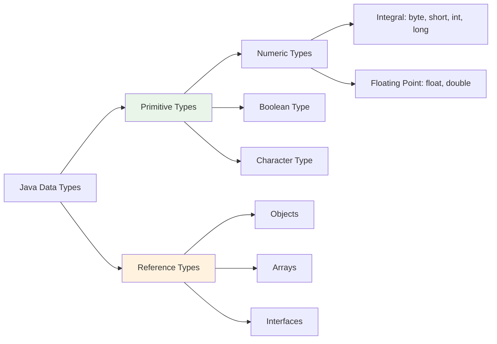

**Key Learning Concepts**:
- **Memory Management**: Understanding stack vs. heap allocation for primitives and objects
- **Type Promotion**: Implicit and explicit type conversions and their performance implications
- **Wrapper Classes**: Boxing/unboxing mechanisms and when to use primitive vs. wrapper types
- **Immutability**: Understanding String immutability and its impact on memory and performance

#### 🎛️ Control Flow & Decision Making

**Control Structure Hierarchy**:
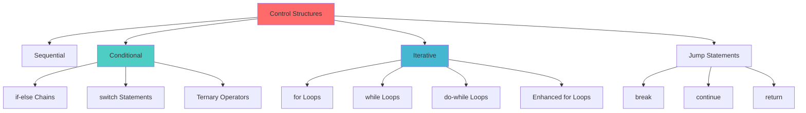

**Advanced Control Flow Concepts**:
- **Loop Optimization**: Understanding when to use different loop types for performance
- **Short-Circuit Evaluation**: Leveraging boolean operator behavior for efficient conditionals
- **Modern Switch Expressions**: Java 14+ switch expressions vs traditional switch statements
- **Control Flow Security**: Preventing common vulnerabilities through proper input validation

#### 📋 Collections Framework Mastery

**Collection Hierarchy Understanding**:
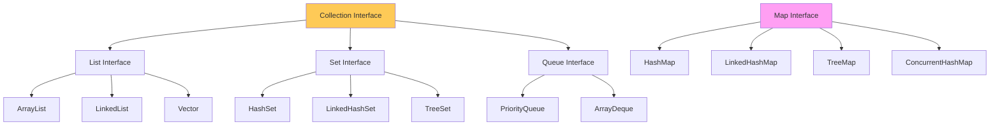

**Collection Selection Criteria**:
- **ArrayList vs LinkedList**: When to use array-based vs node-based implementations
- **HashSet vs TreeSet**: Trade-offs between O(1) operations and ordered iteration
- **HashMap vs ConcurrentHashMap**: Thread safety implications and performance characteristics
- **Custom Implementations**: When and how to create specialized collection types

### 🛡️ Exception Handling Architecture

**Exception Hierarchy Deep Dive**:
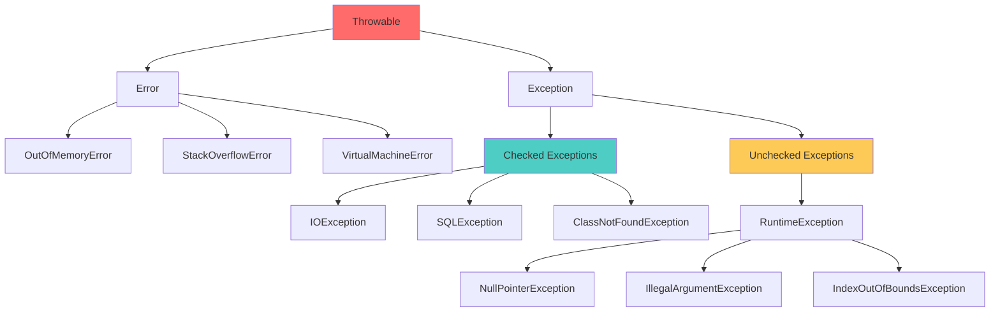

**Exception Handling Best Practices**:
- **Fail-Fast Principle**: Detecting problems early through proper validation
- **Exception Translation**: Converting low-level exceptions to domain-specific exceptions
- **Resource Management**: Using try-with-resources for automatic resource cleanup
- **Logging Strategies**: Balancing information capture with performance impact

## 🏛️ Object-Oriented Programming Mastery

### 🔄 Inheritance & Polymorphism Concepts

Object-oriented programming forms the architectural foundation of Java applications, enabling code reuse, maintainability, and extensibility.

#### 🌳 Inheritance Hierarchies & Design

**Inheritance Strategy Patterns**:
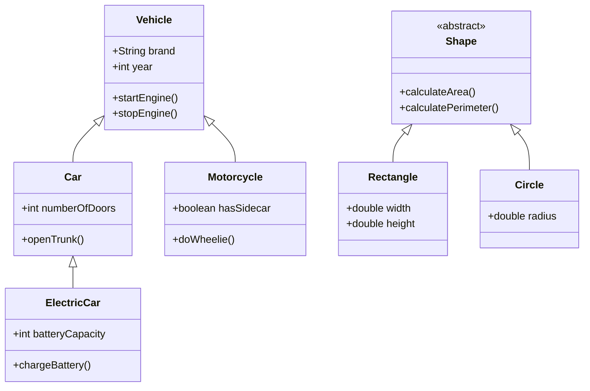

**Key Inheritance Concepts**:
- **IS-A Relationships**: Designing proper inheritance hierarchies that reflect real-world relationships
- **Method Overriding**: Strategic overriding for specialized behavior while maintaining contracts
- **Super Keyword Usage**: Properly accessing parent class functionality and constructors
- **Abstract Classes**: When to use abstract classes vs interfaces for defining contracts

#### 🎭 Polymorphism Implementation Strategies

**Polymorphism Types & Applications**:
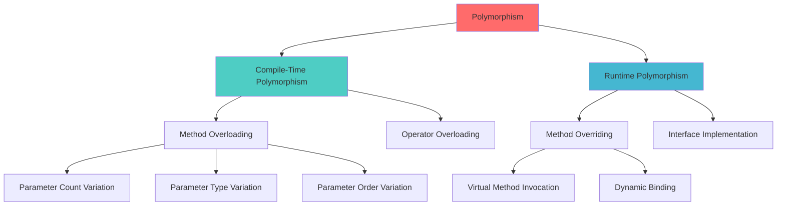

**Polymorphic Design Benefits**:
- **Code Flexibility**: Writing code that works with multiple types through common interfaces
- **Extensibility**: Adding new types without modifying existing code
- **Maintainability**: Reducing code duplication through shared behavior
- **Testing**: Easier unit testing through interface-based design

### 🎯 Interface Design & Abstraction

**Interface Evolution & Modern Features**:
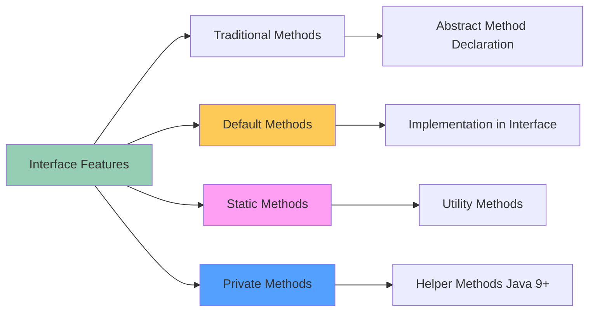

**Interface Design Principles**:
- **Interface Segregation**: Creating focused, single-purpose interfaces
- **Dependency Inversion**: Depending on abstractions rather than concrete implementations
- **Contract Definition**: Clearly defining behavior expectations and constraints
- **Multiple Inheritance**: Achieving multiple inheritance of behavior through interfaces

### 🏗️ Constructor Patterns & Object Creation

**Constructor Design Strategies**:
```mermaid
graph TD
    A[Constructor Patterns] --> B[Default Constructor]
    A --> C[Parameterized Constructor]
    A --> D[Copy Constructor]
    A --> E[Constructor Chaining]

    E --> F[this() Calls]
    E --> G[super() Calls]

    H[Object Creation Patterns] --> I[Direct Instantiation]
    H --> J[Factory Methods]
    H --> K[Builder Pattern]
    H --> L[Dependency Injection]

    style A fill:#e8f5e8
    style H fill:#fff3e0
```

**Constructor Best Practices**:
- **Validation Logic**: Ensuring object invariants are established during construction
- **Resource Initialization**: Properly setting up resources and dependencies
- **Constructor Chaining**: Avoiding code duplication through strategic constructor calls
- **Immutable Object Creation**: Using constructors to create immutable objects

## 🎨 Design Pattern Implementation

### 🏭 Creational Patterns

Design patterns provide tested solutions to recurring design problems, enabling developers to write more maintainable and flexible code.

#### 🏗️ Builder Pattern Deep Dive

**Builder Pattern Architecture**:
```mermaid
graph TD
    A[Client] --> B[Director]
    B --> C[Builder Interface]
    C --> D[Concrete Builder A]
    C --> E[Concrete Builder B]

    D --> F[Product A]
    E --> G[Product B]

    H[Fluent Builder] --> I[Method Chaining]
    I --> J[build()]
    J --> K[Final Product]

    style C fill:#4ecdc4
    style H fill:#feca57
```

**Builder Pattern Benefits**:
- **Complex Object Construction**: Managing objects with numerous optional parameters
- **Immutable Object Creation**: Building immutable objects step-by-step
- **Fluent Interface**: Providing readable and chainable construction APIs
- **Parameter Validation**: Validating object state before construction completion

#### 🏭 Factory Patterns Comparison

**Factory Pattern Hierarchy**:
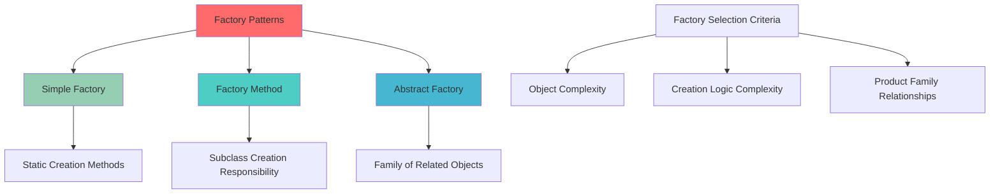

**Factory Pattern Applications**:
- **Object Creation Encapsulation**: Hiding complex instantiation logic
- **Type-Safe Object Creation**: Preventing invalid object combinations
- **Plugin Architecture**: Supporting dynamic object creation based on configuration
- **Testing Support**: Facilitating mock object creation in unit tests

#### 🔒 Singleton Pattern Considerations

**Singleton Implementation Strategies**:
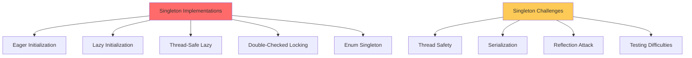

**Singleton Design Considerations**:
- **Thread Safety**: Ensuring single instance creation in multithreaded environments
- **Performance Impact**: Balancing thread safety with performance requirements
- **Testing Challenges**: Managing global state in unit testing scenarios
- **Alternative Patterns**: When dependency injection might be preferable

### 🔧 Structural Patterns

#### 🎭 Adapter Pattern Applications

**Adapter Pattern Integration**:
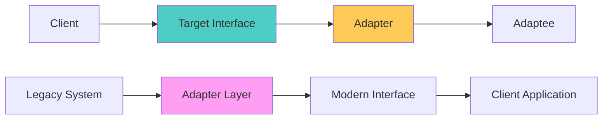

**Adapter Pattern Use Cases**:
- **Legacy Integration**: Connecting modern code with legacy systems
- **Third-Party Library Integration**: Wrapping external APIs with consistent interfaces
- **Data Format Conversion**: Converting between different data representations
- **Interface Standardization**: Creating uniform interfaces across different implementations

#### 🎨 Decorator Pattern Flexibility

**Decorator Pattern Structure**:
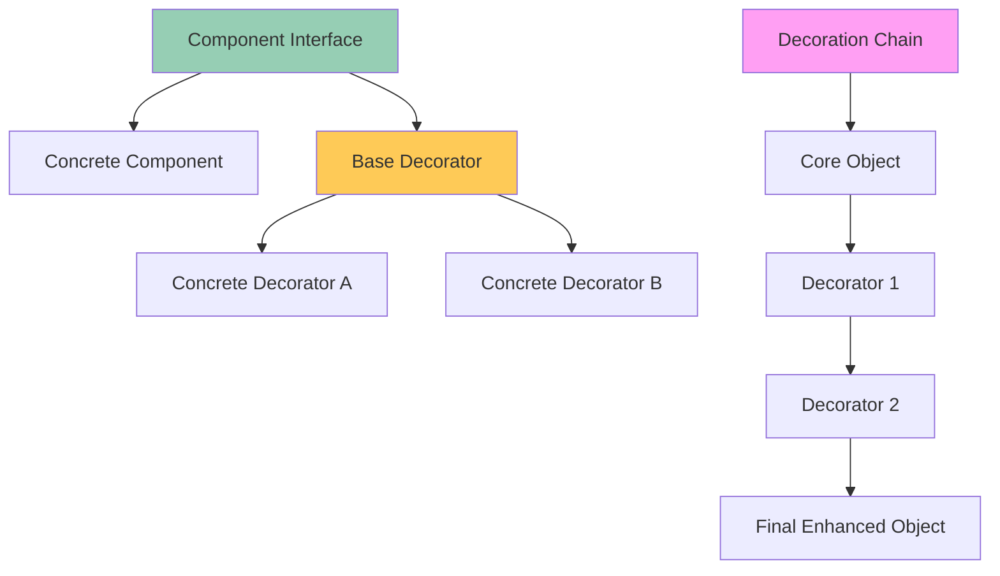

**Decorator Pattern Benefits**:
- **Runtime Behavior Extension**: Adding functionality without modifying original classes
- **Flexible Composition**: Combining behaviors in different ways
- **Single Responsibility**: Each decorator focuses on one enhancement aspect
- **Open/Closed Principle**: Open for extension, closed for modification

## ⚡ Advanced Java Concepts

### 🧵 Concurrency & Threading Mastery

Modern Java applications require sophisticated understanding of concurrent programming to achieve optimal performance and responsiveness.

#### 🔄 Thread Lifecycle Management

**Thread State Transitions**:
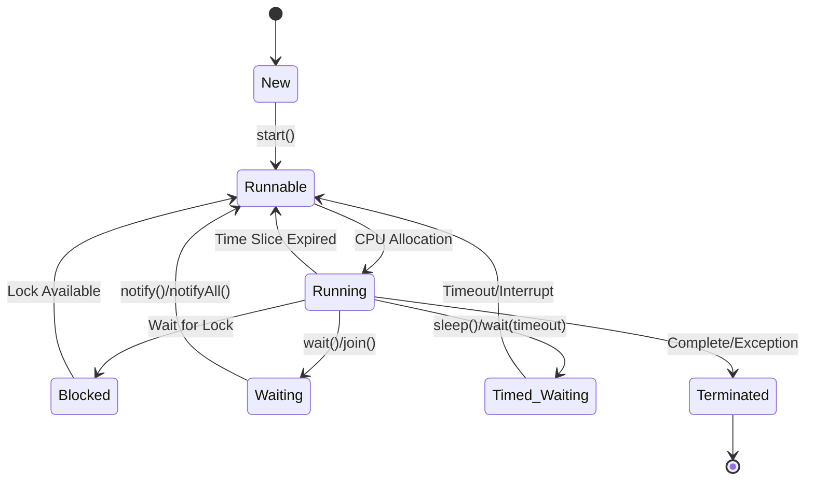

**Threading Best Practices**:
- **Thread Pool Management**: Using ExecutorService for efficient thread reuse
- **Synchronization Strategies**: Choosing between synchronized blocks, volatile, and concurrent collections
- **Deadlock Prevention**: Understanding and avoiding circular wait conditions
- **Performance Tuning**: Balancing thread count with system resources

#### 🔐 Thread Safety Mechanisms

**Concurrent Programming Tools**:
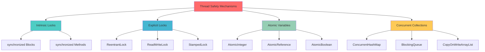

**Advanced Concurrency Concepts**:
- **Memory Consistency**: Understanding happens-before relationships and memory barriers
- **Lock-Free Programming**: Using atomic operations and compare-and-swap techniques
- **Producer-Consumer Patterns**: Implementing efficient work queues with blocking collections
- **Fork-Join Framework**: Leveraging parallel processing for divide-and-conquer algorithms

### 🔍 Generics & Type Safety

**Generic Programming Benefits**:
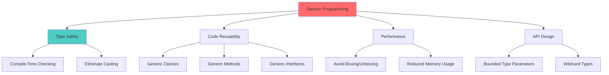

**Generic Design Patterns**:
- **Type Erasure Understanding**: How generics work at runtime and their limitations
- **Bounded Wildcards**: Using PECS (Producer Extends, Consumer Super) principle
- **Generic Method Design**: Creating flexible, reusable utility methods
- **Type Token Pattern**: Working around type erasure limitations

### 🎭 Reflection & Annotations

**Reflection Capabilities & Use Cases**:
```mermaid
graph TD
    A[Reflection API] --> B[Class Information]
    A --> C[Method Invocation]
    A --> D[Field Access]
    A --> E[Constructor Usage]

    B --> F[getClass()]
    B --> G[Class.forName()]
    B --> H[getSuperclass()]

    C --> I[getDeclaredMethods()]
    C --> J[invoke()]

    D --> K[getDeclaredFields()]
    D --> L[get()/set()]

    F[Annotation Processing] --> G[Runtime Annotations]
    F --> H[Compile-Time Processing]
    F --> I[Custom Annotations]

    style A fill:#96ceb4
    style F fill:#feca57
```

**Reflection Applications**:
- **Framework Development**: Building frameworks that work with unknown types
- **Serialization**: Creating generic serialization/deserialization mechanisms
- **Testing Utilities**: Accessing private members for comprehensive testing
- **Configuration Processing**: Loading and processing configuration-driven behavior

## 🚀 Modern Framework Integration

### 🌱 Spring Framework Ecosystem

Modern Java development heavily relies on framework integration, with Spring being the dominant enterprise framework.

#### 💉 Dependency Injection Concepts

**Dependency Injection Strategies**:
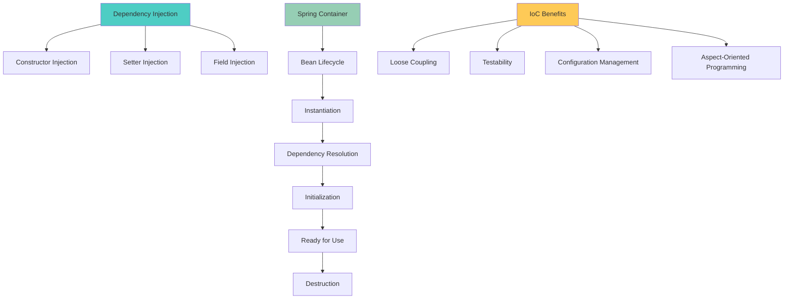

**Spring Framework Concepts**:
- **Inversion of Control**: Understanding how control flow is inverted in Spring applications
- **Bean Scopes**: Managing object lifecycles with singleton, prototype, and web scopes
- **Configuration Approaches**: Comparing XML, annotation, and Java-based configuration
- **Aspect-Oriented Programming**: Implementing cross-cutting concerns with AOP

#### 🔄 Reactive Programming Paradigms

**Reactive Streams Architecture**:
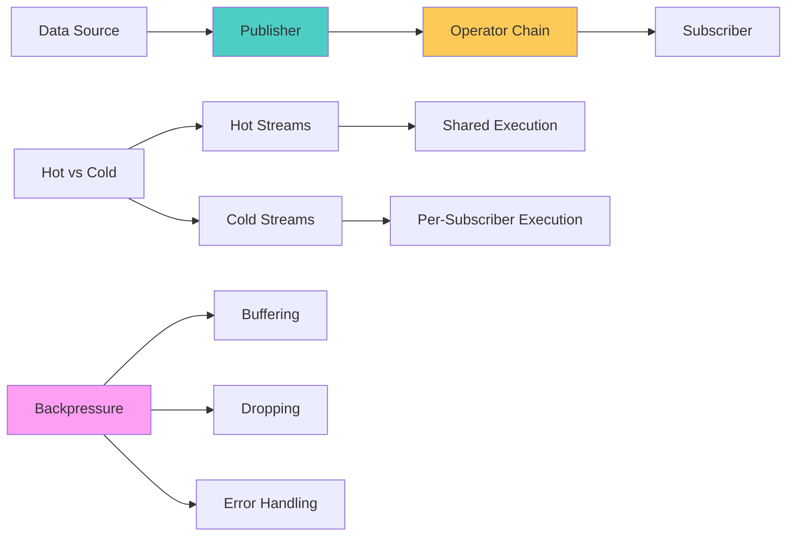

**Reactive Programming Benefits**:
- **Asynchronous Processing**: Handling long-running operations without blocking
- **Backpressure Management**: Dealing with fast producers and slow consumers
- **Composition**: Chaining operations in declarative, functional style
- **Error Handling**: Robust error propagation and recovery mechanisms

### 🧪 Testing Excellence

**Testing Strategy Pyramid**:
```mermaid
graph TD
    A[Testing Pyramid] --> B[Unit Tests]
    A --> C[Integration Tests]
    A --> D[End-to-End Tests]

    B --> E[Fast Execution]
    B --> F[Isolated Testing]
    B --> G[High Coverage]

    C --> H[Component Integration]
    C --> I[Database Testing]
    C --> J[API Testing]

    D --> K[User Journey Testing]
    D --> L[System Testing]

    M[Testing Tools] --> N[JUnit 5]
    M --> O[Mockito]
    M --> P[TestContainers]
    M --> Q[AssertJ]

    style B fill:#96ceb4
    style C fill:#feca57
    style D fill:#ff9ff3
```

**Advanced Testing Concepts**:
- **Test-Driven Development**: Writing tests first to drive design decisions
- **Mocking Strategies**: Using mocks, stubs, and fakes appropriately
- **Parameterized Testing**: Running tests with multiple input combinations
- **Test Data Management**: Creating maintainable test fixtures and data builders

## 🎯 Specialized Project Implementations

### 🔌 gRPC & Remote Communication

**gRPC Architecture Benefits**:
```mermaid
graph TD
    A[gRPC Framework] --> B[Protocol Buffers]
    A --> C[HTTP/2 Transport]
    A --> D[Multiple Language Support]
    A --> E[Streaming Support]

    B --> F[Schema Definition]
    B --> G[Code Generation]
    B --> H[Backward Compatibility]

    C --> I[Multiplexing]
    C --> J[Server Push]
    C --> K[Header Compression]

    E --> L[Unary RPC]
    E --> M[Server Streaming]
    E --> N[Client Streaming]
    E --> O[Bidirectional Streaming]

    style A fill:#4ecdc4
    style B fill:#96ceb4
    style E fill:#feca57
```

**gRPC Implementation Concepts**:
- **Service Definition**: Designing efficient service contracts with Protocol Buffers
- **Streaming Patterns**: Implementing various streaming patterns for different use cases
- **Error Handling**: Robust error propagation across network boundaries
- **Performance Optimization**: Leveraging HTTP/2 features for optimal performance

### 🌐 Web Scraping & Data Extraction

**Web Scraping Architecture**:
```mermaid
graph TD
    A[Web Scraping Pipeline] --> B[URL Management]
    A --> C[HTTP Client]
    A --> D[Content Parsing]
    A --> E[Data Processing]
    A --> F[Storage Layer]

    B --> G[URL Queue]
    B --> H[Rate Limiting]
    B --> I[Duplicate Detection]

    C --> J[Connection Pooling]
    C --> K[User Agent Rotation]
    C --> L[Proxy Management]

    D --> M[HTML Parsing]
    D --> N[CSS Selectors]
    D --> O[XPath Expressions]

    style A fill:#ff6b6b
    style D fill:#4ecdc4
    style F fill:#96ceb4
```

**Web Scraping Best Practices**:
- **Ethical Scraping**: Respecting robots.txt and implementing appropriate delays
- **Robustness**: Handling various HTML structures and network failures
- **Performance**: Implementing concurrent scraping with proper resource management
- **Data Quality**: Validating and cleaning extracted data

### 🚀 Microservices Architecture

**Microservices Design Patterns**:
```mermaid
graph TD
    A[Microservices Patterns] --> B[Service Discovery]
    A --> C[API Gateway]
    A --> D[Circuit Breaker]
    A --> E[Event Sourcing]
    A --> F[CQRS]

    B --> G[Service Registry]
    B --> H[Health Checks]

    C --> I[Routing]
    C --> J[Authentication]
    C --> K[Rate Limiting]

    D --> L[Failure Detection]
    D --> M[Fallback Mechanisms]
    D --> N[Recovery Strategies]

    style A fill:#ff6b6b
    style B fill:#4ecdc4
    style C fill:#45b7d1
    style D fill:#feca57
```

**Microservices Implementation Concepts**:
- **Service Decomposition**: Breaking monoliths into cohesive, loosely coupled services
- **Communication Patterns**: Choosing between synchronous and asynchronous communication
- **Data Management**: Handling distributed data consistency and transactions
- **Observability**: Implementing comprehensive monitoring and distributed tracing

### 🌐 Netty Framework & High-Performance Networking

**Netty Architecture Components**:
```mermaid
graph TD
    A[Netty Framework] --> B[Event Loop Groups]
    A --> C[Channels]
    A --> D[Pipeline]
    A --> E[Handlers]
    A --> F[Codecs]

    B --> G[Boss Group]
    B --> H[Worker Group]

    C --> I[NIO Channels]
    C --> J[Socket Channels]
    C --> K[Server Channels]

    D --> L[Inbound Handlers]
    D --> M[Outbound Handlers]

    F --> N[Message Encoders]
    F --> O[Message Decoders]

    style A fill:#4ecdc4
    style B fill:#96ceb4
    style D fill:#feca57
```

**Netty Performance Benefits**:
- **Asynchronous I/O**: Non-blocking network operations for high concurrency
- **Memory Management**: Efficient buffer management with pooling and zero-copy
- **Protocol Support**: Built-in support for various protocols and custom protocol development
- **Scalability**: Handling thousands of concurrent connections efficiently

## 📊 Performance Optimization & Best Practices

### 🚀 Memory Management Strategies

**JVM Memory Model Understanding**:
```mermaid
graph TD
    A[JVM Memory Areas] --> B[Heap Memory]
    A --> C[Non-Heap Memory]
    A --> D[Direct Memory]
    A --> L[Garbage Collection]

    B --> E[Young Generation]
    B --> F[Old Generation]

    E --> G[Eden Space]
    E --> H[Survivor Spaces]

    C --> I[Method Area]
    C --> J[Code Cache]
    C --> K[Compressed Class Space]

    L --> M[Generational GC]
    L --> N[Concurrent GC]
    L --> O[Low-Latency GC]

    %% Connect GC types to memory areas they manage
    M --> E
    M --> F
    N --> B
    O --> B

    style A fill:#ff6b6b
    style B fill:#4ecdc4
    style L fill:#feca57
```

**Memory Optimization Techniques**:
- **Object Lifecycle Management**: Understanding when and how objects are created and destroyed
- **Memory Leak Prevention**: Identifying and preventing common memory leak patterns
- **GC Tuning**: Selecting and tuning garbage collectors for different application needs
- **Off-Heap Storage**: Leveraging direct memory for large datasets and caching

### ⚡ Performance Profiling & Monitoring

**Performance Monitoring Stack**:
```mermaid
graph TD
    A[Performance Monitoring] --> B[JVM Metrics]
    A --> C[Application Metrics]
    A --> D[External Dependencies]
    A --> E[User Experience]

    B --> F[CPU Usage]
    B --> G[Memory Utilization]
    B --> H[GC Performance]
    B --> I[Thread Activity]

    C --> J[Response Times]
    C --> K[Throughput]
    C --> L[Error Rates]
    C --> M[Custom Business Metrics]

    N[Profiling Tools] --> O[JProfiler]
    N --> P[VisualVM]
    N --> Q[Flight Recorder]
    N --> R[APM Solutions]

    style A fill:#96ceb4
    style N fill:#feca57
```

**Performance Optimization Strategies**:
- **Bottleneck Identification**: Using profiling tools to identify performance hotspots
- **Caching Strategies**: Implementing effective caching at multiple application layers
- **Database Optimization**: Optimizing queries, connections, and data access patterns
- **Concurrent Programming**: Leveraging parallelism for CPU-intensive tasks

## 🎯 Learning Path & Career Development

### 📚 Progressive Skill Development

**Java Mastery Roadmap**:
```mermaid
graph TD
    A[Java Learning Journey] --> B[Foundation Phase]
    B --> C[Object-Oriented Mastery]
    C --> D[Design Pattern Proficiency]
    D --> E[Framework Integration]
    E --> F[Advanced Specialization]
    F --> G[Architecture Leadership]

    B --> B1[Syntax & Semantics]
    B --> B2[Basic OOP Concepts]
    B --> B3[Collections & Exceptions]

    C --> C1[Inheritance & Polymorphism]
    C --> C2[Interface Design]
    C --> C3[Advanced OOP Patterns]

    D --> D1[Creational Patterns]
    D --> D2[Structural Patterns]
    D --> D3[Behavioral Patterns]

    E --> E1[Spring Framework]
    E --> E2[Testing Frameworks]
    E --> E3[Build Tools]

    F --> F1[Reactive Programming]
    F --> F2[Microservices]
    F --> F3[Performance Tuning]

    G --> G1[System Design]
    G --> G2[Technical Leadership]
    G --> G3[Architecture Decisions]

    style A fill:#ff6b6b
    style B fill:#4ecdc4
    style C fill:#45b7d1
    style D fill:#96ceb4
    style E fill:#feca57
    style F fill:#ff9ff3
    style G fill:#54a0ff
```

### 🎖️ Skill Assessment & Milestones

**Competency Framework**:
```mermaid
graph LR
    A[Beginner] --> B[Intermediate]
    B --> C[Advanced]
    C --> D[Expert]
    D --> E[Thought Leader]

    A1[Basic Syntax] --> B1[OOP Mastery]
    B1 --> C1[Design Patterns]
    C1 --> D1[Architecture Design]
    D1 --> E1[Innovation]

    A2[Simple Programs] --> B2[Complex Applications]
    B2 --> C2[Framework Integration]
    C2 --> D2[System Design]
    D2 --> E2[Technical Leadership]

    style A fill:#feca57
    style B fill:#4ecdc4
    style C fill:#45b7d1
    style D fill:#96ceb4
    style E fill:#ff6b6b
```

**Professional Development Milestones**:
- **Junior Developer**: Solid foundation in Java fundamentals and basic OOP concepts
- **Mid-Level Developer**: Proficiency in frameworks, design patterns, and testing
- **Senior Developer**: Architecture design skills, performance optimization expertise
- **Principal Engineer**: System design leadership, cross-team technical guidance
- **Technical Architect**: Strategic technology decisions, organization-wide impact

## 🎉 Conclusion & Continuous Learning

### 📊 Project Impact & Learning Outcomes

**Technical Achievements**:
- **Comprehensive Coverage**: 50+ Java concepts explored through practical implementations
- **Pattern Recognition**: Deep understanding of when and how to apply design patterns
- **Framework Proficiency**: Hands-on experience with modern Java frameworks and tools
- **Best Practices**: Industry-standard approaches to testing, performance, and architecture
- **Real-World Application**: Practical projects demonstrating concept application

**Skill Development Metrics**:
- **Foundation Mastery**: Complete understanding of Java language fundamentals
- **OOP Expertise**: Advanced object-oriented design and implementation capabilities
- **Pattern Application**: Ability to recognize and implement appropriate design patterns
- **Framework Integration**: Proficiency in Spring, reactive programming, and testing frameworks
- **Architecture Thinking**: Understanding of system design and scalability considerations

### 🏗️ Modern Java Excellence

**Contemporary Java Development**:

This learning journey demonstrates that modern Java development requires understanding not just language syntax, but architectural principles that enable:

**1. Maintainable Code Architecture**
- **SOLID Principles**: Writing code that's easy to understand, modify, and extend
- **Design Pattern Application**: Using proven solutions for common software design problems
- **Clean Code Practices**: Creating readable, self-documenting code that teams can collaborate on
- **Testing Strategy**: Comprehensive testing approaches that ensure code reliability

**2. Performance-Conscious Development**
- **Memory Management**: Understanding JVM internals and garbage collection optimization
- **Concurrency Mastery**: Writing thread-safe, high-performance concurrent code
- **Framework Efficiency**: Leveraging Spring and other frameworks for optimal performance
- **Profiling Skills**: Using tools and techniques to identify and resolve performance bottlenecks

**3. Enterprise Integration Capabilities**
- **Microservices Architecture**: Building scalable, distributed systems with Java
- **Communication Protocols**: Implementing efficient inter-service communication with gRPC
- **Data Processing**: Creating robust data processing pipelines and ETL systems
- **Cloud-Native Development**: Building applications suitable for modern cloud environments

### 🚀 Future-Oriented Learning

**Emerging Java Technologies**:

The Java ecosystem continues evolving, with new features and frameworks enhancing developer productivity:

**Language Evolution**:
- **Project Loom**: Virtual threads for massive concurrency improvements
- **Project Panama**: Enhanced foreign function and memory APIs
- **Pattern Matching**: Advanced pattern matching and switch expressions
- **Value Types**: Project Valhalla's value types for better memory efficiency

**Framework Innovation**:
- **Reactive Streams**: Enhanced reactive programming capabilities
- **Native Compilation**: GraalVM native image for faster startup and lower memory usage
- **Serverless Java**: Optimizations for serverless and cloud-native deployments
- **AI/ML Integration**: Java's role in machine learning and artificial intelligence

**Development Practices**:
- **DevOps Integration**: Infrastructure as code and continuous deployment
- **Observability**: Advanced monitoring, tracing, and debugging techniques
- **Security**: Modern security practices and vulnerability management
- **Performance Engineering**: Advanced performance analysis and optimization

### 💡 Key Success Factors

**Effective Java Learning Strategies**:

**1. Hands-On Practice**
- **Project-Based Learning**: Building real applications to reinforce concepts
- **Code Review**: Learning from experienced developers through code reviews
- **Open Source Contribution**: Contributing to open source projects for real-world experience
- **Continuous Experimentation**: Trying new techniques and frameworks regularly

**2. Community Engagement**
- **Professional Networks**: Engaging with Java user groups and conferences
- **Online Learning**: Participating in coding challenges and online courses
- **Mentorship**: Both seeking mentorship and mentoring others
- **Knowledge Sharing**: Writing articles, giving talks, and sharing experiences

**3. Strategic Skill Development**
- **Technology Radar**: Staying informed about emerging trends and technologies
- **Depth vs Breadth**: Balancing deep expertise with broad technology awareness
- **Business Alignment**: Understanding how technical decisions impact business outcomes
- **Leadership Growth**: Developing technical leadership and communication skills

This comprehensive Java learning journey provides a solid foundation for career growth in software development, from individual contributor roles to technical leadership positions. The combination of fundamental knowledge, practical experience, and modern framework proficiency creates a strong platform for continued learning and professional development in the ever-evolving Java ecosystem.

---

## 🔗 Project Resources

| Resource | Link |
|----------|------|
| 📂 **Source Code** | [GitHub - JavaHelloWorld](https://github.com/yennanliu/JavaHelloWorld) |
| 📚 **Core Concepts** | [Java Fundamentals](https://github.com/yennanliu/JavaHelloWorld/tree/main/src/main/java/Basics) |
| 🎨 **Design Patterns** | [Pattern Implementations](https://github.com/yennanliu/JavaHelloWorld/tree/main/src/main/java/DesignPattern) |
| 🚀 **Advanced Projects** | [Specialized Implementations](https://github.com/yennanliu/JavaHelloWorld/tree/main/dev_projects) |