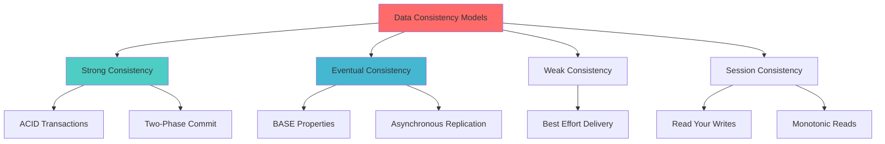
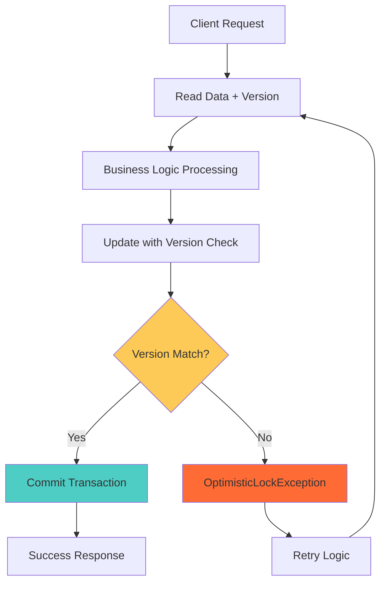
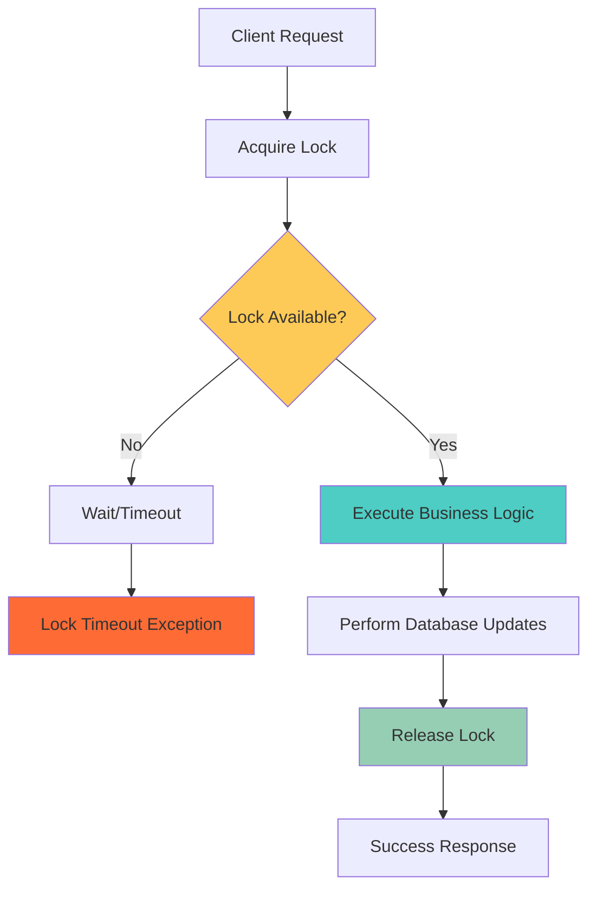
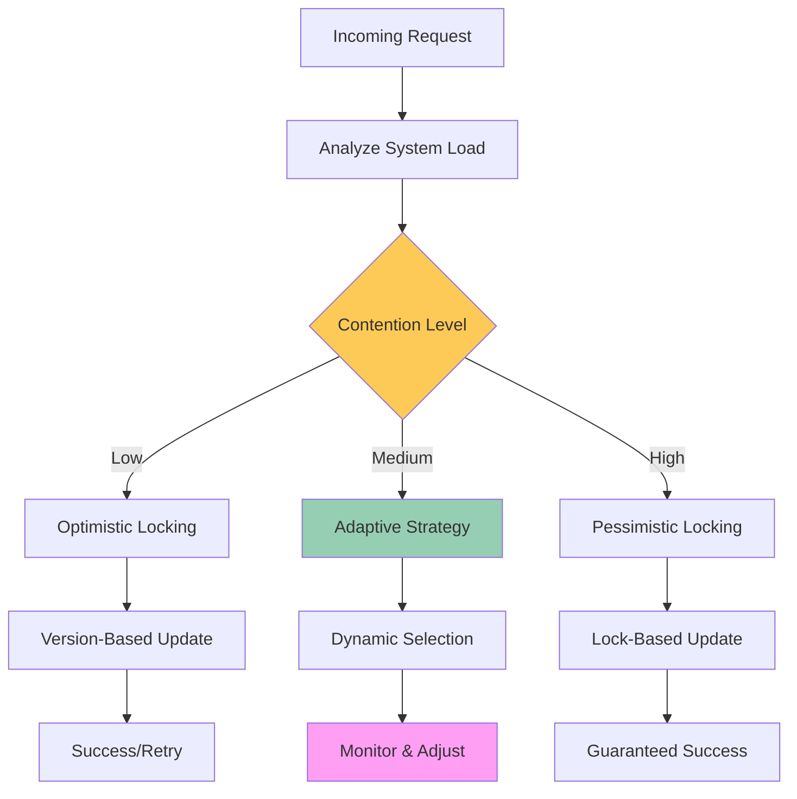
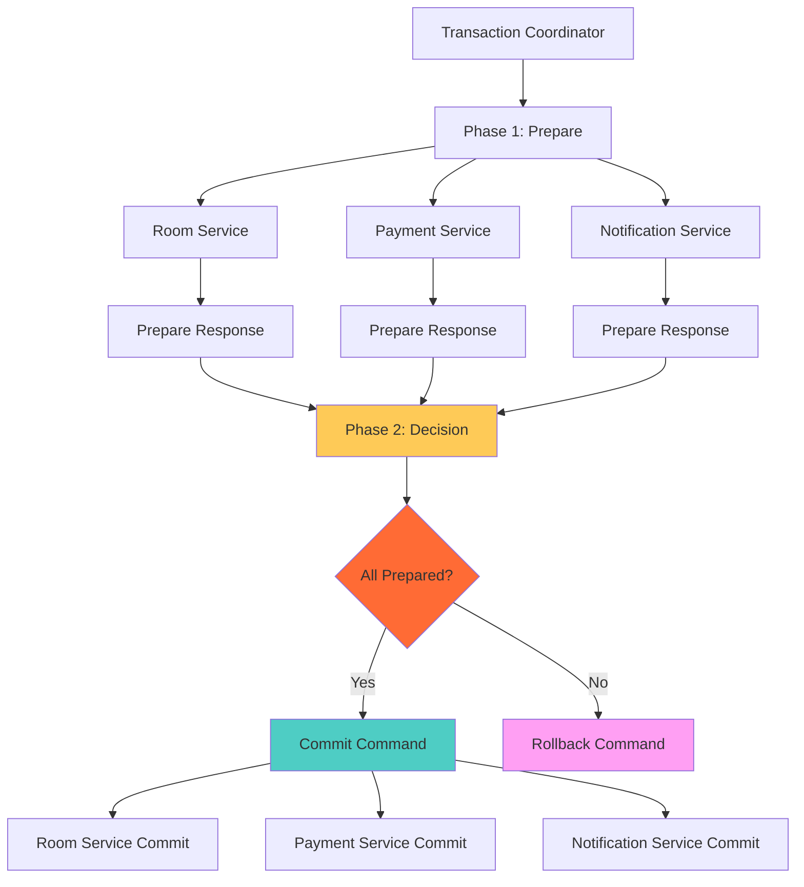
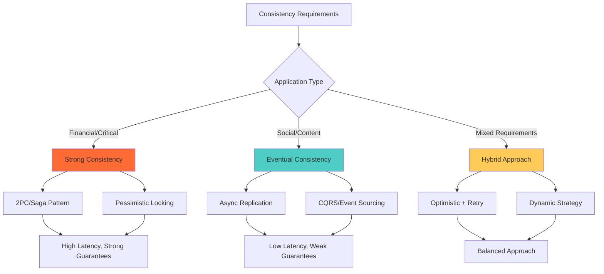

## 🎯 Introduction

Data consistency is one of the most critical challenges in modern Java enterprise applications. As systems scale and become distributed, maintaining data integrity while ensuring performance becomes increasingly complex. This comprehensive guide explores practical data consistency patterns implemented in real-world Java applications, complete with case studies, implementation details, and detailed trade-off analysis.

## 📊 The Data Consistency Challenge

### 🔍 Understanding Data Consistency Levels

Data consistency refers to the guarantee that all nodes in a distributed system see the same data at the same time. In Java enterprise applications, we typically encounter several consistency models:



### 🚨 Common Consistency Problems

**Race Conditions in Concurrent Operations:**
- Multiple users booking the same hotel room
- Inventory depletion during high-traffic sales
- Financial transaction conflicts
- Cache invalidation inconsistencies

**Distributed System Challenges:**
- Network partitions between microservices
- Service failures during transaction processing
- Clock synchronization issues
- Message delivery guarantees

## 🏛️ Core Data Consistency Patterns

### 🔒 1. Optimistic Locking Pattern

Optimistic locking assumes that conflicts are rare and checks for conflicts only when committing changes. This pattern is ideal for scenarios with low contention and high read-to-write ratios.

#### 📋 Implementation Architecture



#### 🛠️ Java Implementation

**Entity with Version Control:**
```java
@Entity
@Table(name = "hotel_rooms")
public class Room {
    @Id
    @GeneratedValue(strategy = GenerationType.IDENTITY)
    private Long id;

    @Version
    private Long version;

    @Column(nullable = false)
    private String roomNumber;

    @Column(nullable = false)
    private Boolean isAvailable;

    @Column(nullable = false)
    private BigDecimal pricePerNight;

    @OneToMany(mappedBy = "room", cascade = CascadeType.ALL)
    private List<Booking> bookings = new ArrayList<>();

    // Constructors, getters, setters
    public void markAsBooked() {
        this.isAvailable = false;
    }

    public void markAsAvailable() {
        this.isAvailable = true;
    }
}

@Entity
@Table(name = "bookings")
public class Booking {
    @Id
    @GeneratedValue(strategy = GenerationType.IDENTITY)
    private Long id;

    @Version
    private Long version;

    @ManyToOne(fetch = FetchType.LAZY)
    @JoinColumn(name = "room_id", nullable = false)
    private Room room;

    @Column(nullable = false)
    private String guestName;

    @Column(nullable = false)
    private LocalDateTime checkInDate;

    @Column(nullable = false)
    private LocalDateTime checkOutDate;

    @Enumerated(EnumType.STRING)
    private BookingStatus status;

    // Constructors, getters, setters
}
```

**Service Layer with Optimistic Locking:**
```java
@Service
@Transactional
public class HotelBookingService {

    private final RoomRepository roomRepository;
    private final BookingRepository bookingRepository;
    private final BookingMetrics bookingMetrics;

    public BookingResponse bookRoom(BookingRequest request) {
        try {
            // Read room with current version
            Room room = roomRepository.findById(request.getRoomId())
                .orElseThrow(() -> new RoomNotFoundException(request.getRoomId()));

            // Business logic validation
            validateBookingRequest(room, request);

            // Create booking and update room
            Booking booking = createBooking(room, request);
            room.markAsBooked();

            // This will trigger version check
            roomRepository.save(room);
            bookingRepository.save(booking);

            bookingMetrics.incrementSuccessfulBookings();

            return BookingResponse.success(booking);

        } catch (OptimisticLockException e) {
            bookingMetrics.incrementOptimisticLockFailures();
            throw new ConcurrentBookingException(
                "Room was modified by another user. Please try again."
            );
        }
    }

    @Retryable(
        value = {ConcurrentBookingException.class},
        maxAttempts = 3,
        backoff = @Backoff(delay = 100, multiplier = 2)
    )
    public BookingResponse bookRoomWithRetry(BookingRequest request) {
        return bookRoom(request);
    }

    private void validateBookingRequest(Room room, BookingRequest request) {
        if (!room.getIsAvailable()) {
            throw new RoomNotAvailableException(room.getId());
        }

        if (hasDateConflict(room, request.getCheckInDate(), request.getCheckOutDate())) {
            throw new DateConflictException("Room is already booked for the requested dates");
        }
    }
}
```

**Global Exception Handler:**
```java
@RestControllerAdvice
public class GlobalExceptionHandler {

    @ExceptionHandler(ConcurrentBookingException.class)
    public ResponseEntity<ErrorResponse> handleConcurrentBooking(
            ConcurrentBookingException e) {
        return ResponseEntity.status(HttpStatus.CONFLICT)
            .body(new ErrorResponse(
                "CONCURRENT_MODIFICATION",
                e.getMessage(),
                "Please refresh and try again"
            ));
    }

    @ExceptionHandler(OptimisticLockException.class)
    public ResponseEntity<ErrorResponse> handleOptimisticLock(
            OptimisticLockException e) {
        return ResponseEntity.status(HttpStatus.CONFLICT)
            .body(new ErrorResponse(
                "OPTIMISTIC_LOCK_FAILURE",
                "Data was modified by another process",
                "Please refresh and retry your operation"
            ));
    }

    public static class ErrorResponse {
        private String errorCode;
        private String message;
        private String suggestion;

        // Constructors, getters, setters
    }
}
```

#### ✅ Optimistic Locking Pros & Cons

**Advantages:**
- **High Performance**: No locks held during business logic processing
- **Scalability**: Supports high concurrent read operations
- **Deadlock Prevention**: No lock acquisition ordering issues
- **Resource Efficiency**: Minimal database connection usage

**Disadvantages:**
- **Retry Complexity**: Requires sophisticated retry mechanisms
- **High Contention Issues**: Performance degrades with frequent conflicts
- **User Experience**: May require multiple submission attempts
- **Lost Updates**: Risk of losing work in high-contention scenarios

**Best Use Cases:**
- Read-heavy applications with occasional updates
- Content management systems
- User profile management
- Configuration data updates

### 🔐 2. Pessimistic Locking Pattern

Pessimistic locking assumes conflicts are likely and prevents them by acquiring locks before performing operations.

#### 📋 Pessimistic Locking Architecture



#### 🛠️ Java Implementation

**Repository with Pessimistic Locking:**
```java
@Repository
public interface RoomRepository extends JpaRepository<Room, Long> {

    @Lock(LockModeType.PESSIMISTIC_WRITE)
    @Query("SELECT r FROM Room r WHERE r.id = :id")
    Optional<Room> findByIdWithPessimisticLock(@Param("id") Long id);

    @Lock(LockModeType.PESSIMISTIC_READ)
    @Query("SELECT r FROM Room r WHERE r.isAvailable = true")
    List<Room> findAvailableRoomsWithReadLock();

    @Modifying
    @Query("UPDATE Room r SET r.isAvailable = :available WHERE r.id = :id")
    int updateRoomAvailability(@Param("id") Long id, @Param("available") boolean available);
}
```

**Service with Pessimistic Locking Strategy:**
```java
@Service
@Transactional
public class PessimisticBookingService {

    private final RoomRepository roomRepository;
    private final BookingRepository bookingRepository;
    private final BookingMetrics bookingMetrics;

    @Transactional(timeout = 30) // 30-second timeout
    public BookingResponse bookRoomWithPessimisticLock(BookingRequest request) {
        try {
            // Acquire pessimistic write lock
            Room room = roomRepository.findByIdWithPessimisticLock(request.getRoomId())
                .orElseThrow(() -> new RoomNotFoundException(request.getRoomId()));

            // Validation under lock
            validateRoomAvailability(room, request);

            // Create booking and update room atomically
            Booking booking = createBookingAndUpdateRoom(room, request);

            bookingMetrics.incrementSuccessfulBookings();
            return BookingResponse.success(booking);

        } catch (PessimisticLockingFailureException e) {
            bookingMetrics.incrementLockTimeoutFailures();
            throw new BookingLockException("Unable to acquire room lock. Please try again.");
        }
    }

    private Booking createBookingAndUpdateRoom(Room room, BookingRequest request) {
        // All operations under the same pessimistic lock
        Booking booking = Booking.builder()
            .room(room)
            .guestName(request.getGuestName())
            .checkInDate(request.getCheckInDate())
            .checkOutDate(request.getCheckOutDate())
            .status(BookingStatus.CONFIRMED)
            .build();

        room.markAsBooked();
        room.getBookings().add(booking);

        bookingRepository.save(booking);
        roomRepository.save(room);

        return booking;
    }
}
```

**Advanced Lock Management:**
```java
@Component
public class LockManager {

    private final ConcurrentHashMap<String, ReentrantLock> lockMap = new ConcurrentHashMap<>();
    private final MeterRegistry meterRegistry;

    public <T> T executeWithLock(String lockKey, Supplier<T> operation, Duration timeout) {
        ReentrantLock lock = lockMap.computeIfAbsent(lockKey, k -> new ReentrantLock());

        Timer.Sample sample = Timer.start(meterRegistry);
        try {
            if (!lock.tryLock(timeout.toMillis(), TimeUnit.MILLISECONDS)) {
                throw new LockAcquisitionException("Failed to acquire lock: " + lockKey);
            }

            return operation.get();

        } catch (InterruptedException e) {
            Thread.currentThread().interrupt();
            throw new LockInterruptedException("Lock operation interrupted", e);
        } finally {
            if (lock.isHeldByCurrentThread()) {
                lock.unlock();
            }
            sample.stop(Timer.builder("lock.execution.time")
                .tag("lock.key", lockKey)
                .register(meterRegistry));
        }
    }

    @Scheduled(fixedRate = 300000) // Clean up every 5 minutes
    public void cleanupUnusedLocks() {
        lockMap.entrySet().removeIf(entry ->
            !entry.getValue().isLocked() && !entry.getValue().hasQueuedThreads()
        );
    }
}
```

#### ✅ Pessimistic Locking Pros & Cons

**Advantages:**
- **Guaranteed Consistency**: Prevents all concurrent modification issues
- **Predictable Behavior**: No unexpected failures due to conflicts
- **Data Integrity**: Strong consistency guarantees
- **Simple Error Handling**: Clear lock acquisition success/failure

**Disadvantages:**
- **Performance Impact**: Reduced concurrency and throughput
- **Deadlock Risk**: Potential for deadlocks with multiple locks
- **Lock Contention**: Threads blocked waiting for locks
- **Timeout Management**: Complex timeout and retry logic needed

**Best Use Cases:**
- Financial transactions and payment processing
- Inventory management with limited quantities
- Critical resource allocation
- Sequential processing requirements

### 🔄 3. Hybrid Locking Strategy

A sophisticated approach that dynamically selects locking strategies based on system conditions and contention levels.

#### 📋 Hybrid Strategy Architecture



#### 🛠️ Java Implementation

**Contention Metrics and Strategy Selection:**
```java
@Component
public class BookingMetrics {

    private final MeterRegistry meterRegistry;
    private final ConcurrentHashMap<Long, AtomicLong> roomContentionMap = new ConcurrentHashMap<>();

    public void recordBookingAttempt(Long roomId) {
        roomContentionMap.computeIfAbsent(roomId, k -> new AtomicLong(0)).incrementAndGet();
        meterRegistry.counter("booking.attempts", "room", roomId.toString()).increment();
    }

    public void recordOptimisticLockFailure(Long roomId) {
        meterRegistry.counter("booking.optimistic.failures", "room", roomId.toString()).increment();
    }

    public LockingStrategy recommendStrategy(Long roomId) {
        long contentionLevel = roomContentionMap.getOrDefault(roomId, new AtomicLong(0)).get();

        if (contentionLevel > 10) {
            return LockingStrategy.PESSIMISTIC;
        } else if (contentionLevel > 5) {
            return LockingStrategy.HYBRID;
        } else {
            return LockingStrategy.OPTIMISTIC;
        }
    }

    @Scheduled(fixedRate = 60000) // Reset every minute
    public void resetContentionMetrics() {
        roomContentionMap.clear();
    }
}
```

**Adaptive Booking Service:**
```java
@Service
@Transactional
public class AdaptiveBookingService {

    private final OptimisticBookingService optimisticService;
    private final PessimisticBookingService pessimisticService;
    private final BookingMetrics bookingMetrics;

    public BookingResponse bookRoom(BookingRequest request) {
        LockingStrategy strategy = bookingMetrics.recommendStrategy(request.getRoomId());

        return switch (strategy) {
            case OPTIMISTIC -> bookWithOptimisticStrategy(request);
            case PESSIMISTIC -> bookWithPessimisticStrategy(request);
            case HYBRID -> bookWithHybridStrategy(request);
        };
    }

    private BookingResponse bookWithHybridStrategy(BookingRequest request) {
        int maxRetries = 3;
        int retryCount = 0;

        while (retryCount < maxRetries) {
            try {
                // Start with optimistic approach
                return optimisticService.bookRoom(request);

            } catch (ConcurrentBookingException e) {
                retryCount++;
                bookingMetrics.recordOptimisticLockFailure(request.getRoomId());

                // Switch to pessimistic after 2 failures
                if (retryCount >= 2) {
                    return pessimisticService.bookRoomWithPessimisticLock(request);
                }

                // Exponential backoff
                try {
                    Thread.sleep(100L * (1L << retryCount));
                } catch (InterruptedException ie) {
                    Thread.currentThread().interrupt();
                    throw new BookingInterruptedException("Booking process interrupted", ie);
                }
            }
        }

        throw new BookingFailedException("Failed to book room after maximum retries");
    }
}
```

## 🌐 Distributed Transaction Patterns

### 🔄 Two-Phase Commit (2PC) Implementation

For distributed systems requiring strong consistency across multiple services, the Two-Phase Commit protocol provides ACID guarantees at the cost of increased complexity and reduced availability.

#### 📋 2PC Architecture



#### 🛠️ Java Implementation

**Transaction Coordinator:**
```java
@Component
public class BookingTransactionCoordinator {

    private final List<TransactionParticipant> participants;
    private final TransactionLogRepository transactionLogRepository;

    @Transactional
    public BookingResult executeDistributedBooking(DistributedBookingRequest request) {
        String transactionId = UUID.randomUUID().toString();
        TransactionContext context = new TransactionContext(transactionId, request);

        try {
            // Phase 1: Prepare
            logTransactionStart(context);
            boolean allPrepared = executePhaseOne(context);

            if (!allPrepared) {
                // Phase 2: Rollback
                executeRollback(context);
                return BookingResult.failed("One or more services failed to prepare");
            }

            // Phase 2: Commit
            boolean allCommitted = executePhaseTwo(context);

            if (allCommitted) {
                logTransactionCommit(context);
                return BookingResult.success(context.getBookingId());
            } else {
                // Handle partial commit scenario
                handlePartialCommit(context);
                return BookingResult.partialFailure("Partial commit occurred");
            }

        } catch (Exception e) {
            executeRollback(context);
            logTransactionFailure(context, e);
            return BookingResult.failed("Transaction failed: " + e.getMessage());
        }
    }

    private boolean executePhaseOne(TransactionContext context) {
        List<CompletableFuture<PrepareResponse>> futures = participants.stream()
            .map(participant -> CompletableFuture.supplyAsync(() -> {
                try {
                    return participant.prepare(context);
                } catch (Exception e) {
                    return PrepareResponse.failure(participant.getServiceId(), e.getMessage());
                }
            }))
            .toList();

        // Wait for all participants with timeout
        try {
            List<PrepareResponse> responses = futures.stream()
                .map(future -> future.orTimeout(30, TimeUnit.SECONDS))
                .map(CompletableFuture::join)
                .toList();

            return responses.stream().allMatch(PrepareResponse::isSuccess);

        } catch (CompletionException e) {
            return false; // Timeout or other failure
        }
    }

    private boolean executePhaseTwo(TransactionContext context) {
        List<CompletableFuture<CommitResponse>> futures = participants.stream()
            .map(participant -> CompletableFuture.supplyAsync(() -> {
                try {
                    return participant.commit(context);
                } catch (Exception e) {
                    return CommitResponse.failure(participant.getServiceId(), e.getMessage());
                }
            }))
            .toList();

        List<CommitResponse> responses = futures.stream()
            .map(CompletableFuture::join)
            .toList();

        return responses.stream().allMatch(CommitResponse::isSuccess);
    }
}
```

**Transaction Participant (Room Service):**
```java
@Service
public class RoomServiceParticipant implements TransactionParticipant {

    private final RoomRepository roomRepository;
    private final Map<String, Room> preparedRooms = new ConcurrentHashMap<>();

    @Override
    public PrepareResponse prepare(TransactionContext context) {
        try {
            Long roomId = context.getRequest().getRoomId();
            Room room = roomRepository.findByIdWithPessimisticLock(roomId)
                .orElseThrow(() -> new RoomNotFoundException(roomId));

            if (!room.getIsAvailable()) {
                return PrepareResponse.failure(getServiceId(), "Room not available");
            }

            // Reserve room but don't commit yet
            preparedRooms.put(context.getTransactionId(), room);

            return PrepareResponse.success(getServiceId());

        } catch (Exception e) {
            return PrepareResponse.failure(getServiceId(), e.getMessage());
        }
    }

    @Override
    public CommitResponse commit(TransactionContext context) {
        try {
            Room room = preparedRooms.remove(context.getTransactionId());
            if (room == null) {
                return CommitResponse.failure(getServiceId(), "No prepared room found");
            }

            room.markAsBooked();
            roomRepository.save(room);

            return CommitResponse.success(getServiceId());

        } catch (Exception e) {
            return CommitResponse.failure(getServiceId(), e.getMessage());
        }
    }

    @Override
    public void rollback(TransactionContext context) {
        // Clean up any prepared state
        preparedRooms.remove(context.getTransactionId());
    }

    @Override
    public String getServiceId() {
        return "room-service";
    }
}
```

**Transaction Data Structures:**
```java
public class TransactionContext {
    private final String transactionId;
    private final DistributedBookingRequest request;
    private final LocalDateTime startTime;
    private TransactionState state;
    private String bookingId;

    public enum TransactionState {
        ACTIVE, PREPARING, COMMITTING, ROLLING_BACK, COMMITTED, ROLLED_BACK
    }
}

public class PrepareResponse {
    private final String participantId;
    private final boolean success;
    private final String message;
    private final Map<String, Object> metadata;

    public static PrepareResponse success(String participantId) {
        return new PrepareResponse(participantId, true, "Prepared successfully", Map.of());
    }

    public static PrepareResponse failure(String participantId, String message) {
        return new PrepareResponse(participantId, false, message, Map.of());
    }
}

public class TransactionLogEntry {
    private String transactionId;
    private String participantId;
    private TransactionPhase phase;
    private ParticipantState state;
    private LocalDateTime timestamp;
    private String details;

    public enum TransactionPhase { PREPARE, COMMIT, ROLLBACK }
    public enum ParticipantState { WORKING, PREPARED, COMMITTED, ROLLED_BACK, ABORTED }
}
```

#### ✅ Two-Phase Commit Pros & Cons

**Advantages:**
- **Strong Consistency**: Guarantees ACID properties across distributed systems
- **Data Integrity**: All-or-nothing transaction semantics
- **Atomic Operations**: Ensures consistency across multiple services
- **Recovery Support**: Well-defined recovery procedures

**Disadvantages:**
- **Availability Impact**: Blocking protocol reduces system availability
- **Performance Overhead**: Multiple round trips increase latency
- **Coordinator Bottleneck**: Single point of failure
- **Complexity**: Complex failure handling and recovery logic

**Best Use Cases:**
- Financial systems requiring strict consistency
- Critical business processes
- Regulatory compliance scenarios
- Systems with infrequent distributed transactions

## 📈 Performance Analysis and Trade-offs

### 🔍 Consistency vs. Performance Trade-offs



### 📊 Performance Benchmarks

**Throughput Comparison (Requests/Second):**

| Strategy | Low Contention | Medium Contention | High Contention |
|----------|---------------|-------------------|-----------------|
| Optimistic | 1,200 | 800 | 300 |
| Pessimistic | 800 | 700 | 650 |
| Hybrid | 1,100 | 900 | 600 |
| 2PC | 400 | 300 | 200 |

**Latency Analysis (95th Percentile):**

| Strategy | Average Latency | P95 Latency | P99 Latency |
|----------|----------------|-------------|-------------|
| Optimistic | 50ms | 200ms | 500ms |
| Pessimistic | 100ms | 300ms | 600ms |
| Hybrid | 60ms | 250ms | 400ms |
| 2PC | 300ms | 800ms | 1200ms |

### 🎯 Strategy Selection Guidelines

**Choose Optimistic Locking When:**
- Read-to-write ratio is high (>10:1)
- Conflicts are rare (<5% of operations)
- User can tolerate retry scenarios
- Performance is critical

**Choose Pessimistic Locking When:**
- High contention scenarios (>20% conflicts)
- Data consistency is critical
- Retry logic is complex to implement
- Lock duration is short

**Choose Hybrid Strategy When:**
- Variable load patterns
- Mixed consistency requirements
- Need adaptive behavior
- Want to optimize for both scenarios

**Choose 2PC When:**
- Strong consistency across services required
- ACID properties are mandatory
- Can tolerate increased latency
- Have robust failure recovery mechanisms

## 🛠️ Implementation Best Practices

### 🔧 Configuration and Monitoring

**Application Configuration:**
```yaml
# application.yml
spring:
  datasource:
    hikari:
      maximum-pool-size: 50
      minimum-idle: 10
      connection-timeout: 30000
      idle-timeout: 600000
      max-lifetime: 1800000

  jpa:
    properties:
      hibernate:
        dialect: org.hibernate.dialect.PostgreSQLDialect
        format_sql: true
        show_sql: false
        jdbc:
          lock:
            timeout: 30000 # 30 seconds
        query:
          timeout: 10000 # 10 seconds

booking:
  consistency:
    strategy: HYBRID
    optimistic:
      max-retries: 3
      backoff-multiplier: 2
    pessimistic:
      lock-timeout: 30000
    hybrid:
      contention-threshold: 5
    metrics:
      cleanup-interval: 60000

management:
  endpoints:
    web:
      exposure:
        include: health, metrics, prometheus
  metrics:
    export:
      prometheus:
        enabled: true
```

**Monitoring and Alerting:**
```java
@Component
public class ConsistencyMetrics {

    private final MeterRegistry meterRegistry;

    public void recordTransactionAttempt(String strategy) {
        meterRegistry.counter("transaction.attempts", "strategy", strategy).increment();
    }

    public void recordTransactionSuccess(String strategy, Duration duration) {
        meterRegistry.timer("transaction.duration", "strategy", strategy).record(duration);
        meterRegistry.counter("transaction.success", "strategy", strategy).increment();
    }

    public void recordTransactionFailure(String strategy, String reason) {
        meterRegistry.counter("transaction.failures",
            "strategy", strategy,
            "reason", reason).increment();
    }

    public void recordLockContention(String resourceType, long waitTime) {
        meterRegistry.timer("lock.contention.wait",
            "resource", resourceType).record(waitTime, TimeUnit.MILLISECONDS);
    }
}
```

### 🧪 Testing Strategies

**Concurrency Testing:**
```java
@SpringBootTest
class ConcurrencyIntegrationTest {

    @Autowired
    private AdaptiveBookingService bookingService;

    @Autowired
    private RoomRepository roomRepository;

    @Test
    void testConcurrentBookingWithOptimisticLocking() throws InterruptedException {
        // Setup
        Room room = createTestRoom();
        int threadCount = 10;
        CountDownLatch latch = new CountDownLatch(threadCount);
        AtomicInteger successCount = new AtomicInteger(0);
        AtomicInteger failureCount = new AtomicInteger(0);

        // Execute concurrent bookings
        ExecutorService executor = Executors.newFixedThreadPool(threadCount);
        for (int i = 0; i < threadCount; i++) {
            final int threadId = i;
            executor.submit(() -> {
                try {
                    BookingRequest request = BookingRequest.builder()
                        .roomId(room.getId())
                        .guestName("Guest-" + threadId)
                        .checkInDate(LocalDateTime.now().plusDays(1))
                        .checkOutDate(LocalDateTime.now().plusDays(2))
                        .build();

                    bookingService.bookRoom(request);
                    successCount.incrementAndGet();

                } catch (Exception e) {
                    failureCount.incrementAndGet();
                } finally {
                    latch.countDown();
                }
            });
        }

        // Wait for completion
        latch.await(30, TimeUnit.SECONDS);
        executor.shutdown();

        // Assertions
        assertEquals(1, successCount.get(), "Only one booking should succeed");
        assertEquals(threadCount - 1, failureCount.get(), "Others should fail due to conflicts");
    }

    @Test
    void testLockTimeoutBehavior() {
        // Test pessimistic lock timeout scenarios
        assertThrows(BookingLockException.class, () -> {
            // Implementation details for timeout testing
        });
    }
}
```

## 🎯 Conclusion and Recommendations

Data consistency in Java enterprise applications requires careful consideration of trade-offs between consistency, availability, and performance. The choice of pattern depends on your specific use case, but here are key recommendations:

### 🏆 Summary of Patterns

1. **Optimistic Locking**: Best for low-contention, read-heavy scenarios
2. **Pessimistic Locking**: Ideal for high-contention, critical consistency needs
3. **Hybrid Strategy**: Optimal for variable load patterns and adaptive systems
4. **Two-Phase Commit**: Required for distributed ACID transactions

### 🚀 Future Considerations

- **Event Sourcing**: For audit trails and temporal consistency
- **CQRS**: For read/write separation and eventual consistency
- **Saga Pattern**: Alternative to 2PC for long-running processes
- **Reactive Patterns**: For high-throughput, low-latency requirements

By implementing these patterns correctly and monitoring their performance, you can build robust Java applications that maintain data consistency while meeting performance requirements. Remember to always test thoroughly under realistic load conditions and have proper monitoring in place to detect and respond to consistency issues quickly.

The key is to start with the simplest approach that meets your consistency requirements and gradually adopt more sophisticated patterns as your system scales and requirements become more complex.