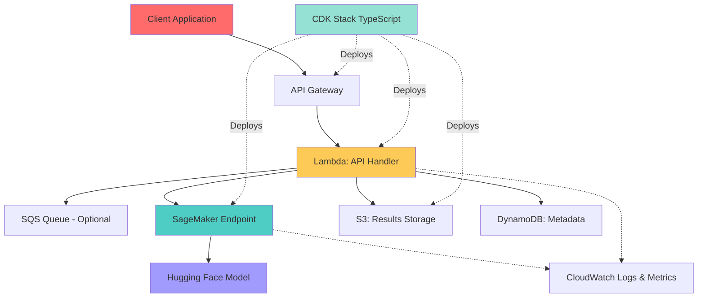
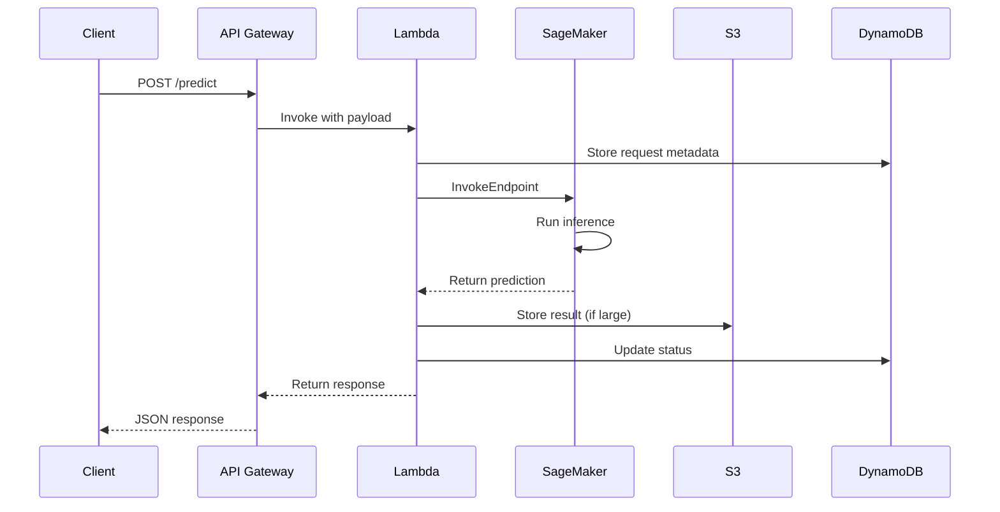

## 🎯 Introduction

Deploying machine learning models to production is a complex challenge that goes far beyond training a model. When working with large models from Hugging Face—whether it's image generation, text-to-image synthesis, or other AI tasks—you need robust infrastructure that handles:

- **Scalability**: Auto-scaling to handle variable loads from 0 to thousands of concurrent requests
- **Cost Efficiency**: Paying only for what you use while maintaining performance
- **Reliability**: 99.9%+ uptime with proper error handling and monitoring
- **Security**: Protecting models, data, and API endpoints
- **Observability**: Comprehensive logging, metrics, and tracing

This comprehensive guide demonstrates how to deploy a Hugging Face model to AWS using infrastructure as code (CDK with TypeScript), combining SageMaker for model hosting and Lambda for API orchestration.

> 💡 **Core Philosophy**: "Production ML deployment isn't about running inference—it's about building a reliable, scalable, cost-effective system that serves predictions while handling failures gracefully"

### 🎬 What We'll Build

We'll deploy a complete ML inference system with:

- **Hugging Face Model** on SageMaker for scalable inference
- **Lambda Functions** for API endpoints and orchestration
- **API Gateway** for RESTful API access
- **S3** for model artifacts and output storage
- **CloudWatch** for monitoring and logging
- **IAM** for fine-grained security controls
- **VPC** configuration for network isolation

## 🏗️ System Architecture

### 📊 High-Level Architecture



### 🔄 Request Flow



### 🎯 Architecture Decisions

| Decision | Choice | Reasoning |
|----------|--------|-----------|
| **Model Hosting** | SageMaker | Auto-scaling, managed infrastructure, optimized for ML |
| **API Layer** | Lambda + API Gateway | Serverless, cost-effective, scales automatically |
| **Storage** | S3 + DynamoDB | Durable storage for results, fast metadata access |
| **IaC Tool** | AWS CDK (TypeScript) | Type-safe, familiar language, great AWS integration |
| **Async Processing** | SQS (Optional) | Handles long-running inference, decouples components |

## 📦 Prerequisites and Setup

### 🛠️ Required Tools

```bash
# Node.js and npm
node --version  # v18+ recommended
npm --version

# AWS CDK
npm install -g aws-cdk
cdk --version

# AWS CLI
aws --version
aws configure  # Set up credentials

# Python (for model code)
python3 --version  # 3.9+ recommended
pip3 --version

# Docker (for building container images)
docker --version
```

### 🔑 AWS Credentials Setup

```bash
# Configure AWS credentials
aws configure

# Verify credentials
aws sts get-caller-identity

# Bootstrap CDK (first time only)
cdk bootstrap aws://ACCOUNT-ID/REGION
```

## 🏗️ CDK Project Structure

```
ml-inference-cdk/
├── bin/
│   └── ml-inference.ts          # CDK app entry point
├── lib/
│   ├── stacks/
│   │   ├── vpc-stack.ts         # VPC configuration
│   │   ├── sagemaker-stack.ts   # SageMaker endpoint
│   │   ├── lambda-stack.ts      # Lambda functions
│   │   └── api-stack.ts         # API Gateway
│   ├── constructs/
│   │   ├── sagemaker-model.ts   # Reusable SageMaker construct
│   │   └── lambda-api.ts        # Lambda + API construct
│   └── config/
│       ├── model-config.ts      # Model configuration
│       └── app-config.ts        # Application config
├── lambda/
│   ├── predict/
│   │   ├── index.ts             # Prediction Lambda
│   │   └── package.json
│   └── async-predict/
│       ├── index.ts             # Async prediction Lambda
│       └── package.json
├── model/
│   ├── inference.py             # SageMaker inference script
│   ├── requirements.txt         # Python dependencies
│   └── Dockerfile               # Container image
├── test/
│   └── ml-inference.test.ts     # CDK tests
├── cdk.json                     # CDK configuration
├── tsconfig.json                # TypeScript config
└── package.json                 # Node.js dependencies
```

## 🚀 Step 1: Initialize CDK Project

### 📝 Create New CDK Project

```bash
# Create project directory
mkdir ml-inference-cdk
cd ml-inference-cdk

# Initialize CDK project
cdk init app --language=typescript

# Install dependencies
npm install @aws-cdk/aws-sagemaker-alpha
npm install @aws-cdk/aws-apigatewayv2-alpha @aws-cdk/aws-apigatewayv2-integrations-alpha
```

### ⚙️ Configuration Files

```typescript
// lib/config/model-config.ts
export interface ModelConfig {
  modelId: string;
  modelVersion: string;
  instanceType: string;
  instanceCount: number;
  containerImage: string;
  environment: Record<string, string>;
}

export const modelConfigs = {
  development: {
    modelId: 'stabilityai/stable-diffusion-xl-base-1.0',
    modelVersion: '1.0',
    instanceType: 'ml.g4dn.xlarge',
    instanceCount: 1,
    containerImage: '', // Will be set after build
    environment: {
      MODEL_CACHE_DIR: '/opt/ml/model',
      TRANSFORMERS_CACHE: '/opt/ml/model',
      HF_HOME: '/opt/ml/model'
    }
  },
  production: {
    modelId: 'stabilityai/stable-diffusion-xl-base-1.0',
    modelVersion: '1.0',
    instanceType: 'ml.g4dn.2xlarge',
    instanceCount: 2,
    containerImage: '',
    environment: {
      MODEL_CACHE_DIR: '/opt/ml/model',
      TRANSFORMERS_CACHE: '/opt/ml/model',
      HF_HOME: '/opt/ml/model'
    }
  }
} as const;

export type Environment = keyof typeof modelConfigs;
```

```typescript
// lib/config/app-config.ts
import * as cdk from 'aws-cdk-lib';

export interface AppConfig {
  environment: string;
  region: string;
  account: string;
  vpcCidr: string;
  enableVpc: boolean;
  tags: Record<string, string>;
}

export function getAppConfig(app: cdk.App): AppConfig {
  const environment = app.node.tryGetContext('environment') || 'development';

  return {
    environment,
    region: process.env.CDK_DEFAULT_REGION || 'us-east-1',
    account: process.env.CDK_DEFAULT_ACCOUNT || '',
    vpcCidr: '10.0.0.0/16',
    enableVpc: environment === 'production',
    tags: {
      Environment: environment,
      Project: 'MLInference',
      ManagedBy: 'CDK'
    }
  };
}
```

## 🐳 Step 2: Create SageMaker Inference Container

### 🐍 Inference Script

```python
# model/inference.py
import json
import os
import torch
from diffusers import DiffusionPipeline
import base64
from io import BytesIO
from PIL import Image

class ModelHandler:
    def __init__(self):
        self.model = None
        self.device = "cuda" if torch.cuda.is_available() else "cpu"
        print(f"Using device: {self.device}")

    def load_model(self):
        """Load the Hugging Face model"""
        model_id = os.environ.get('MODEL_ID', 'stabilityai/stable-diffusion-xl-base-1.0')

        print(f"Loading model: {model_id}")

        self.model = DiffusionPipeline.from_pretrained(
            model_id,
            torch_dtype=torch.float16 if self.device == "cuda" else torch.float32,
            use_safetensors=True,
            variant="fp16" if self.device == "cuda" else None
        )

        self.model = self.model.to(self.device)

        # Enable memory efficient attention if available
        if hasattr(self.model, 'enable_xformers_memory_efficient_attention'):
            try:
                self.model.enable_xformers_memory_efficient_attention()
            except Exception as e:
                print(f"Could not enable xformers: {e}")

        print("Model loaded successfully")

    def preprocess(self, request_body):
        """Preprocess the input request"""
        try:
            if isinstance(request_body, bytes):
                request_body = request_body.decode('utf-8')

            data = json.loads(request_body)

            prompt = data.get('prompt', '')
            negative_prompt = data.get('negative_prompt', '')
            num_inference_steps = data.get('num_inference_steps', 50)
            guidance_scale = data.get('guidance_scale', 7.5)
            width = data.get('width', 1024)
            height = data.get('height', 1024)
            seed = data.get('seed', None)

            return {
                'prompt': prompt,
                'negative_prompt': negative_prompt,
                'num_inference_steps': num_inference_steps,
                'guidance_scale': guidance_scale,
                'width': width,
                'height': height,
                'seed': seed
            }
        except Exception as e:
            raise ValueError(f"Error preprocessing request: {str(e)}")

    def predict(self, data):
        """Run inference"""
        if self.model is None:
            self.load_model()

        # Set seed for reproducibility
        if data['seed'] is not None:
            generator = torch.Generator(device=self.device).manual_seed(data['seed'])
        else:
            generator = None

        # Generate image
        with torch.no_grad():
            image = self.model(
                prompt=data['prompt'],
                negative_prompt=data['negative_prompt'],
                num_inference_steps=data['num_inference_steps'],
                guidance_scale=data['guidance_scale'],
                width=data['width'],
                height=data['height'],
                generator=generator
            ).images[0]

        return image

    def postprocess(self, image):
        """Convert image to base64"""
        buffered = BytesIO()
        image.save(buffered, format="PNG")
        img_str = base64.b64encode(buffered.getvalue()).decode()

        return {
            'image': img_str,
            'format': 'png'
        }

# Global model handler
model_handler = ModelHandler()

def model_fn(model_dir):
    """Load model - called once when container starts"""
    model_handler.load_model()
    return model_handler

def input_fn(request_body, request_content_type):
    """Parse input data"""
    if request_content_type == 'application/json':
        return model_handler.preprocess(request_body)
    else:
        raise ValueError(f"Unsupported content type: {request_content_type}")

def predict_fn(data, model):
    """Run prediction"""
    return model.predict(data)

def output_fn(prediction, response_content_type):
    """Format output"""
    if response_content_type == 'application/json':
        return json.dumps(model_handler.postprocess(prediction))
    else:
        raise ValueError(f"Unsupported content type: {response_content_type}")
```

### 📦 Requirements and Dockerfile

```txt
# model/requirements.txt
torch==2.1.0
diffusers==0.24.0
transformers==4.36.0
accelerate==0.25.0
safetensors==0.4.1
pillow==10.1.0
xformers==0.0.23  # Optional, for memory efficiency
```

```dockerfile
# model/Dockerfile
FROM pytorch/pytorch:2.1.0-cuda11.8-cudnn8-runtime

# Set working directory
WORKDIR /opt/ml/code

# Install system dependencies
RUN apt-get update && apt-get install -y \
    git \
    wget \
    && rm -rf /var/lib/apt/lists/*

# Copy requirements and install Python dependencies
COPY requirements.txt .
RUN pip install --no-cache-dir -r requirements.txt

# Copy inference script
COPY inference.py .

# Set environment variables
ENV PYTHONUNBUFFERED=1
ENV MODEL_CACHE_DIR=/opt/ml/model
ENV TRANSFORMERS_CACHE=/opt/ml/model
ENV HF_HOME=/opt/ml/model

# SageMaker uses port 8080
ENV SAGEMAKER_BIND_TO_PORT=8080
ENV SAGEMAKER_PROGRAM=inference.py

# Health check
HEALTHCHECK --interval=30s --timeout=10s --start-period=5m --retries=3 \
    CMD wget --quiet --tries=1 --spider http://localhost:8080/ping || exit 1

ENTRYPOINT ["python", "inference.py"]
```

## 🏗️ Step 3: CDK Stacks Implementation

### 🌐 VPC Stack (Optional but Recommended)

```typescript
// lib/stacks/vpc-stack.ts
import * as cdk from 'aws-cdk-lib';
import * as ec2 from 'aws-cdk-lib/aws-ec2';
import { Construct } from 'constructs';

export interface VpcStackProps extends cdk.StackProps {
  vpcCidr: string;
}

export class VpcStack extends cdk.Stack {
  public readonly vpc: ec2.Vpc;

  constructor(scope: Construct, id: string, props: VpcStackProps) {
    super(scope, id, props);

    // Create VPC with public and private subnets
    this.vpc = new ec2.Vpc(this, 'MLInferenceVpc', {
      ipAddresses: ec2.IpAddresses.cidr(props.vpcCidr),
      maxAzs: 2,
      natGateways: 1, // Cost optimization
      subnetConfiguration: [
        {
          name: 'Public',
          subnetType: ec2.SubnetType.PUBLIC,
          cidrMask: 24,
        },
        {
          name: 'Private',
          subnetType: ec2.SubnetType.PRIVATE_WITH_EGRESS,
          cidrMask: 24,
        },
      ],
      enableDnsHostnames: true,
      enableDnsSupport: true,
    });

    // VPC Endpoints for cost optimization (avoid NAT charges)
    this.vpc.addInterfaceEndpoint('SageMakerRuntimeEndpoint', {
      service: ec2.InterfaceVpcEndpointAwsService.SAGEMAKER_RUNTIME,
    });

    this.vpc.addGatewayEndpoint('S3Endpoint', {
      service: ec2.GatewayVpcEndpointAwsService.S3,
    });

    // Output VPC ID
    new cdk.CfnOutput(this, 'VpcId', {
      value: this.vpc.vpcId,
      description: 'VPC ID',
    });
  }
}
```

### 🤖 SageMaker Stack

```typescript
// lib/stacks/sagemaker-stack.ts
import * as cdk from 'aws-cdk-lib';
import * as sagemaker from 'aws-cdk-lib/aws-sagemaker';
import * as iam from 'aws-cdk-lib/aws-iam';
import * as ec2 from 'aws-cdk-lib/aws-ec2';
import * as ecr from 'aws-cdk-lib/aws-ecr';
import { Construct } from 'constructs';
import { ModelConfig } from '../config/model-config';

export interface SageMakerStackProps extends cdk.StackProps {
  modelConfig: ModelConfig;
  vpc?: ec2.Vpc;
  ecrRepository: ecr.Repository;
}

export class SageMakerStack extends cdk.Stack {
  public readonly endpointName: string;
  public readonly endpoint: sagemaker.CfnEndpoint;

  constructor(scope: Construct, id: string, props: SageMakerStackProps) {
    super(scope, id, props);

    const { modelConfig, vpc, ecrRepository } = props;

    // IAM Role for SageMaker
    const sagemakerRole = new iam.Role(this, 'SageMakerExecutionRole', {
      assumedBy: new iam.ServicePrincipal('sagemaker.amazonaws.com'),
      managedPolicies: [
        iam.ManagedPolicy.fromAwsManagedPolicyName('AmazonSageMakerFullAccess'),
      ],
    });

    // Grant ECR access
    ecrRepository.grantPull(sagemakerRole);

    // Model
    const model = new sagemaker.CfnModel(this, 'HuggingFaceModel', {
      executionRoleArn: sagemakerRole.roleArn,
      primaryContainer: {
        image: `${ecrRepository.repositoryUri}:latest`,
        mode: 'SingleModel',
        environment: {
          ...modelConfig.environment,
          MODEL_ID: modelConfig.modelId,
        },
      },
      vpcConfig: vpc
        ? {
            subnets: vpc.privateSubnets.map((subnet) => subnet.subnetId),
            securityGroupIds: [
              new ec2.SecurityGroup(this, 'SageMakerSecurityGroup', {
                vpc,
                description: 'Security group for SageMaker endpoint',
                allowAllOutbound: true,
              }).securityGroupId,
            ],
          }
        : undefined,
    });

    // Endpoint Configuration
    const endpointConfig = new sagemaker.CfnEndpointConfig(
      this,
      'EndpointConfig',
      {
        productionVariants: [
          {
            modelName: model.attrModelName,
            variantName: 'AllTraffic',
            initialInstanceCount: modelConfig.instanceCount,
            instanceType: modelConfig.instanceType,
            initialVariantWeight: 1.0,
          },
        ],
        // Auto-scaling configuration
        asyncInferenceConfig: {
          outputConfig: {
            s3OutputPath: `s3://${cdk.Aws.ACCOUNT_ID}-ml-inference-output`,
          },
        },
      }
    );

    endpointConfig.addDependency(model);

    // Endpoint
    this.endpointName = `ml-inference-endpoint-${cdk.Aws.STACK_NAME}`;
    this.endpoint = new sagemaker.CfnEndpoint(this, 'Endpoint', {
      endpointName: this.endpointName,
      endpointConfigName: endpointConfig.attrEndpointConfigName,
    });

    this.endpoint.addDependency(endpointConfig);

    // Auto-scaling
    const scalableTarget = new cdk.aws_applicationautoscaling.ScalableTarget(
      this,
      'ScalableTarget',
      {
        serviceNamespace: cdk.aws_applicationautoscaling.ServiceNamespace.SAGEMAKER,
        resourceId: `endpoint/${this.endpointName}/variant/AllTraffic`,
        scalableDimension: 'sagemaker:variant:DesiredInstanceCount',
        minCapacity: 1,
        maxCapacity: 5,
      }
    );

    scalableTarget.node.addDependency(this.endpoint);

    // Target tracking scaling policy
    scalableTarget.scaleToTrackMetric('TargetTracking', {
      targetValue: 70,
      predefinedMetric: cdk.aws_applicationautoscaling.PredefinedMetric.SAGEMAKER_VARIANT_INVOCATIONS_PER_INSTANCE,
      scaleInCooldown: cdk.Duration.seconds(300),
      scaleOutCooldown: cdk.Duration.seconds(60),
    });

    // Outputs
    new cdk.CfnOutput(this, 'EndpointName', {
      value: this.endpointName,
      description: 'SageMaker Endpoint Name',
    });

    new cdk.CfnOutput(this, 'EndpointArn', {
      value: this.endpoint.ref,
      description: 'SageMaker Endpoint ARN',
    });
  }
}
```

### ⚡ Lambda Stack

```typescript
// lib/stacks/lambda-stack.ts
import * as cdk from 'aws-cdk-lib';
import * as lambda from 'aws-cdk-lib/aws-lambda';
import * as iam from 'aws-cdk-lib/aws-iam';
import * as logs from 'aws-cdk-lib/aws-logs';
import * as s3 from 'aws-cdk-lib/aws-s3';
import * as dynamodb from 'aws-cdk-lib/aws-dynamodb';
import { Construct } from 'constructs';
import { NodejsFunction } from 'aws-cdk-lib/aws-lambda-nodejs';
import * as path from 'path';

export interface LambdaStackProps extends cdk.StackProps {
  endpointName: string;
  resultsBucket: s3.Bucket;
  metadataTable: dynamodb.Table;
}

export class LambdaStack extends cdk.Stack {
  public readonly predictFunction: lambda.Function;
  public readonly statusFunction: lambda.Function;

  constructor(scope: Construct, id: string, props: LambdaStackProps) {
    super(scope, id, props);

    const { endpointName, resultsBucket, metadataTable } = props;

    // Lambda execution role
    const lambdaRole = new iam.Role(this, 'LambdaExecutionRole', {
      assumedBy: new iam.ServicePrincipal('lambda.amazonaws.com'),
      managedPolicies: [
        iam.ManagedPolicy.fromAwsManagedPolicyName(
          'service-role/AWSLambdaBasicExecutionRole'
        ),
      ],
    });

    // Grant SageMaker invoke permissions
    lambdaRole.addToPolicy(
      new iam.PolicyStatement({
        actions: ['sagemaker:InvokeEndpoint'],
        resources: [
          `arn:aws:sagemaker:${cdk.Aws.REGION}:${cdk.Aws.ACCOUNT_ID}:endpoint/${endpointName}`,
        ],
      })
    );

    // Grant S3 permissions
    resultsBucket.grantReadWrite(lambdaRole);

    // Grant DynamoDB permissions
    metadataTable.grantReadWriteData(lambdaRole);

    // Prediction Lambda Function
    this.predictFunction = new NodejsFunction(this, 'PredictFunction', {
      runtime: lambda.Runtime.NODEJS_20_X,
      handler: 'handler',
      entry: path.join(__dirname, '../../lambda/predict/index.ts'),
      timeout: cdk.Duration.minutes(5),
      memorySize: 512,
      role: lambdaRole,
      environment: {
        ENDPOINT_NAME: endpointName,
        RESULTS_BUCKET: resultsBucket.bucketName,
        METADATA_TABLE: metadataTable.tableName,
        REGION: cdk.Aws.REGION,
      },
      logRetention: logs.RetentionDays.ONE_WEEK,
      bundling: {
        minify: true,
        sourceMap: true,
        target: 'es2020',
      },
    });

    // Status Check Lambda Function
    this.statusFunction = new NodejsFunction(this, 'StatusFunction', {
      runtime: lambda.Runtime.NODEJS_20_X,
      handler: 'handler',
      entry: path.join(__dirname, '../../lambda/status/index.ts'),
      timeout: cdk.Duration.seconds(30),
      memorySize: 256,
      role: lambdaRole,
      environment: {
        RESULTS_BUCKET: resultsBucket.bucketName,
        METADATA_TABLE: metadataTable.tableName,
        REGION: cdk.Aws.REGION,
      },
      logRetention: logs.RetentionDays.ONE_WEEK,
    });

    // Outputs
    new cdk.CfnOutput(this, 'PredictFunctionArn', {
      value: this.predictFunction.functionArn,
      description: 'Predict Lambda Function ARN',
    });
  }
}
```

### 🌐 API Gateway Stack

```typescript
// lib/stacks/api-stack.ts
import * as cdk from 'aws-cdk-lib';
import * as apigateway from 'aws-cdk-lib/aws-apigateway';
import * as lambda from 'aws-cdk-lib/aws-lambda';
import * as logs from 'aws-cdk-lib/aws-logs';
import { Construct } from 'constructs';

export interface ApiStackProps extends cdk.StackProps {
  predictFunction: lambda.Function;
  statusFunction: lambda.Function;
}

export class ApiStack extends cdk.Stack {
  public readonly api: apigateway.RestApi;

  constructor(scope: Construct, id: string, props: ApiStackProps) {
    super(scope, id, props);

    const { predictFunction, statusFunction } = props;

    // CloudWatch Logs for API Gateway
    const logGroup = new logs.LogGroup(this, 'ApiGatewayLogs', {
      retention: logs.RetentionDays.ONE_WEEK,
      removalPolicy: cdk.RemovalPolicy.DESTROY,
    });

    // REST API
    this.api = new apigateway.RestApi(this, 'MLInferenceApi', {
      restApiName: 'ML Inference API',
      description: 'API for ML model inference',
      deployOptions: {
        stageName: 'prod',
        loggingLevel: apigateway.MethodLoggingLevel.INFO,
        dataTraceEnabled: true,
        accessLogDestination: new apigateway.LogGroupLogDestination(logGroup),
        accessLogFormat: apigateway.AccessLogFormat.jsonWithStandardFields(),
        throttlingRateLimit: 100,
        throttlingBurstLimit: 200,
      },
      defaultCorsPreflightOptions: {
        allowOrigins: apigateway.Cors.ALL_ORIGINS,
        allowMethods: apigateway.Cors.ALL_METHODS,
        allowHeaders: ['Content-Type', 'Authorization'],
      },
    });

    // API Key for authentication
    const apiKey = this.api.addApiKey('ApiKey', {
      apiKeyName: 'MLInferenceApiKey',
    });

    const usagePlan = this.api.addUsagePlan('UsagePlan', {
      name: 'Standard',
      throttle: {
        rateLimit: 100,
        burstLimit: 200,
      },
      quota: {
        limit: 10000,
        period: apigateway.Period.DAY,
      },
    });

    usagePlan.addApiKey(apiKey);
    usagePlan.addApiStage({
      stage: this.api.deploymentStage,
    });

    // Request validator
    const requestValidator = new apigateway.RequestValidator(
      this,
      'RequestValidator',
      {
        restApi: this.api,
        validateRequestBody: true,
        validateRequestParameters: true,
      }
    );

    // Request model
    const requestModel = this.api.addModel('PredictRequestModel', {
      contentType: 'application/json',
      modelName: 'PredictRequest',
      schema: {
        type: apigateway.JsonSchemaType.OBJECT,
        required: ['prompt'],
        properties: {
          prompt: { type: apigateway.JsonSchemaType.STRING },
          negative_prompt: { type: apigateway.JsonSchemaType.STRING },
          num_inference_steps: { type: apigateway.JsonSchemaType.INTEGER },
          guidance_scale: { type: apigateway.JsonSchemaType.NUMBER },
          width: { type: apigateway.JsonSchemaType.INTEGER },
          height: { type: apigateway.JsonSchemaType.INTEGER },
          seed: { type: apigateway.JsonSchemaType.INTEGER },
        },
      },
    });

    // /predict endpoint
    const predictResource = this.api.root.addResource('predict');
    predictResource.addMethod(
      'POST',
      new apigateway.LambdaIntegration(predictFunction, {
        proxy: true,
      }),
      {
        apiKeyRequired: true,
        requestValidator,
        requestModels: {
          'application/json': requestModel,
        },
      }
    );

    // /status/{jobId} endpoint
    const statusResource = this.api.root.addResource('status');
    const statusJobResource = statusResource.addResource('{jobId}');
    statusJobResource.addMethod(
      'GET',
      new apigateway.LambdaIntegration(statusFunction, {
        proxy: true,
      }),
      {
        apiKeyRequired: true,
      }
    );

    // Outputs
    new cdk.CfnOutput(this, 'ApiUrl', {
      value: this.api.url,
      description: 'API Gateway URL',
    });

    new cdk.CfnOutput(this, 'ApiKeyId', {
      value: apiKey.keyId,
      description: 'API Key ID',
    });
  }
}
```

## 🔧 Step 4: Lambda Function Implementation

### 🎯 Prediction Lambda

```typescript
// lambda/predict/index.ts
import {
  SageMakerRuntimeClient,
  InvokeEndpointCommand,
} from '@aws-sdk/client-sagemaker-runtime';
import { S3Client, PutObjectCommand } from '@aws-sdk/client-s3';
import { DynamoDBClient } from '@aws-sdk/client-dynamodb';
import { DynamoDBDocumentClient, PutCommand } from '@aws-sdk/lib-dynamodb';
import { APIGatewayProxyEvent, APIGatewayProxyResult } from 'aws-lambda';
import { v4 as uuidv4 } from 'uuid';

const sagemakerClient = new SageMakerRuntimeClient({
  region: process.env.REGION,
});

const s3Client = new S3Client({ region: process.env.REGION });

const dynamoClient = DynamoDBDocumentClient.from(
  new DynamoDBClient({ region: process.env.REGION })
);

interface PredictRequest {
  prompt: string;
  negative_prompt?: string;
  num_inference_steps?: number;
  guidance_scale?: number;
  width?: number;
  height?: number;
  seed?: number;
}

interface PredictResponse {
  jobId: string;
  status: 'processing' | 'completed' | 'failed';
  message: string;
  result?: {
    image: string;
    s3Url?: string;
  };
}

export const handler = async (
  event: APIGatewayProxyEvent
): Promise<APIGatewayProxyResult> => {
  console.log('Event:', JSON.stringify(event, null, 2));

  try {
    // Parse request body
    if (!event.body) {
      return {
        statusCode: 400,
        body: JSON.stringify({ error: 'Request body is required' }),
      };
    }

    const request: PredictRequest = JSON.parse(event.body);

    // Validate request
    if (!request.prompt || request.prompt.trim() === '') {
      return {
        statusCode: 400,
        body: JSON.stringify({ error: 'Prompt is required' }),
      };
    }

    // Generate job ID
    const jobId = uuidv4();
    const timestamp = new Date().toISOString();

    // Store job metadata in DynamoDB
    await dynamoClient.send(
      new PutCommand({
        TableName: process.env.METADATA_TABLE,
        Item: {
          jobId,
          status: 'processing',
          prompt: request.prompt,
          timestamp,
          ttl: Math.floor(Date.now() / 1000) + 86400, // 24 hours
        },
      })
    );

    // Prepare SageMaker request
    const sagemakerPayload = {
      prompt: request.prompt,
      negative_prompt: request.negative_prompt || '',
      num_inference_steps: request.num_inference_steps || 50,
      guidance_scale: request.guidance_scale || 7.5,
      width: request.width || 1024,
      height: request.height || 1024,
      seed: request.seed || null,
    };

    console.log('Invoking SageMaker endpoint:', process.env.ENDPOINT_NAME);

    // Invoke SageMaker endpoint
    const command = new InvokeEndpointCommand({
      EndpointName: process.env.ENDPOINT_NAME,
      ContentType: 'application/json',
      Body: JSON.stringify(sagemakerPayload),
    });

    const response = await sagemakerClient.send(command);

    // Parse response
    const result = JSON.parse(new TextDecoder().decode(response.Body));

    // Store image in S3 if it's large
    let s3Url: string | undefined;

    if (result.image && result.image.length > 100000) {
      // Store in S3 if > 100KB
      const s3Key = `results/${jobId}.png`;

      await s3Client.send(
        new PutObjectCommand({
          Bucket: process.env.RESULTS_BUCKET,
          Key: s3Key,
          Body: Buffer.from(result.image, 'base64'),
          ContentType: 'image/png',
        })
      );

      s3Url = `s3://${process.env.RESULTS_BUCKET}/${s3Key}`;

      // Update DynamoDB with result
      await dynamoClient.send(
        new PutCommand({
          TableName: process.env.METADATA_TABLE,
          Item: {
            jobId,
            status: 'completed',
            prompt: request.prompt,
            timestamp,
            s3Url,
            completedAt: new Date().toISOString(),
            ttl: Math.floor(Date.now() / 1000) + 86400,
          },
        })
      );

      // Return response with S3 URL
      const responseBody: PredictResponse = {
        jobId,
        status: 'completed',
        message: 'Inference completed successfully',
        result: {
          image: result.image.substring(0, 100) + '...', // Truncated
          s3Url,
        },
      };

      return {
        statusCode: 200,
        headers: {
          'Content-Type': 'application/json',
          'Access-Control-Allow-Origin': '*',
        },
        body: JSON.stringify(responseBody),
      };
    } else {
      // Update DynamoDB
      await dynamoClient.send(
        new PutCommand({
          TableName: process.env.METADATA_TABLE,
          Item: {
            jobId,
            status: 'completed',
            prompt: request.prompt,
            timestamp,
            completedAt: new Date().toISOString(),
            ttl: Math.floor(Date.now() / 1000) + 86400,
          },
        })
      );

      // Return response with inline image
      const responseBody: PredictResponse = {
        jobId,
        status: 'completed',
        message: 'Inference completed successfully',
        result: {
          image: result.image,
        },
      };

      return {
        statusCode: 200,
        headers: {
          'Content-Type': 'application/json',
          'Access-Control-Allow-Origin': '*',
        },
        body: JSON.stringify(responseBody),
      };
    }
  } catch (error) {
    console.error('Error:', error);

    return {
      statusCode: 500,
      headers: {
        'Content-Type': 'application/json',
        'Access-Control-Allow-Origin': '*',
      },
      body: JSON.stringify({
        error: 'Internal server error',
        message: error instanceof Error ? error.message : 'Unknown error',
      }),
    };
  }
};
```

### 📊 Status Lambda

```typescript
// lambda/status/index.ts
import { DynamoDBClient } from '@aws-sdk/client-dynamodb';
import { DynamoDBDocumentClient, GetCommand } from '@aws-sdk/lib-dynamodb';
import { S3Client, GetObjectCommand } from '@aws-sdk/client-s3';
import { getSignedUrl } from '@aws-sdk/s3-request-presigner';
import { APIGatewayProxyEvent, APIGatewayProxyResult } from 'aws-lambda';

const dynamoClient = DynamoDBDocumentClient.from(
  new DynamoDBClient({ region: process.env.REGION })
);

const s3Client = new S3Client({ region: process.env.REGION });

export const handler = async (
  event: APIGatewayProxyEvent
): Promise<APIGatewayProxyResult> => {
  try {
    const jobId = event.pathParameters?.jobId;

    if (!jobId) {
      return {
        statusCode: 400,
        body: JSON.stringify({ error: 'Job ID is required' }),
      };
    }

    // Get job metadata from DynamoDB
    const result = await dynamoClient.send(
      new GetCommand({
        TableName: process.env.METADATA_TABLE,
        Key: { jobId },
      })
    );

    if (!result.Item) {
      return {
        statusCode: 404,
        body: JSON.stringify({ error: 'Job not found' }),
      };
    }

    // Generate presigned URL if result is in S3
    let presignedUrl: string | undefined;

    if (result.Item.s3Url) {
      const s3Key = result.Item.s3Url.replace(
        `s3://${process.env.RESULTS_BUCKET}/`,
        ''
      );

      presignedUrl = await getSignedUrl(
        s3Client,
        new GetObjectCommand({
          Bucket: process.env.RESULTS_BUCKET,
          Key: s3Key,
        }),
        { expiresIn: 3600 } // 1 hour
      );
    }

    return {
      statusCode: 200,
      headers: {
        'Content-Type': 'application/json',
        'Access-Control-Allow-Origin': '*',
      },
      body: JSON.stringify({
        jobId: result.Item.jobId,
        status: result.Item.status,
        prompt: result.Item.prompt,
        timestamp: result.Item.timestamp,
        completedAt: result.Item.completedAt,
        ...(presignedUrl && { downloadUrl: presignedUrl }),
      }),
    };
  } catch (error) {
    console.error('Error:', error);

    return {
      statusCode: 500,
      headers: {
        'Content-Type': 'application/json',
        'Access-Control-Allow-Origin': '*',
      },
      body: JSON.stringify({
        error: 'Internal server error',
        message: error instanceof Error ? error.message : 'Unknown error',
      }),
    };
  }
};
```

## 🏗️ Step 5: Main CDK App

```typescript
// bin/ml-inference.ts
#!/usr/bin/env node
import 'source-map-support/register';
import * as cdk from 'aws-cdk-lib';
import * as s3 from 'aws-cdk-lib/aws-s3';
import * as dynamodb from 'aws-cdk-lib/aws-dynamodb';
import * as ecr from 'aws-cdk-lib/aws-ecr';
import { VpcStack } from '../lib/stacks/vpc-stack';
import { SageMakerStack } from '../lib/stacks/sagemaker-stack';
import { LambdaStack } from '../lib/stacks/lambda-stack';
import { ApiStack } from '../lib/stacks/api-stack';
import { getAppConfig } from '../lib/config/app-config';
import { modelConfigs } from '../lib/config/model-config';

const app = new cdk.App();
const config = getAppConfig(app);

// Shared resources
const resultsBucket = new s3.Bucket(app, 'ResultsBucket', {
  bucketName: `${config.account}-ml-inference-results`,
  removalPolicy: cdk.RemovalPolicy.DESTROY,
  autoDeleteObjects: true,
  encryption: s3.BucketEncryption.S3_MANAGED,
  lifecycleRules: [
    {
      expiration: cdk.Duration.days(7),
    },
  ],
});

const metadataTable = new dynamodb.Table(app, 'MetadataTable', {
  tableName: 'ml-inference-jobs',
  partitionKey: { name: 'jobId', type: dynamodb.AttributeType.STRING },
  billingMode: dynamodb.BillingMode.PAY_PER_REQUEST,
  removalPolicy: cdk.RemovalPolicy.DESTROY,
  timeToLiveAttribute: 'ttl',
  pointInTimeRecovery: true,
});

const ecrRepository = new ecr.Repository(app, 'ModelRepository', {
  repositoryName: 'ml-inference-model',
  removalPolicy: cdk.RemovalPolicy.DESTROY,
  autoDeleteImages: true,
});

// VPC Stack (optional)
let vpcStack: VpcStack | undefined;
if (config.enableVpc) {
  vpcStack = new VpcStack(app, 'VpcStack', {
    vpcCidr: config.vpcCidr,
    env: {
      account: config.account,
      region: config.region,
    },
  });
}

// SageMaker Stack
const sagemakerStack = new SageMakerStack(app, 'SageMakerStack', {
  modelConfig: modelConfigs[config.environment as keyof typeof modelConfigs],
  vpc: vpcStack?.vpc,
  ecrRepository,
  env: {
    account: config.account,
    region: config.region,
  },
});

// Lambda Stack
const lambdaStack = new LambdaStack(app, 'LambdaStack', {
  endpointName: sagemakerStack.endpointName,
  resultsBucket,
  metadataTable,
  env: {
    account: config.account,
    region: config.region,
  },
});

lambdaStack.addDependency(sagemakerStack);

// API Stack
const apiStack = new ApiStack(app, 'ApiStack', {
  predictFunction: lambdaStack.predictFunction,
  statusFunction: lambdaStack.statusFunction,
  env: {
    account: config.account,
    region: config.region,
  },
});

apiStack.addDependency(lambdaStack);

// Add tags to all resources
Object.entries(config.tags).forEach(([key, value]) => {
  cdk.Tags.of(app).add(key, value);
});

app.synth();
```

## 🚀 Step 6: Deployment

### 📦 Build and Push Docker Image

```bash
# Build Docker image
cd model
docker build -t ml-inference-model .

# Get ECR login
aws ecr get-login-password --region us-east-1 | \
  docker login --username AWS --password-stdin \
  ACCOUNT_ID.dkr.ecr.us-east-1.amazonaws.com

# Tag image
docker tag ml-inference-model:latest \
  ACCOUNT_ID.dkr.ecr.us-east-1.amazonaws.com/ml-inference-model:latest

# Push to ECR
docker push ACCOUNT_ID.dkr.ecr.us-east-1.amazonaws.com/ml-inference-model:latest
```

### 🚀 Deploy CDK Stacks

```bash
# Install dependencies
npm install

# Synthesize CloudFormation templates
cdk synth

# Deploy all stacks
cdk deploy --all --require-approval never

# Or deploy individually
cdk deploy VpcStack
cdk deploy SageMakerStack
cdk deploy LambdaStack
cdk deploy ApiStack
```

### 🧪 Test the API

```bash
# Get API Key
aws apigateway get-api-keys --include-values

# Make prediction request
curl -X POST https://YOUR_API_ID.execute-api.us-east-1.amazonaws.com/prod/predict \
  -H "Content-Type: application/json" \
  -H "x-api-key: YOUR_API_KEY" \
  -d '{
    "prompt": "A serene landscape with mountains and a lake at sunset",
    "num_inference_steps": 50,
    "guidance_scale": 7.5,
    "width": 1024,
    "height": 1024
  }'

# Check job status
curl https://YOUR_API_ID.execute-api.us-east-1.amazonaws.com/prod/status/JOB_ID \
  -H "x-api-key: YOUR_API_KEY"
```

## 📊 Monitoring and Observability

### 📈 CloudWatch Dashboard

```typescript
// Add to lib/stacks/monitoring-stack.ts
import * as cloudwatch from 'aws-cdk-lib/aws-cloudwatch';

const dashboard = new cloudwatch.Dashboard(this, 'MLInferenceDashboard', {
  dashboardName: 'ML-Inference-Metrics',
});

// SageMaker metrics
dashboard.addWidgets(
  new cloudwatch.GraphWidget({
    title: 'SageMaker Invocations',
    left: [
      new cloudwatch.Metric({
        namespace: 'AWS/SageMaker',
        metricName: 'Invocations',
        dimensionsMap: {
          EndpointName: endpointName,
          VariantName: 'AllTraffic',
        },
        statistic: 'Sum',
      }),
    ],
  })
);

// Lambda metrics
dashboard.addWidgets(
  new cloudwatch.GraphWidget({
    title: 'Lambda Duration',
    left: [
      predictFunction.metricDuration(),
    ],
  })
);
```

### 🔔 Alarms

```typescript
// SageMaker endpoint alarm
const endpointAlarm = new cloudwatch.Alarm(this, 'EndpointFailureAlarm', {
  metric: new cloudwatch.Metric({
    namespace: 'AWS/SageMaker',
    metricName: 'ModelInvocation4XXErrors',
    dimensionsMap: {
      EndpointName: endpointName,
      VariantName: 'AllTraffic',
    },
    statistic: 'Sum',
  }),
  threshold: 10,
  evaluationPeriods: 2,
  alarmDescription: 'Alert when SageMaker endpoint has too many 4XX errors',
});

// Lambda error alarm
const lambdaAlarm = new cloudwatch.Alarm(this, 'LambdaErrorAlarm', {
  metric: predictFunction.metricErrors(),
  threshold: 5,
  evaluationPeriods: 2,
  alarmDescription: 'Alert when Lambda function has too many errors',
});
```

## 💰 Cost Optimization

### 💡 Cost Breakdown

| Service | Cost Factor | Optimization Strategy |
|---------|-------------|----------------------|
| **SageMaker** | Instance hours | Use auto-scaling, smaller instances for dev |
| **Lambda** | Invocations + Duration | Optimize code, use appropriate memory |
| **API Gateway** | Requests | Cache responses when possible |
| **S3** | Storage + Requests | Lifecycle policies, intelligent tiering |
| **DynamoDB** | Read/Write units | Use on-demand pricing, TTL for cleanup |

### 🎯 Optimization Tips

```typescript
// 1. Use Spot Instances for SageMaker (development)
// Add to SageMaker endpoint config for non-production
productionVariants: [{
  // ... other config
  instanceType: 'ml.g4dn.xlarge',
  initialInstanceCount: 1,
  // Enable managed spot training (not available for all instances)
}]

// 2. Implement caching in Lambda
const cache = new Map<string, any>();

export const handler = async (event: any) => {
  const cacheKey = JSON.stringify(event.body);

  if (cache.has(cacheKey)) {
    return cache.get(cacheKey);
  }

  const result = await invokeModel(event);
  cache.set(cacheKey, result);

  return result;
};

// 3. Use Reserved Capacity for predictable workloads
// Purchase SageMaker Savings Plans for production workloads
```

## 🔒 Security Best Practices

### 🛡️ Security Checklist

```typescript
// 1. Enable encryption at rest
const resultsBucket = new s3.Bucket(this, 'ResultsBucket', {
  encryption: s3.BucketEncryption.S3_MANAGED,
  enforceSSL: true,
});

// 2. Restrict S3 bucket access
resultsBucket.addToResourcePolicy(
  new iam.PolicyStatement({
    effect: iam.Effect.DENY,
    principals: [new iam.AnyPrincipal()],
    actions: ['s3:*'],
    resources: [resultsBucket.arnForObjects('*')],
    conditions: {
      Bool: {
        'aws:SecureTransport': 'false',
      },
    },
  })
);

// 3. Enable API Gateway authentication
// Use Cognito, API Keys, or Lambda Authorizers

// 4. Implement rate limiting
const throttleSettings = {
  rateLimit: 100,
  burstLimit: 200,
};

// 5. Enable VPC for SageMaker (production)
// Isolate SageMaker endpoints in private subnets

// 6. Use Secrets Manager for sensitive data
const apiSecret = new secretsmanager.Secret(this, 'ApiSecret', {
  secretName: 'ml-inference-api-key',
});

// 7. Enable CloudTrail logging
// Monitor API calls and access patterns
```

## 📚 Summary and Best Practices

### 🎯 Key Takeaways

1. **Infrastructure as Code**: Use CDK for reproducible, version-controlled infrastructure
2. **Separation of Concerns**: Keep model code (Python) separate from infrastructure (TypeScript)
3. **Auto-scaling**: Configure SageMaker and Lambda to scale based on demand
4. **Monitoring**: Implement comprehensive logging and alerting
5. **Cost Management**: Use auto-scaling, lifecycle policies, and appropriate instance types
6. **Security**: Enable encryption, use IAM roles, implement API authentication
7. **Testing**: Test locally with Docker before deploying to AWS

### 🛠️ Essential Commands

```bash
# Development
npm run build          # Build TypeScript
cdk synth             # Generate CloudFormation
cdk diff              # See changes before deploy

# Deployment
cdk deploy --all      # Deploy all stacks
cdk deploy VpcStack   # Deploy specific stack

# Docker
docker build -t model .
docker push ECR_URI

# Testing
aws sagemaker-runtime invoke-endpoint \
  --endpoint-name ENDPOINT_NAME \
  --body file://request.json \
  output.json

# Cleanup
cdk destroy --all     # Delete all resources
```

### 📖 Project Checklist

- [ ] Set up AWS credentials and CDK bootstrap
- [ ] Create Hugging Face inference script
- [ ] Build and test Docker image locally
- [ ] Push image to ECR
- [ ] Deploy VPC stack (if needed)
- [ ] Deploy SageMaker stack
- [ ] Test SageMaker endpoint directly
- [ ] Deploy Lambda stack
- [ ] Test Lambda functions
- [ ] Deploy API Gateway stack
- [ ] Test end-to-end API
- [ ] Set up monitoring and alarms
- [ ] Configure auto-scaling
- [ ] Implement security best practices
- [ ] Document API endpoints
- [ ] Set up CI/CD pipeline

## 🎓 Further Learning

- **AWS CDK**: [AWS CDK Documentation](https://docs.aws.amazon.com/cdk/)
- **SageMaker**: [Amazon SageMaker Developer Guide](https://docs.aws.amazon.com/sagemaker/)
- **Hugging Face**: [Hugging Face Documentation](https://huggingface.co/docs)
- **MLOps**: [ML Engineering Best Practices](https://ml-ops.org/)

## 🎯 Conclusion

Deploying machine learning models to production requires careful consideration of architecture, scalability, cost, and security. By using AWS CDK with TypeScript, you can create infrastructure as code that's maintainable, testable, and reproducible.

This guide provided a complete solution for deploying Hugging Face models using SageMaker and Lambda, with:
- Type-safe infrastructure code
- Scalable architecture
- Production-ready security
- Comprehensive monitoring
- Cost optimization strategies

**Next Steps:**
- Implement CI/CD pipeline with GitHub Actions or AWS CodePipeline
- Add A/B testing for model versions
- Implement caching for frequently requested predictions
- Set up multi-region deployment for global availability
- Add custom domain and SSL certificates

---

**Related Posts:**
- [Building Production Kubernetes Platform with AWS EKS and CDK](/building-production-kubernetes-platform-aws-eks-cdk)
- [Building Serverless URL Shortener with AWS CDK](/building-serverless-url-shortener-aws-cdk)
- [TypeScript Best Practices: A Comprehensive Guide to Type-Safe Development](/typescript-best-practices-comprehensive-guide)
- [Express.js Best Practices: Building Production-Ready Node.js Backend Applications](/express-nodejs-backend-framework-best-practices)

**Tags:** #AWS #CDK #SageMaker #Lambda #HuggingFace #MachineLearning #MLOps #TypeScript #Python #InfrastructureAsCode #Serverless #AI
