## 🎯 前言

Docker 是當今最流行的容器化技術，徹底改變了應用程式的開發、部署和運行方式。本系列文章將從基礎到進階，完整介紹 Docker 的各個面向。

**本系列文章規劃：**
- **第一篇（本文）**：Docker 基礎概念與入門
- **第二篇**：Docker 指令與實務操作
- **第三篇**：Docker 進階應用與最佳實踐

## 📚 什麼是 Docker？

Docker 是一個**開源的容器化平台**，讓開發者可以將應用程式及其所有依賴項打包成一個標準化的單元（容器），然後在任何環境中一致地運行。

### 核心價值

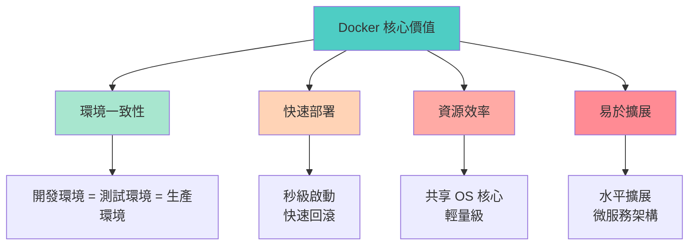

### Docker 解決的問題

| 傳統問題 | Docker 解決方案 |
|----------|-----------------|
| **環境不一致** | 容器包含完整運行環境，確保一致性 |
| **依賴衝突** | 每個容器獨立運行，互不干擾 |
| **部署複雜** | 一鍵部署，快速回滾 |
| **資源浪費** | 共享 OS 核心，輕量級虛擬化 |
| **擴展困難** | 容器化應用易於水平擴展 |
| **配置管理** | Infrastructure as Code，版本控制 |

## 🔄 虛擬化技術演進

### 傳統部署 vs 虛擬機 vs 容器

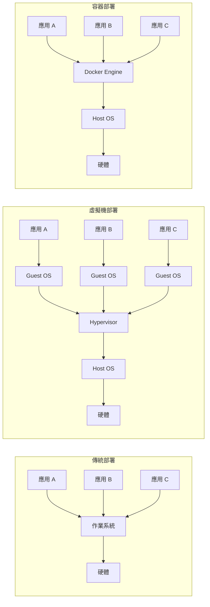

### 詳細比較表

| 特性 | 傳統部署 | 虛擬機（VM） | Docker 容器 |
|------|----------|-------------|-------------|
| **啟動速度** | 分鐘級 | 分鐘級 | 秒級 |
| **資源佔用** | 高 | 高（需要完整 OS） | 低（共享核心） |
| **效能損耗** | 無 | 5-20% | <5% |
| **隔離性** | 低 | 高 | 中-高 |
| **可移植性** | 差 | 中 | 優秀 |
| **映像大小** | N/A | GB 級 | MB 級 |
| **管理複雜度** | 低 | 高 | 中 |
| **密度** | 低 | 低（10-100/主機） | 高（100-1000/主機） |
| **作業系統** | 受限於主機 | 可以不同 | 共享主機核心 |

### 虛擬機 vs Docker 詳細對比

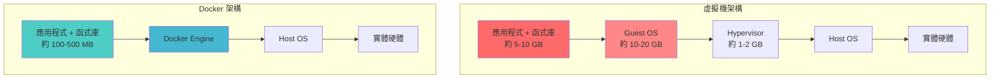

**關鍵差異說明：**

1. **作業系統層級**
   - VM：每個虛擬機都需要完整的 Guest OS
   - Docker：容器共享 Host OS 的核心

2. **啟動時間**
   - VM：需要啟動完整作業系統（30-60 秒）
   - Docker：只需啟動應用程式進程（1-3 秒）

3. **資源使用**
   - VM：需要預分配記憶體和 CPU
   - Docker：動態使用資源，更有效率

## 🏗️ Docker 核心架構

### 整體架構圖

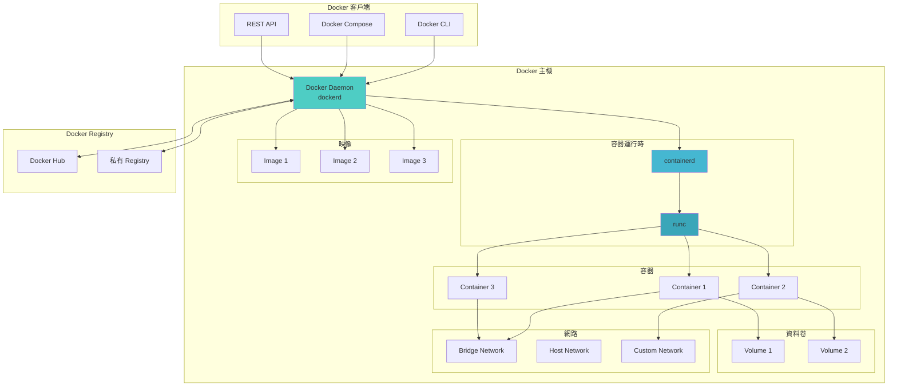

### 核心元件說明

| 元件 | 作用 | 說明 |
|------|------|------|
| **Docker Client（客戶端）** | 使用者介面 | 接收使用者指令並傳送給 Docker Daemon |
| **Docker Daemon（守護進程）** | 核心管理服務 | 負責建立、運行、監控容器 |
| **Docker Image（映像）** | 唯讀模板 | 包含應用程式及其依賴項的靜態檔案 |
| **Docker Container（容器）** | 運行實例 | 映像的可執行實例 |
| **Docker Registry（映像倉庫）** | 映像存儲 | 存儲和分發 Docker 映像 |
| **Docker Volume（資料卷）** | 資料持久化 | 持久化容器資料 |
| **Docker Network（網路）** | 網路通訊 | 容器間的網路連接 |

## 📦 Docker 核心概念

### 1. Docker Image（映像）

**映像是什麼？**
- 唯讀的模板，包含運行應用程式所需的所有內容
- 採用分層（Layer）架構
- 可以基於其他映像建立

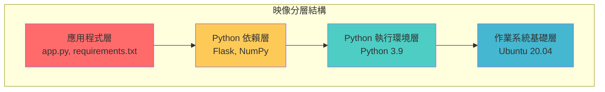

**映像特性：**

| 特性 | 說明 | 優勢 |
|------|------|------|
| **分層儲存** | 映像由多層組成，每層代表一次變更 | 節省空間，加快構建速度 |
| **寫時複製** | 容器啟動時不複製映像，只在修改時複製 | 快速啟動，節省磁碟 |
| **內容定址** | 每層有唯一的 SHA256 雜湊值 | 確保完整性，避免衝突 |
| **共享層** | 多個映像可共享相同的基礎層 | 節省儲存空間 |
| **不可變性** | 映像建立後不可修改 | 確保一致性和可追溯性 |

**映像與容器的關係：**

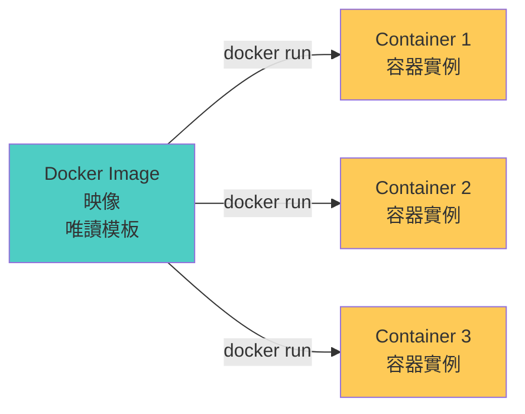

### 2. Docker Container（容器）

**容器是什麼？**
- 映像的運行實例
- 可以被啟動、停止、刪除
- 容器之間相互隔離
- 可以連接到網路、掛載儲存

**容器生命週期：**

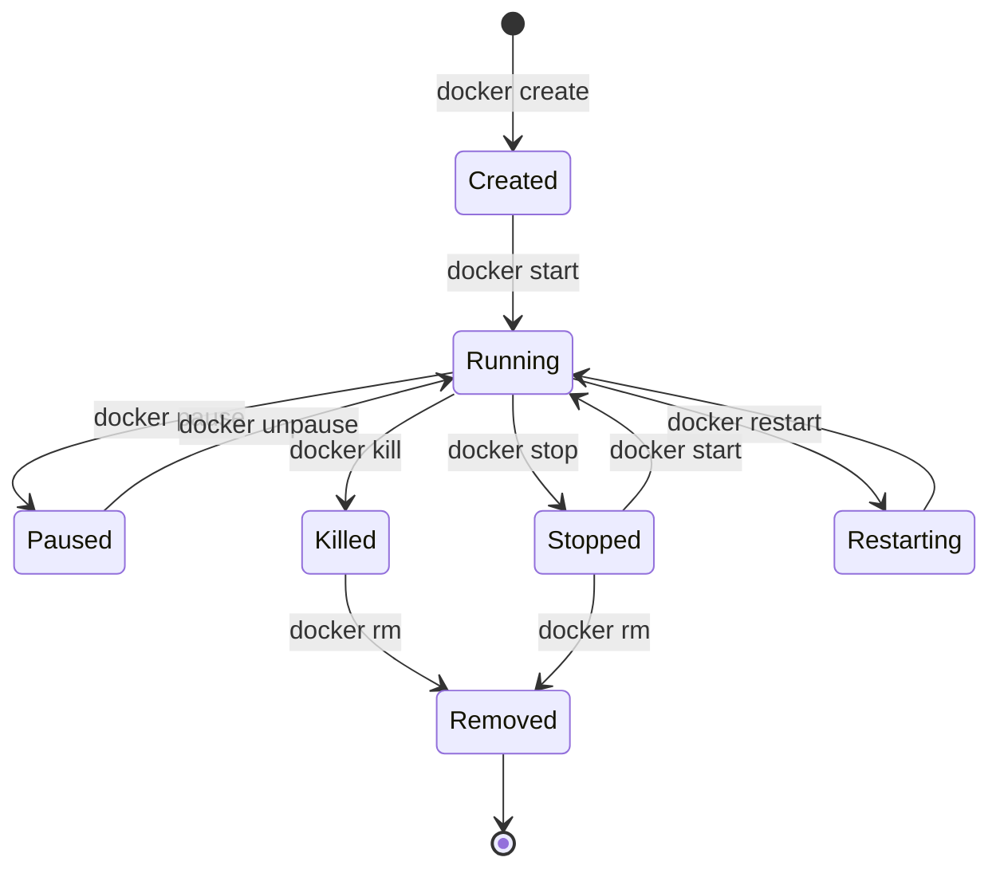

**容器狀態說明表：**

| 狀態 | 說明 | 常用指令 |
|------|------|----------|
| **Created** | 容器已建立但未啟動 | `docker create` |
| **Running** | 容器正在運行中 | `docker start`, `docker run` |
| **Paused** | 容器已暫停 | `docker pause` |
| **Stopped** | 容器已停止 | `docker stop` |
| **Restarting** | 容器正在重啟 | `docker restart` |
| **Dead** | 容器無法停止（異常狀態） | `docker rm -f` |
| **Removed** | 容器已刪除 | `docker rm` |

### 3. Docker Registry（映像倉庫）

**Registry 是什麼？**
- 儲存和分發 Docker 映像的服務
- 類似於 Git 的程式碼倉庫

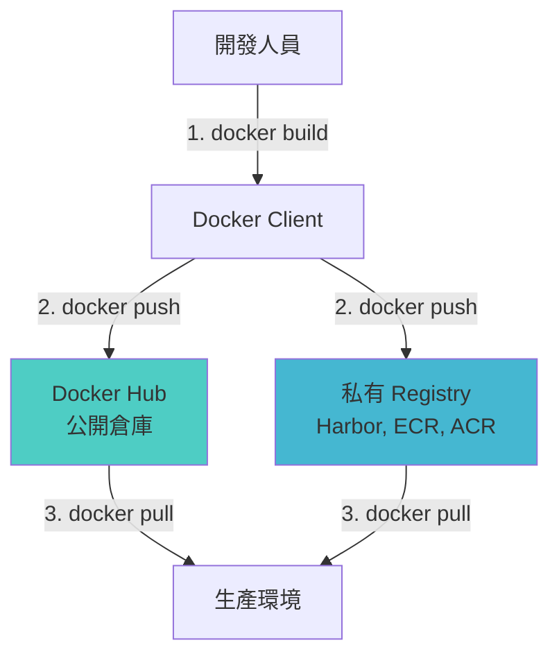

**常見 Registry 服務：**

| Registry | 類型 | 特點 | 適用場景 |
|----------|------|------|----------|
| **Docker Hub** | 公開 | 官方倉庫，免費 | 開源專案、學習 |
| **Harbor** | 私有 | 開源、企業級功能 | 企業內部 |
| **AWS ECR** | 私有 | AWS 整合 | AWS 環境 |
| **Azure ACR** | 私有 | Azure 整合 | Azure 環境 |
| **GCR** | 私有 | GCP 整合 | GCP 環境 |
| **GitLab Registry** | 私有 | GitLab 整合 | CI/CD 整合 |

## 🔧 Docker 安裝與配置

### 系統需求

**Linux 系統要求：**

| 項目 | 需求 |
|------|------|
| **核心版本** | Linux kernel 3.10+ |
| **儲存驅動** | overlay2（推薦） |
| **CPU 架構** | x86_64, ARM64, ARM, s390x |
| **記憶體** | 最低 2GB，建議 4GB+ |
| **磁碟空間** | 最低 20GB，建議 100GB+ |

**macOS 系統要求：**
- macOS 10.15 或更新版本
- 4GB RAM（最低），建議 8GB+
- VirtualBox 或 HyperKit

**Windows 系統要求：**
- Windows 10 64-bit Pro/Enterprise/Education
- 啟用 Hyper-V 和容器功能
- WSL 2（Windows Subsystem for Linux）

### Ubuntu/Debian 安裝步驟

```bash
# 1. 更新套件索引
sudo apt-get update

# 2. 安裝必要的套件
sudo apt-get install -y \
    apt-transport-https \
    ca-certificates \
    curl \
    gnupg \
    lsb-release

# 3. 加入 Docker 官方 GPG 金鑰
curl -fsSL https://download.docker.com/linux/ubuntu/gpg | \
    sudo gpg --dearmor -o /usr/share/keyrings/docker-archive-keyring.gpg

# 4. 設定穩定版本的倉庫
echo \
  "deb [arch=$(dpkg --print-architecture) signed-by=/usr/share/keyrings/docker-archive-keyring.gpg] \
  https://download.docker.com/linux/ubuntu \
  $(lsb_release -cs) stable" | \
  sudo tee /etc/apt/sources.list.d/docker.list > /dev/null

# 5. 安裝 Docker Engine
sudo apt-get update
sudo apt-get install -y docker-ce docker-ce-cli containerd.io docker-compose-plugin

# 6. 驗證安裝
sudo docker --version
sudo docker run hello-world
```

### CentOS/RHEL 安裝步驟

```bash
# 1. 移除舊版本
sudo yum remove docker \
    docker-client \
    docker-client-latest \
    docker-common \
    docker-latest \
    docker-latest-logrotate \
    docker-logrotate \
    docker-engine

# 2. 安裝 yum-utils
sudo yum install -y yum-utils

# 3. 設定穩定版本的倉庫
sudo yum-config-manager \
    --add-repo \
    https://download.docker.com/linux/centos/docker-ce.repo

# 4. 安裝 Docker Engine
sudo yum install -y docker-ce docker-ce-cli containerd.io docker-compose-plugin

# 5. 啟動 Docker
sudo systemctl start docker
sudo systemctl enable docker

# 6. 驗證安裝
sudo docker --version
sudo docker run hello-world
```

### macOS 安裝步驟

```bash
# 方法 1: 使用 Homebrew（推薦）
brew install --cask docker

# 啟動 Docker Desktop
open /Applications/Docker.app

# 方法 2: 直接下載安裝檔
# 前往 https://www.docker.com/products/docker-desktop
# 下載 Docker Desktop for Mac 並安裝

# 驗證安裝
docker --version
docker run hello-world
```

### Windows 安裝步驟

```powershell
# 方法 1: 使用 Chocolatey
choco install docker-desktop

# 方法 2: 直接下載安裝檔
# 前往 https://www.docker.com/products/docker-desktop
# 下載 Docker Desktop for Windows 並安裝

# 啟用 WSL 2（如果尚未啟用）
wsl --install
wsl --set-default-version 2

# 驗證安裝
docker --version
docker run hello-world
```

### 配置非 root 使用者執行 Docker（Linux）

```bash
# 1. 建立 docker 群組（通常已存在）
sudo groupadd docker

# 2. 將使用者加入 docker 群組
sudo usermod -aG docker $USER

# 3. 登出並重新登入，或執行以下指令
newgrp docker

# 4. 驗證無需 sudo 即可執行 docker
docker run hello-world
```

### Docker 配置檔案

**Linux 配置檔案位置：** `/etc/docker/daemon.json`

```json
{
  "registry-mirrors": [
    "https://docker.mirrors.ustc.edu.cn",
    "https://registry.docker-cn.com"
  ],
  "insecure-registries": [],
  "debug": false,
  "experimental": false,
  "log-driver": "json-file",
  "log-opts": {
    "max-size": "10m",
    "max-file": "3"
  },
  "storage-driver": "overlay2",
  "storage-opts": [
    "overlay2.override_kernel_check=true"
  ],
  "default-address-pools": [
    {
      "base": "172.17.0.0/16",
      "size": 24
    }
  ],
  "dns": ["8.8.8.8", "8.8.4.4"],
  "dns-search": [],
  "default-runtime": "runc",
  "live-restore": true,
  "max-concurrent-downloads": 3,
  "max-concurrent-uploads": 5
}
```

**配置選項說明：**

| 配置項 | 說明 | 建議值 |
|--------|------|--------|
| **registry-mirrors** | 映像加速器地址 | 根據地區選擇 |
| **log-driver** | 日誌驅動 | json-file |
| **log-opts** | 日誌選項 | 限制大小避免佔滿磁碟 |
| **storage-driver** | 儲存驅動 | overlay2（推薦） |
| **live-restore** | 容器在 Docker 重啟後繼續運行 | true |
| **max-concurrent-downloads** | 最大並行下載數 | 3-10 |

**重新載入配置：**

```bash
# Linux
sudo systemctl daemon-reload
sudo systemctl restart docker

# macOS/Windows
# 透過 Docker Desktop 介面重啟
```

## 🚀 第一個 Docker 容器

### Hello World 範例

```bash
# 執行第一個容器
docker run hello-world
```

**執行流程說明：**

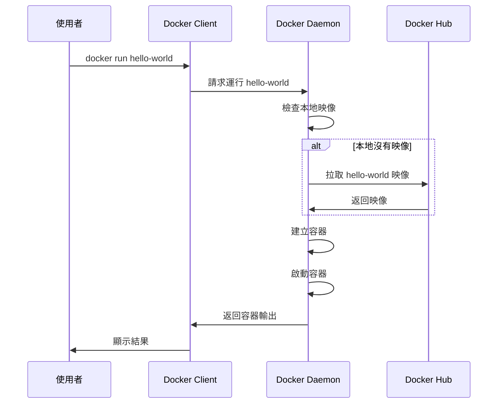

**輸出說明：**

```
Hello from Docker!
This message shows that your installation appears to be working correctly.

To generate this message, Docker took the following steps:
 1. The Docker client contacted the Docker daemon.
 2. The Docker daemon pulled the "hello-world" image from the Docker Hub.
 3. The Docker daemon created a new container from that image which runs the
    executable that produces the output you are currently reading.
 4. The Docker daemon streamed that output to the Docker client, which sent it
    to your terminal.
```

### 運行互動式容器

```bash
# 運行 Ubuntu 容器並進入互動式 shell
docker run -it ubuntu:20.04 bash

# 在容器內執行指令
root@container-id:/# cat /etc/os-release
root@container-id:/# ls -la
root@container-id:/# apt-get update
root@container-id:/# exit
```

**參數說明：**

| 參數 | 說明 |
|------|------|
| `-i` | 保持 STDIN 開啟（互動式） |
| `-t` | 分配虛擬終端機（TTY） |
| `ubuntu:20.04` | 映像名稱:標籤 |
| `bash` | 要執行的指令 |

### 運行背景服務

```bash
# 運行 Nginx web 伺服器
docker run -d -p 8080:80 --name my-nginx nginx:latest

# 查看運行中的容器
docker ps

# 測試 Nginx
curl http://localhost:8080

# 查看容器日誌
docker logs my-nginx

# 停止容器
docker stop my-nginx

# 刪除容器
docker rm my-nginx
```

**參數說明：**

| 參數 | 說明 |
|------|------|
| `-d` | 背景運行（detached mode） |
| `-p 8080:80` | 埠映射：主機埠:容器埠 |
| `--name my-nginx` | 指定容器名稱 |
| `nginx:latest` | 使用最新版本的 Nginx 映像 |

## 📊 Docker 工作流程

### 典型開發流程

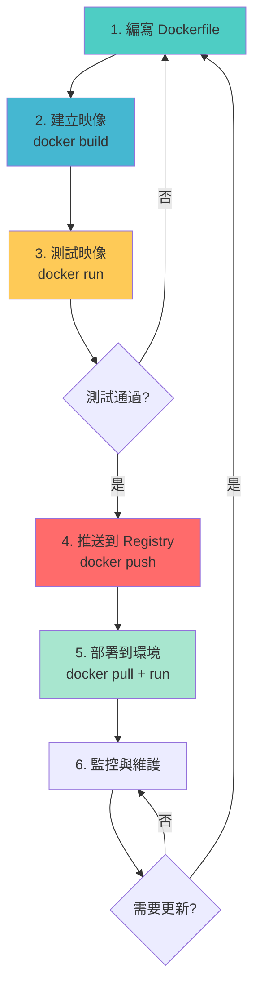

### 從開發到生產的完整流程

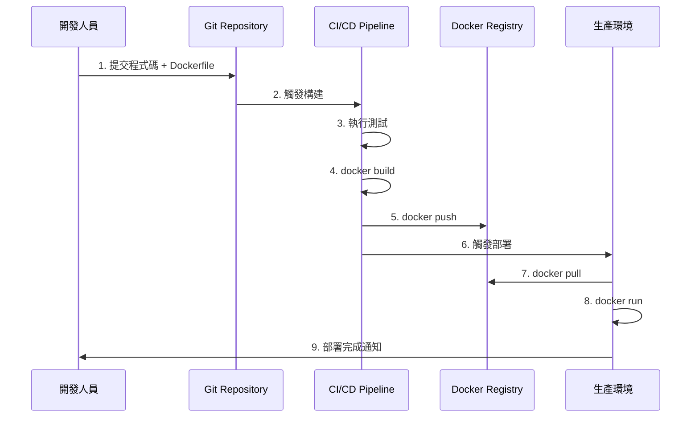

## 🎓 核心概念總結

### 重要觀念對照表

| 傳統部署概念 | Docker 對應概念 | 說明 |
|--------------|-----------------|------|
| **安裝程式** | Docker 映像 | 包含所有依賴的應用程式包 |
| **運行程式** | Docker 容器 | 映像的運行實例 |
| **軟體倉庫** | Docker Registry | 存放和分發映像的地方 |
| **環境配置** | Dockerfile | 定義如何建立映像 |
| **多機部署** | Docker Compose | 定義和運行多容器應用 |
| **叢集管理** | Kubernetes | 容器編排平台 |

### Docker 與傳統虛擬化對比

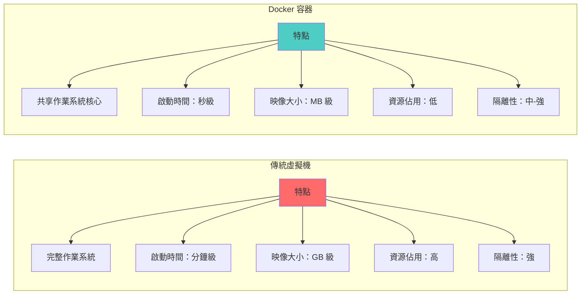

### Docker 優勢總結

| 優勢類別 | 具體優勢 |
|----------|----------|
| **開發效率** | 快速搭建開發環境、環境一致性、易於複製 |
| **部署效率** | 秒級啟動、快速回滾、版本控制 |
| **資源效率** | 輕量級、高密度部署、共享資源 |
| **可移植性** | 一次建立、到處運行、跨平台支援 |
| **可維護性** | Infrastructure as Code、版本管理、易於追蹤 |
| **可擴展性** | 水平擴展、微服務架構、負載均衡 |

## 🔍 常見問題解答

### Q1: Docker 和虛擬機有什麼區別？

**答：** 主要區別在於虛擬化層級：

| 面向 | 虛擬機 | Docker |
|------|--------|--------|
| **虛擬化類型** | 硬體虛擬化 | 作業系統虛擬化 |
| **Guest OS** | 需要 | 不需要 |
| **啟動速度** | 慢（分鐘） | 快（秒） |
| **資源佔用** | 高 | 低 |
| **隔離級別** | 完全隔離 | 進程級隔離 |

### Q2: 容器是否會影響安全性？

**答：** 容器提供進程級隔離，安全性考量：

**優勢：**
- 隔離應用程式環境
- 最小權限原則
- 映像掃描可檢測漏洞

**注意事項：**
- 共享 OS 核心，理論上存在逃逸風險
- 需要正確配置權限和網路
- 使用官方或可信的映像
- 定期更新映像和主機系統

### Q3: 所有應用都適合容器化嗎？

**答：** 大多數應用適合，但也有例外：

**適合容器化：**
- 無狀態應用
- 微服務架構
- Web 應用程式
- API 服務
- 批次處理工作

**不太適合：**
- 需要直接硬體存取（GPU 密集，特殊外設）
- 高度依賴 OS 底層功能
- 桌面 GUI 應用（可以但複雜）
- 需要持久化大量資料且效能敏感

### Q4: Docker 映像太大怎麼辦？

**答：** 可以透過以下方式優化：

1. 使用更小的基礎映像（alpine）
2. 多階段建立（multi-stage build）
3. 清理不必要的檔案
4. 合併 RUN 指令減少層數
5. 使用 .dockerignore 排除檔案

### Q5: 容器資料會遺失嗎？

**答：** 需要理解容器的特性：

**預設行為：**
- 容器刪除後，容器內的資料會遺失
- 容器重啟時，資料保留

**持久化方案：**
- 使用 Docker Volume（推薦）
- 使用 Bind Mount
- 掛載外部儲存（NFS, S3 等）

## 🎯 學習建議

### 學習路徑

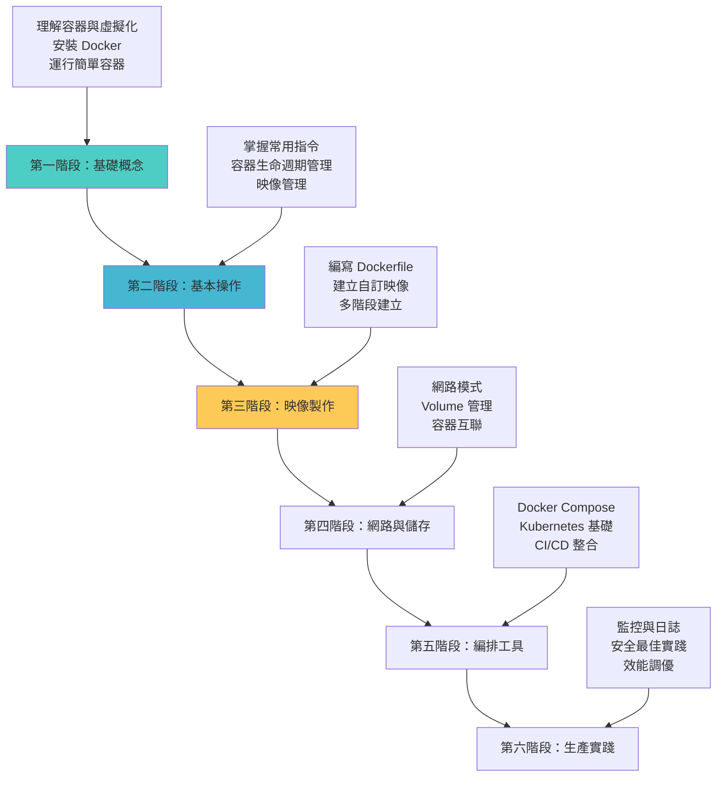

### 下一步學習方向

**第二篇預告：Docker 指令與實務操作**
- 完整的 Docker CLI 指令
- 容器操作詳解
- 映像管理技巧
- 實用範例演示
- 故障排除技巧

**第三篇預告：Docker 進階應用**
- Dockerfile 最佳實踐
- 多階段建立
- Docker Compose
- 網路進階配置
- 安全性與效能優化

## 📚 延伸閱讀資源

### 官方文件
- [Docker 官方文件](https://docs.docker.com/)
- [Docker Hub](https://hub.docker.com/)
- [Docker 部落格](https://www.docker.com/blog/)

### 推薦學習資源
- Docker 官方教學課程
- Play with Docker（線上實驗環境）
- Docker 認證考試準備

### 社群資源
- Docker Community Forums
- Stack Overflow Docker 標籤
- GitHub Docker 官方倉庫

## 🎉 總結

本文介紹了 Docker 的基礎概念，包括：

### 核心要點
1. **Docker 是什麼**：輕量級容器化平台，實現應用程式與環境的打包
2. **核心概念**：映像（Image）、容器（Container）、倉庫（Registry）
3. **架構組成**：客戶端、守護進程、容器運行時
4. **安裝配置**：多平台安裝方式與配置選項
5. **實際操作**：第一個容器的運行與管理

### 關鍵優勢
- **環境一致性**：開發、測試、生產環境完全一致
- **快速部署**：秒級啟動，快速擴展
- **資源效率**：輕量級，高密度部署
- **可移植性**：一次建立，到處運行

### 後續內容
在接下來的系列文章中，我們將深入探討：
- Docker 指令的實務應用
- Dockerfile 的編寫技巧
- 網路與儲存的進階配置
- Docker Compose 多容器編排
- 生產環境的最佳實踐

Docker 容器化技術正在改變軟體開發和部署的方式，掌握 Docker 將為您的技術棧增添強大的工具。讓我們在下一篇文章中繼續深入學習 Docker 的實務操作！
