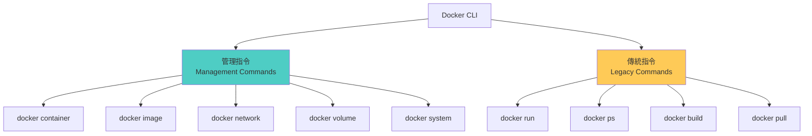
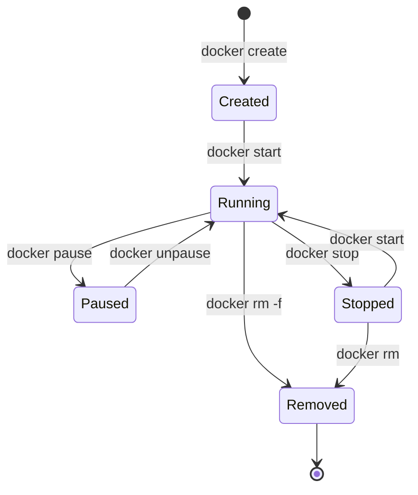
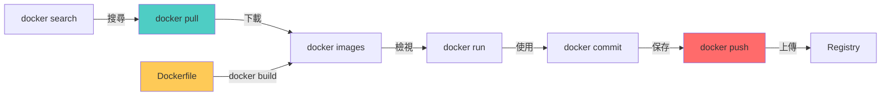
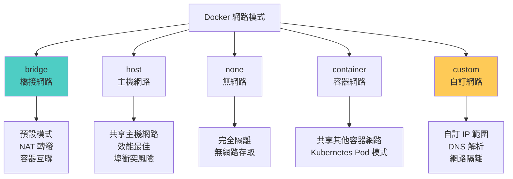
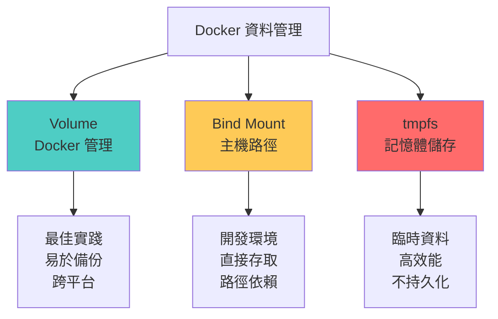

## 🎯 前言

在上一篇文章中，我們了解了 Docker 的基礎概念與架構。本文將深入探討 Docker 指令的實務應用，從基礎操作到進階技巧，幫助你全面掌握 Docker CLI 的使用。

**本文重點：**
- Docker 指令體系與結構
- 容器生命週期管理
- 映像操作與管理
- 網路與儲存配置
- 實用技巧與最佳實踐

## 📋 Docker 指令體系

### Docker CLI 結構



### 指令格式對照

| 傳統指令 | 新版管理指令 | 說明 |
|----------|--------------|------|
| `docker ps` | `docker container ls` | 列出容器 |
| `docker images` | `docker image ls` | 列出映像 |
| `docker rm` | `docker container rm` | 刪除容器 |
| `docker rmi` | `docker image rm` | 刪除映像 |
| `docker inspect` | `docker container inspect` | 查看容器詳情 |

**建議：** 新專案使用管理指令格式，更清晰且易於理解。

## 🔧 容器管理指令

### 容器生命週期操作



### 1. docker run - 創建並運行容器

**基本語法：**
```bash
docker run [OPTIONS] IMAGE [COMMAND] [ARG...]
```

**常用選項對照表：**

| 選項 | 簡寫 | 說明 | 範例 |
|------|------|------|------|
| `--detach` | `-d` | 背景運行 | `docker run -d nginx` |
| `--interactive` | `-i` | 保持 STDIN 開啟 | `docker run -i ubuntu` |
| `--tty` | `-t` | 分配終端機 | `docker run -it ubuntu bash` |
| `--name` | | 指定容器名稱 | `docker run --name web nginx` |
| `--publish` | `-p` | 埠映射 | `docker run -p 8080:80 nginx` |
| `--volume` | `-v` | 掛載資料卷 | `docker run -v /data:/app/data nginx` |
| `--env` | `-e` | 設定環境變數 | `docker run -e ENV=prod nginx` |
| `--rm` | | 停止後自動刪除 | `docker run --rm nginx` |
| `--restart` | | 重啟策略 | `docker run --restart=always nginx` |
| `--memory` | `-m` | 記憶體限制 | `docker run -m 512m nginx` |
| `--cpus` | | CPU 限制 | `docker run --cpus="1.5" nginx` |
| `--network` | | 指定網路 | `docker run --network=my-net nginx` |

**實用範例：**

```bash
# 1. 運行簡單的 web 伺服器
docker run -d -p 80:80 --name my-nginx nginx:latest

# 2. 運行互動式容器
docker run -it --rm ubuntu:20.04 bash

# 3. 運行帶環境變數的容器
docker run -d \
  --name my-app \
  -e DATABASE_URL=postgres://db:5432 \
  -e DEBUG=true \
  -p 3000:3000 \
  my-app:latest

# 4. 掛載資料卷運行容器
docker run -d \
  --name mysql-db \
  -e MYSQL_ROOT_PASSWORD=secret \
  -v mysql-data:/var/lib/mysql \
  -p 3306:3306 \
  mysql:8.0

# 5. 設定資源限制
docker run -d \
  --name resource-limited \
  --memory="512m" \
  --cpus="1.0" \
  --restart=unless-stopped \
  nginx:alpine

# 6. 運行臨時測試容器
docker run --rm -it \
  -v $(pwd):/workspace \
  -w /workspace \
  node:18 \
  npm test
```

### 2. docker ps - 列出容器

```bash
# 列出運行中的容器
docker ps

# 列出所有容器（包含已停止）
docker ps -a

# 只顯示容器 ID
docker ps -q

# 自訂輸出格式
docker ps --format "table {{.ID}}\t{{.Names}}\t{{.Status}}\t{{.Ports}}"

# 過濾特定狀態的容器
docker ps --filter "status=running"
docker ps --filter "status=exited"

# 顯示最近創建的 N 個容器
docker ps -n 5

# 顯示容器大小
docker ps -s
```

**輸出欄位說明：**

| 欄位 | 說明 |
|------|------|
| **CONTAINER ID** | 容器唯一識別碼（短格式） |
| **IMAGE** | 使用的映像 |
| **COMMAND** | 容器啟動時執行的指令 |
| **CREATED** | 創建時間 |
| **STATUS** | 當前狀態（Up, Exited, Paused 等） |
| **PORTS** | 埠映射資訊 |
| **NAMES** | 容器名稱 |

### 3. docker start/stop/restart - 容器狀態控制

```bash
# 啟動容器
docker start container-name

# 停止容器（優雅停止，預設等待 10 秒）
docker stop container-name

# 立即停止容器
docker kill container-name

# 重啟容器
docker restart container-name

# 批次操作多個容器
docker start container1 container2 container3
docker stop $(docker ps -q)  # 停止所有運行中的容器

# 停止所有容器
docker stop $(docker ps -aq)

# 設定停止等待時間
docker stop -t 30 container-name  # 等待 30 秒後強制停止
```

**停止策略對照：**

| 指令 | 信號 | 等待時間 | 使用時機 |
|------|------|----------|----------|
| **docker stop** | SIGTERM → SIGKILL | 10 秒（可調整） | 正常停止容器 |
| **docker kill** | SIGKILL | 立即 | 強制終止容器 |
| **docker pause** | 暫停 | N/A | 臨時暫停容器 |

### 4. docker exec - 在運行中的容器執行指令

```bash
# 在容器中執行指令
docker exec container-name command

# 進入容器的互動式 shell
docker exec -it container-name bash
docker exec -it container-name sh  # Alpine 容器使用 sh

# 以特定使用者執行
docker exec -u root container-name whoami

# 設定工作目錄
docker exec -w /app container-name ls -la

# 執行多個指令
docker exec container-name sh -c "cd /app && npm install"

# 實用範例
docker exec my-nginx nginx -t  # 測試 Nginx 配置
docker exec my-mysql mysqldump -u root -p database > backup.sql
docker exec my-redis redis-cli INFO
```

**exec vs attach 差異：**

| 特性 | docker exec | docker attach |
|------|-------------|---------------|
| **用途** | 執行新進程 | 連接到主進程 |
| **退出影響** | 不影響容器 | 可能停止容器 |
| **互動性** | 可設定 | 繼承原進程 |
| **使用場景** | 調試、維護 | 查看輸出 |

### 5. docker logs - 查看容器日誌

```bash
# 查看容器日誌
docker logs container-name

# 實時跟蹤日誌（類似 tail -f）
docker logs -f container-name

# 顯示最後 N 行日誌
docker logs --tail 100 container-name

# 顯示時間戳
docker logs -t container-name

# 查看指定時間範圍的日誌
docker logs --since 2023-01-01 container-name
docker logs --since 30m container-name  # 最近 30 分鐘
docker logs --until 2023-12-31 container-name

# 組合使用
docker logs -f --tail 50 --since 10m container-name
```

**日誌驅動類型：**

| 驅動 | 說明 | 適用場景 |
|------|------|----------|
| **json-file** | 預設，JSON 格式 | 開發、小規模部署 |
| **syslog** | 系統日誌 | 集中式日誌管理 |
| **journald** | systemd journal | systemd 環境 |
| **gelf** | Graylog Extended Log Format | Graylog、Logstash |
| **fluentd** | Fluentd 日誌收集 | 大規模日誌聚合 |
| **awslogs** | AWS CloudWatch | AWS 環境 |

### 6. docker inspect - 查看詳細資訊

```bash
# 查看容器完整資訊
docker inspect container-name

# 使用 Go 模板格式化輸出
docker inspect --format='{{.State.Status}}' container-name
docker inspect --format='{{.NetworkSettings.IPAddress}}' container-name
docker inspect --format='{{range .NetworkSettings.Networks}}{{.IPAddress}}{{end}}' container-name

# 查看特定欄位
docker inspect --format='{{json .Config.Env}}' container-name | jq
docker inspect --format='{{.Mounts}}' container-name
docker inspect --format='{{.HostConfig.RestartPolicy}}' container-name

# 實用查詢範例
# 獲取容器 IP 位址
docker inspect -f '{{.NetworkSettings.IPAddress}}' container-name

# 獲取掛載點
docker inspect -f '{{json .Mounts}}' container-name | jq

# 獲取環境變數
docker inspect -f '{{json .Config.Env}}' container-name | jq

# 獲取埠映射
docker inspect -f '{{json .NetworkSettings.Ports}}' container-name | jq
```

### 7. docker rm - 刪除容器

```bash
# 刪除已停止的容器
docker rm container-name

# 強制刪除運行中的容器
docker rm -f container-name

# 刪除多個容器
docker rm container1 container2 container3

# 刪除所有已停止的容器
docker rm $(docker ps -aq -f status=exited)

# 使用 container prune 清理（推薦）
docker container prune

# 刪除所有容器（危險操作！）
docker rm -f $(docker ps -aq)

# 刪除容器並移除關聯的資料卷
docker rm -v container-name
```

### 容器管理實用指令組合

```bash
# 查看容器資源使用情況
docker stats

# 查看特定容器的統計資訊
docker stats container-name

# 不持續更新，只顯示一次
docker stats --no-stream

# 查看容器內運行的進程
docker top container-name

# 複製檔案（容器 ↔ 主機）
docker cp container-name:/path/to/file ./local/path
docker cp ./local/file container-name:/path/to/destination

# 查看容器變更的檔案
docker diff container-name

# 將容器提交為新映像
docker commit container-name new-image-name:tag

# 匯出容器為 tar 檔案
docker export container-name > container.tar

# 從 tar 檔案匯入為映像
cat container.tar | docker import - imported-image:tag
```

## 🖼️ 映像管理指令

### 映像操作流程



### 1. docker images - 列出映像

```bash
# 列出所有映像
docker images

# 列出特定倉庫的映像
docker images nginx

# 只顯示映像 ID
docker images -q

# 顯示懸掛映像（dangling images）
docker images -f "dangling=true"

# 格式化輸出
docker images --format "table {{.Repository}}\t{{.Tag}}\t{{.Size}}"

# 顯示映像摘要（digest）
docker images --digests

# 顯示所有映像（包含中間層）
docker images -a
```

**輸出欄位說明：**

| 欄位 | 說明 |
|------|------|
| **REPOSITORY** | 映像倉庫名稱 |
| **TAG** | 映像標籤（版本） |
| **IMAGE ID** | 映像唯一識別碼 |
| **CREATED** | 創建時間 |
| **SIZE** | 映像大小 |

### 2. docker pull - 下載映像

```bash
# 下載最新版本映像
docker pull nginx

# 下載特定版本
docker pull nginx:1.21.0

# 下載特定平台的映像
docker pull --platform linux/amd64 nginx
docker pull --platform linux/arm64 nginx

# 從私有 Registry 下載
docker pull myregistry.com:5000/myimage:tag

# 下載所有標籤
docker pull -a nginx  # 小心！可能很大

# 使用摘要下載（確保完整性）
docker pull nginx@sha256:abc123...
```

**映像命名規範：**

```
[registry-host[:port]/][namespace/]repository[:tag][@digest]

範例：
- nginx                           # Docker Hub 官方映像
- nginx:latest                    # 指定標籤
- ubuntu:20.04                    # Ubuntu 20.04 版本
- mycompany/myapp:v1.0           # 私有倉庫
- gcr.io/google-samples/hello-app:1.0  # Google Container Registry
- nginx@sha256:abc123...         # 使用摘要
```

### 3. docker build - 建立映像

```bash
# 從 Dockerfile 建立映像
docker build -t myimage:tag .

# 指定 Dockerfile 位置
docker build -t myimage:tag -f Dockerfile.prod .

# 不使用快取
docker build --no-cache -t myimage:tag .

# 設定建立參數
docker build --build-arg VERSION=1.0 -t myimage:tag .

# 多平台建立
docker buildx build --platform linux/amd64,linux/arm64 -t myimage:tag .

# 設定目標階段（多階段建立）
docker build --target production -t myimage:tag .

# 標記多個標籤
docker build -t myimage:latest -t myimage:v1.0 -t myimage:stable .

# 實用範例
# 建立並添加多個標籤
docker build \
  -t myapp:latest \
  -t myapp:v1.0.0 \
  -t myregistry.com/myapp:latest \
  --build-arg NODE_ENV=production \
  --label "version=1.0.0" \
  --label "description=My Application" \
  .
```

**常用建立選項：**

| 選項 | 說明 | 範例 |
|------|------|------|
| `-t, --tag` | 指定映像名稱和標籤 | `-t app:v1` |
| `-f, --file` | 指定 Dockerfile | `-f Dockerfile.prod` |
| `--build-arg` | 設定建立時變數 | `--build-arg VERSION=1.0` |
| `--no-cache` | 不使用快取 | `--no-cache` |
| `--target` | 多階段建立目標 | `--target production` |
| `--platform` | 目標平台 | `--platform linux/amd64` |
| `--label` | 添加元資料標籤 | `--label version=1.0` |

### 4. docker tag - 標記映像

```bash
# 為映像添加新標籤
docker tag source-image:tag target-image:tag

# 標記為 latest
docker tag myapp:v1.0 myapp:latest

# 標記到私有 Registry
docker tag myapp:v1.0 myregistry.com:5000/myapp:v1.0

# 多個標籤範例
docker tag nginx:latest nginx:stable
docker tag nginx:latest nginx:production
docker tag nginx:latest myregistry.com/nginx:latest
```

### 5. docker push - 上傳映像

```bash
# 推送映像到 Docker Hub
docker push username/myimage:tag

# 推送到私有 Registry
docker push myregistry.com:5000/myimage:tag

# 推送所有標籤
docker push -a username/myimage

# 完整工作流程範例
# 1. 登入 Registry
docker login
# 或登入私有 Registry
docker login myregistry.com:5000

# 2. 標記映像
docker tag myapp:latest username/myapp:latest
docker tag myapp:latest username/myapp:v1.0.0

# 3. 推送映像
docker push username/myapp:latest
docker push username/myapp:v1.0.0

# 4. 登出
docker logout
```

### 6. docker rmi - 刪除映像

```bash
# 刪除映像
docker rmi image-name:tag

# 強制刪除（即使有容器使用）
docker rmi -f image-name:tag

# 刪除多個映像
docker rmi image1 image2 image3

# 刪除所有懸掛映像
docker rmi $(docker images -f "dangling=true" -q)

# 使用 image prune 清理（推薦）
docker image prune

# 刪除所有未使用的映像
docker image prune -a

# 刪除所有映像（危險！）
docker rmi $(docker images -q)
```

### 7. docker history - 查看映像歷史

```bash
# 查看映像層歷史
docker history image-name:tag

# 不截斷輸出
docker history --no-trunc image-name:tag

# 以人類可讀格式顯示大小
docker history --human image-name:tag

# 輸出範例分析
# IMAGE          CREATED        CREATED BY                                      SIZE
# abc123         2 days ago     /bin/sh -c apt-get update && apt-get install   150MB
# def456         2 days ago     /bin/sh -c #(nop) COPY file:xyz /app           50MB
# ghi789         3 days ago     /bin/sh -c #(nop) FROM ubuntu:20.04            80MB
```

### 映像管理實用技巧

```bash
# 映像大小優化檢查
docker images --format "table {{.Repository}}\t{{.Tag}}\t{{.Size}}" | sort -k3 -h

# 查找並刪除大於 1GB 的映像
docker images --format "{{.Repository}}:{{.Tag}} {{.Size}}" | \
  awk '$2 ~ /GB/ {print $1}' | \
  xargs docker rmi

# 保存映像為 tar 檔案
docker save -o myimage.tar myimage:tag
docker save myimage:tag | gzip > myimage.tar.gz

# 從 tar 檔案載入映像
docker load -i myimage.tar
docker load < myimage.tar.gz

# 映像內容檢查
docker run --rm -it myimage:tag sh
docker run --rm -it --entrypoint sh myimage:tag

# 掃描映像漏洞
docker scan myimage:tag

# 查看映像詳細資訊
docker inspect myimage:tag

# 獲取映像配置
docker inspect --format='{{json .Config}}' myimage:tag | jq
```

## 🌐 網路管理指令

### Docker 網路模式



### 網路模式對照表

| 模式 | 說明 | 使用場景 | 命令 |
|------|------|----------|------|
| **bridge** | 預設網路，NAT 模式 | 一般應用 | `--network bridge` |
| **host** | 共享主機網路棧 | 高效能需求 | `--network host` |
| **none** | 無網路 | 安全隔離 | `--network none` |
| **container** | 共享其他容器網路 | 微服務 | `--network container:name` |
| **自訂** | 使用者定義網路 | 生產環境 | `--network my-network` |

### 1. docker network ls - 列出網路

```bash
# 列出所有網路
docker network ls

# 過濾特定驅動的網路
docker network ls --filter driver=bridge

# 格式化輸出
docker network ls --format "table {{.Name}}\t{{.Driver}}\t{{.Scope}}"
```

### 2. docker network create - 創建網路

```bash
# 創建預設 bridge 網路
docker network create my-network

# 指定子網路和閘道
docker network create \
  --driver bridge \
  --subnet 172.18.0.0/16 \
  --gateway 172.18.0.1 \
  my-network

# 創建 overlay 網路（Swarm 模式）
docker network create \
  --driver overlay \
  --attachable \
  my-overlay-network

# 指定 IP 範圍
docker network create \
  --subnet 192.168.0.0/24 \
  --ip-range 192.168.0.128/25 \
  --gateway 192.168.0.1 \
  my-custom-network

# 實用範例：完整配置
docker network create \
  --driver bridge \
  --subnet 172.20.0.0/16 \
  --ip-range 172.20.240.0/20 \
  --gateway 172.20.0.1 \
  --label project=myapp \
  --label environment=production \
  app-network
```

### 3. docker network connect/disconnect - 連接網路

```bash
# 將容器連接到網路
docker network connect my-network container-name

# 指定容器在網路中的 IP
docker network connect --ip 172.18.0.10 my-network container-name

# 設定別名（DNS）
docker network connect --alias db my-network mysql-container

# 從網路斷開容器
docker network disconnect my-network container-name

# 強制斷開
docker network disconnect -f my-network container-name
```

### 4. docker network inspect - 檢查網路

```bash
# 查看網路詳細資訊
docker network inspect my-network

# 查看連接到網路的容器
docker network inspect --format='{{range .Containers}}{{.Name}} {{end}}' my-network

# 查看網路配置
docker network inspect --format='{{json .IPAM.Config}}' my-network | jq
```

### 5. docker network rm - 刪除網路

```bash
# 刪除網路
docker network rm my-network

# 刪除所有未使用的網路
docker network prune

# 強制刪除（斷開所有連接的容器）
docker network rm -f my-network
```

### 網路實用範例

```bash
# 微服務網路配置範例
# 1. 創建專用網路
docker network create \
  --driver bridge \
  --subnet 172.25.0.0/16 \
  microservices-network

# 2. 啟動服務並連接網路
docker run -d \
  --name api-service \
  --network microservices-network \
  --network-alias api \
  my-api:latest

docker run -d \
  --name database \
  --network microservices-network \
  --network-alias db \
  postgres:13

docker run -d \
  --name cache \
  --network microservices-network \
  --network-alias redis \
  redis:alpine

# 3. 容器間可以通過別名互相訪問
# api-service 可以使用 db 和 redis 作為主機名

# 多網路配置範例
# 前端網路（公開）
docker network create frontend-network

# 後端網路（私有）
docker network create backend-network

# Web 服務器（連接到前端網路）
docker run -d \
  --name nginx \
  --network frontend-network \
  -p 80:80 \
  nginx:alpine

# 應用服務器（連接到兩個網路）
docker run -d \
  --name app \
  --network frontend-network \
  my-app:latest

docker network connect backend-network app

# 資料庫（只連接到後端網路）
docker run -d \
  --name postgres \
  --network backend-network \
  postgres:13
```

## 💾 資料卷管理指令

### 資料持久化方案



### 1. docker volume ls - 列出資料卷

```bash
# 列出所有資料卷
docker volume ls

# 過濾孤立的資料卷
docker volume ls --filter dangling=true

# 格式化輸出
docker volume ls --format "table {{.Name}}\t{{.Driver}}\t{{.Mountpoint}}"
```

### 2. docker volume create - 創建資料卷

```bash
# 創建預設資料卷
docker volume create my-volume

# 指定驅動
docker volume create --driver local my-volume

# 使用標籤
docker volume create \
  --label project=myapp \
  --label environment=prod \
  my-volume

# 創建 NFS 資料卷
docker volume create \
  --driver local \
  --opt type=nfs \
  --opt o=addr=192.168.1.100,rw \
  --opt device=:/path/to/dir \
  nfs-volume
```

### 3. docker volume inspect - 檢查資料卷

```bash
# 查看資料卷詳細資訊
docker volume inspect my-volume

# 獲取掛載點
docker volume inspect --format='{{.Mountpoint}}' my-volume

# 查看資料卷選項
docker volume inspect --format='{{json .Options}}' my-volume | jq
```

### 4. docker volume rm - 刪除資料卷

```bash
# 刪除資料卷
docker volume rm my-volume

# 刪除多個資料卷
docker volume rm volume1 volume2 volume3

# 刪除所有未使用的資料卷
docker volume prune

# 強制刪除（不提示確認）
docker volume prune -f
```

### 資料卷使用範例

```bash
# 1. 資料庫資料持久化
docker run -d \
  --name postgres \
  -e POSTGRES_PASSWORD=secret \
  -v postgres-data:/var/lib/postgresql/data \
  postgres:13

# 2. Bind Mount 開發環境
docker run -d \
  --name dev-app \
  -v $(pwd)/src:/app/src \
  -v $(pwd)/config:/app/config:ro \
  -p 3000:3000 \
  node:18

# 3. 多個資料卷
docker run -d \
  --name web-app \
  -v app-data:/app/data \
  -v app-logs:/app/logs \
  -v app-config:/app/config:ro \
  my-app:latest

# 4. 資料卷備份
docker run --rm \
  -v my-volume:/source:ro \
  -v $(pwd):/backup \
  ubuntu \
  tar czf /backup/backup-$(date +%Y%m%d).tar.gz -C /source .

# 5. 資料卷還原
docker run --rm \
  -v my-volume:/target \
  -v $(pwd):/backup:ro \
  ubuntu \
  tar xzf /backup/backup-20231201.tar.gz -C /target

# 6. 資料卷複製
docker run --rm \
  -v source-volume:/source:ro \
  -v target-volume:/target \
  ubuntu \
  cp -av /source/. /target/
```

## 🔄 系統管理指令

### 1. docker info - 系統資訊

```bash
# 顯示 Docker 系統資訊
docker info

# 格式化輸出特定資訊
docker info --format '{{.ServerVersion}}'
docker info --format '{{json .}}' | jq
```

### 2. docker system df - 磁碟使用情況

```bash
# 顯示磁碟使用情況
docker system df

# 詳細資訊
docker system df -v

# 輸出範例：
# TYPE            TOTAL     ACTIVE    SIZE      RECLAIMABLE
# Images          10        5         2.5GB     1.2GB (48%)
# Containers      20        3         500MB     400MB (80%)
# Local Volumes   15        10        5GB       2GB (40%)
# Build Cache     50        0         3GB       3GB (100%)
```

### 3. docker system prune - 清理系統

```bash
# 清理所有未使用的資源
docker system prune

# 包含停止的容器
docker system prune -a

# 同時清理資料卷
docker system prune --volumes

# 不提示確認
docker system prune -af

# 清理特定時間前的資源
docker system prune --filter "until=24h"
docker system prune --filter "until=2023-01-01"

# 分別清理各類資源
docker container prune  # 清理容器
docker image prune      # 清理映像
docker network prune    # 清理網路
docker volume prune     # 清理資料卷
```

**清理策略對照表：**

| 指令 | 清理內容 | 安全性 |
|------|----------|--------|
| `docker container prune` | 已停止的容器 | 安全 |
| `docker image prune` | 懸掛映像 | 安全 |
| `docker image prune -a` | 未使用的映像 | 需謹慎 |
| `docker network prune` | 未使用的網路 | 安全 |
| `docker volume prune` | 未使用的資料卷 | **危險** |
| `docker system prune` | 所有未使用資源（不含 volume） | 需謹慎 |
| `docker system prune -a --volumes` | 所有未使用資源 | **危險** |

### 4. docker events - 監控事件

```bash
# 實時監控 Docker 事件
docker events

# 過濾特定類型的事件
docker events --filter type=container
docker events --filter type=image
docker events --filter type=network

# 過濾特定容器的事件
docker events --filter container=my-container

# 過濾特定事件
docker events --filter event=start
docker events --filter event=die

# 指定時間範圍
docker events --since '2023-12-01'
docker events --until '2023-12-31'

# 格式化輸出
docker events --format '{{json .}}'
```

### 5. docker stats - 資源使用統計

```bash
# 實時顯示容器資源使用
docker stats

# 顯示特定容器
docker stats container1 container2

# 不持續更新
docker stats --no-stream

# 不截斷容器 ID
docker stats --no-trunc

# 格式化輸出
docker stats --format "table {{.Container}}\t{{.CPUPerc}}\t{{.MemUsage}}"
```

**stats 輸出欄位說明：**

| 欄位 | 說明 |
|------|------|
| **CONTAINER ID** | 容器 ID |
| **NAME** | 容器名稱 |
| **CPU %** | CPU 使用百分比 |
| **MEM USAGE / LIMIT** | 記憶體使用量 / 限制 |
| **MEM %** | 記憶體使用百分比 |
| **NET I/O** | 網路輸入/輸出 |
| **BLOCK I/O** | 磁碟輸入/輸出 |
| **PIDS** | 進程數量 |

## 🎯 Docker Compose 基礎指令

Docker Compose 是定義和運行多容器應用的工具。

### 基本指令對照表

| 指令 | 說明 | 範例 |
|------|------|------|
| `docker-compose up` | 啟動服務 | `docker-compose up -d` |
| `docker-compose down` | 停止並刪除服務 | `docker-compose down` |
| `docker-compose ps` | 列出服務 | `docker-compose ps` |
| `docker-compose logs` | 查看日誌 | `docker-compose logs -f` |
| `docker-compose exec` | 在服務中執行指令 | `docker-compose exec web bash` |
| `docker-compose build` | 建立映像 | `docker-compose build` |
| `docker-compose pull` | 拉取映像 | `docker-compose pull` |
| `docker-compose restart` | 重啟服務 | `docker-compose restart` |
| `docker-compose stop` | 停止服務 | `docker-compose stop` |
| `docker-compose start` | 啟動服務 | `docker-compose start` |

### 常用 Compose 操作

```bash
# 啟動所有服務（背景運行）
docker-compose up -d

# 啟動特定服務
docker-compose up -d web database

# 重新建立並啟動
docker-compose up -d --build

# 擴展服務（運行多個實例）
docker-compose up -d --scale web=3

# 查看服務狀態
docker-compose ps

# 查看服務日誌
docker-compose logs -f
docker-compose logs -f web  # 特定服務

# 執行一次性指令
docker-compose run web python manage.py migrate

# 進入服務容器
docker-compose exec web bash

# 停止所有服務
docker-compose stop

# 停止並刪除容器（保留資料卷）
docker-compose down

# 刪除所有資源（包含資料卷）
docker-compose down -v

# 查看配置
docker-compose config

# 驗證配置檔
docker-compose config --quiet
```

## 🛠️ 進階實用技巧

### 1. 批次操作範例

```bash
# 停止所有容器
docker stop $(docker ps -aq)

# 刪除所有容器
docker rm $(docker ps -aq)

# 刪除所有映像
docker rmi $(docker images -q)

# 刪除所有懸掛映像
docker rmi $(docker images -f "dangling=true" -q)

# 刪除特定名稱模式的容器
docker rm $(docker ps -a | grep "test-" | awk '{print $1}')

# 停止並刪除所有以 "dev-" 開頭的容器
docker ps -a --filter "name=dev-" --format "{{.ID}}" | xargs docker rm -f
```

### 2. 容器調試技巧

```bash
# 查看容器進程
docker top container-name

# 查看容器詳細資訊
docker inspect container-name | jq

# 進入容器排查問題
docker exec -it container-name bash

# 查看容器檔案變更
docker diff container-name

# 實時查看日誌
docker logs -f --tail 100 container-name

# 複製檔案出來分析
docker cp container-name:/path/to/file ./local-file

# 查看容器資源使用
docker stats container-name --no-stream
```

### 3. 映像優化檢查

```bash
# 分析映像層
docker history --no-trunc image-name:tag

# 檢查映像大小
docker images --format "table {{.Repository}}\t{{.Tag}}\t{{.Size}}" | \
  sort -k3 -h

# 掃描安全漏洞
docker scan image-name:tag

# 導出映像結構
docker save image-name:tag -o image.tar
tar -xvf image.tar
```

### 4. 效能監控

```bash
# 持續監控所有容器資源
docker stats

# 監控特定容器
watch -n 1 "docker stats --no-stream container-name"

# 容器事件監控
docker events --filter type=container

# 系統資源概覽
docker system df -v

# 詳細的容器資訊
docker inspect container-name | jq '.State, .HostConfig.Resources'
```

### 5. 實用別名設定

```bash
# 添加到 ~/.bashrc 或 ~/.zshrc

# Docker 快捷指令
alias d='docker'
alias dc='docker-compose'
alias dps='docker ps'
alias dpsa='docker ps -a'
alias di='docker images'
alias dex='docker exec -it'
alias dlog='docker logs -f'
alias dstop='docker stop $(docker ps -aq)'
alias drm='docker rm $(docker ps -aq)'
alias drmi='docker rmi $(docker images -q)'
alias dprune='docker system prune -af --volumes'

# Docker Compose 快捷指令
alias dcup='docker-compose up -d'
alias dcdown='docker-compose down'
alias dclog='docker-compose logs -f'
alias dcps='docker-compose ps'
alias dcbuild='docker-compose up -d --build'
```

## 📊 指令速查表

### 容器操作

| 操作 | 指令 |
|------|------|
| 運行容器 | `docker run -d --name NAME IMAGE` |
| 列出容器 | `docker ps` / `docker ps -a` |
| 停止容器 | `docker stop NAME` |
| 啟動容器 | `docker start NAME` |
| 重啟容器 | `docker restart NAME` |
| 刪除容器 | `docker rm NAME` |
| 進入容器 | `docker exec -it NAME bash` |
| 查看日誌 | `docker logs -f NAME` |
| 查看詳情 | `docker inspect NAME` |
| 複製檔案 | `docker cp NAME:/path ./path` |

### 映像操作

| 操作 | 指令 |
|------|------|
| 列出映像 | `docker images` |
| 搜尋映像 | `docker search IMAGE` |
| 下載映像 | `docker pull IMAGE:TAG` |
| 建立映像 | `docker build -t NAME:TAG .` |
| 標記映像 | `docker tag SOURCE TARGET` |
| 推送映像 | `docker push NAME:TAG` |
| 刪除映像 | `docker rmi IMAGE` |
| 查看歷史 | `docker history IMAGE` |
| 保存映像 | `docker save IMAGE > file.tar` |
| 載入映像 | `docker load < file.tar` |

### 網路操作

| 操作 | 指令 |
|------|------|
| 列出網路 | `docker network ls` |
| 創建網路 | `docker network create NAME` |
| 連接網路 | `docker network connect NET CONTAINER` |
| 斷開網路 | `docker network disconnect NET CONTAINER` |
| 查看詳情 | `docker network inspect NAME` |
| 刪除網路 | `docker network rm NAME` |

### 資料卷操作

| 操作 | 指令 |
|------|------|
| 列出資料卷 | `docker volume ls` |
| 創建資料卷 | `docker volume create NAME` |
| 查看詳情 | `docker volume inspect NAME` |
| 刪除資料卷 | `docker volume rm NAME` |
| 清理資料卷 | `docker volume prune` |

## 🎓 總結

本文詳細介紹了 Docker CLI 的各項指令，包括：

### 核心內容回顧

1. **容器管理**
   - 運行、停止、刪除容器
   - 日誌查看與調試
   - 資源監控與限制

2. **映像管理**
   - 搜尋、下載、建立映像
   - 映像標記與推送
   - 映像優化與清理

3. **網路管理**
   - 網路模式選擇
   - 自訂網路創建
   - 容器網路連接

4. **資料卷管理**
   - Volume 與 Bind Mount
   - 資料持久化策略
   - 備份與還原

5. **系統維護**
   - 資源清理
   - 效能監控
   - 故障排查

### 最佳實踐建議

- 使用管理指令（`docker container`, `docker image` 等）提高可讀性
- 為容器和映像使用有意義的命名
- 定期清理未使用的資源
- 使用 Volume 進行資料持久化
- 生產環境使用自訂網路
- 設定資源限制避免單一容器佔用過多資源

### 下一步

在第三篇文章中，我們將探討：
- Dockerfile 最佳實踐與優化
- 多階段建立詳解
- Docker Compose 進階應用
- 容器安全性配置
- 生產環境部署策略
- CI/CD 整合實踐

掌握這些 Docker 指令，您將能夠高效地管理容器化應用，為進階學習打下堅實的基礎！
