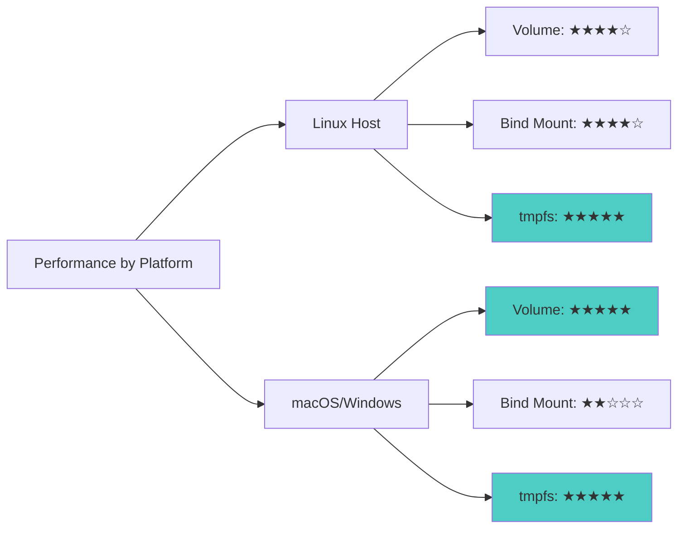
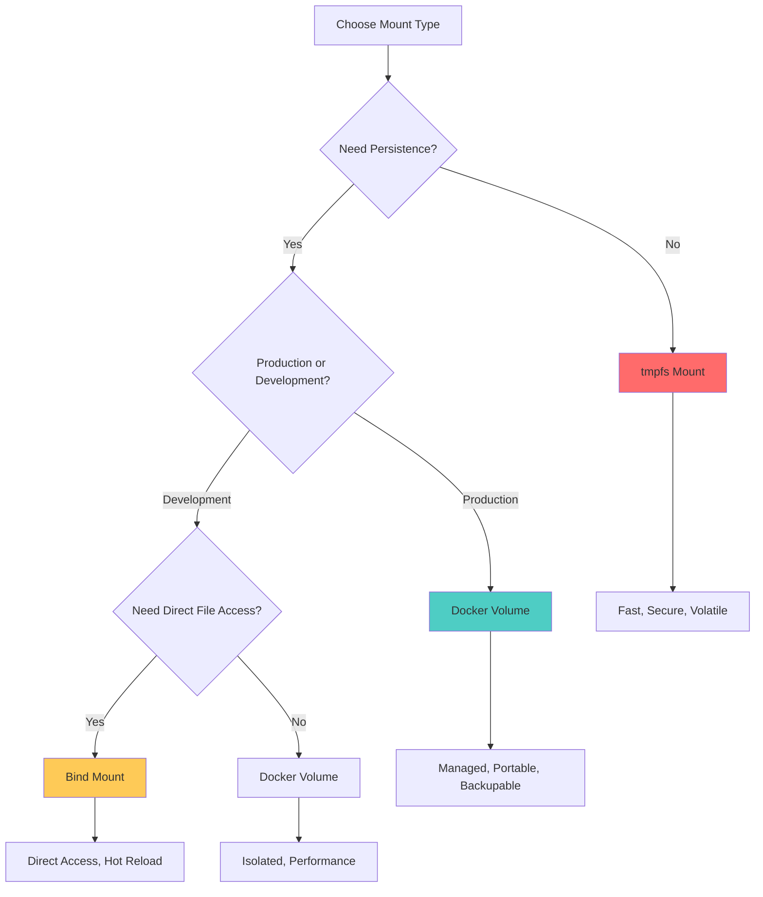

## Introduction

When working with Docker containers, understanding how to properly manage data persistence is crucial. Docker provides three main approaches for mounting data into containers: **Volumes**, **Bind Mounts**, and **tmpfs mounts**. Each has distinct characteristics, use cases, and trade-offs.

This comprehensive guide explores all Docker mount types, their differences, practical examples, and best practices to help you choose the right approach for your specific needs.

## What is Mounting in Docker?

**Mounting** in Docker refers to the process of making host filesystem directories or Docker-managed storage available inside containers. This allows containers to:

- Access host files and directories
- Persist data beyond container lifecycle
- Share data between multiple containers
- Exchange configuration files, logs, and application code

```mermaid
graph TD
    A[Docker Mount Types] --> B[Volumes]
    A --> C[Bind Mounts]
    A --> D[tmpfs Mounts]

    B --> B1[Docker-managed storage]
    B --> B2[/var/lib/docker/volumes]
    B --> B3[Production data persistence]

    C --> C1[Direct host path mapping]
    C --> C2[Development & code sync]
    C --> C3[Configuration files]

    D --> D1[In-memory storage]
    D --> D2[Temporary data]
    D --> D3[Sensitive information]

    style B fill:#4ecdc4
    style C fill:#feca57
    style D fill:#ff6b6b
```

## Three Types of Docker Mounts

### Quick Comparison Table

| Feature | Docker Volume | Bind Mount | tmpfs Mount |
|---------|--------------|------------|-------------|
| **Management** | Docker-managed | User-managed | Docker-managed |
| **Storage Location** | /var/lib/docker/volumes | Anywhere on host | Memory (RAM) |
| **Portability** | High | Low | N/A |
| **Performance** | Good | Good | Excellent |
| **Persistence** | Yes | Yes | No (volatile) |
| **Best For** | Production data | Development | Temporary data |
| **Can Share Between Containers** | Yes | Yes | No |
| **Backup/Migration** | Easy | Manual | N/A |
| **Host Path Dependency** | No | Yes | No |

## 1. Docker Volumes (Recommended for Production)

### What Are Docker Volumes?

Docker Volumes are the **preferred mechanism** for persisting data. They are completely managed by Docker and stored in a dedicated location on the host.

```mermaid
graph LR
    subgraph "Host System"
        V[/var/lib/docker/volumes]
        V1[my-vol/]
        V2[db-data/]
        V --> V1
        V --> V2
    end

    subgraph "Container 1"
        C1[/app/data]
    end

    subgraph "Container 2"
        C2[/var/lib/mysql]
    end

    V1 --> C1
    V2 --> C2

    style V fill:#4ecdc4
    style V1 fill:#a8e6cf
    style V2 fill:#a8e6cf
```

### Characteristics

- **Managed by Docker**: Docker handles all lifecycle operations
- **Named or Anonymous**: Can be explicitly named or auto-generated
- **Shared Access**: Multiple containers can mount the same volume
- **Volume Drivers**: Support for cloud storage, network storage, etc.
- **Isolated from Host**: No direct dependency on host directory structure

### Basic Volume Commands

```bash
# Create a named volume
docker volume create my-volume

# List all volumes
docker volume ls

# Inspect volume details
docker volume inspect my-volume

# Remove a volume
docker volume rm my-volume

# Remove all unused volumes
docker volume prune
```

### Using Volumes in Containers

**1. Short Syntax (-v flag)**

```bash
# Named volume
docker run -v my-volume:/app/data nginx:latest

# Anonymous volume (auto-generated name)
docker run -v /app/data nginx:latest

# Multiple volumes
docker run \
  -v db-data:/var/lib/mysql \
  -v config-data:/etc/mysql/conf.d \
  mysql:8.0
```

**2. Long Syntax (--mount flag) - Recommended**

```bash
docker run \
  --mount type=volume,source=my-volume,target=/app/data \
  nginx:latest

# With additional options
docker run \
  --mount type=volume,source=my-volume,target=/app/data,readonly \
  nginx:latest
```

### Docker Compose Example

```yaml
version: '3.8'

services:
  app:
    image: node:18
    volumes:
      # Named volume
      - app-data:/app/data
      - app-logs:/app/logs
    environment:
      - NODE_ENV=production

  database:
    image: postgres:15
    volumes:
      # Named volume for database persistence
      - postgres-data:/var/lib/postgresql/data
      # Named volume for initialization scripts
      - postgres-init:/docker-entrypoint-initdb.d
    environment:
      - POSTGRES_PASSWORD=secret

# Volume definitions
volumes:
  app-data:
    driver: local
  app-logs:
    driver: local
  postgres-data:
    driver: local
  postgres-init:
    driver: local
```

### Advanced Volume Features

**1. Volume Drivers**

```bash
# Use NFS volume driver
docker volume create \
  --driver local \
  --opt type=nfs \
  --opt o=addr=192.168.1.100,rw \
  --opt device=:/path/to/dir \
  nfs-volume

# Use AWS EFS driver (requires plugin)
docker volume create \
  --driver rexray/efs \
  --name efs-volume

# Azure File Storage
docker volume create \
  --driver azure_file \
  --name azure-volume \
  -o share=myshare
```

**2. Volume with Specific Permissions**

```bash
# Create volume with specific user/group
docker volume create \
  --opt type=tmpfs \
  --opt device=tmpfs \
  --opt o=uid=1000,gid=1000 \
  my-volume
```

**3. Read-Only Volumes**

```bash
# Mount volume as read-only
docker run \
  -v my-volume:/app/data:ro \
  nginx:latest

# Or with --mount
docker run \
  --mount type=volume,source=my-volume,target=/app/data,readonly \
  nginx:latest
```

### Pros and Cons

#### Pros

- **Easy to backup and migrate**: Can be backed up using `docker cp` or volume plugins
- **Cross-platform**: Works on Linux, Windows, and macOS
- **Managed lifecycle**: Docker handles creation and cleanup
- **Better performance on Docker Desktop**: Optimized for macOS and Windows
- **Volume drivers**: Can store volumes on remote hosts or cloud providers
- **Safe sharing**: Multiple containers can safely share volumes
- **Pre-populated content**: New volumes can be pre-filled from container content

#### Cons

- **Less direct access**: Cannot directly edit files from host without container
- **Abstracted location**: Files stored in Docker-managed directory
- **Requires Docker commands**: Need Docker CLI to manage volumes

### Use Cases

1. **Database Storage**
   - PostgreSQL, MySQL, MongoDB data directories
   - Ensures data survives container recreation

2. **Application State**
   - User uploads
   - Application-generated files
   - Cache directories

3. **Shared Configuration**
   - Shared config between microservices
   - Centralized logging

4. **Backup and Restore Scenarios**
   ```bash
   # Backup volume
   docker run --rm \
     -v my-volume:/data \
     -v $(pwd):/backup \
     busybox tar czf /backup/backup.tar.gz /data

   # Restore volume
   docker run --rm \
     -v my-volume:/data \
     -v $(pwd):/backup \
     busybox tar xzf /backup/backup.tar.gz -C /
   ```

## 2. Bind Mounts (Best for Development)

### What Are Bind Mounts?

Bind Mounts directly map a **host directory or file** to a container path. The host path must exist before creating the container.

```mermaid
graph LR
    subgraph "Host System"
        H1[/home/user/project]
        H2[/home/user/logs]
        H3[/etc/config]
    end

    subgraph "Container"
        C1[/app]
        C2[/app/logs]
        C3[/etc/app/config]
    end

    H1 -->|Bind Mount| C1
    H2 -->|Bind Mount| C2
    H3 -->|Bind Mount| C3

    style H1 fill:#feca57
    style H2 fill:#feca57
    style H3 fill:#feca57
```

### Characteristics

- **Direct Host Mapping**: Container accesses files directly from host
- **Path Dependency**: Requires specific host directory structure
- **Two-Way Sync**: Changes reflect immediately in both directions
- **No Docker Management**: Docker doesn't manage the host directory
- **Full Host Access**: Container has same permissions as mounted directory

### Using Bind Mounts

**1. Short Syntax (-v flag)**

```bash
# Basic bind mount
docker run -v /host/path:/container/path nginx:latest

# With read-only flag
docker run -v /host/path:/container/path:ro nginx:latest

# Current directory
docker run -v $(pwd):/app node:18

# Multiple bind mounts
docker run \
  -v $(pwd)/src:/app/src \
  -v $(pwd)/logs:/app/logs \
  -v $(pwd)/config.json:/app/config.json \
  node:18
```

**2. Long Syntax (--mount flag) - More Explicit**

```bash
# Basic bind mount
docker run \
  --mount type=bind,source=/host/path,target=/container/path \
  nginx:latest

# Read-only bind mount
docker run \
  --mount type=bind,source=/host/path,target=/container/path,readonly \
  nginx:latest

# With consistency options (macOS/Windows)
docker run \
  --mount type=bind,source=$(pwd),target=/app,consistency=cached \
  node:18
```

### Docker Compose Example

```yaml
version: '3.8'

services:
  web:
    image: nginx:latest
    ports:
      - "8080:80"
    volumes:
      # Bind mount for development - hot reload
      - ./src:/usr/share/nginx/html
      - ./nginx.conf:/etc/nginx/nginx.conf:ro
      - ./logs:/var/log/nginx
    environment:
      - ENVIRONMENT=development

  app:
    image: node:18
    working_dir: /app
    volumes:
      # Sync entire project directory
      - ./app:/app
      # But exclude node_modules (use anonymous volume)
      - /app/node_modules
      # Mount specific config file
      - ./app/config/development.json:/app/config/config.json
    command: npm run dev
    ports:
      - "3000:3000"
```

### Development Workflow Example

```bash
# Complete development setup with hot reload

# 1. Project structure
# project/
# ├── src/
# │   ├── index.js
# │   └── utils/
# ├── tests/
# ├── config/
# └── docker-compose.yml

# 2. Docker Compose configuration
version: '3.8'

services:
  dev:
    image: node:18
    working_dir: /app
    volumes:
      # Mount source code for hot reload
      - ./src:/app/src
      - ./tests:/app/tests
      - ./package.json:/app/package.json
      # Use anonymous volume for node_modules
      - /app/node_modules
    command: npm run dev
    ports:
      - "3000:3000"
    environment:
      - NODE_ENV=development
      - CHOKIDAR_USEPOLLING=true  # For file watching

# 3. Start development
docker-compose up

# Now changes to ./src/* are immediately reflected in container!
```

### Advanced Bind Mount Features

**1. Consistency Modes (macOS/Windows)**

```bash
# Cached: prioritize container performance
docker run \
  --mount type=bind,source=$(pwd),target=/app,consistency=cached \
  node:18

# Delegated: prioritize host performance
docker run \
  --mount type=bind,source=$(pwd),target=/app,consistency=delegated \
  node:18

# Consistent: perfect sync (default, slowest)
docker run \
  --mount type=bind,source=$(pwd),target=/app,consistency=consistent \
  node:18
```

**2. Bind Propagation**

```bash
# Shared propagation (default)
docker run \
  --mount type=bind,source=/host/path,target=/container/path,bind-propagation=shared \
  ubuntu

# Private propagation
docker run \
  --mount type=bind,source=/host/path,target=/container/path,bind-propagation=private \
  ubuntu

# Slave propagation
docker run \
  --mount type=bind,source=/host/path,target=/container/path,bind-propagation=slave \
  ubuntu
```

**3. SELinux Labels (Linux)**

```bash
# With SELinux label
docker run -v /host/path:/container/path:z nginx:latest  # Private label
docker run -v /host/path:/container/path:Z nginx:latest  # Shared label
```

### Pros and Cons

#### Pros

- **Direct file editing**: Edit files on host with any editor
- **Real-time sync**: Changes immediately reflected in container
- **No Docker commands needed**: Use normal file operations
- **Perfect for development**: Hot reload, live debugging
- **Share configuration**: Easy to share config files
- **Specific file mounting**: Can mount individual files

#### Cons

- **Host path dependency**: Requires specific directory structure
- **Less portable**: Paths differ across environments
- **Security concerns**: Container can modify host files
- **Permission issues**: User ID mismatches can cause problems
- **Performance on macOS/Windows**: Slower than volumes
- **Backup complexity**: Must backup host directory separately

### Use Cases

1. **Development Environment**
   ```bash
   # Hot reload for web development
   docker run \
     -v $(pwd)/src:/app/src \
     -v $(pwd)/public:/app/public \
     -p 3000:3000 \
     node:18 npm run dev
   ```

2. **Configuration Files**
   ```bash
   # Mount specific config files
   docker run \
     -v /etc/myapp/config.yml:/app/config.yml:ro \
     myapp:latest
   ```

3. **Log Collection**
   ```bash
   # Collect logs to host directory
   docker run \
     -v $(pwd)/logs:/var/log/app \
     myapp:latest
   ```

4. **Testing and CI/CD**
   ```bash
   # Run tests on current codebase
   docker run \
     -v $(pwd):/app \
     -w /app \
     node:18 npm test
   ```

5. **Database Configuration**
   ```bash
   # Custom PostgreSQL config
   docker run \
     -v $(pwd)/postgresql.conf:/etc/postgresql/postgresql.conf:ro \
     -v postgres-data:/var/lib/postgresql/data \
     postgres:15
   ```

## 3. tmpfs Mounts (For Temporary Data)

### What Are tmpfs Mounts?

tmpfs mounts store data **in the host's memory (RAM)**. Data exists only while the container runs and is never written to disk.

```mermaid
graph TD
    subgraph "Host System"
        RAM[System RAM]
        RAM --> TM1[tmpfs Mount 1]
        RAM --> TM2[tmpfs Mount 2]
    end

    subgraph "Container"
        C1[/tmp]
        C2[/run]
    end

    TM1 -->|In-Memory| C1
    TM2 -->|In-Memory| C2

    N[Container Stops] -->|Data Lost| X[❌ Data Deleted]

    style RAM fill:#ff6b6b
    style TM1 fill:#ffb3ba
    style TM2 fill:#ffb3ba
    style X fill:#ff6b6b
```

### Characteristics

- **Memory Storage**: Data stored in RAM, not disk
- **Volatile**: Data lost when container stops
- **Fast Performance**: No disk I/O overhead
- **Secure**: No data leakage to disk
- **Linux Only**: Not available on Windows containers
- **Size Limited**: Limited by available memory

### Using tmpfs Mounts

**1. Short Syntax (--tmpfs flag)**

```bash
# Basic tmpfs mount
docker run --tmpfs /app/tmp nginx:latest

# With size limit (100MB)
docker run --tmpfs /app/tmp:size=100m nginx:latest

# Multiple tmpfs mounts
docker run \
  --tmpfs /tmp \
  --tmpfs /run:size=64m \
  ubuntu:latest
```

**2. Long Syntax (--mount flag)**

```bash
# Basic tmpfs
docker run \
  --mount type=tmpfs,target=/app/tmp \
  nginx:latest

# With options
docker run \
  --mount type=tmpfs,target=/app/tmp,tmpfs-size=100m,tmpfs-mode=1770 \
  nginx:latest
```

### Docker Compose Example

```yaml
version: '3.8'

services:
  app:
    image: myapp:latest
    tmpfs:
      # Simple tmpfs mount
      - /tmp
      - /run

  web:
    image: nginx:latest
    volumes:
      # Using long syntax for more control
      - type: tmpfs
        target: /app/cache
        tmpfs:
          size: 100m
          mode: 1770
      - type: tmpfs
        target: /tmp
        tmpfs:
          size: 50m

  database:
    image: postgres:15
    volumes:
      # Persistent data on volume
      - db-data:/var/lib/postgresql/data
    tmpfs:
      # Temporary files in memory
      - /tmp
      - /run/postgresql:size=100m

volumes:
  db-data:
```

### Advanced tmpfs Options

```bash
# With all options
docker run \
  --mount type=tmpfs,target=/app/tmp,\
tmpfs-size=100m,\
tmpfs-mode=1777,\
tmpfs-uid=1000,\
tmpfs-gid=1000 \
  myapp:latest

# Options explained:
# - tmpfs-size: Maximum size (100MB)
# - tmpfs-mode: Unix permissions (1777 = sticky bit + rwx)
# - tmpfs-uid: Owner user ID
# - tmpfs-gid: Owner group ID
```

### Pros and Cons

#### Pros

- **Excellent performance**: In-memory operations are extremely fast
- **Secure**: Sensitive data never written to disk
- **No disk wear**: Reduces SSD/HDD wear for temporary files
- **Automatic cleanup**: Data automatically removed when container stops
- **No persistence overhead**: No need to manage cleanup

#### Cons

- **Volatile storage**: All data lost when container stops
- **Linux only**: Not supported on Windows containers
- **Memory limited**: Uses system RAM (limited resource)
- **Cannot share**: Cannot share tmpfs between containers
- **No backup possible**: Data cannot be backed up
- **Memory pressure**: Can affect system performance if overused

### Use Cases

1. **Temporary Processing**
   ```bash
   # Image processing with temporary files
   docker run \
     --tmpfs /tmp:size=1g \
     -v $(pwd)/input:/input:ro \
     -v $(pwd)/output:/output \
     image-processor
   ```

2. **Sensitive Data**
   ```bash
   # Handle sensitive credentials in memory
   docker run \
     --tmpfs /secrets:size=10m,mode=0700 \
     -e SECRET_FILE=/secrets/token \
     myapp:latest
   ```

3. **Build Cache**
   ```bash
   # Fast build with in-memory cache
   docker run \
     --tmpfs /tmp:size=2g \
     -v $(pwd):/app \
     -w /app \
     node:18 npm run build
   ```

4. **Session Storage**
   ```bash
   # Web server with in-memory sessions
   docker run \
     --tmpfs /var/lib/nginx/sessions:size=200m \
     nginx:latest
   ```

5. **Testing Environment**
   ```bash
   # Fast test execution with tmpfs
   docker run \
     --tmpfs /tmp:size=500m \
     --tmpfs /var/tmp:size=500m \
     -v $(pwd):/app \
     test-runner npm test
   ```

## Complete Comparison Matrix

### Feature Comparison

| Feature | Volume | Bind Mount | tmpfs |
|---------|--------|-----------|-------|
| **Storage Location** | /var/lib/docker/volumes | Custom host path | Memory (RAM) |
| **Managed By** | Docker | Host/User | Docker |
| **Persistence** | Yes (survives container) | Yes (survives container) | No (volatile) |
| **Portability** | High | Low | Medium |
| **Performance (Linux)** | Good | Good | Excellent |
| **Performance (macOS/Win)** | Excellent | Moderate | Excellent |
| **Host Access** | Indirect | Direct | None |
| **Sharing Between Containers** | Yes | Yes | No |
| **Backup/Restore** | Easy | Manual | Not applicable |
| **Size Limit** | Host disk | Host disk | RAM |
| **Platform Support** | All | All | Linux only |
| **SELinux/AppArmor** | Handled by Docker | Manual configuration | Handled by Docker |
| **Initial Content** | Can inherit | Uses existing | Empty |

### Performance Comparison



### Use Case Decision Tree



## Best Practices

### 1. Volume Best Practices

```yaml
# Good: Named volumes with clear purpose
services:
  db:
    image: postgres:15
    volumes:
      - postgres-data:/var/lib/postgresql/data
      - postgres-backup:/backup

volumes:
  postgres-data:
    name: myapp_postgres_data
  postgres-backup:
    name: myapp_postgres_backup
```

**Best Practices:**
- Use named volumes instead of anonymous volumes
- Add meaningful volume names
- Regular backup strategy
- Use volume drivers for production
- Document volume contents and purpose

### 2. Bind Mount Best Practices

```yaml
# Good: Clear separation of concerns
services:
  dev:
    image: node:18
    volumes:
      # Source code - read/write
      - ./src:/app/src
      # Configuration - read-only
      - ./config/development.json:/app/config/config.json:ro
      # Logs - write only
      - ./logs:/app/logs
      # Exclude node_modules
      - /app/node_modules
```

**Best Practices:**
- Use read-only (`:ro`) when possible
- Exclude unnecessary directories
- Use absolute paths or `$(pwd)`
- Document required host directory structure
- Be careful with permissions
- Avoid bind mounts in production

### 3. tmpfs Best Practices

```yaml
# Good: Size limits and appropriate use
services:
  app:
    image: myapp:latest
    tmpfs:
      # Limit size to prevent memory exhaustion
      - /tmp:size=100m,mode=1777
      - /run:size=50m
    deploy:
      resources:
        limits:
          memory: 512M  # Account for tmpfs in memory limit
```

**Best Practices:**
- Always set size limits
- Include tmpfs size in container memory limits
- Use for truly temporary data only
- Monitor memory usage
- Not suitable for large datasets

### 4. Security Best Practices

```bash
# Read-only root filesystem with writable tmpfs
docker run \
  --read-only \
  --tmpfs /tmp:size=100m \
  --tmpfs /run:size=50m \
  myapp:latest

# User namespaces to avoid root access
docker run \
  --userns-remap=default \
  -v my-volume:/app/data \
  myapp:latest

# Specific user/group
docker run \
  --user 1000:1000 \
  -v my-volume:/app/data \
  myapp:latest
```

### 5. Production Recommendations

```yaml
# Production setup example
version: '3.8'

services:
  app:
    image: myapp:1.2.3
    volumes:
      # Named volumes for persistent data
      - app-data:/var/lib/app
      - app-logs:/var/log/app
      # Read-only bind mounts for config
      - ./config/production.yml:/etc/app/config.yml:ro
    tmpfs:
      # In-memory temporary files
      - /tmp:size=100m
    deploy:
      replicas: 3
      resources:
        limits:
          memory: 512M

  db:
    image: postgres:15
    volumes:
      # Volume with backup strategy
      - postgres-data:/var/lib/postgresql/data
    environment:
      - POSTGRES_PASSWORD_FILE=/run/secrets/db_password
    secrets:
      - db_password
    tmpfs:
      - /tmp:size=50m

volumes:
  app-data:
    driver: local
    driver_opts:
      type: none
      o: bind
      device: /mnt/app-data
  app-logs:
    driver: local
  postgres-data:
    driver: local
    driver_opts:
      type: none
      o: bind
      device: /mnt/postgres-data

secrets:
  db_password:
    external: true
```

## Real-World Examples

### Example 1: Full-Stack Application

```yaml
version: '3.8'

services:
  # Frontend (Development)
  frontend:
    image: node:18
    working_dir: /app
    command: npm run dev
    ports:
      - "3000:3000"
    volumes:
      # Bind mounts for hot reload
      - ./frontend/src:/app/src
      - ./frontend/public:/app/public
      - ./frontend/package.json:/app/package.json
      # Anonymous volume for node_modules
      - /app/node_modules
    tmpfs:
      # Fast build cache
      - /app/.cache:size=500m
    environment:
      - NODE_ENV=development
      - CHOKIDAR_USEPOLLING=true

  # Backend (Production-like)
  backend:
    image: mybackend:latest
    ports:
      - "8080:8080"
    volumes:
      # Volume for uploaded files
      - backend-uploads:/app/uploads
      # Volume for generated reports
      - backend-reports:/app/reports
      # Read-only config
      - ./backend/config.yml:/app/config.yml:ro
    tmpfs:
      # Session storage in memory
      - /tmp/sessions:size=200m
    environment:
      - NODE_ENV=production
      - LOG_LEVEL=info

  # Database (Production)
  database:
    image: postgres:15
    volumes:
      # Persistent data storage
      - postgres-data:/var/lib/postgresql/data
      # Initialization scripts
      - ./database/init:/docker-entrypoint-initdb.d:ro
    tmpfs:
      # PostgreSQL runtime files
      - /run/postgresql:size=100m
    environment:
      - POSTGRES_PASSWORD=secret
      - POSTGRES_DB=myapp

  # Cache (Production)
  redis:
    image: redis:7-alpine
    volumes:
      # Persistent cache data
      - redis-data:/data
      # Custom configuration
      - ./redis/redis.conf:/usr/local/etc/redis/redis.conf:ro
    command: redis-server /usr/local/etc/redis/redis.conf

  # Nginx (Production)
  nginx:
    image: nginx:latest
    ports:
      - "80:80"
      - "443:443"
    volumes:
      # Configuration
      - ./nginx/nginx.conf:/etc/nginx/nginx.conf:ro
      - ./nginx/conf.d:/etc/nginx/conf.d:ro
      # SSL certificates
      - ./nginx/ssl:/etc/nginx/ssl:ro
      # Static files
      - frontend-build:/usr/share/nginx/html:ro
      # Logs
      - nginx-logs:/var/log/nginx
    tmpfs:
      # Client body temp files
      - /var/cache/nginx:size=500m
    depends_on:
      - frontend
      - backend

volumes:
  backend-uploads:
  backend-reports:
  postgres-data:
  redis-data:
  frontend-build:
  nginx-logs:
```

### Example 2: Microservices with Shared Volumes

```yaml
version: '3.8'

services:
  # Service 1: File Processor
  processor:
    image: file-processor:latest
    volumes:
      # Shared volume for file exchange
      - shared-files:/app/files
      # Processed files output
      - processed-files:/app/output
    tmpfs:
      # Fast processing workspace
      - /tmp/workspace:size=1g

  # Service 2: File Analyzer
  analyzer:
    image: file-analyzer:latest
    volumes:
      # Read from processed files
      - processed-files:/app/input:ro
      # Write analysis results
      - analysis-results:/app/results
    tmpfs:
      # Analysis cache
      - /tmp/cache:size=500m

  # Service 3: API Server
  api:
    image: api-server:latest
    ports:
      - "8080:8080"
    volumes:
      # Read analysis results
      - analysis-results:/app/data:ro
      # API logs
      - api-logs:/var/log/api

volumes:
  shared-files:
  processed-files:
  analysis-results:
  api-logs:
```

### Example 3: Development Environment

```yaml
version: '3.8'

services:
  app:
    build:
      context: .
      dockerfile: Dockerfile.dev
    command: npm run dev
    ports:
      - "3000:3000"
    volumes:
      # Full source code mount
      - .:/app
      # Exclude specific directories
      - /app/node_modules
      - /app/.git
      - /app/dist
    tmpfs:
      # Fast test cache
      - /app/.cache:size=500m
      # Jest cache
      - /tmp/jest:size=200m
    environment:
      - NODE_ENV=development
      - DEBUG=app:*

  db:
    image: postgres:15
    ports:
      - "5432:5432"
    volumes:
      # Development database
      - dev-db-data:/var/lib/postgresql/data
      # Seed data
      - ./database/seed.sql:/docker-entrypoint-initdb.d/seed.sql:ro
    environment:
      - POSTGRES_PASSWORD=devpassword
      - POSTGRES_DB=devdb

volumes:
  dev-db-data:
```

## Troubleshooting

### Common Issues and Solutions

**1. Permission Denied Errors**

```bash
# Problem: Permission denied when writing to volume
# Solution 1: Match user IDs
docker run \
  --user $(id -u):$(id -g) \
  -v $(pwd):/app \
  myapp:latest

# Solution 2: Change ownership in Dockerfile
FROM node:18
RUN useradd -u 1000 -m appuser
USER appuser

# Solution 3: Use init container to fix permissions
docker run \
  --rm \
  -v my-volume:/data \
  alpine:latest \
  chown -R 1000:1000 /data
```

**2. Data Not Persisting**

```bash
# Problem: Data disappears after container restart
# Wrong: Using container path only
docker run myapp:latest  # No volume specified!

# Correct: Use named volume
docker run -v my-data:/app/data myapp:latest
```

**3. Bind Mount Not Syncing (macOS/Windows)**

```bash
# Problem: File changes not reflected
# Solution: Use consistency options
docker run \
  --mount type=bind,source=$(pwd),target=/app,consistency=cached \
  node:18

# Or add polling for file watchers
docker run \
  -v $(pwd):/app \
  -e CHOKIDAR_USEPOLLING=true \
  node:18 npm run dev
```

**4. Volume Taking Too Much Space**

```bash
# Check volume sizes
docker system df -v

# Remove unused volumes
docker volume prune

# Remove specific volume
docker volume rm volume-name

# Clean everything (careful!)
docker system prune -a --volumes
```

**5. Cannot Remove Volume**

```bash
# Problem: "volume is in use"
# Solution 1: Find and stop containers using it
docker ps -a --filter volume=my-volume

# Solution 2: Force remove container and volume
docker rm -f container-name
docker volume rm my-volume

# Solution 3: Remove all stopped containers first
docker container prune
docker volume rm my-volume
```

## Migration Strategies

### Migrating from Bind Mounts to Volumes

```bash
# Step 1: Create volume
docker volume create my-app-data

# Step 2: Copy data from bind mount to volume
docker run --rm \
  -v /host/path:/source:ro \
  -v my-app-data:/dest \
  alpine:latest \
  sh -c "cp -av /source/. /dest/"

# Step 3: Update docker-compose.yml
# Before:
volumes:
  - /host/path:/app/data

# After:
volumes:
  - my-app-data:/app/data
```

### Backing Up and Restoring Volumes

```bash
# Backup volume to tar file
docker run --rm \
  -v my-volume:/source:ro \
  -v $(pwd):/backup \
  alpine:latest \
  tar czf /backup/my-volume-backup-$(date +%Y%m%d).tar.gz -C /source .

# Restore volume from tar file
docker run --rm \
  -v my-volume:/dest \
  -v $(pwd):/backup:ro \
  alpine:latest \
  tar xzf /backup/my-volume-backup-20250101.tar.gz -C /dest

# Or use dedicated backup tool
docker run --rm \
  -v my-volume:/volume \
  -v $(pwd):/backup \
  loomchild/volume-backup backup my-volume
```

## Performance Optimization

### 1. Volume Performance Tips

```yaml
# Use local driver with optimal options
volumes:
  fast-volume:
    driver: local
    driver_opts:
      type: none
      o: bind
      device: /mnt/fast-ssd/data  # Use SSD storage

# For databases, use direct mount
volumes:
  postgres-data:
    driver: local
    driver_opts:
      type: none
      o: bind
      device: /mnt/database-ssd
```

### 2. Bind Mount Performance (macOS/Windows)

```yaml
# Use delegated consistency for better performance
services:
  app:
    volumes:
      - ./src:/app/src:delegated
      - ./node_modules:/app/node_modules:cached
```

### 3. tmpfs for Performance-Critical Operations

```yaml
# Use tmpfs for build artifacts
services:
  builder:
    volumes:
      - ./src:/app/src:ro
    tmpfs:
      - /app/dist:size=2g
      - /tmp:size=1g
```

## Conclusion

Choosing the right Docker mount type is crucial for application performance, development workflow, and data management:

### Quick Selection Guide

- **Use Docker Volumes when:**
  - Building production applications
  - Need data persistence across container lifecycles
  - Want Docker-managed storage
  - Require easy backup and migration
  - Need to share data between multiple containers

- **Use Bind Mounts when:**
  - Developing applications locally
  - Need real-time file synchronization
  - Want to edit files directly on host
  - Mounting configuration files
  - CI/CD pipelines needing access to build artifacts

- **Use tmpfs Mounts when:**
  - Handling sensitive temporary data
  - Need maximum performance
  - Working with temporary build artifacts
  - Storing session data
  - Processing files that don't need persistence

### Key Takeaways

1. **Volumes are preferred for production** - Docker-managed, portable, and easy to backup
2. **Bind mounts excel in development** - Direct access, hot reload, familiar workflow
3. **tmpfs provides security and speed** - Perfect for temporary, sensitive data
4. **Mix approaches when appropriate** - Different needs require different solutions
5. **Consider platform differences** - Performance varies between Linux, macOS, and Windows

Understanding these mount types and their trade-offs enables you to build more efficient, maintainable, and production-ready containerized applications.

## Additional Resources

- [Docker Official Documentation - Volumes](https://docs.docker.com/storage/volumes/)
- [Docker Official Documentation - Bind Mounts](https://docs.docker.com/storage/bind-mounts/)
- [Docker Official Documentation - tmpfs](https://docs.docker.com/storage/tmpfs/)
- [Docker Compose File Reference](https://docs.docker.com/compose/compose-file/)
- [Best Practices for Writing Dockerfiles](https://docs.docker.com/develop/dev-best-practices/)
