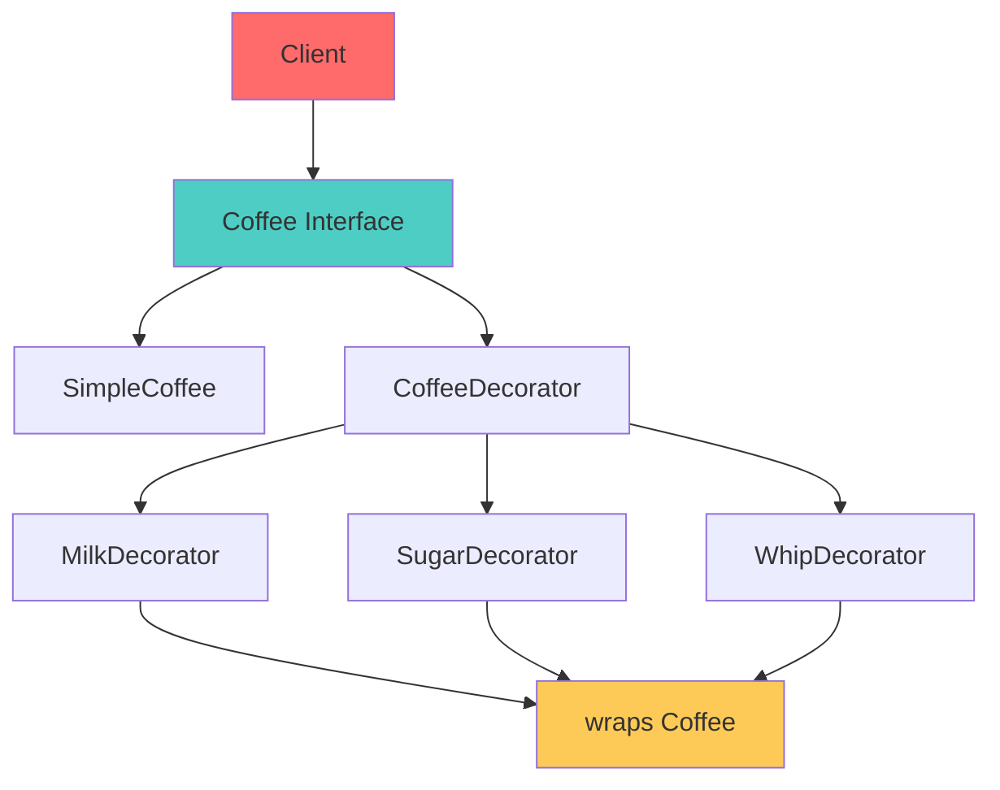
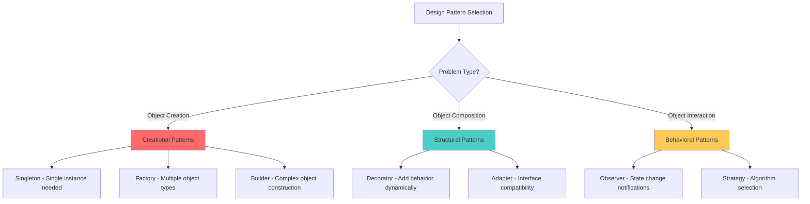

## 🎯 Introduction

Design patterns are proven solutions to commonly occurring problems in software design. They represent best practices evolved over time and provide a shared vocabulary for developers. This comprehensive guide explores the most essential design patterns in Java, demonstrating practical implementations with real-world examples.

We'll cover the three main categories of design patterns from the Gang of Four: Creational, Structural, and Behavioral patterns, showing how to implement them effectively in modern Java applications.

## 🏭 Creational Patterns

Creational patterns deal with object creation mechanisms, trying to create objects in a manner suitable to the situation.

### 🔧 Singleton Pattern

The Singleton pattern ensures a class has only one instance and provides global access to that instance.

```mermaid
graph TD
    A[Client] --> B[Singleton.getInstance()]
    B --> C{Instance exists?}
    C -->|No| D[Create new instance]
    C -->|Yes| E[Return existing instance]
    D --> F[Store in static field]
    F --> G[Return instance]
    E --> G

    style A fill:#ff6b6b
    style G fill:#4ecdc4
    style C fill:#feca57
```

#### 🛠️ Thread-Safe Singleton Implementation

**1. Enum Singleton (Recommended):**

```java
public enum DatabaseManager {
    INSTANCE;

    private Connection connection;
    private final Properties config;

    DatabaseManager() {
        this.config = loadConfiguration();
        initializeConnection();
    }

    public Connection getConnection() {
        if (connection == null || !isConnectionValid()) {
            synchronized (this) {
                if (connection == null || !isConnectionValid()) {
                    initializeConnection();
                }
            }
        }
        return connection;
    }

    private void initializeConnection() {
        try {
            String url = config.getProperty("database.url");
            String username = config.getProperty("database.username");
            String password = config.getProperty("database.password");

            this.connection = DriverManager.getConnection(url, username, password);
            System.out.println("Database connection initialized");

        } catch (SQLException e) {
            throw new RuntimeException("Failed to initialize database connection", e);
        }
    }

    private boolean isConnectionValid() {
        try {
            return connection != null && !connection.isClosed() && connection.isValid(5);
        } catch (SQLException e) {
            return false;
        }
    }

    private Properties loadConfiguration() {
        Properties props = new Properties();
        try (InputStream input = getClass().getClassLoader().getResourceAsStream("database.properties")) {
            if (input != null) {
                props.load(input);
            } else {
                // Default configuration
                props.setProperty("database.url", "jdbc:h2:mem:testdb");
                props.setProperty("database.username", "sa");
                props.setProperty("database.password", "");
            }
        } catch (IOException e) {
            throw new RuntimeException("Failed to load database configuration", e);
        }
        return props;
    }

    public void executeQuery(String sql) {
        try (PreparedStatement stmt = getConnection().prepareStatement(sql)) {
            ResultSet rs = stmt.executeQuery();
            // Process results
            while (rs.next()) {
                System.out.println("Query result: " + rs.getString(1));
            }
        } catch (SQLException e) {
            System.err.println("Query execution failed: " + e.getMessage());
        }
    }

    public void closeConnection() {
        if (connection != null) {
            try {
                connection.close();
                System.out.println("Database connection closed");
            } catch (SQLException e) {
                System.err.println("Error closing connection: " + e.getMessage());
            }
        }
    }
}

// Usage
public class DatabaseExample {
    public static void main(String[] args) {
        // Get singleton instance
        DatabaseManager dbManager = DatabaseManager.INSTANCE;

        // Use the database manager
        dbManager.executeQuery("SELECT 1");

        // Same instance everywhere
        DatabaseManager anotherReference = DatabaseManager.INSTANCE;
        System.out.println("Same instance: " + (dbManager == anotherReference)); // true

        // Cleanup
        dbManager.closeConnection();
    }
}
```

**2. Double-Checked Locking Singleton:**

```java
public class ConfigurationManager {
    private static volatile ConfigurationManager instance;
    private final Map<String, String> properties;
    private final long lastModified;

    private ConfigurationManager() {
        this.properties = new ConcurrentHashMap<>();
        this.lastModified = System.currentTimeMillis();
        loadConfiguration();
    }

    public static ConfigurationManager getInstance() {
        if (instance == null) {
            synchronized (ConfigurationManager.class) {
                if (instance == null) {
                    instance = new ConfigurationManager();
                }
            }
        }
        return instance;
    }

    private void loadConfiguration() {
        // Simulate loading configuration from file
        properties.put("app.name", "Design Patterns Demo");
        properties.put("app.version", "1.0.0");
        properties.put("app.environment", "production");
        properties.put("database.pool.size", "20");
        properties.put("cache.ttl.seconds", "3600");

        System.out.println("Configuration loaded with " + properties.size() + " properties");
    }

    public String getProperty(String key) {
        return properties.get(key);
    }

    public String getProperty(String key, String defaultValue) {
        return properties.getOrDefault(key, defaultValue);
    }

    public void setProperty(String key, String value) {
        properties.put(key, value);
        System.out.println("Property updated: " + key + " = " + value);
    }

    public Map<String, String> getAllProperties() {
        return new HashMap<>(properties);
    }

    public void reloadConfiguration() {
        synchronized (this) {
            properties.clear();
            loadConfiguration();
            System.out.println("Configuration reloaded");
        }
    }
}
```

#### ✅ Pros and Cons

**✅ Advantages:**
- Controlled access to sole instance
- Reduced namespace pollution
- Lazy initialization possible
- Thread-safe with proper implementation

**❌ Disadvantages:**
- Hidden dependencies (hard to test)
- Violates Single Responsibility Principle
- Difficult to subclass
- Global state can cause issues

**🎯 Use Cases:**
- Configuration managers
- Database connection pools
- Logging systems
- Cache managers

### 🏭 Factory Method Pattern

The Factory Method pattern creates objects without specifying the exact class to create.

```mermaid
graph TD
    A[Client] --> B[NotificationFactory]
    B --> C{Notification Type?}
    C -->|EMAIL| D[EmailNotification]
    C -->|SMS| E[SmsNotification]
    C -->|PUSH| F[PushNotification]

    D --> G[send()]
    E --> G
    F --> G

    style A fill:#ff6b6b
    style B fill:#4ecdc4
    style G fill:#feca57
```

#### 🛠️ Factory Method Implementation

```java
// Notification interface
public interface Notification {
    void send(String recipient, String message);
    String getType();
    boolean isDelivered();
}

// Concrete notification implementations
public class EmailNotification implements Notification {
    private boolean delivered = false;

    @Override
    public void send(String recipient, String message) {
        System.out.println("Sending EMAIL to " + recipient);
        System.out.println("Subject: Notification");
        System.out.println("Message: " + message);

        // Simulate email sending
        try {
            Thread.sleep(100);
            delivered = Math.random() > 0.1; // 90% success rate

            if (delivered) {
                System.out.println("Email delivered successfully");
            } else {
                System.out.println("Email delivery failed");
            }
        } catch (InterruptedException e) {
            Thread.currentThread().interrupt();
        }
    }

    @Override
    public String getType() {
        return "EMAIL";
    }

    @Override
    public boolean isDelivered() {
        return delivered;
    }
}

public class SmsNotification implements Notification {
    private boolean delivered = false;

    @Override
    public void send(String recipient, String message) {
        System.out.println("Sending SMS to " + recipient);
        System.out.println("Message: " + message);

        // Simulate SMS sending
        try {
            Thread.sleep(50);
            delivered = Math.random() > 0.05; // 95% success rate

            if (delivered) {
                System.out.println("SMS delivered successfully");
            } else {
                System.out.println("SMS delivery failed");
            }
        } catch (InterruptedException e) {
            Thread.currentThread().interrupt();
        }
    }

    @Override
    public String getType() {
        return "SMS";
    }

    @Override
    public boolean isDelivered() {
        return delivered;
    }
}

public class PushNotification implements Notification {
    private boolean delivered = false;

    @Override
    public void send(String recipient, String message) {
        System.out.println("Sending PUSH notification to " + recipient);
        System.out.println("Message: " + message);

        // Simulate push notification
        try {
            Thread.sleep(20);
            delivered = Math.random() > 0.02; // 98% success rate

            if (delivered) {
                System.out.println("Push notification delivered successfully");
            } else {
                System.out.println("Push notification delivery failed");
            }
        } catch (InterruptedException e) {
            Thread.currentThread().interrupt();
        }
    }

    @Override
    public String getType() {
        return "PUSH";
    }

    @Override
    public boolean isDelivered() {
        return delivered;
    }
}

// Factory class
public class NotificationFactory {

    public enum NotificationType {
        EMAIL, SMS, PUSH
    }

    // Factory method
    public static Notification createNotification(NotificationType type) {
        switch (type) {
            case EMAIL:
                return new EmailNotification();
            case SMS:
                return new SmsNotification();
            case PUSH:
                return new PushNotification();
            default:
                throw new IllegalArgumentException("Unknown notification type: " + type);
        }
    }

    // Factory method with validation
    public static Notification createNotification(String type) {
        try {
            NotificationType notificationType = NotificationType.valueOf(type.toUpperCase());
            return createNotification(notificationType);
        } catch (IllegalArgumentException e) {
            throw new IllegalArgumentException("Invalid notification type: " + type +
                ". Supported types: " + Arrays.toString(NotificationType.values()));
        }
    }

    // Factory method with multiple notifications
    public static List<Notification> createNotifications(NotificationType... types) {
        List<Notification> notifications = new ArrayList<>();

        for (NotificationType type : types) {
            notifications.add(createNotification(type));
        }

        return notifications;
    }
}

// Notification service using factory
public class NotificationService {
    private final List<Notification> sentNotifications = new ArrayList<>();

    public void sendNotification(NotificationType type, String recipient, String message) {
        Notification notification = NotificationFactory.createNotification(type);
        notification.send(recipient, message);
        sentNotifications.add(notification);
    }

    public void sendMultiChannelNotification(String recipient, String message,
                                           NotificationType... channels) {
        List<Notification> notifications = NotificationFactory.createNotifications(channels);

        for (Notification notification : notifications) {
            notification.send(recipient, message);
            sentNotifications.add(notification);
        }
    }

    public void printDeliveryReport() {
        System.out.println("\n=== Delivery Report ===");
        Map<String, Long> deliveryStats = sentNotifications.stream()
            .collect(Collectors.groupingBy(
                Notification::getType,
                Collectors.counting()
            ));

        Map<String, Long> successStats = sentNotifications.stream()
            .filter(Notification::isDelivered)
            .collect(Collectors.groupingBy(
                Notification::getType,
                Collectors.counting()
            ));

        deliveryStats.forEach((type, total) -> {
            long successful = successStats.getOrDefault(type, 0L);
            double successRate = (double) successful / total * 100;
            System.out.printf("%s: %d sent, %d delivered (%.1f%% success rate)%n",
                type, total, successful, successRate);
        });
    }
}

// Usage example
public class FactoryPatternExample {
    public static void main(String[] args) {
        NotificationService service = new NotificationService();

        // Send individual notifications
        service.sendNotification(NotificationType.EMAIL, "user@example.com", "Welcome to our service!");
        service.sendNotification(NotificationType.SMS, "+1234567890", "Your verification code is 12345");
        service.sendNotification(NotificationType.PUSH, "user_device_id", "You have a new message");

        // Send multi-channel notification
        service.sendMultiChannelNotification(
            "premium_user@example.com",
            "Your premium subscription expires soon",
            NotificationType.EMAIL,
            NotificationType.PUSH
        );

        // Print delivery statistics
        service.printDeliveryReport();
    }
}
```

### 🔨 Builder Pattern

The Builder pattern constructs complex objects step by step, allowing different representations using the same construction process.

```mermaid
graph TD
    A[Client] --> B[UserBuilder]
    B --> C[setName()]
    C --> D[setEmail()]
    D --> E[setAge()]
    E --> F[addRole()]
    F --> G[build()]
    G --> H[User Object]

    style A fill:#ff6b6b
    style B fill:#4ecdc4
    style H fill:#feca57
```

#### 🛠️ Builder Pattern Implementation

```java
// Complex User class
public class User {
    // Required parameters
    private final String username;
    private final String email;

    // Optional parameters
    private final String firstName;
    private final String lastName;
    private final int age;
    private final String phone;
    private final String address;
    private final List<String> roles;
    private final boolean isActive;
    private final LocalDateTime createdAt;
    private final Map<String, String> preferences;

    // Private constructor - only Builder can create instances
    private User(UserBuilder builder) {
        this.username = builder.username;
        this.email = builder.email;
        this.firstName = builder.firstName;
        this.lastName = builder.lastName;
        this.age = builder.age;
        this.phone = builder.phone;
        this.address = builder.address;
        this.roles = Collections.unmodifiableList(new ArrayList<>(builder.roles));
        this.isActive = builder.isActive;
        this.createdAt = builder.createdAt;
        this.preferences = Collections.unmodifiableMap(new HashMap<>(builder.preferences));
    }

    // Getters
    public String getUsername() { return username; }
    public String getEmail() { return email; }
    public String getFirstName() { return firstName; }
    public String getLastName() { return lastName; }
    public int getAge() { return age; }
    public String getPhone() { return phone; }
    public String getAddress() { return address; }
    public List<String> getRoles() { return roles; }
    public boolean isActive() { return isActive; }
    public LocalDateTime getCreatedAt() { return createdAt; }
    public Map<String, String> getPreferences() { return preferences; }

    public String getFullName() {
        if (firstName != null && lastName != null) {
            return firstName + " " + lastName;
        } else if (firstName != null) {
            return firstName;
        } else if (lastName != null) {
            return lastName;
        } else {
            return username;
        }
    }

    public boolean hasRole(String role) {
        return roles.contains(role);
    }

    @Override
    public String toString() {
        return String.format("User{username='%s', email='%s', fullName='%s', roles=%s, active=%s}",
            username, email, getFullName(), roles, isActive);
    }

    // Static method to create builder
    public static UserBuilder builder(String username, String email) {
        return new UserBuilder(username, email);
    }

    // Builder class
    public static class UserBuilder {
        // Required parameters
        private final String username;
        private final String email;

        // Optional parameters with default values
        private String firstName;
        private String lastName;
        private int age = 0;
        private String phone;
        private String address;
        private List<String> roles = new ArrayList<>();
        private boolean isActive = true;
        private LocalDateTime createdAt = LocalDateTime.now();
        private Map<String, String> preferences = new HashMap<>();

        // Constructor with required parameters
        public UserBuilder(String username, String email) {
            if (username == null || username.trim().isEmpty()) {
                throw new IllegalArgumentException("Username cannot be null or empty");
            }
            if (email == null || !isValidEmail(email)) {
                throw new IllegalArgumentException("Invalid email address");
            }

            this.username = username.trim();
            this.email = email.toLowerCase().trim();
        }

        public UserBuilder firstName(String firstName) {
            this.firstName = firstName;
            return this;
        }

        public UserBuilder lastName(String lastName) {
            this.lastName = lastName;
            return this;
        }

        public UserBuilder age(int age) {
            if (age < 0 || age > 120) {
                throw new IllegalArgumentException("Age must be between 0 and 120");
            }
            this.age = age;
            return this;
        }

        public UserBuilder phone(String phone) {
            this.phone = phone;
            return this;
        }

        public UserBuilder address(String address) {
            this.address = address;
            return this;
        }

        public UserBuilder addRole(String role) {
            if (role != null && !role.trim().isEmpty()) {
                this.roles.add(role.trim().toUpperCase());
            }
            return this;
        }

        public UserBuilder roles(String... roles) {
            for (String role : roles) {
                addRole(role);
            }
            return this;
        }

        public UserBuilder roles(List<String> roles) {
            for (String role : roles) {
                addRole(role);
            }
            return this;
        }

        public UserBuilder active(boolean isActive) {
            this.isActive = isActive;
            return this;
        }

        public UserBuilder createdAt(LocalDateTime createdAt) {
            this.createdAt = createdAt != null ? createdAt : LocalDateTime.now();
            return this;
        }

        public UserBuilder preference(String key, String value) {
            if (key != null && value != null) {
                this.preferences.put(key, value);
            }
            return this;
        }

        public UserBuilder preferences(Map<String, String> preferences) {
            if (preferences != null) {
                this.preferences.putAll(preferences);
            }
            return this;
        }

        // Build method with validation
        public User build() {
            validateBuild();
            return new User(this);
        }

        private void validateBuild() {
            // Additional validation before building
            if (age > 0 && age < 13 && roles.contains("ADMIN")) {
                throw new IllegalStateException("Users under 13 cannot have admin role");
            }

            // Ensure at least one role is assigned
            if (roles.isEmpty()) {
                roles.add("USER");
            }
        }

        private boolean isValidEmail(String email) {
            return email != null && email.matches("^[A-Za-z0-9+_.-]+@([A-Za-z0-9.-]+\\.[A-Za-z]{2,})$");
        }
    }
}

// Usage examples
public class BuilderPatternExample {
    public static void main(String[] args) {
        // Simple user
        User basicUser = User.builder("johndoe", "john@example.com")
            .firstName("John")
            .lastName("Doe")
            .build();

        System.out.println("Basic user: " + basicUser);

        // Complex user with all options
        User adminUser = User.builder("admin", "admin@company.com")
            .firstName("System")
            .lastName("Administrator")
            .age(35)
            .phone("+1-555-0123")
            .address("123 Admin Street, Server City, Cloud State 12345")
            .roles("ADMIN", "USER", "MODERATOR")
            .preference("theme", "dark")
            .preference("notifications", "enabled")
            .preference("language", "en-US")
            .build();

        System.out.println("Admin user: " + adminUser);
        System.out.println("Admin roles: " + adminUser.getRoles());
        System.out.println("Admin preferences: " + adminUser.getPreferences());

        // User with custom creation time
        User historicalUser = User.builder("historical", "historical@example.com")
            .firstName("Historical")
            .lastName("User")
            .createdAt(LocalDateTime.of(2020, 1, 1, 0, 0))
            .active(false)
            .roles(Arrays.asList("LEGACY_USER", "ARCHIVED"))
            .build();

        System.out.println("Historical user: " + historicalUser);
        System.out.println("Created at: " + historicalUser.getCreatedAt());

        // Demonstrate method chaining flexibility
        User flexibleUser = User.builder("flexible", "flexible@example.com")
            .addRole("USER")
            .age(28)
            .addRole("PREMIUM")
            .firstName("Flexible")
            .preference("tier", "premium")
            .addRole("BETA_TESTER")
            .build();

        System.out.println("Flexible user: " + flexibleUser);

        // Building users in a factory-like method
        createSampleUsers();
    }

    private static void createSampleUsers() {
        System.out.println("\n=== Sample Users ===");

        List<User> users = Arrays.asList(
            User.builder("user1", "user1@example.com")
                .firstName("Alice")
                .lastName("Smith")
                .age(29)
                .roles("USER", "PREMIUM")
                .build(),

            User.builder("user2", "user2@example.com")
                .firstName("Bob")
                .lastName("Johnson")
                .age(34)
                .addRole("USER")
                .preference("newsletter", "weekly")
                .build(),

            User.builder("user3", "user3@example.com")
                .firstName("Charlie")
                .age(42)
                .roles("ADMIN", "USER")
                .phone("+1-555-9999")
                .build()
        );

        users.forEach(System.out::println);

        // Demonstrate role checking
        System.out.println("\nAdmin users:");
        users.stream()
            .filter(user -> user.hasRole("ADMIN"))
            .forEach(user -> System.out.println("  " + user.getFullName()));
    }
}
```

#### ✅ Pros and Cons

**✅ Advantages:**
- Flexible object construction
- Immutable objects possible
- Clear, readable code
- Step-by-step construction

**❌ Disadvantages:**
- More verbose code
- Additional classes needed
- Memory overhead
- Complex for simple objects

**🎯 Use Cases:**
- Complex configuration objects
- Immutable data transfer objects
- SQL query builders
- Test data builders

## 🏗️ Structural Patterns

Structural patterns deal with object composition, creating relationships between objects to form larger structures.

### 🎭 Decorator Pattern

The Decorator pattern attaches additional responsibilities to objects dynamically, providing a flexible alternative to subclassing.



#### 🛠️ Decorator Pattern Implementation

```java
// Base coffee interface
public interface Coffee {
    String getDescription();
    double getCost();
    List<String> getIngredients();
}

// Base coffee implementation
public class SimpleCoffee implements Coffee {
    @Override
    public String getDescription() {
        return "Simple Coffee";
    }

    @Override
    public double getCost() {
        return 2.00;
    }

    @Override
    public List<String> getIngredients() {
        return Arrays.asList("Coffee Beans", "Water");
    }
}

// Base decorator
public abstract class CoffeeDecorator implements Coffee {
    protected final Coffee coffee;

    public CoffeeDecorator(Coffee coffee) {
        this.coffee = coffee;
    }

    @Override
    public String getDescription() {
        return coffee.getDescription();
    }

    @Override
    public double getCost() {
        return coffee.getCost();
    }

    @Override
    public List<String> getIngredients() {
        return new ArrayList<>(coffee.getIngredients());
    }
}

// Concrete decorators
public class MilkDecorator extends CoffeeDecorator {
    public MilkDecorator(Coffee coffee) {
        super(coffee);
    }

    @Override
    public String getDescription() {
        return coffee.getDescription() + ", with Milk";
    }

    @Override
    public double getCost() {
        return coffee.getCost() + 0.50;
    }

    @Override
    public List<String> getIngredients() {
        List<String> ingredients = super.getIngredients();
        ingredients.add("Milk");
        return ingredients;
    }
}

public class SugarDecorator extends CoffeeDecorator {
    private final int cubes;

    public SugarDecorator(Coffee coffee, int cubes) {
        super(coffee);
        this.cubes = cubes;
    }

    public SugarDecorator(Coffee coffee) {
        this(coffee, 1);
    }

    @Override
    public String getDescription() {
        return coffee.getDescription() + ", with " + cubes + " sugar cube(s)";
    }

    @Override
    public double getCost() {
        return coffee.getCost() + (0.25 * cubes);
    }

    @Override
    public List<String> getIngredients() {
        List<String> ingredients = super.getIngredients();
        ingredients.add("Sugar (" + cubes + " cube" + (cubes > 1 ? "s" : "") + ")");
        return ingredients;
    }
}

public class WhipDecorator extends CoffeeDecorator {
    public WhipDecorator(Coffee coffee) {
        super(coffee);
    }

    @Override
    public String getDescription() {
        return coffee.getDescription() + ", with Whipped Cream";
    }

    @Override
    public double getCost() {
        return coffee.getCost() + 0.75;
    }

    @Override
    public List<String> getIngredients() {
        List<String> ingredients = super.getIngredients();
        ingredients.add("Whipped Cream");
        return ingredients;
    }
}

public class VanillaDecorator extends CoffeeDecorator {
    public VanillaDecorator(Coffee coffee) {
        super(coffee);
    }

    @Override
    public String getDescription() {
        return coffee.getDescription() + ", with Vanilla Syrup";
    }

    @Override
    public double getCost() {
        return coffee.getCost() + 0.60;
    }

    @Override
    public List<String> getIngredients() {
        List<String> ingredients = super.getIngredients();
        ingredients.add("Vanilla Syrup");
        return ingredients;
    }
}

// Coffee shop service
public class CoffeeShop {

    public void printOrder(Coffee coffee) {
        System.out.println("Order Details:");
        System.out.println("Description: " + coffee.getDescription());
        System.out.println("Cost: $" + String.format("%.2f", coffee.getCost()));
        System.out.println("Ingredients: " + String.join(", ", coffee.getIngredients()));
        System.out.println("-".repeat(50));
    }

    // Pre-configured coffee combinations
    public Coffee createLatte() {
        return new MilkDecorator(
            new VanillaDecorator(
                new SimpleCoffee()
            )
        );
    }

    public Coffee createMochaWithWhip() {
        return new WhipDecorator(
            new VanillaDecorator(
                new MilkDecorator(
                    new SimpleCoffee()
                )
            )
        );
    }

    public Coffee createSweetCoffee() {
        return new SugarDecorator(
            new MilkDecorator(
                new SimpleCoffee()
            ),
            3 // 3 sugar cubes
        );
    }
}

// Usage example
public class DecoratorPatternExample {
    public static void main(String[] args) {
        CoffeeShop shop = new CoffeeShop();

        // Basic coffee
        Coffee simpleCoffee = new SimpleCoffee();
        shop.printOrder(simpleCoffee);

        // Coffee with milk
        Coffee coffeeWithMilk = new MilkDecorator(simpleCoffee);
        shop.printOrder(coffeeWithMilk);

        // Complex decorated coffee
        Coffee fancyCoffee = new WhipDecorator(
            new VanillaDecorator(
                new SugarDecorator(
                    new MilkDecorator(
                        new SimpleCoffee()
                    ), 2
                )
            )
        );
        shop.printOrder(fancyCoffee);

        // Pre-configured coffees
        System.out.println("=== Pre-configured Coffees ===");

        Coffee latte = shop.createLatte();
        shop.printOrder(latte);

        Coffee mocha = shop.createMochaWithWhip();
        shop.printOrder(mocha);

        Coffee sweetCoffee = shop.createSweetCoffee();
        shop.printOrder(sweetCoffee);

        // Demonstrate decorator flexibility
        demonstrateFlexibility();
    }

    private static void demonstrateFlexibility() {
        System.out.println("=== Decorator Flexibility ===");

        // Start with simple coffee
        Coffee coffee = new SimpleCoffee();
        System.out.println("1. " + coffee.getDescription() + " - $" + String.format("%.2f", coffee.getCost()));

        // Add decorators one by one
        coffee = new MilkDecorator(coffee);
        System.out.println("2. " + coffee.getDescription() + " - $" + String.format("%.2f", coffee.getCost()));

        coffee = new SugarDecorator(coffee, 2);
        System.out.println("3. " + coffee.getDescription() + " - $" + String.format("%.2f", coffee.getCost()));

        coffee = new VanillaDecorator(coffee);
        System.out.println("4. " + coffee.getDescription() + " - $" + String.format("%.2f", coffee.getCost()));

        coffee = new WhipDecorator(coffee);
        System.out.println("5. " + coffee.getDescription() + " - $" + String.format("%.2f", coffee.getCost()));

        System.out.println("Final ingredients: " + String.join(", ", coffee.getIngredients()));
    }
}
```

### 🔌 Adapter Pattern

The Adapter pattern allows incompatible interfaces to work together by acting as a bridge between them.

#### 🛠️ Adapter Pattern Implementation

```java
// Target interface (what we want)
public interface MediaPlayer {
    void play(String audioType, String fileName);
}

// Adaptee interfaces (what we have)
public interface AdvancedMediaPlayer {
    void playVlc(String fileName);
    void playMp4(String fileName);
    void playMov(String fileName);
}

// Concrete adaptee implementations
public class VlcPlayer implements AdvancedMediaPlayer {
    @Override
    public void playVlc(String fileName) {
        System.out.println("Playing vlc file: " + fileName);
    }

    @Override
    public void playMp4(String fileName) {
        // Do nothing - not supported
    }

    @Override
    public void playMov(String fileName) {
        // Do nothing - not supported
    }
}

public class Mp4Player implements AdvancedMediaPlayer {
    @Override
    public void playVlc(String fileName) {
        // Do nothing - not supported
    }

    @Override
    public void playMp4(String fileName) {
        System.out.println("Playing mp4 file: " + fileName);
    }

    @Override
    public void playMov(String fileName) {
        // Do nothing - not supported
    }
}

// Adapter class
public class MediaAdapter implements MediaPlayer {
    private final AdvancedMediaPlayer advancedPlayer;

    public MediaAdapter(String audioType) {
        switch (audioType.toLowerCase()) {
            case "vlc":
                advancedPlayer = new VlcPlayer();
                break;
            case "mp4":
                advancedPlayer = new Mp4Player();
                break;
            default:
                throw new IllegalArgumentException("Unsupported audio type: " + audioType);
        }
    }

    @Override
    public void play(String audioType, String fileName) {
        switch (audioType.toLowerCase()) {
            case "vlc":
                advancedPlayer.playVlc(fileName);
                break;
            case "mp4":
                advancedPlayer.playMp4(fileName);
                break;
            default:
                System.out.println("Invalid media. " + audioType + " format not supported");
        }
    }
}

// Context class that uses the adapter
public class AudioPlayer implements MediaPlayer {
    private MediaAdapter mediaAdapter;

    @Override
    public void play(String audioType, String fileName) {
        // Built-in support for mp3
        if (audioType.equalsIgnoreCase("mp3")) {
            System.out.println("Playing mp3 file: " + fileName);
        }
        // Use adapter for other formats
        else if (audioType.equalsIgnoreCase("vlc") || audioType.equalsIgnoreCase("mp4")) {
            try {
                mediaAdapter = new MediaAdapter(audioType);
                mediaAdapter.play(audioType, fileName);
            } catch (IllegalArgumentException e) {
                System.out.println("Error: " + e.getMessage());
            }
        }
        else {
            System.out.println("Invalid media. " + audioType + " format not supported");
        }
    }
}
```

## 🎯 Behavioral Patterns

Behavioral patterns focus on communication between objects and the assignment of responsibilities between objects.

### 👁️ Observer Pattern

The Observer pattern defines a one-to-many dependency between objects so that when one object changes state, all dependents are notified.

#### 🛠️ Observer Pattern Implementation

```java
// Observer interface
public interface Observer {
    void update(String message);
    String getObserverId();
}

// Subject interface
public interface Subject {
    void attach(Observer observer);
    void detach(Observer observer);
    void notifyObservers(String message);
}

// Concrete subject
public class NewsAgency implements Subject {
    private final List<Observer> observers = new ArrayList<>();
    private String latestNews;

    @Override
    public void attach(Observer observer) {
        observers.add(observer);
        System.out.println("Observer " + observer.getObserverId() + " attached");
    }

    @Override
    public void detach(Observer observer) {
        observers.remove(observer);
        System.out.println("Observer " + observer.getObserverId() + " detached");
    }

    @Override
    public void notifyObservers(String message) {
        System.out.println("Notifying " + observers.size() + " observers about: " + message);
        for (Observer observer : observers) {
            observer.update(message);
        }
    }

    public void publishNews(String news) {
        this.latestNews = news;
        notifyObservers(news);
    }

    public String getLatestNews() {
        return latestNews;
    }
}

// Concrete observers
public class NewsChannel implements Observer {
    private final String channelId;
    private String lastNews;

    public NewsChannel(String channelId) {
        this.channelId = channelId;
    }

    @Override
    public void update(String message) {
        this.lastNews = message;
        System.out.println("[" + channelId + "] Broadcasting: " + message);
    }

    @Override
    public String getObserverId() {
        return channelId;
    }

    public String getLastNews() {
        return lastNews;
    }
}

public class MobileApp implements Observer {
    private final String appId;
    private final List<String> notifications = new ArrayList<>();

    public MobileApp(String appId) {
        this.appId = appId;
    }

    @Override
    public void update(String message) {
        notifications.add(message);
        System.out.println("[" + appId + "] Push notification: " + message);
    }

    @Override
    public String getObserverId() {
        return appId;
    }

    public List<String> getNotifications() {
        return new ArrayList<>(notifications);
    }
}

// Usage example
public class ObserverPatternExample {
    public static void main(String[] args) {
        // Create subject
        NewsAgency newsAgency = new NewsAgency();

        // Create observers
        NewsChannel cnn = new NewsChannel("CNN");
        NewsChannel bbc = new NewsChannel("BBC");
        MobileApp newsApp = new MobileApp("NewsApp");
        MobileApp alertApp = new MobileApp("AlertApp");

        // Attach observers
        newsAgency.attach(cnn);
        newsAgency.attach(bbc);
        newsAgency.attach(newsApp);

        // Publish news
        newsAgency.publishNews("Breaking: New design patterns guide published!");
        System.out.println();

        // Add another observer
        newsAgency.attach(alertApp);
        newsAgency.publishNews("Technology: Java 21 features announced");
        System.out.println();

        // Remove an observer
        newsAgency.detach(bbc);
        newsAgency.publishNews("Sports: World Cup results are in!");
        System.out.println();

        // Display observer states
        System.out.println("=== Observer States ===");
        System.out.println("CNN last news: " + cnn.getLastNews());
        System.out.println("BBC last news: " + bbc.getLastNews());
        System.out.println("NewsApp notifications: " + newsApp.getNotifications().size());
        System.out.println("AlertApp notifications: " + alertApp.getNotifications().size());
    }
}
```

### 🎛️ Strategy Pattern

The Strategy pattern defines a family of algorithms, encapsulates each one, and makes them interchangeable at runtime.

#### 🛠️ Strategy Pattern Implementation

```java
// Strategy interface
public interface PaymentStrategy {
    boolean pay(double amount);
    String getPaymentMethod();
}

// Concrete strategies
public class CreditCardPayment implements PaymentStrategy {
    private final String cardNumber;
    private final String expiryDate;
    private final String cvv;

    public CreditCardPayment(String cardNumber, String expiryDate, String cvv) {
        this.cardNumber = cardNumber;
        this.expiryDate = expiryDate;
        this.cvv = cvv;
    }

    @Override
    public boolean pay(double amount) {
        System.out.println("Processing credit card payment of $" + amount);
        System.out.println("Card: ****-****-****-" + cardNumber.substring(cardNumber.length() - 4));

        // Simulate payment processing
        try {
            Thread.sleep(1000);
            boolean success = Math.random() > 0.1; // 90% success rate

            if (success) {
                System.out.println("Credit card payment successful!");
                return true;
            } else {
                System.out.println("Credit card payment declined!");
                return false;
            }
        } catch (InterruptedException e) {
            Thread.currentThread().interrupt();
            return false;
        }
    }

    @Override
    public String getPaymentMethod() {
        return "Credit Card";
    }
}

public class PayPalPayment implements PaymentStrategy {
    private final String email;
    private final String password;

    public PayPalPayment(String email, String password) {
        this.email = email;
        this.password = password;
    }

    @Override
    public boolean pay(double amount) {
        System.out.println("Processing PayPal payment of $" + amount);
        System.out.println("PayPal account: " + email);

        // Simulate payment processing
        try {
            Thread.sleep(800);
            boolean success = Math.random() > 0.05; // 95% success rate

            if (success) {
                System.out.println("PayPal payment successful!");
                return true;
            } else {
                System.out.println("PayPal payment failed!");
                return false;
            }
        } catch (InterruptedException e) {
            Thread.currentThread().interrupt();
            return false;
        }
    }

    @Override
    public String getPaymentMethod() {
        return "PayPal";
    }
}

public class BankTransferPayment implements PaymentStrategy {
    private final String accountNumber;
    private final String routingNumber;

    public BankTransferPayment(String accountNumber, String routingNumber) {
        this.accountNumber = accountNumber;
        this.routingNumber = routingNumber;
    }

    @Override
    public boolean pay(double amount) {
        System.out.println("Processing bank transfer payment of $" + amount);
        System.out.println("Account: ****" + accountNumber.substring(accountNumber.length() - 4));

        // Simulate payment processing
        try {
            Thread.sleep(1500); // Bank transfers take longer
            boolean success = Math.random() > 0.02; // 98% success rate

            if (success) {
                System.out.println("Bank transfer payment successful!");
                return true;
            } else {
                System.out.println("Bank transfer payment failed!");
                return false;
            }
        } catch (InterruptedException e) {
            Thread.currentThread().interrupt();
            return false;
        }
    }

    @Override
    public String getPaymentMethod() {
        return "Bank Transfer";
    }
}

// Context class
public class ShoppingCart {
    private final List<Item> items = new ArrayList<>();
    private PaymentStrategy paymentStrategy;

    public void addItem(Item item) {
        items.add(item);
        System.out.println("Added to cart: " + item.getName() + " - $" + item.getPrice());
    }

    public void removeItem(Item item) {
        items.remove(item);
        System.out.println("Removed from cart: " + item.getName());
    }

    public double getTotalAmount() {
        return items.stream().mapToDouble(Item::getPrice).sum();
    }

    public void setPaymentStrategy(PaymentStrategy paymentStrategy) {
        this.paymentStrategy = paymentStrategy;
        System.out.println("Payment method set to: " + paymentStrategy.getPaymentMethod());
    }

    public boolean checkout() {
        if (items.isEmpty()) {
            System.out.println("Cart is empty!");
            return false;
        }

        if (paymentStrategy == null) {
            System.out.println("Please select a payment method!");
            return false;
        }

        double total = getTotalAmount();
        System.out.println("\n=== Checkout ===");
        System.out.println("Items in cart: " + items.size());
        items.forEach(item -> System.out.println("  " + item.getName() + " - $" + item.getPrice()));
        System.out.println("Total amount: $" + total);
        System.out.println();

        boolean paymentSuccess = paymentStrategy.pay(total);

        if (paymentSuccess) {
            System.out.println("Order completed successfully!");
            items.clear();
        } else {
            System.out.println("Order failed. Please try again.");
        }

        return paymentSuccess;
    }

    public void displayCart() {
        System.out.println("\n=== Shopping Cart ===");
        if (items.isEmpty()) {
            System.out.println("Cart is empty");
        } else {
            items.forEach(item -> System.out.println(item.getName() + " - $" + item.getPrice()));
            System.out.println("Total: $" + getTotalAmount());
        }
        System.out.println();
    }

    // Item class
    public static class Item {
        private final String name;
        private final double price;

        public Item(String name, double price) {
            this.name = name;
            this.price = price;
        }

        public String getName() { return name; }
        public double getPrice() { return price; }

        @Override
        public boolean equals(Object o) {
            if (this == o) return true;
            if (o == null || getClass() != o.getClass()) return false;
            Item item = (Item) o;
            return Double.compare(item.price, price) == 0 && Objects.equals(name, item.name);
        }

        @Override
        public int hashCode() {
            return Objects.hash(name, price);
        }
    }
}

// Usage example
public class StrategyPatternExample {
    public static void main(String[] args) {
        ShoppingCart cart = new ShoppingCart();

        // Add items to cart
        cart.addItem(new ShoppingCart.Item("Laptop", 999.99));
        cart.addItem(new ShoppingCart.Item("Mouse", 29.99));
        cart.addItem(new ShoppingCart.Item("Keyboard", 79.99));

        cart.displayCart();

        // Try checkout without payment method
        cart.checkout();

        // Set payment strategy and checkout
        System.out.println("\n--- Trying Credit Card Payment ---");
        cart.setPaymentStrategy(new CreditCardPayment("1234567890123456", "12/25", "123"));
        cart.checkout();

        // Add more items and try different payment method
        cart.addItem(new ShoppingCart.Item("Monitor", 299.99));
        cart.addItem(new ShoppingCart.Item("Speakers", 149.99));

        System.out.println("\n--- Trying PayPal Payment ---");
        cart.setPaymentStrategy(new PayPalPayment("user@example.com", "password"));
        cart.checkout();

        // Add items and try bank transfer
        cart.addItem(new ShoppingCart.Item("Webcam", 89.99));

        System.out.println("\n--- Trying Bank Transfer Payment ---");
        cart.setPaymentStrategy(new BankTransferPayment("9876543210", "123456789"));
        cart.checkout();

        cart.displayCart();
    }
}
```

## 📊 Pattern Comparison and Selection Guide

### 🎯 When to Use Each Pattern



| Pattern | Complexity | Use Cases | Performance Impact |
|---------|-----------|-----------|-------------------|
| **Singleton** | Low | Configuration, Logging, Database connections | Minimal |
| **Factory** | Medium | Object creation abstraction, Plugin systems | Low |
| **Builder** | Medium | Complex object construction, Immutable objects | Low |
| **Decorator** | Medium | Feature addition, Middleware systems | Low-Medium |
| **Adapter** | Low | Legacy system integration, API compatibility | Minimal |
| **Observer** | Medium | Event systems, MVC architectures | Medium |
| **Strategy** | Medium | Algorithm selection, Payment processing | Low |

## 🎯 Conclusion

Design patterns are essential tools in a Java developer's toolkit, providing proven solutions to common design problems. Each pattern serves specific purposes and offers unique advantages:

### Key Takeaways:

1. **Creational Patterns** help manage object creation complexity
2. **Structural Patterns** organize object relationships and composition
3. **Behavioral Patterns** define communication and responsibility distribution

### Best Practices:

1. **Don't overuse patterns** - Apply them when they solve real problems
2. **Understand the trade-offs** - Each pattern has advantages and disadvantages
3. **Consider performance implications** - Some patterns add overhead
4. **Maintain code readability** - Patterns should improve, not complicate code
5. **Test thoroughly** - Complex patterns require comprehensive testing

Master these fundamental patterns and you'll be well-equipped to design robust, maintainable, and scalable Java applications.