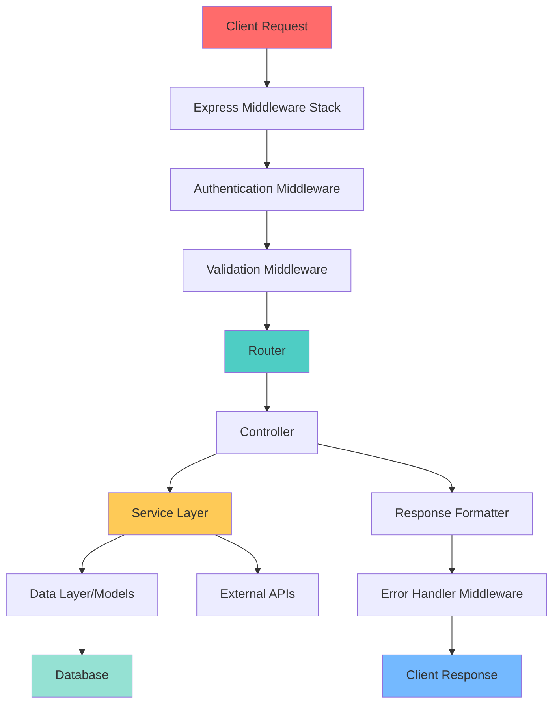

## 🎯 Introduction

Express.js is the de facto standard web framework for Node.js, powering millions of applications worldwide. Its minimalist, unopinionated design provides flexibility, but also requires developers to make crucial architectural decisions to build production-ready applications.

This comprehensive guide explores Express.js best practices across multiple dimensions:

- **Project Setup & Configuration**: Optimal structure and environment management
- **Middleware Architecture**: Building reusable, maintainable middleware pipelines
- **Routing Best Practices**: Organizing routes for scalability
- **Error Handling**: Robust error management strategies
- **Security**: Protecting against common vulnerabilities
- **Performance Optimization**: Making your Express app fast and efficient
- **Testing**: Ensuring reliability through comprehensive testing
- **Deployment**: Production-ready deployment strategies

> 💡 **Core Philosophy**: "Express.js provides the foundation—your architecture decisions determine whether you build a maintainable, scalable application or a tangled mess of code"

## 📦 Project Setup and Structure

### 🏗️ Recommended Project Structure

```
express-api/
├── src/
│   ├── config/              # Configuration files
│   │   ├── database.ts
│   │   ├── redis.ts
│   │   └── logger.ts
│   ├── middleware/          # Custom middleware
│   │   ├── auth.ts
│   │   ├── errorHandler.ts
│   │   ├── requestLogger.ts
│   │   └── validation.ts
│   ├── routes/              # Route definitions
│   │   ├── index.ts
│   │   ├── users.ts
│   │   ├── posts.ts
│   │   └── auth.ts
│   ├── controllers/         # Request handlers
│   │   ├── userController.ts
│   │   ├── postController.ts
│   │   └── authController.ts
│   ├── services/            # Business logic
│   │   ├── userService.ts
│   │   ├── postService.ts
│   │   └── emailService.ts
│   ├── models/              # Data models
│   │   ├── User.ts
│   │   └── Post.ts
│   ├── types/               # TypeScript types
│   │   ├── express.d.ts
│   │   └── models.ts
│   ├── utils/               # Utility functions
│   │   ├── validation.ts
│   │   ├── crypto.ts
│   │   └── response.ts
│   ├── tests/               # Test files
│   │   ├── unit/
│   │   ├── integration/
│   │   └── e2e/
│   ├── app.ts               # Express app setup
│   └── server.ts            # Server entry point
├── .env.example             # Environment variables template
├── .env                     # Local environment (gitignored)
├── .eslintrc.json           # ESLint configuration
├── .prettierrc              # Prettier configuration
├── tsconfig.json            # TypeScript configuration
├── package.json
└── README.md
```

### 🎨 Project Architecture Flow



## ⚙️ Configuration Best Practices

### 🔧 Environment Configuration

```typescript
// src/config/index.ts
import dotenv from 'dotenv';
import path from 'path';

// Load environment variables
dotenv.config({
  path: path.resolve(__dirname, `../../.env.${process.env.NODE_ENV || 'development'}`)
});

interface Config {
  env: string;
  port: number;
  database: {
    host: string;
    port: number;
    name: string;
    user: string;
    password: string;
  };
  jwt: {
    secret: string;
    expiresIn: string;
  };
  redis: {
    host: string;
    port: number;
    password?: string;
  };
  cors: {
    origin: string[];
    credentials: boolean;
  };
  rateLimit: {
    windowMs: number;
    max: number;
  };
}

// ✅ GOOD: Type-safe configuration with validation
const config: Config = {
  env: process.env.NODE_ENV || 'development',
  port: parseInt(process.env.PORT || '3000', 10),
  database: {
    host: process.env.DB_HOST || 'localhost',
    port: parseInt(process.env.DB_PORT || '5432', 10),
    name: process.env.DB_NAME || 'myapp',
    user: process.env.DB_USER || 'postgres',
    password: process.env.DB_PASSWORD || ''
  },
  jwt: {
    secret: process.env.JWT_SECRET || (() => {
      throw new Error('JWT_SECRET is required');
    })(),
    expiresIn: process.env.JWT_EXPIRES_IN || '7d'
  },
  redis: {
    host: process.env.REDIS_HOST || 'localhost',
    port: parseInt(process.env.REDIS_PORT || '6379', 10),
    password: process.env.REDIS_PASSWORD
  },
  cors: {
    origin: process.env.CORS_ORIGIN?.split(',') || ['http://localhost:3000'],
    credentials: true
  },
  rateLimit: {
    windowMs: 15 * 60 * 1000, // 15 minutes
    max: 100 // limit each IP to 100 requests per windowMs
  }
};

// Validate required configuration
function validateConfig(): void {
  const required = [
    'JWT_SECRET',
    'DB_HOST',
    'DB_NAME',
    'DB_USER'
  ];

  const missing = required.filter(key => !process.env[key]);

  if (missing.length > 0) {
    throw new Error(`Missing required environment variables: ${missing.join(', ')}`);
  }
}

validateConfig();

export default config;
```

### 📝 Environment Variables Template

```bash
# .env.example
# Server
NODE_ENV=development
PORT=3000

# Database
DB_HOST=localhost
DB_PORT=5432
DB_NAME=myapp
DB_USER=postgres
DB_PASSWORD=your_password_here

# JWT
JWT_SECRET=your_super_secret_jwt_key_here
JWT_EXPIRES_IN=7d

# Redis
REDIS_HOST=localhost
REDIS_PORT=6379
REDIS_PASSWORD=

# CORS
CORS_ORIGIN=http://localhost:3000,http://localhost:3001

# API Keys
SENDGRID_API_KEY=
AWS_ACCESS_KEY_ID=
AWS_SECRET_ACCESS_KEY=

# Logging
LOG_LEVEL=info
```

## 🚀 Application Setup

### ✅ Main Application File (app.ts)

```typescript
// src/app.ts
import express, { Application, Request, Response, NextFunction } from 'express';
import helmet from 'helmet';
import cors from 'cors';
import compression from 'compression';
import morgan from 'morgan';
import rateLimit from 'express-rate-limit';
import mongoSanitize from 'express-mongo-sanitize';

import config from './config';
import routes from './routes';
import { errorHandler, notFoundHandler } from './middleware/errorHandler';
import logger from './config/logger';

// ✅ GOOD: Separate app creation from server startup
export function createApp(): Application {
  const app = express();

  // Security middleware
  app.use(helmet({
    contentSecurityPolicy: {
      directives: {
        defaultSrc: ["'self'"],
        styleSrc: ["'self'", "'unsafe-inline'"],
        scriptSrc: ["'self'"],
        imgSrc: ["'self'", 'data:', 'https:'],
      },
    },
  }));

  // CORS configuration
  app.use(cors(config.cors));

  // Body parsing middleware
  app.use(express.json({ limit: '10mb' }));
  app.use(express.urlencoded({ extended: true, limit: '10mb' }));

  // Compression middleware
  app.use(compression());

  // Data sanitization against NoSQL injection
  app.use(mongoSanitize());

  // Request logging
  if (config.env === 'development') {
    app.use(morgan('dev'));
  } else {
    app.use(morgan('combined', {
      stream: {
        write: (message: string) => logger.info(message.trim())
      }
    }));
  }

  // Rate limiting
  const limiter = rateLimit({
    windowMs: config.rateLimit.windowMs,
    max: config.rateLimit.max,
    message: 'Too many requests from this IP, please try again later.',
    standardHeaders: true,
    legacyHeaders: false,
  });

  app.use('/api/', limiter);

  // Health check endpoint
  app.get('/health', (req: Request, res: Response) => {
    res.status(200).json({
      status: 'OK',
      timestamp: new Date().toISOString(),
      uptime: process.uptime()
    });
  });

  // API routes
  app.use('/api/v1', routes);

  // 404 handler
  app.use(notFoundHandler);

  // Global error handler (must be last)
  app.use(errorHandler);

  return app;
}
```

### 🎯 Server Entry Point (server.ts)

```typescript
// src/server.ts
import { createApp } from './app';
import config from './config';
import logger from './config/logger';
import { connectDatabase } from './config/database';
import { connectRedis } from './config/redis';

// ✅ GOOD: Graceful startup with error handling
async function startServer(): Promise<void> {
  try {
    // Connect to database
    await connectDatabase();
    logger.info('Database connected successfully');

    // Connect to Redis
    await connectRedis();
    logger.info('Redis connected successfully');

    // Create Express app
    const app = createApp();

    // Start server
    const server = app.listen(config.port, () => {
      logger.info(`Server running on port ${config.port} in ${config.env} mode`);
    });

    // Graceful shutdown
    const gracefulShutdown = async (signal: string) => {
      logger.info(`${signal} received. Starting graceful shutdown...`);

      server.close(() => {
        logger.info('HTTP server closed');
      });

      // Close database connections
      // await disconnectDatabase();
      // await disconnectRedis();

      process.exit(0);
    };

    process.on('SIGTERM', () => gracefulShutdown('SIGTERM'));
    process.on('SIGINT', () => gracefulShutdown('SIGINT'));

    // Handle unhandled rejections
    process.on('unhandledRejection', (reason, promise) => {
      logger.error('Unhandled Rejection at:', promise, 'reason:', reason);
      gracefulShutdown('UNHANDLED_REJECTION');
    });

    // Handle uncaught exceptions
    process.on('uncaughtException', (error) => {
      logger.error('Uncaught Exception:', error);
      gracefulShutdown('UNCAUGHT_EXCEPTION');
    });

  } catch (error) {
    logger.error('Failed to start server:', error);
    process.exit(1);
  }
}

startServer();
```

## 🛣️ Routing Best Practices

### ✅ Route Organization

```typescript
// src/routes/index.ts
import { Router } from 'express';
import userRoutes from './users';
import postRoutes from './posts';
import authRoutes from './auth';

const router = Router();

// ✅ GOOD: Modular route organization
router.use('/auth', authRoutes);
router.use('/users', userRoutes);
router.use('/posts', postRoutes);

export default router;
```

```typescript
// src/routes/users.ts
import { Router } from 'express';
import { authenticate } from '../middleware/auth';
import { validate } from '../middleware/validation';
import { userSchemas } from '../utils/validation';
import * as userController from '../controllers/userController';

const router = Router();

// ✅ GOOD: Descriptive routes with middleware chain
router
  .route('/')
  .get(
    authenticate,
    userController.getAllUsers
  )
  .post(
    authenticate,
    validate(userSchemas.createUser),
    userController.createUser
  );

router
  .route('/:id')
  .get(
    authenticate,
    userController.getUserById
  )
  .patch(
    authenticate,
    validate(userSchemas.updateUser),
    userController.updateUser
  )
  .delete(
    authenticate,
    userController.deleteUser
  );

// Nested resource routes
router.get(
  '/:id/posts',
  authenticate,
  userController.getUserPosts
);

export default router;
```

### 🎯 RESTful Route Conventions

```typescript
// ✅ GOOD: Follow REST conventions
/*
GET    /api/v1/users           - Get all users
GET    /api/v1/users/:id       - Get user by ID
POST   /api/v1/users           - Create new user
PATCH  /api/v1/users/:id       - Update user (partial)
PUT    /api/v1/users/:id       - Replace user (full)
DELETE /api/v1/users/:id       - Delete user

GET    /api/v1/users/:id/posts - Get user's posts (nested resource)
POST   /api/v1/users/:id/posts - Create post for user
*/

// ❌ AVOID: Non-RESTful routes
/*
GET    /api/v1/getUsers
POST   /api/v1/deleteUser
GET    /api/v1/user-posts
*/
```

## 🎭 Middleware Best Practices

### 🔐 Authentication Middleware

```typescript
// src/middleware/auth.ts
import { Request, Response, NextFunction } from 'express';
import jwt from 'jsonwebtoken';
import config from '../config';
import { AppError } from '../utils/errors';

// ✅ GOOD: Extend Express Request type
declare global {
  namespace Express {
    interface Request {
      user?: {
        id: string;
        email: string;
        role: string;
      };
    }
  }
}

export const authenticate = async (
  req: Request,
  res: Response,
  next: NextFunction
): Promise<void> => {
  try {
    // Get token from header
    const authHeader = req.headers.authorization;

    if (!authHeader || !authHeader.startsWith('Bearer ')) {
      throw new AppError('No token provided', 401);
    }

    const token = authHeader.substring(7);

    // Verify token
    const decoded = jwt.verify(token, config.jwt.secret) as {
      id: string;
      email: string;
      role: string;
    };

    // Attach user to request
    req.user = decoded;

    next();
  } catch (error) {
    if (error instanceof jwt.JsonWebTokenError) {
      next(new AppError('Invalid token', 401));
    } else if (error instanceof jwt.TokenExpiredError) {
      next(new AppError('Token expired', 401));
    } else {
      next(error);
    }
  }
};

// ✅ GOOD: Role-based authorization
export const authorize = (...roles: string[]) => {
  return (req: Request, res: Response, next: NextFunction): void => {
    if (!req.user) {
      return next(new AppError('Not authenticated', 401));
    }

    if (!roles.includes(req.user.role)) {
      return next(new AppError('Not authorized', 403));
    }

    next();
  };
};
```

### ✅ Validation Middleware

```typescript
// src/middleware/validation.ts
import { Request, Response, NextFunction } from 'express';
import Joi from 'joi';
import { AppError } from '../utils/errors';

// ✅ GOOD: Generic validation middleware
export const validate = (schema: Joi.ObjectSchema) => {
  return (req: Request, res: Response, next: NextFunction): void => {
    const { error, value } = schema.validate(req.body, {
      abortEarly: false,
      stripUnknown: true
    });

    if (error) {
      const errors = error.details.map(detail => ({
        field: detail.path.join('.'),
        message: detail.message
      }));

      return next(new AppError('Validation failed', 400, errors));
    }

    // Replace body with validated value
    req.body = value;
    next();
  };
};

// src/utils/validation.ts
import Joi from 'joi';

export const userSchemas = {
  createUser: Joi.object({
    name: Joi.string().min(2).max(50).required(),
    email: Joi.string().email().required(),
    password: Joi.string().min(8).max(128).required(),
    role: Joi.string().valid('user', 'admin').default('user')
  }),

  updateUser: Joi.object({
    name: Joi.string().min(2).max(50),
    email: Joi.string().email(),
    password: Joi.string().min(8).max(128)
  }).min(1)
};
```

### 🚨 Error Handling Middleware

```typescript
// src/middleware/errorHandler.ts
import { Request, Response, NextFunction } from 'express';
import logger from '../config/logger';

// ✅ GOOD: Custom error class
export class AppError extends Error {
  public statusCode: number;
  public isOperational: boolean;
  public details?: any;

  constructor(
    message: string,
    statusCode: number = 500,
    details?: any,
    isOperational: boolean = true
  ) {
    super(message);
    this.statusCode = statusCode;
    this.isOperational = isOperational;
    this.details = details;

    Error.captureStackTrace(this, this.constructor);
  }
}

// ✅ GOOD: Comprehensive error handler
export const errorHandler = (
  err: Error | AppError,
  req: Request,
  res: Response,
  next: NextFunction
): void => {
  let error = err;

  // Convert non-AppError errors
  if (!(error instanceof AppError)) {
    error = new AppError(
      err.message || 'Internal server error',
      500,
      undefined,
      false
    );
  }

  const appError = error as AppError;

  // Log error
  logger.error({
    message: appError.message,
    statusCode: appError.statusCode,
    stack: appError.stack,
    url: req.url,
    method: req.method,
    ip: req.ip
  });

  // Send response
  res.status(appError.statusCode).json({
    status: 'error',
    message: appError.message,
    ...(appError.details && { details: appError.details }),
    ...(process.env.NODE_ENV === 'development' && {
      stack: appError.stack
    })
  });
};

// ✅ GOOD: 404 handler
export const notFoundHandler = (
  req: Request,
  res: Response,
  next: NextFunction
): void => {
  next(new AppError(`Route ${req.originalUrl} not found`, 404));
};

// ✅ GOOD: Async error wrapper
export const catchAsync = (
  fn: (req: Request, res: Response, next: NextFunction) => Promise<any>
) => {
  return (req: Request, res: Response, next: NextFunction): void => {
    fn(req, res, next).catch(next);
  };
};
```

### 📊 Request Logging Middleware

```typescript
// src/middleware/requestLogger.ts
import { Request, Response, NextFunction } from 'express';
import logger from '../config/logger';

// ✅ GOOD: Detailed request logging
export const requestLogger = (
  req: Request,
  res: Response,
  next: NextFunction
): void => {
  const startTime = Date.now();

  // Log request
  logger.info({
    type: 'request',
    method: req.method,
    url: req.url,
    ip: req.ip,
    userAgent: req.get('user-agent')
  });

  // Capture response
  res.on('finish', () => {
    const duration = Date.now() - startTime;

    logger.info({
      type: 'response',
      method: req.method,
      url: req.url,
      statusCode: res.statusCode,
      duration: `${duration}ms`
    });
  });

  next();
};
```

## 🎮 Controller Best Practices

### ✅ Controller Pattern

```typescript
// src/controllers/userController.ts
import { Request, Response, NextFunction } from 'express';
import * as userService from '../services/userService';
import { catchAsync } from '../middleware/errorHandler';
import { AppError } from '../utils/errors';

// ✅ GOOD: Thin controllers with service layer
export const getAllUsers = catchAsync(
  async (req: Request, res: Response, next: NextFunction) => {
    // Parse query parameters
    const page = parseInt(req.query.page as string) || 1;
    const limit = parseInt(req.query.limit as string) || 10;
    const sortBy = (req.query.sortBy as string) || 'createdAt';
    const order = (req.query.order as string) || 'desc';

    // Call service
    const result = await userService.getAllUsers({
      page,
      limit,
      sortBy,
      order
    });

    // Send response
    res.status(200).json({
      status: 'success',
      data: result.users,
      pagination: {
        page: result.page,
        limit: result.limit,
        total: result.total,
        pages: result.pages
      }
    });
  }
);

export const getUserById = catchAsync(
  async (req: Request, res: Response, next: NextFunction) => {
    const { id } = req.params;

    const user = await userService.getUserById(id);

    if (!user) {
      return next(new AppError('User not found', 404));
    }

    res.status(200).json({
      status: 'success',
      data: user
    });
  }
);

export const createUser = catchAsync(
  async (req: Request, res: Response, next: NextFunction) => {
    const userData = req.body;

    const user = await userService.createUser(userData);

    res.status(201).json({
      status: 'success',
      data: user
    });
  }
);

export const updateUser = catchAsync(
  async (req: Request, res: Response, next: NextFunction) => {
    const { id } = req.params;
    const updates = req.body;

    const user = await userService.updateUser(id, updates);

    if (!user) {
      return next(new AppError('User not found', 404));
    }

    res.status(200).json({
      status: 'success',
      data: user
    });
  }
);

export const deleteUser = catchAsync(
  async (req: Request, res: Response, next: NextFunction) => {
    const { id } = req.params;

    await userService.deleteUser(id);

    res.status(204).send();
  }
);

export const getUserPosts = catchAsync(
  async (req: Request, res: Response, next: NextFunction) => {
    const { id } = req.params;

    const posts = await userService.getUserPosts(id);

    res.status(200).json({
      status: 'success',
      data: posts
    });
  }
);
```

## 🏢 Service Layer Best Practices

### ✅ Service Pattern

```typescript
// src/services/userService.ts
import { User } from '../models/User';
import { AppError } from '../utils/errors';
import bcrypt from 'bcrypt';

interface PaginationOptions {
  page: number;
  limit: number;
  sortBy: string;
  order: 'asc' | 'desc';
}

interface PaginatedResult<T> {
  data: T[];
  page: number;
  limit: number;
  total: number;
  pages: number;
}

// ✅ GOOD: Service contains business logic
export const getAllUsers = async (
  options: PaginationOptions
): Promise<PaginatedResult<User>> => {
  const { page, limit, sortBy, order } = options;
  const skip = (page - 1) * limit;

  // In real implementation, use your ORM/database query
  const [users, total] = await Promise.all([
    User.find()
      .select('-password')
      .sort({ [sortBy]: order })
      .skip(skip)
      .limit(limit),
    User.countDocuments()
  ]);

  return {
    data: users,
    page,
    limit,
    total,
    pages: Math.ceil(total / limit)
  };
};

export const getUserById = async (id: string): Promise<User | null> => {
  const user = await User.findById(id).select('-password');
  return user;
};

export const createUser = async (userData: Partial<User>): Promise<User> => {
  // Check if user exists
  const existingUser = await User.findOne({ email: userData.email });

  if (existingUser) {
    throw new AppError('Email already in use', 400);
  }

  // Hash password
  if (userData.password) {
    userData.password = await bcrypt.hash(userData.password, 12);
  }

  // Create user
  const user = await User.create(userData);

  // Remove password from response
  user.password = undefined;

  return user;
};

export const updateUser = async (
  id: string,
  updates: Partial<User>
): Promise<User | null> => {
  // Hash password if it's being updated
  if (updates.password) {
    updates.password = await bcrypt.hash(updates.password, 12);
  }

  const user = await User.findByIdAndUpdate(
    id,
    updates,
    { new: true, runValidators: true }
  ).select('-password');

  return user;
};

export const deleteUser = async (id: string): Promise<void> => {
  const user = await User.findByIdAndDelete(id);

  if (!user) {
    throw new AppError('User not found', 404);
  }
};

export const getUserPosts = async (userId: string): Promise<any[]> => {
  // Check if user exists
  const user = await User.findById(userId);

  if (!user) {
    throw new AppError('User not found', 404);
  }

  // Fetch user's posts (assuming you have a Post model)
  // const posts = await Post.find({ author: userId });

  return [];
};
```

## 🔒 Security Best Practices

### 🛡️ Essential Security Middleware

```typescript
// src/app.ts - Security configuration
import helmet from 'helmet';
import rateLimit from 'express-rate-limit';
import mongoSanitize from 'express-mongo-sanitize';
import hpp from 'hpp';

// Helmet - Set security headers
app.use(helmet());

// Rate limiting
const limiter = rateLimit({
  windowMs: 15 * 60 * 1000, // 15 minutes
  max: 100,
  message: 'Too many requests from this IP'
});
app.use('/api/', limiter);

// Data sanitization against NoSQL injection
app.use(mongoSanitize());

// Prevent parameter pollution
app.use(hpp({
  whitelist: ['duration', 'ratingsQuantity', 'ratingsAverage', 'price']
}));
```

### 🔐 Authentication Best Practices

```typescript
// src/services/authService.ts
import jwt from 'jsonwebtoken';
import bcrypt from 'bcrypt';
import crypto from 'crypto';
import { User } from '../models/User';
import { AppError } from '../utils/errors';
import config from '../config';

// ✅ GOOD: Secure password hashing
export const hashPassword = async (password: string): Promise<string> => {
  return await bcrypt.hash(password, 12);
};

export const comparePassword = async (
  candidatePassword: string,
  hashedPassword: string
): Promise<boolean> => {
  return await bcrypt.compare(candidatePassword, hashedPassword);
};

// ✅ GOOD: JWT token generation
export const generateToken = (userId: string, email: string, role: string): string => {
  return jwt.sign(
    { id: userId, email, role },
    config.jwt.secret,
    { expiresIn: config.jwt.expiresIn }
  );
};

// ✅ GOOD: Refresh token generation
export const generateRefreshToken = (): string => {
  return crypto.randomBytes(40).toString('hex');
};

// ✅ GOOD: Login service
export const login = async (
  email: string,
  password: string
): Promise<{ user: User; token: string }> => {
  // Find user
  const user = await User.findOne({ email }).select('+password');

  if (!user) {
    throw new AppError('Invalid email or password', 401);
  }

  // Check password
  const isPasswordValid = await comparePassword(password, user.password);

  if (!isPasswordValid) {
    throw new AppError('Invalid email or password', 401);
  }

  // Generate token
  const token = generateToken(user.id, user.email, user.role);

  // Remove password from response
  user.password = undefined;

  return { user, token };
};
```

### 🔑 Input Sanitization

```typescript
// src/utils/sanitization.ts
import validator from 'validator';
import { AppError } from './errors';

// ✅ GOOD: Sanitize user input
export const sanitizeInput = (input: string): string => {
  return validator.escape(validator.trim(input));
};

export const sanitizeEmail = (email: string): string => {
  const normalized = validator.normalizeEmail(email) || email;
  if (!validator.isEmail(normalized)) {
    throw new AppError('Invalid email format', 400);
  }
  return normalized;
};

export const sanitizeUrl = (url: string): string => {
  if (!validator.isURL(url)) {
    throw new AppError('Invalid URL format', 400);
  }
  return url;
};
```

## ⚡ Performance Optimization

### 🚀 Caching Strategy

```typescript
// src/middleware/cache.ts
import { Request, Response, NextFunction } from 'express';
import Redis from 'ioredis';
import config from '../config';

const redis = new Redis({
  host: config.redis.host,
  port: config.redis.port,
  password: config.redis.password
});

// ✅ GOOD: Response caching middleware
export const cache = (duration: number = 300) => {
  return async (req: Request, res: Response, next: NextFunction): Promise<void> => {
    // Only cache GET requests
    if (req.method !== 'GET') {
      return next();
    }

    const key = `cache:${req.originalUrl}`;

    try {
      // Check cache
      const cached = await redis.get(key);

      if (cached) {
        res.set('X-Cache', 'HIT');
        return res.json(JSON.parse(cached));
      }

      res.set('X-Cache', 'MISS');

      // Store original send function
      const originalSend = res.json.bind(res);

      // Override send to cache response
      res.json = (body: any): Response => {
        redis.setex(key, duration, JSON.stringify(body));
        return originalSend(body);
      };

      next();
    } catch (error) {
      // If cache fails, continue without caching
      next();
    }
  };
};

// ✅ GOOD: Cache invalidation
export const invalidateCache = async (pattern: string): Promise<void> => {
  const keys = await redis.keys(`cache:${pattern}`);

  if (keys.length > 0) {
    await redis.del(...keys);
  }
};
```

### 📊 Database Query Optimization

```typescript
// src/models/User.ts (Mongoose example)
import mongoose, { Schema, Document } from 'mongoose';

// ✅ GOOD: Add indexes for frequently queried fields
const userSchema = new Schema({
  email: {
    type: String,
    required: true,
    unique: true,
    lowercase: true,
    index: true // Index for faster lookups
  },
  name: {
    type: String,
    required: true,
    index: true
  },
  role: {
    type: String,
    enum: ['user', 'admin'],
    default: 'user',
    index: true
  },
  createdAt: {
    type: Date,
    default: Date.now,
    index: true
  }
});

// ✅ GOOD: Compound index for common queries
userSchema.index({ email: 1, role: 1 });

export const User = mongoose.model('User', userSchema);
```

### 🎯 Response Compression

```typescript
// src/app.ts
import compression from 'compression';

// ✅ GOOD: Compress responses
app.use(compression({
  filter: (req, res) => {
    if (req.headers['x-no-compression']) {
      return false;
    }
    return compression.filter(req, res);
  },
  level: 6
}));
```

## 🧪 Testing Best Practices

### ✅ Unit Testing Controllers

```typescript
// src/tests/unit/userController.test.ts
import request from 'supertest';
import { createApp } from '../../app';
import * as userService from '../../services/userService';

jest.mock('../../services/userService');

describe('User Controller', () => {
  const app = createApp();

  describe('GET /api/v1/users', () => {
    it('should return all users with pagination', async () => {
      const mockUsers = [
        { id: '1', name: 'John Doe', email: 'john@example.com' },
        { id: '2', name: 'Jane Doe', email: 'jane@example.com' }
      ];

      (userService.getAllUsers as jest.Mock).mockResolvedValue({
        data: mockUsers,
        page: 1,
        limit: 10,
        total: 2,
        pages: 1
      });

      const response = await request(app)
        .get('/api/v1/users')
        .expect(200);

      expect(response.body.status).toBe('success');
      expect(response.body.data).toEqual(mockUsers);
      expect(response.body.pagination.total).toBe(2);
    });
  });

  describe('GET /api/v1/users/:id', () => {
    it('should return user by id', async () => {
      const mockUser = {
        id: '1',
        name: 'John Doe',
        email: 'john@example.com'
      };

      (userService.getUserById as jest.Mock).mockResolvedValue(mockUser);

      const response = await request(app)
        .get('/api/v1/users/1')
        .expect(200);

      expect(response.body.data).toEqual(mockUser);
    });

    it('should return 404 if user not found', async () => {
      (userService.getUserById as jest.Mock).mockResolvedValue(null);

      const response = await request(app)
        .get('/api/v1/users/999')
        .expect(404);

      expect(response.body.status).toBe('error');
    });
  });
});
```

### ✅ Integration Testing

```typescript
// src/tests/integration/auth.test.ts
import request from 'supertest';
import { createApp } from '../../app';
import { connectDatabase, disconnectDatabase } from '../../config/database';
import { User } from '../../models/User';

describe('Auth Integration Tests', () => {
  const app = createApp();

  beforeAll(async () => {
    await connectDatabase();
  });

  afterAll(async () => {
    await disconnectDatabase();
  });

  beforeEach(async () => {
    await User.deleteMany({});
  });

  describe('POST /api/v1/auth/register', () => {
    it('should register a new user', async () => {
      const userData = {
        name: 'John Doe',
        email: 'john@example.com',
        password: 'password123'
      };

      const response = await request(app)
        .post('/api/v1/auth/register')
        .send(userData)
        .expect(201);

      expect(response.body.status).toBe('success');
      expect(response.body.data.user.email).toBe(userData.email);
      expect(response.body.data.token).toBeDefined();
    });

    it('should not register user with duplicate email', async () => {
      const userData = {
        name: 'John Doe',
        email: 'john@example.com',
        password: 'password123'
      };

      await request(app).post('/api/v1/auth/register').send(userData);

      const response = await request(app)
        .post('/api/v1/auth/register')
        .send(userData)
        .expect(400);

      expect(response.body.status).toBe('error');
    });
  });
});
```

## 📝 Logging Best Practices

### 🔍 Winston Logger Setup

```typescript
// src/config/logger.ts
import winston from 'winston';
import config from './index';

// ✅ GOOD: Structured logging with Winston
const logger = winston.createLogger({
  level: process.env.LOG_LEVEL || 'info',
  format: winston.format.combine(
    winston.format.timestamp(),
    winston.format.errors({ stack: true }),
    winston.format.json()
  ),
  defaultMeta: { service: 'express-api' },
  transports: [
    // Console transport
    new winston.transports.Console({
      format: winston.format.combine(
        winston.format.colorize(),
        winston.format.printf(({ timestamp, level, message, ...meta }) => {
          return `${timestamp} [${level}]: ${message} ${
            Object.keys(meta).length ? JSON.stringify(meta, null, 2) : ''
          }`;
        })
      )
    }),

    // File transports for production
    ...(config.env === 'production'
      ? [
          new winston.transports.File({
            filename: 'logs/error.log',
            level: 'error'
          }),
          new winston.transports.File({
            filename: 'logs/combined.log'
          })
        ]
      : [])
  ]
});

export default logger;
```

## 🚀 Deployment Best Practices

### 📦 Production Dependencies

```json
{
  "name": "express-api",
  "version": "1.0.0",
  "scripts": {
    "dev": "tsx watch src/server.ts",
    "build": "tsc",
    "start": "node dist/server.js",
    "test": "jest",
    "test:watch": "jest --watch",
    "test:coverage": "jest --coverage",
    "lint": "eslint src/**/*.ts",
    "format": "prettier --write \"src/**/*.ts\""
  },
  "dependencies": {
    "express": "^4.18.2",
    "helmet": "^7.1.0",
    "cors": "^2.8.5",
    "compression": "^1.7.4",
    "express-rate-limit": "^7.1.5",
    "express-mongo-sanitize": "^2.2.0",
    "hpp": "^0.2.3",
    "morgan": "^1.10.0",
    "winston": "^3.11.0",
    "dotenv": "^16.3.1",
    "joi": "^17.11.0",
    "bcrypt": "^5.1.1",
    "jsonwebtoken": "^9.0.2",
    "ioredis": "^5.3.2",
    "mongoose": "^8.0.3"
  },
  "devDependencies": {
    "@types/express": "^4.17.21",
    "@types/node": "^20.10.6",
    "@types/bcrypt": "^5.0.2",
    "@types/jsonwebtoken": "^9.0.5",
    "typescript": "^5.3.3",
    "tsx": "^4.7.0",
    "jest": "^29.7.0",
    "@types/jest": "^29.5.11",
    "ts-jest": "^29.1.1",
    "supertest": "^6.3.3",
    "@types/supertest": "^6.0.2",
    "eslint": "^8.56.0",
    "@typescript-eslint/eslint-plugin": "^6.17.0",
    "@typescript-eslint/parser": "^6.17.0",
    "prettier": "^3.1.1"
  }
}
```

### 🐳 Docker Configuration

```dockerfile
# Dockerfile
FROM node:20-alpine AS builder

WORKDIR /app

# Copy package files
COPY package*.json ./

# Install dependencies
RUN npm ci

# Copy source code
COPY . .

# Build TypeScript
RUN npm run build

# Production image
FROM node:20-alpine

WORKDIR /app

# Copy package files
COPY package*.json ./

# Install production dependencies only
RUN npm ci --production

# Copy built files from builder
COPY --from=builder /app/dist ./dist

# Create non-root user
RUN addgroup -g 1001 -S nodejs && \
    adduser -S nodejs -u 1001

USER nodejs

EXPOSE 3000

CMD ["node", "dist/server.js"]
```

```yaml
# docker-compose.yml
version: '3.8'

services:
  api:
    build: .
    ports:
      - '3000:3000'
    environment:
      - NODE_ENV=production
      - PORT=3000
    env_file:
      - .env
    depends_on:
      - postgres
      - redis
    restart: unless-stopped

  postgres:
    image: postgres:15-alpine
    environment:
      - POSTGRES_DB=myapp
      - POSTGRES_USER=postgres
      - POSTGRES_PASSWORD=password
    volumes:
      - postgres_data:/var/lib/postgresql/data
    restart: unless-stopped

  redis:
    image: redis:7-alpine
    restart: unless-stopped

volumes:
  postgres_data:
```

## 📊 Monitoring and Observability

### 📈 Health Checks and Metrics

```typescript
// src/routes/health.ts
import { Router, Request, Response } from 'express';
import { checkDatabaseConnection } from '../config/database';
import { checkRedisConnection } from '../config/redis';

const router = Router();

// ✅ GOOD: Comprehensive health check
router.get('/health', async (req: Request, res: Response) => {
  const health = {
    status: 'OK',
    timestamp: new Date().toISOString(),
    uptime: process.uptime(),
    checks: {
      database: 'unknown',
      redis: 'unknown',
      memory: process.memoryUsage()
    }
  };

  try {
    // Check database
    const dbConnected = await checkDatabaseConnection();
    health.checks.database = dbConnected ? 'healthy' : 'unhealthy';

    // Check Redis
    const redisConnected = await checkRedisConnection();
    health.checks.redis = redisConnected ? 'healthy' : 'unhealthy';

    const statusCode = dbConnected && redisConnected ? 200 : 503;
    res.status(statusCode).json(health);
  } catch (error) {
    health.status = 'ERROR';
    res.status(503).json(health);
  }
});

export default router;
```

## 📚 Summary and Quick Reference

### 🎯 Key Principles

1. **Modular Architecture**: Separate concerns (routes, controllers, services, models)
2. **Error Handling**: Centralized error handling with proper logging
3. **Security First**: Use helmet, rate limiting, input validation, and sanitization
4. **Type Safety**: Use TypeScript for better maintainability
5. **Testing**: Write comprehensive unit and integration tests
6. **Performance**: Implement caching, compression, and database optimization
7. **Monitoring**: Health checks, logging, and metrics

### 🛠️ Essential Middleware Stack

```typescript
// Recommended middleware order
app.use(helmet());              // Security headers
app.use(cors());                // CORS
app.use(express.json());        // Body parsing
app.use(compression());         // Response compression
app.use(mongoSanitize());      // NoSQL injection prevention
app.use(requestLogger);         // Request logging
app.use(rateLimit());          // Rate limiting
app.use('/api/v1', routes);    // Routes
app.use(errorHandler);         // Error handling (last!)
```

### 📖 Recommended Project Commands

```bash
# Development
npm run dev              # Start dev server with hot reload

# Building
npm run build            # Compile TypeScript to JavaScript

# Production
npm start               # Start production server

# Testing
npm test                # Run tests
npm run test:watch      # Run tests in watch mode
npm run test:coverage   # Generate coverage report

# Code Quality
npm run lint            # Run ESLint
npm run format          # Format code with Prettier

# Docker
docker-compose up       # Start all services
docker-compose down     # Stop all services
```

### 🎨 API Response Format

```typescript
// ✅ GOOD: Consistent response format
// Success response
{
  "status": "success",
  "data": { /* response data */ },
  "pagination": { /* if applicable */ }
}

// Error response
{
  "status": "error",
  "message": "Error message",
  "details": [ /* validation errors if applicable */ ]
}
```

## 🎓 Further Learning Resources

- **Official Documentation**: [Express.js Guide](https://expressjs.com/en/guide/routing.html)
- **Security**: [Express Security Best Practices](https://expressjs.com/en/advanced/best-practice-security.html)
- **Performance**: [Express Performance Best Practices](https://expressjs.com/en/advanced/best-practice-performance.html)
- **TypeScript with Express**: [TypeScript Deep Dive](https://basarat.gitbook.io/typescript/)
- **Testing**: [Supertest Documentation](https://github.com/visionmedia/supertest)

## 🎯 Conclusion

Express.js provides a solid foundation for building Node.js backend applications, but success depends on implementing proper architecture, security, and best practices. By following the patterns and practices outlined in this guide, you'll build maintainable, scalable, and production-ready Express applications.

**Key Takeaways:**
- Structure your application with clear separation of concerns
- Implement comprehensive error handling and logging
- Prioritize security at every layer
- Write testable code with proper dependency injection
- Use TypeScript for better maintainability and developer experience
- Monitor your application's health and performance

---

**Related Posts:**
- [TypeScript Best Practices: A Comprehensive Guide to Type-Safe Development](/typescript-best-practices-comprehensive-guide)
- [Building Production Kubernetes Platform with AWS EKS and CDK](/building-production-kubernetes-platform-aws-eks-cdk)
- [Microservices Architecture Patterns](/microservices-architecture-patterns)

**Tags:** #Express #Node.js #Backend #RestAPI #JavaScript #TypeScript #WebDevelopment #BestPractices #Security #Performance
