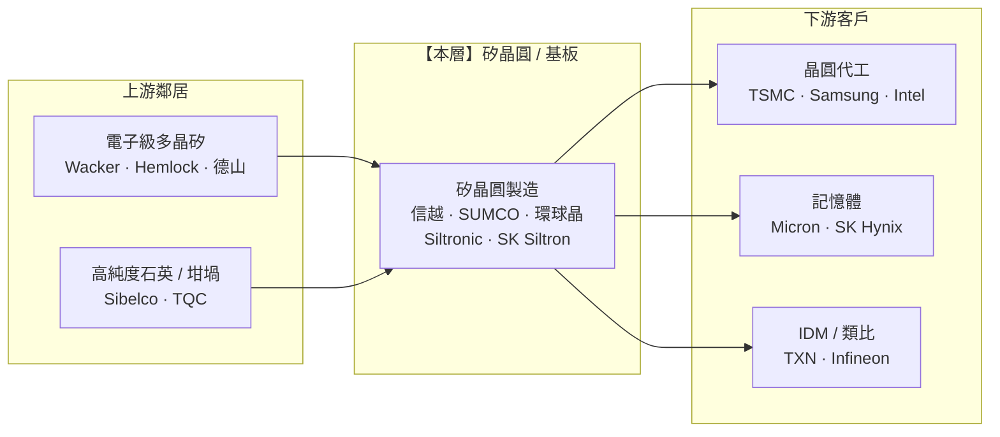

> 大部分人談半導體上游,眼睛只盯著 ASML 的 EUV 曝光機。
> 稍微內行的,會提一下光阻、特殊氣體被日本掐著。
> 但幾乎沒人回頭問:那片「承載一切的圓盤」本身——矽晶圓——到底是誰在做?
> 答案是:全世界能穩定量產 300mm 晶圓的公司,一隻手數得完。這一層,是被低估的寡占。

---

> ⚠️ **免責聲明與資料說明**:本文是一份**結構性產業鏈地圖**,聚焦「矽晶圓 / 基板」這一層的角色、集中度與定價權,不是個股估值報告。文中的市佔率、毛利率區間為**公開產業常識的概估值**(截至 2026 年初),用於說明相對地位,**非即時報價**。任何投資決策前請自行查證最新數據。本文為教育用途,**不構成投資建議**。

---

## 一、這一層在產業鏈的位置

矽晶圓是整條半導體鏈「最下面那塊地基」:所有電晶體、所有 EUV 曝光的圖案、所有 AI 晶片,最後都是刻在這片圓盤上。它上游接的是**多晶矽與高純度石英**,下游賣給**晶圓代工廠、IDM 與記憶體廠**。



**一句話定位**:矽晶圓位於**上游偏材料端**,賣給高度集中的代工/記憶體大客戶;**定價權中等**——受寡占結構、長約(LTA)與嚴格認證鎖定「向上撐住」,但因為一片空白晶圓只佔成品晶片成本的**個位數百分比**、且有約五家可互相替代的供應商,任何一家都**無法像 ASML 那樣把整條鏈勒住**。

---

## 二、這一層到底在做什麼

一句話:把**沙子(石英)**煉成**接近完美的單晶矽圓盤**,純度要達到「99.999999999%(11 個 9,eleven-nines)」等級。流程如下:

```
石英砂 ──► 冶金級矽 ──► 電子級多晶矽 ──► 長晶(CZ 拉晶) ──► 矽晶柱(ingot)
                                              │
                                              ▼
       磨邊 ◄── 切片(wire saw) ◄── 晶柱                    ← 這裡開始就是晶圓廠的活
        │
        ▼
  研磨 / 拋光(CMP) ──► 磊晶 epi / 退火 anneal / SOI ──► 檢測 ──► 出貨給代工廠
        （PW 拋光片）        （附加價值最高的特殊品）
```

**幾個關鍵事實,決定了這一層的商業本質:**

- **尺寸決定戰場**:先進邏輯與記憶體幾乎都跑在 **300mm(12 吋)**晶圓上;**200mm(8 吋)**主要用於類比、電源、MEMS、車用等成熟製程。300mm 的技術與資本門檻遠高於 200mm,寡占程度也更高。曾被寄望的 **450mm 世代已被業界放棄**——這反而讓現有 300mm 產線「不會被逼著重新洗牌」,是難得的穩定因子。
- **產品分級,毛利天差地別**:最基本的是**拋光片(PW)**;往上是**磊晶片(epi)**——在拋光片上長一層更完美的矽,先進邏輯大量使用;最高階是 **SOI(絕緣層上矽)**,用於 RF、FD-SOI 與部分高效能製程,由法國 **Soitec** 以 Smart Cut 技術主導。**特殊基板(epi / SOI / 退火片)才是這一層真正能拉高毛利的地方。**
- **它很便宜,但不能沒有**:一片空白 300mm 晶圓的價格大約**一百多美元**,而在它上面跑完整套製程做出的晶片,價值可以是數千甚至上萬美元。**空白晶圓佔成品成本通常低於 5%**。這一個數字,同時解釋了這一層的「宿命」——買方不會為了省這幾趴去冒斷料風險(給了賣方談判籌碼),但也不可能讓你把價格喊上天(反正是小成本)。

**為什麼是矽、為什麼這麼難?** 矽的優勢是儲量大、能形成穩定的氧化層(SiO₂,就是閘極絕緣的關鍵)、且能長成幾乎無缺陷的單晶。難的不是「矽」,而是「**完美**」:用 **CZ 拉晶法(Czochralski)**把熔融矽以精準轉速慢慢拉出一根幾乎零差排(dislocation-free)的單晶柱,直徑誤差要控制在微米級;切片、拋光後的**平坦度、翹曲度、金屬雜質、顆粒缺陷**都得符合先進製程的變態規格。這套 know-how 需要數十年累積,是新進者幾乎無法在短期內複製的門檻——也是「五強」能維持寡占的根本原因。晶圓出貨量業界以 **SEMI 的 MSI(million square inches,百萬平方英吋)**為統一計量單位,是觀察本層景氣的核心指標。

---

## 三、玩家與競爭格局

全球能穩定量產 300mm 晶圓的公司,基本上就是「**五強**」,合計吃下 **300mm 市場約 90% 以上**——是教科書等級的寡占。

| 公司 | 總部 | 市佔(概估) | 定位與特點 |
|---|---|---|---|
| **信越化學 Shin-Etsu** | 日本 | ~30% | 龍頭;多角化(PVC、光阻),晶圓只是其一,**獲利最穩、抗週期最強** |
| **勝高 SUMCO** | 日本 | ~22–25% | **純半導體矽晶圓**大廠,300mm 純度玩家,週期彈性最大 |
| **環球晶 GlobalWafers（6488.TW）** | 台灣 | ~15% | 併購 SunEdison(MEMC)壯大;積極赴美(德州)/日/歐擴產 |
| **Siltronic** | 德國 | ~12% | Wacker 集團旗下;歐洲唯一大廠,技術扎實 |
| **SK Siltron** | 南韓 | ~10% | 綁定三星、SK 海力士;近年切入 SiC 基板 |

```
300mm 矽晶圓市佔(概估)
────────────────────────────────────────────
信越  Shin-Etsu   ██████████████████  ~30%
勝高  SUMCO       ██████████████░░░░  ~23%
環球晶 GlobalWafers █████████░░░░░░░░░  ~15%
Siltronic         ███████░░░░░░░░░░░  ~12%
SK Siltron        ██████░░░░░░░░░░░░  ~10%
其他              █████░░░░░░░░░░░░░  ~10%
────────────────────────────────────────────
前五大合計 ≈ 90%+   ← 寡占,但「五家」比「一兩家」多,議價力被稀釋
```

**格局重點:**
- **日本雙雄結構性領先**:信越 + 勝高兩家日本廠合計就過半。日本在超高純度長晶、切拋良率上累積數十年 know-how,是這一層真正的技術重心。
- **地理集中在日 / 台 / 德 / 韓**:美國本土幾乎沒有大規模先進矽晶圓產能——這也是為什麼 CHIPS 法案時代,環球晶跑去**德州 Sherman 蓋新廠**、其他家也擴充在地產能,以配合台積電、三星在美設廠的「就近供料」需求。
- **一段沒成的併購**:環球晶 2020–2022 年試圖併購 Siltronic,最後因**德國監管未在期限內放行而破局**——凸顯這一層的整併也受地緣政治牽制。

**300mm 與 200mm 是兩個不同的市場:**

```
              300mm(12 吋)                200mm(8 吋)
──────────────────────────────────────────────────────────────
用途        先進邏輯、DRAM、AI 晶片        類比、電源、MEMS、車用、成熟製程
集中度      極高(五強寡占)              較分散(更多區域型小廠)
資本門檻    極高                          中等
週期        跟 AI / 記憶體大循環同步      跟車用 / 工業 / 消費電子走
──────────────────────────────────────────────────────────────
```

投資上要分清楚:AI 主題直接受惠的是 **300mm**;而 200mm 更像是「車用 + 工業景氣」的代理指標。兩者的供需與價格週期並不同步,有時甚至相反(先進製程缺料時,成熟製程可能正在去化庫存)。

---

## 四、瓶頸分數與定價權

依 industry-map 方法,對四個因子各打 0–10,取平均當作本層的「瓶頸分數」:

```
因子                        分數   說明
──────────────────────────────────────────────────────────────
供應商稀缺度                 6    只有 ~5 家能做 300mm,但比「獨占」寬鬆
不可替代性                   5    矽是無可取代的材料;但五家彼此可替代
切換成本 / 驗證時間          6    認證新晶圓源要 6–18 個月,但買方本就多重採購
需求剛性                     8    沒有晶圓就做不出晶片(不過「量」隨週期大起大落)
──────────────────────────────────────────────────────────────
瓶頸分數(平均)             ≈ 6.0   寡占但非咽喉
```

**定價權往哪流?** —— **中等,方向略偏供應端,但天花板明顯。**

```
撐住定價權的力量                       壓住定價權的力量
────────────────────────────────      ────────────────────────────────
✓ 五強寡占,新進入者極難                ✗ 空白晶圓 <5% 成品成本 → 買方不痛
✓ 長期供應合約(LTA)鎖量鎖價          ✗ 有 ~5 家可互換 → 單一家無法勒索
✓ 換供應商要重新認證(6–18 月)        ✗ 週期性強,供過於求時價格立刻鬆動
✓ 磊晶 / SOI 特殊品有溢價              ✗ 面對台積電這種超大買方,議價被壓
```

**結論**:這一層有**護城河(寡占 + 認證 + 長約),但沒有收費站**。它能在景氣好時「守住不被殺價」,卻很難像 ASML(EUV 獨占)或台積電(先進製程近獨占)那樣「把整條鏈的利潤往自己這邊吸」。瓶頸分數落在 **6.0/10**,與總覽地圖一致。

---

## 五、利潤池與價值捕獲

**價值捕獲:中低,而且強週期。** 這是誠實的定位——不要把它想成 EUV 那種暴利層。

- **毛利/營益率高度隨景氣擺盪**:純玩家(如 SUMCO、環球晶)的營益率在景氣谷底可壓到**低個位數~十幾趴**,高峰時衝到**20–25%+**;多角化的信越因為有 PVC 等其他業務墊底,獲利最穩。這與總覽圖把「材料/矽晶圓」價值捕獲打到 **4/10** 是一致的。
- **為什麼賺不多?** 因為它是「**必要但便宜的輸入**」。買方(代工廠)把絕大部分附加價值留給了「製程」——同一片一百多美元的晶圓,台積電跑完先進製程後價值翻幾十倍,那段暴利是**製程**創造的,不是**晶圓**創造的。
- **利潤池對比鄰居**:

```
層                價值捕獲(概估 0–10)
──────────────────────────────────────
晶圓設備(EUV)   █████████░  9   ← 上游隔壁,咽喉
晶圓代工          ████████░░  8   ← 下游客戶,吃走最厚利潤
電子級多晶矽      █████░░░░░  5   ← 更上游,也是寡占
【矽晶圓/基板】   ████░░░░░░  4   ← 本層:寡占但中低、強週期
高純度石英        ████░░░░░░  4   ← 隱形上游
──────────────────────────────────────
```

- **唯一能往上抬的槓桿 = 產品組合(mix)**:多賣**磊晶片與 SOI**、少賣陽春拋光片,平均單價與毛利就上移。AI 先進邏輯用 epi 比例更高,對這一層是「結構性利多」——但幅度有限,改變不了「中低價值捕獲」的本質。

**一個直覺化的成本拆解**(概估,示意用):

```
一片先進製程晶圓,從空白到成品的價值堆疊
────────────────────────────────────────────────
空白晶圓(本層賣的)     $ ~150        ← 佔比 <5%,本層只吃到這塊
先進製程投片 / 光罩       $ 數千–上萬    ← 台積電吃走的絕大部分附加價值
────────────────────────────────────────────────
洞察:本層辛苦煉出「11 個 9」純度的地基,卻只分到整條鏈利潤的
      薄薄一層。真正的暴利在「製程」,不在「基板」。
```

---

## 六、上游依賴與下游客戶

**往上看(它得買什麼)——藏著一個真正的隱形咽喉:**

- **電子級多晶矽**:半導體級(11N)多晶矽比太陽能級純得多,供應商相對集中(Wacker、Hemlock、德山、OCI 等)。價格與供給會直接傳導到晶圓成本。
- 🔎 **高純度石英(HPQ)——最被忽略的單點風險**:長晶用的**石英坩堝**需要極高純度石英砂,而全球最頂級的來源高度集中於**美國北卡羅來納州 Spruce Pine** 一帶,加上少數挪威/其他礦源。這是一條「平時沒人談、一旦出事(天災、封礦)整條半導體鏈都會顫抖」的隱形供應線——比矽晶圓本身更接近「單點咽喉」。

**往下看(誰買它)——客戶高度集中:**

- 買家就是那幾家**超大代工廠與記憶體廠**:台積電、三星、Intel、Micron、SK 海力士……前幾大客戶就吃掉這一層產出的一大塊。**客戶集中度高 = 這一層繼承了下游的景氣命運**:記憶體一進入下行週期、代工廠一砍稼動率,晶圓訂單立刻縮手(這正是 2023–2024 年 MSI 出貨量下滑的主因)。

**能不能互相整併吃掉對方?**

| 方向 | 會發生嗎? | 原因 |
|---|---|---|
| 下游代工廠**向後**自製晶圓 | 幾乎不會 | 非核心能力、資本回報低,且多重採購比自製更安全;寧可簽 LTA |
| 本層**向前**做代工 | 不會 | 不願與自己的大客戶競爭;安於「賣地基」的軍火商角色 |
| 更上游多晶矽/石英**向前**壓迫本層 | 部分會 | 電子級多晶矽與 HPQ 本身也是寡占,景氣緊時會分走利潤 |

---

## 七、風險

- 🔴 **週期性 / 供過於求**:這是本層最大的風險。產能擴充決策往往在景氣**高點**拍板(2021–2022 榮景時簽了大量 LTA、動土建廠),而新產能要 **2–3 年**才開出——等它開出來,需求可能已反轉,形成「量價齊跌」的殺戮。晶圓是整條鏈中「量」最直接暴露於循環的環節之一。
- 🟠 **客戶集中**:賣給少數幾家代工/記憶體巨頭,任一家砍單或砍價,衝擊立即傳導。
- 🟠 **地緣與在地化成本**:產能集中在日 / 台 / 德 / 韓;CHIPS 時代被要求「就近供料」而在美/歐蓋新廠,**成本更高、回報更差**,但為了綁住大客戶不得不做。
- 🟠 **上游單點(HPQ / 電子級多晶矽)**:高純度石英與電子級多晶矽的來源集中,天災或出口管制會沿鏈放大。
- 🟡 **技術路線變動**:450mm 已放棄(反而是穩定因子);SiC / GaN 是**另一條**高成長但獨立的功率半導體基板賽道(SK Siltron、Coherent、Wolfspeed 等在玩),對傳統矽晶圓是機會也是分流,但短期不威脅本業。
- 🟡 **被內製取代**:機率低,買方沒有動機自製。

---

## 八、價值遷移

**方向:未來 1–3 年,價值「小幅回流」本層,但天花板不變。**

```
現在                        →   未來 1–3 年                →   確認訊號(trigger)
──────────────────────────────────────────────────────────────────────────
2023–24 記憶體/庫存修正        AI 拉動 300mm 邏輯 + HBM/DRAM    SEMI 季度矽晶圓出貨(MSI)
→ 晶圓出貨與 ASP 落底          晶圓需求回升,稼動率回溫          創新高、且 ASP 連續回升
──────────────────────────────────────────────────────────────────────────
陽春拋光片為主              →   磊晶 epi / SOI 占比上升          特殊品營收占比、平均單價上移
                              (先進製程 mix 拉高毛利)
──────────────────────────────────────────────────────────────────────────
產能集中日/台              →   CHIPS 帶動美/歐/日在地新廠        新廠量產 + LTA 以更高價續約
                              (環球晶德州廠等)
```

**一句話**:AI 讓晶圓的「量」與「mix」同步回升,加上在地化長約續約,價值有機會**小幅回流**這一層;但只要它仍是「佔成品 <5% 成本、五家可互換的必要輸入」,它就**回不到咽喉層的暴利**。**真正的風險不是需求,而是自己人在高點蓋太多廠**——若 AI 需求稍有閃失,新產能一開出來就是下一輪殺價。

---

## 九、分層投資點子

把地圖轉成分層點子(教育性質、非投資建議):

| 分層角色 | 較佳定位的名字 | 邏輯 | 點子類型 |
|---|---|---|---|
| **穩健龍頭** | 信越化學 Shin-Etsu | 多角化墊底、抗週期最強,晶圓龍頭 | 核心持有(防禦) |
| **純週期彈性** | 勝高 SUMCO、環球晶(6488.TW) | 純玩家,景氣復甦時營益率彈性最大 | 循環多方 |
| **在地化成長** | 環球晶 GlobalWafers | 赴美/日/歐擴產,綁住海外新 fab | 主題成長 |
| **二階特殊品** | Soitec(SOI)、Siltronic | mix 往高階走的溢價受益者 | 低調 picks ◄ |
| **迴避 / 謹慎** | 缺乏規模的小型 / 純 200mm 商品廠 | 供過於求時最先被殺價 | 迴避 |
| **另一條賽道** | SiC / GaN 基板(Wolfspeed、Coherent) | 功率半導體,獨立於矽晶圓的成長曲線 | 投機性選擇權 |

**最該注意的「非顯性節點」**:市場談上游只會講 ASML,但**高純度石英(Spruce Pine)與電子級多晶矽**這種「上游的上游」,才是這一層真正的單點風險與潛在收費站——它們不是純 AI 題材,卻實實在在卡在每一片晶圓的最底層。

---

## 論點反轉條件(Thesis Invalidation)

**本層結構訊號為 NEUTRAL(略偏建設性);下列情況會打破論點:**
- 五強在高點擴出的產能集中開出,**供過於求 → ASP 與稼動率同步下殺**(本層最典型的循環陷阱)。
- 下游記憶體 / 代工進入下行,大客戶砍單,晶圓出貨(MSI)再度轉跌。
- 磊晶 / SOI 特殊品的溢價被競爭抹平,mix 拉高毛利的邏輯失效。
- 反之,若出現**可信的第六家新進者**或買方大規模自製(機率極低),寡占結構才會真正鬆動。

**重新檢視這一層的時機:**
- [ ] SEMI 季度矽晶圓出貨(MSI)與 ASP 數據公布時
- [ ] 信越 / SUMCO / 環球晶財報與 LTA 續約消息
- [ ] 記憶體週期或代工稼動率出現明顯轉折
- [ ] 距今超過 60–90 天

```
╔══════════════════════════════════════════════╗
║              INDUSTRY-MAP SIGNAL             ║
╠══════════════════════════════════════════════╣
║ 結構訊號:    NEUTRAL(寡占但中低價值捕獲)    ║
║ Confidence:  MEDIUM(結構清晰,循環時點難測)  ║
║ Horizon:     MEDIUM(隨晶圓循環,1 年內)      ║
║ Score:       5.5 / 10(略偏建設性)           ║
╠══════════════════════════════════════════════╣
║ 瓶頸分數:    6.0 / 10(寡占,非咽喉)         ║
║ 偏好:        龍頭(信越)+ 特殊品(SOI)      ║
║ 迴避:        小型純商品 200mm 廠              ║
╚══════════════════════════════════════════════╝
```

評分指引:8.0–10.0 強烈偏多 | 6.0–7.9 中度偏多 | 4.0–5.9 中性 | 2.0–3.9 中度偏空 | 0.0–1.9 強烈偏空

---

### 📚 系列導覽:半導體產業鏈全景（上游 → 下游）

> 總覽地圖:[industry-map - 半導體晶片產業鏈全景](/yennj12_blog_V4/posts/industry-map-semiconductor-value-chain-zh/)

**上游 Upstream**
- **Part 1:[矽晶圓 / 基板](/yennj12_blog_V4/posts/industry-map-semiconductor-part1-silicon-wafer-zh/)（本篇）**
- Part 2:[特用化學 / 光阻](/yennj12_blog_V4/posts/industry-map-semiconductor-part2-chemicals-photoresist-zh/)
- Part 3:[EDA + IP](/yennj12_blog_V4/posts/industry-map-semiconductor-part3-eda-ip-zh/)
- Part 4:[晶圓設備](/yennj12_blog_V4/posts/industry-map-semiconductor-part4-fab-equipment-zh/)

**中游 Midstream**
- Part 5:[晶圓代工](/yennj12_blog_V4/posts/industry-map-semiconductor-part5-foundry-zh/)
- Part 6:[IC 設計 — GPU/加速器](/yennj12_blog_V4/posts/industry-map-semiconductor-part6-gpu-design-zh/)
- Part 7:[IC 設計 — 其他](/yennj12_blog_V4/posts/industry-map-semiconductor-part7-ic-design-zh/)
- Part 8:[記憶體](/yennj12_blog_V4/posts/industry-map-semiconductor-part8-memory-zh/)
- Part 9:[IDM / 類比](/yennj12_blog_V4/posts/industry-map-semiconductor-part9-idm-analog-zh/)
- Part 10:[封裝測試 OSAT](/yennj12_blog_V4/posts/industry-map-semiconductor-part10-osat-zh/)

**下游 Downstream**
- Part 11:[網通 / 互連](/yennj12_blog_V4/posts/industry-map-semiconductor-part11-networking-zh/)
- Part 12:[系統 / 伺服器 OEM](/yennj12_blog_V4/posts/industry-map-semiconductor-part12-system-oem-zh/)
- Part 13:[雲端 CSP](/yennj12_blog_V4/posts/industry-map-semiconductor-part13-cloud-csp-zh/)
- Part 14:[終端需求](/yennj12_blog_V4/posts/industry-map-semiconductor-part14-end-demand-zh/)

---

## 參考來源與方法(References)

- 分析方法:InvestSkill `industry-map` skill(<https://github.com/yennanliu/InvestSkill>)——把產業畫成上游到下游的有向圖,定位咽喉點、利潤池與價值遷移。
- 總覽地圖:[半導體晶片產業鏈全景](https://yennj12.js.org/yennj12_blog_V4/posts/industry-map-semiconductor-value-chain-zh/)。
- 本文市佔率、毛利率、成本佔比等數字均為公開產業常識的**概估值**(截至 2026 年初),用於說明各層相對地位,**非即時報價**。
- 延伸:可搭配本站個股 10-K 深度解析,先看全景、再挑節點深拆。

> 再次提醒:本文為產業結構教學與地圖,市佔/毛利為概估值,**不構成投資建議**。
