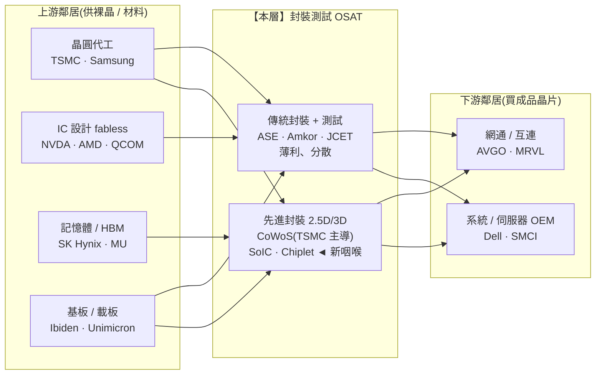

> 大部分人談封測,直覺是「把晶片切一切、包起來、測一測」的髒活累活,毛利薄、沒故事。
> 稍微懂的人會說:這是分散、殺價、被上下游夾殺的商品層,不值得看。
> 但真正看懂 2024–2026 這一輪 AI 的人會告訴你:**GPU 買不到,卡的往往不是晶片本身,而是「封裝產能」。**
> 這一層裂成了兩半——傳統封測還是薄利紅海,但**先進封裝(CoWoS)已經變成整條 AI 鏈最硬的新咽喉之一。**這篇就拆這道裂縫。

---

> ⚠️ **免責聲明與資料說明**:本文是一份**結構性產業鏈地圖(value-chain map)**,聚焦「封裝測試這一層的角色、集中度與定價權」,不是個股估值報告。文中的市佔率、毛利率區間為**公開產業常識的概估值**(截至 2026 年初),用於說明相對地位,**非即時報價**;任何投資決策前請自行查證最新數據。本文為教育用途,**不構成投資建議**。

---

## 一、這一層在產業鏈的位置

封裝測試(OSAT,Outsourced Semiconductor Assembly and Test)位在**中游的最後一站**:晶圓代工把晶片做出來、記憶體與 IC 設計把裸晶(die)備好之後,由封測廠負責「切割、封裝、測試」,把一顆能被系統板使用的完整晶片交出去,再往下游流向網通、系統 OEM。



**一句話定位**:封測是「製造的最後一哩路」。**傳統封測**位置尷尬——上游被代工與材料綁住成本、下游被系統廠殺價,定價權兩頭外流,是典型薄利中游;但**先進封裝**因為 AI 需要把 GPU 裸晶、HBM 堆疊在同一塊矽中介層(interposer)上,產能極度稀缺,定價權反而往供應端(TSMC)強力傾斜。**同一層,兩種命運。**

---

## 二、這一層到底在做什麼

晶圓代工做完的其實是一整片「晶圓」,上面是還沒切開、也還不能用的裸晶。封測這一層做三件事:

```
封測三大工序(Back-End)
─────────────────────────────────────────────────────────
① 封裝 Assembly / Packaging
   ‣ 切割(dicing):把晶圓切成一顆顆裸晶
   ‣ 打線 / 覆晶(wire-bond / flip-chip):把裸晶接到載板的接腳
   ‣ 封膠(molding):包上保護外殼,做出能焊到 PCB 的成品
─────────────────────────────────────────────────────────
② 測試 Test
   ‣ 晶圓測試(CP / wafer sort):切割前先篩掉壞晶
   ‣ 成品測試(FT / final test):封裝後驗證電性、篩選等級
   ‣ 測試機台貴、工時長,是專門的一門生意(如京元電)
─────────────────────────────────────────────────────────
③ 先進封裝 Advanced Packaging(這一層的新戰場)
   ‣ 2.5D:GPU 裸晶 + 多顆 HBM 並排,放在矽中介層上 → CoWoS
   ‣ 3D:裸晶直接疊裸晶、以矽穿孔(TSV)連接 → SoIC / HBM 堆疊
   ‣ Chiplet:把一顆大晶片拆成多顆小晶片,再用封裝「縫」回去
─────────────────────────────────────────────────────────
```

**為什麼這一層存在?** 三十年前「設計與製造分家」催生了台積電這種純代工;同一個外包邏輯也催生了純封測廠——設計公司與 IDM 把後段的資本設備(打線機、測試機、封裝產線)外包出去,換取輕資產與彈性。這讓封測長期是個**「代工的代工」**:規模、良率、成本是唯一武器,沒有品牌、沒有議價權。

**但摩爾定律撞牆改寫了規則。** 當單一裸晶越做越大、越做越貴,良率越來越難救,業界改用**「先拆再拼」**:把大晶片拆成數顆小 chiplet(各自用最合適的製程),再靠先進封裝拼起來。於是「封裝」從最後的髒活,升級成決定晶片效能與成本的**系統級整合(system-level integration)**——這正是價值重新流回這一層的技術根源。

---

## 三、玩家與競爭格局

封測是半導體各層裡**最分散**的一層。全球 OSAT 市場一年約 400–450 億美元(概估),前十大加起來也吃不下八成,長尾一堆區域小廠。

| 公司 | 代碼 | 角色與定位 | OSAT 市佔(概估) | 毛利率(概估) |
|---|---|---|---|---|
| **日月光 ASE** | ASX | 全球最大 OSAT(含矽品 SPIL);打線、覆晶、SiP 全線最全 | ~28–30%(龍頭) | 封測本業 ~20–25% |
| **艾克爾 Amkor** | AMKR | 全球第二;車用、SiP 強,美國亞利桑那新廠貼近在地化 | ~14–16% | ~14–17% |
| **長電科技 JCET** | 600584.SH | 中國最大、全球第三;吃在地化與國產替代紅利 | ~10–12% | ~13–16% |
| **力成 / 京元電 / 頎邦等** | — | 記憶體封測、測試代工、驅動 IC 等專業利基 | 各 <5% | 利基較穩 |
| **台積電(先進封裝)** | TSM | 非傳統 OSAT,但 **CoWoS / SoIC 主導者** ◄ | (另計) | 併入其 ~55–59% |

**市佔位置(傳統 OSAT,概估):**

```
公司              OSAT 市佔
────────────────────────────────────────────
日月光 ASE        ████████████ ~28-30%  ◄ 龍頭,但仍非壟斷
艾克爾 Amkor      ██████ ~14-16%
長電 JCET         █████ ~10-12%
力成 Powertech    ██ ~4%
其他長尾(數十家) ████████████████ 合計 ~35%+
────────────────────────────────────────────
→ 前三大合計僅 ~55%,遠比代工(台積電一家 >60%)分散
```

**兩個關鍵事實:**

1. **傳統封測沒有真正的龍頭壟斷。** 日月光是老大,但市佔不到三成,客戶隨時能把訂單分給第二、第三家——這就是薄利的結構性原因:**產品高度同質、切換成本低。**

2. **先進封裝的格局完全不同。** AI GPU 用的 **CoWoS(Chip-on-Wafer-on-Substrate)**,產能高度集中在**台積電**手上;它把封裝與自家先進製程、SoIC 3D 堆疊綁成一條龍,良率與整合度領先。日月光、Amkor 也在追(自建 2.5D / 面板級封裝產能),但在 AI 旗艦訂單上,台積電 CoWoS 是**近乎唯一的可靠選項**。**一個分散的層裡,長出了一個高度集中的咽喉。**

---

## 四、瓶頸分數與定價權

用四個因子各打 0–10,平均得瓶頸分數。**這一層必須拆成兩段打分**,因為它們的結構天差地遠。

```
傳統封測(commodity OSAT)
────────────────────────────────────────────
供應商稀缺度      ███░░░░░░░  3   數十家可做,龍頭僅 ~30%
不可替代性        ███░░░░░░░  3   產品同質,換廠容易
切換成本/驗證     ████░░░░░░  4   需重新認證,但非天塹
需求剛性          █████░░░░░  5   鏈子少不了封裝,但任何一家都行
────────────────────────────────────────────
平均瓶頸分數 ≈ 3.75  → 定價權往「買方(設計公司)」傾斜
```

```
先進封裝(CoWoS / 2.5D / 3D)
────────────────────────────────────────────
供應商稀缺度      █████████░  9   CoWoS 產能極集中(TSMC 主導)
不可替代性        █████████░  9   AI GPU 沒有等效替代封裝
切換成本/驗證     ████████░░  8   與代工製程綁定,認證 12-18 個月
需求剛性          █████████░  9   GPU 出不了貨 = 封裝出不了貨
────────────────────────────────────────────
平均瓶頸分數 ≈ 8.75  → 定價權往「供應端(封裝廠)」強力傾斜
```

**定價權方向總結:**

- **傳統封測**:定價權**往下游流失**。設計公司握著訂單,能在 ASE / Amkor / JCET 之間比價,封測廠只能靠稼動率與規模守毛利。這是「被夾殺」的教科書位置。
- **先進封裝**:定價權**往供應端集中**。CoWoS 產能不足時,NVIDIA、AMD 得排隊、預付、包產能;封裝廠反而能挑客戶。這是本輪 AI 少數「賣方市場」的節點之一。

**整層綜合(加權後)≈ 5.5 / 10**——一個「平均分中庸、但變異極大」的層:大部分是薄利商品,少數頂端是硬咽喉。

---

## 五、利潤池與價值捕獲

封測長期是半導體鏈裡**價值捕獲最低**的幾層之一(參見總覽圖:封測 OSAT 價值捕獲僅 3/10)。原因是結構性的:

```
為什麼傳統封測賺不到錢
─────────────────────────────────────────────────────────
• 產品同質      → 沒有差異化,只能拚價格與稼動率
• 資本密集      → 打線/測試機台貴,折舊重,但又不像 EUV 有壟斷
• 客戶集中且強勢 → 面對 NVIDIA/高通這種大買方,議價權在對方
• 週期性        → 消費電子淡旺季直接灌進稼動率,毛利上下劇烈擺盪
→ 結果:傳統封測毛利長期卡在 ~15-25%,營益率常在個位數到低雙位數
─────────────────────────────────────────────────────────
```

**但先進封裝正在這一層裡「切出」一塊高利潤飛地。** CoWoS、SoIC 這類 2.5D/3D 封裝,技術門檻高、產能稀缺、與 AI 旗艦晶片深度綁定,毛利結構完全不同:

| 子區塊 | 商業模式 | 毛利率(概估) | 定價權 |
|---|---|---|---|
| 傳統打線封裝 | 量大、同質、拚成本 | ~15–20% | 買方 |
| 覆晶 / SiP 進階封裝 | 中階整合,黏著度較高 | ~20–28% | 中性 |
| 先進封裝(OSAT 版 2.5D) | 稀缺產能,大廠追建 | ~30%+ | 賣方 |
| **CoWoS(台積電)** | 綁自家製程一條龍 | 併入 ~55–59% | **強賣方 ◄** |

**利潤池洞察**:傳統封測的利潤池又薄又週期;**真正肥的利潤不在「封測業」本身,而被台積電用「代工 + CoWoS 一條龍」吸走了。** 對純 OSAT(ASE/Amkor)而言,先進封裝是「往上升級、逃離紅海」的唯一出路——誰能在 2.5D/面板級封裝卡到 AI 旗艦以外的第二波訂單(推論卡、客製 ASIC),誰的毛利結構就能被重估。

---

## 六、上游依賴與下游客戶

**上游要買什麼(投入依賴):**

```
封測廠的上游採購
─────────────────────────────────────────────────────────
• 裸晶(die)      ← 晶圓代工 / IC 設計 / 記憶體(這是「料」,通常客戶指定)
• 封裝載板/基板   ← Ibiden、欣興、南電(ABF 載板一度是隱形瓶頸)🟠
• 打線/測試機台   ← 設備商(K&S、ASM、Teradyne、愛德萬)
• 材料            ← 打線金屬、封膠、矽中介層(先進封裝的關鍵)
─────────────────────────────────────────────────────────
```

其中 **ABF 載板(先進封裝用的高階基板)** 在 2021–2022 曾是缺料瓶頸,顯示封測的上游也可能單點卡關;**矽中介層**與 **CoWoS 專用材料**則是先進封裝能否放量的關鍵投入。

**下游賣給誰(客戶集中度):**

- 傳統封測:客戶分散在各 IC 設計、IDM、記憶體廠,單一客戶佔比通常不極端,但**大客戶(如手機 SoC、GPU 大廠)議價力極強**。Amkor 有相當比例營收來自單一大型行動客戶,是集中度風險。
- 先進封裝:客戶高度集中在 **NVIDIA、AMD、以及少數自研 ASIC 的雲端業者**。這既是「賣方市場」的來源(需求剛性),也是風險(AI 資本支出一反轉,產能立刻過剩)。

**能不能被整合掉?(這才是本層最大的結構變化)**

```
向前 / 向後整合的張力
─────────────────────────────────────────────────────────
▸ 供應商向前整合(最大威脅):台積電把「代工 → 先進封裝(CoWoS/SoIC)」
  整條吃下,等於從上游跨進封測、把最肥的先進封裝利潤留在自己體內。
  → 對純 OSAT 是結構性壓力:AI 旗艦的高階封裝,輪不到你做。
▸ 買方向後整合:設計公司通常不會自建封測(資本重、非核心),
  但會「指定材料、壓價、雙供應」——用採購策略壓縮封測毛利。
─────────────────────────────────────────────────────────
```

**洞察**:封測是少數「被上游(台積電)向前整合侵蝕」比「被下游向後整合」更嚴重的層。台積電的 CoWoS 一條龍,直接把先進封裝這塊新蛋糕的主導權從傳統 OSAT 手中拿走——這是理解本層投資邏輯的核心。

---

## 七、風險

- 🔴 **被台積電向前整合擠壓(結構性)**:AI 最肥的先進封裝訂單被台積電 CoWoS/SoIC 一條龍鎖住,純 OSAT 只能吃二線與追趕產能,先進封裝的「重估故事」對 ASE/Amkor 可能只兌現一部分。
- 🔴 **強週期 + 稼動率槓桿**:封測是重資產,稼動率一掉,毛利就崩。消費電子疲弱、記憶體週期下行時,傳統封測獲利彈性向下極大。
- 🟠 **AI 資本支出反轉**:先進封裝的賣方市場建立在 AI 需求剛性上。一旦 CSP 大砍資本支出、GPU 交期正常化,搶建的 CoWoS 產能可能瞬間從短缺變過剩。
- 🟠 **客戶集中**:Amkor 對單一大型行動客戶、先進封裝對少數 GPU 客戶的依賴,任何一家砍單衝擊直接。
- 🟠 **上游缺料(ABF 載板 / 矽中介層)**:先進封裝放量受制於載板與中介層供給,曾出現卡關前例。
- 🟡 **地緣與在地化成本**:美國(Amkor 亞利桑那)、中國(JCET 國產替代)的區域化封裝供應鏈,推升成本、切割市場,長期壓縮規模經濟。
- 🟡 **技術路線分歧**:2.5D vs 3D、矽中介層 vs 面板級(panel-level)封裝,押錯技術世代會浪費資本支出。

---

## 八、價值遷移

**方向:價值正「流入」先進封裝、持續「流出」傳統封測——但主要的增量利潤被上游(台積電)攔截。**

```
現在                →   未來 1–3 年              →   確認訊號(trigger)
──────────────────────────────────────────────────────────────────────
傳統打線封裝薄利       持續商品化、微利穩定         毛利無明顯改善,隨週期波動
CoWoS 一條龍(TSMC)   先進封裝需求持續 >整體 2x     CoWoS 產能年年倍增仍供不應求
──────────────────────────────────────────────────────────────────────
單一大晶片(monolithic) Chiplet 成為主流架構         越來越多旗艦晶片改用多裸晶
                                                    → 封裝從「後段」變「系統整合核心」
──────────────────────────────────────────────────────────────────────
只有 AI 旗艦用先進封裝  推論卡 / 客製 ASIC / 高階     第二波先進封裝訂單外溢到
                       手機也要 2.5D/3D             純 OSAT(ASE/Amkor 產能被填滿)
──────────────────────────────────────────────────────────────────────
```

**一句話**:摩爾定律變慢,把「效能提升」的責任從「更小的電晶體」逐步交棒給「更好的封裝」——**封裝正在從價值鏈的最末端,往上爬成決定晶片競爭力的關鍵環節。** 短期最大贏家是綁住 CoWoS 的台積電;純 OSAT 的機會在於「先進封裝的第二波外溢」——當 AI 旗艦以外的推論、ASIC、高階消費晶片也開始需要 2.5D/3D 時,ASE、Amkor 的產能與毛利才會真正被重估。

---

## 九、分層投資點子(教育性質、非投資建議)

| 分層角色 | 較佳定位的名字 | 邏輯 | 點子類型 |
|---|---|---|---|
| **真正的先進封裝咽喉** | 台積電(CoWoS/SoIC) | AI GPU 出貨的實體瓶頸,一條龍捕獲最肥利潤 | 核心(但屬代工層,見 Part 5) |
| **二階 picks-and-shovels** | ASE 日月光、Amkor | 先進封裝第二波外溢的直接受益者,市場覆蓋不足 ◄ | 低調、易被低估 |
| **利基穩定** | 京元電(測試)、力成(記憶體封測) | 專業測試/記憶體封測,週期較緩、競爭較利基 | 防禦性配置 |
| **在地化選擇權** | JCET 長電、Amkor(美國廠) | 押注供應鏈區域化與國產替代紅利 | 主題性投機 |
| **迴避 / 空方候選** | 純傳統打線封裝、無先進封裝布局的長尾廠 | 同質商品、被上下游夾殺,毛利無出路 | 迴避 |

**最該注意的「非顯性節點」**:市場追 GPU、追 HBM,卻常忽略——**先進封裝(尤其 CoWoS)是 2024–2026 這一輪實際卡住 GPU 出貨的物理瓶頸之一。** 它不是純 AI 題材股,但它的產能開出速度,直接決定了多少張 GPU 能離開工廠。這正是總覽圖點名「市場覆蓋不足的二階供應商」的代表節點。

**誠實提醒**:別把整個封測業當 AI 股買。**傳統封測仍是薄利、分散、強週期的商品層**;真正值錢的是「先進封裝」這塊飛地,而它的主導權目前握在台積電手上,純 OSAT 只吃到外溢的邊。

---

## 論點反轉條件(Thesis Invalidation)

**若對「先進封裝節點」持 BULLISH,下列情況會打破論點:**
- CoWoS / 先進封裝產能大幅開出,供需反轉,封裝從「短缺」變「過剩」,定價權回到買方。
- AI 資本支出循環反轉,CSP 大砍 GPU 訂單,先進封裝需求剛性瓦解。
- Chiplet 架構未如預期普及,先進封裝需求停留在少數旗艦,無法外溢到純 OSAT。
- 面板級封裝或其他新技術顛覆現有 2.5D 路線,搶建的產能貶值。

**若對「傳統封測層」持 NEUTRAL/BEARISH,下列情況會反轉(轉為偏多):**
- 先進封裝需求外溢到推論卡、ASIC、高階消費晶片,填滿 ASE/Amkor 產能並拉高整體毛利。
- 供應鏈區域化推升封測議價權(在地產能稀缺 → 賣方市場)。

**重新檢視這張地圖的時機:**
- [ ] 台積電 CoWoS 產能規劃、日月光/Amkor 財報與先進封裝營收占比
- [ ] GPU 交期是否正常化(短缺緩解 = 瓶頸鬆動的訊號)
- [ ] AI 資本支出循環轉向
- [ ] 距今超過 60–90 天

```
╔══════════════════════════════════════════════╗
║              INDUSTRY-MAP SIGNAL             ║
╠══════════════════════════════════════════════╣
║ 結構訊號:  先進封裝 BULLISH / 傳統封測 NEUTRAL ║
║ Confidence: MEDIUM(結構清晰,循環時點難測)   ║
║ Horizon:    LONG-TERM(1 年以上)             ║
║ Score:      5.5 / 10(整層;先進封裝段 ~8.5)  ║
╠══════════════════════════════════════════════╣
║ 偏好層級:  先進封裝(CoWoS)+ 二階 OSAT 外溢  ║
║ 迴避層級:  無先進封裝布局的純傳統打線封裝     ║
╚══════════════════════════════════════════════╝
```

評分指引:8.0–10.0 強烈偏多 | 6.0–7.9 中度偏多 | 4.0–5.9 中性 | 2.0–3.9 中度偏空 | 0.0–1.9 強烈偏空

**整層之所以只給 5.5**:這是一個「平均中庸、變異極大」的層——大部分產能是薄利商品(該偏空),頂端的先進封裝卻是硬咽喉(強偏多),兩者平均後落在中性偏上。**投資這一層的關鍵不是買「封測」,而是精準買到「先進封裝」的曝險。**

---

## 系列導覽

### 📚 系列導覽:半導體產業鏈全景(上游 → 下游)

> 總覽地圖:[industry-map - 半導體晶片產業鏈全景](/yennj12_blog_V4/posts/industry-map-semiconductor-value-chain-zh/)

**上游 Upstream**
- Part 1:[矽晶圓 / 基板](/yennj12_blog_V4/posts/industry-map-semiconductor-part1-silicon-wafer-zh/)
- Part 2:[特用化學 / 光阻](/yennj12_blog_V4/posts/industry-map-semiconductor-part2-chemicals-photoresist-zh/)
- Part 3:[EDA + IP](/yennj12_blog_V4/posts/industry-map-semiconductor-part3-eda-ip-zh/)
- Part 4:[晶圓設備](/yennj12_blog_V4/posts/industry-map-semiconductor-part4-fab-equipment-zh/)

**中游 Midstream**
- Part 5:[晶圓代工](/yennj12_blog_V4/posts/industry-map-semiconductor-part5-foundry-zh/)
- Part 6:[IC 設計 — GPU/加速器](/yennj12_blog_V4/posts/industry-map-semiconductor-part6-gpu-design-zh/)
- Part 7:[IC 設計 — 其他](/yennj12_blog_V4/posts/industry-map-semiconductor-part7-ic-design-zh/)
- Part 8:[記憶體](/yennj12_blog_V4/posts/industry-map-semiconductor-part8-memory-zh/)
- Part 9:[IDM / 類比](/yennj12_blog_V4/posts/industry-map-semiconductor-part9-idm-analog-zh/)
- **Part 10:[封裝測試 OSAT](/yennj12_blog_V4/posts/industry-map-semiconductor-part10-osat-zh/)（本篇）**

**下游 Downstream**
- Part 11:[網通 / 互連](/yennj12_blog_V4/posts/industry-map-semiconductor-part11-networking-zh/)
- Part 12:[系統 / 伺服器 OEM](/yennj12_blog_V4/posts/industry-map-semiconductor-part12-system-oem-zh/)
- Part 13:[雲端 CSP](/yennj12_blog_V4/posts/industry-map-semiconductor-part13-cloud-csp-zh/)
- Part 14:[終端需求](/yennj12_blog_V4/posts/industry-map-semiconductor-part14-end-demand-zh/)

---

## 參考來源與方法(References)

- 分析方法:InvestSkill `industry-map` skill(<https://github.com/yennanliu/InvestSkill>)——把產業畫成上游到下游的有向圖,定位咽喉點、利潤池與價值遷移。
- 本文的市佔率/毛利率為公開產業常識的**概估值**(截至 2026 年初),用於說明各層相對地位,非即時報價。
- 總覽地圖:<https://yennj12.js.org/yennj12_blog_V4/posts/industry-map-semiconductor-value-chain-zh/>

> 再次提醒:本文為產業結構教學與地圖,市佔/毛利為概估值,**不構成投資建議**。
