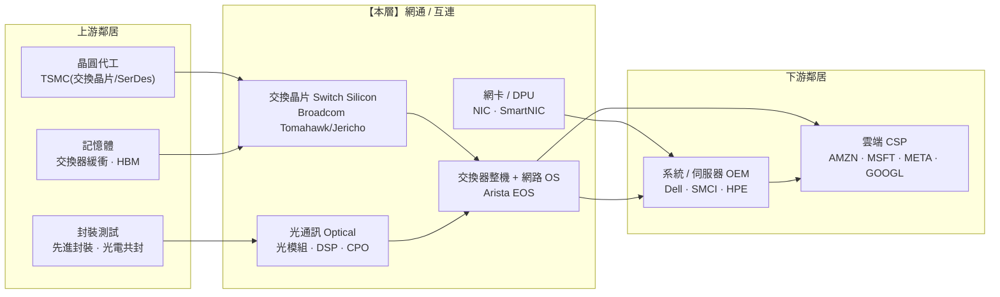

> 大部分人看 AI 資料中心,只數「買了幾顆 GPU」。
> 稍微進階的人會問「這些 GPU 是哪家代工、用什麼 HBM」。
> 但真正懂 AI 基礎設施的人會問一個更狠的問題:
> **「這幾萬顆 GPU,是用什麼把它們接成『一台機器』的?那條線,才是新的瓶頸。」** 這篇拆的就是那條線。

---

> ⚠️ **免責聲明與資料說明**:本文是半導體產業鏈系列的 **Part 11**,聚焦「網通 / 互連(networking & interconnect)」這一層的**結構性地圖**——它的角色、集中度與定價權,不是個股估值報告。文中的市佔率、毛利率區間為**公開產業常識的概估值**(截至 2026 年初),用於說明相對地位,**非即時報價**;任何投資決策前請自行查證最新數據。本文為教育用途,**不構成投資建議**。

---

## 一、這一層在產業鏈的位置

網通/互連坐在中游(晶片製造好之後)與下游(組成系統、賣給雲端)之間的關鍵接點。它的上游是晶圓代工與封測(把交換晶片、光模組晶片做出來),下游是伺服器 OEM 與雲端 CSP(把交換器裝進機櫃、串成叢集)。



**一句話定位**:網通/互連是「把單顆晶片變成一台超級電腦」的黏著劑;在 AI 訓練叢集裡,它從過去不起眼的配角,升格成**與 GPU 平起平坐的一級瓶頸**。定價權明顯往「交換晶片 + 客製互連 ASIC」這個子層傾斜,但整機組裝與光模組競爭較激烈。

---

## 二、這一層到底在做什麼

一顆 GPU 再強,算力也有物理上限。要練一個前沿大模型,需要把**數千到數萬顆 GPU**當成「一台機器」協同運算——而它們之間每一步都要交換梯度、參數、KV cache。這時候,決定整個叢集效率的,不是單顆 GPU 多快,而是**它們之間的線有多快、延遲多低、會不會塞車**。互連,就是在做這件事。它分兩個層次:

```
┌──────────────────────────────────────────────────────────────┐
│  Scale-Up(機櫃內 / 節點內互連)                              │
│  ‣ 把一台伺服器 / 一個機櫃內的 8~72 顆 GPU 綁成一個大記憶體池 │
│  ‣ 需求:超高頻寬、超低延遲、記憶體語意(load/store)         │
│  ‣ 代表:NVLink(NVIDIA 私有)、UALink(開放陣營在追)        │
├──────────────────────────────────────────────────────────────┤
│  Scale-Out(機櫃間 / 資料中心網路)                           │
│  ‣ 把成百上千個機櫃串成一個訓練叢集                          │
│  ‣ 需求:高吞吐、無阻塞拓撲、可擴展、成本可控                │
│  ‣ 代表:InfiniBand(NVIDIA)vs Ethernet(開放陣營)         │
└──────────────────────────────────────────────────────────────┘
```

要把這兩層做出來,牽涉三種關鍵零組件:

- **交換晶片(switch silicon)**:交換器的心臟。決定單顆晶片能塞多少頻寬(以 Tbps 計)、多少埠。這是本層技術門檻最高、利潤最厚的地方。
- **光通訊(optical)**:當速率衝到 800G / 1.6T,銅線只能走幾公尺,長距離必須靠**光模組**(把電訊號轉成光)。裡面有雷射、光學元件,還有一顆做訊號處理的 **DSP**。下一步是 **CPO(co-packaged optics,光電共封)**——把光引擎直接封進交換晶片旁邊,省電、省延遲。
- **網卡 / DPU**:每顆 GPU 出口的那張網卡(NIC),以及把網路、儲存、安全卸載掉的 DPU。

**為什麼這層在 AI 時代才爆發?** 傳統雲端跑的是「很多獨立的小工作」,網路塞一點沒關係。但 AI 訓練是「一個巨大工作、幾萬顆 GPU 同步」,**只要有一條線慢、一顆 GPU 在等資料,整台幾億美元的叢集就跟著空轉**。互連從「夠用就好」變成「決定你 GPU 利用率」的東西——這就是價值遷移進來的根本原因。

---

## 三、玩家與競爭格局

這層的三個主角分工不同:Broadcom 賣「晶片」(元件級)、Arista 賣「整機 + 軟體」(系統級)、Marvell 賣「連接與客製矽」(元件+客製)。此外還有一個繞不開的對手——NVIDIA,它靠 InfiniBand + NVLink + Spectrum 想把整條互連垂直整合進自家生態。

```
交換晶片(merchant switch silicon)市佔概估
────────────────────────────────────────────────
Broadcom      ███████████████░░░  ~商用交換晶片龍頭,壓倒性領先
其他/自研      ██████░░░░░░░░░░░░  Marvell · Cisco Silicon One · CSP 自研
────────────────────────────────────────────────
註:此指「賣給別人用」的商用晶片。NVIDIA 的 InfiniBand/Spectrum
    多為自家垂直整合、不外賣,屬另一個賽道。
```

| 公司 | 本層角色 | 招牌產品 | 定位與護城河 | 毛利率(概估) |
|---|---|---|---|---|
| **博通 Broadcom(AVGO)** | 交換晶片 + 客製 AI ASIC + 光學元件 | Tomahawk(scale-out 高吞吐)、Jericho(深緩衝、AI fabric)、SerDes | 商用交換晶片絕對龍頭;同時幫 CSP 做客製 AI 加速器,兩頭通吃 | ~60%+(半導體端) |
| **Marvell(MRVL)** | 客製矽 + 連接 + 光 DSP | 客製 AI ASIC、電/光 SerDes、光模組 DSP、DCI | 「客製矽 + 連接 IP」路線,和 Broadcom 正面對打客製 ASIC 這塊 | ~60%(非 GAAP) |
| **Arista(ANET)** | 交換器整機 + 網路作業系統 | 高階資料中心交換器、**EOS** 軟體 | 用 Broadcom 的晶片、贏在**軟體(EOS)+ 大客戶信任**;超大規模業者的 Ethernet 首選 | ~60%+(硬體公司裡罕見的高) |
| （對照)NVIDIA | 垂直整合互連 | InfiniBand(Quantum)、**NVLink**、Spectrum-X Ethernet | 綁定 GPU 一起賣,scale-up 幾乎壟斷 | 極高 |

**兩條戰線,誰在贏?**

1. **晶片層:Broadcom 幾乎定義了商用交換晶片**。連 Arista、思科、白牌交換器大多都用它的 Tomahawk/Jericho。這是「賣鏟子給所有交換器廠」的位置——不管哪家整機廠勝出,Broadcom 都收晶片錢。Marvell 則從「客製矽 + 光連接」側翼切入。
2. **系統層:Arista 靠軟體贏**。硬體本身用的是 Broadcom 公版晶片,但 Arista 的 **EOS 作業系統**(單一映像、可程式化、極穩)讓超大規模業者願意付溢價、且一旦導入極難更換——這是硬體外殼裡的**軟體護城河**。

---

## ⚠️ 與 Part 7(IC 設計)的分工說明

博通與 Marvell **同時出現在 Part 7(IC 設計 — 其他)與本篇**——這不是重複,而是同一家公司橫跨兩層:

```
Part 7 視角(IC 設計)          本篇 Part 11 視角(網通/互連)
──────────────────────────────────────────────────────────
把它們當「無廠 IC 設計公司」    把它們當「AI 資料中心互連的供應商」
看整體設計能力、客製 ASIC       只看交換晶片 · SerDes · 光 DSP · 客製互連
與下游議價力                    看它在「把 GPU 接成叢集」裡的角色
```

一句話:**Part 7 談的是「它們會不會設計晶片」,本篇談的是「它們賣的網路/互連零件在 AI 叢集裡有多不可或缺」。** 本篇只評估其網通/互連業務對應的結構位置。

---

## 四、瓶頸分數與定價權

對本層打「瓶頸分數」(0–10):供應商稀缺度、不可替代性、切換成本、需求剛性——四項平均。

```
評分項目              分數   說明
──────────────────────────────────────────────────────────
供應商稀缺度           6    商用交換晶片近乎 Broadcom 獨大;但光模組供應商眾多
不可替代性             6    Ethernet⇄InfiniBand 有替代路徑;客製 ASIC 也在鬆動
切換成本 / 驗證         7    網路 OS(EOS)+ 已驗證拓撲,換掉風險高、週期長
需求剛性               8    AI 叢集沒有互連根本跑不動,需求極度剛性
──────────────────────────────────────────────────────────
瓶頸分數(平均)      6.5   中高——不是 ASML 級硬咽喉,但遠高於組裝層
```

**定價權往哪流?** 明顯分層:

- **交換晶片 + 客製 AI ASIC 子層(Broadcom)**:接近 8 分,定價權強。少數玩家、技術門檻高(先進製程 SerDes)、驗證週期長,是本層真正的收費站。
- **整機 + 網路 OS(Arista)**:靠軟體黏著度守住溢價,約 6–7 分。
- **光模組 / 一般整機組裝**:更接近 4–5 分,玩家多、殺價激烈,是本層裡最「商品化」的部分。

**一句話**:本層的定價權**不是均勻分布**的——越靠近「難做的矽與難換的軟體」越硬,越靠近「組裝與模組」越軟。投資上要精準區分子層,不能把整層當成一塊。

---

## 五、利潤池與價值捕獲

本層整體價值捕獲屬「**高**」,而且是這輪 AI 週期裡**價值正在流入**的少數下游層之一。原因:

```
利潤為什麼厚?
─────────────────────────────────────────────────────────
① 從「配角」變「一級瓶頸」
   AI 叢集規模越大,互連佔資料中心成本比重越高
   (從個位數 % 往上抬),整塊餅在變大
② 速率每一代翻倍 = 強制升級週期
   400G → 800G → 1.6T,每代都逼客戶換晶片、換光模組
   → 這是「規格驅動」的成長,不靠出貨顆數
③ 軟體 + 矽的雙重黏著
   Arista 靠 EOS、Broadcom 靠 SerDes/驗證,毛利守得住
─────────────────────────────────────────────────────────
```

**利潤池分布(與鄰居相比)**:在「OSAT → 網通 → OEM → CSP」這段下游鏈裡,**網通/互連的毛利遠高於它兩邊的鄰居**。伺服器 OEM(下游)是薄利組裝(~10–15%);OSAT(上游)一般封裝也薄利。網通這層能維持 60% 上下的半導體級毛利,是因為它賣的是「難做的晶片」與「難換的軟體」,而不是「把零件拼起來」。

**一句話**:在下游這片薄利區裡,網通/互連是一個**利潤孤島**——它更像中游的 IC 設計,而不像它旁邊的系統組裝。

---

## 六、上游依賴與下游客戶

```
上游(它要買什麼)                本層              下游(誰買它)
──────────────────────────────────────────────────────────────────
台積電先進製程(交換晶片/SerDes) ─┐              ┌─ 伺服器 OEM(Dell/SMCI)
先進封裝 / 光電共封(CPO)        ─┼─ 網通/互連 ─┼─ 雲端 CSP(AMZN/MSFT/
光學元件 · 雷射 · DSP            ─┘              │  META/GOOGL)◄ 高度集中
                                                 └─(部分)網路設備商
```

**上游依賴**:

- 🔴 **綁死台積電先進製程**:高階交換晶片與 SerDes 一樣要最新製程,和 GPU 搶同一批晶圓與 CoWoS 級封裝產能。交換晶片吃緊時,瓶頸和 GPU 同源。
- 🟠 **光模組供應偏分散但受制於少數關鍵料**:雷射、特定光學元件供應集中,遇缺料會卡整條光鏈。

**下游客戶——高度集中在少數 CSP**:

這是本層**最大的結構性風險**。AI 網路設備的買家高度集中在四五家超大規模業者。這帶來兩個後果:

1. **議價與集中風險**:任何一家 CSP 砍 AI 資本支出,訂單波動會直接打到本層。
2. **向後整合(in-sourcing)的威脅**:CSP 有能力、也有動機自己做——但這裡有個微妙之處:**它們的「自研」很多是找 Broadcom/Marvell 做客製晶片**,所以 CSP 自研 ASIC 反而**餵養**了本層的客製矽業務。真正被繞過的是「賣公版整機的廠商」,而不是「賣底層矽的 Broadcom」。

**能不能被垂直整合掉?** NVIDIA 正在示範:它把 InfiniBand、NVLink、Spectrum Ethernet 全部整合進 GPU 生態一起賣,試圖把互連從「別人賺的錢」收進自己口袋。這是本層長期最大的競爭壓力——但也正因如此,CSP 更想扶植**開放 Ethernet 陣營**當作制衡,反而給了 Broadcom/Arista 順風。

---

## 七、風險

- 🔴 **NVIDIA 垂直整合互連**:NVLink(scale-up)近乎壟斷,Spectrum-X 又想搶 scale-out Ethernet 這塊。若 NVIDIA 把「GPU + 互連」綁成一整包賣,商用互連玩家的空間會被壓縮。這是本層最大的單一威脅。
- 🔴 **CSP 客戶集中 + 資本支出循環**:買家就那幾家,AI 資本支出一旦反轉,訂單能見度會迅速惡化——下游需求的長鞭效應會沿鏈往這層放大。
- 🟠 **技術路線押錯(Ethernet vs InfiniBand、CPO 時程)**:若開放 Ethernet 陣營整合速度不如預期,或 CPO 商用化一再延後,押注方向的玩家會受傷。
- 🟠 **光模組價格戰**:光模組這個子層玩家眾多、進入門檻相對低,是本層最容易被殺價、被商品化的環節。
- 🟡 **上游製程/封裝排擠**:高階交換晶片與 GPU 搶同一批先進製程與封裝產能,供給吃緊時交期與成本上升。

---

## 八、價值遷移

**方向:價值正在「流入」這一層**,而且是 AI 下游少數還在變厚的節點。驅動與確認訊號:

```
現在                    →   下一步(1–3 年)          →   確認訊號(trigger)
────────────────────────────────────────────────────────────────────────
GPU 本身是唯一瓶頸           互連成為並列瓶頸              GPU 交期正常化後,
                            (「有 GPU 也接不快」)         叢集瓶頸轉向網路頻寬
────────────────────────────────────────────────────────────────────────
可插拔光模組                 CPO 光電共封導入             CPO 進入量產、
(耗電、發熱)                (省電、省延遲)               超大規模業者採用比例上升
────────────────────────────────────────────────────────────────────────
InfiniBand 主導訓練網        開放 Ethernet 陣營追平        Ethernet 在大型訓練叢集
(NVIDIA 生態)              (UEC/UALink 標準成形)         的佔比明顯上升
────────────────────────────────────────────────────────────────────────
scale-out 為主戰場          scale-up 成新戰場             機櫃級整合(GPU 密度↑)
                            (NVLink vs UALink)            成為部署主流
```

**一句話**:互連的稀缺性會在「GPU 供給追上」之後**接棒放大**——因為當你不再缺 GPU,你會發現真正卡住利用率的是「怎麼把它們接得夠快、又不要燒太多電」。CPO 與開放 Ethernet 是這段遷移的兩個最關鍵觀察點。

---

## 九、分層投資點子(教育性質、非投資建議)

| 分層角色 | 較佳定位的名字 | 邏輯 | 點子類型 |
|---|---|---|---|
| **收費站 / 賣鏟子** | Broadcom(交換晶片 + 客製 ASIC) | 不管哪家整機廠或哪家 CSP 勝出,底層矽都是它;兩頭通吃 | 核心持有 |
| **軟體護城河的整機贏家** | Arista(EOS) | 硬體外殼裡的軟體黏著,超大規模業者 Ethernet 首選 | 共識多方 |
| **客製矽 + 連接的側翼** | Marvell | 客製 AI ASIC + 光/電連接 IP,吃 CSP 自研浪潮 | 二階 |
| **二階(picks-and-shovels)** | 光模組 / CPO / 雷射 / 光學元件供應鏈 | 賣鏟子給互連升級,但要慎選、避開純殺價的模組組裝 | 低調、易低估 ◄ |
| **被夾殺 / 迴避** | 純公版整機、無軟體差異化的白牌組裝 | 上有晶片漲價、下有 CSP 殺價,兩頭受氣 | 迴避 |
| **選擇權 / 風險** | 押單一技術路線(僅 InfiniBand 或僅某代光模組)的玩家 | 若路線押錯或被 NVIDIA 垂直整合,曝險大 | 投機 / 空方候選 |

**最該注意的「非顯性節點」**:市場追 GPU、追交換晶片,但**CPO(光電共封)供應鏈**——光引擎、矽光子、封裝——是本輪互連升級裡最被低估的二階瓶頸;它不是純 AI 題材股,卻可能實實在在決定下一代交換器能不能省電放大。

---

## 論點反轉條件(Thesis Invalidation)

**本層結構訊號為 BULLISH(對交換晶片 + 軟體整機子層樂觀),下列情況會打破論點:**

- NVIDIA 把「GPU + 互連(NVLink/Spectrum/InfiniBand)」成功綁成封閉整包,大幅侵蝕商用互連空間。
- 開放 Ethernet / UALink 陣營整合失敗或嚴重延後,InfiniBand 生態繼續獨大。
- CSP 大砍 AI 資本支出,下游需求循環反轉,訂單能見度惡化。
- 交換晶片被 CSP 大規模自研繞過(而非透過 Broadcom/Marvell 代工)。

**重新檢視這張地圖的時機:**
- [ ] Broadcom / Arista / Marvell 財報(尤其 AI 網路營收占比)公布時
- [ ] CPO 量產時程、Ethernet 在大型訓練叢集佔比出現明顯變化
- [ ] NVIDIA 互連策略(NVLink 對外開放與否、Spectrum 市佔)重大進展
- [ ] 距今超過 60–90 天

```
╔══════════════════════════════════════════════╗
║              INDUSTRY-MAP SIGNAL             ║
╠══════════════════════════════════════════════╣
║ 結構訊號:    網通/互連層 BULLISH(價值流入)  ║
║ Confidence:  MEDIUM(路線與時點仍有變數)      ║
║ Horizon:     LONG-TERM(1 年以上)            ║
║ Score:       7.0 / 10                        ║
╠══════════════════════════════════════════════╣
║ 瓶頸分數:    6.5 / 10(下游裡的相對高地)     ║
║ 偏好子層:    交換晶片(AVGO)+ 軟體整機(ANET)║
║ 迴避子層:    純公版整機 / 殺價光模組組裝      ║
╚══════════════════════════════════════════════╝
```

評分指引:8.0–10.0 強烈偏多 | 6.0–7.9 中度偏多 | 4.0–5.9 中性 | 2.0–3.9 中度偏空 | 0.0–1.9 強烈偏空

---

### 📚 系列導覽:半導體產業鏈全景(上游 → 下游)

> 總覽地圖:[industry-map - 半導體晶片產業鏈全景](/yennj12_blog_V4/posts/industry-map-semiconductor-value-chain-zh/)

**上游 Upstream**
- Part 1:[矽晶圓 / 基板](/yennj12_blog_V4/posts/industry-map-semiconductor-part1-silicon-wafer-zh/)
- Part 2:[特用化學 / 光阻](/yennj12_blog_V4/posts/industry-map-semiconductor-part2-chemicals-photoresist-zh/)
- Part 3:[EDA + IP](/yennj12_blog_V4/posts/industry-map-semiconductor-part3-eda-ip-zh/)
- Part 4:[晶圓設備](/yennj12_blog_V4/posts/industry-map-semiconductor-part4-fab-equipment-zh/)

**中游 Midstream**
- Part 5:[晶圓代工](/yennj12_blog_V4/posts/industry-map-semiconductor-part5-foundry-zh/)
- Part 6:[IC 設計 — GPU/加速器](/yennj12_blog_V4/posts/industry-map-semiconductor-part6-gpu-design-zh/)
- Part 7:[IC 設計 — 其他](/yennj12_blog_V4/posts/industry-map-semiconductor-part7-ic-design-zh/)
- Part 8:[記憶體](/yennj12_blog_V4/posts/industry-map-semiconductor-part8-memory-zh/)
- Part 9:[IDM / 類比](/yennj12_blog_V4/posts/industry-map-semiconductor-part9-idm-analog-zh/)
- Part 10:[封裝測試 OSAT](/yennj12_blog_V4/posts/industry-map-semiconductor-part10-osat-zh/)

**下游 Downstream**
- **Part 11:[網通 / 互連](/yennj12_blog_V4/posts/industry-map-semiconductor-part11-networking-zh/) ← 本篇**
- Part 12:[系統 / 伺服器 OEM](/yennj12_blog_V4/posts/industry-map-semiconductor-part12-system-oem-zh/)
- Part 13:[雲端 CSP](/yennj12_blog_V4/posts/industry-map-semiconductor-part13-cloud-csp-zh/)
- Part 14:[終端需求](/yennj12_blog_V4/posts/industry-map-semiconductor-part14-end-demand-zh/)

---

## 參考來源與方法(References)

- 分析方法:InvestSkill `industry-map` skill(<https://github.com/yennanliu/InvestSkill>)——把產業畫成上游到下游的有向圖,定位咽喉點、利潤池與價值遷移。
- 總覽地圖:[半導體晶片產業鏈全景](https://yennj12.js.org/yennj12_blog_V4/posts/industry-map-semiconductor-value-chain-zh/)
- 本篇的市佔率/毛利率為公開產業常識的**概估值**(截至 2026 年初),用於說明各子層相對地位,非即時報價。

> 再次提醒:本文為產業結構教學與地圖,市佔/毛利為概估值,**不構成投資建議**。
