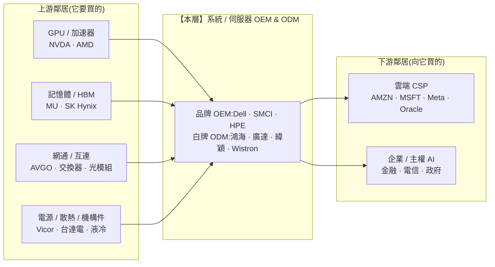

> 大部分人看到美超微(SMCI)營收一年翻三倍、戴爾 AI 伺服器訂單塞爆,就以為這層在 AI 浪潮裡大賺。
> 稍微進階的人會說:「它們是 NVIDIA 出海口,GPU 賣得越多、它們賣越多。」
> 但真正看懂這條鏈的人會問一句更冷的話:
> **「一台 40 萬美元的 AI 伺服器,裡面 30 萬是 NVIDIA 的 GPU——那組裝這台機器的人,到底『自己』賺了幾毛?」** 這篇就是拆這一層的利潤真相。

---

> ⚠️ **免責聲明與資料說明**:本文是一份**結構性產業鏈地圖(value-chain map)**,聚焦「系統 / 伺服器 OEM 這一層的角色、集中度與定價權」,不是個股估值報告。文中的市佔率、毛利率區間為**公開產業常識的概估值**(截至 2026 年初),用於說明各層的相對地位,**非即時報價**;任何投資決策前請自行查證最新數據。本文為教育用途,**不構成投資建議**。

---

## 一、這一層在產業鏈的位置

系統 / 伺服器 OEM 位在整條半導體鏈的**下游**:它向上游買齊 GPU、CPU、記憶體、網通晶片與電源散熱零件,把它們**組裝成一台可運轉的伺服器 / 一整櫃機架**,再賣給雲端業者與企業。



**一句話定位**:這一層**上游是強勢供應商(NVIDIA/台積電決定料價),下游是強勢買方(超大規模業者集中下大單、殺價)**——兩頭都比它有力,定價權**明顯往兩端流出、不留在本層**。這是整條鏈裡最典型的「被夾殺的中間人」。

---

## 二、這一層到底在做什麼

它做的是**系統整合(system integration)**:把幾十種來自不同供應商的零件,變成一台開機就能跑、能散熱、能進資料中心機房的機器。

```
一台 AI 伺服器 / 機櫃的「組裝清單」與價值歸屬
──────────────────────────────────────────────────────────
零件               供應商            價值歸誰          OEM 自己加值?
──────────────────────────────────────────────────────────
GPU × 8            NVIDIA            NVIDIA            ✗ 純轉手
CPU × 2            Intel / AMD       Intel / AMD       ✗ 純轉手
HBM / DRAM         SK Hynix / 美光    記憶體廠          ✗ 純轉手
交換 / 光模組       Broadcom 等        網通層           ✗ 純轉手
主機板 / 背板       自製 / 代工         部分自製          △ 少量
電源 / 散熱 / 液冷   台達 · Vertiv 等   混合             △ 整合加值
機構 / 組裝 / 測試   OEM 自己           OEM              ✓ 這才是本層真賺的
系統驗證 / 交付 / 保固 OEM 自己          OEM              ✓ 服務加值
──────────────────────────────────────────────────────────
結論:整台機器 70–85% 的物料價值是「別人的晶片轉手」,
      OEM 真正加值的只有「組裝 + 整合 + 散熱 + 交付服務」那一小段。
──────────────────────────────────────────────────────────
```

**為什麼這一層必須存在?** 因為 GPU 廠不想做低毛利的整機組裝與售後服務,雲端買家也不想自己一顆一顆採購零件、驗證相容性。OEM/ODM 承擔了「把料湊齊、驗證、量產、交付、保固」這件又雜又重的工——**功能不可或缺,但技術護城河薄**。這就是「營收看起來很大、利潤卻很薄」的結構根源。

**兩種商業模式**:
- **品牌 OEM(Dell、SMCI、HPE)**:自有品牌、通路、服務與融資,賣給企業客戶為主,毛利相對高一點。
- **白牌 ODM(鴻海、廣達、緯穎、Wistron)**:替雲端業者按規格代工「白牌機」,走 OCP(Open Compute)開放規格,量大、毛利更薄,幾乎純代工。

---

## 三、玩家與競爭格局

這一層**集中度低、玩家眾多**,沒有一家能像 ASML 或台積電那樣「卡住」整條鏈。競爭靠的是**規模、速度、供應鏈調度與散熱整合能力**,而非不可替代的技術。

| 公司 | 角色 | AI 伺服器地位 | 毛利率(概估) | 差異化槓桿 |
|---|---|---|---|---|
| **戴爾 Dell** | 品牌 OEM 龍頭 | 企業 + CSP 都吃,出貨規模最大 | 整體 ~21% 毛利、營業利益率 ~5–6%;伺服器(ISG)更薄 | 企業通路、服務、融資、全球交付 |
| **美超微 SMCI** | AI 伺服器純度最高 | 早期 NVIDIA 最緊密夥伴,液冷出貨領先 | 毛利從 ~18% 壓到 ~11–14%,淨利 ~5–6% | 積木式架構、上市速度快、液冷 |
| **HPE** | 品牌 OEM(含 Cray HPC) | 企業 + 主權 AI + 超算 | 伺服器營業利益率 ~10–11% | 高效能運算、GreenLake 訂閱 |
| **鴻海 Foxconn** | 全球最大 ODM 代工 | 幫 CSP 代工 GPU 機櫃、模組 | 整體淨利率 ~2–3% | 垂直整合、產能規模、機構件 |
| **廣達 Quanta** | 雲端伺服器 ODM 龍頭 | 大型 CSP 白牌主力供應 | 毛利 ~8%、淨利 ~3–4% | AI 機櫃整合、L10/L11 系統組裝 |
| **緯穎 Wiwynn / Wistron** | ODM(緯創子公司) | Meta / 微軟等 CSP 白牌 | 毛利 ~6–8%、淨利 ~3–5% | 客製化、貼近超大規模客戶 |

**市佔 / 定位示意(AI 伺服器概估,非精確數字)**:

```
AI 伺服器出貨價值 —— 品牌 vs 白牌
─────────────────────────────────────────────
Dell            ████████░░░░░░░░  品牌最大出海口
SMCI            ██████░░░░░░░░░░  AI 純度最高、速度快
HPE             ████░░░░░░░░░░░░  企業 / 超算
台廠 ODM 合計     ██████████████░░  ◄ 真正的量,多藏在白牌代工
(鴻海+廣達+緯穎+緯創)
─────────────────────────────────────────────
洞察:「品牌」的名字響,但雲端業者的巨量訂單
      越來越直接下給「白牌 ODM」,繞過品牌 OEM。
```

**誰領先、為什麼?** 沒有絕對領先者。SMCI 靠「上市速度 + 液冷」在 AI 早期領跑,但護城河窄、易被複製;Dell 靠規模與企業服務守住品牌端;真正吃下最大「量」的其實是台廠 ODM,因為 CSP 為了省成本,越來越愛跳過品牌、直接找代工廠做白牌機。**這一層的「贏」,是相對的、脆弱的,不是結構性的。**

---

## 四、瓶頸分數與定價權

用四項因子各打 0–10,平均得出本層的「瓶頸分數」(卡住整條鏈的能力)。分數越高越是收費站——**本層分數低,正是它薄利的原因**。

```
因子                        分數   說明
──────────────────────────────────────────────────────────
供應商稀缺度(越少越高)      2    OEM/ODM 一大堆,買家隨時能換
不可替代性(無替代越高)      2    白牌 ODM 可直接取代品牌 OEM
切換成本 / 驗證時間          3    換組裝廠成本低,規格是開放的
需求剛性(缺它鏈就斷越高)    4    總得有人組裝,但「誰」組裝可替換
──────────────────────────────────────────────────────────
瓶頸分數 = (2+2+3+4) / 4 ≈ 2.5 / 10   ◄ 全鏈最低的一層之一
──────────────────────────────────────────────────────────
```

**定價權方向:雙向流出**。

```
       ┌──────────────┐                 ┌──────────────┐
       │  上游供應商    │   定價權        │  下游買方      │
       │ NVIDIA/台積電  │  ───────▶       │ 超大規模 CSP   │
       │  記憶體/網通   │   ◀───────      │ (集中、量大)  │
       └──────┬───────┘   兩頭都強        └──────┬───────┘
              │                                   │
              ▼          料價它決定不了            ▼   售價買方壓
        ┌───────────────────────────────────────────┐
        │        系統 / 伺服器 OEM(本層)            │
        │   料成本被抬高 ↑    售價被壓低 ↓  = 毛利被夾扁 │
        └───────────────────────────────────────────┘
```

- **對上游**:NVIDIA 的 GPU 是點名指定、供不應求的料,OEM 只能照單全收、幾乎沒有議價空間。
- **對下游**:前幾大 CSP 佔了 AI 伺服器需求的絕大部分,單一客戶一張單就能佔某 ODM 營收的 20–40%,買方用「集中訂單」換「最低報價」。

兩頭一夾,毛利就被壓在 10–15%(品牌)、個位數(白牌)。**這就是定價權不在本層手上的教科書結果。**

---

## 五、利潤池與價值捕獲

**這一層的價值捕獲是全鏈最低的之一(概估 2/10)。** 原因不是它不重要,而是它**加值的比例低、可替代性高**。

```
一台 AI 伺服器的錢,流去哪(概估拆解)
──────────────────────────────────────────────
GPU + CPU + 記憶體 + 網通    ~70–85%   → 上游晶片層拿走
電源 / 散熱 / 機構            ~5–10%   → 零件 / 散熱層
──────────────────────────────
OEM 組裝 + 整合 + 服務        ~10–15%  ← 本層的「營收占比」
其中真正落袋的營業利益         ~3–8%   ← 本層的「利潤」
──────────────────────────────────────────────
```

**「營收 ≠ 利潤」的陷阱(本層最重要的一課)**:

AI 伺服器裡的 GPU 是**轉手成本(pass-through)**——OEM 把 30 萬美元的 GPU 買進、再併進整機賣出,這 30 萬會**灌進它的營收**,但它只在整台機器上賺一層薄薄的組裝服務費。結果是:

```
情境:某 OEM AI 伺服器業務
                     傳統伺服器年代    AI 伺服器年代
─────────────────────────────────────────────────
營收                    100            → 350   (GPU 灌大,漂亮!)
毛利率                   18%           → 12%   (GPU 轉手拉低 %)
毛利金額                 18            → 42    (絕對值有增加)
但每元營收的含金量        高             → 低    (營收膨脹、含金量稀釋)
─────────────────────────────────────────────────
陷阱:看「營收成長率」會以為大賺;看「毛利率」會發現被稀釋。
      營收翻倍 ≠ 賺錢翻倍,GPU 只是「借它的帳簿過一手」。
```

投資上這一層要**看「毛利金額與營業利益」而非「營收成長」**——營收暴衝很可能只是 GPU 的轉手,不是自己賺的錢變多。

---

## 六、上游依賴與下游客戶

**上游依賴(它要買什麼、有沒有單一來源風險?)**

| 買的東西 | 主要供應商 | 依賴強度 | 風險 |
|---|---|---|---|
| GPU / 加速器 | NVIDIA(壓倒性) | 🔴 近單一來源 | GPU 缺貨 / 配額 = OEM 出不了貨 |
| CPU | Intel / AMD | 🟡 雙源 | 相對可替換 |
| HBM / 記憶體 | SK Hynix / 美光 / 三星 | 🟠 寡占 | HBM 缺料時排擠出貨 |
| 液冷 / 電源 | 台達、Vertiv 等 | 🟠 產能吃緊 | 液冷產能成新瓶頸 |

最關鍵的單點:**GPU 分配權在 NVIDIA 手上**。誰拿得到 GPU 配額,誰才有貨可組——這讓 OEM 對上游幾乎沒有議價力,甚至要「排隊爭取被分配」。

**下游客戶(誰向它買、集中度如何?)**

- 🔴 **客戶高度集中**:AI 伺服器的需求極度集中在**少數幾家超大規模 CSP**。單一大客戶動輒佔某 ODM 兩三成營收,買方議價力極強。
- 🔴 **買方會往上游反向整合(backward integration)**:CSP 早已跳過品牌 OEM、**直接找台廠 ODM 下白牌單**(OCP 開放規格讓這件事更容易);更進一步,CSP 自研 ASIC(Trainium、MTIA 等)時,也常直接找 ODM 做整機。品牌 OEM 的中間層角色被「客戶直連代工廠」持續侵蝕。
- ✗ **供應商往下游整合的威脅**:NVIDIA 本身推出 DGX 整機、甚至 GB200 NVL72 整櫃參考設計,某種程度上也在「往下游做系統」,壓縮 OEM 的整合價值。

**結論**:本層被「強勢上游 + 集中且會反向整合的下游」兩面包夾,是它結構性薄利、且長期難翻身的根本原因。

---

## 七、風險

- 🔴 **買方集中 + 反向整合**:CSP 直接找 ODM 做白牌、自研晶片自組整機,持續掏空品牌 OEM 的中間價值。單一大客戶抽單即重創某 ODM 的季度。
- 🔴 **營收膨脹掩蓋薄利(市場誤讀風險)**:GPU 轉手把營收吹大,一旦市場從「看營收」轉為「看毛利率與現金流」,估值可能大幅重定價——SMCI 過去的毛利率壓縮與股價劇烈波動就是活教材。
- 🟠 **GPU 供給節奏綁死出貨**:GPU 缺貨,OEM 有訂單也出不了貨;GPU 一旦供給充足、單價下滑,轉手營收也會跟著縮。命脈不在自己手上。
- 🟠 **庫存與長鞭效應**:為搶 GPU 配額提前囤零件,一旦需求轉弯,容易留下高價庫存與跌價損失(伺服器零件跌價快)。
- 🟠 **液冷 / 電源產能瓶頸**:GB200 級機櫃必須直接晶片液冷(DLC),散熱與供電整合難度陡升;做不好交不了貨,做得好也只是短期差異化。
- 🟡 **關稅 / 地緣與產地移轉**:組裝產能高度集中特定地區,關稅與地緣要求「產地分散」,推升成本、壓縮本已很薄的利潤。
- 🟡 **價格戰**:進入門檻低、玩家多,景氣一鬆就殺價,毛利再被啃。

---

## 八、價值遷移

**方向:價值大體上「流經、不留下」——但有一道 12–24 個月的窄窗。**

```
現在(2026)              →   未來 1–3 年              →   確認訊號(trigger)
──────────────────────────────────────────────────────────────────────
GPU 供不應求,OEM 有貨       GPU 供給正常化,             GPU 交期正常化、
就能賣,營收暴衝              營收成長回落、毛利率見真章    報價鬆動
──────────────────────────────────────────────────────────────────────
氣冷伺服器                 →  機櫃級液冷整合(DLC)是     哪家能穩定量產、快速交付
(誰都會做,純殺價)           少數能加值的環節 ◄ 窄窗       整櫃液冷系統
──────────────────────────────────────────────────────────────────────
品牌 OEM 當中間人          →  CSP 直連 ODM / 自研整機      白牌 / ODM 佔比續升,
                            價值往「代工 + 散熱」沉澱     品牌 OEM 佔比下滑
──────────────────────────────────────────────────────────────────────
```

**唯一的差異化槓桿 = 液冷 + 機櫃級整合 + 交付速度**。當伺服器從「一台氣冷機」升級成「一整櫃、直接晶片液冷、電力密度爆表的系統」,整合難度陡升,短期內給了懂液冷、能快速量產交付的廠商一點點定價權。但這是**窄窗**:一旦液冷方案標準化、大家都會做,毛利又會被打回原形。

**一句話**:這一層永遠是「大營收、薄利潤」;能不能在液冷與機櫃整合這道窄窗裡多賺一點、賺多久,是它唯一值得追蹤的變數。**它不是價值的目的地,是價值路過的收費亭——而且過路費很低。**

---

## 九、分層投資點子(教育性質、非投資建議)

| 分層角色 | 較佳定位的名字 | 邏輯 | 點子類型 |
|---|---|---|---|
| **相對較佳** | 具液冷 / 機櫃整合實力、貼近 CSP 的 ODM(如緯穎、廣達) | 吃到 AI 機櫃「量」,液冷窄窗有一點加值 | 週期性、看毛利金額 |
| **品牌代表** | Dell、HPE | 企業通路 + 服務 + 融資撐住毛利,較不純殺價 | 相對防禦,但成長受 CSP 直連侵蝕 |
| **高波動題材** | SMCI | AI 純度最高、彈性最大,但毛利與治理波動也最大 | 投機、風險自負 |
| **二階(picks-and-shovels)** | 賣給本層的**液冷 / 電源 / 機構**供應商 | 不論哪家 OEM 贏,整櫃液冷與供電都得買 | 更值得挖的節點 ◄ |
| **迴避 / 空方候選** | 純氣冷、無液冷能力、無服務加值的組裝廠 | 上游漲、下游殺、無差異化,兩頭受氣 | 迴避 |

**最該提醒的一句**:想「參與 AI 伺服器」但又不想被薄利夾殺,**與其買組裝廠本身,不如往上看一格——賣「液冷、電源、機構件」給這些 OEM 的二階供應商**,通常比 OEM 自己有更厚的毛利與更硬的位置。這一層本身,在整個系列裡屬於**「分數低、應迴避 / 只做週期性交易」**的節點,誠實地說——不是好的長期結構性持有。

---

## 論點反轉條件(Thesis Invalidation)

**本層結構訊號為 BEARISH(結構性薄利、應迴避長期持有),下列情況會打破此看法:**
- 某 OEM/ODM 在**液冷與機櫃級整合**上建立起真正難複製的護城河,毛利率結構性上移(而非一次性),定價權開始回到本層。
- CSP 反向整合趨勢逆轉(改回大量向品牌 OEM 採購、放棄自研整機),中間層價值回流。
- 本層出現大規模整併,玩家從「一大堆」收斂到「寡占」,削價競爭消失。
- 若上述都未發生,則維持「薄利、迴避」判斷。

**重新檢視這一層的時機:**
- [ ] 主要玩家(Dell、SMCI、HPE、廣達、緯穎)財報公布時——**重點看毛利率與營業利益,不要只看營收成長**
- [ ] GPU 交期 / 供給出現明顯變化(轉手營收會跟著變)
- [ ] 液冷 / 機櫃整合競爭格局變化
- [ ] 距今超過 60–90 天

```
╔══════════════════════════════════════════════╗
║              INDUSTRY-MAP SIGNAL             ║
╠══════════════════════════════════════════════╣
║ 結構訊號:    系統/伺服器 OEM 層 BEARISH       ║
║ Confidence:  MEDIUM(結構清晰,液冷窄窗待觀察) ║
║ Horizon:     LONG-TERM(1 年以上)            ║
║ Score:       2.5 / 10(結構性薄利、被夾殺)    ║
╠══════════════════════════════════════════════╣
║ 偏好層級:    液冷/機櫃整合強的 ODM(週期性)    ║
║ 迴避層級:    無差異化的純組裝廠                ║
╚══════════════════════════════════════════════╝
```

評分指引:8.0–10.0 強烈偏多 | 6.0–7.9 中度偏多 | 4.0–5.9 中性 | 2.0–3.9 中度偏空 | 0.0–1.9 強烈偏空

---

### 📚 系列導覽:半導體產業鏈全景(上游 → 下游)

> 總覽地圖:[industry-map - 半導體晶片產業鏈全景](/yennj12_blog_V4/posts/industry-map-semiconductor-value-chain-zh/)

**上游 Upstream**
- Part 1:[矽晶圓 / 基板](/yennj12_blog_V4/posts/industry-map-semiconductor-part1-silicon-wafer-zh/)
- Part 2:[特用化學 / 光阻](/yennj12_blog_V4/posts/industry-map-semiconductor-part2-chemicals-photoresist-zh/)
- Part 3:[EDA + IP](/yennj12_blog_V4/posts/industry-map-semiconductor-part3-eda-ip-zh/)
- Part 4:[晶圓設備](/yennj12_blog_V4/posts/industry-map-semiconductor-part4-fab-equipment-zh/)

**中游 Midstream**
- Part 5:[晶圓代工](/yennj12_blog_V4/posts/industry-map-semiconductor-part5-foundry-zh/)
- Part 6:[IC 設計 — GPU/加速器](/yennj12_blog_V4/posts/industry-map-semiconductor-part6-gpu-design-zh/)
- Part 7:[IC 設計 — 其他](/yennj12_blog_V4/posts/industry-map-semiconductor-part7-ic-design-zh/)
- Part 8:[記憶體](/yennj12_blog_V4/posts/industry-map-semiconductor-part8-memory-zh/)
- Part 9:[IDM / 類比](/yennj12_blog_V4/posts/industry-map-semiconductor-part9-idm-analog-zh/)
- Part 10:[封裝測試 OSAT](/yennj12_blog_V4/posts/industry-map-semiconductor-part10-osat-zh/)

**下游 Downstream**
- Part 11:[網通 / 互連](/yennj12_blog_V4/posts/industry-map-semiconductor-part11-networking-zh/)
- **Part 12:系統 / 伺服器 OEM(本篇)**
- Part 13:[雲端 CSP](/yennj12_blog_V4/posts/industry-map-semiconductor-part13-cloud-csp-zh/)
- Part 14:[終端需求](/yennj12_blog_V4/posts/industry-map-semiconductor-part14-end-demand-zh/)

---

## 參考來源與方法(References)

- 分析方法:InvestSkill `industry-map` skill(<https://github.com/yennanliu/InvestSkill>)——把產業畫成上游到下游的有向圖,定位咽喉點、利潤池與價值遷移。
- 本文的市佔率 / 毛利率為公開產業常識的**概估值**(截至 2026 年初),用於說明各層相對地位,**非即時報價**。
- 總覽地圖:[半導體晶片產業鏈全景](https://yennj12.js.org/yennj12_blog_V4/posts/industry-map-semiconductor-value-chain-zh/)

---

> 再次提醒:本文為產業結構教學與地圖,市佔 / 毛利為概估值,**不構成投資建議**。
