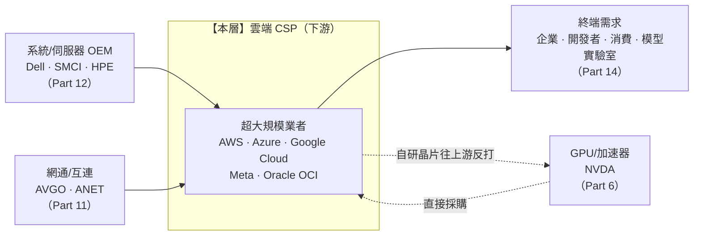

> 大部分人看 CSP，只看一個數字：AWS 又成長了幾 %、Azure 追上來沒。
> 稍微進階的人會比雲端市佔：亞馬遜 vs 微軟 vs Google。
> 但真正看懂這一層的人，會問一個更冷的問題：
> **「它們是 AI 需求的『源頭』，卻也是整條鏈的『資本黑洞』——這幾千億美元的資本支出，到底賺不賺得回來？」** 這篇就拆這一層。

---

> ⚠️ **免責聲明與資料說明**：本文是半導體產業鏈系列的 **Part 13**，聚焦「雲端 CSP」這一層的**結構性角色**——玩家、集中度、定價權、利潤池與價值遷移，不是個股估值報告。文中市佔率、營益率、資本支出、RPO 等數字均為**公開產業常識的概估值**（截至 2026 年初），用於說明相對地位，**非即時報價**；任何投資決策前請自行查證最新財報。本文為教育用途，**不構成投資建議**。

---

## 一、這一層在產業鏈的位置

雲端 CSP（Cloud Service Provider，超大規模業者 hyperscaler）坐在整條半導體鏈的**最下游偏需求端**。它上承伺服器系統與 GPU，下接企業、開發者與模型實驗室。它是「錢從哪裡進來」的閘門，也是「錢往哪裡燒」的黑洞。



**一句話定位**：CSP 是整條鏈的**需求源頭**與**資本黑洞**。它對下游（企業/開發者）有中等偏強的定價權（靠鎖定與資料重力），但對上游（NVIDIA/台積電）偏弱——買 GPU 幾乎是價格接受者。它的結構強度不是來自「供給稀缺」，而是來自「需求聚合者」的寡占地位。注意那條回頭的虛線：**CSP 正用自研晶片往上游反打，試圖繞過 NVIDIA**（見 Part 6）——這是本層最大的戰略變數。

---

## 二、這一層到底在做什麼

CSP 做的事，用一句話說：**把上游買來的晶片、伺服器、電力、網路，包裝成「隨開隨用、按量計費」的算力與服務，租給全世界。**

它在鏈中的角色有三個層次：

1. **基礎設施層（IaaS）**：把 GPU/CPU、儲存、網路變成雲端資源出租。這是最接近「賣硬體時間」的一層，也是 AI 訓練/推論算力的實際承載者。
2. **平台層（PaaS）**：資料庫、資料倉儲、AI 模型 API（Bedrock、Vertex、Azure OpenAI）。開始有軟體毛利與鎖定。
3. **應用/服務層（SaaS + AI 功能）**：Copilot、企業 AI 助理、把 AI 塞進既有生產力軟體。**這才是 CSP 真正想捕獲價值的地方**——因為在這裡，它不再只是「NVIDIA 的通路」。

這三層由下往上，毛利與鎖定同步爬升——這也決定了 CSP 的戰略方向：**盡量把客戶從第 1 層往第 3 層推**。

```
價值捕獲往上爬升
─────────────────────────────────────────────────────
③ 應用 / AI 服務(SaaS)   毛利最高、鎖定最深   ← CSP 想搬到這
② 平台(PaaS)             毛利中、開始鎖定
① 基礎設施(IaaS)         毛利薄、最像賣硬體時間 ← AI 算力現在卡在這
─────────────────────────────────────────────────────
```

為什麼這一層存在？因為 AI 訓練與大規模推論的**資本門檻高到只有極少數公司扛得起**。一個前沿模型的訓練叢集動輒數萬顆 GPU、數十億美元、外加專屬的高速互連與供電散熱工程。企業自己蓋不划算，於是把算力「外包」給 CSP——這就是雲端的原始價值主張，AI 時代把它放大了十倍。而 AI 需求真正的源頭就在這裡：**下游所有的 AI 應用、模型實驗室、企業導入，最終都得回到 CSP 租算力**，這使本層成為整條半導體鏈的「需求發電機」。

---

## 三、玩家與競爭格局

這一層是典型的**寡占**：全球有能力扛 AI 級資本支出的，數得出來就那幾家。

| 業者 | 母公司 | 雲端定位 | 基礎設施市佔（概估） | 自研晶片 | 結構特徵 |
|---|---|---|---|---|---|
| **AWS** | AMZN | 最大公有雲 | ~30% | Graviton（CPU）、Trainium（訓練）、Inferentia（推論） | 自研最廣、Graviton 已大規模量產，垂直整合最深 |
| **Azure** | MSFT | 第二大、綁 OpenAI | ~22–25% | Maia（AI 加速器）、Cobalt（CPU） | Copilot / OpenAI 獨家通路，企業關係最深 |
| **Google Cloud** | GOOGL | 第三大、技術最強 | ~11–12% | **TPU（最成熟的自研 AI 晶片）** | TPU 撐起 Gemini，唯一長期不靠 NVIDIA 也能訓練前沿模型 |
| **Meta** | META | 自用型（不賣公有雲） | —（自用） | MTIA（推論加速器） | 花錢餵自家廣告推薦 + Llama，純成本中心 |
| **Oracle OCI** | ORCL | 後進、爆發成長 | 個位數但增速最快 | 多採購 NVIDIA，自研少 | RPO 暴衝、裸機 + RDMA 超級叢集，AI 大單通吃 |

```
公有雲基礎設施市佔（概估，2025）
──────────────────────────────────────────────
AWS            ███████████████  ~30%
Azure          ███████████░░░░  ~22–25%
Google Cloud   ██████░░░░░░░░░  ~11–12%
其餘 + Oracle  █████████░░░░░░  其餘（Oracle 基數小但增速最猛）
──────────────────────────────────────────────
※ Meta 不列入（自用型，不對外售雲）
```

**誰領先、為什麼？**

- **AWS 靠先發 + 垂直整合**：最早做雲、生態最廣，Graviton/Trainium/Inferentia 三線自研晶片讓它在「降成本」上領先——這是規模經濟的體現。
- **Azure 靠通路綁定**：獨家整合 OpenAI 模型 + 把 Copilot 塞進 Office/Windows，讓它握有「AI 變現」最直接的企業入口。
- **Google Cloud 靠技術自足**：TPU 是全業界最成熟的自研 AI 晶片，讓 Google 成為**唯一長期不必看 NVIDIA 臉色**也能訓練前沿模型的 CSP——這是本層最被低估的護城河。
- **Oracle 是高 beta 的爆發者**：基數小，但靠裸機 + RDMA 超級叢集的性價比，接下巨型 AI 訓練訂單，RPO（積壓合約）暴衝——高風險高報酬的槓桿玩法。

---

## 四、瓶頸分數與定價權

對這一層打「瓶頸分數」（0–10），四因子平均。注意：CSP 是**需求端**，它的力量來自「買方集中（monopsony）」而非「供給稀缺」，所以要小心不要高估。

```
瓶頸四因子（0–10）           分數   說明
────────────────────────────────────────────────────────────
供應商稀缺度                  6    全球僅約 4–5 家超大規模等級業者
不可替代性                    6    AI 規模訓練難回頭做 on-prem
切換成本 / 資料重力            7    資料出站費 + 專屬服務深度綁定
需求剛性                      6    企業數位化 / AI 導入，需求黏著
────────────────────────────────────────────────────────────
平均 = 6.25  →  瓶頸分數 6.0 / 10
```

**定價權往哪流？**

```
                    對下游（企業/開發者）          對上游（NVIDIA/台積電）
────────────────────────────────────────────────────────────────────────
定價權              中等偏強                       偏弱
來源                資料重力、專屬服務鎖定、        GPU 供給被咽喉層掐住，
                    多年合約                       CSP 幾乎是價格接受者
反制手段            —                              自研晶片（Trainium/TPU/
                                                   Maia/MTIA）往上游反打
────────────────────────────────────────────────────────────────────────
淨定價權：中等——靠「需求聚合者」的寡占地位，而非供給稀缺
```

**關鍵判讀**：CSP 對它的**客戶**有不錯的定價權（換雲很痛），但對它的**供應商 NVIDIA** 卻是被掐住的一方。AI 算力越缺、CSP 越能對客戶收高價——但這筆溢價幾乎**穿透**給了 NVIDIA。這就是為什麼本層瓶頸分數只有 6：它坐在需求源頭，卻沒能把大部分利潤留在自己手裡。

---

## 五、利潤池與價值捕獲

CSP 這一層的利潤結構有一個**強烈的二分**：

```
CSP 利潤池的兩張臉
─────────────────────────────────────────────────────────────
① 非 AI 雲（運算/儲存/資料庫/網路）
   ‣ 史上最好的生意之一：規模經濟 + 鎖定
   ‣ AWS 營益率 ~35%（概估）；Google Cloud 已轉正、Azure 高獲利
   ‣ 這是穩定的現金牛，撐起整個母公司的自由現金流
─────────────────────────────────────────────────────────────
② AI 雲（GPU 算力出租）
   ‣ 弔詭：算力越缺，越能收高價，但溢價幾乎穿透給 NVIDIA
   ‣ GPU 5–6 年折舊 → 大筆折舊費用壓毛利
   ‣ 短期是「幫 NVIDIA 收錢再轉手」，自己賺薄利
─────────────────────────────────────────────────────────────
```

**價值捕獲的真正位置在「服務/應用層」**：Copilot 每席每月訂閱、Bedrock/Vertex 的 API 呼叫、把 AI 功能塞進既有 SaaS——這才是 CSP 想把資本支出賺回來的地方。它們賭的是：**今天燒的資本，會透過明天的 AI 服務營收回收。**

放進鄰居的脈絡看價值捕獲（概估 0–10，沿用系列總覽的尺度）：

```
層                        價值捕獲（現在）
──────────────────────────────────────────
GPU / 加速器（Part 6）    ██████████ 10   ← 上游咽喉，吃走大部分 AI 毛利
網通 / 互連（Part 11）    ████████░░  8
雲端 CSP（本層）          ██████░░░░  6   ← 資本密集，非 AI 雲賺、AI 雲薄
系統 OEM（Part 12）       ██░░░░░░░░  2   ← 下游組裝，被夾殺
──────────────────────────────────────────
```

**洞察**：CSP 花最多錢，卻不一定捕獲最多利潤——它把 AI 硬體那段的利潤讓給了上游的 NVIDIA 與台積電，自己賭的是「用 AI 服務賺回來」。它的 6 分幾乎完全靠**非 AI 雲的現金牛**撐著；純看 AI 那段，這一層現在是**代收過路費的通路**。

---

## 六、上游依賴與下游客戶

**上游依賴（它得買什麼）：**

| 依賴項 | 來源層 | 單一來源風險 |
|---|---|---|
| GPU / 加速器 | NVIDIA（Part 6） | 🔴 **最高**——交期即命脈，價格被掐 |
| HBM 記憶體 | SK 海力士/美光（Part 8） | 🟠 高——與 GPU 綁定、供不應求 |
| 伺服器整機 | Dell/SMCI/ODM（Part 12） | 🟡 低——可多方採購 |
| 高速交換/光通訊 | 博通/Arista（Part 11） | 🟠 中——大規模叢集的必需品 |
| 電力 / 併網 / 散熱 | 公用事業、電網 | 🔴 **新瓶頸**——資料中心撞上電網排隊 |

**下游客戶（誰跟它買）：**

- **對公有雲**：企業、開發者、消費服務——**客戶分散**，這是好事（沒有單一買方能掐它）。
- **對 AI 訓練訂單**：高度集中在**少數模型實驗室**（OpenAI、Anthropic 等）。這帶來**客戶集中風險**，在 Oracle 身上最明顯——它的 RPO 高度集中在極少數超大 AI 客戶，等於把公司命運綁在對手方的續約與信用上。

**整合方向（雙向入侵）：**

```
CSP ──── 自研晶片往上游反打 ────▶ 侵蝕 NVIDIA（Trainium/TPU/Maia/MTIA）
CSP ◀─── DGX Cloud / 直接租 GPU ──── NVIDIA 往下游入侵
```

上游的 NVIDIA 想往下游做雲（DGX Cloud、直接租 GPU），下游的 CSP 想往上游做晶片——**兩邊互相入侵，這正是本層與 Part 6 之間最緊張的邊界**。

---

## 七、風險

- 🔴 **資本黑洞 / ROIC 風險**：四大 CSP（AMZN、MSFT、GOOGL、META）2025 年合計資本支出概估約 3,500–4,000 億美元，2026 年市場預期上看 5,000 億美元以上。GPU 折舊約 5–6 年，若 AI 營收跟不上折舊節奏，這會是一場**價值毀滅的資本循環**——這是本層最大的單一風險。
- 🔴 **上游單點依賴 NVIDIA**：交期與價格被咽喉層掐住；自研晶片能否放量到有意義的比例，是決定本層長期毛利的最大變數。
- 🟠 **客戶集中（尤其 Oracle）**：RPO 暴衝的另一面是集中——大額積壓合約押在少數 AI 大客戶身上，對手方信用/續約一旦生變，backlog 可能縮水。
- 🟠 **循環反轉**：若企業 AI 導入不如預期，資本支出急剎車，衝擊會沿鏈**往上游級聯放大**（GPU → HBM → 封裝 → 設備）。CSP 是這條長鞭的握把。
- 🟠 **電力 / 土地 / 散熱瓶頸**：資料中心擴張撞上電網併網排隊，「有錢也蓋不出來」正成為新的實體限制。
- 🟡 **監管 / 反壟斷**：雲市場集中度引來監管關注；資料主權與在地化要求推高合規成本。

---

## 八、價值遷移

**未來 1–3 年，價值往這一層來、還是離開？答案是「分岔」——取決於一件事能不能成。**

```
兩條路徑                        觸發訊號（trigger）
──────────────────────────────────────────────────────────────────────
價值「來到」本層：             ‣ 自研晶片內部用量佔比明顯上升
① 自研晶片成規模 → 把 NVIDIA      （AWS Trainium/Google TPU 撐起自家 workload）
   那段毛利搶回來               ‣ AI 服務營收（Copilot/Bedrock/Vertex）
② AI 服務變現 → 應用層利潤兌現      開始被單獨揭露且加速
──────────────────────────────────────────────────────────────────────
價值「離開」本層：             ‣ RPO/積壓成長跟不上資本支出成長
③ 資本擱淺 → AI 營收落後折舊，     （承諾的未來營收 vs 燒掉的錢，開始背離）
   ROIC 崩壞                    ‣ 自由現金流因折舊由正轉負
──────────────────────────────────────────────────────────────────────
```

**這場豪賭的名字叫「先燒資本、後變現」（capex now, monetize later）。** 判斷它成不成，最該盯的不是單季營收，而是 **RPO（Remaining Performance Obligations，剩餘履約義務＝已簽約、尚未認列的未來營收）**——它是「承諾中的需求」對「已燒掉的資本」的對照表。Oracle 的 RPO 在 2025 年因 AI 雲大單一度衝上數千億美元等級（概估），是這場賭局裡槓桿開最大的一家：賭對了是爆發，賭錯了是災難。

**一句話**：今天這一層的錢，靠的是**非 AI 雲的現金牛**；明天的錢，賭在**自研晶片搶回上游毛利** + **AI 服務把資本支出變現**。這兩件事只要有一件跑贏折舊，價值就往本層遷移；兩件都落後，就是資本黑洞。

---

## 九、分層投資點子

把地圖轉成分層點子清單（教育性質、非投資建議）：

| 分層角色 | 較佳定位的名字 | 邏輯 | 點子類型 |
|---|---|---|---|
| **需求聚合寡占** | AWS（AMZN）、Azure（MSFT） | 非 AI 雲現金牛 + AI 選擇權，自研晶片最廣 | 核心持有 |
| **技術差異化** | Google Cloud（GOOGL） | TPU 讓它最不依賴 NVIDIA，前沿模型自足 | 差異化多方 |
| **高 beta / 爆發** | Oracle（ORCL） | RPO 暴衝、AI 大單槓桿最大，但客戶集中風險也最高 | 高風險高報酬 |
| **自用成本中心** | Meta（META） | 花錢是為廣告 + Llama 變現，不直接賣雲——賭 MTIA 降本 | 間接曝險 |
| **迴避 / 警戒** | 無差異化、無自研、純轉售 GPU 的小型雲 | 上游漲價、下游殺價、無護城河 | 迴避 |

**最該注意的「非顯性判準」**：市場愛比雲端市佔成長率，但在這一層，真正分勝負的是**「自研晶片內部滲透率」與「RPO/資本支出比」**——前者決定你能不能從 NVIDIA 手裡搶回毛利，後者決定你這場豪賭是不是空燒錢。Google（TPU）與 AWS（Trainium）在前者領先；Oracle 在後者槓桿最大、風險也最大。

延伸深拆（搭配本站個股 10-K 深度解析）：

- [Amazon (AMZN) 2025 10-K 深度解析](/yennj12_blog_V4/posts/amzn-2025-10k-deep-dive-zh/)——AWS 的營益率、Trainium/Graviton 自研布局。
- [Alphabet (GOOGL) 2025 10-K 深度解析](/yennj12_blog_V4/posts/googl-2025-10k-deep-dive-zh/)——Google Cloud 轉正與 TPU 的長期意義。
- [Oracle (ORCL) 2026 10-K 深度解析](/yennj12_blog_V4/posts/orcl-2026-10k-deep-dive-zh/)——RPO 暴衝與 OCI 的槓桿賭局。
- [Meta (META) 2025 10-K 深度解析](/yennj12_blog_V4/posts/meta-2025-10k-deep-dive-zh/)——自用型 hyperscaler 的資本支出與 MTIA。
- [NVIDIA (NVDA) 2026 10-K 深度解析](/yennj12_blog_V4/posts/nvda-2026-10k-deep-dive-zh/)——本層上游咽喉，看兩層如何互相入侵。

---

## 論點反轉條件（Thesis Invalidation）

**若結構訊號為 NEUTRAL→偏多（對需求聚合寡占中性偏樂觀），下列情況會打破論點：**

- 自研晶片始終無法放量到有意義比例，CSP 對 NVIDIA 的依賴不減反增（本層毛利長期被穿透）。
- RPO/積壓成長明顯落後資本支出成長，自由現金流因折舊由正轉負（資本黑洞論點成立）。
- AI 服務營收（Copilot/Bedrock/Vertex）遲遲無法規模化變現，「先燒後賺」的賭局落空。
- 宏觀轉向：企業 AI 導入不如預期，CSP 大砍資料中心資本支出，衝擊往上游級聯。

**重新檢視這一層的時機：**

- [ ] 四大 CSP（AMZN、MSFT、GOOGL、META）與 Oracle 財報公布，特別看**資本支出指引**與 **RPO/backlog**
- [ ] 自研晶片（Trainium/TPU/Maia/MTIA）內部滲透率出現明顯變化
- [ ] AI 服務營收開始被單獨揭露
- [ ] 距今超過 60–90 天

```
╔══════════════════════════════════════════════╗
║              INDUSTRY-MAP SIGNAL             ║
╠══════════════════════════════════════════════╣
║ 結構訊號:    需求聚合寡占 NEUTRAL→偏多       ║
║ Confidence:  MEDIUM(現金牛穩,AI 賭局未定)    ║
║ Horizon:     LONG-TERM(1 年以上)             ║
║ Score:       6.0 / 10(下游,資本密集)         ║
╠══════════════════════════════════════════════╣
║ 偏好層級:    自研晶片最成功者(AWS/GOOGL)     ║
║ 迴避層級:    無護城河純轉售 GPU 的小型雲      ║
╚══════════════════════════════════════════════╝
```

評分指引：8.0–10.0 強烈偏多 | 6.0–7.9 中度偏多 | 4.0–5.9 中性 | 2.0–3.9 中度偏空 | 0.0–1.9 強烈偏空

---

### 📚 系列導覽:半導體產業鏈全景（上游 → 下游）

> 總覽地圖:[industry-map - 半導體晶片產業鏈全景](/yennj12_blog_V4/posts/industry-map-semiconductor-value-chain-zh/)

**上游 Upstream**
- Part 1:[矽晶圓 / 基板](/yennj12_blog_V4/posts/industry-map-semiconductor-part1-silicon-wafer-zh/)
- Part 2:[特用化學 / 光阻](/yennj12_blog_V4/posts/industry-map-semiconductor-part2-chemicals-photoresist-zh/)
- Part 3:[EDA + IP](/yennj12_blog_V4/posts/industry-map-semiconductor-part3-eda-ip-zh/)
- Part 4:[晶圓設備](/yennj12_blog_V4/posts/industry-map-semiconductor-part4-fab-equipment-zh/)

**中游 Midstream**
- Part 5:[晶圓代工](/yennj12_blog_V4/posts/industry-map-semiconductor-part5-foundry-zh/)
- Part 6:[IC 設計 — GPU/加速器](/yennj12_blog_V4/posts/industry-map-semiconductor-part6-gpu-design-zh/)
- Part 7:[IC 設計 — 其他](/yennj12_blog_V4/posts/industry-map-semiconductor-part7-ic-design-zh/)
- Part 8:[記憶體](/yennj12_blog_V4/posts/industry-map-semiconductor-part8-memory-zh/)
- Part 9:[IDM / 類比](/yennj12_blog_V4/posts/industry-map-semiconductor-part9-idm-analog-zh/)
- Part 10:[封裝測試 OSAT](/yennj12_blog_V4/posts/industry-map-semiconductor-part10-osat-zh/)

**下游 Downstream**
- Part 11:[網通 / 互連](/yennj12_blog_V4/posts/industry-map-semiconductor-part11-networking-zh/)
- Part 12:[系統 / 伺服器 OEM](/yennj12_blog_V4/posts/industry-map-semiconductor-part12-system-oem-zh/)
- **Part 13:[雲端 CSP](/yennj12_blog_V4/posts/industry-map-semiconductor-part13-cloud-csp-zh/) ← 本篇**
- Part 14:[終端需求](/yennj12_blog_V4/posts/industry-map-semiconductor-part14-end-demand-zh/)

---

## 參考來源與方法

- 分析方法:InvestSkill `industry-map` skill(<https://github.com/yennanliu/InvestSkill>)——把產業畫成上游到下游的有向圖,定位咽喉點、利潤池與價值遷移。
- 本篇市佔率、營益率、資本支出、RPO 等數字為公開產業常識的**概估值**(截至 2026 年初),用於說明各層相對地位,非即時報價。
- 總覽地圖:[半導體晶片產業鏈全景](https://yennj12.js.org/yennj12_blog_V4/posts/industry-map-semiconductor-value-chain-zh/)
- 延伸:本站個股 10-K 深度解析(AMZN、GOOGL、ORCL、META、NVDA)可搭配本圖,先看全景、再挑節點深拆。

> 再次提醒:本文為產業結構教學與地圖,市佔/毛利/資本支出/RPO 為概估值,**不構成投資建議**。
