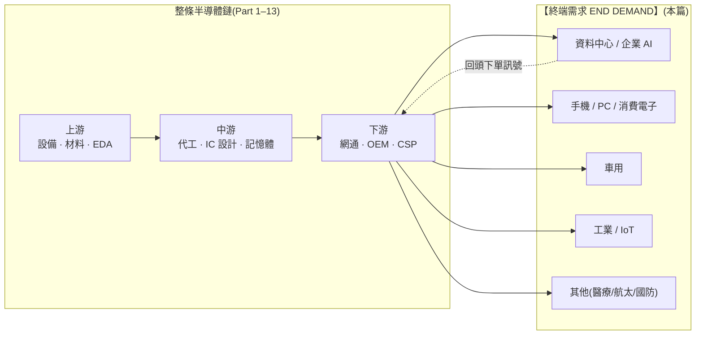

> 大部分人看半導體需求,只看一個數字:NVIDIA 又賣了多少 GPU。
> 稍微進階的人會看四大 CSP 的資本支出財測。
> 但真正看懂週期的人,會問一個更根本的問題——**「這些晶片最後被誰用掉?那個人願意付多少錢?他明年還會再買嗎?」**
> 這是全系列最後一塊拼圖:**終端需求,是整條鏈的水龍頭,也是所有週期的源頭。**

---

> ⚠️ **免責聲明與資料說明**:本文是**半導體產業鏈系列的完結篇(Part 14)**,聚焦「終端需求」這個需求端節點,重點在「需求由誰組成、成長動能與週期性」,不是個股估值報告。文中的市場規模、板塊佔比、成長率為**公開產業常識的概估值**(截至 2026 年初),用於說明相對結構,**非即時報價**;任何投資決策前請自行查證最新數據。本文為教育用途,**不構成投資建議**。

---

## 一、這一層在產業鏈的位置

前面 13 篇,我們從一粒矽砂(Part 1)一路走到雲端 CSP(Part 13)。每一層都在問「我賣給誰、誰跟我買」。但整條鏈的箭頭最後都指向同一個終點——**終端需求(end demand)**:真正把晶片「用掉」而不是「轉賣」的人。



**位置與定價權一句話**:終端需求是整條鏈的**終點(sink)**,自己**不製造、不轉賣、也沒有對晶片的定價權**(它是價格接受者);但它握有整條鏈唯一真正的「開關」——**需求一動,訊號沿鏈往上游放大,決定全鏈是過熱還是凍結**。這一層不收過路費,卻決定了收費站有沒有車流。

---

## 二、這一層到底在做什麼

「終端需求」不是一家公司,而是一個**行為**:把晶片變成使用者真正付錢的效用。買一支手機、租一小時 GPU 算力、開一台有 30 顆 MCU 的電動車——這些才是鏈條的最終買單者。

理解這一層,關鍵是分清兩個容易被混為一談的概念:

```
Sell-in(進貨/下單)  vs  Sell-through(終端賣出/真實消耗)
──────────────────────────────────────────────────────────────
Sell-in   = 下游向上游「下的單」        ← 含庫存、含恐慌性重複下單
Sell-through = 終端使用者「真的用掉的量」 ← 這才是真實需求

兩者的落差 = 通路庫存 = 長鞭效應(bullwhip)的燃料
落差擴大 → 表面很熱、實則塞貨 → 一旦回補停止 → 崩盤
```

**為什麼這一層存在、又為什麼最重要**:上游每一層的營收,最終都是終端需求「往回付」的錢的一部分。台積電的資本支出、NVIDIA 的毛利、ASML 的獨占地位,全都建立在一個假設上——**終端使用者會持續付錢買這些晶片提供的效用**。這個假設一旦動搖,收費站再硬也收不到錢。所以看懂終端需求,等於拿到了判斷整條鏈景氣的**源頭訊號**。

---

## 三、終端需求的四大板塊(佔比與成長動能)

這是本篇的核心。與其他篇不同,需求端沒有「玩家競爭格局」,取而代之的是**按終端市場拆解需求結構**——各板塊佔多少、成長多快、由什麼驅動、週期性多強。

以 2025 年全球半導體市場約 **7,000 億美元(概估)** 為基數(WSTS 口徑,2024 約 6,300 億、2025 因記憶體與 AI 拉升突破 7,000 億),按終端應用拆分:

```
終端板塊               佔比(概估)  成長動能        週期性
──────────────────────────────────────────────────────────────────
資料中心 / 企業 AI     ████████░░ 34%   極高(20–40%)  ◄ 當前引擎
手機 / PC(消費運算)   ███████░░░ 30%   低(2–4%)      成熟、換機驅動
車用                   ███░░░░░░░ 12%   高(8–12%)     ◄ 結構性成長
工業 / IoT             ███░░░░░░░ 12%   中(3–6%)      強週期
其他(醫療/航太/國防)  ███░░░░░░░ 12%   低–中          防禦、分散
──────────────────────────────────────────────────────────────────
```

| 板塊 | 佔比(概估) | 驅動力 | 每單位晶片含量趨勢 | 需求性質 |
|---|---|---|---|---|
| **資料中心 / AI** | ~34% | 生成式 AI 訓練+推論、雲端遷移 | 一台 AI 伺服器含 8 顆 GPU + HBM + 網通,矽含量是傳統伺服器 10 倍+ | 由 CSP 資本支出驅動,**當前唯一的增量引擎** |
| **手機 / PC** | ~30% | 換機週期、AI PC/AI 手機微幅拉動 | 旗艦手機晶片含量緩升,但出貨量停滯(手機 ~12 億支/年、PC ~2.5 億台/年) | 成熟、飽和,**替換型需求**,對總量貢獻低 |
| **車用** | ~12% | 電動化 + ADAS/自駕 | 燃油車 ~$500 → 電動/高階 ADAS 車 $1,200–2,000+,**單車晶片含量翻倍以上** | **結構性成長**,不靠賣更多車、靠每台裝更多晶片 |
| **工業 / IoT** | ~12% | 工廠自動化、電網、感測 | 穩步上升,分散 | 跟隨製造業景氣,**強週期** |
| **其他** | ~12% | 醫療電子、航太國防、政府 | 穩定 | 防禦性、不受消費循環左右 |

**三個關鍵觀察**:

1. **成長全部來自一個板塊**。手機/PC 佔了近三分之一,卻幾乎零成長;整個市場從 6,300 億衝向 2030 年上看 **1 兆美元** 的敘事,**增量幾乎全押在資料中心/AI 這一塊**。這是機會,也是集中風險——整條鏈的成長故事被綁在單一需求引擎上。

2. **車用是「安靜的結構性贏家」**。它不靠賣更多車(全球汽車銷量其實停滯),而靠**每台車塞進越來越多晶片**:電動化(電池管理、功率半導體)+ ADAS(感測、運算)把單車矽含量從 $500 推到 $1,500+。這是不依賴 AI 敘事、卻實實在在複利的需求。

3. **消費電子是「壓艙石」不是「引擎」**。手機/PC 的價值在於**體量夠大、夠穩**,能吸收產能、平滑產線;但別指望它帶動成長。AI PC / AI 手機是溫和加分,不是換機超級週期。

---

## 四、需求「韌性分數」與定價權方向

需求端沒有「供應商稀缺度」可打分,所以這一層改用四個維度衡量**各板塊的需求韌性/能見度**(0–10,越高代表需求越可持續、越可預測):

```
板塊              結構性  能見度  抗景氣  變現確定性  韌性均分
──────────────────────────────────────────────────────────────
車用               9       8       7        8          8.0  ◄ 最穩健
工業/其他          7       6       7        7          6.8
手機/PC            6       8       4        9          6.8  (穩但不成長)
資料中心/AI        9       4       5        4          5.5  ◄ 動能最強、能見度最差
──────────────────────────────────────────────────────────────
```

**定價權方向**:終端需求對「單顆晶片」**沒有定價權**——它是價格接受者,晶片漲價它就多付(或延後換機)。但終端需求握有整條鏈的**方向性權力**:

- 需求熱 → sell-through 強 → 通路回補 → 訂單沿鏈往上游放大 → 收費站(ASML/台積電/NVIDIA)火力全開、漲價;
- 需求冷 → 通路塞貨 → 砍單沿鏈往上游放大 → 產能利用率崩、記憶體殺價。

換句話說:**收費站決定「每輛車過路要付多少」,但終端需求決定「今天路上有沒有車」。** 這一層的分數低不代表不重要,而是它的本質是「開關」而非「護城河」。

---

## 五、利潤池與價值捕獲:錢最終從哪裡來

前面十三篇一直在問「錢卡在哪一層」。到了終點必須反過來問:**這些錢一開始從哪裡來?** 答案是——**全部來自終端需求願意支付的效用價值**。整條鏈上每一分毛利,都是終端使用者付費的再分配。

需求端本身的「價值捕獲」標記為 **「—」**(它不製造、不加價、不轉賣,不在鏈上「捕獲」利潤),但它決定了**整個利潤池的大小**。這裡順帶做一次全系列的價值捕獲回顧(概估各層目前吃到的毛利厚度):

```
層                     價值捕獲(現在)         本系列
─────────────────────────────────────────────────────
GPU / 加速器           ██████████ 10           Part 6
EUV 設備               █████████░  9           Part 4
EDA / IP               ████████░░  8           Part 3
先進製程代工           ████████░░  8           Part 5
網通 / 互連            ████████░░  8           Part 11
IDM / 類比             ███████░░░  7           Part 9
記憶體(HBM 拉高)      ██████░░░░  6 (週期)    Part 8
雲端 CSP               ██████░░░░  6 (資本密集) Part 13
材料 / 矽晶圓          ████░░░░░░  4           Part 1–2
封測 OSAT              ███░░░░░░░  3           Part 10
系統 OEM               ██░░░░░░░░  2           Part 12
終端需求               —— (源頭,不捕獲)       Part 14
─────────────────────────────────────────────────────
```

**洞察**:利潤池分配得再精巧,**天花板都是終端需求的「付費意願 × 付費能力」**。今天資料中心把整個利潤池撐大,是因為 CSP 願意用「未來的 AI 服務收入」為現在的算力付天價。這個付費意願能不能兌現成真實收入,就是第七節那個價值兆美元的問題。

---

## 六、上游依賴與「反向整合」

對終端需求做上下游分析,結構很特別:

- **上游依賴**:終端需求的「供應商」是**整條鏈**——它向下游(裝置、伺服器、雲服務)買效用,而下游又層層依賴上游。所以終端需求「間接依賴」鏈上每一個節點,任一咽喉點斷裂(EUV 停供、台灣地緣事件),最終都由終端使用者以「買不到、變更貴」承受。
- **下游客戶**:**沒有下游**。這是鏈的終點,需求在這裡被消耗掉,不再往前流。

**最重要的動態——需求端正在「反向整合」往上游打**:

```
傳統流向:  上游 ─► ... ─► CSP ─► 終端(消耗,結束)

正在發生:  終端最大買家(CSP)不甘只當買家,往上游反打
           ┌─────────────────────────────────────────┐
           │  Amazon Trainium · Google TPU · Meta MTIA │  自研 ASIC
           │  → 繞過 NVIDIA,把「需求」變成「設計」     │
           └─────────────────────────────────────────┘
```

當最大的終端買家(超大規模資料中心業者)開始**自己設計晶片**,需求端就不再只是被動的水龍頭,而是主動往上游爬——這是全系列反覆出現的主線,也是價值遷移最大的變數(見第八節)。**能反向整合的,是掌握終端場景與資本的巨頭;一般消費者、車廠、工廠做不到,只能當純買方。**

---

## 七、風險:AI 資料中心需求,是結構性成長還是資本支出泡沫?

這是全系列最核心、也最該誠實面對的問題。整條鏈的成長敘事幾乎全押在資料中心/AI,而這塊需求的性質,決定了咽喉層的高估值站不站得住。

```
   多方論點(結構性)                    空方論點(泡沫)
──────────────────────────────────  ──────────────────────────────────
✓ CSP 雲端本業有真實現金流支撐        ✗ 資本支出 >> AI 直接營收(ROI 缺口)
✓ token 消耗量、推論需求持續複利       ✗ 循環融資:晶片商投資客戶、客戶再
✓ 從訓練擴散到推論,需求面更廣          回頭買晶片,需求有「自我循環」成分
✓ 企業導入才剛開始,滲透率仍低         ✗ 歷史類比:2000 年電信/光纖超建——
✓ 主權 AI、國家級投資加碼               需求長期是真的,但資本支出跑太前面,
                                        造成數年供給過剩與破產潮
                                      ✗ 折舊懸崖:GPU 折舊年限假設偏樂觀
                                      ✗ 長鞭效應:恐慌性重複下單灌水真實需求
```

**風險嚴重度分級**:

- 🔴 **AI 資本支出與變現的缺口(ROI gap)**:四大 CSP 2025 年合計資本支出概估 **3,000–4,000 億美元**,2026 年財測續升上看 **5,000 億美元+**;但直接歸因於 AI 的營收規模遠小於此。缺口靠「未來會賺回來」支撐——**一旦市場對回收期失去耐心,資本支出可能急踩剎車**,砍單沿鏈往上游級聯放大。這是全鏈最大的單一風險。
- 🔴 **長鞭效應(bullwhip)——週期的源頭**:終端一個溫和的需求波動,經過「通路回補 + 恐慌性重複下單(怕買不到而超額下單)」逐層放大,到上游會變成劇烈的過熱與崩盤。2021–2022 缺貨 → 2023 記憶體大殺價,就是最近一次教科書案例。**目前 AI 供應鏈存在多少「重複下單」的水分,是最難測、也最危險的未知數。**
- 🟠 **循環融資的自我強化風險**:晶片供應商投資下游算力新創、算力業者再回頭採購晶片——需求有一部分是「被資金創造出來的」。這在牛市放大成長、在熊市加速崩解。
- 🟠 **消費電子結構性停滯**:手機/PC 佔比大卻不成長;若宏觀轉弱,這塊會從「壓艙石」變成「拖油瓶」,放大整體回落。
- 🟡 **車用電動化節奏放緩**:EV 滲透若不如預期,車用這個結構性引擎的斜率會放平(但單車晶片含量上升的長期趨勢不變)。
- 🟡 **地緣與出口管制打到終端**:先進晶片對特定市場的禁售,直接砍掉一塊終端可及需求,並催生平行供應鏈。

**誠實的結論**:AI 需求的**長期方向幾乎確定是真的**(如同 2000 年網際網路確實崛起);但**當前資本支出的斜率,大概率跑在真實變現的前面**。這意味著——**結構性成長為真,但中途出現「消化期/空氣口袋(air-pocket)」的機率不低**。兩件事可以同時成立:AI 是真的,泡沫也是真的。

---

## 八、價值遷移:需求重心往哪裡移

需求端本身不「捕獲」價值,但它的**重心移動**會拖著整條鏈的利潤池一起搬家。

```
過去 10 年重心          →   現在(2026)重心         →   未來 1–3 年觀察
────────────────────────────────────────────────────────────────────
手機(智慧型手機超級      資料中心 / AI 訓練            從「訓練」擴散到
週期,已成熟飽和)         (單一引擎、爆發成長)         「推論 + 邊緣 AI」
                                                       → 需求面變廣、變分散
────────────────────────────────────────────────────────────────────
消費者「買裝置」        →   企業/雲「租算力」        →   企業「用 AI 服務」
(一次性硬體支出)          (資本支出、集中)            (經常性軟體收入)
                                                       → 變現確定性是關鍵 trigger
────────────────────────────────────────────────────────────────────
單一大板塊(手機)      →   雙引擎(AI + 車用)       →   AI 若消化、車用/工業
                                                       接棒平滑週期
```

**遷移論點**:需求重心正從「消費者買硬體」轉向「企業與雲租算力、進而用 AI 服務」。這帶來兩個方向的價值遷移——

1. **往上游**:AI 需求把稀缺推向 HBM、先進封裝(CoWoS)、電力與散熱(見全系列反覆強調的「二階瓶頸」)。
2. **往下游**:真正的長期價值會流向**能把算力變現的推論與軟體服務**——誰能證明 AI 帶來可獲利的經常性收入,誰就接棒下一段利潤,也順帶「證實」了現在的資本支出不是泡沫。

**確認訊號(trigger)**:
- ✅ 看多確認:CSP 財報揭露 AI 直接營收明顯加速、推論用量放量、企業付費滲透率上升 → 資本支出得到變現背書。
- ⚠️ 看空確認:任一大型 CSP 下修資本支出財測、GPU 交期從緊缺轉寬鬆、記憶體/CoWoS 報價鬆動 → 消化期開始的第一張骨牌。

---

## 九、分層投資點子(需求端視角)

需求端不是拿來「買」的一層,而是拿來**校準整條鏈景氣**的儀表板。把它轉成點子(教育性質、非投資建議):

| 角色定位 | 較佳定位的想法 | 邏輯 | 點子類型 |
|---|---|---|---|
| **不賭單一需求** | 咽喉軍火商(ASML、台積電) | 無論哪個終端板塊成長,產能都得跟它們買 | 核心持有 |
| **結構性、非 AI 敘事** | 車用/工業半導體含量成長 | 不靠 AI 泡沫,靠單機晶片含量複利 | 二階、低調 ◄ |
| **變現接棒者** | 能把算力變現的推論/軟體 | 若價值往下游遷移,這是接棒方 | 選擇權 |
| **純消費循環曝險** | 只押手機/PC 換機的名字 | 成熟停滯、對成長貢獻低 | 迴避 |
| **資本支出高槓桿** | 純押單一 CSP 資本支出不回頭的名字 | 一旦踩剎車、砍單放大 | 高風險 |

**最該盯的儀表板指標**(判斷全鏈景氣的領先訊號):
1. 四大 CSP 的**資本支出財測方向**(續增 or 下修)——最領先。
2. **GPU / HBM / CoWoS 交期**——從緊到鬆是消化期第一訊號。
3. **通路庫存天數**——長鞭效應的水位計。
4. **AI 直接營收成長率 vs 資本支出成長率**——ROI 缺口收斂還是擴大。

---

## 十、全系列總回顧(The Finale)

十四篇走完,把整條鏈壓縮成三句話:

```
① 錢卡在三個咽喉點:EUV 設備(ASML)、先進製程代工(台積電)、
   AI 加速器+軟體(NVIDIA+CUDA)。下游誰贏,它們都收過路費。

② 錢的來源是終端需求:整條鏈所有毛利,都是終端使用者付費的再分配。
   當前增量幾乎全來自「資料中心/AI」這單一引擎。

③ 錢下一步往兩端外溢:往上游流向 HBM/先進封裝/電力(新稀缺),
   往下游流向能把算力變現的推論與軟體(新變現)。
```

```
一句話總結全系列
──────────────────────────────────────────────────────────
上游賣鏟子(設備/材料/EDA/IP)—— 最硬的護城河,最穩的收費站
中游造晶片(代工/設計/記憶體/封測)—— 戲劇最多,咽喉與薄利並存
下游變成錢(網通/OEM/CSP)—— 花最多錢,不一定賺最多
需求端做決定(終端需求)—— 不收過路費,卻決定路上有沒有車
──────────────────────────────────────────────────────────
看懂這張圖 = 知道「該深入研究哪一層、在週期哪個位置」。
```

**全系列最後一個洞察**:市場永遠在追「最亮的那顆 GPU」,但這張地圖告訴你——**真正決定整條鏈生死的,是最不性感的那一層:終端使用者到底願不願意、有沒有能力,持續為這些晶片付錢。** 咽喉再硬,收的也是終端的錢。

---

## 論點反轉條件(Thesis Invalidation)

**本篇對「需求端」給出的是 BALANCED / NEUTRAL 訊號**(結構性成長為真,但短期資本支出領先變現,消化風險不低)。

**若你偏多(認為 AI 需求可持續),下列情況打破論點:**
- 任一大型 CSP 明顯下修資本支出財測,或連續兩季 AI 直接營收成長不及資本支出成長。
- GPU / HBM / CoWoS 交期快速正常化,伴隨報價鬆動(供過於求訊號)。
- 通路庫存天數異常拉高,顯示 sell-in 遠超 sell-through(長鞭水分浮現)。

**若你偏空(認為是純泡沫),下列情況打破論點:**
- 企業 AI 付費滲透率、推論用量出現可驗證的加速,ROI 缺口收斂。
- 車用/工業需求接棒,證明成長不只靠 AI 單一引擎。

**重新檢視這張需求地圖的時機:**
- [ ] 四大 CSP 財報與資本支出財測更新時
- [ ] GPU 交期 / 記憶體報價出現趨勢性轉折
- [ ] 重大宏觀或地緣事件(利率、出口管制)
- [ ] 距今超過 60–90 天

```
╔══════════════════════════════════════════════╗
║              INDUSTRY-MAP SIGNAL             ║
╠══════════════════════════════════════════════╣
║ 結構訊號:    需求端 BALANCED / NEUTRAL       ║
║ 說明:        結構成長真、資本支出領先變現     ║
║ Confidence:  MEDIUM(方向清晰,時點難測)      ║
║ Horizon:     LONG-TERM(1 年以上為多方)       ║
║ Score:       5.5 / 10(需求端:成長強、能見度低)║
╠══════════════════════════════════════════════╣
║ 偏好:        不賭單一需求的軍火商 + 車用結構成長║
║ 警戒:        純押 CSP 資本支出不回頭的曝險     ║
╚══════════════════════════════════════════════╝
```

評分指引:8.0–10.0 強烈偏多 | 6.0–7.9 中度偏多 | 4.0–5.9 中性 | 2.0–3.9 中度偏空 | 0.0–1.9 強烈偏空

---

### 📚 系列導覽:半導體產業鏈全景(上游 → 下游)

> 總覽地圖:[industry-map - 半導體晶片產業鏈全景](/yennj12_blog_V4/posts/industry-map-semiconductor-value-chain-zh/)

**上游 Upstream**
- Part 1:[矽晶圓 / 基板](/yennj12_blog_V4/posts/industry-map-semiconductor-part1-silicon-wafer-zh/)
- Part 2:[特用化學 / 光阻](/yennj12_blog_V4/posts/industry-map-semiconductor-part2-chemicals-photoresist-zh/)
- Part 3:[EDA + IP](/yennj12_blog_V4/posts/industry-map-semiconductor-part3-eda-ip-zh/)
- Part 4:[晶圓設備](/yennj12_blog_V4/posts/industry-map-semiconductor-part4-fab-equipment-zh/)

**中游 Midstream**
- Part 5:[晶圓代工](/yennj12_blog_V4/posts/industry-map-semiconductor-part5-foundry-zh/)
- Part 6:[IC 設計 — GPU/加速器](/yennj12_blog_V4/posts/industry-map-semiconductor-part6-gpu-design-zh/)
- Part 7:[IC 設計 — 其他](/yennj12_blog_V4/posts/industry-map-semiconductor-part7-ic-design-zh/)
- Part 8:[記憶體](/yennj12_blog_V4/posts/industry-map-semiconductor-part8-memory-zh/)
- Part 9:[IDM / 類比](/yennj12_blog_V4/posts/industry-map-semiconductor-part9-idm-analog-zh/)
- Part 10:[封裝測試 OSAT](/yennj12_blog_V4/posts/industry-map-semiconductor-part10-osat-zh/)

**下游 Downstream**
- Part 11:[網通 / 互連](/yennj12_blog_V4/posts/industry-map-semiconductor-part11-networking-zh/)
- Part 12:[系統 / 伺服器 OEM](/yennj12_blog_V4/posts/industry-map-semiconductor-part12-system-oem-zh/)
- Part 13:[雲端 CSP](/yennj12_blog_V4/posts/industry-map-semiconductor-part13-cloud-csp-zh/)
- **Part 14:[終端需求](/yennj12_blog_V4/posts/industry-map-semiconductor-part14-end-demand-zh/)** ← 本篇(完結)

---

## 參考來源與方法(References)

- 分析方法:InvestSkill `industry-map` skill(<https://github.com/yennanliu/InvestSkill>)——把產業畫成上游到下游的有向圖,定位咽喉點、利潤池與價值遷移。
- 總覽地圖:[半導體晶片產業鏈全景](https://yennj12.js.org/yennj12_blog_V4/posts/industry-map-semiconductor-value-chain-zh/)。
- 本篇的市場規模、板塊佔比、成長率、資本支出金額為公開產業常識的**概估值**(截至 2026 年初,含 WSTS 口徑量級),用於說明相對結構,非即時報價。
- 延伸:可搭配本站 CSP(AMZN/MSFT/GOOGL/META)與 NVDA/AMD 的 10-K 深度解析,先看全景需求、再挑節點深拆。

> 再次提醒:本文為產業結構教學與地圖,市場規模與佔比為概估值,**不構成投資建議**。全系列到此完結,感謝一路讀到 Part 14。
