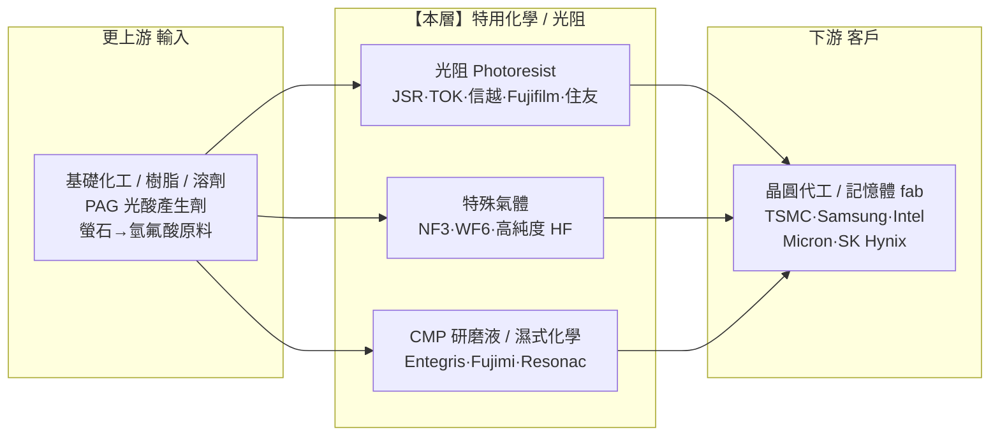

> 大部分人談半導體上游,想到的是矽晶圓、EUV 曝光機、EDA 這些「看得見」的關卡。
> 稍微進階的人會加上光阻(photoresist),知道曝光要塗一層感光材料。
> 但真正看懂供應鏈脆弱性的人,會問一個更尖銳的問題:
> **「一瓶不到晶片成本 5% 的化學藥水,為什麼能在 2019 年讓整個韓國半導體業陷入恐慌?」** 這篇拆的就是這層「隱形咽喉」。

---

> ⚠️ **免責聲明與資料說明**:本文是半導體產業鏈系列的 **Part 2**,聚焦「特用化學 / 光阻」這一層的結構分析——玩家、集中度、瓶頸與定價權、利潤池、上下游依賴、風險與投資點子。文中市佔率、毛利率為**公開產業常識的概估值**(截至 2026 年初),用於說明相對地位,**非即時報價**。本文為教育用途,**不構成投資建議**。

---

## 一、這一層在產業鏈的位置

特用化學與光阻,夾在「基礎化工原料」與「晶圓代工/記憶體廠(fab)」之間。它不製造晶片,但晶片上每一層電路的圖案,都要靠它才畫得出來。



**一句話定位**:本層是 fab 的「日耗材」供應商——單價低、金額佔比小,但**沒有它產線就得停**。在最先進的 EUV 光阻與高純度氣體上,定價權明顯偏向供應端(日本廠);在通用濕式化學上,定價權則偏向買方(fab)。整層是「隱形咽喉」:平時低調,地緣事件一來就變成頭條。

---

## 二、這一層到底在做什麼

半導體製造的核心是「微影(lithography)」——把電路圖案一層一層印到晶圓上。光阻,就是那層被光照到就會改變溶解性的感光塗料。曝光機(ASML)是印表機,**光阻就是墨水加相紙**——沒有對的墨水,再貴的印表機也印不出東西。

一片晶圓從光到成品,本層貢獻的耗材大致是:

```
一片先進晶圓的「化學耗材」清單(概念示意)
─────────────────────────────────────────────────────────
① 光阻 Photoresist ─── 曝光成像的感光材料;EUV 光阻是皇冠上的鑽石
② 光阻週邊 ────────── 顯影液、去光阻劑、邊緣清洗(EBR)、抗反射層
③ 特殊氣體 ────────── 蝕刻/沉積用:NF3、WF6、高純度 HF、稀有氣體
④ CMP 研磨液+研磨墊 ─ 化學機械平坦化,每做完一層就要「磨平」一次
⑤ 濕式化學 ────────── 清洗、蝕刻用的超純酸鹼(H2SO4、H2O2、NH4OH)
─────────────────────────────────────────────────────────
關鍵特徵:單價低、用量大、純度要求變態(雜質以 ppb / ppt 計)
```

這些耗材不是「用一次」,而是在每一層電路上**反覆消耗**。一顆先進晶片要疊數十道光罩層,每一層都要走一輪「塗光阻→曝光→顯影→蝕刻→清洗→CMP 磨平」,本層的化學品就在這個循環裡被一次次吃掉:

```
單層電路的化學耗材循環(重複數十次)
──────────────────────────────────────────────────────────
 ①塗佈 ──▶ ②曝光 ──▶ ③顯影 ──▶ ④蝕刻 ──▶ ⑤清洗 ──▶ ⑥CMP
 光阻      (ASML     顯影液      特殊氣體    超純      研磨液
 +抗反射    曝光機)   +EBR       (NF3/HF)   酸鹼水    +研磨墊
──────────────────────────────────────────────────────────
     ▲                                            │
     └──────────── 進入下一層,再走一輪 ◀──────────┘
 → 節點越先進,層數越多,本層耗材的「每片用量」越大
```

**為什麼會獨立成一層**:這些材料的門檻不在「化學式多難」,而在**純度控制與製程驗證**。一顆金屬離子污染,就能讓價值上億美元的晶圓報廢;而每換一次供應商,fab 要重新跑數個月的驗證與良率確認。這道「純度 + 驗證」的護城河,把通用化工巨頭擋在門外,養出了一批專精的特用化學廠。

---

## 三、玩家與競爭格局

這一層可拆成三個子市場,集中度天差地別:先進光阻是「日本國家隊」近乎壟斷;特殊氣體是全球寡占;CMP 與濕式化學相對分散。

### 光阻:日本五雄近乎包場

```
全球先進節點 / EUV 光阻市佔(概估)
──────────────────────────────────────────────
JSR(日)          ████████░░░░░░  ~26%
東京應化 TOK(日)  ███████░░░░░░░  ~24%
信越化學(日)      ██████░░░░░░░░  ~21%
Fujifilm(日)     █████░░░░░░░░░  ~16%
住友化學(日)      ███░░░░░░░░░░░  ~9%
其他(韓/歐/美)    █░░░░░░░░░░░░░  <5%
──────────────────────────────────────────────
→ 日本五家合計 >90%;EUV 等級光阻集中度更高
```

### 三個子市場的玩家與角色

| 子市場 | 主要玩家 | 集中度 | 角色/護城河 |
|---|---|---|---|
| **光阻(先進/EUV)** | JSR、東京應化 TOK、信越、Fujifilm、住友化學 | 日本高度集中 | 化學配方 + 驗證年資,近乎壟斷 |
| **特殊氣體** | 大陽日酸(Nippon Sanso)、Air Liquide、Linde、Air Products、Resonac、SK Materials | 全球寡占 | 純度 + 在地供氣網路(靠近 fab 建廠) |
| **高純度 HF / 蝕刻藥液** | Stella Chemifa、森田化學、SK Materials、Soulbrain | 日韓集中 | 超高純度、腐蝕性物料處理 |
| **CMP 研磨液** | Entegris(併 CMC)、Fujimi、Resonac、Versum/Merck | 中度集中 | 配方 + 與製程共同調校 |
| **CMP 研磨墊** | DuPont | 近乎獨占(墊) | 材料 know-how,>80% 墊市佔 |
| **濕式化學/顯影液** | BASF、Entegris、關東化學、三菱化學 | 相對分散 | 純度、物流(在地供應) |

**誰領先、為什麼**:光阻這塊,日本廠贏在「時間」——它們從 KrF、ArF、ArF 浸潤式一路做到 EUV,每一代都與 fab 共同開發、累積了別人補不回的配方與驗證資料庫。**這不是砸錢就能追上的門檻,而是砸「時間 + 良率信任」**。特殊氣體則是另一種邏輯:氣體笨重、危險、不耐運,供應商必須在 fab 旁邊建廠、簽長約,形成在地綁定的寡占。

**一個標誌性事件**:2023–2024 年,日本政府主導的基金 JIC(Japan Investment Corporation)以約 64 億美元把 **JSR 私有化下市**。一家「賣藥水」的公司被國家隊收歸戰略資產——這本身就說明了這層在地緣棋盤上的份量。

---

## 四、瓶頸分數與定價權

用四個因子各打 0–10,平均得瓶頸分數。這層必須「分兩塊看」:先進 EUV 光阻/高純度氣體是硬咽喉,通用濕式化學是薄利地板。

```
因子                    EUV光阻/高純氣體   通用濕式化學   說明
──────────────────────────────────────────────────────────────
供應商稀缺度            9                  3            EUV 光阻全球僅數家能供
不可替代性              9                  4            換化學=換製程,幾乎不可能臨時替代
切換成本/驗證時間       9                  5            新供應商要 12–24 個月驗證+良率確認
需求剛性                8                  6            沒光阻就停線;但單價低、fab 付得起
──────────────────────────────────────────────────────────────
子市場平均              8.75               4.5
──────────────────────────────────────────────────────────────
整層瓶頸分數(加權概估)             6.5 / 10
```

**定價權方向**:
- **先進 EUV 光阻、高純度 HF/NF3** → 定價權**偏供應端**。fab 換不起,只能吞漲價;但因為單價低,漲價空間也有天花板(fab 不會為省藥水錢冒斷料風險)。
- **通用濕式化學、大宗氣體** → 定價權**偏買方**。多家可供、規格標準化,fab 用比價與雙供應商壓低價格。

**flip 條件(何時角色反轉)**:若某家 fab 成功扶植第二供應商(如韓國廠在 2019 後扶植本土光阻),或某材料被製程革新繞過(見第八節的乾式光阻),供應端的定價權就會鬆動。反之,若地緣封鎖讓某材料瞬間斷供,即使是通用化學也能短暫變成咽喉。

---

## 五、利潤池與價值捕獲

**價值捕獲評級:中**。這層賺的是「精細化工的穩定財」,不是「咽喉層的暴利」:

```
本層 vs 鄰層 毛利厚度(概估)
─────────────────────────────────────────
EUV 曝光設備(ASML,鄰層)   █████████░  ~50%+ 毛利
先進 EUV 光阻                ███████░░░  ~40–50% 毛利
特殊氣體(在地綁定)          ██████░░░░  ~30–40% 毛利
CMP 研磨液 / 顯影液          █████░░░░░  ~30% 毛利
通用濕式化學 / 大宗氣體      ███░░░░░░░  ~15–20% 毛利
─────────────────────────────────────────
```

**為什麼是「中」而非「高」**:
1. **金額佔比小**:化學材料約佔 fab 材料成本的一部分,光阻更只是其中一小塊;即使近乎壟斷,可漲價的絕對金額有限——這是「高市佔、低單價」的典型。
2. **配方黏著度高但成長溫和**:先進光阻毛利不錯、客戶極黏,但市場規模小、成長跟著先進製程投片量走,不像 GPU 那種爆發性。
3. **通用段被稀釋**:很多廠營收裡混了大量低毛利的通用化學,把整體帳面毛利拉下來。

**利潤集中在哪**:利潤池明顯集中在**先進節點的專用材料**(EUV 光阻、高純度特殊氣體、先進封裝用材料),而不是通用大宗品。一句話:**在這層,「越先進、越專用、越難驗證」的那一小塊,才是真正的利潤所在。**

---

## 六、上游依賴與下游客戶

### 上游依賴(本層要買什麼)

```
本層的關鍵輸入與單一來源風險
─────────────────────────────────────────────────────────
‣ 樹脂 / 聚合物骨架 ──── 光阻主體;配方 know-how 自持
‣ PAG 光酸產生劑 ─────── 光阻感光關鍵,少數精細化學廠供應
‣ 金屬氧化物前驅體 ───── EUV 金屬氧化物光阻(JSR 併購 Inpria 取得)
‣ 螢石 (fluorspar) ───── 製 HF 的原料,中國供給佔比高 🔴
‣ 稀有氣體(氦/氖/氙)── 部分製程用,供給集中、地緣敏感 🟠
─────────────────────────────────────────────────────────
```

單一來源風險真實存在:高純度 HF 的源頭螢石高度依賴中國;某些稀有氣體曾因地緣衝突報價暴漲。本層雖是別人的咽喉,自己也卡在更上游的原料咽喉上。

### 下游客戶(誰跟本層買)

下游就是 **fab**——晶圓代工(TSMC、Samsung、Intel)與記憶體廠(Micron、SK Hynix、三星)。客戶集中度**高**:先進光阻的買家高度集中在少數幾家跑得動 EUV 的 fab。

**能不能被整合掉?**
- **買方後向整合(fab 自己做藥水)**:幾乎不會。fab 的核心是製程與良率,自製少量、多樣、高危險性的化學品既不划算也分心;它們寧可綁定供應商並要求在地設廠。
- **供應商前向整合(藥水廠自己蓋 fab)**:不可能,資本規模差好幾個數量級。

所以本層與 fab 是「互相綁死」的共生關係:fab 不會自己做,但會極力扶植第二供應商以分散風險——這正是定價權的拉鋸點。

---

## 七、風險

- 🔴 **地緣出口管制(本層最大特徵風險)**:2019 年日本對韓國限制三項材料出口——氟聚醯亞胺、光阻(含 EUV 級)、高純度氫氟酸——直接掐住三星與 SK 海力士的咽喉,韓國全國動員扶植本土供應(Soulbrain、Dongjin)。這是「隱形咽喉」現形的教科書案例:平時沒人注意的藥水,一夜之間變成國安籌碼。
- 🔴 **上游原料集中(螢石/稀有氣體)**:製 HF 的螢石與部分稀有氣體供給集中於少數地區,一旦斷供,本層自身也會斷料。
- 🟠 **在地化 / 去日化侵蝕**:韓國、中國都在國家層級扶植本土特用化學供應鏈;長期看,日本廠在通用段的市佔會被逐步侵蝕(但 EUV 高端段仍難撼動)。
- 🟠 **製程技術顛覆**:乾式光阻(dry resist,見第八節)若大規模導入,可能改寫 EUV 光阻的化學與供應格局——現有濕式光阻龍頭的優勢未必能平移。
- 🟡 **週期性**:營收跟著 fab 投片量與資本支出循環波動;fab 砍單時,耗材需求同步走弱(但比設備層抗跌,因為耗材是持續消耗品)。
- 🟡 **公安 / 環保**:高危險、高腐蝕物料的生產與運輸,一場工廠事故或環保法規收緊,就可能中斷區域供給。

---

## 八、價值遷移

**未來 1–3 年,價值往這層的「高端專用段」聚集,但技術路線的變動可能重洗牌局。**

```
現在                →   下一步                →   確認訊號(trigger)
──────────────────────────────────────────────────────────────────────
EUV 濕式光阻            High-NA EUV 專用光阻       High-NA 量產導入、新光阻通過驗證
(日本五雄主導)         (更薄膜厚、新化學)
──────────────────────────────────────────────────────────────────────
旋塗式(濕式)光阻   →   乾式光阻 dry resist        設備商主導的乾式沉積+顯影製程
                       (材料價值向設備端遷移)     在先進節點放量
──────────────────────────────────────────────────────────────────────
單純先進邏輯用材料   →   先進封裝專用材料           CoWoS/HBM 擴產拉動臨時鍵合、
                       (光阻、暫時鍵合膠、底填)   底填膠、RDL 光阻需求
──────────────────────────────────────────────────────────────────────
日本單極供應       →   日+韓+中多極(去風險化)    各國本土供應鏈通過 fab 驗證
──────────────────────────────────────────────────────────────────────
```

**關鍵變數:乾式光阻**。傳統光阻是「旋塗上去的液體」,價值歸材料廠;而乾式光阻改用**設備端的沉積+顯影製程**,把一部分價值從「化學藥水」搬到「製程設備」。若 High-NA 世代大規模採用,現有濕式光阻龍頭的護城河會被部分繞過——這是本層最需要盯的長線變數。

**一句話**:今天的錢在「日本五雄的 EUV 濕式光阻配方」;明天的錢可能分流到「High-NA 專用材料」「先進封裝材料」,以及「乾式光阻背後的製程設備」。誰握住 High-NA 世代的材料/製程,誰接棒下一段利潤。

---

## 九、分層投資點子

把地圖轉成分層點子(教育性質、非投資建議):

| 分層角色 | 較佳定位的名字 | 邏輯 | 點子類型 |
|---|---|---|---|
| **隱形咽喉** | JSR(已私有化)、東京應化 TOK、信越 | 先進/EUV 光阻近乎壟斷,fab 換不起 | 核心(但 JSR 已下市,曝險受限) |
| **在地綁定寡占** | 大陽日酸、Air Liquide、Linde | 特殊氣體靠近 fab 建廠、長約鎖定 | 穩健現金流 |
| **二階 picks** | Entegris、Fujimi、DuPont(CMP 墊)、Resonac | CMP/濕式化學+先進封裝材料,市場覆蓋不足 | 低調、易被低估 ◄ |
| **選擇權** | Soulbrain、SK Materials 等本土化受益者 | 去日化/在地化趨勢下的替代供應 | 投機性(政策驅動) |
| **相對弱勢** | 純通用大宗化學/大宗氣體業務 | 規格化、雙供應商比價、薄利 | 迴避 / 拆解時剔除 |

**最該注意的「非顯性節點」**:市場愛追曝光設備(ASML)與代工(TSMC),但**光阻、特殊氣體、CMP 這些「日耗材」供應商**才是最被低估的隱形咽喉——它們不是純 AI 題材股,金額也不大,卻能在地緣事件中一夜之間卡住整條先進製程。要留意的是,純上市的直接曝險有限(JSR 已私有化、信越/Fujifilm/大陽日酸都是多角化集團),買的是「其中一小塊業務」。

---

## 論點反轉條件(Thesis Invalidation）

**若訊號為 BULLISH(對高端專用材料段樂觀),下列情況會打破論點:**
- 韓國/中國本土光阻在 EUV 高端段通過 fab 大規模驗證,打破日本壟斷(定價權鬆動)。
- 乾式光阻(dry resist)在先進節點放量,價值從材料廠遷往設備端。
- 先進製程資本支出循環反轉,fab 大砍投片量,耗材需求同步走弱。
- 上游螢石/稀有氣體斷供,本層自身斷料、無法履約。

**重新檢視這張地圖的時機:**
- [ ] 主要 fab(TSMC、Samsung、記憶體廠)資本支出與投片量出現明顯變化
- [ ] High-NA EUV 量產進度、乾式光阻導入訊號
- [ ] 重大地緣/出口管制事件(材料被列管)
- [ ] 距今超過 60–90 天

```
╔══════════════════════════════════════════════╗
║              INDUSTRY-MAP SIGNAL             ║
╠══════════════════════════════════════════════╣
║ 結構訊號:    高端專用段 BULLISH / 通用段 NEUTRAL ║
║ Confidence:  MEDIUM(結構清晰,曝險/週期難拿捏)  ║
║ Horizon:     LONG-TERM(1 年以上)            ║
║ Score:       6.5 / 10(隱形咽喉,但曝險受限)    ║
╠══════════════════════════════════════════════╣
║ 偏好層級:    EUV 光阻 + 高純氣體 + 二階 picks  ║
║ 迴避層級:    通用大宗化學 / 大宗氣體           ║
╚══════════════════════════════════════════════╝
```

評分指引:8.0–10.0 強烈偏多 | 6.0–7.9 中度偏多 | 4.0–5.9 中性 | 2.0–3.9 中度偏空 | 0.0–1.9 強烈偏空

---

### 📚 系列導覽:半導體產業鏈全景(上游 → 下游）

> 總覽地圖:[industry-map - 半導體晶片產業鏈全景](/yennj12_blog_V4/posts/industry-map-semiconductor-value-chain-zh/)

**上游 Upstream**
- Part 1:[矽晶圓 / 基板](/yennj12_blog_V4/posts/industry-map-semiconductor-part1-silicon-wafer-zh/)
- **Part 2:[特用化學 / 光阻](/yennj12_blog_V4/posts/industry-map-semiconductor-part2-chemicals-photoresist-zh/)** ← 本篇
- Part 3:[EDA + IP](/yennj12_blog_V4/posts/industry-map-semiconductor-part3-eda-ip-zh/)
- Part 4:[晶圓設備](/yennj12_blog_V4/posts/industry-map-semiconductor-part4-fab-equipment-zh/)

**中游 Midstream**
- Part 5:[晶圓代工](/yennj12_blog_V4/posts/industry-map-semiconductor-part5-foundry-zh/)
- Part 6:[IC 設計 — GPU/加速器](/yennj12_blog_V4/posts/industry-map-semiconductor-part6-gpu-design-zh/)
- Part 7:[IC 設計 — 其他](/yennj12_blog_V4/posts/industry-map-semiconductor-part7-ic-design-zh/)
- Part 8:[記憶體](/yennj12_blog_V4/posts/industry-map-semiconductor-part8-memory-zh/)
- Part 9:[IDM / 類比](/yennj12_blog_V4/posts/industry-map-semiconductor-part9-idm-analog-zh/)
- Part 10:[封裝測試 OSAT](/yennj12_blog_V4/posts/industry-map-semiconductor-part10-osat-zh/)

**下游 Downstream**
- Part 11:[網通 / 互連](/yennj12_blog_V4/posts/industry-map-semiconductor-part11-networking-zh/)
- Part 12:[系統 / 伺服器 OEM](/yennj12_blog_V4/posts/industry-map-semiconductor-part12-system-oem-zh/)
- Part 13:[雲端 CSP](/yennj12_blog_V4/posts/industry-map-semiconductor-part13-cloud-csp-zh/)
- Part 14:[終端需求](/yennj12_blog_V4/posts/industry-map-semiconductor-part14-end-demand-zh/)

---

## 參考來源與方法(References）

- 分析方法:InvestSkill `industry-map` skill(<https://github.com/yennanliu/InvestSkill>)——把產業畫成上游到下游的有向圖,定位咽喉點、利潤池與價值遷移。
- 本文的市佔率/毛利率為公開產業常識的**概估值**(截至 2026 年初),用於說明各子市場相對地位,非即時報價。
- 總覽地圖:<https://yennj12.js.org/yennj12_blog_V4/posts/industry-map-semiconductor-value-chain-zh/>

> 再次提醒:本文為產業結構教學與地圖,市佔/毛利為概估值,**不構成投資建議**。
