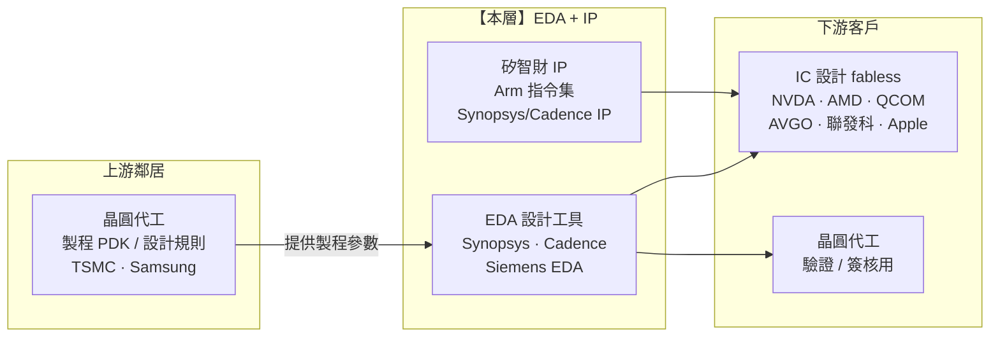

> 大部分人談 AI 半導體,眼睛盯著 NVIDIA 的 GPU、台積電的製程。
> 稍微進階的人會往上游看設備,發現 ASML 的 EUV 是硬咽喉。
> 但很少人注意到:在任何一顆晶片被「製造」之前,它得先被「設計」出來——
> **而全世界每一顆先進晶片,都是用 Synopsys 或 Cadence 的工具設計的。這是一個最安靜、卻最難繞過的收費站。** 這篇就拆這一層。

---

> ⚠️ **免責聲明與資料說明**:本文是半導體產業鏈系列的 **Part 3**,聚焦「EDA + IP(設計工具與矽智財)」這一層的結構性分析,重點在角色、集中度與定價權,不是個股估值報告。文中市佔率、毛利率為**公開產業常識的概估值**(截至 2026 年初),用於說明相對地位,**非即時報價**。本文為教育用途,**不構成投資建議**。

---

## 一、這一層在產業鏈的位置

EDA + IP 位在整條鏈的**最上游**,但它不供應「材料」,而是供應「設計晶片的能力」。它的產出不是實體物,而是**軟體工具 + 可重複授權的電路藍圖**——所有下游的 IC 設計公司(fabless)與晶圓代工廠,都得先拿到這一層的東西,才能開始工作。



> **一句話定位**:EDA + IP 上游只依賴代工廠提供「製程規則(PDK)」,下游卻被**幾乎所有晶片公司**依賴。它自己輕資產、可無限複製,定價權明顯**倒向供應端(這一層自己)**——因為客戶就算討厭它,也無法在合理時間內換掉它。

---

## 二、這一層到底在做什麼

現代一顆先進晶片,動輒**幾百億到上千億顆電晶體**。人腦不可能手工畫出這種複雜度的電路。EDA(Electronic Design Automation,電子設計自動化)就是把「設計晶片」這件事,變成一整套可運行的軟體流程。IP(矽智財)則是把「已經設計好、驗證過的電路模組」拿來重複賣。

**EDA 工具鏈涵蓋整個設計流程:**

```
規格 → RTL 設計 → 邏輯合成 → 佈局繞線 → 時序/功耗驗證 → 簽核(sign-off) → 交給代工廠投片
        │           │            │              │                │
        └─ 模擬     └─ Synthesis  └─ Place&Route └─ Timing/Power  └─ DRC/LVS 物理驗證
           Verification                          Signoff           (確保能被製造)
```

- **每一格都是一套要價數十萬到數百萬美元的軟體授權**,而且環環相扣:合成的結果餵給繞線,繞線的結果餵給驗證,整條流程綁在同一家工具商的環境裡最省事。

**IP(矽智財)是「不要重造輪子」的生意:**

- **處理器 IP**:Arm 賣的是 CPU/GPU 的「指令集架構 + 核心設計」。你不用從零設計一顆 CPU,直接授權 Arm 的 Cortex 核心,貼進自己的晶片。
- **介面 IP**:Synopsys、Cadence 賣 USB、PCIe、DDR、HBM、SerDes 等標準介面的現成電路模組——這些是「everybody needs, nobody wants to design」的東西。

**為什麼這一層存在**:設計複雜度的成長遠快於人力,晶片公司**沒有理由自己重寫 EDA 工具或重造標準 IP**——那等於要多養幾千個工具工程師。把這件事外包給專業工具商,是三十年來整個產業的共識。這正是這一層護城河的根源:**它幫所有人省下了「自己做」的巨大成本,於是所有人都離不開它。**

---

## 三、玩家與競爭格局

這一層其實是**兩個不同的子市場**:EDA 工具(雙寡占)與 IP 授權(Arm 一家獨大於行動,但格局正在鬆動)。

### EDA 工具:Synopsys + Cadence 雙寡占

```
EDA 市場份額(概估,全流程領先製程)
──────────────────────────────────────────────
Synopsys   ████████████████░░░░  ~32%   合成/簽核/IP 龍頭
Cadence    ███████████████░░░░░  ~30%   模擬/繞線/客製設計強
Siemens EDA████████░░░░░░░░░░░░  ~15%   前身 Mentor,封裝/驗證利基
其他       ██████░░░░░░░░░░░░░░  ~23%   分散小廠、點工具
──────────────────────────────────────────────
兩強合計 ~60%+;在最先進節點的「全流程 + 簽核」上,雙寡占接近絕對
```

- **Synopsys(SNPS)**:EDA 最大家,合成(Design Compiler)與簽核工具是業界標準;同時是**最大的 IP 供應商**(介面 IP)。近年併購 Ansys(多物理模擬),把版圖從「設計」擴到「模擬 + 系統」。
- **Cadence(CDNS)**:模擬(Spectre)、客製/類比設計、繞線工具極強;在 AI/HPC 客戶的數位全流程持續搶市佔。毛利率甚至高於 Synopsys。
- **Siemens EDA**(前 Mentor Graphics):第三大,強在物理驗證(Calibre)、封裝與 PCB;被西門子收購後偏向工業/系統整合方向。

### IP 授權:Arm 的「授權 + 權利金」印鈔機

- **Arm(ARM)**:不自己做晶片,只賣**指令集架構(ISA)+ 核心 IP**。商業模式是兩段收費——(1) 前期**授權費**(license),客戶付錢取得設計權;(2) 每賣出一顆用了 Arm 的晶片,再抽**權利金**(royalty)。
- **規模驚人**:全球每年出貨的 Arm 架構晶片以**數百億顆**計,**~99% 的智慧型手機**都跑 Arm。近年更往**資料中心 CPU**(如各家自研 Arm 伺服器晶片)與車用擴張,權利金基數持續墊高。
- **挑戰者**:**RISC-V**(開源、免授權費的指令集)正從邊緣 MCU 往上侵蝕;x86 仍守住部分伺服器。這是這一層唯一「格局可能被結構性改變」的地方。

### 綜合比較表

| 子層 | 代表公司 | 商業模式 | 毛利率(概估) | 集中度 | 護城河來源 |
|---|---|---|---|---|---|
| EDA 全流程 | Synopsys、Cadence | 軟體訂閱授權 | ~80–88% | 雙寡占 | 流程綁定 + 換工具要重訓整批團隊 |
| EDA 驗證/封裝 | Siemens EDA | 軟體授權 | ~高 | 第三位 | Calibre 物理驗證幾成標準 |
| 處理器 IP | Arm | 授權費 + 權利金 | ~95%+(IP 近乎零邊際成本) | 行動近獨占 | 龐大軟體/工具生態鎖定 |
| 介面 IP | Synopsys、Cadence | 授權 + 權利金 | ~高 | 寡占 | 標準介面驗證成本高 |

**一個尺度感**:整個 EDA 市場一年的規模概估僅約 **150 億美元**上下,卻是撐起**全球逾 6,000 億美元半導體產業**的設計地基——用不到全產業 3% 的營收,扮演「沒有它整條鏈就動不了」的角色。這種「小市場、大槓桿」正是安靜收費站的典型特徵:規模不顯眼,不可替代性卻拉滿。

**一句話**:EDA 是「賣鏟子給挖金者的鏟子供應商」,Arm 是「向每一把鏟子抽過路費」。兩者都不碰實體製造,卻卡在每顆晶片的必經之路上。

---

## 四、瓶頸分數與定價權

依 industry-map 方法,對這一層打「瓶頸分數」(0–10):供應商稀缺度、不可替代性、切換成本/驗證時間、需求剛性——四項平均。EDA 與 IP 分開評,再取層平均。

```
子層 / 因子        稀缺度  不可替代  切換成本  需求剛性   平均
──────────────────────────────────────────────────────────────
EDA(全流程)        8       9         9         8      = 8.5
IP — Arm(行動)     7       6         8         7      = 7.0
──────────────────────────────────────────────────────────────
本層瓶頸分數(加權平均):約 8.0 / 10
```

**逐項解讀:**

- **稀缺度(EDA 8)**:全流程 + 簽核工具實質只有 2.5 家(Synopsys、Cadence、加上 Siemens 在部分環節)。做不出來的不是缺程式,是缺「數十年與代工廠共同校準的驗證資料」。
- **不可替代性(EDA 9)**:先進節點的晶片**沒有這些工具就設計不出來**,也無法被代工廠接受投片(簽核格式綁定)。Arm 只給 6——因為 RISC-V 與 x86 是真實存在的替代路徑。
- **切換成本(EDA 9 / Arm 8)**:換 EDA 工具要**重訓整批 IC 工程師、重建設計流程、重跑驗證**,一次遷移動輒一兩年、賭上流片良率——沒人敢在關鍵專案上換。Arm 的鎖定則來自軟體與工具生態:換 ISA 等於整個軟體堆疊重來。
- **需求剛性(8)**:只要還要設計晶片,就一定要用這一層。AI 讓設計案量、複雜度雙漲,需求只增不減。

> **定價權方向**:明確**倒向供應端**。EDA 是訂閱制、逐年漲價,客戶幾乎沒有議價籌碼;Arm 甚至在改權利金模式(從「每顆固定金額」往「按晶片價值抽成」移動),試圖吃到 AI 晶片漲價的紅利。這一層的定價權,是整條鏈裡最穩、最不用打價格戰的一段。

---

## 五、利潤池與價值捕獲

這一層的價值捕獲是**「高且極其穩定」**——不像記憶體那樣暴起暴落,也不像 OSAT 那樣薄利。原因是純軟體/IP 的商業模式:

```
為什麼毛利能到 ~80–95%
─────────────────────────────────────────────────────────
① 邊際成本趨近於零 ── 軟體複製一份 vs 一萬份,成本差不多;
                      IP 授權一次,之後每顆晶片抽成幾乎全是純利。
② 訂閱制收入 ──────── EDA 早已從「賣斷」轉成多年期訂閱,
                      收入可預測、遞延收入(backlog)厚,抗景氣。
③ 換供應商成本極高 ── 客戶被綁死,漲價轉嫁容易,不打價格戰。
④ 收費基數在膨脹 ──── 每顆晶片電晶體數、設計案複雜度逐年上升,
                      同一個客戶每年付的授權金額自然水漲船高。
─────────────────────────────────────────────────────────
```

**利潤池位置(相對上下游鄰居):**

| 鄰居層 | 毛利率(概估) | 收入穩定度 | 相對本層 |
|---|---|---|---|
| 上游:晶圓代工(提供 PDK) | ~55–59% | 資本密集、需擴產 | 本層更高、更輕資產 |
| **【本層】EDA + IP** | **~80–95%** | **訂閱/權利金,極穩** | — |
| 下游:fabless IC 設計 | ~60–75% | 隨終端需求波動 | 客戶賺得多,但要扛設計風險 |

**洞察**:整條鏈裡,**「軟體/IP 屬性」的層(EDA + IP)毛利結構性最漂亮**——它把重資產(製造)與市場風險(終端需求)都推給了上下游,自己收一筆「無論誰設計出爆款晶片都照抽」的過路費。這跟 ASML 的「賣設備」還不同:ASML 賣一台是一台,EDA/IP 是**同一份東西賣給所有人、還逐年漲**。

---

## 六、上游依賴與下游客戶

### 上游依賴:幾乎沒有(這正是它強的地方)

- EDA + IP 是**輕資產、無實體供應鏈**的一層。它唯一的「上游輸入」是晶圓代工廠提供的**製程設計套件(PDK)與設計規則**——也就是「這個製程能做什麼、不能做什麼」的參數。
- 但這其實是**雙向綁定的合作**,不是脆弱依賴:代工廠(如台積電)反而**需要 EDA 工具先支援它的新製程**,新製程才有人用。所以是「代工廠與 EDA 商聯合開發」,沒有單一來源被卡脖子的風險。
- 唯一的實體依賴是雲端算力(跑大型模擬/驗證),但這對成本結構影響很小。

### 下游客戶:高度集中在頂尖晶片公司,但議價權仍在本層

- 下游是**所有 IC 設計公司 + 代工廠**:NVIDIA、AMD、高通、博通、蘋果、聯發科、各家 CSP 自研晶片團隊……客戶名單就是半導體業的名人榜。
- **客戶集中嗎?** 大客戶(前幾大晶片公司)確實貢獻可觀營收,但由於**「非用不可」**,集中度並沒有轉化成客戶議價權——反而大客戶為了拿到最新製程的工具支援,更離不開這一層。

### 上下游能整合掉這一層嗎?幾乎不能

```
能不能繞過 EDA / IP?
──────────────────────────────────────────────────────
下游 fabless 自建 EDA?  ── ✗ 要養數千工具工程師、幾十年校準,
                            經濟上完全不划算。
下游自研 CPU 繞過 Arm?  ── ◐ 部分做得到:改用 RISC-V(開源)。
                            這是唯一真實的「往上游反打」路徑。
代工廠自己做工具?      ── ✗ 代工廠寧可與 EDA 商合作,不願自建。
──────────────────────────────────────────────────────
```

**一句話**:這一層的上游依賴幾乎為零,下游雖集中卻無議價力——結構上是「上下游都動不了它」。唯一的縫隙是 **RISC-V 對 Arm** 的替代,而那只影響 IP 子層,動不了 EDA 工具本身。

---

## 七、風險

雖然結構極強,這一層仍有真實風險,依嚴重度標記:

- 🔴 **地緣/出口管制(最直接風險)**:EDA 是美國對特定地區(中國)出口管制的**第一線工具**——先進節點(如 GAA、EUV 相關)EDA 已被列入管制清單。這既切斷了一塊高毛利市場(中國佔全球晶片設計需求相當比例),也直接**催生對手**:管制越嚴,中國越有動機扶植本土 EDA 與 RISC-V,長期侵蝕這一層的普世性。
- 🔴 **RISC-V 對 Arm 的結構性侵蝕**:開源、免授權費的 RISC-V 正從 MCU、嵌入式往上走,並成為地緣避險的首選。若它在手機/資料中心站穩,Arm 的權利金基數會被侵蝕——這是 IP 子層最實質的長期威脅(對 EDA 工具本身影響小)。
- 🟠 **半導體景氣週期**:雖是訂閱制、抗跌,但設計案數量隨產業資本支出波動;大循環下行時,新專案延後會壓抑授權成長(不是崩盤,是成長減速)。
- 🟠 **併購整合與監管**:這一層靠併購擴張(如 Synopsys 併 Ansys)。大型併購面臨反壟斷審查,整合不順會拖累利潤;監管也可能盯上「雙寡占」本身。
- 🟡 **AI 自動化的雙面刃**:AI 設計晶片(見下節)是本層的成長引擎,但若「AI 大幅降低設計門檻」走到極端,理論上可能讓設計流程更標準化、降低對高階工具的依賴——目前看是利遠大於弊,但值得長期觀察。
- 🟡 **客戶自建 IP 團隊**:超大型客戶(如蘋果、部分 CSP)自研 CPU 核心,減少對 Arm 標準核心的依賴(改用架構授權,權利金結構改變)——侵蝕有限,但長期擠壓 Arm 的定價空間。

---

## 八、價值遷移

**判斷:未來 1–3 年,價值持續**流入(往這一層集中)**,但內部結構會微調。**

```
驅動力                     →   對本層的影響               →   確認訊號(trigger)
──────────────────────────────────────────────────────────────────────────
AI 設計晶片(EDA + AI)        EDA 工具往「AI 驅動設計」            各家 AI-EDA 產品營收佔比
Synopsys DSO.ai /              升級,單價與黏著度再拉高            持續上升;客戶用 AI 縮短
Cadence Cerebrus                                                  設計週期成為常態
──────────────────────────────────────────────────────────────────────────
晶片複雜度持續爆炸            每顆晶片要買更多工具/IP,            電晶體數、設計案複雜度、
(chiplet、先進封裝、3D IC)    收費基數自然膨脹                    多晶片系統設計需求上升
──────────────────────────────────────────────────────────────────────────
Arm 改權利金模式             從「每顆固定」→「按晶片價值抽成」,   Arm 權利金 ASP 上升,
                             吃到 AI 晶片漲價紅利                 資料中心 Arm 佔比提高
──────────────────────────────────────────────────────────────────────────
[反向] RISC-V + 地緣管制      侵蝕 IP 子層(Arm)的普世性,        RISC-V 在手機/伺服器出貨
                             但動不了 EDA 工具                    佔比明顯突破
──────────────────────────────────────────────────────────────────────────
```

**核心論點**:AI 不只是這一層的**客戶**(AI 晶片要用 EDA 設計),更成了它的**產品**(EDA 用 AI 來自動化設計)——這是罕見的「客戶與產品雙重受惠」。價值不但沒有離開,反而因為 **AI 讓設計更複雜、也讓工具更值錢**而進一步向這一層集中。唯一往外漏的縫,是 RISC-V 從 Arm 手上分走一部分 IP 權利金——但那是 IP 子層的內部重分配,EDA 工具的收費站幾乎紋風不動。

---

## 九、分層投資點子(教育性質、非投資建議)

| 分層角色 | 較佳定位的名字 | 邏輯 | 點子類型 |
|---|---|---|---|
| **咽喉/軍火商** | Synopsys、Cadence | 每顆晶片都用它們的工具設計,收「安靜的過路費」,下游誰贏都照抽;~80%+ 毛利、訂閱制抗跌 | 核心持有 |
| **權利金印鈔機** | Arm | 授權 + 權利金雙收,行動近獨占、資料中心擴張中;近乎零邊際成本 | 成長 + 護城河 |
| **二階(picks-and-shovels)** | AI-EDA 功能滲透率、介面 IP(HBM/PCIe/SerDes) | AI 設計晶片與 chiplet 讓工具/IP 收費基數膨脹,市場容易只看 GPU 而低估這層 | 低調、易被低估 ◄ |
| **選擇權/風險對沖** | RISC-V 生態、本土 EDA(地緣主題) | 若價值從 Arm 往開源 ISA 遷移,或地緣加速去美化,便宜的反向曝險 | 投機性 |
| **相對弱** | 純點工具小廠 | 被雙寡占的全流程整合擠壓,缺乏綁定力 | 迴避 / 併購標的 |

**最該注意的「非顯性節點」**:市場追 GPU、追代工,卻很少人注意到——**無論哪家 AI 晶片勝出,設計它的工具都來自同兩家公司**。EDA 是整條 AI 供應鏈裡「曝險最全面、波動最小、卻最少被當成 AI 題材」的一層。這正是二階投資最愛的形狀:賣鏟子給所有挖金者,而且鏟子還是訂閱制。

---

## 論點反轉條件(Thesis Invalidation)

**本層結構訊號為 BULLISH(對 EDA/IP 這一層樂觀),下列情況會打破論點:**

- Synopsys / Cadence 的**全流程雙寡占被打破**——出現可信的第三/第四家,或客戶大規模自建工具(目前經濟上不成立)。
- **RISC-V 在手機與資料中心大規模取代 Arm**,權利金基數結構性萎縮(IP 子層論點反轉的關鍵訊號)。
- **地緣管制升級到反傷本層**:管制範圍過大,導致全球客戶加速轉向本土/開源替代,侵蝕這一層的普世收費能力。
- 宏觀:半導體資本支出循環深度反轉,新設計案長期停滯,壓抑授權成長。

**重新檢視這張地圖的時機:**

- [ ] Synopsys / Cadence / Arm 財報公布(看訂閱遞延收入、權利金 ASP)
- [ ] RISC-V 在手機/伺服器出貨佔比出現明顯跳升
- [ ] 重大出口管制/反壟斷事件
- [ ] 距今超過 60–90 天

```
╔══════════════════════════════════════════════╗
║              INDUSTRY-MAP SIGNAL             ║
╠══════════════════════════════════════════════╣
║ 結構訊號:    EDA/IP 層 BULLISH(安靜收費站) ║
║ Confidence:  HIGH(護城河結構極清晰)         ║
║ Horizon:     LONG-TERM(1 年以上)            ║
║ Score:       8.0 / 10(對本層結構強度)       ║
╠══════════════════════════════════════════════╣
║ 偏好子層:    EDA 雙寡占(SNPS/CDNS)          ║
║ 觀察風險:    RISC-V 對 Arm + 地緣管制         ║
╚══════════════════════════════════════════════╝
```

評分指引:8.0–10.0 強烈偏多 | 6.0–7.9 中度偏多 | 4.0–5.9 中性 | 2.0–3.9 中度偏空 | 0.0–1.9 強烈偏空

---

### 📚 系列導覽:半導體產業鏈全景（上游 → 下游）

> 總覽地圖:[industry-map - 半導體晶片產業鏈全景](/yennj12_blog_V4/posts/industry-map-semiconductor-value-chain-zh/)

**上游 Upstream**
- Part 1:[矽晶圓 / 基板](/yennj12_blog_V4/posts/industry-map-semiconductor-part1-silicon-wafer-zh/)
- Part 2:[特用化學 / 光阻](/yennj12_blog_V4/posts/industry-map-semiconductor-part2-chemicals-photoresist-zh/)
- **Part 3:[EDA + IP](/yennj12_blog_V4/posts/industry-map-semiconductor-part3-eda-ip-zh/)** ← 本篇
- Part 4:[晶圓設備](/yennj12_blog_V4/posts/industry-map-semiconductor-part4-fab-equipment-zh/)

**中游 Midstream**
- Part 5:[晶圓代工](/yennj12_blog_V4/posts/industry-map-semiconductor-part5-foundry-zh/)
- Part 6:[IC 設計 — GPU/加速器](/yennj12_blog_V4/posts/industry-map-semiconductor-part6-gpu-design-zh/)
- Part 7:[IC 設計 — 其他](/yennj12_blog_V4/posts/industry-map-semiconductor-part7-ic-design-zh/)
- Part 8:[記憶體](/yennj12_blog_V4/posts/industry-map-semiconductor-part8-memory-zh/)
- Part 9:[IDM / 類比](/yennj12_blog_V4/posts/industry-map-semiconductor-part9-idm-analog-zh/)
- Part 10:[封裝測試 OSAT](/yennj12_blog_V4/posts/industry-map-semiconductor-part10-osat-zh/)

**下游 Downstream**
- Part 11:[網通 / 互連](/yennj12_blog_V4/posts/industry-map-semiconductor-part11-networking-zh/)
- Part 12:[系統 / 伺服器 OEM](/yennj12_blog_V4/posts/industry-map-semiconductor-part12-system-oem-zh/)
- Part 13:[雲端 CSP](/yennj12_blog_V4/posts/industry-map-semiconductor-part13-cloud-csp-zh/)
- Part 14:[終端需求](/yennj12_blog_V4/posts/industry-map-semiconductor-part14-end-demand-zh/)

---

## 參考來源與方法(References)

- 分析方法:InvestSkill `industry-map` skill(<https://github.com/yennanliu/InvestSkill>)——把產業畫成上游到下游的有向圖,定位咽喉點、利潤池與價值遷移。
- 本文的市佔率/毛利率為公開產業常識的**概估值**(截至 2026 年初),用於說明各層相對地位,非即時報價。
- 總覽地圖:[半導體晶片產業鏈全景](https://yennj12.js.org/yennj12_blog_V4/posts/industry-map-semiconductor-value-chain-zh/)

> 再次提醒:本文為產業結構教學與地圖,市佔/毛利為概估值,**不構成投資建議**。
