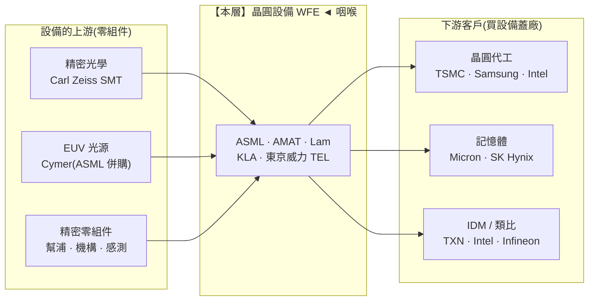

> 大部分人看半導體設備,只記得一句「ASML 賣曝光機」。
> 稍微進階的人會補一句「還有應材、科林、科磊」。
> 但真正看懂這一層的人問的是:**「為什麼一台機器賣 1.5 億美元,客戶還得排隊求它賣?為什麼下游三家晶圓廠打生打死,設備商穩賺三家的錢?」**
> 這一篇,拆的是整條鏈**最硬的收費站**——沒有它,先進晶片一顆都做不出來。

---

> ⚠️ **免責聲明與資料說明**:本文是**結構性產業鏈地圖**的 Part 4,聚焦「晶圓設備(WFE, Wafer Fab Equipment)」這一層的角色、集中度與定價權,不是個股估值報告。文中市佔率、毛利率、設備單價為**公開產業常識的概估值**(截至 2026 年初),用於說明相對地位,**非即時報價**;投資決策前請自行查證最新數據。本文為教育用途,**不構成投資建議**。

---

## 一、這一層在產業鏈的位置

晶圓設備位在**上游最深處**——它不生產晶片,它生產「生產晶片的機器」。它把材料層(矽晶圓、化學)的輸入,轉化成中游晶圓廠的產能。



> **位置與定價權一句話**:晶圓設備是上游咽喉層,**定價權極度傾向供應端**。下游客戶(連台積電這種巨頭)想擴先進製程產能,都得**排隊向設備商下單、預付訂金**;而設備商唯一的上游卡點(Zeiss 光學、Cymer 光源)還被 ASML 用併購與獨家合約鎖死。這是整條鏈裡「議價力最不對稱」的一段。

---

## 二、這一層到底在做什麼

一片 12 吋晶圓從光禿禿的矽,變成上面刻著幾百億顆電晶體的晶片,要在無塵室裡跑**上千道製程步驟**、反覆疊上百層結構。每一道步驟,都對應一種專門機台。WFE 就是這些機台的總稱。

把一片晶圓的加工循環攤開,你會看到設備商各自把守一個關卡:

```
一片晶圓的加工循環(簡化,先進製程要重複數百次)
──────────────────────────────────────────────────────────────
① 沉積 Deposition   長出薄膜(CVD/PVD/ALD/ECD)   ← AMAT · Lam · TEL · ASMI
② 塗光阻 Coat       在膜上塗感光材料(Track)      ← 東京威力 TEL(塗顯機近乎獨占)
③ 微影 Litho        用光把電路圖「印」上去 ★核心    ← ASML(EUV 100%)· Nikon/Canon(舊 DUV)
④ 顯影 Develop      顯出圖案                       ← 東京威力 TEL
⑤ 蝕刻 Etch         把不要的地方刻掉                ← Lam(蝕刻龍頭)· TEL · AMAT
⑥ 離子植入 Implant  改變材料電性                    ← AMAT(近乎獨占)
⑦ 研磨 CMP          把表面磨平                      ← AMAT · Ebara
⑧ 清洗 Clean        洗掉殘留                        ← SCREEN · TEL · Lam
⑨ 量測/檢測 Metro   每一步都要「看有沒有做錯」★     ← KLA(製程控制龍頭)
──────────────────────────────────────────────────────────────
★ 微影決定「能做多小」;製程控制決定「良率能拉多高」——兩個都是命門。
```

**為什麼微影(Litho)是皇冠上的鑽石**:電晶體能做多小,幾乎完全由「曝光機的解析度」決定。要做 7nm 以下,傳統 DUV(深紫外光,193nm 波長)得靠「多重曝光」硬湊,步驟暴增、良率掉、成本飆。**EUV(極紫外光,13.5nm 波長)**一次就能印出更細的線,而全世界**只有 ASML 造得出 EUV 曝光機**。一台 EUV 逾 1.5 億美元,新一代 **High-NA EUV 逾 3.5 億美元**,裡面約 10 萬個零件、Zeiss 打磨到原子級平整度的反射鏡、Cymer 用雷射打錫滴產生電漿的光源——這是人類量產設備裡最複雜的一台機器。

**為什麼「檢測」也是命門**:先進製程疊上百層,任何一層出錯,整片報廢。KLA 的檢測/量測設備是晶圓廠的「眼睛」——沒有它,良率無從優化。這讓 KLA 在一個看似冷門的子層,握有近乎壟斷的地位。

---

## 三、玩家與競爭格局

WFE 全球市場一年約 **1,000 億美元上下(概估)**。這一層不是一家獨大,而是**「五強各據一個子市場、彼此幾乎不正面競爭」**的寡占——每一家在自己的segment都近乎壟斷。

```
WFE 市場依「製程步驟」切分(佔比為概估)
─────────────────────────────────────────────────────
微影 Lithography      ██████████░░░░  ~22%   ASML 一家吃下(EUV 100%)
沉積 Deposition       ██████████░░░░  ~22%   AMAT · Lam · TEL · ASMI 分食
蝕刻 Etch             ██████████░░░░  ~21%   Lam 龍頭 · TEL · AMAT
製程控制/量測 Metro   ██████░░░░░░░░  ~13%   KLA 一家吃下大半
清洗/研磨/植入/其他   ████████░░░░░░  ~22%   SCREEN · Ebara · AMAT 等
─────────────────────────────────────────────────────
```

換算成**「各廠商佔整體 WFE 的市佔」**(概估):

```
廠商                佔整體 WFE   主場優勢
─────────────────────────────────────────────────────────
ASML(荷)          ~20%   ████████░░  微影;EUV 全球獨家 ◄
Applied Materials   ~19%   ████████░░  沉積/植入/CMP;產品線最廣
Tokyo Electron TEL  ~15%   ██████░░░░  塗顯機近獨占 + 蝕刻/沉積
Lam Research LRCX   ~13%   █████░░░░░  蝕刻龍頭 + 記憶體製程強
KLA(KLAC)         ~7%    ███░░░░░░░  製程控制/檢測近獨占 ◄
其他(Nikon/Canon等)~26%  ──────────  舊製程 DUV、利基機台
─────────────────────────────────────────────────────────
```

| 廠商 | 角色定位 | 護城河來源 | 集中度 | 毛利率(概估) |
|---|---|---|---|---|
| **ASML** | EUV/DUV 微影獨家 | 物理+光學+供應鏈整合,數十年 | EUV **100% 獨占** | ~51–53% |
| **Applied Materials** | 沉積/植入/CMP 全能王 | 產品線最廣、材料工程 know-how | 多子市場龍頭 | ~47–48% |
| **Lam Research** | 蝕刻與記憶體製程龍頭 | 高深寬比蝕刻、3D NAND 綁定 | 蝕刻近半 | ~48–49% |
| **KLA** | 製程控制/檢測獨大 | 光學檢測演算法、良率數據 | 製程控制 ~50%+ | **~60%** 全層最高 |
| **東京威力(TEL)** | 塗顯機獨占 + 蝕刻沉積 | 塗顯機(coater/developer)~90% | 塗顯近獨占 | ~45% |

**兩個關鍵洞察**:
1. **這不是一場「五家搶同一塊餅」的競爭,而是「五個各自的獨占市場」**。你很少看到 ASML 跟 KLA 搶單——它們賣的是完全不同的機台。這種「分區壟斷」結構,讓每一家的定價權都異常穩固:客戶不能拿 A 家去壓 B 家的價。
2. **ASML 是獨占中的獨占**。其他四家的子市場至少還有二、三個對手(蝕刻有 Lam/TEL/AMAT 三家);但 **EUV 微影,全世界只有 ASML 一家能供**。Nikon、Canon 早在 EUV 賽道退場,DUV 也只剩舊製程利基。這是整條半導體鏈**唯一真正「零替代」**的節點。

---

## 四、瓶頸分數與定價權

用四個因子(0–10)為這一層打「瓶頸分數」:供應商稀缺度、不可替代性、切換成本/驗證時間、需求剛性。分數越高,越能「卡住整條鏈」。

```
因子                     EUV(ASML)  沉積/蝕刻/檢測(其他四強)
──────────────────────────────────────────────────────────
供應商稀缺度              10  唯一供應      8  各子市場 2–3 家
不可替代性                10  無任何替代    8  跨廠移轉極痛但非不可能
切換成本/驗證時間          9  綁死整個製程  9  換機台要重跑良率驗證,數月~數年
需求剛性                 10  先進製程命脈  9  少任一步驟都做不出晶片
──────────────────────────────────────────────────────────
平均(瓶頸分數)          9.8            8.5
```

> **本層綜合瓶頸分數 ≈ 9.3 / 10**(全系列最高)。其中 **EUV 微影 = 10.0,是整條鏈唯一的「滿分咽喉」**。

**定價權方向:壓倒性流向供應端(設備商)。** 三個結構性理由:

```
① 排隊經濟學:先進製程 EUV 產能吃緊,客戶得提前 1–2 年下單、預付訂金搶交期。
② 綁定經濟學:機台一旦裝進產線並完成良率驗證,換掉的代價 = 重跑數月驗證 + 良率風險,
   幾乎沒人敢動 → 設備商吃「安裝基數(installed base)」的長期服務財。
③ 進步稅:每過一個世代(N3→N2→A16),電晶體越難做,曝光/蝕刻/檢測步驟越多,
   → 每片晶圓要買的設備「金額」不減反增。摩爾定律越難,設備商越賺。
```

**論點反轉條件(何時 Y 反而對?)**:若先進製程需求結構性萎縮(AI 資本支出反轉、摩爾定律撞牆到沒人願意再往下推進),設備商的排隊與進步稅就失效——這時定價權會短暫回到客戶手上(殺價、砍單、延後拉貨)。這正是 WFE 的**週期性**來源(見第七節)。

---

## 五、利潤池與價值捕獲

這一層的價值捕獲是**「極高 ◄ 咽喉」**,而且是全系列**最持久**的一種高——原因不只是毛利數字,更是**利潤的結構**。

```
WFE 的利潤結構(為什麼比想像中更穩)
──────────────────────────────────────────────
賣機台(系統) ─────► 一次性、隨資本支出循環波動(週期性)
      +
賣服務/零件/升級 ──► 每年重複、隨安裝基數累積(非週期、越滾越大)
      =
「賣刀片 + 賣刀片訂閱」的複合模式
──────────────────────────────────────────────
```

- **毛利對比**:設備層毛利普遍 **45–53%**,KLA 甚至逼近 **60%**——這在「重資產、賣硬體」的世界裡是異數。相比之下,下游晶圓代工毛利 ~55%(但要扛千億資本支出),封測 OSAT 只有 15–25%。**設備商賺的是「知識財」,不是「產能財」**。
- **安裝基數服務財**:全球裝機越多,每年的維修、零件、製程升級收入越大,且這塊**幾乎不受景氣循環影響**。ASML、AMAT 的服務收入佔比逐年上升,把週期性生意「去週期化」。
- **利潤池落點**:在整條鏈的價值捕獲排名上,**EUV 設備僅次於 GPU,與晶圓代工、EDA 並列最高梯隊(概估 9/10)**。而且它的高,比 GPU 更「不易被工程繞過」——這是本層最強的地方。

**一句話**:晶圓代工賺的是「把設備開好、良率拉高」的辛苦錢(要不斷燒錢擴產);設備商賺的是「你不買就做不出晶片」的過路費,而且**每個世代都能漲價**。

---

## 六、上游依賴與下游客戶

**設備商要向誰買?(上游依賴)**

```
ASML 的關鍵上游(也是它護城河的一部分)
─────────────────────────────────────────────
Carl Zeiss SMT   EUV 反射鏡光學系統   獨家、深度綁定(ASML 持股)  🔴 單一來源
Cymer            EUV 光源(錫滴電漿)  ASML 已併購,內化為自家     🟢 已鎖死
數千家精密零件商  幫浦/機構/感測器等   分散,但高階件仍集中歐日     🟠
─────────────────────────────────────────────
```

關鍵洞察:ASML **用併購(Cymer)與持股綁定(Zeiss)把自己唯一的上游卡點內化了**。這意味著即使有人想從「光學/光源」切入複製 EUV,也拿不到最頂尖的供應鏈。護城河不只是技術,還是**供應鏈的排他性**。其他四強的上游相對分散(標準零件、氣體、精密機構),單一來源風險較低。

**誰向設備商買?(下游客戶集中度)**

```
下游客戶集中度(EUV 尤其極端)
─────────────────────────────────────────────
EUV 買家    幾乎只有 台積電 · 三星 · Intel · SK Hynix/Micron 少數幾家 🔴 高度集中
一般 WFE    上述 + 中國成熟製程廠 + 各 IDM,較分散                    🟠 中度
─────────────────────────────────────────────
```

- **能不能反向整合?** 下游晶圓廠**自製設備幾乎不可能**——EUV 的技術與供應鏈壁壘太高,連台積電、Intel 都選擇當客戶而非自造。反過來,設備商**往下游做晶圓代工也不划算**(會與客戶競爭、且是完全不同的重資產生意)。所以這條「設備 → 晶圓廠」的邊,**雙向都無法整合掉**,是條穩固的收費邊。
- **客戶集中的另一面**:EUV 買家就那幾家,萬一其中一家(如某先進製程廠)大砍資本支出或延後 N2 擴產,ASML 的 EUV 訂單會**立刻感受到**。這是「賣給少數巨頭」的雙面刃——議價力極高,但需求波動也大。

---

## 七、風險

| 風險 | 嚴重度 | 說明 |
|---|---|---|
| **資本支出週期性** | 🟠 | WFE 是**強週期**生意。晶圓廠擴產一波後會「消化產能」,設備訂單隨之大起大落。安裝基數服務財能墊底,但系統銷售仍隨 capex 循環上下。 |
| **地緣/出口管制** | 🔴 | 荷蘭+美國禁止 EUV 售中(從未賣過),2023–2024 起連**高階 DUV 浸潤機**也管制;美國並限制 AMAT/Lam/KLA 對中國先進廠的銷售與售後服務。中國曾佔 WFE 需求極高比例,管制直接切掉一塊需求。 |
| **中國需求消化** | 🟠 | 中國前幾年大買成熟製程設備衝產能,一旦「買夠了」進入消化期,成熟節點 WFE 需求會明顯回落——這是近期最大的短期逆風。 |
| **技術節點卡關** | 🟡 | High-NA EUV 若導入延後、或客戶良率遲遲拉不上來,新一代機台的拉貨會遞延。摩爾定律放緩本身也可能拉長換機週期。 |
| **客戶內製/替代** | 🟢 | 極低。EUV 無人能自製;其他子市場雖有二三對手,但沒有客戶能垂直整合掉設備商。這是本層風險最小的一項。 |

**風險總結**:這一層的風險**不在「護城河被攻破」(那極難),而在「需求何時來、來多少」**——也就是週期與地緣。結構極強,但時點難測。

---

## 八、價值遷移

**價值正在「流入」這一層,而且會停留很久。** 觸發點與方向:

```
價值遷移方向(未來 1–3 年)
──────────────────────────────────────────────────────────
往這層流入的力量:
  ‣ AI 拉動先進製程(N2/A16)擴產 → EUV/High-NA 需求結構性上升
  ‣ 每個新世代的曝光/蝕刻/檢測步驟數增加 → 每片晶圓的設備含量↑(進步稅)
  ‣ 先進封裝(CoWoS)自成一套設備需求 → 新增一塊 WFE 以外的設備市場

可能讓價值短暫流出的力量:
  ‣ 資本支出循環反轉(AI capex 見頂 → 晶圓廠砍單)
  ‣ 出口管制擴大 → 切掉中國需求

確認訊號(trigger):
  ✅ 流入確認:High-NA EUV 進入量產拉貨 + 台積電/三星 N2 產能開出
  ⚠️ 流出警訊:主要客戶下修 capex 指引、EUV 訂單延後、中國訂單斷崖
──────────────────────────────────────────────────────────
```

**一句話**:只要先進製程還在往前推(而 AI 正在逼它加速往前推),價值就會持續往設備層沉澱。這一層是「**摩爾定律的收稅員**」——製程越難,稅越重。它不像 GPU 那樣可能被 ASIC 或新架構繞過,設備層的稀缺是**物理與工程的稀缺**,最難被競爭掉。

---

## 九、分層投資點子

把地圖轉成分層點子(教育性質、**非投資建議**):

| 分層角色 | 較佳定位的名字 | 邏輯 | 點子類型 |
|---|---|---|---|
| **咽喉/軍火商** | ASML | EUV 零替代,先進製程誰擴產都得買;護城河最不可能被工程繞過 | 核心持有 |
| **廣度軍火商** | AMAT、Lam、TEL | 沉積/蝕刻/塗顯多子市場龍頭,吃整體 WFE 成長,且不押單一製程 | 核心/分散 |
| **隱形獨占(二階)** | KLA | 製程控制/檢測近獨占、全層最高毛利,市場關注度低於 ASML ◄ | 低調、易被低估 |
| **利基/舊製程** | Nikon、Canon | 舊 DUV 與利基機台,受先進製程紅利有限 | 迴避主題 |
| **選擇權** | 先進封裝設備、EUV 零組件/光學供應鏈 | 若 CoWoS 與 High-NA 放量,這些二階供應商是便宜曝險 | 投機性 |

**最該注意的「非顯性節點」**:市場一講設備就只想到 ASML,但 **KLA(製程控制)**是被低估的隱形獨占——先進製程層數越多,對「檢測良率」的依賴越深,而這塊 KLA 幾乎沒有對手,毛利還是全層最高。它不是鎂光燈焦點,卻實實在在卡住良率這道命門。

**「軍火商」總論**:下游晶圓代工三家(台積電/三星/Intel)無論誰在先進製程勝出,**它們都得向這五家設備商買機台**。設備商是這場代工大戰裡「賣軍火給所有參戰方」的贏家——而且**下游打得越兇、擴產越猛,設備商賺得越多**。這是整條鏈裡最乾淨的「你贏我也贏、你輸我還是賺服務財」的位置。

---

## 論點反轉條件(Thesis Invalidation)

**本層結構訊號為 BULLISH(對設備咽喉層強烈偏多),下列情況會打破論點:**
- **EUV 獨占被突破**:出現可信的第二家 EUV 供應商,或某種繞過 EUV 的新微影/自組裝技術被量產驗證(機率極低,但一旦發生是結構性利空)。
- **先進製程需求結構性萎縮**:AI 資本支出循環反轉,台積電/三星/Intel 集體下修 capex 與 N2/A16 擴產計畫。
- **出口管制大幅擴大**:管制範圍從中國先進廠擴及更多節點與地區,切掉的需求超過先進製程增量。
- **High-NA 導入全面延後**:客戶良率遲遲不達標,新世代機台拉貨無限期遞延。

**重新檢視這張地圖的時機:**
- [ ] ASML / AMAT / Lam / KLA / TEL 財報與訂單(bookings)公布時
- [ ] 主要客戶(台積電/三星/Intel)資本支出指引更新
- [ ] High-NA EUV 量產進度、中國 WFE 訂單出現明顯變化
- [ ] 重大出口管制事件
- [ ] 距今超過 60–90 天

```
╔══════════════════════════════════════════════╗
║              INDUSTRY-MAP SIGNAL             ║
╠══════════════════════════════════════════════╣
║ 層級:        晶圓設備 WFE(Part 4 / 上游)   ║
║ 結構訊號:    BULLISH ◄ 全系列最硬咽喉         ║
║ Confidence:  HIGH(結構極清晰,循環時點難測)  ║
║ Horizon:     LONG-TERM(1 年以上)            ║
║ 瓶頸分數:    9.3 / 10(EUV 子層 = 10.0)      ║
║ Score:       9.0 / 10                        ║
╠══════════════════════════════════════════════╣
║ 偏好:        ASML(獨占)+ AMAT/Lam/TEL(廣度)║
║              + KLA(隱形獨占,二階)           ║
║ 迴避:        舊製程/利基機台的純曝險           ║
╚══════════════════════════════════════════════╝
```

評分指引:8.0–10.0 強烈偏多 | 6.0–7.9 中度偏多 | 4.0–5.9 中性 | 2.0–3.9 中度偏空 | 0.0–1.9 強烈偏空

**這是全系列瓶頸分數最高、價值捕獲最持久的一層。** 設備層的稀缺是「物理與工程的稀缺」,比 GPU 的軟體鎖定、代工的良率領先都更難被競爭或工程繞過——唯一的真風險是需求循環與地緣管制,不是護城河本身。

---

## 📚 系列導覽:半導體產業鏈全景（上游 → 下游）

> 總覽地圖:[industry-map - 半導體晶片產業鏈全景](/yennj12_blog_V4/posts/industry-map-semiconductor-value-chain-zh/)

**上游 Upstream**
- Part 1:[矽晶圓 / 基板](/yennj12_blog_V4/posts/industry-map-semiconductor-part1-silicon-wafer-zh/)
- Part 2:[特用化學 / 光阻](/yennj12_blog_V4/posts/industry-map-semiconductor-part2-chemicals-photoresist-zh/)
- Part 3:[EDA + IP](/yennj12_blog_V4/posts/industry-map-semiconductor-part3-eda-ip-zh/)
- **Part 4:[晶圓設備](/yennj12_blog_V4/posts/industry-map-semiconductor-part4-fab-equipment-zh/) ◄ 你在這裡**

**中游 Midstream**
- Part 5:[晶圓代工](/yennj12_blog_V4/posts/industry-map-semiconductor-part5-foundry-zh/)
- Part 6:[IC 設計 — GPU/加速器](/yennj12_blog_V4/posts/industry-map-semiconductor-part6-gpu-design-zh/)
- Part 7:[IC 設計 — 其他](/yennj12_blog_V4/posts/industry-map-semiconductor-part7-ic-design-zh/)
- Part 8:[記憶體](/yennj12_blog_V4/posts/industry-map-semiconductor-part8-memory-zh/)
- Part 9:[IDM / 類比](/yennj12_blog_V4/posts/industry-map-semiconductor-part9-idm-analog-zh/)
- Part 10:[封裝測試 OSAT](/yennj12_blog_V4/posts/industry-map-semiconductor-part10-osat-zh/)

**下游 Downstream**
- Part 11:[網通 / 互連](/yennj12_blog_V4/posts/industry-map-semiconductor-part11-networking-zh/)
- Part 12:[系統 / 伺服器 OEM](/yennj12_blog_V4/posts/industry-map-semiconductor-part12-system-oem-zh/)
- Part 13:[雲端 CSP](/yennj12_blog_V4/posts/industry-map-semiconductor-part13-cloud-csp-zh/)
- Part 14:[終端需求](/yennj12_blog_V4/posts/industry-map-semiconductor-part14-end-demand-zh/)

---

## 參考來源與方法(References)

- 分析方法:InvestSkill `industry-map` skill(<https://github.com/yennanliu/InvestSkill>)——把產業畫成上游到下游的有向圖,定位咽喉點、利潤池與價值遷移。
- 本文市佔率、毛利率、設備單價為公開產業常識的**概估值**(截至 2026 年初),用於說明各層相對地位,**非即時報價**。
- 總覽地圖:[半導體晶片產業鏈全景](https://yennj12.js.org/yennj12_blog_V4/posts/industry-map-semiconductor-value-chain-zh/)——先看全景,再挑節點深拆。

> 再次提醒:本文為產業結構教學與地圖,市佔/毛利為概估值,**不構成投資建議**。
