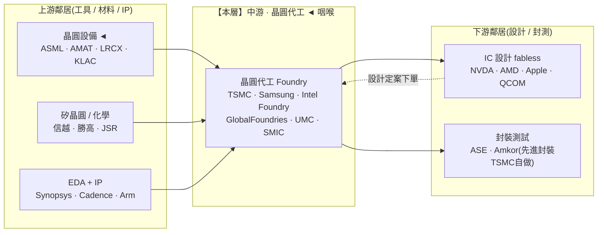

> 大部分人看晶圓代工,只記得一句「台積電很強」。
> 稍微進階的人會說:因為它良率高、製程領先。
> 但真正看懂這一層的人會問:**為什麼一個「重資產、要不斷燒錢擴產」的製造業,能有 ~57% 的毛利率、還讓所有客戶排隊求它接單?**
> 答案不在機台裡,而在一個 1987 年的商業模式選擇,和一條「只要下游誰想做 AI 晶片就一定得經過」的咽喉。這篇拆的就是這條咽喉。

---

> ⚠️ **免責聲明與資料說明**:本文是一份**結構性產業鏈地圖(value-chain map)**的分層深拆,重點在「晶圓代工這一層的角色、集中度與定價權」,不是個股估值報告。文中的市佔率、毛利率、資本支出為**公開產業常識的概估值**(截至 2026 年初),用於說明相對地位,**非即時報價**;任何投資決策前請自行查證最新數據。本文為教育用途,**不構成投資建議**。

---

## 一、這一層在產業鏈的位置

晶圓代工(Foundry)坐在整條鏈的**正中央咽喉**:上游把「工具、材料、IP」交到它手上,它把這些變成實體晶圓,再往下游交給設計公司與封測。它是「設計」與「製造」分家後,承接**所有 fabless 製造需求**的那一端。



**一句話定位**:晶圓代工在**先進製程**是「近獨占」的收費站——上游被 ASML 掐著(它得付 EUV 的天價),下游卻對它幾乎沒有替代選項。**定價權在先進製程強烈往代工端傾斜,在成熟製程則往客戶端鬆動。** 這是本層最重要的一句話:同一個「晶圓代工」,先進與成熟是兩種完全不同的生意。

---

## 二、這一層到底在做什麼

晶圓代工做的事只有一句:**「幫別人把設計圖變成矽晶圓上的實體電晶體,但自己不做品牌、不跟客戶搶生意。」**

這句話的後半段——「不跟客戶搶生意」——才是整個模式的靈魂。

```
IDM(整合元件)模式              純代工(pure-play foundry)模式
─────────────────────────      ─────────────────────────────────
自己設計 + 自己製造 + 自己賣品牌   只接單製造,不設計、不賣品牌
例:Intel(傳統)、三星、德儀     例:台積電(1987 首創)
▸ 產能優先給自家產品             ▸ 產能對所有客戶「中立」
▸ 客戶怕把設計交給競爭對手       ▸ 客戶敢把最機密的設計交出來
▸ 規模受限於自家產品線           ▸ 規模 = 全世界所有 fabless 的總和
```

1987 年台積電創立時,把「製造」從「設計」切開來,做了一件反直覺的事:**它承諾永遠不做自己的晶片品牌,所以永遠不會和客戶競爭。** 這一刀劈出了整個 fabless 生態——NVIDIA、AMD、Apple、高通這些「只設計、不蓋廠」的公司,全都是這個模式的產物。它們敢把最值錢的設計交給台積電,正因為台積電不會拿去做自己的產品。

技術上,代工廠做的是把設計公司交來的**光罩(mask)與版圖(layout)**,透過微影、蝕刻、沉積、離子植入等數百道製程,一層一層堆疊在 12 吋矽晶圓上,做出幾百億顆電晶體。核心競爭力是三件事:**製程節點的領先(能做多小)、良率(能量產多少能用的晶片)、以及產能(能供多少貨)。**

---

## 三、玩家與競爭格局

晶圓代工是一個「一超、兩追、多守成熟製程」的格局。關鍵是要把**先進製程**和**成熟製程**分開看——這是同一層裡兩個截然不同的戰場。

| 公司(代碼) | 定位 | 市佔(概估,總營收) | 先進製程地位 | 毛利率(概估) | 特徵 |
|---|---|---|---|---|---|
| **台積電 TSMC** (TSM) | 純代工龍頭 | ~60–65% | N3/N2 **近獨占(~90%+)** | ~55–59% | 良率+信任+生態,飛輪效應 |
| 三星 Samsung Foundry | 純代工 + 自有產品 | ~10–13% | 有 GAA 但良率落後 | 較低(不單獨揭露) | 有自家需求撐,但與客戶競爭 |
| Intel Foundry (IFS) | 從 IDM 轉型代工 | 個位數(外部客戶少) | 押注 18A 翻身 | **虧損** | IDM 2.0,燒錢搶回領先 |
| GlobalFoundries (GFS) | 成熟/特殊製程 | ~5–6% | **2018 已放棄先進製程** | ~25%+ | 車用/RF/特殊,穩定獲利利基 |
| 聯電 UMC | 成熟/特殊製程 | ~5% | 成熟節點為主 | ~30%+ | 特殊製程、車用,穩健 |
| 中芯 SMIC | 中國最大代工 | ~5–6% | DUV 多重曝光做到 7nm | 週期性 | 受管制拿不到 EUV,國產替代旗艦 |

**先進製程 vs 成熟製程的市佔對比(概估):**

```
先進製程(≤7nm,尤其 N3/N2)—— 誰能做?
─────────────────────────────────────────────
台積電 TSMC   ██████████████████░  ~90%+  ◄ 近獨占
三星 Samsung  ██░░░░░░░░░░░░░░░░░░  少數,良率是硬傷
Intel 18A     █░░░░░░░░░░░░░░░░░░░  尚在證明量產能力
其他          ─  拿不到 EUV,做不了

成熟製程(≥28nm)—— 誰在做?(競爭激烈得多)
─────────────────────────────────────────────
台積電 / 三星 / GF / 聯電 / SMIC / 力積電…
█████ █████ ████ ████ ████ ───  分散,價格戰風險升溫
```

**誰領先、為什麼?** 台積電的領先不是單一技術,而是一個**自我強化的飛輪**:

```
更多客戶下單  →  更大的量產規模  →  更多 R&D 與資本支出可攤提
     ▲                                          │
     │                                          ▼
最好的良率與信任  ◄─────  最快的製程學習曲線與最成熟的 PDK/IP 生態
```

客戶越多 → 量越大 → 越能砸錢做 R&D 與蓋新廠 → 良率爬得越快、製程越領先 → 又吸引更多客戶。這個飛輪一旦轉起來,後進者要追,得同時追上「技術、良率、產能、客戶信任、IP 生態」五件事——而且是在領先者持續往前跑的情況下追。

**為什麼三星和 Intel 追不上?** 兩家追法不同,但卡在同一個結構問題上:

```
三星 Samsung Foundry            Intel Foundry (IFS)
──────────────────────────      ────────────────────────────
① 良率是硬傷:先進 GAA 節點      ① 起步太晚:長年 IDM 文化,
  量產良率落後,大客戶不敢押寶      「先服務自家產品」慣性難改
② 利益衝突:自己做記憶體、        ② 外部客戶信任不足:客戶擔心
  手機晶片,與客戶正面競爭         把設計交給曾經的競爭對手
  → 客戶不敢把機密設計交出去     ③ 財務吃緊:代工部門連年虧損,
③ 生態較薄:IP/PDK 選擇少         擴產與追良率同時燒錢
                                ④ 18A 是背水一戰:量產良率與
                                  拿到大型外部客戶,缺一不可
```

共同的死結是「**信任 × 良率 × 生態**」三者互為因果:良率不穩 → 大客戶不敢下單 → 沒有量 → R&D 攤提不划算、學習曲線爬不動 → 良率更難追上。台積電的飛輪往前轉,追趕者的飛輪卻常常轉不起來。這也是為什麼「先進製程近獨占」不是一時的技術差距,而是一個**結構性、自我強化的護城河**。

---

## 四、瓶頸分數與定價權

對這一層打「瓶頸分數」(0–10):供應商稀缺度、不可替代性、切換成本/驗證時間、需求剛性——四項平均。**先進製程與成熟製程要分開評分**,因為它們是兩種生意。

```
先進製程代工(N3/N2)              分數   說明
──────────────────────────────────────────────────────────────
供應商稀缺度       █████████░  9   全球實質只有台積電能穩定量產
不可替代性         █████████░  9   fabless 做 AI/旗艦晶片別無選擇
切換成本/驗證      █████████░  9   換代工要重做 PDK 適配、12–18 個月
需求剛性           █████████░  9   AI/HPC 缺了先進製程整條鏈停擺
──────────────────────────────────────────────────────────────
先進製程瓶頸分數   = 9.0 / 10   ◄ 全鏈第二硬的咽喉(僅次於 ASML EUV)

成熟製程代工(≥28nm)             分數   說明
──────────────────────────────────────────────────────────────
供應商稀缺度       ████░░░░░░  4   多家可做,中國持續擴產
不可替代性         █████░░░░░  5   特殊製程有黏性,一般邏輯可換
切換成本/驗證      ██████░░░░  6   車用/工業驗證嚴、黏性較高
需求剛性           █████░░░░░  5   可用庫存與其他廠緩衝
──────────────────────────────────────────────────────────────
成熟製程瓶頸分數   = 5.0 / 10   中性,價格戰風險上升
```

**定價權方向**:

```
上游 ASML ──(EUV 天價,台積電只能付)──▶ 【台積電】 ──(先進製程漲價,客戶只能接受)──▶ 下游 NVDA/AMD/Apple
      定價權在 ASML 端                          先進:定價權在代工端 ◄
                                               成熟:定價權往客戶端鬆動
```

有意思的地方在這裡:**晶圓代工自己是咽喉,卻同時是另一個更硬咽喉(ASML EUV)的客戶。** 它對下游有強大定價權(先進製程近年連年調漲、客戶照單全收),但對上游 ASML 卻沒有——EUV 要多少錢、能排到幾台,台積電得排隊。這是「夾在兩個咽喉之間、但自己也是咽喉」的特殊位置。

---

## 五、利潤池與價值捕獲

晶圓代工的毛利率 ~55–59%,對一個**重資產製造業**來說高得驚人(一般製造業毛利常在 20–30%)。但要放在整條鏈裡看它的「相對」位置。

```
同一顆 AI 加速器,毛利怎麼分?(概估示意)
────────────────────────────────────────────────
Fabless 設計(NVDA)   ██████████████  ~70–75%   ◄ 最肥
先進製程代工(TSMC)   ███████████░░░  ~55–59%   ◄ 高,但要燒巨額 capex
封測 OSAT(一般)      ████░░░░░░░░░░  ~15–25%   薄利
────────────────────────────────────────────────
```

**為什麼代工毛利高、卻不是最肥的一層?**

1. **高毛利來自咽喉地位**:先進製程近獨占,客戶沒有議價籌碼,台積電能把 EUV 成本與良率溢價轉嫁下去。這是「賣鏟子」的定價權。
2. **但資本支出是無底洞**:一座先進製程晶圓廠要花 200 億美元以上,台積電一年資本支出高達 400 億美元級別。這些錢要靠未來的晶圓收入慢慢攤提。**所以要看的不只是毛利率,而是投入資本回報率(ROIC)——重資產模式下,毛利要先扣掉巨額折舊才是真獲利。**
3. **相對 fabless 仍矮一截**:NVIDIA 把製造外包出去、自己只留設計與 CUDA 軟體,毛利 70%+ 且幾乎不用蓋廠。**同一顆晶片,設計端捕獲的毛利厚度高於製造端**——這是「輕資產贏、重資產累」的教科書案例。

**價值捕獲評分:高(概估 8/10)**。它是全鏈少數幾個「無論下游誰做出爆款晶片都收得到過路費」的收費站,只是這個收費站的維護成本(capex)極其昂貴。

---

## 六、上游依賴與下游客戶

**上游依賴(它必須買什麼):**

| 買什麼 | 向誰買 | 單一來源風險 | 能否往上游整合 |
|---|---|---|---|
| EUV 微影機 | ASML(**全球唯一**) | 🔴 極高,無第二供應商 | 幾乎不可能,物理+光學+供應鏈壁壘 |
| 其他設備(蝕刻/沉積/檢測) | AMAT、Lam、KLA、東京威力 | 🟠 寡占,多為關鍵少數 | 難,設備研發門檻極高 |
| 矽晶圓 | 信越、勝高、環球晶 | 🟡 寡占但多源 | 部分可,但非核心 |
| 光阻/特殊氣體 | 日本高度集中 | 🟠 地緣事件時放大 | 難 |

代工往上游整合(自己做設備/EUV)幾乎不可能——ASML 的護城河比台積電自己還硬。所以代工只能「當 ASML 最大的客戶」,用訂單綁住優先供貨。

**下游客戶(誰向它買):**

```
客戶集中度(TSMC 概估)
────────────────────────────────────────────
Apple(A/M 系列)      ████████░  ~最大單一客戶(約1/4營收)
AI/HPC(NVDA/AMD 等)  ███████░░  快速攀升,HPC 已成最大平台營收
其餘(高通/聯發科/    ██████░░░  博通/甚至 Intel 外包部分先進製程
      Broadcom/Intel)
────────────────────────────────────────────
```

- **客戶能否往回整合(自己蓋廠)?** 幾乎不會。fabless 的整個價值就在「不蓋廠」,自己蓋一座先進廠要 200 億美元+且良率追不上,經濟上不划算。連 Intel 這個老牌 IDM,近年都把部分先進製程外包給台積電——這是本層護城河最強的旁證:**連競爭對手都得當它的客戶。**
- **客戶集中的風險**:AI 需求高度綁在少數幾家超大平台上。若 CSP 大砍 AI 資本支出、或某大客戶轉單,衝擊會直接傳導。但短期內下游無處可轉,這個風險被「無替代選項」大幅抵銷。

**CoWoS 先進封裝——代工把手伸進封測層**:台積電不只做前段晶圓,還把 **CoWoS(先進封裝)**做成另一個瓶頸。AI GPU 需要把 GPU 晶片與 HBM 記憶體用 CoWoS 封在一起,而 CoWoS 產能不足,直接卡住 NVIDIA 的 GPU 出貨。這讓台積電從「前段代工」延伸到「後段先進封裝」,護城河往下游又擴了一段(詳見 Part 10 封測)。

---

## 七、風險

- 🔴 **台灣單點集中(全鏈最大系統性風險)**:全球先進製程晶圓極高比例產自台灣、且集中在台積電。地緣衝突、地震或斷電一旦切斷這個節點,衝擊會沿鏈**級聯放大**到全世界所有電子產品——從 iPhone 到 AI 資料中心到汽車全部停擺。這是「矽盾(silicon shield)」論述的來源,也是全球最緊張的單點。台積電在美國亞利桑那、日本熊本、德國德勒斯登設廠分散風險,但**最先進的節點與研發仍留在台灣**,且海外廠成本更高。
- 🔴 **EUV 上游卡脖子**:整層的先進製程命脈綁在 ASML 一家荷蘭公司;EUV 出口又受地緣管制左右。這是代工自己無法解決的上游依賴。
- 🟠 **資本支出與週期錯配**:先進廠投資動輒 200 億美元、回收期長。若在高點擴產、需求卻反轉,巨額折舊會侵蝕獲利。半導體的週期性讓「何時擴產」成為高風險決策。
- 🟠 **成熟製程價格戰**:中國(SMIC 等)在成熟節點大舉擴產,可能造成 28nm 以上的全球產能過剩與殺價——這一塊的定價權正往客戶端流失。
- 🟠 **客戶自研與轉單**:大客戶(CSP 自研 ASIC、Apple)雖離不開代工,但會用「多節點/多廠」策略分散議價,壓縮溢價空間。
- 🟡 **地緣出口管制**:先進製程設備、對特定地區的代工服務受管制,可能瞬間切斷某條供應邊,並催生「去美化/在地化」的平行供應鏈(如中國扶植 SMIC)。

---

## 八、價值遷移

**這一層的價值,未來 1–3 年是流入還是流出?**

```
先進製程代工                成熟製程代工
────────────────────       ─────────────────────
價值:穩定 / 微升 ▲          價值:承壓 / 流出 ▼
觸發:AI 需求持續、          觸發:中國成熟產能開出、
      N2/A16 良率爬升、            全球 28nm+ 供過於求、
      CoWoS 產能吃緊              價格戰
```

- **先進製程:價值留住、甚至往內聚**。AI 對算力的胃口讓 N3/N2 供不應求,台積電的定價權穩固;更關鍵的是它把 **CoWoS 先進封裝**變成新的稀缺點——當市場以為「GPU 缺貨」時,真正卡住的其實是台積電的封裝產能。**代工正把護城河從「前段製程」延伸到「後段封裝」,價值不但沒外流,還往這一層再聚集了一段。**
- **成熟製程:價值往外流**。中國基於國產替代的策略性擴產,會讓成熟節點逐漸商品化、殺價。這一塊會從「穩健利基」慢慢變成「紅海」。

**一句話**:先進製程代工是**價值的定錨點**——它太難被繞過,錢會繼續卡在這裡,並往它掌控的先進封裝再延伸;而成熟製程則是價值正在慢慢滲漏的一端。看這一層,一定要分兩半看。

---

## 九、分層投資點子(教育性質、非投資建議)

| 分層角色 | 較佳定位的名字 | 邏輯 | 點子類型 |
|---|---|---|---|
| **咽喉/軍火商** | 台積電 TSMC | 先進製程近獨占,下游誰做出爆款都收過路費 | 核心持有 |
| **二階(picks-and-shovels)** | CoWoS 先進封裝供應鏈、代工用的關鍵設備/材料 | 代工擴產必買的鏟子,常被市場低估 | 低調、易被低估 ◄ |
| **利基穩健** | GlobalFoundries、聯電(成熟/特殊製程) | 不追先進,守車用/RF 利基,現金流穩 | 防禦性 / 反景氣 |
| **轉機/選擇權** | Intel Foundry(18A 能否量產+拿到外部客戶) | 若翻身成功是便宜曝險,失敗則燒錢無底 | 投機性 |
| **結構承壓** | 純成熟製程、面對中國殺價的產能 | 供過於求 + 價格戰,定價權流失 | 謹慎 / 迴避 |

**最該注意的「非顯性節點」**:市場盯著台積電的先進製程,但**CoWoS 先進封裝**才是本輪 AI 最被低估的真瓶頸——它不是純製程題材,卻實實在在卡住了 GPU 出貨。想更進一步,可用 `competitor-analysis` 比較「台積電 vs 三星 vs Intel Foundry」的護城河,或用 `bear-case` 壓測「台灣集中風險一旦引爆」的情境。

---

## 論點反轉條件(Thesis Invalidation)

**本層訊號為 BULLISH(對先進製程代工樂觀),下列情況會打破論點:**
- 三星或 Intel(18A)在**先進製程良率上追平**台積電,並拿到大量外部客戶——近獨占被打破,定價權鬆動。
- 台灣集中風險**實質引爆**(地緣/天災),或先進製程需求結構性萎縮(AI 資本支出循環反轉)。
- 上游 ASML EUV 供給或出口管制出現重大變化,直接卡住台積電擴產。
- 先進封裝(CoWoS)瓶頸快速緩解,代工延伸到封裝的護城河紅利消退。

**重新檢視這一層的時機:**
- [ ] 台積電、三星、Intel 財報與資本支出指引公布時
- [ ] N2 / A16 量產良率、CoWoS 產能出現明顯變化
- [ ] 重大地緣/出口管制事件
- [ ] 距今超過 60–90 天

```
╔══════════════════════════════════════════════╗
║              INDUSTRY-MAP SIGNAL             ║
╠══════════════════════════════════════════════╣
║ 結構訊號:    先進製程 BULLISH / 成熟製程 中性 ║
║ Confidence:  HIGH(結構清晰,近獨占明確)      ║
║ Horizon:     LONG-TERM(1 年以上)            ║
║ Score:       8.5 / 10(對先進製程代工)       ║
╠══════════════════════════════════════════════╣
║ 瓶頸分數:    先進 9.0 / 成熟 5.0(分兩半看)  ║
║ 偏好層級:    軍火商 TSMC + CoWoS 二階picks    ║
║ 迴避層級:    面對中國殺價的純成熟產能         ║
╚══════════════════════════════════════════════╝
```

評分指引:8.0–10.0 強烈偏多 | 6.0–7.9 中度偏多 | 4.0–5.9 中性 | 2.0–3.9 中度偏空 | 0.0–1.9 強烈偏空

---

### 📚 系列導覽:半導體產業鏈全景(上游 → 下游)

> 總覽地圖:[industry-map - 半導體晶片產業鏈全景](/yennj12_blog_V4/posts/industry-map-semiconductor-value-chain-zh/)

**上游 Upstream**
- Part 1:[矽晶圓 / 基板](/yennj12_blog_V4/posts/industry-map-semiconductor-part1-silicon-wafer-zh/)
- Part 2:[特用化學 / 光阻](/yennj12_blog_V4/posts/industry-map-semiconductor-part2-chemicals-photoresist-zh/)
- Part 3:[EDA + IP](/yennj12_blog_V4/posts/industry-map-semiconductor-part3-eda-ip-zh/)
- Part 4:[晶圓設備](/yennj12_blog_V4/posts/industry-map-semiconductor-part4-fab-equipment-zh/)

**中游 Midstream**
- **Part 5:[晶圓代工](/yennj12_blog_V4/posts/industry-map-semiconductor-part5-foundry-zh/)** ◄ 本篇
- Part 6:[IC 設計 — GPU/加速器](/yennj12_blog_V4/posts/industry-map-semiconductor-part6-gpu-design-zh/)
- Part 7:[IC 設計 — 其他](/yennj12_blog_V4/posts/industry-map-semiconductor-part7-ic-design-zh/)
- Part 8:[記憶體](/yennj12_blog_V4/posts/industry-map-semiconductor-part8-memory-zh/)
- Part 9:[IDM / 類比](/yennj12_blog_V4/posts/industry-map-semiconductor-part9-idm-analog-zh/)
- Part 10:[封裝測試 OSAT](/yennj12_blog_V4/posts/industry-map-semiconductor-part10-osat-zh/)

**下游 Downstream**
- Part 11:[網通 / 互連](/yennj12_blog_V4/posts/industry-map-semiconductor-part11-networking-zh/)
- Part 12:[系統 / 伺服器 OEM](/yennj12_blog_V4/posts/industry-map-semiconductor-part12-system-oem-zh/)
- Part 13:[雲端 CSP](/yennj12_blog_V4/posts/industry-map-semiconductor-part13-cloud-csp-zh/)
- Part 14:[終端需求](/yennj12_blog_V4/posts/industry-map-semiconductor-part14-end-demand-zh/)

---

## 參考來源與方法(References)

- 分析方法:InvestSkill `industry-map` skill(<https://github.com/yennanliu/InvestSkill>)——把產業畫成上游到下游的有向圖,定位咽喉點、利潤池與價值遷移。
- 本篇的市佔率、毛利率、資本支出為公開產業常識的**概估值**(截至 2026 年初),用於說明各層相對地位,非即時報價。
- 總覽地圖:<https://yennj12.js.org/yennj12_blog_V4/posts/industry-map-semiconductor-value-chain-zh/>

> 再次提醒:本文為產業結構教學與地圖,市佔/毛利為概估值,**不構成投資建議**。
