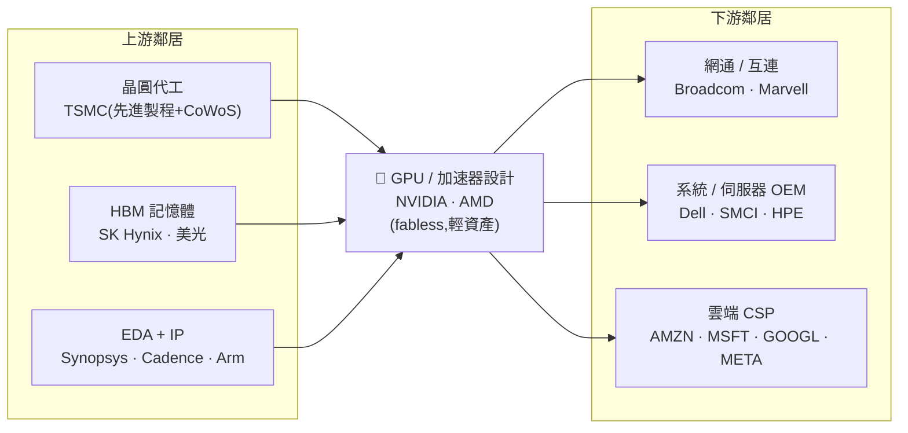

> 大部分人看 AI 晶片,只會問一句:「NVIDIA 的 GPU 效能是不是最強?」
> 稍微進階的人會補一句:「AMD 追上來了嗎?CSP 自研晶片能不能取代它?」
> 但真正看懂這層的人知道:NVIDIA 賣的從來不只是矽晶片,而是一整套讓工程師「離不開」的軟體生態(CUDA)。
> 這一層是全鏈**價值捕獲最高**的咽喉——也是三大咽喉裡,**最可能被工程繞過**的一個。

---

> ⚠️ **免責聲明與資料說明**:本文是半導體產業鏈系列的 Part 6,聚焦「GPU / 加速器 IC 設計」這一層的**結構性分析**,不是個股估值報告。文中市佔率、毛利率為**公開產業常識的概估值**(截至 2026 年初),用於說明相對地位,**非即時報價**;數字皆標示為「概估」。任何投資決策前請自行查證最新數據。本文為教育用途,**不構成投資建議**。

---

## 一、這一層在產業鏈的位置

GPU / 加速器設計坐落在**中游**:它向上游買「製造能力」與「關鍵零件」,向下游賣「AI 算力的核心引擎」。它是 fabless(無晶圓廠)設計公司——**只畫設計圖、寫軟體,把製造整包外包給台積電**。



**一句話定位**:GPU 設計層向上游買「製程與 HBM」、向下游賣給「CSP 與伺服器 OEM」;它被夾在強供應商(台積電)與強買方(四大 CSP)之間,**卻仍握有整條鏈最強的定價權**——因為它的產品(NVIDIA GPU + CUDA)在 AI 訓練上近乎無可替代。定價權**強烈傾向本層**。

---

## 二、這一層到底在做什麼

「加速器(accelerator)」指的是專門為並行運算設計的晶片,用來加速深度學習的矩陣乘法。它取代 CPU 成為 AI 時代的運算核心,因為神經網路訓練本質上就是「幾千個小運算同時做」,而 GPU 天生擅長這件事。

這一層的商業模式是**「設計與製造分家」的極致**:

```
fabless GPU 設計公司做什麼、不做什麼
─────────────────────────────────────────────────────────
做:  ‣ 晶片架構設計(SM 單元、張量核心、記憶體階層)
     ‣ 軟體生態(CUDA / ROCm、編譯器、函式庫、驅動)
     ‣ 系統整合(把 GPU + CPU + NVLink + HBM 組成一個機櫃)
     ‣ 生態綁定(讓全世界的 AI 框架都預設跑在自家晶片上)
不做:‣ 蓋晶圓廠(交給台積電)
     ‣ 自製記憶體(向 SK 海力士 / 美光買 HBM)
     ‣ 自製封裝(用台積電的 CoWoS 先進封裝)
─────────────────────────────────────────────────────────
結果:資本支出極輕、毛利極高(~70%+),但把製造瓶頸的風險
      外包給了台積電與 HBM 供應商(見第六節)
```

**為什麼這一層存在、而且賺最多?** 因為設計一顆頂尖 AI 晶片的難度,已經高到只有極少數團隊做得到:一顆 Blackwell 等級的晶片有上千億顆電晶體、要協調 HBM 頻寬、要搭配數萬顆互連,還要有一整套成熟軟體讓開發者「一裝就能用」。**這道門檻不在製造(台積電幫所有人代工),而在「架構 + 軟體生態」——這正是價值捕獲的來源。**

---

## 三、玩家與競爭格局

這一層表面上是「NVIDIA vs AMD」的硬體之爭,實際上是「**一個成熟生態 vs 所有挑戰者**」的格局。第三股力量是下游 CSP 的**自研 ASIC**(後向整合),它們不對外賣、只服務自家工作負載。

| 玩家 | 角色 | AI 加速器地位(概估) | 軟體堆疊 | 毛利率(概估) |
|---|---|---|---|---|
| **NVIDIA(NVDA)** | 近獨占領導者 | AI 訓練市場 **~90%** | **CUDA**(15+ 年生態、數百萬開發者) | **~73–75%** |
| **AMD** | 可信的第二供應商 | 資料中心 GPU 個位數 → 追趕中 | ROCm(開放、追趕中) | GAAP ~50% |
| **CSP 自研 ASIC** | 買方後向整合 | 內部工作負載(推論為主) | 自家框架 / 編譯器 | 成本中心(不對外賣) |

```
AI 訓練加速器市佔(概估,2026 初)
────────────────────────────────────────────
NVIDIA         ██████████████████░  ~90%
AMD            █░░░░░░░░░░░░░░░░░░░  ~個位數
CSP 自研 + 其他 █░░░░░░░░░░░░░░░░░░░  其餘
────────────────────────────────────────────
註:「推論(inference)」市場遠比「訓練」分散——CSP 自研 ASIC
    在推論的佔比明顯較高,這是 NVIDIA 護城河最先鬆動的地方。
```

**誰領先、為什麼?** NVIDIA 領先的關鍵**不是單顆晶片效能領先幾成**(AMD 的 MI 系列在紙面規格上多次逼近甚至超越),而是三件事疊起來:

1. **CUDA 生態鎖定**:過去 15 年,全世界的 AI 框架(PyTorch、TensorFlow)、函式庫(cuDNN、NCCL)、開發者習慣都建在 CUDA 上。換到 AMD 要重寫、重測、重訓工程師——**這是軟體護城河,不是矽護城河**。
2. **系統級整合**:NVIDIA 不只賣晶片,還賣 NVLink 互連、整櫃 GB200 系統。AI 訓練需要「數萬顆 GPU 像一台超級電腦協同」,NVIDIA 把整套包好。
3. **節奏**:一年一代的產品節奏(Hopper → Blackwell → Rubin),讓對手永遠在追上一代。

**AMD 的角色**是「可信的第二供應商」:它的存在讓 CSP 有議價籌碼、有備援,ROCm 的開放路線也吸引想擺脫 CUDA 稅的客戶。**CSP 自研 ASIC**(Amazon Trainium、Alphabet TPU、Meta MTIA、Microsoft Maia)則多半委由 Broadcom / Marvell 協同設計、台積電代工,專為自家模型優化,在**推論**場景已具成本優勢(詳見 Part 13)。

> 延伸:本站有 [NVIDIA (NVDA) 2026 10-K 深度解析](/yennj12_blog_V4/posts/nvda-2026-10k-deep-dive-zh/) 與 [AMD 2025 10-K 深度解析](/yennj12_blog_V4/posts/amd-2025-10k-deep-dive-zh/),可搭配本層結構圖,先看格局、再拆個股。

---

## 四、瓶頸分數與定價權

對這一層打「瓶頸分數」(0–10):供應商稀缺度、不可替代性、切換成本、需求剛性——四項平均。

```
四項評分(0–10)                        分數
──────────────────────────────────────────────
供應商稀缺度  Supplier scarcity          9  █████████░
不可替代性    Substitutability           8  ████████░░  ← CUDA 讓硬體難換
切換成本/驗證 Switching cost / lead      9  █████████░  ← 重寫程式碼 + 重訓工程師
需求剛性      Demand inelasticity       10  ██████████  ← AI 建設剛需,沒它跑不動
──────────────────────────────────────────────
瓶頸分數(平均)                          9.0  ◄ 咽喉
──────────────────────────────────────────────
```

**定價權方向:強烈傾向本層。** 證據就是 70%+ 的毛利率——在一個買方是「全球最有錢的四家公司」的市場裡,還能收這麼高的毛利,只有「你非買我不可」才做得到。NVIDIA 的頂規 GPU 長期供不應求、要排隊,定價權清楚寫在財報上。

**但這是三大咽喉裡最脆弱的一個。** 對照另外兩個咽喉:

```
三大咽喉的護城河「材質」比較
──────────────────────────────────────────────────────────
ASML EUV        物理 + 光學 + 供應鏈  →  工程「繞不過去」(物理定律)
台積電先進製程   良率 + 產能 + 信任    →  工程「追得很慢」(需數年+千億資本)
NVIDIA GPU+CUDA  硬體 + 軟體生態鎖定   →  軟體「可以被繞過」(只是很貴很慢)
──────────────────────────────────────────────────────────
```

關鍵差異:**ASML 的護城河是物理,台積電的是資本與良率,而 NVIDIA 的核心是軟體生態**。軟體鎖定雖強,卻是三者中唯一「有錢有時間的大買方,可以自己動手拆掉」的那種——這正是 CSP 自研 ASIC 與 AMD ROCm 在做的事。所以瓶頸分數 9.0 很高,但**它的「持久性」在三大咽喉中排最後**。

---

## 五、利潤池與價值捕獲

在整條半導體鏈中,這一層目前**吃到最厚的毛利**。

```
價值捕獲分數(0–10,概估各層目前毛利厚度)
─────────────────────────────────────────
GPU / 加速器           ██████████ 10  ◄ 全鏈最高
EUV 設備               █████████░  9
EDA / IP               ████████░░  8
先進製程代工           ████████░░  8
記憶體(HBM 拉高)      ██████░░░░  6(週期)
雲端 CSP               ██████░░░░  6(資本密集)
封測 OSAT              ███░░░░░░░  3
系統 OEM               ██░░░░░░░░  2
─────────────────────────────────────────
```

**為什麼利潤集中在這裡?** 同一顆 AI 晶片,拆開看利潤分配:

```
一顆 AI GPU 的價值分配(概念示意,非精確拆帳)
────────────────────────────────────────────────────
設計 + 軟體生態(NVIDIA)   ████████████████  最厚 ← 賺架構與 CUDA 的錢
先進製程代工(台積電)      ██████            扎實 ← 賺製造的錢
HBM 記憶體(SK 海力士)     ████              週期 ← 賺稀缺零件的錢
CoWoS 先進封裝(台積電)    ███               瓶頸 ← 賺卡脖子的錢
────────────────────────────────────────────────────
洞察:輕資產的設計端(不蓋廠),毛利遠高於扛千億資本支出的製造端。
```

這就是 fabless 模式的威力:**NVIDIA 把最重、最燒錢的製造外包出去,自己只留下最值錢的「架構設計 + 軟體生態」**。它不需要為每一代先進製程投入千億資本(那是台積電的負擔),卻能捕獲一顆晶片裡最厚的那層毛利。這是全鏈「輕資產贏、重資產累」的最極端案例。

---

## 六、上游依賴與下游客戶

**這一層的結構性脆弱點,全都藏在它的上下游關係裡。**

**上游依賴(它必須買什麼):**

| 買什麼 | 向誰買 | 單一來源風險? |
|---|---|---|
| 先進製程晶圓 | 台積電(近獨占) | 🔴 高——先進製程幾乎只有台積電能量產 |
| CoWoS 先進封裝 | 台積電 | 🔴 高——CoWoS 產能是 GPU 出貨的實體瓶頸 |
| HBM 高頻寬記憶體 | SK 海力士、美光、三星 | 🟠 中——寡占、與 GPU 綁定、報價強勢 |
| EDA 工具 + IP | Synopsys、Cadence、Arm | 🟠 中——設計工具雙寡占 |

**洞察**:GPU 設計公司「設計得再好」,能出多少貨,實際上是被**台積電的 CoWoS 產能與 HBM 供給**卡住的。這是為什麼「先進封裝與 HBM」是本輪 AI 最被低估的二階瓶頸(見 Part 5、Part 8)。

**下游客戶(誰向它買):**

```
客戶集中度:高度集中在少數超大規模業者
────────────────────────────────────────────
四大 CSP(AMZN/MSFT/GOOGL/META)合計佔營收極高比例
   → 前幾大客戶合計可佔 NVIDIA 資料中心營收的「一大塊」(概估)
────────────────────────────────────────────
風險:買方又大又集中,任何一家砍資本支出,衝擊直接傳導;
      而且——這些大客戶「同時就是自研 ASIC 的競爭者」。
```

**能不能後向 / 前向整合?**
- **買方後向整合(最大威脅)**:四大 CSP 財力雄厚、工作負載自己最懂,正大力自研 ASIC 往上游反打。它們既是**最大客戶**、又是**最危險的潛在對手**——這是本層獨有的結構張力。
- **供應商前向整合**:台積電理論上握有製造能力,但它嚴守「不與客戶競爭」的中立代工定位,不太可能跳下來做品牌 GPU。

---

## 七、風險

- 🔴 **買方自研 ASIC 侵蝕(結構性最大風險)**:四大 CSP 是最大客戶也是最強對手。它們自研晶片若在**推論**大規模成功,會直接吃掉本層的成長性與定價權。這是全鏈價值遷移的最大單一變數(見 Part 13)。
- 🔴 **CUDA 軟體護城河被繞過**:AMD ROCm 逐步成熟、開放編譯器(如 Triton)與 PyTorch 原生編譯降低對 CUDA 的依賴。軟體鎖定一旦鬆動,硬體就會變回「比規格、比價格」的紅海。
- 🟠 **上游瓶頸卡出貨**:CoWoS 封裝與 HBM 供給不足,讓「設計得出、卻出不了貨」。這既是風險,也解釋了為何交期長期緊繃。
- 🟠 **地緣 / 出口管制**:先進 AI 晶片對特定地區出口受限,可能瞬間切掉一塊市場、並催生在地替代方案。
- 🟠 **需求週期反轉**:AI 資本支出若見頂,這一層作為「最直接受益者」也會是「最直接受傷者」——高估值 + 高集中客戶 = 高 beta。
- 🟡 **推論(inference)工作負載分散化**:訓練需要頂規、綁定 CUDA;推論對延遲 / 成本敏感、更容易用便宜的專用晶片,天然對本層不利。

---

## 八、價值遷移

**這一層今天吃到全鏈最厚的毛利,但價值正緩慢地從它「往下游外溢」。** 這是三大咽喉裡唯一「價值在流出」的一層。

```
現在的稀缺           →   下一段的變化              →   確認訊號(trigger)
──────────────────────────────────────────────────────────────────────
NVIDIA GPU + CUDA        推論用 ASIC / AMD 分食       推論佔總 AI 算力 > 訓練;
(訓練近獨占)             (先從推論鬆動)              CSP 多數推論跑在自研晶片上
──────────────────────────────────────────────────────────────────────
CUDA 軟體鎖定        →   開放軟體堆疊追上            ROCm / Triton 在主流模型
                                                     達到「夠用」的效能與易用性
──────────────────────────────────────────────────────────────────────
硬體毛利 70%+        →   毛利率結構性壓縮            NVIDIA 資料中心毛利
                                                     跌破 ~70% 且回不去
──────────────────────────────────────────────────────────────────────
```

**方向判斷**:
- **訓練(training)**:護城河**近期仍極穩**。前沿模型訓練需要最頂規硬體 + 最成熟軟體 + 最高速互連,這一整套目前只有 NVIDIA 湊得齊。1–2 年內難撼動。
- **推論(inference)**:護城河**正在鬆動**。推論對成本 / 延遲敏感、工作負載重複性高,最適合 CSP 用自研 ASIC 或 AMD 取代。**價值的第一道裂縫從這裡開始。**

**一句話**:NVIDIA 的護城河不會一夕崩塌,但會「從邊緣被慢慢啃」——先是推論、再是開放軟體、最後才是訓練。**要看的訊號不是「AMD 出了更快的晶片」,而是「CSP 把多少比例的推論搬到自研晶片上」。**

---

## 九、分層投資點子

把這張圖轉成分層點子清單(教育性質、**非投資建議**):

| 分層角色 | 較佳定位的名字 | 邏輯 | 點子類型 |
|---|---|---|---|
| **咽喉 / 直接贏家** | NVIDIA | AI 算力的核心收費站,訓練近獨占,現金流最強 | 核心持有(共識多方) |
| **可信第二 / 選擇權** | AMD | 「非 NVIDIA」交易的最大受益者;ROCm 成熟即重估 | 投機性、對護城河鬆動的曝險 |
| **二階(繞過交易)** | Broadcom、Marvell | **賣鏟子給「想繞過 NVIDIA」的 CSP**——自研 ASIC 的設計夥伴 | 低調、易被低估 ◄ |
| **上游卡脖子** | CoWoS 封裝、HBM 供應商 | 不管誰的 GPU 勝出,都要用這兩樣 | 二階 picks-and-shovels |
| **迴避** | 純 GPU 轉售 / 薄利整合商 | 沒有設計或軟體差異化,兩頭受氣 | 迴避 |

**最反直覺的點子**:如果你相信「NVIDIA 的護城河會被侵蝕」,**最好的表達方式往往不是放空 NVIDIA(它的訓練護城河仍太硬),而是買 Broadcom / Marvell 這些「幫 CSP 設計自研 ASIC 的軍火商」**——它們在「NVIDIA 贏」與「CSP 繞過 NVIDIA」兩種劇本裡都有生意(詳見 Part 7、Part 11、Part 13)。

---

## 論點反轉條件(Thesis Invalidation)

**本層結構訊號為 BULLISH(對咽喉層樂觀),下列情況會打破論點:**
- CSP 自研 ASIC 在**推論以外(尤其訓練)**大規模取代 NVIDIA,且客戶集中度轉為對本層不利。
- ROCm / 開放軟體堆疊在主流模型達到 CUDA 平價,CUDA 鎖定實質瓦解。
- NVIDIA 資料中心毛利率結構性跌破 ~70% 且無法回升(定價權流失的鐵證)。
- AI 資本支出循環反轉,四大 CSP 同步大砍資料中心投資。

**重新檢視這張地圖的時機:**
- [ ] NVIDIA / AMD 財報,特別看「資料中心毛利率」與「客戶集中度」
- [ ] CSP 自研晶片(TPU / Trainium / MTIA / Maia)出貨與內部滲透率
- [ ] CoWoS / HBM 產能與 GPU 交期變化
- [ ] 重大出口管制事件;或距今超過 60–90 天

```
╔══════════════════════════════════════════════╗
║              INDUSTRY-MAP SIGNAL             ║
╠══════════════════════════════════════════════╣
║ 結構訊號:    咽喉層 BULLISH(訓練)          ║
║             但價值遷移 = 向下游流出(推論)   ║
║ Confidence:  MEDIUM(護城河真實,但軟體可繞) ║
║ Horizon:     MEDIUM-TERM(1 年內訓練穩固)    ║
║ Score:       瓶頸 9.0 / 10;持久性三咽喉最低  ║
╠══════════════════════════════════════════════╣
║ 偏好層級:    NVIDIA(核心)+ ASIC 軍火商二階  ║
║ 迴避層級:    純轉售 / 薄利整合商             ║
╚══════════════════════════════════════════════╝
```

評分指引:8.0–10.0 強烈偏多 | 6.0–7.9 中度偏多 | 4.0–5.9 中性 | 2.0–3.9 中度偏空 | 0.0–1.9 強烈偏空

---

### 📚 系列導覽:半導體產業鏈全景(上游 → 下游)

> 總覽地圖:[industry-map - 半導體晶片產業鏈全景](/yennj12_blog_V4/posts/industry-map-semiconductor-value-chain-zh/)

**上游 Upstream**
- Part 1:[矽晶圓 / 基板](/yennj12_blog_V4/posts/industry-map-semiconductor-part1-silicon-wafer-zh/)
- Part 2:[特用化學 / 光阻](/yennj12_blog_V4/posts/industry-map-semiconductor-part2-chemicals-photoresist-zh/)
- Part 3:[EDA + IP](/yennj12_blog_V4/posts/industry-map-semiconductor-part3-eda-ip-zh/)
- Part 4:[晶圓設備](/yennj12_blog_V4/posts/industry-map-semiconductor-part4-fab-equipment-zh/)

**中游 Midstream**
- Part 5:[晶圓代工](/yennj12_blog_V4/posts/industry-map-semiconductor-part5-foundry-zh/)
- **Part 6:[IC 設計 — GPU/加速器](/yennj12_blog_V4/posts/industry-map-semiconductor-part6-gpu-design-zh/) ← 本篇**
- Part 7:[IC 設計 — 其他](/yennj12_blog_V4/posts/industry-map-semiconductor-part7-ic-design-zh/)
- Part 8:[記憶體](/yennj12_blog_V4/posts/industry-map-semiconductor-part8-memory-zh/)
- Part 9:[IDM / 類比](/yennj12_blog_V4/posts/industry-map-semiconductor-part9-idm-analog-zh/)
- Part 10:[封裝測試 OSAT](/yennj12_blog_V4/posts/industry-map-semiconductor-part10-osat-zh/)

**下游 Downstream**
- Part 11:[網通 / 互連](/yennj12_blog_V4/posts/industry-map-semiconductor-part11-networking-zh/)
- Part 12:[系統 / 伺服器 OEM](/yennj12_blog_V4/posts/industry-map-semiconductor-part12-system-oem-zh/)
- Part 13:[雲端 CSP](/yennj12_blog_V4/posts/industry-map-semiconductor-part13-cloud-csp-zh/)
- Part 14:[終端需求](/yennj12_blog_V4/posts/industry-map-semiconductor-part14-end-demand-zh/)

---

## 參考來源與方法(References)

- 分析方法:InvestSkill `industry-map` skill(<https://github.com/yennanliu/InvestSkill>)——把產業畫成上游到下游的有向圖,定位咽喉點、利潤池與價值遷移。
- 總覽地圖:[半導體晶片產業鏈全景](https://yennj12.js.org/yennj12_blog_V4/posts/industry-map-semiconductor-value-chain-zh/)。
- 延伸個股拆解:[NVDA 2026 10-K 深度解析](/yennj12_blog_V4/posts/nvda-2026-10k-deep-dive-zh/)、[AMD 2025 10-K 深度解析](/yennj12_blog_V4/posts/amd-2025-10k-deep-dive-zh/)。
- 本文市佔率 / 毛利率為公開產業常識的**概估值**(截至 2026 年初),用於說明各層相對地位,非即時報價。

---

> 再次提醒:本文為產業結構教學與地圖,市佔 / 毛利為**概估值**,聚焦「這一層賺什麼、錢往哪流」,**不構成投資建議**。
