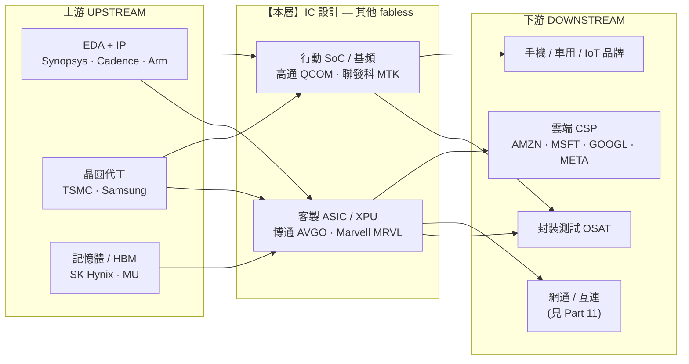

> 大部分人談 fabless,只會想到 NVIDIA 的 GPU。
> 稍微進階的人會補一句「還有高通做手機晶片」。
> 但真正看懂這一層的人會問:當雲端巨頭想擺脫 NVIDIA,他們找誰設計自己的晶片?
> 答案不是某家新創,而是**博通與 Marvell**——這一層才是 AI 時代「反 NVIDIA」路線的真正軍火商。

---

> ⚠️ **免責聲明與資料說明**:本文是半導體產業鏈系列的 Part 7,聚焦「IC 設計 — 其他 fabless」這一層的**結構性分析**,不是個股估值報告。文中市佔率、毛利率、營收占比為**公開產業常識的概估值**(截至 2026 年初),用於說明各層相對地位,**非即時報價**;投資決策前請自行查證最新數據。本文為教育用途,**不構成投資建議**。

---

## 一、這一層在產業鏈的位置

Part 6 講的是「純 AI GPU」(NVIDIA、AMD)——那是 fabless 裡最亮眼、也最擁擠的一格。這一篇(Part 7)講的是 **fabless 的「其他所有東西」**:客製 ASIC、行動 SoC、基頻、連網晶片。它們同樣是「只設計、不蓋廠」的輕資產模式,但打的是完全不同的仗。



**位置 / 定價權一句話**:本層卡在「EDA+代工」與「雲端/手機品牌」之間,**是中游整合者**。客製 ASIC 子層對雲端客戶握有高議價力(深度 IP + 多年綁定);行動 SoC 子層則被少數手機品牌與「客戶自研」兩頭夾,議價力較弱。整體屬**寡占、價值捕獲高**,但層內兩個世界的命運正在分岔。

> 📌 **與鄰篇的分工**:博通與 Marvell 的**交換晶片(Tomahawk/Jericho)與光通訊 DSP** 屬「網通/互連」,在 **Part 11** 深拆;本篇聚焦它們的**客製運算 ASIC(XPU)與整體 fabless 商業模式**。與 **Part 6** 的差異是:Part 6 是「賣給所有人的通用 GPU」,本篇是「為單一客戶量身打造的專用晶片」。

---

## 二、這一層到底在做什麼

同樣是 fabless,這一層其實裝了三種完全不同的生意:

```
本層的三種生意
──────────────────────────────────────────────────────────────
① 客製 ASIC / XPU（博通、Marvell）
   ‣ 雲端巨頭出「規格與演算法」，設計商出「SerDes、封裝、IP 與流片能力」
   ‣ 產物：Google TPU、Meta MTIA、Amazon 部分加速器…的「共同設計夥伴」
   ‣ 本質是「代設計」——不掛自己品牌，卻吃走最難的物理設計環節

② 行動 SoC / 基頻（高通、聯發科）
   ‣ 把 CPU+GPU+NPU+數據機（modem）整合進一顆手機主晶片
   ‣ 基頻（modem）是高通的獨門護城河——5G/毫米波的類比與協定極難做
   ‣ 產物：Snapdragon（旗艦）、Dimensity（中高階到旗艦）

③ 連網 / 混合訊號 / 客製 IP
   ‣ 高速 SerDes、乙太網 PHY、儲存控制器、光學 DSP
   ‣ 這是博通/Marvell 的「地基技術」，同時餵養 ASIC 與網通兩塊
──────────────────────────────────────────────────────────────
```

**為什麼這一層存在?** 因為「設計一顆先進晶片」本身已經變成一門專業:要用 EDA 工具、要買 Arm/RISC-V IP、要有能跑在台積電 3nm 上的 SerDes 與封裝 know-how。雲端巨頭有演算法、有錢、有量,但沒有「把演算法變成一顆能量產的矽晶片」的物理設計團隊——**這正是博通、Marvell 賣的東西**。手機品牌同理:除了蘋果、三星有能力自研,絕大多數品牌都得向高通、聯發科買整套 SoC。

---

## 三、玩家與競爭格局

四家公司,兩個世界。客製 ASIC 是雙雄(博通遙遙領先、Marvell 第二);行動 SoC 是雙雄(高通旗艦、聯發科走量)。

| 公司 | 主戰場 | 角色 / 領先點 | 毛利率(概估) | 關鍵護城河 |
|---|---|---|---|---|
| **博通 AVGO** | 客製 ASIC + 網通 + 基礎軟體 | 客製 XPU 龍頭(約 7 成份額),半導體+軟體雙引擎 | 混合 ~75%+(軟體拉高) | SerDes/封裝 IP、與 CSP 多年綁定、VMware 現金流 |
| **Marvell MRVL** | 客製 ASIC + 光通訊 + 儲存 | 客製矽第二強,資料中心已成營收主體 | ~60–64% | 光學 DSP、DCI、客製運算設計能力 |
| **高通 QCOM** | 行動 SoC + 基頻 + 車用/IoT | 旗艦 Android SoC 與 5G 基頻領導者 | ~55–58% | 數據機 IP、專利授權(QTL)高毛利現金流 |
| **聯發科 2454.TW** | 行動 SoC | 全球出貨量最大手機晶片商(走量+攻旗艦) | ~45–48% | 成本/整合效率、中低階到旗艦全線覆蓋 |

**客製 ASIC 份額示意(概估):**

```
客製運算 ASIC / XPU 設計市場(以設計服務金額計，概估)
──────────────────────────────────────────────
博通 AVGO      ███████████████░░░░░  ~65-70%  ◄ 遙遙領先
Marvell MRVL   ██████░░░░░░░░░░░░░░  ~13-15%
世芯/創意/其他 ████░░░░░░░░░░░░░░░░  合計其餘
──────────────────────────────────────────────
```

**行動 SoC 出貨量份額示意(概估):**

```
智慧型手機應用處理器（出貨「量」，概估）
──────────────────────────────────────────────
聯發科 MTK     ███████████░░░░░░░░░  ~34%  ◄ 出貨量第一（走量）
高通 QCOM      ████████░░░░░░░░░░░░  ~24%  （旗艦「價值」第一）
蘋果（自用）   ██████░░░░░░░░░░░░░░  ~18%
紫光展銳等     ██████░░░░░░░░░░░░░░  其餘
──────────────────────────────────────────────
```

**誰領先、為什麼?**
- **博通**是這一層最強的公司,理由不只 AI:它是「半導體咽喉點 + 高黏著基礎軟體」的組合體。客製 ASIC 讓它綁住雲端巨頭最深的需求;VMware 則提供近 90% 毛利、極穩定的訂閱現金流。**這是四家裡定價權最強、最不像純週期半導體股的一家。**
- **聯發科出貨量最大,但價值不等於量**:它靠中低階與新興市場走量,單價與毛利明顯低於高通旗艦。近年靠 Dimensity 旗艦向上打,是它能否提升價值捕獲的關鍵。

---

## 四、瓶頸分數與定價權

對本層打「瓶頸分數」(0–10):供應商稀缺度、不可替代性、切換成本/驗證時間、需求剛性——四項平均。注意層內兩個子層分數差很大,先分開打再取加權。

```
子層 A：客製 ASIC / XPU（博通、Marvell）
────────────────────────────────────────────
供應商稀缺度   ████████░░  8   能做前沿 SerDes+封裝的只有兩三家
不可替代性     ███████░░░  7   客戶可改用 merchant GPU，但改不了進行中的專案
切換成本/驗證  █████████░  9   多年共同設計，一旦鎖定極難換手
需求剛性       ███████░░░  7   CSP 自研浪潮結構性拉動
                        平均 ≈ 7.75

子層 B：行動 SoC / 基頻（高通、聯發科）
────────────────────────────────────────────
供應商稀缺度   ██████░░░░  6   基頻難、但 SoC 有多家可選
不可替代性     █████░░░░░  5   蘋果已證明「自研可取代」
切換成本/驗證  ██████░░░░  6   換晶片要重做設計，但非不可能
需求剛性       ██████░░░░  6   手機成熟、量穩但不成長
                        平均 ≈ 5.75
────────────────────────────────────────────
本層加權瓶頸分數 ≈ 6.5 / 10（ASIC 拉高、行動拉低）
```

**定價權方向**:
- **客製 ASIC 子層 → 定價權偏向供應端(本層)**。一旦雲端客戶選定博通共同設計某代 XPU,多年內幾乎無法換手,議價力在博通手上。
- **行動 SoC 子層 → 定價權偏向買方(手機品牌 + 自研客戶)**。手機品牌會拿高通、聯發科互相比價;蘋果自研基頻(C1)更是直接把一個大客戶變成零。

**一句話**:本層的定價權**不是均勻的**——同一層裡,博通對雲端客戶是「賣方市場」,高通對蘋果卻是「客戶跑掉」。這就是為什麼不能把 fabless 當成鐵板一塊。

---

## 五、利潤池與價值捕獲

這一層整體毛利高(45–75%),但「高」的來源天差地別:

```
利潤來源拆解
──────────────────────────────────────────────────────────
博通       半導體毛利 ~67-70% ＋ 軟體毛利 ~90% → 混合 75%+
           利潤池「又高又穩」，軟體去除了半導體週期性
Marvell    ~60-64%，資料中心/客製矽拉高，但仍有週期
高通       QCT（晶片）~55-58% ＋ QTL（授權）近乎純利
           授權金是「收專利過路費」的隱形金礦
聯發科     ~45-48%，走量生意，毛利最薄、最吃 ASP 與代工成本
──────────────────────────────────────────────────────────
```

**利潤池 vs 鄰居**:相較於上游台積電(製造,~55% 毛利、需巨額資本支出)與下游系統 OEM(組裝,~10–15% 薄利),本層是**輕資產、高毛利**的甜蜜點——不必扛晶圓廠,卻吃走設計端最厚的一段。

**但要看穿「高毛利的品質」**:
- **博通/高通的授權與軟體**是最高品質的利潤——近乎純利、抗週期、黏著度高。
- **聯發科的走量毛利**是最低品質——一旦手機需求轉弱或代工漲價,直接壓縮。
- 這解釋了為何市場給博通的評價遠高於聯發科:**同樣是 fabless,利潤的「持久性」不同,估值就不同**。

---

## 六、上游依賴與下游客戶

```
        上游（必須買）                    下游（賣給誰）
   ┌──────────────────────┐        ┌──────────────────────┐
   │ EDA：Synopsys/Cadence │        │ 客製 ASIC → 少數 CSP  │
   │ IP：Arm 指令集         │──本層──▶│ （客戶極度集中！）    │
   │ 代工：台積電先進製程   │        │ 行動 SoC → 手機品牌   │
   │ HBM：SK Hynix（ASIC用）│        │ 基頻 → 蘋果（曾最大） │
   └──────────────────────┘        └──────────────────────┘
```

**上游依賴(單一來源風險?)**:
- **台積電先進製程**幾乎是唯一選擇——博通、Marvell 的 AI ASIC、高通旗艦 SoC 全押台積電 3/5nm。這是本層最大的**共同單點依賴**(與 Part 6 的 GPU 完全重疊)。
- **EDA(Synopsys/Cadence)與 Arm IP** 是不可繞過的工具與地基。
- **供應商能否向前整合?** 台積電做代工不做品牌設計,不會吃掉本層;Arm 曾嘗試自研晶片(引發客戶疑慮),是需留意的邊界。

**下游客戶(集中度?)**:
- 🔴 **客製 ASIC 的客戶極度集中**——就是那四五家雲端巨頭。任何一家砍資本支出或把專案收回自研,對博通/Marvell 都是直接衝擊。
- 🟠 **高通的蘋果依賴**曾是最大單一客戶(基頻),蘋果自研 C1 modem 後正快速下降——**買方向後整合(in-sourcing)的活教材**。
- **買方能否向後整合?** 這正是本層最大的張力:雲端巨頭「透過」博通做自研 ASIC(半整合);蘋果則「完全」自研 SoC+基頻(全整合)。整合的力道決定本層每一格的存亡。

---

## 七、風險

- 🔴 **客戶自研/在地化把餅收回去**:本層本質是「幫客戶做客戶想自己做的事」。蘋果自研基頻已切走高通一大塊;若雲端巨頭把 ASIC 設計能力內化,博通/Marvell 的代設計價值會被壓縮。
- 🔴 **客戶集中 + 台積電單點**:客製 ASIC 依賴少數 CSP,且全體押注台積電先進製程與台灣產能——需求端與供給端都高度集中,任一端出事都級聯放大。
- 🟠 **AI 資本支出循環反轉**:客製 ASIC 的成長論點建立在 CSP 持續加碼自研晶片。一旦 AI 資本支出見頂回落,這塊高成長瞬間降速。
- 🟠 **與 merchant GPU 的路線之爭**:客製 ASIC 是「反 NVIDIA」路線,但若 GPU 性價比或軟體生態持續壓制,CSP 可能縮減自研規模——本層被 Part 6 反噬。
- 🟠 **行動市場零和且不成長**:智慧型手機出貨量已成熟,高通與聯發科在存量市場互搏,價格戰壓縮毛利。
- 🟡 **地緣/出口管制**:先進 SoC 與 ASIC 對特定地區的出口限制,可能瞬間切斷市場或催生在地替代者(如中國自研 SoC)。
- 🟡 **授權模式的法規風險**:高通 QTL 授權金屢遭反壟斷與客戶挑戰,是其高品質利潤的潛在裂縫。

---

## 八、價值遷移

**價值正在流「進」本層——但只流進其中一格。**

```
遷移方向（現在 → 未來 1–3 年）
──────────────────────────────────────────────────────────────
價值流入 ↑  客製 ASIC / XPU（博通、Marvell）
            觸發訊號：CSP 自研晶片放量出貨、每代 XPU 專案數增加、
                      博通 AI 營收占比持續攀升
──────────────────────────────────────────────────────────────
價值流出 ↓  行動基頻（高通）
            觸發訊號：蘋果 C1 modem 全面導入、其他品牌跟進自研、
                      高通對蘋果營收歸零
──────────────────────────────────────────────────────────────
價值平盤 →  行動 SoC 走量（聯發科）
            觸發訊號：手機量持平；價值取決於能否靠旗艦 Dimensity 提 ASP
──────────────────────────────────────────────────────────────
```

**核心論點**:AI 算力的稀缺性正從「GPU 本身」(Part 6)往「客製化算力」外溢。當雲端巨頭想要**更便宜、更專用、綁死自家演算法**的晶片時,他們不會自己從零蓋設計團隊,而是找博通/Marvell 共同設計——**這一層因此成為「反 NVIDIA 路線」的最大隱形受益者**。同時,行動基頻這格因蘋果自研而價值流失。**同一層,一格漲潮、一格退潮。**

---

## 九、分層投資點子(教育性質,非投資建議)

| 分層角色 | 較佳定位的名字 | 邏輯 | 點子類型 |
|---|---|---|---|
| **軍火商(反 NVIDIA 路線)** | 博通 AVGO | 雲端自研晶片誰贏都收設計費 + 軟體現金流,抗週期 | 核心持有 |
| **二階客製矽** | Marvell MRVL | 客製 ASIC 第二強 + 光通訊,市場覆蓋度低於博通 | 低調受益 ◄ |
| **穩定現金流 + 選擇權** | 高通 QCOM | 授權金金礦 + 車用/IoT 轉型;蘋果風險已大致定價 | 價值 + 轉型選擇權 |
| **走量、彈性大** | 聯發科 2454.TW | 手機量穩、旗艦向上;但毛利薄、吃週期 | 週期/beta 曝險 |
| **迴避情境** | 純靠單一大客戶基頻的曝險 | 客戶自研一啟動,營收結構性蒸發 | 觀察 in-sourcing 訊號 |

**最該注意的「非顯性節點」**:市場一談 AI 就盯 NVIDIA(Part 6),但**博通的客製 ASIC 才是「無論哪家 CSP 想繞過 NVIDIA 都得找的人」**。它不是純 AI 題材股(還有軟體、網通),反而因此被部分投資人低估其 AI 曝險的純度。這是本層最被低估的結構性位置。

---

## 論點反轉條件(Thesis Invalidation)

**本層結構訊號:客製 ASIC 子層 BULLISH、行動基頻子層 BEARISH。下列情況會打破論點:**
- 雲端巨頭把 ASIC 設計能力大規模內化,不再需要博通/Marvell 共同設計(代設計價值被繞過)。
- AI 資本支出循環反轉,CSP 大砍自研晶片專案。
- Merchant GPU(NVIDIA/AMD)性價比與軟體生態壓制客製 ASIC 的成長空間(價值被 Part 6 吸回)。
- 行動端:高通車用/IoT 轉型失敗,無法補上蘋果基頻流失的缺口。

**重新檢視本層的時機:**
- [ ] 博通、Marvell、高通、聯發科財報(特別看客製 ASIC/資料中心營收占比)
- [ ] CSP(AMZN/MSFT/GOOGL/META)資本支出與自研晶片進度更新
- [ ] 蘋果自研基頻(C1)導入節奏
- [ ] 重大地緣/出口管制事件
- [ ] 距今超過 60–90 天

```
╔══════════════════════════════════════════════╗
║              INDUSTRY-MAP SIGNAL             ║
╠══════════════════════════════════════════════╣
║ 結構訊號:    客製ASIC BULLISH / 行動基頻 BEARISH ║
║ Confidence:  MEDIUM(結構清晰,循環時點難測)  ║
║ Horizon:     LONG-TERM(1 年以上)            ║
║ Score:       7.0 / 10(客製 ASIC 子層拉高)    ║
╠══════════════════════════════════════════════╣
║ 偏好層級:    軍火商(博通)+ 二階客製矽(MRVL)║
║ 迴避層級:    純單一客戶基頻曝險               ║
╚══════════════════════════════════════════════╝
```

評分指引:8.0–10.0 強烈偏多 | 6.0–7.9 中度偏多 | 4.0–5.9 中性 | 2.0–3.9 中度偏空 | 0.0–1.9 強烈偏空

---

### 📚 系列導覽:半導體產業鏈全景(上游 → 下游)

> 總覽地圖:[industry-map - 半導體晶片產業鏈全景](/yennj12_blog_V4/posts/industry-map-semiconductor-value-chain-zh/)

**上游 Upstream**
- Part 1:[矽晶圓 / 基板](/yennj12_blog_V4/posts/industry-map-semiconductor-part1-silicon-wafer-zh/)
- Part 2:[特用化學 / 光阻](/yennj12_blog_V4/posts/industry-map-semiconductor-part2-chemicals-photoresist-zh/)
- Part 3:[EDA + IP](/yennj12_blog_V4/posts/industry-map-semiconductor-part3-eda-ip-zh/)
- Part 4:[晶圓設備](/yennj12_blog_V4/posts/industry-map-semiconductor-part4-fab-equipment-zh/)

**中游 Midstream**
- Part 5:[晶圓代工](/yennj12_blog_V4/posts/industry-map-semiconductor-part5-foundry-zh/)
- Part 6:[IC 設計 — GPU/加速器](/yennj12_blog_V4/posts/industry-map-semiconductor-part6-gpu-design-zh/)
- **Part 7:[IC 設計 — 其他](/yennj12_blog_V4/posts/industry-map-semiconductor-part7-ic-design-zh/)（本篇)**
- Part 8:[記憶體](/yennj12_blog_V4/posts/industry-map-semiconductor-part8-memory-zh/)
- Part 9:[IDM / 類比](/yennj12_blog_V4/posts/industry-map-semiconductor-part9-idm-analog-zh/)
- Part 10:[封裝測試 OSAT](/yennj12_blog_V4/posts/industry-map-semiconductor-part10-osat-zh/)

**下游 Downstream**
- Part 11:[網通 / 互連](/yennj12_blog_V4/posts/industry-map-semiconductor-part11-networking-zh/)
- Part 12:[系統 / 伺服器 OEM](/yennj12_blog_V4/posts/industry-map-semiconductor-part12-system-oem-zh/)
- Part 13:[雲端 CSP](/yennj12_blog_V4/posts/industry-map-semiconductor-part13-cloud-csp-zh/)
- Part 14:[終端需求](/yennj12_blog_V4/posts/industry-map-semiconductor-part14-end-demand-zh/)

---

## 參考來源與方法(References)

- 分析方法:InvestSkill `industry-map` skill(<https://github.com/yennanliu/InvestSkill>)——把產業畫成上游到下游的有向圖,定位咽喉點、利潤池與價值遷移。
- 本文的市佔率/毛利率/營收占比為公開產業常識的**概估值**(截至 2026 年初),用於說明各層相對地位,非即時報價。
- 總覽地圖:[半導體晶片產業鏈全景](https://yennj12.js.org/yennj12_blog_V4/posts/industry-map-semiconductor-value-chain-zh/)

> 再次提醒:本文為產業結構教學與地圖,市佔/毛利為概估值,**不構成投資建議**。
