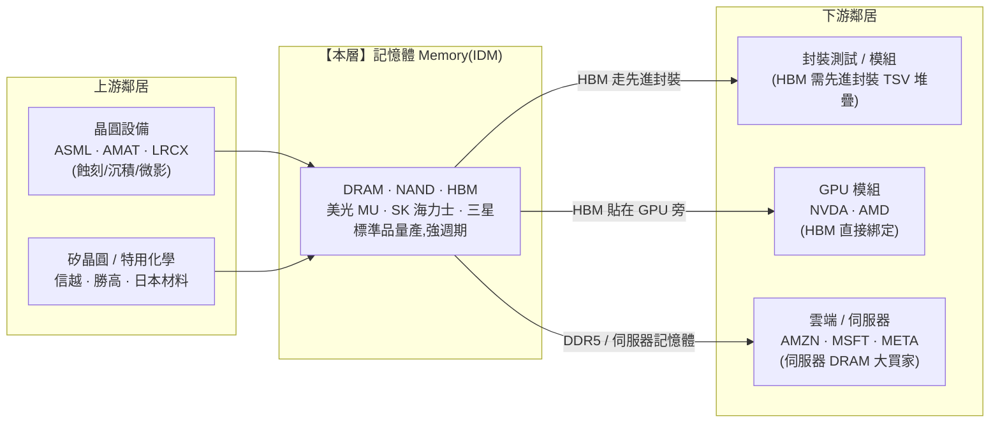

> 大部分人看記憶體,只記得一句話:「記憶體是景氣循環股,便宜就買、貴就賣。」
> 稍微進階的人會補一句:「三家寡占,殺價沒以前兇了。」
> 但真正看懂這一層的人會問:**「同樣是記憶體,為什麼 HBM 賣到缺貨、報價喊一年,commodity DRAM 卻還在跟客戶砍每一分錢?」**
> 答案是:記憶體正在裂成兩半——一半仍是商品紅海,另一半(HBM)被 AI 綁架成了準咽喉點。這篇拆的就是這條裂縫。

---

> ⚠️ **免責聲明與資料說明**:本文是一份**結構性產業鏈地圖(value-chain map)**,聚焦記憶體這一層的角色、集中度與定價權,不是個股估值報告。文中市佔率、毛利率、報價區間皆為**公開產業常識的概估值**(截至 2026 年初),用於說明相對地位,**非即時報價**;數字會隨循環大幅波動,任何投資決策前請自行查證最新數據。本文為教育用途,**不構成投資建議**。

---

## 一、這一層在產業鏈的位置

記憶體坐落在**中游**:它向上游買設備與材料,自己蓋廠量產標準化的儲存晶片,再往下游賣給封測、GPU 模組、伺服器與雲端。它和 IC 設計(Part 6/7)最大的不同是——**記憶體廠是 IDM(自己設計、自己製造),不外包給台積電**。



**一句話定位**:記憶體是中游少數「自己扛製造」的重資產層。在 commodity DRAM/NAND,定價權**流向買方**(商品、可替換、砍價);但在 **HBM**,因為與 GPU 深度綁定且產能不足,定價權**暫時倒流回供應端**——這是本層過去 30 年少見的結構鬆動。

和其他中游層對照更清楚:IC 設計(Part 6/7)輕資產、靠 IP 與軟體收租;晶圓代工(Part 5)重資產但近獨占、能收過路費;**記憶體則是「重資產+標準品」的最壞組合**——扛著和代工一樣的資本支出,卻沒有代工的稀缺性。這正是它長期價值捕獲被壓在中段的結構原因,也讓 HBM 這道「暫時的稀缺」顯得格外珍貴。

---

## 二、這一層到底在做什麼

記憶體負責「存資料」,和邏輯晶片(CPU/GPU 負責「算」)是晶片世界的兩大類。它分三種產品,商業性質差很大:

| 產品 | 用途 | 特性 | 商業性質 |
|---|---|---|---|
| **DRAM** | 主記憶體(手機/PC/伺服器) | 快、揮發性(斷電即失) | 標準品,強週期 |
| **NAND Flash** | 儲存(SSD/手機儲存) | 慢、非揮發性(斷電保留) | 標準品,更商品化、殺價更兇 |
| **HBM** | 高頻寬記憶體,貼在 GPU 旁 | 把多顆 DRAM 用 TSV 垂直堆疊 | 準客製、綁 GPU、缺貨 |

**為什麼記憶體天生是商品(commodity)**:DRAM/NAND 是**高度標準化**的——一顆 16Gb 的 DDR5 顆粒,三家做出來規格幾乎一樣,客戶可以隨時換供應商。標準化 = 沒有品牌溢價 = **只能拚每 bit 成本**。於是三家陷入經典的「產能競賽」:誰先擴產搶市佔,誰就在下一輪殺價中活得久。這是「量價齊崩齊漲」的循環根源。

**為什麼記憶體要不斷「微縮」與「堆疊」**:DRAM 靠**製程微縮**(1α → 1β → 1γ 奈米節點)把單位面積塞進更多電容,越縮越貴、越縮越難(電容漏電、干擾);NAND 則早已放棄平面微縮,改走**垂直堆疊**——從 100 多層一路往 200、300、400+ 層疊高,層數就是 NAND 廠的軍備競賽。兩條路的共同點是:**每一個世代都要砸更多設備錢,才能把每 bit 成本再降一點點**——這是記憶體「重資產、拚成本」宿命的技術根源。

**HBM 為什麼不一樣**:HBM 不是「一顆顆賣」,而是把 8~12 顆 DRAM 晶粒用矽穿孔(TSV)垂直疊起來、加上邏輯基底,再透過先進封裝(如 CoWoS)貼到 GPU 旁邊。它:
- **良率低、耗晶圓多**:同樣的晶圓產能,做 HBM 產出的 bit 數遠少於 commodity DRAM(要堆疊、要 KGD 良品篩選),等於「用 3 倍的產能做 1 份的 bit」。
- **與客戶深度綁定**:HBM3E / HBM4 要與 NVIDIA、AMD 的 GPU 一起驗證,設計、時序、封裝全都客製化,換供應商要重跑漫長認證。
- **從「賣顆粒」變「賣頻寬」**:GPU 買 HBM 不是買容量,是買「餵得動幾千個運算核心的頻寬」——這讓 HBM 的價值錨定在 GPU 效能上,而不是每 GB 的商品報價。
- 結果:HBM 從「商品」變成「準客製零件」,而客製化正是逃離商品紅海的出口。

---

## 三、玩家與競爭格局

全球記憶體是**三強寡占**——這是產業經過三十年慘烈整併後的結果(1990 年代曾有 20 幾家 DRAM 廠,如今只剩 3 家有先進製程量產能力)。

```
DRAM 市佔(概估,2026 初,以 bit 計)
────────────────────────────────────────────
三星 Samsung      ████████████████  ~40%
SK 海力士 Hynix   ██████████████    ~35%
美光 Micron       █████████         ~22%
其他(中國新進)   █                 ~3%(快速上升)
────────────────────────────────────────────

HBM 市佔(概估,2026 初)——格局完全不同
────────────────────────────────────────────
SK 海力士 Hynix   ██████████████████  領先 ~50%+
三星 Samsung      █████████           追趕中
美光 Micron       ██████              後發但良率佳、切入 NVDA 供應鏈
────────────────────────────────────────────
```

| 公司 | 代表股 | DRAM/NAND 地位 | HBM 地位 | 特徵 |
|---|---|---|---|---|
| **SK 海力士** | 000660.KS | DRAM 第二 | **HBM 龍頭**,NVIDIA 主力供應 | 押對 HBM,本輪最大贏家,定價權最強 |
| **三星 Samsung** | 005930.KS | DRAM/NAND 雙第一 | HBM 追趕、認證進度落後 | 規模最大、垂直整合最深,但 HBM 起步慢 |
| **美光 Micron** | MU | DRAM 第三、NAND 中段 | 後發但良率佳,切入 GPU 供應鏈 | 唯一美系,地緣上受青睞,HBM 拉高毛利 |

**誰領先、為什麼**:過去二十年三星靠「規模+成本」當老大;但這一輪 **SK 海力士靠押注 HBM 逆襲**——它更早投入 TSV 堆疊技術、更早綁定 NVIDIA,結果在最賺錢的 HBM 拿下過半市佔,把「跟老二」變成「HBM 龍頭」。三星規模仍最大,但 HBM 認證進度落後,錯過了最肥的一段。美光雖在 DRAM 排第三,但因為是**唯一的美系供應商**,在地緣敏感的 AI 供應鏈裡反而成為 NVIDIA 分散風險的首選,HBM 成了它毛利率翻身的槓桿。

**為什麼 SK 海力士贏了 HBM,而規模最大的三星落後?** 這是本層最值得學的案例——規模不等於贏面:

```
             押注時機          技術路線               結果
──────────────────────────────────────────────────────────────
SK 海力士    最早重押 HBM      TSV 堆疊+MR-MUF 封裝   綁定 NVIDIA、HBM 過半市佔 ✅
三星         規模優先、HBM 慢  一度押錯封裝路線        認證落後、錯過最肥一段 ⚠️
美光         後發但穩          良率導向、切 HBM3E      唯一美系→NVDA 分散來源 ✅
──────────────────────────────────────────────────────────────
教訓:在「客製化+認證綁定」的市場,先發+押對技術路線 > 純規模
```

**寡占紀律(oligopoly discipline)**:三家都被 1990–2010 年代的慘烈殺價教訓過,如今擴產更克制——不再無腦衝產能。這讓近年的循環「谷底沒那麼深、也沒那麼久」。但紀律是脆弱的:只要有一家(或中國新進者)破壞默契搶市佔,長鞭效應就會重演。

---

## 四、瓶頸分數與定價權

對記憶體「整層」打瓶頸分數(0–10),但必須拆成兩段看,因為 commodity 與 HBM 差距極大:

```
四項因子(0–10)         commodity DRAM/NAND    HBM
──────────────────────────────────────────────────────
供應商稀缺度            7(三強寡占)          8(實質 SK 海力士獨大)
不可替代性              4(三家可互換)        8(綁 GPU、認證難換)
切換成本/認證時間       4(標準品好換)        8(重跑認證、時序客製)
需求剛性                8(沒記憶體不能開機)  9(沒 HBM 出不了 GPU)
──────────────────────────────────────────────────────
平均(瓶頸分數)        5.75 ≈ 中等           8.25 ≈ 準咽喉
```

- **commodity 段 ≈ 5.5–6**:需求極剛性(電腦沒記憶體不能動),但因為三家產品可互換、切換容易,**定價權流向買方**——這是典型「有需求、沒定價權」的商品層。
- **HBM 段 ≈ 8**:供給實質集中在 SK 海力士、綁 GPU 難替換、認證漫長、AI 需求剛性,**定價權暫時倒流回供應端**——HBM 常「賣一年、報一年」,產能提前被 NVIDIA/AMD 包走。

**定價權方向總結**:整層是「一半被買方壓、一半反過來壓買方」的分裂狀態。**HBM 是本層唯一一段能主動喊價的產品**,而它的定價權來自「產能被綁死+良率門檻」,不是來自品牌——所以它是**暫時的、可被產能追上的**咽喉,和 ASML 那種物理級護城河不同。

---

## 五、利潤池與價值捕獲

記憶體是整條半導體鏈**毛利波動最劇烈**的一層。用一張圖看它為什麼:

```
記憶體毛利率的循環(概估,示意)
毛利率
 50% ┤              ╭─────╮ 高峰:供不應求,三家爽賺
     │             ╱       ╲
 30% ┤           ╱          ╲
     │         ╱             ╲
 10% ┤       ╱                ╲
  0% ┤─────╱───────────────────╲──────  谷底:殺到成本邊緣
-10% ┤   ╲_╱                     ╲__╱    甚至虧現金成本
     └────────────────────────────────► 時間
       過度擴產 → 供給過剩 → 崩盤 → 減產 → 復甦
```

**為什麼波動這麼大(長鞭效應 bullwhip)**:下游需求訊號沿鏈往上放大——景氣好時,客戶怕缺貨而「超額下單」,三家看到訂單暴增就一起擴產;等產能開出,需求早已回落,於是**供給過剩→報價雪崩→毛利歸零**。這是這條鏈最經典的週期陷阱(見總覽地圖的長鞭效應段)。

**利潤在哪裡**:
- **commodity DRAM/NAND**:谷底毛利可到 0% 甚至負(賣低於現金成本),高峰可到 ~50%。**長期平均下來,價值捕獲並不高**——賺的錢常在下一輪擴產與殺價中吐回去。這也是為什麼總覽地圖給記憶體「6 分(週期)」而非高分。
- **HBM**:ASP(平均售價)是 commodity DRAM 的數倍(每 bit 溢價高),且提前售罄、報價鎖定,毛利明顯高於公司平均。**HBM 正把三家的一部分利潤「去週期化」**——把一塊本來隨循環上下的收入,換成能見度較高的準合約收入。

**營運槓桿放大一切**:記憶體是高固定成本(折舊、廠房)、低變動成本的生意——所以報價每漲一塊,幾乎全數落進毛利;報價每跌一塊,也幾乎全數從毛利扣掉。這就是為什麼記憶體公司的**獲利波動遠比營收波動更劇烈**:營收上下 30%,淨利可能從巨額虧損翻成巨額獲利。看記憶體股,要看的是「報價與庫存的拐點」,不是當期絕對數字。

**關鍵洞察**:HBM 佔記憶體整體 bit 數不高,卻貢獻了**不成比例的獲利**。這讓三家的財報出現「commodity 還在谷底、但公司整體毛利已被 HBM 撐住」的新現象——**這是本層 30 年來第一次,有一段業務能對抗循環。**

---

## 六、上游依賴與下游客戶

**上游(它得買什麼)**:
- **晶圓設備**:記憶體是設備的超級大買家,尤其**蝕刻與沉積**(NAND 往上堆疊層數、DRAM 微縮都極度依賴設備)。設備商(ASML/AMAT/LRCX)對它有定價權。
- **矽晶圓與特用材料**:標準品,多來源,議價力在記憶體這邊。
- 沒有「單一致命依賴」的上游,但**設備供給的節奏會直接決定擴產速度**——買不到機台就擴不了產,這反而是穩定寡占紀律的隱形因素。
- **資本強度極高**:每家一年動輒投入百億美元級資本支出蓋廠、買機台,折舊龐大——這正是「谷底報價可以跌到低於現金成本、但廠不能停」的原因(停產的固定成本更痛)。高固定成本+標準品=循環放大器。

```
記憶體的成本/價值流(為什麼它兩頭受氣又偶爾翻身)
────────────────────────────────────────────────────────
設備(ASML/AMAT/LRCX) ─百億美元資本支出─► 【記憶體廠】 ─┬─ commodity:賣給分散客戶,砍價
  ▲ 對記憶體有定價權                                      │  (定價權在買方)
  │                                                       └─ HBM:賣給 NVDA/AMD,缺貨排隊
  └─ 買不到機台=擴不了產(隱形供給紀律)                       (定價權暫時回到自己手上)
────────────────────────────────────────────────────────
```

**下游(誰買它)——客戶集中度正在上升**:
- **雲端 CSP(AMZN/MSFT/META…)**:伺服器 DDR5 的大買家。
- **GPU 廠(NVDA/AMD)**:HBM 的直接客戶,且高度集中——**HBM 需求幾乎綁在少數幾家 GPU 廠身上**。
- 傳統上記憶體客戶很分散(全世界的手機、PC、伺服器),但 **HBM 讓下游集中度暴增**:一旦 NVIDIA 砍單,HBM 這段會瞬間承壓。這是「去週期化」的另一面——**用循環風險換成了客戶集中風險**。

**能不能被整合掉?**
- **買方往上整合(後向)**:CSP 自研記憶體?幾乎不可能——記憶體是製程與資本的無底洞,沒人想跳進來蓋 DRAM 廠。這點保護了三強。
- **供應商往下整合(前向)**:記憶體廠想做 GPU?也不會——它們專注在自己的製程強項。
- 真正的變數是**中國新進者(CXMT、長江存儲)**:它們在成熟 DRAM 與 NAND 快速拉升產能,是對「三強寡占紀律」最實質的長期威脅,尤其在 commodity NAND。

---

## 七、風險

記憶體是本系列「風險最需要誠實面對」的一層——它的向上彈性大,向下的坑也深。

- 🔴 **商品週期(cycle)**:最核心風險。長鞭效應下,一次過度擴產就能把 commodity 毛利打回 0%。**HBM 去週期化只覆蓋一部分業務,擋不住整體循環。** 買在高峰=買在利潤即將反轉。
- 🟠 **HBM 產能被追上**:HBM 的定價權來自「暫時供不應求」。三星、美光正全力擴 HBM 產能——一旦供給追上,HBM 溢價會收斂,這段「準咽喉」會退回普通高階零件。這是**時間問題,不是會不會**。
- 🟠 **客戶集中(GPU 綁定)**:HBM 需求高度依賴 NVIDIA/AMD。AI 資本支出循環一旦反轉、或 GPU 交期正常化,HBM 訂單能見度會快速惡化。
- 🟠 **中國新進者破壞寡占**:CXMT/長江存儲在成熟製程放量,可能重演「殺價搶市佔」,侵蝕三強的循環紀律,NAND 首當其衝。
- 🟠 **地緣與出口管制**:先進記憶體(尤其 HBM)已被納入出口管制範圍;供應鏈「去中/在地化」會重塑客戶與產能佈局。
- 🟡 **技術路線變數**:CXL、記憶體內運算(processing-in-memory)等新架構若普及,可能改變記憶體的價值分佈——長期機會也是長期不確定性。

---

## 八、價值遷移:錢正流進還流出這一層?

**短期(未來 1–3 年):價值正「流進」記憶體——但只流進 HBM 這一段。**

```
過去的記憶體                →   現在正在發生                →   確認訊號(trigger)
──────────────────────────────────────────────────────────────────────────────
純商品、隨循環齊崩齊漲          HBM 把一部分收入去週期化,        HBM 佔營收比重續升、
定價權永遠在買方手上            SK 海力士/美光暫時奪回定價權       報價維持「賣一年」的能見度
──────────────────────────────────────────────────────────────────────────────
commodity DRAM 供給充足     →   HBM 耗掉大量晶圓產能,           commodity DRAM 報價因
                               「排擠」了 commodity 供給         供給被 HBM 排擠而止跌回升
──────────────────────────────────────────────────────────────────────────────
記憶體=最慘的循環股         →   AI 讓它變成「有一段能收過路費」   但一旦 HBM 產能追上,
                               的準二階 AI 受益者                價值會再流出、退回商品循環
```

**一個容易被忽略的二階效應**:HBM 良率低、耗晶圓多,三家把產能大量轉去做 HBM,等於**縮減了 commodity DRAM 的有效供給**——結果連 commodity DRAM 都因為「供給被排擠」而報價回升。**AI 不只讓 HBM 賺錢,還間接收緊了整個 DRAM 市場。** 這是本輪記憶體循環和過去最大的結構差異。

**但要誠實**:這個「流進」是**有條件、可逆的**。它建立在「HBM 供不應求」上;一旦三星、美光把 HBM 產能開滿、或 AI 資本支出降溫,價值會再度**流出**記憶體、退回商品循環的常態。記憶體不是 ASML 那種「永久收費站」,它是「這一輪剛好站在風口的週期股」。

---

## 九、分層投資點子(教育性質、非投資建議)

| 分層角色 | 較佳定位的名字 | 邏輯 | 點子類型 |
|---|---|---|---|
| **本層直接贏家** | SK 海力士、美光(MU) | HBM 龍頭與美系首選,直接吃 AI 記憶體紅利、毛利去週期化 | 週期性多方(需擇時) |
| **規模型但落後者** | 三星 | 規模最大,但 HBM 認證落後;若追上是補漲、追不上是拖累 | 觀察 / 落後補漲 |
| **二階(picks-and-shovels)** | 供 HBM 的先進封裝/TSV、測試、設備 | HBM 耗產能=設備與封裝需求放大,比記憶體本身更不受報價波動 | 低調、易被低估 ◄ |
| **避開 / 空方候選** | 純 commodity NAND 曝險、無 HBM 的二線記憶體 | 中國放量+商品化最嚴重,長期被殺價 | 迴避 |
| **選擇權(optionality)** | CXL / 記憶體新架構相關 | 若記憶體價值分佈被新架構改寫的便宜曝險 | 投機性 |

**最該注意的「非顯性節點」**:市場追 HBM 龍頭股時,常忽略**供 HBM 的設備、TSV/先進封裝與測試供應商**——它們賣鏟子給記憶體三強,需求隨 HBM bit 成長而放大,卻**不直接承受記憶體報價的暴漲暴跌**,是本層循環風險較低的二階曝險。

---

## 論點反轉條件(Thesis Invalidation)

**本層訊號為「中度偏多(HBM 帶動),但循環風險高」。下列情況會打破偏多論點:**
- HBM 供給被三星/美光快速補上,溢價收斂——HBM 退回普通高階零件,去週期化紅利消失。
- AI 資本支出循環反轉,GPU 交期正常化,HBM 訂單能見度崩壞(客戶集中風險引爆)。
- 中國新進者(CXMT/長江存儲)大規模殺價,破壞三強寡占紀律,commodity 報價再次雪崩。
- 買在循環高峰:報價、庫存、資本支出三項同時見頂,是最危險的進場點。

**重新檢視這張地圖的時機:**
- [ ] 三強(美光、SK 海力士、三星)財報與 HBM 報價/出貨指引公布時
- [ ] HBM 產能、GPU 交期或 DRAM 現貨報價出現明顯轉折
- [ ] 中國記憶體產能、出口管制的重大事件
- [ ] 距今超過 60–90 天

```
╔══════════════════════════════════════════════╗
║              INDUSTRY-MAP SIGNAL             ║
╠══════════════════════════════════════════════╣
║ 結構訊號:    HBM 段 BULLISH / 商品段 CYCLICAL ║
║ Confidence:  MEDIUM(結構清晰,循環時點難測)  ║
║ Horizon:     MEDIUM-TERM(綁 AI 資本支出循環) ║
║ Score:       6.0 / 10(整層;HBM 段約 8)      ║
╠══════════════════════════════════════════════╣
║ 偏好層級:    HBM 龍頭(SK 海力士/MU)+ 二階   ║
║ 迴避層級:    純 commodity NAND / 二線記憶體   ║
╚══════════════════════════════════════════════╝
```

評分指引:8.0–10.0 強烈偏多 | 6.0–7.9 中度偏多 | 4.0–5.9 中性 | 2.0–3.9 中度偏空 | 0.0–1.9 強烈偏空

**一句話總結**:記憶體整層是**中度偏多、但循環風險最高**的一層。給 6.0 分——不是因為它是穩定咽喉(它不是),而是因為 HBM 這段(約 8 分)暫時把一塊業務去週期化、拿回定價權,把整層從「純商品循環」拉高。但這份紅利**有條件、可逆**:HBM 產能一旦追上,分數會往下修。

---

### 📚 系列導覽:半導體產業鏈全景(上游 → 下游)

> 總覽地圖:[industry-map - 半導體晶片產業鏈全景](/yennj12_blog_V4/posts/industry-map-semiconductor-value-chain-zh/)

**上游 Upstream**
- Part 1:[矽晶圓 / 基板](/yennj12_blog_V4/posts/industry-map-semiconductor-part1-silicon-wafer-zh/)
- Part 2:[特用化學 / 光阻](/yennj12_blog_V4/posts/industry-map-semiconductor-part2-chemicals-photoresist-zh/)
- Part 3:[EDA + IP](/yennj12_blog_V4/posts/industry-map-semiconductor-part3-eda-ip-zh/)
- Part 4:[晶圓設備](/yennj12_blog_V4/posts/industry-map-semiconductor-part4-fab-equipment-zh/)

**中游 Midstream**
- Part 5:[晶圓代工](/yennj12_blog_V4/posts/industry-map-semiconductor-part5-foundry-zh/)
- Part 6:[IC 設計 — GPU/加速器](/yennj12_blog_V4/posts/industry-map-semiconductor-part6-gpu-design-zh/)
- Part 7:[IC 設計 — 其他](/yennj12_blog_V4/posts/industry-map-semiconductor-part7-ic-design-zh/)
- **Part 8:[記憶體](/yennj12_blog_V4/posts/industry-map-semiconductor-part8-memory-zh/)** ◄ 本篇
- Part 9:[IDM / 類比](/yennj12_blog_V4/posts/industry-map-semiconductor-part9-idm-analog-zh/)
- Part 10:[封裝測試 OSAT](/yennj12_blog_V4/posts/industry-map-semiconductor-part10-osat-zh/)

**下游 Downstream**
- Part 11:[網通 / 互連](/yennj12_blog_V4/posts/industry-map-semiconductor-part11-networking-zh/)
- Part 12:[系統 / 伺服器 OEM](/yennj12_blog_V4/posts/industry-map-semiconductor-part12-system-oem-zh/)
- Part 13:[雲端 CSP](/yennj12_blog_V4/posts/industry-map-semiconductor-part13-cloud-csp-zh/)
- Part 14:[終端需求](/yennj12_blog_V4/posts/industry-map-semiconductor-part14-end-demand-zh/)

---

## 參考來源與方法(References)

- 分析方法:InvestSkill `industry-map` skill(<https://github.com/yennanliu/InvestSkill>)——把產業畫成上游到下游的有向圖,定位咽喉點、利潤池與價值遷移。
- 本文的市佔率、毛利率、報價區間為公開產業常識的**概估值**(截至 2026 年初),會隨記憶體循環大幅波動,用於說明各段相對地位,非即時報價。
- 總覽地圖:[半導體晶片產業鏈全景](https://yennj12.js.org/yennj12_blog_V4/posts/industry-map-semiconductor-value-chain-zh/)

> 再次提醒:本文為產業結構教學與地圖,市佔/毛利/報價為概估值且高度循環,**不構成投資建議**。
