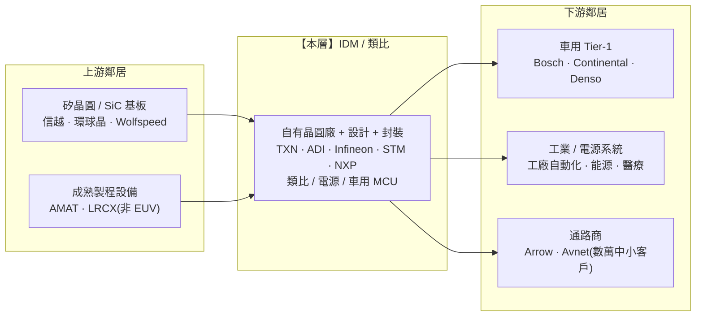

> 大部分人看半導體,只看得到最亮的那一層:GPU 有多快、先進製程幾奈米。
> 稍微進階的人會補一句:記憶體很週期、代工很燒錢。
> 但有一層又老又不性感,卻年年賺約 60% 毛利、料號活二十年、客戶想換也換不掉——
> **這一層叫「IDM / 類比」,是整條鏈裡最不像科技股的科技股。** 它剛好是 GPU 的鏡像:自己設計、自己蓋廠、分散、耐操。

---

> ⚠️ **免責聲明與資料說明**:本文是一份**結構性產業鏈地圖(value-chain map)**,重點在「這一層的角色、集中度與定價權」,不是個股估值報告。文中的市佔率、毛利率區間為**公開產業常識的概估值**(截至 2026 年初),用於說明各層的相對地位,**非即時報價**;任何投資決策前請自行查證最新數據。本文為教育用途,**不構成投資建議**。

---

## 一、這一層在產業鏈的位置

IDM(Integrated Device Manufacturer,整合元件製造商)是中游裡的一個「異類」:別人把設計與製造分家(fabless + foundry),它偏偏**自己設計、自己在自家晶圓廠製造、自己封裝出貨**——一條龍。它做的產品以**類比(analog)、電源(power)、混合訊號(mixed-signal)、車用 MCU**為主。



**一句話定位**:IDM / 類比坐在中游,但**上下游都不掐它的脖子**——上游用的是成熟製程設備(不靠 ASML EUV)、自有晶圓廠讓它不看代工臉色;下游客戶分散到數萬家(車用+工業為主),沒有單一大客戶能勒索它。定價權**溫和地偏向本層**:不像咽喉點能坐地起價,但靠「設計進去就拔不掉」的黏著度,享有長期穩定的訂價地位。

---

## 二、這一層到底在做什麼

前面幾層(GPU、記憶體)都在跟「數位訊號、先進製程、高速運算」搏鬥;類比這一層剛好相反——它處理的是**真實世界的連續訊號**:電壓、電流、溫度、聲音、光、無線電波。

- **類比 IC**:放大器、資料轉換器(ADC/DAC)、電源管理(PMIC)、感測器介面——凡是「把物理世界翻譯成數位、或反過來供電驅動」的,都是它。
- **電源 / 功率元件**:MOSFET、IGBT、SiC/GaN 功率元件——負責高電壓、大電流的能量轉換(EV 逆變器、充電、資料中心供電)。
- **車用 / 嵌入式 MCU**:控制引擎、車身、ADAS 的微控制器。

**為什麼是 IDM(自己蓋廠),不像 GPU 那樣外包?** 三個結構性原因:

```
類比 vs 數位先進製程 —— 為什麼類比自己做
────────────────────────────────────────────────────────────
① 用的是「成熟製程」(trailing-edge)
   類比的關鍵是「特性(precision/noise/耐壓)」不是「電晶體多小」。
   180nm ~ 45nm、甚至更老的特殊製程就夠用 → 不需要 EUV、不用追奈米。
② 製程是「know-how」,不是「規格」
   同樣 180nm,類比廠自己的配方(recipe)決定精度與良率 →
   把製造外包等於把最核心的競爭力交出去。
③ 設備可以「折舊到底、用很久」
   成熟製程設備多半已折舊完,一台機台用十幾年 →
   自有廠的邊際成本極低,規模一到就是印鈔機。
────────────────────────────────────────────────────────────
```

**與 GPU 的鏡像對照**(這是理解本層最快的方式):

| 維度 | GPU / 加速器(Part 6) | IDM / 類比(本層) |
|---|---|---|
| 商業模式 | Fabless,只設計、台積電代工 | IDM,設計+製造+封裝一條龍 |
| 製程 | 追最先進(3nm/2nm、EUV) | 成熟製程(trailing-edge、無 EUV) |
| 料號結構 | 少數旗艦、單顆量大 | **數萬顆料號**、每顆量小 |
| 產品壽命 | 1–2 年就被下一代取代 | **10–20 年**,低淘汰率 |
| 集中度 | 近獨占 | **高度分散**(龍頭也才約 19%) |
| 週期性 | 極高(綁 AI 資本支出) | **較低**(綁廣泛車用/工業) |
| 毛利 | ~70–75% | ~60%(更穩) |

**洞察**:GPU 是「贏者全拿、贏得快也可能輸得快」;類比是「沒人全拿、但誰都拿一點、拿得久」。這一層的本質不是「技術領先」,而是**廣度 × 壽命 × 黏著度**。

---

## 三、玩家與競爭格局

類比是整條半導體鏈裡**最分散**的一層。這裡沒有「台積電」或「NVIDIA」——市場龍頭德州儀器的類比市佔也只有約 19%,前五大加起來不到六成。碎片化本身就是這一層的護城河形態:客戶是被「幾萬顆料號」黏住,不是被「一顆超級晶片」綁住。

| 公司 | 定位 | 類比/相關市佔(概估) | 強項與角色 |
|---|---|---|---|
| **德州儀器 TXN** | 類比 + 嵌入式龍頭 | 類比約 **19%** | 料號最廣(逾 8 萬顆)、成本領導者、押注 300mm 自有廠 |
| **ADI(Analog Devices)** | 高效能類比 #2 | 類比約 **12–13%** | 高精度/高 ASP,併購 Maxim、Linear,工業+通訊+車用強 |
| **英飛凌 Infineon** | 功率 + 車用 #1 | 功率/車用領先 | 全球車用半導體龍頭、功率元件與 SiC 領先 |
| **意法 STMicro** | 廣線類比/MCU/功率 | 車用+工業前段班 | MCU、SiC、感測器,車用電動化直接受惠 |
| **恩智浦 NXP** | 車用處理/連結/安全 | 車用處理器前列 | 車用 MCU、車聯網、安全晶片,汽車營收占比高 |

**市佔位置條(類比市場概估,示意相對位置):**

```
公司          類比市場相對份額(概估)
────────────────────────────────────────────
德州儀器 TXN   ███████████████████  ~19%   ◄ 龍頭,但仍<20%
ADI           █████████████        ~13%
英飛凌 IFX     ██████████           (功率/車用領先)
意法 STM       ███████
恩智浦 NXP     ██████
其他(數十家)  ████████████████████████  合計 >40%  ◄ 極度分散
────────────────────────────────────────────
```

**誰領先、為什麼?** 沒有單一贏家,而是**兩種贏法並存**:

- **德儀 TXN 的贏法 = 成本 × 規模**:料號最廣、通路最深,靠自有 300mm 廠把單顆成本壓到最低,走「什麼都有、便宜又穩」的雜貨店龍頭路線。
- **ADI 的贏法 = 效能 × ASP**:不比廣、比精,做別人做不出的高精度訊號鏈,單價高、毛利更高,鎖定工業與高階客戶。
- **英飛凌 / 意法 / 恩智浦 = 車用電動化槓桿**:押注「每台車矽含量翻倍」的長期趨勢,功率(SiC)、車用 MCU 是主戰場。

---

## 四、瓶頸分數與定價權

用四因子(供應商稀缺度、不可替代性、切換成本/驗證時間、需求剛性)各打 0–10,平均為本層瓶頸分數。

```
因子                        分數   說明
──────────────────────────────────────────────────────────────
供應商稀缺度                 5   分散,料號多有替代來源;但「特定料號」常單一供應
不可替代性                   5   目錄層級可換;一旦「設計進去」就難換
切換成本 / 驗證時間          8   車規認證 + 2–4 年設計導入週期,拔換代價極高 ◄ 最強
需求剛性                     6   每個電子系統都要電源/類比;但綁車用/工業 → 有週期
──────────────────────────────────────────────────────────────
瓶頸分數(平均)             6.0  ██████░░░░  「韌性層」,非咽喉點
──────────────────────────────────────────────────────────────
```

**定價權方向:溫和偏向本層,但不是坐地起價的咽喉。**

這一層的定價權來源不是「稀缺」(它不稀缺,龍頭才 19%),而是**「黏著」**:

```
定價權的真正來源 = 設計導入鎖定(design-in lock-in)
──────────────────────────────────────────────────
‣ 一顆類比料號被「設計進」一台車 / 一台工業設備後,
  要換掉就得重新做整套認證(車規 AEC-Q100、功能安全)
‣ 認證要 1–2 年,料號本身活 10–20 年 →
  客戶懶得換,也不敢換(換錯風險 >> 省下的料錢)
‣ 每顆料號占客戶 BOM 成本很小,但缺一顆就出不了貨 →
  客戶對「單價」不敏感,對「供貨穩定」極敏感
──────────────────────────────────────────────────
結論:定價權來自「拔不掉」,不是「買不到」。
      這讓毛利穩定,但漲價空間不像 EUV/GPU 那樣誇張。
```

對照 Part 4 的 EUV(瓶頸 10)、Part 5 的先進製程(9),本層 **6.0** 是誠實的定位:**它是「韌性層」而非「咽喉層」**——不會卡住整條鏈,但它自己很難被打倒。

---

## 五、利潤池與價值捕獲

本層在總覽圖的價值捕獲評為 **7/10,關鍵字是「高(穩定)」**。為什麼類比能長年賺約 60% 毛利、還比別層穩?

```
類比高毛利的三支柱
──────────────────────────────────────────────────────
① 成熟製程 + 折舊完的自有廠 → 邊際成本極低
   200mm 老廠早已折舊完,多做一片幾乎純賺
② 數萬顆料號 → 分散化「反週期」
   沒有單一料號 >2% 營收,單一終端崩了不致命 →
   營收波動遠小於記憶體/GPU
③ 設計鎖定 + 長壽命 → 訂價穩、不用年年殺價
   不像記憶體標準品要比現貨報價,類比是「你設計進去的專屬料」
──────────────────────────────────────────────────
```

**利潤池坐在哪:設計+製造「一體」地留在同一家公司。** 這跟 GPU 那層(設計端 NVIDIA 賺 70%、製造端台積電賺 55%,利潤被切兩半)不同——IDM 把設計與製造的利潤**都收進自己口袋**,所以雖然單一毛利率(~60%)看似輸給 fabless GPU(~72%),但它**不用把一半利潤付給代工廠**。

**德儀的結構性豪賭:自建 300mm 類比晶圓廠。**

這是本層最重要、也最反直覺的一步棋。全世界的類比幾乎都在 200mm(8 吋)老廠上做——設備便宜、折舊完。德儀卻逆勢砸重金蓋 **300mm(12 吋)類比廠**(德州 Sherman、猶他 Lehi):

```
為什麼 300mm 是德儀的長期成本護城河
──────────────────────────────────────────────────
‣ 一片 300mm 的可用面積約是 200mm 的 2.3 倍
  → 每顆封裝好的類比晶片「未封裝成本」可低約 40%
‣ 大量自製(而非委外)→ 供給自主,缺貨潮時反而搶到市佔
‣ 代價:近年資本支出一度衝到每年約 50 億美元,
  短期自由現金流(FCF)被壓縮 → 用今天的 FCF,換十年的成本地板
──────────────────────────────────────────────────
賭注本質:別人 fab-lite(輕資產外包),德儀反其道
          用「自有 + 最先進尺寸」鎖死長期單位成本領先。
```

這是一個典型的「**用短期利潤換長期結構優勢**」決策:成不成,要看未來十年的產能利用率——這也正是它現在被市場質疑(FCF 縮水)的點。

---

## 六、上游依賴與下游客戶

**上游(它要買什麼)——依賴度低,這是 IDM 的核心優勢:**

- **設備**:買的是成熟製程設備(AMAT、Lam 等),**不碰 ASML EUV**——所以沒有「排隊買曝光機」的咽喉痛點,設備供給遠比先進製程寬鬆。
- **矽晶圓 / SiC 基板**:一般矽晶圓多源、好買;唯一要盯的是**功率用的 SiC 基板**(Wolfspeed、Coherent、羅姆),這塊供給仍偏緊、是功率廠的潛在單點依賴。
- **自有晶圓廠**:最關鍵的製造環節握在自己手上 → **不看代工臉色**(對比 fabless 全靠台積電)。

**下游(誰買它)——客戶極度分散,這是它「反週期」的來源:**

```
下游客戶結構
──────────────────────────────────────────────
車用 Tier-1(Bosch/Conti/Denso)  ─┐
工業 OEM(自動化/能源/醫療)      ─┤─► 沒有單一客戶
消費 / 個人電子                   ─┤    >10% 營收
數萬家中小客戶(經 Arrow/Avnet)  ─┘
──────────────────────────────────────────────
對比:GPU/HBM 高度依賴少數 CSP;類比靠「長尾」分散風險。
```

- **客戶集中度:低。** 沒有哪家 CSP 或車廠能「砍單就重創」它。這與 Part 6(GPU 依賴少數 CSP)、Part 8(HBM 綁 GPU)形成強烈對比。
- **能否向後整合(客戶自己做)?** 幾乎不會——類比 know-how 深、料號零散、量又不夠大,車廠/工業客戶自製毫無規模效益,寧可外購。這進一步鞏固了本層的地位。

---

## 七、風險

本層是「韌性層」不代表沒有風險,只是風險的形狀不同——它不怕突然消失,但會被**週期**和**低階價格戰**慢慢磨。

- 🟠 **週期性軟著陸(當前正在發生)**:類比比記憶體穩,但**不是無週期**。經歷疫情後的重複下單,車用與工業自 2024–2025 進入**庫存去化(destocking)**、需求疲軟的循環低點。這是現在最該標註的事實:**本層此刻處在週期軟階段(soft patch)**,營收與稼動率受壓,不能把它當「永遠只漲」的防禦股。
- 🟠 **中國本土化 / 低階價格戰**:中國類比/功率廠(如聖邦、思瑞浦等)在**通用、低階料號**快速追趕,對「大宗類比」形成價格壓力。高精度、車規、功率高階仍安全,但低階目錄產品的毛利會被侵蝕。
- 🟠 **德儀的資本支出 / FCF 風險**:300mm 擴產若碰上需求長期疲軟,會變成「產能開出來、稼動率上不去」的過度投資——短期 FCF 承壓、市場耐心受考驗。
- 🟡 **EV / 電動化減速**:車用矽含量成長是本層的長線引擎,若 EV 需求或 SiC 導入放緩,功率廠(英飛凌、意法)的成長假設要下修。
- 🟡 **技術替代(有限)**:GaN 對部分 SiC/矽功率市場的蠶食、數位化取代部分類比功能——影響溫和、非顛覆。

---

## 八、價值遷移

**結論:價值溫和地「流入」本層,但速度慢、靠趨勢不靠爆發——且要先熬過眼前的週期低點。**

```
遷移方向與觸發訊號
──────────────────────────────────────────────────────────────
驅動力              往哪流            確認訊號(trigger)
──────────────────────────────────────────────────────────────
汽車電動化/ADAS  →  車用矽含量↑↑      每台車半導體含量從約 $500
                    (功率/MCU)        → $1,000+;EV/ADAS 滲透率回升
──────────────────────────────────────────────────────────────
AI 資料中心供電  →  電源管理需求↑     48V 供電、GPU 機櫃電源架構
(被忽略的角度)     (Power/VRM)       → 高階電源類比(如 MPWR)受惠
──────────────────────────────────────────────────────────────
週期落底反轉     →  補庫存 + 稼動率↑  車用/工業訂單止跌、通路庫存正常化
                                       → 這是最直接的「上車」訊號
──────────────────────────────────────────────────────────────
```

**一個常被忽略的角度**:市場以為 AI 只利多 GPU/HBM,但**AI 資料中心的「餵電」問題**(把電從電網一路降壓、穩壓送到 GPU)需要大量高階電源類比與功率元件——這讓一部分類比/電源玩家(如專攻資料中心供電的 Monolithic Power)意外沾到 AI 紅利。**「電力是下一個稀缺」的論點,受益者之一其實在這一層。**

但要誠實:本層的價值遷移是**長線緩流**,不是 GPU 那種「一年翻倍」的爆發。它更像「每台車、每座資料中心多塞一點矽」的複利,現在還被週期低點蓋住。

---

## 九、分層投資點子(教育性質、非投資建議)

| 分層角色 | 較佳定位的名字 | 邏輯 | 點子類型 |
|---|---|---|---|
| **韌性核心** | 德儀 TXN、ADI | 約 60% 穩定毛利、分散抗週期;TXN 靠 300mm 成本領先,ADI 靠高效能高 ASP | 穿越週期的長抱 |
| **車用/電動化槓桿** | 英飛凌、意法、恩智浦 | 每台車矽含量翻倍的直接受益者;功率/SiC/車用 MCU | 趨勢多方(綁 EV/ADAS) |
| **二階(被忽略)** | 資料中心電源(如 Monolithic Power)、SiC 基板 | AI「餵電」需求 → 高階電源類比;功率上游 SiC | 低調、易被低估 ◄ |
| **迴避 / 謹慎** | 純低階通用類比、體質弱的 SiC 純玩家 | 中國價格戰侵蝕低階毛利;SiC 轉型期燒錢、供需錯配 | 迴避 / 觀望 |
| **時機選擇權** | 整體本層(週期落底時) | 現在正處週期軟階段 → 落底反轉是估值重評的催化 | 逆勢佈局(需耐心) |

**最該注意的「非顯性節點」**:市場把類比當「無聊的防禦股」而低配,但**(1) 車用矽含量的結構性成長**與 **(2) AI 資料中心的電源類比需求**,是兩條被 GPU 光環蓋住的長線。真正的風險不在「這層會消失」,而在「買太貴、或買在週期還沒落底時」。

---

## 論點反轉條件(Thesis Invalidation)

**本層結構訊號:NEUTRAL 偏正向(韌性/防禦,非咽喉);當前受週期壓抑。下列情況會打破論點:**

- 週期落底遲遲不來:車用/工業庫存去化拖長、訂單持續探底,稼動率長期低迷。
- 中國本土類比從「低階」向上侵蝕到「高階/車規」,毛利結構性下滑(不只低階受壓)。
- 德儀 300mm 擴產遇上需求長期疲軟 → 變成過度投資,FCF 遲遲無法回升。
- 汽車電動化/ADAS 成長假設大幅下修(EV 明顯減速、SiC 導入延後)。

**重新檢視這張地圖的時機:**
- [ ] 德儀、ADI、英飛凌財報(特別看車用/工業庫存與訂單指引)
- [ ] 車用/工業通路庫存與訂單出現止跌回升訊號
- [ ] 德儀資本支出/FCF 拐點
- [ ] 距今超過 60–90 天

```
╔══════════════════════════════════════════════╗
║              INDUSTRY-MAP SIGNAL             ║
╠══════════════════════════════════════════════╣
║ 結構訊號:    韌性層 NEUTRAL 偏正向(非咽喉)  ║
║ Confidence:  MEDIUM(結構穩,週期時點難測)    ║
║ Horizon:     LONG-TERM(1 年以上、複利型)     ║
║ Score:       6.0 / 10(韌性、非咽喉)          ║
╠══════════════════════════════════════════════╣
║ 偏好定位:    TXN/ADI 韌性核心 + 車用電動化    ║
║ 迴避定位:    低階通用類比、體質弱 SiC 純玩家  ║
╚══════════════════════════════════════════════╝
```

評分指引:8.0–10.0 強烈偏多 | 6.0–7.9 中度偏多 | 4.0–5.9 中性 | 2.0–3.9 中度偏空 | 0.0–1.9 強烈偏空

---

### 📚 系列導覽:半導體產業鏈全景（上游 → 下游）

> 總覽地圖:[industry-map - 半導體晶片產業鏈全景](/yennj12_blog_V4/posts/industry-map-semiconductor-value-chain-zh/)

**上游 Upstream**
- Part 1:[矽晶圓 / 基板](/yennj12_blog_V4/posts/industry-map-semiconductor-part1-silicon-wafer-zh/)
- Part 2:[特用化學 / 光阻](/yennj12_blog_V4/posts/industry-map-semiconductor-part2-chemicals-photoresist-zh/)
- Part 3:[EDA + IP](/yennj12_blog_V4/posts/industry-map-semiconductor-part3-eda-ip-zh/)
- Part 4:[晶圓設備](/yennj12_blog_V4/posts/industry-map-semiconductor-part4-fab-equipment-zh/)

**中游 Midstream**
- Part 5:[晶圓代工](/yennj12_blog_V4/posts/industry-map-semiconductor-part5-foundry-zh/)
- Part 6:[IC 設計 — GPU/加速器](/yennj12_blog_V4/posts/industry-map-semiconductor-part6-gpu-design-zh/)
- Part 7:[IC 設計 — 其他](/yennj12_blog_V4/posts/industry-map-semiconductor-part7-ic-design-zh/)
- Part 8:[記憶體](/yennj12_blog_V4/posts/industry-map-semiconductor-part8-memory-zh/)
- **Part 9:[IDM / 類比](/yennj12_blog_V4/posts/industry-map-semiconductor-part9-idm-analog-zh/)** ← 本篇
- Part 10:[封裝測試 OSAT](/yennj12_blog_V4/posts/industry-map-semiconductor-part10-osat-zh/)

**下游 Downstream**
- Part 11:[網通 / 互連](/yennj12_blog_V4/posts/industry-map-semiconductor-part11-networking-zh/)
- Part 12:[系統 / 伺服器 OEM](/yennj12_blog_V4/posts/industry-map-semiconductor-part12-system-oem-zh/)
- Part 13:[雲端 CSP](/yennj12_blog_V4/posts/industry-map-semiconductor-part13-cloud-csp-zh/)
- Part 14:[終端需求](/yennj12_blog_V4/posts/industry-map-semiconductor-part14-end-demand-zh/)

---

## 參考來源與方法(References)

- 分析方法:InvestSkill `industry-map` skill(<https://github.com/yennanliu/InvestSkill>)——把產業畫成上游到下游的有向圖,定位咽喉點、利潤池與價值遷移。
- 本文的市佔率/毛利率為公開產業常識的**概估值**(截至 2026 年初),用於說明各層相對地位,非即時報價。
- 總覽地圖:[半導體晶片產業鏈全景](https://yennj12.js.org/yennj12_blog_V4/posts/industry-map-semiconductor-value-chain-zh/)

> 再次提醒:本文為產業結構教學與地圖,市佔/毛利為概估值,**不構成投資建議**。
