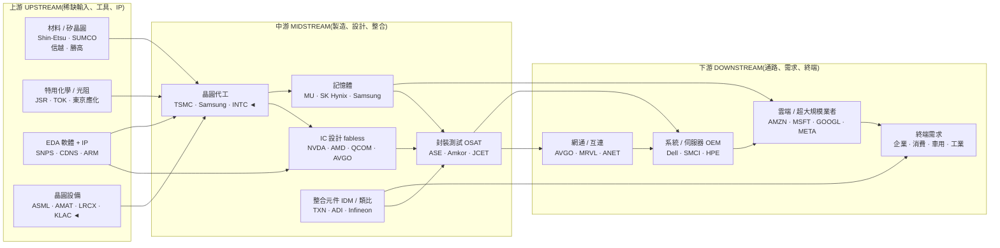
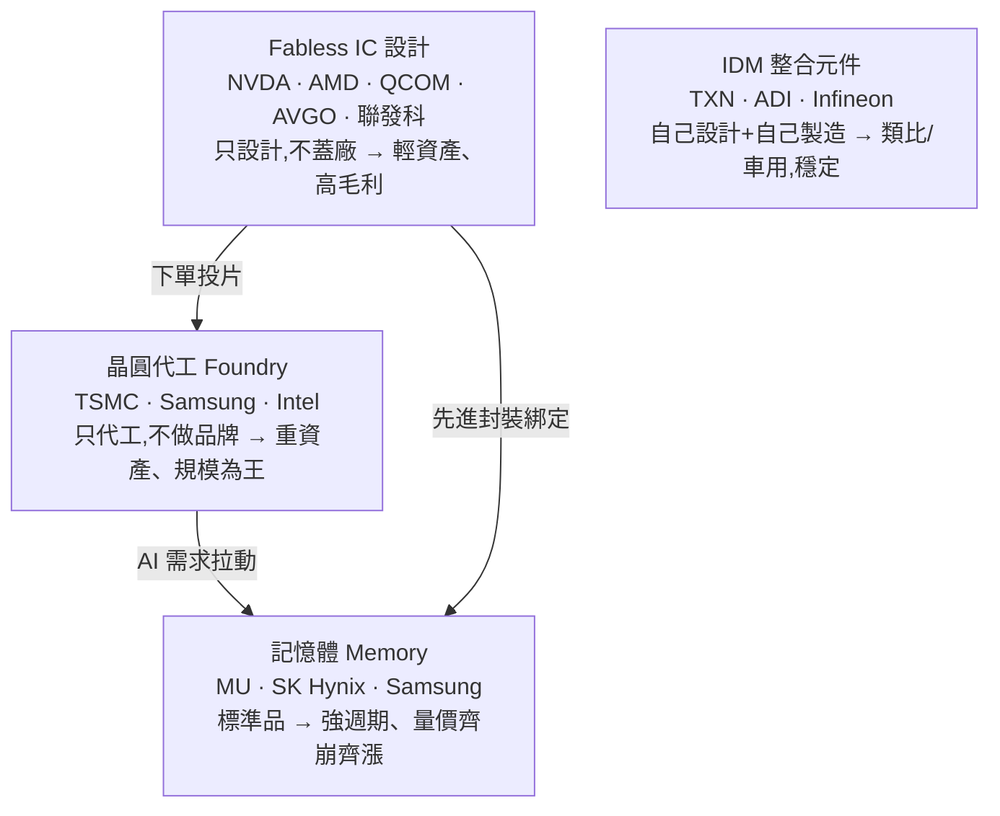

> 大部分人分析半導體,習慣盯著一檔股票:NVIDIA 財報多好、台積電良率多高。
> 稍微進階的人會比較同層對手:AMD vs NVIDIA、三星 vs 台積電。
> 但真正看懂這個產業的人,會把它畫成一張「有向圖」——從一粒矽砂,到你手機裡的晶片,問一個更根本的問題:
> **「這條鏈子,每一層各賺多少?錢卡在哪裡?下一段錢會流去哪?」** 這篇就是那張圖。

---

> ⚠️ **免責聲明與資料說明**:本文是一份**結構性產業鏈地圖(value-chain map)**,重點在「每一層的角色、集中度與定價權」,不是個股估值報告。文中的市佔率、毛利率區間為**公開產業常識的概估值**(截至 2026 年初),用於說明各層的相對地位,**非即時報價**;任何投資決策前請自行查證最新數據。本文為教育用途,**不構成投資建議**。

---

## 一、執行摘要(Executive Summary)

- **範圍**:本圖從「純矽晶圓與化學材料」畫到「雲端/終端使用者」,涵蓋整條半導體價值鏈,橫跨材料、設備、代工、設計、記憶體、封測、系統與雲端八大層。
- **今天錢卡在哪**:利潤池高度集中在**三個咽喉點**——(1) EUV 微影設備(ASML 獨家)、(2) 先進製程晶圓代工(台積電)、(3) AI 加速器 + 軟體生態(NVIDIA + CUDA)。這三層是「無論下游誰贏都收過路費」的收費站。
- **價值遷移論點**:AI 算力的稀缺性正從「GPU 本身」往兩個方向外溢——**往上游**流向 HBM 記憶體、先進封裝(CoWoS)、電力與散熱;**往下游**流向能把算力變現的**推論(inference)與軟體服務**。未來 1–3 年,誰握住「新稀缺」(先進封裝產能、HBM、電力),誰就接棒下一段利潤。

---

## 二、產業鏈全景圖(The Chain Map)

這是一張有向圖:節點是生產層,箭頭代表「供應商 → 買方」的流向。◄ 標記的是咽喉點(收費站)。



**鏈圖總表(machine-readable)**:

| 層(Layer) | 位置 | 代表公司 | 集中度 | 目前價值捕獲 |
|---|---|---|---|---|
| 矽晶圓 / 基板 | 上游 | 信越、勝高、環球晶 | 寡占 | 中低 |
| 特用化學 / 光阻 | 上游 | JSR、TOK、信越 | 寡占(日本) | 中 |
| EDA + IP | 上游 | Synopsys、Cadence、Arm | 雙寡占 / 授權 | **高** |
| 晶圓設備 | 上游 | ASML、AMAT、Lam、KLA、東京威力 | 寡占 → EUV **獨占** | **極高** ◄ 咽喉 |
| 晶圓代工 | 中游 | 台積電、三星、Intel | 寡占(先進製程近獨占) | **高** ◄ 咽喉 |
| IC 設計(GPU) | 中游 | NVIDIA、AMD | 近獨占(AI) | **極高** ◄ 咽喉 |
| IC 設計(其他) | 中游 | 博通、高通、聯發科 | 寡占 | 高 |
| 記憶體 | 中游 | 美光、SK 海力士、三星 | 寡占 | **強週期** |
| IDM / 類比 | 中游 | 德儀、ADI、英飛凌 | 分散 | 高(穩定) |
| 封裝測試 OSAT | 中游 | 日月光、艾克爾、長電 | 分散 | 低(先進封裝除外) |
| 網通 / 互連 | 下游 | 博通、Marvell、Arista | 寡占 | 高 |
| 系統 / 伺服器 OEM | 下游 | 戴爾、美超微、HPE | 分散 | 低(薄利) |
| 雲端 CSP | 下游 | 亞馬遜、微軟、Alphabet、Meta | 寡占 | 中(資本密集) |
| 終端需求 | 需求端 | 企業 · 消費 · 車用 | — | — |

---

## 三、上游深拆(Upstream):真正的收費站在這裡

上游是「賣鏟子的人」。淘金熱裡最穩的生意,不是挖金,是賣鏟子——半導體的上游正是如此。

```
上游三大關卡
─────────────────────────────────────────────────────────
① EUV 微影設備 ── ASML 全球唯一能造 EUV 曝光機
   ‣ 一台 EUV 逾 1.5 億美元,High-NA 逾 3.5 億美元
   ‣ 沒有第二供應商;台積電、三星、Intel 想做先進製程都得排隊買
   ‣ 這是整條鏈「最硬」的咽喉點——連晶圓代工都得看它臉色
─────────────────────────────────────────────────────────
② EDA + IP ── Synopsys / Cadence 雙寡占 + Arm 指令集授權
   ‣ 沒有 EDA 工具,沒人能設計出幾百億顆電晶體的晶片
   ‣ 軟體商業模式,毛利 ~80%;客戶黏著度極高(換工具要重訓整批工程師)
─────────────────────────────────────────────────────────
③ 材料與特用化學 ── 矽晶圓(信越/勝高)、光阻(日本高度集中)
   ‣ 相對分散、偏週期,但光阻與特殊氣體在地緣事件時會變成隱形咽喉
─────────────────────────────────────────────────────────
```

**洞察**:上游最值錢的不是「材料」,而是「工具與 IP」。ASML 與 EDA 雙雄的共同點是——**它們賣的東西無可替代,而且客戶就算討厭它也只能繼續買**。這就是定價權往供應端傾斜的教科書案例。

---

## 四、中游深拆(Midstream):製造與設計的分工革命

中游是半導體最戲劇化的一層,核心是三十年前確立的**「設計與製造分家」**(fabless + foundry)。



| 子層 | 商業模式 | 毛利率(概估) | 關鍵特徵 |
|---|---|---|---|
| Fabless GPU(NVDA) | 只設計,台積電代工 | ~70–75% | AI 加速器 + CUDA 軟體護城河,近獨占 |
| Fabless 其他(AVGO/QCOM) | 只設計 | ~60%+ | 客製 ASIC、行動基頻,議價力強 |
| 晶圓代工(台積電) | 重資產製造 | ~55–59% | 先進製程近獨占,資本支出巨大 |
| 記憶體(美光/海力士) | 標準品量產 | 週期性 0→50% | HBM 是本輪 AI 的隱形贏家 |
| IDM 類比(德儀) | 設計+製造一體 | ~60% | 車用/工業,產品壽命長、分散、穩定 |
| 封測 OSAT | 代工封裝 | ~15–25% | 薄利;但**先進封裝(CoWoS)**變成新瓶頸 |

**兩個關鍵洞察**:
1. **輕資產的贏、重資產的累**:NVIDIA 把製造外包給台積電,自己專注設計與軟體,毛利 70%+;台積電扛下千億美元資本支出,毛利雖高但要不斷燒錢擴產。**同一顆 AI 晶片,設計端賺的毛利遠高於製造端。**
2. **記憶體與先進封裝正在「去週期化」**:過去記憶體是最慘的殺價紅海,但 AI 需要的 **HBM(高頻寬記憶體)**技術門檻高、與 GPU 綁定,讓 SK 海力士、美光短期握有訂價權;而 **CoWoS 先進封裝**產能不足,直接卡住 GPU 出貨——封測這個傳統薄利層,冒出了一個新咽喉。

---

## 五、下游深拆(Downstream):誰把晶片變成錢

下游是需求的源頭,也是資本支出的黑洞。

```
OSAT ─► 網通/互連 ─► 系統/伺服器 OEM ─► 雲端 CSP ─► 終端使用者
        (AVGO,MRVL)   (Dell,SMCI,HPE)     (AMZN,MSFT,     (企業,消費,
         高毛利         薄利組裝            GOOGL,META)      車用,工業)
                                            資本支出巨大
                                            ↓
                                   自研 ASIC 往上游反打
                                   (Trainium,TPU,MTIA)
```

- **網通/互連(博通、Marvell)**:AI 資料中心從「單顆 GPU」變成「數萬顆 GPU 互連的超級電腦」,交換晶片與光通訊成了新戰場,毛利高、地位穩固。
- **系統/伺服器 OEM(戴爾、美超微)**:負責把晶片組裝成伺服器,**技術含量低、毛利薄(~10–15%)**,是典型「被上下游夾殺」的一層。
- **雲端超大規模業者(CSP)**:AI 需求的真正源頭,但也是**資本支出黑洞**——四大 CSP 一年合計投入數千億美元蓋資料中心。它們的反制招數是**自研晶片**(Amazon Trainium、Alphabet TPU、Meta MTIA),試圖繞過 NVIDIA、往上游反打。
- **終端需求**:企業 AI、消費電子、車用、工業。這是整條鏈的最終買單者。

**洞察**:下游 CSP 花最多錢,卻不一定捕獲最多利潤——它們把利潤讓給了上游的 NVIDIA 與台積電,自己賭的是「未來用 AI 服務賺回來」。**CSP 自研 ASIC 是這條鏈未來最大的變數:若成功,價值會從 GPU 往下游遷移。**

---

## 六、瓶頸與咽喉點分析(Chokepoint Analysis)

對每一層打「瓶頸分數」(0–10):供應商稀缺度、不可替代性、切換成本/驗證時間、需求剛性——四項平均。分數越高,越是「卡住整條鏈」的收費站。

```
層                     瓶頸分數  熱度
────────────────────────────────────────────────────────
EUV 微影(ASML)         10  ██████████  ◄ 最硬咽喉,無替代
GPU + CUDA(NVDA)        9  █████████░  ◄ 硬體+軟體雙鎖定
先進製程代工(TSMC)      9  █████████░  ◄ 良率與產能領先
EDA(Synopsys/Cadence)   8  ████████░░  設計工具雙寡占
先進封裝 CoWoS           8  ████████░░  ◄ 本輪 AI 新增瓶頸
HBM 記憶體(SK Hynix)    7  ███████░░░  與 GPU 綁定
特用材料/光阻(日本)     7  ███████░░░  地緣事件時放大
矽晶圓(信越/勝高)       6  ██████░░░░  寡占但偏週期
網通/互連(AVGO)         6  ██████░░░░  高速互連需求強
封測 OSAT(一般)         3  ███░░░░░░░  分散、薄利
系統 OEM(Dell/SMCI)     2  ██░░░░░░░░  可替代性高
────────────────────────────────────────────────────────
```

**三大收費站,誰更持久?**

| 咽喉點 | 護城河來源 | 持久性 | 被繞過的路徑 |
|---|---|---|---|
| ASML EUV | 物理+光學+供應鏈整合,數十年累積 | **極高** | 幾乎無;唯一風險是先進製程需求萎縮 |
| 台積電先進製程 | 良率、產能、客戶信任 | 高 | 三星/Intel 追趕、地緣(台灣集中)風險 |
| NVIDIA GPU+CUDA | 硬體效能 + 軟體生態鎖定 | 中高 | CSP 自研 ASIC、AMD ROCm、推論需求分散 |

**「軍火商」論點**:無論下游哪家 CSP 或哪個模型實驗室勝出,它們都得向 ASML、台積電買產能——這三層是「賣軍火給所有參戰方」的贏家。三者中,**ASML 的護城河最不可能被工程繞過**,NVIDIA 的最可能(因為軟體鎖定與客製 ASIC 都在鬆動)。

---

## 七、利潤池與價值遷移(Value Migration):錢下一步流去哪

價值捕獲分數(0–10,概估各層目前吃到的毛利厚度):

```
層                     價值捕獲(現在)
─────────────────────────────────────────
GPU / 加速器           ██████████ 10
EUV 設備               █████████░  9
EDA / IP               ████████░░  8
先進製程代工           ████████░░  8
網通 / 互連            ████████░░  8
IDM / 類比             ███████░░░  7
記憶體(HBM 拉高)      ██████░░░░  6 (週期)
雲端 CSP               ██████░░░░  6 (資本密集)
材料 / 矽晶圓          ████░░░░░░  4
封測 OSAT              ███░░░░░░░  3
系統 OEM               ██░░░░░░░░  2
─────────────────────────────────────────
```

**遷移論點(現在 → 未來 1–3 年)**:

```
現在的稀缺              →   下一個稀缺              →   確認訊號(trigger)
──────────────────────────────────────────────────────────────────────
GPU 算力本身               先進封裝(CoWoS)產能        CoWoS 產能開出、GPU 交期正常化
                           HBM 記憶體                  HBM 供給追上、報價鬆動
──────────────────────────────────────────────────────────────────────
單顆晶片效能            →   電力 / 散熱 / 互連          資料中心瓶頸從「買不到 GPU」
                                                       變成「沒電、散熱不夠」
──────────────────────────────────────────────────────────────────────
硬體毛利               →   推論(inference)/軟體服務   誰能把算力變成可獲利的 AI 服務
                                                       → 價值往下游軟體遷移
```

**一句話**:今天的錢在「造得出、買得到 GPU」;明天的錢在「餵得動 GPU 的**電力/封裝/HBM**」以及「把 GPU 算力**變現的推論與軟體**」。價值同時往**上游(新稀缺輸入)**與**下游(變現層)**兩端外溢。

---

## 八、集中度與供應鏈風險(Supply-Chain Risk)

鏈式視角能看到單一個股看不到的脆弱性:

- 🔴 **台灣單點集中**:全球先進製程晶圓極高比例產自台灣。地緣衝突或天災一旦切斷這個節點,衝擊會沿鏈往下游**級聯放大**到全球所有電子產品。
- 🔴 **EUV 單一供應商**:整條先進製程的命脈綁在 ASML 一家荷蘭公司;其設備出口又受地緣管制左右。
- 🟠 **地緣出口管制**:先進 GPU、EUV、EDA 對特定地區的出口限制,可能瞬間切斷鏈上某條邊,並催生「去美化/在地化」的平行供應鏈。
- 🟠 **記憶體長鞭效應(bullwhip)**:需求訊號沿鏈往上游放大,造成「過度下單 → 突然崩盤」的記憶體循環——這是這條鏈最經典的週期陷阱。
- 🟠 **CSP 客戶集中**:上游多層(GPU、HBM、封裝)高度依賴少數幾家超大規模業者;任何一家砍資本支出,衝擊會直接往上游傳導。
- 🟡 **日本材料集中**:光阻、特殊氣體高度集中於少數日本廠,平時隱形,危機時放大。

---

## 九、分層投資點子(Investment Ideas by Layer)

把地圖轉成分層點子清單(教育性質、非投資建議):

| 分層角色 | 較佳定位的名字 | 邏輯 | 點子類型 |
|---|---|---|---|
| **咽喉/軍火商** | ASML、台積電 | 對整個 AI 主題收過路費,下游誰贏都賺 | 核心持有 |
| **直接贏家** | NVIDIA、博通 | AI 算力與互連的最直接受益者 | 共識多方 |
| **二階(picks-and-shovels)** | HBM 記憶體、CoWoS 封裝、電力/散熱、光通訊 | 賣鏟子給贏家,市場覆蓋不足 | 低調、易被低估 ◄ |
| **被夾殺** | 純系統/伺服器組裝 OEM | 上游漲價、下游殺價,兩頭受氣 | 迴避 / 空方候選 |
| **選擇權** | CSP 自研 ASIC 供應鏈、AMD | 若價值往下游/替代方案遷移,便宜的曝險 | 投機性 |

**最該注意的「非顯性節點」**:市場最愛追 GPU 本身,但**先進封裝(CoWoS)、HBM、資料中心電力與散熱**這些「二階供應商」才是本輪最被低估的瓶頸——它們不是純 AI 題材股,卻實實在在卡住了 GPU 出貨。

---

## 十、投資意涵與後續(Implications)

這張地圖不是終點,而是起點。它幫你決定「該深入研究哪一層」:

- 挑一個節點 → 用 **competitor-analysis** 研究它的護城河(例:台積電 vs 三星 vs Intel)。
- 鎖定一層 → 用 **stock-screener** 把該層的個股排序(例:把封測 OSAT 全部拉出來比)。
- 對共識贏家 → 用 **bear-case** 壓力測試(例:NVIDIA 的 CUDA 護城河會不會被 ASIC 侵蝕?)。
- 對單一公司 → 用 **10k-digest** 深拆年報(參見本站的 NVDA / AMD / TSM 10-K 深度解析)。

---

## 論點反轉條件(Thesis Invalidation)

**若訊號為 BULLISH(對咽喉層樂觀),下列情況會打破論點:**
- ASML 的 EUV 獨占被突破(出現可信的第二供應商,或先進製程需求結構性萎縮)。
- 台積電的先進製程領先被三星/Intel 追平,或台灣集中風險實質引爆。
- NVIDIA 的 CUDA 生態被 CSP 自研 ASIC 或開放軟體堆疊大規模繞過(價值往下游遷移的訊號)。
- 宏觀轉向:AI 資本支出循環反轉,CSP 大砍資料中心投資。

**重新檢視這張地圖的時機:**
- [ ] 主要玩家(台積電、NVIDIA、ASML)財報公布時
- [ ] CoWoS / HBM 產能或 GPU 交期出現明顯變化
- [ ] 重大地緣/出口管制事件
- [ ] 距今超過 60–90 天

```
╔══════════════════════════════════════════════╗
║              INDUSTRY-MAP SIGNAL             ║
╠══════════════════════════════════════════════╣
║ 結構訊號:    咽喉層 BULLISH / 組裝層 BEARISH ║
║ Confidence:  MEDIUM(結構清晰,循環時點難測)  ║
║ Horizon:     LONG-TERM(1 年以上)            ║
║ Score:       7.0 / 10(對上游咽喉層)         ║
╠══════════════════════════════════════════════╣
║ 偏好層級:    軍火商(ASML/TSMC)+ 二階picks   ║
║ 迴避層級:    薄利系統組裝 OEM                 ║
╚══════════════════════════════════════════════╝
```

評分指引:8.0–10.0 強烈偏多 | 6.0–7.9 中度偏多 | 4.0–5.9 中性 | 2.0–3.9 中度偏空 | 0.0–1.9 強烈偏空

---

## 參考來源與方法(References)

- 分析方法:InvestSkill `industry-map` skill(<https://github.com/yennanliu/InvestSkill>)——把產業畫成上游到下游的有向圖,定位咽喉點、利潤池與價值遷移。
- 本圖的市佔率/毛利率為公開產業常識的**概估值**(截至 2026 年初),用於說明各層相對地位,非即時報價。
- 延伸:本站的個股 10-K 深度解析(NVDA、AMD、TSM 等)可搭配本圖,先看全景、再挑節點深拆。

---

### 延伸閱讀

- [InvestSkill `industry-map`](https://github.com/yennanliu/InvestSkill) —— 產業鏈地圖分析工具
- 相關:半導體個股 10-K 深度解析系列、AI 算力堆疊(AI compute stack)產業圖

> 再次提醒:本文為產業結構教學與地圖,市佔/毛利為概估值,**不構成投資建議**。
