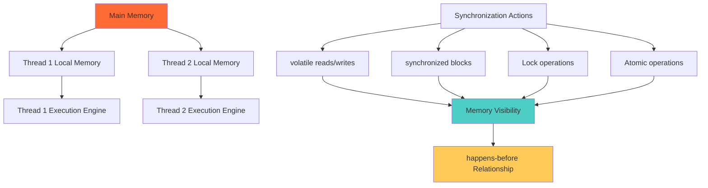
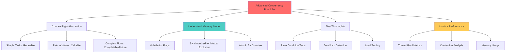

## 🎯 Introduction

Building upon our comprehensive overview of Java concurrency, this deep dive explores the fundamental building blocks that power Java's threading mechanisms. We'll dissect the internals of Runnable and Callable interfaces, examine thread synchronization primitives, understand the Java Memory Model, and explore advanced patterns that form the foundation of robust concurrent applications.

This technical deep dive is essential for developers who want to understand not just how to use Java's concurrency tools, but how they work under the hood and how to leverage them effectively in complex scenarios.

## 🔬 Runnable Interface: The Foundation of Java Threading

### 📋 Understanding Runnable Internals

The **Runnable** interface is the most fundamental abstraction for representing a task that can be executed by a thread. Let's examine its internal structure and behavior patterns.

```java
@FunctionalInterface
public interface Runnable {
    /**
     * When an object implementing interface <code>Runnable</code> is used
     * to create a thread, starting the thread causes the object's
     * <code>run</code> method to be called in that separately executing
     * thread.
     */
    public abstract void run();
}
```

#### 🔍 Deep Dive: Thread Execution Lifecycle

```mermaid
graph TD
    A[Thread.start() called] --> B[Thread enters RUNNABLE state]
    B --> C[Thread Scheduler assigns CPU]
    C --> D[run() method execution begins]
    D --> E{Exception thrown?}
    E -->|No| F[run() completes normally]
    E -->|Yes| G[UncaughtExceptionHandler called]
    F --> H[Thread enters TERMINATED state]
    G --> H

    I[Thread Interruption] --> J{Thread.isInterrupted()}
    J -->|true| K[InterruptedException handling]
    J -->|false| D

    style D fill:#4ecdc4
    style H fill:#ff6b35
    style K fill:#feca57
```

#### 🛠️ Advanced Runnable Patterns

**1. Interruptible Runnable Pattern:**
```java
public class InterruptibleTask implements Runnable {

    private final String taskName;
    private final AtomicBoolean cancelled = new AtomicBoolean(false);
    private volatile boolean running = false;

    public InterruptibleTask(String taskName) {
        this.taskName = taskName;
    }

    @Override
    public void run() {
        Thread currentThread = Thread.currentThread();
        running = true;

        try {
            while (!cancelled.get() && !currentThread.isInterrupted()) {
                // Check interruption status periodically
                if (currentThread.isInterrupted()) {
                    System.out.println(taskName + " was interrupted");
                    break;
                }

                // Simulate work that can be interrupted
                performInterruptibleWork();

                // Cooperative interruption check
                if (Thread.interrupted()) {
                    System.out.println(taskName + " detected interruption flag");
                    break;
                }
            }
        } catch (InterruptedException e) {
            System.out.println(taskName + " interrupted via exception");
            // Restore interrupt status
            currentThread.interrupt();
        } finally {
            running = false;
            cleanup();
        }
    }

    private void performInterruptibleWork() throws InterruptedException {
        for (int i = 0; i < 100; i++) {
            // Simulate CPU-intensive work
            Math.sqrt(i * Math.PI);

            // Periodic interruption check for CPU-intensive tasks
            if (i % 10 == 0 && Thread.currentThread().isInterrupted()) {
                throw new InterruptedException("Work interrupted at iteration " + i);
            }
        }

        // Simulate I/O or blocking operation that respects interruption
        Thread.sleep(50);
    }

    private void cleanup() {
        System.out.println(taskName + " performing cleanup");
        // Release resources, close connections, etc.
    }

    public void cancel() {
        cancelled.set(true);
    }

    public boolean isRunning() {
        return running;
    }
}
```

**2. Parameterized Runnable Pattern:**
```java
public class ParameterizedRunnable<T> implements Runnable {

    private final T parameter;
    private final Consumer<T> task;
    private final BiConsumer<T, Exception> errorHandler;
    private final Consumer<T> completionHandler;

    public ParameterizedRunnable(T parameter,
                               Consumer<T> task,
                               BiConsumer<T, Exception> errorHandler,
                               Consumer<T> completionHandler) {
        this.parameter = parameter;
        this.task = task;
        this.errorHandler = errorHandler;
        this.completionHandler = completionHandler;
    }

    @Override
    public void run() {
        String threadName = Thread.currentThread().getName();
        try {
            System.out.println("Thread " + threadName + " processing: " + parameter);
            task.accept(parameter);

            if (completionHandler != null) {
                completionHandler.accept(parameter);
            }

        } catch (Exception e) {
            if (errorHandler != null) {
                errorHandler.accept(parameter, e);
            } else {
                System.err.println("Error in thread " + threadName +
                    " processing " + parameter + ": " + e.getMessage());
            }
        }
    }

    // Factory methods for common patterns
    public static <T> ParameterizedRunnable<T> withLogging(T parameter, Consumer<T> task) {
        return new ParameterizedRunnable<>(
            parameter,
            task,
            (param, ex) -> System.err.println("Failed processing " + param + ": " + ex.getMessage()),
            param -> System.out.println("Completed processing " + param)
        );
    }

    public static <T> ParameterizedRunnable<T> withRetry(T parameter,
                                                       Consumer<T> task,
                                                       int maxRetries) {
        return new ParameterizedRunnable<>(
            parameter,
            createRetryingTask(task, maxRetries),
            (param, ex) -> System.err.println("Failed after " + maxRetries + " retries: " + ex.getMessage()),
            null
        );
    }

    private static <T> Consumer<T> createRetryingTask(Consumer<T> originalTask, int maxRetries) {
        return parameter -> {
            Exception lastException = null;
            for (int attempt = 1; attempt <= maxRetries; attempt++) {
                try {
                    originalTask.accept(parameter);
                    return; // Success
                } catch (Exception e) {
                    lastException = e;
                    if (attempt < maxRetries) {
                        try {
                            Thread.sleep(100 * attempt); // Exponential backoff
                        } catch (InterruptedException ie) {
                            Thread.currentThread().interrupt();
                            throw new RuntimeException("Interrupted during retry", ie);
                        }
                    }
                }
            }
            throw new RuntimeException("Failed after " + maxRetries + " attempts", lastException);
        };
    }
}
```

**3. State-Aware Runnable Pattern:**
```java
public class StatefulRunnable implements Runnable {

    public enum State {
        CREATED, RUNNING, PAUSED, CANCELLED, COMPLETED, FAILED
    }

    private volatile State currentState = State.CREATED;
    private final Object stateLock = new Object();
    private final CountDownLatch completionLatch = new CountDownLatch(1);

    private final String taskId;
    private final Runnable actualTask;
    private Exception failureException;

    public StatefulRunnable(String taskId, Runnable actualTask) {
        this.taskId = taskId;
        this.actualTask = actualTask;
    }

    @Override
    public void run() {
        synchronized (stateLock) {
            if (currentState != State.CREATED) {
                throw new IllegalStateException("Task has already been executed");
            }
            currentState = State.RUNNING;
        }

        try {
            actualTask.run();

            synchronized (stateLock) {
                if (currentState == State.RUNNING) {
                    currentState = State.COMPLETED;
                }
            }

        } catch (Exception e) {
            synchronized (stateLock) {
                currentState = State.FAILED;
                failureException = e;
            }
            throw e;

        } finally {
            completionLatch.countDown();
        }
    }

    public State getCurrentState() {
        synchronized (stateLock) {
            return currentState;
        }
    }

    public void pause() {
        synchronized (stateLock) {
            if (currentState == State.RUNNING) {
                currentState = State.PAUSED;
            }
        }
        // Note: Actual pause implementation would require cooperation from the task
    }

    public void cancel() {
        synchronized (stateLock) {
            if (currentState == State.CREATED || currentState == State.RUNNING || currentState == State.PAUSED) {
                currentState = State.CANCELLED;
            }
        }
    }

    public boolean waitForCompletion(long timeoutMs) throws InterruptedException {
        return completionLatch.await(timeoutMs, TimeUnit.MILLISECONDS);
    }

    public Exception getFailureException() {
        synchronized (stateLock) {
            return failureException;
        }
    }

    public String getTaskId() {
        return taskId;
    }
}
```

## 📞 Callable Interface: Advanced Task Execution

### 🔍 Callable Internals and Patterns

The **Callable** interface extends the concept of Runnable by adding return values and checked exception handling.

```java
@FunctionalInterface
public interface Callable<V> {
    /**
     * Computes a result, or throws an exception if unable to do so.
     */
    V call() throws Exception;
}
```

#### 🛠️ Advanced Callable Patterns

**1. Timeout-Aware Callable:**
```java
public class TimeoutAwareCallable<V> implements Callable<V> {

    private final Callable<V> delegate;
    private final long timeoutMs;
    private final V timeoutValue;
    private final boolean throwOnTimeout;

    public TimeoutAwareCallable(Callable<V> delegate, long timeoutMs, V timeoutValue) {
        this(delegate, timeoutMs, timeoutValue, false);
    }

    public TimeoutAwareCallable(Callable<V> delegate, long timeoutMs, boolean throwOnTimeout) {
        this(delegate, timeoutMs, null, throwOnTimeout);
    }

    private TimeoutAwareCallable(Callable<V> delegate, long timeoutMs, V timeoutValue, boolean throwOnTimeout) {
        this.delegate = delegate;
        this.timeoutMs = timeoutMs;
        this.timeoutValue = timeoutValue;
        this.throwOnTimeout = throwOnTimeout;
    }

    @Override
    public V call() throws Exception {
        ExecutorService executor = Executors.newSingleThreadExecutor();
        try {
            Future<V> future = executor.submit(delegate);
            return future.get(timeoutMs, TimeUnit.MILLISECONDS);

        } catch (TimeoutException e) {
            if (throwOnTimeout) {
                throw new CallableTimeoutException("Callable timed out after " + timeoutMs + "ms", e);
            }
            return timeoutValue;

        } finally {
            executor.shutdownNow();
        }
    }

    public static class CallableTimeoutException extends Exception {
        public CallableTimeoutException(String message, Throwable cause) {
            super(message, cause);
        }
    }
}
```

**2. Retry-Enabled Callable:**
```java
public class RetryableCallable<V> implements Callable<V> {

    private final Callable<V> delegate;
    private final int maxRetries;
    private final long retryDelayMs;
    private final double backoffMultiplier;
    private final Predicate<Exception> retryPredicate;

    public RetryableCallable(Callable<V> delegate, int maxRetries) {
        this(delegate, maxRetries, 1000, 2.0, ex -> true);
    }

    public RetryableCallable(Callable<V> delegate,
                           int maxRetries,
                           long retryDelayMs,
                           double backoffMultiplier,
                           Predicate<Exception> retryPredicate) {
        this.delegate = delegate;
        this.maxRetries = maxRetries;
        this.retryDelayMs = retryDelayMs;
        this.backoffMultiplier = backoffMultiplier;
        this.retryPredicate = retryPredicate;
    }

    @Override
    public V call() throws Exception {
        Exception lastException = null;
        long currentDelay = retryDelayMs;

        for (int attempt = 1; attempt <= maxRetries + 1; attempt++) {
            try {
                return delegate.call();

            } catch (Exception e) {
                lastException = e;

                // Don't retry if this is the last attempt or exception is not retryable
                if (attempt > maxRetries || !retryPredicate.test(e)) {
                    break;
                }

                System.out.println("Attempt " + attempt + " failed, retrying in " + currentDelay + "ms: " + e.getMessage());

                try {
                    Thread.sleep(currentDelay);
                } catch (InterruptedException ie) {
                    Thread.currentThread().interrupt();
                    throw new Exception("Interrupted during retry delay", ie);
                }

                currentDelay = (long) (currentDelay * backoffMultiplier);
            }
        }

        throw new Exception("Failed after " + (maxRetries + 1) + " attempts", lastException);
    }

    // Factory methods for common retry scenarios
    public static <V> RetryableCallable<V> withExponentialBackoff(Callable<V> delegate, int maxRetries) {
        return new RetryableCallable<>(delegate, maxRetries, 100, 2.0, ex -> true);
    }

    public static <V> RetryableCallable<V> forNetworkOperations(Callable<V> delegate) {
        return new RetryableCallable<>(
            delegate,
            3,
            500,
            2.0,
            ex -> ex instanceof IOException || ex instanceof SocketTimeoutException
        );
    }
}
```

**3. Cached Callable Pattern:**
```java
public class CachedCallable<V> implements Callable<V> {

    private final Callable<V> delegate;
    private final long cacheValidityMs;
    private final String cacheKey;

    private volatile CacheEntry<V> cachedResult;
    private final Object cacheLock = new Object();

    public CachedCallable(Callable<V> delegate, long cacheValidityMs, String cacheKey) {
        this.delegate = delegate;
        this.cacheValidityMs = cacheValidityMs;
        this.cacheKey = cacheKey;
    }

    @Override
    public V call() throws Exception {
        CacheEntry<V> current = cachedResult;

        // Fast path: check if cache is still valid
        if (current != null && current.isValid()) {
            return current.value;
        }

        // Slow path: need to compute new value
        synchronized (cacheLock) {
            // Double-check pattern
            current = cachedResult;
            if (current != null && current.isValid()) {
                return current.value;
            }

            try {
                V newValue = delegate.call();
                cachedResult = new CacheEntry<>(newValue, System.currentTimeMillis(), cacheValidityMs);
                return newValue;

            } catch (Exception e) {
                // Optionally return stale cache entry on error
                if (current != null) {
                    System.err.println("Returning stale cached value due to error: " + e.getMessage());
                    return current.value;
                }
                throw e;
            }
        }
    }

    public void invalidateCache() {
        synchronized (cacheLock) {
            cachedResult = null;
        }
    }

    public boolean isCacheValid() {
        CacheEntry<V> current = cachedResult;
        return current != null && current.isValid();
    }

    private static class CacheEntry<V> {
        private final V value;
        private final long timestamp;
        private final long validityMs;

        public CacheEntry(V value, long timestamp, long validityMs) {
            this.value = value;
            this.timestamp = timestamp;
            this.validityMs = validityMs;
        }

        public boolean isValid() {
            return System.currentTimeMillis() - timestamp < validityMs;
        }
    }
}
```

## 🧠 Java Memory Model and Thread Safety

### 🔍 Understanding the Java Memory Model

The Java Memory Model (JMM) defines how threads interact through memory and what behaviors are allowed in concurrent execution.



#### 🛠️ Memory Model Practical Examples

**1. Volatile Variables and Visibility:**
```java
public class VolatileExample {

    private volatile boolean running = true;
    private volatile int counter = 0;

    // Non-volatile variables for comparison
    private boolean nonVolatileRunning = true;
    private int nonVolatileCounter = 0;

    public void demonstrateVolatileVisibility() throws InterruptedException {
        // Worker thread that depends on volatile flag
        Thread worker = new Thread(() -> {
            int localCounter = 0;
            while (running) {  // volatile read ensures visibility
                localCounter++;
                counter++;     // volatile write ensures visibility

                if (localCounter % 1000000 == 0) {
                    System.out.println("Worker thread running, counter: " + counter);
                }
            }
            System.out.println("Worker thread stopped, final counter: " + counter);
        });

        // Controller thread that modifies the flag
        Thread controller = new Thread(() -> {
            try {
                Thread.sleep(2000);
                System.out.println("Controller stopping worker thread");
                running = false;  // volatile write ensures visibility
            } catch (InterruptedException e) {
                Thread.currentThread().interrupt();
            }
        });

        worker.start();
        controller.start();

        worker.join();
        controller.join();

        System.out.println("Final counter value: " + counter);
    }

    // Demonstration of non-volatile behavior (may not terminate!)
    public void demonstrateNonVolatileBehavior() {
        Thread worker = new Thread(() -> {
            while (nonVolatileRunning) {  // Non-volatile read - may not see updates!
                nonVolatileCounter++;
            }
            System.out.println("Non-volatile worker stopped");
        });

        Thread controller = new Thread(() -> {
            try {
                Thread.sleep(1000);
                nonVolatileRunning = false;  // Non-volatile write - may not be visible!
                System.out.println("Non-volatile flag set to false");
            } catch (InterruptedException e) {
                Thread.currentThread().interrupt();
            }
        });

        worker.start();
        controller.start();

        // Warning: This may run forever due to lack of visibility!
    }
}
```

**2. Synchronized Blocks and Memory Synchronization:**
```java
public class SynchronizedExample {

    private int sharedCounter = 0;
    private final Object counterLock = new Object();

    private final Map<String, Integer> sharedMap = new HashMap<>();
    private final ReadWriteLock mapLock = new ReentrantReadWriteLock();

    public void demonstrateSynchronizedBlocks() throws InterruptedException {
        int threadCount = 10;
        int incrementsPerThread = 1000;

        List<Thread> threads = new ArrayList<>();

        for (int i = 0; i < threadCount; i++) {
            Thread t = new Thread(() -> {
                for (int j = 0; j < incrementsPerThread; j++) {
                    incrementCounterSafely();
                }
            });
            threads.add(t);
        }

        long startTime = System.nanoTime();

        // Start all threads
        for (Thread t : threads) {
            t.start();
        }

        // Wait for all threads to complete
        for (Thread t : threads) {
            t.join();
        }

        long duration = System.nanoTime() - startTime;

        System.out.println("Final counter value: " + sharedCounter);
        System.out.println("Expected value: " + (threadCount * incrementsPerThread));
        System.out.println("Duration: " + duration / 1_000_000 + " ms");
    }

    private void incrementCounterSafely() {
        synchronized (counterLock) {
            // Critical section - only one thread can execute this at a time
            int temp = sharedCounter;
            temp = temp + 1;
            sharedCounter = temp;

            // Memory synchronization happens at the end of synchronized block
        }
        // happens-before relationship established with subsequent synchronized blocks
    }

    public void demonstrateReadWriteLocks() throws InterruptedException {
        int readerCount = 5;
        int writerCount = 2;

        CountDownLatch startLatch = new CountDownLatch(1);
        CountDownLatch completionLatch = new CountDownLatch(readerCount + writerCount);

        // Reader threads
        for (int i = 0; i < readerCount; i++) {
            final int readerId = i;
            Thread reader = new Thread(() -> {
                try {
                    startLatch.await();

                    for (int j = 0; j < 10; j++) {
                        readFromMap("reader-" + readerId + "-key-" + j);
                        Thread.sleep(10);
                    }

                } catch (InterruptedException e) {
                    Thread.currentThread().interrupt();
                } finally {
                    completionLatch.countDown();
                }
            });
            reader.start();
        }

        // Writer threads
        for (int i = 0; i < writerCount; i++) {
            final int writerId = i;
            Thread writer = new Thread(() -> {
                try {
                    startLatch.await();

                    for (int j = 0; j < 5; j++) {
                        writeToMap("writer-" + writerId + "-key-" + j, j);
                        Thread.sleep(50);
                    }

                } catch (InterruptedException e) {
                    Thread.currentThread().interrupt();
                } finally {
                    completionLatch.countDown();
                }
            });
            writer.start();
        }

        startLatch.countDown(); // Start all threads
        completionLatch.await(); // Wait for completion

        System.out.println("Map size after concurrent operations: " + sharedMap.size());
    }

    private Integer readFromMap(String key) {
        mapLock.readLock().lock();
        try {
            Integer value = sharedMap.get(key);
            System.out.println(Thread.currentThread().getName() + " read: " + key + " = " + value);
            return value;
        } finally {
            mapLock.readLock().unlock();
        }
    }

    private void writeToMap(String key, Integer value) {
        mapLock.writeLock().lock();
        try {
            sharedMap.put(key, value);
            System.out.println(Thread.currentThread().getName() + " wrote: " + key + " = " + value);
        } finally {
            mapLock.writeLock().unlock();
        }
    }
}
```

## 🔄 Advanced Synchronization Patterns

### 🚦 CountDownLatch Pattern

```java
public class CountDownLatchExample {

    public void demonstrateServiceStartup() throws InterruptedException {
        int serviceCount = 5;
        CountDownLatch startupLatch = new CountDownLatch(serviceCount);
        CountDownLatch readyLatch = new CountDownLatch(1);

        List<ServiceSimulator> services = new ArrayList<>();

        // Create and start services
        for (int i = 0; i < serviceCount; i++) {
            ServiceSimulator service = new ServiceSimulator("Service-" + i, startupLatch, readyLatch);
            services.add(service);
            new Thread(service).start();
        }

        System.out.println("Waiting for all services to start...");

        // Wait for all services to be ready
        startupLatch.await();

        System.out.println("All services started! Signaling ready state...");

        // Signal all services to begin processing
        readyLatch.countDown();

        // Wait a bit to see services processing
        Thread.sleep(3000);

        // Shutdown services
        services.forEach(ServiceSimulator::shutdown);
    }

    private static class ServiceSimulator implements Runnable {
        private final String serviceName;
        private final CountDownLatch startupLatch;
        private final CountDownLatch readyLatch;
        private volatile boolean running = true;

        public ServiceSimulator(String serviceName, CountDownLatch startupLatch, CountDownLatch readyLatch) {
            this.serviceName = serviceName;
            this.startupLatch = startupLatch;
            this.readyLatch = readyLatch;
        }

        @Override
        public void run() {
            try {
                // Simulate startup time
                Thread.sleep((long) (Math.random() * 2000) + 500);

                System.out.println(serviceName + " started and ready");
                startupLatch.countDown();

                // Wait for all services to be ready
                readyLatch.await();

                // Begin processing
                System.out.println(serviceName + " beginning processing");

                while (running) {
                    // Simulate work
                    Thread.sleep(500);
                    System.out.println(serviceName + " processing...");
                }

                System.out.println(serviceName + " shutting down");

            } catch (InterruptedException e) {
                Thread.currentThread().interrupt();
                System.out.println(serviceName + " interrupted");
            }
        }

        public void shutdown() {
            running = false;
        }
    }
}
```

### 🔄 CyclicBarrier Pattern

```java
public class CyclicBarrierExample {

    public void demonstrateMultiPhaseComputation() throws InterruptedException, BrokenBarrierException {
        int workerCount = 4;
        int phaseCount = 3;

        CyclicBarrier phaseBarrier = new CyclicBarrier(workerCount, () -> {
            System.out.println("Phase completed by all workers!");
        });

        CountDownLatch completionLatch = new CountDownLatch(workerCount);

        for (int i = 0; i < workerCount; i++) {
            final int workerId = i;
            Thread worker = new Thread(new PhaseWorker(workerId, phaseCount, phaseBarrier, completionLatch));
            worker.start();
        }

        completionLatch.await();
        System.out.println("All workers completed all phases!");
    }

    private static class PhaseWorker implements Runnable {
        private final int workerId;
        private final int phaseCount;
        private final CyclicBarrier barrier;
        private final CountDownLatch completionLatch;

        public PhaseWorker(int workerId, int phaseCount, CyclicBarrier barrier, CountDownLatch completionLatch) {
            this.workerId = workerId;
            this.phaseCount = phaseCount;
            this.barrier = barrier;
            this.completionLatch = completionLatch;
        }

        @Override
        public void run() {
            try {
                for (int phase = 1; phase <= phaseCount; phase++) {
                    // Simulate work for this phase
                    long workTime = (long) (Math.random() * 1000) + 500;
                    Thread.sleep(workTime);

                    System.out.println("Worker " + workerId + " completed phase " + phase +
                        " (took " + workTime + "ms)");

                    // Wait for all workers to complete this phase
                    barrier.await();

                    System.out.println("Worker " + workerId + " proceeding to next phase");
                }

                System.out.println("Worker " + workerId + " finished all phases");

            } catch (InterruptedException | BrokenBarrierException e) {
                System.err.println("Worker " + workerId + " interrupted: " + e.getMessage());
                Thread.currentThread().interrupt();
            } finally {
                completionLatch.countDown();
            }
        }
    }
}
```

### 🎫 Semaphore Pattern

```java
public class SemaphoreExample {

    private final Semaphore connectionPool;
    private final List<Connection> connections;
    private final Queue<Connection> availableConnections;

    public SemaphoreExample(int poolSize) {
        this.connectionPool = new Semaphore(poolSize, true); // Fair semaphore
        this.connections = new ArrayList<>();
        this.availableConnections = new ConcurrentLinkedQueue<>();

        // Initialize connection pool
        for (int i = 0; i < poolSize; i++) {
            Connection conn = new MockConnection("Connection-" + i);
            connections.add(conn);
            availableConnections.offer(conn);
        }
    }

    public Connection acquireConnection() throws InterruptedException {
        connectionPool.acquire(); // Wait for available permit

        Connection connection = availableConnections.poll();
        if (connection == null) {
            // This shouldn't happen if semaphore is working correctly
            throw new IllegalStateException("No connection available despite acquired permit");
        }

        System.out.println(Thread.currentThread().getName() + " acquired " + connection.getId());
        return connection;
    }

    public Connection acquireConnectionWithTimeout(long timeoutMs) throws InterruptedException {
        boolean acquired = connectionPool.tryAcquire(timeoutMs, TimeUnit.MILLISECONDS);
        if (!acquired) {
            throw new RuntimeException("Could not acquire connection within " + timeoutMs + "ms");
        }

        Connection connection = availableConnections.poll();
        if (connection == null) {
            connectionPool.release(); // Release permit if no connection available
            throw new IllegalStateException("No connection available despite acquired permit");
        }

        System.out.println(Thread.currentThread().getName() + " acquired " + connection.getId() + " with timeout");
        return connection;
    }

    public void releaseConnection(Connection connection) {
        if (connection != null && connections.contains(connection)) {
            availableConnections.offer(connection);
            connectionPool.release();
            System.out.println(Thread.currentThread().getName() + " released " + connection.getId());
        }
    }

    public int getAvailableConnections() {
        return connectionPool.availablePermits();
    }

    public void demonstrateConnectionPool() throws InterruptedException {
        int clientCount = 10;
        CountDownLatch completionLatch = new CountDownLatch(clientCount);

        for (int i = 0; i < clientCount; i++) {
            final int clientId = i;
            Thread client = new Thread(() -> {
                try {
                    // Acquire connection
                    Connection conn = acquireConnection();

                    // Simulate work with connection
                    Thread.sleep((long) (Math.random() * 2000) + 500);

                    // Release connection
                    releaseConnection(conn);

                } catch (InterruptedException e) {
                    Thread.currentThread().interrupt();
                    System.err.println("Client " + clientId + " interrupted");
                } finally {
                    completionLatch.countDown();
                }
            }, "Client-" + clientId);

            client.start();
        }

        completionLatch.await();
        System.out.println("All clients completed. Available connections: " + getAvailableConnections());
    }

    // Mock connection class for demonstration
    private static class MockConnection implements Connection {
        private final String id;

        public MockConnection(String id) {
            this.id = id;
        }

        public String getId() {
            return id;
        }

        // Implement other Connection methods as no-ops for demo
        @Override public Statement createStatement() { return null; }
        @Override public PreparedStatement prepareStatement(String sql) { return null; }
        @Override public CallableStatement prepareCall(String sql) { return null; }
        @Override public String nativeSQL(String sql) { return null; }
        @Override public void setAutoCommit(boolean autoCommit) {}
        @Override public boolean getAutoCommit() { return false; }
        @Override public void commit() {}
        @Override public void rollback() {}
        @Override public void close() {}
        @Override public boolean isClosed() { return false; }
        // ... other methods omitted for brevity
    }
}
```

## 🧪 Testing Concurrent Code

### 🔍 Concurrency Testing Strategies

```java
@Component
public class ConcurrencyTestingExample {

    private final AtomicInteger concurrentCounter = new AtomicInteger(0);
    private int nonAtomicCounter = 0;
    private final Object counterLock = new Object();

    /**
     * Test race conditions with high contention
     */
    public void testRaceConditions() throws InterruptedException {
        int threadCount = 100;
        int incrementsPerThread = 1000;
        int expectedTotal = threadCount * incrementsPerThread;

        // Test 1: Non-atomic counter (will have race conditions)
        testNonAtomicCounter(threadCount, incrementsPerThread, expectedTotal);

        // Test 2: Atomic counter (should be correct)
        testAtomicCounter(threadCount, incrementsPerThread, expectedTotal);

        // Test 3: Synchronized counter (should be correct but slower)
        testSynchronizedCounter(threadCount, incrementsPerThread, expectedTotal);
    }

    private void testNonAtomicCounter(int threadCount, int incrementsPerThread, int expectedTotal)
            throws InterruptedException {

        nonAtomicCounter = 0;
        CountDownLatch startLatch = new CountDownLatch(1);
        CountDownLatch completionLatch = new CountDownLatch(threadCount);

        List<Thread> threads = new ArrayList<>();

        for (int i = 0; i < threadCount; i++) {
            Thread t = new Thread(() -> {
                try {
                    startLatch.await(); // Wait for all threads to be ready

                    for (int j = 0; j < incrementsPerThread; j++) {
                        nonAtomicCounter++; // Race condition here!
                    }

                } catch (InterruptedException e) {
                    Thread.currentThread().interrupt();
                } finally {
                    completionLatch.countDown();
                }
            });
            threads.add(t);
            t.start();
        }

        long startTime = System.nanoTime();
        startLatch.countDown(); // Start all threads simultaneously
        completionLatch.await(); // Wait for completion
        long duration = System.nanoTime() - startTime;

        System.out.println("Non-atomic counter test:");
        System.out.println("  Expected: " + expectedTotal);
        System.out.println("  Actual: " + nonAtomicCounter);
        System.out.println("  Lost increments: " + (expectedTotal - nonAtomicCounter));
        System.out.println("  Duration: " + duration / 1_000_000 + " ms");
        System.out.println();
    }

    private void testAtomicCounter(int threadCount, int incrementsPerThread, int expectedTotal)
            throws InterruptedException {

        concurrentCounter.set(0);
        CountDownLatch startLatch = new CountDownLatch(1);
        CountDownLatch completionLatch = new CountDownLatch(threadCount);

        List<Thread> threads = new ArrayList<>();

        for (int i = 0; i < threadCount; i++) {
            Thread t = new Thread(() -> {
                try {
                    startLatch.await();

                    for (int j = 0; j < incrementsPerThread; j++) {
                        concurrentCounter.incrementAndGet(); // Thread-safe atomic operation
                    }

                } catch (InterruptedException e) {
                    Thread.currentThread().interrupt();
                } finally {
                    completionLatch.countDown();
                }
            });
            threads.add(t);
            t.start();
        }

        long startTime = System.nanoTime();
        startLatch.countDown();
        completionLatch.await();
        long duration = System.nanoTime() - startTime;

        System.out.println("Atomic counter test:");
        System.out.println("  Expected: " + expectedTotal);
        System.out.println("  Actual: " + concurrentCounter.get());
        System.out.println("  Correct: " + (concurrentCounter.get() == expectedTotal));
        System.out.println("  Duration: " + duration / 1_000_000 + " ms");
        System.out.println();
    }

    private void testSynchronizedCounter(int threadCount, int incrementsPerThread, int expectedTotal)
            throws InterruptedException {

        int synchronizedCounter = 0;
        CountDownLatch startLatch = new CountDownLatch(1);
        CountDownLatch completionLatch = new CountDownLatch(threadCount);
        AtomicInteger syncCounter = new AtomicInteger(0);

        List<Thread> threads = new ArrayList<>();

        for (int i = 0; i < threadCount; i++) {
            Thread t = new Thread(() -> {
                try {
                    startLatch.await();

                    for (int j = 0; j < incrementsPerThread; j++) {
                        synchronized (counterLock) {
                            syncCounter.incrementAndGet();
                        }
                    }

                } catch (InterruptedException e) {
                    Thread.currentThread().interrupt();
                } finally {
                    completionLatch.countDown();
                }
            });
            threads.add(t);
            t.start();
        }

        long startTime = System.nanoTime();
        startLatch.countDown();
        completionLatch.await();
        long duration = System.nanoTime() - startTime;

        System.out.println("Synchronized counter test:");
        System.out.println("  Expected: " + expectedTotal);
        System.out.println("  Actual: " + syncCounter.get());
        System.out.println("  Correct: " + (syncCounter.get() == expectedTotal));
        System.out.println("  Duration: " + duration / 1_000_000 + " ms");
        System.out.println();
    }

    /**
     * Test for deadlock detection
     */
    public void testDeadlockScenario() throws InterruptedException {
        Object lock1 = new Object();
        Object lock2 = new Object();
        CountDownLatch deadlockLatch = new CountDownLatch(2);

        // Thread 1: acquires lock1, then tries to acquire lock2
        Thread thread1 = new Thread(() -> {
            synchronized (lock1) {
                System.out.println("Thread 1: Acquired lock1");

                try {
                    Thread.sleep(100); // Give thread2 time to acquire lock2
                } catch (InterruptedException e) {
                    Thread.currentThread().interrupt();
                    return;
                }

                System.out.println("Thread 1: Trying to acquire lock2");
                synchronized (lock2) {
                    System.out.println("Thread 1: Acquired lock2");
                }
            }
            deadlockLatch.countDown();
        });

        // Thread 2: acquires lock2, then tries to acquire lock1
        Thread thread2 = new Thread(() -> {
            synchronized (lock2) {
                System.out.println("Thread 2: Acquired lock2");

                try {
                    Thread.sleep(100); // Give thread1 time to acquire lock1
                } catch (InterruptedException e) {
                    Thread.currentThread().interrupt();
                    return;
                }

                System.out.println("Thread 2: Trying to acquire lock1");
                synchronized (lock1) {
                    System.out.println("Thread 2: Acquired lock1");
                }
            }
            deadlockLatch.countDown();
        });

        thread1.start();
        thread2.start();

        // Wait for potential deadlock with timeout
        boolean completed = deadlockLatch.await(5, TimeUnit.SECONDS);

        if (!completed) {
            System.out.println("Deadlock detected! Threads did not complete within timeout.");

            // Interrupt threads to break deadlock
            thread1.interrupt();
            thread2.interrupt();
        } else {
            System.out.println("No deadlock - both threads completed successfully.");
        }
    }
}
```

## 📊 Performance Analysis Tools

### 🔍 Benchmarking Concurrent Operations

```java
@Component
public class ConcurrencyBenchmark {

    private static final int OPERATIONS_COUNT = 1_000_000;

    public void benchmarkConcurrencyMechanisms() {
        System.out.println("Benchmarking concurrency mechanisms with " + OPERATIONS_COUNT + " operations...\n");

        benchmarkAtomicOperations();
        benchmarkSynchronizedOperations();
        benchmarkLockOperations();
        benchmarkVolatileOperations();
    }

    private void benchmarkAtomicOperations() {
        AtomicInteger atomicCounter = new AtomicInteger(0);

        long startTime = System.nanoTime();

        IntStream.range(0, OPERATIONS_COUNT)
            .parallel()
            .forEach(i -> atomicCounter.incrementAndGet());

        long duration = System.nanoTime() - startTime;

        System.out.println("Atomic Operations Benchmark:");
        System.out.println("  Operations: " + OPERATIONS_COUNT);
        System.out.println("  Final value: " + atomicCounter.get());
        System.out.println("  Duration: " + duration / 1_000_000 + " ms");
        System.out.println("  Ops/second: " + (OPERATIONS_COUNT * 1_000_000_000L / duration));
        System.out.println();
    }

    private void benchmarkSynchronizedOperations() {
        Counter synchronizedCounter = new SynchronizedCounter();

        long startTime = System.nanoTime();

        IntStream.range(0, OPERATIONS_COUNT)
            .parallel()
            .forEach(i -> synchronizedCounter.increment());

        long duration = System.nanoTime() - startTime;

        System.out.println("Synchronized Operations Benchmark:");
        System.out.println("  Operations: " + OPERATIONS_COUNT);
        System.out.println("  Final value: " + synchronizedCounter.getValue());
        System.out.println("  Duration: " + duration / 1_000_000 + " ms");
        System.out.println("  Ops/second: " + (OPERATIONS_COUNT * 1_000_000_000L / duration));
        System.out.println();
    }

    private void benchmarkLockOperations() {
        Counter lockCounter = new LockCounter();

        long startTime = System.nanoTime();

        IntStream.range(0, OPERATIONS_COUNT)
            .parallel()
            .forEach(i -> lockCounter.increment());

        long duration = System.nanoTime() - startTime;

        System.out.println("Lock Operations Benchmark:");
        System.out.println("  Operations: " + OPERATIONS_COUNT);
        System.out.println("  Final value: " + lockCounter.getValue());
        System.out.println("  Duration: " + duration / 1_000_000 + " ms");
        System.out.println("  Ops/second: " + (OPERATIONS_COUNT * 1_000_000_000L / duration));
        System.out.println();
    }

    private void benchmarkVolatileOperations() {
        VolatileCounter volatileCounter = new VolatileCounter();

        long startTime = System.nanoTime();

        // Note: This will have race conditions, but we're testing volatile performance
        IntStream.range(0, OPERATIONS_COUNT)
            .parallel()
            .forEach(i -> volatileCounter.increment());

        long duration = System.nanoTime() - startTime;

        System.out.println("Volatile Operations Benchmark (with race conditions):");
        System.out.println("  Operations: " + OPERATIONS_COUNT);
        System.out.println("  Final value: " + volatileCounter.getValue());
        System.out.println("  Lost increments: " + (OPERATIONS_COUNT - volatileCounter.getValue()));
        System.out.println("  Duration: " + duration / 1_000_000 + " ms");
        System.out.println("  Ops/second: " + (OPERATIONS_COUNT * 1_000_000_000L / duration));
        System.out.println();
    }

    interface Counter {
        void increment();
        int getValue();
    }

    static class SynchronizedCounter implements Counter {
        private int value = 0;

        @Override
        public synchronized void increment() {
            value++;
        }

        @Override
        public synchronized int getValue() {
            return value;
        }
    }

    static class LockCounter implements Counter {
        private int value = 0;
        private final ReentrantLock lock = new ReentrantLock();

        @Override
        public void increment() {
            lock.lock();
            try {
                value++;
            } finally {
                lock.unlock();
            }
        }

        @Override
        public int getValue() {
            lock.lock();
            try {
                return value;
            } finally {
                lock.unlock();
            }
        }
    }

    static class VolatileCounter implements Counter {
        private volatile int value = 0;

        @Override
        public void increment() {
            value++; // Race condition! Not atomic despite volatile
        }

        @Override
        public int getValue() {
            return value;
        }
    }
}
```

## 🎯 Conclusion and Advanced Patterns Summary

### 🏆 Key Takeaways from Deep Dive

This comprehensive deep dive into Java concurrency fundamentals reveals several critical insights:

1. **Runnable Patterns**: Beyond simple task execution, advanced patterns like interruptible, parameterized, and stateful runnables provide robust foundations for complex concurrent systems.

2. **Callable Advanced Usage**: Timeout-aware, retry-enabled, and cached callables demonstrate how to build resilient distributed systems with proper error handling and performance optimization.

3. **Memory Model Mastery**: Understanding the Java Memory Model is crucial for writing correct concurrent code, especially regarding visibility, ordering, and synchronization.

4. **Synchronization Mechanisms**: Different synchronization primitives serve different purposes - choose based on contention patterns, performance requirements, and complexity needs.

### 🚀 Best Practices for Advanced Concurrency



By mastering these fundamental patterns and understanding their internal mechanisms, you can build highly efficient, scalable, and maintainable concurrent Java applications. Remember that concurrency is not just about making things run in parallel - it's about designing systems that can safely and efficiently coordinate multiple simultaneous operations while maintaining correctness and performance.

The patterns and techniques covered in this deep dive form the foundation for more advanced concurrency concepts like reactive programming, actor models, and distributed computing frameworks. Master these basics first, and you'll be well-equipped to tackle any concurrent programming challenge in Java.