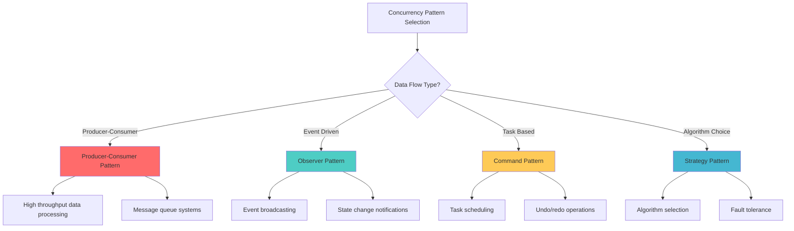

## 🎯 Introduction

Building upon our deep dive into Java concurrency fundamentals, this third part explores how classic design patterns can be elegantly implemented using thread interfaces. We'll examine how Runnable, Callable, and other concurrency primitives can be combined with design patterns to create robust, scalable, and maintainable concurrent systems.

This guide demonstrates practical implementations of essential design patterns in concurrent environments, showing how threading interfaces enhance traditional patterns while addressing the unique challenges of multi-threaded programming.

## 🏭 Producer-Consumer Pattern

### 📋 Pattern Overview

The Producer-Consumer pattern is fundamental in concurrent programming, allowing producers to generate data while consumers process it independently, with proper synchronization and buffering.

```mermaid
graph TD
    A[Producer Threads] --> B[Shared Buffer/Queue]
    B --> C[Consumer Threads]

    D[Producer 1] --> E[BlockingQueue]
    F[Producer 2] --> E
    G[Producer 3] --> E

    E --> H[Consumer 1]
    E --> I[Consumer 2]
    E --> J[Consumer 3]

    K[Synchronization] --> L[put() blocks when full]
    K --> M[take() blocks when empty]
    K --> N[Thread-safe operations]

    style A fill:#ff6b6b
    style C fill:#4ecdc4
    style E fill:#feca57
```

### 🛠️ Implementation with Thread Interfaces

**1. Basic Producer-Consumer with BlockingQueue:**

```java
public class ProducerConsumerPattern {

    private final BlockingQueue<Task> taskQueue;
    private final AtomicBoolean shutdown = new AtomicBoolean(false);
    private final List<Thread> producerThreads = new ArrayList<>();
    private final List<Thread> consumerThreads = new ArrayList<>();

    public ProducerConsumerPattern(int queueCapacity) {
        this.taskQueue = new ArrayBlockingQueue<>(queueCapacity);
    }

    // Producer implementation using Runnable
    public class Producer implements Runnable {
        private final String producerId;
        private final TaskGenerator taskGenerator;
        private final int productionRate;

        public Producer(String producerId, TaskGenerator taskGenerator, int productionRate) {
            this.producerId = producerId;
            this.taskGenerator = taskGenerator;
            this.productionRate = productionRate;
        }

        @Override
        public void run() {
            try {
                while (!shutdown.get() && !Thread.currentThread().isInterrupted()) {
                    Task task = taskGenerator.generateTask();

                    // Blocking put - waits if queue is full
                    boolean offered = taskQueue.offer(task, 1, TimeUnit.SECONDS);

                    if (offered) {
                        System.out.println(producerId + " produced: " + task);
                    } else {
                        System.out.println(producerId + " queue full, task rejected: " + task);
                    }

                    // Control production rate
                    Thread.sleep(1000 / productionRate);
                }
            } catch (InterruptedException e) {
                Thread.currentThread().interrupt();
                System.out.println(producerId + " interrupted");
            }
            System.out.println(producerId + " shutdown");
        }
    }

    // Consumer implementation using Runnable
    public class Consumer implements Runnable {
        private final String consumerId;
        private final TaskProcessor taskProcessor;

        public Consumer(String consumerId, TaskProcessor taskProcessor) {
            this.consumerId = consumerId;
            this.taskProcessor = taskProcessor;
        }

        @Override
        public void run() {
            try {
                while (!shutdown.get() || !taskQueue.isEmpty()) {
                    // Blocking take - waits if queue is empty
                    Task task = taskQueue.poll(1, TimeUnit.SECONDS);

                    if (task != null) {
                        System.out.println(consumerId + " consuming: " + task);
                        taskProcessor.processTask(task);
                        System.out.println(consumerId + " completed: " + task);
                    }
                }
            } catch (InterruptedException e) {
                Thread.currentThread().interrupt();
                System.out.println(consumerId + " interrupted");
            }
            System.out.println(consumerId + " shutdown");
        }
    }

    // Start the producer-consumer system
    public void start(int producerCount, int consumerCount) {
        // Start producers
        for (int i = 0; i < producerCount; i++) {
            Producer producer = new Producer(
                "Producer-" + i,
                new RandomTaskGenerator(),
                2 // 2 tasks per second
            );
            Thread producerThread = new Thread(producer);
            producerThreads.add(producerThread);
            producerThread.start();
        }

        // Start consumers
        for (int i = 0; i < consumerCount; i++) {
            Consumer consumer = new Consumer(
                "Consumer-" + i,
                new DefaultTaskProcessor()
            );
            Thread consumerThread = new Thread(consumer);
            consumerThreads.add(consumerThread);
            consumerThread.start();
        }
    }

    public void shutdown() throws InterruptedException {
        shutdown.set(true);

        // Wait for producers to finish
        for (Thread producer : producerThreads) {
            producer.join();
        }

        // Wait for consumers to finish processing remaining tasks
        for (Thread consumer : consumerThreads) {
            consumer.join();
        }

        System.out.println("All threads shutdown. Remaining tasks: " + taskQueue.size());
    }

    // Supporting classes
    public static class Task {
        private final String id;
        private final String data;
        private final long timestamp;

        public Task(String id, String data) {
            this.id = id;
            this.data = data;
            this.timestamp = System.currentTimeMillis();
        }

        @Override
        public String toString() {
            return "Task{id='" + id + "', data='" + data + "'}";
        }

        // Getters
        public String getId() { return id; }
        public String getData() { return data; }
        public long getTimestamp() { return timestamp; }
    }

    public interface TaskGenerator {
        Task generateTask();
    }

    public interface TaskProcessor {
        void processTask(Task task) throws InterruptedException;
    }

    public static class RandomTaskGenerator implements TaskGenerator {
        private final AtomicInteger counter = new AtomicInteger(0);
        private final Random random = new Random();

        @Override
        public Task generateTask() {
            return new Task(
                "TASK-" + counter.incrementAndGet(),
                "Data-" + random.nextInt(1000)
            );
        }
    }

    public static class DefaultTaskProcessor implements TaskProcessor {
        @Override
        public void processTask(Task task) throws InterruptedException {
            // Simulate processing time
            Thread.sleep(100 + (long)(Math.random() * 200));
        }
    }
}
```

**2. Advanced Producer-Consumer with Callable Results:**

```java
public class AsyncProducerConsumerPattern {

    private final BlockingQueue<Future<ProcessingResult>> resultQueue;
    private final ExecutorService producerExecutor;
    private final ExecutorService consumerExecutor;
    private final CompletionService<ProcessingResult> completionService;

    public AsyncProducerConsumerPattern(int poolSize) {
        this.resultQueue = new LinkedBlockingQueue<>();
        this.producerExecutor = Executors.newFixedThreadPool(poolSize);
        this.consumerExecutor = Executors.newFixedThreadPool(poolSize);
        this.completionService = new ExecutorCompletionService<>(consumerExecutor);
    }

    // Producer that submits Callable tasks
    public class AsyncProducer implements Runnable {
        private final String producerId;
        private final List<ProcessingTask> tasksToProcess;

        public AsyncProducer(String producerId, List<ProcessingTask> tasksToProcess) {
            this.producerId = producerId;
            this.tasksToProcess = tasksToProcess;
        }

        @Override
        public void run() {
            for (ProcessingTask task : tasksToProcess) {
                // Submit Callable task to completion service
                Future<ProcessingResult> future = completionService.submit(new ProcessingCallable(task));

                try {
                    resultQueue.put(future);
                    System.out.println(producerId + " submitted task: " + task.getId());
                } catch (InterruptedException e) {
                    Thread.currentThread().interrupt();
                    break;
                }
            }
        }
    }

    // Consumer that processes Future results
    public class AsyncConsumer implements Runnable {
        private final String consumerId;
        private final int expectedResults;

        public AsyncConsumer(String consumerId, int expectedResults) {
            this.consumerId = consumerId;
            this.expectedResults = expectedResults;
        }

        @Override
        public void run() {
            int processedCount = 0;

            while (processedCount < expectedResults) {
                try {
                    // Get completed future from completion service
                    Future<ProcessingResult> completedFuture = completionService.take();
                    ProcessingResult result = completedFuture.get();

                    System.out.println(consumerId + " processed result: " + result);
                    processedCount++;

                } catch (InterruptedException e) {
                    Thread.currentThread().interrupt();
                    break;
                } catch (ExecutionException e) {
                    System.err.println(consumerId + " execution error: " + e.getCause());
                }
            }

            System.out.println(consumerId + " completed processing " + processedCount + " results");
        }
    }

    // Callable implementation for processing tasks
    public static class ProcessingCallable implements Callable<ProcessingResult> {
        private final ProcessingTask task;

        public ProcessingCallable(ProcessingTask task) {
            this.task = task;
        }

        @Override
        public ProcessingResult call() throws Exception {
            // Simulate complex processing
            Thread.sleep((long)(Math.random() * 1000) + 500);

            if (Math.random() < 0.1) { // 10% failure rate
                throw new ProcessingException("Processing failed for task: " + task.getId());
            }

            return new ProcessingResult(
                task.getId(),
                "Processed: " + task.getData(),
                System.currentTimeMillis()
            );
        }
    }

    // Supporting classes
    public static class ProcessingTask {
        private final String id;
        private final String data;

        public ProcessingTask(String id, String data) {
            this.id = id;
            this.data = data;
        }

        public String getId() { return id; }
        public String getData() { return data; }

        @Override
        public String toString() {
            return "ProcessingTask{id='" + id + "', data='" + data + "'}";
        }
    }

    public static class ProcessingResult {
        private final String taskId;
        private final String result;
        private final long completedAt;

        public ProcessingResult(String taskId, String result, long completedAt) {
            this.taskId = taskId;
            this.result = result;
            this.completedAt = completedAt;
        }

        @Override
        public String toString() {
            return "ProcessingResult{taskId='" + taskId + "', result='" + result + "'}";
        }
    }

    public static class ProcessingException extends Exception {
        public ProcessingException(String message) {
            super(message);
        }
    }

    public void shutdown() {
        producerExecutor.shutdown();
        consumerExecutor.shutdown();
    }
}
```

### ✅ Pros and Cons

**✅ Advantages:**
- **Decoupling**: Producers and consumers operate independently
- **Scalability**: Easy to add more producers or consumers
- **Buffering**: Queue provides buffer for rate differences
- **Fault Tolerance**: Failure in one component doesn't affect others

**❌ Disadvantages:**
- **Memory Usage**: Queue can consume significant memory
- **Complexity**: Requires careful thread management
- **Backpressure**: Need to handle queue overflow scenarios
- **Latency**: Queuing introduces processing delays

**🎯 Use Cases:**
- Web server request processing
- Log processing systems
- Message queue implementations
- Data streaming applications

## 👁️ Observer Pattern

### 📋 Pattern Overview

The Observer pattern allows objects to notify multiple observers about state changes, particularly useful in concurrent environments for event-driven architectures.

```mermaid
graph TD
    A[Subject/Observable] --> B[Observer 1]
    A --> C[Observer 2]
    A --> D[Observer 3]
    A --> E[Observer N]

    F[State Change] --> G[notifyObservers()]
    G --> H[Concurrent Notification]

    H --> I[Observer Thread 1]
    H --> J[Observer Thread 2]
    H --> K[Observer Thread 3]

    style A fill:#ff6b6b
    style H fill:#4ecdc4
    style F fill:#feca57
```

### 🛠️ Implementation with Thread Interfaces

**1. Concurrent Observer with Runnable:**

```java
public class ConcurrentObserverPattern<T> {

    private final List<Observer<T>> observers = new CopyOnWriteArrayList<>();
    private final ExecutorService notificationExecutor;
    private final AtomicReference<T> currentState = new AtomicReference<>();

    public ConcurrentObserverPattern(int threadPoolSize) {
        this.notificationExecutor = Executors.newFixedThreadPool(threadPoolSize);
    }

    // Observer interface
    public interface Observer<T> {
        void onStateChanged(T newState, T oldState);
        String getObserverId();
    }

    // Observable subject methods
    public void addObserver(Observer<T> observer) {
        observers.add(observer);
        System.out.println("Added observer: " + observer.getObserverId());
    }

    public void removeObserver(Observer<T> observer) {
        observers.remove(observer);
        System.out.println("Removed observer: " + observer.getObserverId());
    }

    public void setState(T newState) {
        T oldState = currentState.getAndSet(newState);
        notifyObservers(newState, oldState);
    }

    public T getState() {
        return currentState.get();
    }

    // Concurrent notification using Runnable
    private void notifyObservers(T newState, T oldState) {
        for (Observer<T> observer : observers) {
            // Each observer notification runs in its own thread
            notificationExecutor.submit(new ObserverNotificationTask(observer, newState, oldState));
        }
    }

    // Runnable implementation for observer notifications
    private class ObserverNotificationTask implements Runnable {
        private final Observer<T> observer;
        private final T newState;
        private final T oldState;

        public ObserverNotificationTask(Observer<T> observer, T newState, T oldState) {
            this.observer = observer;
            this.newState = newState;
            this.oldState = oldState;
        }

        @Override
        public void run() {
            try {
                long startTime = System.nanoTime();
                observer.onStateChanged(newState, oldState);
                long duration = System.nanoTime() - startTime;

                System.out.println("Observer " + observer.getObserverId() +
                    " notified in " + duration / 1_000_000 + "ms");

            } catch (Exception e) {
                System.err.println("Error notifying observer " + observer.getObserverId() + ": " + e.getMessage());
            }
        }
    }

    // Example observer implementations
    public static class LoggingObserver<T> implements Observer<T> {
        private final String id;

        public LoggingObserver(String id) {
            this.id = id;
        }

        @Override
        public void onStateChanged(T newState, T oldState) {
            // Simulate processing time
            try {
                Thread.sleep(50);
            } catch (InterruptedException e) {
                Thread.currentThread().interrupt();
            }

            System.out.println("[" + id + "] State changed from " + oldState + " to " + newState);
        }

        @Override
        public String getObserverId() {
            return id;
        }
    }

    public static class MetricsObserver<T> implements Observer<T> {
        private final String id;
        private final AtomicLong changeCount = new AtomicLong(0);

        public MetricsObserver(String id) {
            this.id = id;
        }

        @Override
        public void onStateChanged(T newState, T oldState) {
            long count = changeCount.incrementAndGet();
            System.out.println("[" + id + "] Recorded state change #" + count);
        }

        @Override
        public String getObserverId() {
            return id;
        }

        public long getChangeCount() {
            return changeCount.get();
        }
    }

    public void shutdown() {
        notificationExecutor.shutdown();
        try {
            if (!notificationExecutor.awaitTermination(5, TimeUnit.SECONDS)) {
                notificationExecutor.shutdownNow();
            }
        } catch (InterruptedException e) {
            notificationExecutor.shutdownNow();
        }
    }
}
```

**2. Event-Driven Observer with Callable:**

```java
public class EventDrivenObserverPattern {

    private final Map<Class<?>, List<EventHandler<?>>> handlerMap = new ConcurrentHashMap<>();
    private final ExecutorService eventProcessorExecutor;
    private final CompletionService<EventProcessingResult> completionService;

    public EventDrivenObserverPattern(int threadPoolSize) {
        this.eventProcessorExecutor = Executors.newFixedThreadPool(threadPoolSize);
        this.completionService = new ExecutorCompletionService<>(eventProcessorExecutor);
    }

    // Event handler interface
    public interface EventHandler<E> {
        EventProcessingResult handleEvent(E event) throws Exception;
        String getHandlerId();
    }

    // Register event handlers
    @SuppressWarnings("unchecked")
    public <E> void registerHandler(Class<E> eventType, EventHandler<E> handler) {
        handlerMap.computeIfAbsent(eventType, k -> new CopyOnWriteArrayList<>()).add(handler);
        System.out.println("Registered handler " + handler.getHandlerId() + " for event type " + eventType.getSimpleName());
    }

    // Publish event and return futures for all processing results
    @SuppressWarnings("unchecked")
    public <E> List<Future<EventProcessingResult>> publishEvent(E event) {
        List<Future<EventProcessingResult>> futures = new ArrayList<>();
        List<EventHandler<?>> handlers = handlerMap.get(event.getClass());

        if (handlers != null) {
            for (EventHandler<?> handler : handlers) {
                EventHandler<E> typedHandler = (EventHandler<E>) handler;
                Future<EventProcessingResult> future = completionService.submit(
                    new EventProcessingCallable<>(event, typedHandler)
                );
                futures.add(future);
            }
        }

        return futures;
    }

    // Callable implementation for event processing
    private static class EventProcessingCallable<E> implements Callable<EventProcessingResult> {
        private final E event;
        private final EventHandler<E> handler;

        public EventProcessingCallable(E event, EventHandler<E> handler) {
            this.event = event;
            this.handler = handler;
        }

        @Override
        public EventProcessingResult call() throws Exception {
            long startTime = System.currentTimeMillis();

            try {
                EventProcessingResult result = handler.handleEvent(event);
                long duration = System.currentTimeMillis() - startTime;

                return new EventProcessingResult(
                    handler.getHandlerId(),
                    event.getClass().getSimpleName(),
                    true,
                    duration,
                    result.getMessage()
                );

            } catch (Exception e) {
                long duration = System.currentTimeMillis() - startTime;

                return new EventProcessingResult(
                    handler.getHandlerId(),
                    event.getClass().getSimpleName(),
                    false,
                    duration,
                    "Error: " + e.getMessage()
                );
            }
        }
    }

    // Event processing result
    public static class EventProcessingResult {
        private final String handlerId;
        private final String eventType;
        private final boolean success;
        private final long processingTimeMs;
        private final String message;

        public EventProcessingResult(String handlerId, String eventType, boolean success,
                                   long processingTimeMs, String message) {
            this.handlerId = handlerId;
            this.eventType = eventType;
            this.success = success;
            this.processingTimeMs = processingTimeMs;
            this.message = message;
        }

        @Override
        public String toString() {
            return String.format("EventProcessingResult{handler='%s', event='%s', success=%s, time=%dms, message='%s'}",
                handlerId, eventType, success, processingTimeMs, message);
        }

        // Getters
        public String getHandlerId() { return handlerId; }
        public String getEventType() { return eventType; }
        public boolean isSuccess() { return success; }
        public long getProcessingTimeMs() { return processingTimeMs; }
        public String getMessage() { return message; }
    }

    // Example events and handlers
    public static class UserRegisteredEvent {
        private final String userId;
        private final String email;
        private final long timestamp;

        public UserRegisteredEvent(String userId, String email) {
            this.userId = userId;
            this.email = email;
            this.timestamp = System.currentTimeMillis();
        }

        public String getUserId() { return userId; }
        public String getEmail() { return email; }
        public long getTimestamp() { return timestamp; }
    }

    public static class EmailNotificationHandler implements EventHandler<UserRegisteredEvent> {
        private final String handlerId;

        public EmailNotificationHandler(String handlerId) {
            this.handlerId = handlerId;
        }

        @Override
        public EventProcessingResult handleEvent(UserRegisteredEvent event) throws Exception {
            // Simulate email sending
            Thread.sleep(200);

            if (Math.random() < 0.9) { // 90% success rate
                return new EventProcessingResult(
                    handlerId,
                    "UserRegisteredEvent",
                    true,
                    200,
                    "Welcome email sent to " + event.getEmail()
                );
            } else {
                throw new Exception("Email service unavailable");
            }
        }

        @Override
        public String getHandlerId() {
            return handlerId;
        }
    }

    public static class AuditLogHandler implements EventHandler<UserRegisteredEvent> {
        private final String handlerId;

        public AuditLogHandler(String handlerId) {
            this.handlerId = handlerId;
        }

        @Override
        public EventProcessingResult handleEvent(UserRegisteredEvent event) throws Exception {
            // Simulate audit logging
            Thread.sleep(50);

            return new EventProcessingResult(
                handlerId,
                "UserRegisteredEvent",
                true,
                50,
                "Audit log created for user " + event.getUserId()
            );
        }

        @Override
        public String getHandlerId() {
            return handlerId;
        }
    }

    public void shutdown() {
        eventProcessorExecutor.shutdown();
        try {
            if (!eventProcessorExecutor.awaitTermination(5, TimeUnit.SECONDS)) {
                eventProcessorExecutor.shutdownNow();
            }
        } catch (InterruptedException e) {
            eventProcessorExecutor.shutdownNow();
        }
    }
}
```

### ✅ Pros and Cons

**✅ Advantages:**
- **Loose Coupling**: Subjects don't need to know about specific observers
- **Dynamic Relationships**: Can add/remove observers at runtime
- **Concurrent Processing**: Multiple observers can process events simultaneously
- **Scalability**: Easy to add new event types and handlers

**❌ Disadvantages:**
- **Performance Overhead**: Thread creation and context switching
- **Memory Leaks**: Observers may not be properly cleaned up
- **Ordering Issues**: No guarantee of notification order
- **Error Handling**: Failed observers can impact system performance

**🎯 Use Cases:**
- UI event handling systems
- Microservice event broadcasting
- Real-time monitoring systems
- Publish-subscribe message patterns

## ⚡ Command Pattern

### 📋 Pattern Overview

The Command pattern encapsulates requests as objects, allowing for queuing, logging, and undo operations. In concurrent environments, it's excellent for task scheduling and execution.

```mermaid
graph TD
    A[Command Interface] --> B[ConcreteCommand1]
    A --> C[ConcreteCommand2]
    A --> D[ConcreteCommand3]

    E[Invoker/Executor] --> F[CommandQueue]
    F --> G[ExecutorService]

    G --> H[Worker Thread 1]
    G --> I[Worker Thread 2]
    G --> J[Worker Thread 3]

    H --> K[execute()]
    I --> K
    J --> K

    style A fill:#ff6b6b
    style G fill:#4ecdc4
    style K fill:#feca57
```

### 🛠️ Implementation with Thread Interfaces

**1. Concurrent Command Executor:**

```java
public class ConcurrentCommandPattern {

    private final ExecutorService commandExecutor;
    private final BlockingQueue<CommandExecution> executionQueue;
    private final Map<String, CommandResult> results = new ConcurrentHashMap<>();
    private final AtomicBoolean shutdown = new AtomicBoolean(false);

    public ConcurrentCommandPattern(int threadPoolSize, int queueCapacity) {
        this.commandExecutor = Executors.newFixedThreadPool(threadPoolSize);
        this.executionQueue = new ArrayBlockingQueue<>(queueCapacity);

        // Start result collector thread
        Thread resultCollector = new Thread(new ResultCollector());
        resultCollector.setDaemon(true);
        resultCollector.start();
    }

    // Command interface
    public interface Command {
        CommandResult execute() throws Exception;
        String getCommandId();
        String getDescription();
        boolean isUndoable();
        void undo() throws Exception;
    }

    // Command result wrapper
    public static class CommandResult {
        private final String commandId;
        private final boolean success;
        private final Object result;
        private final Exception exception;
        private final long executionTimeMs;

        public CommandResult(String commandId, boolean success, Object result,
                           Exception exception, long executionTimeMs) {
            this.commandId = commandId;
            this.success = success;
            this.result = result;
            this.exception = exception;
            this.executionTimeMs = executionTimeMs;
        }

        // Factory methods
        public static CommandResult success(String commandId, Object result, long executionTimeMs) {
            return new CommandResult(commandId, true, result, null, executionTimeMs);
        }

        public static CommandResult failure(String commandId, Exception exception, long executionTimeMs) {
            return new CommandResult(commandId, false, null, exception, executionTimeMs);
        }

        // Getters
        public String getCommandId() { return commandId; }
        public boolean isSuccess() { return success; }
        public Object getResult() { return result; }
        public Exception getException() { return exception; }
        public long getExecutionTimeMs() { return executionTimeMs; }

        @Override
        public String toString() {
            return String.format("CommandResult{id='%s', success=%s, time=%dms, result=%s}",
                commandId, success, executionTimeMs,
                success ? result : (exception != null ? exception.getMessage() : "null"));
        }
    }

    // Command execution wrapper
    private static class CommandExecution {
        private final Command command;
        private final CompletableFuture<CommandResult> future;

        public CommandExecution(Command command, CompletableFuture<CommandResult> future) {
            this.command = command;
            this.future = future;
        }

        public Command getCommand() { return command; }
        public CompletableFuture<CommandResult> getFuture() { return future; }
    }

    // Execute command asynchronously
    public CompletableFuture<CommandResult> executeAsync(Command command) {
        CompletableFuture<CommandResult> future = new CompletableFuture<>();

        commandExecutor.submit(new CommandExecutionTask(command, future));

        return future;
    }

    // Execute command synchronously with timeout
    public CommandResult executeSync(Command command, long timeoutMs)
            throws InterruptedException, ExecutionException, TimeoutException {
        CompletableFuture<CommandResult> future = executeAsync(command);
        return future.get(timeoutMs, TimeUnit.MILLISECONDS);
    }

    // Command execution Runnable
    private class CommandExecutionTask implements Runnable {
        private final Command command;
        private final CompletableFuture<CommandResult> future;

        public CommandExecutionTask(Command command, CompletableFuture<CommandResult> future) {
            this.command = command;
            this.future = future;
        }

        @Override
        public void run() {
            long startTime = System.currentTimeMillis();

            try {
                System.out.println("Executing command: " + command.getDescription());
                CommandResult result = command.execute();

                long duration = System.currentTimeMillis() - startTime;
                CommandResult timedResult = new CommandResult(
                    result.getCommandId(),
                    result.isSuccess(),
                    result.getResult(),
                    result.getException(),
                    duration
                );

                future.complete(timedResult);

                // Add to execution queue for result collection
                try {
                    executionQueue.offer(new CommandExecution(command, CompletableFuture.completedFuture(timedResult)),
                                       1, TimeUnit.SECONDS);
                } catch (InterruptedException e) {
                    Thread.currentThread().interrupt();
                }

            } catch (Exception e) {
                long duration = System.currentTimeMillis() - startTime;
                CommandResult errorResult = CommandResult.failure(command.getCommandId(), e, duration);
                future.complete(errorResult);
            }
        }
    }

    // Result collector Runnable
    private class ResultCollector implements Runnable {
        @Override
        public void run() {
            while (!shutdown.get()) {
                try {
                    CommandExecution execution = executionQueue.poll(1, TimeUnit.SECONDS);
                    if (execution != null) {
                        CommandResult result = execution.getFuture().get();
                        results.put(result.getCommandId(), result);

                        System.out.println("Collected result: " + result);
                    }
                } catch (InterruptedException e) {
                    Thread.currentThread().interrupt();
                    break;
                } catch (ExecutionException e) {
                    System.err.println("Error collecting result: " + e.getCause());
                }
            }
        }
    }

    // Get command result
    public CommandResult getResult(String commandId) {
        return results.get(commandId);
    }

    // Get all results
    public Map<String, CommandResult> getAllResults() {
        return new HashMap<>(results);
    }

    // Concrete command implementations
    public static class FileProcessingCommand implements Command {
        private final String commandId;
        private final String filePath;
        private final String operation;

        public FileProcessingCommand(String commandId, String filePath, String operation) {
            this.commandId = commandId;
            this.filePath = filePath;
            this.operation = operation;
        }

        @Override
        public CommandResult execute() throws Exception {
            // Simulate file processing
            Thread.sleep((long)(Math.random() * 1000) + 500);

            if (Math.random() < 0.1) { // 10% failure rate
                throw new Exception("File processing failed for: " + filePath);
            }

            String result = String.format("File %s processed with operation: %s", filePath, operation);
            return CommandResult.success(commandId, result, 0);
        }

        @Override
        public String getCommandId() {
            return commandId;
        }

        @Override
        public String getDescription() {
            return String.format("FileProcessing[%s]: %s on %s", commandId, operation, filePath);
        }

        @Override
        public boolean isUndoable() {
            return "DELETE".equalsIgnoreCase(operation);
        }

        @Override
        public void undo() throws Exception {
            if (isUndoable()) {
                System.out.println("Undoing delete operation for: " + filePath);
                // Simulate restore operation
                Thread.sleep(200);
            } else {
                throw new UnsupportedOperationException("Cannot undo operation: " + operation);
            }
        }
    }

    public static class DatabaseCommand implements Command {
        private final String commandId;
        private final String sql;
        private final String operation;

        public DatabaseCommand(String commandId, String sql, String operation) {
            this.commandId = commandId;
            this.sql = sql;
            this.operation = operation;
        }

        @Override
        public CommandResult execute() throws Exception {
            // Simulate database operation
            Thread.sleep((long)(Math.random() * 500) + 100);

            if (sql.contains("DROP") && Math.random() < 0.3) {
                throw new Exception("Database operation failed: " + sql);
            }

            String result = String.format("Database %s executed: %s", operation, sql);
            return CommandResult.success(commandId, result, 0);
        }

        @Override
        public String getCommandId() {
            return commandId;
        }

        @Override
        public String getDescription() {
            return String.format("Database[%s]: %s", commandId, sql);
        }

        @Override
        public boolean isUndoable() {
            return operation.equalsIgnoreCase("INSERT") || operation.equalsIgnoreCase("UPDATE");
        }

        @Override
        public void undo() throws Exception {
            if (isUndoable()) {
                System.out.println("Undoing database operation: " + sql);
                Thread.sleep(150);
            } else {
                throw new UnsupportedOperationException("Cannot undo database operation: " + operation);
            }
        }
    }

    public void shutdown() {
        shutdown.set(true);
        commandExecutor.shutdown();

        try {
            if (!commandExecutor.awaitTermination(5, TimeUnit.SECONDS)) {
                commandExecutor.shutdownNow();
            }
        } catch (InterruptedException e) {
            commandExecutor.shutdownNow();
        }
    }
}
```

### ✅ Pros and Cons

**✅ Advantages:**
- **Decoupling**: Invoker doesn't need to know command implementation details
- **Queuing**: Commands can be queued, scheduled, and batch processed
- **Undo Support**: Easy to implement undo/redo functionality
- **Logging**: Command execution can be logged and audited
- **Macro Commands**: Can combine multiple commands into composite operations

**❌ Disadvantages:**
- **Complexity**: Adds layers of abstraction
- **Memory Usage**: Each command is an object consuming memory
- **Performance**: Object creation overhead for simple operations
- **Thread Safety**: Commands must be thread-safe if shared

**🎯 Use Cases:**
- Task scheduling systems
- Undo/redo functionality
- Batch processing frameworks
- Request queuing in web applications
- Database transaction management

## 🎛️ Strategy Pattern

### 📋 Pattern Overview

The Strategy pattern defines a family of algorithms, encapsulates each one, and makes them interchangeable. In concurrent programming, different strategies can be executed in parallel.

### 🛠️ Implementation with Thread Interfaces

**1. Concurrent Strategy Execution:**

```java
public class ConcurrentStrategyPattern {

    private final ExecutorService strategyExecutor;
    private final CompletionService<StrategyResult> completionService;

    public ConcurrentStrategyPattern(int threadPoolSize) {
        this.strategyExecutor = Executors.newFixedThreadPool(threadPoolSize);
        this.completionService = new ExecutorCompletionService<>(strategyExecutor);
    }

    // Strategy interface
    public interface Strategy<T, R> {
        R execute(T input) throws Exception;
        String getStrategyName();
        int getPriority(); // Higher number = higher priority
        long getEstimatedExecutionTime();
    }

    // Strategy execution context
    public static class StrategyContext<T> {
        private final T input;
        private final List<Strategy<T, ?>> strategies;
        private final ExecutionMode mode;

        public enum ExecutionMode {
            PARALLEL,      // Execute all strategies in parallel
            RACE,          // Return first successful result
            FALLBACK,      // Try strategies in priority order until one succeeds
            BEST_EFFORT    // Execute all and return best result based on criteria
        }

        public StrategyContext(T input, List<Strategy<T, ?>> strategies, ExecutionMode mode) {
            this.input = input;
            this.strategies = new ArrayList<>(strategies);
            this.mode = mode;
        }

        public T getInput() { return input; }
        public List<Strategy<T, ?>> getStrategies() { return strategies; }
        public ExecutionMode getMode() { return mode; }
    }

    // Strategy execution result
    public static class StrategyResult {
        private final String strategyName;
        private final Object result;
        private final boolean success;
        private final Exception exception;
        private final long executionTimeMs;

        public StrategyResult(String strategyName, Object result, boolean success,
                            Exception exception, long executionTimeMs) {
            this.strategyName = strategyName;
            this.result = result;
            this.success = success;
            this.exception = exception;
            this.executionTimeMs = executionTimeMs;
        }

        public static StrategyResult success(String strategyName, Object result, long executionTimeMs) {
            return new StrategyResult(strategyName, result, true, null, executionTimeMs);
        }

        public static StrategyResult failure(String strategyName, Exception exception, long executionTimeMs) {
            return new StrategyResult(strategyName, null, false, exception, executionTimeMs);
        }

        // Getters
        public String getStrategyName() { return strategyName; }
        public Object getResult() { return result; }
        public boolean isSuccess() { return success; }
        public Exception getException() { return exception; }
        public long getExecutionTimeMs() { return executionTimeMs; }

        @Override
        public String toString() {
            return String.format("StrategyResult{strategy='%s', success=%s, time=%dms, result=%s}",
                strategyName, success, executionTimeMs,
                success ? result : (exception != null ? exception.getMessage() : "null"));
        }
    }

    // Execute strategies based on context
    public <T> CompletableFuture<List<StrategyResult>> executeStrategies(StrategyContext<T> context) {
        switch (context.getMode()) {
            case PARALLEL:
                return executeParallel(context);
            case RACE:
                return executeRace(context);
            case FALLBACK:
                return executeFallback(context);
            case BEST_EFFORT:
                return executeBestEffort(context);
            default:
                throw new IllegalArgumentException("Unsupported execution mode: " + context.getMode());
        }
    }

    // Execute all strategies in parallel
    @SuppressWarnings("unchecked")
    private <T> CompletableFuture<List<StrategyResult>> executeParallel(StrategyContext<T> context) {
        List<CompletableFuture<StrategyResult>> futures = new ArrayList<>();

        for (Strategy<T, ?> strategy : context.getStrategies()) {
            CompletableFuture<StrategyResult> future = CompletableFuture.supplyAsync(() -> {
                return executeStrategy((Strategy<T, Object>) strategy, context.getInput());
            }, strategyExecutor);

            futures.add(future);
        }

        return CompletableFuture.allOf(futures.toArray(new CompletableFuture[0]))
            .thenApply(v -> futures.stream()
                .map(CompletableFuture::join)
                .collect(Collectors.toList()));
    }

    // Execute strategies in race mode (first successful result wins)
    @SuppressWarnings("unchecked")
    private <T> CompletableFuture<List<StrategyResult>> executeRace(StrategyContext<T> context) {
        CompletableFuture<StrategyResult> raceFuture = new CompletableFuture<>();
        AtomicInteger completedCount = new AtomicInteger(0);
        List<StrategyResult> allResults = new CopyOnWriteArrayList<>();

        for (Strategy<T, ?> strategy : context.getStrategies()) {
            CompletableFuture.supplyAsync(() -> {
                return executeStrategy((Strategy<T, Object>) strategy, context.getInput());
            }, strategyExecutor)
            .whenComplete((result, throwable) -> {
                allResults.add(result);

                // Complete race future with first successful result
                if (result.isSuccess() && !raceFuture.isDone()) {
                    raceFuture.complete(result);
                }

                // If all strategies completed and none succeeded, complete with last result
                if (completedCount.incrementAndGet() == context.getStrategies().size() && !raceFuture.isDone()) {
                    raceFuture.complete(result);
                }
            });
        }

        return raceFuture.thenApply(winningResult -> {
            System.out.println("Race winner: " + winningResult.getStrategyName());
            return allResults;
        });
    }

    // Execute strategies in fallback mode (priority order until success)
    @SuppressWarnings("unchecked")
    private <T> CompletableFuture<List<StrategyResult>> executeFallback(StrategyContext<T> context) {
        List<Strategy<T, ?>> sortedStrategies = context.getStrategies().stream()
            .sorted((s1, s2) -> Integer.compare(s2.getPriority(), s1.getPriority()))
            .collect(Collectors.toList());

        return CompletableFuture.supplyAsync(() -> {
            List<StrategyResult> results = new ArrayList<>();

            for (Strategy<T, ?> strategy : sortedStrategies) {
                StrategyResult result = executeStrategy((Strategy<T, Object>) strategy, context.getInput());
                results.add(result);

                if (result.isSuccess()) {
                    System.out.println("Fallback success with strategy: " + strategy.getStrategyName());
                    break;
                }
            }

            return results;
        }, strategyExecutor);
    }

    // Execute strategies and return best result based on execution time and success
    @SuppressWarnings("unchecked")
    private <T> CompletableFuture<List<StrategyResult>> executeBestEffort(StrategyContext<T> context) {
        return executeParallel(context).thenApply(results -> {
            StrategyResult bestResult = results.stream()
                .filter(StrategyResult::isSuccess)
                .min(Comparator.comparing(StrategyResult::getExecutionTimeMs))
                .orElse(results.get(0));

            System.out.println("Best effort result: " + bestResult.getStrategyName() +
                " (time: " + bestResult.getExecutionTimeMs() + "ms)");

            return results;
        });
    }

    // Execute single strategy
    private <T> StrategyResult executeStrategy(Strategy<T, Object> strategy, T input) {
        long startTime = System.currentTimeMillis();

        try {
            Object result = strategy.execute(input);
            long duration = System.currentTimeMillis() - startTime;

            return StrategyResult.success(strategy.getStrategyName(), result, duration);

        } catch (Exception e) {
            long duration = System.currentTimeMillis() - startTime;
            return StrategyResult.failure(strategy.getStrategyName(), e, duration);
        }
    }

    // Example strategy implementations for data processing
    public static class FastProcessingStrategy implements Strategy<String, String> {
        @Override
        public String execute(String input) throws Exception {
            Thread.sleep(100); // Fast processing
            return "Fast result: " + input.toUpperCase();
        }

        @Override
        public String getStrategyName() {
            return "FastProcessing";
        }

        @Override
        public int getPriority() {
            return 3;
        }

        @Override
        public long getEstimatedExecutionTime() {
            return 100;
        }
    }

    public static class AccurateProcessingStrategy implements Strategy<String, String> {
        @Override
        public String execute(String input) throws Exception {
            Thread.sleep(500); // Slower but more accurate

            if (Math.random() < 0.1) {
                throw new Exception("Processing failed");
            }

            return "Accurate result: " + input.toLowerCase().replace(" ", "_");
        }

        @Override
        public String getStrategyName() {
            return "AccurateProcessing";
        }

        @Override
        public int getPriority() {
            return 2;
        }

        @Override
        public long getEstimatedExecutionTime() {
            return 500;
        }
    }

    public static class FallbackProcessingStrategy implements Strategy<String, String> {
        @Override
        public String execute(String input) throws Exception {
            Thread.sleep(50); // Very fast fallback
            return "Fallback result: " + input;
        }

        @Override
        public String getStrategyName() {
            return "FallbackProcessing";
        }

        @Override
        public int getPriority() {
            return 1; // Lowest priority
        }

        @Override
        public long getEstimatedExecutionTime() {
            return 50;
        }
    }

    public void shutdown() {
        strategyExecutor.shutdown();
        try {
            if (!strategyExecutor.awaitTermination(5, TimeUnit.SECONDS)) {
                strategyExecutor.shutdownNow();
            }
        } catch (InterruptedException e) {
            strategyExecutor.shutdownNow();
        }
    }
}
```

### ✅ Pros and Cons

**✅ Advantages:**
- **Flexibility**: Easy to add new strategies without modifying existing code
- **Performance**: Can execute strategies in parallel for faster results
- **Resilience**: Fallback strategies provide fault tolerance
- **Optimization**: Can choose best strategy based on runtime conditions

**❌ Disadvantages:**
- **Complexity**: Multiple execution modes add complexity
- **Resource Usage**: Parallel execution consumes more resources
- **Coordination Overhead**: Managing multiple strategy executions
- **Decision Logic**: Choosing the right execution mode can be complex

**🎯 Use Cases:**
- Algorithm selection based on data characteristics
- Load balancing across different service endpoints
- Fault-tolerant processing with fallback options
- Performance optimization through parallel execution

## 🏢 Enterprise Patterns

### 📋 Thread Pool Manager Pattern

```java
public class EnterpriseThreadPoolManager {

    private final Map<String, ExecutorService> threadPools = new ConcurrentHashMap<>();
    private final Map<String, ThreadPoolMetrics> metrics = new ConcurrentHashMap<>();
    private final ScheduledExecutorService monitoringExecutor;

    public EnterpriseThreadPoolManager() {
        this.monitoringExecutor = Executors.newScheduledThreadPool(1);
        startMonitoring();
    }

    // Thread pool configuration
    public static class ThreadPoolConfig {
        private final String poolName;
        private final int corePoolSize;
        private final int maximumPoolSize;
        private final long keepAliveTime;
        private final TimeUnit timeUnit;
        private final int queueCapacity;
        private final boolean allowCoreThreadTimeOut;

        public ThreadPoolConfig(String poolName, int corePoolSize, int maximumPoolSize,
                              long keepAliveTime, TimeUnit timeUnit, int queueCapacity,
                              boolean allowCoreThreadTimeOut) {
            this.poolName = poolName;
            this.corePoolSize = corePoolSize;
            this.maximumPoolSize = maximumPoolSize;
            this.keepAliveTime = keepAliveTime;
            this.timeUnit = timeUnit;
            this.queueCapacity = queueCapacity;
            this.allowCoreThreadTimeOut = allowCoreThreadTimeOut;
        }

        // Getters
        public String getPoolName() { return poolName; }
        public int getCorePoolSize() { return corePoolSize; }
        public int getMaximumPoolSize() { return maximumPoolSize; }
        public long getKeepAliveTime() { return keepAliveTime; }
        public TimeUnit getTimeUnit() { return timeUnit; }
        public int getQueueCapacity() { return queueCapacity; }
        public boolean isAllowCoreThreadTimeOut() { return allowCoreThreadTimeOut; }
    }

    // Create thread pool with configuration
    public void createThreadPool(ThreadPoolConfig config) {
        ThreadPoolExecutor executor = new ThreadPoolExecutor(
            config.getCorePoolSize(),
            config.getMaximumPoolSize(),
            config.getKeepAliveTime(),
            config.getTimeUnit(),
            new ArrayBlockingQueue<>(config.getQueueCapacity()),
            new NamedThreadFactory(config.getPoolName()),
            new ThreadPoolExecutor.CallerRunsPolicy()
        );

        executor.allowCoreThreadTimeOut(config.isAllowCoreThreadTimeOut());

        threadPools.put(config.getPoolName(), executor);
        metrics.put(config.getPoolName(), new ThreadPoolMetrics(config.getPoolName()));

        System.out.println("Created thread pool: " + config.getPoolName());
    }

    // Get thread pool
    public ExecutorService getThreadPool(String poolName) {
        return threadPools.get(poolName);
    }

    // Submit task to specific pool
    public <T> Future<T> submitTask(String poolName, Callable<T> task) {
        ExecutorService executor = threadPools.get(poolName);
        if (executor == null) {
            throw new IllegalArgumentException("Thread pool not found: " + poolName);
        }

        ThreadPoolMetrics poolMetrics = metrics.get(poolName);
        poolMetrics.incrementSubmitted();

        return executor.submit(() -> {
            long startTime = System.currentTimeMillis();
            try {
                T result = task.call();
                long duration = System.currentTimeMillis() - startTime;
                poolMetrics.recordExecution(duration, true);
                return result;
            } catch (Exception e) {
                long duration = System.currentTimeMillis() - startTime;
                poolMetrics.recordExecution(duration, false);
                throw new RuntimeException(e);
            }
        });
    }

    // Thread pool metrics
    private static class ThreadPoolMetrics {
        private final String poolName;
        private final AtomicLong submittedTasks = new AtomicLong(0);
        private final AtomicLong completedTasks = new AtomicLong(0);
        private final AtomicLong failedTasks = new AtomicLong(0);
        private final AtomicLong totalExecutionTime = new AtomicLong(0);

        public ThreadPoolMetrics(String poolName) {
            this.poolName = poolName;
        }

        public void incrementSubmitted() {
            submittedTasks.incrementAndGet();
        }

        public void recordExecution(long durationMs, boolean success) {
            completedTasks.incrementAndGet();
            totalExecutionTime.addAndGet(durationMs);

            if (!success) {
                failedTasks.incrementAndGet();
            }
        }

        public String getPoolName() { return poolName; }
        public long getSubmittedTasks() { return submittedTasks.get(); }
        public long getCompletedTasks() { return completedTasks.get(); }
        public long getFailedTasks() { return failedTasks.get(); }
        public double getAverageExecutionTime() {
            long completed = completedTasks.get();
            return completed > 0 ? (double) totalExecutionTime.get() / completed : 0.0;
        }

        @Override
        public String toString() {
            return String.format("ThreadPoolMetrics{pool='%s', submitted=%d, completed=%d, failed=%d, avgTime=%.2fms}",
                poolName, submittedTasks.get(), completedTasks.get(), failedTasks.get(), getAverageExecutionTime());
        }
    }

    // Named thread factory
    private static class NamedThreadFactory implements ThreadFactory {
        private final String namePrefix;
        private final AtomicInteger threadNumber = new AtomicInteger(1);

        public NamedThreadFactory(String namePrefix) {
            this.namePrefix = namePrefix;
        }

        @Override
        public Thread newThread(Runnable r) {
            Thread thread = new Thread(r, namePrefix + "-thread-" + threadNumber.getAndIncrement());
            thread.setDaemon(false);
            return thread;
        }
    }

    // Monitoring
    private void startMonitoring() {
        monitoringExecutor.scheduleAtFixedRate(() -> {
            for (Map.Entry<String, ExecutorService> entry : threadPools.entrySet()) {
                String poolName = entry.getKey();
                ExecutorService executor = entry.getValue();

                if (executor instanceof ThreadPoolExecutor) {
                    ThreadPoolExecutor tpe = (ThreadPoolExecutor) executor;
                    ThreadPoolMetrics poolMetrics = metrics.get(poolName);

                    System.out.printf("Pool: %s | Active: %d | Queue: %d | Completed: %d | %s%n",
                        poolName,
                        tpe.getActiveCount(),
                        tpe.getQueue().size(),
                        tpe.getCompletedTaskCount(),
                        poolMetrics.toString()
                    );
                }
            }
            System.out.println("---");
        }, 5, 5, TimeUnit.SECONDS);
    }

    public void shutdown() {
        for (ExecutorService executor : threadPools.values()) {
            executor.shutdown();
        }
        monitoringExecutor.shutdown();
    }
}
```

## 📊 Pattern Comparison Summary

### 🎯 When to Use Each Pattern



| Pattern | Best For | Thread Interface | Complexity | Performance |
|---------|----------|------------------|------------|-------------|
| **Producer-Consumer** | Data streaming, Queue processing | Runnable, BlockingQueue | Medium | High throughput |
| **Observer** | Event systems, State changes | Runnable, CompletableFuture | Medium | Medium latency |
| **Command** | Task scheduling, Undo operations | Callable, ExecutorService | High | Variable |
| **Strategy** | Algorithm selection, Fault tolerance | Callable, CompletableFuture | High | Optimized |
| **Thread Pool Manager** | Enterprise resource management | All interfaces | High | Highly optimized |

## 🎯 Conclusion

Design patterns combined with Java thread interfaces provide powerful abstractions for building robust concurrent systems. Each pattern serves specific use cases and offers unique advantages in concurrent environments.

Key principles for success:
1. **Choose the Right Pattern**: Match pattern to your specific concurrency needs
2. **Leverage Thread Interfaces**: Use Runnable for fire-and-forget, Callable for results
3. **Plan for Failures**: Implement proper error handling and fallback strategies
4. **Monitor Performance**: Track metrics and optimize based on actual usage
5. **Test Thoroughly**: Concurrent patterns require extensive testing under load

Master these patterns and you'll be equipped to handle complex concurrent programming challenges in enterprise Java applications.