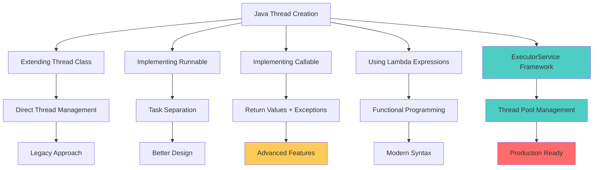
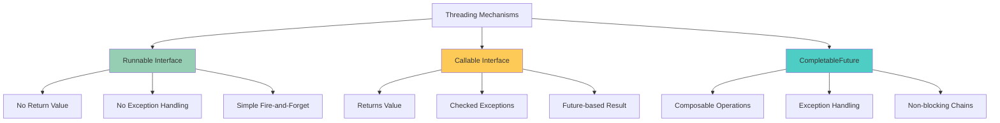
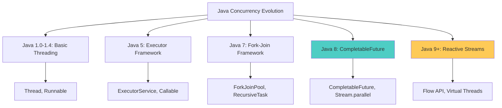

## 🎯 Introduction

Concurrency and threading are fundamental aspects of modern Java applications, enabling programs to perform multiple tasks simultaneously and efficiently utilize system resources. As applications become more complex and performance requirements increase, understanding Java's threading mechanisms becomes crucial for building scalable, responsive applications.

This comprehensive guide explores Java's concurrency landscape, from basic threading concepts to advanced patterns, providing practical implementations and performance insights for enterprise applications.

## 🧵 Java Threading Fundamentals

### 🔍 Understanding Threads and Concurrency

A **thread** is a lightweight sub-process that allows concurrent execution of multiple tasks within a single program. Java provides several mechanisms for creating and managing threads, each with distinct characteristics and use cases.



### 📊 Thread Lifecycle

Understanding the thread lifecycle is essential for effective concurrency management:

```mermaid
graph TD
    A[NEW] --> B[RUNNABLE]
    B --> C[RUNNING]
    C --> B
    C --> D[BLOCKED]
    C --> E[WAITING]
    C --> F[TIMED_WAITING]
    C --> G[TERMINATED]

    D --> B
    E --> B
    F --> B

    H[Thread.start()] --> A
    I[Scheduler] --> C
    J[synchronized block] --> D
    K[Object.wait()] --> E
    L[Thread.sleep()] --> F
    M[Thread completion] --> G

    style A fill:#96ceb4
    style B fill:#feca57
    style C fill:#4ecdc4
    style G fill:#ff6b35
```

## 🏃‍♂️ Core Threading Implementations

### 1. 🎯 Runnable Interface

The **Runnable** interface represents a task that can be executed by a thread. It's the most fundamental way to define work that should be done concurrently.

#### 📋 Basic Runnable Implementation

```java
@FunctionalInterface
public interface Runnable {
    void run();
}
```

**Simple Runnable Example:**
```java
public class BasicRunnableExample {

    public static void main(String[] args) throws InterruptedException {
        // Traditional approach
        Runnable printNumbers = new NumberPrinter("Thread-1", 1, 5);
        Thread thread1 = new Thread(printNumbers);
        thread1.start();

        // Lambda expression approach
        Thread thread2 = new Thread(() -> {
            for (int i = 6; i <= 10; i++) {
                System.out.println("Lambda-Thread: " + i);
                try {
                    Thread.sleep(500);
                } catch (InterruptedException e) {
                    Thread.currentThread().interrupt();
                    break;
                }
            }
        });
        thread2.start();

        // Wait for both threads to complete
        thread1.join();
        thread2.join();

        System.out.println("All threads completed");
    }

    static class NumberPrinter implements Runnable {
        private final String threadName;
        private final int start;
        private final int end;

        public NumberPrinter(String threadName, int start, int end) {
            this.threadName = threadName;
            this.start = start;
            this.end = end;
        }

        @Override
        public void run() {
            for (int i = start; i <= end; i++) {
                System.out.println(threadName + ": " + i);
                try {
                    Thread.sleep(500);
                } catch (InterruptedException e) {
                    Thread.currentThread().interrupt();
                    System.out.println(threadName + " was interrupted");
                    break;
                }
            }
            System.out.println(threadName + " completed");
        }
    }
}
```

#### 🏭 Production Runnable Example: File Processing

```java
@Service
public class FileProcessingService {

    private final ExecutorService executorService;
    private final Logger logger = LoggerFactory.getLogger(FileProcessingService.class);

    public FileProcessingService(@Value("${app.file.processing.threads:5}") int threadCount) {
        this.executorService = Executors.newFixedThreadPool(threadCount);
    }

    public void processFilesAsync(List<Path> filePaths) {
        for (Path filePath : filePaths) {
            FileProcessor processor = new FileProcessor(filePath);
            executorService.submit(processor);
        }
    }

    private class FileProcessor implements Runnable {
        private final Path filePath;

        public FileProcessor(Path filePath) {
            this.filePath = filePath;
        }

        @Override
        public void run() {
            long startTime = System.currentTimeMillis();
            String threadName = Thread.currentThread().getName();

            try {
                logger.info("Thread {} starting to process file: {}", threadName, filePath);

                // Simulate file processing
                List<String> lines = Files.readAllLines(filePath);

                // Process each line
                List<String> processedLines = lines.stream()
                    .map(this::processLine)
                    .filter(Objects::nonNull)
                    .collect(Collectors.toList());

                // Write processed content
                Path outputPath = generateOutputPath(filePath);
                Files.write(outputPath, processedLines, StandardCharsets.UTF_8);

                long duration = System.currentTimeMillis() - startTime;
                logger.info("Thread {} completed processing {} in {}ms",
                    threadName, filePath, duration);

            } catch (IOException e) {
                logger.error("Thread {} failed to process file {}: {}",
                    threadName, filePath, e.getMessage(), e);
            } catch (Exception e) {
                logger.error("Thread {} encountered unexpected error processing {}: {}",
                    threadName, filePath, e.getMessage(), e);
            }
        }

        private String processLine(String line) {
            // Simulate processing logic
            if (line.trim().isEmpty()) {
                return null;
            }
            return line.toUpperCase().trim();
        }

        private Path generateOutputPath(Path inputPath) {
            String fileName = inputPath.getFileName().toString();
            String baseName = fileName.substring(0, fileName.lastIndexOf('.'));
            String extension = fileName.substring(fileName.lastIndexOf('.'));
            return inputPath.getParent().resolve(baseName + "_processed" + extension);
        }
    }

    @PreDestroy
    public void shutdown() {
        executorService.shutdown();
        try {
            if (!executorService.awaitTermination(30, TimeUnit.SECONDS)) {
                executorService.shutdownNow();
            }
        } catch (InterruptedException e) {
            executorService.shutdownNow();
            Thread.currentThread().interrupt();
        }
    }
}
```

### 2. 📞 Callable Interface

The **Callable** interface is similar to Runnable but provides two key advantages: it can return a result and throw checked exceptions.

#### 📋 Basic Callable Implementation

```java
@FunctionalInterface
public interface Callable<V> {
    V call() throws Exception;
}
```

**Callable Example with Future:**
```java
public class CallableExample {

    public static void main(String[] args) throws Exception {
        ExecutorService executor = Executors.newFixedThreadPool(3);

        // Create Callable tasks
        Callable<Integer> sumTask = new SumCalculator(1, 100);
        Callable<String> stringTask = () -> {
            Thread.sleep(2000);
            return "Task completed by " + Thread.currentThread().getName();
        };

        Callable<Double> mathTask = new ComplexCalculation(10.5, 20.3);

        // Submit tasks and get Future objects
        Future<Integer> sumFuture = executor.submit(sumTask);
        Future<String> stringFuture = executor.submit(stringTask);
        Future<Double> mathFuture = executor.submit(mathTask);

        // Get results (this will block until computation is complete)
        try {
            System.out.println("Sum result: " + sumFuture.get());
            System.out.println("String result: " + stringFuture.get());
            System.out.println("Math result: " + mathFuture.get(3, TimeUnit.SECONDS));
        } catch (TimeoutException e) {
            System.out.println("Task timed out");
        } catch (ExecutionException e) {
            System.out.println("Task failed: " + e.getCause());
        }

        executor.shutdown();
    }

    static class SumCalculator implements Callable<Integer> {
        private final int start;
        private final int end;

        public SumCalculator(int start, int end) {
            this.start = start;
            this.end = end;
        }

        @Override
        public Integer call() throws Exception {
            int sum = 0;
            for (int i = start; i <= end; i++) {
                sum += i;
                // Simulate some processing time
                if (i % 10 == 0) {
                    Thread.sleep(10);
                }
            }
            return sum;
        }
    }

    static class ComplexCalculation implements Callable<Double> {
        private final double a;
        private final double b;

        public ComplexCalculation(double a, double b) {
            this.a = a;
            this.b = b;
        }

        @Override
        public Double call() throws Exception {
            // Simulate complex calculation
            Thread.sleep(1000);

            if (a < 0 || b < 0) {
                throw new IllegalArgumentException("Negative values not allowed");
            }

            return Math.sqrt(a * a + b * b);
        }
    }
}
```

#### 🏭 Production Callable Example: Data Processing Pipeline

```java
@Service
public class DataProcessingService {

    private final ExecutorService executorService;
    private final RestTemplate restTemplate;
    private final DataRepository dataRepository;
    private final Logger logger = LoggerFactory.getLogger(DataProcessingService.class);

    public DataProcessingService(@Value("${app.data.processing.threads:10}") int threadCount,
                               RestTemplate restTemplate,
                               DataRepository dataRepository) {
        this.executorService = Executors.newFixedThreadPool(threadCount);
        this.restTemplate = restTemplate;
        this.dataRepository = dataRepository;
    }

    public CompletableFuture<ProcessingReport> processDataBatch(List<Long> dataIds) {
        List<Future<ProcessingResult>> futures = dataIds.stream()
            .map(id -> executorService.submit(new DataProcessor(id)))
            .collect(Collectors.toList());

        return CompletableFuture.supplyAsync(() -> {
            List<ProcessingResult> results = new ArrayList<>();
            int successCount = 0;
            int failureCount = 0;

            for (Future<ProcessingResult> future : futures) {
                try {
                    ProcessingResult result = future.get(30, TimeUnit.SECONDS);
                    results.add(result);

                    if (result.isSuccess()) {
                        successCount++;
                    } else {
                        failureCount++;
                    }

                } catch (Exception e) {
                    logger.error("Failed to get processing result", e);
                    failureCount++;
                    results.add(ProcessingResult.failure("Execution failed: " + e.getMessage()));
                }
            }

            return ProcessingReport.builder()
                .totalProcessed(results.size())
                .successCount(successCount)
                .failureCount(failureCount)
                .results(results)
                .processingTime(Duration.between(
                    Instant.now().minusSeconds(30),
                    Instant.now()
                ))
                .build();
        }, executorService);
    }

    private class DataProcessor implements Callable<ProcessingResult> {
        private final Long dataId;

        public DataProcessor(Long dataId) {
            this.dataId = dataId;
        }

        @Override
        public ProcessingResult call() throws Exception {
            String threadName = Thread.currentThread().getName();
            Instant startTime = Instant.now();

            try {
                logger.debug("Thread {} processing data ID: {}", threadName, dataId);

                // Step 1: Fetch data from database
                Optional<DataEntity> dataOpt = dataRepository.findById(dataId);
                if (dataOpt.isEmpty()) {
                    return ProcessingResult.failure("Data not found: " + dataId);
                }

                DataEntity data = dataOpt.get();

                // Step 2: Enrich data from external API
                EnrichmentResponse enrichment = fetchEnrichmentData(data.getExternalId());

                // Step 3: Transform and validate data
                TransformedData transformedData = transformData(data, enrichment);

                if (!isValidData(transformedData)) {
                    return ProcessingResult.failure("Data validation failed for ID: " + dataId);
                }

                // Step 4: Save processed data
                ProcessedDataEntity processedEntity = saveProcessedData(transformedData);

                Duration processingTime = Duration.between(startTime, Instant.now());

                logger.info("Thread {} successfully processed data ID {} in {}ms",
                    threadName, dataId, processingTime.toMillis());

                return ProcessingResult.success(processedEntity.getId(), processingTime);

            } catch (ExternalApiException e) {
                logger.warn("Thread {} failed to enrich data {}: {}", threadName, dataId, e.getMessage());
                return ProcessingResult.failure("External API error: " + e.getMessage());

            } catch (ValidationException e) {
                logger.warn("Thread {} validation failed for data {}: {}", threadName, dataId, e.getMessage());
                return ProcessingResult.failure("Validation error: " + e.getMessage());

            } catch (Exception e) {
                logger.error("Thread {} unexpected error processing data {}: {}",
                    threadName, dataId, e.getMessage(), e);
                return ProcessingResult.failure("Processing error: " + e.getMessage());
            }
        }

        private EnrichmentResponse fetchEnrichmentData(String externalId) throws ExternalApiException {
            try {
                String url = "https://api.external-service.com/enrich/" + externalId;
                ResponseEntity<EnrichmentResponse> response = restTemplate.getForEntity(
                    url, EnrichmentResponse.class);

                if (response.getStatusCode() != HttpStatus.OK || response.getBody() == null) {
                    throw new ExternalApiException("Failed to fetch enrichment data");
                }

                return response.getBody();

            } catch (RestClientException e) {
                throw new ExternalApiException("API call failed: " + e.getMessage(), e);
            }
        }

        private TransformedData transformData(DataEntity original, EnrichmentResponse enrichment) {
            return TransformedData.builder()
                .originalId(original.getId())
                .transformedValue(original.getValue().toUpperCase())
                .enrichmentScore(enrichment.getScore())
                .category(enrichment.getCategory())
                .metadata(Map.of(
                    "processedAt", Instant.now().toString(),
                    "processingThread", Thread.currentThread().getName()
                ))
                .build();
        }

        private boolean isValidData(TransformedData data) {
            return data.getTransformedValue() != null
                && !data.getTransformedValue().isEmpty()
                && data.getEnrichmentScore() >= 0.5;
        }

        private ProcessedDataEntity saveProcessedData(TransformedData transformedData) {
            ProcessedDataEntity entity = new ProcessedDataEntity();
            entity.setOriginalId(transformedData.getOriginalId());
            entity.setProcessedValue(transformedData.getTransformedValue());
            entity.setScore(transformedData.getEnrichmentScore());
            entity.setCategory(transformedData.getCategory());
            entity.setMetadata(transformedData.getMetadata());
            entity.setProcessedAt(Instant.now());

            return dataRepository.save(entity);
        }
    }

    @Data
    @Builder
    public static class ProcessingResult {
        private final boolean success;
        private final Long processedId;
        private final String errorMessage;
        private final Duration processingTime;

        public static ProcessingResult success(Long processedId, Duration processingTime) {
            return ProcessingResult.builder()
                .success(true)
                .processedId(processedId)
                .processingTime(processingTime)
                .build();
        }

        public static ProcessingResult failure(String errorMessage) {
            return ProcessingResult.builder()
                .success(false)
                .errorMessage(errorMessage)
                .build();
        }
    }
}
```

## 🏊‍♂️ ExecutorService Framework

The **ExecutorService** framework provides a higher-level replacement for working with threads directly, offering thread pooling, task scheduling, and lifecycle management.

### 🏭 Thread Pool Types

```java
public class ExecutorServiceExamples {

    public static void demonstrateExecutorTypes() {
        // Fixed Thread Pool - Fixed number of threads
        ExecutorService fixedPool = Executors.newFixedThreadPool(4);

        // Cached Thread Pool - Creates threads as needed, reuses idle threads
        ExecutorService cachedPool = Executors.newCachedThreadPool();

        // Single Thread Executor - Single worker thread
        ExecutorService singleExecutor = Executors.newSingleThreadExecutor();

        // Scheduled Thread Pool - For delayed and periodic execution
        ScheduledExecutorService scheduledPool = Executors.newScheduledThreadPool(2);

        // Custom Thread Pool with ThreadPoolExecutor
        ExecutorService customPool = new ThreadPoolExecutor(
            2,                      // corePoolSize
            10,                     // maximumPoolSize
            60L,                    // keepAliveTime
            TimeUnit.SECONDS,       // timeUnit
            new LinkedBlockingQueue<>(100), // workQueue
            new ThreadFactoryBuilder()
                .setNameFormat("custom-worker-%d")
                .setDaemon(true)
                .build(),
            new ThreadPoolExecutor.CallerRunsPolicy() // rejectionHandler
        );

        // Example usage
        demonstrateExecutorUsage(fixedPool);

        // Cleanup
        shutdownExecutor(fixedPool);
        shutdownExecutor(cachedPool);
        shutdownExecutor(singleExecutor);
        shutdownExecutor(scheduledPool);
        shutdownExecutor(customPool);
    }

    private static void demonstrateExecutorUsage(ExecutorService executor) {
        // Submit Runnable tasks
        for (int i = 0; i < 5; i++) {
            final int taskId = i;
            executor.submit(() -> {
                System.out.println("Task " + taskId + " executed by " +
                    Thread.currentThread().getName());
                try {
                    Thread.sleep(1000);
                } catch (InterruptedException e) {
                    Thread.currentThread().interrupt();
                }
            });
        }

        // Submit Callable tasks
        List<Future<String>> futures = new ArrayList<>();
        for (int i = 0; i < 3; i++) {
            final int taskId = i;
            Future<String> future = executor.submit(() -> {
                Thread.sleep(500);
                return "Result from task " + taskId;
            });
            futures.add(future);
        }

        // Collect results
        for (Future<String> future : futures) {
            try {
                String result = future.get(2, TimeUnit.SECONDS);
                System.out.println("Received: " + result);
            } catch (Exception e) {
                System.err.println("Task failed: " + e.getMessage());
            }
        }
    }

    private static void shutdownExecutor(ExecutorService executor) {
        executor.shutdown();
        try {
            if (!executor.awaitTermination(10, TimeUnit.SECONDS)) {
                executor.shutdownNow();
                if (!executor.awaitTermination(5, TimeUnit.SECONDS)) {
                    System.err.println("Executor did not terminate gracefully");
                }
            }
        } catch (InterruptedException e) {
            executor.shutdownNow();
            Thread.currentThread().interrupt();
        }
    }
}
```

### 📊 Production ExecutorService Configuration

```java
@Configuration
@EnableConfigurationProperties(ThreadPoolProperties.class)
public class ExecutorConfiguration {

    @Bean("taskExecutor")
    @Primary
    public TaskExecutor taskExecutor(ThreadPoolProperties properties) {
        ThreadPoolTaskExecutor executor = new ThreadPoolTaskExecutor();
        executor.setCorePoolSize(properties.getCorePoolSize());
        executor.setMaxPoolSize(properties.getMaxPoolSize());
        executor.setQueueCapacity(properties.getQueueCapacity());
        executor.setKeepAliveSeconds(properties.getKeepAliveSeconds());
        executor.setThreadNamePrefix("async-task-");
        executor.setWaitForTasksToCompleteOnShutdown(true);
        executor.setAwaitTerminationSeconds(60);
        executor.setRejectedExecutionHandler(new ThreadPoolExecutor.CallerRunsPolicy());

        // Custom thread factory for better monitoring
        executor.setThreadFactory(new ThreadFactoryBuilder()
            .setNameFormat("async-task-%d")
            .setDaemon(false)
            .setPriority(Thread.NORM_PRIORITY)
            .setUncaughtExceptionHandler((thread, exception) -> {
                log.error("Uncaught exception in thread {}: {}",
                    thread.getName(), exception.getMessage(), exception);
            })
            .build());

        executor.initialize();
        return executor;
    }

    @Bean("scheduledTaskExecutor")
    public ScheduledExecutorService scheduledTaskExecutor() {
        return Executors.newScheduledThreadPool(4,
            new ThreadFactoryBuilder()
                .setNameFormat("scheduled-task-%d")
                .setDaemon(true)
                .build());
    }

    @ConfigurationProperties(prefix = "app.thread-pool")
    @Data
    public static class ThreadPoolProperties {
        private int corePoolSize = 8;
        private int maxPoolSize = 20;
        private int queueCapacity = 500;
        private int keepAliveSeconds = 60;
    }
}
```

## 🚀 Modern Concurrency: CompletableFuture

**CompletableFuture**, introduced in Java 8, provides a more powerful and flexible way to handle asynchronous programming with method chaining and composition capabilities.

### 🔗 CompletableFuture Basic Usage

```java
public class CompletableFutureExamples {

    private final RestTemplate restTemplate = new RestTemplate();
    private final ExecutorService executor = Executors.newFixedThreadPool(10);

    public void demonstrateBasicOperations() {
        // Simple async execution
        CompletableFuture<String> future1 = CompletableFuture.supplyAsync(() -> {
            try {
                Thread.sleep(1000);
                return "Hello from async task";
            } catch (InterruptedException e) {
                Thread.currentThread().interrupt();
                throw new RuntimeException(e);
            }
        });

        // Chaining operations
        CompletableFuture<String> chainedFuture = future1
            .thenApply(result -> result.toUpperCase())
            .thenApply(result -> "Processed: " + result);

        // Combining multiple futures
        CompletableFuture<Integer> future2 = CompletableFuture.supplyAsync(() -> 42);
        CompletableFuture<Integer> future3 = CompletableFuture.supplyAsync(() -> 24);

        CompletableFuture<Integer> combinedFuture = future2
            .thenCombine(future3, (a, b) -> a + b);

        // Exception handling
        CompletableFuture<String> futureWithExceptionHandling = CompletableFuture
            .supplyAsync(() -> {
                if (Math.random() > 0.5) {
                    throw new RuntimeException("Random failure");
                }
                return "Success";
            })
            .exceptionally(throwable -> {
                System.err.println("Exception occurred: " + throwable.getMessage());
                return "Default value";
            });

        // Get results
        try {
            System.out.println("Chained result: " + chainedFuture.get());
            System.out.println("Combined result: " + combinedFuture.get());
            System.out.println("Exception handled result: " + futureWithExceptionHandling.get());
        } catch (Exception e) {
            e.printStackTrace();
        }
    }

    public void demonstrateComplexPipeline() {
        CompletableFuture<String> pipeline = CompletableFuture
            .supplyAsync(this::fetchUserData, executor)
            .thenCompose(this::enrichUserData)
            .thenCompose(this::validateData)
            .thenApply(this::formatOutput)
            .whenComplete((result, throwable) -> {
                if (throwable != null) {
                    System.err.println("Pipeline failed: " + throwable.getMessage());
                } else {
                    System.out.println("Pipeline completed: " + result);
                }
            });

        // Non-blocking operation
        pipeline.thenAccept(result ->
            System.out.println("Final result: " + result));
    }

    private String fetchUserData() {
        // Simulate API call
        try {
            Thread.sleep(500);
            return "user123";
        } catch (InterruptedException e) {
            Thread.currentThread().interrupt();
            throw new RuntimeException(e);
        }
    }

    private CompletableFuture<UserProfile> enrichUserData(String userId) {
        return CompletableFuture.supplyAsync(() -> {
            // Simulate enrichment API call
            try {
                Thread.sleep(300);
                return new UserProfile(userId, "John Doe", "john@example.com");
            } catch (InterruptedException e) {
                Thread.currentThread().interrupt();
                throw new RuntimeException(e);
            }
        }, executor);
    }

    private CompletableFuture<UserProfile> validateData(UserProfile profile) {
        return CompletableFuture.supplyAsync(() -> {
            if (profile.getEmail() == null || !profile.getEmail().contains("@")) {
                throw new ValidationException("Invalid email");
            }
            return profile;
        }, executor);
    }

    private String formatOutput(UserProfile profile) {
        return String.format("User: %s (%s) - %s",
            profile.getName(), profile.getId(), profile.getEmail());
    }

    @Data
    @AllArgsConstructor
    public static class UserProfile {
        private String id;
        private String name;
        private String email;
    }

    public static class ValidationException extends RuntimeException {
        public ValidationException(String message) {
            super(message);
        }
    }
}
```

### 🏭 Production CompletableFuture Example: API Aggregation Service

```java
@Service
public class DataAggregationService {

    private final UserServiceClient userServiceClient;
    private final OrderServiceClient orderServiceClient;
    private final InventoryServiceClient inventoryServiceClient;
    private final PaymentServiceClient paymentServiceClient;
    private final ExecutorService executor;
    private final Logger logger = LoggerFactory.getLogger(DataAggregationService.class);

    public DataAggregationService(UserServiceClient userServiceClient,
                                OrderServiceClient orderServiceClient,
                                InventoryServiceClient inventoryServiceClient,
                                PaymentServiceClient paymentServiceClient,
                                @Qualifier("taskExecutor") ExecutorService executor) {
        this.userServiceClient = userServiceClient;
        this.orderServiceClient = orderServiceClient;
        this.inventoryServiceClient = inventoryServiceClient;
        this.paymentServiceClient = paymentServiceClient;
        this.executor = executor;
    }

    public CompletableFuture<UserDashboardData> aggregateUserDashboard(String userId) {
        long startTime = System.currentTimeMillis();

        // Start all async operations in parallel
        CompletableFuture<UserProfile> userProfileFuture = fetchUserProfile(userId);
        CompletableFuture<List<Order>> recentOrdersFuture = fetchRecentOrders(userId);
        CompletableFuture<PaymentInfo> paymentInfoFuture = fetchPaymentInfo(userId);
        CompletableFuture<List<String>> recommendationsFuture = fetchRecommendations(userId);

        // Combine all results
        return CompletableFuture.allOf(
            userProfileFuture,
            recentOrdersFuture,
            paymentInfoFuture,
            recommendationsFuture
        ).thenCompose(ignored -> {
            try {
                UserProfile profile = userProfileFuture.get();
                List<Order> orders = recentOrdersFuture.get();
                PaymentInfo paymentInfo = paymentInfoFuture.get();
                List<String> recommendations = recommendationsFuture.get();

                // Additional processing based on combined data
                return enhanceDashboardData(profile, orders, paymentInfo, recommendations);

            } catch (Exception e) {
                throw new CompletionException("Failed to aggregate user dashboard data", e);
            }
        }).whenComplete((result, throwable) -> {
            long duration = System.currentTimeMillis() - startTime;
            if (throwable != null) {
                logger.error("Dashboard aggregation failed for user {} in {}ms: {}",
                    userId, duration, throwable.getMessage());
            } else {
                logger.info("Dashboard aggregation completed for user {} in {}ms",
                    userId, duration);
            }
        });
    }

    private CompletableFuture<UserProfile> fetchUserProfile(String userId) {
        return CompletableFuture
            .supplyAsync(() -> userServiceClient.getUserProfile(userId), executor)
            .exceptionally(throwable -> {
                logger.warn("Failed to fetch user profile for {}: {}", userId, throwable.getMessage());
                return UserProfile.defaultProfile(userId);
            })
            .orTimeout(5, TimeUnit.SECONDS);
    }

    private CompletableFuture<List<Order>> fetchRecentOrders(String userId) {
        return CompletableFuture
            .supplyAsync(() -> orderServiceClient.getRecentOrders(userId, 10), executor)
            .exceptionally(throwable -> {
                logger.warn("Failed to fetch recent orders for {}: {}", userId, throwable.getMessage());
                return Collections.emptyList();
            })
            .orTimeout(3, TimeUnit.SECONDS);
    }

    private CompletableFuture<PaymentInfo> fetchPaymentInfo(String userId) {
        return CompletableFuture
            .supplyAsync(() -> paymentServiceClient.getPaymentInfo(userId), executor)
            .exceptionally(throwable -> {
                logger.warn("Failed to fetch payment info for {}: {}", userId, throwable.getMessage());
                return PaymentInfo.defaultInfo();
            })
            .orTimeout(4, TimeUnit.SECONDS);
    }

    private CompletableFuture<List<String>> fetchRecommendations(String userId) {
        return CompletableFuture
            .supplyAsync(() -> {
                // Simulate ML service call
                try {
                    Thread.sleep(500);
                    return Arrays.asList("Product A", "Product B", "Product C");
                } catch (InterruptedException e) {
                    Thread.currentThread().interrupt();
                    throw new RuntimeException(e);
                }
            }, executor)
            .exceptionally(throwable -> {
                logger.warn("Failed to fetch recommendations for {}: {}", userId, throwable.getMessage());
                return Collections.emptyList();
            })
            .orTimeout(6, TimeUnit.SECONDS);
    }

    private CompletableFuture<UserDashboardData> enhanceDashboardData(
            UserProfile profile,
            List<Order> orders,
            PaymentInfo paymentInfo,
            List<String> recommendations) {

        return CompletableFuture.supplyAsync(() -> {
            // Calculate additional metrics
            BigDecimal totalSpent = orders.stream()
                .map(Order::getTotalAmount)
                .reduce(BigDecimal.ZERO, BigDecimal::add);

            int loyaltyPoints = calculateLoyaltyPoints(orders);
            String membershipTier = determineMembershipTier(totalSpent, orders.size());

            // Get inventory status for recommended products
            CompletableFuture<Map<String, Boolean>> inventoryStatusFuture =
                fetchInventoryStatus(recommendations);

            try {
                Map<String, Boolean> inventoryStatus = inventoryStatusFuture.get(2, TimeUnit.SECONDS);

                return UserDashboardData.builder()
                    .userProfile(profile)
                    .recentOrders(orders)
                    .paymentInfo(paymentInfo)
                    .recommendations(recommendations)
                    .inventoryStatus(inventoryStatus)
                    .totalSpent(totalSpent)
                    .loyaltyPoints(loyaltyPoints)
                    .membershipTier(membershipTier)
                    .lastUpdated(Instant.now())
                    .build();

            } catch (Exception e) {
                logger.warn("Failed to fetch inventory status, proceeding without it", e);
                return UserDashboardData.builder()
                    .userProfile(profile)
                    .recentOrders(orders)
                    .paymentInfo(paymentInfo)
                    .recommendations(recommendations)
                    .inventoryStatus(Collections.emptyMap())
                    .totalSpent(totalSpent)
                    .loyaltyPoints(loyaltyPoints)
                    .membershipTier(membershipTier)
                    .lastUpdated(Instant.now())
                    .build();
            }
        }, executor);
    }

    private CompletableFuture<Map<String, Boolean>> fetchInventoryStatus(List<String> productIds) {
        List<CompletableFuture<Pair<String, Boolean>>> statusFutures = productIds.stream()
            .map(productId -> CompletableFuture
                .supplyAsync(() -> Pair.of(productId,
                    inventoryServiceClient.isInStock(productId)), executor)
                .exceptionally(throwable -> Pair.of(productId, false))
                .orTimeout(1, TimeUnit.SECONDS))
            .collect(Collectors.toList());

        return CompletableFuture
            .allOf(statusFutures.toArray(new CompletableFuture[0]))
            .thenApply(ignored -> statusFutures.stream()
                .map(future -> {
                    try {
                        return future.get();
                    } catch (Exception e) {
                        return null;
                    }
                })
                .filter(Objects::nonNull)
                .collect(Collectors.toMap(Pair::getKey, Pair::getValue)));
    }

    private int calculateLoyaltyPoints(List<Order> orders) {
        return orders.stream()
            .mapToInt(order -> order.getTotalAmount().intValue() / 10)
            .sum();
    }

    private String determineMembershipTier(BigDecimal totalSpent, int orderCount) {
        if (totalSpent.compareTo(new BigDecimal("10000")) >= 0 && orderCount >= 50) {
            return "PLATINUM";
        } else if (totalSpent.compareTo(new BigDecimal("5000")) >= 0 && orderCount >= 20) {
            return "GOLD";
        } else if (totalSpent.compareTo(new BigDecimal("1000")) >= 0 && orderCount >= 5) {
            return "SILVER";
        } else {
            return "BRONZE";
        }
    }
}
```

## ⚖️ Comprehensive Comparison

### 📊 Runnable vs Callable vs CompletableFuture



### 📈 Performance Comparison Table

| Feature | Runnable | Callable | CompletableFuture |
|---------|----------|----------|-------------------|
| **Return Value** | ❌ No | ✅ Yes | ✅ Yes |
| **Exception Handling** | ❌ Runtime only | ✅ Checked exceptions | ✅ Rich exception handling |
| **Composability** | ❌ No | ❌ Limited | ✅ Excellent |
| **Asynchronous Chaining** | ❌ No | ❌ No | ✅ Yes |
| **Performance Overhead** | Low | Low | Medium |
| **Learning Curve** | Easy | Easy | Moderate |
| **Use Case Complexity** | Simple | Medium | Complex |
| **Thread Pool Integration** | ✅ Yes | ✅ Yes | ✅ Yes |

### ✅ Pros and Cons Analysis

#### 🏃‍♂️ Runnable Interface

**Pros:**
- **Simplicity**: Easy to understand and implement
- **Low Overhead**: Minimal performance impact
- **Thread Compatibility**: Works with all thread creation mechanisms
- **Lambda Support**: Functional interface, supports lambda expressions

**Cons:**
- **No Return Value**: Cannot return results from computation
- **Limited Exception Handling**: Only runtime exceptions
- **No Composition**: Cannot chain operations
- **Basic Functionality**: Lacks advanced concurrency features

**Best Use Cases:**
- Fire-and-forget tasks
- Log processing
- Background cleanup operations
- Simple parallel processing

#### 📞 Callable Interface

**Pros:**
- **Return Values**: Can return computation results
- **Exception Handling**: Supports checked exceptions
- **Future Integration**: Works with Future and ExecutorService
- **Type Safety**: Generic return type support

**Cons:**
- **Blocking Operations**: Future.get() blocks thread
- **Limited Composition**: Cannot easily chain operations
- **Exception Complexity**: Wrapped in ExecutionException
- **Single Result**: Only returns one value

**Best Use Cases:**
- Mathematical calculations
- Data processing with results
- API calls that return data
- Batch processing operations

#### 🚀 CompletableFuture

**Pros:**
- **Non-blocking**: Asynchronous result handling
- **Composability**: Rich chaining and combination methods
- **Exception Handling**: Comprehensive error management
- **Flexibility**: Multiple completion sources and triggers

**Cons:**
- **Complexity**: Steeper learning curve
- **Memory Overhead**: More objects and callbacks
- **Debugging Difficulty**: Complex async chains hard to debug
- **Version Dependency**: Requires Java 8+

**Best Use Cases:**
- Microservice orchestration
- Complex async pipelines
- API composition and aggregation
- Reactive programming patterns

## 🎯 Advanced Threading Patterns

### 🔄 Producer-Consumer Pattern

```java
@Component
public class ProducerConsumerExample {

    private final BlockingQueue<WorkItem> workQueue = new LinkedBlockingQueue<>(1000);
    private final AtomicBoolean running = new AtomicBoolean(false);
    private final List<Thread> consumers = new ArrayList<>();
    private Thread producer;

    @PostConstruct
    public void start() {
        startProducer();
        startConsumers(3);
        running.set(true);
    }

    private void startProducer() {
        producer = new Thread(new Producer(), "Producer");
        producer.start();
    }

    private void startConsumers(int consumerCount) {
        for (int i = 0; i < consumerCount; i++) {
            Thread consumer = new Thread(new Consumer(), "Consumer-" + i);
            consumers.add(consumer);
            consumer.start();
        }
    }

    private class Producer implements Runnable {
        @Override
        public void run() {
            int itemId = 1;
            while (running.get()) {
                try {
                    WorkItem item = new WorkItem(itemId++, "Data-" + itemId);
                    workQueue.put(item); // Blocks if queue is full
                    Thread.sleep(100); // Simulate production time
                } catch (InterruptedException e) {
                    Thread.currentThread().interrupt();
                    break;
                }
            }
        }
    }

    private class Consumer implements Runnable {
        @Override
        public void run() {
            while (running.get() || !workQueue.isEmpty()) {
                try {
                    WorkItem item = workQueue.poll(1, TimeUnit.SECONDS);
                    if (item != null) {
                        processItem(item);
                    }
                } catch (InterruptedException e) {
                    Thread.currentThread().interrupt();
                    break;
                }
            }
        }

        private void processItem(WorkItem item) throws InterruptedException {
            // Simulate processing time
            Thread.sleep(200);
            System.out.println(Thread.currentThread().getName() +
                " processed: " + item);
        }
    }

    @Data
    @AllArgsConstructor
    public static class WorkItem {
        private final int id;
        private final String data;
    }

    @PreDestroy
    public void shutdown() {
        running.set(false);

        if (producer != null) {
            producer.interrupt();
        }

        consumers.forEach(Thread::interrupt);

        // Wait for threads to finish
        try {
            if (producer != null) {
                producer.join(5000);
            }
            for (Thread consumer : consumers) {
                consumer.join(5000);
            }
        } catch (InterruptedException e) {
            Thread.currentThread().interrupt();
        }
    }
}
```

### 🔒 Thread-Safe Singleton with Lazy Initialization

```java
public class ThreadSafeSingleton {

    // Volatile ensures visibility across threads
    private static volatile ThreadSafeSingleton instance;
    private static final Object lock = new Object();

    // Data that needs to be initialized
    private final Map<String, String> configurationData;
    private final Instant creationTime;

    private ThreadSafeSingleton() {
        // Expensive initialization
        this.configurationData = loadConfiguration();
        this.creationTime = Instant.now();
    }

    // Double-checked locking pattern
    public static ThreadSafeSingleton getInstance() {
        if (instance == null) {
            synchronized (lock) {
                if (instance == null) {
                    instance = new ThreadSafeSingleton();
                }
            }
        }
        return instance;
    }

    // Alternative: Using enum for thread-safe singleton
    public enum EnumSingleton {
        INSTANCE;

        private final Map<String, String> configurationData;
        private final Instant creationTime;

        EnumSingleton() {
            this.configurationData = loadConfiguration();
            this.creationTime = Instant.now();
        }

        public Map<String, String> getConfigurationData() {
            return Collections.unmodifiableMap(configurationData);
        }

        public Instant getCreationTime() {
            return creationTime;
        }
    }

    // Another alternative: Using initialization-on-demand holder pattern
    public static class HolderSingleton {

        private HolderSingleton() {
            this.configurationData = loadConfiguration();
            this.creationTime = Instant.now();
        }

        private static class Holder {
            private static final HolderSingleton INSTANCE = new HolderSingleton();
        }

        public static HolderSingleton getInstance() {
            return Holder.INSTANCE;
        }

        private final Map<String, String> configurationData;
        private final Instant creationTime;
    }

    private static Map<String, String> loadConfiguration() {
        // Simulate expensive configuration loading
        try {
            Thread.sleep(1000);
        } catch (InterruptedException e) {
            Thread.currentThread().interrupt();
        }

        Map<String, String> config = new HashMap<>();
        config.put("database.url", "jdbc:postgresql://localhost/app");
        config.put("api.timeout", "30000");
        config.put("cache.size", "1000");
        return config;
    }

    public Map<String, String> getConfigurationData() {
        return Collections.unmodifiableMap(configurationData);
    }

    public Instant getCreationTime() {
        return creationTime;
    }
}
```

## 📊 Performance Optimization and Best Practices

### 🔧 Thread Pool Tuning

```java
@Component
public class ThreadPoolOptimizer {

    private final MeterRegistry meterRegistry;
    private final Logger logger = LoggerFactory.getLogger(ThreadPoolOptimizer.class);

    public ThreadPoolOptimizer(MeterRegistry meterRegistry) {
        this.meterRegistry = meterRegistry;
    }

    public ThreadPoolExecutor createOptimizedThreadPool(String poolName, WorkloadCharacteristics workload) {
        int corePoolSize = calculateCorePoolSize(workload);
        int maxPoolSize = calculateMaxPoolSize(workload);
        long keepAliveTime = calculateKeepAliveTime(workload);
        BlockingQueue<Runnable> workQueue = createWorkQueue(workload);

        ThreadPoolExecutor executor = new ThreadPoolExecutor(
            corePoolSize,
            maxPoolSize,
            keepAliveTime,
            TimeUnit.SECONDS,
            workQueue,
            createThreadFactory(poolName),
            createRejectionHandler(poolName)
        );

        // Enable monitoring
        registerMetrics(poolName, executor);

        // Allow core threads to timeout if configured
        if (workload.isAllowCoreThreadTimeout()) {
            executor.allowCoreThreadTimeOut(true);
        }

        return executor;
    }

    private int calculateCorePoolSize(WorkloadCharacteristics workload) {
        int cpuCores = Runtime.getRuntime().availableProcessors();

        if (workload.getType() == WorkloadType.CPU_INTENSIVE) {
            // For CPU-bound tasks: core pool size = number of CPU cores
            return cpuCores;
        } else if (workload.getType() == WorkloadType.IO_INTENSIVE) {
            // For I/O-bound tasks: core pool size = CPU cores * (1 + wait time / compute time)
            double utilization = workload.getTargetCpuUtilization();
            double waitComputeRatio = workload.getWaitTime() / workload.getComputeTime();
            return (int) (cpuCores * utilization * (1 + waitComputeRatio));
        } else {
            // Mixed workload: conservative approach
            return Math.max(2, cpuCores / 2);
        }
    }

    private int calculateMaxPoolSize(WorkloadCharacteristics workload) {
        int corePoolSize = calculateCorePoolSize(workload);

        // Max pool size should be larger than core pool size to handle spikes
        return Math.min(workload.getMaxConcurrency(), corePoolSize * 3);
    }

    private long calculateKeepAliveTime(WorkloadCharacteristics workload) {
        if (workload.getType() == WorkloadType.BURSTY) {
            return 30; // Keep threads alive longer for bursty workloads
        } else {
            return 60; // Standard keep-alive time
        }
    }

    private BlockingQueue<Runnable> createWorkQueue(WorkloadCharacteristics workload) {
        switch (workload.getQueueType()) {
            case BOUNDED:
                return new LinkedBlockingQueue<>(workload.getQueueCapacity());
            case UNBOUNDED:
                return new LinkedBlockingQueue<>();
            case SYNCHRONOUS:
                return new SynchronousQueue<>();
            case PRIORITY:
                return new PriorityBlockingQueue<>(workload.getQueueCapacity());
            default:
                return new LinkedBlockingQueue<>(1000);
        }
    }

    private ThreadFactory createThreadFactory(String poolName) {
        return new ThreadFactoryBuilder()
            .setNameFormat(poolName + "-%d")
            .setDaemon(false)
            .setPriority(Thread.NORM_PRIORITY)
            .setUncaughtExceptionHandler(this::handleUncaughtException)
            .build();
    }

    private RejectedExecutionHandler createRejectionHandler(String poolName) {
        return (task, executor) -> {
            logger.warn("Task rejected by thread pool {}: active={}, pool={}, queue={}",
                poolName, executor.getActiveCount(), executor.getPoolSize(),
                executor.getQueue().size());

            meterRegistry.counter("thread.pool.rejections", "pool", poolName).increment();

            // Try to execute in caller thread as fallback
            if (!executor.isShutdown()) {
                task.run();
            }
        };
    }

    private void registerMetrics(String poolName, ThreadPoolExecutor executor) {
        Gauge.builder("thread.pool.active")
            .tag("pool", poolName)
            .description("Active thread count")
            .register(meterRegistry, executor, ThreadPoolExecutor::getActiveCount);

        Gauge.builder("thread.pool.size")
            .tag("pool", poolName)
            .description("Current thread pool size")
            .register(meterRegistry, executor, ThreadPoolExecutor::getPoolSize);

        Gauge.builder("thread.pool.queue.size")
            .tag("pool", poolName)
            .description("Thread pool queue size")
            .register(meterRegistry, executor, e -> e.getQueue().size());
    }

    private void handleUncaughtException(Thread thread, Throwable throwable) {
        logger.error("Uncaught exception in thread {}: {}",
            thread.getName(), throwable.getMessage(), throwable);

        meterRegistry.counter("thread.uncaught.exceptions",
            "thread", thread.getName()).increment();
    }

    @Data
    @Builder
    public static class WorkloadCharacteristics {
        private WorkloadType type;
        private QueueType queueType;
        private int maxConcurrency;
        private int queueCapacity;
        private double targetCpuUtilization;
        private double waitTime;
        private double computeTime;
        private boolean allowCoreThreadTimeout;

        public enum WorkloadType {
            CPU_INTENSIVE, IO_INTENSIVE, MIXED, BURSTY
        }

        public enum QueueType {
            BOUNDED, UNBOUNDED, SYNCHRONOUS, PRIORITY
        }
    }
}
```

### 📈 Monitoring and Observability

```java
@Component
public class ThreadingMetricsCollector {

    private final MeterRegistry meterRegistry;
    private final Timer taskExecutionTimer;
    private final Counter taskCompletionCounter;
    private final Counter taskFailureCounter;

    public ThreadingMetricsCollector(MeterRegistry meterRegistry) {
        this.meterRegistry = meterRegistry;
        this.taskExecutionTimer = Timer.builder("task.execution.time")
            .description("Task execution time")
            .register(meterRegistry);
        this.taskCompletionCounter = Counter.builder("task.completions")
            .description("Task completions")
            .register(meterRegistry);
        this.taskFailureCounter = Counter.builder("task.failures")
            .description("Task failures")
            .register(meterRegistry);
    }

    public <T> Callable<T> instrumentCallable(String taskName, Callable<T> callable) {
        return () -> {
            Timer.Sample sample = Timer.start(meterRegistry);
            try {
                T result = callable.call();
                taskCompletionCounter.increment(Tags.of("task", taskName, "result", "success"));
                return result;
            } catch (Exception e) {
                taskFailureCounter.increment(Tags.of("task", taskName, "error", e.getClass().getSimpleName()));
                throw e;
            } finally {
                sample.stop(Timer.builder("task.execution.time")
                    .tag("task", taskName)
                    .register(meterRegistry));
            }
        };
    }

    public Runnable instrumentRunnable(String taskName, Runnable runnable) {
        return () -> {
            Timer.Sample sample = Timer.start(meterRegistry);
            try {
                runnable.run();
                taskCompletionCounter.increment(Tags.of("task", taskName, "result", "success"));
            } catch (Exception e) {
                taskFailureCounter.increment(Tags.of("task", taskName, "error", e.getClass().getSimpleName()));
                throw e;
            } finally {
                sample.stop(Timer.builder("task.execution.time")
                    .tag("task", taskName)
                    .register(meterRegistry));
            }
        };
    }

    @EventListener
    @Async
    public void handleThreadPoolMetrics(ThreadPoolMetricsEvent event) {
        meterRegistry.gauge("thread.pool.utilization",
            Tags.of("pool", event.getPoolName()),
            event.getUtilization());
    }

    @Data
    @AllArgsConstructor
    public static class ThreadPoolMetricsEvent {
        private String poolName;
        private double utilization;
        private int activeThreads;
        private int totalThreads;
        private int queueSize;
    }
}
```

## 🎯 Conclusion and Best Practices

### 🏆 Key Recommendations

1. **Choose the Right Tool**:
   - Use **Runnable** for simple, fire-and-forget tasks
   - Use **Callable** when you need return values or exception handling
   - Use **CompletableFuture** for complex async operations and composition

2. **Thread Pool Management**:
   - Always use ExecutorService instead of creating threads manually
   - Configure thread pools based on workload characteristics
   - Monitor thread pool metrics in production

3. **Exception Handling**:
   - Always handle InterruptedException properly
   - Use proper exception handling strategies for different threading mechanisms
   - Log uncaught exceptions for debugging

4. **Performance Optimization**:
   - Profile and measure performance before optimization
   - Consider CPU vs I/O bound characteristics when sizing thread pools
   - Use appropriate queue types based on workload patterns

### 🚀 Modern Java Concurrency Evolution



By mastering these threading mechanisms and following best practices, you can build highly concurrent, scalable Java applications that efficiently utilize system resources while maintaining reliability and performance. Remember to always profile, monitor, and test your concurrent code thoroughly, as threading issues can be subtle and difficult to debug in production environments.

The choice between Runnable, Callable, and CompletableFuture should be based on your specific requirements for return values, exception handling, composability, and the complexity of your concurrent operations. Start with the simplest approach that meets your needs and evolve to more sophisticated patterns as your requirements grow.