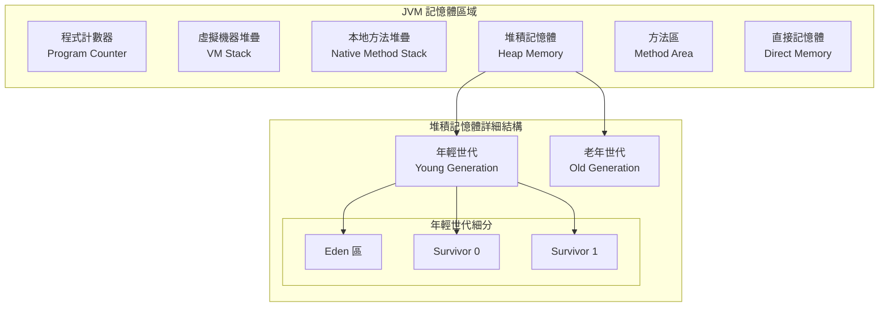

## 前言

Java 虛擬機器（JVM）的記憶體管理是 Java 應用程式效能的核心關鍵。本文將深入探討 JVM 記憶體結構，特別是堆疊（Stack）與堆積（Heap）記憶體的運作機制，並提供實際的程式碼範例與最佳化策略。

## JVM 記憶體結構概覽

JVM 記憶體主要分為以下幾個區域：



### JVM 記憶體區域比較表

| 記憶體區域 | 執行緒共享 | 生命週期 | 主要用途 | GC 影響 |
|------------|------------|----------|----------|---------|
| **程式計數器** | 否 | 執行緒生命週期 | 記錄當前執行指令位置 | 無 |
| **虛擬機器堆疊** | 否 | 執行緒生命週期 | 方法調用與局部變數 | 無 |
| **本地方法堆疊** | 否 | 執行緒生命週期 | 本地方法調用 | 無 |
| **堆積記憶體** | 是 | JVM 生命週期 | 物件實例與陣列 | 是 |
| **方法區** | 是 | JVM 生命週期 | 類別資訊與常數池 | 部分 |
| **直接記憶體** | 是 | 手動管理 | NIO 操作緩衝區 | 無 |

## 堆疊記憶體（Stack Memory）深度解析

### 堆疊記憶體的特性

堆疊記憶體是每個執行緒獨有的記憶體區域，採用 LIFO（Last In First Out）的結構。

```java
public class StackMemoryDemo {

    public static void main(String[] args) {
        // 在 main 方法的堆疊框架中
        int mainVariable = 10;
        System.out.println("主方法開始執行，堆疊深度：1");

        // 調用方法，增加堆疊深度
        methodA(mainVariable);

        System.out.println("主方法執行完畢");
    }

    public static void methodA(int parameter) {
        // 在 methodA 的堆疊框架中
        int localVariableA = 20;
        System.out.println("方法 A 執行，堆疊深度：2，參數值：" + parameter);

        // 再次調用方法，進一步增加堆疊深度
        methodB(localVariableA + parameter);
    }

    public static void methodB(int parameter) {
        // 在 methodB 的堆疊框架中
        int localVariableB = 30;
        System.out.println("方法 B 執行，堆疊深度：3，計算結果：" +
                          (localVariableB + parameter));

        // 方法結束時，堆疊框架被移除
        System.out.println("方法 B 執行完畢，準備返回");
    }
}
```

### 堆疊框架（Stack Frame）結構

每個方法調用都會在堆疊中建立一個框架：

```java
@Component
public class StackFrameAnalyzer {

    public void demonstrateStackFrame() {
        // 1. 局部變數表（Local Variable Table）
        int intValue = 100;           // slot 0
        long longValue = 200L;        // slot 1-2 (long 佔用兩個 slot)
        String stringValue = "測試";   // slot 3
        Object objValue = new Object(); // slot 4

        // 2. 運算元堆疊（Operand Stack）
        int result = calculateSum(intValue, (int)longValue);

        // 3. 動態連結（Dynamic Linking）
        System.out.println("計算結果：" + result);

        // 4. 方法返回位址（Return Address）
        // 當方法正常返回或異常返回時使用
    }

    private int calculateSum(int a, int b) {
        // 新的堆疊框架被創建
        int sum = a + b;

        // 運算元堆疊操作示例：
        // 1. 載入 a 到運算元堆疊
        // 2. 載入 b 到運算元堆疊
        // 3. 執行 iadd 指令
        // 4. 將結果存儲到 sum 變數

        return sum; // 返回值通過運算元堆疊傳遞
    }
}
```

### 堆疊記憶體配置與調優

```java
@Configuration
public class StackMemoryConfiguration {

    // JVM 參數設定範例
    // -Xss1m：設定每個執行緒的堆疊大小為 1MB
    // -XX:+PrintGCDetails：印出 GC 詳細資訊

    @Bean
    public ThreadPoolExecutor customThreadPool() {
        return new ThreadPoolExecutor(
            5,  // 核心執行緒數
            10, // 最大執行緒數
            60L, TimeUnit.SECONDS, // 保持存活時間
            new LinkedBlockingQueue<>(100), // 工作佇列
            new ThreadFactory() {
                private AtomicInteger threadNumber = new AtomicInteger(1);

                @Override
                public Thread newThread(Runnable r) {
                    Thread thread = new Thread(r, "CustomThread-" +
                                             threadNumber.getAndIncrement());

                    // 監控執行緒堆疊使用情況
                    thread.setUncaughtExceptionHandler((t, e) -> {
                        if (e instanceof StackOverflowError) {
                            log.error("執行緒 {} 發生堆疊溢位：{}", t.getName(), e.getMessage());
                        }
                    });

                    return thread;
                }
            }
        );
    }

    @Component
    public static class StackMonitor {

        public void analyzeStackUsage() {
            ThreadMXBean threadBean = ManagementFactory.getThreadMXBean();

            for (ThreadInfo threadInfo : threadBean.dumpAllThreads(false, false)) {
                StackTraceElement[] stackTrace = threadInfo.getStackTrace();

                System.out.printf("執行緒 %s 堆疊深度：%d%n",
                                threadInfo.getThreadName(),
                                stackTrace.length);

                // 分析堆疊使用情況
                if (stackTrace.length > 100) {
                    System.out.printf("警告：執行緒 %s 堆疊深度過深！%n",
                                    threadInfo.getThreadName());
                }
            }
        }
    }
}
```

## 堆積記憶體（Heap Memory）深度解析

### 堆積記憶體結構與分代

```java
public class HeapMemoryDemo {

    // 類別變數存儲在方法區，物件實例存儲在堆積
    private static List<String> staticList = new ArrayList<>();
    private List<Integer> instanceList = new ArrayList<>();

    public void demonstrateHeapMemory() {

        // 1. Eden 區：新物件分配
        String newString = new String("新建字串"); // 分配到 Eden 區
        StringBuilder sb = new StringBuilder();    // 分配到 Eden 區

        // 2. 短生命週期物件（很快成為垃圾）
        for (int i = 0; i < 1000; i++) {
            String temp = "臨時字串" + i; // 這些物件很快就會被 GC
        }

        // 3. 長生命週期物件（可能晉升到老年世代）
        instanceList.add(100);
        staticList.add("持久字串");

        // 4. 大物件（可能直接分配到老年世代）
        int[] largeArray = new int[1000000]; // 大陣列可能直接進入老年世代

        demonstrateObjectLifecycle();
    }

    private void demonstrateObjectLifecycle() {
        // 物件生命週期追蹤
        Object youngObject = new Object();      // Eden 區

        // 觸發 Minor GC
        System.gc(); // 手動建議 GC（實際執行時機由 JVM 決定）

        // 長期持有的引用，防止被回收
        staticList.add(youngObject.toString());
    }
}
```

### 垃圾回收機制詳解

```java
@Component
public class GarbageCollectionAnalyzer {

    private final List<MemoryPoolMXBean> memoryPools;
    private final GarbageCollectorMXBean youngGenGC;
    private final GarbageCollectorMXBean oldGenGC;

    public GarbageCollectionAnalyzer() {
        this.memoryPools = ManagementFactory.getMemoryPoolMXBeans();

        List<GarbageCollectorMXBean> gcBeans = ManagementFactory.getGarbageCollectorMXBeans();
        this.youngGenGC = findGCBean(gcBeans, "PS Scavenge", "G1 Young Generation");
        this.oldGenGC = findGCBean(gcBeans, "PS MarkSweep", "G1 Old Generation");
    }

    public GCAnalysisResult analyzeGCPerformance() {

        // 年輕世代記憶體分析
        MemoryUsage edenUsage = getMemoryPoolUsage("Eden Space", "G1 Eden Space");
        MemoryUsage survivor0Usage = getMemoryPoolUsage("Survivor Space", "G1 Survivor Space");
        MemoryUsage oldGenUsage = getMemoryPoolUsage("Old Gen", "G1 Old Gen");

        // GC 統計資訊
        long youngGCCount = youngGenGC != null ? youngGenGC.getCollectionCount() : 0;
        long youngGCTime = youngGenGC != null ? youngGenGC.getCollectionTime() : 0;
        long oldGCCount = oldGenGC != null ? oldGenGC.getCollectionCount() : 0;
        long oldGCTime = oldGenGC != null ? oldGenGC.getCollectionTime() : 0;

        return GCAnalysisResult.builder()
            .edenSpaceUsage(calculateUsagePercentage(edenUsage))
            .survivorSpaceUsage(calculateUsagePercentage(survivor0Usage))
            .oldGenUsage(calculateUsagePercentage(oldGenUsage))
            .youngGCCount(youngGCCount)
            .youngGCTime(youngGCTime)
            .oldGCCount(oldGCCount)
            .oldGCTime(oldGCTime)
            .avgYoungGCTime(youngGCCount > 0 ? (double)youngGCTime / youngGCCount : 0)
            .avgOldGCTime(oldGCCount > 0 ? (double)oldGCTime / oldGCCount : 0)
            .build();
    }

    @Scheduled(fixedRate = 60000) // 每分鐘執行一次
    public void monitorMemoryUsage() {
        GCAnalysisResult result = analyzeGCPerformance();

        log.info("=== JVM 記憶體使用情況 ===");
        log.info("Eden 區使用率：{:.2f}%", result.getEdenSpaceUsage());
        log.info("Survivor 區使用率：{:.2f}%", result.getSurvivorSpaceUsage());
        log.info("老年世代使用率：{:.2f}%", result.getOldGenUsage());
        log.info("年輕世代 GC 次數：{}，平均時間：{:.2f}ms",
                result.getYoungGCCount(), result.getAvgYoungGCTime());
        log.info("老年世代 GC 次數：{}，平均時間：{:.2f}ms",
                result.getOldGCCount(), result.getAvgOldGCTime());

        // 記憶體使用率過高時發出警告
        if (result.getOldGenUsage() > 80.0) {
            log.warn("警告：老年世代記憶體使用率過高！建議調整 JVM 參數或最佳化程式碼");
        }
    }

    private double calculateUsagePercentage(MemoryUsage usage) {
        if (usage == null || usage.getMax() == -1) return 0.0;
        return (double) usage.getUsed() / usage.getMax() * 100.0;
    }
}
```

### 類別在記憶體中的配置

```java
public class ClassMemoryAllocationDemo {

    // 類別變數（靜態變數）- 存儲在方法區
    private static int classVariable = 100;
    private static final String CONSTANT = "常數值";

    // 實例變數 - 存儲在堆積記憶體中
    private int instanceVariable;
    private String instanceString;
    private List<Integer> instanceList;

    public ClassMemoryAllocationDemo(int value, String text) {
        // 建構子中的賦值操作
        this.instanceVariable = value;        // 基本型別值存儲在物件中
        this.instanceString = text;           // 引用存儲在物件中，實際字串在字串常數池
        this.instanceList = new ArrayList<>(); // 引用存儲在物件中，ArrayList 實例在堆積
    }

    public void demonstrateMemoryLayout() {
        // 局部變數 - 存儲在目前執行緒的堆疊記憶體中
        int localInt = 200;
        String localString = "局部字串";
        Object localObject = new Object();

        // 陣列記憶體配置示例
        demonstrateArrayMemory();

        // 物件引用關係示例
        demonstrateObjectReferences();
    }

    private void demonstrateArrayMemory() {
        // 一維陣列記憶體配置
        int[] intArray = new int[5];        // 陣列物件在堆積，連續記憶體配置
        String[] stringArray = new String[3]; // 陣列物件在堆積，元素引用在陣列中

        // 陣列初始化
        intArray[0] = 10;    // 直接在陣列記憶體位置存儲值
        intArray[1] = 20;
        intArray[2] = 30;

        stringArray[0] = "字串1"; // 存儲字串引用，實際字串在字串常數池
        stringArray[1] = "字串2";
        stringArray[2] = "字串3";

        // 多維陣列記憶體配置
        int[][] multiArray = new int[3][4]; // 外層陣列存儲內層陣列的引用

        System.out.println("一維陣列記憶體位置：" + System.identityHashCode(intArray));
        System.out.println("字串陣列記憶體位置：" + System.identityHashCode(stringArray));
        System.out.println("多維陣列記憶體位置：" + System.identityHashCode(multiArray));
    }

    private void demonstrateObjectReferences() {
        // 物件引用關係和記憶體配置
        Person person = new Person("張三", 25);
        Address address = new Address("台北市", "信義區");

        person.setAddress(address); // person 物件持有 address 物件的引用

        // 循環引用示例（需要小心記憶體洩漏）
        Node node1 = new Node("節點1");
        Node node2 = new Node("節點2");
        node1.setNext(node2);
        node2.setPrevious(node1); // 雙向引用

        System.out.println("物件記憶體配置完成");
    }

    // 內部類別示例
    public class Person {
        private String name;
        private int age;
        private Address address;

        public Person(String name, int age) {
            this.name = name;
            this.age = age;
        }

        // getter, setter 方法...
        public void setAddress(Address address) { this.address = address; }
    }

    public class Address {
        private String city;
        private String district;

        public Address(String city, String district) {
            this.city = city;
            this.district = district;
        }
    }

    public class Node {
        private String data;
        private Node next;
        private Node previous;

        public Node(String data) { this.data = data; }
        public void setNext(Node next) { this.next = next; }
        public void setPrevious(Node previous) { this.previous = previous; }
    }
}
```

## JVM 記憶體調優策略

### 記憶體參數配置

```java
@Component
public class JVMTuningGuide {

    /**
     * JVM 記憶體參數配置建議
     *
     * 堆積記憶體配置：
     * -Xms2g          # 初始堆積大小
     * -Xmx4g          # 最大堆積大小
     * -Xmn1g          # 年輕世代大小
     * -XX:SurvivorRatio=8  # Eden:Survivor = 8:1
     *
     * 堆疊記憶體配置：
     * -Xss1m          # 每個執行緒堆疊大小
     *
     * 方法區配置（JDK 8+）：
     * -XX:MetaspaceSize=256m    # 初始 Metaspace 大小
     * -XX:MaxMetaspaceSize=512m # 最大 Metaspace 大小
     *
     * GC 配置：
     * -XX:+UseG1GC    # 使用 G1 垃圾回收器
     * -XX:MaxGCPauseMillis=200  # 最大 GC 暫停時間
     */

    public MemoryOptimizationReport generateOptimizationReport() {

        Runtime runtime = Runtime.getRuntime();
        long totalMemory = runtime.totalMemory();
        long freeMemory = runtime.freeMemory();
        long usedMemory = totalMemory - freeMemory;
        long maxMemory = runtime.maxMemory();

        // 記憶體使用率分析
        double usedPercentage = (double) usedMemory / maxMemory * 100;
        double allocatedPercentage = (double) totalMemory / maxMemory * 100;

        List<String> recommendations = new ArrayList<>();

        // 基於使用率提供建議
        if (usedPercentage > 85) {
            recommendations.add("記憶體使用率過高，建議增加 -Xmx 參數");
            recommendations.add("檢查是否存在記憶體洩漏");
        }

        if (allocatedPercentage < 50) {
            recommendations.add("已配置記憶體比例較低，考慮調整 -Xms 參數");
        }

        // GC 頻率分析
        analyzeGCFrequency(recommendations);

        return MemoryOptimizationReport.builder()
            .totalMemory(totalMemory)
            .usedMemory(usedMemory)
            .freeMemory(freeMemory)
            .maxMemory(maxMemory)
            .usedPercentage(usedPercentage)
            .recommendations(recommendations)
            .timestamp(LocalDateTime.now())
            .build();
    }

    private void analyzeGCFrequency(List<String> recommendations) {
        List<GarbageCollectorMXBean> gcBeans = ManagementFactory.getGarbageCollectorMXBeans();

        for (GarbageCollectorMXBean gcBean : gcBeans) {
            long collectionCount = gcBean.getCollectionCount();
            long collectionTime = gcBean.getCollectionTime();

            if (collectionCount > 0) {
                double avgGCTime = (double) collectionTime / collectionCount;

                if (avgGCTime > 100) { // 平均 GC 時間超過 100ms
                    recommendations.add(String.format(
                        "%s GC 平均時間過長（%.2fms），建議最佳化物件生命週期",
                        gcBean.getName(), avgGCTime));
                }
            }
        }
    }
}
```

### 記憶體洩漏檢測與預防

```java
@Component
public class MemoryLeakDetector {

    private final WeakHashMap<Object, String> objectTracker = new WeakHashMap<>();
    private final ScheduledExecutorService scheduler = Executors.newScheduledThreadPool(1);

    @PostConstruct
    public void startMonitoring() {
        // 每 30 秒檢查一次記憶體使用情況
        scheduler.scheduleAtFixedRate(this::checkMemoryLeak, 30, 30, TimeUnit.SECONDS);
    }

    public void trackObject(Object obj, String description) {
        objectTracker.put(obj, description);
    }

    private void checkMemoryLeak() {
        try {
            // 強制進行 GC
            System.gc();
            Thread.sleep(100);

            // 檢查記憶體使用趨勢
            Runtime runtime = Runtime.getRuntime();
            long usedMemory = runtime.totalMemory() - runtime.freeMemory();

            log.info("目前記憶體使用量：{} MB，追蹤物件數量：{}",
                    usedMemory / 1024 / 1024, objectTracker.size());

            // 檢查可能的記憶體洩漏模式
            detectLeakPatterns();

        } catch (InterruptedException e) {
            Thread.currentThread().interrupt();
            log.warn("記憶體洩漏檢測被中斷");
        }
    }

    private void detectLeakPatterns() {
        // 檢查常見的記憶體洩漏模式

        // 1. 檢查執行緒本地變數
        checkThreadLocalVariables();

        // 2. 檢查事件監聽器
        checkEventListeners();

        // 3. 檢查快取大小
        checkCacheSize();
    }

    private void checkThreadLocalVariables() {
        Thread[] threads = new Thread[Thread.activeCount()];
        Thread.enumerate(threads);

        for (Thread thread : threads) {
            if (thread != null) {
                // 注意：這裡只是示例，實際檢查 ThreadLocal 需要更複雜的邏輯
                String threadInfo = String.format("執行緒：%s，狀態：%s",
                                                 thread.getName(), thread.getState());
                log.debug(threadInfo);
            }
        }
    }

    private void checkEventListeners() {
        // 檢查 Spring 事件監聽器數量
        // 這裡可以實作具體的監聽器計數邏輯
        log.debug("檢查事件監聽器數量");
    }

    private void checkCacheSize() {
        // 檢查各種快取的大小
        // 這裡可以實作具體的快取監控邏輯
        log.debug("檢查快取大小");
    }

    @PreDestroy
    public void cleanup() {
        scheduler.shutdown();
        try {
            if (!scheduler.awaitTermination(5, TimeUnit.SECONDS)) {
                scheduler.shutdownNow();
            }
        } catch (InterruptedException e) {
            scheduler.shutdownNow();
            Thread.currentThread().interrupt();
        }
    }
}
```

## 實際應用案例

### 高效能記憶體管理範例

```java
@Service
public class HighPerformanceMemoryManager {

    // 物件池，減少物件建立和銷毀的開銷
    private final ObjectPool<StringBuilder> stringBuilderPool;
    private final ObjectPool<ByteBuffer> byteBufferPool;

    public HighPerformanceMemoryManager() {
        // 初始化物件池
        this.stringBuilderPool = new GenericObjectPool<>(new StringBuilderPooledObjectFactory());
        this.byteBufferPool = new GenericObjectPool<>(new ByteBufferPooledObjectFactory());
    }

    public String processLargeText(List<String> textList) {
        StringBuilder sb = null;
        try {
            // 從物件池獲取 StringBuilder
            sb = stringBuilderPool.borrowObject();
            sb.setLength(0); // 重置內容

            // 處理大量文字資料
            for (String text : textList) {
                sb.append(text).append("\n");
            }

            return sb.toString();

        } catch (Exception e) {
            log.error("處理文字時發生錯誤", e);
            return "";
        } finally {
            // 歸還物件到池中
            if (sb != null) {
                try {
                    stringBuilderPool.returnObject(sb);
                } catch (Exception e) {
                    log.warn("歸還 StringBuilder 到物件池失敗", e);
                }
            }
        }
    }

    public byte[] processLargeData(List<byte[]> dataList) {
        ByteBuffer buffer = null;
        try {
            // 從物件池獲取 ByteBuffer
            buffer = byteBufferPool.borrowObject();
            buffer.clear(); // 重置狀態

            // 處理大量位元組資料
            for (byte[] data : dataList) {
                if (buffer.remaining() >= data.length) {
                    buffer.put(data);
                } else {
                    // 如果緩衝區不夠大，需要擴展或處理
                    log.warn("緩衝區容量不足，資料長度：{}, 剩餘容量：{}",
                            data.length, buffer.remaining());
                    break;
                }
            }

            buffer.flip();
            byte[] result = new byte[buffer.remaining()];
            buffer.get(result);

            return result;

        } catch (Exception e) {
            log.error("處理位元組資料時發生錯誤", e);
            return new byte[0];
        } finally {
            // 歸還物件到池中
            if (buffer != null) {
                try {
                    byteBufferPool.returnObject(buffer);
                } catch (Exception e) {
                    log.warn("歸還 ByteBuffer 到物件池失敗", e);
                }
            }
        }
    }

    // StringBuilder 物件池工廠
    private static class StringBuilderPooledObjectFactory
            extends BasePooledObjectFactory<StringBuilder> {

        @Override
        public StringBuilder create() {
            return new StringBuilder(1024); // 預設容量 1024 個字元
        }

        @Override
        public PooledObject<StringBuilder> wrap(StringBuilder obj) {
            return new DefaultPooledObject<>(obj);
        }

        @Override
        public void passivateObject(PooledObject<StringBuilder> p) {
            // 歸還前重置物件狀態
            p.getObject().setLength(0);
        }
    }

    // ByteBuffer 物件池工廠
    private static class ByteBufferPooledObjectFactory
            extends BasePooledObjectFactory<ByteBuffer> {

        @Override
        public ByteBuffer create() {
            return ByteBuffer.allocate(8192); // 預設容量 8KB
        }

        @Override
        public PooledObject<ByteBuffer> wrap(ByteBuffer obj) {
            return new DefaultPooledObject<>(obj);
        }

        @Override
        public void passivateObject(PooledObject<ByteBuffer> p) {
            // 歸還前重置物件狀態
            p.getObject().clear();
        }
    }
}
```

## 效能監控與分析

### JVM 記憶體監控儀表板

```java
@RestController
@RequestMapping("/api/memory")
public class MemoryMonitoringController {

    private final MemoryMXBean memoryBean = ManagementFactory.getMemoryMXBean();
    private final RuntimeMXBean runtimeBean = ManagementFactory.getRuntimeMXBean();

    @GetMapping("/status")
    public ResponseEntity<MemoryStatusResponse> getMemoryStatus() {

        // 堆積記憶體使用情況
        MemoryUsage heapUsage = memoryBean.getHeapMemoryUsage();

        // 非堆積記憶體使用情況（方法區等）
        MemoryUsage nonHeapUsage = memoryBean.getNonHeapMemoryUsage();

        // 詳細記憶體池資訊
        List<MemoryPoolInfo> memoryPools = ManagementFactory.getMemoryPoolMXBeans()
            .stream()
            .map(pool -> MemoryPoolInfo.builder()
                .name(pool.getName())
                .type(pool.getType().toString())
                .usage(pool.getUsage())
                .peakUsage(pool.getPeakUsage())
                .collectionUsage(pool.getCollectionUsage())
                .build())
            .collect(Collectors.toList());

        // GC 資訊
        List<GCInfo> gcInfos = ManagementFactory.getGarbageCollectorMXBeans()
            .stream()
            .map(gc -> GCInfo.builder()
                .name(gc.getName())
                .collectionCount(gc.getCollectionCount())
                .collectionTime(gc.getCollectionTime())
                .memoryPoolNames(Arrays.asList(gc.getMemoryPoolNames()))
                .build())
            .collect(Collectors.toList());

        MemoryStatusResponse response = MemoryStatusResponse.builder()
            .heapUsage(convertMemoryUsage(heapUsage))
            .nonHeapUsage(convertMemoryUsage(nonHeapUsage))
            .memoryPools(memoryPools)
            .gcInfos(gcInfos)
            .uptime(runtimeBean.getUptime())
            .vmName(runtimeBean.getVmName())
            .vmVersion(runtimeBean.getVmVersion())
            .timestamp(LocalDateTime.now())
            .build();

        return ResponseEntity.ok(response);
    }

    @GetMapping("/analysis")
    public ResponseEntity<MemoryAnalysisResponse> analyzeMemoryUsage() {

        MemoryAnalysisResponse analysis = performMemoryAnalysis();
        return ResponseEntity.ok(analysis);
    }

    @PostMapping("/gc")
    public ResponseEntity<String> triggerGC() {
        // 注意：在生產環境中慎用手動觸發 GC
        long beforeGC = getUsedMemory();

        System.gc();

        // 等待 GC 完成
        try {
            Thread.sleep(100);
        } catch (InterruptedException e) {
            Thread.currentThread().interrupt();
        }

        long afterGC = getUsedMemory();
        long freedMemory = beforeGC - afterGC;

        String result = String.format("GC 執行完成，釋放記憶體：%d KB",
                                     freedMemory / 1024);

        return ResponseEntity.ok(result);
    }

    private MemoryAnalysisResponse performMemoryAnalysis() {
        // 實作記憶體分析邏輯
        List<String> warnings = new ArrayList<>();
        List<String> recommendations = new ArrayList<>();

        // 分析堆積記憶體使用率
        MemoryUsage heapUsage = memoryBean.getHeapMemoryUsage();
        double heapUsagePercentage = (double) heapUsage.getUsed() / heapUsage.getMax() * 100;

        if (heapUsagePercentage > 85) {
            warnings.add("堆積記憶體使用率過高：" + String.format("%.2f%%", heapUsagePercentage));
            recommendations.add("考慮增加 JVM 堆積記憶體大小");
            recommendations.add("檢查應用程式是否存在記憶體洩漏");
        }

        // 分析 GC 頻率
        analyzeGCFrequency(warnings, recommendations);

        return MemoryAnalysisResponse.builder()
            .heapUsagePercentage(heapUsagePercentage)
            .warnings(warnings)
            .recommendations(recommendations)
            .analysisTime(LocalDateTime.now())
            .build();
    }

    private void analyzeGCFrequency(List<String> warnings, List<String> recommendations) {
        // GC 頻率分析邏輯
        ManagementFactory.getGarbageCollectorMXBeans().forEach(gc -> {
            long collectionCount = gc.getCollectionCount();
            long collectionTime = gc.getCollectionTime();
            long uptime = runtimeBean.getUptime();

            if (collectionCount > 0 && uptime > 0) {
                double avgGCInterval = (double) uptime / collectionCount;
                double avgGCTime = (double) collectionTime / collectionCount;

                if (avgGCInterval < 10000) { // 平均 GC 間隔小於 10 秒
                    warnings.add(String.format("%s GC 頻率過高，平均間隔：%.2f 秒",
                                              gc.getName(), avgGCInterval / 1000.0));
                }

                if (avgGCTime > 100) { // 平均 GC 時間超過 100ms
                    warnings.add(String.format("%s GC 時間過長，平均時間：%.2f ms",
                                              gc.getName(), avgGCTime));
                }
            }
        });
    }

    private long getUsedMemory() {
        return memoryBean.getHeapMemoryUsage().getUsed();
    }

    private MemoryUsageInfo convertMemoryUsage(MemoryUsage usage) {
        return MemoryUsageInfo.builder()
            .init(usage.getInit())
            .used(usage.getUsed())
            .committed(usage.getCommitted())
            .max(usage.getMax())
            .usagePercentage(usage.getMax() > 0 ?
                           (double) usage.getUsed() / usage.getMax() * 100 : 0)
            .build();
    }
}
```

## 總結

JVM 記憶體管理是 Java 應用程式效能的核心基礎。透過深入理解堆疊記憶體與堆積記憶體的運作機制，我們能夠：

### 關鍵要點
- **堆疊記憶體**：執行緒私有，用於方法調用和局部變數，採用 LIFO 結構
- **堆積記憶體**：執行緒共享，用於物件實例和陣列，分為年輕世代和老年世代
- **垃圾回收**：自動記憶體管理機制，需要根據應用特性選擇合適的 GC 策略
- **記憶體調優**：透過 JVM 參數調整和程式碼最佳化提升效能

### 最佳實踐建議
- 合理設定 JVM 記憶體參數
- 避免記憶體洩漏和過度物件建立
- 使用物件池管理昂貴物件
- 定期監控記憶體使用情況
- 根據 GC 日誌調整參數

掌握這些記憶體管理技巧，有助於開發高效能、穩定的 Java 應用程式。