## 🎯 前言

Kubernetes（常簡稱為 K8s）是目前最流行的容器編排平台，已成為雲原生應用的事實標準。本系列文章將全面介紹 Kubernetes 的核心概念、實務操作與生產部署。

**本系列文章規劃：**
- **第一篇（本文）**：Kubernetes 基礎概念與架構
- **第二篇**：核心資源與實務操作
- **第三篇**：進階功能與生產實踐

## 📚 什麼是 Kubernetes？

### 核心定義

Kubernetes 是一個**開源的容器編排平台**，用於自動化部署、擴展和管理容器化應用程式。它最初由 Google 設計，現在由 Cloud Native Computing Foundation（CNCF）維護。

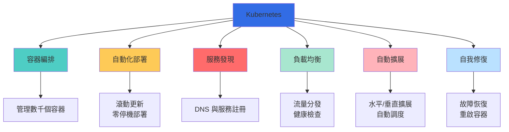

### Kubernetes 解決的問題

| 挑戰 | 傳統方式 | Kubernetes 解決方案 |
|------|----------|---------------------|
| **容器管理** | 手動管理每個容器 | 聲明式配置，自動管理 |
| **服務發現** | 硬編碼 IP 位址 | 內建 DNS 與服務發現 |
| **負載均衡** | 外部負載均衡器 | 內建 Service 負載均衡 |
| **擴展性** | 手動添加實例 | 自動水平擴展（HPA） |
| **故障恢復** | 人工介入 | 自我修復，自動重啟 |
| **更新部署** | 停機維護 | 滾動更新，零停機 |
| **資源利用** | 低效分配 | 智慧調度，資源優化 |
| **配置管理** | 散落各處 | 統一的 ConfigMap/Secret |

## 🔄 為什麼需要 Kubernetes？

### 容器化的演進

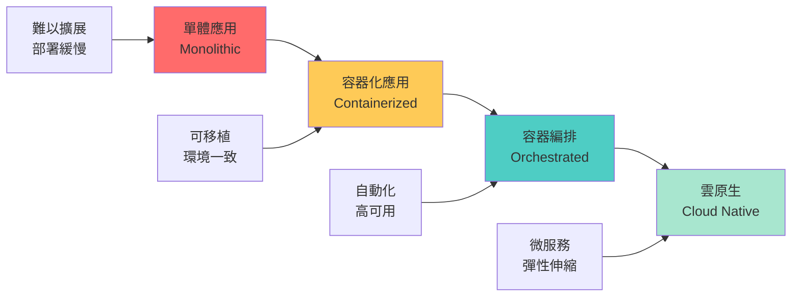

### Docker vs Kubernetes

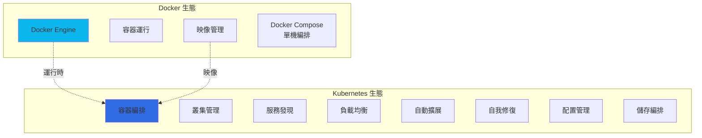

### 對照表

| 特性 | Docker | Docker Compose | Kubernetes |
|------|--------|----------------|------------|
| **適用範圍** | 單容器 | 單機多容器 | 叢集多容器 |
| **擴展性** | 手動 | 有限 | 自動（HPA） |
| **負載均衡** | 需外部 | 基本支援 | 內建 Service |
| **服務發現** | 手動配置 | 容器名稱 | DNS + Service |
| **故障恢復** | 手動 | 重啟策略 | 自動修復 |
| **滾動更新** | 不支援 | 基本支援 | 完整支援 |
| **多主機** | 不支援 | 不支援 | 原生支援 |
| **配置管理** | 環境變數 | .env 檔案 | ConfigMap/Secret |
| **儲存編排** | Volume | Volume | PV/PVC/StorageClass |
| **學習曲線** | 低 | 低 | 高 |

**關係說明：**
- Docker 提供容器運行時
- Kubernetes 使用 Docker（或其他容器運行時）作為底層
- Kubernetes 不是 Docker 的替代品，而是編排層

## 🏗️ Kubernetes 核心架構

### 整體架構圖

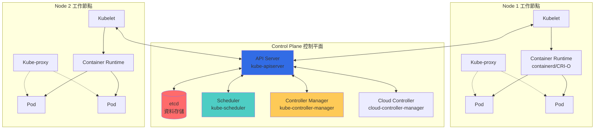

### 控制平面元件（Control Plane）

| 元件 | 作用 | 功能說明 |
|------|------|----------|
| **API Server** | 前端介面 | • 接收所有 REST 請求<br/>• 驗證和處理請求<br/>• 更新 etcd<br/>• 叢集的唯一入口 |
| **etcd** | 資料存儲 | • 分散式鍵值存儲<br/>• 儲存叢集所有狀態<br/>• 強一致性保證<br/>• 支援 watch 機制 |
| **Scheduler** | 調度器 | • 為新 Pod 選擇節點<br/>• 考慮資源需求<br/>• 硬體約束<br/>• 親和性規則 |
| **Controller Manager** | 控制器管理器 | • Node Controller<br/>• Replication Controller<br/>• Endpoints Controller<br/>• Service Account Controller |
| **Cloud Controller** | 雲端控制器 | • 雲端服務整合<br/>• 負載均衡器<br/>• 儲存卷<br/>• 路由管理 |

### 工作節點元件（Node）

| 元件 | 作用 | 功能說明 |
|------|------|----------|
| **Kubelet** | 節點代理 | • 管理 Pod 生命週期<br/>• 執行容器健康檢查<br/>• 回報節點狀態<br/>• 掛載 Volume |
| **Kube-proxy** | 網路代理 | • 維護網路規則<br/>• 實現 Service 抽象<br/>• 負載均衡<br/>• 支援 iptables/IPVS |
| **Container Runtime** | 容器運行時 | • 運行容器<br/>• 拉取映像<br/>• 支援 CRI 介面<br/>• containerd、CRI-O、Docker |

### 元件通訊流程

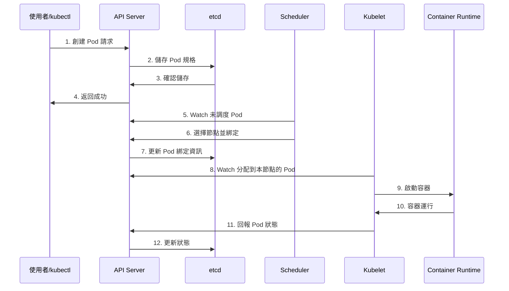

## 📦 Kubernetes 核心概念

### 1. Pod - 最小部署單元

**Pod 是什麼？**
- Kubernetes 中最小的可部署單元
- 一個或多個容器的集合
- 共享網路和儲存空間
- 同一個 Pod 內的容器可以透過 localhost 通訊

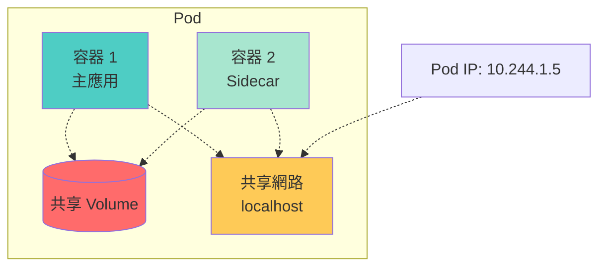

**Pod 特性對照表：**

| 特性 | 說明 | 範例 |
|------|------|------|
| **共享網路** | 同一 Pod 內容器共享 IP | 容器間透過 localhost 通訊 |
| **共享儲存** | 可掛載相同的 Volume | 日誌收集、資料共享 |
| **生命週期** | 作為一個整體管理 | 同時創建、刪除 |
| **調度單元** | 總是被調度到同一節點 | 保證容器位置關係 |
| **臨時性** | Pod 是短暫的 | IP 會變動，需要 Service |

### 2. Deployment - 應用部署

**Deployment 是什麼？**
- 管理無狀態應用的控制器
- 聲明式更新 Pod 和 ReplicaSet
- 支援滾動更新和回滾
- 確保指定數量的 Pod 運行

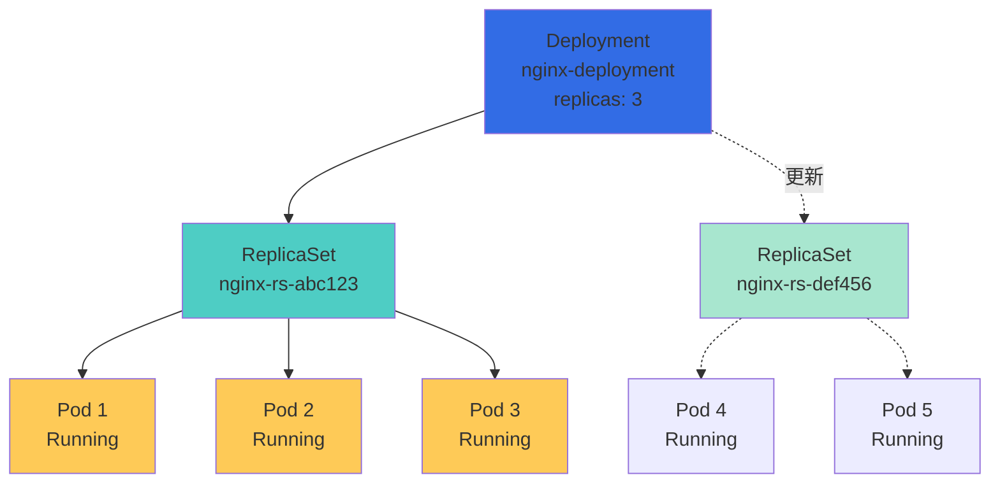

**Deployment 功能：**

| 功能 | 說明 | 指令範例 |
|------|------|----------|
| **創建** | 部署應用 | `kubectl create deployment` |
| **擴展** | 調整副本數 | `kubectl scale deployment` |
| **更新** | 滾動更新 | `kubectl set image` |
| **回滾** | 返回舊版本 | `kubectl rollout undo` |
| **暫停/恢復** | 控制更新流程 | `kubectl rollout pause/resume` |
| **查看歷史** | 版本記錄 | `kubectl rollout history` |

### 3. Service - 服務發現與負載均衡

**Service 是什麼？**
- 為一組 Pod 提供穩定的網路端點
- 內建負載均衡
- 支援服務發現（DNS）
- 解決 Pod IP 不穩定的問題

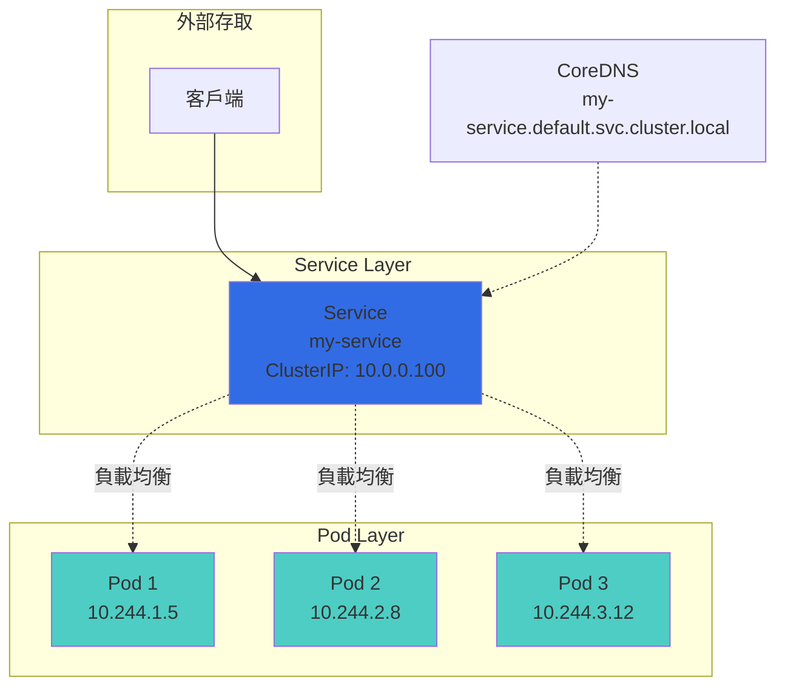

**Service 類型對照表：**

| 類型 | 用途 | 存取方式 | 適用場景 |
|------|------|----------|----------|
| **ClusterIP** | 叢集內部存取 | ClusterIP + Port | 後端服務 |
| **NodePort** | 透過節點 IP 存取 | NodeIP:NodePort | 開發測試 |
| **LoadBalancer** | 雲端負載均衡器 | 外部 IP | 生產環境（雲端） |
| **ExternalName** | DNS CNAME 映射 | DNS 名稱 | 外部服務整合 |

### 4. Volume - 資料持久化

**Volume 類型：**

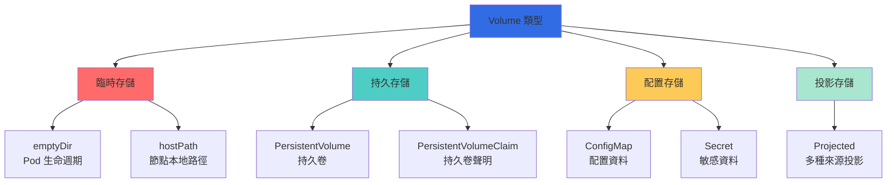

**Volume 類型對照表：**

| 類型 | 生命週期 | 持久性 | 適用場景 |
|------|----------|--------|----------|
| **emptyDir** | Pod | 否 | 臨時資料、快取 |
| **hostPath** | 節點 | 是 | 系統級存取、測試 |
| **PV/PVC** | 獨立 | 是 | 資料庫、檔案存儲 |
| **ConfigMap** | 獨立 | 是 | 配置檔案 |
| **Secret** | 獨立 | 是 | 密鑰、證書 |
| **NFS** | 獨立 | 是 | 共享檔案系統 |
| **CSI** | 獨立 | 是 | 雲端儲存（EBS, Azure Disk） |

### 5. Namespace - 命名空間

**Namespace 是什麼？**
- 虛擬叢集劃分
- 資源隔離
- 多租戶支援
- 資源配額管理

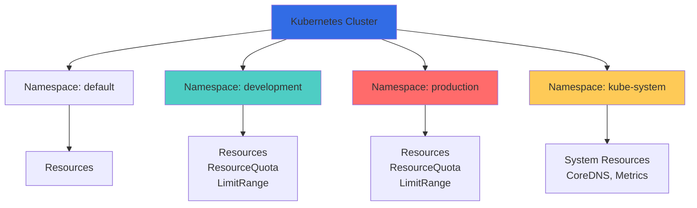

**預設 Namespace：**

| Namespace | 用途 | 說明 |
|-----------|------|------|
| **default** | 預設命名空間 | 未指定時使用 |
| **kube-system** | 系統元件 | K8s 核心元件 |
| **kube-public** | 公開資源 | 所有使用者可讀 |
| **kube-node-lease** | 節點心跳 | 節點健康檢查 |

### 6. ConfigMap & Secret - 配置管理

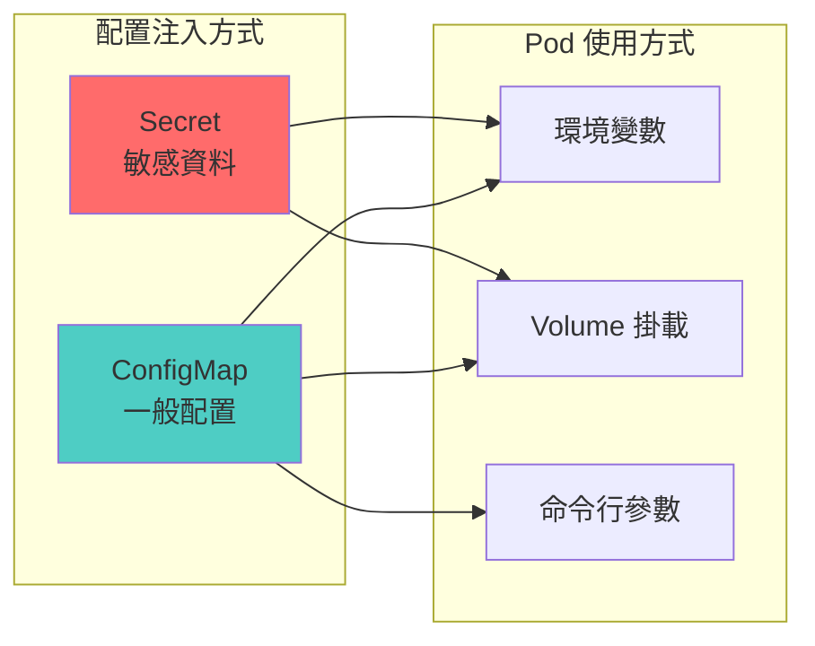

**對照表：**

| 項目 | ConfigMap | Secret |
|------|-----------|--------|
| **用途** | 一般配置資料 | 敏感資料（密碼、金鑰） |
| **編碼** | 明文 | Base64 編碼 |
| **大小限制** | 1MB | 1MB |
| **典型內容** | 配置檔、環境變數 | 密碼、API Token、TLS 證書 |
| **安全性** | 低 | 中（需額外加密） |

## 🔧 Kubernetes 安裝與設定

### 安裝方式對照表

| 方式 | 適用場景 | 複雜度 | 生產可用 |
|------|----------|--------|----------|
| **Minikube** | 本地開發、學習 | 低 | ❌ |
| **Kind** | CI/CD、測試 | 低 | ❌ |
| **k3s** | 邊緣運算、IoT | 低 | ✅ |
| **kubeadm** | 自建叢集 | 中 | ✅ |
| **kOps** | AWS 叢集 | 中 | ✅ |
| **EKS/GKE/AKS** | 雲端託管 | 低 | ✅ |
| **Rancher** | 企業管理平台 | 中 | ✅ |

### 1. Minikube 安裝（本地開發）

**系統需求：**
- 2 CPU 核心以上
- 2GB 記憶體以上
- 20GB 磁碟空間
- 容器或虛擬機管理器（Docker、VirtualBox、KVM）

**macOS 安裝：**

```bash
# 使用 Homebrew 安裝
brew install minikube

# 安裝 kubectl
brew install kubectl

# 啟動 Minikube
minikube start --driver=docker --cpus=2 --memory=4096

# 驗證安裝
kubectl cluster-info
kubectl get nodes

# 啟用插件
minikube addons enable dashboard
minikube addons enable metrics-server
minikube addons enable ingress

# 開啟 Dashboard
minikube dashboard
```

**Linux 安裝：**

```bash
# 下載 Minikube
curl -LO https://storage.googleapis.com/minikube/releases/latest/minikube-linux-amd64
sudo install minikube-linux-amd64 /usr/local/bin/minikube

# 安裝 kubectl
curl -LO "https://dl.k8s.io/release/$(curl -L -s https://dl.k8s.io/release/stable.txt)/bin/linux/amd64/kubectl"
sudo install -o root -g root -m 0755 kubectl /usr/local/bin/kubectl

# 啟動 Minikube
minikube start --driver=docker

# 驗證
kubectl get nodes
```

**Windows 安裝：**

```powershell
# 使用 Chocolatey
choco install minikube
choco install kubernetes-cli

# 或使用 Windows Package Manager
winget install Kubernetes.minikube
winget install Kubernetes.kubectl

# 啟動
minikube start --driver=hyperv

# 驗證
kubectl version --client
kubectl cluster-info
```

### 2. kubectl 配置

**kubectl 配置檔案：** `~/.kube/config`

```yaml
apiVersion: v1
kind: Config
clusters:
- cluster:
    certificate-authority-data: <CA_DATA>
    server: https://127.0.0.1:58619
  name: minikube
contexts:
- context:
    cluster: minikube
    user: minikube
  name: minikube
current-context: minikube
users:
- name: minikube
  user:
    client-certificate-data: <CERT_DATA>
    client-key-data: <KEY_DATA>
```

**常用 kubectl 配置指令：**

```bash
# 查看當前 context
kubectl config current-context

# 列出所有 context
kubectl config get-contexts

# 切換 context
kubectl config use-context minikube

# 查看配置
kubectl config view

# 設定命名空間
kubectl config set-context --current --namespace=development

# 添加叢集
kubectl config set-cluster my-cluster \
  --server=https://k8s.example.com:6443 \
  --certificate-authority=/path/to/ca.crt

# 添加使用者
kubectl config set-credentials my-user \
  --client-certificate=/path/to/client.crt \
  --client-key=/path/to/client.key

# 添加 context
kubectl config set-context my-context \
  --cluster=my-cluster \
  --user=my-user \
  --namespace=default
```

### 3. 驗證叢集健康狀態

```bash
# 查看叢集資訊
kubectl cluster-info

# 查看節點
kubectl get nodes
kubectl describe node <node-name>

# 查看元件狀態
kubectl get componentstatuses
# 或
kubectl get cs

# 查看系統 Pod
kubectl get pods -n kube-system

# 查看所有命名空間的資源
kubectl get all --all-namespaces

# 查看事件
kubectl get events --all-namespaces --sort-by='.lastTimestamp'
```

### 4. 第一個 Kubernetes 應用

**創建 Nginx Deployment：**

```bash
# 創建 Deployment
kubectl create deployment nginx --image=nginx:latest

# 查看 Deployment
kubectl get deployments

# 查看 Pod
kubectl get pods

# 暴露服務
kubectl expose deployment nginx --port=80 --type=NodePort

# 查看 Service
kubectl get services

# 取得服務 URL（Minikube）
minikube service nginx --url

# 測試服務
curl $(minikube service nginx --url)
```

**使用 YAML 檔案部署：**

```yaml
# nginx-deployment.yaml
apiVersion: apps/v1
kind: Deployment
metadata:
  name: nginx-deployment
  labels:
    app: nginx
spec:
  replicas: 3
  selector:
    matchLabels:
      app: nginx
  template:
    metadata:
      labels:
        app: nginx
    spec:
      containers:
      - name: nginx
        image: nginx:1.24
        ports:
        - containerPort: 80
        resources:
          requests:
            memory: "64Mi"
            cpu: "250m"
          limits:
            memory: "128Mi"
            cpu: "500m"

---
apiVersion: v1
kind: Service
metadata:
  name: nginx-service
spec:
  selector:
    app: nginx
  type: LoadBalancer
  ports:
  - protocol: TCP
    port: 80
    targetPort: 80
```

**部署應用：**

```bash
# 應用 YAML
kubectl apply -f nginx-deployment.yaml

# 查看資源
kubectl get deployments,pods,services

# 查看詳細資訊
kubectl describe deployment nginx-deployment
kubectl describe service nginx-service

# 查看 Pod 日誌
kubectl logs <pod-name>

# 進入 Pod
kubectl exec -it <pod-name> -- bash

# 刪除資源
kubectl delete -f nginx-deployment.yaml
```

## 📊 Kubernetes 物件模型

### 宣告式 vs 命令式

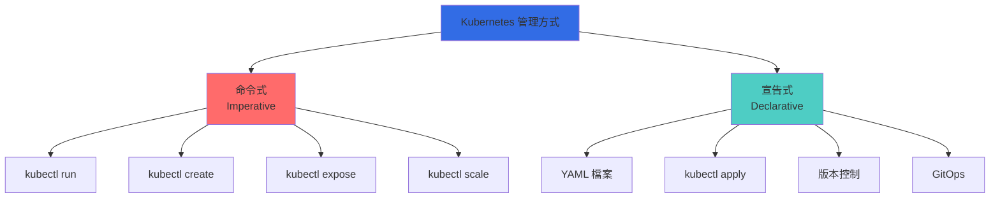

**對照表：**

| 特性 | 命令式（Imperative） | 宣告式（Declarative） |
|------|---------------------|---------------------|
| **命令方式** | `kubectl create`, `run` | `kubectl apply` |
| **配置檔案** | 不需要 | YAML/JSON |
| **版本控制** | 困難 | 容易（Git） |
| **可重複性** | 低 | 高 |
| **生產環境** | 不推薦 | 推薦 |
| **學習曲線** | 低 | 中 |
| **適用場景** | 快速測試、學習 | 生產部署、GitOps |

### YAML 基本結構

```yaml
# 所有 Kubernetes 物件都遵循此結構
apiVersion: apps/v1              # API 版本
kind: Deployment                 # 資源類型
metadata:                        # 元資料
  name: my-app                   # 名稱
  namespace: default             # 命名空間
  labels:                        # 標籤
    app: my-app
    env: production
  annotations:                   # 註解
    description: "My application"
spec:                            # 規格定義
  # 具體規格內容
  replicas: 3
  selector:
    matchLabels:
      app: my-app
  template:
    metadata:
      labels:
        app: my-app
    spec:
      containers:
      - name: app
        image: my-app:v1.0
```

### 標籤（Labels）與選擇器（Selectors）

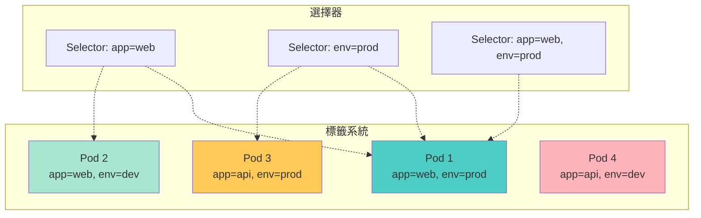

**標籤最佳實踐：**

| 標籤鍵 | 說明 | 範例值 |
|--------|------|--------|
| `app` | 應用名稱 | `nginx`, `mysql` |
| `version` | 應用版本 | `v1.0.0`, `stable` |
| `component` | 架構元件 | `frontend`, `backend`, `database` |
| `tier` | 應用層級 | `frontend`, `backend`, `cache` |
| `environment` | 環境 | `production`, `staging`, `dev` |
| `managed-by` | 管理工具 | `helm`, `kubectl`, `terraform` |
| `part-of` | 所屬專案 | `myproject`, `e-commerce` |

## 🎯 學習路徑與資源

### 學習階段規劃

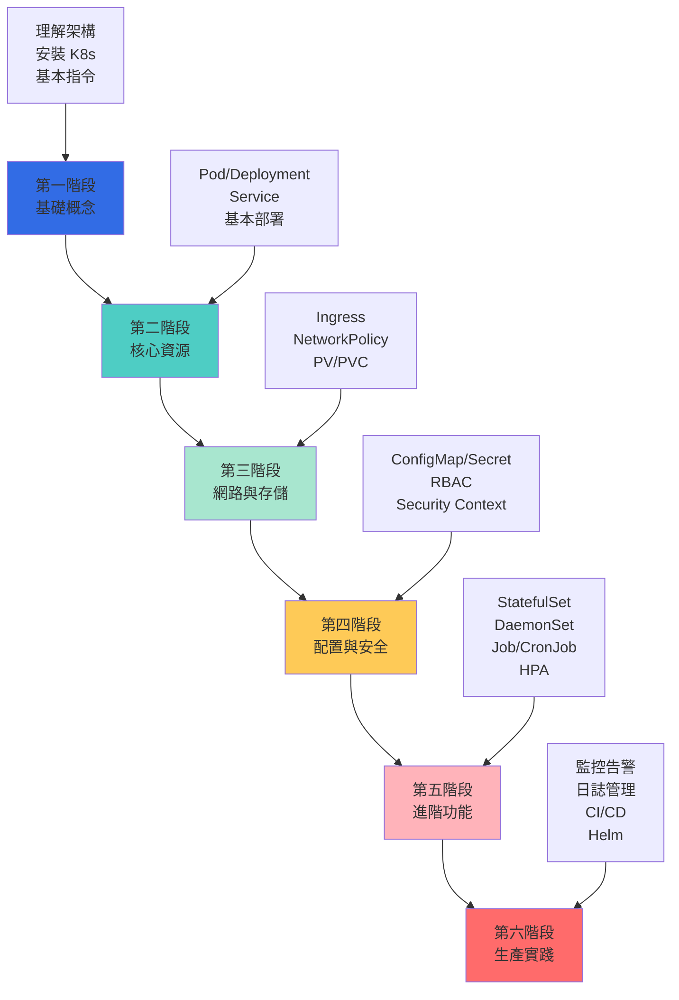

### 推薦學習資源

**官方文件：**
- [Kubernetes 官方文件](https://kubernetes.io/docs/)
- [Kubernetes 官方教學](https://kubernetes.io/docs/tutorials/)
- [Kubectl 參考文件](https://kubernetes.io/docs/reference/kubectl/)

**互動式學習：**
- [Play with Kubernetes](https://labs.play-with-k8s.com/)
- [Katacoda Kubernetes Scenarios](https://www.katacoda.com/courses/kubernetes)
- [Kubernetes by Example](https://kubernetesbyexample.com/)

**認證考試：**
- **CKA**（Certified Kubernetes Administrator）- 管理員認證
- **CKAD**（Certified Kubernetes Application Developer）- 開發者認證
- **CKS**（Certified Kubernetes Security Specialist）- 安全專家認證

## 🔍 常見問題解答

### Q1: Kubernetes 和 Docker 是什麼關係？

**答：** Kubernetes 與 Docker 是互補而非競爭關係：

| 層級 | Docker | Kubernetes |
|------|--------|------------|
| **定位** | 容器運行時 | 容器編排平台 |
| **作用** | 運行單個容器 | 管理多個容器 |
| **範圍** | 單機 | 叢集 |
| **關係** | K8s 使用 Docker 作為底層運行時之一 | |

### Q2: 什麼時候需要使用 Kubernetes？

**適合使用 K8s：**
- 微服務架構
- 需要自動擴展
- 多環境部署（dev/staging/prod）
- 需要高可用性
- 容器數量超過 10 個

**不需要 K8s：**
- 單體應用
- 小型專案（<5 個容器）
- 學習階段（可用 Docker Compose）
- 資源有限（管理開銷大）

### Q3: Kubernetes 有哪些替代方案？

| 方案 | 特點 | 適用場景 |
|------|------|----------|
| **Docker Swarm** | 簡單、Docker 原生 | 小規模、簡單需求 |
| **Nomad** | 輕量、支援多種工作負載 | 混合工作負載 |
| **ECS** | AWS 託管 | AWS 生態系統 |
| **Cloud Run** | 無伺服器容器 | 簡單 HTTP 服務 |

### Q4: Kubernetes 學習曲線陡峭嗎？

**學習難度分析：**

| 階段 | 難度 | 時間 | 內容 |
|------|------|------|------|
| **基礎** | ⭐⭐ | 1-2週 | Pod, Deployment, Service |
| **中級** | ⭐⭐⭐ | 1-2月 | Volume, ConfigMap, Ingress |
| **進階** | ⭐⭐⭐⭐ | 3-6月 | StatefulSet, Operator, CRD |
| **專家** | ⭐⭐⭐⭐⭐ | 6月+ | 叢集管理、調優、安全 |

**學習建議：**
1. 先掌握 Docker 基礎
2. 循序漸進，從簡單應用開始
3. 實際操作比理論重要
4. 多看官方文件和範例
5. 參與社群討論

### Q5: 生產環境需要多少資源？

**最小叢集配置（小型）：**
- **Control Plane**：2 CPU, 4GB RAM
- **Worker Node** × 3：2 CPU, 4GB RAM each
- **總計**：8 CPU, 16GB RAM

**推薦配置（中型）：**
- **Control Plane**：4 CPU, 8GB RAM
- **Worker Node** × 5：4 CPU, 8GB RAM each
- **總計**：24 CPU, 48GB RAM

## 🎉 總結

本文介紹了 Kubernetes 的基礎概念，涵蓋：

### 核心知識點

1. **什麼是 Kubernetes**
   - 容器編排平台
   - 解決的問題
   - 與 Docker 的關係

2. **核心架構**
   - 控制平面（Control Plane）
   - 工作節點（Node）
   - 元件通訊流程

3. **核心概念**
   - Pod：最小部署單元
   - Deployment：應用部署管理
   - Service：服務發現與負載均衡
   - Volume：資料持久化
   - Namespace：資源隔離
   - ConfigMap/Secret：配置管理

4. **安裝與配置**
   - Minikube 本地開發環境
   - kubectl 配置
   - 第一個應用部署

### 關鍵要點

- Kubernetes 是容器編排的事實標準
- 聲明式配置是最佳實踐
- 標籤與選擇器是資源管理的核心
- 從簡單開始，循序漸進

### 下一步學習

在第二篇文章中，我們將深入探討：
- 核心工作負載資源（Pod、Deployment、StatefulSet）
- Service 與 Ingress 網路配置
- 儲存管理（PV、PVC、StorageClass）
- ConfigMap 與 Secret 實務應用
- kubectl 進階操作與技巧

掌握這些基礎概念後，您將能夠理解 Kubernetes 的運作原理，為後續深入學習打下堅實的基礎！