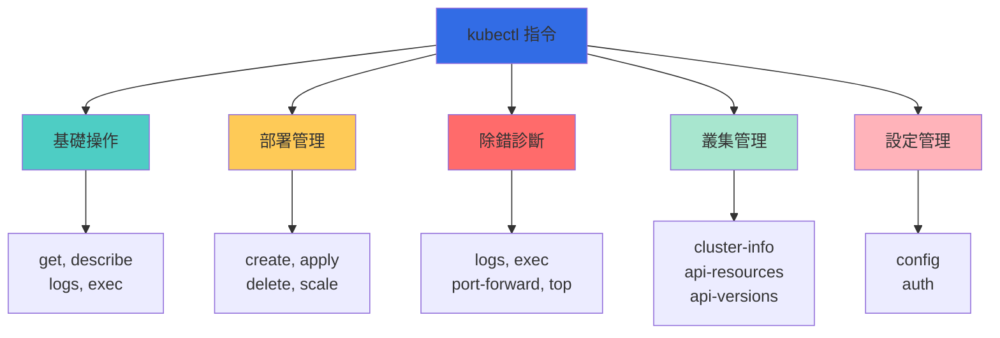
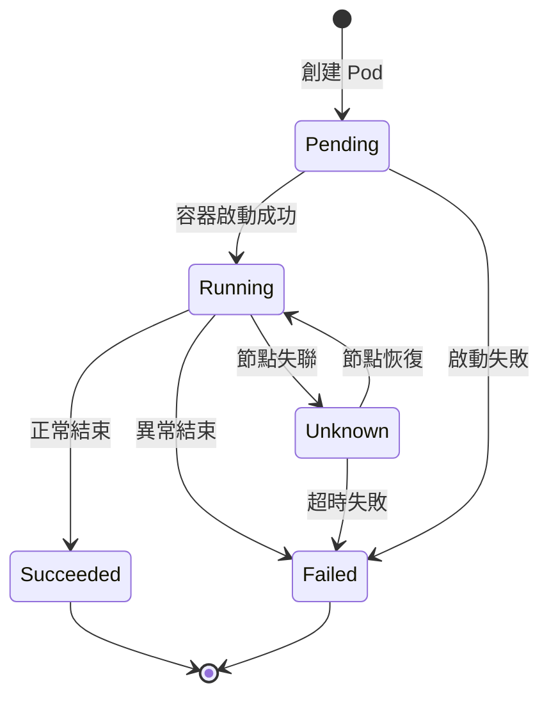
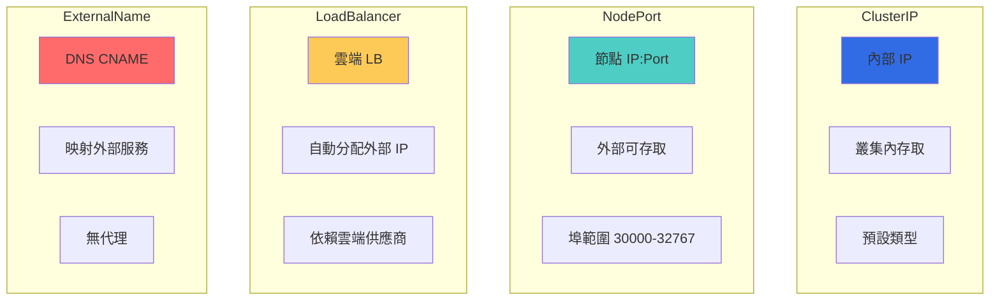
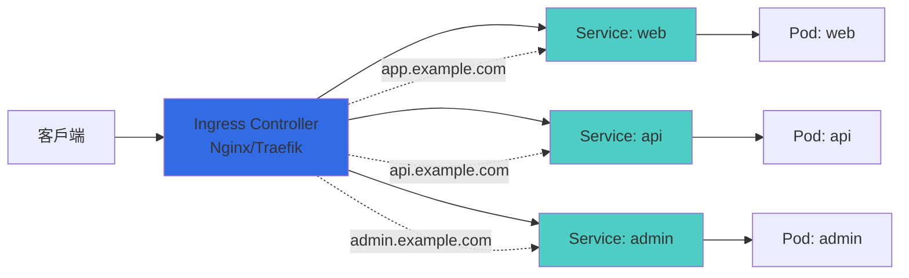
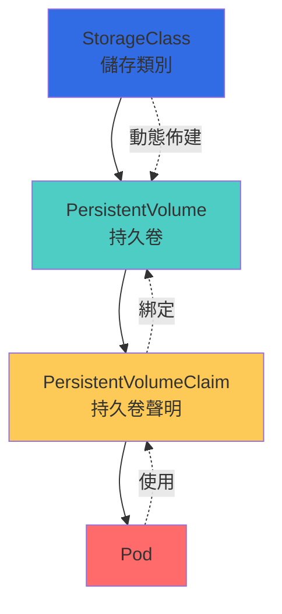

## 🎯 前言

在上一篇文章中，我們了解了 Kubernetes 的基礎概念與架構。本文將深入探討核心資源對象的實務操作，透過大量範例與表格說明，幫助你全面掌握 K8s 的日常操作。

**本文重點：**
- kubectl 指令完全指南
- Pod 深度解析與操作
- Workload 資源管理
- Service 與網路配置
- Ingress 路由管理
- 儲存資源操作
- 配置管理實戰

## 🔧 kubectl 指令完全指南

### kubectl 指令結構

```bash
kubectl [command] [TYPE] [NAME] [flags]
```

**範例：**
```bash
kubectl get pods nginx-pod -o yaml
#       ↑   ↑    ↑         ↑
#    指令  類型  名稱    選項
```

### 基本指令分類



### kubectl 常用指令速查表

#### 基礎操作指令

| 指令 | 用途 | 範例 |
|------|------|------|
| `get` | 列出資源 | `kubectl get pods` |
| `describe` | 查看詳細資訊 | `kubectl describe pod nginx` |
| `create` | 創建資源 | `kubectl create deployment nginx --image=nginx` |
| `apply` | 應用配置 | `kubectl apply -f deployment.yaml` |
| `delete` | 刪除資源 | `kubectl delete pod nginx` |
| `edit` | 編輯資源 | `kubectl edit deployment nginx` |
| `exec` | 在容器中執行指令 | `kubectl exec -it nginx -- bash` |
| `logs` | 查看日誌 | `kubectl logs nginx` |
| `port-forward` | 埠轉發 | `kubectl port-forward pod/nginx 8080:80` |

#### 進階操作指令

| 指令 | 用途 | 範例 |
|------|------|------|
| `scale` | 擴展副本數 | `kubectl scale deployment nginx --replicas=5` |
| `rollout` | 更新管理 | `kubectl rollout status deployment/nginx` |
| `label` | 管理標籤 | `kubectl label pod nginx env=prod` |
| `annotate` | 管理註解 | `kubectl annotate pod nginx description="web server"` |
| `expose` | 暴露服務 | `kubectl expose deployment nginx --port=80` |
| `top` | 資源使用情況 | `kubectl top nodes` |
| `cp` | 複製檔案 | `kubectl cp nginx:/tmp/file ./file` |
| `attach` | 附加到容器 | `kubectl attach nginx -it` |

### kubectl 輸出格式

```bash
# 預設輸出
kubectl get pods

# 寬輸出（更多資訊）
kubectl get pods -o wide

# YAML 格式
kubectl get pod nginx -o yaml

# JSON 格式
kubectl get pod nginx -o json

# 自訂欄位
kubectl get pods -o custom-columns=NAME:.metadata.name,STATUS:.status.phase

# JSONPath 查詢
kubectl get pods -o jsonpath='{.items[*].metadata.name}'

# 使用模板
kubectl get pods -o go-template='{{range .items}}{{.metadata.name}}{{"\n"}}{{end}}'

# 只顯示名稱
kubectl get pods -o name
```

### kubectl 實用技巧

```bash
# 查看所有命名空間的資源
kubectl get pods --all-namespaces
kubectl get all -A  # 簡寫

# 監視資源變化
kubectl get pods --watch
kubectl get pods -w  # 簡寫

# 排序輸出
kubectl get pods --sort-by=.metadata.creationTimestamp
kubectl get pods --sort-by=.status.startTime

# 過濾標籤
kubectl get pods -l app=nginx
kubectl get pods -l 'env in (prod,staging)'
kubectl get pods -l app=nginx,tier=frontend

# 欄位選擇器
kubectl get pods --field-selector status.phase=Running
kubectl get pods --field-selector metadata.namespace=default

# 顯示標籤
kubectl get pods --show-labels

# 乾跑（不實際執行）
kubectl apply -f deployment.yaml --dry-run=client
kubectl apply -f deployment.yaml --dry-run=server

# 輸出到檔案
kubectl get deployment nginx -o yaml > nginx-deployment.yaml

# 查看 API 資源
kubectl api-resources
kubectl api-versions

# 解釋資源欄位
kubectl explain pod
kubectl explain pod.spec
kubectl explain pod.spec.containers
```

## 📦 Pod 深度解析

### Pod 生命週期



### Pod 階段（Phase）說明

| 階段 | 說明 | 何時出現 |
|------|------|----------|
| **Pending** | 等待中 | Pod 已創建但容器未啟動 |
| **Running** | 運行中 | 至少一個容器正在運行 |
| **Succeeded** | 成功 | 所有容器成功終止（Job） |
| **Failed** | 失敗 | 容器非零退出或被系統終止 |
| **Unknown** | 未知 | 無法獲取 Pod 狀態 |

### Pod 完整配置範例

```yaml
apiVersion: v1
kind: Pod
metadata:
  name: nginx-pod
  namespace: default
  labels:
    app: nginx
    tier: frontend
    environment: production
  annotations:
    description: "Nginx web server"
    version: "1.24"
spec:
  # 容器定義
  containers:
  - name: nginx
    image: nginx:1.24
    imagePullPolicy: IfNotPresent  # Always, Never, IfNotPresent

    # 埠配置
    ports:
    - name: http
      containerPort: 80
      protocol: TCP

    # 環境變數
    env:
    - name: NGINX_PORT
      value: "80"
    - name: NGINX_HOST
      valueFrom:
        configMapKeyRef:
          name: nginx-config
          key: host

    # 資源限制
    resources:
      requests:
        memory: "128Mi"
        cpu: "250m"
      limits:
        memory: "256Mi"
        cpu: "500m"

    # Volume 掛載
    volumeMounts:
    - name: html
      mountPath: /usr/share/nginx/html
    - name: config
      mountPath: /etc/nginx/nginx.conf
      subPath: nginx.conf

    # 健康檢查
    livenessProbe:
      httpGet:
        path: /
        port: 80
      initialDelaySeconds: 30
      periodSeconds: 10
      timeoutSeconds: 5
      failureThreshold: 3

    readinessProbe:
      httpGet:
        path: /
        port: 80
      initialDelaySeconds: 10
      periodSeconds: 5

    # 啟動探測
    startupProbe:
      httpGet:
        path: /
        port: 80
      initialDelaySeconds: 0
      periodSeconds: 10
      failureThreshold: 30

    # 生命週期鉤子
    lifecycle:
      postStart:
        exec:
          command: ["/bin/sh", "-c", "echo Hello from the postStart handler > /usr/share/message"]
      preStop:
        exec:
          command: ["/bin/sh", "-c", "nginx -s quit; while killall -0 nginx; do sleep 1; done"]

  # Init 容器
  initContainers:
  - name: init-html
    image: busybox:1.35
    command: ['sh', '-c', 'echo "<h1>Initialized</h1>" > /work-dir/index.html']
    volumeMounts:
    - name: html
      mountPath: /work-dir

  # Volume 定義
  volumes:
  - name: html
    emptyDir: {}
  - name: config
    configMap:
      name: nginx-config

  # DNS 配置
  dnsPolicy: ClusterFirst
  dnsConfig:
    nameservers:
      - 8.8.8.8
    searches:
      - default.svc.cluster.local
      - svc.cluster.local

  # 主機網路
  hostNetwork: false
  hostPID: false
  hostIPC: false

  # 重啟策略
  restartPolicy: Always  # Always, OnFailure, Never

  # 節點選擇
  nodeSelector:
    disktype: ssd

  # 親和性
  affinity:
    nodeAffinity:
      requiredDuringSchedulingIgnoredDuringExecution:
        nodeSelectorTerms:
        - matchExpressions:
          - key: kubernetes.io/hostname
            operator: In
            values:
            - node-1
            - node-2

  # 容忍
  tolerations:
  - key: "key1"
    operator: "Equal"
    value: "value1"
    effect: "NoSchedule"

  # 安全上下文
  securityContext:
    runAsUser: 1000
    runAsGroup: 3000
    fsGroup: 2000

  # 服務帳戶
  serviceAccountName: default

  # 優先級
  priorityClassName: high-priority

  # 終止寬限期
  terminationGracePeriodSeconds: 30
```

### 健康檢查對照表

| 探測類型 | 用途 | 失敗影響 |
|----------|------|----------|
| **livenessProbe** | 檢查容器是否存活 | 重啟容器 |
| **readinessProbe** | 檢查容器是否就緒 | 從 Service 移除 |
| **startupProbe** | 檢查容器是否啟動 | 重啟容器 |

**探測方法：**

| 方法 | 說明 | 適用場景 |
|------|------|----------|
| **httpGet** | HTTP GET 請求 | Web 應用 |
| **tcpSocket** | TCP 連接 | 數據庫、非 HTTP 服務 |
| **exec** | 執行命令 | 自訂檢查邏輯 |
| **grpc** | gRPC 健康檢查 | gRPC 服務 |

### Pod 操作指令

```bash
# 創建 Pod
kubectl run nginx --image=nginx:1.24
kubectl apply -f pod.yaml

# 查看 Pod
kubectl get pods
kubectl get pods -o wide
kubectl get pods --show-labels
kubectl get pods -l app=nginx

# 查看詳細資訊
kubectl describe pod nginx

# 查看日誌
kubectl logs nginx
kubectl logs nginx -c container-name  # 多容器
kubectl logs nginx --previous  # 查看之前容器的日誌
kubectl logs nginx --tail=100  # 最後 100 行
kubectl logs nginx -f  # 實時跟蹤

# 進入容器
kubectl exec -it nginx -- bash
kubectl exec nginx -- ls /usr/share/nginx/html

# 埠轉發
kubectl port-forward pod/nginx 8080:80
curl http://localhost:8080

# 複製檔案
kubectl cp nginx:/etc/nginx/nginx.conf ./nginx.conf
kubectl cp ./index.html nginx:/usr/share/nginx/html/

# 查看資源使用
kubectl top pod nginx

# 刪除 Pod
kubectl delete pod nginx
kubectl delete pod --all
kubectl delete pod nginx --force --grace-period=0  # 強制刪除
```

## 🚀 Workload 資源管理

### Deployment - 無狀態應用

**Deployment 完整配置：**

```yaml
apiVersion: apps/v1
kind: Deployment
metadata:
  name: nginx-deployment
  namespace: default
  labels:
    app: nginx
  annotations:
    kubernetes.io/change-cause: "Update to version 1.24"
spec:
  # 副本數
  replicas: 3

  # 選擇器
  selector:
    matchLabels:
      app: nginx

  # 更新策略
  strategy:
    type: RollingUpdate  # RollingUpdate 或 Recreate
    rollingUpdate:
      maxSurge: 1        # 最多超出的 Pod 數
      maxUnavailable: 1  # 最多不可用的 Pod 數

  # 最小就緒時間
  minReadySeconds: 10

  # 修訂版本歷史限制
  revisionHistoryLimit: 10

  # Pod 模板
  template:
    metadata:
      labels:
        app: nginx
        version: "1.24"
    spec:
      containers:
      - name: nginx
        image: nginx:1.24
        ports:
        - containerPort: 80
        resources:
          requests:
            memory: "64Mi"
            cpu: "250m"
          limits:
            memory: "128Mi"
            cpu: "500m"
        livenessProbe:
          httpGet:
            path: /
            port: 80
          initialDelaySeconds: 30
          periodSeconds: 10
        readinessProbe:
          httpGet:
            path: /
            port: 80
          initialDelaySeconds: 5
          periodSeconds: 5
```

### Deployment 操作指令

```bash
# 創建 Deployment
kubectl create deployment nginx --image=nginx:1.24
kubectl apply -f deployment.yaml

# 查看 Deployment
kubectl get deployments
kubectl get deploy  # 簡寫
kubectl describe deployment nginx

# 擴展副本
kubectl scale deployment nginx --replicas=5
kubectl autoscale deployment nginx --min=2 --max=10 --cpu-percent=80

# 更新映像
kubectl set image deployment/nginx nginx=nginx:1.25
kubectl set image deployment/nginx nginx=nginx:1.25 --record

# 編輯 Deployment
kubectl edit deployment nginx

# 查看更新狀態
kubectl rollout status deployment/nginx
kubectl rollout history deployment/nginx
kubectl rollout history deployment/nginx --revision=2

# 暫停/恢復更新
kubectl rollout pause deployment/nginx
kubectl rollout resume deployment/nginx

# 回滾
kubectl rollout undo deployment/nginx
kubectl rollout undo deployment/nginx --to-revision=2

# 重啟 Deployment（滾動重啟所有 Pod）
kubectl rollout restart deployment/nginx

# 刪除 Deployment
kubectl delete deployment nginx
```

### 更新策略對照表

| 策略類型 | 說明 | 適用場景 | 停機時間 |
|----------|------|----------|----------|
| **RollingUpdate** | 逐步替換舊 Pod | 無狀態應用 | 無 |
| **Recreate** | 先刪除所有舊 Pod 再創建新 Pod | 不支援多版本共存 | 有 |

### StatefulSet - 有狀態應用

```yaml
apiVersion: apps/v1
kind: StatefulSet
metadata:
  name: mysql
spec:
  serviceName: mysql
  replicas: 3
  selector:
    matchLabels:
      app: mysql
  template:
    metadata:
      labels:
        app: mysql
    spec:
      containers:
      - name: mysql
        image: mysql:8.0
        ports:
        - containerPort: 3306
          name: mysql
        env:
        - name: MYSQL_ROOT_PASSWORD
          valueFrom:
            secretKeyRef:
              name: mysql-secret
              key: password
        volumeMounts:
        - name: data
          mountPath: /var/lib/mysql
  volumeClaimTemplates:
  - metadata:
      name: data
    spec:
      accessModes: ["ReadWriteOnce"]
      storageClassName: standard
      resources:
        requests:
          storage: 10Gi
```

**StatefulSet 特性：**

| 特性 | Deployment | StatefulSet |
|------|------------|-------------|
| **Pod 名稱** | 隨機 | 固定（有序） |
| **網路標識** | 不穩定 | 穩定 DNS |
| **儲存** | 共享 | 專屬 PVC |
| **啟動順序** | 並行 | 有序 |
| **更新順序** | 隨機 | 有序 |
| **適用場景** | 無狀態 | 資料庫、叢集 |

### DaemonSet - 每節點一個 Pod

```yaml
apiVersion: apps/v1
kind: DaemonSet
metadata:
  name: fluentd
  namespace: kube-system
spec:
  selector:
    matchLabels:
      app: fluentd
  template:
    metadata:
      labels:
        app: fluentd
    spec:
      tolerations:
      - key: node-role.kubernetes.io/master
        effect: NoSchedule
      containers:
      - name: fluentd
        image: fluentd:v1.14
        resources:
          limits:
            memory: 200Mi
          requests:
            cpu: 100m
            memory: 200Mi
        volumeMounts:
        - name: varlog
          mountPath: /var/log
      volumes:
      - name: varlog
        hostPath:
          path: /var/log
```

**DaemonSet 使用場景：**
- 日誌收集（Fluentd、Filebeat）
- 監控代理（Node Exporter、Datadog）
- 儲存守護進程（Ceph、GlusterFS）
- 網路插件（Calico、Flannel）

### Job & CronJob - 任務管理

**Job 一次性任務：**

```yaml
apiVersion: batch/v1
kind: Job
metadata:
  name: pi-calculation
spec:
  # 完成數
  completions: 5
  # 並行數
  parallelism: 2
  # 重試次數
  backoffLimit: 4
  # 超時時間
  activeDeadlineSeconds: 100
  template:
    spec:
      containers:
      - name: pi
        image: perl:5.34
        command: ["perl", "-Mbignum=bpi", "-wle", "print bpi(2000)"]
      restartPolicy: Never
```

**CronJob 定時任務：**

```yaml
apiVersion: batch/v1
kind: CronJob
metadata:
  name: backup-job
spec:
  # Cron 表達式
  schedule: "0 2 * * *"  # 每天凌晨 2 點
  # 時區
  timeZone: "Asia/Taipei"
  # 並發策略
  concurrencyPolicy: Forbid  # Allow, Forbid, Replace
  # 保留成功任務數
  successfulJobsHistoryLimit: 3
  # 保留失敗任務數
  failedJobsHistoryLimit: 1
  # 啟動截止時間
  startingDeadlineSeconds: 100
  jobTemplate:
    spec:
      template:
        spec:
          containers:
          - name: backup
            image: backup-tool:latest
            command: ["/bin/sh", "-c", "backup.sh"]
          restartPolicy: OnFailure
```

## 🌐 Service 與網路配置

### Service 類型詳解



### Service 完整配置範例

```yaml
apiVersion: v1
kind: Service
metadata:
  name: nginx-service
  namespace: default
  labels:
    app: nginx
  annotations:
    service.beta.kubernetes.io/aws-load-balancer-type: "nlb"
spec:
  # Service 類型
  type: LoadBalancer  # ClusterIP, NodePort, LoadBalancer, ExternalName

  # 選擇器
  selector:
    app: nginx

  # 埠配置
  ports:
  - name: http
    protocol: TCP
    port: 80          # Service 埠
    targetPort: 80    # Pod 埠
    nodePort: 30080   # NodePort（type=NodePort 時）
  - name: https
    protocol: TCP
    port: 443
    targetPort: 443

  # ClusterIP 配置
  clusterIP: 10.0.0.100  # 可指定或設為 None（Headless Service）

  # 會話親和性
  sessionAffinity: ClientIP
  sessionAffinityConfig:
    clientIP:
      timeoutSeconds: 10800

  # 外部流量策略
  externalTrafficPolicy: Local  # Cluster 或 Local

  # 健康檢查節點埠
  healthCheckNodePort: 30000

  # 負載均衡器設定
  loadBalancerIP: 203.0.113.10
  loadBalancerSourceRanges:
  - 203.0.113.0/24

  # 外部 IP
  externalIPs:
  - 203.0.113.20
```

### Service 類型對照表

| 類型 | ClusterIP | NodePort | LoadBalancer | ExternalName |
|------|-----------|----------|--------------|--------------|
| **存取方式** | 內部 IP | 節點 IP:Port | 外部 LB IP | DNS CNAME |
| **外部存取** | ❌ | ✅ | ✅ | ✅ |
| **埠範圍** | 任意 | 30000-32767 | 任意 | N/A |
| **雲端依賴** | ❌ | ❌ | ✅ | ❌ |
| **適用場景** | 內部服務 | 開發測試 | 生產環境 | 外部整合 |
| **負載均衡** | ✅ | ✅ | ✅ | ❌ |

### Headless Service

```yaml
apiVersion: v1
kind: Service
metadata:
  name: mysql-headless
spec:
  clusterIP: None  # Headless Service
  selector:
    app: mysql
  ports:
  - port: 3306
    targetPort: 3306
```

**用途：**
- StatefulSet 服務發現
- 自訂負載均衡
- 直接獲取 Pod IP

### Service 操作指令

```bash
# 創建 Service
kubectl expose deployment nginx --port=80 --type=NodePort
kubectl apply -f service.yaml

# 查看 Service
kubectl get services
kubectl get svc  # 簡寫
kubectl get svc -o wide
kubectl describe svc nginx

# 查看 Endpoints
kubectl get endpoints nginx
kubectl get ep nginx  # 簡寫

# 測試 Service（從 Pod 內部）
kubectl run test --rm -it --image=busybox -- sh
wget -O- http://nginx-service

# 查看 Service 對應的 Pod
kubectl get pods -l app=nginx

# 刪除 Service
kubectl delete svc nginx
```

## 🔀 Ingress 路由管理

### Ingress 架構



### Ingress 完整配置

```yaml
apiVersion: networking.k8s.io/v1
kind: Ingress
metadata:
  name: app-ingress
  namespace: default
  annotations:
    # Nginx Ingress 註解
    nginx.ingress.kubernetes.io/rewrite-target: /
    nginx.ingress.kubernetes.io/ssl-redirect: "true"
    nginx.ingress.kubernetes.io/force-ssl-redirect: "true"
    nginx.ingress.kubernetes.io/proxy-body-size: "10m"
    nginx.ingress.kubernetes.io/proxy-connect-timeout: "600"
    nginx.ingress.kubernetes.io/proxy-send-timeout: "600"
    nginx.ingress.kubernetes.io/proxy-read-timeout: "600"
    nginx.ingress.kubernetes.io/rate-limit: "100"
    nginx.ingress.kubernetes.io/limit-rps: "10"

    # CORS 設定
    nginx.ingress.kubernetes.io/enable-cors: "true"
    nginx.ingress.kubernetes.io/cors-allow-origin: "*"

    # 認證
    nginx.ingress.kubernetes.io/auth-type: basic
    nginx.ingress.kubernetes.io/auth-secret: basic-auth
    nginx.ingress.kubernetes.io/auth-realm: 'Authentication Required'

    # TLS 設定
    cert-manager.io/cluster-issuer: "letsencrypt-prod"
spec:
  # Ingress Class
  ingressClassName: nginx

  # TLS 配置
  tls:
  - hosts:
    - app.example.com
    - api.example.com
    secretName: tls-secret

  # 路由規則
  rules:
  # 主應用
  - host: app.example.com
    http:
      paths:
      - path: /
        pathType: Prefix
        backend:
          service:
            name: web-service
            port:
              number: 80

  # API 服務
  - host: api.example.com
    http:
      paths:
      - path: /v1
        pathType: Prefix
        backend:
          service:
            name: api-service
            port:
              number: 8080
      - path: /v2
        pathType: Prefix
        backend:
          service:
            name: api-v2-service
            port:
              number: 8080

  # 管理後台
  - host: admin.example.com
    http:
      paths:
      - path: /
        pathType: Prefix
        backend:
          service:
            name: admin-service
            port:
              number: 3000

  # 預設後端
  defaultBackend:
    service:
      name: default-backend
      port:
        number: 80
```

### PathType 對照表

| PathType | 說明 | 範例 | 匹配規則 |
|----------|------|------|----------|
| **Prefix** | 前綴匹配 | `/api` | `/api`, `/api/v1`, `/api/users` |
| **Exact** | 精確匹配 | `/api` | 只匹配 `/api` |
| **ImplementationSpecific** | 由 Ingress Controller 決定 | `/api` | 依 Controller 而定 |

### 安裝 Ingress Controller

```bash
# Nginx Ingress Controller
kubectl apply -f https://raw.githubusercontent.com/kubernetes/ingress-nginx/controller-v1.8.1/deploy/static/provider/cloud/deploy.yaml

# 驗證安裝
kubectl get pods -n ingress-nginx
kubectl get svc -n ingress-nginx

# Minikube 啟用 Ingress
minikube addons enable ingress
```

### Ingress 操作指令

```bash
# 創建 Ingress
kubectl apply -f ingress.yaml

# 查看 Ingress
kubectl get ingress
kubectl get ing  # 簡寫
kubectl describe ingress app-ingress

# 查看 Ingress Class
kubectl get ingressclass

# 測試 Ingress（需要配置 DNS 或 hosts）
curl -H "Host: app.example.com" http://<INGRESS_IP>

# 編輯 Ingress
kubectl edit ingress app-ingress

# 刪除 Ingress
kubectl delete ingress app-ingress
```

## 💾 儲存資源管理

### 儲存資源層級



### StorageClass 配置

```yaml
apiVersion: storage.k8s.io/v1
kind: StorageClass
metadata:
  name: fast-ssd
provisioner: kubernetes.io/aws-ebs
parameters:
  type: gp3
  iopsPerGB: "10"
  fsType: ext4
  encrypted: "true"
volumeBindingMode: WaitForFirstConsumer
allowVolumeExpansion: true
reclaimPolicy: Delete
```

**ReclaimPolicy 對照表：**

| 策略 | 說明 | 資料保留 |
|------|------|----------|
| **Delete** | 刪除 PVC 時刪除 PV | ❌ |
| **Retain** | 保留 PV | ✅ |
| **Recycle** | 清理並重用（已棄用） | ❌ |

### PersistentVolume 配置

```yaml
apiVersion: v1
kind: PersistentVolume
metadata:
  name: pv-nfs
spec:
  capacity:
    storage: 10Gi
  volumeMode: Filesystem
  accessModes:
  - ReadWriteMany
  persistentVolumeReclaimPolicy: Retain
  storageClassName: nfs
  mountOptions:
  - hard
  - nfsvers=4.1
  nfs:
    path: /data
    server: nfs-server.example.com
```

**AccessModes 對照表：**

| 模式 | 簡寫 | 說明 | 適用場景 |
|------|------|------|----------|
| **ReadWriteOnce** | RWO | 單節點讀寫 | 資料庫 |
| **ReadOnlyMany** | ROX | 多節點唯讀 | 靜態資源 |
| **ReadWriteMany** | RWX | 多節點讀寫 | 共享檔案系統 |
| **ReadWriteOncePod** | RWOP | 單 Pod 讀寫 | 嚴格隔離 |

### PersistentVolumeClaim 配置

```yaml
apiVersion: v1
kind: PersistentVolumeClaim
metadata:
  name: mysql-pvc
spec:
  accessModes:
  - ReadWriteOnce
  volumeMode: Filesystem
  resources:
    requests:
      storage: 10Gi
  storageClassName: fast-ssd
  selector:
    matchLabels:
      environment: production
```

### 儲存操作指令

```bash
# StorageClass
kubectl get storageclass
kubectl get sc  # 簡寫
kubectl describe sc fast-ssd

# PersistentVolume
kubectl get persistentvolumes
kubectl get pv  # 簡寫
kubectl describe pv pv-nfs

# PersistentVolumeClaim
kubectl get persistentvolumeclaims
kubectl get pvc  # 簡寫
kubectl describe pvc mysql-pvc

# 查看 PVC 綁定狀態
kubectl get pvc -o custom-columns=NAME:.metadata.name,STATUS:.status.phase,VOLUME:.spec.volumeName

# 擴展 PVC（需要 StorageClass 支援）
kubectl patch pvc mysql-pvc -p '{"spec":{"resources":{"requests":{"storage":"20Gi"}}}}'

# 刪除 PVC
kubectl delete pvc mysql-pvc
```

## ⚙️ ConfigMap & Secret 實戰

### ConfigMap 完整範例

```yaml
apiVersion: v1
kind: ConfigMap
metadata:
  name: app-config
  namespace: default
data:
  # 簡單鍵值對
  database_host: "mysql.default.svc.cluster.local"
  database_port: "3306"
  log_level: "info"

  # 配置檔案
  app.properties: |
    server.port=8080
    server.host=0.0.0.0
    logging.level=INFO

  nginx.conf: |
    server {
        listen 80;
        server_name localhost;
        location / {
            root /usr/share/nginx/html;
            index index.html;
        }
    }
```

### Secret 完整範例

```yaml
apiVersion: v1
kind: Secret
metadata:
  name: app-secret
  namespace: default
type: Opaque
data:
  # Base64 編碼
  database_password: cGFzc3dvcmQxMjM=
  api_key: YWJjZGVmMTIzNDU2
stringData:
  # 明文（自動編碼）
  admin_password: "admin123"
  smtp_password: "smtp_pass"
```

**Secret 類型對照表：**

| 類型 | 用途 | 範例 |
|------|------|------|
| **Opaque** | 一般密鑰 | 密碼、Token |
| **kubernetes.io/service-account-token** | ServiceAccount Token | 自動創建 |
| **kubernetes.io/dockercfg** | Docker 配置（舊） | 映像拉取 |
| **kubernetes.io/dockerconfigjson** | Docker 配置 | 映像拉取 |
| **kubernetes.io/basic-auth** | 基本認證 | 使用者名/密碼 |
| **kubernetes.io/ssh-auth** | SSH 認證 | SSH 私鑰 |
| **kubernetes.io/tls** | TLS 證書 | 證書和私鑰 |

### 在 Pod 中使用 ConfigMap 和 Secret

```yaml
apiVersion: v1
kind: Pod
metadata:
  name: app-pod
spec:
  containers:
  - name: app
    image: myapp:latest

    # 方式 1: 環境變數
    env:
    # 從 ConfigMap
    - name: DATABASE_HOST
      valueFrom:
        configMapKeyRef:
          name: app-config
          key: database_host

    # 從 Secret
    - name: DATABASE_PASSWORD
      valueFrom:
        secretKeyRef:
          name: app-secret
          key: database_password

    # 方式 2: 所有鍵作為環境變數
    envFrom:
    - configMapRef:
        name: app-config
    - secretRef:
        name: app-secret

    # 方式 3: Volume 掛載
    volumeMounts:
    - name: config-volume
      mountPath: /etc/config
    - name: secret-volume
      mountPath: /etc/secret
      readOnly: true

  volumes:
  - name: config-volume
    configMap:
      name: app-config
      items:
      - key: nginx.conf
        path: nginx.conf

  - name: secret-volume
    secret:
      secretName: app-secret
      defaultMode: 0400
```

### ConfigMap & Secret 操作指令

```bash
# 創建 ConfigMap
kubectl create configmap app-config --from-literal=key1=value1 --from-literal=key2=value2
kubectl create configmap app-config --from-file=config.properties
kubectl create configmap app-config --from-file=configs/
kubectl apply -f configmap.yaml

# 創建 Secret
kubectl create secret generic app-secret --from-literal=password=secret123
kubectl create secret generic app-secret --from-file=./username.txt --from-file=./password.txt
kubectl create secret docker-registry regcred \
  --docker-server=<registry-server> \
  --docker-username=<username> \
  --docker-password=<password> \
  --docker-email=<email>

# 創建 TLS Secret
kubectl create secret tls tls-secret \
  --cert=path/to/cert.crt \
  --key=path/to/cert.key

# 查看 ConfigMap
kubectl get configmap
kubectl get cm  # 簡寫
kubectl describe cm app-config
kubectl get cm app-config -o yaml

# 查看 Secret
kubectl get secret
kubectl describe secret app-secret
kubectl get secret app-secret -o yaml

# 解碼 Secret
kubectl get secret app-secret -o jsonpath='{.data.password}' | base64 --decode

# 編輯
kubectl edit cm app-config
kubectl edit secret app-secret

# 刪除
kubectl delete cm app-config
kubectl delete secret app-secret
```

## 🎯 實用技巧與最佳實踐

### kubectl 進階技巧

```bash
# 快速創建資源（乾跑輸出 YAML）
kubectl run nginx --image=nginx --dry-run=client -o yaml > pod.yaml
kubectl create deployment nginx --image=nginx --dry-run=client -o yaml > deployment.yaml
kubectl create service clusterip nginx --tcp=80:80 --dry-run=client -o yaml > service.yaml

# 一次性指令 Pod
kubectl run test --rm -it --image=busybox -- sh
kubectl run curl --rm -it --image=curlimages/curl -- sh

# 快速除錯
kubectl debug node/node-1 -it --image=ubuntu
kubectl debug pod/nginx -it --image=busybox --target=nginx

# 查看資源消耗
kubectl top nodes
kubectl top pods
kubectl top pods --all-namespaces --sort-by=memory

# 查看 API 資源
kubectl api-resources --namespaced=true
kubectl api-resources --namespaced=false
kubectl api-resources -o wide

# 查看資源定義
kubectl explain pod
kubectl explain pod.spec.containers
kubectl explain deployment.spec.strategy

# 查看事件
kubectl get events --sort-by=.metadata.creationTimestamp
kubectl get events --field-selector type=Warning

# 強制刪除
kubectl delete pod nginx --force --grace-period=0

# 查看資源關係
kubectl get all -l app=nginx
kubectl get all,cm,secret,pvc -l app=nginx
```

### YAML 最佳實踐

**1. 使用多文件分隔：**

```yaml
apiVersion: apps/v1
kind: Deployment
metadata:
  name: nginx
spec:
  replicas: 3
  # ... deployment spec

---
apiVersion: v1
kind: Service
metadata:
  name: nginx
spec:
  # ... service spec
```

**2. 使用標籤規範：**

```yaml
metadata:
  labels:
    app.kubernetes.io/name: nginx
    app.kubernetes.io/instance: nginx-prod
    app.kubernetes.io/version: "1.24"
    app.kubernetes.io/component: webserver
    app.kubernetes.io/part-of: myapp
    app.kubernetes.io/managed-by: kubectl
```

**3. 資源限制：**

```yaml
resources:
  requests:
    memory: "64Mi"
    cpu: "250m"
  limits:
    memory: "128Mi"
    cpu: "500m"
```

### 常見問題排查

```bash
# Pod 無法啟動
kubectl describe pod <pod-name>
kubectl logs <pod-name>
kubectl logs <pod-name> --previous
kubectl get events --field-selector involvedObject.name=<pod-name>

# Service 無法存取
kubectl get endpoints <service-name>
kubectl describe svc <service-name>
kubectl run test --rm -it --image=busybox -- wget -O- http://<service-name>

# 映像拉取失敗
kubectl describe pod <pod-name> | grep -A 5 "Events:"
kubectl get secret <image-pull-secret> -o yaml

# 資源不足
kubectl describe nodes
kubectl top nodes
kubectl get pods --all-namespaces -o wide --field-selector spec.nodeName=<node-name>

# 檢查權限
kubectl auth can-i create deployments
kubectl auth can-i delete pods --namespace=default
kubectl auth can-i '*' '*' --all-namespaces
```

## 📊 總結

本文深入介紹了 Kubernetes 核心資源的實務操作：

### 核心內容回顧

1. **kubectl 指令體系**
   - 基礎與進階指令
   - 輸出格式與過濾
   - 實用技巧

2. **Pod 管理**
   - 完整配置選項
   - 健康檢查機制
   - 生命週期管理

3. **Workload 資源**
   - Deployment 滾動更新
   - StatefulSet 有狀態應用
   - DaemonSet 與 Job

4. **網路配置**
   - Service 類型與應用
   - Ingress 路由管理
   - 流量控制

5. **儲存管理**
   - PV/PVC 機制
   - StorageClass 動態佈建
   - 資料持久化策略

6. **配置管理**
   - ConfigMap 應用配置
   - Secret 密鑰管理
   - 多種注入方式

### 關鍵要點

- 掌握 kubectl 是操作 K8s 的基礎
- 理解資源生命週期與狀態轉換
- 善用標籤和選擇器進行資源管理
- 配置健康檢查確保服務可用性
- 合理設定資源限制避免資源耗盡

### 下一步

在第三篇文章中，我們將探討：
- 自動擴展（HPA/VPA）
- RBAC 權限管理
- Network Policy 網路策略
- Helm 套件管理
- 監控與日誌方案
- CI/CD 整合
- 生產環境最佳實踐

掌握這些核心資源操作後，您將能夠在 Kubernetes 上部署和管理各種應用！
