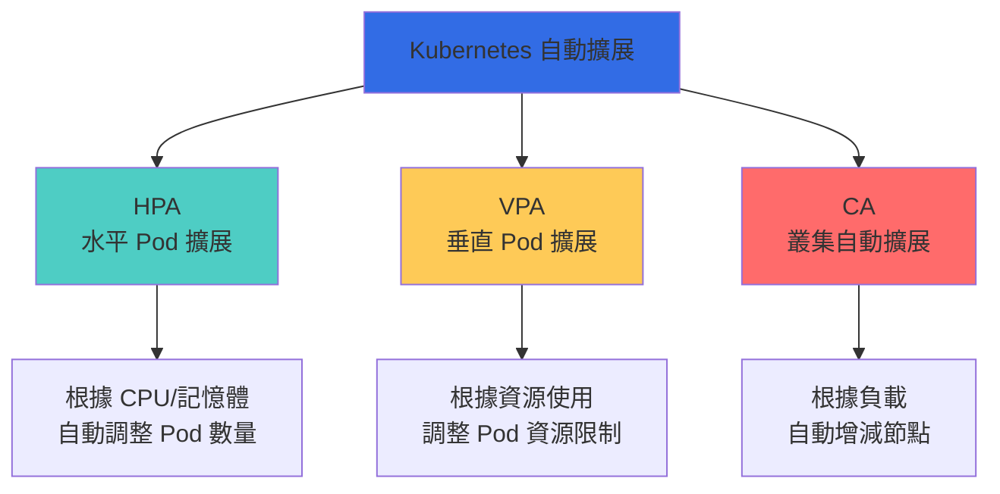
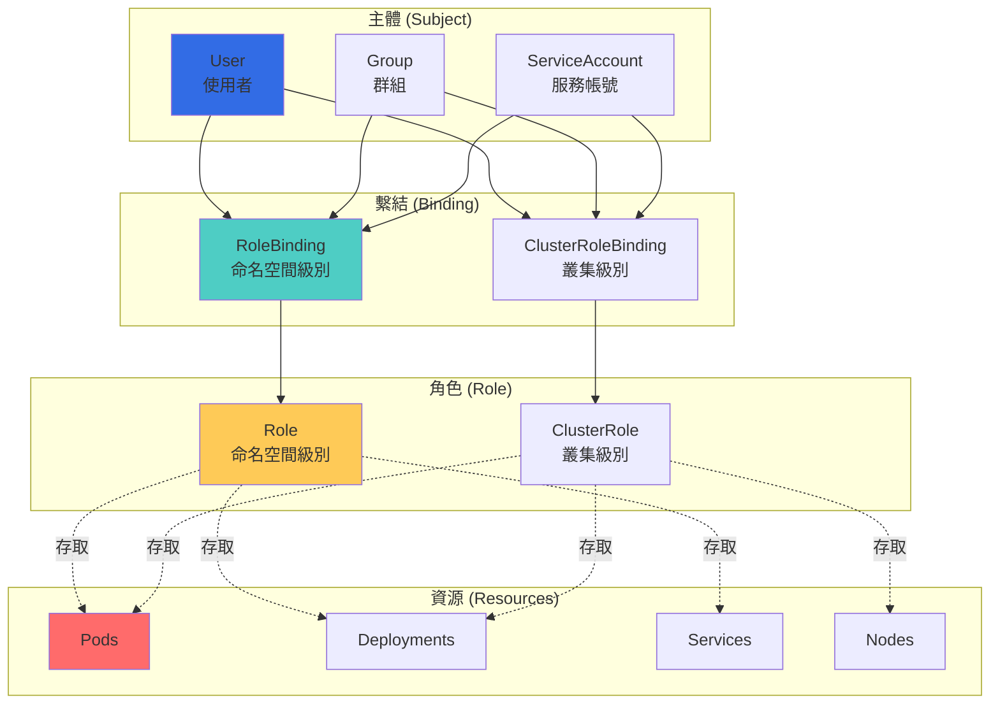
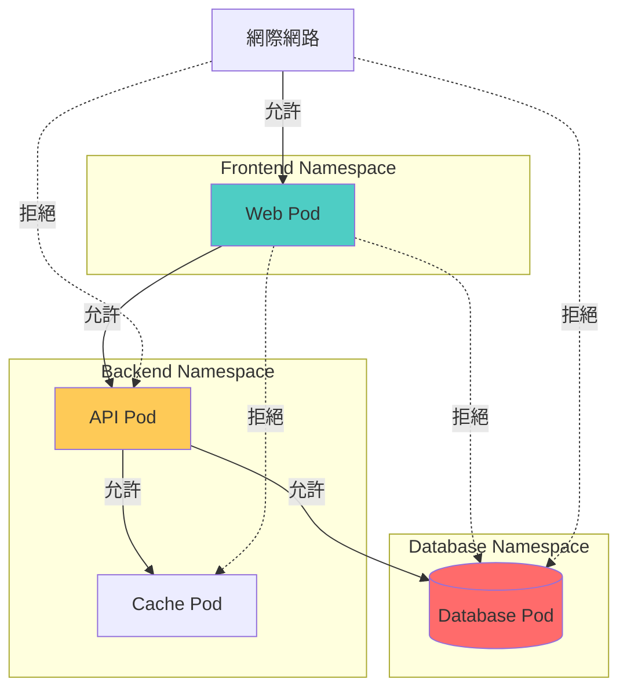
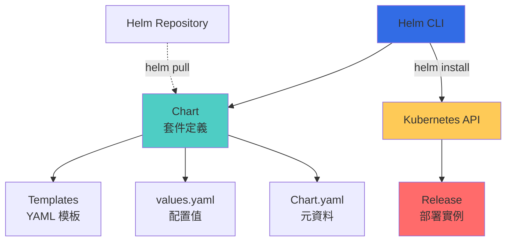
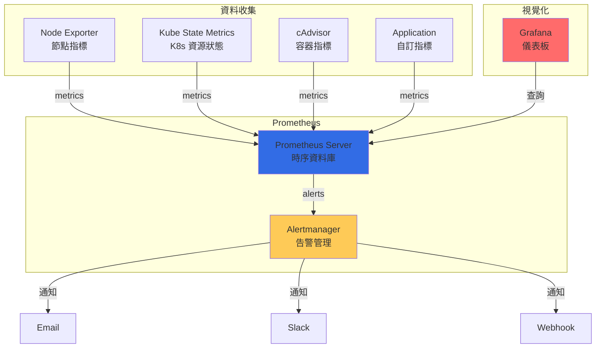
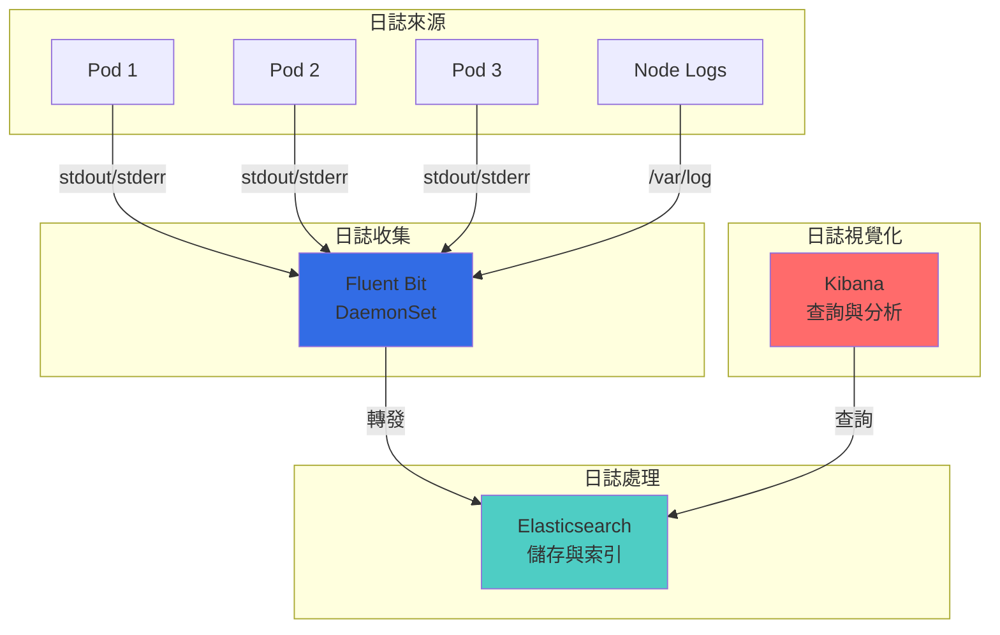

## 🎯 前言

經過前兩篇的學習，我們已經掌握了 Kubernetes 的基礎概念與核心資源操作。本文將深入探討進階功能與生產環境實踐，幫助你構建企業級的容器平台。

**本文重點：**
- 自動擴展（HPA/VPA/CA）
- RBAC 權限管理
- Network Policy 網路策略
- Helm 套件管理
- 監控與告警系統
- 日誌收集方案
- CI/CD 整合
- 生產環境最佳實踐

## ⚡ 自動擴展機制

### 擴展類型對照



### HPA (Horizontal Pod Autoscaler)

**基於 CPU 的 HPA：**

```yaml
apiVersion: autoscaling/v2
kind: HorizontalPodAutoscaler
metadata:
  name: nginx-hpa
  namespace: default
spec:
  # 目標 Deployment
  scaleTargetRef:
    apiVersion: apps/v1
    kind: Deployment
    name: nginx

  # Pod 數量範圍
  minReplicas: 2
  maxReplicas: 10

  # 擴展行為
  behavior:
    scaleDown:
      stabilizationWindowSeconds: 300  # 縮容穩定視窗
      policies:
      - type: Percent
        value: 50  # 每次最多縮容 50%
        periodSeconds: 60
      - type: Pods
        value: 2   # 每次最多縮容 2 個 Pod
        periodSeconds: 60
      selectPolicy: Min  # 選擇最小值

    scaleUp:
      stabilizationWindowSeconds: 0
      policies:
      - type: Percent
        value: 100  # 每次最多擴容 100%
        periodSeconds: 30
      - type: Pods
        value: 4    # 每次最多擴容 4 個 Pod
        periodSeconds: 30
      selectPolicy: Max  # 選擇最大值

  # 指標配置
  metrics:
  # CPU 使用率
  - type: Resource
    resource:
      name: cpu
      target:
        type: Utilization
        averageUtilization: 70  # 目標 CPU 使用率 70%

  # 記憶體使用率
  - type: Resource
    resource:
      name: memory
      target:
        type: Utilization
        averageUtilization: 80  # 目標記憶體使用率 80%

  # 自訂指標（Prometheus）
  - type: Pods
    pods:
      metric:
        name: http_requests_per_second
      target:
        type: AverageValue
        averageValue: "1000"

  # 外部指標
  - type: External
    external:
      metric:
        name: queue_length
        selector:
          matchLabels:
            queue: worker_tasks
      target:
        type: AverageValue
        averageValue: "30"
```

### HPA 操作指令

```bash
# 創建 HPA（簡單版）
kubectl autoscale deployment nginx --min=2 --max=10 --cpu-percent=70

# 創建 HPA（YAML）
kubectl apply -f hpa.yaml

# 查看 HPA
kubectl get hpa
kubectl describe hpa nginx-hpa

# 監視 HPA
kubectl get hpa --watch

# 手動測試（產生負載）
kubectl run -it --rm load-generator --image=busybox -- /bin/sh
while true; do wget -q -O- http://nginx-service; done

# 刪除 HPA
kubectl delete hpa nginx-hpa
```

### VPA (Vertical Pod Autoscaler)

```yaml
apiVersion: autoscaling.k8s.io/v1
kind: VerticalPodAutoscaler
metadata:
  name: nginx-vpa
spec:
  targetRef:
    apiVersion: apps/v1
    kind: Deployment
    name: nginx

  # 更新策略
  updatePolicy:
    updateMode: "Auto"  # Auto, Recreate, Initial, Off

  # 資源策略
  resourcePolicy:
    containerPolicies:
    - containerName: nginx
      minAllowed:
        cpu: 100m
        memory: 50Mi
      maxAllowed:
        cpu: 2
        memory: 1Gi
      mode: Auto
```

**VPA 模式對照表：**

| 模式 | 說明 | 行為 |
|------|------|------|
| **Off** | 僅提供建議 | 不自動調整 |
| **Initial** | 創建時設定 | 只在創建時應用 |
| **Recreate** | 重建 Pod | 刪除並重建 Pod |
| **Auto** | 自動調整 | 就地更新或重建 |

### Cluster Autoscaler

```yaml
apiVersion: apps/v1
kind: Deployment
metadata:
  name: cluster-autoscaler
  namespace: kube-system
spec:
  replicas: 1
  selector:
    matchLabels:
      app: cluster-autoscaler
  template:
    metadata:
      labels:
        app: cluster-autoscaler
    spec:
      serviceAccountName: cluster-autoscaler
      containers:
      - image: k8s.gcr.io/autoscaling/cluster-autoscaler:v1.27.0
        name: cluster-autoscaler
        command:
        - ./cluster-autoscaler
        - --v=4
        - --stderrthreshold=info
        - --cloud-provider=aws
        - --skip-nodes-with-local-storage=false
        - --expander=least-waste
        - --node-group-auto-discovery=asg:tag=k8s.io/cluster-autoscaler/enabled,k8s.io/cluster-autoscaler/my-cluster
        - --balance-similar-node-groups
        - --skip-nodes-with-system-pods=false
        env:
        - name: AWS_REGION
          value: us-west-2
```

## 🔐 RBAC 權限管理

### RBAC 架構



### Role 與 ClusterRole

**Role（命名空間級別）：**

```yaml
apiVersion: rbac.authorization.k8s.io/v1
kind: Role
metadata:
  namespace: default
  name: pod-reader
rules:
# Pod 資源
- apiGroups: [""]
  resources: ["pods"]
  verbs: ["get", "watch", "list"]

# Pod 日誌
- apiGroups: [""]
  resources: ["pods/log"]
  verbs: ["get", "list"]

# ConfigMap 與 Secret
- apiGroups: [""]
  resources: ["configmaps", "secrets"]
  verbs: ["get"]

# Deployment
- apiGroups: ["apps"]
  resources: ["deployments"]
  verbs: ["get", "list", "watch", "create", "update", "patch", "delete"]

# Service
- apiGroups: [""]
  resources: ["services"]
  verbs: ["get", "list", "create", "delete"]
```

**ClusterRole（叢集級別）：**

```yaml
apiVersion: rbac.authorization.k8s.io/v1
kind: ClusterRole
metadata:
  name: cluster-admin-custom
rules:
# 所有資源的完整權限
- apiGroups: ["*"]
  resources: ["*"]
  verbs: ["*"]

# 非資源 URL
- nonResourceURLs: ["*"]
  verbs: ["*"]
```

### RoleBinding 與 ClusterRoleBinding

**RoleBinding：**

```yaml
apiVersion: rbac.authorization.k8s.io/v1
kind: RoleBinding
metadata:
  name: read-pods
  namespace: default
subjects:
# 使用者
- kind: User
  name: jane
  apiGroup: rbac.authorization.k8s.io

# 群組
- kind: Group
  name: developers
  apiGroup: rbac.authorization.k8s.io

# ServiceAccount
- kind: ServiceAccount
  name: my-service-account
  namespace: default

roleRef:
  kind: Role
  name: pod-reader
  apiGroup: rbac.authorization.k8s.io
```

**ClusterRoleBinding：**

```yaml
apiVersion: rbac.authorization.k8s.io/v1
kind: ClusterRoleBinding
metadata:
  name: read-all-pods
subjects:
- kind: Group
  name: system:authenticated
  apiGroup: rbac.authorization.k8s.io
roleRef:
  kind: ClusterRole
  name: view
  apiGroup: rbac.authorization.k8s.io
```

### ServiceAccount

```yaml
apiVersion: v1
kind: ServiceAccount
metadata:
  name: my-app-sa
  namespace: default
automountServiceAccountToken: true
secrets:
- name: my-app-token

---
apiVersion: v1
kind: Secret
metadata:
  name: my-app-token
  namespace: default
  annotations:
    kubernetes.io/service-account.name: my-app-sa
type: kubernetes.io/service-account-token
```

### RBAC 操作指令

```bash
# 查看角色
kubectl get roles
kubectl get clusterroles
kubectl describe role pod-reader

# 查看繫結
kubectl get rolebindings
kubectl get clusterrolebindings
kubectl describe rolebinding read-pods

# 查看 ServiceAccount
kubectl get serviceaccounts
kubectl get sa  # 簡寫
kubectl describe sa my-app-sa

# 檢查權限
kubectl auth can-i create deployments
kubectl auth can-i delete pods --namespace=default
kubectl auth can-i '*' '*' --all-namespaces

# 以特定使用者身分檢查
kubectl auth can-i list pods --as=jane
kubectl auth can-i create deployments --as=system:serviceaccount:default:my-app-sa

# 創建 ServiceAccount Token
kubectl create token my-app-sa --duration=24h

# 查看當前使用者
kubectl config view --minify -o jsonpath='{.contexts[0].context.user}'
```

### 預設 ClusterRole

| ClusterRole | 說明 | 權限範圍 |
|-------------|------|----------|
| **cluster-admin** | 超級管理員 | 完整權限 |
| **admin** | 命名空間管理員 | 命名空間內完整權限 |
| **edit** | 編輯者 | 讀寫大部分資源 |
| **view** | 檢視者 | 唯讀權限 |

## 🌐 Network Policy

### Network Policy 概念



### Network Policy 完整範例

```yaml
apiVersion: networking.k8s.io/v1
kind: NetworkPolicy
metadata:
  name: api-network-policy
  namespace: backend
spec:
  # 應用到哪些 Pod
  podSelector:
    matchLabels:
      app: api
      tier: backend

  # 策略類型
  policyTypes:
  - Ingress  # 入站流量
  - Egress   # 出站流量

  # 入站規則
  ingress:
  # 規則 1: 允許來自 frontend 的流量
  - from:
    - namespaceSelector:
        matchLabels:
          name: frontend
      podSelector:
        matchLabels:
          app: web
    ports:
    - protocol: TCP
      port: 8080

  # 規則 2: 允許來自特定 IP 範圍
  - from:
    - ipBlock:
        cidr: 10.0.0.0/16
        except:
        - 10.0.1.0/24
    ports:
    - protocol: TCP
      port: 8080

  # 出站規則
  egress:
  # 規則 1: 允許存取資料庫
  - to:
    - namespaceSelector:
        matchLabels:
          name: database
      podSelector:
        matchLabels:
          app: postgres
    ports:
    - protocol: TCP
      port: 5432

  # 規則 2: 允許存取 Redis
  - to:
    - podSelector:
        matchLabels:
          app: redis
    ports:
    - protocol: TCP
      port: 6379

  # 規則 3: 允許 DNS 查詢
  - to:
    - namespaceSelector:
        matchLabels:
          name: kube-system
      podSelector:
        matchLabels:
          k8s-app: kube-dns
    ports:
    - protocol: UDP
      port: 53

  # 規則 4: 允許存取外部 API
  - to:
    - ipBlock:
        cidr: 0.0.0.0/0
        except:
        - 10.0.0.0/8
        - 172.16.0.0/12
        - 192.168.0.0/16
    ports:
    - protocol: TCP
      port: 443
```

### Network Policy 常見模式

**1. 預設拒絕所有流量：**

```yaml
apiVersion: networking.k8s.io/v1
kind: NetworkPolicy
metadata:
  name: default-deny-all
  namespace: production
spec:
  podSelector: {}
  policyTypes:
  - Ingress
  - Egress
```

**2. 允許特定命名空間：**

```yaml
apiVersion: networking.k8s.io/v1
kind: NetworkPolicy
metadata:
  name: allow-from-namespace
spec:
  podSelector:
    matchLabels:
      app: backend
  ingress:
  - from:
    - namespaceSelector:
        matchLabels:
          environment: production
```

**3. 允許 DNS：**

```yaml
apiVersion: networking.k8s.io/v1
kind: NetworkPolicy
metadata:
  name: allow-dns
spec:
  podSelector: {}
  egress:
  - to:
    - namespaceSelector:
        matchLabels:
          name: kube-system
    - podSelector:
        matchLabels:
          k8s-app: kube-dns
    ports:
    - protocol: UDP
      port: 53
```

### Network Policy 操作指令

```bash
# 創建 Network Policy
kubectl apply -f network-policy.yaml

# 查看 Network Policy
kubectl get networkpolicies
kubectl get netpol  # 簡寫
kubectl describe networkpolicy api-network-policy

# 測試網路連通性（從 Pod A 測試連到 Pod B）
kubectl exec -it pod-a -- curl http://pod-b-service

# 刪除 Network Policy
kubectl delete networkpolicy api-network-policy
```

## 📦 Helm 套件管理

### Helm 架構



### Helm Chart 結構

```
my-app/
├── Chart.yaml          # Chart 元資料
├── values.yaml         # 預設值
├── values-dev.yaml     # 開發環境值
├── values-prod.yaml    # 生產環境值
├── templates/          # K8s 資源模板
│   ├── deployment.yaml
│   ├── service.yaml
│   ├── ingress.yaml
│   ├── configmap.yaml
│   ├── secret.yaml
│   ├── hpa.yaml
│   ├── _helpers.tpl   # 輔助函數
│   ├── NOTES.txt      # 安裝說明
│   └── tests/         # 測試
│       └── test-connection.yaml
├── charts/            # 依賴 Chart
├── .helmignore        # 忽略檔案
└── README.md
```

### Chart.yaml 範例

```yaml
apiVersion: v2
name: my-app
description: My Application Helm Chart
type: application
version: 1.0.0
appVersion: "1.24.0"
keywords:
  - web
  - application
home: https://example.com
sources:
  - https://github.com/example/my-app
maintainers:
  - name: DevOps Team
    email: devops@example.com
dependencies:
  - name: postgresql
    version: "12.1.0"
    repository: "https://charts.bitnami.com/bitnami"
    condition: postgresql.enabled
  - name: redis
    version: "17.0.0"
    repository: "https://charts.bitnami.com/bitnami"
    condition: redis.enabled
```

### values.yaml 範例

```yaml
# 副本數
replicaCount: 3

# 映像配置
image:
  repository: myapp
  pullPolicy: IfNotPresent
  tag: "1.24.0"

imagePullSecrets: []
nameOverride: ""
fullnameOverride: ""

# ServiceAccount
serviceAccount:
  create: true
  annotations: {}
  name: ""

# Pod 註解
podAnnotations:
  prometheus.io/scrape: "true"
  prometheus.io/port: "9090"

# Pod 安全上下文
podSecurityContext:
  runAsNonRoot: true
  runAsUser: 1000
  fsGroup: 2000

securityContext:
  capabilities:
    drop:
    - ALL
  readOnlyRootFilesystem: true
  allowPrivilegeEscalation: false

# Service 配置
service:
  type: ClusterIP
  port: 80
  targetPort: 8080

# Ingress 配置
ingress:
  enabled: true
  className: nginx
  annotations:
    cert-manager.io/cluster-issuer: letsencrypt-prod
  hosts:
    - host: app.example.com
      paths:
        - path: /
          pathType: Prefix
  tls:
    - secretName: app-tls
      hosts:
        - app.example.com

# 資源限制
resources:
  limits:
    cpu: 500m
    memory: 512Mi
  requests:
    cpu: 250m
    memory: 256Mi

# HPA
autoscaling:
  enabled: true
  minReplicas: 2
  maxReplicas: 10
  targetCPUUtilizationPercentage: 70
  targetMemoryUtilizationPercentage: 80

# NodeSelector
nodeSelector: {}

# Tolerations
tolerations: []

# Affinity
affinity: {}

# 環境變數
env:
  - name: ENVIRONMENT
    value: "production"
  - name: LOG_LEVEL
    value: "info"

# ConfigMap
configMap:
  data:
    app.properties: |
      server.port=8080
      server.host=0.0.0.0

# Secret
secret:
  data:
    database-password: ""
    api-key: ""

# PostgreSQL 依賴
postgresql:
  enabled: true
  auth:
    username: myapp
    password: ""
    database: myapp
  primary:
    persistence:
      enabled: true
      size: 10Gi

# Redis 依賴
redis:
  enabled: true
  auth:
    enabled: true
    password: ""
  master:
    persistence:
      enabled: true
      size: 8Gi
```

### templates/deployment.yaml 範例

```yaml
apiVersion: apps/v1
kind: Deployment
metadata:
  name: {{ include "my-app.fullname" . }}
  labels:
    {{- include "my-app.labels" . | nindent 4 }}
spec:
  {{- if not .Values.autoscaling.enabled }}
  replicas: {{ .Values.replicaCount }}
  {{- end }}
  selector:
    matchLabels:
      {{- include "my-app.selectorLabels" . | nindent 6 }}
  template:
    metadata:
      annotations:
        checksum/config: {{ include (print $.Template.BasePath "/configmap.yaml") . | sha256sum }}
        {{- with .Values.podAnnotations }}
        {{- toYaml . | nindent 8 }}
        {{- end }}
      labels:
        {{- include "my-app.selectorLabels" . | nindent 8 }}
    spec:
      {{- with .Values.imagePullSecrets }}
      imagePullSecrets:
        {{- toYaml . | nindent 8 }}
      {{- end }}
      serviceAccountName: {{ include "my-app.serviceAccountName" . }}
      securityContext:
        {{- toYaml .Values.podSecurityContext | nindent 8 }}
      containers:
      - name: {{ .Chart.Name }}
        securityContext:
          {{- toYaml .Values.securityContext | nindent 12 }}
        image: "{{ .Values.image.repository }}:{{ .Values.image.tag | default .Chart.AppVersion }}"
        imagePullPolicy: {{ .Values.image.pullPolicy }}
        ports:
        - name: http
          containerPort: {{ .Values.service.targetPort }}
          protocol: TCP
        livenessProbe:
          httpGet:
            path: /health
            port: http
          initialDelaySeconds: 30
          periodSeconds: 10
        readinessProbe:
          httpGet:
            path: /ready
            port: http
          initialDelaySeconds: 5
          periodSeconds: 5
        env:
          {{- toYaml .Values.env | nindent 12 }}
        resources:
          {{- toYaml .Values.resources | nindent 12 }}
      {{- with .Values.nodeSelector }}
      nodeSelector:
        {{- toYaml . | nindent 8 }}
      {{- end }}
      {{- with .Values.affinity }}
      affinity:
        {{- toYaml . | nindent 8 }}
      {{- end }}
      {{- with .Values.tolerations }}
      tolerations:
        {{- toYaml . | nindent 8 }}
      {{- end }}
```

### Helm 操作指令

```bash
# 安裝 Helm
curl https://raw.githubusercontent.com/helm/helm/main/scripts/get-helm-3 | bash

# 添加倉庫
helm repo add stable https://charts.helm.sh/stable
helm repo add bitnami https://charts.bitnami.com/bitnami
helm repo update

# 搜尋 Chart
helm search repo nginx
helm search hub wordpress

# 查看 Chart 資訊
helm show chart bitnami/nginx
helm show values bitnami/nginx
helm show readme bitnami/nginx

# 安裝 Chart
helm install my-release bitnami/nginx
helm install my-app ./my-app-chart
helm install my-app ./my-app-chart -f values-prod.yaml
helm install my-app ./my-app-chart --set replicaCount=5
helm install my-app ./my-app-chart --namespace production --create-namespace

# 查看 Release
helm list
helm list -A  # 所有命名空間
helm status my-app
helm get values my-app
helm get manifest my-app

# 升級 Release
helm upgrade my-app ./my-app-chart
helm upgrade my-app ./my-app-chart -f values-prod.yaml
helm upgrade my-app ./my-app-chart --set image.tag=1.25.0
helm upgrade --install my-app ./my-app-chart  # 不存在則安裝

# 回滾 Release
helm rollback my-app
helm rollback my-app 2  # 回滾到版本 2
helm history my-app

# 刪除 Release
helm uninstall my-app
helm uninstall my-app --keep-history

# 驗證 Chart
helm lint ./my-app-chart
helm template my-app ./my-app-chart
helm install --dry-run --debug my-app ./my-app-chart

# 打包 Chart
helm package ./my-app-chart
helm package ./my-app-chart --version 1.0.1

# 創建 Chart
helm create my-new-chart

# 依賴管理
helm dependency update ./my-app-chart
helm dependency build ./my-app-chart
helm dependency list ./my-app-chart
```

## 📊 監控與告警系統

### Prometheus + Grafana 架構



### Prometheus 安裝（Helm）

```bash
# 添加 Prometheus 社群 Helm 倉庫
helm repo add prometheus-community https://prometheus-community.github.io/helm-charts
helm repo update

# 安裝 kube-prometheus-stack
helm install prometheus prometheus-community/kube-prometheus-stack \
  --namespace monitoring \
  --create-namespace \
  --set prometheus.prometheusSpec.retention=30d \
  --set prometheus.prometheusSpec.storageSpec.volumeClaimTemplate.spec.resources.requests.storage=50Gi \
  --set grafana.adminPassword=admin123

# 查看安裝的資源
kubectl get all -n monitoring

# 存取 Prometheus
kubectl port-forward -n monitoring svc/prometheus-kube-prometheus-prometheus 9090:9090

# 存取 Grafana
kubectl port-forward -n monitoring svc/prometheus-grafana 3000:80
```

### ServiceMonitor 配置

```yaml
apiVersion: monitoring.coreos.com/v1
kind: ServiceMonitor
metadata:
  name: my-app-metrics
  namespace: monitoring
  labels:
    release: prometheus
spec:
  selector:
    matchLabels:
      app: my-app
  endpoints:
  - port: metrics
    interval: 30s
    path: /metrics
  namespaceSelector:
    matchNames:
    - default
```

### PrometheusRule 告警規則

```yaml
apiVersion: monitoring.coreos.com/v1
kind: PrometheusRule
metadata:
  name: my-app-alerts
  namespace: monitoring
  labels:
    release: prometheus
spec:
  groups:
  - name: my-app
    interval: 30s
    rules:
    # Pod 重啟過多
    - alert: PodRestarting
      expr: |
        rate(kube_pod_container_status_restarts_total[15m]) > 0
      for: 5m
      labels:
        severity: warning
      annotations:
        summary: "Pod {{ $labels.namespace }}/{{ $labels.pod }} restarting"
        description: "Pod has restarted {{ $value }} times in the last 15 minutes"

    # CPU 使用率過高
    - alert: HighCPUUsage
      expr: |
        sum(rate(container_cpu_usage_seconds_total{namespace="default"}[5m])) by (pod) > 0.8
      for: 5m
      labels:
        severity: warning
      annotations:
        summary: "High CPU usage detected"
        description: "Pod {{ $labels.pod }} CPU usage is {{ $value | humanizePercentage }}"

    # 記憶體使用率過高
    - alert: HighMemoryUsage
      expr: |
        sum(container_memory_working_set_bytes{namespace="default"}) by (pod) /
        sum(container_spec_memory_limit_bytes{namespace="default"}) by (pod) > 0.9
      for: 5m
      labels:
        severity: critical
      annotations:
        summary: "High memory usage detected"
        description: "Pod {{ $labels.pod }} memory usage is {{ $value | humanizePercentage }}"

    # 服務不可用
    - alert: ServiceDown
      expr: |
        up{job="my-app"} == 0
      for: 1m
      labels:
        severity: critical
      annotations:
        summary: "Service is down"
        description: "The service {{ $labels.job }} has been down for more than 1 minute"

    # HTTP 錯誤率過高
    - alert: HighErrorRate
      expr: |
        sum(rate(http_requests_total{status=~"5.."}[5m])) by (service) /
        sum(rate(http_requests_total[5m])) by (service) > 0.05
      for: 5m
      labels:
        severity: warning
      annotations:
        summary: "High HTTP error rate"
        description: "Service {{ $labels.service }} error rate is {{ $value | humanizePercentage }}"
```

## 📝 日誌收集方案

### EFK Stack 架構



### Fluent Bit 配置

```yaml
apiVersion: v1
kind: ConfigMap
metadata:
  name: fluent-bit-config
  namespace: logging
data:
  fluent-bit.conf: |
    [SERVICE]
        Daemon Off
        Flush 1
        Log_Level info
        Parsers_File parsers.conf
        HTTP_Server On
        HTTP_Listen 0.0.0.0
        HTTP_Port 2020
        Health_Check On

    [INPUT]
        Name              tail
        Path              /var/log/containers/*.log
        multiline.parser  docker, cri
        Tag               kube.*
        Mem_Buf_Limit     5MB
        Skip_Long_Lines   On

    [FILTER]
        Name                kubernetes
        Match               kube.*
        Kube_URL            https://kubernetes.default.svc:443
        Kube_CA_File        /var/run/secrets/kubernetes.io/serviceaccount/ca.crt
        Kube_Token_File     /var/run/secrets/kubernetes.io/serviceaccount/token
        Kube_Tag_Prefix     kube.var.log.containers.
        Merge_Log           On
        Keep_Log            Off
        K8S-Logging.Parser  On
        K8S-Logging.Exclude On

    [OUTPUT]
        Name            es
        Match           *
        Host            elasticsearch.logging.svc.cluster.local
        Port            9200
        Logstash_Format On
        Retry_Limit     False
        Type            _doc

  parsers.conf: |
    [PARSER]
        Name   json
        Format json
        Time_Key time
        Time_Format %d/%b/%Y:%H:%M:%S %z

    [PARSER]
        Name        docker
        Format      json
        Time_Key    time
        Time_Format %Y-%m-%dT%H:%M:%S.%L
        Time_Keep   On

    [PARSER]
        Name        syslog
        Format      regex
        Regex       ^\<(?<pri>[0-9]+)\>(?<time>[^ ]* {1,2}[^ ]* [^ ]*) (?<host>[^ ]*) (?<ident>[a-zA-Z0-9_\/\.\-]*)(?:\[(?<pid>[0-9]+)\])?(?:[^\:]*\:)? *(?<message>.*)$
        Time_Key    time
        Time_Format %b %d %H:%M:%S
```

## 🚀 CI/CD 整合

### GitLab CI/CD Pipeline

```yaml
# .gitlab-ci.yml
variables:
  DOCKER_REGISTRY: registry.example.com
  IMAGE_NAME: ${DOCKER_REGISTRY}/myapp
  KUBE_NAMESPACE: production
  KUBECONFIG: /etc/deploy/config

stages:
  - test
  - build
  - deploy

# 測試階段
test:
  stage: test
  image: node:18
  script:
    - npm ci
    - npm run lint
    - npm run test
    - npm run test:coverage
  coverage: '/Statements\s+:\s+(\d+\.\d+)%/'
  artifacts:
    reports:
      coverage_report:
        coverage_format: cobertura
        path: coverage/cobertura-coverage.xml
    paths:
      - coverage/
  only:
    - branches

# 建立映像
build:
  stage: build
  image: docker:24
  services:
    - docker:24-dind
  before_script:
    - docker login -u $CI_REGISTRY_USER -p $CI_REGISTRY_PASSWORD $DOCKER_REGISTRY
  script:
    - docker build
        --build-arg VERSION=${CI_COMMIT_SHORT_SHA}
        -t ${IMAGE_NAME}:${CI_COMMIT_SHORT_SHA}
        -t ${IMAGE_NAME}:latest
        .
    - docker push ${IMAGE_NAME}:${CI_COMMIT_SHORT_SHA}
    - docker push ${IMAGE_NAME}:latest
  only:
    - main
    - develop

# 部署到開發環境
deploy:dev:
  stage: deploy
  image: bitnami/kubectl:latest
  script:
    - kubectl config use-context dev-cluster
    - kubectl set image deployment/myapp myapp=${IMAGE_NAME}:${CI_COMMIT_SHORT_SHA} -n development
    - kubectl rollout status deployment/myapp -n development
  environment:
    name: development
    url: https://dev.example.com
  only:
    - develop

# 部署到生產環境
deploy:prod:
  stage: deploy
  image: bitnami/kubectl:latest
  script:
    - kubectl config use-context prod-cluster
    - |
      helm upgrade --install myapp ./helm/myapp \
        --namespace ${KUBE_NAMESPACE} \
        --set image.tag=${CI_COMMIT_SHORT_SHA} \
        --set replicaCount=3 \
        --values ./helm/myapp/values-prod.yaml \
        --wait \
        --timeout 5m
    - kubectl get pods -n ${KUBE_NAMESPACE} -l app=myapp
  environment:
    name: production
    url: https://example.com
  when: manual
  only:
    - main
```

### GitHub Actions Workflow

```yaml
# .github/workflows/deploy.yml
name: Build and Deploy to Kubernetes

on:
  push:
    branches: [main, develop]
  pull_request:
    branches: [main]

env:
  REGISTRY: ghcr.io
  IMAGE_NAME: ${{ github.repository }}

jobs:
  test:
    runs-on: ubuntu-latest
    steps:
      - uses: actions/checkout@v3

      - name: Setup Node.js
        uses: actions/setup-node@v3
        with:
          node-version: '18'
          cache: 'npm'

      - name: Install dependencies
        run: npm ci

      - name: Run tests
        run: |
          npm run lint
          npm run test
          npm run test:coverage

      - name: Upload coverage
        uses: codecov/codecov-action@v3
        with:
          files: ./coverage/lcov.info

  build:
    needs: test
    runs-on: ubuntu-latest
    permissions:
      contents: read
      packages: write
    steps:
      - uses: actions/checkout@v3

      - name: Set up Docker Buildx
        uses: docker/setup-buildx-action@v2

      - name: Log in to Container Registry
        uses: docker/login-action@v2
        with:
          registry: ${{ env.REGISTRY }}
          username: ${{ github.actor }}
          password: ${{ secrets.GITHUB_TOKEN }}

      - name: Extract metadata
        id: meta
        uses: docker/metadata-action@v4
        with:
          images: ${{ env.REGISTRY }}/${{ env.IMAGE_NAME }}
          tags: |
            type=ref,event=branch
            type=sha,prefix={{branch}}-

      - name: Build and push
        uses: docker/build-push-action@v4
        with:
          context: .
          push: true
          tags: ${{ steps.meta.outputs.tags }}
          cache-from: type=gha
          cache-to: type=gha,mode=max

  deploy:
    needs: build
    runs-on: ubuntu-latest
    if: github.ref == 'refs/heads/main'
    steps:
      - uses: actions/checkout@v3

      - name: Setup kubectl
        uses: azure/setup-kubectl@v3

      - name: Configure kubectl
        run: |
          echo "${{ secrets.KUBECONFIG }}" | base64 -d > kubeconfig
          export KUBECONFIG=kubeconfig

      - name: Deploy to Kubernetes
        run: |
          kubectl set image deployment/myapp \
            myapp=${{ env.REGISTRY }}/${{ env.IMAGE_NAME }}:main-${{ github.sha }} \
            -n production

          kubectl rollout status deployment/myapp -n production

      - name: Verify deployment
        run: |
          kubectl get pods -n production -l app=myapp
          kubectl get svc -n production -l app=myapp
```

## 🎯 生產環境最佳實踐

### 安全性最佳實踐清單

| 類別 | 最佳實踐 | 實施方法 |
|------|----------|----------|
| **映像安全** | 使用最小化基礎映像 | Alpine, Distroless |
| | 定期掃描漏洞 | Trivy, Clair |
| | 使用私有 Registry | Harbor, ECR |
| **RBAC** | 最小權限原則 | Role, RoleBinding |
| | 避免使用 cluster-admin | 自訂 ClusterRole |
| **網路** | 使用 Network Policy | 限制 Pod 通訊 |
| | 使用服務網格 | Istio, Linkerd |
| **資源** | 設定資源限制 | requests/limits |
| | 使用 LimitRange | 預設限制 |
| **密鑰** | 加密 Secrets | KMS, Sealed Secrets |
| | 輪換密鑰 | 定期更新 |
| **審計** | 啟用審計日誌 | Audit Policy |
| | 監控異常行為 | Falco |

### 高可用性配置

**多副本部署：**

```yaml
apiVersion: apps/v1
kind: Deployment
metadata:
  name: critical-app
spec:
  replicas: 5
  strategy:
    rollingUpdate:
      maxSurge: 2
      maxUnavailable: 1
  template:
    spec:
      # Pod 反親和性
      affinity:
        podAntiAffinity:
          requiredDuringSchedulingIgnoredDuringExecution:
          - labelSelector:
              matchExpressions:
              - key: app
                operator: In
                values:
                - critical-app
            topologyKey: kubernetes.io/hostname
      # 優先級
      priorityClassName: high-priority
      # 中斷預算
      terminationGracePeriodSeconds: 60
```

**Pod Disruption Budget：**

```yaml
apiVersion: policy/v1
kind: PodDisruptionBudget
metadata:
  name: critical-app-pdb
spec:
  minAvailable: 3
  selector:
    matchLabels:
      app: critical-app
```

### 資源配額管理

```yaml
apiVersion: v1
kind: ResourceQuota
metadata:
  name: production-quota
  namespace: production
spec:
  hard:
    requests.cpu: "100"
    requests.memory: 200Gi
    limits.cpu: "200"
    limits.memory: 400Gi
    persistentvolumeclaims: "20"
    pods: "100"
    services: "50"
    configmaps: "50"
    secrets: "50"

---
apiVersion: v1
kind: LimitRange
metadata:
  name: production-limits
  namespace: production
spec:
  limits:
  # Pod 限制
  - max:
      cpu: "4"
      memory: 8Gi
    min:
      cpu: 100m
      memory: 128Mi
    type: Pod
  # Container 限制
  - default:
      cpu: 500m
      memory: 512Mi
    defaultRequest:
      cpu: 250m
      memory: 256Mi
    max:
      cpu: "2"
      memory: 4Gi
    min:
      cpu: 50m
      memory: 64Mi
    type: Container
  # PVC 限制
  - max:
      storage: 100Gi
    min:
      storage: 1Gi
    type: PersistentVolumeClaim
```

### 備份與災難恢復

**Velero 備份：**

```bash
# 安裝 Velero
velero install \
  --provider aws \
  --plugins velero/velero-plugin-for-aws:v1.7.0 \
  --bucket velero-backups \
  --backup-location-config region=us-west-2 \
  --snapshot-location-config region=us-west-2 \
  --secret-file ./credentials-velero

# 創建備份
velero backup create full-backup --include-namespaces production
velero backup create daily-backup --schedule="0 2 * * *"

# 還原備份
velero restore create --from-backup full-backup

# 查看備份
velero backup get
velero restore get
```

## 📊 總結與檢查清單

### 核心知識回顧

本系列三篇文章完整涵蓋了 Kubernetes 從入門到生產：

**第一篇：基礎概念**
- K8s 架構與元件
- 核心資源概念
- 安裝與配置

**第二篇：核心資源操作**
- kubectl 指令大全
- Pod、Deployment、Service
- Ingress、Volume、ConfigMap

**第三篇：進階功能**（本篇）
- 自動擴展（HPA/VPA/CA）
- RBAC 權限管理
- Network Policy
- Helm 套件管理
- 監控告警
- 日誌收集
- CI/CD 整合
- 生產最佳實踐

### 生產環境檢查清單

#### 📋 部署前檢查

- [ ] 配置 RBAC 權限
- [ ] 設定 Network Policy
- [ ] 配置資源限制（requests/limits）
- [ ] 設定 PodDisruptionBudget
- [ ] 配置健康檢查（liveness/readiness）
- [ ] 設定 HPA 自動擴展
- [ ] 配置多副本高可用
- [ ] 使用 Pod 反親和性

#### 🔐 安全性檢查

- [ ] 掃描映像漏洞
- [ ] 加密 Secrets
- [ ] 限制特權容器
- [ ] 配置安全上下文
- [ ] 啟用審計日誌
- [ ] 定期輪換密鑰
- [ ] 使用私有 Registry

#### 📊 監控與日誌

- [ ] 部署 Prometheus + Grafana
- [ ] 配置告警規則
- [ ] 部署日誌收集系統
- [ ] 設定日誌保留策略
- [ ] 配置儀表板
- [ ] 設定告警通知

#### 🔄 備份與恢復

- [ ] 配置 etcd 備份
- [ ] 設定資源備份策略
- [ ] 測試災難恢復流程
- [ ] 文件化恢復步驟

### 學習資源推薦

**認證考試：**
- CKA（管理員）
- CKAD（開發者）
- CKS（安全專家）

**進階學習：**
- Service Mesh（Istio、Linkerd）
- Operator Pattern
- GitOps（ArgoCD、Flux）
- Serverless（Knative）

## 🎉 結語

Kubernetes 是一個功能強大但複雜的平台。透過本系列三篇文章的學習，您已經掌握了：

1. **基礎知識**：理解 K8s 架構與核心概念
2. **實務操作**：熟練使用 kubectl 管理資源
3. **進階技能**：掌握生產環境部署與最佳實踐

### 下一步建議

- **實踐專案**：在實際項目中應用 K8s
- **深入學習**：探索 Service Mesh、Operator
- **社群參與**：參與開源項目，分享經驗
- **持續優化**：關注效能、安全性、成本

Kubernetes 的學習是持續的過程，隨著實踐經驗的累積，您將能夠構建更強大、更可靠的雲原生應用平台！

祝您在雲原生技術的道路上不斷進步！🚀
