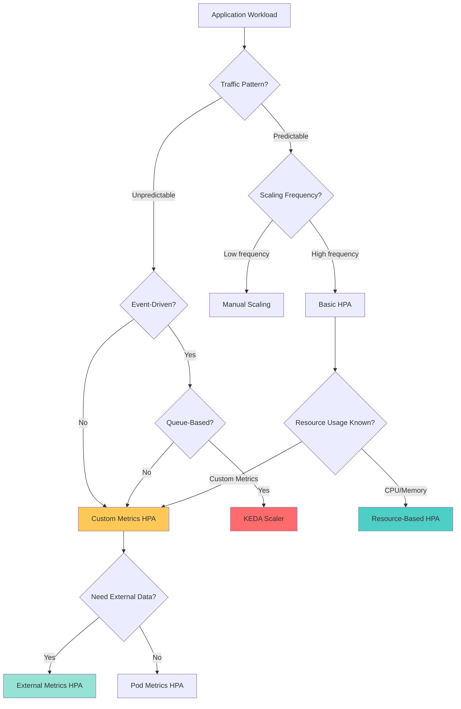
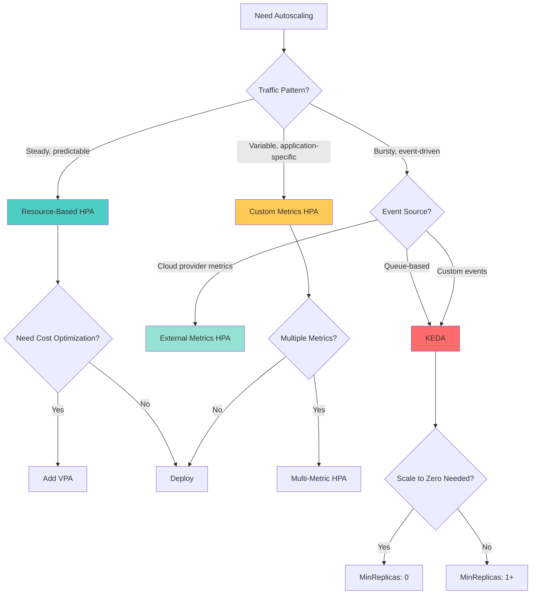

Modern cloud-native applications face dynamic workload patterns that traditional static scaling cannot handle efficiently. Kubernetes Horizontal Pod Autoscaler (HPA) provides intelligent, automated scaling capabilities, but choosing the right approach requires understanding multiple scaling strategies, their tradeoffs, and appropriate use cases.

This comprehensive guide explores the full spectrum of Kubernetes autoscaling approaches, from basic resource-based HPA to advanced event-driven scaling with KEDA, helping you architect scalable applications that maintain performance while optimizing costs.

## The Scaling Challenge in Cloud-Native Architectures

### Why Static Scaling Fails Modern Applications

Traditional fixed-replica deployments create fundamental challenges in dynamic environments:

```
Static Deployment Problems              →    Autoscaling Solutions
- Over-provisioned resources             →    - Dynamic capacity adjustment
- High idle costs during low traffic     →    - Cost optimization via scale-to-zero
- Unable to handle traffic spikes        →    - Automatic scale-out during peaks
- Manual intervention required           →    - Automated policy-based scaling
- Slow response to demand changes        →    - Sub-minute scale reactions
```

### Real-World Scaling Scenarios

| Application Type | Traffic Pattern | Scaling Requirement |
|-----------------|----------------|---------------------|
| **E-commerce** | Predictable daily peaks, flash sales | Rapid scale-out, gradual scale-in |
| **API Services** | Bursty request patterns | Low-latency responsiveness |
| **Batch Processing** | Queue-driven workloads | Queue depth-based scaling |
| **IoT Processing** | Event-driven spikes | Near-instantaneous scale-out |
| **ML Inference** | Variable request volume | GPU resource optimization |

## Kubernetes Autoscaling Architecture Overview

Before diving into specific approaches, let's understand the complete autoscaling ecosystem:

```
┌─────────────────────────────────────────────────────────────────────────┐
│                    KUBERNETES AUTOSCALING LAYERS                       │
│                                                                         │
│  ┌──────────────────────┐  ┌──────────────────────┐  ┌──────────────┐ │
│  │   POD AUTOSCALING    │  │   NODE AUTOSCALING   │  │  APPLICATION │ │
│  │                      │  │                      │  │   AUTOSCALING│ │
│  │  • HPA (Horizontal)  │  │  • Cluster Autoscaler│  │  • Custom    │ │
│  │  • VPA (Vertical)    │  │  • Karpenter         │  │    Controllers│ │
│  │  • KEDA (Event)      │  │  • Node Auto-Repair  │  │  • Operators │ │
│  └──────────────────────┘  └──────────────────────┘  └──────────────┘ │
│            ▲                          ▲                       ▲         │
│            │                          │                       │         │
│            ▼                          ▼                       ▼         │
│  ┌──────────────────────────────────────────────────────────────────┐  │
│  │                    METRICS & MONITORING                          │  │
│  │                                                                   │  │
│  │  • Metrics Server (CPU/Memory)                                   │  │
│  │  • Prometheus (Custom Metrics)                                   │  │
│  │  • External Metrics Providers (Queue Depth, Business Metrics)    │  │
│  └──────────────────────────────────────────────────────────────────┘  │
└─────────────────────────────────────────────────────────────────────────┘
```

### The Autoscaling Decision Flow



## Approach 1: Resource-Based HPA (Metrics Server)

### Overview and Architecture

The foundational autoscaling approach uses CPU and memory metrics from the Kubernetes Metrics Server. This is the most common starting point for Kubernetes autoscaling.

**How It Works:**

```
┌──────────────────────────────────────────────────────────────────┐
│                    RESOURCE-BASED HPA FLOW                      │
│                                                                  │
│  Application Pods → cAdvisor → Metrics Server → HPA Controller  │
│         ↓              ↓            ↓               ↓            │
│    Resource Usage → Collection → Aggregation → Scaling Decision │
│         ↓              ↓            ↓               ↓            │
│    CPU/Memory → Every 15s → Rolling Average → Add/Remove Pods   │
└──────────────────────────────────────────────────────────────────┘
```

### Implementation: Basic CPU-Based HPA

**Simple CPU Autoscaling Configuration:**

```yaml
apiVersion: autoscaling/v2
kind: HorizontalPodAutoscaler
metadata:
  name: webapp-hpa
  namespace: production
spec:
  scaleTargetRef:
    apiVersion: apps/v1
    kind: Deployment
    name: webapp

  minReplicas: 2
  maxReplicas: 10

  metrics:
  - type: Resource
    resource:
      name: cpu
      target:
        type: Utilization
        averageUtilization: 70  # Target 70% CPU utilization
```

**Required Deployment Configuration:**

```yaml
apiVersion: apps/v1
kind: Deployment
metadata:
  name: webapp
spec:
  replicas: 2
  template:
    spec:
      containers:
      - name: webapp
        image: myapp:v1.0
        resources:
          requests:
            cpu: 250m      # Must define for HPA to work
            memory: 256Mi
          limits:
            cpu: 500m
            memory: 512Mi
```

### Advanced: Multi-Metric HPA with Behavior Control

**Production-Grade Configuration:**

```yaml
apiVersion: autoscaling/v2
kind: HorizontalPodAutoscaler
metadata:
  name: advanced-webapp-hpa
  namespace: production
spec:
  scaleTargetRef:
    apiVersion: apps/v1
    kind: Deployment
    name: webapp

  minReplicas: 3
  maxReplicas: 50

  # Multiple metrics evaluation
  metrics:
  - type: Resource
    resource:
      name: cpu
      target:
        type: Utilization
        averageUtilization: 70

  - type: Resource
    resource:
      name: memory
      target:
        type: Utilization
        averageUtilization: 80

  # Fine-grained scaling control
  behavior:
    scaleDown:
      stabilizationWindowSeconds: 300  # Wait 5 min before scale-down
      policies:
      - type: Percent
        value: 50           # Max 50% scale-down per iteration
        periodSeconds: 60
      - type: Pods
        value: 2            # Max 2 pods per minute
        periodSeconds: 60
      selectPolicy: Min     # Choose most conservative policy

    scaleUp:
      stabilizationWindowSeconds: 0     # Immediate scale-up
      policies:
      - type: Percent
        value: 100          # Max 100% scale-up per iteration
        periodSeconds: 15
      - type: Pods
        value: 4            # Max 4 pods per 15 seconds
        periodSeconds: 15
      selectPolicy: Max     # Choose most aggressive policy
```

### Scaling Behavior Patterns Explained

**Scale-Up Strategy:**

| Parameter | Value | Effect |
|-----------|-------|--------|
| `stabilizationWindowSeconds` | 0 | No delay, immediate response to load |
| `Percent: 100%` | Doubles pods | Aggressive scaling for traffic spikes |
| `Pods: 4 per 15s` | Rate limiting | Prevents thundering herd |
| `selectPolicy: Max` | Aggressive | Prioritizes availability over cost |

**Scale-Down Strategy:**

| Parameter | Value | Effect |
|-----------|-------|--------|
| `stabilizationWindowSeconds` | 300 | 5-minute observation window |
| `Percent: 50%` | Halves pods | Gradual capacity reduction |
| `Pods: 2 per 60s` | Rate limiting | Prevents over-aggressive scale-down |
| `selectPolicy: Min` | Conservative | Prioritizes stability over cost |

### Pros and Cons

**Advantages:**

| Benefit | Description | Business Value |
|---------|-------------|----------------|
| **Simple Setup** | Built into Kubernetes, no additional components | Low barrier to entry |
| **Reliable Metrics** | CPU/memory universally available | Consistent behavior across platforms |
| **Low Overhead** | Minimal performance impact | Production-ready default |
| **Predictable Costs** | Clear correlation between load and cost | Budget forecasting accuracy |

**Limitations:**

| Challenge | Impact | Mitigation Strategy |
|-----------|--------|-------------------|
| **Reactive Only** | Responds after load increases | Combine with predictive scaling |
| **CPU/Memory Limited** | Doesn't capture application-level metrics | Use custom metrics HPA |
| **Cold Start Issues** | New pods need warm-up time | Pre-scaling or readiness gates |
| **Resource Request Dependency** | Requires accurate resource requests | Regular profiling and tuning |

### When to Use Resource-Based HPA

**Ideal Scenarios:**

1. **Web Applications with CPU-Bound Workloads**
   - Request processing scales linearly with CPU
   - Examples: REST APIs, web servers, rendering services

2. **Memory-Intensive Applications**
   - Cache servers, in-memory databases
   - Clear memory usage patterns

3. **General Microservices**
   - Standard stateless services
   - Predictable resource consumption patterns

**Not Recommended For:**

1. **Queue-Driven Applications** → Use KEDA instead
2. **Batch Processing Jobs** → Use Job controller with queue metrics
3. **Bursty Event Processing** → Use event-driven autoscaling
4. **GPU Workloads** → Use custom metrics or specialized operators

### Verification and Testing

```bash
# Install Metrics Server (if not already installed)
kubectl apply -f https://github.com/kubernetes-sigs/metrics-server/releases/latest/download/components.yaml

# Create HPA
kubectl apply -f webapp-hpa.yaml

# Monitor HPA status
kubectl get hpa webapp-hpa --watch

# View detailed HPA information
kubectl describe hpa webapp-hpa

# Check current metrics
kubectl top pods -l app=webapp

# Generate load for testing
kubectl run -it --rm load-generator --image=busybox:1.28 --restart=Never -- /bin/sh -c "while sleep 0.01; do wget -q -O- http://webapp-service; done"

# Monitor scaling events
kubectl get events --sort-by='.lastTimestamp' | grep HorizontalPodAutoscaler
```

## Approach 2: Custom Metrics HPA (Prometheus Adapter)

### Overview and Architecture

Custom metrics HPA extends beyond CPU/memory to application-specific metrics, enabling business-logic-driven autoscaling based on request rates, latency, queue depth, or custom application metrics.

**Architecture Flow:**

```
┌─────────────────────────────────────────────────────────────────────┐
│                  CUSTOM METRICS HPA ARCHITECTURE                   │
│                                                                     │
│  Application → Expose Metrics → Prometheus → Adapter → HPA         │
│       ↓              ↓              ↓           ↓         ↓         │
│  /metrics       Scraping        Storage    Translation  Scaling    │
│   Endpoint      (15s)           (TSDB)      to K8s API  Decision   │
│                                                                     │
│  Example Metrics:                                                  │
│  • http_requests_per_second                                        │
│  • request_latency_p99                                             │
│  • active_connections                                              │
│  • custom_business_metric                                          │
└─────────────────────────────────────────────────────────────────────┘
```

### Implementation: Request-Rate-Based Autoscaling

**Step 1: Application Instrumentation**

```go
// Example: Expose custom metrics in Go application
package main

import (
    "github.com/prometheus/client_golang/prometheus"
    "github.com/prometheus/client_golang/prometheus/promhttp"
    "net/http"
)

var (
    httpRequestsTotal = prometheus.NewCounterVec(
        prometheus.CounterOpts{
            Name: "http_requests_total",
            Help: "Total number of HTTP requests",
        },
        []string{"method", "endpoint", "status"},
    )

    activeRequests = prometheus.NewGauge(
        prometheus.GaugeOpts{
            Name: "http_requests_active",
            Help: "Number of active HTTP requests",
        },
    )
)

func init() {
    prometheus.MustRegister(httpRequestsTotal)
    prometheus.MustRegister(activeRequests)
}

func main() {
    http.Handle("/metrics", promhttp.Handler())
    http.ListenAndServe(":9090", nil)
}
```

**Step 2: Prometheus Configuration**

```yaml
apiVersion: v1
kind: ConfigMap
metadata:
  name: prometheus-config
  namespace: monitoring
data:
  prometheus.yml: |
    global:
      scrape_interval: 15s
      evaluation_interval: 15s

    scrape_configs:
    - job_name: 'webapp'
      kubernetes_sd_configs:
      - role: pod
        namespaces:
          names:
          - production
      relabel_configs:
      - source_labels: [__meta_kubernetes_pod_label_app]
        action: keep
        regex: webapp
      - source_labels: [__meta_kubernetes_pod_name]
        target_label: pod
      - source_labels: [__address__]
        target_label: __address__
        regex: ([^:]+)(?::\d+)?
        replacement: $1:9090
```

**Step 3: Prometheus Adapter Deployment**

```yaml
apiVersion: v1
kind: ConfigMap
metadata:
  name: adapter-config
  namespace: monitoring
data:
  config.yaml: |
    rules:
    - seriesQuery: 'http_requests_total{namespace="production",pod!=""}'
      resources:
        overrides:
          namespace: {resource: "namespace"}
          pod: {resource: "pod"}
      name:
        matches: "^(.*)_total$"
        as: "${1}_per_second"
      metricsQuery: 'sum(rate(<<.Series>>{<<.LabelMatchers>>}[2m])) by (<<.GroupBy>>)'

    - seriesQuery: 'http_requests_active{namespace="production"}'
      resources:
        overrides:
          namespace: {resource: "namespace"}
          pod: {resource: "pod"}
      name:
        as: "active_requests"
      metricsQuery: 'sum(<<.Series>>{<<.LabelMatchers>>}) by (<<.GroupBy>>)'

---
apiVersion: apps/v1
kind: Deployment
metadata:
  name: prometheus-adapter
  namespace: monitoring
spec:
  replicas: 1
  selector:
    matchLabels:
      app: prometheus-adapter
  template:
    metadata:
      labels:
        app: prometheus-adapter
    spec:
      serviceAccountName: prometheus-adapter
      containers:
      - name: prometheus-adapter
        image: directxman12/k8s-prometheus-adapter:v0.11.0
        args:
        - --cert-dir=/var/run/serving-cert
        - --config=/etc/adapter/config.yaml
        - --prometheus-url=http://prometheus-service:9090
        - --metrics-relist-interval=30s
        volumeMounts:
        - name: config
          mountPath: /etc/adapter
      volumes:
      - name: config
        configMap:
          name: adapter-config
```

**Step 4: Custom Metrics HPA Configuration**

```yaml
apiVersion: autoscaling/v2
kind: HorizontalPodAutoscaler
metadata:
  name: webapp-custom-hpa
  namespace: production
spec:
  scaleTargetRef:
    apiVersion: apps/v1
    kind: Deployment
    name: webapp

  minReplicas: 2
  maxReplicas: 20

  metrics:
  # Request rate-based scaling
  - type: Pods
    pods:
      metric:
        name: http_requests_per_second
      target:
        type: AverageValue
        averageValue: "1000"  # Target 1000 req/s per pod

  # Active connection-based scaling
  - type: Pods
    pods:
      metric:
        name: active_requests
      target:
        type: AverageValue
        averageValue: "50"    # Target 50 concurrent requests per pod

  behavior:
    scaleUp:
      stabilizationWindowSeconds: 0
      policies:
      - type: Percent
        value: 100
        periodSeconds: 15
      - type: Pods
        value: 3
        periodSeconds: 15

    scaleDown:
      stabilizationWindowSeconds: 180
      policies:
      - type: Percent
        value: 25
        periodSeconds: 60
```

### Advanced: Multi-Metric with Business Logic

```yaml
apiVersion: autoscaling/v2
kind: HorizontalPodAutoscaler
metadata:
  name: advanced-custom-hpa
  namespace: production
spec:
  scaleTargetRef:
    apiVersion: apps/v1
    kind: Deployment
    name: webapp

  minReplicas: 3
  maxReplicas: 100

  metrics:
  # Infrastructure metrics
  - type: Resource
    resource:
      name: cpu
      target:
        type: Utilization
        averageUtilization: 70

  # Application performance metrics
  - type: Pods
    pods:
      metric:
        name: http_request_duration_p99_seconds
      target:
        type: AverageValue
        averageValue: "500m"  # 500ms P99 latency threshold

  # Business metrics
  - type: Pods
    pods:
      metric:
        name: order_processing_queue_depth
      target:
        type: AverageValue
        averageValue: "10"    # 10 orders per pod in queue

  # Custom application health metric
  - type: Pods
    pods:
      metric:
        name: error_rate_per_second
      target:
        type: AverageValue
        averageValue: "5"     # Max 5 errors/second per pod
```

### Pros and Cons

**Advantages:**

| Benefit | Description | Business Impact |
|---------|-------------|-----------------|
| **Application-Aware Scaling** | Scales based on actual application behavior | Better performance guarantees |
| **Predictive Capabilities** | Can scale before resource exhaustion | Reduced user-facing latency |
| **Business Metric Integration** | Scale on revenue-impacting metrics | Direct business value alignment |
| **Flexible Metric Composition** | Combine multiple signals | More intelligent scaling decisions |

**Limitations:**

| Challenge | Impact | Mitigation |
|-----------|--------|------------|
| **Complex Setup** | Requires Prometheus + Adapter infrastructure | Use managed Prometheus services |
| **Metric Lag** | Scrape intervals introduce delay | Reduce scrape intervals for critical metrics |
| **Metric Selection Complexity** | Choosing right metrics requires expertise | Start with proven patterns, iterate |
| **Debugging Difficulty** | More components = more failure points | Comprehensive monitoring of scaling infrastructure |

### When to Use Custom Metrics HPA

**Ideal Scenarios:**

1. **High-Performance APIs**
   - Latency-sensitive applications
   - SLA-driven scaling (P99 < 100ms)

2. **E-commerce Platforms**
   - Scale on checkout rate, cart operations
   - Revenue-driven capacity planning

3. **Real-Time Processing**
   - Scale on processing lag
   - Queue depth monitoring

4. **Multi-Tenant SaaS**
   - Per-tenant resource allocation
   - Business tier-based scaling

**Best Practices:**

```yaml
# Rate-based scaling pattern
metrics:
- type: Pods
  pods:
    metric:
      name: requests_per_second
    target:
      type: AverageValue
      averageValue: "100"

# Latency-based scaling pattern
- type: Pods
  pods:
    metric:
      name: request_duration_p99
    target:
      type: AverageValue
      averageValue: "200m"  # 200ms

# Queue-based scaling pattern
- type: Pods
  pods:
    metric:
      name: queue_messages_ready
    target:
      type: AverageValue
      averageValue: "30"
```

### Verification Commands

```bash
# Verify Prometheus Adapter is running
kubectl get pods -n monitoring -l app=prometheus-adapter

# Check available custom metrics
kubectl get --raw /apis/custom.metrics.k8s.io/v1beta1 | jq .

# Query specific metric
kubectl get --raw "/apis/custom.metrics.k8s.io/v1beta1/namespaces/production/pods/*/http_requests_per_second" | jq .

# Monitor HPA with custom metrics
kubectl describe hpa webapp-custom-hpa -n production

# View HPA metrics in real-time
kubectl get hpa webapp-custom-hpa -n production --watch
```

## Approach 3: External Metrics HPA

### Overview and Architecture

External metrics HPA enables scaling based on metrics from systems outside Kubernetes, such as cloud provider metrics, SaaS services, or external monitoring systems.

**Common External Metric Sources:**

```
┌────────────────────────────────────────────────────────────────┐
│              EXTERNAL METRICS ARCHITECTURE                    │
│                                                                │
│  External Systems → External Metrics API → HPA Controller      │
│         ↓                    ↓                    ↓            │
│  • AWS CloudWatch     • Metric Adapter    • Scaling Logic     │
│  • GCP Monitoring     • Data Translation  • Replica Calc      │
│  • Azure Monitor      • Aggregation       • Apply Changes     │
│  • Datadog            • Rate Limiting                          │
│  • New Relic                                                   │
│  • Custom APIs                                                 │
└────────────────────────────────────────────────────────────────┘
```

### Implementation: AWS SQS Queue-Based Scaling

**Step 1: Deploy External Metrics Provider**

```yaml
apiVersion: apps/v1
kind: Deployment
metadata:
  name: aws-cloudwatch-adapter
  namespace: kube-system
spec:
  replicas: 1
  selector:
    matchLabels:
      app: aws-cloudwatch-adapter
  template:
    metadata:
      labels:
        app: aws-cloudwatch-adapter
    spec:
      serviceAccountName: aws-cloudwatch-adapter
      containers:
      - name: adapter
        image: chankh/k8s-cloudwatch-adapter:v0.10.0
        env:
        - name: AWS_REGION
          value: us-west-2
        - name: AWS_ACCESS_KEY_ID
          valueFrom:
            secretKeyRef:
              name: aws-credentials
              key: access-key-id
        - name: AWS_SECRET_ACCESS_KEY
          valueFrom:
            secretKeyRef:
              name: aws-credentials
              key: secret-access-key
```

**Step 2: External Metrics Configuration**

```yaml
apiVersion: v1
kind: ConfigMap
metadata:
  name: cloudwatch-adapter-config
  namespace: kube-system
data:
  config.yaml: |
    externalRules:
    - resource:
        resource: "deployment"
      queries:
      - name: sqs_queue_messages_visible
        resource:
          resource: "deployment"
        queries:
        - id: sqs_messages
          metricStat:
            metric:
              namespace: AWS/SQS
              metricName: ApproximateNumberOfMessagesVisible
              dimensions:
              - name: QueueName
                value: order-processing-queue
            period: 300
            stat: Average
          returnData: true
```

**Step 3: External Metrics HPA**

```yaml
apiVersion: autoscaling/v2
kind: HorizontalPodAutoscaler
metadata:
  name: order-processor-hpa
  namespace: production
spec:
  scaleTargetRef:
    apiVersion: apps/v1
    kind: Deployment
    name: order-processor

  minReplicas: 1
  maxReplicas: 50

  metrics:
  - type: External
    external:
      metric:
        name: sqs_queue_messages_visible
        selector:
          matchLabels:
            queue: order-processing-queue
      target:
        type: AverageValue
        averageValue: "30"  # 30 messages per pod

  behavior:
    scaleUp:
      stabilizationWindowSeconds: 0
      policies:
      - type: Percent
        value: 100
        periodSeconds: 30

    scaleDown:
      stabilizationWindowSeconds: 300
      policies:
      - type: Pods
        value: 1
        periodSeconds: 60
```

### Multi-Cloud External Metrics Example

**GCP Pub/Sub-Based Scaling:**

```yaml
apiVersion: autoscaling/v2
kind: HorizontalPodAutoscaler
metadata:
  name: pubsub-consumer-hpa
  namespace: production
spec:
  scaleTargetRef:
    apiVersion: apps/v1
    kind: Deployment
    name: pubsub-consumer

  minReplicas: 2
  maxReplicas: 100

  metrics:
  - type: External
    external:
      metric:
        name: pubsub.googleapis.com|subscription|num_undelivered_messages
        selector:
          matchLabels:
            resource.type: pubsub_subscription
            resource.labels.subscription_id: event-processing-sub
      target:
        type: AverageValue
        averageValue: "50"
```

### Pros and Cons

**Advantages:**

| Benefit | Description | Use Case |
|---------|-------------|----------|
| **Cloud Integration** | Native cloud provider metrics | AWS/GCP/Azure workloads |
| **Third-Party SaaS** | Integrate monitoring platforms | Datadog, New Relic users |
| **Centralized Monitoring** | Unified metrics across systems | Multi-cluster deployments |
| **Legacy System Integration** | Bridge to non-K8s systems | Hybrid cloud architectures |

**Limitations:**

| Challenge | Impact | Consideration |
|-----------|--------|---------------|
| **External Dependency** | Scaling depends on external service availability | Implement fallback strategies |
| **API Rate Limits** | Cloud provider API quotas | Cache metrics, batch queries |
| **Cost** | Additional API calls incur charges | Monitor external API costs |
| **Latency** | Network round-trips add delay | Not suitable for sub-second scaling |

### When to Use External Metrics HPA

**Ideal Scenarios:**

1. **Cloud-Native Applications on AWS/GCP/Azure**
   - SQS/SNS queue-based processing
   - Pub/Sub message handling
   - Cloud storage event triggers

2. **Hybrid Architectures**
   - Scaling K8s workloads based on VM metrics
   - Legacy system integration

3. **Third-Party Service Integration**
   - Scale based on Datadog APM metrics
   - New Relic custom events
   - PagerDuty incident volume

4. **Multi-Cluster Scaling**
   - Federated metrics from multiple clusters
   - Global load balancing scenarios

## Approach 4: KEDA (Kubernetes Event-Driven Autoscaling)

### Overview and Architecture

KEDA is a Kubernetes-based event-driven autoscaler that extends HPA capabilities with 50+ built-in scalers for various event sources, including the ability to scale to zero.

**KEDA Architecture:**

```
┌──────────────────────────────────────────────────────────────────────┐
│                       KEDA ARCHITECTURE                             │
│                                                                      │
│  Event Source → KEDA Scaler → Metrics Adapter → HPA → Deployment    │
│       ↓              ↓              ↓            ↓          ↓        │
│  • Kafka       • Poll Events  • Convert to   • Scale    • Pods     │
│  • RabbitMQ    • Check Lag    • Metrics API  • Logic    • 0 to N   │
│  • Azure Queue • Calculate    • Expose       • Apply               │
│  • AWS SQS     • Metrics      • Endpoint                            │
│  • Redis       • Transform                                          │
│  • PostgreSQL                                                        │
│  • Prometheus                                                        │
│  • Cron                                                              │
└──────────────────────────────────────────────────────────────────────┘
```

**Key Innovation: Scale to Zero**

```
Traditional HPA:  [Min: 2 pods] ←→ [Max: 100 pods]
                   Always running, minimum cost

KEDA Approach:    [0 pods] → [Event arrives] → [1-N pods] → [Idle] → [0 pods]
                   Zero cost when idle, instant activation
```

### Implementation: Kafka Consumer Autoscaling

**Step 1: Install KEDA**

```bash
# Install KEDA using Helm
helm repo add kedacore https://kedacore.github.io/charts
helm repo update
helm install keda kedacore/keda --namespace keda --create-namespace
```

**Step 2: Deploy Application with KEDA ScaledObject**

```yaml
apiVersion: apps/v1
kind: Deployment
metadata:
  name: kafka-consumer
  namespace: production
spec:
  replicas: 0  # KEDA will manage replicas
  selector:
    matchLabels:
      app: kafka-consumer
  template:
    metadata:
      labels:
        app: kafka-consumer
    spec:
      containers:
      - name: consumer
        image: myapp/kafka-consumer:v1.0
        env:
        - name: KAFKA_BROKERS
          value: "kafka-broker:9092"
        - name: KAFKA_TOPIC
          value: "order-events"
        - name: KAFKA_CONSUMER_GROUP
          value: "order-processor"
        resources:
          requests:
            cpu: 100m
            memory: 128Mi
          limits:
            cpu: 500m
            memory: 512Mi

---
apiVersion: keda.sh/v1alpha1
kind: ScaledObject
metadata:
  name: kafka-consumer-scaler
  namespace: production
spec:
  scaleTargetRef:
    name: kafka-consumer

  # Scaling parameters
  minReplicaCount: 0           # Scale to zero when idle
  maxReplicaCount: 50          # Maximum scale-out
  pollingInterval: 30          # Check every 30 seconds
  cooldownPeriod: 300          # Wait 5 min before scale-down

  triggers:
  - type: kafka
    metadata:
      bootstrapServers: kafka-broker:9092
      consumerGroup: order-processor
      topic: order-events
      lagThreshold: "50"         # Scale when lag > 50 messages per pod
      offsetResetPolicy: latest
```

### Advanced: Multi-Trigger KEDA Configuration

**Combining Multiple Event Sources:**

```yaml
apiVersion: keda.sh/v1alpha1
kind: ScaledObject
metadata:
  name: advanced-event-processor
  namespace: production
spec:
  scaleTargetRef:
    name: event-processor

  minReplicaCount: 1
  maxReplicaCount: 100

  # Scale based on ANY trigger reaching threshold
  triggers:
  # Kafka lag-based scaling
  - type: kafka
    metadata:
      bootstrapServers: kafka:9092
      consumerGroup: processor-group
      topic: events
      lagThreshold: "100"

  # RabbitMQ queue depth
  - type: rabbitmq
    metadata:
      host: amqp://rabbitmq:5672
      queueName: task-queue
      queueLength: "30"

  # AWS SQS integration
  - type: aws-sqs-queue
    metadata:
      queueURL: https://sqs.us-west-2.amazonaws.com/123456/my-queue
      queueLength: "20"
      awsRegion: us-west-2
    authenticationRef:
      name: aws-credentials

  # Prometheus metric-based
  - type: prometheus
    metadata:
      serverAddress: http://prometheus:9090
      metricName: pending_jobs
      threshold: "50"
      query: sum(job_queue_length{queue="processing"})

  # Cron-based scaling (predictive)
  - type: cron
    metadata:
      timezone: America/New_York
      start: 0 8 * * *    # Scale up at 8 AM
      end: 0 18 * * *     # Scale down at 6 PM
      desiredReplicas: "20"

  advanced:
    horizontalPodAutoscalerConfig:
      behavior:
        scaleDown:
          stabilizationWindowSeconds: 300
          policies:
          - type: Percent
            value: 50
            periodSeconds: 60
        scaleUp:
          stabilizationWindowSeconds: 0
          policies:
          - type: Percent
            value: 100
            periodSeconds: 15
```

### KEDA Scalers Reference

**Popular KEDA Scalers:**

| Scaler | Use Case | Metric Type |
|--------|----------|-------------|
| **kafka** | Kafka consumer lag | Consumer group lag |
| **rabbitmq** | RabbitMQ queue depth | Queue length |
| **aws-sqs-queue** | AWS SQS messages | Approximate message count |
| **azure-queue** | Azure Queue Storage | Queue length |
| **prometheus** | Custom Prometheus metrics | Any PromQL query |
| **cpu** | CPU-based (HPA replacement) | CPU utilization |
| **memory** | Memory-based | Memory utilization |
| **cron** | Time-based scaling | Schedule |
| **redis-lists** | Redis list length | List size |
| **postgresql** | PostgreSQL query result | Query row count |

### Real-World Example: Event-Driven Microservice

```yaml
apiVersion: keda.sh/v1alpha1
kind: ScaledObject
metadata:
  name: image-processor-scaler
  namespace: production
spec:
  scaleTargetRef:
    name: image-processor

  minReplicaCount: 0
  maxReplicaCount: 200
  pollingInterval: 10
  cooldownPeriod: 120

  triggers:
  # Primary: S3 event notifications via SQS
  - type: aws-sqs-queue
    metadata:
      queueURL: https://sqs.us-east-1.amazonaws.com/xxx/image-upload-queue
      queueLength: "10"
      awsRegion: us-east-1
    authenticationRef:
      name: aws-sqs-auth

  # Secondary: Redis pending job count
  - type: redis
    metadata:
      address: redis:6379
      listName: image-processing-queue
      listLength: "20"
    authenticationRef:
      name: redis-auth

  # Fallback: Prometheus custom metric
  - type: prometheus
    metadata:
      serverAddress: http://prometheus:9090
      threshold: "50"
      query: |
        sum(rate(image_processing_requests_total[2m]))
        -
        sum(rate(image_processing_completed_total[2m]))

---
apiVersion: v1
kind: Secret
metadata:
  name: aws-sqs-auth
  namespace: production
type: Opaque
data:
  AWS_ACCESS_KEY_ID: <base64-encoded>
  AWS_SECRET_ACCESS_KEY: <base64-encoded>

---
apiVersion: keda.sh/v1alpha1
kind: TriggerAuthentication
metadata:
  name: aws-sqs-auth
  namespace: production
spec:
  secretTargetRef:
  - parameter: awsAccessKeyID
    name: aws-sqs-auth
    key: AWS_ACCESS_KEY_ID
  - parameter: awsSecretAccessKey
    name: aws-sqs-auth
    key: AWS_SECRET_ACCESS_KEY
```

### Pros and Cons

**Advantages:**

| Benefit | Description | Business Value |
|---------|-------------|----------------|
| **Scale to Zero** | Eliminate idle costs | 60-90% cost reduction for bursty workloads |
| **Event-Driven** | True reactive scaling | Sub-minute response to events |
| **Rich Ecosystem** | 50+ built-in scalers | Rapid integration with existing systems |
| **Multi-Trigger** | Combine multiple signals | Intelligent scaling decisions |
| **No Metrics Server Dependency** | Works independently | Simplified architecture |

**Limitations:**

| Challenge | Impact | Mitigation |
|-----------|--------|------------|
| **Cold Start Latency** | First event has higher latency | Use minReplicas > 0 for latency-sensitive apps |
| **Complexity** | Additional component to manage | Use managed KEDA services if available |
| **Debugging** | More abstraction layers | Comprehensive logging and monitoring |
| **Scaler Compatibility** | Not all event sources supported | Fallback to Prometheus scaler with custom metrics |

### When to Use KEDA

**Ideal Scenarios:**

1. **Bursty Event Processing**
   ```
   Traffic Pattern: [idle] → [burst] → [idle]
   Cost Savings:    Scale to 0 during idle periods
   ```

2. **Queue-Driven Workloads**
   - Kafka consumer groups
   - RabbitMQ task queues
   - Cloud message queues (SQS, Azure Queue)

3. **Scheduled Processing**
   - Cron-based batch jobs
   - Predictive scaling for known traffic patterns

4. **Multi-Cloud Event Processing**
   - Unified scaling across AWS, Azure, GCP
   - Consistent scaling behavior

**Anti-Patterns:**

1. **Low-Latency Services** → Cold start overhead unacceptable
2. **Stateful Applications** → Scale-to-zero disrupts state
3. **Constant High Load** → Traditional HPA more efficient

### Verification and Monitoring

```bash
# Install KEDA
kubectl apply -f https://github.com/kedacore/keda/releases/download/v2.12.0/keda-2.12.0.yaml

# Create ScaledObject
kubectl apply -f kafka-scaler.yaml

# Check KEDA operator status
kubectl get pods -n keda

# View ScaledObject status
kubectl get scaledobject -n production

# Describe scaling behavior
kubectl describe scaledobject kafka-consumer-scaler -n production

# View underlying HPA created by KEDA
kubectl get hpa -n production

# Monitor scaling events
kubectl get events -n production --field-selector involvedObject.name=kafka-consumer

# Check KEDA metrics
kubectl get --raw "/apis/external.metrics.k8s.io/v1beta1/namespaces/production/kafka-consumer-scaler" | jq .
```

## Approach 5: Vertical Pod Autoscaler (VPA)

While this guide focuses on horizontal scaling, VPA deserves mention as a complementary approach that adjusts resource requests/limits rather than pod count.

**VPA Use Cases:**

```yaml
apiVersion: autoscaling.k8s.io/v1
kind: VerticalPodAutoscaler
metadata:
  name: webapp-vpa
spec:
  targetRef:
    apiVersion: apps/v1
    kind: Deployment
    name: webapp

  updatePolicy:
    updateMode: "Auto"  # Auto, Recreate, Initial, Off

  resourcePolicy:
    containerPolicies:
    - containerName: webapp
      minAllowed:
        cpu: 100m
        memory: 128Mi
      maxAllowed:
        cpu: 2
        memory: 2Gi
```

**VPA vs HPA Comparison:**

| Aspect | VPA | HPA |
|--------|-----|-----|
| **Scaling Direction** | Vertical (resources) | Horizontal (replicas) |
| **Pod Disruption** | Requires pod restart | No disruption |
| **Stateful Applications** | Suitable | Complex |
| **Cost Optimization** | Right-sizing | Capacity matching |
| **Use Together?** | Yes, with caution | Complementary |

## Comparison Matrix: Choosing the Right Approach

### Decision Framework



### Comprehensive Comparison Table

| Criteria | Resource HPA | Custom Metrics HPA | External Metrics HPA | KEDA |
|----------|--------------|-------------------|---------------------|------|
| **Setup Complexity** | ⭐ Simple | ⭐⭐⭐ Complex | ⭐⭐⭐⭐ Very Complex | ⭐⭐ Moderate |
| **Latency** | 30-60s | 15-30s | 60-120s | 10-30s |
| **Scale to Zero** | ❌ No | ❌ No | ❌ No | ✅ Yes |
| **Cost (Idle)** | Medium | Medium | Medium | **Zero** |
| **Event-Driven** | ❌ Reactive | ⚠️ Partial | ⚠️ Partial | ✅ Native |
| **Multi-Cloud** | ✅ Yes | ✅ Yes | ⚠️ Limited | ✅ Yes |
| **Custom Metrics** | ❌ No | ✅ Yes | ✅ Yes | ✅ Yes |
| **Debugging** | ⭐⭐⭐⭐⭐ Easy | ⭐⭐⭐ Moderate | ⭐⭐ Hard | ⭐⭐⭐ Moderate |
| **Ecosystem** | Built-in | Prometheus | Cloud-specific | 50+ scalers |
| **Best For** | General workloads | High-perf APIs | Cloud-native apps | Event processing |

### Application Type Recommendations

| Application Type | Primary Approach | Secondary Approach | Reasoning |
|-----------------|------------------|-------------------|-----------|
| **REST API** | Custom Metrics HPA | Resource HPA | Latency-based scaling with CPU fallback |
| **Batch Jobs** | KEDA | External Metrics | Queue-driven, scale-to-zero capability |
| **Streaming** | Custom Metrics HPA | KEDA | Lag-based scaling, high throughput |
| **Web Frontend** | Resource HPA | Custom Metrics | CPU-bound rendering, request rate backup |
| **Microservices** | Custom Metrics HPA | Resource HPA | Service-specific metrics prioritized |
| **ML Inference** | Custom Metrics HPA | Resource HPA | GPU utilization, request queue depth |
| **IoT Processing** | KEDA | External Metrics | Event-driven, variable load |
| **Background Workers** | KEDA | External Metrics | Queue-based, cost-optimized |

## Production Best Practices

### 1. Scaling Behavior Tuning

**Golden Rules:**

```yaml
behavior:
  scaleUp:
    # Aggressive scale-up for availability
    stabilizationWindowSeconds: 0
    policies:
    - type: Percent
      value: 100      # Double capacity quickly
      periodSeconds: 15
    selectPolicy: Max

  scaleDown:
    # Conservative scale-down for stability
    stabilizationWindowSeconds: 300  # 5-minute observation
    policies:
    - type: Percent
      value: 25       # Reduce gradually
      periodSeconds: 60
    selectPolicy: Min
```

**Why This Pattern Works:**

- **Fast Scale-Up**: User experience prioritized during traffic spikes
- **Slow Scale-Down**: Prevents thrashing from metric fluctuations
- **Stability Window**: Observes sustained low load before reducing capacity

### 2. Resource Request Accuracy

**Critical Configuration:**

```yaml
resources:
  requests:
    cpu: 250m       # Actual average usage
    memory: 512Mi   # Working set size
  limits:
    cpu: 1000m      # 4x burst capacity
    memory: 1Gi     # 2x headroom for spikes
```

**Tuning Process:**

```bash
# Step 1: Measure actual usage
kubectl top pods -l app=webapp --containers

# Step 2: Calculate P90 values
kubectl get --raw "/apis/metrics.k8s.io/v1beta1/namespaces/production/pods" | \
  jq '.items[] | {name: .metadata.name, cpu: .containers[].usage.cpu, memory: .containers[].usage.memory}'

# Step 3: Set requests to P50, limits to P90
# requests = average usage
# limits = peak usage + 20% buffer
```

### 3. Monitoring and Alerting

**Essential Metrics to Track:**

```yaml
# Prometheus AlertManager rules
groups:
- name: autoscaling
  interval: 30s
  rules:
  # HPA not scaling when needed
  - alert: HPAMaxedOut
    expr: |
      kube_horizontalpodautoscaler_status_current_replicas
      >= kube_horizontalpodautoscaler_spec_max_replicas
    for: 5m
    labels:
      severity: warning
    annotations:
      summary: "HPA {{ $labels.horizontalpodautoscaler }} at maximum capacity"

  # HPA unable to fetch metrics
  - alert: HPAMetricsMissing
    expr: |
      kube_horizontalpodautoscaler_status_condition{condition="ScalingActive",status="false"}
      == 1
    for: 10m
    labels:
      severity: critical
    annotations:
      summary: "HPA {{ $labels.horizontalpodautoscaler }} cannot fetch metrics"

  # Rapid scaling activity (possible thrashing)
  - alert: HPAScalingThrashing
    expr: |
      rate(kube_horizontalpodautoscaler_status_current_replicas[15m]) > 0.5
    for: 30m
    labels:
      severity: warning
    annotations:
      summary: "HPA {{ $labels.horizontalpodautoscaler }} scaling too frequently"
```

### 4. Testing Autoscaling

**Load Testing Strategy:**

```bash
# Install load testing tool
kubectl apply -f https://raw.githubusercontent.com/kubernetes/kubernetes/master/test/images/resource-consumer/controller.yaml

# Generate sustained load
kubectl run -it --rm load-generator \
  --image=busybox:1.28 \
  --restart=Never \
  -- /bin/sh -c "while sleep 0.01; do wget -q -O- http://webapp-service; done"

# Observe scaling behavior
watch kubectl get hpa,pods -n production

# Verify scaling events
kubectl get events --sort-by='.lastTimestamp' | grep HorizontalPodAutoscaler

# Check metrics during scaling
kubectl top pods -l app=webapp --watch
```

**Chaos Engineering for Autoscaling:**

```yaml
# Simulate traffic spike
apiVersion: batch/v1
kind: Job
metadata:
  name: load-spike-test
spec:
  template:
    spec:
      containers:
      - name: load-generator
        image: williamyeh/hey:latest
        args:
        - -z
        - 5m                # Duration
        - -q
        - "100"             # 100 req/s
        - -c
        - "50"              # 50 concurrent connections
        - http://webapp-service
      restartPolicy: Never
```

### 5. Cost Optimization Strategies

**Multi-Tier Scaling Approach:**

```yaml
# Baseline tier: Always-on capacity
apiVersion: apps/v1
kind: Deployment
metadata:
  name: webapp-baseline
spec:
  replicas: 3  # Fixed baseline capacity

---
# Burst tier: Autoscaled capacity
apiVersion: apps/v1
kind: Deployment
metadata:
  name: webapp-burst
spec:
  replicas: 0  # KEDA managed

---
apiVersion: keda.sh/v1alpha1
kind: ScaledObject
metadata:
  name: webapp-burst-scaler
spec:
  scaleTargetRef:
    name: webapp-burst
  minReplicaCount: 0
  maxReplicaCount: 50
  triggers:
  - type: prometheus
    metadata:
      serverAddress: http://prometheus:9090
      threshold: "1000"
      query: sum(rate(http_requests_total[2m]))
```

**Cost Savings Calculation:**

```
Scenario: Web application with variable traffic

Traditional Static:
- 24/7 running: 20 pods × 720 hours = 14,400 pod-hours/month
- Cost: 14,400 × $0.05 = $720/month

With KEDA (scale to zero):
- Peak hours (8h/day): 20 pods × 8 hours × 30 days = 4,800 pod-hours
- Normal hours (10h/day): 5 pods × 10 hours × 30 days = 1,500 pod-hours
- Idle hours (6h/day): 0 pods × 6 hours × 30 days = 0 pod-hours
- Total: 6,300 pod-hours/month
- Cost: 6,300 × $0.05 = $315/month

Savings: $720 - $315 = $405/month (56% reduction)
```

## Related Kubernetes Topics

For comprehensive Kubernetes learning, explore these related topics covered in other posts:

### Kubernetes Fundamentals
- **[Kubernetes Complete Guide (Part 1): Introduction](./kubernetes-complete-guide-part1-introduction-zh.md)** - Kubernetes architecture, core concepts, and installation
- **[Kubernetes Complete Guide (Part 2): Core Resources](./kubernetes-complete-guide-part2-resources-zh.md)** - Pods, Deployments, Services, and resource management

### Advanced Kubernetes Topics
- **[Kubernetes Complete Guide (Part 3): Advanced Features & Production Practices](./kubernetes-complete-guide-part3-advanced-zh.md)** - RBAC, Network Policies, Helm, monitoring with Prometheus/Grafana, and production best practices

### Production Kubernetes on AWS
- **[Building Production Kubernetes Platform on AWS EKS](./building-production-kubernetes-platform-aws-eks-cdk.md)** - Complete EKS architecture with CDK, multi-service orchestration, observability stack, and operational excellence

## Troubleshooting Common Issues

### Issue 1: HPA Not Scaling

**Symptoms:**
```bash
$ kubectl get hpa
NAME       REFERENCE         TARGETS     MINPODS   MAXPODS   REPLICAS
webapp     Deployment/webapp <unknown>   2         10        2
```

**Diagnosis:**

```bash
# Check HPA status
kubectl describe hpa webapp

# Common issues:
# 1. Missing Metrics Server
kubectl get pods -n kube-system | grep metrics-server

# 2. Missing resource requests
kubectl get deployment webapp -o yaml | grep -A 5 resources

# 3. Metrics API not working
kubectl get apiservice v1beta1.metrics.k8s.io -o yaml
```

**Solutions:**

```bash
# Install Metrics Server
kubectl apply -f https://github.com/kubernetes-sigs/metrics-server/releases/latest/download/components.yaml

# Add resource requests to deployment
kubectl patch deployment webapp -p '{"spec":{"template":{"spec":{"containers":[{"name":"webapp","resources":{"requests":{"cpu":"100m","memory":"128Mi"}}}]}}}}'

# Restart Metrics Server if needed
kubectl rollout restart deployment metrics-server -n kube-system
```

### Issue 2: Scaling Thrashing

**Symptoms:**
- Pods constantly scaling up and down
- Unstable replica count

**Root Causes:**

1. **Too Aggressive Scaling Policies**
2. **Insufficient Stabilization Window**
3. **Metric Fluctuations**

**Solution:**

```yaml
behavior:
  scaleDown:
    stabilizationWindowSeconds: 300  # Increase to 5 minutes
    policies:
    - type: Percent
      value: 25              # Reduce from 50%
      periodSeconds: 120     # Increase period
```

### Issue 3: KEDA Scale-to-Zero Not Working

**Diagnosis:**

```bash
# Check ScaledObject status
kubectl describe scaledobject myapp-scaler

# Check KEDA operator logs
kubectl logs -n keda deployment/keda-operator

# Verify trigger authentication
kubectl get triggerauthentication -n production
```

**Common Issues:**

1. **Minimum replicas set to > 0**
2. **Active metrics still above threshold**
3. **Authentication failure for external sources**

## Conclusion

Kubernetes horizontal autoscaling has evolved from simple CPU-based scaling to sophisticated event-driven architectures. Choosing the right approach depends on your application characteristics, operational requirements, and cost constraints.

### Quick Decision Guide

**Start with Resource-Based HPA if:**
- First-time implementing autoscaling
- Simple web applications
- CPU/memory-bound workloads

**Upgrade to Custom Metrics HPA when:**
- Need latency-based scaling
- Application-specific metrics available
- SLA requirements demand precise control

**Consider External Metrics HPA for:**
- Cloud-native applications using managed services
- Existing external monitoring infrastructure
- Multi-cloud architectures

**Adopt KEDA when:**
- Workload is event-driven or bursty
- Queue-based processing
- Cost optimization critical (scale-to-zero)
- Need rich ecosystem of scalers

### Key Takeaways

1. **Start Simple, Iterate**: Begin with resource-based HPA, add complexity as needed
2. **Monitor Scaling Behavior**: Comprehensive observability is critical
3. **Test Under Load**: Validate scaling behavior before production
4. **Conservative Scale-Down**: Prioritize stability over cost savings
5. **Application-Aware Scaling**: Best results come from understanding application behavior

### Next Steps

1. **Implement Basic HPA**: Start with CPU-based autoscaling
2. **Measure and Monitor**: Collect metrics on scaling behavior
3. **Refine Policies**: Adjust scaling thresholds and behavior
4. **Add Custom Metrics**: Integrate application-specific metrics
5. **Evaluate KEDA**: Consider for event-driven workloads

The future of Kubernetes autoscaling continues to evolve with predictive scaling using machine learning, multi-dimensional cost optimization, and tighter integration with service mesh architectures. Stay updated with the latest developments in the Kubernetes autoscaling ecosystem to leverage these advancements for your applications.

For production implementations, combine autoscaling with comprehensive monitoring, chaos engineering, and regular performance testing to ensure reliable, cost-effective operation at scale.
