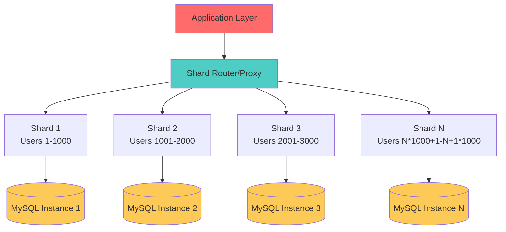
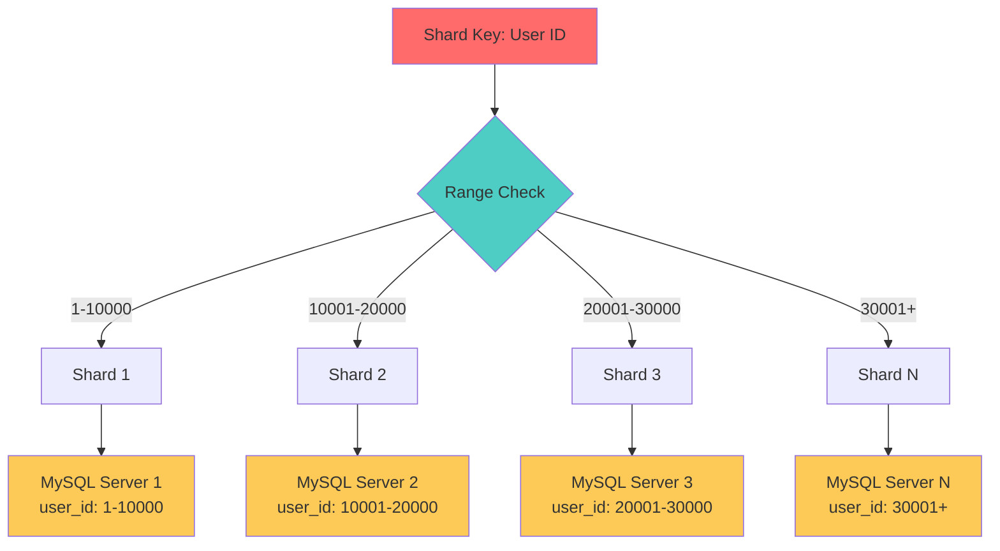
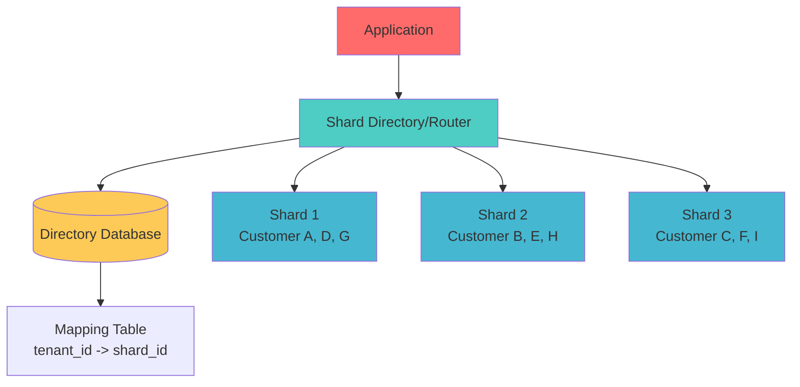
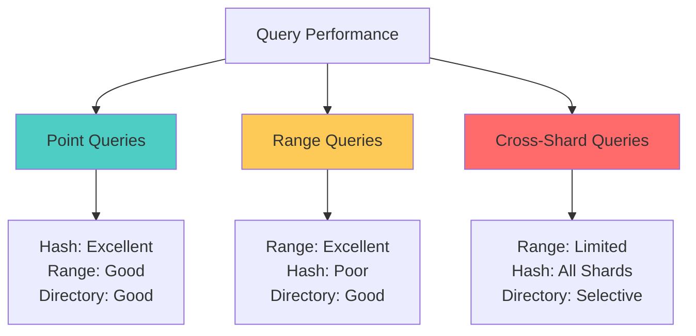

## 🎯 Introduction

Database sharding is a critical technique for achieving horizontal scalability in large-scale applications. As data volumes grow beyond what a single database instance can handle efficiently, sharding becomes essential for maintaining performance and availability. This comprehensive guide explores MySQL sharding strategies, comparing different approaches, implementation patterns, and real-world considerations.

Sharding involves distributing data across multiple database instances (shards), where each shard contains a subset of the total data. This approach enables applications to scale beyond the limitations of vertical scaling and provides better resource utilization across multiple servers.

## 📚 Understanding Database Sharding

### 🔍 What is Sharding?



Sharding splits a large database into smaller, more manageable pieces called shards. Each shard is an independent database that contains a subset of the application's data. The application uses a shard key to determine which shard should store or retrieve specific data.

### 🎯 When to Consider Sharding

**Consider sharding when:**
- Single database performance becomes a bottleneck
- Data size exceeds storage capacity of single instance
- Read/write operations exceed single server capabilities
- High availability requirements across geographic regions
- Cost optimization through distributed infrastructure

**Avoid sharding if:**
- Application can scale vertically (more CPU/RAM/storage)
- Read replicas can solve read performance issues
- Data size is manageable for single instance
- Application complexity increase isn't justified

## 🛠️ MySQL Sharding Strategies

### 1. Range-Based Sharding

Range-based sharding distributes data based on ranges of the shard key values.



#### 🛠️ Range-Based Implementation

```java
@Component
public class RangeBasedShardingStrategy implements ShardingStrategy {

    private final Map<String, ShardRange> shardRanges;
    private final Map<String, DataSource> dataSources;

    public RangeBasedShardingStrategy() {
        this.shardRanges = new HashMap<>();
        this.dataSources = new HashMap<>();
        initializeShards();
    }

    private void initializeShards() {
        // Define shard ranges
        shardRanges.put("shard1", new ShardRange(1L, 10000L));
        shardRanges.put("shard2", new ShardRange(10001L, 20000L));
        shardRanges.put("shard3", new ShardRange(20001L, 30000L));
        shardRanges.put("shard4", new ShardRange(30001L, Long.MAX_VALUE));

        // Initialize data sources
        dataSources.put("shard1", createDataSource("jdbc:mysql://db1:3306/shard1"));
        dataSources.put("shard2", createDataSource("jdbc:mysql://db2:3306/shard2"));
        dataSources.put("shard3", createDataSource("jdbc:mysql://db3:3306/shard3"));
        dataSources.put("shard4", createDataSource("jdbc:mysql://db4:3306/shard4"));
    }

    @Override
    public String determineShardKey(Object shardingValue) {
        Long value = (Long) shardingValue;

        return shardRanges.entrySet().stream()
            .filter(entry -> {
                ShardRange range = entry.getValue();
                return value >= range.getMin() && value <= range.getMax();
            })
            .map(Map.Entry::getKey)
            .findFirst()
            .orElseThrow(() -> new IllegalArgumentException("No shard found for value: " + value));
    }

    @Override
    public DataSource getDataSource(String shardKey) {
        DataSource dataSource = dataSources.get(shardKey);
        if (dataSource == null) {
            throw new IllegalArgumentException("No data source found for shard: " + shardKey);
        }
        return dataSource;
    }

    @Override
    public List<String> getAllShardKeys() {
        return new ArrayList<>(shardRanges.keySet());
    }

    // Range query optimization
    public List<String> getShardsForRange(Long minValue, Long maxValue) {
        return shardRanges.entrySet().stream()
            .filter(entry -> {
                ShardRange range = entry.getValue();
                // Check if ranges overlap
                return !(maxValue < range.getMin() || minValue > range.getMax());
            })
            .map(Map.Entry::getKey)
            .collect(Collectors.toList());
    }

    private HikariDataSource createDataSource(String jdbcUrl) {
        HikariConfig config = new HikariConfig();
        config.setJdbcUrl(jdbcUrl);
        config.setUsername("app_user");
        config.setPassword("app_password");
        config.setMaximumPoolSize(20);
        config.setMinimumIdle(5);
        config.setConnectionTimeout(30000);
        config.setIdleTimeout(600000);
        config.setMaxLifetime(1800000);
        return new HikariDataSource(config);
    }

    // Supporting classes
    public static class ShardRange {
        private final Long min;
        private final Long max;

        public ShardRange(Long min, Long max) {
            this.min = min;
            this.max = max;
        }

        public Long getMin() { return min; }
        public Long getMax() { return max; }

        @Override
        public String toString() {
            return String.format("ShardRange{min=%d, max=%s}",
                min, max == Long.MAX_VALUE ? "∞" : max);
        }
    }
}

// User service with range-based sharding
@Service
public class UserService {

    private final RangeBasedShardingStrategy shardingStrategy;
    private final JdbcTemplate jdbcTemplate;

    public UserService(RangeBasedShardingStrategy shardingStrategy) {
        this.shardingStrategy = shardingStrategy;
        this.jdbcTemplate = new JdbcTemplate();
    }

    public User findById(Long userId) {
        String shardKey = shardingStrategy.determineShardKey(userId);
        DataSource dataSource = shardingStrategy.getDataSource(shardKey);

        jdbcTemplate.setDataSource(dataSource);

        return jdbcTemplate.queryForObject(
            "SELECT * FROM users WHERE id = ?",
            new Object[]{userId},
            new UserRowMapper()
        );
    }

    public List<User> findByIdRange(Long minId, Long maxId) {
        List<String> relevantShards = shardingStrategy.getShardsForRange(minId, maxId);
        List<User> allUsers = new ArrayList<>();

        for (String shardKey : relevantShards) {
            DataSource dataSource = shardingStrategy.getDataSource(shardKey);
            jdbcTemplate.setDataSource(dataSource);

            List<User> shardUsers = jdbcTemplate.query(
                "SELECT * FROM users WHERE id BETWEEN ? AND ?",
                new Object[]{minId, maxId},
                new UserRowMapper()
            );

            allUsers.addAll(shardUsers);
        }

        return allUsers.stream()
            .sorted(Comparator.comparing(User::getId))
            .collect(Collectors.toList());
    }

    public void save(User user) {
        String shardKey = shardingStrategy.determineShardKey(user.getId());
        DataSource dataSource = shardingStrategy.getDataSource(shardKey);

        jdbcTemplate.setDataSource(dataSource);

        jdbcTemplate.update(
            "INSERT INTO users (id, username, email, created_at) VALUES (?, ?, ?, ?)",
            user.getId(),
            user.getUsername(),
            user.getEmail(),
            user.getCreatedAt()
        );
    }

    // Batch operations across shards
    public void saveBatch(List<User> users) {
        Map<String, List<User>> usersByShard = users.stream()
            .collect(Collectors.groupingBy(user ->
                shardingStrategy.determineShardKey(user.getId())));

        usersByShard.forEach((shardKey, shardUsers) -> {
            DataSource dataSource = shardingStrategy.getDataSource(shardKey);
            jdbcTemplate.setDataSource(dataSource);

            List<Object[]> batchArgs = shardUsers.stream()
                .map(user -> new Object[]{
                    user.getId(), user.getUsername(),
                    user.getEmail(), user.getCreatedAt()
                })
                .collect(Collectors.toList());

            jdbcTemplate.batchUpdate(
                "INSERT INTO users (id, username, email, created_at) VALUES (?, ?, ?, ?)",
                batchArgs
            );
        });
    }
}
```

#### ✅ Range-Based Sharding Pros and Cons

**✅ Advantages:**
- Simple to understand and implement
- Efficient for range queries
- Easy to add new shards for growing data
- Sequential data stays together

**❌ Disadvantages:**
- Hot spots with uneven data distribution
- Difficult to balance load across shards
- Range boundaries may become outdated
- Sequential access patterns can overload single shards

**🎯 Use Cases:**
- Time-series data (timestamps)
- Sequential IDs or auto-increment keys
- Geographic data distribution
- Log data partitioned by date

### 2. Hash-Based Sharding

Hash-based sharding uses a hash function to distribute data evenly across shards.

```mermaid
graph TD
    A[Shard Key: User ID] --> B[Hash Function<br/>hash(user_id) % num_shards]

    B --> C[Result: 0<br/>Shard 1]
    B --> D[Result: 1<br/>Shard 2]
    B --> E[Result: 2<br/>Shard 3]
    B --> F[Result: 3<br/>Shard 4]

    C --> G[MySQL Server 1<br/>Hash Result: 0]
    D --> H[MySQL Server 2<br/>Hash Result: 1]
    E --> I[MySQL Server 3<br/>Hash Result: 2]
    F --> J[MySQL Server 4<br/>Hash Result: 3]

    style A fill:#ff6b6b
    style B fill:#4ecdc4
    style G fill:#feca57
    style H fill:#feca57
    style I fill:#feca57
    style J fill:#feca57
```

#### 🛠️ Hash-Based Implementation

```java
@Component
public class HashBasedShardingStrategy implements ShardingStrategy {

    private final List<String> shardKeys;
    private final Map<String, DataSource> dataSources;
    private final int numberOfShards;

    public HashBasedShardingStrategy() {
        this.numberOfShards = 4;
        this.shardKeys = Arrays.asList("shard0", "shard1", "shard2", "shard3");
        this.dataSources = new HashMap<>();
        initializeShards();
    }

    private void initializeShards() {
        dataSources.put("shard0", createDataSource("jdbc:mysql://db1:3306/shard0"));
        dataSources.put("shard1", createDataSource("jdbc:mysql://db2:3306/shard1"));
        dataSources.put("shard2", createDataSource("jdbc:mysql://db3:3306/shard2"));
        dataSources.put("shard3", createDataSource("jdbc:mysql://db4:3306/shard3"));
    }

    @Override
    public String determineShardKey(Object shardingValue) {
        int hash = hashFunction(shardingValue);
        int shardIndex = Math.abs(hash) % numberOfShards;
        return shardKeys.get(shardIndex);
    }

    private int hashFunction(Object value) {
        if (value == null) {
            return 0;
        }

        // Use consistent hashing for better distribution
        return value.hashCode();
    }

    // Consistent hashing implementation for better resharding
    public String determineShardKeyConsistent(Object shardingValue) {
        if (shardingValue == null) {
            return shardKeys.get(0);
        }

        // Use MD5 hash for better distribution
        String input = String.valueOf(shardingValue);
        try {
            MessageDigest md = MessageDigest.getInstance("MD5");
            byte[] hashBytes = md.digest(input.getBytes());

            // Convert to positive integer
            int hash = 0;
            for (int i = 0; i < 4; i++) {
                hash = (hash << 8) + (hashBytes[i] & 0xff);
            }

            int shardIndex = Math.abs(hash) % numberOfShards;
            return shardKeys.get(shardIndex);

        } catch (NoSuchAlgorithmException e) {
            // Fallback to simple hash
            return determineShardKey(shardingValue);
        }
    }

    @Override
    public DataSource getDataSource(String shardKey) {
        DataSource dataSource = dataSources.get(shardKey);
        if (dataSource == null) {
            throw new IllegalArgumentException("No data source found for shard: " + shardKey);
        }
        return dataSource;
    }

    @Override
    public List<String> getAllShardKeys() {
        return new ArrayList<>(shardKeys);
    }

    // For operations that need to query all shards
    public <T> List<T> queryAllShards(Function<DataSource, List<T>> queryFunction) {
        return shardKeys.parallelStream()
            .map(shardKey -> {
                DataSource dataSource = dataSources.get(shardKey);
                return queryFunction.apply(dataSource);
            })
            .flatMap(List::stream)
            .collect(Collectors.toList());
    }

    // Shard distribution analysis
    public Map<String, Integer> analyzeDistribution(List<Object> sampleKeys) {
        return sampleKeys.stream()
            .collect(Collectors.groupingBy(
                this::determineShardKey,
                Collectors.collectingAndThen(
                    Collectors.counting(),
                    Math::toIntExact
                )
            ));
    }

    private HikariDataSource createDataSource(String jdbcUrl) {
        HikariConfig config = new HikariConfig();
        config.setJdbcUrl(jdbcUrl);
        config.setUsername("app_user");
        config.setPassword("app_password");
        config.setMaximumPoolSize(20);
        config.setMinimumIdle(5);
        config.setConnectionTimeout(30000);
        config.setIdleTimeout(600000);
        config.setMaxLifetime(1800000);
        config.setLeakDetectionThreshold(60000);
        return new HikariDataSource(config);
    }
}

// Product service with hash-based sharding
@Service
public class ProductService {

    private final HashBasedShardingStrategy shardingStrategy;
    private final JdbcTemplate jdbcTemplate;

    public ProductService(HashBasedShardingStrategy shardingStrategy) {
        this.shardingStrategy = shardingStrategy;
        this.jdbcTemplate = new JdbcTemplate();
    }

    public Product findById(String productId) {
        String shardKey = shardingStrategy.determineShardKey(productId);
        DataSource dataSource = shardingStrategy.getDataSource(shardKey);

        jdbcTemplate.setDataSource(dataSource);

        try {
            return jdbcTemplate.queryForObject(
                "SELECT * FROM products WHERE id = ?",
                new Object[]{productId},
                new ProductRowMapper()
            );
        } catch (EmptyResultDataAccessException e) {
            return null;
        }
    }

    public List<Product> findByIds(List<String> productIds) {
        // Group by shard to minimize database connections
        Map<String, List<String>> idsByShard = productIds.stream()
            .collect(Collectors.groupingBy(shardingStrategy::determineShardKey));

        List<Product> allProducts = new ArrayList<>();

        idsByShard.forEach((shardKey, ids) -> {
            DataSource dataSource = shardingStrategy.getDataSource(shardKey);
            jdbcTemplate.setDataSource(dataSource);

            String inClause = String.join(",", Collections.nCopies(ids.size(), "?"));
            String query = "SELECT * FROM products WHERE id IN (" + inClause + ")";

            List<Product> shardProducts = jdbcTemplate.query(
                query,
                ids.toArray(),
                new ProductRowMapper()
            );

            allProducts.addAll(shardProducts);
        });

        return allProducts;
    }

    public void save(Product product) {
        String shardKey = shardingStrategy.determineShardKey(product.getId());
        DataSource dataSource = shardingStrategy.getDataSource(shardKey);

        jdbcTemplate.setDataSource(dataSource);

        jdbcTemplate.update(
            "INSERT INTO products (id, name, price, category_id, created_at) VALUES (?, ?, ?, ?, ?)" +
            "ON DUPLICATE KEY UPDATE name = VALUES(name), price = VALUES(price), " +
            "category_id = VALUES(category_id), updated_at = NOW()",
            product.getId(),
            product.getName(),
            product.getPrice(),
            product.getCategoryId(),
            product.getCreatedAt()
        );
    }

    // Global search across all shards
    public List<Product> searchByName(String namePattern, int limit) {
        List<Product> allResults = shardingStrategy.queryAllShards(dataSource -> {
            jdbcTemplate.setDataSource(dataSource);
            return jdbcTemplate.query(
                "SELECT * FROM products WHERE name LIKE ? LIMIT ?",
                new Object[]{"%" + namePattern + "%", limit},
                new ProductRowMapper()
            );
        });

        return allResults.stream()
            .sorted(Comparator.comparing(Product::getName))
            .limit(limit)
            .collect(Collectors.toList());
    }

    // Analytics query across all shards
    public Map<String, Object> getProductStatistics() {
        List<Map<String, Object>> shardStats = shardingStrategy.queryAllShards(dataSource -> {
            jdbcTemplate.setDataSource(dataSource);
            List<Map<String, Object>> stats = jdbcTemplate.queryForList(
                "SELECT " +
                "  COUNT(*) as total_products, " +
                "  AVG(price) as avg_price, " +
                "  MIN(price) as min_price, " +
                "  MAX(price) as max_price " +
                "FROM products"
            );
            return stats;
        });

        // Aggregate results from all shards
        long totalProducts = shardStats.stream()
            .mapToLong(stat -> ((Number) stat.get("total_products")).longValue())
            .sum();

        double avgPrice = shardStats.stream()
            .mapToDouble(stat -> ((Number) stat.get("avg_price")).doubleValue())
            .average()
            .orElse(0.0);

        double minPrice = shardStats.stream()
            .mapToDouble(stat -> ((Number) stat.get("min_price")).doubleValue())
            .min()
            .orElse(0.0);

        double maxPrice = shardStats.stream()
            .mapToDouble(stat -> ((Number) stat.get("max_price")).doubleValue())
            .max()
            .orElse(0.0);

        Map<String, Object> aggregatedStats = new HashMap<>();
        aggregatedStats.put("total_products", totalProducts);
        aggregatedStats.put("avg_price", avgPrice);
        aggregatedStats.put("min_price", minPrice);
        aggregatedStats.put("max_price", maxPrice);

        return aggregatedStats;
    }
}
```

#### ✅ Hash-Based Sharding Pros and Cons

**✅ Advantages:**
- Even data distribution
- Eliminates hot spots
- Simple to implement
- Good performance for point queries

**❌ Disadvantages:**
- Difficult to perform range queries
- Complex resharding when adding/removing shards
- Cross-shard joins are expensive
- No data locality for related records

**🎯 Use Cases:**
- User data sharded by user ID
- Product catalogs
- Session data
- Cache-like access patterns

### 3. Directory-Based Sharding

Directory-based sharding uses a lookup service to determine the shard location.



#### 🛠️ Directory-Based Implementation

```java
// Shard directory service
@Service
public class ShardDirectoryService {

    private final JdbcTemplate directoryJdbcTemplate;
    private final Map<String, DataSource> shardDataSources;
    private final Cache<String, String> shardCache;

    public ShardDirectoryService(DataSource directoryDataSource) {
        this.directoryJdbcTemplate = new JdbcTemplate(directoryDataSource);
        this.shardDataSources = new ConcurrentHashMap<>();
        this.shardCache = Caffeine.newBuilder()
            .maximumSize(10000)
            .expireAfterWrite(30, TimeUnit.MINUTES)
            .build();

        initializeShardDataSources();
    }

    private void initializeShardDataSources() {
        // Initialize shard data sources
        shardDataSources.put("shard-us-east", createDataSource("jdbc:mysql://db-us-east:3306/tenant_data"));
        shardDataSources.put("shard-us-west", createDataSource("jdbc:mysql://db-us-west:3306/tenant_data"));
        shardDataSources.put("shard-eu", createDataSource("jdbc:mysql://db-eu:3306/tenant_data"));
        shardDataSources.put("shard-asia", createDataSource("jdbc:mysql://db-asia:3306/tenant_data"));
    }

    public String determineShardKey(String tenantId) {
        // Check cache first
        String cachedShard = shardCache.getIfPresent(tenantId);
        if (cachedShard != null) {
            return cachedShard;
        }

        // Query directory database
        try {
            String shardKey = directoryJdbcTemplate.queryForObject(
                "SELECT shard_key FROM tenant_shard_mapping WHERE tenant_id = ?",
                new Object[]{tenantId},
                String.class
            );

            // Cache the result
            shardCache.put(tenantId, shardKey);
            return shardKey;

        } catch (EmptyResultDataAccessException e) {
            // Auto-assign to least loaded shard
            String assignedShard = assignToOptimalShard(tenantId);
            shardCache.put(tenantId, assignedShard);
            return assignedShard;
        }
    }

    private String assignToOptimalShard(String tenantId) {
        // Get shard load statistics
        List<ShardLoadInfo> shardLoads = getShardLoadStatistics();

        // Find least loaded shard
        String optimalShard = shardLoads.stream()
            .min(Comparator.comparing(ShardLoadInfo::getLoadScore))
            .map(ShardLoadInfo::getShardKey)
            .orElse("shard-us-east"); // Default fallback

        // Register tenant to shard
        directoryJdbcTemplate.update(
            "INSERT INTO tenant_shard_mapping (tenant_id, shard_key, assigned_at) VALUES (?, ?, NOW())",
            tenantId, optimalShard
        );

        System.out.println("Assigned tenant " + tenantId + " to shard " + optimalShard);
        return optimalShard;
    }

    private List<ShardLoadInfo> getShardLoadStatistics() {
        return directoryJdbcTemplate.query(
            "SELECT " +
            "  s.shard_key, " +
            "  COUNT(tsm.tenant_id) as tenant_count, " +
            "  s.max_capacity, " +
            "  s.current_connections, " +
            "  s.cpu_usage, " +
            "  s.memory_usage " +
            "FROM shards s " +
            "LEFT JOIN tenant_shard_mapping tsm ON s.shard_key = tsm.shard_key " +
            "GROUP BY s.shard_key",
            (rs, rowNum) -> new ShardLoadInfo(
                rs.getString("shard_key"),
                rs.getInt("tenant_count"),
                rs.getInt("max_capacity"),
                rs.getInt("current_connections"),
                rs.getDouble("cpu_usage"),
                rs.getDouble("memory_usage")
            )
        );
    }

    public DataSource getDataSource(String shardKey) {
        DataSource dataSource = shardDataSources.get(shardKey);
        if (dataSource == null) {
            throw new IllegalArgumentException("No data source found for shard: " + shardKey);
        }
        return dataSource;
    }

    // Move tenant to different shard (resharding)
    @Transactional
    public void moveTenant(String tenantId, String newShardKey) {
        String currentShardKey = determineShardKey(tenantId);

        if (currentShardKey.equals(newShardKey)) {
            return; // Already in target shard
        }

        // 1. Copy data to new shard
        copyTenantData(tenantId, currentShardKey, newShardKey);

        // 2. Update directory mapping
        directoryJdbcTemplate.update(
            "UPDATE tenant_shard_mapping SET shard_key = ?, moved_at = NOW() WHERE tenant_id = ?",
            newShardKey, tenantId
        );

        // 3. Clear cache
        shardCache.invalidate(tenantId);

        // 4. Delete data from old shard (after verification)
        deleteTenantDataFromShard(tenantId, currentShardKey);

        System.out.println("Moved tenant " + tenantId + " from " + currentShardKey + " to " + newShardKey);
    }

    private void copyTenantData(String tenantId, String sourceShardKey, String targetShardKey) {
        DataSource sourceDS = getDataSource(sourceShardKey);
        DataSource targetDS = getDataSource(targetShardKey);

        JdbcTemplate sourceJdbc = new JdbcTemplate(sourceDS);
        JdbcTemplate targetJdbc = new JdbcTemplate(targetDS);

        // Copy all tables for the tenant
        String[] tables = {"orders", "order_items", "customers", "payments"};

        for (String table : tables) {
            List<Map<String, Object>> data = sourceJdbc.queryForList(
                "SELECT * FROM " + table + " WHERE tenant_id = ?",
                tenantId
            );

            if (!data.isEmpty()) {
                copyTableData(targetJdbc, table, data);
            }
        }
    }

    private void copyTableData(JdbcTemplate targetJdbc, String tableName, List<Map<String, Object>> data) {
        if (data.isEmpty()) return;

        // Generate INSERT statement dynamically
        Map<String, Object> firstRow = data.get(0);
        String columns = String.join(", ", firstRow.keySet());
        String placeholders = String.join(", ", Collections.nCopies(firstRow.size(), "?"));

        String insertSql = String.format("INSERT INTO %s (%s) VALUES (%s)", tableName, columns, placeholders);

        List<Object[]> batchArgs = data.stream()
            .map(row -> firstRow.keySet().stream()
                .map(row::get)
                .toArray())
            .collect(Collectors.toList());

        targetJdbc.batchUpdate(insertSql, batchArgs);
    }

    private void deleteTenantDataFromShard(String tenantId, String shardKey) {
        DataSource dataSource = getDataSource(shardKey);
        JdbcTemplate jdbcTemplate = new JdbcTemplate(dataSource);

        String[] tables = {"order_items", "payments", "orders", "customers"}; // Order matters for FK constraints

        for (String table : tables) {
            int deletedRows = jdbcTemplate.update(
                "DELETE FROM " + table + " WHERE tenant_id = ?",
                tenantId
            );
            System.out.println("Deleted " + deletedRows + " rows from " + table + " for tenant " + tenantId);
        }
    }

    // Health check for shards
    public Map<String, Boolean> checkShardHealth() {
        Map<String, Boolean> healthStatus = new HashMap<>();

        shardDataSources.entrySet().parallelStream().forEach(entry -> {
            String shardKey = entry.getKey();
            DataSource dataSource = entry.getValue();

            try {
                JdbcTemplate jdbc = new JdbcTemplate(dataSource);
                jdbc.queryForObject("SELECT 1", Integer.class);
                healthStatus.put(shardKey, true);
            } catch (Exception e) {
                healthStatus.put(shardKey, false);
                System.err.println("Health check failed for shard " + shardKey + ": " + e.getMessage());
            }
        });

        return healthStatus;
    }

    private HikariDataSource createDataSource(String jdbcUrl) {
        HikariConfig config = new HikariConfig();
        config.setJdbcUrl(jdbcUrl);
        config.setUsername("app_user");
        config.setPassword("app_password");
        config.setMaximumPoolSize(15);
        config.setMinimumIdle(3);
        config.setConnectionTimeout(30000);
        config.setIdleTimeout(300000);
        config.setMaxLifetime(1800000);
        return new HikariDataSource(config);
    }

    // Supporting classes
    public static class ShardLoadInfo {
        private final String shardKey;
        private final int tenantCount;
        private final int maxCapacity;
        private final int currentConnections;
        private final double cpuUsage;
        private final double memoryUsage;

        public ShardLoadInfo(String shardKey, int tenantCount, int maxCapacity,
                           int currentConnections, double cpuUsage, double memoryUsage) {
            this.shardKey = shardKey;
            this.tenantCount = tenantCount;
            this.maxCapacity = maxCapacity;
            this.currentConnections = currentConnections;
            this.cpuUsage = cpuUsage;
            this.memoryUsage = memoryUsage;
        }

        public double getLoadScore() {
            // Calculate composite load score
            double capacityRatio = (double) tenantCount / maxCapacity;
            double connectionRatio = (double) currentConnections / 100; // Assuming max 100 connections

            return (capacityRatio * 0.4) + (connectionRatio * 0.3) + (cpuUsage * 0.2) + (memoryUsage * 0.1);
        }

        // Getters
        public String getShardKey() { return shardKey; }
        public int getTenantCount() { return tenantCount; }
        public int getMaxCapacity() { return maxCapacity; }
        public int getCurrentConnections() { return currentConnections; }
        public double getCpuUsage() { return cpuUsage; }
        public double getMemoryUsage() { return memoryUsage; }
    }
}

// Multi-tenant order service using directory-based sharding
@Service
public class OrderService {

    private final ShardDirectoryService shardDirectoryService;
    private final JdbcTemplate jdbcTemplate;

    public OrderService(ShardDirectoryService shardDirectoryService) {
        this.shardDirectoryService = shardDirectoryService;
        this.jdbcTemplate = new JdbcTemplate();
    }

    public Order findById(String tenantId, Long orderId) {
        String shardKey = shardDirectoryService.determineShardKey(tenantId);
        DataSource dataSource = shardDirectoryService.getDataSource(shardKey);

        jdbcTemplate.setDataSource(dataSource);

        try {
            return jdbcTemplate.queryForObject(
                "SELECT * FROM orders WHERE tenant_id = ? AND id = ?",
                new Object[]{tenantId, orderId},
                new OrderRowMapper()
            );
        } catch (EmptyResultDataAccessException e) {
            return null;
        }
    }

    public List<Order> findByTenant(String tenantId, int limit, int offset) {
        String shardKey = shardDirectoryService.determineShardKey(tenantId);
        DataSource dataSource = shardDirectoryService.getDataSource(shardKey);

        jdbcTemplate.setDataSource(dataSource);

        return jdbcTemplate.query(
            "SELECT * FROM orders WHERE tenant_id = ? ORDER BY created_at DESC LIMIT ? OFFSET ?",
            new Object[]{tenantId, limit, offset},
            new OrderRowMapper()
        );
    }

    public void save(Order order) {
        String shardKey = shardDirectoryService.determineShardKey(order.getTenantId());
        DataSource dataSource = shardDirectoryService.getDataSource(shardKey);

        jdbcTemplate.setDataSource(dataSource);

        jdbcTemplate.update(
            "INSERT INTO orders (tenant_id, id, customer_id, total_amount, status, created_at) " +
            "VALUES (?, ?, ?, ?, ?, ?)",
            order.getTenantId(),
            order.getId(),
            order.getCustomerId(),
            order.getTotalAmount(),
            order.getStatus(),
            order.getCreatedAt()
        );
    }

    // Cross-tenant analytics (admin function)
    @PreAuthorize("hasRole('ADMIN')")
    public Map<String, Object> getGlobalOrderStatistics() {
        Map<String, Boolean> shardHealth = shardDirectoryService.checkShardHealth();
        Map<String, Object> globalStats = new HashMap<>();

        List<Map<String, Object>> allShardStats = shardDirectoryService.shardDataSources.entrySet()
            .parallelStream()
            .filter(entry -> shardHealth.get(entry.getKey()))
            .map(entry -> {
                DataSource dataSource = entry.getValue();
                JdbcTemplate jdbc = new JdbcTemplate(dataSource);

                return jdbc.queryForMap(
                    "SELECT " +
                    "  COUNT(*) as total_orders, " +
                    "  SUM(total_amount) as total_revenue, " +
                    "  AVG(total_amount) as avg_order_value, " +
                    "  COUNT(DISTINCT tenant_id) as tenant_count " +
                    "FROM orders"
                );
            })
            .collect(Collectors.toList());

        // Aggregate results
        long totalOrders = allShardStats.stream()
            .mapToLong(stat -> ((Number) stat.get("total_orders")).longValue())
            .sum();

        BigDecimal totalRevenue = allShardStats.stream()
            .map(stat -> (BigDecimal) stat.get("total_revenue"))
            .filter(Objects::nonNull)
            .reduce(BigDecimal.ZERO, BigDecimal::add);

        double avgOrderValue = allShardStats.stream()
            .mapToDouble(stat -> ((Number) stat.get("avg_order_value")).doubleValue())
            .average()
            .orElse(0.0);

        long totalTenants = allShardStats.stream()
            .mapToLong(stat -> ((Number) stat.get("tenant_count")).longValue())
            .sum();

        globalStats.put("total_orders", totalOrders);
        globalStats.put("total_revenue", totalRevenue);
        globalStats.put("avg_order_value", avgOrderValue);
        globalStats.put("total_tenants", totalTenants);
        globalStats.put("healthy_shards", shardHealth.values().stream().mapToInt(h -> h ? 1 : 0).sum());
        globalStats.put("total_shards", shardHealth.size());

        return globalStats;
    }
}
```

#### ✅ Directory-Based Sharding Pros and Cons

**✅ Advantages:**
- Flexible shard assignment
- Easy to rebalance data
- Support for complex routing logic
- Can optimize based on access patterns

**❌ Disadvantages:**
- Additional lookup overhead
- Directory service becomes a bottleneck
- More complex architecture
- Potential single point of failure

**🎯 Use Cases:**
- Multi-tenant applications
- Geographic data distribution
- Load-based shard assignment
- Complex business logic routing

## 📊 Sharding Strategy Comparison

### 🎯 Comparison Matrix

| Aspect | Range-Based | Hash-Based | Directory-Based |
|--------|-------------|------------|-----------------|
| **Data Distribution** | Can be uneven | Even distribution | Configurable |
| **Range Queries** | Excellent | Poor | Good |
| **Point Queries** | Good | Excellent | Good |
| **Resharding** | Moderate | Difficult | Easy |
| **Hot Spots** | Possible | Rare | Preventable |
| **Complexity** | Low | Low | High |
| **Lookup Overhead** | None | None | Yes |
| **Cross-Shard Queries** | Limited | All shards | Selective |

### 📈 Performance Characteristics



## 🛠️ Implementation Best Practices

### 1. Shard Key Selection

```java
// Good shard key characteristics
public class ShardKeyAnalysis {

    // High cardinality - many unique values
    public void analyzeCardinality(String columnName, DataSource dataSource) {
        JdbcTemplate jdbc = new JdbcTemplate(dataSource);

        Long totalRows = jdbc.queryForObject("SELECT COUNT(*) FROM " + tableName, Long.class);
        Long uniqueValues = jdbc.queryForObject("SELECT COUNT(DISTINCT " + columnName + ") FROM " + tableName, Long.class);

        double cardinality = (double) uniqueValues / totalRows;

        if (cardinality > 0.8) {
            System.out.println(columnName + " has high cardinality: " + cardinality);
        } else {
            System.out.println("Warning: " + columnName + " has low cardinality: " + cardinality);
        }
    }

    // Even distribution analysis
    public void analyzeDistribution(List<Object> sampleKeys, ShardingStrategy strategy) {
        Map<String, Integer> distribution = sampleKeys.stream()
            .collect(Collectors.groupingBy(
                key -> strategy.determineShardKey(key),
                Collectors.collectingAndThen(Collectors.counting(), Math::toIntExact)
            ));

        double mean = distribution.values().stream().mapToInt(Integer::intValue).average().orElse(0);
        double variance = distribution.values().stream()
            .mapToDouble(count -> Math.pow(count - mean, 2))
            .average()
            .orElse(0);

        System.out.println("Distribution analysis:");
        System.out.println("Mean: " + mean);
        System.out.println("Variance: " + variance);
        System.out.println("Standard Deviation: " + Math.sqrt(variance));

        distribution.forEach((shard, count) ->
            System.out.println(shard + ": " + count + " (" + (count/mean)*100 + "% of average)")
        );
    }
}
```

### 2. Connection Pool Management

```java
@Configuration
public class ShardingDataSourceConfig {

    @Bean
    public Map<String, DataSource> shardDataSources() {
        Map<String, DataSource> dataSources = new HashMap<>();

        // Configure each shard with appropriate pool settings
        List<ShardConfig> shardConfigs = Arrays.asList(
            new ShardConfig("shard1", "jdbc:mysql://db1:3306/shard1", 20, 5),
            new ShardConfig("shard2", "jdbc:mysql://db2:3306/shard2", 20, 5),
            new ShardConfig("shard3", "jdbc:mysql://db3:3306/shard3", 15, 3),
            new ShardConfig("shard4", "jdbc:mysql://db4:3306/shard4", 25, 8)
        );

        shardConfigs.forEach(config -> {
            HikariConfig hikariConfig = new HikariConfig();
            hikariConfig.setJdbcUrl(config.getJdbcUrl());
            hikariConfig.setUsername("app_user");
            hikariConfig.setPassword("app_password");
            hikariConfig.setMaximumPoolSize(config.getMaxPoolSize());
            hikariConfig.setMinimumIdle(config.getMinIdle());
            hikariConfig.setConnectionTimeout(30000);
            hikariConfig.setIdleTimeout(300000);
            hikariConfig.setMaxLifetime(1800000);
            hikariConfig.setLeakDetectionThreshold(60000);

            // Pool name for monitoring
            hikariConfig.setPoolName(config.getShardKey() + "-pool");

            dataSources.put(config.getShardKey(), new HikariDataSource(hikariConfig));
        });

        return dataSources;
    }

    private static class ShardConfig {
        private final String shardKey;
        private final String jdbcUrl;
        private final int maxPoolSize;
        private final int minIdle;

        public ShardConfig(String shardKey, String jdbcUrl, int maxPoolSize, int minIdle) {
            this.shardKey = shardKey;
            this.jdbcUrl = jdbcUrl;
            this.maxPoolSize = maxPoolSize;
            this.minIdle = minIdle;
        }

        // Getters...
        public String getShardKey() { return shardKey; }
        public String getJdbcUrl() { return jdbcUrl; }
        public int getMaxPoolSize() { return maxPoolSize; }
        public int getMinIdle() { return minIdle; }
    }
}
```

### 3. Monitoring and Alerting

```java
@Component
public class ShardingMonitor {

    private final MeterRegistry meterRegistry;
    private final Map<String, DataSource> shardDataSources;

    @Scheduled(fixedRate = 60000) // Every minute
    public void collectShardMetrics() {
        shardDataSources.forEach((shardKey, dataSource) -> {
            if (dataSource instanceof HikariDataSource) {
                HikariDataSource hikariDS = (HikariDataSource) dataSource;
                HikariPoolMXBean poolBean = hikariDS.getHikariPoolMXBean();

                // Connection pool metrics
                Gauge.builder("shard.connection.active")
                    .tag("shard", shardKey)
                    .register(meterRegistry, poolBean, HikariPoolMXBean::getActiveConnections);

                Gauge.builder("shard.connection.idle")
                    .tag("shard", shardKey)
                    .register(meterRegistry, poolBean, HikariPoolMXBean::getIdleConnections);

                Gauge.builder("shard.connection.total")
                    .tag("shard", shardKey)
                    .register(meterRegistry, poolBean, HikariPoolMXBean::getTotalConnections);

                // Query performance metrics
                collectQueryMetrics(shardKey, dataSource);
            }
        });
    }

    private void collectQueryMetrics(String shardKey, DataSource dataSource) {
        try {
            JdbcTemplate jdbc = new JdbcTemplate(dataSource);

            // Query response time
            long startTime = System.nanoTime();
            jdbc.queryForObject("SELECT 1", Integer.class);
            long duration = System.nanoTime() - startTime;

            Timer.Sample sample = Timer.start(meterRegistry);
            sample.stop(Timer.builder("shard.query.response_time")
                .tag("shard", shardKey)
                .register(meterRegistry));

            // Table metrics
            List<Map<String, Object>> tableStats = jdbc.queryForList(
                "SELECT " +
                "  table_name, " +
                "  table_rows, " +
                "  data_length, " +
                "  index_length " +
                "FROM information_schema.tables " +
                "WHERE table_schema = DATABASE()"
            );

            tableStats.forEach(stat -> {
                String tableName = (String) stat.get("table_name");
                Number tableRows = (Number) stat.get("table_rows");
                Number dataLength = (Number) stat.get("data_length");

                Gauge.builder("shard.table.rows")
                    .tag("shard", shardKey)
                    .tag("table", tableName)
                    .register(meterRegistry, tableRows, Number::longValue);

                Gauge.builder("shard.table.size_bytes")
                    .tag("shard", shardKey)
                    .tag("table", tableName)
                    .register(meterRegistry, dataLength, Number::longValue);
            });

        } catch (Exception e) {
            // Log error and increment error counter
            Counter.builder("shard.health_check.errors")
                .tag("shard", shardKey)
                .register(meterRegistry)
                .increment();
        }
    }
}
```

## 🚀 Advanced Considerations

### 1. Cross-Shard Transactions

```java
// Distributed transaction coordinator
@Service
public class DistributedTransactionManager {

    private final Map<String, DataSource> shardDataSources;

    public void executeDistributedTransaction(List<ShardOperation> operations) {
        Map<String, Connection> connections = new HashMap<>();

        try {
            // Phase 1: Prepare all connections
            for (ShardOperation operation : operations) {
                String shardKey = operation.getShardKey();
                DataSource dataSource = shardDataSources.get(shardKey);
                Connection connection = dataSource.getConnection();
                connection.setAutoCommit(false);
                connections.put(shardKey, connection);
            }

            // Phase 2: Execute operations
            for (ShardOperation operation : operations) {
                Connection connection = connections.get(operation.getShardKey());
                operation.execute(connection);
            }

            // Phase 3: Commit all transactions
            for (Connection connection : connections.values()) {
                connection.commit();
            }

        } catch (Exception e) {
            // Rollback all transactions
            connections.values().forEach(connection -> {
                try {
                    connection.rollback();
                } catch (SQLException rollbackException) {
                    System.err.println("Rollback failed: " + rollbackException.getMessage());
                }
            });
            throw new RuntimeException("Distributed transaction failed", e);

        } finally {
            // Close all connections
            connections.values().forEach(connection -> {
                try {
                    connection.close();
                } catch (SQLException closeException) {
                    System.err.println("Connection close failed: " + closeException.getMessage());
                }
            });
        }
    }

    public interface ShardOperation {
        String getShardKey();
        void execute(Connection connection) throws SQLException;
    }
}
```

### 2. Data Migration and Resharding

```java
@Service
public class ReshardingService {

    public void reshardData(String sourceShardKey, String targetShardKey,
                          ReshardingCriteria criteria) {

        DataSource sourceDS = shardDataSources.get(sourceShardKey);
        DataSource targetDS = shardDataSources.get(targetShardKey);

        // 1. Identify data to migrate
        List<Long> recordsToMigrate = identifyRecordsForMigration(sourceDS, criteria);

        // 2. Copy data in batches
        int batchSize = 1000;
        for (int i = 0; i < recordsToMigrate.size(); i += batchSize) {
            List<Long> batch = recordsToMigrate.subList(i,
                Math.min(i + batchSize, recordsToMigrate.size()));

            migrateDataBatch(sourceDS, targetDS, batch);
        }

        // 3. Verify data integrity
        boolean verificationPassed = verifyDataIntegrity(sourceDS, targetDS, recordsToMigrate);

        if (verificationPassed) {
            // 4. Delete migrated data from source
            deleteMigratedData(sourceDS, recordsToMigrate);
            System.out.println("Successfully resharded " + recordsToMigrate.size() + " records");
        } else {
            throw new RuntimeException("Data integrity verification failed");
        }
    }
}
```

## 🎯 Conclusion

MySQL sharding is a powerful technique for horizontal scaling, but it requires careful planning and implementation. Each sharding strategy has its own trade-offs:

### Key Takeaways:

1. **Range-Based Sharding**: Best for time-series and sequential data
2. **Hash-Based Sharding**: Provides even distribution but complicates range queries
3. **Directory-Based Sharding**: Offers flexibility at the cost of complexity

### Best Practices:

1. **Choose the right shard key** - High cardinality, even distribution
2. **Plan for growth** - Design resharding strategy from the beginning
3. **Monitor actively** - Track performance, distribution, and health
4. **Test thoroughly** - Especially cross-shard operations and failure scenarios
5. **Keep it simple** - Start with simpler strategies and evolve

Remember that sharding adds significant complexity to your application. Consider alternatives like read replicas, vertical scaling, or managed database solutions before implementing sharding.