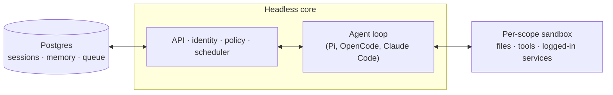

> *大部分 Agent 產品的設計起點是「一個使用者」。*
> *你可以把它塞給整間公司用，然後很快會發現：*
> *記憶混在一起、憑證共用、A 在頻道問的問題被 B 的 context 污染。*
> *QM 的起點反過來 —— 它先假設有很多人，再問「他們怎麼共用同一個 Agent」。*

---

本系列共五篇，逐層拆解 [yc-software/qm](https://github.com/yc-software/qm)：
它解決什麼問題、Scope 模型怎麼撐起多人隔離、Harness 抽象怎麼同時驅動四種 Agent 引擎、
安全模型怎麼分層，以及沙箱 / Skills / Cron 這些持久化能力怎麼組裝。

本篇是第一篇：**架構全景**。

---

## 一、核心命題：single-player 與 multiplayer 的分野

### 1.1 README 的第一段就是設計聲明

> Most agents are designed like personal assistants. You can make one work for a whole
> company, but it quickly gets complex. QM is designed for startups. Employees each get
> their own isolated workspace and work independently without affecting each other, and
> they can also collaborate with the agent in channels, group messages, and projects.
>
> Each person and each room has its own scoped memory, files, keychain view, permissions,
> crons, web apps, and durable sandbox.

注意第二句列出的清單 —— **記憶、檔案、金鑰視圖、權限、排程、Web App、持久沙箱**，
每一項都要 per-scope 隔離。這七件事就是這個專案大部分複雜度的來源。

### 1.2 從單人到多人，會炸開的七個維度

```
┌──────────────┬────────────────────────────┬──────────────────────────────────┐
│ 維度          │ 單人 Agent 的做法           │ 多人平台被迫要做的事              │
├──────────────┼────────────────────────────┼──────────────────────────────────┤
│ 記憶          │ 一個檔案 / 一張表           │ 依 scope 分區 + 跨 scope 的可見性 │
│              │                            │ 政策（off / writable / visible） │
├──────────────┼────────────────────────────┼──────────────────────────────────┤
│ 檔案          │ 一個工作目錄                │ 分層掛載（org 唯讀、scope 讀寫、  │
│              │                            │ team 唯讀）+ 明確授權的 handle    │
├──────────────┼────────────────────────────┼──────────────────────────────────┤
│ 憑證          │ 你的 .env                  │ 每個人自己的 keychain 視圖 +      │
│              │                            │ 可轉授的 service credential       │
├──────────────┼────────────────────────────┼──────────────────────────────────┤
│ 權限          │ 你說了算                    │ org floor 只能收緊不能放寬        │
├──────────────┼────────────────────────────┼──────────────────────────────────┤
│ 排程          │ 一個 cron 檔                │ 誰的身分跑？結果送給誰？收件人同意？│
├──────────────┼────────────────────────────┼──────────────────────────────────┤
│ 執行環境      │ 你的筆電                    │ 每個 scope 一台持久的雲端電腦      │
├──────────────┼────────────────────────────┼──────────────────────────────────┤
│ 對話          │ 一對一                      │ 頻道裡有旁聽者，回覆會被別人看到   │
└──────────────┴────────────────────────────┴──────────────────────────────────┘
```

最後一列常被低估。在頻道裡，Agent 的每一句回覆都是**廣播**。
如果它在回覆時引用了只有你有權讀的檔案，那就是一次跨 scope 洩漏
—— 而且是模型自己造成的，不是程式碼 bug。QM 為此有一整套
「audience floor」機制（第二篇會講）。

---

## 二、無頭核心 + 外掛式介面

### 2.1 README 的架構圖



展開成實際的程式碼對應：

```
┌────────────────────────────────────────────────────────────────────────────┐
│  介面層（全部是 plugins/，可拔可換）                                          │
│                                                                            │
│   web-ui 26,595 行 (Vite + Lit)  ·  portal 4,031  ·  auth 2,559            │
│   admin 1,669  ·  chassis 279（唯一被允許共用的 plugin↔core 管線）           │
│                                                                            │
│   Slack 例外：src/slack/ 7,036 行，是 in-process plugin，                    │
│   由 core 啟動並透過直連 service client 監管                                  │
├────────────────────────────────────────────────────────────────────────────┤
│  無頭核心 src/ 76,648 行 TypeScript（Node 直跑 TS，HTTP 用 Fastify）          │
│                                                                            │
│   ┌──────────────┐  ┌─────────────┐  ┌──────────────┐  ┌────────────────┐  │
│   │ api/  17,151 │  │ core/ 5,877 │  │harness/10,022│  │resolution/1,593│  │
│   │ HTTP 契約    │  │orchestrator │  │ 4 種引擎     │  │ scope 解析      │  │
│   └──────────────┘  └─────────────┘  └──────────────┘  └────────────────┘  │
│                                                                            │
│   ┌──────────────┐  ┌─────────────┐  ┌──────────────┐  ┌────────────────┐  │
│   │sandbox/ 3,226│  │credentials/ │  │sessions/1,936│  │ skills/  1,904 │  │
│   │ 3 種後端     │  │  2,416      │  │ lease + tape │  │ 簽章 + 授權     │  │
│   └──────────────┘  └─────────────┘  └──────────────┘  └────────────────┘  │
│                                                                            │
│   policy/ 816 · security/ 455 · memory/ 1,247 · cron/ 699 · acl/ 354 …     │
├────────────────────────────────────────────────────────────────────────────┤
│  持久層                                                                     │
│   Postgres（sessions · memory · queue · audit · config · grants）           │
│   pg-boss 作為工作佇列                                                       │
├────────────────────────────────────────────────────────────────────────────┤
│  執行層                                                                     │
│   local-sandbox 497 · aws-sandbox 524（microVM）· sprites-sandbox 511（Fly）│
└────────────────────────────────────────────────────────────────────────────┘
```

### 2.2 一個很少見的比例：測試比原始碼還大

```
src/           76,648 行 TypeScript
test/          92,618 行（401 個測試檔）
────────────────────────────────────
測試 / 原始碼   1.21
```

對一個 Agent 專案來說這個比例相當罕見。看 `package.json` 的 script 清單就知道為什麼：

```
test · test:root:shard · test:root:shard:check · test:e2e · live-e2e · test:pg · livetest
smoke:pi · smoke:monitor · smoke:git-cli · smoke:google-oauth · smoke:service-cred
smoke:aws-sandbox · smoke:local-sandbox · bench:memory
```

`smoke:*` 這一組是「打真的外部系統」的煙霧測試 ——
真的跑一次 Google OAuth、真的開一台 AWS microVM。
Agent 系統的多數 bug 出在整合邊界，單元測試抓不到。

### 2.3 「每個 substrate 都在介面後面」

README 說：

> Every substrate (harness, session store, sandbox, memory) sits behind an interface,
> so production implementations swap in via one wiring file.

那個檔案是 `src/wiring.ts`，1,490 行。它就是整個系統的組裝工廠：

```
記憶體版（測試 / 本機）              Postgres / 雲端版（正式）
──────────────────────────────────────────────────────────────────
createMemorySessionStore      ⇄   createPostgresSessionStore
createMemoryMap               ⇄   createPostgresMapFactory
createMemoryService           ⇄   createPostgresMemoryService
createMemoryTaskStore         ⇄   createPostgresTaskStore
createMemoryRunStore          ⇄   createPostgresRunStore
createNoopLeaderLease         ⇄   createPostgresLeaderLease
createLocalSandbox            ⇄   createAwsSandbox / createSpritesSandbox
createMockHarness             ⇄   createPiHarness / createClaudeHarness /
                                  createCodexHarness / createOpenCodeHarness
```

**每一個 substrate 都有一組「記憶體版」與「持久版」。**
這不只是為了測試 —— 它讓 `npm run dev` 不需要任何外部依賴就能啟動。

---

## 三、Agent 的工具面是**固定且很小**的

這是 QM 與大多數 Agent 平台最大的差異之一。README 說：

> The agent has a small, fixed tool surface; one of those tools is `execute`,
> which runs commands in the scope's own isolated sandbox — its durable computer,
> where installed tools stay installed.

`src/harness/pi-tools.ts` 裡註冊的工具總共只有這些：

```
┌───────────────────┬──────────────────────────────────────────────────────┐
│ execute           │ 在 scope 自己的沙箱裡跑指令 ★ 通往一切的門            │
│ read / write      │ 讀寫檔案（write 可同時帶 share 授權指令）             │
│ publish           │ 把成果發佈成一個 Web App / 頁面給指定對象             │
│ memory            │ search / read / remember / rewrite                   │
│ history           │ 搜尋本 session 的歷史                                 │
│ background        │ start / poll / stop / write / list / watch / unwatch │
│ cron              │ create / list / get / runs / patch / delete / …      │
│ guidance          │ 讀寫這個 scope 的長期指令（soul）                     │
│ share             │ 分享 artifact                                        │
│ surface 工具       │ post / reach / react / edit / delete / search        │
│ stay_silent       │ 無副作用的「這句不用回」                              │
│ finish_silently   │ 無副作用的「做完了，不用發言」                        │
└───────────────────┴──────────────────────────────────────────────────────┘
```

### 3.1 為什麼「小而固定」是刻意的

對比 OpenWorker 那種「33 個 connector、159 個工具」的路線：

| | 大工具面（每個 SaaS 一組工具） | 小工具面（execute 為主） |
|---|---|---|
| 新增一個 SaaS 整合 | 寫 5–15 個工具 + schema | 在沙箱鏡像裡裝好 CLI，寫一個 skill |
| 模型的選擇負擔 | 159 個 schema 進 context | ~12 個 schema |
| 權限模型 | 每個工具一條規則 | 一條命令政策管全部 |
| 能力上限 | 平台實作了什麼就有什麼 | **任何能裝進 Linux 的東西** |
| 稽核粒度 | 工具名 + 參數，語意清楚 | shell 指令字串，需要解析 |
| 出錯時的爆炸半徑 | 受工具參數限制 | 受沙箱與命令政策限制 |

QM 選了後者，而且很清楚它的代價 —— `SECURITY.md` 直接寫明：

> **Command policy is bypassable.** It classifies shell text and catches configured or
> common dangerous forms, but obfuscation, encoding, or writing and then executing a
> script can evade it. It is a speed bump against mistakes and injection,
> **not a sandbox boundary.**

**真正的邊界是沙箱本身，命令政策只是減速帶。** 這個定位講得非常清楚，
第四篇會完整展開。

### 3.2 兩個「無副作用的回合結束器」

`stay_silent` 與 `finish_silently` 看起來很不起眼，但它們解決一個
只有多人場景才有的問題：**Agent 在頻道裡被提到，但這句話不需要它回應。**

它們的特殊地位在 Strict posture 的說明裡：

> Every harness tool **except the two no-effect turn enders** pauses for human approval.

在最嚴格的模式下，所有工具都要人批准 —— 唯獨這兩個不用，
因為它們什麼都不做。**「不做事」不需要授權**，這是很乾淨的推理。

---

## 四、一次 Slack 對話的完整路徑

```
 Slack：#eng 頻道有人 @qm「幫我看一下昨天的 deploy 有沒有問題」
     │
     ▼
┌──────────────────────────────────────────────────────────────────────────┐
│ ① src/slack/ — in-process plugin，由 core 啟動並監管                      │
│    · Bolt 收到事件，解析出 Conversation                                   │
│      { kind: "channel", channelRef: "C123", audience: [...], … }         │
└────────────────────────────────┬─────────────────────────────────────────┘
                                 ▼
┌──────────────────────────────────────────────────────────────────────────┐
│ ② ResolutionService.resolve(conversation, actor)                         │
│    scopeFor() → "channel:C123"（若是 DM 則是 "personal:U456"）           │
│                                                                          │
│    產出一個 Resolution，內含：                                            │
│      · workspace layers（org 唯讀掛 global/、channel 讀寫掛根目錄）        │
│      · systemPrompt（org soul + 低階 scope soul + 不可覆寫聲明）          │
│      · commandPolicy（org floor ∪ scope 規則）                           │
│      · securityPolicy（org floor 與 scope 取「較嚴」者）                  │
│      · egress（allowedHosts / deniedHosts 取受眾交集的下限）              │
└────────────────────────────────┬─────────────────────────────────────────┘
                                 ▼
┌──────────────────────────────────────────────────────────────────────────┐
│ ③ SessionStore.getOrCreateByThread(threadRef, type, scopeId)             │
│    · acquireLease(sessionId) ← ★ 租約：同一個 session 不能被兩個實例同跑  │
│    · 讀回 entries（對話事件）與 tape（模型視角的原始記錄）                 │
└────────────────────────────────┬─────────────────────────────────────────┘
                                 ▼
┌──────────────────────────────────────────────────────────────────────────┐
│ ④ Sandbox.provision(layers, opts)                                        │
│    · 這個 scope 的持久電腦；裝過的工具還在                                 │
│    · egress token、環境變數、keychain 物化                                │
└────────────────────────────────┬─────────────────────────────────────────┘
                                 ▼
┌──────────────────────────────────────────────────────────────────────────┐
│ ⑤ Orchestrator 組裝 HarnessTurnInput（60+ 個欄位）並呼叫                  │
│    harness.turns.runTurn(input)                                          │
│                                                                          │
│    input 裡包含：systemPrompt · history · tools(ToolContext) ·           │
│    screenExternalContent() · toolApprovalGate() · emit() · tape() ·      │
│    recordModelCall() · onDelta() · cancel(AbortSignal) …                 │
└────────────────────────────────┬─────────────────────────────────────────┘
                                 ▼
┌──────────────────────────────────────────────────────────────────────────┐
│ ⑥ Harness（Pi / OpenCode / Codex / Claude Code 其中之一）跑 agent 迴圈    │
│    每次 execute 前：                                                      │
│      · evaluateCommand(command, policy) → allow / deny / require_approval│
│      · Strict posture → toolApprovalGate() 一律要人批准                   │
│    每次外部內容進來：                                                      │
│      · screenExternalContent() → 分類器判 auto / strict                   │
└────────────────────────────────┬─────────────────────────────────────────┘
                                 ▼
┌──────────────────────────────────────────────────────────────────────────┐
│ ⑦ 回覆走 delivery 佇列送回 Slack（帶 idempotency key）                    │
│    memory strategy 的 onTurnEnd 非同步擷取這一輪的事實                     │
│    releaseLease()                                                        │
└──────────────────────────────────────────────────────────────────────────┘
```

這條路徑上的每一站，後面四篇會各挑一段深入：

| 站 | 主題 | 篇章 |
|---|---|---|
| ② | Scope 解析、soul 疊層、audience floor | Part 2 |
| ③ | Session 租約、tape、durable by default | Part 2 |
| ⑤⑥ | Harness 介面、四種引擎的差異 | Part 3 |
| ⑥ | 命令政策、posture、內容篩檢 | Part 4 |
| ④ | 沙箱後端、能力探測、遷移 | Part 5 |

---

## 五、Harness 可替換：不綁單一 vendor

README：

> Pick your own harness and model and switch between them — Pi, OpenCode, Codex,
> and Claude Code all drive the same core, so a deployment isn't tied to any single vendor.

```
src/harness/
├── pi-harness.ts        2,070   +  pi-tools.ts 2,483   ← 內建引擎（@earendil-works/pi-*）
├── opencode-harness.ts  1,163   +  opencode-plugin.ts 286
├── codex-harness.ts       942                          ← @openai/codex
├── claude-harness.ts      926                          ← @anthropic-ai/claude-agent-sdk
├── mock-harness.ts        770                          ← 測試用
├── harness.ts             202                          ← ★ 契約
├── tape-fold.ts           331   · replay.ts 322        ← 錄製 / 重放
└── context-compaction.ts  242
```

契約的核心是一個 profile：

```typescript
type HarnessControlTransport = "mock" | "in-process" | "sdk" | "http" | "json-rpc" | "api";
type HarnessToolTransport = "mock" | "in-process" | "plugin" | "dynamic" | "in-process-mcp" | "mcp";
type HarnessCapability = "abort" | "steer" | "images" | "thinking-level" | "fast-mode" | "provider-sessions";

export interface HarnessAdapterProfile {
  id: string;
  controlTransport: HarnessControlTransport;
  toolTransport: HarnessToolTransport;
  transcriptFormat: string;
  capabilities: ReadonlySet<HarnessCapability>;
}
```

**每個引擎自報「我怎麼被控制、我的工具怎麼傳、我支援哪些能力」**，
core 據此決定要不要提供中斷按鈕、要不要允許貼圖片、要不要顯示 thinking 等級選項。
第三篇會完整拆這個抽象。

---

## 六、為什麼選 X 不選 Y

| 決策 | 選 X 的理由 | 不選 Y 的理由 | 反轉條件 |
|---|---|---|---|
| **Scope-first 多租戶**<br>vs 單人 Agent 加租戶欄位 | 記憶 / 檔案 / 憑證 / 排程七個維度都要隔離，事後加會處處漏 | 加欄位的做法會在「頻道裡回覆引用了私有檔案」這類地方破功 | 產品確定只服務單一使用者時 |
| **小而固定的工具面**<br>vs 每個 SaaS 一組工具 | 能力上限是「任何能裝進 Linux 的東西」；權限只需一條命令政策 | 159 個工具 schema 吃 context，且新增整合要改 core | 需要細粒度稽核與參數級權限時 |
| **無頭核心 + plugin 介面**<br>vs 單體 App | Slack、Web、Admin、Portal 共用同一份身分與設定 | 單體會讓「同一個人在 Slack 與 Web 上是同一個身分」變得困難 | 只需要單一介面時 |
| **TypeScript 直跑 Node**<br>vs 編譯後部署 | 開發迴圈短；`.ts` 匯入路徑就是真實路徑 | build 步驟會讓 stack trace 與原始碼錯位 | 需要極致啟動速度或打包發佈時 |
| **Postgres 一把抓**<br>（session / memory / queue / audit / config） | 一個 store 就能做交易性一致；pg-boss 讓佇列免裝 Redis | 多套儲存要處理跨系統一致性 | 規模到需要專用佇列 / 向量庫時 |
| **每個 substrate 都有記憶體版**<br>vs 只有正式實作 | `npm run dev` 零外部依賴；401 個測試檔跑得快 | 只有正式實作時，測試必須起 Postgres + 沙箱 | 介面數量少到不值得雙實作時 |
| **貢獻收「人寫的文字」而非程式碼** | 見下一節 | — | — |

---

## 七、兩份值得單獨讀的文件

### 7.1 `CONTRIBUTING.md`：只收文字，不收程式碼

> We take contributions as _human-written_ text, not code.
> Describe the change you'd like informally in a `.txt` or `.md` file in `adrs/`,
> and if we're aligned we'll handle the implementation.

在一個由 AI Agent 大量參與開發的專案裡，這個政策很有意思：
**人類貢獻意圖，實作交給內部流程。** PR review 的成本從「讀 diff」
轉成「讀一段描述」。

### 7.2 `AGENTS.md`：寫給 AI 開發者的工程規範

這份檔案（`CLAUDE.md` 是它的 symlink）是我看過最嚴格的一份，
其中幾條值得任何團隊參考：

**① 零註解政策**

> **Never leave comments in the repo.** The standard is zero comments: no explanatory
> comments or docblocks, TODO/FIXME notes, lint/type suppression directives, or
> commented-out code. Express intent through names, structure, and tests; put rationale
> in commit messages or PR descriptions.

這條非常激進，也確實貫徹了 —— 前面引用的所有程式碼你會發現一行註解都沒有。
（有趣的對照：OpenWorker 走的是完全相反的路線，註解密度極高。
兩者都自洽，差別在於「rationale 放哪裡」。）

**② 在所有路徑匯流的那一層解決**

> **Solve at the layer all paths flow through.** Before patching a call site, ask
> whether the fix belongs in the shared helper, the store interface, or the base
> module instead. … The bar cuts both ways: don't manufacture an abstraction for
> a pattern with one caller.

而且直接把 helper 的「家」列出來：`src/util/errors.ts`（errMessage/swallow）、
`src/util/async.ts`、`src/util/sweeper.ts`、`src/sandbox/process-poll.ts`、
`src/memory/notebook.ts`。**明確指定歸屬，避免同一個工具函式被重寫五次。**

**③ 永遠不要在寫程式碼的那個 context 裡自我 review**

> **Never merge to `main` without a fresh-context pass that tries to break the change.**
> … the context that produced a diff already believes it is correct, and that belief is
> the bias review exists to defeat. Never self-review in the authoring context, however
> small the diff; a green CI run is not review either.

而 review 的深度由**爆炸半徑**決定，不是行數：

> Judge blast radius by checking callers, not by counting files —
> a one-line edit to a helper with fifty importers is not a small change.
>
> The reviewer, not the author, has the last word on depth: a modest pass that
> spots risk it wasn't scoped for escalates on its own initiative rather than
> staying in its lane.

**④ Durable by default**

> A recurring mistake: stashing state the system later relies on in process memory.
> The core runs blue-green and multi-instance — an in-memory `Map` or ring buffer is
> per-instance and wiped by every deploy. Anything an operator or the system reads back
> later (audit, logs, resolved config, queued or in-flight work) must live in a durable
> store, never RAM alone.

這條解釋了為什麼 `wiring.ts` 裡每個 store 都有 Postgres 版本。

**⑤ 7 天的依賴冷卻期**

`SECURITY.md` 裡的一條，直接寫在 `.npmrc`：

```
min-release-age=7
```

> To blunt npm supply-chain attacks (compromised maintainer publishes a malicious
> version that is caught and yanked within hours), newly published package versions
> must age for **7 days** before they can enter a lockfile.

**用一行設定擋掉「幾小時內被發現並下架」這一整類供應鏈攻擊。**
成本幾乎為零，這是我看過性價比最高的安全措施之一。

---

## 八、怎麼跑起來

```bash
# 開發：這個 repo 本身
npm install
npm run dev            # 本機實例，記憶體 substrate，零外部依賴
npm run dev-instance   # 完整開發實例（含 Slack 開發工作區）

npm run typecheck && npm run lint
npm test               # 單元 + 整合
npm run test:pg        # 需要 Postgres
npm run smoke:local-sandbox
```

正式部署走另一條路 —— **不需要 checkout 原始碼**：

```bash
npm exec --yes --package=@yc-software/qm@latest -- \
  qm init . --org <slug> --target <fly-or-aws>
npm install
```

`qm init` 產生一個「部署目錄」，裡面只放組織專屬的東西
（org config、沙箱鏡像層、自訂 skill、基礎設施），core 以 npm 套件的形式被依賴。

想要「整包程式碼都在自己手上」的組織則走 private fork。
README 對此有一段很值得讀的說明，重點是：

> Create the private fork with a plain clone, as shown above, and **never with GitHub's
> Fork feature.** … A GitHub fork inherits the visibility of the repository it came from,
> so a fork of a public repository cannot be made private. A GitHub fork also shares one
> object network with the repository it came from, so commits pushed to the fork stay
> fetchable by SHA from the public side.

**「GitHub fork 的 commit 可以從公開側用 SHA 抓到」** ——
這是很多人不知道、但會造成實質洩漏的事實。

---

## 九、這個專案值得學的六件事

先給結論，後面四篇展開：

**① Scope 是一等公民，不是欄位**

`ScopeId` 是 `"kind:ref"` 字串（`personal:U123`、`channel:C456`、`org:acme`），
五種 kind，貫穿記憶、檔案、憑證、排程、ACL。所有東西都以它為鍵。

**② 政策只能收緊，不能放寬**

```typescript
export function composeSecurityPosture(orgFloor, scope) {
  if (!scope || POSTURE_RANK[orgFloor] >= POSTURE_RANK[scope]) return orgFloor;
  return scope;
}
```

org 是**下限**（floor），下層 scope 只能選更嚴的。命令政策同理。

**③ 有些動作刻意不給 Agent**

`SECURITY.md` 有一節叫「Deliberately portal-only actions」，
列出三個「看起來像功能缺口，其實是牆」的動作。第四篇會完整討論。

**④ Harness 是可替換的，而且自報能力**

四種引擎驅動同一個 core，各自宣告 controlTransport / toolTransport / capabilities。

**⑤ 每個 scope 有一台持久的電腦**

不是「每次任務開一個容器」，而是「裝過的工具還在」。
這讓 skill 可以說「先 `pip install X`」而不用每次重來。

**⑥ 誠實列出所有已知限制**

`SECURITY.md` 的 Known limitations 有 12 條，每一條都明確說明防不到什麼。
這在開源 Agent 專案裡非常少見。

---

## 十、系列導航

| 篇章 | 主題 | 核心內容 |
|---|---|---|
| **Part 1（本篇）** | 架構全景 | 多人命題、無頭核心、固定工具面、對話路徑、工程規範 |
| Part 2 | Scope 與 Resolution | 五種 scope、workspace 疊層、soul 合成、audience floor、session 租約 |
| Part 3 | Harness 抽象 | 契約解剖、四種引擎對照、tape / replay、context 壓縮 |
| Part 4 | 安全模型 | 三種 posture、命令政策、內容篩檢、portal-only 動作、威脅模型 |
| Part 5 | 持久化與擴充 | 三種沙箱後端、Skills 簽章與授權、Cron、Memory 策略、部署層 |

- [Part 2：Scope 與 Resolution — 一次對話如何解析出身分、權限與工作區](/yennj12_blog_V4/posts/qm-multiplayer-agent-part2-scope-resolution-zh/)
- [Part 3：Harness 抽象 — 一套核心驅動四種 Agent 引擎](/yennj12_blog_V4/posts/qm-multiplayer-agent-part3-harness-abstraction-zh/)
- [Part 4：安全模型 — 三種 Posture、命令政策與誠實的威脅模型](/yennj12_blog_V4/posts/qm-multiplayer-agent-part4-security-model-zh/)
- [Part 5：Sandbox、Skills、Cron 與部署 — 讓 Agent 擁有一台持久的電腦](/yennj12_blog_V4/posts/qm-multiplayer-agent-part5-sandbox-skills-cron-zh/)

---

## 參考資料

- [yc-software/qm](https://github.com/yc-software/qm) — 本系列分析的主體（MIT License）
- [`SECURITY.md`](https://github.com/yc-software/qm/blob/main/SECURITY.md) — 威脅模型與已知限制
- [`AGENTS.md`](https://github.com/yc-software/qm/blob/main/AGENTS.md) — 寫給 AI 開發者的工程規範

> 本系列分析基於 2026-08 的 `main` 分支（commit `0f0e0ad`）。專案是早期實驗性軟體，
> 程式碼細節可能已變動；行號與函式名以你當下 clone 的版本為準。
