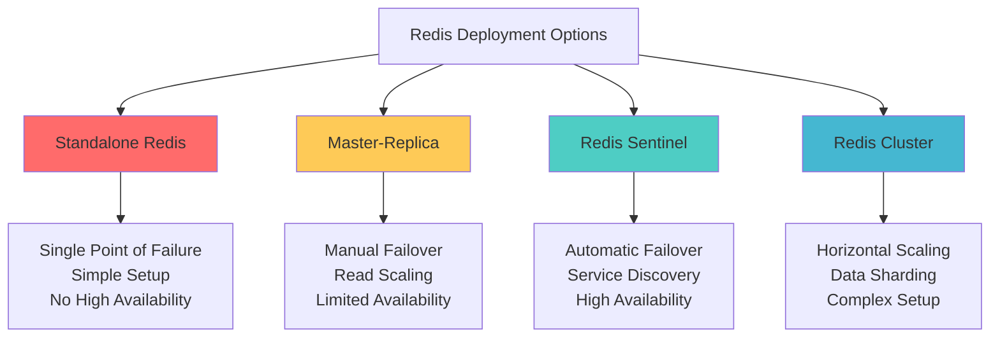
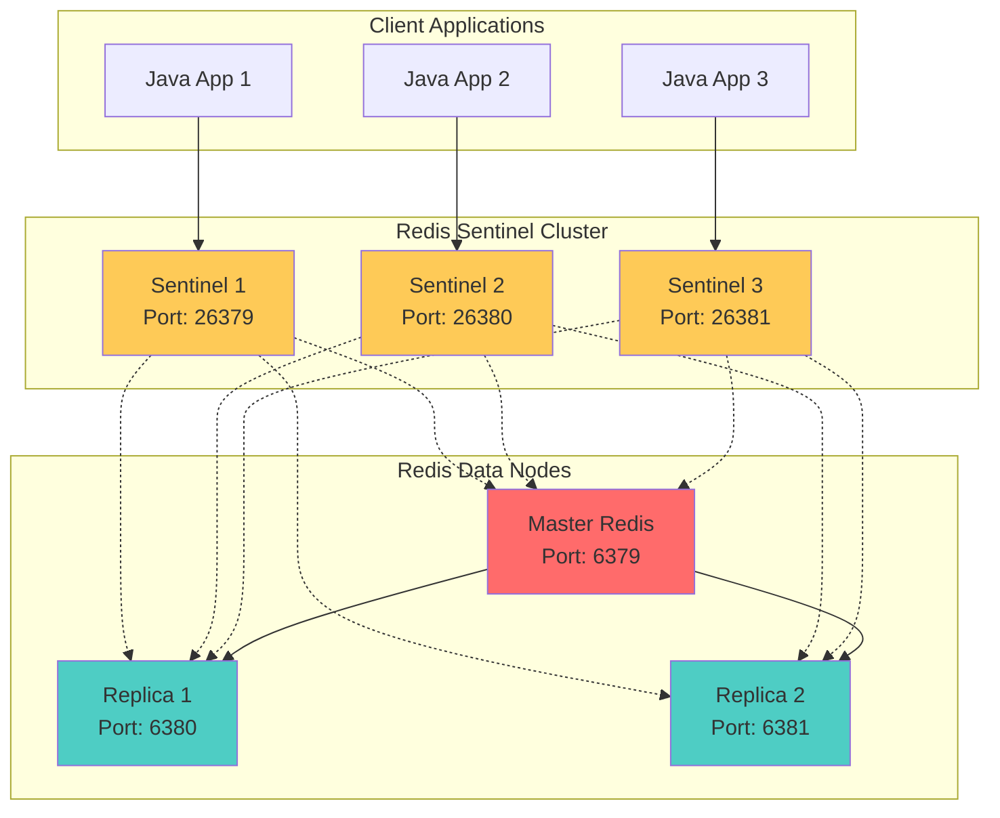

## 🎯 Introduction

Redis Sentinel provides high availability and monitoring for Redis deployments. It's a distributed system that monitors Redis master and replica instances, performs automatic failover, and acts as a configuration provider for clients. This comprehensive guide covers Redis Sentinel architecture, setup procedures, Java integration, and production best practices.

Redis Sentinel solves critical production challenges including automatic failover, service discovery, and configuration management, making it essential for mission-critical applications that require high availability and minimal downtime.

## 🏗️ Redis Deployment Modes Comparison

### 📊 Deployment Modes Overview



### 🔍 Detailed Comparison

| Feature | Standalone | Master-Replica | Redis Sentinel | Redis Cluster |
|---------|-----------|----------------|----------------|---------------|
| **High Availability** | ❌ No | ⚠️ Manual | ✅ Automatic | ✅ Automatic |
| **Automatic Failover** | ❌ No | ❌ No | ✅ Yes | ✅ Yes |
| **Data Sharding** | ❌ No | ❌ No | ❌ No | ✅ Yes |
| **Read Scaling** | ❌ No | ✅ Yes | ✅ Yes | ✅ Yes |
| **Write Scaling** | ❌ No | ❌ No | ❌ No | ✅ Yes |
| **Setup Complexity** | Simple | Medium | Medium | Complex |
| **Operational Overhead** | Low | Medium | Medium | High |
| **Data Consistency** | Strong | Eventual | Eventual | Eventual |
| **Network Partitions** | N/A | Poor | Good | Excellent |

## 🏛️ Redis Sentinel Architecture

### 🔧 Core Components



### 🎯 Sentinel Responsibilities

1. **Monitoring**: Continuously checks Redis master and replica instances
2. **Notification**: Alerts administrators about Redis instance issues
3. **Automatic Failover**: Promotes replicas to master when failures occur
4. **Configuration Provider**: Provides current master information to clients

## 🛠️ Redis Sentinel Setup

### 1. Basic Redis Configuration

**Master Redis Configuration (`redis-master.conf`):**

```bash
# Redis Master Configuration
port 6379
bind 0.0.0.0

# Persistence
save 900 1
save 300 10
save 60 10000

# Replication
replica-serve-stale-data yes
replica-read-only yes

# Security
requirepass "redis_master_password"
masterauth "redis_master_password"

# Memory management
maxmemory 2gb
maxmemory-policy allkeys-lru

# Logging
loglevel notice
logfile "/var/log/redis/redis-master.log"

# Network
timeout 0
tcp-keepalive 300

# Persistence tuning
rdbcompression yes
rdbchecksum yes
dbfilename "dump-master.rdb"
dir "/data/redis"

# AOF
appendonly yes
appendfilename "appendonly-master.aof"
appendfsync everysec
no-appendfsync-on-rewrite no
auto-aof-rewrite-percentage 100
auto-aof-rewrite-min-size 64mb
```

**Replica Redis Configuration (`redis-replica-1.conf`):**

```bash
# Redis Replica Configuration
port 6380
bind 0.0.0.0

# Replication
replicaof redis-master 6379
replica-serve-stale-data yes
replica-read-only yes

# Security
requirepass "redis_replica_password"
masterauth "redis_master_password"

# Memory management
maxmemory 1gb
maxmemory-policy allkeys-lru

# Logging
loglevel notice
logfile "/var/log/redis/redis-replica-1.log"

# Persistence
save 900 1
save 300 10
save 60 10000

dbfilename "dump-replica-1.rdb"
dir "/data/redis"

# AOF
appendonly yes
appendfilename "appendonly-replica-1.aof"
appendfsync everysec
```

### 2. Sentinel Configuration

**Sentinel Configuration (`sentinel-1.conf`):**

```bash
# Redis Sentinel Configuration
port 26379
bind 0.0.0.0

# Sentinel specific settings
sentinel deny-scripts-reconfig yes

# Monitor master - requires at least 2 sentinels to agree for failover
sentinel monitor mymaster redis-master 6379 2

# Master password
sentinel auth-pass mymaster redis_master_password

# Failover timeout (30 seconds)
sentinel down-after-milliseconds mymaster 30000

# How many replicas can be reconfigured simultaneously during failover
sentinel parallel-syncs mymaster 1

# Failover timeout (3 minutes)
sentinel failover-timeout mymaster 180000

# Notification scripts
sentinel notification-script mymaster /usr/local/bin/redis-notify.sh

# Client reconfig script
sentinel client-reconfig-script mymaster /usr/local/bin/redis-reconfig.sh

# Logging
logfile "/var/log/redis/sentinel-1.log"
loglevel notice

# Security (Redis 6.0+)
requirepass "sentinel_password"

# Performance tuning
sentinel resolve-hostnames yes
sentinel announce-hostnames yes
```

### 3. Docker Compose Setup

**Complete Docker Compose Configuration:**

```yaml
version: '3.8'

services:
  redis-master:
    image: redis:7-alpine
    container_name: redis-master
    ports:
      - "6379:6379"
    command: redis-server /usr/local/etc/redis/redis.conf
    volumes:
      - ./config/redis-master.conf:/usr/local/etc/redis/redis.conf
      - redis-master-data:/data
      - ./logs:/var/log/redis
    networks:
      - redis-network
    healthcheck:
      test: ["CMD", "redis-cli", "-p", "6379", "ping"]
      interval: 30s
      timeout: 10s
      retries: 3

  redis-replica-1:
    image: redis:7-alpine
    container_name: redis-replica-1
    ports:
      - "6380:6380"
    command: redis-server /usr/local/etc/redis/redis.conf
    volumes:
      - ./config/redis-replica-1.conf:/usr/local/etc/redis/redis.conf
      - redis-replica-1-data:/data
      - ./logs:/var/log/redis
    depends_on:
      - redis-master
    networks:
      - redis-network
    healthcheck:
      test: ["CMD", "redis-cli", "-p", "6380", "ping"]
      interval: 30s
      timeout: 10s
      retries: 3

  redis-replica-2:
    image: redis:7-alpine
    container_name: redis-replica-2
    ports:
      - "6381:6381"
    command: redis-server /usr/local/etc/redis/redis.conf
    volumes:
      - ./config/redis-replica-2.conf:/usr/local/etc/redis/redis.conf
      - redis-replica-2-data:/data
      - ./logs:/var/log/redis
    depends_on:
      - redis-master
    networks:
      - redis-network
    healthcheck:
      test: ["CMD", "redis-cli", "-p", "6381", "ping"]
      interval: 30s
      timeout: 10s
      retries: 3

  redis-sentinel-1:
    image: redis:7-alpine
    container_name: redis-sentinel-1
    ports:
      - "26379:26379"
    command: redis-sentinel /usr/local/etc/redis/sentinel.conf
    volumes:
      - ./config/sentinel-1.conf:/usr/local/etc/redis/sentinel.conf
      - ./logs:/var/log/redis
      - ./scripts:/usr/local/bin
    depends_on:
      - redis-master
      - redis-replica-1
      - redis-replica-2
    networks:
      - redis-network
    healthcheck:
      test: ["CMD", "redis-cli", "-p", "26379", "ping"]
      interval: 30s
      timeout: 10s
      retries: 3

  redis-sentinel-2:
    image: redis:7-alpine
    container_name: redis-sentinel-2
    ports:
      - "26380:26379"
    command: redis-sentinel /usr/local/etc/redis/sentinel.conf
    volumes:
      - ./config/sentinel-2.conf:/usr/local/etc/redis/sentinel.conf
      - ./logs:/var/log/redis
      - ./scripts:/usr/local/bin
    depends_on:
      - redis-master
      - redis-replica-1
      - redis-replica-2
    networks:
      - redis-network
    healthcheck:
      test: ["CMD", "redis-cli", "-p", "26379", "ping"]
      interval: 30s
      timeout: 10s
      retries: 3

  redis-sentinel-3:
    image: redis:7-alpine
    container_name: redis-sentinel-3
    ports:
      - "26381:26379"
    command: redis-sentinel /usr/local/etc/redis/sentinel.conf
    volumes:
      - ./config/sentinel-3.conf:/usr/local/etc/redis/sentinel.conf
      - ./logs:/var/log/redis
      - ./scripts:/usr/local/bin
    depends_on:
      - redis-master
      - redis-replica-1
      - redis-replica-2
    networks:
      - redis-network
    healthcheck:
      test: ["CMD", "redis-cli", "-p", "26379", "ping"]
      interval: 30s
      timeout: 10s
      retries: 3

  # Monitoring and management
  redis-insight:
    image: redislabs/redisinsight:latest
    container_name: redis-insight
    ports:
      - "8001:8001"
    volumes:
      - redis-insight-data:/db
    networks:
      - redis-network
    depends_on:
      - redis-master

volumes:
  redis-master-data:
  redis-replica-1-data:
  redis-replica-2-data:
  redis-insight-data:

networks:
  redis-network:
    driver: bridge
```

### 4. Notification Scripts

**Redis Notification Script (`redis-notify.sh`):**

```bash
#!/bin/bash

# Redis Sentinel Notification Script
MASTER_NAME="$1"
EVENT_TYPE="$2"
EVENT_STATE="$3"
FROM_IP="$4"
FROM_PORT="$5"
TO_IP="$6"
TO_PORT="$7"

TIMESTAMP=$(date '+%Y-%m-%d %H:%M:%S')
LOG_FILE="/var/log/redis/sentinel-notifications.log"

# Create log entry
LOG_MESSAGE="[$TIMESTAMP] SENTINEL EVENT: Master=$MASTER_NAME, Type=$EVENT_TYPE, State=$EVENT_STATE, From=$FROM_IP:$FROM_PORT, To=$TO_IP:$TO_PORT"
echo "$LOG_MESSAGE" >> "$LOG_FILE"

# Send notification based on event type
case "$EVENT_TYPE" in
    "+switch-master")
        echo "CRITICAL: Redis master switched from $FROM_IP:$FROM_PORT to $TO_IP:$TO_PORT" >> "$LOG_FILE"
        # Send alert to monitoring system
        curl -X POST "http://monitoring-system/alerts" \
             -H "Content-Type: application/json" \
             -d "{\"level\":\"critical\",\"message\":\"Redis master failover: $FROM_IP:$FROM_PORT -> $TO_IP:$TO_PORT\",\"timestamp\":\"$TIMESTAMP\"}"
        ;;
    "+sdown")
        echo "WARNING: Redis instance $FROM_IP:$FROM_PORT is subjectively down" >> "$LOG_FILE"
        ;;
    "+odown")
        echo "CRITICAL: Redis instance $FROM_IP:$FROM_PORT is objectively down" >> "$LOG_FILE"
        ;;
    "+reboot")
        echo "INFO: Redis instance $FROM_IP:$FROM_PORT is rebooting" >> "$LOG_FILE"
        ;;
esac

exit 0
```

## ☕ Java Integration with Spring Boot

### 1. Dependencies and Configuration

**Maven Dependencies (`pom.xml`):**

```xml
<dependencies>
    <!-- Spring Boot Starter -->
    <dependency>
        <groupId>org.springframework.boot</groupId>
        <artifactId>spring-boot-starter-data-redis</artifactId>
    </dependency>

    <!-- Lettuce Redis Client (supports Sentinel) -->
    <dependency>
        <groupId>io.lettuce</groupId>
        <artifactId>lettuce-core</artifactId>
    </dependency>

    <!-- Connection pooling -->
    <dependency>
        <groupId>org.apache.commons</groupId>
        <artifactId>commons-pool2</artifactId>
    </dependency>

    <!-- Monitoring -->
    <dependency>
        <groupId>org.springframework.boot</groupId>
        <artifactId>spring-boot-starter-actuator</artifactId>
    </dependency>

    <!-- Metrics -->
    <dependency>
        <groupId>io.micrometer</groupId>
        <artifactId>micrometer-registry-prometheus</artifactId>
    </dependency>
</dependencies>
```

**Application Configuration (`application.yml`):**

```yaml
spring:
  redis:
    sentinel:
      master: mymaster
      nodes:
        - redis-sentinel-1:26379
        - redis-sentinel-2:26380
        - redis-sentinel-3:26381
      password: sentinel_password
    password: redis_master_password
    timeout: 2000ms
    lettuce:
      pool:
        max-active: 20
        max-idle: 8
        min-idle: 2
        max-wait: 2000ms
      shutdown-timeout: 200ms

  # Application settings
  application:
    name: redis-sentinel-demo

# Actuator for health checks and metrics
management:
  endpoints:
    web:
      exposure:
        include: health,metrics,info,redis
  endpoint:
    health:
      show-details: always
      redis:
        enabled: true

# Logging
logging:
  level:
    io.lettuce: DEBUG
    org.springframework.data.redis: DEBUG
    com.example.redis: DEBUG
  pattern:
    console: "%d{HH:mm:ss.SSS} [%thread] %-5level %logger{36} - %msg%n"
```

### 2. Redis Configuration Classes

**Redis Sentinel Configuration:**

```java
@Configuration
@EnableCaching
@EnableRedisRepositories
public class RedisSentinelConfig {

    @Value("${spring.redis.sentinel.master}")
    private String masterName;

    @Value("${spring.redis.sentinel.nodes}")
    private List<String> sentinelNodes;

    @Value("${spring.redis.password}")
    private String redisPassword;

    @Value("${spring.redis.sentinel.password:}")
    private String sentinelPassword;

    @Bean
    public LettuceConnectionFactory redisConnectionFactory() {
        // Parse sentinel nodes
        Set<RedisNode> sentinelNodeSet = sentinelNodes.stream()
            .map(this::parseRedisNode)
            .collect(Collectors.toSet());

        // Sentinel configuration
        RedisSentinelConfiguration sentinelConfiguration = new RedisSentinelConfiguration()
            .master(masterName)
            .sentinels(sentinelNodeSet);

        if (StringUtils.hasText(redisPassword)) {
            sentinelConfiguration.setPassword(redisPassword);
        }

        if (StringUtils.hasText(sentinelPassword)) {
            sentinelConfiguration.setSentinelPassword(sentinelPassword);
        }

        // Connection pool configuration
        GenericObjectPoolConfig<RedisConnection> poolConfig = new GenericObjectPoolConfig<>();
        poolConfig.setMaxTotal(20);
        poolConfig.setMaxIdle(8);
        poolConfig.setMinIdle(2);
        poolConfig.setMaxWaitMillis(2000);
        poolConfig.setTestOnBorrow(true);
        poolConfig.setTestOnReturn(true);
        poolConfig.setTestWhileIdle(true);

        LettucePoolingClientConfiguration clientConfig = LettucePoolingClientConfiguration.builder()
            .poolConfig(poolConfig)
            .commandTimeout(Duration.ofMillis(2000))
            .shutdownTimeout(Duration.ofMillis(200))
            .build();

        LettuceConnectionFactory factory = new LettuceConnectionFactory(sentinelConfiguration, clientConfig);
        factory.setValidateConnection(true);

        return factory;
    }

    @Bean
    public RedisTemplate<String, Object> redisTemplate(LettuceConnectionFactory connectionFactory) {
        RedisTemplate<String, Object> template = new RedisTemplate<>();
        template.setConnectionFactory(connectionFactory);

        // JSON serialization
        Jackson2JsonRedisSerializer<Object> jsonSerializer = new Jackson2JsonRedisSerializer<>(Object.class);
        ObjectMapper objectMapper = new ObjectMapper();
        objectMapper.setVisibility(PropertyAccessor.ALL, JsonAutoDetect.Visibility.ANY);
        objectMapper.activateDefaultTyping(LaissezFaireSubTypeValidator.instance, ObjectMapper.DefaultTyping.NON_FINAL);
        jsonSerializer.setObjectMapper(objectMapper);

        // Key serialization
        template.setKeySerializer(new StringRedisSerializer());
        template.setHashKeySerializer(new StringRedisSerializer());

        // Value serialization
        template.setValueSerializer(jsonSerializer);
        template.setHashValueSerializer(jsonSerializer);

        template.afterPropertiesSet();
        return template;
    }

    @Bean
    public StringRedisTemplate stringRedisTemplate(LettuceConnectionFactory connectionFactory) {
        return new StringRedisTemplate(connectionFactory);
    }

    @Bean
    public CacheManager cacheManager(LettuceConnectionFactory connectionFactory) {
        RedisCacheConfiguration config = RedisCacheConfiguration.defaultCacheConfig()
            .entryTtl(Duration.ofMinutes(30))
            .serializeKeysWith(RedisSerializationContext.SerializationPair.fromSerializer(new StringRedisSerializer()))
            .serializeValuesWith(RedisSerializationContext.SerializationPair.fromSerializer(new GenericJackson2JsonRedisSerializer()))
            .disableCachingNullValues();

        return RedisCacheManager.builder(connectionFactory)
            .cacheDefaults(config)
            .build();
    }

    private RedisNode parseRedisNode(String node) {
        String[] parts = node.split(":");
        if (parts.length != 2) {
            throw new IllegalArgumentException("Invalid Redis node format: " + node);
        }
        return new RedisNode(parts[0], Integer.parseInt(parts[1]));
    }
}
```

### 3. Redis Service Implementation

**Redis Service with Failover Handling:**

```java
@Service
@Slf4j
public class RedisService {

    private final RedisTemplate<String, Object> redisTemplate;
    private final StringRedisTemplate stringRedisTemplate;
    private final MeterRegistry meterRegistry;

    private final Counter redisOperationCounter;
    private final Timer redisOperationTimer;
    private final Gauge redisConnectionGauge;

    public RedisService(RedisTemplate<String, Object> redisTemplate,
                       StringRedisTemplate stringRedisTemplate,
                       MeterRegistry meterRegistry) {
        this.redisTemplate = redisTemplate;
        this.stringRedisTemplate = stringRedisTemplate;
        this.meterRegistry = meterRegistry;

        // Initialize metrics
        this.redisOperationCounter = Counter.builder("redis.operations.total")
            .description("Total Redis operations")
            .register(meterRegistry);

        this.redisOperationTimer = Timer.builder("redis.operations.duration")
            .description("Redis operation duration")
            .register(meterRegistry);

        this.redisConnectionGauge = Gauge.builder("redis.connections.active")
            .description("Active Redis connections")
            .register(meterRegistry, this, RedisService::getActiveConnectionCount);
    }

    // Basic operations with metrics and error handling
    public void setValue(String key, Object value) {
        Timer.Sample sample = Timer.start(meterRegistry);
        try {
            redisTemplate.opsForValue().set(key, value);
            redisOperationCounter.increment(Tags.of("operation", "set", "status", "success"));
            log.debug("Successfully set value for key: {}", key);
        } catch (Exception e) {
            redisOperationCounter.increment(Tags.of("operation", "set", "status", "error"));
            log.error("Failed to set value for key: {}", key, e);
            throw new RedisOperationException("Failed to set value for key: " + key, e);
        } finally {
            sample.stop(redisOperationTimer.builder().tag("operation", "set").register(meterRegistry));
        }
    }

    public void setValue(String key, Object value, Duration timeout) {
        Timer.Sample sample = Timer.start(meterRegistry);
        try {
            redisTemplate.opsForValue().set(key, value, timeout);
            redisOperationCounter.increment(Tags.of("operation", "setex", "status", "success"));
            log.debug("Successfully set value with TTL for key: {}, TTL: {}", key, timeout);
        } catch (Exception e) {
            redisOperationCounter.increment(Tags.of("operation", "setex", "status", "error"));
            log.error("Failed to set value with TTL for key: {}", key, e);
            throw new RedisOperationException("Failed to set value with TTL for key: " + key, e);
        } finally {
            sample.stop(redisOperationTimer.builder().tag("operation", "setex").register(meterRegistry));
        }
    }

    @SuppressWarnings("unchecked")
    public <T> T getValue(String key, Class<T> type) {
        Timer.Sample sample = Timer.start(meterRegistry);
        try {
            Object value = redisTemplate.opsForValue().get(key);
            redisOperationCounter.increment(Tags.of("operation", "get", "status", "success"));
            log.debug("Successfully retrieved value for key: {}", key);
            return value != null ? (T) value : null;
        } catch (Exception e) {
            redisOperationCounter.increment(Tags.of("operation", "get", "status", "error"));
            log.error("Failed to get value for key: {}", key, e);
            throw new RedisOperationException("Failed to get value for key: " + key, e);
        } finally {
            sample.stop(redisOperationTimer.builder().tag("operation", "get").register(meterRegistry));
        }
    }

    public Boolean deleteKey(String key) {
        Timer.Sample sample = Timer.start(meterRegistry);
        try {
            Boolean result = redisTemplate.delete(key);
            redisOperationCounter.increment(Tags.of("operation", "delete", "status", "success"));
            log.debug("Successfully deleted key: {}, result: {}", key, result);
            return result;
        } catch (Exception e) {
            redisOperationCounter.increment(Tags.of("operation", "delete", "status", "error"));
            log.error("Failed to delete key: {}", key, e);
            throw new RedisOperationException("Failed to delete key: " + key, e);
        } finally {
            sample.stop(redisOperationTimer.builder().tag("operation", "delete").register(meterRegistry));
        }
    }

    public Boolean exists(String key) {
        Timer.Sample sample = Timer.start(meterRegistry);
        try {
            Boolean result = redisTemplate.hasKey(key);
            redisOperationCounter.increment(Tags.of("operation", "exists", "status", "success"));
            return result;
        } catch (Exception e) {
            redisOperationCounter.increment(Tags.of("operation", "exists", "status", "error"));
            log.error("Failed to check existence of key: {}", key, e);
            throw new RedisOperationException("Failed to check existence of key: " + key, e);
        } finally {
            sample.stop(redisOperationTimer.builder().tag("operation", "exists").register(meterRegistry));
        }
    }

    // Hash operations
    public void setHashValue(String key, String field, Object value) {
        Timer.Sample sample = Timer.start(meterRegistry);
        try {
            redisTemplate.opsForHash().put(key, field, value);
            redisOperationCounter.increment(Tags.of("operation", "hset", "status", "success"));
            log.debug("Successfully set hash value for key: {}, field: {}", key, field);
        } catch (Exception e) {
            redisOperationCounter.increment(Tags.of("operation", "hset", "status", "error"));
            log.error("Failed to set hash value for key: {}, field: {}", key, field, e);
            throw new RedisOperationException("Failed to set hash value", e);
        } finally {
            sample.stop(redisOperationTimer.builder().tag("operation", "hset").register(meterRegistry));
        }
    }

    @SuppressWarnings("unchecked")
    public <T> T getHashValue(String key, String field, Class<T> type) {
        Timer.Sample sample = Timer.start(meterRegistry);
        try {
            Object value = redisTemplate.opsForHash().get(key, field);
            redisOperationCounter.increment(Tags.of("operation", "hget", "status", "success"));
            return value != null ? (T) value : null;
        } catch (Exception e) {
            redisOperationCounter.increment(Tags.of("operation", "hget", "status", "error"));
            log.error("Failed to get hash value for key: {}, field: {}", key, field, e);
            throw new RedisOperationException("Failed to get hash value", e);
        } finally {
            sample.stop(redisOperationTimer.builder().tag("operation", "hget").register(meterRegistry));
        }
    }

    public Map<Object, Object> getAllHashValues(String key) {
        Timer.Sample sample = Timer.start(meterRegistry);
        try {
            Map<Object, Object> result = redisTemplate.opsForHash().entries(key);
            redisOperationCounter.increment(Tags.of("operation", "hgetall", "status", "success"));
            return result;
        } catch (Exception e) {
            redisOperationCounter.increment(Tags.of("operation", "hgetall", "status", "error"));
            log.error("Failed to get all hash values for key: {}", key, e);
            throw new RedisOperationException("Failed to get all hash values", e);
        } finally {
            sample.stop(redisOperationTimer.builder().tag("operation", "hgetall").register(meterRegistry));
        }
    }

    // List operations
    public void pushToList(String key, Object... values) {
        Timer.Sample sample = Timer.start(meterRegistry);
        try {
            redisTemplate.opsForList().rightPushAll(key, values);
            redisOperationCounter.increment(Tags.of("operation", "lpush", "status", "success"));
            log.debug("Successfully pushed {} values to list: {}", values.length, key);
        } catch (Exception e) {
            redisOperationCounter.increment(Tags.of("operation", "lpush", "status", "error"));
            log.error("Failed to push values to list: {}", key, e);
            throw new RedisOperationException("Failed to push values to list", e);
        } finally {
            sample.stop(redisOperationTimer.builder().tag("operation", "lpush").register(meterRegistry));
        }
    }

    public Object popFromList(String key) {
        Timer.Sample sample = Timer.start(meterRegistry);
        try {
            Object result = redisTemplate.opsForList().rightPop(key);
            redisOperationCounter.increment(Tags.of("operation", "rpop", "status", "success"));
            return result;
        } catch (Exception e) {
            redisOperationCounter.increment(Tags.of("operation", "rpop", "status", "error"));
            log.error("Failed to pop value from list: {}", key, e);
            throw new RedisOperationException("Failed to pop value from list", e);
        } finally {
            sample.stop(redisOperationTimer.builder().tag("operation", "rpop").register(meterRegistry));
        }
    }

    public List<Object> getListRange(String key, long start, long end) {
        Timer.Sample sample = Timer.start(meterRegistry);
        try {
            List<Object> result = redisTemplate.opsForList().range(key, start, end);
            redisOperationCounter.increment(Tags.of("operation", "lrange", "status", "success"));
            return result != null ? result : Collections.emptyList();
        } catch (Exception e) {
            redisOperationCounter.increment(Tags.of("operation", "lrange", "status", "error"));
            log.error("Failed to get list range for key: {}", key, e);
            throw new RedisOperationException("Failed to get list range", e);
        } finally {
            sample.stop(redisOperationTimer.builder().tag("operation", "lrange").register(meterRegistry));
        }
    }

    // Set operations
    public void addToSet(String key, Object... values) {
        Timer.Sample sample = Timer.start(meterRegistry);
        try {
            redisTemplate.opsForSet().add(key, values);
            redisOperationCounter.increment(Tags.of("operation", "sadd", "status", "success"));
            log.debug("Successfully added {} values to set: {}", values.length, key);
        } catch (Exception e) {
            redisOperationCounter.increment(Tags.of("operation", "sadd", "status", "error"));
            log.error("Failed to add values to set: {}", key, e);
            throw new RedisOperationException("Failed to add values to set", e);
        } finally {
            sample.stop(redisOperationTimer.builder().tag("operation", "sadd").register(meterRegistry));
        }
    }

    public Set<Object> getSetMembers(String key) {
        Timer.Sample sample = Timer.start(meterRegistry);
        try {
            Set<Object> result = redisTemplate.opsForSet().members(key);
            redisOperationCounter.increment(Tags.of("operation", "smembers", "status", "success"));
            return result != null ? result : Collections.emptySet();
        } catch (Exception e) {
            redisOperationCounter.increment(Tags.of("operation", "smembers", "status", "error"));
            log.error("Failed to get set members for key: {}", key, e);
            throw new RedisOperationException("Failed to get set members", e);
        } finally {
            sample.stop(redisOperationTimer.builder().tag("operation", "smembers").register(meterRegistry));
        }
    }

    // Sorted Set operations
    public void addToSortedSet(String key, Object value, double score) {
        Timer.Sample sample = Timer.start(meterRegistry);
        try {
            redisTemplate.opsForZSet().add(key, value, score);
            redisOperationCounter.increment(Tags.of("operation", "zadd", "status", "success"));
            log.debug("Successfully added value to sorted set: {}, score: {}", key, score);
        } catch (Exception e) {
            redisOperationCounter.increment(Tags.of("operation", "zadd", "status", "error"));
            log.error("Failed to add value to sorted set: {}", key, e);
            throw new RedisOperationException("Failed to add value to sorted set", e);
        } finally {
            sample.stop(redisOperationTimer.builder().tag("operation", "zadd").register(meterRegistry));
        }
    }

    public Set<Object> getSortedSetRange(String key, long start, long end) {
        Timer.Sample sample = Timer.start(meterRegistry);
        try {
            Set<Object> result = redisTemplate.opsForZSet().range(key, start, end);
            redisOperationCounter.increment(Tags.of("operation", "zrange", "status", "success"));
            return result != null ? result : Collections.emptySet();
        } catch (Exception e) {
            redisOperationCounter.increment(Tags.of("operation", "zrange", "status", "error"));
            log.error("Failed to get sorted set range for key: {}", key, e);
            throw new RedisOperationException("Failed to get sorted set range", e);
        } finally {
            sample.stop(redisOperationTimer.builder().tag("operation", "zrange").register(meterRegistry));
        }
    }

    // Utility methods
    public void expire(String key, Duration timeout) {
        Timer.Sample sample = Timer.start(meterRegistry);
        try {
            redisTemplate.expire(key, timeout);
            redisOperationCounter.increment(Tags.of("operation", "expire", "status", "success"));
            log.debug("Successfully set expiration for key: {}, timeout: {}", key, timeout);
        } catch (Exception e) {
            redisOperationCounter.increment(Tags.of("operation", "expire", "status", "error"));
            log.error("Failed to set expiration for key: {}", key, e);
            throw new RedisOperationException("Failed to set expiration", e);
        } finally {
            sample.stop(redisOperationTimer.builder().tag("operation", "expire").register(meterRegistry));
        }
    }

    public Long getTimeToLive(String key) {
        Timer.Sample sample = Timer.start(meterRegistry);
        try {
            Long result = redisTemplate.getExpire(key);
            redisOperationCounter.increment(Tags.of("operation", "ttl", "status", "success"));
            return result;
        } catch (Exception e) {
            redisOperationCounter.increment(Tags.of("operation", "ttl", "status", "error"));
            log.error("Failed to get TTL for key: {}", key, e);
            throw new RedisOperationException("Failed to get TTL", e);
        } finally {
            sample.stop(redisOperationTimer.builder().tag("operation", "ttl").register(meterRegistry));
        }
    }

    // Connection health check
    public boolean isHealthy() {
        try {
            stringRedisTemplate.opsForValue().get("health-check");
            return true;
        } catch (Exception e) {
            log.error("Redis health check failed", e);
            return false;
        }
    }

    // Get active connection count for monitoring
    private double getActiveConnectionCount() {
        try {
            LettuceConnectionFactory factory = (LettuceConnectionFactory) redisTemplate.getConnectionFactory();
            if (factory != null) {
                return factory.getConnection().isOpen() ? 1.0 : 0.0;
            }
        } catch (Exception e) {
            log.debug("Failed to get connection count", e);
        }
        return 0.0;
    }

    // Batch operations for better performance
    public void executePipeline(List<RedisOperations> operations) {
        redisTemplate.executePipelined(new RedisCallback<Object>() {
            @Override
            public Object doInRedis(RedisConnection connection) throws DataAccessException {
                for (RedisOperations operation : operations) {
                    operation.execute(connection);
                }
                return null;
            }
        });
    }

    @FunctionalInterface
    public interface RedisOperations {
        void execute(RedisConnection connection);
    }

    // Custom exception for Redis operations
    public static class RedisOperationException extends RuntimeException {
        public RedisOperationException(String message) {
            super(message);
        }

        public RedisOperationException(String message, Throwable cause) {
            super(message, cause);
        }
    }
}
```

### 4. Caching Service with Sentinel Support

**Advanced Caching Service:**

```java
@Service
@Slf4j
public class CacheService {

    private final RedisService redisService;
    private final ObjectMapper objectMapper;
    private final MeterRegistry meterRegistry;

    // Cache configurations
    private static final Duration DEFAULT_TTL = Duration.ofMinutes(30);
    private static final Duration SHORT_TTL = Duration.ofMinutes(5);
    private static final Duration LONG_TTL = Duration.ofHours(2);

    // Cache prefixes for different data types
    private static final String USER_CACHE_PREFIX = "user:";
    private static final String SESSION_CACHE_PREFIX = "session:";
    private static final String PRODUCT_CACHE_PREFIX = "product:";
    private static final String ANALYTICS_CACHE_PREFIX = "analytics:";

    public CacheService(RedisService redisService, ObjectMapper objectMapper, MeterRegistry meterRegistry) {
        this.redisService = redisService;
        this.objectMapper = objectMapper;
        this.meterRegistry = meterRegistry;
    }

    // Generic cache operations with automatic serialization
    public <T> void cacheObject(String key, T object, Duration ttl) {
        try {
            redisService.setValue(key, object, ttl);
            meterRegistry.counter("cache.operations", "operation", "set", "type", "object").increment();
            log.debug("Cached object with key: {}, TTL: {}", key, ttl);
        } catch (Exception e) {
            meterRegistry.counter("cache.errors", "operation", "set", "type", "object").increment();
            log.error("Failed to cache object with key: {}", key, e);
        }
    }

    public <T> Optional<T> getCachedObject(String key, Class<T> type) {
        try {
            T cachedObject = redisService.getValue(key, type);
            boolean hit = cachedObject != null;

            meterRegistry.counter("cache.operations",
                "operation", "get",
                "type", "object",
                "result", hit ? "hit" : "miss").increment();

            if (hit) {
                log.debug("Cache hit for key: {}", key);
                return Optional.of(cachedObject);
            } else {
                log.debug("Cache miss for key: {}", key);
                return Optional.empty();
            }
        } catch (Exception e) {
            meterRegistry.counter("cache.errors", "operation", "get", "type", "object").increment();
            log.error("Failed to get cached object with key: {}", key, e);
            return Optional.empty();
        }
    }

    // User caching operations
    public void cacheUser(String userId, User user) {
        cacheObject(USER_CACHE_PREFIX + userId, user, DEFAULT_TTL);
    }

    public Optional<User> getCachedUser(String userId) {
        return getCachedObject(USER_CACHE_PREFIX + userId, User.class);
    }

    public void evictUser(String userId) {
        redisService.deleteKey(USER_CACHE_PREFIX + userId);
        meterRegistry.counter("cache.operations", "operation", "evict", "type", "user").increment();
    }

    // Session caching operations
    public void cacheSession(String sessionId, UserSession session) {
        cacheObject(SESSION_CACHE_PREFIX + sessionId, session, Duration.ofHours(8));
    }

    public Optional<UserSession> getCachedSession(String sessionId) {
        return getCachedObject(SESSION_CACHE_PREFIX + sessionId, UserSession.class);
    }

    public void extendSession(String sessionId, Duration additionalTime) {
        String key = SESSION_CACHE_PREFIX + sessionId;
        if (redisService.exists(key)) {
            redisService.expire(key, additionalTime);
            meterRegistry.counter("cache.operations", "operation", "extend", "type", "session").increment();
        }
    }

    // Product caching operations
    public void cacheProduct(String productId, Product product) {
        cacheObject(PRODUCT_CACHE_PREFIX + productId, product, LONG_TTL);
    }

    public Optional<Product> getCachedProduct(String productId) {
        return getCachedObject(PRODUCT_CACHE_PREFIX + productId, Product.class);
    }

    // Batch operations for better performance
    public void cacheProducts(Map<String, Product> products) {
        List<RedisService.RedisOperations> operations = products.entrySet().stream()
            .map(entry -> (RedisService.RedisOperations) connection -> {
                try {
                    String key = PRODUCT_CACHE_PREFIX + entry.getKey();
                    String value = objectMapper.writeValueAsString(entry.getValue());
                    connection.setEx(key.getBytes(), LONG_TTL.getSeconds(), value.getBytes());
                } catch (Exception e) {
                    log.error("Failed to cache product: {}", entry.getKey(), e);
                }
            })
            .collect(Collectors.toList());

        redisService.executePipeline(operations);
        meterRegistry.counter("cache.operations", "operation", "batch_set", "type", "product")
            .increment(operations.size());
    }

    // Analytics caching with sorted sets for rankings
    public void cacheProductRanking(String category, Map<String, Double> productScores) {
        String key = ANALYTICS_CACHE_PREFIX + "ranking:" + category;

        // Clear existing ranking
        redisService.deleteKey(key);

        // Add products with scores
        productScores.forEach((productId, score) ->
            redisService.addToSortedSet(key, productId, score));

        // Set expiration
        redisService.expire(key, SHORT_TTL);

        meterRegistry.counter("cache.operations", "operation", "ranking_update", "type", "analytics").increment();
        log.debug("Updated product ranking for category: {}", category);
    }

    public List<String> getTopProducts(String category, int limit) {
        String key = ANALYTICS_CACHE_PREFIX + "ranking:" + category;
        Set<Object> topProducts = redisService.getSortedSetRange(key, -limit, -1); // Get top scores (reversed)

        List<String> result = topProducts.stream()
            .map(Object::toString)
            .collect(Collectors.toList());

        Collections.reverse(result); // Reverse to get highest scores first

        meterRegistry.counter("cache.operations", "operation", "ranking_get", "type", "analytics").increment();
        return result;
    }

    // Multi-level caching with fallback
    public <T> T getOrCompute(String key, Class<T> type, Supplier<T> computeFunction, Duration ttl) {
        // Try cache first
        Optional<T> cached = getCachedObject(key, type);
        if (cached.isPresent()) {
            return cached.get();
        }

        // Compute value
        T computed = computeFunction.get();
        if (computed != null) {
            cacheObject(key, computed, ttl);
        }

        meterRegistry.counter("cache.operations", "operation", "compute", "type", "generic").increment();
        return computed;
    }

    // Cache warming operations
    @EventListener(ApplicationReadyEvent.class)
    public void warmUpCache() {
        log.info("Starting cache warm-up...");

        CompletableFuture.runAsync(() -> {
            try {
                // Warm up frequently accessed data
                warmUpUserCache();
                warmUpProductCache();

                log.info("Cache warm-up completed successfully");
                meterRegistry.counter("cache.operations", "operation", "warmup", "result", "success").increment();

            } catch (Exception e) {
                log.error("Cache warm-up failed", e);
                meterRegistry.counter("cache.operations", "operation", "warmup", "result", "error").increment();
            }
        });
    }

    private void warmUpUserCache() {
        // Implementation would load frequently accessed users
        log.debug("Warming up user cache...");
    }

    private void warmUpProductCache() {
        // Implementation would load popular products
        log.debug("Warming up product cache...");
    }

    // Cache statistics and monitoring
    public CacheStatistics getCacheStatistics() {
        // This would typically gather statistics from Redis INFO command
        return new CacheStatistics(
            redisService.isHealthy(),
            getCurrentCacheSize(),
            getHitRate(),
            getMissRate()
        );
    }

    private long getCurrentCacheSize() {
        // Implementation would count keys with different prefixes
        return 0L;
    }

    private double getHitRate() {
        // Implementation would calculate from metrics
        return meterRegistry.find("cache.operations")
            .tag("result", "hit")
            .counter()
            .map(Counter::count)
            .orElse(0.0);
    }

    private double getMissRate() {
        // Implementation would calculate from metrics
        return meterRegistry.find("cache.operations")
            .tag("result", "miss")
            .counter()
            .map(Counter::count)
            .orElse(0.0);
    }

    // Supporting classes
    public static class User {
        private String id;
        private String username;
        private String email;
        private LocalDateTime createdAt;

        // Constructors, getters, setters...
        public User() {}

        public User(String id, String username, String email) {
            this.id = id;
            this.username = username;
            this.email = email;
            this.createdAt = LocalDateTime.now();
        }

        // Getters and setters
        public String getId() { return id; }
        public void setId(String id) { this.id = id; }
        public String getUsername() { return username; }
        public void setUsername(String username) { this.username = username; }
        public String getEmail() { return email; }
        public void setEmail(String email) { this.email = email; }
        public LocalDateTime getCreatedAt() { return createdAt; }
        public void setCreatedAt(LocalDateTime createdAt) { this.createdAt = createdAt; }
    }

    public static class UserSession {
        private String sessionId;
        private String userId;
        private LocalDateTime createdAt;
        private LocalDateTime lastAccessedAt;
        private Map<String, Object> attributes;

        // Constructors, getters, setters...
        public UserSession() {
            this.attributes = new HashMap<>();
        }

        public UserSession(String sessionId, String userId) {
            this();
            this.sessionId = sessionId;
            this.userId = userId;
            this.createdAt = LocalDateTime.now();
            this.lastAccessedAt = LocalDateTime.now();
        }

        // Getters and setters
        public String getSessionId() { return sessionId; }
        public void setSessionId(String sessionId) { this.sessionId = sessionId; }
        public String getUserId() { return userId; }
        public void setUserId(String userId) { this.userId = userId; }
        public LocalDateTime getCreatedAt() { return createdAt; }
        public void setCreatedAt(LocalDateTime createdAt) { this.createdAt = createdAt; }
        public LocalDateTime getLastAccessedAt() { return lastAccessedAt; }
        public void setLastAccessedAt(LocalDateTime lastAccessedAt) { this.lastAccessedAt = lastAccessedAt; }
        public Map<String, Object> getAttributes() { return attributes; }
        public void setAttributes(Map<String, Object> attributes) { this.attributes = attributes; }
    }

    public static class Product {
        private String id;
        private String name;
        private String description;
        private BigDecimal price;
        private String category;
        private Integer stockQuantity;

        // Constructors, getters, setters...
        public Product() {}

        public Product(String id, String name, BigDecimal price, String category) {
            this.id = id;
            this.name = name;
            this.price = price;
            this.category = category;
        }

        // Getters and setters
        public String getId() { return id; }
        public void setId(String id) { this.id = id; }
        public String getName() { return name; }
        public void setName(String name) { this.name = name; }
        public String getDescription() { return description; }
        public void setDescription(String description) { this.description = description; }
        public BigDecimal getPrice() { return price; }
        public void setPrice(BigDecimal price) { this.price = price; }
        public String getCategory() { return category; }
        public void setCategory(String category) { this.category = category; }
        public Integer getStockQuantity() { return stockQuantity; }
        public void setStockQuantity(Integer stockQuantity) { this.stockQuantity = stockQuantity; }
    }

    public static class CacheStatistics {
        private final boolean healthy;
        private final long totalKeys;
        private final double hitRate;
        private final double missRate;

        public CacheStatistics(boolean healthy, long totalKeys, double hitRate, double missRate) {
            this.healthy = healthy;
            this.totalKeys = totalKeys;
            this.hitRate = hitRate;
            this.missRate = missRate;
        }

        // Getters
        public boolean isHealthy() { return healthy; }
        public long getTotalKeys() { return totalKeys; }
        public double getHitRate() { return hitRate; }
        public double getMissRate() { return missRate; }

        @Override
        public String toString() {
            return String.format("CacheStatistics{healthy=%s, totalKeys=%d, hitRate=%.2f%%, missRate=%.2f%%}",
                healthy, totalKeys, hitRate * 100, missRate * 100);
        }
    }
}
```

## 📊 Monitoring and Health Checks

### 1. Health Check Implementation

```java
@Component
public class RedisSentinelHealthIndicator implements HealthIndicator {

    private final RedisService redisService;
    private final LettuceConnectionFactory connectionFactory;

    public RedisSentinelHealthIndicator(RedisService redisService, LettuceConnectionFactory connectionFactory) {
        this.redisService = redisService;
        this.connectionFactory = connectionFactory;
    }

    @Override
    public Health health() {
        try {
            // Test basic connectivity
            boolean isHealthy = redisService.isHealthy();

            if (!isHealthy) {
                return Health.down()
                    .withDetail("error", "Redis connectivity check failed")
                    .build();
            }

            // Get additional Redis info
            RedisConnection connection = connectionFactory.getConnection();
            Properties info = connection.info();
            String role = info.getProperty("role");
            String masterHost = info.getProperty("master_host");
            String masterPort = info.getProperty("master_port");

            Health.Builder healthBuilder = Health.up()
                .withDetail("role", role)
                .withDetail("connection", "available");

            if ("slave".equals(role) && masterHost != null) {
                healthBuilder
                    .withDetail("master_host", masterHost)
                    .withDetail("master_port", masterPort);
            }

            return healthBuilder.build();

        } catch (Exception e) {
            return Health.down()
                .withDetail("error", e.getMessage())
                .withException(e)
                .build();
        }
    }
}
```

### 2. Metrics and Monitoring

```java
@Component
@Slf4j
public class RedisSentinelMonitor {

    private final MeterRegistry meterRegistry;
    private final LettuceConnectionFactory connectionFactory;
    private final RedisService redisService;

    @Scheduled(fixedRate = 30000) // Every 30 seconds
    public void collectRedisMetrics() {
        try {
            RedisConnection connection = connectionFactory.getConnection();
            Properties info = connection.info();

            // Connection metrics
            String connectedClients = info.getProperty("connected_clients");
            if (connectedClients != null) {
                Gauge.builder("redis.connected_clients")
                    .description("Number of connected clients")
                    .register(meterRegistry, () -> Double.parseDouble(connectedClients));
            }

            // Memory metrics
            String usedMemory = info.getProperty("used_memory");
            if (usedMemory != null) {
                Gauge.builder("redis.memory.used")
                    .description("Used memory in bytes")
                    .register(meterRegistry, () -> Double.parseDouble(usedMemory));
            }

            String maxMemory = info.getProperty("maxmemory");
            if (maxMemory != null && !maxMemory.equals("0")) {
                Gauge.builder("redis.memory.max")
                    .description("Max memory in bytes")
                    .register(meterRegistry, () -> Double.parseDouble(maxMemory));
            }

            // Operation metrics
            String totalCommandsProcessed = info.getProperty("total_commands_processed");
            if (totalCommandsProcessed != null) {
                Counter.builder("redis.commands.processed.total")
                    .description("Total commands processed")
                    .register(meterRegistry)
                    .increment(Double.parseDouble(totalCommandsProcessed));
            }

            // Keyspace metrics
            collectKeyspaceMetrics(info);

            connection.close();

        } catch (Exception e) {
            log.error("Failed to collect Redis metrics", e);
            meterRegistry.counter("redis.metrics.collection.errors").increment();
        }
    }

    private void collectKeyspaceMetrics(Properties info) {
        info.stringPropertyNames().stream()
            .filter(key -> key.startsWith("db"))
            .forEach(dbKey -> {
                String dbInfo = info.getProperty(dbKey);
                if (dbInfo != null) {
                    // Parse "keys=X,expires=Y,avg_ttl=Z"
                    Map<String, String> dbMetrics = Arrays.stream(dbInfo.split(","))
                        .map(pair -> pair.split("="))
                        .filter(parts -> parts.length == 2)
                        .collect(Collectors.toMap(parts -> parts[0], parts -> parts[1]));

                    String keys = dbMetrics.get("keys");
                    if (keys != null) {
                        Gauge.builder("redis.keyspace.keys")
                            .tag("database", dbKey)
                            .description("Number of keys in database")
                            .register(meterRegistry, () -> Double.parseDouble(keys));
                    }

                    String expires = dbMetrics.get("expires");
                    if (expires != null) {
                        Gauge.builder("redis.keyspace.expires")
                            .tag("database", dbKey)
                            .description("Number of keys with expiration")
                            .register(meterRegistry, () -> Double.parseDouble(expires));
                    }
                }
            });
    }

    @EventListener
    public void handleRedisConnectionFailure(RedisConnectionFailureEvent event) {
        log.error("Redis connection failure detected: {}", event.getCause().getMessage());
        meterRegistry.counter("redis.connection.failures",
            "cause", event.getCause().getClass().getSimpleName()).increment();

        // Could trigger alerts here
        sendAlert("Redis Connection Failure", event.getCause().getMessage());
    }

    private void sendAlert(String title, String message) {
        // Implementation would send alerts to monitoring system
        log.warn("ALERT: {} - {}", title, message);
    }
}
```

## 🔧 Testing Redis Sentinel

### 1. Integration Tests

```java
@SpringBootTest
@Testcontainers
class RedisSentinelIntegrationTest {

    @Container
    static RedisContainer redis = new RedisContainer(DockerImageName.parse("redis:7-alpine"))
        .withExposedPorts(6379);

    @Autowired
    private RedisService redisService;

    @Autowired
    private CacheService cacheService;

    @Test
    void testBasicRedisOperations() {
        // Test string operations
        String key = "test:key";
        String value = "test-value";

        redisService.setValue(key, value);
        String retrieved = redisService.getValue(key, String.class);

        assertThat(retrieved).isEqualTo(value);
    }

    @Test
    void testCachingOperations() {
        // Test user caching
        CacheService.User user = new CacheService.User("123", "testuser", "test@example.com");

        cacheService.cacheUser(user.getId(), user);
        Optional<CacheService.User> cachedUser = cacheService.getCachedUser(user.getId());

        assertThat(cachedUser).isPresent();
        assertThat(cachedUser.get().getUsername()).isEqualTo("testuser");
    }

    @Test
    void testFailoverBehavior() {
        // This test would require a more complex setup with actual Sentinel
        // In a real scenario, you would:
        // 1. Set up master and replicas
        // 2. Configure sentinels
        // 3. Simulate master failure
        // 4. Verify automatic failover
        // 5. Ensure application continues working

        assertThat(redisService.isHealthy()).isTrue();
    }
}
```

### 2. Failover Testing Script

**Bash Script for Failover Testing:**

```bash
#!/bin/bash

# Redis Sentinel Failover Test Script

set -e

REDIS_MASTER_PORT=6379
SENTINEL_PORT=26379
TEST_KEY="failover:test"
TEST_VALUE="test-data-$(date +%s)"

echo "=== Redis Sentinel Failover Test ==="

# Function to test Redis connectivity
test_redis() {
    local host=$1
    local port=$2

    if redis-cli -h "$host" -p "$port" ping > /dev/null 2>&1; then
        echo "✓ Redis at $host:$port is responsive"
        return 0
    else
        echo "✗ Redis at $host:$port is not responsive"
        return 1
    fi
}

# Function to get current master info from sentinel
get_master_info() {
    redis-cli -h localhost -p $SENTINEL_PORT sentinel masters | \
    grep -A 20 "mymaster" | \
    awk '/ip/{getline; print $1}'
}

# Initial setup
echo "1. Testing initial setup..."
INITIAL_MASTER=$(get_master_info)
echo "Current master: $INITIAL_MASTER:$REDIS_MASTER_PORT"

test_redis "$INITIAL_MASTER" "$REDIS_MASTER_PORT"

# Set test data
echo "2. Setting test data..."
redis-cli -h "$INITIAL_MASTER" -p "$REDIS_MASTER_PORT" set "$TEST_KEY" "$TEST_VALUE"
echo "Set $TEST_KEY = $TEST_VALUE"

# Verify data on replicas
echo "3. Verifying replication..."
sleep 2
REPLICA_VALUE=$(redis-cli -h redis-replica-1 -p 6380 get "$TEST_KEY")
if [ "$REPLICA_VALUE" = "$TEST_VALUE" ]; then
    echo "✓ Data replicated successfully"
else
    echo "✗ Data replication failed"
    exit 1
fi

# Simulate master failure
echo "4. Simulating master failure..."
docker stop redis-master
echo "Master stopped"

# Wait for failover
echo "5. Waiting for failover (up to 60 seconds)..."
FAILOVER_TIMEOUT=60
ELAPSED=0

while [ $ELAPSED -lt $FAILOVER_TIMEOUT ]; do
    sleep 2
    ELAPSED=$((ELAPSED + 2))

    NEW_MASTER=$(get_master_info)
    if [ "$NEW_MASTER" != "$INITIAL_MASTER" ]; then
        echo "✓ Failover completed! New master: $NEW_MASTER"
        break
    fi

    echo "Waiting for failover... ($ELAPSED/$FAILOVER_TIMEOUT seconds)"
done

if [ $ELAPSED -ge $FAILOVER_TIMEOUT ]; then
    echo "✗ Failover timed out"
    exit 1
fi

# Test new master
echo "6. Testing new master..."
NEW_MASTER=$(get_master_info)
test_redis "$NEW_MASTER" "$REDIS_MASTER_PORT"

# Verify data integrity
RECOVERED_VALUE=$(redis-cli -h "$NEW_MASTER" -p "$REDIS_MASTER_PORT" get "$TEST_KEY")
if [ "$RECOVERED_VALUE" = "$TEST_VALUE" ]; then
    echo "✓ Data integrity maintained after failover"
else
    echo "✗ Data integrity compromised: expected '$TEST_VALUE', got '$RECOVERED_VALUE'"
    exit 1
fi

# Test write operations on new master
NEW_TEST_VALUE="post-failover-$(date +%s)"
redis-cli -h "$NEW_MASTER" -p "$REDIS_MASTER_PORT" set "${TEST_KEY}:new" "$NEW_TEST_VALUE"
WRITTEN_VALUE=$(redis-cli -h "$NEW_MASTER" -p "$REDIS_MASTER_PORT" get "${TEST_KEY}:new")

if [ "$WRITTEN_VALUE" = "$NEW_TEST_VALUE" ]; then
    echo "✓ Write operations working on new master"
else
    echo "✗ Write operations failed on new master"
    exit 1
fi

echo "7. Cleanup..."
redis-cli -h "$NEW_MASTER" -p "$REDIS_MASTER_PORT" del "$TEST_KEY" "${TEST_KEY}:new"

echo ""
echo "=== Failover Test Completed Successfully ==="
echo "Initial master: $INITIAL_MASTER:$REDIS_MASTER_PORT"
echo "New master: $NEW_MASTER:$REDIS_MASTER_PORT"
echo "Failover time: $ELAPSED seconds"
```

## 🎯 Conclusion

Redis Sentinel provides robust high availability for Redis deployments through automatic failover, service discovery, and monitoring capabilities. Key takeaways:

### 🔑 Key Benefits:
1. **Automatic Failover** - No manual intervention required during failures
2. **Service Discovery** - Clients automatically discover current master
3. **Monitoring** - Continuous health checks and alerting
4. **Configuration Management** - Dynamic configuration updates

### 📋 Best Practices:
1. **Odd Number of Sentinels** - Deploy 3, 5, or 7 sentinels for proper quorum
2. **Network Segregation** - Place sentinels in different network zones
3. **Proper Monitoring** - Implement comprehensive monitoring and alerting
4. **Regular Testing** - Test failover scenarios regularly
5. **Performance Tuning** - Optimize timeout and pool configurations

### 🔄 Comparison Summary:

| Aspect | Standalone | Master-Replica | Redis Sentinel | Redis Cluster |
|--------|-----------|----------------|----------------|---------------|
| **Best For** | Development | Read scaling | High availability | Horizontal scaling |
| **Complexity** | Low | Medium | Medium | High |
| **Failover** | Manual | Manual | Automatic | Automatic |
| **Data Sharding** | No | No | No | Yes |

Redis Sentinel strikes an excellent balance between high availability and operational complexity, making it ideal for production applications requiring automatic failover without the complexity of full clustering.