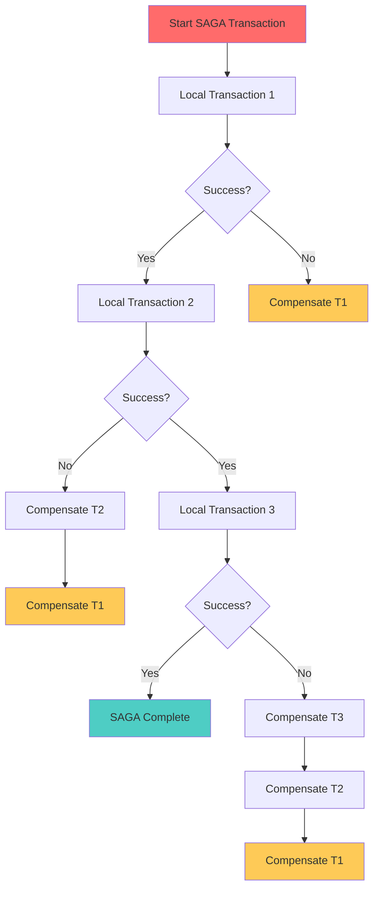
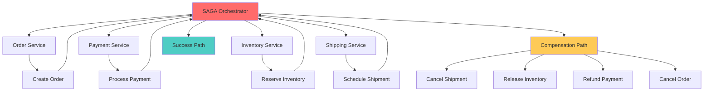
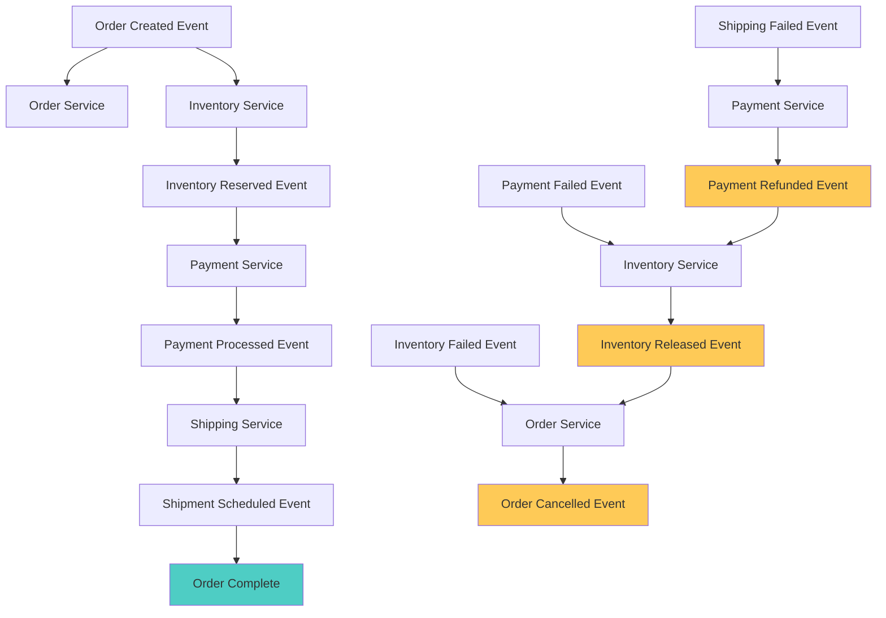
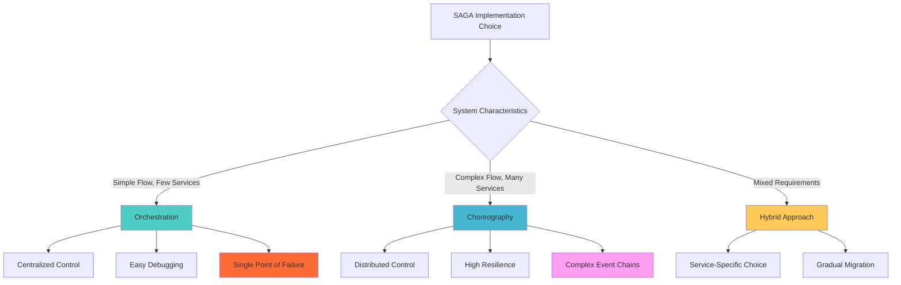

## 🎯 Introduction

In the era of microservices architecture, managing transactions across multiple services presents significant challenges. Traditional distributed transaction mechanisms like Two-Phase Commit (2PC) often lead to tight coupling, reduced availability, and poor performance. The **SAGA Pattern** emerges as a powerful alternative, providing a way to manage distributed transactions through a sequence of local transactions, each with compensating actions for rollback scenarios.

## 📚 What is the SAGA Pattern?

### 🔍 Core Concepts

The SAGA pattern is a design pattern for managing **long-running distributed transactions** across multiple microservices. Instead of using distributed locks or two-phase commits, SAGA breaks down a complex business transaction into a series of smaller, local transactions that can be independently committed or rolled back.



### 🏗️ SAGA vs Traditional Approaches

**Key Differences:**

| Aspect | Two-Phase Commit | SAGA Pattern |
|--------|-----------------|--------------|
| **Consistency** | Strong (ACID) | Eventually Consistent |
| **Availability** | Reduced during locks | High availability |
| **Performance** | Blocking operations | Non-blocking |
| **Complexity** | Protocol complexity | Business logic complexity |
| **Fault Tolerance** | Coordinator failure risks | Resilient to service failures |
| **Scalability** | Limited by lock duration | Highly scalable |

### 📋 SAGA Properties

**SAGA transactions must satisfy:**
1. **Atomicity**: Either all transactions complete, or all compensations are executed
2. **Consistency**: System maintains consistent state through compensations
3. **Isolation**: Individual transactions may see intermediate states
4. **Durability**: Each local transaction and compensation is durable

## 🎭 SAGA Implementation Patterns

### 🎼 1. Orchestration Pattern

In the orchestration approach, a central **SAGA Orchestrator** coordinates the entire transaction flow, explicitly calling each service and managing the sequence of operations.

#### 📋 Orchestration Architecture



#### 🛠️ Java Spring Boot Implementation

**SAGA Orchestrator Service:**
```java
@Service
@Transactional
public class OrderSagaOrchestrator {

    private final OrderService orderService;
    private final PaymentService paymentService;
    private final InventoryService inventoryService;
    private final ShippingService shippingService;
    private final SagaTransactionRepository sagaRepository;
    private final ApplicationEventPublisher eventPublisher;

    public SagaExecutionResult executeOrderSaga(OrderSagaRequest request) {
        String sagaId = UUID.randomUUID().toString();
        SagaTransaction saga = createSagaTransaction(sagaId, request);

        try {
            return executeOrderFlow(saga);
        } catch (Exception e) {
            return executeCompensationFlow(saga, e);
        }
    }

    private SagaExecutionResult executeOrderFlow(SagaTransaction saga) {
        // Step 1: Create Order
        SagaStep orderStep = executeStep(saga, "CREATE_ORDER", () -> {
            OrderResponse order = orderService.createOrder(saga.getRequest().toOrderRequest());
            saga.setOrderId(order.getOrderId());
            return order;
        });

        if (!orderStep.isSuccess()) {
            return compensateFromStep(saga, orderStep);
        }

        // Step 2: Reserve Inventory
        SagaStep inventoryStep = executeStep(saga, "RESERVE_INVENTORY", () -> {
            return inventoryService.reserveItems(
                saga.getRequest().getItems(),
                saga.getOrderId()
            );
        });

        if (!inventoryStep.isSuccess()) {
            return compensateFromStep(saga, inventoryStep);
        }

        // Step 3: Process Payment
        SagaStep paymentStep = executeStep(saga, "PROCESS_PAYMENT", () -> {
            return paymentService.processPayment(
                saga.getRequest().getPaymentDetails(),
                saga.getOrderId(),
                saga.getRequest().getTotalAmount()
            );
        });

        if (!paymentStep.isSuccess()) {
            return compensateFromStep(saga, paymentStep);
        }

        // Step 4: Schedule Shipping
        SagaStep shippingStep = executeStep(saga, "SCHEDULE_SHIPPING", () -> {
            return shippingService.scheduleShipping(
                saga.getOrderId(),
                saga.getRequest().getShippingAddress()
            );
        });

        if (!shippingStep.isSuccess()) {
            return compensateFromStep(saga, shippingStep);
        }

        // All steps successful
        saga.setStatus(SagaStatus.COMPLETED);
        sagaRepository.save(saga);

        eventPublisher.publishEvent(new OrderSagaCompletedEvent(saga.getSagaId()));

        return SagaExecutionResult.success(saga);
    }

    private SagaStep executeStep(SagaTransaction saga, String stepName, Supplier<Object> operation) {
        SagaStep step = SagaStep.builder()
            .stepName(stepName)
            .sagaId(saga.getSagaId())
            .status(SagaStepStatus.IN_PROGRESS)
            .startTime(LocalDateTime.now())
            .build();

        try {
            Object result = operation.get();
            step.setStatus(SagaStepStatus.COMPLETED);
            step.setResult(result);
            step.setEndTime(LocalDateTime.now());

            saga.addStep(step);
            sagaRepository.save(saga);

            return step;

        } catch (Exception e) {
            step.setStatus(SagaStepStatus.FAILED);
            step.setErrorMessage(e.getMessage());
            step.setEndTime(LocalDateTime.now());

            saga.addStep(step);
            sagaRepository.save(saga);

            throw new SagaStepExecutionException(stepName, e);
        }
    }

    private SagaExecutionResult compensateFromStep(SagaTransaction saga, SagaStep failedStep) {
        saga.setStatus(SagaStatus.COMPENSATING);
        sagaRepository.save(saga);

        // Execute compensations in reverse order
        List<SagaStep> completedSteps = saga.getSteps().stream()
            .filter(step -> step.getStatus() == SagaStepStatus.COMPLETED)
            .sorted(Comparator.comparing(SagaStep::getStartTime).reversed())
            .toList();

        for (SagaStep step : completedSteps) {
            try {
                executeCompensation(saga, step);
            } catch (Exception e) {
                // Log compensation failure but continue with other compensations
                log.error("Compensation failed for step: {}, saga: {}",
                    step.getStepName(), saga.getSagaId(), e);
            }
        }

        saga.setStatus(SagaStatus.COMPENSATED);
        sagaRepository.save(saga);

        eventPublisher.publishEvent(new OrderSagaCompensatedEvent(saga.getSagaId(), failedStep.getStepName()));

        return SagaExecutionResult.compensated(saga, failedStep.getErrorMessage());
    }

    private void executeCompensation(SagaTransaction saga, SagaStep step) {
        switch (step.getStepName()) {
            case "CREATE_ORDER":
                orderService.cancelOrder(saga.getOrderId());
                break;
            case "RESERVE_INVENTORY":
                inventoryService.releaseReservation(saga.getOrderId());
                break;
            case "PROCESS_PAYMENT":
                paymentService.refundPayment(saga.getOrderId());
                break;
            case "SCHEDULE_SHIPPING":
                shippingService.cancelShipment(saga.getOrderId());
                break;
            default:
                log.warn("No compensation defined for step: {}", step.getStepName());
        }
    }
}
```

**SAGA Data Models:**
```java
@Entity
@Table(name = "saga_transactions")
public class SagaTransaction {

    @Id
    private String sagaId;

    @Enumerated(EnumType.STRING)
    private SagaStatus status;

    @Column(name = "order_id")
    private String orderId;

    @Column(columnDefinition = "JSON")
    @Convert(converter = OrderSagaRequestConverter.class)
    private OrderSagaRequest request;

    @OneToMany(mappedBy = "sagaTransaction", cascade = CascadeType.ALL, fetch = FetchType.LAZY)
    private List<SagaStep> steps = new ArrayList<>();

    @Column(name = "created_at")
    private LocalDateTime createdAt;

    @Column(name = "updated_at")
    private LocalDateTime updatedAt;

    public void addStep(SagaStep step) {
        step.setSagaTransaction(this);
        this.steps.add(step);
        this.updatedAt = LocalDateTime.now();
    }

    // Constructors, getters, setters
}

@Entity
@Table(name = "saga_steps")
public class SagaStep {

    @Id
    @GeneratedValue(strategy = GenerationType.IDENTITY)
    private Long id;

    @Column(name = "step_name")
    private String stepName;

    @Enumerated(EnumType.STRING)
    private SagaStepStatus status;

    @Column(name = "start_time")
    private LocalDateTime startTime;

    @Column(name = "end_time")
    private LocalDateTime endTime;

    @Column(columnDefinition = "TEXT")
    private String errorMessage;

    @Column(columnDefinition = "JSON")
    private String result;

    @ManyToOne(fetch = FetchType.LAZY)
    @JoinColumn(name = "saga_id", referencedColumnName = "sagaId")
    private SagaTransaction sagaTransaction;

    // Constructors, getters, setters
}

public enum SagaStatus {
    STARTED, IN_PROGRESS, COMPLETED, COMPENSATING, COMPENSATED, FAILED
}

public enum SagaStepStatus {
    PENDING, IN_PROGRESS, COMPLETED, FAILED, COMPENSATED
}
```

**REST Controller:**
```java
@RestController
@RequestMapping("/api/orders")
public class OrderSagaController {

    private final OrderSagaOrchestrator orchestrator;

    @PostMapping("/saga")
    public ResponseEntity<SagaResponse> createOrderWithSaga(@RequestBody OrderSagaRequest request) {
        try {
            SagaExecutionResult result = orchestrator.executeOrderSaga(request);

            if (result.isSuccess()) {
                return ResponseEntity.ok(SagaResponse.success(result.getSagaId()));
            } else {
                return ResponseEntity.status(HttpStatus.BAD_REQUEST)
                    .body(SagaResponse.failed(result.getSagaId(), result.getErrorMessage()));
            }

        } catch (Exception e) {
            return ResponseEntity.status(HttpStatus.INTERNAL_SERVER_ERROR)
                .body(SagaResponse.error("SAGA execution failed: " + e.getMessage()));
        }
    }

    @GetMapping("/saga/{sagaId}")
    public ResponseEntity<SagaStatusResponse> getSagaStatus(@PathVariable String sagaId) {
        Optional<SagaTransaction> saga = orchestrator.getSagaStatus(sagaId);

        if (saga.isPresent()) {
            return ResponseEntity.ok(SagaStatusResponse.from(saga.get()));
        } else {
            return ResponseEntity.notFound().build();
        }
    }
}
```

### 💃 2. Choreography Pattern

In the choreography approach, there's no central coordinator. Each service publishes and listens to events, and the SAGA progresses through a series of event-driven interactions between services.

#### 📋 Choreography Architecture



#### 🛠️ Java Spring Boot Implementation

**Event-Driven Order Service:**
```java
@Service
@Transactional
public class ChoreographyOrderService {

    private final OrderRepository orderRepository;
    private final ApplicationEventPublisher eventPublisher;
    private final SagaEventRepository sagaEventRepository;

    @EventListener
    public void handleOrderCreationRequest(OrderCreationRequestEvent event) {
        try {
            Order order = createOrder(event.getOrderRequest());

            // Publish order created event
            OrderCreatedEvent orderCreatedEvent = OrderCreatedEvent.builder()
                .sagaId(event.getSagaId())
                .orderId(order.getId())
                .customerId(order.getCustomerId())
                .items(order.getItems())
                .totalAmount(order.getTotalAmount())
                .timestamp(LocalDateTime.now())
                .build();

            recordSagaEvent(orderCreatedEvent);
            eventPublisher.publishEvent(orderCreatedEvent);

        } catch (Exception e) {
            // Publish order creation failed event
            OrderCreationFailedEvent failedEvent = OrderCreationFailedEvent.builder()
                .sagaId(event.getSagaId())
                .reason(e.getMessage())
                .timestamp(LocalDateTime.now())
                .build();

            recordSagaEvent(failedEvent);
            eventPublisher.publishEvent(failedEvent);
        }
    }

    @EventListener
    public void handleInventoryFailure(InventoryReservationFailedEvent event) {
        try {
            // Cancel the order
            Order order = orderRepository.findBySagaId(event.getSagaId())
                .orElseThrow(() -> new OrderNotFoundException(event.getSagaId()));

            order.setStatus(OrderStatus.CANCELLED);
            order.setCancellationReason("Inventory reservation failed: " + event.getReason());
            orderRepository.save(order);

            // Publish order cancelled event
            OrderCancelledEvent cancelledEvent = OrderCancelledEvent.builder()
                .sagaId(event.getSagaId())
                .orderId(order.getId())
                .reason("Inventory unavailable")
                .timestamp(LocalDateTime.now())
                .build();

            recordSagaEvent(cancelledEvent);
            eventPublisher.publishEvent(cancelledEvent);

        } catch (Exception e) {
            log.error("Failed to handle inventory failure for saga: {}", event.getSagaId(), e);
        }
    }

    @EventListener
    public void handlePaymentFailure(PaymentFailedEvent event) {
        // Similar compensation logic for payment failures
        handleCompensationScenario(event.getSagaId(), "Payment failed: " + event.getReason());
    }

    @EventListener
    public void handleShippingFailure(ShippingFailedEvent event) {
        // Similar compensation logic for shipping failures
        handleCompensationScenario(event.getSagaId(), "Shipping failed: " + event.getReason());
    }

    @EventListener
    public void handleSagaCompletion(ShipmentScheduledEvent event) {
        try {
            Order order = orderRepository.findBySagaId(event.getSagaId())
                .orElseThrow(() -> new OrderNotFoundException(event.getSagaId()));

            order.setStatus(OrderStatus.CONFIRMED);
            order.setShipmentId(event.getShipmentId());
            orderRepository.save(order);

            // Publish final completion event
            OrderSagaCompletedEvent completedEvent = OrderSagaCompletedEvent.builder()
                .sagaId(event.getSagaId())
                .orderId(order.getId())
                .timestamp(LocalDateTime.now())
                .build();

            recordSagaEvent(completedEvent);
            eventPublisher.publishEvent(completedEvent);

        } catch (Exception e) {
            log.error("Failed to complete saga: {}", event.getSagaId(), e);
        }
    }

    private void recordSagaEvent(SagaEvent event) {
        SagaEventRecord record = SagaEventRecord.builder()
            .sagaId(event.getSagaId())
            .eventType(event.getClass().getSimpleName())
            .eventData(JsonUtils.toJson(event))
            .timestamp(event.getTimestamp())
            .build();

        sagaEventRepository.save(record);
    }
}
```

**Inventory Service with Event Handling:**
```java
@Service
@Transactional
public class ChoreographyInventoryService {

    private final InventoryRepository inventoryRepository;
    private final ReservationRepository reservationRepository;
    private final ApplicationEventPublisher eventPublisher;

    @EventListener
    @Async
    public void handleOrderCreated(OrderCreatedEvent event) {
        try {
            // Check inventory availability
            boolean allItemsAvailable = event.getItems().stream()
                .allMatch(item -> checkInventoryAvailability(item.getProductId(), item.getQuantity()));

            if (!allItemsAvailable) {
                publishInventoryFailure(event.getSagaId(), "Insufficient inventory");
                return;
            }

            // Reserve inventory
            List<InventoryReservation> reservations = event.getItems().stream()
                .map(item -> reserveInventory(item, event.getSagaId(), event.getOrderId()))
                .toList();

            // Publish success event
            InventoryReservedEvent reservedEvent = InventoryReservedEvent.builder()
                .sagaId(event.getSagaId())
                .orderId(event.getOrderId())
                .reservations(reservations.stream()
                    .map(this::toReservationInfo)
                    .toList())
                .timestamp(LocalDateTime.now())
                .build();

            eventPublisher.publishEvent(reservedEvent);

        } catch (Exception e) {
            publishInventoryFailure(event.getSagaId(), e.getMessage());
        }
    }

    @EventListener
    public void handlePaymentFailure(PaymentFailedEvent event) {
        try {
            // Release inventory reservations
            List<InventoryReservation> reservations = reservationRepository
                .findBySagaId(event.getSagaId());

            for (InventoryReservation reservation : reservations) {
                releaseReservation(reservation);
            }

            // Publish inventory released event
            InventoryReleasedEvent releasedEvent = InventoryReleasedEvent.builder()
                .sagaId(event.getSagaId())
                .reason("Payment failed")
                .timestamp(LocalDateTime.now())
                .build();

            eventPublisher.publishEvent(releasedEvent);

        } catch (Exception e) {
            log.error("Failed to release inventory for saga: {}", event.getSagaId(), e);
        }
    }

    private void publishInventoryFailure(String sagaId, String reason) {
        InventoryReservationFailedEvent failedEvent = InventoryReservationFailedEvent.builder()
            .sagaId(sagaId)
            .reason(reason)
            .timestamp(LocalDateTime.now())
            .build();

        eventPublisher.publishEvent(failedEvent);
    }

    private InventoryReservation reserveInventory(OrderItem item, String sagaId, String orderId) {
        // Update inventory count
        Inventory inventory = inventoryRepository.findByProductId(item.getProductId())
            .orElseThrow(() -> new ProductNotFoundException(item.getProductId()));

        if (inventory.getAvailableQuantity() < item.getQuantity()) {
            throw new InsufficientInventoryException(item.getProductId(), item.getQuantity());
        }

        inventory.setAvailableQuantity(inventory.getAvailableQuantity() - item.getQuantity());
        inventory.setReservedQuantity(inventory.getReservedQuantity() + item.getQuantity());
        inventoryRepository.save(inventory);

        // Create reservation record
        InventoryReservation reservation = InventoryReservation.builder()
            .sagaId(sagaId)
            .orderId(orderId)
            .productId(item.getProductId())
            .quantity(item.getQuantity())
            .status(ReservationStatus.RESERVED)
            .createdAt(LocalDateTime.now())
            .build();

        return reservationRepository.save(reservation);
    }
}
```

**Event Configuration with Spring Boot:**
```java
@Configuration
@EnableAsync
public class SagaEventConfiguration {

    @Bean
    public ApplicationEventMulticaster applicationEventMulticaster() {
        SimpleApplicationEventMulticaster eventMulticaster = new SimpleApplicationEventMulticaster();
        eventMulticaster.setTaskExecutor(sagaEventExecutor());
        eventMulticaster.setErrorHandler(new SagaEventErrorHandler());
        return eventMulticaster;
    }

    @Bean
    public TaskExecutor sagaEventExecutor() {
        ThreadPoolTaskExecutor executor = new ThreadPoolTaskExecutor();
        executor.setCorePoolSize(10);
        executor.setMaxPoolSize(50);
        executor.setQueueCapacity(200);
        executor.setThreadNamePrefix("saga-event-");
        executor.setWaitForTasksToCompleteOnShutdown(true);
        executor.setAwaitTerminationSeconds(60);
        executor.initialize();
        return executor;
    }

    @Component
    public static class SagaEventErrorHandler implements ErrorHandler {

        private final Logger log = LoggerFactory.getLogger(SagaEventErrorHandler.class);

        @Override
        public void handleError(Throwable throwable) {
            log.error("Error processing SAGA event", throwable);
            // Implement dead letter queue or retry mechanism
        }
    }
}
```

## 🔄 Advanced SAGA Patterns

### 📊 SAGA State Management

For complex scenarios, implementing explicit state management helps track SAGA progress and handle failures more effectively.

```java
@Entity
@Table(name = "saga_state")
public class SagaState {

    @Id
    private String sagaId;

    @Enumerated(EnumType.STRING)
    private SagaPhase currentPhase;

    @Column(columnDefinition = "JSON")
    @Convert(converter = SagaContextConverter.class)
    private SagaContext context;

    @ElementCollection
    @Enumerated(EnumType.STRING)
    private Set<SagaStepType> completedSteps = new HashSet<>();

    @ElementCollection
    @Enumerated(EnumType.STRING)
    private Set<SagaStepType> compensatedSteps = new HashSet<>();

    @Column(name = "created_at")
    private LocalDateTime createdAt;

    @Column(name = "updated_at")
    private LocalDateTime updatedAt;

    public boolean isStepCompleted(SagaStepType stepType) {
        return completedSteps.contains(stepType);
    }

    public boolean isStepCompensated(SagaStepType stepType) {
        return compensatedSteps.contains(stepType);
    }

    public void markStepCompleted(SagaStepType stepType) {
        completedSteps.add(stepType);
        updatedAt = LocalDateTime.now();
    }

    public void markStepCompensated(SagaStepType stepType) {
        compensatedSteps.add(stepType);
        completedSteps.remove(stepType);
        updatedAt = LocalDateTime.now();
    }
}

public enum SagaPhase {
    STARTED,
    ORDER_CREATION,
    INVENTORY_RESERVATION,
    PAYMENT_PROCESSING,
    SHIPPING_SCHEDULING,
    COMPLETED,
    COMPENSATING,
    COMPENSATED,
    FAILED
}

public enum SagaStepType {
    CREATE_ORDER,
    RESERVE_INVENTORY,
    PROCESS_PAYMENT,
    SCHEDULE_SHIPPING
}
```

### 🔄 SAGA Recovery Mechanism

Implementing recovery mechanisms for handling partial failures and system restarts:

```java
@Component
@Scheduled(fixedRate = 30000) // Run every 30 seconds
public class SagaRecoveryService {

    private final SagaStateRepository sagaStateRepository;
    private final OrderSagaOrchestrator orchestrator;
    private final SagaEventPublisher eventPublisher;

    @Scheduled(fixedRate = 30000)
    public void recoverStuckSagas() {
        LocalDateTime cutoffTime = LocalDateTime.now().minusMinutes(10);

        List<SagaState> stuckSagas = sagaStateRepository
            .findByUpdatedAtBeforeAndCurrentPhaseIn(
                cutoffTime,
                Arrays.asList(SagaPhase.ORDER_CREATION, SagaPhase.INVENTORY_RESERVATION,
                             SagaPhase.PAYMENT_PROCESSING, SagaPhase.SHIPPING_SCHEDULING)
            );

        for (SagaState saga : stuckSagas) {
            try {
                recoverSaga(saga);
            } catch (Exception e) {
                log.error("Failed to recover saga: {}", saga.getSagaId(), e);
            }
        }
    }

    private void recoverSaga(SagaState saga) {
        log.info("Recovering stuck saga: {}, phase: {}", saga.getSagaId(), saga.getCurrentPhase());

        switch (saga.getCurrentPhase()) {
            case ORDER_CREATION:
                if (!saga.isStepCompleted(SagaStepType.CREATE_ORDER)) {
                    retryOrderCreation(saga);
                } else {
                    moveToNextPhase(saga, SagaPhase.INVENTORY_RESERVATION);
                }
                break;

            case INVENTORY_RESERVATION:
                if (!saga.isStepCompleted(SagaStepType.RESERVE_INVENTORY)) {
                    retryInventoryReservation(saga);
                } else {
                    moveToNextPhase(saga, SagaPhase.PAYMENT_PROCESSING);
                }
                break;

            case PAYMENT_PROCESSING:
                if (!saga.isStepCompleted(SagaStepType.PROCESS_PAYMENT)) {
                    retryPaymentProcessing(saga);
                } else {
                    moveToNextPhase(saga, SagaPhase.SHIPPING_SCHEDULING);
                }
                break;

            case SHIPPING_SCHEDULING:
                if (!saga.isStepCompleted(SagaStepType.SCHEDULE_SHIPPING)) {
                    retryShippingScheduling(saga);
                } else {
                    moveToNextPhase(saga, SagaPhase.COMPLETED);
                }
                break;

            default:
                log.warn("Unknown phase for recovery: {}", saga.getCurrentPhase());
        }
    }

    private void retryOrderCreation(SagaState saga) {
        try {
            eventPublisher.publishOrderCreationRetry(saga.getSagaId(), saga.getContext());
        } catch (Exception e) {
            initiateSagaCompensation(saga, "Order creation retry failed");
        }
    }

    private void initiateSagaCompensation(SagaState saga, String reason) {
        saga.setCurrentPhase(SagaPhase.COMPENSATING);
        sagaStateRepository.save(saga);

        eventPublisher.publishSagaCompensationInitiated(saga.getSagaId(), reason);
    }
}
```

## 📈 Performance Optimization & Monitoring

### 🔍 SAGA Metrics and Monitoring

```java
@Component
public class SagaMetrics {

    private final MeterRegistry meterRegistry;
    private final Timer sagaExecutionTimer;
    private final Counter sagaSuccessCounter;
    private final Counter sagaFailureCounter;
    private final Gauge activeSagasGauge;

    public SagaMetrics(MeterRegistry meterRegistry, SagaStateRepository sagaStateRepository) {
        this.meterRegistry = meterRegistry;
        this.sagaExecutionTimer = Timer.builder("saga.execution.time")
            .description("Time taken to execute SAGA transactions")
            .register(meterRegistry);

        this.sagaSuccessCounter = Counter.builder("saga.executions")
            .tag("result", "success")
            .description("Successful SAGA executions")
            .register(meterRegistry);

        this.sagaFailureCounter = Counter.builder("saga.executions")
            .tag("result", "failure")
            .description("Failed SAGA executions")
            .register(meterRegistry);

        this.activeSagasGauge = Gauge.builder("saga.active.count")
            .description("Number of active SAGA transactions")
            .register(meterRegistry, sagaStateRepository, repo ->
                repo.countByCurrentPhaseIn(Arrays.asList(
                    SagaPhase.STARTED, SagaPhase.ORDER_CREATION,
                    SagaPhase.INVENTORY_RESERVATION, SagaPhase.PAYMENT_PROCESSING,
                    SagaPhase.SHIPPING_SCHEDULING)));
    }

    public Timer.Sample startSagaTimer() {
        return Timer.start(meterRegistry);
    }

    public void recordSagaSuccess(Timer.Sample sample, String sagaType) {
        sample.stop(Timer.builder("saga.execution.time")
            .tag("type", sagaType)
            .tag("result", "success")
            .register(meterRegistry));
        sagaSuccessCounter.increment();
    }

    public void recordSagaFailure(Timer.Sample sample, String sagaType, String errorType) {
        sample.stop(Timer.builder("saga.execution.time")
            .tag("type", sagaType)
            .tag("result", "failure")
            .tag("error", errorType)
            .register(meterRegistry));
        sagaFailureCounter.increment();
    }

    public void recordCompensationEvent(String stepType, String reason) {
        Counter.builder("saga.compensations")
            .tag("step", stepType)
            .tag("reason", reason)
            .register(meterRegistry)
            .increment();
    }
}
```

### 🔧 Configuration Optimization

```yaml
# application.yml
spring:
  application:
    name: saga-orchestrator

  datasource:
    hikari:
      maximum-pool-size: 50
      minimum-idle: 10
      connection-timeout: 30000
      idle-timeout: 600000
      max-lifetime: 1800000

  kafka:
    producer:
      bootstrap-servers: ${KAFKA_BOOTSTRAP_SERVERS:localhost:9092}
      key-serializer: org.apache.kafka.common.serialization.StringSerializer
      value-serializer: org.springframework.kafka.support.serializer.JsonSerializer
      acks: all
      retries: 3
      batch-size: 16384
      linger-ms: 5
      buffer-memory: 33554432

    consumer:
      bootstrap-servers: ${KAFKA_BOOTSTRAP_SERVERS:localhost:9092}
      key-deserializer: org.apache.kafka.common.serialization.StringDeserializer
      value-deserializer: org.springframework.kafka.support.serializer.JsonDeserializer
      properties:
        spring.json.trusted.packages: "com.example.saga.events"
      group-id: saga-choreography-group
      auto-offset-reset: earliest
      enable-auto-commit: false
      max-poll-records: 10

saga:
  orchestration:
    timeout: 300000 # 5 minutes
    retry:
      max-attempts: 3
      backoff-delay: 1000
      multiplier: 2

  choreography:
    event-store:
      retention-days: 30
    recovery:
      check-interval: 30000
      stuck-timeout: 600000 # 10 minutes

  compensation:
    timeout: 60000 # 1 minute per step
    max-retries: 3

management:
  endpoints:
    web:
      exposure:
        include: health, metrics, prometheus, saga-status
  endpoint:
    health:
      show-details: always
  metrics:
    export:
      prometheus:
        enabled: true
```

## ⚖️ SAGA Pattern Trade-offs

### 📊 Orchestration vs Choreography Comparison



### 📈 Performance Comparison

| Aspect | Orchestration | Choreography | Two-Phase Commit |
|--------|---------------|--------------|-------------------|
| **Latency** | Medium | Low | High |
| **Throughput** | Medium | High | Low |
| **Complexity** | Medium | High | Low |
| **Debugging** | Easy | Difficult | Easy |
| **Fault Tolerance** | Medium | High | Low |
| **Consistency** | Eventual | Eventual | Strong |

### ✅ SAGA Pattern Pros & Cons

**Advantages:**
- **High Availability**: No blocking distributed locks
- **Scalability**: Services can scale independently
- **Fault Tolerance**: Resilient to individual service failures
- **Performance**: Better throughput than 2PC
- **Flexibility**: Business logic can be distributed

**Disadvantages:**
- **Complexity**: More complex error handling and compensation logic
- **Eventual Consistency**: Temporary inconsistent states during execution
- **Debugging**: Harder to trace and debug distributed flows
- **Data Isolation**: Lack of isolation between concurrent SAGAs
- **Compensation Logic**: Requires careful design of compensating actions

## 🎯 Best Practices and Recommendations

### 🔧 Implementation Guidelines

**1. Idempotency Design:**
```java
@Service
public class IdempotentPaymentService {

    private final PaymentRepository paymentRepository;
    private final IdempotencyKeyRepository idempotencyKeyRepository;

    @Transactional
    public PaymentResult processPayment(String idempotencyKey, PaymentRequest request) {
        // Check for existing payment with same idempotency key
        Optional<Payment> existingPayment = paymentRepository
            .findByIdempotencyKey(idempotencyKey);

        if (existingPayment.isPresent()) {
            return PaymentResult.fromExisting(existingPayment.get());
        }

        // Record idempotency key to prevent concurrent processing
        IdempotencyKey key = new IdempotencyKey(idempotencyKey, PaymentRequest.class.getSimpleName());
        idempotencyKeyRepository.saveWithLock(key);

        try {
            Payment payment = executePayment(request);
            payment.setIdempotencyKey(idempotencyKey);
            paymentRepository.save(payment);

            return PaymentResult.success(payment);

        } catch (Exception e) {
            idempotencyKeyRepository.delete(key);
            throw new PaymentProcessingException("Payment failed", e);
        }
    }
}
```

**2. Compensation Design:**
```java
public interface CompensatingAction {

    CompensationResult execute(CompensationContext context);

    boolean isCompensatable(CompensationContext context);

    default int getRetryAttempts() {
        return 3;
    }

    default Duration getRetryDelay() {
        return Duration.ofSeconds(5);
    }
}

@Component
public class OrderCancellationCompensation implements CompensatingAction {

    @Override
    public CompensationResult execute(CompensationContext context) {
        try {
            String orderId = context.getOrderId();
            Order order = orderRepository.findById(orderId)
                .orElse(null);

            if (order == null) {
                return CompensationResult.success("Order already cancelled or not found");
            }

            if (order.getStatus() == OrderStatus.SHIPPED) {
                // Cannot cancel shipped orders - need manual intervention
                return CompensationResult.failed("Cannot cancel shipped order - manual intervention required");
            }

            order.cancel("SAGA compensation");
            orderRepository.save(order);

            return CompensationResult.success("Order cancelled successfully");

        } catch (Exception e) {
            return CompensationResult.failed("Failed to cancel order: " + e.getMessage());
        }
    }

    @Override
    public boolean isCompensatable(CompensationContext context) {
        // Check if compensation is still possible
        String orderId = context.getOrderId();
        return orderRepository.findById(orderId)
            .map(order -> order.getStatus() != OrderStatus.SHIPPED)
            .orElse(false);
    }
}
```

**3. Testing Strategy:**
```java
@SpringBootTest
@TestPropertySource(properties = {
    "saga.orchestration.timeout=5000",
    "saga.compensation.timeout=3000"
})
class SagaIntegrationTest {

    @Autowired
    private OrderSagaOrchestrator orchestrator;

    @MockBean
    private PaymentService paymentService;

    @Test
    void testSuccessfulSagaExecution() {
        // Arrange
        OrderSagaRequest request = createValidOrderRequest();

        // Act
        SagaExecutionResult result = orchestrator.executeOrderSaga(request);

        // Assert
        assertThat(result.isSuccess()).isTrue();
        assertThat(result.getSaga().getStatus()).isEqualTo(SagaStatus.COMPLETED);
    }

    @Test
    void testSagaCompensationOnPaymentFailure() {
        // Arrange
        OrderSagaRequest request = createValidOrderRequest();
        when(paymentService.processPayment(any(), any(), any()))
            .thenThrow(new PaymentProcessingException("Insufficient funds"));

        // Act
        SagaExecutionResult result = orchestrator.executeOrderSaga(request);

        // Assert
        assertThat(result.isSuccess()).isFalse();
        assertThat(result.getSaga().getStatus()).isEqualTo(SagaStatus.COMPENSATED);

        // Verify compensations were called
        verify(inventoryService).releaseReservation(any());
        verify(orderService).cancelOrder(any());
    }

    @Test
    void testConcurrentSagaExecution() throws InterruptedException {
        // Test multiple concurrent SAGAs to ensure isolation
        int threadCount = 10;
        CountDownLatch latch = new CountDownLatch(threadCount);
        AtomicInteger successCount = new AtomicInteger(0);

        ExecutorService executor = Executors.newFixedThreadPool(threadCount);

        for (int i = 0; i < threadCount; i++) {
            executor.submit(() -> {
                try {
                    OrderSagaRequest request = createValidOrderRequest();
                    SagaExecutionResult result = orchestrator.executeOrderSaga(request);

                    if (result.isSuccess()) {
                        successCount.incrementAndGet();
                    }
                } finally {
                    latch.countDown();
                }
            });
        }

        latch.await(30, TimeUnit.SECONDS);
        assertThat(successCount.get()).isGreaterThan(0);
    }
}
```

## 🎯 Conclusion

The SAGA pattern provides a robust alternative to traditional distributed transaction mechanisms, offering better availability and scalability at the cost of increased complexity. When implementing SAGA patterns in Spring Boot applications:

### 🏆 Key Takeaways

1. **Choose the Right Pattern**: Orchestration for simpler, centralized control; Choreography for distributed, resilient systems
2. **Design for Idempotency**: Ensure all operations can be safely retried
3. **Implement Comprehensive Compensation**: Plan for all possible failure scenarios
4. **Monitor and Observe**: Use metrics and logging to track SAGA execution
5. **Test Thoroughly**: Include failure scenarios and compensation paths in testing

### 🚀 When to Use SAGA Pattern

**Ideal Scenarios:**
- Microservices architecture with multiple data stores
- Long-running business processes
- Systems requiring high availability
- Applications with complex business workflows

**Avoid SAGA When:**
- Strong consistency is mandatory
- Simple, single-service transactions
- Systems with simple failure scenarios
- Applications requiring strict ACID properties

By implementing SAGA patterns correctly in your Spring Boot applications, you can achieve distributed transaction management that scales with your microservices architecture while maintaining business consistency requirements.