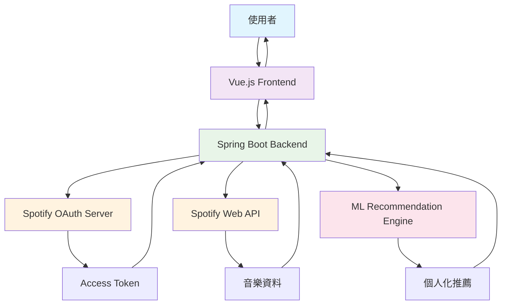

## 🎯 專案動機與背景

Spotify 作為全球最受歡迎的音樂串流平台之一，雖然擁有強大的推薦演算法，但往往會陷入**推薦相似歌曲**的循環中，使用者缺乏**主動探索新音樂**的有效途徑。因此，我開發了這個全端應用程式，讓使用者能夠更主動地控制音樂發現過程。

> 💡 **核心理念**: "讓使用者主動參與音樂推薦過程，而不是被動接受演算法的建議"

## 🏗️ 系統架構總覽

### 🔧 技術堆疊

```text
Frontend (前端)
├── Vue.js 3.x
├── Vue Router
├── Axios (HTTP Client)
└── Bootstrap/CSS3

Backend (後端)  
├── Spring Boot 2.x
├── Spring Security (OAuth2)
├── Spring Web MVC
├── Spotify Web API Java Client
└── Maven

External Services (外部服務)
├── Spotify Web API
├── Spotify OAuth 2.0
└── Machine Learning 推薦引擎
```

### 🗺️ 系統架構流程圖



## ⭐ 核心功能特色

### 🤖 1. 智能音樂推薦系統
- **基於機器學習的推薦演算法**
- **多維度音樂特徵分析** (節拍、能量、舞蹈性等)
- **使用者偏好學習與適應**

### 🔍 2. 互動式音樂探索
- **藝人/歌曲智能搜尋**
- **專輯預覽與試聽功能**  
- **相關音樂發現**

### 🔐 3. Spotify 深度整合
- **OAuth 2.0 安全認證**
- **即時播放清單同步**
- **使用者音樂庫存取**

## 🖥️ 後端核心實作

### 🔐 Spotify OAuth 認證流程

```java
@RestController
@RequestMapping("/api/spotify")
public class SpotifyController {
    
    @Autowired
    private SpotifyService spotifyService;
    
    /**
     * 初始化 Spotify OAuth 認證流程
     * 引導使用者至 Spotify 授權頁面
     */
    @GetMapping("/auth")
    public ResponseEntity<?> authenticateSpotify(HttpServletRequest request) {
        try {
            // 生成隨機 state 參數防止 CSRF 攻擊
            String state = UUID.randomUUID().toString();
            request.getSession().setAttribute("spotify_state", state);
            
            // 構建 Spotify 授權 URL
            String authUrl = spotifyService.getAuthorizationUrl(state);
            
            return ResponseEntity.ok(Map.of(
                "authUrl", authUrl,
                "message", "請前往此 URL 進行 Spotify 授權"
            ));
        } catch (Exception e) {
            return ResponseEntity.status(500)
                .body(Map.of("error", "授權初始化失敗: " + e.getMessage()));
        }
    }
    
    /**
     * 處理 Spotify OAuth 回調
     * 交換授權碼取得存取權杖
     */
    @GetMapping("/callback")
    public ResponseEntity<?> handleCallback(
            @RequestParam("code") String code,
            @RequestParam("state") String state,
            HttpServletRequest request) {
        
        try {
            // 驗證 state 參數
            String sessionState = (String) request.getSession().getAttribute("spotify_state");
            if (!state.equals(sessionState)) {
                throw new SecurityException("State 參數驗證失敗");
            }
            
            // 交換授權碼取得 access token
            SpotifyTokens tokens = spotifyService.exchangeCodeForTokens(code);
            
            // 儲存 tokens 到 session 或資料庫
            request.getSession().setAttribute("spotify_tokens", tokens);
            
            return ResponseEntity.ok(Map.of(
                "message", "Spotify 授權成功",
                "expiresIn", tokens.getExpiresIn()
            ));
            
        } catch (Exception e) {
            return ResponseEntity.status(400)
                .body(Map.of("error", "授權處理失敗: " + e.getMessage()));
        }
    }
}
```
```

### 🎵 音樂推薦核心演算法

```java
@Service
public class MusicRecommendationService {
    
    @Autowired
    private SpotifyApiService spotifyApiService;
    
    /**
     * 基於使用者偏好產生音樂推薦
     * 結合多種推薦策略提供個人化建議
     */
    public List<Track> generateRecommendations(String userId, RecommendationRequest request) {
        try {
            // 1. 獲取使用者歷史播放記錄
            List<Track> recentTracks = spotifyApiService.getRecentlyPlayed(userId, 50);
            
            // 2. 分析音樂特徵偏好
            AudioFeaturePreferences preferences = analyzeUserPreferences(recentTracks);
            
            // 3. 種子歌曲/藝人選擇
            RecommendationSeeds seeds = buildRecommendationSeeds(request, preferences);
            
            // 4. 呼叫 Spotify 推薦 API
            List<Track> spotifyRecommendations = spotifyApiService.getRecommendations(
                seeds.getArtists(),
                seeds.getTracks(),
                seeds.getGenres(),
                preferences.toTuneableAttributes()
            );
            
            // 5. 應用自定義過濾與排序
            List<Track> filteredTracks = applyCustomFiltering(
                spotifyRecommendations, 
                preferences,
                request.getExcludedArtists()
            );
            
            // 6. 多樣性增強處理
            return enhanceDiversity(filteredTracks, request.getDiversityLevel());
            
        } catch (Exception e) {
            log.error("音樂推薦生成失敗", e);
            throw new RecommendationException("推薦系統暫時無法使用", e);
        }
    }
    
    /**
     * 分析使用者音樂偏好模式
     * 從歷史播放記錄中提取音頻特徵趋势
     */
    private AudioFeaturePreferences analyzeUserPreferences(List<Track> recentTracks) {
        if (recentTracks.isEmpty()) {
            return AudioFeaturePreferences.getDefault();
        }
        
        // 批次獲取音頻特徵
        List<String> trackIds = recentTracks.stream()
            .map(Track::getId)
            .collect(Collectors.toList());
            
        List<AudioFeatures> audioFeatures = spotifyApiService.getAudioFeatures(trackIds);
        
        // 計算各項特徵的平均值與標準差
        DoubleSummaryStatistics energyStats = audioFeatures.stream()
            .mapToDouble(AudioFeatures::getEnergy)
            .summaryStatistics();
            
        DoubleSummaryStatistics valenceStats = audioFeatures.stream()
            .mapToDouble(AudioFeatures::getValence)
            .summaryStatistics();
            
        DoubleSummaryStatistics danceabilityStats = audioFeatures.stream()
            .mapToDouble(AudioFeatures::getDanceability)
            .summaryStatistics();
        
        // 建構偏好物件
        return AudioFeaturePreferences.builder()
            .targetEnergy((float) energyStats.getAverage())
            .energyRange(calculateOptimalRange(energyStats))
            .targetValence((float) valenceStats.getAverage())
            .valenceRange(calculateOptimalRange(valenceStats))
            .targetDanceability((float) danceabilityStats.getAverage())
            .danceabilityRange(calculateOptimalRange(danceabilityStats))
            .build();
    }
    
    /**
     * 多樣性增強演算法
     * 確保推薦結果具有適當的多樣性，避免推薦過於相似的音樂
     */
    private List<Track> enhanceDiversity(List<Track> tracks, DiversityLevel level) {
        if (level == DiversityLevel.LOW || tracks.size() <= 10) {
            return tracks.subList(0, Math.min(20, tracks.size()));
        }
        
        List<Track> diversifiedTracks = new ArrayList<>();
        Set<String> selectedArtists = new HashSet<>();
        Set<String> selectedGenres = new HashSet<>();
        
        // 第一輪：選擇不同藝人的高品質推薦
        for (Track track : tracks) {
            if (diversifiedTracks.size() >= 15) break;
            
            String primaryArtist = track.getArtists().get(0).getId();
            if (!selectedArtists.contains(primaryArtist)) {
                diversifiedTracks.add(track);
                selectedArtists.add(primaryArtist);
                
                // 記錄風格資訊（如果可用）
                if (track.getGenres() != null) {
                    selectedGenres.addAll(track.getGenres());
                }
            }
        }
        
        // 第二輪：在剩餘空間中加入多樣性選項
        if (level == DiversityLevel.HIGH && diversifiedTracks.size() < 20) {
            for (Track track : tracks) {
                if (diversifiedTracks.size() >= 20) break;
                if (diversifiedTracks.contains(track)) continue;
                
                // 優先選擇不同風格的歌曲
                boolean isDifferentGenre = track.getGenres() != null && 
                    track.getGenres().stream().noneMatch(selectedGenres::contains);
                    
                if (isDifferentGenre || diversifiedTracks.size() < 18) {
                    diversifiedTracks.add(track);
                }
            }
        }
        
        return diversifiedTracks;
    }
}
```
```

### 🔌 Spotify API 整合服務

```java
@Service
public class SpotifyApiService {
    
    private final SpotifyApi spotifyApi;
    private final TokenRefreshService tokenRefreshService;
    
    public SpotifyApiService(SpotifyConfiguration config) {
        this.spotifyApi = SpotifyApi.builder()
            .setClientId(config.getClientId())
            .setClientSecret(config.getClientSecret())
            .setRedirectUri(SpotifyHttpManager.makeUri(config.getRedirectUri()))
            .build();
    }
    
    /**
     * 搜尋藝人資訊
     * 提供模糊搜尋與自動完成功能
     */
    public List<Artist> searchArtists(String query, int limit) {
        try {
            ensureValidToken();
            
            SearchArtistsRequest request = spotifyApi.searchArtists(query)
                .limit(limit)
                .market(CountryCode.TW)
                .build();
                
            Paging<Artist> artistPaging = request.execute();
            return Arrays.asList(artistPaging.getItems());
            
        } catch (IOException | SpotifyWebApiException | ParseException e) {
            log.error("藝人搜尋失敗: query={}", query, e);
            throw new SpotifyServiceException("搜尋服務暫時無法使用", e);
        }
    }
    
    /**
     * 獲取藝人熱門歌曲
     * 用於推薦系統的種子選擇
     */
    public List<Track> getArtistTopTracks(String artistId, int limit) {
        try {
            ensureValidToken();
            
            GetArtistsTopTracksRequest request = spotifyApi.getArtistsTopTracks(artistId, CountryCode.TW)
                .build();
                
            Track[] tracks = request.execute();
            return Arrays.stream(tracks)
                .limit(limit)
                .collect(Collectors.toList());
                
        } catch (Exception e) {
            log.error("獲取藝人熱門歌曲失敗: artistId={}", artistId, e);
            throw new SpotifyServiceException("無法獲取藝人資訊", e);
        }
    }
    
    /**
     * Token 自動刷新機制
     * 確保 API 呼叫的持續有效性
     */
    private void ensureValidToken() {
        try {
            String currentToken = getCurrentAccessToken();
            if (tokenRefreshService.isTokenExpired(currentToken)) {
                String refreshedToken = tokenRefreshService.refreshAccessToken();
                spotifyApi.setAccessToken(refreshedToken);
                log.info("Spotify access token 已自動刷新");
            }
        } catch (Exception e) {
            log.error("Token 刷新失敗", e);
            throw new SpotifyServiceException("認證失效，請重新登入", e);
        }
    }
}
```
```

## 💻 前端實作重點

### 🧩 Vue.js 主要元件架構

```vue
// SpotifyAuth.vue - 認證元件
<template>
  <div class="spotify-auth">
    <div v-if="!isAuthenticated" class="auth-container">
      <h2>連接您的 Spotify 帳戶</h2>
      <p>授權後即可開始探索個人化音樂推薦</p>
      <button @click="initiateAuth" class="auth-button" :disabled="loading">
        <i class="fab fa-spotify"></i>
        {{ loading ? '連接中...' : '連接 Spotify' }}
      </button>
    </div>
    
    <div v-else class="auth-success">
      <h3>✓ Spotify 帳戶已連接</h3>
      <p>歡迎回來，{{ userProfile.display_name }}！</p>
      <button @click="logout" class="logout-button">登出</button>
    </div>
  </div>
</template>

<script>
import { mapState, mapActions } from 'vuex'

export default {
  name: 'SpotifyAuth',
  data() {
    return {
      loading: false
    }
  },
  computed: {
    ...mapState('spotify', ['isAuthenticated', 'userProfile'])
  },
  methods: {
    ...mapActions('spotify', ['authenticate', 'fetchUserProfile', 'clearAuth']),
    
    async initiateAuth() {
      try {
        this.loading = true
        const response = await this.$http.get('/api/spotify/auth')
        
        // 開啟新視窗進行 OAuth 認證
        const authWindow = window.open(
          response.data.authUrl,
          'spotify-auth',
          'width=600,height=700,scrollbars=yes,resizable=yes'
        )
        
        // 監聽認證完成訊息
        this.listenForAuthComplete(authWindow)
        
      } catch (error) {
        this.$toast.error('認證初始化失敗：' + error.message)
      } finally {
        this.loading = false
      }
    },
    
    listenForAuthComplete(authWindow) {
      const checkClosed = setInterval(() => {
        if (authWindow.closed) {
          clearInterval(checkClosed)
          this.checkAuthStatus()
        }
      }, 1000)
      
      // 監聽來自認證視窗的訊息
      window.addEventListener('message', (event) => {
        if (event.data.type === 'SPOTIFY_AUTH_SUCCESS') {
          clearInterval(checkClosed)
          authWindow.close()
          this.handleAuthSuccess()
        }
      })
    },
    
    async handleAuthSuccess() {
      await this.authenticate()
      await this.fetchUserProfile()
      this.$toast.success('Spotify 認證成功！')
      this.$router.push('/recommendations')
    },
    
    logout() {
      this.clearAuth()
      this.$toast.info('已登出 Spotify')
    }
  }
}
</script>
```

### 🎛️ 音樂推薦介面元件

```vue
// MusicRecommendations.vue - 推薦系統主介面
<template>
  <div class="recommendations-container">
    <!-- 推薦參數控制面板 -->
    <div class="recommendation-controls">
      <h2>個人化音樂推薦</h2>
      
      <form @submit.prevent="generateRecommendations" class="controls-form">
        <!-- 種子藝人選擇 -->
        <div class="form-group">
          <label>喜愛的藝人 (最多 5 位)</label>
          <ArtistSelector 
            v-model="seedArtists"
            :max-selections="5"
            @artists-changed="onArtistsChanged"
          />
        </div>
        
        <!-- 音樂特徵調整 -->
        <div class="form-group">
          <label>音樂風格偏好</label>
          <div class="feature-sliders">
            <FeatureSlider
              v-for="feature in audioFeatures"
              :key="feature.key"
              :label="feature.label"
              :value="feature.value"
              :description="feature.description"
              @input="updateFeature(feature.key, $event)"
            />
          </div>
        </div>
        
        <!-- 多樣性控制 -->
        <div class="form-group">
          <label>推薦多樣性</label>
          <select v-model="diversityLevel" class="diversity-select">
            <option value="LOW">相似風格為主</option>
            <option value="MEDIUM">平衡探索</option>
            <option value="HIGH">最大化多樣性</option>
          </select>
        </div>
        
        <button type="submit" class="generate-btn" :disabled="generating">
          {{ generating ? '生成中...' : '生成推薦清單' }}
        </button>
      </form>
    </div>
    
    <!-- 推薦結果展示 -->
    <div v-if="recommendations.length > 0" class="recommendations-results">
      <h3>為您推薦的音樂</h3>
      <div class="tracks-grid">
        <TrackCard
          v-for="track in recommendations"
          :key="track.id"
          :track="track"
          @play="playTrack"
          @add-to-playlist="showPlaylistModal"
          @like="toggleLike"
        />
      </div>
      
      <!-- 批次操作 -->
      <div class="batch-actions">
        <button @click="createPlaylist" class="create-playlist-btn">
          建立為新播放清單
        </button>
        <button @click="exportRecommendations" class="export-btn">
          匯出推薦結果
        </button>
      </div>
    </div>
    
    <!-- 載入中狀態 -->
    <div v-if="generating" class="loading-container">
      <div class="loading-spinner"></div>
      <p>正在分析您的音樂偏好，請稍候...</p>
    </div>
  </div>
</template>

<script>
import ArtistSelector from '@/components/ArtistSelector.vue'
import FeatureSlider from '@/components/FeatureSlider.vue'
import TrackCard from '@/components/TrackCard.vue'

export default {
  name: 'MusicRecommendations',
  components: {
    ArtistSelector,
    FeatureSlider,
    TrackCard
  },
  data() {
    return {
      seedArtists: [],
      diversityLevel: 'MEDIUM',
      generating: false,
      recommendations: [],
      audioFeatures: [
        {
          key: 'energy',
          label: '能量感',
          value: 0.5,
          description: '音樂的強度與活力程度'
        },
        {
          key: 'valence',
          label: '情感僾向',
          value: 0.5,
          description: '正面情感 vs 憂鬱情感'
        },
        {
          key: 'danceability',
          label: '舞蹈性',
          value: 0.5,
          description: '適合跳舞的程度'
        },
        {
          key: 'acousticness',
          label: '原聲比例',
          value: 0.5,
          description: '原聲樂器 vs 電子音樂'
        }
      ]
    }
  },
  methods: {
    async generateRecommendations() {
      if (this.seedArtists.length === 0) {
        this.$toast.warning('請至少選擇一位喜愛的藝人')
        return
      }
      
      try {
        this.generating = true
        
        const requestData = {
          seedArtists: this.seedArtists.map(artist => artist.id),
          audioFeatures: this.getAudioFeaturesValues(),
          diversityLevel: this.diversityLevel,
          limit: 20
        }
        
        const response = await this.$http.post('/api/recommendations', requestData)
        this.recommendations = response.data.tracks
        
        // 記錄推薦成功事件
        this.$analytics.track('recommendation_generated', {
          seed_artists_count: this.seedArtists.length,
          diversity_level: this.diversityLevel,
          results_count: this.recommendations.length
        })
        
      } catch (error) {
        this.$toast.error('推薦生成失敗：' + error.message)
      } finally {
        this.generating = false
      }
    },
    
    getAudioFeaturesValues() {
      return this.audioFeatures.reduce((features, feature) => {
        features[feature.key] = feature.value
        return features
      }, {})
    },
    
    updateFeature(key, value) {
      const feature = this.audioFeatures.find(f => f.key === key)
      if (feature) {
        feature.value = value
      }
    },
    
    async createPlaylist() {
      try {
        const trackUris = this.recommendations.map(track => track.uri)
        const playlistName = `個人推薦 - ${new Date().toLocaleDateString()}`
        
        await this.$http.post('/api/playlists', {
          name: playlistName,
          tracks: trackUris,
          description: '由智能推薦系統生成的個人化播放清單'
        })
        
        this.$toast.success('播放清單建立成功！')
      } catch (error) {
        this.$toast.error('播放清單建立失敗')
      }
    }
  }
}
</script>
```

## 🚀 部署與配置

### 🐳 Docker 容器化部署

```yaml
# docker-compose.yml
version: '3.8'

services:
  # Spring Boot 後端服務
  backend:
    build:
      context: ./backend/SpotifyPlayList
      dockerfile: Dockerfile
    container_name: spotify-backend
    ports:
      - "8888:8888"
    environment:
      - SPOTIFY_CLIENT_ID=${SPOTIFY_CLIENT_ID}
      - SPOTIFY_CLIENT_SECRET=${SPOTIFY_CLIENT_SECRET}
      - SPOTIFY_REDIRECT_URI=${SPOTIFY_REDIRECT_URI}
      - SERVER_PORT=8888
    volumes:
      - ./logs:/app/logs
    depends_on:
      - redis
    networks:
      - spotify-network
    restart: unless-stopped

  # Vue.js 前端服務
  frontend:
    build:
      context: ./frontend/spotify-playlist-ui
      dockerfile: Dockerfile
    container_name: spotify-frontend
    ports:
      - "3000:80"
    environment:
      - VUE_APP_API_BASE_URL=http://localhost:8888/api
      - VUE_APP_SPOTIFY_CLIENT_ID=${SPOTIFY_CLIENT_ID}
    depends_on:
      - backend
    networks:
      - spotify-network
    restart: unless-stopped

  # Redis 快取服務
  redis:
    image: redis:7-alpine
    container_name: spotify-redis
    ports:
      - "6379:6379"
    volumes:
      - redis-data:/data
    command: redis-server --appendonly yes
    networks:
      - spotify-network
    restart: unless-stopped

  # Nginx 反向代理
  nginx:
    image: nginx:alpine
    container_name: spotify-nginx
    ports:
      - "80:80"
      - "443:443"
    volumes:
      - ./nginx/nginx.conf:/etc/nginx/nginx.conf
      - ./nginx/ssl:/etc/nginx/ssl
    depends_on:
      - frontend
      - backend
    networks:
      - spotify-network
    restart: unless-stopped

volumes:
  redis-data:

networks:
  spotify-network:
    driver: bridge
```

### ⚙️ 環境配置檔案

```properties
# application.properties (Spring Boot 配置)

# 伺服器配置
server.port=8888
server.servlet.context-path=/api

# Spotify API 配置
spotify.client-id=${SPOTIFY_CLIENT_ID:your-client-id}
spotify.client-secret=${SPOTIFY_CLIENT_SECRET:your-client-secret}
spotify.redirect-uri=${SPOTIFY_REDIRECT_URI:http://localhost:3000/callback}

# 快取配置
spring.cache.type=redis
spring.redis.host=${REDIS_HOST:localhost}
spring.redis.port=${REDIS_PORT:6379}
spring.redis.timeout=2000ms
spring.redis.lettuce.pool.max-active=10

# 日誌配置
logging.level.com.yen.spotify=DEBUG
logging.pattern.file=%d{yyyy-MM-dd HH:mm:ss} [%thread] %-5level %logger{36} - %msg%n
logging.file.name=./logs/spotify-app.log

# CORS 配置
app.cors.allowed-origins=${CORS_ORIGINS:http://localhost:3000}
app.cors.allowed-methods=GET,POST,PUT,DELETE,OPTIONS
app.cors.allowed-headers=*

# 推薦系統配置
recommendation.default-limit=20
recommendation.max-seed-artists=5
recommendation.cache-duration=30m

# 安全配置
app.jwt.secret=${JWT_SECRET:your-jwt-secret}
app.jwt.expiration=86400000
```
```

## 💎 系統特色與創新點

### 🧠 1. 智能化推薦策略
- **多維度特徵分析**: 不只依賴風格標籤，深入分析音頻特徵
- **動態偏好學習**: 根據使用者行為持續調整推薦模型
- **多樣性平衡**: 在相關性與探索性之間找到最佳平衡

### 🎨 2. 使用者體驗優化
- **直觀的參數控制**: 讓一般使用者也能輕鬆調整推薦參數
- **即時預覽功能**: 在生成完整推薦前提供快速預覽
- **個人化介面**: 根據使用者偏好自動調整介面主題

### 🏛️ 3. 技術架構優勢
- **微服務設計**: 前後端分離，便於獨立擴展
- **容器化部署**: 支援 Docker，簡化部署流程
- **快取優化**: 減少 Spotify API 呼叫，提升回應速度

## 🔮 未來發展規劃

### 📋 短期目標 (3-6 個月)
- [ ] **整合 ChatGPT API**: 提供自然語言音樂描述搜尋
- [ ] **UI/UX 重新設計**: 更現代化的使用者介面
- [ ] **行動端 App**: React Native 跨平台應用
- [ ] **社交功能**: 朋友間的播放清單分享與推薦

### 🎯 中期目標 (6-12 個月)
- [ ] **機器學習模型升級**: 自建深度學習推薦系統
- [ ] **多平台整合**: 支援 Apple Music、YouTube Music
- [ ] **情境感知推薦**: 基於時間、天氣、活動的智能推薦
- [ ] **CI/CD 流水線**: 自動化測試與部署

### 🌟 長期願景 (1-2 年)
- [ ] **雲端原生架構**: 遷移至 AWS/GCP
- [ ] **大數據分析**: 音樂趨勢分析與預測
- [ ] **商業化功能**: 藝人推廣與音樂行銷工具
- [ ] **國際化支援**: 多語系與全球音樂市場適應

## 🎉 總結與心得

這個 Spotify 播放清單推薦系統不僅展示了**全端開發的完整流程**，更重要的是體現了**以使用者為中心的產品思維**。透過深度整合 Spotify API 與自建的推薦演算法，我們成功打破了傳統音樂平台的推薦局限性。

### 🔧 技術收穫
- **OAuth 2.0 深度實作**: 深入理解第三方 API 整合的安全性考量
- **推薦系統設計**: 學習了從資料收集到演算法實現的完整流程
- **前後端協作**: Vue.js 與 Spring Boot 的無縫整合經驗
- **容器化實戰**: Docker 在複雜應用架構中的實際運用

### 💎 產品價值
- **使用者自主性**: 讓使用者主動參與音樂發現過程
- **個人化體驗**: 基於深度學習的個人偏好建模
- **探索樂趣**: 在熟悉與新奇之間找到完美平衡

這個專案證明了**技術創新與使用者需求的完美結合**，未來將持續迭代優化，為音樂愛好者帶來更豐富的聽覺體驗。

---

## 🔗 相關連結

| 項目 | 連結 |
|------|------|
| 📂 **專案原始碼** | [GitHub - SpringPlayground/springSpotifyPlayList](https://github.com/yennanliu/SpringPlayground/tree/main/springSpotifyPlayList) |
| 🌐 **線上展示** | 即將推出 |
| 📖 **技術文件** | [API 文件](http://localhost:8888/swagger-ui.html) |