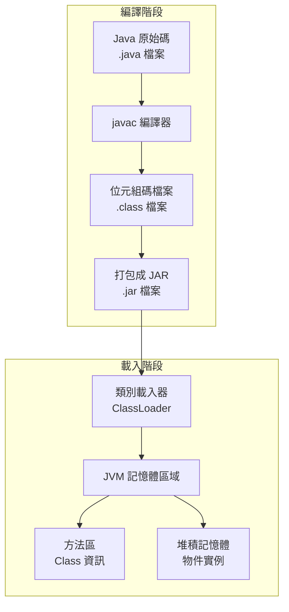
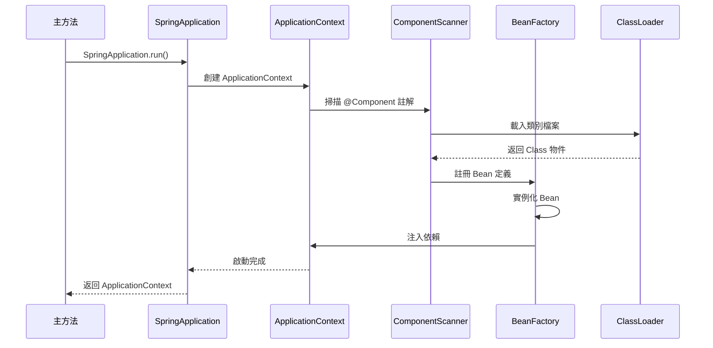

## 前言

Spring Boot 應用程式的啟動過程涉及複雜的程式碼載入、編譯轉換和物件實例化機制。本文將詳細分析從 Java 原始碼到執行期物件的完整轉換流程，幫助開發者深入理解 Spring Boot 的底層運作原理。

## Java 程式碼編譯與載入流程

### 編譯階段：從原始碼到位元組碼



### Java 編譯過程詳解

```java
/**
 * Java 編譯過程示例
 * 從原始碼到位元組碼的轉換
 */
public class CompilationProcessDemo {

    // 1. 原始碼階段：人類可讀的 Java 程式碼
    private static final String GREETING = "Hello Spring Boot";
    private final List<String> items = new ArrayList<>();

    public CompilationProcessDemo() {
        System.out.println("建構子被呼叫");
    }

    public void demonstrateMethod(String parameter) {
        // 2. 語法分析：編譯器檢查語法正確性
        String localVariable = "區域變數：" + parameter;

        // 3. 語意分析：型別檢查、變數範圍檢查
        items.add(localVariable);

        // 4. 程式碼生成：產生對應的位元組碼指令
        System.out.println(localVariable);
    }

    /*
     * 對應的位元組碼（簡化版）：
     *
     * public void demonstrateMethod(java.lang.String);
     *   Code:
     *      0: new           #7  // class java/lang/StringBuilder
     *      3: dup
     *      4: invokespecial #9  // Method java/lang/StringBuilder."<init>":()V
     *      7: ldc           #10 // String 區域變數：
     *      9: invokevirtual #12 // Method StringBuilder.append:(Ljava/lang/String;)
     *     12: aload_1
     *     13: invokevirtual #12 // Method StringBuilder.append:(Ljava/lang/String;)
     *     16: invokevirtual #16 // Method StringBuilder.toString:()Ljava/lang/String;
     *     19: astore_2
     *     20: aload_0
     *     21: getfield      #20 // Field items:Ljava/util/List;
     *     24: aload_2
     *     25: invokeinterface #22,  2 // InterfaceMethod List.add:(Ljava/lang/Object;)Z
     *     30: pop
     *     31: return
     */
}
```

### 類別載入器層次結構

```java
@Component
public class ClassLoaderAnalyzer {

    public void analyzeClassLoaderHierarchy() {
        // 1. 啟動類別載入器（Bootstrap ClassLoader）
        // 載入核心 Java 類別庫，由 C++ 實現
        System.out.println("=== 類別載入器層次結構分析 ===");

        Class<?> stringClass = String.class;
        System.out.println("String 類別載入器：" +
                          (stringClass.getClassLoader() == null ? "Bootstrap ClassLoader" :
                           stringClass.getClassLoader().getClass().getName()));

        // 2. 擴展類別載入器（Extension ClassLoader）
        // 載入 Java 擴展目錄中的類別
        Class<?> zipEntryClass = java.util.zip.ZipEntry.class;
        System.out.println("ZipEntry 類別載入器：" +
                          zipEntryClass.getClassLoader().getClass().getName());

        // 3. 應用程式類別載入器（Application ClassLoader）
        // 載入用戶類路徑上的類別
        Class<?> thisClass = this.getClass();
        System.out.println("當前類別載入器：" +
                          thisClass.getClassLoader().getClass().getName());

        // 4. 自訂類別載入器示例
        CustomClassLoader customLoader = new CustomClassLoader();
        System.out.println("自訂類別載入器：" +
                          customLoader.getClass().getName());

        // 展示雙親委派機制
        demonstrateParentDelegationModel();
    }

    private void demonstrateParentDelegationModel() {
        System.out.println("\n=== 雙親委派機制示例 ===");

        ClassLoader currentLoader = this.getClass().getClassLoader();
        int level = 0;

        while (currentLoader != null) {
            System.out.println("層次 " + level + ": " +
                              currentLoader.getClass().getName());
            currentLoader = currentLoader.getParent();
            level++;
        }

        System.out.println("層次 " + level + ": Bootstrap ClassLoader (null)");
    }

    // 自訂類別載入器實現
    public static class CustomClassLoader extends ClassLoader {

        public CustomClassLoader() {
            super(ClassLoaderAnalyzer.class.getClassLoader());
        }

        @Override
        protected Class<?> findClass(String name) throws ClassNotFoundException {
            System.out.println("自訂類別載入器載入類別：" + name);

            // 在實際應用中，這裡會從特定位置載入類別檔案
            // 例如：從網路、資料庫或加密檔案中載入

            return super.findClass(name);
        }

        @Override
        protected Class<?> loadClass(String name, boolean resolve)
                throws ClassNotFoundException {

            System.out.println("嘗試載入類別：" + name);

            // 1. 檢查類別是否已經載入
            Class<?> loadedClass = findLoadedClass(name);
            if (loadedClass != null) {
                System.out.println("類別已載入：" + name);
                return loadedClass;
            }

            // 2. 雙親委派：先嘗試讓父載入器載入
            if (!name.startsWith("com.example.custom")) {
                return super.loadClass(name, resolve);
            }

            // 3. 自訂載入邏輯（僅針對特定包名）
            try {
                return findClass(name);
            } catch (ClassNotFoundException e) {
                return super.loadClass(name, resolve);
            }
        }
    }
}
```

## Spring Boot 應用程式啟動流程

### Spring Boot 啟動序列圖



### Spring Boot 主要啟動流程

```java
@SpringBootApplication
public class SpringBootStartupAnalysis {

    private static final Logger log = LoggerFactory.getLogger(SpringBootStartupAnalysis.class);

    public static void main(String[] args) {
        // 1. 創建 SpringApplication 實例
        SpringApplication application = new SpringApplication(SpringBootStartupAnalysis.class);

        // 2. 設定啟動監聽器，監控啟動過程
        application.addListeners(new ApplicationStartupListener());

        // 3. 執行 Spring Boot 應用程式
        ConfigurableApplicationContext context = application.run(args);

        // 4. 分析啟動完成後的狀態
        analyzeApplicationContext(context);
    }

    private static void analyzeApplicationContext(ConfigurableApplicationContext context) {
        log.info("=== Spring Boot 應用程式啟動完成分析 ===");

        // 分析 Bean 工廠
        ConfigurableListableBeanFactory beanFactory = context.getBeanFactory();
        String[] beanNames = beanFactory.getBeanDefinitionNames();

        log.info("已註冊的 Bean 數量：{}", beanNames.length);

        // 分析不同類型的 Bean
        Map<String, Long> beanTypeCount = Arrays.stream(beanNames)
            .collect(Collectors.groupingBy(
                beanName -> {
                    try {
                        Class<?> beanType = beanFactory.getType(beanName);
                        return beanType != null ? beanType.getPackage().getName() : "unknown";
                    } catch (Exception e) {
                        return "error";
                    }
                },
                Collectors.counting()
            ));

        log.info("Bean 類型分布：");
        beanTypeCount.entrySet().stream()
            .sorted(Map.Entry.<String, Long>comparingByValue().reversed())
            .limit(10)
            .forEach(entry -> log.info("  {}: {} 個", entry.getKey(), entry.getValue()));
    }

    // 自訂啟動監聽器
    public static class ApplicationStartupListener implements ApplicationListener<ApplicationEvent> {

        @Override
        public void onApplicationEvent(ApplicationEvent event) {
            if (event instanceof ApplicationStartingEvent) {
                log.info("應用程式開始啟動...");
            } else if (event instanceof ApplicationEnvironmentPreparedEvent) {
                log.info("環境準備完成");
            } else if (event instanceof ApplicationContextInitializedEvent) {
                log.info("ApplicationContext 初始化完成");
            } else if (event instanceof ApplicationPreparedEvent) {
                log.info("應用程式準備完成，開始載入 Bean");
            } else if (event instanceof ApplicationStartedEvent) {
                log.info("應用程式啟動完成");
            } else if (event instanceof ApplicationReadyEvent) {
                log.info("應用程式就緒，可接受請求");
            }
        }
    }
}
```

### Bean 生命週期與實例化過程

```java
@Component
public class BeanLifecycleDemo implements BeanNameAware, ApplicationContextAware,
        InitializingBean, DisposableBean {

    private static final Logger log = LoggerFactory.getLogger(BeanLifecycleDemo.class);

    private String beanName;
    private ApplicationContext applicationContext;

    // 1. 建構子：物件實例化
    public BeanLifecycleDemo() {
        log.info("1. 建構子被呼叫：物件實例化");
    }

    // 2. 設定屬性值（依賴注入）
    @Autowired
    private Environment environment;

    @Value("${server.port:8080}")
    private int serverPort;

    @PostConstruct
    public void postConstruct() {
        log.info("2. @PostConstruct 註解方法被呼叫");
        log.info("   伺服器埠號：{}", serverPort);
    }

    // 3. BeanNameAware 介面
    @Override
    public void setBeanName(String name) {
        this.beanName = name;
        log.info("3. BeanNameAware.setBeanName() 被呼叫，Bean 名稱：{}", name);
    }

    // 4. ApplicationContextAware 介面
    @Override
    public void setApplicationContext(ApplicationContext applicationContext) throws BeansException {
        this.applicationContext = applicationContext;
        log.info("4. ApplicationContextAware.setApplicationContext() 被呼叫");
    }

    // 5. InitializingBean 介面
    @Override
    public void afterPropertiesSet() throws Exception {
        log.info("5. InitializingBean.afterPropertiesSet() 被呼叫");
        log.info("   檢查所有屬性是否設定完成");
    }

    // 6. @Bean 方法的 initMethod（如果有的話）
    public void customInitMethod() {
        log.info("6. 自訂初始化方法被呼叫");
    }

    // 7. Bean 可以正常使用
    public void doBusinessLogic() {
        log.info("7. Bean 已準備就緒，可執行業務邏輯");
        log.info("   ApplicationContext 中的 Bean 數量：{}",
                applicationContext.getBeanDefinitionNames().length);
    }

    // 8. @PreDestroy 註解方法
    @PreDestroy
    public void preDestroy() {
        log.info("8. @PreDestroy 註解方法被呼叫");
    }

    // 9. DisposableBean 介面
    @Override
    public void destroy() throws Exception {
        log.info("9. DisposableBean.destroy() 被呼叫");
    }

    // 10. @Bean 方法的 destroyMethod（如果有的話）
    public void customDestroyMethod() {
        log.info("10. 自訂銷毀方法被呼叫");
    }
}
```

### Spring Boot 自動配置機制

```java
@Configuration
@EnableAutoConfiguration
public class AutoConfigurationAnalyzer {

    private static final Logger log = LoggerFactory.getLogger(AutoConfigurationAnalyzer.class);

    @Bean
    public CommandLineRunner analyzeAutoConfiguration(ApplicationContext context) {
        return args -> {
            log.info("=== Spring Boot 自動配置分析 ===");

            // 1. 分析自動配置類別
            analyzeAutoConfigurationClasses(context);

            // 2. 分析條件註解
            analyzeConditionalAnnotations(context);

            // 3. 分析配置屬性
            analyzeConfigurationProperties(context);
        };
    }

    private void analyzeAutoConfigurationClasses(ApplicationContext context) {
        log.info("分析自動配置類別...");

        // 獲取所有自動配置類別
        String[] beanNames = context.getBeanDefinitionNames();
        List<String> autoConfigClasses = Arrays.stream(beanNames)
            .filter(name -> {
                try {
                    Class<?> beanClass = context.getType(name);
                    return beanClass != null &&
                           beanClass.getName().contains("AutoConfiguration");
                } catch (Exception e) {
                    return false;
                }
            })
            .collect(Collectors.toList());

        log.info("發現 {} 個自動配置類別", autoConfigClasses.size());
        autoConfigClasses.stream()
            .limit(10) // 顯示前 10 個
            .forEach(className -> log.info("  - {}", className));
    }

    private void analyzeConditionalAnnotations(ApplicationContext context) {
        log.info("分析條件註解...");

        // 這裡可以實作條件註解的分析邏輯
        // 例如分析 @ConditionalOnClass, @ConditionalOnMissingBean 等
    }

    private void analyzeConfigurationProperties(ApplicationContext context) {
        log.info("分析配置屬性...");

        try {
            // 獲取環境物件
            Environment environment = context.getEnvironment();

            if (environment instanceof ConfigurableEnvironment) {
                ConfigurableEnvironment configurableEnv = (ConfigurableEnvironment) environment;

                log.info("作用中的 Profile：{}",
                        Arrays.toString(configurableEnv.getActiveProfiles()));

                // 分析屬性來源
                MutablePropertySources propertySources = configurableEnv.getPropertySources();
                log.info("屬性來源數量：{}", propertySources.size());

                propertySources.forEach(propertySource ->
                    log.info("  - {} ({})", propertySource.getName(),
                            propertySource.getClass().getSimpleName())
                );
            }
        } catch (Exception e) {
            log.error("分析配置屬性時發生錯誤", e);
        }
    }
}
```

## 依賴注入與物件實例化

### 依賴注入類型與實現

```java
@Service
public class DependencyInjectionDemo {

    private static final Logger log = LoggerFactory.getLogger(DependencyInjectionDemo.class);

    // 1. 建構子注入（推薦方式）
    private final UserService userService;
    private final EmailService emailService;

    public DependencyInjectionDemo(UserService userService, EmailService emailService) {
        this.userService = userService;
        this.emailService = emailService;
        log.info("建構子注入完成");
    }

    // 2. Setter 注入
    private NotificationService notificationService;

    @Autowired
    public void setNotificationService(NotificationService notificationService) {
        this.notificationService = notificationService;
        log.info("Setter 注入：NotificationService");
    }

    // 3. 欄位注入（不推薦）
    @Autowired
    private CacheService cacheService;

    // 4. 方法注入
    private AuditService auditService;
    private LoggingService loggingService;

    @Autowired
    public void configureServices(AuditService auditService, LoggingService loggingService) {
        this.auditService = auditService;
        this.loggingService = loggingService;
        log.info("方法注入：AuditService, LoggingService");
    }

    // 5. 條件性注入
    @Autowired(required = false)
    private Optional<MetricsService> metricsService;

    // 6. 集合注入
    @Autowired
    private List<MessageProcessor> messageProcessors;

    @Autowired
    private Map<String, PaymentProcessor> paymentProcessors;

    public void demonstrateInjection() {
        log.info("=== 依賴注入示例 ===");

        // 展示各種注入的服務
        log.info("UserService：{}", userService != null ? "已注入" : "未注入");
        log.info("EmailService：{}", emailService != null ? "已注入" : "未注入");
        log.info("NotificationService：{}", notificationService != null ? "已注入" : "未注入");
        log.info("CacheService：{}", cacheService != null ? "已注入" : "未注入");
        log.info("AuditService：{}", auditService != null ? "已注入" : "未注入");
        log.info("LoggingService：{}", loggingService != null ? "已注入" : "未注入");

        // 條件性注入檢查
        log.info("MetricsService：{}", metricsService.isPresent() ? "已注入" : "未注入");

        // 集合注入檢查
        log.info("MessageProcessor 數量：{}", messageProcessors.size());
        messageProcessors.forEach(processor ->
            log.info("  - {}", processor.getClass().getSimpleName())
        );

        log.info("PaymentProcessor 數量：{}", paymentProcessors.size());
        paymentProcessors.forEach((name, processor) ->
            log.info("  - {}: {}", name, processor.getClass().getSimpleName())
        );
    }

    // 服務介面定義
    public interface UserService { }
    public interface EmailService { }
    public interface NotificationService { }
    public interface CacheService { }
    public interface AuditService { }
    public interface LoggingService { }
    public interface MetricsService { }
    public interface MessageProcessor { }
    public interface PaymentProcessor { }
}

// 服務實現類別
@Service
class UserServiceImpl implements DependencyInjectionDemo.UserService {
    private static final Logger log = LoggerFactory.getLogger(UserServiceImpl.class);

    public UserServiceImpl() {
        log.info("UserServiceImpl 實例化");
    }
}

@Service
class EmailServiceImpl implements DependencyInjectionDemo.EmailService {
    private static final Logger log = LoggerFactory.getLogger(EmailServiceImpl.class);

    public EmailServiceImpl() {
        log.info("EmailServiceImpl 實例化");
    }
}

@Service
class NotificationServiceImpl implements DependencyInjectionDemo.NotificationService {
    private static final Logger log = LoggerFactory.getLogger(NotificationServiceImpl.class);

    public NotificationServiceImpl() {
        log.info("NotificationServiceImpl 實例化");
    }
}
```

### Bean 作用域與生命週期管理

```java
@Configuration
public class BeanScopeConfiguration {

    private static final Logger log = LoggerFactory.getLogger(BeanScopeConfiguration.class);

    // 1. Singleton 作用域（預設）
    @Bean
    @Scope(ConfigurableBeanFactory.SCOPE_SINGLETON)
    public SingletonService singletonService() {
        log.info("創建 SingletonService 實例");
        return new SingletonService();
    }

    // 2. Prototype 作用域
    @Bean
    @Scope(ConfigurableBeanFactory.SCOPE_PROTOTYPE)
    public PrototypeService prototypeService() {
        log.info("創建 PrototypeService 實例");
        return new PrototypeService();
    }

    // 3. Request 作用域（Web 應用程式）
    @Bean
    @Scope(WebApplicationContext.SCOPE_REQUEST)
    public RequestScopeService requestScopeService() {
        log.info("創建 RequestScopeService 實例");
        return new RequestScopeService();
    }

    // 4. Session 作用域（Web 應用程式）
    @Bean
    @Scope(WebApplicationContext.SCOPE_SESSION)
    public SessionScopeService sessionScopeService() {
        log.info("創建 SessionScopeService 實例");
        return new SessionScopeService();
    }

    // 5. Application 作用域（Web 應用程式）
    @Bean
    @Scope(WebApplicationContext.SCOPE_APPLICATION)
    public ApplicationScopeService applicationScopeService() {
        log.info("創建 ApplicationScopeService 實例");
        return new ApplicationScopeService();
    }

    // 6. 自訂作用域
    @Bean
    @Scope("customScope")
    public CustomScopeService customScopeService() {
        log.info("創建 CustomScopeService 實例");
        return new CustomScopeService();
    }

    // 服務類別定義
    public static class SingletonService {
        private final String instanceId = UUID.randomUUID().toString();

        public String getInstanceId() { return instanceId; }
    }

    public static class PrototypeService {
        private final String instanceId = UUID.randomUUID().toString();
        private final LocalDateTime createTime = LocalDateTime.now();

        public String getInstanceId() { return instanceId; }
        public LocalDateTime getCreateTime() { return createTime; }
    }

    public static class RequestScopeService {
        private final String requestId = UUID.randomUUID().toString();

        public String getRequestId() { return requestId; }
    }

    public static class SessionScopeService {
        private final String sessionId = UUID.randomUUID().toString();

        public String getSessionId() { return sessionId; }
    }

    public static class ApplicationScopeService {
        private final String applicationId = UUID.randomUUID().toString();

        public String getApplicationId() { return applicationId; }
    }

    public static class CustomScopeService {
        private final String customId = UUID.randomUUID().toString();

        public String getCustomId() { return customId; }
    }
}

// Bean 作用域測試控制器
@RestController
@RequestMapping("/api/scope")
public class BeanScopeTestController {

    private final ApplicationContext applicationContext;

    public BeanScopeTestController(ApplicationContext applicationContext) {
        this.applicationContext = applicationContext;
    }

    @GetMapping("/test")
    public ResponseEntity<Map<String, Object>> testBeanScopes() {
        Map<String, Object> result = new HashMap<>();

        // 測試 Singleton 作用域
        BeanScopeConfiguration.SingletonService singleton1 =
            applicationContext.getBean(BeanScopeConfiguration.SingletonService.class);
        BeanScopeConfiguration.SingletonService singleton2 =
            applicationContext.getBean(BeanScopeConfiguration.SingletonService.class);

        result.put("singleton1_id", singleton1.getInstanceId());
        result.put("singleton2_id", singleton2.getInstanceId());
        result.put("singleton_same_instance", singleton1 == singleton2);

        // 測試 Prototype 作用域
        BeanScopeConfiguration.PrototypeService prototype1 =
            applicationContext.getBean(BeanScopeConfiguration.PrototypeService.class);
        BeanScopeConfiguration.PrototypeService prototype2 =
            applicationContext.getBean(BeanScopeConfiguration.PrototypeService.class);

        result.put("prototype1_id", prototype1.getInstanceId());
        result.put("prototype2_id", prototype2.getInstanceId());
        result.put("prototype_same_instance", prototype1 == prototype2);

        return ResponseEntity.ok(result);
    }
}
```

## 記憶體中的物件組織

### Spring Boot 應用程式記憶體佈局

```java
@Component
public class MemoryLayoutAnalyzer {

    private static final Logger log = LoggerFactory.getLogger(MemoryLayoutAnalyzer.class);

    @Autowired
    private ApplicationContext applicationContext;

    @EventListener(ApplicationReadyEvent.class)
    public void analyzeMemoryLayout() {
        log.info("=== Spring Boot 應用程式記憶體佈局分析 ===");

        // 1. 分析 ApplicationContext 記憶體佔用
        analyzeApplicationContextMemory();

        // 2. 分析 Bean 實例記憶體分佈
        analyzeBeanInstanceMemory();

        // 3. 分析類別載入器記憶體
        analyzeClassLoaderMemory();

        // 4. 分析字串常數池
        analyzeStringPool();
    }

    private void analyzeApplicationContextMemory() {
        log.info("分析 ApplicationContext 記憶體佔用...");

        if (applicationContext instanceof ConfigurableApplicationContext) {
            ConfigurableApplicationContext configurableContext =
                (ConfigurableApplicationContext) applicationContext;

            ConfigurableListableBeanFactory beanFactory = configurableContext.getBeanFactory();
            String[] beanNames = beanFactory.getBeanDefinitionNames();

            log.info("Bean 定義數量：{}", beanNames.length);

            // 分析 Bean 定義記憶體佔用（估算）
            int avgBeanDefinitionSize = 1024; // 假設每個 Bean 定義平均佔用 1KB
            long estimatedBeanDefinitionMemory = beanNames.length * avgBeanDefinitionSize;

            log.info("估算 Bean 定義記憶體佔用：{} KB",
                    estimatedBeanDefinitionMemory / 1024);
        }
    }

    private void analyzeBeanInstanceMemory() {
        log.info("分析 Bean 實例記憶體分佈...");

        String[] beanNames = applicationContext.getBeanDefinitionNames();
        Map<String, Integer> packageBeanCount = new HashMap<>();

        for (String beanName : beanNames) {
            try {
                Class<?> beanType = applicationContext.getType(beanName);
                if (beanType != null) {
                    String packageName = beanType.getPackage() != null ?
                        beanType.getPackage().getName() : "default";

                    packageBeanCount.merge(packageName, 1, Integer::sum);

                    // 分析特定 Bean 的記憶體位置
                    Object bean = applicationContext.getBean(beanName);
                    int identityHashCode = System.identityHashCode(bean);

                    if (beanName.contains("Controller") || beanName.contains("Service")) {
                        log.debug("Bean: {}, 類型: {}, 記憶體位置: {}",
                                beanName, beanType.getSimpleName(), identityHashCode);
                    }
                }
            } catch (Exception e) {
                // 忽略無法獲取的 Bean
            }
        }

        // 顯示 Bean 套件分佈
        log.info("Bean 套件分佈：");
        packageBeanCount.entrySet().stream()
            .sorted(Map.Entry.<String, Integer>comparingByValue().reversed())
            .limit(10)
            .forEach(entry ->
                log.info("  {}: {} 個", entry.getKey(), entry.getValue())
            );
    }

    private void analyzeClassLoaderMemory() {
        log.info("分析類別載入器記憶體...");

        ClassLoader classLoader = this.getClass().getClassLoader();
        log.info("目前類別載入器：{}", classLoader.getClass().getName());

        // 嘗試獲取載入的類別數量（這在不同 JVM 實作中可能不同）
        try {
            if (classLoader instanceof URLClassLoader) {
                URLClassLoader urlClassLoader = (URLClassLoader) classLoader;
                URL[] urls = urlClassLoader.getURLs();
                log.info("類別載入路徑數量：{}", urls.length);

                for (URL url : urls) {
                    log.debug("類別載入路徑：{}", url.toString());
                }
            }
        } catch (Exception e) {
            log.debug("無法分析類別載入器詳細資訊：{}", e.getMessage());
        }
    }

    private void analyzeStringPool() {
        log.info("分析字串常數池...");

        // 演示字串常數池的作用
        String literal1 = "Spring Boot 應用程式";
        String literal2 = "Spring Boot 應用程式";
        String constructed = new String("Spring Boot 應用程式");

        log.info("字串字面量 1 記憶體位置：{}", System.identityHashCode(literal1));
        log.info("字串字面量 2 記憶體位置：{}", System.identityHashCode(literal2));
        log.info("建構字串記憶體位置：{}", System.identityHashCode(constructed));
        log.info("字串字面量是否相同實例：{}", literal1 == literal2);
        log.info("字面量與建構字串是否相同實例：{}", literal1 == constructed);

        // intern() 方法示例
        String interned = constructed.intern();
        log.info("intern() 後的字串記憶體位置：{}", System.identityHashCode(interned));
        log.info("intern() 字串與字面量是否相同實例：{}", literal1 == interned);
    }
}
```

### 物件引用關係與記憶體管理

```java
@Service
public class ObjectReferenceManager {

    private static final Logger log = LoggerFactory.getLogger(ObjectReferenceManager.class);

    // 強引用：正常的物件引用，防止 GC
    private final List<User> activeUsers = new ArrayList<>();

    // 軟引用：記憶體不足時可能被 GC
    private final Map<String, SoftReference<User>> cachedUsers = new ConcurrentHashMap<>();

    // 弱引用：下次 GC 時會被回收
    private final Map<String, WeakReference<User>> temporaryUsers = new ConcurrentHashMap<>();

    // 虛引用：用於追蹤物件被 GC 的時機
    private final ReferenceQueue<User> userGCQueue = new ReferenceQueue<>();
    private final Map<String, PhantomReference<User>> phantomUsers = new ConcurrentHashMap<>();

    public void demonstrateReferenceTypes() {
        log.info("=== 物件引用類型示例 ===");

        User user = new User("張三", "zhang@example.com");

        // 1. 強引用
        activeUsers.add(user);
        log.info("添加強引用，使用者：{}", user.getName());

        // 2. 軟引用
        String userId = user.getId();
        cachedUsers.put(userId, new SoftReference<>(user));
        log.info("添加軟引用，使用者 ID：{}", userId);

        // 3. 弱引用
        temporaryUsers.put(userId, new WeakReference<>(user));
        log.info("添加弱引用，使用者 ID：{}", userId);

        // 4. 虛引用
        phantomUsers.put(userId, new PhantomReference<>(user, userGCQueue));
        log.info("添加虛引用，使用者 ID：{}", userId);

        // 測試引用的行為
        testReferencesBehavior(userId);
    }

    private void testReferencesBehavior(String userId) {
        log.info("測試引用行為...");

        // 檢查各種引用是否還有效
        log.info("強引用數量：{}", activeUsers.size());

        SoftReference<User> softRef = cachedUsers.get(userId);
        log.info("軟引用是否有效：{}", softRef != null && softRef.get() != null);

        WeakReference<User> weakRef = temporaryUsers.get(userId);
        log.info("弱引用是否有效：{}", weakRef != null && weakRef.get() != null);

        // 強制 GC 測試弱引用
        log.info("執行垃圾回收...");
        System.gc();

        try {
            Thread.sleep(100); // 等待 GC 完成
        } catch (InterruptedException e) {
            Thread.currentThread().interrupt();
        }

        log.info("GC 後軟引用是否有效：{}", softRef != null && softRef.get() != null);
        log.info("GC 後弱引用是否有效：{}", weakRef != null && weakRef.get() != null);

        // 檢查虛引用佇列
        checkPhantomReferenceQueue();
    }

    private void checkPhantomReferenceQueue() {
        Reference<? extends User> phantomRef;
        while ((phantomRef = userGCQueue.poll()) != null) {
            log.info("檢測到物件被 GC：虛引用 {}", phantomRef);
            // 在這裡可以執行清理工作
        }
    }

    @Scheduled(fixedRate = 30000) // 每 30 秒執行一次
    public void cleanupWeakReferences() {
        // 清理無效的弱引用
        temporaryUsers.entrySet().removeIf(entry -> {
            WeakReference<User> ref = entry.getValue();
            if (ref.get() == null) {
                log.debug("清理無效的弱引用：{}", entry.getKey());
                return true;
            }
            return false;
        });

        // 清理無效的軟引用
        cachedUsers.entrySet().removeIf(entry -> {
            SoftReference<User> ref = entry.getValue();
            if (ref.get() == null) {
                log.debug("清理無效的軟引用：{}", entry.getKey());
                return true;
            }
            return false;
        });

        log.info("引用清理完成，當前狀態 - 軟引用：{}，弱引用：{}",
                cachedUsers.size(), temporaryUsers.size());
    }

    // 使用者實體類別
    public static class User {
        private final String id;
        private final String name;
        private final String email;
        private final LocalDateTime createTime;

        public User(String name, String email) {
            this.id = UUID.randomUUID().toString();
            this.name = name;
            this.email = email;
            this.createTime = LocalDateTime.now();
        }

        // Getter 方法
        public String getId() { return id; }
        public String getName() { return name; }
        public String getEmail() { return email; }
        public LocalDateTime getCreateTime() { return createTime; }

        @Override
        public String toString() {
            return String.format("User{id='%s', name='%s', email='%s'}",
                               id, name, email);
        }

        @Override
        protected void finalize() throws Throwable {
            super.finalize();
            System.out.println("User 物件被 GC：" + this.name);
        }
    }
}
```

## 效能監控與分析

### Spring Boot 應用程式記憶體監控

```java
@RestController
@RequestMapping("/api/memory")
public class MemoryMonitoringController {

    private static final Logger log = LoggerFactory.getLogger(MemoryMonitoringController.class);

    @Autowired
    private ApplicationContext applicationContext;

    @GetMapping("/spring-context")
    public ResponseEntity<SpringContextMemoryInfo> getSpringContextMemoryInfo() {

        long startTime = System.nanoTime();

        // 分析 Spring Context 記憶體使用
        ConfigurableListableBeanFactory beanFactory =
            ((ConfigurableApplicationContext) applicationContext).getBeanFactory();

        String[] beanNames = beanFactory.getBeanDefinitionNames();
        int singletonCount = 0;
        int prototypeCount = 0;
        Map<String, Integer> scopeCount = new HashMap<>();

        for (String beanName : beanNames) {
            try {
                BeanDefinition beanDefinition = beanFactory.getBeanDefinition(beanName);
                String scope = beanDefinition.getScope();

                if (scope.isEmpty() || BeanDefinition.SCOPE_SINGLETON.equals(scope)) {
                    singletonCount++;
                } else if (BeanDefinition.SCOPE_PROTOTYPE.equals(scope)) {
                    prototypeCount++;
                }

                scopeCount.merge(scope.isEmpty() ? "singleton" : scope, 1, Integer::sum);

            } catch (Exception e) {
                // 忽略無法獲取定義的 Bean
            }
        }

        long analysisTime = System.nanoTime() - startTime;

        SpringContextMemoryInfo info = SpringContextMemoryInfo.builder()
            .totalBeans(beanNames.length)
            .singletonBeans(singletonCount)
            .prototypeBeans(prototypeCount)
            .scopeDistribution(scopeCount)
            .analysisTimeNanos(analysisTime)
            .timestamp(LocalDateTime.now())
            .build();

        return ResponseEntity.ok(info);
    }

    @GetMapping("/class-loading")
    public ResponseEntity<ClassLoadingInfo> getClassLoadingInfo() {

        ClassLoadingMXBean classLoadingBean = ManagementFactory.getClassLoadingMXBean();

        ClassLoadingInfo info = ClassLoadingInfo.builder()
            .loadedClassCount(classLoadingBean.getLoadedClassCount())
            .totalLoadedClassCount(classLoadingBean.getTotalLoadedClassCount())
            .unloadedClassCount(classLoadingBean.getUnloadedClassCount())
            .verbose(classLoadingBean.isVerbose())
            .build();

        return ResponseEntity.ok(info);
    }

    @GetMapping("/object-statistics")
    public ResponseEntity<ObjectStatistics> getObjectStatistics() {

        Runtime runtime = Runtime.getRuntime();
        MemoryMXBean memoryBean = ManagementFactory.getMemoryMXBean();

        // 執行 GC 前後的記憶體使用情況
        long beforeGC = runtime.totalMemory() - runtime.freeMemory();

        // 建議 GC（實際執行由 JVM 決定）
        runtime.gc();

        try {
            Thread.sleep(100); // 等待 GC 完成
        } catch (InterruptedException e) {
            Thread.currentThread().interrupt();
        }

        long afterGC = runtime.totalMemory() - runtime.freeMemory();

        // 堆積記憶體詳細資訊
        MemoryUsage heapUsage = memoryBean.getHeapMemoryUsage();
        MemoryUsage nonHeapUsage = memoryBean.getNonHeapMemoryUsage();

        ObjectStatistics stats = ObjectStatistics.builder()
            .heapUsed(heapUsage.getUsed())
            .heapCommitted(heapUsage.getCommitted())
            .heapMax(heapUsage.getMax())
            .nonHeapUsed(nonHeapUsage.getUsed())
            .nonHeapCommitted(nonHeapUsage.getCommitted())
            .nonHeapMax(nonHeapUsage.getMax())
            .memoryBeforeGC(beforeGC)
            .memoryAfterGC(afterGC)
            .memoryFreedByGC(beforeGC - afterGC)
            .build();

        return ResponseEntity.ok(stats);
    }

    // 響應物件定義
    @Builder
    @Data
    public static class SpringContextMemoryInfo {
        private int totalBeans;
        private int singletonBeans;
        private int prototypeBeans;
        private Map<String, Integer> scopeDistribution;
        private long analysisTimeNanos;
        private LocalDateTime timestamp;
    }

    @Builder
    @Data
    public static class ClassLoadingInfo {
        private int loadedClassCount;
        private long totalLoadedClassCount;
        private long unloadedClassCount;
        private boolean verbose;
    }

    @Builder
    @Data
    public static class ObjectStatistics {
        private long heapUsed;
        private long heapCommitted;
        private long heapMax;
        private long nonHeapUsed;
        private long nonHeapCommitted;
        private long nonHeapMax;
        private long memoryBeforeGC;
        private long memoryAfterGC;
        private long memoryFreedByGC;
    }
}
```

## 總結

Spring Boot 應用程式的程式碼載入與物件實例化是一個複雜而精密的過程，涉及多個層面：

### 關鍵流程總結

1. **編譯階段**：Java 原始碼 → 位元組碼 → JAR 檔案
2. **載入階段**：類別載入器層次結構與雙親委派機制
3. **實例化階段**：Spring Bean 生命週期與依賴注入
4. **記憶體管理**：物件在堆積記憶體中的組織與引用關係

### 效能最佳化建議

- **類別載入最佳化**：減少不必要的類別載入，使用懶載入策略
- **Bean 作用域選擇**：根據需求選擇適當的 Bean 作用域
- **記憶體引用管理**：合理使用軟引用、弱引用避免記憶體洩漏
- **監控與分析**：定期監控應用程式記憶體使用情況

### 開發最佳實踐

- 優先使用建構子注入而非欄位注入
- 適當使用 `@Lazy` 註解延遲 Bean 初始化
- 避免循環依賴，設計清晰的依賴關係
- 實作適當的生命週期回調方法

透過深入理解這些機制，開發者能夠構建更高效、更穩定的 Spring Boot 應用程式。