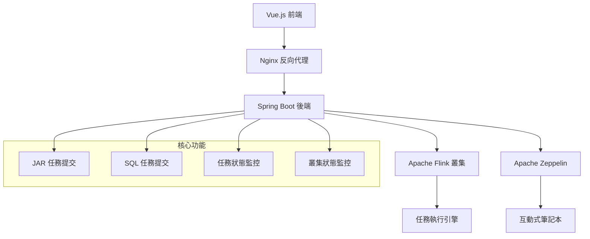

## 🎯 專案概述

**SpringDataPlatform** 是一個功能完整的企業級大數據平台，專為 Apache Flink 任務管理而設計。這個全端專案整合了現代化的 Web 技術棧，提供直觀的使用者介面來管理和監控分散式數據處理工作流程。

### 🏗️ 系統架構



## 🛠️ 技術架構

### **前端技術棧**
- **框架**：Vue.js 2.x
- **路由**：Vue Router
- **HTTP 客戶端**：Axios
- **UI 增強**：SweetAlert2
- **語法高亮**：Highlight.js
- **建構工具**：Vue CLI

### **後端技術棧**
- **主框架**：Spring Boot
- **數據處理**：Apache Flink
- **互動式分析**：Apache Zeppelin
- **容器化**：Docker + Docker Compose
- **反向代理**：Nginx

## 🚀 核心功能特色

### 1️⃣ **多種任務提交方式**

#### JAR 檔案提交
```bash
# 透過 REST API 上傳和執行 JAR 檔案
POST /api/flink/jobs/submit-jar
Content-Type: multipart/form-data

{
  "jarFile": "your-flink-job.jar",
  "mainClass": "com.example.FlinkJob",
  "programArgs": "--input /data/input --output /data/output"
}
```

#### SQL 任務提交
```sql
-- 透過平台直接提交 Flink SQL
CREATE TABLE source_table (
    id INT,
    name STRING,
    timestamp_col TIMESTAMP(3)
) WITH (
    'connector' = 'kafka',
    'topic' = 'input-topic',
    'properties.bootstrap.servers' = 'kafka:9092'
);

INSERT INTO sink_table
SELECT id, UPPER(name), timestamp_col
FROM source_table
WHERE id > 1000;
```

### 2️⃣ **即時監控儀表板**

```javascript
// Vue.js 監控組件核心邏輯
export default {
  data() {
    return {
      jobs: [],
      clusterStatus: {},
      monitoring: true
    }
  },
  methods: {
    async fetchJobStatus() {
      try {
        const response = await this.$axios.get('/api/flink/jobs');
        this.jobs = response.data;
        this.updateJobMetrics();
      } catch (error) {
        this.$swal('錯誤', '無法獲取任務狀態', 'error');
      }
    },
    
    updateJobMetrics() {
      this.jobs.forEach(job => {
        // 即時更新任務指標
        this.fetchJobMetrics(job.id);
      });
    },
    
    startMonitoring() {
      this.monitoringInterval = setInterval(() => {
        this.fetchJobStatus();
      }, 5000); // 每5秒更新一次
    }
  }
}
```

### 3️⃣ **互動式數據探索**

整合 **Apache Zeppelin** 提供 Jupyter-like 的互動式數據分析環境：

```scala
// Zeppelin 筆記本中的 Flink 程式碼範例
%flink.ssql

// 建立實時數據流
val env = StreamExecutionEnvironment.getExecutionEnvironment
val dataStream = env
  .socketTextStream("localhost", 9999)
  .flatMap(_.toLowerCase.split("\\W+"))
  .filter(_.nonEmpty)
  .map((_, 1))
  .keyBy(0)
  .timeWindow(Time.seconds(10))
  .sum(1)

dataStream.print()
env.execute("Real-time Word Count")
```

## 🔧 系統部署與配置

### **Docker 容器化部署**

```yaml
# docker-compose.yml 核心配置
version: '3.8'

services:
  # 前端 Vue.js 應用
  frontend:
    build: 
      context: ./frontend/data-platform-ui
    ports:
      - "8080:8080"
    depends_on:
      - backend
    networks:
      - data-platform

  # 後端 Spring Boot API
  backend:
    build:
      context: ./backend/DataPlatform
    ports:
      - "9999:9999"
    environment:
      - FLINK_JOBMANAGER_URL=http://flink-jobmanager:8081
      - ZEPPELIN_URL=http://zeppelin:8082
    depends_on:
      - flink-jobmanager
      - zeppelin
    networks:
      - data-platform

  # Apache Flink JobManager
  flink-jobmanager:
    image: flink:1.15.2-scala_2.12
    ports:
      - "8081:8081"
    command: jobmanager
    environment:
      - |
        FLINK_PROPERTIES=
        jobmanager.rpc.address: flink-jobmanager
        parallelism.default: 2        
    networks:
      - data-platform

  # Apache Flink TaskManager
  flink-taskmanager:
    image: flink:1.15.2-scala_2.12
    depends_on:
      - flink-jobmanager
    command: taskmanager
    scale: 2
    environment:
      - |
        FLINK_PROPERTIES=
        jobmanager.rpc.address: flink-jobmanager
        taskmanager.numberOfTaskSlots: 2
        parallelism.default: 2
    networks:
      - data-platform

  # Apache Zeppelin
  zeppelin:
    image: apache/zeppelin:0.10.1
    ports:
      - "8082:8080"
    volumes:
      - ./zeppelin/notebook:/opt/zeppelin/notebook
      - ./zeppelin/conf:/opt/zeppelin/conf
    networks:
      - data-platform

networks:
  data-platform:
    driver: bridge
```

### **快速啟動指令**

```bash
# 標準部署
docker-compose up -d

# 重新建構並啟動
docker-compose up --build

# MacBook M1 專用版本
docker-compose -f docker-compose-m1.yml up -d

# 查看服務狀態
docker-compose ps

# 查看日誌
docker-compose logs -f backend
```

## 📊 REST API 設計

### **任務管理 API**

```java
@RestController
@RequestMapping("/api/flink")
public class FlinkJobController {
    
    @PostMapping("/jobs/submit-jar")
    public ResponseEntity<JobSubmitResult> submitJarJob(
            @RequestParam("file") MultipartFile jarFile,
            @RequestParam("mainClass") String mainClass,
            @RequestParam(value = "args", required = false) String programArgs) {
        
        try {
            // 儲存上傳的 JAR 檔案
            String jarPath = saveUploadedFile(jarFile);
            
            // 提交任務到 Flink 叢集
            JobSubmitResult result = flinkService.submitJarJob(
                jarPath, mainClass, programArgs
            );
            
            return ResponseEntity.ok(result);
        } catch (Exception e) {
            return ResponseEntity.status(HttpStatus.INTERNAL_SERVER_ERROR)
                .body(new JobSubmitResult(false, e.getMessage()));
        }
    }
    
    @PostMapping("/jobs/submit-sql")
    public ResponseEntity<JobSubmitResult> submitSqlJob(
            @RequestBody SqlJobRequest request) {
        
        try {
            JobSubmitResult result = flinkService.submitSqlJob(request.getSql());
            return ResponseEntity.ok(result);
        } catch (Exception e) {
            return ResponseEntity.status(HttpStatus.INTERNAL_SERVER_ERROR)
                .body(new JobSubmitResult(false, e.getMessage()));
        }
    }
    
    @GetMapping("/jobs")
    public ResponseEntity<List<JobInfo>> getAllJobs() {
        List<JobInfo> jobs = flinkService.getAllJobs();
        return ResponseEntity.ok(jobs);
    }
    
    @GetMapping("/jobs/{jobId}/status")
    public ResponseEntity<JobStatus> getJobStatus(@PathVariable String jobId) {
        JobStatus status = flinkService.getJobStatus(jobId);
        return ResponseEntity.ok(status);
    }
    
    @DeleteMapping("/jobs/{jobId}")
    public ResponseEntity<Void> cancelJob(@PathVariable String jobId) {
        flinkService.cancelJob(jobId);
        return ResponseEntity.ok().build();
    }
}
```

### **叢集監控 API**

```java
@RestController
@RequestMapping("/api/cluster")
public class ClusterController {
    
    @GetMapping("/status")
    public ResponseEntity<ClusterStatus> getClusterStatus() {
        ClusterStatus status = clusterService.getClusterStatus();
        return ResponseEntity.ok(status);
    }
    
    @GetMapping("/metrics")
    public ResponseEntity<ClusterMetrics> getClusterMetrics() {
        ClusterMetrics metrics = clusterService.getClusterMetrics();
        return ResponseEntity.ok(metrics);
    }
    
    @GetMapping("/taskmanagers")
    public ResponseEntity<List<TaskManager>> getTaskManagers() {
        List<TaskManager> taskManagers = clusterService.getTaskManagers();
        return ResponseEntity.ok(taskManagers);
    }
}
```

## 🎨 前端介面設計

### **Vue.js 組件架構**

```javascript
// JobManagement.vue - 任務管理主組件
<template>
  <div class="job-management">
    <div class="toolbar">
      <el-button type="primary" @click="showSubmitDialog">
        <i class="el-icon-plus"></i>
        提交新任務
      </el-button>
      <el-button @click="refreshJobs">
        <i class="el-icon-refresh"></i>
        重新整理
      </el-button>
    </div>
    
    <el-table :data="jobs" v-loading="loading">
      <el-table-column prop="id" label="任務 ID" width="200"/>
      <el-table-column prop="name" label="任務名稱"/>
      <el-table-column prop="status" label="狀態">
        <template slot-scope="scope">
          <el-tag :type="getStatusType(scope.row.status)">
            {{ scope.row.status }}
          </el-tag>
        </template>
      </el-table-column>
      <el-table-column prop="startTime" label="開始時間"/>
      <el-table-column label="操作" width="200">
        <template slot-scope="scope">
          <el-button size="mini" @click="viewJob(scope.row)">
            查看
          </el-button>
          <el-button 
            size="mini" 
            type="danger" 
            @click="cancelJob(scope.row.id)">
            取消
          </el-button>
        </template>
      </el-table-column>
    </el-table>
  </div>
</template>

<script>
export default {
  name: 'JobManagement',
  data() {
    return {
      jobs: [],
      loading: false
    }
  },
  
  mounted() {
    this.fetchJobs();
    this.startPolling();
  },
  
  methods: {
    async fetchJobs() {
      this.loading = true;
      try {
        const response = await this.$http.get('/api/flink/jobs');
        this.jobs = response.data;
      } catch (error) {
        this.$message.error('獲取任務清單失敗');
      } finally {
        this.loading = false;
      }
    },
    
    startPolling() {
      setInterval(() => {
        this.fetchJobs();
      }, 5000);
    },
    
    getStatusType(status) {
      const statusMap = {
        'RUNNING': 'success',
        'FINISHED': 'info',
        'CANCELED': 'warning',
        'FAILED': 'danger'
      };
      return statusMap[status] || 'info';
    }
  }
}
</script>
```

## 🔍 核心業務邏輯

### **Flink 任務服務層**

```java
@Service
@Slf4j
public class FlinkJobService {
    
    private final RestTemplate restTemplate;
    private final FileStorageService fileStorageService;
    
    @Value("${flink.jobmanager.url}")
    private String flinkJobManagerUrl;
    
    public JobSubmitResult submitJarJob(String jarPath, String mainClass, String args) {
        try {
            // 準備任務提交請求
            MultiValueMap<String, Object> requestBody = new LinkedMultiValueMap<>();
            requestBody.add("jarfile", new FileSystemResource(jarPath));
            
            // 建構程式參數
            Map<String, Object> programArgs = new HashMap<>();
            programArgs.put("entry-class", mainClass);
            if (StringUtils.hasText(args)) {
                programArgs.put("program-args", args);
            }
            requestBody.add("programArgs", objectMapper.writeValueAsString(programArgs));
            
            // 提交任務到 Flink
            HttpHeaders headers = new HttpHeaders();
            headers.setContentType(MediaType.MULTIPART_FORM_DATA);
            
            HttpEntity<MultiValueMap<String, Object>> requestEntity = 
                new HttpEntity<>(requestBody, headers);
            
            ResponseEntity<FlinkJobSubmitResponse> response = restTemplate.exchange(
                flinkJobManagerUrl + "/jars/upload",
                HttpMethod.POST,
                requestEntity,
                FlinkJobSubmitResponse.class
            );
            
            if (response.getStatusCode() == HttpStatus.OK) {
                String jobId = response.getBody().getJobId();
                log.info("Successfully submitted job: {}", jobId);
                return new JobSubmitResult(true, jobId, "任務提交成功");
            } else {
                return new JobSubmitResult(false, null, "任務提交失敗");
            }
            
        } catch (Exception e) {
            log.error("Error submitting jar job", e);
            return new JobSubmitResult(false, null, "任務提交異常: " + e.getMessage());
        }
    }
    
    public JobSubmitResult submitSqlJob(String sql) {
        try {
            // 準備 SQL 任務請求
            Map<String, Object> sqlRequest = new HashMap<>();
            sqlRequest.put("statement", sql);
            sqlRequest.put("execution_type", "sync");
            
            HttpHeaders headers = new HttpHeaders();
            headers.setContentType(MediaType.APPLICATION_JSON);
            
            HttpEntity<Map<String, Object>> requestEntity = 
                new HttpEntity<>(sqlRequest, headers);
            
            ResponseEntity<FlinkSqlResponse> response = restTemplate.exchange(
                flinkJobManagerUrl + "/sql/execute",
                HttpMethod.POST,
                requestEntity,
                FlinkSqlResponse.class
            );
            
            if (response.getStatusCode() == HttpStatus.OK) {
                String sessionId = response.getBody().getSessionId();
                log.info("Successfully submitted SQL job: {}", sessionId);
                return new JobSubmitResult(true, sessionId, "SQL 任務提交成功");
            } else {
                return new JobSubmitResult(false, null, "SQL 任務提交失敗");
            }
            
        } catch (Exception e) {
            log.error("Error submitting SQL job", e);
            return new JobSubmitResult(false, null, "SQL 任務提交異常: " + e.getMessage());
        }
    }
}
```

## 🚀 生產環境部署

### **Nginx 配置**

```nginx
# nginx.conf
upstream backend {
    server backend:9999;
}

upstream frontend {
    server frontend:8080;
}

server {
    listen 80;
    server_name localhost;
    
    # 前端靜態資源
    location / {
        proxy_pass http://frontend;
        proxy_set_header Host $host;
        proxy_set_header X-Real-IP $remote_addr;
        proxy_set_header X-Forwarded-For $proxy_add_x_forwarded_for;
    }
    
    # 後端 API
    location /api/ {
        proxy_pass http://backend;
        proxy_set_header Host $host;
        proxy_set_header X-Real-IP $remote_addr;
        proxy_set_header X-Forwarded-For $proxy_add_x_forwarded_for;
        
        # WebSocket 支援
        proxy_http_version 1.1;
        proxy_set_header Upgrade $http_upgrade;
        proxy_set_header Connection "upgrade";
    }
    
    # Flink Web UI 代理
    location /flink/ {
        proxy_pass http://flink-jobmanager:8081/;
        proxy_set_header Host $host;
        proxy_set_header X-Real-IP $remote_addr;
    }
    
    # Zeppelin 代理
    location /zeppelin/ {
        proxy_pass http://zeppelin:8080/;
        proxy_set_header Host $host;
        proxy_set_header X-Real-IP $remote_addr;
    }
}
```

### **環境變數配置**

```bash
# .env 檔案
# Flink 組態
FLINK_JOBMANAGER_URL=http://flink-jobmanager:8081
FLINK_TASKMANAGER_SLOTS=2
FLINK_PARALLELISM_DEFAULT=2

# Zeppelin 組態
ZEPPELIN_NOTEBOOK_DIR=/opt/zeppelin/notebook
ZEPPELIN_INTERPRETER_DIR=/opt/zeppelin/interpreter

# Spring Boot 組態
SPRING_PROFILES_ACTIVE=production
SERVER_PORT=9999
LOGGING_LEVEL_ROOT=INFO

# Vue.js 組態
VUE_APP_API_BASE_URL=http://localhost/api
VUE_APP_FLINK_WEB_URL=http://localhost/flink
VUE_APP_ZEPPELIN_URL=http://localhost/zeppelin
```

## 🔗 相關技術連結

- **專案 GitHub**：[SpringDataPlatform](https://github.com/yennanliu/SpringPlayground/tree/main/SpringDataPlatform)
- **Apache Flink 官方文件**：[https://flink.apache.org/](https://flink.apache.org/)
- **Apache Zeppelin 官方文件**：[https://zeppelin.apache.org/](https://zeppelin.apache.org/)
- **Vue.js 官方文件**：[https://vuejs.org/](https://vuejs.org/)
- **Spring Boot 官方文件**：[https://spring.io/projects/spring-boot](https://spring.io/projects/spring-boot)

## 🎯 總結

**SpringDataPlatform** 是一個功能豐富的企業級大數據平台，成功整合了現代 Web 技術與分散式計算框架。透過直觀的使用者介面，數據工程師和分析師可以輕鬆管理 Flink 任務、監控執行狀態，並進行即時數據分析。

### **專案亮點**：
✅ **多元任務提交**：支援 JAR 檔案和 SQL 兩種提交方式  
✅ **即時監控**：完整的任務和叢集狀態監控  
✅ **互動分析**：整合 Zeppelin 提供 Jupyter-like 體驗  
✅ **容器化部署**：Docker Compose 一鍵部署  
✅ **企業級架構**：模組化設計，易於擴展和維護  

這個專案展示了如何運用現代技術棧構建可擴展的大數據處理平台，為企業數位轉型提供強而有力的技術支援。 🚀✨