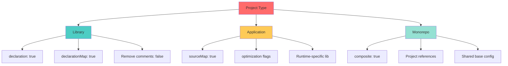

## 🎯 Introduction

TypeScript has revolutionized JavaScript development by bringing static typing and advanced tooling to the ecosystem. However, leveraging TypeScript's full potential requires understanding not just the syntax, but the principles and patterns that lead to maintainable, type-safe code.

This comprehensive guide explores TypeScript best practices across multiple dimensions:

- **Configuration & Setup**: Optimal compiler settings and project structure
- **Type System Mastery**: Leveraging TypeScript's powerful type system effectively
- **Code Style & Syntax**: Consistent, readable, and idiomatic TypeScript code
- **Design Patterns**: Applying proven patterns in a type-safe manner
- **Advanced Techniques**: Generics, utility types, and type transformations
- **Performance & Optimization**: Writing efficient TypeScript code
- **Testing & Quality**: Ensuring type safety extends to your test suite

> 💡 **Core Philosophy**: "TypeScript is not just JavaScript with types—it's a tool for designing robust APIs, catching bugs early, and enabling confident refactoring"

## 📋 TypeScript Configuration Best Practices

### 🔧 Essential tsconfig.json Settings

A properly configured `tsconfig.json` is the foundation of a type-safe TypeScript project.

#### 🛠️ Strict Configuration (Recommended)

```json
{
  "compilerOptions": {
    // Strict Type Checking
    "strict": true,                           // Enable all strict type checking options
    "noImplicitAny": true,                   // Raise error on expressions with implied 'any'
    "strictNullChecks": true,                // Enable strict null checks
    "strictFunctionTypes": true,             // Enable strict checking of function types
    "strictBindCallApply": true,             // Enable strict bind/call/apply methods
    "strictPropertyInitialization": true,     // Ensure properties are initialized
    "noImplicitThis": true,                  // Raise error on 'this' with implied 'any'
    "alwaysStrict": true,                    // Parse in strict mode and emit "use strict"

    // Additional Checks
    "noUnusedLocals": true,                  // Report errors on unused locals
    "noUnusedParameters": true,              // Report errors on unused parameters
    "noImplicitReturns": true,               // Report error when not all paths return value
    "noFallthroughCasesInSwitch": true,      // Report errors for fallthrough cases

    // Module Resolution
    "module": "ESNext",                      // Specify module code generation
    "moduleResolution": "node",              // Use Node.js module resolution
    "resolveJsonModule": true,               // Include modules imported with .json
    "esModuleInterop": true,                 // Enable interop between CommonJS and ES Modules
    "allowSyntheticDefaultImports": true,    // Allow default imports from modules

    // Emit
    "target": "ES2020",                      // Specify ECMAScript target version
    "lib": ["ES2020", "DOM", "DOM.Iterable"], // Specify library files
    "outDir": "./dist",                      // Redirect output structure to directory
    "sourceMap": true,                       // Generate source maps
    "declaration": true,                     // Generate .d.ts files
    "declarationMap": true,                  // Generate sourcemap for .d.ts files
    "removeComments": false,                 // Keep comments in output

    // Interop Constraints
    "isolatedModules": true,                 // Ensure each file can be transpiled
    "allowJs": false,                        // Disallow JavaScript files
    "checkJs": false,                        // Don't check JavaScript files

    // Advanced
    "skipLibCheck": true,                    // Skip type checking of declaration files
    "forceConsistentCasingInFileNames": true, // Ensure consistent casing
    "incremental": true,                     // Enable incremental compilation
    "tsBuildInfoFile": "./dist/.tsbuildinfo" // Specify file for incremental info
  },
  "include": ["src/**/*"],
  "exclude": ["node_modules", "dist", "**/*.spec.ts"]
}
```

#### 📊 Configuration Strategy by Project Type



### 🏗️ Project Structure Best Practices

```
project-root/
├── src/
│   ├── types/           # Shared type definitions
│   │   ├── index.ts
│   │   └── models.ts
│   ├── utils/           # Utility functions
│   │   ├── validation.ts
│   │   └── formatting.ts
│   ├── services/        # Business logic
│   │   └── api.service.ts
│   ├── components/      # UI components (if applicable)
│   └── index.ts         # Main entry point
├── tests/
│   ├── unit/
│   └── integration/
├── tsconfig.json        # Base TypeScript config
├── tsconfig.build.json  # Production build config
└── package.json
```

## 🎨 Type System Best Practices

### ✅ Prefer Types Over Interfaces (When Appropriate)

```typescript
// ✅ GOOD: Use type for unions, intersections, and primitives
type Status = 'pending' | 'success' | 'error';
type ID = string | number;

type Point = {
  x: number;
  y: number;
};

// Intersection types
type ColoredPoint = Point & {
  color: string;
};

// ✅ GOOD: Use interface for object shapes that might be extended
interface User {
  id: string;
  name: string;
  email: string;
}

interface AdminUser extends User {
  permissions: string[];
}

// ❌ AVOID: Using interface for union types (not possible)
// interface Status = 'pending' | 'success' | 'error'; // Error!
```

**Key Differences:**

```typescript
// Type aliases can represent any type
type StringOrNumber = string | number;
type Tuple = [string, number];
type Callback = (data: string) => void;

// Interfaces are for object shapes and classes
interface Animal {
  name: string;
  makeSound(): void;
}

// Interfaces support declaration merging
interface Window {
  customProperty: string;
}

interface Window {
  anotherProperty: number;
}
// Both declarations merge into one
```

### 🔒 Embrace Strict Null Checks

```typescript
// ✅ GOOD: Explicit handling of null/undefined
function getUserName(user: User | null): string {
  if (user === null) {
    return 'Guest';
  }
  return user.name;
}

// ✅ GOOD: Optional chaining
function getAddressCity(user?: User): string | undefined {
  return user?.address?.city;
}

// ✅ GOOD: Nullish coalescing
const displayName = user?.name ?? 'Anonymous';

// ❌ AVOID: Non-null assertion (use sparingly)
function processUser(user: User | null) {
  console.log(user!.name); // Dangerous! Runtime error if null
}

// ✅ BETTER: Type guard
function processUser(user: User | null) {
  if (!user) {
    throw new Error('User cannot be null');
  }
  console.log(user.name); // Safe: TypeScript knows user is not null
}
```

### 🎯 Type Guards and Narrowing

```typescript
// ✅ GOOD: User-defined type guards
interface Dog {
  type: 'dog';
  bark(): void;
}

interface Cat {
  type: 'cat';
  meow(): void;
}

type Animal = Dog | Cat;

// Type predicate
function isDog(animal: Animal): animal is Dog {
  return animal.type === 'dog';
}

function handleAnimal(animal: Animal) {
  if (isDog(animal)) {
    animal.bark(); // TypeScript knows it's a Dog
  } else {
    animal.meow(); // TypeScript knows it's a Cat
  }
}

// ✅ GOOD: Discriminated unions
type Shape =
  | { kind: 'circle'; radius: number }
  | { kind: 'rectangle'; width: number; height: number }
  | { kind: 'square'; size: number };

function getArea(shape: Shape): number {
  switch (shape.kind) {
    case 'circle':
      return Math.PI * shape.radius ** 2;
    case 'rectangle':
      return shape.width * shape.height;
    case 'square':
      return shape.size ** 2;
    default:
      // Exhaustiveness check
      const _exhaustive: never = shape;
      throw new Error(`Unhandled shape: ${_exhaustive}`);
  }
}
```

### 🧩 Generics Best Practices

```typescript
// ✅ GOOD: Generic function with constraints
function getProperty<T, K extends keyof T>(obj: T, key: K): T[K] {
  return obj[key];
}

const user = { name: 'John', age: 30 };
const name = getProperty(user, 'name'); // Type: string
const age = getProperty(user, 'age');   // Type: number

// ✅ GOOD: Generic interface with defaults
interface ApiResponse<T = unknown> {
  data: T;
  status: number;
  message: string;
}

const userResponse: ApiResponse<User> = {
  data: { id: '1', name: 'John', email: 'john@example.com' },
  status: 200,
  message: 'Success'
};

// ✅ GOOD: Conditional types
type Unwrap<T> = T extends Promise<infer U> ? U : T;

type A = Unwrap<Promise<string>>;  // string
type B = Unwrap<number>;           // number

// ✅ GOOD: Mapped types
type Readonly<T> = {
  readonly [P in keyof T]: T[P];
};

type Partial<T> = {
  [P in keyof T]?: T[P];
};

// ❌ AVOID: Overly complex generics
type ComplexGeneric<T extends Record<string, unknown>, K extends keyof T, V extends T[K]> = {
  [P in K]: V;
};

// ✅ BETTER: Break it down
type SimpleValue<T, K extends keyof T> = T[K];
```

## 💅 Code Style and Syntax Best Practices

### 📝 Naming Conventions

```typescript
// ✅ GOOD: Clear, descriptive names
// Interfaces and Types: PascalCase
interface UserProfile { }
type RequestStatus = 'pending' | 'success' | 'error';

// Classes: PascalCase
class UserService { }

// Functions and variables: camelCase
function calculateTotal(items: Item[]): number { }
const userName = 'John';

// Constants: UPPER_SNAKE_CASE
const MAX_RETRY_ATTEMPTS = 3;
const API_BASE_URL = 'https://api.example.com';

// Enums: PascalCase for enum, UPPER_CASE for members
enum HttpStatus {
  OK = 200,
  NOT_FOUND = 404,
  INTERNAL_SERVER_ERROR = 500
}

// Private members: prefix with underscore (optional)
class User {
  private _password: string;

  constructor(password: string) {
    this._password = password;
  }
}

// Boolean variables: use is/has/should prefix
const isLoading = true;
const hasPermission = false;
const shouldRetry = true;
```

### 🎯 Function Best Practices

```typescript
// ✅ GOOD: Explicit return types
function calculatePrice(quantity: number, unitPrice: number): number {
  return quantity * unitPrice;
}

// ✅ GOOD: Use function overloads for different signatures
function createElement(tag: 'div'): HTMLDivElement;
function createElement(tag: 'span'): HTMLSpanElement;
function createElement(tag: string): HTMLElement;
function createElement(tag: string): HTMLElement {
  return document.createElement(tag);
}

// ✅ GOOD: Optional parameters come last
function greet(name: string, greeting?: string): string {
  return `${greeting ?? 'Hello'}, ${name}!`;
}

// ✅ GOOD: Use destructuring with types
interface UserOptions {
  name: string;
  age?: number;
  email?: string;
}

function createUser({ name, age = 18, email }: UserOptions): User {
  return { name, age, email: email ?? '' };
}

// ✅ GOOD: Arrow functions for callbacks
const numbers = [1, 2, 3, 4, 5];
const doubled = numbers.map((n) => n * 2);
const evenNumbers = numbers.filter((n) => n % 2 === 0);

// ❌ AVOID: Implicit any parameters
function process(data) { // Error: Parameter 'data' implicitly has an 'any' type
  console.log(data);
}

// ✅ GOOD: Typed parameters
function process(data: unknown): void {
  console.log(data);
}
```

### 🏷️ Enum vs Union Types

```typescript
// ✅ GOOD: Use const enum for compile-time constants
const enum Direction {
  Up,
  Down,
  Left,
  Right
}

const direction: Direction = Direction.Up;

// ✅ GOOD: Use string literal unions for flexibility
type HttpMethod = 'GET' | 'POST' | 'PUT' | 'DELETE';

function request(url: string, method: HttpMethod): Promise<Response> {
  return fetch(url, { method });
}

// ✅ GOOD: Use as const for readonly literal types
const ROUTES = {
  HOME: '/',
  ABOUT: '/about',
  CONTACT: '/contact'
} as const;

type Route = typeof ROUTES[keyof typeof ROUTES]; // '/' | '/about' | '/contact'

// ❌ AVOID: Regular enums if string unions suffice
enum Status {
  Pending = 'PENDING',
  Success = 'SUCCESS',
  Error = 'ERROR'
}

// ✅ BETTER: String union
type Status = 'PENDING' | 'SUCCESS' | 'ERROR';
```

## 🏛️ Design Patterns in TypeScript

### 🏭 Singleton Pattern (Type-Safe)

```typescript
// ✅ GOOD: Type-safe singleton with private constructor
class DatabaseConnection {
  private static instance: DatabaseConnection;
  private connectionString: string;

  private constructor(connectionString: string) {
    this.connectionString = connectionString;
  }

  public static getInstance(connectionString?: string): DatabaseConnection {
    if (!DatabaseConnection.instance) {
      if (!connectionString) {
        throw new Error('Connection string required for first initialization');
      }
      DatabaseConnection.instance = new DatabaseConnection(connectionString);
    }
    return DatabaseConnection.instance;
  }

  public query<T>(sql: string): Promise<T[]> {
    // Implementation
    return Promise.resolve([]);
  }
}

// Usage
const db = DatabaseConnection.getInstance('postgres://localhost:5432/mydb');
const users = await db.query<User>('SELECT * FROM users');
```

### 🏗️ Factory Pattern with Generics

```typescript
// ✅ GOOD: Generic factory pattern
interface Product {
  id: string;
  name: string;
  price: number;
}

interface Service {
  id: string;
  name: string;
  duration: number;
}

interface Factory<T> {
  create(data: Omit<T, 'id'>): T;
}

class ProductFactory implements Factory<Product> {
  private idCounter = 0;

  create(data: Omit<Product, 'id'>): Product {
    return {
      id: `product-${++this.idCounter}`,
      ...data
    };
  }
}

class ServiceFactory implements Factory<Service> {
  private idCounter = 0;

  create(data: Omit<Service, 'id'>): Service {
    return {
      id: `service-${++this.idCounter}`,
      ...data
    };
  }
}

// Usage
const productFactory = new ProductFactory();
const product = productFactory.create({ name: 'Laptop', price: 1200 });

const serviceFactory = new ServiceFactory();
const service = serviceFactory.create({ name: 'Consultation', duration: 60 });
```

### 🎭 Strategy Pattern with Type Safety

```typescript
// ✅ GOOD: Type-safe strategy pattern
interface PaymentStrategy {
  pay(amount: number): Promise<PaymentResult>;
}

interface PaymentResult {
  success: boolean;
  transactionId?: string;
  error?: string;
}

class CreditCardPayment implements PaymentStrategy {
  constructor(
    private cardNumber: string,
    private cvv: string,
    private expiryDate: string
  ) {}

  async pay(amount: number): Promise<PaymentResult> {
    // Implementation
    return {
      success: true,
      transactionId: `cc-${Date.now()}`
    };
  }
}

class PayPalPayment implements PaymentStrategy {
  constructor(private email: string, private password: string) {}

  async pay(amount: number): Promise<PaymentResult> {
    // Implementation
    return {
      success: true,
      transactionId: `pp-${Date.now()}`
    };
  }
}

class PaymentProcessor {
  constructor(private strategy: PaymentStrategy) {}

  setStrategy(strategy: PaymentStrategy): void {
    this.strategy = strategy;
  }

  async processPayment(amount: number): Promise<PaymentResult> {
    return this.strategy.pay(amount);
  }
}

// Usage
const processor = new PaymentProcessor(
  new CreditCardPayment('1234-5678-9012-3456', '123', '12/25')
);
await processor.processPayment(100);

processor.setStrategy(new PayPalPayment('user@example.com', 'password'));
await processor.processPayment(50);
```

### 🔍 Observer Pattern with Strong Typing

```typescript
// ✅ GOOD: Type-safe observer pattern
type Observer<T> = (data: T) => void;

class Observable<T> {
  private observers: Set<Observer<T>> = new Set();

  subscribe(observer: Observer<T>): () => void {
    this.observers.add(observer);

    // Return unsubscribe function
    return () => {
      this.observers.delete(observer);
    };
  }

  notify(data: T): void {
    this.observers.forEach((observer) => observer(data));
  }
}

// Usage with specific types
interface UserEvent {
  type: 'login' | 'logout';
  userId: string;
  timestamp: number;
}

const userEvents = new Observable<UserEvent>();

const unsubscribe = userEvents.subscribe((event) => {
  console.log(`User ${event.userId} performed ${event.type}`);
});

userEvents.notify({
  type: 'login',
  userId: 'user-123',
  timestamp: Date.now()
});

unsubscribe(); // Clean up
```

## 🚀 Advanced TypeScript Techniques

### 🔧 Utility Types Mastery

```typescript
// ✅ GOOD: Leverage built-in utility types
interface User {
  id: string;
  name: string;
  email: string;
  password: string;
  role: 'admin' | 'user';
}

// Partial: All properties optional
type UserUpdate = Partial<User>;

// Pick: Select specific properties
type UserPublic = Pick<User, 'id' | 'name' | 'email'>;

// Omit: Exclude specific properties
type UserWithoutPassword = Omit<User, 'password'>;

// Required: All properties required
type UserRequired = Required<Partial<User>>;

// Readonly: All properties readonly
type UserImmutable = Readonly<User>;

// Record: Create object type with specific keys
type UserRoles = Record<string, 'admin' | 'user' | 'guest'>;

// ✅ GOOD: Custom utility types
type DeepPartial<T> = {
  [P in keyof T]?: T[P] extends object ? DeepPartial<T[P]> : T[P];
};

type DeepReadonly<T> = {
  readonly [P in keyof T]: T[P] extends object ? DeepReadonly<T[P]> : T[P];
};

// Make specific keys optional
type OptionalKeys<T, K extends keyof T> = Omit<T, K> & Partial<Pick<T, K>>;

type UserOptionalEmail = OptionalKeys<User, 'email'>;

// Make specific keys required
type RequiredKeys<T, K extends keyof T> = T & Required<Pick<T, K>>;
```

### 🎨 Template Literal Types

```typescript
// ✅ GOOD: Template literal types for type-safe strings
type EventName = 'click' | 'focus' | 'blur';
type ElementId = 'button' | 'input' | 'form';

type ElementEvent = `${ElementId}:${EventName}`;
// Result: 'button:click' | 'button:focus' | 'button:blur' | 'input:click' | ...

// ✅ GOOD: Type-safe API routes
type HttpMethod = 'GET' | 'POST' | 'PUT' | 'DELETE';
type ApiVersion = 'v1' | 'v2';
type Resource = 'users' | 'posts' | 'comments';

type ApiRoute = `/${ApiVersion}/${Resource}`;
type ApiEndpoint = `${HttpMethod} ${ApiRoute}`;

const endpoint: ApiEndpoint = 'GET /v1/users'; // Type-safe!

// ✅ GOOD: CSS-in-JS type safety
type CSSUnit = 'px' | 'em' | 'rem' | '%';
type Size = `${number}${CSSUnit}`;

interface Style {
  width: Size;
  height: Size;
  margin: Size;
}

const style: Style = {
  width: '100px',
  height: '50rem',
  margin: '10%'
};
```

### 🔐 Branded Types for Type Safety

```typescript
// ✅ GOOD: Branded types prevent mixing incompatible values
type Brand<K, T> = K & { __brand: T };

type UserId = Brand<string, 'UserId'>;
type PostId = Brand<string, 'PostId'>;
type Email = Brand<string, 'Email'>;

// Factory functions for creating branded types
function createUserId(id: string): UserId {
  return id as UserId;
}

function createPostId(id: string): PostId {
  return id as PostId;
}

function createEmail(email: string): Email {
  if (!email.includes('@')) {
    throw new Error('Invalid email format');
  }
  return email as Email;
}

// Type-safe functions
function getUserById(userId: UserId): User | null {
  // Implementation
  return null;
}

function getPostById(postId: PostId): Post | null {
  // Implementation
  return null;
}

// Usage
const userId = createUserId('user-123');
const postId = createPostId('post-456');

getUserById(userId); // ✅ OK
getUserById(postId); // ❌ Error: Type 'PostId' is not assignable to type 'UserId'
```

### 🧪 Conditional Types and Inference

```typescript
// ✅ GOOD: Extract return type
type ReturnType<T> = T extends (...args: any[]) => infer R ? R : never;

function getUser(): User {
  return { id: '1', name: 'John', email: 'john@example.com' };
}

type UserType = ReturnType<typeof getUser>; // User

// ✅ GOOD: Extract array element type
type ArrayElement<T> = T extends (infer E)[] ? E : never;

type StringArray = string[];
type Element = ArrayElement<StringArray>; // string

// ✅ GOOD: Flatten promise types
type Awaited<T> = T extends Promise<infer U> ? Awaited<U> : T;

type NestedPromise = Promise<Promise<User>>;
type FlattenedUser = Awaited<NestedPromise>; // User

// ✅ GOOD: Function parameter types
type Parameters<T> = T extends (...args: infer P) => any ? P : never;

function createUser(name: string, age: number, email: string): User {
  return { id: '1', name, email };
}

type CreateUserParams = Parameters<typeof createUser>; // [string, number, string]
```

## 🧪 Testing Best Practices

### ✅ Type-Safe Test Setup

```typescript
// ✅ GOOD: Type-safe test data factories
interface User {
  id: string;
  name: string;
  email: string;
  age: number;
}

function createMockUser(overrides?: Partial<User>): User {
  return {
    id: 'test-id',
    name: 'Test User',
    email: 'test@example.com',
    age: 25,
    ...overrides
  };
}

// ✅ GOOD: Type-safe mocks with Jest
import { jest } from '@jest/globals';

interface UserService {
  getUser(id: string): Promise<User>;
  updateUser(id: string, data: Partial<User>): Promise<User>;
}

const mockUserService: jest.Mocked<UserService> = {
  getUser: jest.fn(),
  updateUser: jest.fn()
};

// Type-safe mock implementation
mockUserService.getUser.mockResolvedValue(createMockUser());

// ✅ GOOD: Type assertions in tests
describe('User Service', () => {
  it('should return user data', async () => {
    const user = await userService.getUser('123');

    // Type-safe assertions
    expect(user).toMatchObject<Partial<User>>({
      id: '123',
      name: expect.any(String),
      email: expect.any(String)
    });
  });
});
```

## ⚡ Performance and Optimization

### 🎯 Type-Level Performance

```typescript
// ❌ AVOID: Deep type recursion
type DeepNested<T, N extends number> = N extends 0
  ? T
  : DeepNested<T[], Subtract<N, 1>>;

// ✅ GOOD: Limit recursion depth
type DeepPartial<T> = T extends object
  ? { [P in keyof T]?: DeepPartial<T[P]> }
  : T;

// ❌ AVOID: Excessive union types
type AllCombinations =
  | Type1 | Type2 | Type3 | Type4 | Type5
  | Type6 | Type7 | Type8 | Type9 | Type10; // ... 100 more

// ✅ GOOD: Use discriminated unions
type Action =
  | { type: 'INCREMENT'; payload: number }
  | { type: 'DECREMENT'; payload: number }
  | { type: 'RESET' };
```

### 🚀 Runtime Performance

```typescript
// ✅ GOOD: Use const assertions to avoid runtime overhead
const config = {
  apiUrl: 'https://api.example.com',
  timeout: 5000,
  retries: 3
} as const;

// Type is: { readonly apiUrl: "https://api.example.com"; readonly timeout: 5000; readonly retries: 3 }

// ✅ GOOD: Avoid unnecessary type casting
function processData(data: unknown): string {
  // Type guard instead of casting
  if (typeof data === 'string') {
    return data.toUpperCase();
  }
  return String(data);
}

// ❌ AVOID: Excessive type assertions
function process(value: unknown): string {
  return (value as any).toString(); // Loses type safety
}
```

## 🚨 Common Pitfalls and How to Avoid Them

### ⚠️ Pitfall 1: Type Assertions vs Type Guards

```typescript
// ❌ BAD: Unsafe type assertion
function processUser(data: unknown) {
  const user = data as User; // No runtime check!
  console.log(user.name.toUpperCase()); // May crash
}

// ✅ GOOD: Type guard with validation
function isUser(data: unknown): data is User {
  return (
    typeof data === 'object' &&
    data !== null &&
    'id' in data &&
    'name' in data &&
    'email' in data
  );
}

function processUser(data: unknown) {
  if (!isUser(data)) {
    throw new Error('Invalid user data');
  }
  console.log(data.name.toUpperCase()); // Safe!
}
```

### ⚠️ Pitfall 2: Any vs Unknown

```typescript
// ❌ BAD: Using 'any' loses type safety
function processData(data: any): string {
  return data.toString(); // No type checking
}

// ✅ GOOD: Use 'unknown' and narrow the type
function processData(data: unknown): string {
  if (typeof data === 'string') {
    return data;
  }
  if (typeof data === 'number') {
    return String(data);
  }
  throw new Error('Unsupported data type');
}
```

### ⚠️ Pitfall 3: Optional vs Undefined

```typescript
// ❌ CONFUSING: Mixing optional and undefined
interface User {
  name?: string | undefined;  // Redundant
  email?: string;             // Better
}

// ✅ GOOD: Be explicit about intent
interface Config {
  timeout?: number;        // Can be omitted
  retries: number | undefined; // Must be provided, can be undefined
}

const config1: Config = { retries: undefined }; // ✅ OK
const config2: Config = { retries: 3 }; // ✅ OK
const config3: Config = {}; // ❌ Error: retries is required
```

### ⚠️ Pitfall 4: Array Methods and Type Narrowing

```typescript
// ❌ BAD: Filter doesn't narrow types automatically
const values: (string | null)[] = ['a', null, 'b', null];
const strings = values.filter(v => v !== null);
// Type is still (string | null)[]

// ✅ GOOD: Use type predicate
function isNotNull<T>(value: T | null): value is T {
  return value !== null;
}

const strings = values.filter(isNotNull); // Type is string[]
```

## 📚 Summary and Quick Reference

### 🎯 Key Principles

1. **Enable Strict Mode**: Always use `"strict": true` in tsconfig.json
2. **Prefer Type Safety**: Choose `unknown` over `any`, use type guards instead of assertions
3. **Leverage the Type System**: Use discriminated unions, branded types, and utility types
4. **Be Explicit**: Add return types to functions, use const assertions
5. **Design for Maintainability**: Use clear naming, consistent patterns, and proper structure

### 🛠️ Essential Commands

```bash
# Initialize TypeScript project
npm init -y
npm install -D typescript @types/node

# Create tsconfig.json
npx tsc --init --strict

# Type check without emitting
npx tsc --noEmit

# Watch mode
npx tsc --watch

# Build project
npx tsc

# Run TypeScript directly (development)
npx tsx src/index.ts
```

### 📖 Recommended Tools

```json
{
  "devDependencies": {
    "typescript": "^5.3.0",
    "@typescript-eslint/eslint-plugin": "^6.0.0",
    "@typescript-eslint/parser": "^6.0.0",
    "eslint": "^8.0.0",
    "prettier": "^3.0.0",
    "ts-node": "^10.0.0",
    "tsx": "^4.0.0",
    "@types/node": "^20.0.0",
    "jest": "^29.0.0",
    "@types/jest": "^29.0.0",
    "ts-jest": "^29.0.0"
  }
}
```

### 🎨 ESLint Configuration for TypeScript

```json
{
  "parser": "@typescript-eslint/parser",
  "extends": [
    "eslint:recommended",
    "plugin:@typescript-eslint/recommended",
    "plugin:@typescript-eslint/recommended-requiring-type-checking"
  ],
  "parserOptions": {
    "project": "./tsconfig.json"
  },
  "rules": {
    "@typescript-eslint/no-explicit-any": "error",
    "@typescript-eslint/explicit-function-return-type": "warn",
    "@typescript-eslint/no-unused-vars": "error",
    "@typescript-eslint/no-non-null-assertion": "warn"
  }
}
```

## 🎓 Further Learning Resources

- **Official Documentation**: [TypeScript Handbook](https://www.typescriptlang.org/docs/handbook/intro.html)
- **Advanced Types**: [TypeScript Deep Dive](https://basarat.gitbook.io/typescript/)
- **Type Challenges**: [type-challenges](https://github.com/type-challenges/type-challenges)
- **Style Guide**: [Google TypeScript Style Guide](https://google.github.io/styleguide/tsguide.html)

## 🎯 Conclusion

TypeScript is a powerful tool that, when used correctly, dramatically improves code quality, maintainability, and developer experience. By following these best practices, you'll write type-safe code that catches bugs early, enables confident refactoring, and scales with your application's growth.

Remember: **TypeScript is not just about adding types—it's about designing better APIs, expressing intent clearly, and leveraging the compiler as a powerful ally in your development workflow.**

---

**Related Posts:**
- [Essential Design Patterns in Java: A Comprehensive Guide](/essential-design-patterns-java-comprehensive-guide)
- [Java Concurrency Deep Dive: Runnable and Callable Patterns](/java-concurrency-deep-dive-runnable-callable-patterns-part2)
- [Building Advanced MCP Servers with Claude Code - Part 2](/building-advanced-mcp-servers-claude-code-part2)

**Tags:** #TypeScript #JavaScript #TypeSafety #DesignPatterns #BestPractices #SoftwareEngineering #WebDevelopment #FrontendDevelopment
