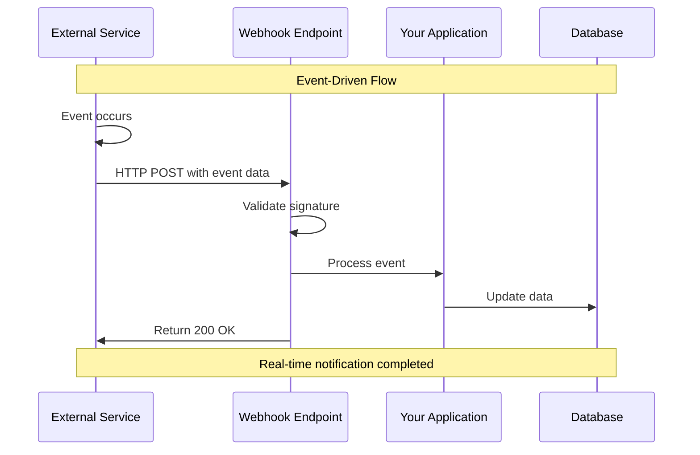
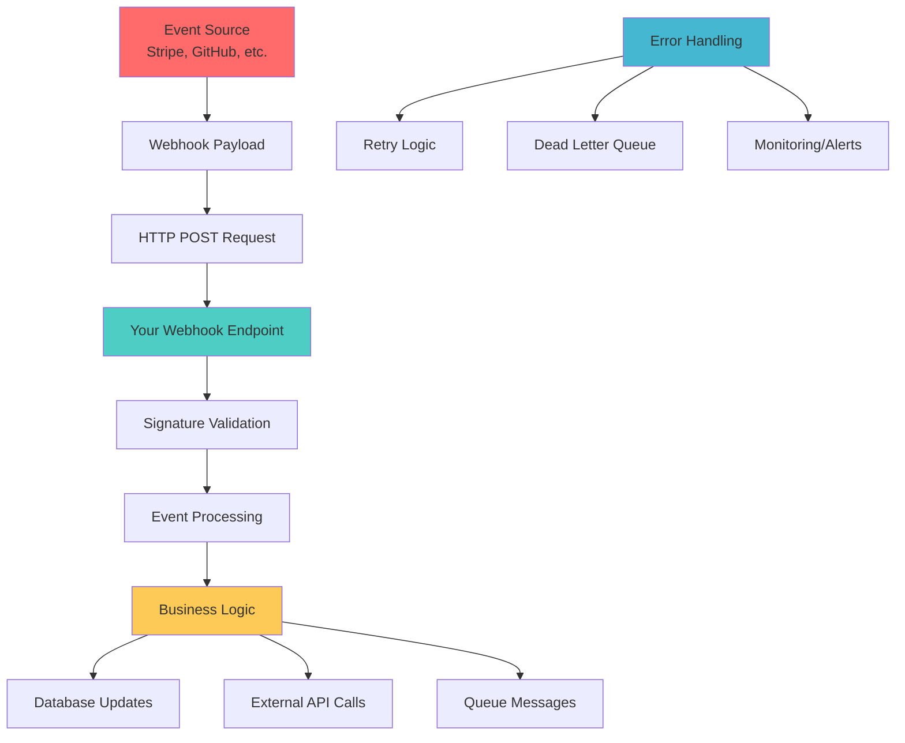
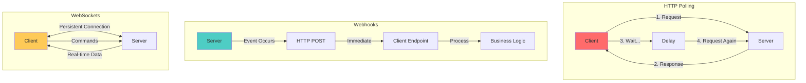

## 🎯 Introduction

Webhooks are HTTP callbacks that enable real-time, event-driven communication between applications. Instead of continuously polling for updates, webhooks allow systems to push data immediately when events occur. This comprehensive guide explores webhook architecture, compares different integration approaches, and provides production-ready Java implementations with real-world examples from Stripe, Shopify, and GitHub.

Webhooks have become essential for modern distributed systems, enabling efficient, scalable, and responsive integrations that power everything from payment processing to CI/CD pipelines and e-commerce automation.

## 🔍 Understanding Webhooks

### 📡 What are Webhooks?



Webhooks are user-defined HTTP callbacks triggered by specific events in external systems. When an event occurs, the source application makes an HTTP POST request to a configured URL endpoint with event details.

### 🏗️ Webhook Architecture Components



## ⚖️ Technology Comparison: Webhooks vs Alternatives

### 📊 Comparison Matrix

| Aspect | Webhooks | HTTP Polling | Server-Sent Events | WebSockets |
|--------|----------|-------------|-------------------|------------|
| **Direction** | Push (Server→Client) | Pull (Client→Server) | Push (Server→Client) | Bidirectional |
| **Real-Time** | Immediate | Delayed | Immediate | Immediate |
| **Resource Usage** | Low | High | Medium | Medium |
| **Reliability** | Good with retries | High | Medium | Medium |
| **Complexity** | Medium | Low | Medium | High |
| **Firewall Issues** | Yes | No | No | Yes |
| **Scalability** | Excellent | Poor | Good | Good |
| **Bandwidth** | Efficient | Inefficient | Efficient | Efficient |
| **Connection State** | Stateless | Stateless | Stateful | Stateful |

### 🔄 Communication Pattern Comparison



### ⚡ Performance Comparison

#### HTTP Polling Implementation (Inefficient)

```java
@Service
@Slf4j
public class PollingService {

    private final RestTemplate restTemplate;
    private final ScheduledExecutorService scheduler;

    public PollingService(RestTemplate restTemplate) {
        this.restTemplate = restTemplate;
        this.scheduler = Executors.newScheduledThreadPool(5);
    }

    // Inefficient polling approach
    @PostConstruct
    public void startPolling() {
        scheduler.scheduleAtFixedRate(() -> {
            try {
                // Poll every 30 seconds
                checkForUpdates();
            } catch (Exception e) {
                log.error("Polling failed", e);
            }
        }, 0, 30, TimeUnit.SECONDS);
    }

    private void checkForUpdates() {
        try {
            ResponseEntity<PaymentUpdate[]> response = restTemplate.getForEntity(
                "https://api.example.com/payments/updates?since=" + getLastCheckTime(),
                PaymentUpdate[].class
            );

            if (response.getStatusCode().is2xxSuccessful() && response.getBody() != null) {
                Arrays.stream(response.getBody())
                    .forEach(this::processUpdate);
            }

        } catch (Exception e) {
            log.error("Failed to poll for updates", e);
        }
    }

    private void processUpdate(PaymentUpdate update) {
        log.info("Processing polled update: {}", update.getId());
        // Process update...
    }

    private String getLastCheckTime() {
        return Instant.now().minus(Duration.ofSeconds(30)).toString();
    }

    public static class PaymentUpdate {
        private String id;
        private String status;
        private Instant timestamp;

        // Constructors, getters, setters...
        public PaymentUpdate() {}

        public String getId() { return id; }
        public void setId(String id) { this.id = id; }
        public String getStatus() { return status; }
        public void setStatus(String status) { this.status = status; }
        public Instant getTimestamp() { return timestamp; }
        public void setTimestamp(Instant timestamp) { this.timestamp = timestamp; }
    }
}
```

#### Webhook Implementation (Efficient)

```java
@RestController
@RequestMapping("/webhooks")
@Slf4j
public class WebhookController {

    private final PaymentService paymentService;
    private final WebhookValidator webhookValidator;

    public WebhookController(PaymentService paymentService, WebhookValidator webhookValidator) {
        this.paymentService = paymentService;
        this.webhookValidator = webhookValidator;
    }

    // Efficient webhook approach - immediate processing
    @PostMapping("/payments")
    public ResponseEntity<Void> handlePaymentWebhook(
            @RequestBody String payload,
            @RequestHeader("X-Signature") String signature,
            @RequestHeader(value = "X-Event-Type", required = false) String eventType) {

        try {
            // Validate webhook signature
            if (!webhookValidator.validateSignature(payload, signature)) {
                log.warn("Invalid webhook signature received");
                return ResponseEntity.status(HttpStatus.UNAUTHORIZED).build();
            }

            // Parse and process immediately
            PaymentWebhookEvent event = parseWebhookEvent(payload);
            paymentService.processPaymentUpdate(event);

            log.info("Successfully processed webhook event: {}", event.getId());
            return ResponseEntity.ok().build();

        } catch (Exception e) {
            log.error("Failed to process webhook", e);
            return ResponseEntity.status(HttpStatus.INTERNAL_SERVER_ERROR).build();
        }
    }

    private PaymentWebhookEvent parseWebhookEvent(String payload) {
        try {
            ObjectMapper mapper = new ObjectMapper();
            return mapper.readValue(payload, PaymentWebhookEvent.class);
        } catch (Exception e) {
            throw new IllegalArgumentException("Invalid webhook payload", e);
        }
    }
}
```

## 🎯 When to Use Webhooks

### ✅ Ideal Use Cases

1. **Payment Processing**
   - Real-time payment status updates
   - Subscription lifecycle events
   - Fraud detection notifications

2. **E-commerce Integration**
   - Order status changes
   - Inventory updates
   - Customer lifecycle events

3. **CI/CD Pipelines**
   - Code repository changes
   - Build completion notifications
   - Deployment status updates

4. **Communication Systems**
   - Message delivery status
   - User presence updates
   - Chat events

5. **IoT and Monitoring**
   - Device status changes
   - Alert notifications
   - Metric threshold breaches

### ❌ When NOT to Use Webhooks

1. **High-Frequency Updates** (>1000/second)
2. **Request-Response Patterns** requiring immediate responses
3. **Client-Initiated Queries** for specific data
4. **Environments with strict firewall restrictions**
5. **When polling frequency is very low** (daily/weekly)

## 🛠️ Production-Ready Java Implementation

### 1. Spring Boot Webhook Framework

**Maven Dependencies:**

```xml
<dependencies>
    <dependency>
        <groupId>org.springframework.boot</groupId>
        <artifactId>spring-boot-starter-web</artifactId>
    </dependency>

    <dependency>
        <groupId>org.springframework.boot</groupId>
        <artifactId>spring-boot-starter-security</artifactId>
    </dependency>

    <dependency>
        <groupId>org.springframework.boot</groupId>
        <artifactId>spring-boot-starter-validation</artifactId>
    </dependency>

    <dependency>
        <groupId>org.springframework.boot</groupId>
        <artifactId>spring-boot-starter-data-jpa</artifactId>
    </dependency>

    <dependency>
        <groupId>com.fasterxml.jackson.core</groupId>
        <artifactId>jackson-databind</artifactId>
    </dependency>

    <!-- For webhook signature validation -->
    <dependency>
        <groupId>commons-codec</groupId>
        <artifactId>commons-codec</artifactId>
    </dependency>

    <!-- For retry mechanisms -->
    <dependency>
        <groupId>org.springframework.retry</groupId>
        <artifactId>spring-retry</artifactId>
    </dependency>

    <!-- For monitoring -->
    <dependency>
        <groupId>org.springframework.boot</groupId>
        <artifactId>spring-boot-starter-actuator</artifactId>
    </dependency>

    <dependency>
        <groupId>io.micrometer</groupId>
        <artifactId>micrometer-registry-prometheus</artifactId>
    </dependency>
</dependencies>
```

### 2. Webhook Security and Validation

**Signature Validation Service:**

```java
@Service
@Slf4j
public class WebhookValidator {

    private final Map<String, WebhookConfig> webhookConfigs;

    public WebhookValidator() {
        this.webhookConfigs = new HashMap<>();
        initializeWebhookConfigs();
    }

    private void initializeWebhookConfigs() {
        // Stripe configuration
        webhookConfigs.put("stripe", new WebhookConfig(
            "stripe_webhook_secret",
            "sha256",
            "Stripe-Signature",
            "v1"
        ));

        // GitHub configuration
        webhookConfigs.put("github", new WebhookConfig(
            "github_webhook_secret",
            "sha1",
            "X-Hub-Signature",
            null
        ));

        // Shopify configuration
        webhookConfigs.put("shopify", new WebhookConfig(
            "shopify_webhook_secret",
            "sha256",
            "X-Shopify-Hmac-Sha256",
            null
        ));
    }

    public boolean validateStripeSignature(String payload, String signatureHeader) {
        try {
            WebhookConfig config = webhookConfigs.get("stripe");
            String secret = getSecretFromConfig(config.getSecretKey());

            // Stripe signature format: t=timestamp,v1=signature
            Map<String, String> signatureParts = parseStripeSignature(signatureHeader);
            String timestamp = signatureParts.get("t");
            String signature = signatureParts.get("v1");

            if (timestamp == null || signature == null) {
                log.warn("Invalid Stripe signature format");
                return false;
            }

            // Check timestamp (prevent replay attacks)
            long webhookTime = Long.parseLong(timestamp);
            long currentTime = System.currentTimeMillis() / 1000;
            if (Math.abs(currentTime - webhookTime) > 300) { // 5 minute tolerance
                log.warn("Stripe webhook timestamp too old: {}", webhookTime);
                return false;
            }

            // Validate signature
            String expectedSignature = computeHmacSha256(timestamp + "." + payload, secret);
            return MessageDigest.isEqual(signature.getBytes(), expectedSignature.getBytes());

        } catch (Exception e) {
            log.error("Stripe signature validation failed", e);
            return false;
        }
    }

    public boolean validateGitHubSignature(String payload, String signatureHeader) {
        try {
            WebhookConfig config = webhookConfigs.get("github");
            String secret = getSecretFromConfig(config.getSecretKey());

            // GitHub signature format: sha1=<signature>
            if (!signatureHeader.startsWith("sha1=")) {
                return false;
            }

            String signature = signatureHeader.substring(5);
            String expectedSignature = computeHmacSha1(payload, secret);

            return MessageDigest.isEqual(signature.getBytes(), expectedSignature.getBytes());

        } catch (Exception e) {
            log.error("GitHub signature validation failed", e);
            return false;
        }
    }

    public boolean validateShopifySignature(String payload, String signatureHeader) {
        try {
            WebhookConfig config = webhookConfigs.get("shopify");
            String secret = getSecretFromConfig(config.getSecretKey());

            String expectedSignature = computeHmacSha256Base64(payload, secret);
            return MessageDigest.isEqual(signatureHeader.getBytes(), expectedSignature.getBytes());

        } catch (Exception e) {
            log.error("Shopify signature validation failed", e);
            return false;
        }
    }

    private Map<String, String> parseStripeSignature(String signatureHeader) {
        Map<String, String> result = new HashMap<>();
        String[] elements = signatureHeader.split(",");

        for (String element : elements) {
            String[] keyValue = element.split("=", 2);
            if (keyValue.length == 2) {
                result.put(keyValue[0], keyValue[1]);
            }
        }

        return result;
    }

    private String computeHmacSha256(String data, String secret) throws Exception {
        Mac sha256Hmac = Mac.getInstance("HmacSHA256");
        SecretKeySpec secretKey = new SecretKeySpec(secret.getBytes("UTF-8"), "HmacSHA256");
        sha256Hmac.init(secretKey);
        byte[] hash = sha256Hmac.doFinal(data.getBytes("UTF-8"));
        return Hex.encodeHexString(hash);
    }

    private String computeHmacSha1(String data, String secret) throws Exception {
        Mac sha1Hmac = Mac.getInstance("HmacSHA1");
        SecretKeySpec secretKey = new SecretKeySpec(secret.getBytes("UTF-8"), "HmacSHA1");
        sha1Hmac.init(secretKey);
        byte[] hash = sha1Hmac.doFinal(data.getBytes("UTF-8"));
        return Hex.encodeHexString(hash);
    }

    private String computeHmacSha256Base64(String data, String secret) throws Exception {
        Mac sha256Hmac = Mac.getInstance("HmacSHA256");
        SecretKeySpec secretKey = new SecretKeySpec(secret.getBytes("UTF-8"), "HmacSHA256");
        sha256Hmac.init(secretKey);
        byte[] hash = sha256Hmac.doFinal(data.getBytes("UTF-8"));
        return Base64.getEncoder().encodeToString(hash);
    }

    private String getSecretFromConfig(String configKey) {
        // In production, load from secure configuration
        return System.getenv(configKey.toUpperCase().replace("_", "_"));
    }

    // Configuration class
    private static class WebhookConfig {
        private final String secretKey;
        private final String algorithm;
        private final String headerName;
        private final String version;

        public WebhookConfig(String secretKey, String algorithm, String headerName, String version) {
            this.secretKey = secretKey;
            this.algorithm = algorithm;
            this.headerName = headerName;
            this.version = version;
        }

        // Getters
        public String getSecretKey() { return secretKey; }
        public String getAlgorithm() { return algorithm; }
        public String getHeaderName() { return headerName; }
        public String getVersion() { return version; }
    }
}
```

### 3. Comprehensive Webhook Controller

```java
@RestController
@RequestMapping("/api/webhooks")
@Validated
@Slf4j
public class WebhookController {

    private final WebhookValidator webhookValidator;
    private final WebhookEventProcessor eventProcessor;
    private final WebhookAuditService auditService;
    private final MeterRegistry meterRegistry;

    public WebhookController(WebhookValidator webhookValidator,
                            WebhookEventProcessor eventProcessor,
                            WebhookAuditService auditService,
                            MeterRegistry meterRegistry) {
        this.webhookValidator = webhookValidator;
        this.eventProcessor = eventProcessor;
        this.auditService = auditService;
        this.meterRegistry = meterRegistry;
    }

    // Stripe Payment Webhooks
    @PostMapping("/stripe/payments")
    public ResponseEntity<Void> handleStripeWebhook(
            @RequestBody String payload,
            @RequestHeader("Stripe-Signature") String signature,
            HttpServletRequest request) {

        Timer.Sample sample = Timer.start(meterRegistry);
        String webhookId = generateWebhookId();

        try {
            // Log incoming webhook
            log.info("Received Stripe webhook: {}", webhookId);
            auditService.logIncomingWebhook("stripe", webhookId, payload, request.getRemoteAddr());

            // Validate signature
            if (!webhookValidator.validateStripeSignature(payload, signature)) {
                meterRegistry.counter("webhook.validation.failed", "provider", "stripe").increment();
                auditService.logValidationFailure(webhookId, "Invalid signature");
                return ResponseEntity.status(HttpStatus.UNAUTHORIZED).build();
            }

            // Parse event
            StripeWebhookEvent event = parseStripeEvent(payload);

            // Process based on event type
            switch (event.getType()) {
                case "payment_intent.succeeded":
                    eventProcessor.processPaymentSuccess(event);
                    break;
                case "payment_intent.payment_failed":
                    eventProcessor.processPaymentFailure(event);
                    break;
                case "customer.subscription.created":
                    eventProcessor.processSubscriptionCreated(event);
                    break;
                case "customer.subscription.updated":
                    eventProcessor.processSubscriptionUpdated(event);
                    break;
                case "invoice.payment_succeeded":
                    eventProcessor.processInvoicePaymentSuccess(event);
                    break;
                default:
                    log.info("Unhandled Stripe event type: {}", event.getType());
                    meterRegistry.counter("webhook.events.unhandled", "provider", "stripe", "type", event.getType()).increment();
            }

            meterRegistry.counter("webhook.events.processed", "provider", "stripe", "type", event.getType()).increment();
            auditService.logSuccessfulProcessing(webhookId);

            return ResponseEntity.ok().build();

        } catch (Exception e) {
            log.error("Failed to process Stripe webhook: {}", webhookId, e);
            meterRegistry.counter("webhook.processing.failed", "provider", "stripe").increment();
            auditService.logProcessingFailure(webhookId, e.getMessage());
            return ResponseEntity.status(HttpStatus.INTERNAL_SERVER_ERROR).build();

        } finally {
            sample.stop(Timer.builder("webhook.processing.duration")
                .tag("provider", "stripe")
                .register(meterRegistry));
        }
    }

    // GitHub Repository Webhooks
    @PostMapping("/github/repository")
    public ResponseEntity<Void> handleGitHubWebhook(
            @RequestBody String payload,
            @RequestHeader("X-Hub-Signature") String signature,
            @RequestHeader("X-GitHub-Event") String eventType,
            @RequestHeader(value = "X-GitHub-Delivery", required = false) String deliveryId,
            HttpServletRequest request) {

        Timer.Sample sample = Timer.start(meterRegistry);
        String webhookId = deliveryId != null ? deliveryId : generateWebhookId();

        try {
            log.info("Received GitHub webhook: {} ({})", webhookId, eventType);
            auditService.logIncomingWebhook("github", webhookId, payload, request.getRemoteAddr());

            // Validate signature
            if (!webhookValidator.validateGitHubSignature(payload, signature)) {
                meterRegistry.counter("webhook.validation.failed", "provider", "github").increment();
                return ResponseEntity.status(HttpStatus.UNAUTHORIZED).build();
            }

            // Parse event
            GitHubWebhookEvent event = parseGitHubEvent(payload, eventType);

            // Process based on event type
            switch (eventType) {
                case "push":
                    eventProcessor.processGitHubPush(event);
                    break;
                case "pull_request":
                    eventProcessor.processGitHubPullRequest(event);
                    break;
                case "issues":
                    eventProcessor.processGitHubIssue(event);
                    break;
                case "release":
                    eventProcessor.processGitHubRelease(event);
                    break;
                case "workflow_run":
                    eventProcessor.processGitHubWorkflowRun(event);
                    break;
                default:
                    log.info("Unhandled GitHub event type: {}", eventType);
                    meterRegistry.counter("webhook.events.unhandled", "provider", "github", "type", eventType).increment();
            }

            meterRegistry.counter("webhook.events.processed", "provider", "github", "type", eventType).increment();
            return ResponseEntity.ok().build();

        } catch (Exception e) {
            log.error("Failed to process GitHub webhook: {}", webhookId, e);
            meterRegistry.counter("webhook.processing.failed", "provider", "github").increment();
            return ResponseEntity.status(HttpStatus.INTERNAL_SERVER_ERROR).build();

        } finally {
            sample.stop(Timer.builder("webhook.processing.duration")
                .tag("provider", "github")
                .register(meterRegistry));
        }
    }

    // Shopify E-commerce Webhooks
    @PostMapping("/shopify/orders")
    public ResponseEntity<Void> handleShopifyWebhook(
            @RequestBody String payload,
            @RequestHeader("X-Shopify-Hmac-Sha256") String signature,
            @RequestHeader("X-Shopify-Topic") String topic,
            @RequestHeader("X-Shopify-Shop-Domain") String shopDomain,
            HttpServletRequest request) {

        Timer.Sample sample = Timer.start(meterRegistry);
        String webhookId = generateWebhookId();

        try {
            log.info("Received Shopify webhook: {} ({}) from {}", webhookId, topic, shopDomain);
            auditService.logIncomingWebhook("shopify", webhookId, payload, request.getRemoteAddr());

            // Validate signature
            if (!webhookValidator.validateShopifySignature(payload, signature)) {
                meterRegistry.counter("webhook.validation.failed", "provider", "shopify").increment();
                return ResponseEntity.status(HttpStatus.UNAUTHORIZED).build();
            }

            // Parse event
            ShopifyWebhookEvent event = parseShopifyEvent(payload, topic, shopDomain);

            // Process based on topic
            switch (topic) {
                case "orders/create":
                    eventProcessor.processShopifyOrderCreate(event);
                    break;
                case "orders/updated":
                    eventProcessor.processShopifyOrderUpdate(event);
                    break;
                case "orders/paid":
                    eventProcessor.processShopifyOrderPaid(event);
                    break;
                case "orders/cancelled":
                    eventProcessor.processShopifyOrderCancelled(event);
                    break;
                case "customers/create":
                    eventProcessor.processShopifyCustomerCreate(event);
                    break;
                case "products/create":
                    eventProcessor.processShopifyProductCreate(event);
                    break;
                case "products/update":
                    eventProcessor.processShopifyProductUpdate(event);
                    break;
                default:
                    log.info("Unhandled Shopify event topic: {}", topic);
                    meterRegistry.counter("webhook.events.unhandled", "provider", "shopify", "topic", topic).increment();
            }

            meterRegistry.counter("webhook.events.processed", "provider", "shopify", "topic", topic).increment();
            return ResponseEntity.ok().build();

        } catch (Exception e) {
            log.error("Failed to process Shopify webhook: {}", webhookId, e);
            meterRegistry.counter("webhook.processing.failed", "provider", "shopify").increment();
            return ResponseEntity.status(HttpStatus.INTERNAL_SERVER_ERROR).build();

        } finally {
            sample.stop(Timer.builder("webhook.processing.duration")
                .tag("provider", "shopify")
                .register(meterRegistry));
        }
    }

    // Generic webhook endpoint for testing
    @PostMapping("/generic")
    public ResponseEntity<Map<String, Object>> handleGenericWebhook(
            @RequestBody(required = false) String payload,
            HttpServletRequest request,
            HttpServletResponse response) {

        String webhookId = generateWebhookId();
        Map<String, Object> responseData = new HashMap<>();

        try {
            log.info("Received generic webhook: {}", webhookId);

            // Collect headers
            Map<String, String> headers = new HashMap<>();
            Enumeration<String> headerNames = request.getHeaderNames();
            while (headerNames.hasMoreElements()) {
                String headerName = headerNames.nextElement();
                headers.put(headerName, request.getHeader(headerName));
            }

            // Collect request info
            Map<String, Object> requestInfo = new HashMap<>();
            requestInfo.put("method", request.getMethod());
            requestInfo.put("contentType", request.getContentType());
            requestInfo.put("contentLength", request.getContentLength());
            requestInfo.put("remoteAddr", request.getRemoteAddr());
            requestInfo.put("userAgent", request.getHeader("User-Agent"));

            responseData.put("webhookId", webhookId);
            responseData.put("timestamp", Instant.now().toString());
            responseData.put("headers", headers);
            responseData.put("request", requestInfo);
            responseData.put("payloadLength", payload != null ? payload.length() : 0);

            if (payload != null && !payload.isEmpty()) {
                try {
                    // Try to parse as JSON
                    ObjectMapper mapper = new ObjectMapper();
                    Object parsedPayload = mapper.readValue(payload, Object.class);
                    responseData.put("payload", parsedPayload);
                } catch (Exception e) {
                    responseData.put("payload", payload);
                }
            }

            auditService.logIncomingWebhook("generic", webhookId, payload, request.getRemoteAddr());
            meterRegistry.counter("webhook.events.processed", "provider", "generic").increment();

            return ResponseEntity.ok(responseData);

        } catch (Exception e) {
            log.error("Failed to process generic webhook: {}", webhookId, e);
            responseData.put("error", e.getMessage());
            return ResponseEntity.status(HttpStatus.INTERNAL_SERVER_ERROR).body(responseData);
        }
    }

    // Utility methods
    private String generateWebhookId() {
        return "wh_" + System.currentTimeMillis() + "_" + UUID.randomUUID().toString().substring(0, 8);
    }

    private StripeWebhookEvent parseStripeEvent(String payload) throws Exception {
        ObjectMapper mapper = new ObjectMapper();
        return mapper.readValue(payload, StripeWebhookEvent.class);
    }

    private GitHubWebhookEvent parseGitHubEvent(String payload, String eventType) throws Exception {
        ObjectMapper mapper = new ObjectMapper();
        GitHubWebhookEvent event = mapper.readValue(payload, GitHubWebhookEvent.class);
        event.setEventType(eventType);
        return event;
    }

    private ShopifyWebhookEvent parseShopifyEvent(String payload, String topic, String shopDomain) throws Exception {
        ObjectMapper mapper = new ObjectMapper();
        ShopifyWebhookEvent event = mapper.readValue(payload, ShopifyWebhookEvent.class);
        event.setTopic(topic);
        event.setShopDomain(shopDomain);
        return event;
    }
}
```

### 4. Event Processing Service

```java
@Service
@Slf4j
public class WebhookEventProcessor {

    private final PaymentService paymentService;
    private final OrderService orderService;
    private final CustomerService customerService;
    private final ProductService productService;
    private final NotificationService notificationService;
    private final WebhookRetryService retryService;

    public WebhookEventProcessor(PaymentService paymentService,
                               OrderService orderService,
                               CustomerService customerService,
                               ProductService productService,
                               NotificationService notificationService,
                               WebhookRetryService retryService) {
        this.paymentService = paymentService;
        this.orderService = orderService;
        this.customerService = customerService;
        this.productService = productService;
        this.notificationService = notificationService;
        this.retryService = retryService;
    }

    // Stripe Event Processors
    @Async
    @Retryable(value = {Exception.class}, maxAttempts = 3, backoff = @Backoff(delay = 1000))
    public void processPaymentSuccess(StripeWebhookEvent event) {
        try {
            log.info("Processing payment success: {}", event.getId());

            PaymentIntent paymentIntent = extractPaymentIntent(event);

            // Update payment status in database
            paymentService.markPaymentAsSucceeded(paymentIntent.getId(), paymentIntent.getAmount());

            // Send confirmation email
            String customerEmail = paymentIntent.getCustomerEmail();
            if (customerEmail != null) {
                notificationService.sendPaymentSuccessEmail(customerEmail, paymentIntent);
            }

            // Update order status if applicable
            String orderId = paymentIntent.getMetadata().get("order_id");
            if (orderId != null) {
                orderService.markOrderAsPaid(orderId);
            }

            log.info("Successfully processed payment success: {}", event.getId());

        } catch (Exception e) {
            log.error("Failed to process payment success event: {}", event.getId(), e);
            retryService.scheduleRetry("payment_success", event.getId(), event);
            throw e;
        }
    }

    @Async
    @Retryable(value = {Exception.class}, maxAttempts = 3, backoff = @Backoff(delay = 1000))
    public void processPaymentFailure(StripeWebhookEvent event) {
        try {
            log.info("Processing payment failure: {}", event.getId());

            PaymentIntent paymentIntent = extractPaymentIntent(event);

            // Update payment status
            paymentService.markPaymentAsFailed(paymentIntent.getId(), paymentIntent.getLastPaymentError());

            // Send failure notification
            String customerEmail = paymentIntent.getCustomerEmail();
            if (customerEmail != null) {
                notificationService.sendPaymentFailureEmail(customerEmail, paymentIntent);
            }

            // Handle order implications
            String orderId = paymentIntent.getMetadata().get("order_id");
            if (orderId != null) {
                orderService.handlePaymentFailure(orderId, paymentIntent.getLastPaymentError());
            }

            log.info("Successfully processed payment failure: {}", event.getId());

        } catch (Exception e) {
            log.error("Failed to process payment failure event: {}", event.getId(), e);
            throw e;
        }
    }

    @Async
    public void processSubscriptionCreated(StripeWebhookEvent event) {
        try {
            log.info("Processing subscription created: {}", event.getId());

            Subscription subscription = extractSubscription(event);

            // Create subscription record
            customerService.createSubscription(
                subscription.getCustomer(),
                subscription.getId(),
                subscription.getPlan(),
                subscription.getStatus()
            );

            // Send welcome email
            String customerEmail = customerService.getCustomerEmail(subscription.getCustomer());
            if (customerEmail != null) {
                notificationService.sendSubscriptionWelcomeEmail(customerEmail, subscription);
            }

            log.info("Successfully processed subscription created: {}", event.getId());

        } catch (Exception e) {
            log.error("Failed to process subscription created event: {}", event.getId(), e);
            throw e;
        }
    }

    // GitHub Event Processors
    @Async
    public void processGitHubPush(GitHubWebhookEvent event) {
        try {
            log.info("Processing GitHub push: {}", event.getRepository().getFullName());

            String repository = event.getRepository().getFullName();
            String branch = event.getRef().replace("refs/heads/", "");
            List<Commit> commits = event.getCommits();

            // Trigger CI/CD pipeline if push to main branch
            if ("main".equals(branch) || "master".equals(branch)) {
                triggerCICD(repository, branch, commits);
            }

            // Update deployment status
            updateDeploymentTracking(repository, branch, commits);

            // Send notifications to development team
            notificationService.sendPushNotification(repository, branch, commits);

            log.info("Successfully processed GitHub push for {}", repository);

        } catch (Exception e) {
            log.error("Failed to process GitHub push event", e);
            throw e;
        }
    }

    @Async
    public void processGitHubPullRequest(GitHubWebhookEvent event) {
        try {
            log.info("Processing GitHub pull request: {}", event.getPullRequest().getNumber());

            PullRequest pr = event.getPullRequest();
            String action = event.getAction();

            switch (action) {
                case "opened":
                    // Trigger automated testing
                    triggerPRTests(pr);

                    // Assign reviewers
                    assignReviewers(pr);

                    // Send notifications
                    notificationService.sendPROpenedNotification(pr);
                    break;

                case "closed":
                    if (pr.isMerged()) {
                        // Handle merge
                        handlePRMerge(pr);
                    }
                    break;

                case "review_requested":
                    notificationService.sendReviewRequestNotification(pr);
                    break;
            }

            log.info("Successfully processed GitHub PR: {}", pr.getNumber());

        } catch (Exception e) {
            log.error("Failed to process GitHub pull request event", e);
            throw e;
        }
    }

    // Shopify Event Processors
    @Async
    public void processShopifyOrderCreate(ShopifyWebhookEvent event) {
        try {
            log.info("Processing Shopify order create: {}", event.getId());

            ShopifyOrder order = extractShopifyOrder(event);

            // Create order record
            orderService.createShopifyOrder(order);

            // Update inventory
            updateInventoryForOrder(order);

            // Send order confirmation
            notificationService.sendOrderConfirmation(order.getCustomer().getEmail(), order);

            // Trigger fulfillment process
            triggerFulfillment(order);

            log.info("Successfully processed Shopify order create: {}", order.getId());

        } catch (Exception e) {
            log.error("Failed to process Shopify order create event", e);
            throw e;
        }
    }

    @Async
    public void processShopifyOrderPaid(ShopifyWebhookEvent event) {
        try {
            log.info("Processing Shopify order paid: {}", event.getId());

            ShopifyOrder order = extractShopifyOrder(event);

            // Update order payment status
            orderService.markShopifyOrderAsPaid(order.getId());

            // Send payment confirmation
            notificationService.sendPaymentConfirmation(order.getCustomer().getEmail(), order);

            // Trigger shipping process
            triggerShipping(order);

            log.info("Successfully processed Shopify order paid: {}", order.getId());

        } catch (Exception e) {
            log.error("Failed to process Shopify order paid event", e);
            throw e;
        }
    }

    // Utility methods
    private PaymentIntent extractPaymentIntent(StripeWebhookEvent event) {
        return (PaymentIntent) event.getData().getObject();
    }

    private Subscription extractSubscription(StripeWebhookEvent event) {
        return (Subscription) event.getData().getObject();
    }

    private ShopifyOrder extractShopifyOrder(ShopifyWebhookEvent event) {
        // Parse Shopify order from event data
        return event.getOrder();
    }

    private void triggerCICD(String repository, String branch, List<Commit> commits) {
        // Implementation would trigger CI/CD pipeline
        log.info("Triggering CI/CD for {}/{} with {} commits", repository, branch, commits.size());
    }

    private void updateDeploymentTracking(String repository, String branch, List<Commit> commits) {
        // Implementation would update deployment tracking
        log.info("Updating deployment tracking for {}/{}", repository, branch);
    }

    private void triggerPRTests(PullRequest pr) {
        // Implementation would trigger automated tests
        log.info("Triggering tests for PR #{}", pr.getNumber());
    }

    private void assignReviewers(PullRequest pr) {
        // Implementation would assign reviewers based on code changes
        log.info("Assigning reviewers for PR #{}", pr.getNumber());
    }

    private void handlePRMerge(PullRequest pr) {
        // Implementation would handle post-merge actions
        log.info("Handling merge for PR #{}", pr.getNumber());
    }

    private void updateInventoryForOrder(ShopifyOrder order) {
        // Implementation would update inventory levels
        log.info("Updating inventory for order {}", order.getId());
    }

    private void triggerFulfillment(ShopifyOrder order) {
        // Implementation would trigger fulfillment process
        log.info("Triggering fulfillment for order {}", order.getId());
    }

    private void triggerShipping(ShopifyOrder order) {
        // Implementation would trigger shipping process
        log.info("Triggering shipping for order {}", order.getId());
    }
}
```

### 5. Event Models and DTOs

```java
// Stripe Event Models
public class StripeWebhookEvent {
    private String id;
    private String object;
    private String type;
    private boolean livemode;
    private long created;
    private EventData data;
    private String pendingWebhooks;
    private EventRequest request;

    // Constructors, getters, setters...
    public StripeWebhookEvent() {}

    public static class EventData {
        private Object object;
        private Object previousAttributes;

        // Constructors, getters, setters...
        public EventData() {}
        public Object getObject() { return object; }
        public void setObject(Object object) { this.object = object; }
        public Object getPreviousAttributes() { return previousAttributes; }
        public void setPreviousAttributes(Object previousAttributes) { this.previousAttributes = previousAttributes; }
    }

    public static class EventRequest {
        private String id;
        private String idempotencyKey;

        // Constructors, getters, setters...
        public EventRequest() {}
        public String getId() { return id; }
        public void setId(String id) { this.id = id; }
        public String getIdempotencyKey() { return idempotencyKey; }
        public void setIdempotencyKey(String idempotencyKey) { this.idempotencyKey = idempotencyKey; }
    }

    // Getters and setters
    public String getId() { return id; }
    public void setId(String id) { this.id = id; }
    public String getObject() { return object; }
    public void setObject(String object) { this.object = object; }
    public String getType() { return type; }
    public void setType(String type) { this.type = type; }
    public boolean isLivemode() { return livemode; }
    public void setLivemode(boolean livemode) { this.livemode = livemode; }
    public long getCreated() { return created; }
    public void setCreated(long created) { this.created = created; }
    public EventData getData() { return data; }
    public void setData(EventData data) { this.data = data; }
    public String getPendingWebhooks() { return pendingWebhooks; }
    public void setPendingWebhooks(String pendingWebhooks) { this.pendingWebhooks = pendingWebhooks; }
    public EventRequest getRequest() { return request; }
    public void setRequest(EventRequest request) { this.request = request; }
}

public class PaymentIntent {
    private String id;
    private String object;
    private long amount;
    private String currency;
    private String status;
    private String customerEmail;
    private Map<String, String> metadata;
    private PaymentError lastPaymentError;

    // Constructors, getters, setters...
    public PaymentIntent() {
        this.metadata = new HashMap<>();
    }

    public static class PaymentError {
        private String type;
        private String code;
        private String message;

        // Constructors, getters, setters...
        public PaymentError() {}
        public String getType() { return type; }
        public void setType(String type) { this.type = type; }
        public String getCode() { return code; }
        public void setCode(String code) { this.code = code; }
        public String getMessage() { return message; }
        public void setMessage(String message) { this.message = message; }
    }

    // Getters and setters
    public String getId() { return id; }
    public void setId(String id) { this.id = id; }
    public String getObject() { return object; }
    public void setObject(String object) { this.object = object; }
    public long getAmount() { return amount; }
    public void setAmount(long amount) { this.amount = amount; }
    public String getCurrency() { return currency; }
    public void setCurrency(String currency) { this.currency = currency; }
    public String getStatus() { return status; }
    public void setStatus(String status) { this.status = status; }
    public String getCustomerEmail() { return customerEmail; }
    public void setCustomerEmail(String customerEmail) { this.customerEmail = customerEmail; }
    public Map<String, String> getMetadata() { return metadata; }
    public void setMetadata(Map<String, String> metadata) { this.metadata = metadata; }
    public PaymentError getLastPaymentError() { return lastPaymentError; }
    public void setLastPaymentError(PaymentError lastPaymentError) { this.lastPaymentError = lastPaymentError; }
}

// GitHub Event Models
public class GitHubWebhookEvent {
    private String eventType;
    private String action;
    private Repository repository;
    private String ref;
    private List<Commit> commits;
    private PullRequest pullRequest;

    // Constructors, getters, setters...
    public GitHubWebhookEvent() {
        this.commits = new ArrayList<>();
    }

    public static class Repository {
        private long id;
        private String name;
        private String fullName;
        private String url;
        private String defaultBranch;

        // Constructors, getters, setters...
        public Repository() {}
        public long getId() { return id; }
        public void setId(long id) { this.id = id; }
        public String getName() { return name; }
        public void setName(String name) { this.name = name; }
        public String getFullName() { return fullName; }
        public void setFullName(String fullName) { this.fullName = fullName; }
        public String getUrl() { return url; }
        public void setUrl(String url) { this.url = url; }
        public String getDefaultBranch() { return defaultBranch; }
        public void setDefaultBranch(String defaultBranch) { this.defaultBranch = defaultBranch; }
    }

    public static class Commit {
        private String id;
        private String message;
        private String url;
        private Author author;
        private List<String> added;
        private List<String> removed;
        private List<String> modified;

        // Constructors, getters, setters...
        public Commit() {
            this.added = new ArrayList<>();
            this.removed = new ArrayList<>();
            this.modified = new ArrayList<>();
        }

        public static class Author {
            private String name;
            private String email;
            private String username;

            // Constructors, getters, setters...
            public Author() {}
            public String getName() { return name; }
            public void setName(String name) { this.name = name; }
            public String getEmail() { return email; }
            public void setEmail(String email) { this.email = email; }
            public String getUsername() { return username; }
            public void setUsername(String username) { this.username = username; }
        }

        // Getters and setters
        public String getId() { return id; }
        public void setId(String id) { this.id = id; }
        public String getMessage() { return message; }
        public void setMessage(String message) { this.message = message; }
        public String getUrl() { return url; }
        public void setUrl(String url) { this.url = url; }
        public Author getAuthor() { return author; }
        public void setAuthor(Author author) { this.author = author; }
        public List<String> getAdded() { return added; }
        public void setAdded(List<String> added) { this.added = added; }
        public List<String> getRemoved() { return removed; }
        public void setRemoved(List<String> removed) { this.removed = removed; }
        public List<String> getModified() { return modified; }
        public void setModified(List<String> modified) { this.modified = modified; }
    }

    public static class PullRequest {
        private long number;
        private String title;
        private String body;
        private String state;
        private boolean merged;
        private String url;
        private User user;
        private String head;
        private String base;

        public static class User {
            private String login;
            private String email;

            // Constructors, getters, setters...
            public User() {}
            public String getLogin() { return login; }
            public void setLogin(String login) { this.login = login; }
            public String getEmail() { return email; }
            public void setEmail(String email) { this.email = email; }
        }

        // Constructors, getters, setters...
        public PullRequest() {}
        public long getNumber() { return number; }
        public void setNumber(long number) { this.number = number; }
        public String getTitle() { return title; }
        public void setTitle(String title) { this.title = title; }
        public String getBody() { return body; }
        public void setBody(String body) { this.body = body; }
        public String getState() { return state; }
        public void setState(String state) { this.state = state; }
        public boolean isMerged() { return merged; }
        public void setMerged(boolean merged) { this.merged = merged; }
        public String getUrl() { return url; }
        public void setUrl(String url) { this.url = url; }
        public User getUser() { return user; }
        public void setUser(User user) { this.user = user; }
        public String getHead() { return head; }
        public void setHead(String head) { this.head = head; }
        public String getBase() { return base; }
        public void setBase(String base) { this.base = base; }
    }

    // Getters and setters
    public String getEventType() { return eventType; }
    public void setEventType(String eventType) { this.eventType = eventType; }
    public String getAction() { return action; }
    public void setAction(String action) { this.action = action; }
    public Repository getRepository() { return repository; }
    public void setRepository(Repository repository) { this.repository = repository; }
    public String getRef() { return ref; }
    public void setRef(String ref) { this.ref = ref; }
    public List<Commit> getCommits() { return commits; }
    public void setCommits(List<Commit> commits) { this.commits = commits; }
    public PullRequest getPullRequest() { return pullRequest; }
    public void setPullRequest(PullRequest pullRequest) { this.pullRequest = pullRequest; }
}

// Shopify Event Models
public class ShopifyWebhookEvent {
    private String topic;
    private String shopDomain;
    private ShopifyOrder order;
    private ShopifyCustomer customer;
    private ShopifyProduct product;

    // Constructors, getters, setters...
    public ShopifyWebhookEvent() {}

    public static class ShopifyOrder {
        private long id;
        private String name;
        private String email;
        private String financialStatus;
        private String fulfillmentStatus;
        private String totalPrice;
        private String currency;
        private ShopifyCustomer customer;
        private List<LineItem> lineItems;

        public static class LineItem {
            private long id;
            private long productId;
            private String title;
            private int quantity;
            private String price;

            // Constructors, getters, setters...
            public LineItem() {}
            public long getId() { return id; }
            public void setId(long id) { this.id = id; }
            public long getProductId() { return productId; }
            public void setProductId(long productId) { this.productId = productId; }
            public String getTitle() { return title; }
            public void setTitle(String title) { this.title = title; }
            public int getQuantity() { return quantity; }
            public void setQuantity(int quantity) { this.quantity = quantity; }
            public String getPrice() { return price; }
            public void setPrice(String price) { this.price = price; }
        }

        // Constructors, getters, setters...
        public ShopifyOrder() {
            this.lineItems = new ArrayList<>();
        }
        public long getId() { return id; }
        public void setId(long id) { this.id = id; }
        public String getName() { return name; }
        public void setName(String name) { this.name = name; }
        public String getEmail() { return email; }
        public void setEmail(String email) { this.email = email; }
        public String getFinancialStatus() { return financialStatus; }
        public void setFinancialStatus(String financialStatus) { this.financialStatus = financialStatus; }
        public String getFulfillmentStatus() { return fulfillmentStatus; }
        public void setFulfillmentStatus(String fulfillmentStatus) { this.fulfillmentStatus = fulfillmentStatus; }
        public String getTotalPrice() { return totalPrice; }
        public void setTotalPrice(String totalPrice) { this.totalPrice = totalPrice; }
        public String getCurrency() { return currency; }
        public void setCurrency(String currency) { this.currency = currency; }
        public ShopifyCustomer getCustomer() { return customer; }
        public void setCustomer(ShopifyCustomer customer) { this.customer = customer; }
        public List<LineItem> getLineItems() { return lineItems; }
        public void setLineItems(List<LineItem> lineItems) { this.lineItems = lineItems; }
    }

    public static class ShopifyCustomer {
        private long id;
        private String email;
        private String firstName;
        private String lastName;
        private String phone;

        // Constructors, getters, setters...
        public ShopifyCustomer() {}
        public long getId() { return id; }
        public void setId(long id) { this.id = id; }
        public String getEmail() { return email; }
        public void setEmail(String email) { this.email = email; }
        public String getFirstName() { return firstName; }
        public void setFirstName(String firstName) { this.firstName = firstName; }
        public String getLastName() { return lastName; }
        public void setLastName(String lastName) { this.lastName = lastName; }
        public String getPhone() { return phone; }
        public void setPhone(String phone) { this.phone = phone; }
    }

    public static class ShopifyProduct {
        private long id;
        private String title;
        private String handle;
        private String productType;
        private String vendor;

        // Constructors, getters, setters...
        public ShopifyProduct() {}
        public long getId() { return id; }
        public void setId(long id) { this.id = id; }
        public String getTitle() { return title; }
        public void setTitle(String title) { this.title = title; }
        public String getHandle() { return handle; }
        public void setHandle(String handle) { this.handle = handle; }
        public String getProductType() { return productType; }
        public void setProductType(String productType) { this.productType = productType; }
        public String getVendor() { return vendor; }
        public void setVendor(String vendor) { this.vendor = vendor; }
    }

    // Getters and setters
    public String getTopic() { return topic; }
    public void setTopic(String topic) { this.topic = topic; }
    public String getShopDomain() { return shopDomain; }
    public void setShopDomain(String shopDomain) { this.shopDomain = shopDomain; }
    public ShopifyOrder getOrder() { return order; }
    public void setOrder(ShopifyOrder order) { this.order = order; }
    public ShopifyCustomer getCustomer() { return customer; }
    public void setCustomer(ShopifyCustomer customer) { this.customer = customer; }
    public ShopifyProduct getProduct() { return product; }
    public void setProduct(ShopifyProduct product) { this.product = product; }
    public String getId() { return order != null ? String.valueOf(order.getId()) : null; }
}
```

## 📊 Monitoring and Observability

### 1. Webhook Audit Service

```java
@Service
@Slf4j
public class WebhookAuditService {

    private final WebhookAuditRepository auditRepository;
    private final MeterRegistry meterRegistry;

    public WebhookAuditService(WebhookAuditRepository auditRepository, MeterRegistry meterRegistry) {
        this.auditRepository = auditRepository;
        this.meterRegistry = meterRegistry;
    }

    @Async
    public void logIncomingWebhook(String provider, String webhookId, String payload, String remoteAddr) {
        try {
            WebhookAuditLog auditLog = new WebhookAuditLog();
            auditLog.setWebhookId(webhookId);
            auditLog.setProvider(provider);
            auditLog.setPayload(truncatePayload(payload));
            auditLog.setRemoteAddr(remoteAddr);
            auditLog.setStatus(WebhookStatus.RECEIVED);
            auditLog.setCreatedAt(Instant.now());

            auditRepository.save(auditLog);

            meterRegistry.counter("webhook.audit.logged", "provider", provider, "status", "received").increment();

        } catch (Exception e) {
            log.error("Failed to log incoming webhook: {}", webhookId, e);
        }
    }

    @Async
    public void logValidationFailure(String webhookId, String reason) {
        try {
            updateWebhookStatus(webhookId, WebhookStatus.VALIDATION_FAILED, reason);
            meterRegistry.counter("webhook.audit.validation_failed").increment();
        } catch (Exception e) {
            log.error("Failed to log validation failure: {}", webhookId, e);
        }
    }

    @Async
    public void logSuccessfulProcessing(String webhookId) {
        try {
            updateWebhookStatus(webhookId, WebhookStatus.PROCESSED, null);
            meterRegistry.counter("webhook.audit.processed").increment();
        } catch (Exception e) {
            log.error("Failed to log successful processing: {}", webhookId, e);
        }
    }

    @Async
    public void logProcessingFailure(String webhookId, String errorMessage) {
        try {
            updateWebhookStatus(webhookId, WebhookStatus.PROCESSING_FAILED, errorMessage);
            meterRegistry.counter("webhook.audit.processing_failed").increment();
        } catch (Exception e) {
            log.error("Failed to log processing failure: {}", webhookId, e);
        }
    }

    private void updateWebhookStatus(String webhookId, WebhookStatus status, String errorMessage) {
        WebhookAuditLog auditLog = auditRepository.findByWebhookId(webhookId);
        if (auditLog != null) {
            auditLog.setStatus(status);
            auditLog.setErrorMessage(errorMessage);
            auditLog.setUpdatedAt(Instant.now());
            auditRepository.save(auditLog);
        }
    }

    private String truncatePayload(String payload) {
        if (payload != null && payload.length() > 10000) {
            return payload.substring(0, 10000) + "... [TRUNCATED]";
        }
        return payload;
    }

    // Supporting classes
    @Entity
    @Table(name = "webhook_audit_logs")
    public static class WebhookAuditLog {
        @Id
        @GeneratedValue(strategy = GenerationType.IDENTITY)
        private Long id;

        @Column(name = "webhook_id", nullable = false)
        private String webhookId;

        @Column(name = "provider", nullable = false)
        private String provider;

        @Column(name = "payload", columnDefinition = "TEXT")
        private String payload;

        @Column(name = "remote_addr")
        private String remoteAddr;

        @Enumerated(EnumType.STRING)
        @Column(name = "status", nullable = false)
        private WebhookStatus status;

        @Column(name = "error_message")
        private String errorMessage;

        @Column(name = "created_at", nullable = false)
        private Instant createdAt;

        @Column(name = "updated_at")
        private Instant updatedAt;

        // Constructors, getters, setters...
        public WebhookAuditLog() {}

        // Getters and setters
        public Long getId() { return id; }
        public void setId(Long id) { this.id = id; }
        public String getWebhookId() { return webhookId; }
        public void setWebhookId(String webhookId) { this.webhookId = webhookId; }
        public String getProvider() { return provider; }
        public void setProvider(String provider) { this.provider = provider; }
        public String getPayload() { return payload; }
        public void setPayload(String payload) { this.payload = payload; }
        public String getRemoteAddr() { return remoteAddr; }
        public void setRemoteAddr(String remoteAddr) { this.remoteAddr = remoteAddr; }
        public WebhookStatus getStatus() { return status; }
        public void setStatus(WebhookStatus status) { this.status = status; }
        public String getErrorMessage() { return errorMessage; }
        public void setErrorMessage(String errorMessage) { this.errorMessage = errorMessage; }
        public Instant getCreatedAt() { return createdAt; }
        public void setCreatedAt(Instant createdAt) { this.createdAt = createdAt; }
        public Instant getUpdatedAt() { return updatedAt; }
        public void setUpdatedAt(Instant updatedAt) { this.updatedAt = updatedAt; }
    }

    public enum WebhookStatus {
        RECEIVED,
        VALIDATION_FAILED,
        PROCESSED,
        PROCESSING_FAILED,
        RETRYING
    }

    @Repository
    public interface WebhookAuditRepository extends JpaRepository<WebhookAuditLog, Long> {
        WebhookAuditLog findByWebhookId(String webhookId);

        List<WebhookAuditLog> findByProviderAndCreatedAtBetween(
            String provider, Instant startTime, Instant endTime);

        List<WebhookAuditLog> findByStatusAndCreatedAtBefore(
            WebhookStatus status, Instant before);
    }
}
```

## 🔧 Testing Webhooks

### 1. Integration Tests

```java
@SpringBootTest(webEnvironment = SpringBootTest.WebEnvironment.RANDOM_PORT)
@TestPropertySource(properties = {
    "webhook.stripe.secret=test_secret",
    "webhook.github.secret=test_secret",
    "webhook.shopify.secret=test_secret"
})
class WebhookControllerIntegrationTest {

    @Autowired
    private TestRestTemplate restTemplate;

    @MockBean
    private WebhookEventProcessor eventProcessor;

    @Test
    void testStripePaymentSuccessWebhook() throws Exception {
        // Prepare test data
        String payload = createStripePaymentSuccessPayload();
        String signature = createStripeSignature(payload, "test_secret");

        HttpHeaders headers = new HttpHeaders();
        headers.set("Stripe-Signature", signature);
        headers.setContentType(MediaType.APPLICATION_JSON);

        HttpEntity<String> request = new HttpEntity<>(payload, headers);

        // Send webhook
        ResponseEntity<Void> response = restTemplate.postForEntity(
            "/api/webhooks/stripe/payments", request, Void.class);

        // Verify response
        assertThat(response.getStatusCode()).isEqualTo(HttpStatus.OK);

        // Verify event processor was called
        verify(eventProcessor, times(1)).processPaymentSuccess(any(StripeWebhookEvent.class));
    }

    @Test
    void testInvalidSignatureReturnsUnauthorized() {
        String payload = createStripePaymentSuccessPayload();
        String invalidSignature = "t=1234567890,v1=invalid_signature";

        HttpHeaders headers = new HttpHeaders();
        headers.set("Stripe-Signature", invalidSignature);
        headers.setContentType(MediaType.APPLICATION_JSON);

        HttpEntity<String> request = new HttpEntity<>(payload, headers);

        ResponseEntity<Void> response = restTemplate.postForEntity(
            "/api/webhooks/stripe/payments", request, Void.class);

        assertThat(response.getStatusCode()).isEqualTo(HttpStatus.UNAUTHORIZED);
        verifyNoInteractions(eventProcessor);
    }

    @Test
    void testGitHubPushWebhook() throws Exception {
        String payload = createGitHubPushPayload();
        String signature = createGitHubSignature(payload, "test_secret");

        HttpHeaders headers = new HttpHeaders();
        headers.set("X-Hub-Signature", signature);
        headers.set("X-GitHub-Event", "push");
        headers.set("X-GitHub-Delivery", "test-delivery-id");
        headers.setContentType(MediaType.APPLICATION_JSON);

        HttpEntity<String> request = new HttpEntity<>(payload, headers);

        ResponseEntity<Void> response = restTemplate.postForEntity(
            "/api/webhooks/github/repository", request, Void.class);

        assertThat(response.getStatusCode()).isEqualTo(HttpStatus.OK);
        verify(eventProcessor, times(1)).processGitHubPush(any(GitHubWebhookEvent.class));
    }

    private String createStripePaymentSuccessPayload() {
        return "{\n" +
            "  \"id\": \"evt_test_webhook\",\n" +
            "  \"object\": \"event\",\n" +
            "  \"type\": \"payment_intent.succeeded\",\n" +
            "  \"data\": {\n" +
            "    \"object\": {\n" +
            "      \"id\": \"pi_test_payment\",\n" +
            "      \"amount\": 2000,\n" +
            "      \"currency\": \"usd\",\n" +
            "      \"status\": \"succeeded\",\n" +
            "      \"metadata\": {\n" +
            "        \"order_id\": \"test_order_123\"\n" +
            "      }\n" +
            "    }\n" +
            "  }\n" +
            "}";
    }

    private String createGitHubPushPayload() {
        return "{\n" +
            "  \"ref\": \"refs/heads/main\",\n" +
            "  \"repository\": {\n" +
            "    \"id\": 123456789,\n" +
            "    \"name\": \"test-repo\",\n" +
            "    \"full_name\": \"testuser/test-repo\"\n" +
            "  },\n" +
            "  \"commits\": [\n" +
            "    {\n" +
            "      \"id\": \"abc123def456\",\n" +
            "      \"message\": \"Test commit\",\n" +
            "      \"author\": {\n" +
            "        \"name\": \"Test User\",\n" +
            "        \"email\": \"test@example.com\"\n" +
            "      }\n" +
            "    }\n" +
            "  ]\n" +
            "}";
    }

    private String createStripeSignature(String payload, String secret) throws Exception {
        long timestamp = System.currentTimeMillis() / 1000;
        String signedPayload = timestamp + "." + payload;

        Mac sha256Hmac = Mac.getInstance("HmacSHA256");
        SecretKeySpec secretKey = new SecretKeySpec(secret.getBytes(), "HmacSHA256");
        sha256Hmac.init(secretKey);
        byte[] hash = sha256Hmac.doFinal(signedPayload.getBytes());

        String signature = Hex.encodeHexString(hash);
        return String.format("t=%d,v1=%s", timestamp, signature);
    }

    private String createGitHubSignature(String payload, String secret) throws Exception {
        Mac sha1Hmac = Mac.getInstance("HmacSHA1");
        SecretKeySpec secretKey = new SecretKeySpec(secret.getBytes(), "HmacSHA1");
        sha1Hmac.init(secretKey);
        byte[] hash = sha1Hmac.doFinal(payload.getBytes());

        return "sha1=" + Hex.encodeHexString(hash);
    }
}
```

### 2. Manual Testing with ngrok

**Testing Script:**

```bash
#!/bin/bash

# Webhook Testing Script with ngrok

set -e

echo "=== Webhook Testing Setup ==="

# Check if ngrok is installed
if ! command -v ngrok &> /dev/null; then
    echo "Error: ngrok is not installed. Please install from https://ngrok.com/"
    exit 1
fi

# Start ngrok tunnel
echo "Starting ngrok tunnel..."
ngrok http 8080 > /dev/null &
NGROK_PID=$!

# Wait for ngrok to start
sleep 3

# Get public URL
WEBHOOK_URL=$(curl -s http://localhost:4040/api/tunnels | jq -r '.tunnels[0].public_url')

if [ "$WEBHOOK_URL" = "null" ]; then
    echo "Error: Failed to get ngrok URL"
    kill $NGROK_PID
    exit 1
fi

echo "Webhook URL: $WEBHOOK_URL"

# Test endpoints
STRIPE_ENDPOINT="$WEBHOOK_URL/api/webhooks/stripe/payments"
GITHUB_ENDPOINT="$WEBHOOK_URL/api/webhooks/github/repository"
SHOPIFY_ENDPOINT="$WEBHOOK_URL/api/webhooks/shopify/orders"
GENERIC_ENDPOINT="$WEBHOOK_URL/api/webhooks/generic"

echo ""
echo "=== Test Endpoints ==="
echo "Stripe: $STRIPE_ENDPOINT"
echo "GitHub: $GITHUB_ENDPOINT"
echo "Shopify: $SHOPIFY_ENDPOINT"
echo "Generic: $GENERIC_ENDPOINT"

# Test generic endpoint
echo ""
echo "=== Testing Generic Endpoint ==="
curl -X POST "$GENERIC_ENDPOINT" \
    -H "Content-Type: application/json" \
    -H "User-Agent: WebhookTester/1.0" \
    -d '{
        "test": true,
        "message": "Hello from webhook test",
        "timestamp": "'$(date -u +%Y-%m-%dT%H:%M:%SZ)'"
    }' | jq .

echo ""
echo "=== Webhook URLs for External Services ==="
echo "Configure these URLs in your webhook providers:"
echo ""
echo "Stripe Dashboard -> Webhooks -> Add endpoint:"
echo "  URL: $STRIPE_ENDPOINT"
echo "  Events: payment_intent.succeeded, payment_intent.payment_failed"
echo ""
echo "GitHub Repository -> Settings -> Webhooks -> Add webhook:"
echo "  URL: $GITHUB_ENDPOINT"
echo "  Events: push, pull_request, issues"
echo ""
echo "Shopify Admin -> Settings -> Notifications -> Webhooks -> Create webhook:"
echo "  URL: $SHOPIFY_ENDPOINT"
echo "  Events: Order creation, Order payment"
echo ""

# Keep ngrok running
echo "Press Ctrl+C to stop ngrok and exit..."
trap "kill $NGROK_PID" EXIT

wait
```

## ✅ Pros and Cons Summary

### 🎯 Webhooks Advantages

1. **Real-Time Processing**
   - Immediate event notification
   - No polling delays
   - Instant business logic execution

2. **Resource Efficiency**
   - Lower server load
   - Reduced bandwidth usage
   - No unnecessary API calls

3. **Scalability**
   - Event-driven architecture
   - Horizontal scaling support
   - Decoupled systems

4. **Developer Experience**
   - Simple HTTP endpoints
   - Standard REST patterns
   - Rich ecosystem support

### ⚠️ Webhooks Disadvantages

1. **Network Dependencies**
   - Firewall restrictions
   - NAT traversal issues
   - Internet connectivity requirements

2. **Reliability Challenges**
   - Delivery failures
   - Retry complexity
   - Ordering guarantees

3. **Security Concerns**
   - Signature validation required
   - Replay attack prevention
   - Endpoint exposure

4. **Debugging Complexity**
   - Harder to troubleshoot
   - Async processing issues
   - Limited request tracing

## 🎯 Conclusion

Webhooks are essential for modern event-driven architectures, providing efficient, real-time integrations between systems. This comprehensive guide covered:

### 🔑 Key Takeaways:

1. **Choose Webhooks When**: Real-time processing is critical, events are infrequent, and you need efficient resource usage
2. **Security First**: Always validate signatures, implement proper authentication, and protect against replay attacks
3. **Handle Failures**: Implement robust retry mechanisms, dead letter queues, and comprehensive monitoring
4. **Monitor Everything**: Track webhook performance, failure rates, and processing times

### 📋 Best Practices:

1. **Idempotency**: Design webhook handlers to be idempotent
2. **Validation**: Always verify webhook signatures and payloads
3. **Async Processing**: Use asynchronous processing for complex operations
4. **Monitoring**: Implement comprehensive logging and metrics
5. **Testing**: Build robust testing strategies including signature validation

Webhooks enable building responsive, efficient, and scalable distributed systems that react to events in real-time, making them indispensable for modern application architectures.